cola Report for Hierarchical Partitioning - 'TCGA_COAD_methylation'
==================

**Date**: 2021-07-22 17:33:19 CEST, **cola version**: 1.9.4

----------------------------------------------------------------

<style type='text/css'>

body, td, th {
   font-family: Arial,Helvetica,sans-serif;
   background-color: white;
   font-size: 13px;
  max-width: 800px;
  margin: auto;
  margin-left:210px;
  padding: 0px 10px 0px 10px;
  border-left: 1px solid #EEEEEE;
  line-height: 150%;
}

tt, code, pre {
   font-family: 'DejaVu Sans Mono', 'Droid Sans Mono', 'Lucida Console', Consolas, Monaco, 

monospace;
}

h1 {
   font-size:2.2em;
}

h2 {
   font-size:1.8em;
}

h3 {
   font-size:1.4em;
}

h4 {
   font-size:1.0em;
}

h5 {
   font-size:0.9em;
}

h6 {
   font-size:0.8em;
}

a {
  text-decoration: none;
  color: #0366d6;
}

a:hover {
  text-decoration: underline;
}

a:visited {
   color: #0366d6;
}

pre, img {
  max-width: 100%;
}
pre {
  overflow-x: auto;
}
pre code {
   display: block; padding: 0.5em;
}

code {
  font-size: 92%;
  border: 1px solid #ccc;
}

code[class] {
  background-color: #F8F8F8;
}

table, td, th {
  border: 1px solid #ccc;
}

blockquote {
   color:#666666;
   margin:0;
   padding-left: 1em;
   border-left: 0.5em #EEE solid;
}

hr {
   height: 0px;
   border-bottom: none;
   border-top-width: thin;
   border-top-style: dotted;
   border-top-color: #999999;
}

@media print {
   * {
      background: transparent !important;
      color: black !important;
      filter:none !important;
      -ms-filter: none !important;
   }

   body {
      font-size:12pt;
      max-width:100%;
   }

   a, a:visited {
      text-decoration: underline;
   }

   hr {
      visibility: hidden;
      page-break-before: always;
   }

   pre, blockquote {
      padding-right: 1em;
      page-break-inside: avoid;
   }

   tr, img {
      page-break-inside: avoid;
   }

   img {
      max-width: 100% !important;
   }

   @page :left {
      margin: 15mm 20mm 15mm 10mm;
   }

   @page :right {
      margin: 15mm 10mm 15mm 20mm;
   }

   p, h2, h3 {
      orphans: 3; widows: 3;
   }

   h2, h3 {
      page-break-after: avoid;
   }
}
</style>


## Summary


First the variable is renamed to `res_rh`.


```r
res_rh = rh
```


The partition hierarchy and all available functions which can be applied to `res_rh` object.


```r
res_rh
```

```
#> A 'HierarchicalPartition' object with 4 combinations of top-value methods and partitioning methods.
#>   On a matrix with 375890 rows and 337 columns.
#>   Performed in total 102200 partitions.
#>   There are 50 groups under the following parameters:
#>     - min_samples: 6
#>     - mean_silhouette_cutoff: 0.9
#>     - min_n_signatures: 1000 (signatures are selected based on:)
#>       - fdr_cutoff: 0.05
#>       - group_diff: 0.25
#> 
#> Hierarchy of the partition:
#>   0, 337 cols
#>   |-- 01, 168 cols, 12210 signatures
#>   |   |-- 011, 89 cols, 12653 signatures
#>   |   |   |-- 0111, 25 cols, 5424 signatures
#>   |   |   |   |-- 01111, 11 cols (b)
#>   |   |   |   |-- 01112, 11 cols (b)
#>   |   |   |   `-- 01113, 3 cols (b)
#>   |   |   |-- 0112, 25 cols, 5120 signatures
#>   |   |   |   |-- 01121, 7 cols (b)
#>   |   |   |   |-- 01122, 10 cols (b)
#>   |   |   |   `-- 01123, 8 cols (b)
#>   |   |   `-- 0113, 39 cols, 2626 signatures
#>   |   |       |-- 01131, 15 cols, 456 signatures (c)
#>   |   |       `-- 01132, 24 cols, 1638 signatures
#>   |   |           |-- 011321, 7 cols (b)
#>   |   |           `-- 011322, 17 cols, 1432 signatures
#>   |   |               |-- 0113221, 2 cols (b)
#>   |   |               |-- 0113222, 11 cols (b)
#>   |   |               `-- 0113223, 4 cols (b)
#>   |   |-- 012, 34 cols, 10155 signatures
#>   |   |   |-- 0121, 15 cols, 7771 signatures
#>   |   |   |   |-- 01211, 3 cols (b)
#>   |   |   |   |-- 01212, 6 cols (b)
#>   |   |   |   |-- 01213, 4 cols (b)
#>   |   |   |   `-- 01214, 2 cols (b)
#>   |   |   |-- 0122, 13 cols, 750 signatures (c)
#>   |   |   `-- 0123, 6 cols (b)
#>   |   |-- 013, 21 cols, 20760 signatures
#>   |   |   |-- 0131, 5 cols (b)
#>   |   |   |-- 0132, 7 cols (b)
#>   |   |   |-- 0133, 5 cols (b)
#>   |   |   `-- 0134, 4 cols (b)
#>   |   `-- 014, 24 cols, 18520 signatures
#>   |       |-- 0141, 12 cols, 1706 signatures
#>   |       |   |-- 01411, 2 cols (b)
#>   |       |   |-- 01412, 6 cols (b)
#>   |       |   |-- 01413, 2 cols (b)
#>   |       |   `-- 01414, 2 cols (b)
#>   |       |-- 0142, 6 cols (b)
#>   |       `-- 0143, 6 cols (b)
#>   |-- 02, 85 cols, 9292 signatures
#>   |   |-- 021, 22 cols, 572 signatures (c)
#>   |   |-- 022, 26 cols, 20900 signatures
#>   |   |   |-- 0221, 8 cols (b)
#>   |   |   |-- 0222, 8 cols (b)
#>   |   |   |-- 0223, 3 cols (b)
#>   |   |   `-- 0224, 7 cols (b)
#>   |   `-- 023, 37 cols, 3587 signatures
#>   |       |-- 0231, 20 cols, 3261 signatures
#>   |       |   |-- 02311, 11 cols (b)
#>   |       |   |-- 02312, 4 cols (b)
#>   |       |   `-- 02313, 5 cols (b)
#>   |       |-- 0232, 11 cols (b)
#>   |       `-- 0233, 6 cols (b)
#>   |-- 03, 41 cols, 13441 signatures
#>   |   |-- 031, 10 cols (b)
#>   |   |-- 032, 17 cols, 3848 signatures
#>   |   |   |-- 0321, 4 cols (b)
#>   |   |   `-- 0322, 13 cols, 68 signatures (c)
#>   |   |-- 033, 3 cols (b)
#>   |   `-- 034, 11 cols (b)
#>   `-- 04, 43 cols, 8689 signatures
#>       |-- 041, 15 cols, 3096 signatures
#>       |   |-- 0411, 8 cols (b)
#>       |   `-- 0412, 7 cols (b)
#>       |-- 042, 12 cols, 2229 signatures
#>       |   |-- 0421, 5 cols (b)
#>       |   `-- 0422, 7 cols (b)
#>       `-- 043, 16 cols, 3059 signatures
#>           |-- 0431, 6 cols (b)
#>           |-- 0432, 6 cols (b)
#>           |-- 0433, 2 cols (b)
#>           `-- 0434, 2 cols (b)
#> Stop reason:
#>   b) Subgroup had too few columns.
#>   c) There were too few signatures.
#> 
#> Following methods can be applied to this 'HierarchicalPartition' object:
#>  [1] "all_leaves"            "all_nodes"             "cola_report"           "collect_classes"      
#>  [5] "colnames"              "compare_signatures"    "dimension_reduction"   "functional_enrichment"
#>  [9] "get_anno_col"          "get_anno"              "get_children_nodes"    "get_classes"          
#> [13] "get_matrix"            "get_signatures"        "is_leaf_node"          "max_depth"            
#> [17] "merge_node"            "ncol"                  "node_info"             "node_level"           
#> [21] "nrow"                  "rownames"              "show"                  "split_node"           
#> [25] "suggest_best_k"        "test_to_known_factors" "top_rows_heatmap"      "top_rows_overlap"     
#> 
#> You can get result for a single node by e.g. object["01"]
```

The call of `hierarchical_partition()` was:


```
#> hierarchical_partition(data = mat, top_n = 1000, top_value_method = c("SD", "ATC"), 
#>     partition_method = c("kmeans", "skmeans"), subset = 500, group_diff = 0.25, min_n_signatures = 1000, 
#>     filter_fun = function(mat) {
#>         s = rowSds(mat)
#>         order(-s)[1:30000]
#>     }, max_k = 8, scale_rows = FALSE, cores = 4)
```

Dimension of the input matrix:


```r
mat = get_matrix(res_rh)
dim(mat)
```

```
#> [1] 375890    337
```

All the methods that were tried:


```r
res_rh@param$combination_method
```

```
#> [[1]]
#> [1] "SD"     "kmeans"
#> 
#> [[2]]
#> [1] "ATC"    "kmeans"
#> 
#> [[3]]
#> [1] "SD"      "skmeans"
#> 
#> [[4]]
#> [1] "ATC"     "skmeans"
```

### Density distribution

The density distribution for each sample is visualized as one column in the following heatmap.
The clustering is based on the distance which is the Kolmogorov-Smirnov statistic between two distributions.


```r
library(ComplexHeatmap)
densityHeatmap(mat, ylab = "value", cluster_columns = TRUE, show_column_names = FALSE,
    mc.cores = 1)
```

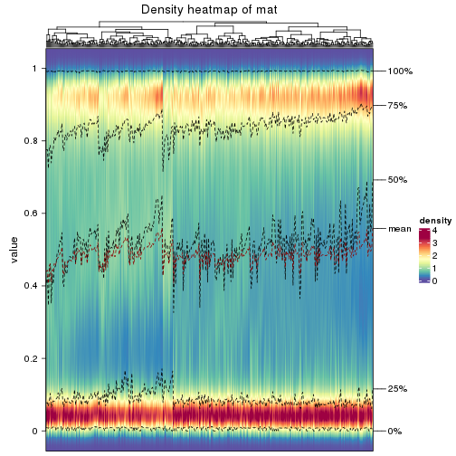


Some values about the hierarchy:


```r
all_nodes(res_rh)
```

```
#>  [1] "0"       "01"      "011"     "0111"    "01111"   "01112"   "01113"   "0112"    "01121"  
#> [10] "01122"   "01123"   "0113"    "01131"   "01132"   "011321"  "011322"  "0113221" "0113222"
#> [19] "0113223" "012"     "0121"    "01211"   "01212"   "01213"   "01214"   "0122"    "0123"   
#> [28] "013"     "0131"    "0132"    "0133"    "0134"    "014"     "0141"    "01411"   "01412"  
#> [37] "01413"   "01414"   "0142"    "0143"    "02"      "021"     "022"     "0221"    "0222"   
#> [46] "0223"    "0224"    "023"     "0231"    "02311"   "02312"   "02313"   "0232"    "0233"   
#> [55] "03"      "031"     "032"     "0321"    "0322"    "033"     "034"     "04"      "041"    
#> [64] "0411"    "0412"    "042"     "0421"    "0422"    "043"     "0431"    "0432"    "0433"   
#> [73] "0434"
```

```r
all_leaves(res_rh)
```

```
#>  [1] "01111"   "01112"   "01113"   "01121"   "01122"   "01123"   "01131"   "011321"  "0113221"
#> [10] "0113222" "0113223" "01211"   "01212"   "01213"   "01214"   "0122"    "0123"    "0131"   
#> [19] "0132"    "0133"    "0134"    "01411"   "01412"   "01413"   "01414"   "0142"    "0143"   
#> [28] "021"     "0221"    "0222"    "0223"    "0224"    "02311"   "02312"   "02313"   "0232"   
#> [37] "0233"    "031"     "0321"    "0322"    "033"     "034"     "0411"    "0412"    "0421"   
#> [46] "0422"    "0431"    "0432"    "0433"    "0434"
```

```r
node_info(res_rh)
```

```
#>         id best_method depth best_k n_columns n_signatures p_signatures is_leaf
#> 1        0 ATC:skmeans     1      4       337        36291     0.096547   FALSE
#> 2       01  ATC:kmeans     2      4       168        12210     0.032483   FALSE
#> 3      011  ATC:kmeans     3      3        89        12653     0.033661   FALSE
#> 4     0111 ATC:skmeans     4      3        25         5424     0.014430   FALSE
#> 5    01111 not applied     5     NA        11           NA           NA    TRUE
#> 6    01112 not applied     5     NA        11           NA           NA    TRUE
#> 7    01113 not applied     5     NA         3           NA           NA    TRUE
#> 8     0112  ATC:kmeans     4      3        25         5120     0.013621   FALSE
#> 9    01121 not applied     5     NA         7           NA           NA    TRUE
#> 10   01122 not applied     5     NA        10           NA           NA    TRUE
#> 11   01123 not applied     5     NA         8           NA           NA    TRUE
#> 12    0113  ATC:kmeans     4      2        39         2626     0.006986   FALSE
#> 13   01131  ATC:kmeans     5      2        15          456     0.001213    TRUE
#> 14   01132  ATC:kmeans     5      2        24         1638     0.004358   FALSE
#> 15  011321 not applied     6     NA         7           NA           NA    TRUE
#> 16  011322 ATC:skmeans     6      3        17         1432     0.003810   FALSE
#> 17 0113221 not applied     7     NA         2           NA           NA    TRUE
#> 18 0113222 not applied     7     NA        11           NA           NA    TRUE
#> 19 0113223 not applied     7     NA         4           NA           NA    TRUE
#> 20     012  ATC:kmeans     3      3        34        10155     0.027016   FALSE
#> 21    0121  ATC:kmeans     4      4        15         7771     0.020674   FALSE
#> 22   01211 not applied     5     NA         3           NA           NA    TRUE
#> 23   01212 not applied     5     NA         6           NA           NA    TRUE
#> 24   01213 not applied     5     NA         4           NA           NA    TRUE
#> 25   01214 not applied     5     NA         2           NA           NA    TRUE
#> 26    0122  ATC:kmeans     4      2        13          750     0.001995    TRUE
#> 27    0123 not applied     4     NA         6           NA           NA    TRUE
#> 28     013  ATC:kmeans     3      4        21        20760     0.055229   FALSE
#> 29    0131 not applied     4     NA         5           NA           NA    TRUE
#> 30    0132 not applied     4     NA         7           NA           NA    TRUE
#> 31    0133 not applied     4     NA         5           NA           NA    TRUE
#> 32    0134 not applied     4     NA         4           NA           NA    TRUE
#> 33     014 ATC:skmeans     3      3        24        18520     0.049270   FALSE
#> 34    0141 ATC:skmeans     4      4        12         1706     0.004539   FALSE
#> 35   01411 not applied     5     NA         2           NA           NA    TRUE
#> 36   01412 not applied     5     NA         6           NA           NA    TRUE
#> 37   01413 not applied     5     NA         2           NA           NA    TRUE
#> 38   01414 not applied     5     NA         2           NA           NA    TRUE
#> 39    0142 not applied     4     NA         6           NA           NA    TRUE
#> 40    0143 not applied     4     NA         6           NA           NA    TRUE
#> 41      02  ATC:kmeans     2      3        85         9292     0.024720   FALSE
#> 42     021 ATC:skmeans     3      2        22          572     0.001522    TRUE
#> 43     022 ATC:skmeans     3      4        26        20900     0.055601   FALSE
#> 44    0221 not applied     4     NA         8           NA           NA    TRUE
#> 45    0222 not applied     4     NA         8           NA           NA    TRUE
#> 46    0223 not applied     4     NA         3           NA           NA    TRUE
#> 47    0224 not applied     4     NA         7           NA           NA    TRUE
#> 48     023  ATC:kmeans     3      3        37         3587     0.009543   FALSE
#> 49    0231 ATC:skmeans     4      3        20         3261     0.008675   FALSE
#> 50   02311 not applied     5     NA        11           NA           NA    TRUE
#> 51   02312 not applied     5     NA         4           NA           NA    TRUE
#> 52   02313 not applied     5     NA         5           NA           NA    TRUE
#> 53    0232 not applied     4     NA        11           NA           NA    TRUE
#> 54    0233 not applied     4     NA         6           NA           NA    TRUE
#> 55      03 ATC:skmeans     2      4        41        13441     0.035758   FALSE
#> 56     031 not applied     3     NA        10           NA           NA    TRUE
#> 57     032   SD:kmeans     3      2        17         3848     0.010237   FALSE
#> 58    0321 not applied     4     NA         4           NA           NA    TRUE
#> 59    0322   SD:kmeans     4      2        13           68     0.000181    TRUE
#> 60     033 not applied     3     NA         3           NA           NA    TRUE
#> 61     034 not applied     3     NA        11           NA           NA    TRUE
#> 62      04  ATC:kmeans     2      3        43         8689     0.023116   FALSE
#> 63     041  ATC:kmeans     3      2        15         3096     0.008236   FALSE
#> 64    0411 not applied     4     NA         8           NA           NA    TRUE
#> 65    0412 not applied     4     NA         7           NA           NA    TRUE
#> 66     042 ATC:skmeans     3      2        12         2229     0.005930   FALSE
#> 67    0421 not applied     4     NA         5           NA           NA    TRUE
#> 68    0422 not applied     4     NA         7           NA           NA    TRUE
#> 69     043   SD:kmeans     3      4        16         3059     0.008138   FALSE
#> 70    0431 not applied     4     NA         6           NA           NA    TRUE
#> 71    0432 not applied     4     NA         6           NA           NA    TRUE
#> 72    0433 not applied     4     NA         2           NA           NA    TRUE
#> 73    0434 not applied     4     NA         2           NA           NA    TRUE
```

In the output from `node_info()`, there are the following columns:

- `id`: The node id.
- `best_method`: The best method selected.
- `depth`: Depth of the node in the hierarchy.
- `best_k`: Best number of groups of the partition on that node.
- `n_columns`: Number of columns in the submatrix.
- `n_signatures`: Number of signatures with the `best_k`.
- `p_signatures`: Proportion of hte signatures in total number of rows in the matrix.
- `is_leaf`: Whether the node is a leaf.

Labels of nodes are encoded in a special way. The number of digits
correspond to the depth of the node in the hierarchy and the value of the
digits correspond to the index of the subgroup in the current node, E.g. a label
of “012” means the node is the second subgroup of the partition which is the
first subgroup of the root node.

### Suggest the best k


Following table shows the best `k` (number of partitions) for each node in the
partition hierarchy. Clicking on the node name in the table goes to the
corresponding section for the partitioning on that node.

[The cola vignette](https://jokergoo.github.io/cola_vignettes/cola.html#toc_13)
explains the definition of the metrics used for determining the best
number of partitions.


```r
suggest_best_k(res_rh)
```


|Node                      |Best method                                         |Is leaf   |Best k |1-PAC |Mean silhouette |Concordance | #samples|   |
|:-------------------------|:---------------------------------------------------|:---------|:------|:-----|:---------------|:-----------|--------:|:--|
|[Node0](#Node0)           |ATC:skmeans                                         |          |5      |0.99  |0.94            |0.98        |      337|** |
|[Node01](#Node01)         |ATC:kmeans                                          |          |4      |1.00  |0.99            |0.99        |      168|** |
|[Node011](#Node011)       |ATC:kmeans                                          |          |3      |0.99  |0.96            |0.98        |       89|** |
|[Node0111](#Node0111)     |ATC:skmeans                                         |          |3      |1.00  |0.98            |0.99        |       25|** |
|Node01111-leaf            |<span style='color:grey;'><i>not applied</i></span> |✓ (b)     |       |      |                |            |       11|   |
|Node01112-leaf            |<span style='color:grey;'><i>not applied</i></span> |✓ (b)     |       |      |                |            |       11|   |
|Node01113-leaf            |<span style='color:grey;'><i>not applied</i></span> |✓ (b)     |       |      |                |            |        3|   |
|[Node0112](#Node0112)     |ATC:kmeans                                          |          |2      |1.00  |1.00            |1.00        |       25|** |
|Node01121-leaf            |<span style='color:grey;'><i>not applied</i></span> |✓ (b)     |       |      |                |            |        7|   |
|Node01122-leaf            |<span style='color:grey;'><i>not applied</i></span> |✓ (b)     |       |      |                |            |       10|   |
|Node01123-leaf            |<span style='color:grey;'><i>not applied</i></span> |✓ (b)     |       |      |                |            |        8|   |
|[Node0113](#Node0113)     |ATC:kmeans                                          |          |2      |1.00  |1.00            |1.00        |       39|** |
|Node01131-leaf            |ATC:kmeans                                          |✓ (&#99;) |8      |0.91  |0.30            |0.80        |       15|*  |
|[Node01132](#Node01132)   |ATC:kmeans                                          |          |3      |0.94  |0.91            |0.96        |       24|*  |
|Node011321-leaf           |<span style='color:grey;'><i>not applied</i></span> |✓ (b)     |       |      |                |            |        7|   |
|[Node011322](#Node011322) |ATC:skmeans                                         |          |3      |1.00  |0.99            |1.00        |       17|** |
|Node0113221-leaf          |<span style='color:grey;'><i>not applied</i></span> |✓ (b)     |       |      |                |            |        2|   |
|Node0113222-leaf          |<span style='color:grey;'><i>not applied</i></span> |✓ (b)     |       |      |                |            |       11|   |
|Node0113223-leaf          |<span style='color:grey;'><i>not applied</i></span> |✓ (b)     |       |      |                |            |        4|   |
|[Node012](#Node012)       |ATC:kmeans                                          |          |3      |1.00  |0.98            |0.99        |       34|** |
|[Node0121](#Node0121)     |ATC:kmeans                                          |          |3      |1.00  |1.00            |0.99        |       15|** |
|Node01211-leaf            |<span style='color:grey;'><i>not applied</i></span> |✓ (b)     |       |      |                |            |        3|   |
|Node01212-leaf            |<span style='color:grey;'><i>not applied</i></span> |✓ (b)     |       |      |                |            |        6|   |
|Node01213-leaf            |<span style='color:grey;'><i>not applied</i></span> |✓ (b)     |       |      |                |            |        4|   |
|Node01214-leaf            |<span style='color:grey;'><i>not applied</i></span> |✓ (b)     |       |      |                |            |        2|   |
|Node0122-leaf             |ATC:kmeans                                          |✓ (&#99;) |2      |1.00  |1.00            |1.00        |       13|** |
|Node0123-leaf             |<span style='color:grey;'><i>not applied</i></span> |✓ (b)     |       |      |                |            |        6|   |
|[Node013](#Node013)       |ATC:kmeans                                          |          |2      |0.82  |0.96            |0.98        |       21|   |
|Node0131-leaf             |<span style='color:grey;'><i>not applied</i></span> |✓ (b)     |       |      |                |            |        5|   |
|Node0132-leaf             |<span style='color:grey;'><i>not applied</i></span> |✓ (b)     |       |      |                |            |        7|   |
|Node0133-leaf             |<span style='color:grey;'><i>not applied</i></span> |✓ (b)     |       |      |                |            |        5|   |
|Node0134-leaf             |<span style='color:grey;'><i>not applied</i></span> |✓ (b)     |       |      |                |            |        4|   |
|[Node014](#Node014)       |ATC:skmeans                                         |          |3      |1.00  |0.95            |0.98        |       24|** |
|[Node0141](#Node0141)     |ATC:skmeans                                         |          |5      |0.91  |0.80            |0.96        |       12|*  |
|Node01411-leaf            |<span style='color:grey;'><i>not applied</i></span> |✓ (b)     |       |      |                |            |        2|   |
|Node01412-leaf            |<span style='color:grey;'><i>not applied</i></span> |✓ (b)     |       |      |                |            |        6|   |
|Node01413-leaf            |<span style='color:grey;'><i>not applied</i></span> |✓ (b)     |       |      |                |            |        2|   |
|Node01414-leaf            |<span style='color:grey;'><i>not applied</i></span> |✓ (b)     |       |      |                |            |        2|   |
|Node0142-leaf             |<span style='color:grey;'><i>not applied</i></span> |✓ (b)     |       |      |                |            |        6|   |
|Node0143-leaf             |<span style='color:grey;'><i>not applied</i></span> |✓ (b)     |       |      |                |            |        6|   |
|[Node02](#Node02)         |ATC:kmeans                                          |          |3      |1.00  |0.98            |0.99        |       85|** |
|Node021-leaf              |ATC:skmeans                                         |✓ (&#99;) |3      |1.00  |0.92            |0.96        |       22|** |
|[Node022](#Node022)       |ATC:skmeans                                         |          |5      |0.95  |0.89            |0.96        |       26|** |
|Node0221-leaf             |<span style='color:grey;'><i>not applied</i></span> |✓ (b)     |       |      |                |            |        8|   |
|Node0222-leaf             |<span style='color:grey;'><i>not applied</i></span> |✓ (b)     |       |      |                |            |        8|   |
|Node0223-leaf             |<span style='color:grey;'><i>not applied</i></span> |✓ (b)     |       |      |                |            |        3|   |
|Node0224-leaf             |<span style='color:grey;'><i>not applied</i></span> |✓ (b)     |       |      |                |            |        7|   |
|[Node023](#Node023)       |ATC:kmeans                                          |          |3      |1.00  |0.97            |0.98        |       37|** |
|[Node0231](#Node0231)     |ATC:skmeans                                         |          |3      |0.99  |0.98            |0.99        |       20|** |
|Node02311-leaf            |<span style='color:grey;'><i>not applied</i></span> |✓ (b)     |       |      |                |            |       11|   |
|Node02312-leaf            |<span style='color:grey;'><i>not applied</i></span> |✓ (b)     |       |      |                |            |        4|   |
|Node02313-leaf            |<span style='color:grey;'><i>not applied</i></span> |✓ (b)     |       |      |                |            |        5|   |
|Node0232-leaf             |<span style='color:grey;'><i>not applied</i></span> |✓ (b)     |       |      |                |            |       11|   |
|Node0233-leaf             |<span style='color:grey;'><i>not applied</i></span> |✓ (b)     |       |      |                |            |        6|   |
|[Node03](#Node03)         |ATC:skmeans                                         |          |4      |1.00  |1.00            |1.00        |       41|** |
|Node031-leaf              |<span style='color:grey;'><i>not applied</i></span> |✓ (b)     |       |      |                |            |       10|   |
|[Node032](#Node032)       |SD:kmeans                                           |          |2      |1.00  |1.00            |1.00        |       17|** |
|Node0321-leaf             |<span style='color:grey;'><i>not applied</i></span> |✓ (b)     |       |      |                |            |        4|   |
|Node0322-leaf             |SD:kmeans                                           |✓ (&#99;) |2      |0.46  |0.97            |0.93        |       13|   |
|Node033-leaf              |<span style='color:grey;'><i>not applied</i></span> |✓ (b)     |       |      |                |            |        3|   |
|Node034-leaf              |<span style='color:grey;'><i>not applied</i></span> |✓ (b)     |       |      |                |            |       11|   |
|[Node04](#Node04)         |ATC:kmeans                                          |          |3      |1.00  |0.99            |1.00        |       43|** |
|[Node041](#Node041)       |ATC:kmeans                                          |          |2      |1.00  |1.00            |1.00        |       15|** |
|Node0411-leaf             |<span style='color:grey;'><i>not applied</i></span> |✓ (b)     |       |      |                |            |        8|   |
|Node0412-leaf             |<span style='color:grey;'><i>not applied</i></span> |✓ (b)     |       |      |                |            |        7|   |
|[Node042](#Node042)       |ATC:skmeans                                         |          |7      |0.94  |0.61            |0.96        |       12|*  |
|Node0421-leaf             |<span style='color:grey;'><i>not applied</i></span> |✓ (b)     |       |      |                |            |        5|   |
|Node0422-leaf             |<span style='color:grey;'><i>not applied</i></span> |✓ (b)     |       |      |                |            |        7|   |
|[Node043](#Node043)       |SD:kmeans                                           |          |4      |0.89  |0.97            |0.96        |       16|   |
|Node0431-leaf             |<span style='color:grey;'><i>not applied</i></span> |✓ (b)     |       |      |                |            |        6|   |
|Node0432-leaf             |<span style='color:grey;'><i>not applied</i></span> |✓ (b)     |       |      |                |            |        6|   |
|Node0433-leaf             |<span style='color:grey;'><i>not applied</i></span> |✓ (b)     |       |      |                |            |        2|   |
|Node0434-leaf             |<span style='color:grey;'><i>not applied</i></span> |✓ (b)     |       |      |                |            |        2|   |


Stop reason: b) Subgroup had too few columns. c) There were too few signatures. 

\*\*: 1-PAC > 0.95, \*: 1-PAC > 0.9


### Partition hierarchy

The nodes of the hierarchy can be merged by setting the `merge_node` parameters. Here we 
control the hierarchy with the `min_n_signatures` parameter. The value of `min_n_signatures` is
from `node_info()`.


<style type='text/css'>


.ui-helper-hidden {
	display: none;
}
.ui-helper-hidden-accessible {
	border: 0;
	clip: rect(0 0 0 0);
	height: 1px;
	margin: -1px;
	overflow: hidden;
	padding: 0;
	position: absolute;
	width: 1px;
}
.ui-helper-reset {
	margin: 0;
	padding: 0;
	border: 0;
	outline: 0;
	line-height: 1.3;
	text-decoration: none;
	font-size: 100%;
	list-style: none;
}
.ui-helper-clearfix:before,
.ui-helper-clearfix:after {
	content: "";
	display: table;
	border-collapse: collapse;
}
.ui-helper-clearfix:after {
	clear: both;
}
.ui-helper-zfix {
	width: 100%;
	height: 100%;
	top: 0;
	left: 0;
	position: absolute;
	opacity: 0;
	filter:Alpha(Opacity=0); 
}

.ui-front {
	z-index: 100;
}


.ui-state-disabled {
	cursor: default !important;
	pointer-events: none;
}


.ui-icon {
	display: inline-block;
	vertical-align: middle;
	margin-top: -.25em;
	position: relative;
	text-indent: -99999px;
	overflow: hidden;
	background-repeat: no-repeat;
}

.ui-widget-icon-block {
	left: 50%;
	margin-left: -8px;
	display: block;
}


.ui-widget-overlay {
	position: fixed;
	top: 0;
	left: 0;
	width: 100%;
	height: 100%;
}
.ui-accordion .ui-accordion-header {
	display: block;
	cursor: pointer;
	position: relative;
	margin: 2px 0 0 0;
	padding: .5em .5em .5em .7em;
	font-size: 100%;
}
.ui-accordion .ui-accordion-content {
	padding: 1em 2.2em;
	border-top: 0;
	overflow: auto;
}
.ui-autocomplete {
	position: absolute;
	top: 0;
	left: 0;
	cursor: default;
}
.ui-menu {
	list-style: none;
	padding: 0;
	margin: 0;
	display: block;
	outline: 0;
}
.ui-menu .ui-menu {
	position: absolute;
}
.ui-menu .ui-menu-item {
	margin: 0;
	cursor: pointer;
	
	list-style-image: url("data:image/gif;base64,R0lGODlhAQABAIAAAAAAAP///yH5BAEAAAAALAAAAAABAAEAAAIBRAA7");
}
.ui-menu .ui-menu-item-wrapper {
	position: relative;
	padding: 3px 1em 3px .4em;
}
.ui-menu .ui-menu-divider {
	margin: 5px 0;
	height: 0;
	font-size: 0;
	line-height: 0;
	border-width: 1px 0 0 0;
}
.ui-menu .ui-state-focus,
.ui-menu .ui-state-active {
	margin: -1px;
}


.ui-menu-icons {
	position: relative;
}
.ui-menu-icons .ui-menu-item-wrapper {
	padding-left: 2em;
}


.ui-menu .ui-icon {
	position: absolute;
	top: 0;
	bottom: 0;
	left: .2em;
	margin: auto 0;
}


.ui-menu .ui-menu-icon {
	left: auto;
	right: 0;
}
.ui-button {
	padding: .4em 1em;
	display: inline-block;
	position: relative;
	line-height: normal;
	margin-right: .1em;
	cursor: pointer;
	vertical-align: middle;
	text-align: center;
	-webkit-user-select: none;
	-moz-user-select: none;
	-ms-user-select: none;
	user-select: none;

	
	overflow: visible;
}

.ui-button,
.ui-button:link,
.ui-button:visited,
.ui-button:hover,
.ui-button:active {
	text-decoration: none;
}


.ui-button-icon-only {
	width: 2em;
	box-sizing: border-box;
	text-indent: -9999px;
	white-space: nowrap;
}


input.ui-button.ui-button-icon-only {
	text-indent: 0;
}


.ui-button-icon-only .ui-icon {
	position: absolute;
	top: 50%;
	left: 50%;
	margin-top: -8px;
	margin-left: -8px;
}

.ui-button.ui-icon-notext .ui-icon {
	padding: 0;
	width: 2.1em;
	height: 2.1em;
	text-indent: -9999px;
	white-space: nowrap;

}

input.ui-button.ui-icon-notext .ui-icon {
	width: auto;
	height: auto;
	text-indent: 0;
	white-space: normal;
	padding: .4em 1em;
}


input.ui-button::-moz-focus-inner,
button.ui-button::-moz-focus-inner {
	border: 0;
	padding: 0;
}
.ui-controlgroup {
	vertical-align: middle;
	display: inline-block;
}
.ui-controlgroup > .ui-controlgroup-item {
	float: left;
	margin-left: 0;
	margin-right: 0;
}
.ui-controlgroup > .ui-controlgroup-item:focus,
.ui-controlgroup > .ui-controlgroup-item.ui-visual-focus {
	z-index: 9999;
}
.ui-controlgroup-vertical > .ui-controlgroup-item {
	display: block;
	float: none;
	width: 100%;
	margin-top: 0;
	margin-bottom: 0;
	text-align: left;
}
.ui-controlgroup-vertical .ui-controlgroup-item {
	box-sizing: border-box;
}
.ui-controlgroup .ui-controlgroup-label {
	padding: .4em 1em;
}
.ui-controlgroup .ui-controlgroup-label span {
	font-size: 80%;
}
.ui-controlgroup-horizontal .ui-controlgroup-label + .ui-controlgroup-item {
	border-left: none;
}
.ui-controlgroup-vertical .ui-controlgroup-label + .ui-controlgroup-item {
	border-top: none;
}
.ui-controlgroup-horizontal .ui-controlgroup-label.ui-widget-content {
	border-right: none;
}
.ui-controlgroup-vertical .ui-controlgroup-label.ui-widget-content {
	border-bottom: none;
}


.ui-controlgroup-vertical .ui-spinner-input {

	
	width: 75%;
	width: calc( 100% - 2.4em );
}
.ui-controlgroup-vertical .ui-spinner .ui-spinner-up {
	border-top-style: solid;
}

.ui-checkboxradio-label .ui-icon-background {
	box-shadow: inset 1px 1px 1px #ccc;
	border-radius: .12em;
	border: none;
}
.ui-checkboxradio-radio-label .ui-icon-background {
	width: 16px;
	height: 16px;
	border-radius: 1em;
	overflow: visible;
	border: none;
}
.ui-checkboxradio-radio-label.ui-checkboxradio-checked .ui-icon,
.ui-checkboxradio-radio-label.ui-checkboxradio-checked:hover .ui-icon {
	background-image: none;
	width: 8px;
	height: 8px;
	border-width: 4px;
	border-style: solid;
}
.ui-checkboxradio-disabled {
	pointer-events: none;
}
.ui-datepicker {
	width: 17em;
	padding: .2em .2em 0;
	display: none;
}
.ui-datepicker .ui-datepicker-header {
	position: relative;
	padding: .2em 0;
}
.ui-datepicker .ui-datepicker-prev,
.ui-datepicker .ui-datepicker-next {
	position: absolute;
	top: 2px;
	width: 1.8em;
	height: 1.8em;
}
.ui-datepicker .ui-datepicker-prev-hover,
.ui-datepicker .ui-datepicker-next-hover {
	top: 1px;
}
.ui-datepicker .ui-datepicker-prev {
	left: 2px;
}
.ui-datepicker .ui-datepicker-next {
	right: 2px;
}
.ui-datepicker .ui-datepicker-prev-hover {
	left: 1px;
}
.ui-datepicker .ui-datepicker-next-hover {
	right: 1px;
}
.ui-datepicker .ui-datepicker-prev span,
.ui-datepicker .ui-datepicker-next span {
	display: block;
	position: absolute;
	left: 50%;
	margin-left: -8px;
	top: 50%;
	margin-top: -8px;
}
.ui-datepicker .ui-datepicker-title {
	margin: 0 2.3em;
	line-height: 1.8em;
	text-align: center;
}
.ui-datepicker .ui-datepicker-title select {
	font-size: 1em;
	margin: 1px 0;
}
.ui-datepicker select.ui-datepicker-month,
.ui-datepicker select.ui-datepicker-year {
	width: 45%;
}
.ui-datepicker table {
	width: 100%;
	font-size: .9em;
	border-collapse: collapse;
	margin: 0 0 .4em;
}
.ui-datepicker th {
	padding: .7em .3em;
	text-align: center;
	font-weight: bold;
	border: 0;
}
.ui-datepicker td {
	border: 0;
	padding: 1px;
}
.ui-datepicker td span,
.ui-datepicker td a {
	display: block;
	padding: .2em;
	text-align: right;
	text-decoration: none;
}
.ui-datepicker .ui-datepicker-buttonpane {
	background-image: none;
	margin: .7em 0 0 0;
	padding: 0 .2em;
	border-left: 0;
	border-right: 0;
	border-bottom: 0;
}
.ui-datepicker .ui-datepicker-buttonpane button {
	float: right;
	margin: .5em .2em .4em;
	cursor: pointer;
	padding: .2em .6em .3em .6em;
	width: auto;
	overflow: visible;
}
.ui-datepicker .ui-datepicker-buttonpane button.ui-datepicker-current {
	float: left;
}


.ui-datepicker.ui-datepicker-multi {
	width: auto;
}
.ui-datepicker-multi .ui-datepicker-group {
	float: left;
}
.ui-datepicker-multi .ui-datepicker-group table {
	width: 95%;
	margin: 0 auto .4em;
}
.ui-datepicker-multi-2 .ui-datepicker-group {
	width: 50%;
}
.ui-datepicker-multi-3 .ui-datepicker-group {
	width: 33.3%;
}
.ui-datepicker-multi-4 .ui-datepicker-group {
	width: 25%;
}
.ui-datepicker-multi .ui-datepicker-group-last .ui-datepicker-header,
.ui-datepicker-multi .ui-datepicker-group-middle .ui-datepicker-header {
	border-left-width: 0;
}
.ui-datepicker-multi .ui-datepicker-buttonpane {
	clear: left;
}
.ui-datepicker-row-break {
	clear: both;
	width: 100%;
	font-size: 0;
}


.ui-datepicker-rtl {
	direction: rtl;
}
.ui-datepicker-rtl .ui-datepicker-prev {
	right: 2px;
	left: auto;
}
.ui-datepicker-rtl .ui-datepicker-next {
	left: 2px;
	right: auto;
}
.ui-datepicker-rtl .ui-datepicker-prev:hover {
	right: 1px;
	left: auto;
}
.ui-datepicker-rtl .ui-datepicker-next:hover {
	left: 1px;
	right: auto;
}
.ui-datepicker-rtl .ui-datepicker-buttonpane {
	clear: right;
}
.ui-datepicker-rtl .ui-datepicker-buttonpane button {
	float: left;
}
.ui-datepicker-rtl .ui-datepicker-buttonpane button.ui-datepicker-current,
.ui-datepicker-rtl .ui-datepicker-group {
	float: right;
}
.ui-datepicker-rtl .ui-datepicker-group-last .ui-datepicker-header,
.ui-datepicker-rtl .ui-datepicker-group-middle .ui-datepicker-header {
	border-right-width: 0;
	border-left-width: 1px;
}


.ui-datepicker .ui-icon {
	display: block;
	text-indent: -99999px;
	overflow: hidden;
	background-repeat: no-repeat;
	left: .5em;
	top: .3em;
}
.ui-dialog {
	position: absolute;
	top: 0;
	left: 0;
	padding: .2em;
	outline: 0;
}
.ui-dialog .ui-dialog-titlebar {
	padding: .4em 1em;
	position: relative;
}
.ui-dialog .ui-dialog-title {
	float: left;
	margin: .1em 0;
	white-space: nowrap;
	width: 90%;
	overflow: hidden;
	text-overflow: ellipsis;
}
.ui-dialog .ui-dialog-titlebar-close {
	position: absolute;
	right: .3em;
	top: 50%;
	width: 20px;
	margin: -10px 0 0 0;
	padding: 1px;
	height: 20px;
}
.ui-dialog .ui-dialog-content {
	position: relative;
	border: 0;
	padding: .5em 1em;
	background: none;
	overflow: auto;
}
.ui-dialog .ui-dialog-buttonpane {
	text-align: left;
	border-width: 1px 0 0 0;
	background-image: none;
	margin-top: .5em;
	padding: .3em 1em .5em .4em;
}
.ui-dialog .ui-dialog-buttonpane .ui-dialog-buttonset {
	float: right;
}
.ui-dialog .ui-dialog-buttonpane button {
	margin: .5em .4em .5em 0;
	cursor: pointer;
}
.ui-dialog .ui-resizable-n {
	height: 2px;
	top: 0;
}
.ui-dialog .ui-resizable-e {
	width: 2px;
	right: 0;
}
.ui-dialog .ui-resizable-s {
	height: 2px;
	bottom: 0;
}
.ui-dialog .ui-resizable-w {
	width: 2px;
	left: 0;
}
.ui-dialog .ui-resizable-se,
.ui-dialog .ui-resizable-sw,
.ui-dialog .ui-resizable-ne,
.ui-dialog .ui-resizable-nw {
	width: 7px;
	height: 7px;
}
.ui-dialog .ui-resizable-se {
	right: 0;
	bottom: 0;
}
.ui-dialog .ui-resizable-sw {
	left: 0;
	bottom: 0;
}
.ui-dialog .ui-resizable-ne {
	right: 0;
	top: 0;
}
.ui-dialog .ui-resizable-nw {
	left: 0;
	top: 0;
}
.ui-draggable .ui-dialog-titlebar {
	cursor: move;
}
.ui-draggable-handle {
	-ms-touch-action: none;
	touch-action: none;
}
.ui-resizable {
	position: relative;
}
.ui-resizable-handle {
	position: absolute;
	font-size: 0.1px;
	display: block;
	-ms-touch-action: none;
	touch-action: none;
}
.ui-resizable-disabled .ui-resizable-handle,
.ui-resizable-autohide .ui-resizable-handle {
	display: none;
}
.ui-resizable-n {
	cursor: n-resize;
	height: 7px;
	width: 100%;
	top: -5px;
	left: 0;
}
.ui-resizable-s {
	cursor: s-resize;
	height: 7px;
	width: 100%;
	bottom: -5px;
	left: 0;
}
.ui-resizable-e {
	cursor: e-resize;
	width: 7px;
	right: -5px;
	top: 0;
	height: 100%;
}
.ui-resizable-w {
	cursor: w-resize;
	width: 7px;
	left: -5px;
	top: 0;
	height: 100%;
}
.ui-resizable-se {
	cursor: se-resize;
	width: 12px;
	height: 12px;
	right: 1px;
	bottom: 1px;
}
.ui-resizable-sw {
	cursor: sw-resize;
	width: 9px;
	height: 9px;
	left: -5px;
	bottom: -5px;
}
.ui-resizable-nw {
	cursor: nw-resize;
	width: 9px;
	height: 9px;
	left: -5px;
	top: -5px;
}
.ui-resizable-ne {
	cursor: ne-resize;
	width: 9px;
	height: 9px;
	right: -5px;
	top: -5px;
}
.ui-progressbar {
	height: 2em;
	text-align: left;
	overflow: hidden;
}
.ui-progressbar .ui-progressbar-value {
	margin: -1px;
	height: 100%;
}
.ui-progressbar .ui-progressbar-overlay {
	background: url("");
	height: 100%;
	filter: alpha(opacity=25); 
	opacity: 0.25;
}
.ui-progressbar-indeterminate .ui-progressbar-value {
	background-image: none;
}
.ui-selectable {
	-ms-touch-action: none;
	touch-action: none;
}
.ui-selectable-helper {
	position: absolute;
	z-index: 100;
	border: 1px dotted black;
}
.ui-selectmenu-menu {
	padding: 0;
	margin: 0;
	position: absolute;
	top: 0;
	left: 0;
	display: none;
}
.ui-selectmenu-menu .ui-menu {
	overflow: auto;
	overflow-x: hidden;
	padding-bottom: 1px;
}
.ui-selectmenu-menu .ui-menu .ui-selectmenu-optgroup {
	font-size: 1em;
	font-weight: bold;
	line-height: 1.5;
	padding: 2px 0.4em;
	margin: 0.5em 0 0 0;
	height: auto;
	border: 0;
}
.ui-selectmenu-open {
	display: block;
}
.ui-selectmenu-text {
	display: block;
	margin-right: 20px;
	overflow: hidden;
	text-overflow: ellipsis;
}
.ui-selectmenu-button.ui-button {
	text-align: left;
	white-space: nowrap;
	width: 14em;
}
.ui-selectmenu-icon.ui-icon {
	float: right;
	margin-top: 0;
}
.ui-slider {
	position: relative;
	text-align: left;
}
.ui-slider .ui-slider-handle {
	position: absolute;
	z-index: 2;
	width: 1.2em;
	height: 1.2em;
	cursor: default;
	-ms-touch-action: none;
	touch-action: none;
}
.ui-slider .ui-slider-range {
	position: absolute;
	z-index: 1;
	font-size: .7em;
	display: block;
	border: 0;
	background-position: 0 0;
}


.ui-slider.ui-state-disabled .ui-slider-handle,
.ui-slider.ui-state-disabled .ui-slider-range {
	filter: inherit;
}

.ui-slider-horizontal {
	height: .8em;
}
.ui-slider-horizontal .ui-slider-handle {
	top: -.3em;
	margin-left: -.6em;
}
.ui-slider-horizontal .ui-slider-range {
	top: 0;
	height: 100%;
}
.ui-slider-horizontal .ui-slider-range-min {
	left: 0;
}
.ui-slider-horizontal .ui-slider-range-max {
	right: 0;
}

.ui-slider-vertical {
	width: .8em;
	height: 100px;
}
.ui-slider-vertical .ui-slider-handle {
	left: -.3em;
	margin-left: 0;
	margin-bottom: -.6em;
}
.ui-slider-vertical .ui-slider-range {
	left: 0;
	width: 100%;
}
.ui-slider-vertical .ui-slider-range-min {
	bottom: 0;
}
.ui-slider-vertical .ui-slider-range-max {
	top: 0;
}
.ui-sortable-handle {
	-ms-touch-action: none;
	touch-action: none;
}
.ui-spinner {
	position: relative;
	display: inline-block;
	overflow: hidden;
	padding: 0;
	vertical-align: middle;
}
.ui-spinner-input {
	border: none;
	background: none;
	color: inherit;
	padding: .222em 0;
	margin: .2em 0;
	vertical-align: middle;
	margin-left: .4em;
	margin-right: 2em;
}
.ui-spinner-button {
	width: 1.6em;
	height: 50%;
	font-size: .5em;
	padding: 0;
	margin: 0;
	text-align: center;
	position: absolute;
	cursor: default;
	display: block;
	overflow: hidden;
	right: 0;
}

.ui-spinner a.ui-spinner-button {
	border-top-style: none;
	border-bottom-style: none;
	border-right-style: none;
}
.ui-spinner-up {
	top: 0;
}
.ui-spinner-down {
	bottom: 0;
}
.ui-tabs {
	position: relative;
	padding: .2em;
}
.ui-tabs .ui-tabs-nav {
	margin: 0;
	padding: .2em .2em 0;
}
.ui-tabs .ui-tabs-nav li {
	list-style: none;
	float: left;
	position: relative;
	top: 0;
	margin: 1px .2em 0 0;
	border-bottom-width: 0;
	padding: 0;
	white-space: nowrap;
}
.ui-tabs .ui-tabs-nav .ui-tabs-anchor {
	float: left;
	padding: .5em 1em;
	text-decoration: none;
}
.ui-tabs .ui-tabs-nav li.ui-tabs-active {
	margin-bottom: -1px;
	padding-bottom: 1px;
}
.ui-tabs .ui-tabs-nav li.ui-tabs-active .ui-tabs-anchor,
.ui-tabs .ui-tabs-nav li.ui-state-disabled .ui-tabs-anchor,
.ui-tabs .ui-tabs-nav li.ui-tabs-loading .ui-tabs-anchor {
	cursor: text;
}
.ui-tabs-collapsible .ui-tabs-nav li.ui-tabs-active .ui-tabs-anchor {
	cursor: pointer;
}
.ui-tabs .ui-tabs-panel {
	display: block;
	border-width: 0;
	padding: 1em 1.4em;
	background: none;
}
.ui-tooltip {
	padding: 8px;
	position: absolute;
	z-index: 9999;
	max-width: 300px;
}
body .ui-tooltip {
	border-width: 2px;
}

.ui-widget {
	font-family: Arial,Helvetica,sans-serif;
	font-size: 1em;
}
.ui-widget .ui-widget {
	font-size: 1em;
}
.ui-widget input,
.ui-widget select,
.ui-widget textarea,
.ui-widget button {
	font-family: Arial,Helvetica,sans-serif;
	font-size: 1em;
}
.ui-widget.ui-widget-content {
	border: 1px solid #c5c5c5;
}
.ui-widget-content {
	border: 1px solid #dddddd;
	background: #ffffff;
	color: #333333;
}
.ui-widget-content a {
	color: #333333;
}
.ui-widget-header {
	border: 1px solid #dddddd;
	background: #e9e9e9;
	color: #333333;
	font-weight: bold;
}
.ui-widget-header a {
	color: #333333;
}


.ui-state-default,
.ui-widget-content .ui-state-default,
.ui-widget-header .ui-state-default,
.ui-button,


html .ui-button.ui-state-disabled:hover,
html .ui-button.ui-state-disabled:active {
	border: 1px solid #c5c5c5;
	background: #f6f6f6;
	font-weight: normal;
	color: #454545;
}
.ui-state-default a,
.ui-state-default a:link,
.ui-state-default a:visited,
a.ui-button,
a:link.ui-button,
a:visited.ui-button,
.ui-button {
	color: #454545;
	text-decoration: none;
}
.ui-state-hover,
.ui-widget-content .ui-state-hover,
.ui-widget-header .ui-state-hover,
.ui-state-focus,
.ui-widget-content .ui-state-focus,
.ui-widget-header .ui-state-focus,
.ui-button:hover,
.ui-button:focus {
	border: 1px solid #cccccc;
	background: #ededed;
	font-weight: normal;
	color: #2b2b2b;
}
.ui-state-hover a,
.ui-state-hover a:hover,
.ui-state-hover a:link,
.ui-state-hover a:visited,
.ui-state-focus a,
.ui-state-focus a:hover,
.ui-state-focus a:link,
.ui-state-focus a:visited,
a.ui-button:hover,
a.ui-button:focus {
	color: #2b2b2b;
	text-decoration: none;
}

.ui-visual-focus {
	box-shadow: 0 0 3px 1px rgb(94, 158, 214);
}
.ui-state-active,
.ui-widget-content .ui-state-active,
.ui-widget-header .ui-state-active,
a.ui-button:active,
.ui-button:active,
.ui-button.ui-state-active:hover {
	border: 1px solid #003eff;
	background: #007fff;
	font-weight: normal;
	color: #ffffff;
}
.ui-icon-background,
.ui-state-active .ui-icon-background {
	border: #003eff;
	background-color: #ffffff;
}
.ui-state-active a,
.ui-state-active a:link,
.ui-state-active a:visited {
	color: #ffffff;
	text-decoration: none;
}


.ui-state-highlight,
.ui-widget-content .ui-state-highlight,
.ui-widget-header .ui-state-highlight {
	border: 1px solid #dad55e;
	background: #fffa90;
	color: #777620;
}
.ui-state-checked {
	border: 1px solid #dad55e;
	background: #fffa90;
}
.ui-state-highlight a,
.ui-widget-content .ui-state-highlight a,
.ui-widget-header .ui-state-highlight a {
	color: #777620;
}
.ui-state-error,
.ui-widget-content .ui-state-error,
.ui-widget-header .ui-state-error {
	border: 1px solid #f1a899;
	background: #fddfdf;
	color: #5f3f3f;
}
.ui-state-error a,
.ui-widget-content .ui-state-error a,
.ui-widget-header .ui-state-error a {
	color: #5f3f3f;
}
.ui-state-error-text,
.ui-widget-content .ui-state-error-text,
.ui-widget-header .ui-state-error-text {
	color: #5f3f3f;
}
.ui-priority-primary,
.ui-widget-content .ui-priority-primary,
.ui-widget-header .ui-priority-primary {
	font-weight: bold;
}
.ui-priority-secondary,
.ui-widget-content .ui-priority-secondary,
.ui-widget-header .ui-priority-secondary {
	opacity: .7;
	filter:Alpha(Opacity=70); 
	font-weight: normal;
}
.ui-state-disabled,
.ui-widget-content .ui-state-disabled,
.ui-widget-header .ui-state-disabled {
	opacity: .35;
	filter:Alpha(Opacity=35); 
	background-image: none;
}
.ui-state-disabled .ui-icon {
	filter:Alpha(Opacity=35); 
}


.ui-icon {
	width: 16px;
	height: 16px;
}
.ui-icon,
.ui-widget-content .ui-icon {
	background-image: url("images/ui-icons_444444_256x240.png");
}
.ui-widget-header .ui-icon {
	background-image: url("images/ui-icons_444444_256x240.png");
}
.ui-state-hover .ui-icon,
.ui-state-focus .ui-icon,
.ui-button:hover .ui-icon,
.ui-button:focus .ui-icon {
	background-image: url("images/ui-icons_555555_256x240.png");
}
.ui-state-active .ui-icon,
.ui-button:active .ui-icon {
	background-image: url("images/ui-icons_ffffff_256x240.png");
}
.ui-state-highlight .ui-icon,
.ui-button .ui-state-highlight.ui-icon {
	background-image: url("images/ui-icons_777620_256x240.png");
}
.ui-state-error .ui-icon,
.ui-state-error-text .ui-icon {
	background-image: url("images/ui-icons_cc0000_256x240.png");
}
.ui-button .ui-icon {
	background-image: url("images/ui-icons_777777_256x240.png");
}


.ui-icon-blank { background-position: 16px 16px; }
.ui-icon-caret-1-n { background-position: 0 0; }
.ui-icon-caret-1-ne { background-position: -16px 0; }
.ui-icon-caret-1-e { background-position: -32px 0; }
.ui-icon-caret-1-se { background-position: -48px 0; }
.ui-icon-caret-1-s { background-position: -65px 0; }
.ui-icon-caret-1-sw { background-position: -80px 0; }
.ui-icon-caret-1-w { background-position: -96px 0; }
.ui-icon-caret-1-nw { background-position: -112px 0; }
.ui-icon-caret-2-n-s { background-position: -128px 0; }
.ui-icon-caret-2-e-w { background-position: -144px 0; }
.ui-icon-triangle-1-n { background-position: 0 -16px; }
.ui-icon-triangle-1-ne { background-position: -16px -16px; }
.ui-icon-triangle-1-e { background-position: -32px -16px; }
.ui-icon-triangle-1-se { background-position: -48px -16px; }
.ui-icon-triangle-1-s { background-position: -65px -16px; }
.ui-icon-triangle-1-sw { background-position: -80px -16px; }
.ui-icon-triangle-1-w { background-position: -96px -16px; }
.ui-icon-triangle-1-nw { background-position: -112px -16px; }
.ui-icon-triangle-2-n-s { background-position: -128px -16px; }
.ui-icon-triangle-2-e-w { background-position: -144px -16px; }
.ui-icon-arrow-1-n { background-position: 0 -32px; }
.ui-icon-arrow-1-ne { background-position: -16px -32px; }
.ui-icon-arrow-1-e { background-position: -32px -32px; }
.ui-icon-arrow-1-se { background-position: -48px -32px; }
.ui-icon-arrow-1-s { background-position: -65px -32px; }
.ui-icon-arrow-1-sw { background-position: -80px -32px; }
.ui-icon-arrow-1-w { background-position: -96px -32px; }
.ui-icon-arrow-1-nw { background-position: -112px -32px; }
.ui-icon-arrow-2-n-s { background-position: -128px -32px; }
.ui-icon-arrow-2-ne-sw { background-position: -144px -32px; }
.ui-icon-arrow-2-e-w { background-position: -160px -32px; }
.ui-icon-arrow-2-se-nw { background-position: -176px -32px; }
.ui-icon-arrowstop-1-n { background-position: -192px -32px; }
.ui-icon-arrowstop-1-e { background-position: -208px -32px; }
.ui-icon-arrowstop-1-s { background-position: -224px -32px; }
.ui-icon-arrowstop-1-w { background-position: -240px -32px; }
.ui-icon-arrowthick-1-n { background-position: 1px -48px; }
.ui-icon-arrowthick-1-ne { background-position: -16px -48px; }
.ui-icon-arrowthick-1-e { background-position: -32px -48px; }
.ui-icon-arrowthick-1-se { background-position: -48px -48px; }
.ui-icon-arrowthick-1-s { background-position: -64px -48px; }
.ui-icon-arrowthick-1-sw { background-position: -80px -48px; }
.ui-icon-arrowthick-1-w { background-position: -96px -48px; }
.ui-icon-arrowthick-1-nw { background-position: -112px -48px; }
.ui-icon-arrowthick-2-n-s { background-position: -128px -48px; }
.ui-icon-arrowthick-2-ne-sw { background-position: -144px -48px; }
.ui-icon-arrowthick-2-e-w { background-position: -160px -48px; }
.ui-icon-arrowthick-2-se-nw { background-position: -176px -48px; }
.ui-icon-arrowthickstop-1-n { background-position: -192px -48px; }
.ui-icon-arrowthickstop-1-e { background-position: -208px -48px; }
.ui-icon-arrowthickstop-1-s { background-position: -224px -48px; }
.ui-icon-arrowthickstop-1-w { background-position: -240px -48px; }
.ui-icon-arrowreturnthick-1-w { background-position: 0 -64px; }
.ui-icon-arrowreturnthick-1-n { background-position: -16px -64px; }
.ui-icon-arrowreturnthick-1-e { background-position: -32px -64px; }
.ui-icon-arrowreturnthick-1-s { background-position: -48px -64px; }
.ui-icon-arrowreturn-1-w { background-position: -64px -64px; }
.ui-icon-arrowreturn-1-n { background-position: -80px -64px; }
.ui-icon-arrowreturn-1-e { background-position: -96px -64px; }
.ui-icon-arrowreturn-1-s { background-position: -112px -64px; }
.ui-icon-arrowrefresh-1-w { background-position: -128px -64px; }
.ui-icon-arrowrefresh-1-n { background-position: -144px -64px; }
.ui-icon-arrowrefresh-1-e { background-position: -160px -64px; }
.ui-icon-arrowrefresh-1-s { background-position: -176px -64px; }
.ui-icon-arrow-4 { background-position: 0 -80px; }
.ui-icon-arrow-4-diag { background-position: -16px -80px; }
.ui-icon-extlink { background-position: -32px -80px; }
.ui-icon-newwin { background-position: -48px -80px; }
.ui-icon-refresh { background-position: -64px -80px; }
.ui-icon-shuffle { background-position: -80px -80px; }
.ui-icon-transfer-e-w { background-position: -96px -80px; }
.ui-icon-transferthick-e-w { background-position: -112px -80px; }
.ui-icon-folder-collapsed { background-position: 0 -96px; }
.ui-icon-folder-open { background-position: -16px -96px; }
.ui-icon-document { background-position: -32px -96px; }
.ui-icon-document-b { background-position: -48px -96px; }
.ui-icon-note { background-position: -64px -96px; }
.ui-icon-mail-closed { background-position: -80px -96px; }
.ui-icon-mail-open { background-position: -96px -96px; }
.ui-icon-suitcase { background-position: -112px -96px; }
.ui-icon-comment { background-position: -128px -96px; }
.ui-icon-person { background-position: -144px -96px; }
.ui-icon-print { background-position: -160px -96px; }
.ui-icon-trash { background-position: -176px -96px; }
.ui-icon-locked { background-position: -192px -96px; }
.ui-icon-unlocked { background-position: -208px -96px; }
.ui-icon-bookmark { background-position: -224px -96px; }
.ui-icon-tag { background-position: -240px -96px; }
.ui-icon-home { background-position: 0 -112px; }
.ui-icon-flag { background-position: -16px -112px; }
.ui-icon-calendar { background-position: -32px -112px; }
.ui-icon-cart { background-position: -48px -112px; }
.ui-icon-pencil { background-position: -64px -112px; }
.ui-icon-clock { background-position: -80px -112px; }
.ui-icon-disk { background-position: -96px -112px; }
.ui-icon-calculator { background-position: -112px -112px; }
.ui-icon-zoomin { background-position: -128px -112px; }
.ui-icon-zoomout { background-position: -144px -112px; }
.ui-icon-search { background-position: -160px -112px; }
.ui-icon-wrench { background-position: -176px -112px; }
.ui-icon-gear { background-position: -192px -112px; }
.ui-icon-heart { background-position: -208px -112px; }
.ui-icon-star { background-position: -224px -112px; }
.ui-icon-link { background-position: -240px -112px; }
.ui-icon-cancel { background-position: 0 -128px; }
.ui-icon-plus { background-position: -16px -128px; }
.ui-icon-plusthick { background-position: -32px -128px; }
.ui-icon-minus { background-position: -48px -128px; }
.ui-icon-minusthick { background-position: -64px -128px; }
.ui-icon-close { background-position: -80px -128px; }
.ui-icon-closethick { background-position: -96px -128px; }
.ui-icon-key { background-position: -112px -128px; }
.ui-icon-lightbulb { background-position: -128px -128px; }
.ui-icon-scissors { background-position: -144px -128px; }
.ui-icon-clipboard { background-position: -160px -128px; }
.ui-icon-copy { background-position: -176px -128px; }
.ui-icon-contact { background-position: -192px -128px; }
.ui-icon-image { background-position: -208px -128px; }
.ui-icon-video { background-position: -224px -128px; }
.ui-icon-script { background-position: -240px -128px; }
.ui-icon-alert { background-position: 0 -144px; }
.ui-icon-info { background-position: -16px -144px; }
.ui-icon-notice { background-position: -32px -144px; }
.ui-icon-help { background-position: -48px -144px; }
.ui-icon-check { background-position: -64px -144px; }
.ui-icon-bullet { background-position: -80px -144px; }
.ui-icon-radio-on { background-position: -96px -144px; }
.ui-icon-radio-off { background-position: -112px -144px; }
.ui-icon-pin-w { background-position: -128px -144px; }
.ui-icon-pin-s { background-position: -144px -144px; }
.ui-icon-play { background-position: 0 -160px; }
.ui-icon-pause { background-position: -16px -160px; }
.ui-icon-seek-next { background-position: -32px -160px; }
.ui-icon-seek-prev { background-position: -48px -160px; }
.ui-icon-seek-end { background-position: -64px -160px; }
.ui-icon-seek-start { background-position: -80px -160px; }

.ui-icon-seek-first { background-position: -80px -160px; }
.ui-icon-stop { background-position: -96px -160px; }
.ui-icon-eject { background-position: -112px -160px; }
.ui-icon-volume-off { background-position: -128px -160px; }
.ui-icon-volume-on { background-position: -144px -160px; }
.ui-icon-power { background-position: 0 -176px; }
.ui-icon-signal-diag { background-position: -16px -176px; }
.ui-icon-signal { background-position: -32px -176px; }
.ui-icon-battery-0 { background-position: -48px -176px; }
.ui-icon-battery-1 { background-position: -64px -176px; }
.ui-icon-battery-2 { background-position: -80px -176px; }
.ui-icon-battery-3 { background-position: -96px -176px; }
.ui-icon-circle-plus { background-position: 0 -192px; }
.ui-icon-circle-minus { background-position: -16px -192px; }
.ui-icon-circle-close { background-position: -32px -192px; }
.ui-icon-circle-triangle-e { background-position: -48px -192px; }
.ui-icon-circle-triangle-s { background-position: -64px -192px; }
.ui-icon-circle-triangle-w { background-position: -80px -192px; }
.ui-icon-circle-triangle-n { background-position: -96px -192px; }
.ui-icon-circle-arrow-e { background-position: -112px -192px; }
.ui-icon-circle-arrow-s { background-position: -128px -192px; }
.ui-icon-circle-arrow-w { background-position: -144px -192px; }
.ui-icon-circle-arrow-n { background-position: -160px -192px; }
.ui-icon-circle-zoomin { background-position: -176px -192px; }
.ui-icon-circle-zoomout { background-position: -192px -192px; }
.ui-icon-circle-check { background-position: -208px -192px; }
.ui-icon-circlesmall-plus { background-position: 0 -208px; }
.ui-icon-circlesmall-minus { background-position: -16px -208px; }
.ui-icon-circlesmall-close { background-position: -32px -208px; }
.ui-icon-squaresmall-plus { background-position: -48px -208px; }
.ui-icon-squaresmall-minus { background-position: -64px -208px; }
.ui-icon-squaresmall-close { background-position: -80px -208px; }
.ui-icon-grip-dotted-vertical { background-position: 0 -224px; }
.ui-icon-grip-dotted-horizontal { background-position: -16px -224px; }
.ui-icon-grip-solid-vertical { background-position: -32px -224px; }
.ui-icon-grip-solid-horizontal { background-position: -48px -224px; }
.ui-icon-gripsmall-diagonal-se { background-position: -64px -224px; }
.ui-icon-grip-diagonal-se { background-position: -80px -224px; }


.ui-corner-all,
.ui-corner-top,
.ui-corner-left,
.ui-corner-tl {
	border-top-left-radius: 3px;
}
.ui-corner-all,
.ui-corner-top,
.ui-corner-right,
.ui-corner-tr {
	border-top-right-radius: 3px;
}
.ui-corner-all,
.ui-corner-bottom,
.ui-corner-left,
.ui-corner-bl {
	border-bottom-left-radius: 3px;
}
.ui-corner-all,
.ui-corner-bottom,
.ui-corner-right,
.ui-corner-br {
	border-bottom-right-radius: 3px;
}


.ui-widget-overlay {
	background: #aaaaaa;
	opacity: .3;
	filter: Alpha(Opacity=30); 
}
.ui-widget-shadow {
	-webkit-box-shadow: 0px 0px 5px #666666;
	box-shadow: 0px 0px 5px #666666;
} 
</style>
<script src='js/jquery-1.12.4.js'></script>
<script src='js/jquery-ui.js'></script>

<script>
$( function() {
	$( '#tabs-collect-classes-from-hierarchical-partition' ).tabs();
} );
</script>
<div id='tabs-collect-classes-from-hierarchical-partition'>
<ul>
<li><a href='#tab-collect-classes-from-hierarchical-partition-1'>n_signatures ≥ 1432</a></li>
<li><a href='#tab-collect-classes-from-hierarchical-partition-2'>n_signatures ≥ 1638</a></li>
<li><a href='#tab-collect-classes-from-hierarchical-partition-3'>n_signatures ≥ 1706</a></li>
<li><a href='#tab-collect-classes-from-hierarchical-partition-4'>n_signatures ≥ 2229</a></li>
<li><a href='#tab-collect-classes-from-hierarchical-partition-5'>n_signatures ≥ 2626</a></li>
<li><a href='#tab-collect-classes-from-hierarchical-partition-6'>n_signatures ≥ 3059</a></li>
<li><a href='#tab-collect-classes-from-hierarchical-partition-7'>n_signatures ≥ 3096</a></li>
<li><a href='#tab-collect-classes-from-hierarchical-partition-8'>n_signatures ≥ 3261</a></li>
<li><a href='#tab-collect-classes-from-hierarchical-partition-9'>n_signatures ≥ 3587</a></li>
<li><a href='#tab-collect-classes-from-hierarchical-partition-10'>n_signatures ≥ 3848</a></li>
<li><a href='#tab-collect-classes-from-hierarchical-partition-11'>n_signatures ≥ 5120</a></li>
<li><a href='#tab-collect-classes-from-hierarchical-partition-12'>n_signatures ≥ 5424</a></li>
<li><a href='#tab-collect-classes-from-hierarchical-partition-13'>n_signatures ≥ 7771</a></li>
<li><a href='#tab-collect-classes-from-hierarchical-partition-14'>n_signatures ≥ 8689</a></li>
<li><a href='#tab-collect-classes-from-hierarchical-partition-15'>n_signatures ≥ 9292</a></li>
<li><a href='#tab-collect-classes-from-hierarchical-partition-16'>n_signatures ≥ 10155</a></li>
<li><a href='#tab-collect-classes-from-hierarchical-partition-17'>n_signatures ≥ 12210</a></li>
<li><a href='#tab-collect-classes-from-hierarchical-partition-18'>n_signatures ≥ 12653</a></li>
<li><a href='#tab-collect-classes-from-hierarchical-partition-19'>n_signatures ≥ 13441</a></li>
<li><a href='#tab-collect-classes-from-hierarchical-partition-20'>n_signatures ≥ 18520</a></li>
<li><a href='#tab-collect-classes-from-hierarchical-partition-21'>n_signatures ≥ 20760</a></li>
<li><a href='#tab-collect-classes-from-hierarchical-partition-22'>n_signatures ≥ 20900</a></li>
<li><a href='#tab-collect-classes-from-hierarchical-partition-23'>n_signatures ≥ 36291</a></li>
</ul>
<div id='tab-collect-classes-from-hierarchical-partition-1'>
<pre><code class="r">collect_classes(res_rh, merge_node = merge_node_param(min_n_signatures = 1432))
</code></pre>

<p>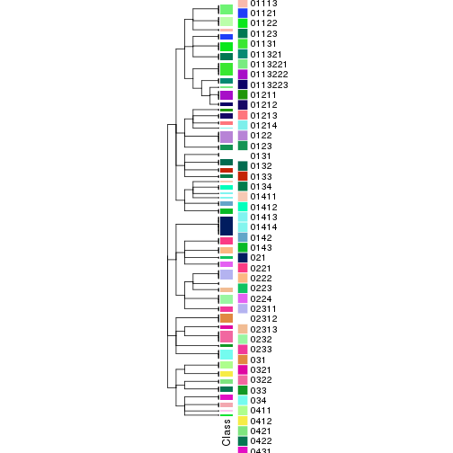</p>

</div>
<div id='tab-collect-classes-from-hierarchical-partition-2'>
<pre><code class="r">collect_classes(res_rh, merge_node = merge_node_param(min_n_signatures = 1638))
</code></pre>

<p>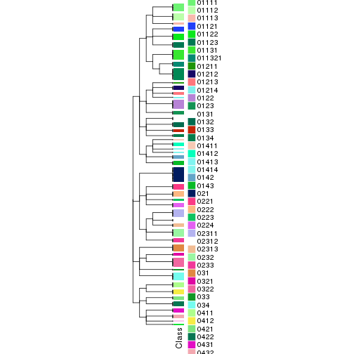</p>

</div>
<div id='tab-collect-classes-from-hierarchical-partition-3'>
<pre><code class="r">collect_classes(res_rh, merge_node = merge_node_param(min_n_signatures = 1706))
</code></pre>

<p>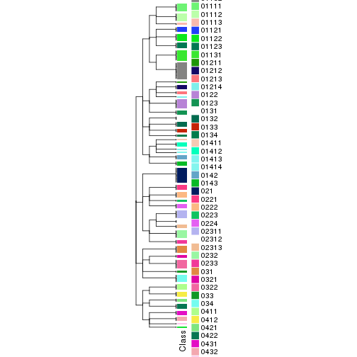</p>

</div>
<div id='tab-collect-classes-from-hierarchical-partition-4'>
<pre><code class="r">collect_classes(res_rh, merge_node = merge_node_param(min_n_signatures = 2229))
</code></pre>

<p>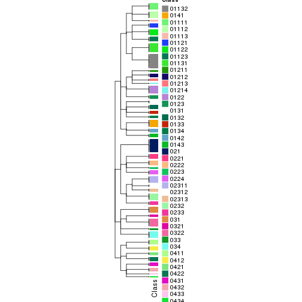</p>

</div>
<div id='tab-collect-classes-from-hierarchical-partition-5'>
<pre><code class="r">collect_classes(res_rh, merge_node = merge_node_param(min_n_signatures = 2626))
</code></pre>

<p>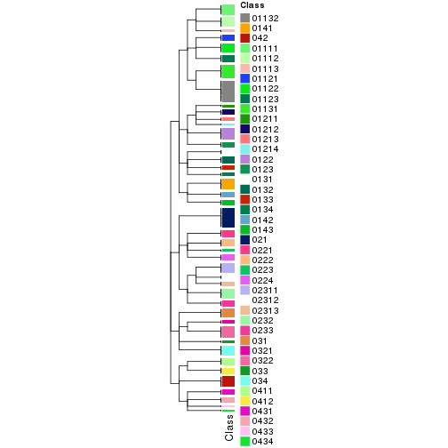</p>

</div>
<div id='tab-collect-classes-from-hierarchical-partition-6'>
<pre><code class="r">collect_classes(res_rh, merge_node = merge_node_param(min_n_signatures = 3059))
</code></pre>

<p>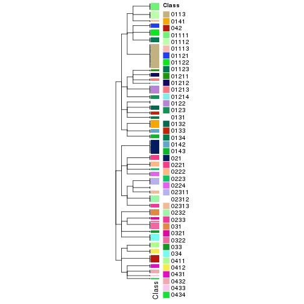</p>

</div>
<div id='tab-collect-classes-from-hierarchical-partition-7'>
<pre><code class="r">collect_classes(res_rh, merge_node = merge_node_param(min_n_signatures = 3096))
</code></pre>

<p>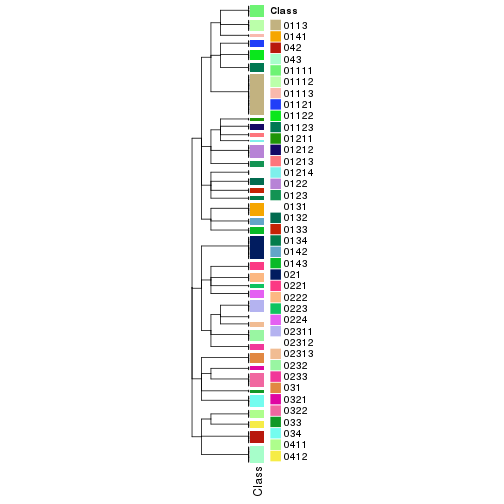</p>

</div>
<div id='tab-collect-classes-from-hierarchical-partition-8'>
<pre><code class="r">collect_classes(res_rh, merge_node = merge_node_param(min_n_signatures = 3261))
</code></pre>

<p>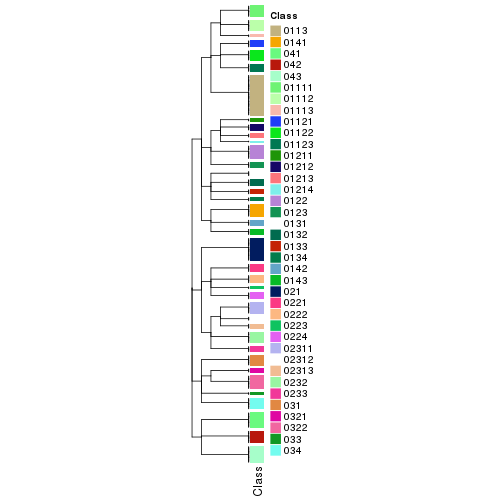</p>

</div>
<div id='tab-collect-classes-from-hierarchical-partition-9'>
<pre><code class="r">collect_classes(res_rh, merge_node = merge_node_param(min_n_signatures = 3587))
</code></pre>

<p>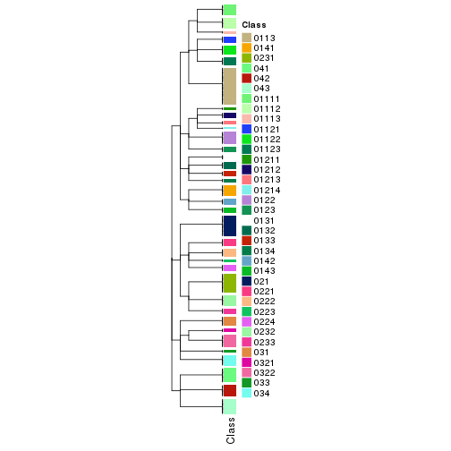</p>

</div>
<div id='tab-collect-classes-from-hierarchical-partition-10'>
<pre><code class="r">collect_classes(res_rh, merge_node = merge_node_param(min_n_signatures = 3848))
</code></pre>

<p>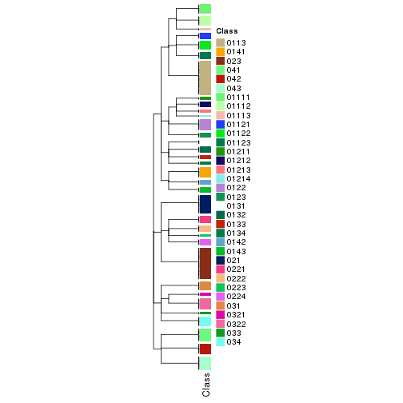</p>

</div>
<div id='tab-collect-classes-from-hierarchical-partition-11'>
<pre><code class="r">collect_classes(res_rh, merge_node = merge_node_param(min_n_signatures = 5120))
</code></pre>

<p>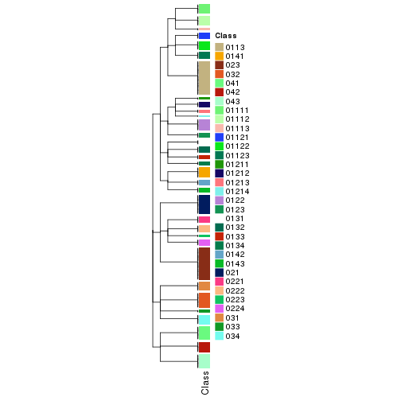</p>

</div>
<div id='tab-collect-classes-from-hierarchical-partition-12'>
<pre><code class="r">collect_classes(res_rh, merge_node = merge_node_param(min_n_signatures = 5424))
</code></pre>

<p>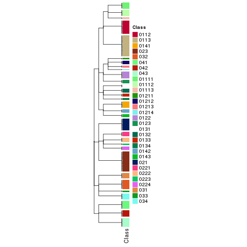</p>

</div>
<div id='tab-collect-classes-from-hierarchical-partition-13'>
<pre><code class="r">collect_classes(res_rh, merge_node = merge_node_param(min_n_signatures = 7771))
</code></pre>

<p>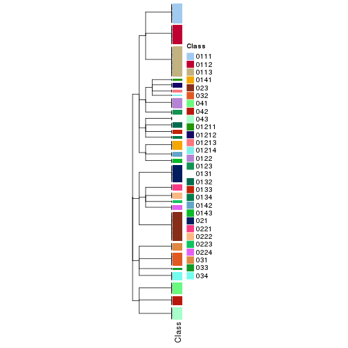</p>

</div>
<div id='tab-collect-classes-from-hierarchical-partition-14'>
<pre><code class="r">collect_classes(res_rh, merge_node = merge_node_param(min_n_signatures = 8689))
</code></pre>

<p></p>

</div>
<div id='tab-collect-classes-from-hierarchical-partition-15'>
<pre><code class="r">collect_classes(res_rh, merge_node = merge_node_param(min_n_signatures = 9292))
</code></pre>

<p>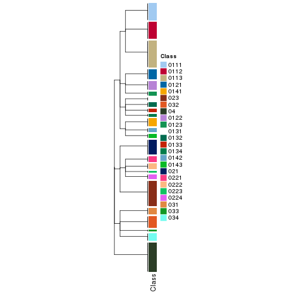</p>

</div>
<div id='tab-collect-classes-from-hierarchical-partition-16'>
<pre><code class="r">collect_classes(res_rh, merge_node = merge_node_param(min_n_signatures = 10155))
</code></pre>

<p>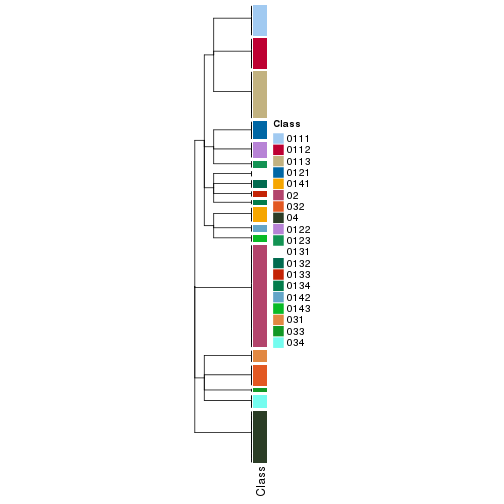</p>

</div>
<div id='tab-collect-classes-from-hierarchical-partition-17'>
<pre><code class="r">collect_classes(res_rh, merge_node = merge_node_param(min_n_signatures = 12210))
</code></pre>

<p>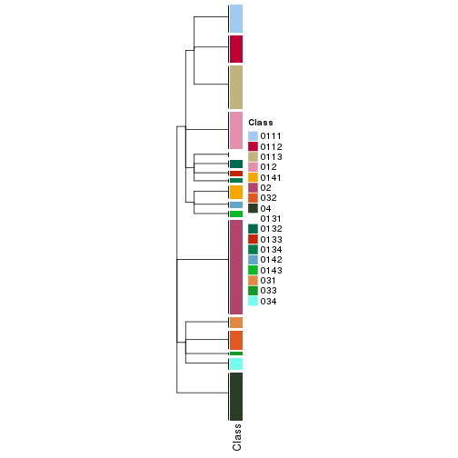</p>

</div>
<div id='tab-collect-classes-from-hierarchical-partition-18'>
<pre><code class="r">collect_classes(res_rh, merge_node = merge_node_param(min_n_signatures = 12653))
</code></pre>

<p>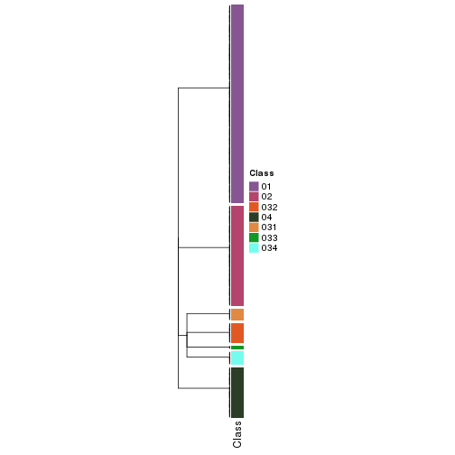</p>

</div>
<div id='tab-collect-classes-from-hierarchical-partition-19'>
<pre><code class="r">collect_classes(res_rh, merge_node = merge_node_param(min_n_signatures = 13441))
</code></pre>

<p></p>

</div>
<div id='tab-collect-classes-from-hierarchical-partition-20'>
<pre><code class="r">collect_classes(res_rh, merge_node = merge_node_param(min_n_signatures = 18520))
</code></pre>

<p>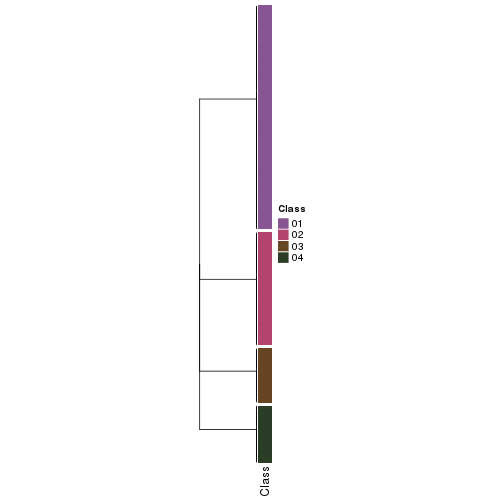</p>

</div>
<div id='tab-collect-classes-from-hierarchical-partition-21'>
<pre><code class="r">collect_classes(res_rh, merge_node = merge_node_param(min_n_signatures = 20760))
</code></pre>

<p></p>

</div>
<div id='tab-collect-classes-from-hierarchical-partition-22'>
<pre><code class="r">collect_classes(res_rh, merge_node = merge_node_param(min_n_signatures = 20900))
</code></pre>

<p></p>

</div>
<div id='tab-collect-classes-from-hierarchical-partition-23'>
<pre><code class="r">collect_classes(res_rh, merge_node = merge_node_param(min_n_signatures = 36291))
</code></pre>

<p>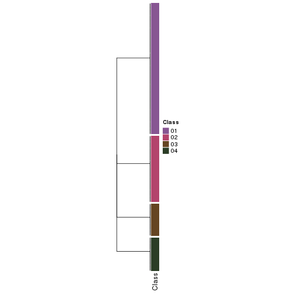</p>

</div>
</div>

Following shows the table of the partitions (You need to click the **show/hide
code output** link to see it).


<script>
$( function() {
	$( '#tabs-get-classes-from-hierarchical-partition' ).tabs();
} );
</script>
<div id='tabs-get-classes-from-hierarchical-partition'>
<ul>
<li><a href='#tab-get-classes-from-hierarchical-partition-1'>n_signatures ≥ 1432</a></li>
<li><a href='#tab-get-classes-from-hierarchical-partition-2'>n_signatures ≥ 1638</a></li>
<li><a href='#tab-get-classes-from-hierarchical-partition-3'>n_signatures ≥ 1706</a></li>
<li><a href='#tab-get-classes-from-hierarchical-partition-4'>n_signatures ≥ 2229</a></li>
<li><a href='#tab-get-classes-from-hierarchical-partition-5'>n_signatures ≥ 2626</a></li>
<li><a href='#tab-get-classes-from-hierarchical-partition-6'>n_signatures ≥ 3059</a></li>
<li><a href='#tab-get-classes-from-hierarchical-partition-7'>n_signatures ≥ 3096</a></li>
<li><a href='#tab-get-classes-from-hierarchical-partition-8'>n_signatures ≥ 3261</a></li>
<li><a href='#tab-get-classes-from-hierarchical-partition-9'>n_signatures ≥ 3587</a></li>
<li><a href='#tab-get-classes-from-hierarchical-partition-10'>n_signatures ≥ 3848</a></li>
<li><a href='#tab-get-classes-from-hierarchical-partition-11'>n_signatures ≥ 5120</a></li>
<li><a href='#tab-get-classes-from-hierarchical-partition-12'>n_signatures ≥ 5424</a></li>
<li><a href='#tab-get-classes-from-hierarchical-partition-13'>n_signatures ≥ 7771</a></li>
<li><a href='#tab-get-classes-from-hierarchical-partition-14'>n_signatures ≥ 8689</a></li>
<li><a href='#tab-get-classes-from-hierarchical-partition-15'>n_signatures ≥ 9292</a></li>
<li><a href='#tab-get-classes-from-hierarchical-partition-16'>n_signatures ≥ 10155</a></li>
<li><a href='#tab-get-classes-from-hierarchical-partition-17'>n_signatures ≥ 12210</a></li>
<li><a href='#tab-get-classes-from-hierarchical-partition-18'>n_signatures ≥ 12653</a></li>
<li><a href='#tab-get-classes-from-hierarchical-partition-19'>n_signatures ≥ 13441</a></li>
<li><a href='#tab-get-classes-from-hierarchical-partition-20'>n_signatures ≥ 18520</a></li>
<li><a href='#tab-get-classes-from-hierarchical-partition-21'>n_signatures ≥ 20760</a></li>
<li><a href='#tab-get-classes-from-hierarchical-partition-22'>n_signatures ≥ 20900</a></li>
<li><a href='#tab-get-classes-from-hierarchical-partition-23'>n_signatures ≥ 36291</a></li>
</ul>

<div id='tab-get-classes-from-hierarchical-partition-1'>
<p><a id='tab-get-classes-from-hierarchical-partition-1-a' style='color:#0366d6' href='#'>show/hide code output</a></p>
<pre><code class="r">get_classes(res_rh, merge_node = merge_node_param(min_n_signatures = 1432))
</code></pre>

<pre><code>#&gt; TCGA.AA.3663.01 TCGA.D5.6530.01 TCGA.NH.A8F7.01 TCGA.CK.4948.01 TCGA.AZ.6600.11 TCGA.AA.3494.11 
#&gt;          &quot;0133&quot;          &quot;0233&quot;          &quot;0432&quot;           &quot;021&quot;           &quot;034&quot;          &quot;0322&quot; 
#&gt; TCGA.A6.5667.11 TCGA.G4.6298.11 TCGA.3L.AA1B.01 TCGA.AZ.4615.01 TCGA.D5.5538.01 TCGA.G4.6306.01 
#&gt;           &quot;031&quot;           &quot;034&quot;         &quot;01112&quot;         &quot;01214&quot;         &quot;01122&quot;       &quot;0113223&quot; 
#&gt; TCGA.NH.A8F7.06 TCGA.AD.6964.01 TCGA.AD.A5EJ.01 TCGA.A6.6651.01 TCGA.DM.A1HB.01 TCGA.D5.6535.01 
#&gt;          &quot;0421&quot;           &quot;033&quot;         &quot;01213&quot;          &quot;0412&quot;          &quot;0122&quot;         &quot;01131&quot; 
#&gt; TCGA.AY.6197.01 TCGA.CA.5256.01 TCGA.T9.A92H.01 TCGA.AZ.6598.01 TCGA.AA.3713.11 TCGA.DM.A0X9.01 
#&gt;         &quot;01413&quot;           &quot;021&quot;         &quot;02311&quot;         &quot;01211&quot;          &quot;0322&quot;          &quot;0143&quot; 
#&gt; TCGA.AD.6963.01 TCGA.G4.6626.01 TCGA.AA.3655.11 TCGA.G4.6628.01 TCGA.CA.6716.01 TCGA.A6.6653.01 
#&gt;          &quot;0431&quot;          &quot;0411&quot;          &quot;0322&quot;          &quot;0122&quot;          &quot;0143&quot;         &quot;01211&quot; 
#&gt; TCGA.AA.3489.01 TCGA.A6.2682.01 TCGA.G4.6304.01 TCGA.F4.6855.01 TCGA.AZ.4308.01 TCGA.NH.A6GA.01 
#&gt;          &quot;0222&quot;          &quot;0232&quot;         &quot;01113&quot;         &quot;01131&quot;          &quot;0432&quot;       &quot;0113221&quot; 
#&gt; TCGA.NH.A50V.01 TCGA.CK.5912.01 TCGA.A6.4107.11 TCGA.DM.A288.01 TCGA.A6.2681.11 TCGA.AD.6548.01 
#&gt;         &quot;01412&quot;          &quot;0421&quot;          &quot;0321&quot;       &quot;0113223&quot;           &quot;031&quot;         &quot;01131&quot; 
#&gt; TCGA.AD.6890.01 TCGA.G4.6293.01 TCGA.CK.5916.01 TCGA.CK.6747.01 TCGA.QL.A97D.01 TCGA.A6.A56B.01 
#&gt;          &quot;0232&quot;         &quot;01131&quot;         &quot;01213&quot;         &quot;01131&quot;         &quot;01131&quot;         &quot;02313&quot; 
#&gt; TCGA.G4.6307.01 TCGA.AZ.6600.01 TCGA.CM.4748.01 TCGA.F4.6808.01 TCGA.G4.6309.01 TCGA.AA.3662.01 
#&gt;          &quot;0434&quot;         &quot;01112&quot;          &quot;0232&quot;           &quot;021&quot;          &quot;0434&quot;           &quot;021&quot; 
#&gt; TCGA.AY.A71X.01 TCGA.A6.2675.11 TCGA.CM.6169.01 TCGA.DM.A28K.01 TCGA.D5.6540.01 TCGA.CA.5254.01 
#&gt;         &quot;01121&quot;          &quot;0322&quot;         &quot;01123&quot;         &quot;01121&quot;          &quot;0122&quot;          &quot;0122&quot; 
#&gt; TCGA.AY.6386.01 TCGA.AA.3655.01 TCGA.D5.6926.01 TCGA.AD.5900.01 TCGA.A6.A5ZU.01 TCGA.DM.A28C.01 
#&gt;         &quot;01412&quot;          &quot;0233&quot;         &quot;02311&quot;         &quot;01214&quot;           &quot;021&quot;          &quot;0221&quot; 
#&gt; TCGA.G4.6302.01 TCGA.AZ.5403.01 TCGA.D5.6923.01 TCGA.AA.3712.01 TCGA.AU.3779.01 TCGA.CM.6172.01 
#&gt;          &quot;0142&quot;          &quot;0431&quot;          &quot;0411&quot;         &quot;02311&quot;          &quot;0412&quot;          &quot;0221&quot; 
#&gt; TCGA.AZ.4614.01 TCGA.5M.AATE.01 TCGA.A6.5664.01 TCGA.CM.4744.01 TCGA.AA.3697.11 TCGA.CM.6166.01 
#&gt;          &quot;0131&quot;          &quot;0232&quot;         &quot;01111&quot;         &quot;01411&quot;          &quot;0322&quot;         &quot;01131&quot; 
#&gt; TCGA.DM.A280.01 TCGA.A6.4107.01 TCGA.AZ.6607.01 TCGA.CM.5862.01 TCGA.NH.A5IV.01 TCGA.AA.3511.01 
#&gt;         &quot;01111&quot;          &quot;0134&quot;          &quot;0142&quot;           &quot;021&quot;         &quot;01121&quot;         &quot;02311&quot; 
#&gt; TCGA.AD.A5EK.01 TCGA.QG.A5YX.01 TCGA.CM.6168.01 TCGA.AM.5821.01 TCGA.F4.6570.01 TCGA.D5.6924.01 
#&gt;        &quot;011321&quot;           &quot;021&quot;         &quot;01111&quot;          &quot;0123&quot;          &quot;0122&quot;         &quot;02311&quot; 
#&gt; TCGA.G4.6588.01 TCGA.AY.A54L.01 TCGA.CK.6746.01 TCGA.A6.3810.01 TCGA.G4.6298.01 TCGA.CK.5915.01 
#&gt;          &quot;0122&quot;         &quot;01122&quot;          &quot;0123&quot;          &quot;0411&quot;       &quot;0113222&quot;        &quot;011321&quot; 
#&gt; TCGA.CA.6718.01 TCGA.CM.6162.01 TCGA.D5.5539.01 TCGA.QG.A5YV.01 TCGA.G4.6314.01 TCGA.AZ.4313.01 
#&gt;          &quot;0132&quot;           &quot;033&quot;       &quot;0113222&quot;          &quot;0232&quot;          &quot;0232&quot;          &quot;0233&quot; 
#&gt; TCGA.CM.6676.01 TCGA.AA.3509.11 TCGA.NH.A6GC.01 TCGA.A6.6654.01 TCGA.A6.2675.01 TCGA.F4.6460.01 
#&gt;         &quot;02313&quot;          &quot;0321&quot;          &quot;0233&quot;         &quot;01111&quot;          &quot;0431&quot;          &quot;0412&quot; 
#&gt; TCGA.G4.6302.11 TCGA.AA.3510.11 TCGA.CA.6715.01 TCGA.CM.5341.01 TCGA.F4.6703.01 TCGA.WS.AB45.01 
#&gt;           &quot;034&quot;          &quot;0322&quot;          &quot;0433&quot;         &quot;01112&quot;           &quot;033&quot;          &quot;0132&quot; 
#&gt; TCGA.G4.6321.01 TCGA.AZ.6608.01 TCGA.AA.3713.01 TCGA.CM.5864.01 TCGA.CK.5913.01 TCGA.CM.5863.01 
#&gt;         &quot;01212&quot;          &quot;0422&quot;          &quot;0133&quot;         &quot;01123&quot;          &quot;0123&quot;         &quot;01111&quot; 
#&gt; TCGA.AA.3495.01 TCGA.F4.6857.01 TCGA.QG.A5YW.01 TCGA.A6.5665.01 TCGA.CA.5255.01 TCGA.CM.5349.01 
#&gt;       &quot;0113222&quot;         &quot;01111&quot;         &quot;01122&quot;         &quot;01213&quot;          &quot;0142&quot;         &quot;01112&quot; 
#&gt; TCGA.CK.4947.01 TCGA.G4.6297.01 TCGA.AZ.6606.01 TCGA.CM.6675.01 TCGA.NH.A50U.01 TCGA.AD.6899.01 
#&gt;         &quot;01131&quot;         &quot;01131&quot;          &quot;0132&quot;          &quot;0123&quot;           &quot;021&quot;       &quot;0113222&quot; 
#&gt; TCGA.AY.A8YK.01 TCGA.AD.6895.01 TCGA.F4.6805.01 TCGA.A6.3809.01 TCGA.AY.5543.01 TCGA.D5.6931.01 
#&gt;          &quot;0421&quot;         &quot;01212&quot;          &quot;0222&quot;          &quot;0123&quot;          &quot;0232&quot;          &quot;0133&quot; 
#&gt; TCGA.G4.6627.01 TCGA.A6.5657.01 TCGA.CM.6165.01 TCGA.CM.5861.01 TCGA.A6.6649.01 TCGA.G4.6317.02 
#&gt;         &quot;01111&quot;         &quot;01111&quot;          &quot;0221&quot;          &quot;0122&quot;          &quot;0132&quot;          &quot;0422&quot; 
#&gt; TCGA.CM.5348.01 TCGA.A6.2671.01 TCGA.A6.2672.01 TCGA.AY.A69D.01 TCGA.A6.5662.01 TCGA.AA.3509.01 
#&gt;       &quot;0113221&quot;          &quot;0221&quot;          &quot;0122&quot;         &quot;01112&quot;          &quot;0411&quot;          &quot;0232&quot; 
#&gt; TCGA.D5.6536.01 TCGA.D5.6539.01 TCGA.D5.6929.01 TCGA.AA.3510.01 TCGA.CM.6679.01 TCGA.A6.5666.01 
#&gt;          &quot;0224&quot;          &quot;0222&quot;           &quot;021&quot;          &quot;0224&quot;         &quot;02311&quot;           &quot;021&quot; 
#&gt; TCGA.A6.6140.01 TCGA.CA.5796.01 TCGA.F4.6463.01 TCGA.AA.3712.11 TCGA.D5.6928.01 TCGA.A6.6648.01 
#&gt;          &quot;0411&quot;          &quot;0233&quot;       &quot;0113222&quot;          &quot;0322&quot;          &quot;0132&quot;          &quot;0431&quot; 
#&gt; TCGA.CA.6719.01 TCGA.AZ.4323.01 TCGA.CM.6161.01 TCGA.F4.6856.01 TCGA.DM.A1D7.01 TCGA.CM.4746.01 
#&gt;       &quot;0113223&quot;         &quot;01113&quot;         &quot;02312&quot;          &quot;0142&quot;          &quot;0221&quot;          &quot;0233&quot; 
#&gt; TCGA.A6.5661.01 TCGA.DM.A1D6.01 TCGA.A6.2685.01 TCGA.AZ.6601.11 TCGA.AZ.4315.01 TCGA.CM.6674.01 
#&gt;         &quot;01213&quot;          &quot;0221&quot;          &quot;0412&quot;          &quot;0322&quot;       &quot;0113222&quot;          &quot;0222&quot; 
#&gt; TCGA.CM.4743.01 TCGA.A6.2677.01 TCGA.D5.5537.01 TCGA.CA.6717.01 TCGA.F4.6569.01 TCGA.D5.6930.01 
#&gt;          &quot;0132&quot;         &quot;01123&quot;       &quot;0113222&quot;         &quot;01111&quot;         &quot;01111&quot;         &quot;01212&quot; 
#&gt; TCGA.A6.2686.11 TCGA.F4.6807.01 TCGA.4T.AA8H.01 TCGA.CM.6164.01 TCGA.A6.6782.01 TCGA.A6.4105.01 
#&gt;           &quot;031&quot;         &quot;01112&quot;         &quot;01121&quot;          &quot;0432&quot;         &quot;02311&quot;         &quot;01412&quot; 
#&gt; TCGA.D5.5541.01 TCGA.AA.3495.11 TCGA.AA.3506.01 TCGA.DM.A28E.01 TCGA.A6.6138.01 TCGA.AZ.4682.01 
#&gt;          &quot;0411&quot;          &quot;0322&quot;         &quot;01122&quot;          &quot;0412&quot;         &quot;01112&quot;          &quot;0433&quot; 
#&gt; TCGA.D5.6932.01 TCGA.A6.2684.11 TCGA.D5.6538.01 TCGA.AD.6888.01 TCGA.AA.3488.11 TCGA.CM.6678.01 
#&gt;         &quot;02311&quot;           &quot;031&quot;          &quot;0143&quot;           &quot;021&quot;          &quot;0322&quot;          &quot;0224&quot; 
#&gt; TCGA.CM.5344.01 TCGA.A6.5656.01 TCGA.F4.6809.01 TCGA.F4.6806.01 TCGA.AA.3502.01 TCGA.G4.6320.11 
#&gt;          &quot;0432&quot;         &quot;02311&quot;         &quot;01112&quot;         &quot;01412&quot;         &quot;01121&quot;           &quot;034&quot; 
#&gt; TCGA.NH.A8F8.01 TCGA.AY.6196.01 TCGA.CM.5868.01 TCGA.RU.A8FL.01 TCGA.A6.2685.11 TCGA.CK.4951.01 
#&gt;       &quot;0113222&quot;         &quot;01113&quot;          &quot;0432&quot;           &quot;021&quot;           &quot;031&quot;          &quot;0122&quot; 
#&gt; TCGA.D5.6922.01 TCGA.AA.3697.01 TCGA.A6.6142.01 TCGA.F4.6704.01 TCGA.AZ.6599.01 TCGA.AZ.6599.11 
#&gt;           &quot;021&quot;           &quot;021&quot;          &quot;0422&quot;          &quot;0431&quot;         &quot;01121&quot;           &quot;034&quot; 
#&gt; TCGA.5M.AAT4.01 TCGA.CK.5914.01 TCGA.CM.5860.01 TCGA.AZ.4681.01 TCGA.AD.6965.01 TCGA.A6.6780.01 
#&gt;       &quot;0113223&quot;        &quot;011321&quot;         &quot;01414&quot;          &quot;0422&quot;         &quot;01122&quot;         &quot;01413&quot; 
#&gt; TCGA.A6.2686.01 TCGA.CM.4750.01 TCGA.CM.6677.01 TCGA.A6.A567.01 TCGA.D5.5540.01 TCGA.DM.A1DB.01 
#&gt;          &quot;0123&quot;         &quot;01123&quot;         &quot;01131&quot;          &quot;0421&quot;        &quot;011321&quot;          &quot;0411&quot; 
#&gt; TCGA.QG.A5Z2.01 TCGA.AA.3506.11 TCGA.D5.6898.01 TCGA.AZ.5407.01 TCGA.A6.2684.01 TCGA.CM.6167.01 
#&gt;         &quot;01212&quot;          &quot;0322&quot;           &quot;021&quot;          &quot;0143&quot;          &quot;0224&quot;          &quot;0223&quot; 
#&gt; TCGA.DM.A28G.01 TCGA.AA.3488.01 TCGA.AA.3492.01 TCGA.G4.6322.01 TCGA.AD.6889.01 TCGA.AZ.6598.11 
#&gt;         &quot;01122&quot;          &quot;0232&quot;          &quot;0122&quot;          &quot;0131&quot;         &quot;01211&quot;          &quot;0321&quot; 
#&gt; TCGA.CM.6163.01 TCGA.G4.6322.11 TCGA.G4.6586.01 TCGA.AA.3502.11 TCGA.G4.6323.01 TCGA.CA.5797.01 
#&gt;          &quot;0224&quot;           &quot;031&quot;          &quot;0122&quot;          &quot;0322&quot;         &quot;01412&quot;          &quot;0421&quot; 
#&gt; TCGA.CK.4950.01 TCGA.D5.6529.01 TCGA.A6.2680.11 TCGA.DM.A1D0.01 TCGA.DM.A282.01 TCGA.A6.5660.01 
#&gt;         &quot;01412&quot;         &quot;01111&quot;           &quot;031&quot;          &quot;0412&quot;         &quot;01131&quot;         &quot;01123&quot; 
#&gt; TCGA.G4.6299.01 TCGA.DM.A1DA.01 TCGA.A6.2671.11 TCGA.D5.6920.01 TCGA.DM.A1D8.01 TCGA.DM.A1HA.01 
#&gt;         &quot;01212&quot;          &quot;0131&quot;           &quot;031&quot;         &quot;01112&quot;          &quot;0143&quot;         &quot;01123&quot; 
#&gt; TCGA.DM.A285.01 TCGA.G4.6303.01 TCGA.G4.6294.01 TCGA.AZ.6601.01 TCGA.G4.6295.11 TCGA.CM.4752.01 
#&gt;         &quot;01414&quot;         &quot;02312&quot;          &quot;0221&quot;          &quot;0142&quot;           &quot;031&quot;           &quot;021&quot; 
#&gt; TCGA.AZ.4684.01 TCGA.D5.6532.01 TCGA.A6.A565.01 TCGA.5M.AATA.01 TCGA.D5.6531.01 TCGA.5M.AAT5.01 
#&gt;           &quot;021&quot;         &quot;01123&quot;          &quot;0223&quot;         &quot;02313&quot;          &quot;0134&quot;          &quot;0422&quot; 
#&gt; TCGA.DM.A0XD.01 TCGA.AA.3663.11 TCGA.AA.3660.11 TCGA.CK.6751.01 TCGA.G4.6311.01 TCGA.A6.6137.01 
#&gt;         &quot;01411&quot;          &quot;0322&quot;           &quot;034&quot;          &quot;0134&quot;         &quot;02311&quot;          &quot;0232&quot; 
#&gt; TCGA.A6.A566.01 TCGA.G4.6625.01 TCGA.DM.A28F.01 TCGA.G4.6297.11 TCGA.A6.6141.01 TCGA.AA.3492.11 
#&gt;          &quot;0133&quot;          &quot;0222&quot;           &quot;021&quot;          &quot;0321&quot;          &quot;0224&quot;           &quot;034&quot; 
#&gt; TCGA.A6.5659.01 TCGA.AZ.6603.01 TCGA.D5.6927.01 TCGA.AU.6004.01 TCGA.F4.6854.01 TCGA.CK.4952.01 
#&gt;          &quot;0131&quot;          &quot;0422&quot;          &quot;0222&quot;         &quot;01212&quot;         &quot;02311&quot;          &quot;0131&quot; 
#&gt; TCGA.A6.5667.01 TCGA.G4.6315.01 TCGA.A6.6781.01 TCGA.D5.6541.01 TCGA.DM.A1D9.01 TCGA.A6.2680.01 
#&gt;          &quot;0411&quot;         &quot;02313&quot;          &quot;0222&quot;       &quot;0113222&quot;           &quot;021&quot;         &quot;01122&quot; 
#&gt; TCGA.A6.2679.11 TCGA.AD.6901.01 TCGA.CK.6748.01 TCGA.AA.3496.01 TCGA.CM.4751.01 TCGA.A6.6652.01 
#&gt;           &quot;034&quot;       &quot;0113222&quot;          &quot;0221&quot;         &quot;01131&quot;          &quot;0133&quot;         &quot;02313&quot; 
#&gt; TCGA.AA.3494.01 TCGA.F4.6459.01 TCGA.SS.A7HO.01 TCGA.A6.6650.01 TCGA.DM.A28A.01 TCGA.D5.6534.01 
#&gt;          &quot;0431&quot;          &quot;0224&quot;           &quot;021&quot;         &quot;01122&quot;        &quot;011321&quot;          &quot;0142&quot; 
#&gt; TCGA.AZ.4616.01 TCGA.D5.6533.01 TCGA.QG.A5Z1.01 TCGA.DM.A0XF.01 TCGA.G4.6295.01 TCGA.CM.6680.01 
#&gt;         &quot;01112&quot;         &quot;02312&quot;        &quot;011321&quot;         &quot;02312&quot;          &quot;0422&quot;         &quot;01121&quot; 
#&gt; TCGA.CM.6171.01 TCGA.AA.3660.01 TCGA.F4.6461.01 TCGA.CM.4747.01 TCGA.AM.5820.01 TCGA.DM.A28H.01 
#&gt;          &quot;0122&quot;         &quot;01131&quot;          &quot;0132&quot;       &quot;0113222&quot;           &quot;021&quot;        &quot;011321&quot; 
#&gt; TCGA.G4.6311.11 TCGA.G4.6314.11 TCGA.D5.7000.01 TCGA.G4.6625.11 TCGA.G4.6320.01 TCGA.5M.AAT6.01 
#&gt;           &quot;034&quot;           &quot;031&quot;          &quot;0134&quot;           &quot;034&quot;          &quot;0122&quot;          &quot;0223&quot; 
#&gt; TCGA.A6.2682.11 TCGA.AZ.6605.01 TCGA.G4.6310.01 TCGA.DM.A28M.01 TCGA.G4.6317.01 TCGA.DM.A1D4.01 
#&gt;           &quot;034&quot;          &quot;0222&quot;         &quot;01112&quot;         &quot;01122&quot;          &quot;0412&quot;          &quot;0143&quot; 
#&gt; TCGA.CM.6170.01 TCGA.NH.A50T.01 TCGA.NH.A6GB.01 TCGA.A6.2681.01 TCGA.A6.2679.01 TCGA.D5.6537.01 
#&gt;          &quot;0432&quot;           &quot;021&quot;         &quot;01122&quot;         &quot;01131&quot;         &quot;01131&quot;         &quot;01123&quot; 
#&gt; TCGA.4N.A93T.01 
#&gt;          &quot;0232&quot;
</code></pre>

<script>
$('#tab-get-classes-from-hierarchical-partition-1-a').parent().next().next().hide();
$('#tab-get-classes-from-hierarchical-partition-1-a').click(function(){
  $('#tab-get-classes-from-hierarchical-partition-1-a').parent().next().next().toggle();
  return(false);
});
</script>
</div>

<div id='tab-get-classes-from-hierarchical-partition-2'>
<p><a id='tab-get-classes-from-hierarchical-partition-2-a' style='color:#0366d6' href='#'>show/hide code output</a></p>
<pre><code class="r">get_classes(res_rh, merge_node = merge_node_param(min_n_signatures = 1638))
</code></pre>

<pre><code>#&gt; TCGA.AA.3663.01 TCGA.D5.6530.01 TCGA.NH.A8F7.01 TCGA.CK.4948.01 TCGA.AZ.6600.11 TCGA.AA.3494.11 
#&gt;          &quot;0133&quot;          &quot;0233&quot;          &quot;0432&quot;           &quot;021&quot;           &quot;034&quot;          &quot;0322&quot; 
#&gt; TCGA.A6.5667.11 TCGA.G4.6298.11 TCGA.3L.AA1B.01 TCGA.AZ.4615.01 TCGA.D5.5538.01 TCGA.G4.6306.01 
#&gt;           &quot;031&quot;           &quot;034&quot;         &quot;01112&quot;         &quot;01214&quot;         &quot;01122&quot;        &quot;011322&quot; 
#&gt; TCGA.NH.A8F7.06 TCGA.AD.6964.01 TCGA.AD.A5EJ.01 TCGA.A6.6651.01 TCGA.DM.A1HB.01 TCGA.D5.6535.01 
#&gt;          &quot;0421&quot;           &quot;033&quot;         &quot;01213&quot;          &quot;0412&quot;          &quot;0122&quot;         &quot;01131&quot; 
#&gt; TCGA.AY.6197.01 TCGA.CA.5256.01 TCGA.T9.A92H.01 TCGA.AZ.6598.01 TCGA.AA.3713.11 TCGA.DM.A0X9.01 
#&gt;         &quot;01413&quot;           &quot;021&quot;         &quot;02311&quot;         &quot;01211&quot;          &quot;0322&quot;          &quot;0143&quot; 
#&gt; TCGA.AD.6963.01 TCGA.G4.6626.01 TCGA.AA.3655.11 TCGA.G4.6628.01 TCGA.CA.6716.01 TCGA.A6.6653.01 
#&gt;          &quot;0431&quot;          &quot;0411&quot;          &quot;0322&quot;          &quot;0122&quot;          &quot;0143&quot;         &quot;01211&quot; 
#&gt; TCGA.AA.3489.01 TCGA.A6.2682.01 TCGA.G4.6304.01 TCGA.F4.6855.01 TCGA.AZ.4308.01 TCGA.NH.A6GA.01 
#&gt;          &quot;0222&quot;          &quot;0232&quot;         &quot;01113&quot;         &quot;01131&quot;          &quot;0432&quot;        &quot;011322&quot; 
#&gt; TCGA.NH.A50V.01 TCGA.CK.5912.01 TCGA.A6.4107.11 TCGA.DM.A288.01 TCGA.A6.2681.11 TCGA.AD.6548.01 
#&gt;         &quot;01412&quot;          &quot;0421&quot;          &quot;0321&quot;        &quot;011322&quot;           &quot;031&quot;         &quot;01131&quot; 
#&gt; TCGA.AD.6890.01 TCGA.G4.6293.01 TCGA.CK.5916.01 TCGA.CK.6747.01 TCGA.QL.A97D.01 TCGA.A6.A56B.01 
#&gt;          &quot;0232&quot;         &quot;01131&quot;         &quot;01213&quot;         &quot;01131&quot;         &quot;01131&quot;         &quot;02313&quot; 
#&gt; TCGA.G4.6307.01 TCGA.AZ.6600.01 TCGA.CM.4748.01 TCGA.F4.6808.01 TCGA.G4.6309.01 TCGA.AA.3662.01 
#&gt;          &quot;0434&quot;         &quot;01112&quot;          &quot;0232&quot;           &quot;021&quot;          &quot;0434&quot;           &quot;021&quot; 
#&gt; TCGA.AY.A71X.01 TCGA.A6.2675.11 TCGA.CM.6169.01 TCGA.DM.A28K.01 TCGA.D5.6540.01 TCGA.CA.5254.01 
#&gt;         &quot;01121&quot;          &quot;0322&quot;         &quot;01123&quot;         &quot;01121&quot;          &quot;0122&quot;          &quot;0122&quot; 
#&gt; TCGA.AY.6386.01 TCGA.AA.3655.01 TCGA.D5.6926.01 TCGA.AD.5900.01 TCGA.A6.A5ZU.01 TCGA.DM.A28C.01 
#&gt;         &quot;01412&quot;          &quot;0233&quot;         &quot;02311&quot;         &quot;01214&quot;           &quot;021&quot;          &quot;0221&quot; 
#&gt; TCGA.G4.6302.01 TCGA.AZ.5403.01 TCGA.D5.6923.01 TCGA.AA.3712.01 TCGA.AU.3779.01 TCGA.CM.6172.01 
#&gt;          &quot;0142&quot;          &quot;0431&quot;          &quot;0411&quot;         &quot;02311&quot;          &quot;0412&quot;          &quot;0221&quot; 
#&gt; TCGA.AZ.4614.01 TCGA.5M.AATE.01 TCGA.A6.5664.01 TCGA.CM.4744.01 TCGA.AA.3697.11 TCGA.CM.6166.01 
#&gt;          &quot;0131&quot;          &quot;0232&quot;         &quot;01111&quot;         &quot;01411&quot;          &quot;0322&quot;         &quot;01131&quot; 
#&gt; TCGA.DM.A280.01 TCGA.A6.4107.01 TCGA.AZ.6607.01 TCGA.CM.5862.01 TCGA.NH.A5IV.01 TCGA.AA.3511.01 
#&gt;         &quot;01111&quot;          &quot;0134&quot;          &quot;0142&quot;           &quot;021&quot;         &quot;01121&quot;         &quot;02311&quot; 
#&gt; TCGA.AD.A5EK.01 TCGA.QG.A5YX.01 TCGA.CM.6168.01 TCGA.AM.5821.01 TCGA.F4.6570.01 TCGA.D5.6924.01 
#&gt;        &quot;011321&quot;           &quot;021&quot;         &quot;01111&quot;          &quot;0123&quot;          &quot;0122&quot;         &quot;02311&quot; 
#&gt; TCGA.G4.6588.01 TCGA.AY.A54L.01 TCGA.CK.6746.01 TCGA.A6.3810.01 TCGA.G4.6298.01 TCGA.CK.5915.01 
#&gt;          &quot;0122&quot;         &quot;01122&quot;          &quot;0123&quot;          &quot;0411&quot;        &quot;011322&quot;        &quot;011321&quot; 
#&gt; TCGA.CA.6718.01 TCGA.CM.6162.01 TCGA.D5.5539.01 TCGA.QG.A5YV.01 TCGA.G4.6314.01 TCGA.AZ.4313.01 
#&gt;          &quot;0132&quot;           &quot;033&quot;        &quot;011322&quot;          &quot;0232&quot;          &quot;0232&quot;          &quot;0233&quot; 
#&gt; TCGA.CM.6676.01 TCGA.AA.3509.11 TCGA.NH.A6GC.01 TCGA.A6.6654.01 TCGA.A6.2675.01 TCGA.F4.6460.01 
#&gt;         &quot;02313&quot;          &quot;0321&quot;          &quot;0233&quot;         &quot;01111&quot;          &quot;0431&quot;          &quot;0412&quot; 
#&gt; TCGA.G4.6302.11 TCGA.AA.3510.11 TCGA.CA.6715.01 TCGA.CM.5341.01 TCGA.F4.6703.01 TCGA.WS.AB45.01 
#&gt;           &quot;034&quot;          &quot;0322&quot;          &quot;0433&quot;         &quot;01112&quot;           &quot;033&quot;          &quot;0132&quot; 
#&gt; TCGA.G4.6321.01 TCGA.AZ.6608.01 TCGA.AA.3713.01 TCGA.CM.5864.01 TCGA.CK.5913.01 TCGA.CM.5863.01 
#&gt;         &quot;01212&quot;          &quot;0422&quot;          &quot;0133&quot;         &quot;01123&quot;          &quot;0123&quot;         &quot;01111&quot; 
#&gt; TCGA.AA.3495.01 TCGA.F4.6857.01 TCGA.QG.A5YW.01 TCGA.A6.5665.01 TCGA.CA.5255.01 TCGA.CM.5349.01 
#&gt;        &quot;011322&quot;         &quot;01111&quot;         &quot;01122&quot;         &quot;01213&quot;          &quot;0142&quot;         &quot;01112&quot; 
#&gt; TCGA.CK.4947.01 TCGA.G4.6297.01 TCGA.AZ.6606.01 TCGA.CM.6675.01 TCGA.NH.A50U.01 TCGA.AD.6899.01 
#&gt;         &quot;01131&quot;         &quot;01131&quot;          &quot;0132&quot;          &quot;0123&quot;           &quot;021&quot;        &quot;011322&quot; 
#&gt; TCGA.AY.A8YK.01 TCGA.AD.6895.01 TCGA.F4.6805.01 TCGA.A6.3809.01 TCGA.AY.5543.01 TCGA.D5.6931.01 
#&gt;          &quot;0421&quot;         &quot;01212&quot;          &quot;0222&quot;          &quot;0123&quot;          &quot;0232&quot;          &quot;0133&quot; 
#&gt; TCGA.G4.6627.01 TCGA.A6.5657.01 TCGA.CM.6165.01 TCGA.CM.5861.01 TCGA.A6.6649.01 TCGA.G4.6317.02 
#&gt;         &quot;01111&quot;         &quot;01111&quot;          &quot;0221&quot;          &quot;0122&quot;          &quot;0132&quot;          &quot;0422&quot; 
#&gt; TCGA.CM.5348.01 TCGA.A6.2671.01 TCGA.A6.2672.01 TCGA.AY.A69D.01 TCGA.A6.5662.01 TCGA.AA.3509.01 
#&gt;        &quot;011322&quot;          &quot;0221&quot;          &quot;0122&quot;         &quot;01112&quot;          &quot;0411&quot;          &quot;0232&quot; 
#&gt; TCGA.D5.6536.01 TCGA.D5.6539.01 TCGA.D5.6929.01 TCGA.AA.3510.01 TCGA.CM.6679.01 TCGA.A6.5666.01 
#&gt;          &quot;0224&quot;          &quot;0222&quot;           &quot;021&quot;          &quot;0224&quot;         &quot;02311&quot;           &quot;021&quot; 
#&gt; TCGA.A6.6140.01 TCGA.CA.5796.01 TCGA.F4.6463.01 TCGA.AA.3712.11 TCGA.D5.6928.01 TCGA.A6.6648.01 
#&gt;          &quot;0411&quot;          &quot;0233&quot;        &quot;011322&quot;          &quot;0322&quot;          &quot;0132&quot;          &quot;0431&quot; 
#&gt; TCGA.CA.6719.01 TCGA.AZ.4323.01 TCGA.CM.6161.01 TCGA.F4.6856.01 TCGA.DM.A1D7.01 TCGA.CM.4746.01 
#&gt;        &quot;011322&quot;         &quot;01113&quot;         &quot;02312&quot;          &quot;0142&quot;          &quot;0221&quot;          &quot;0233&quot; 
#&gt; TCGA.A6.5661.01 TCGA.DM.A1D6.01 TCGA.A6.2685.01 TCGA.AZ.6601.11 TCGA.AZ.4315.01 TCGA.CM.6674.01 
#&gt;         &quot;01213&quot;          &quot;0221&quot;          &quot;0412&quot;          &quot;0322&quot;        &quot;011322&quot;          &quot;0222&quot; 
#&gt; TCGA.CM.4743.01 TCGA.A6.2677.01 TCGA.D5.5537.01 TCGA.CA.6717.01 TCGA.F4.6569.01 TCGA.D5.6930.01 
#&gt;          &quot;0132&quot;         &quot;01123&quot;        &quot;011322&quot;         &quot;01111&quot;         &quot;01111&quot;         &quot;01212&quot; 
#&gt; TCGA.A6.2686.11 TCGA.F4.6807.01 TCGA.4T.AA8H.01 TCGA.CM.6164.01 TCGA.A6.6782.01 TCGA.A6.4105.01 
#&gt;           &quot;031&quot;         &quot;01112&quot;         &quot;01121&quot;          &quot;0432&quot;         &quot;02311&quot;         &quot;01412&quot; 
#&gt; TCGA.D5.5541.01 TCGA.AA.3495.11 TCGA.AA.3506.01 TCGA.DM.A28E.01 TCGA.A6.6138.01 TCGA.AZ.4682.01 
#&gt;          &quot;0411&quot;          &quot;0322&quot;         &quot;01122&quot;          &quot;0412&quot;         &quot;01112&quot;          &quot;0433&quot; 
#&gt; TCGA.D5.6932.01 TCGA.A6.2684.11 TCGA.D5.6538.01 TCGA.AD.6888.01 TCGA.AA.3488.11 TCGA.CM.6678.01 
#&gt;         &quot;02311&quot;           &quot;031&quot;          &quot;0143&quot;           &quot;021&quot;          &quot;0322&quot;          &quot;0224&quot; 
#&gt; TCGA.CM.5344.01 TCGA.A6.5656.01 TCGA.F4.6809.01 TCGA.F4.6806.01 TCGA.AA.3502.01 TCGA.G4.6320.11 
#&gt;          &quot;0432&quot;         &quot;02311&quot;         &quot;01112&quot;         &quot;01412&quot;         &quot;01121&quot;           &quot;034&quot; 
#&gt; TCGA.NH.A8F8.01 TCGA.AY.6196.01 TCGA.CM.5868.01 TCGA.RU.A8FL.01 TCGA.A6.2685.11 TCGA.CK.4951.01 
#&gt;        &quot;011322&quot;         &quot;01113&quot;          &quot;0432&quot;           &quot;021&quot;           &quot;031&quot;          &quot;0122&quot; 
#&gt; TCGA.D5.6922.01 TCGA.AA.3697.01 TCGA.A6.6142.01 TCGA.F4.6704.01 TCGA.AZ.6599.01 TCGA.AZ.6599.11 
#&gt;           &quot;021&quot;           &quot;021&quot;          &quot;0422&quot;          &quot;0431&quot;         &quot;01121&quot;           &quot;034&quot; 
#&gt; TCGA.5M.AAT4.01 TCGA.CK.5914.01 TCGA.CM.5860.01 TCGA.AZ.4681.01 TCGA.AD.6965.01 TCGA.A6.6780.01 
#&gt;        &quot;011322&quot;        &quot;011321&quot;         &quot;01414&quot;          &quot;0422&quot;         &quot;01122&quot;         &quot;01413&quot; 
#&gt; TCGA.A6.2686.01 TCGA.CM.4750.01 TCGA.CM.6677.01 TCGA.A6.A567.01 TCGA.D5.5540.01 TCGA.DM.A1DB.01 
#&gt;          &quot;0123&quot;         &quot;01123&quot;         &quot;01131&quot;          &quot;0421&quot;        &quot;011321&quot;          &quot;0411&quot; 
#&gt; TCGA.QG.A5Z2.01 TCGA.AA.3506.11 TCGA.D5.6898.01 TCGA.AZ.5407.01 TCGA.A6.2684.01 TCGA.CM.6167.01 
#&gt;         &quot;01212&quot;          &quot;0322&quot;           &quot;021&quot;          &quot;0143&quot;          &quot;0224&quot;          &quot;0223&quot; 
#&gt; TCGA.DM.A28G.01 TCGA.AA.3488.01 TCGA.AA.3492.01 TCGA.G4.6322.01 TCGA.AD.6889.01 TCGA.AZ.6598.11 
#&gt;         &quot;01122&quot;          &quot;0232&quot;          &quot;0122&quot;          &quot;0131&quot;         &quot;01211&quot;          &quot;0321&quot; 
#&gt; TCGA.CM.6163.01 TCGA.G4.6322.11 TCGA.G4.6586.01 TCGA.AA.3502.11 TCGA.G4.6323.01 TCGA.CA.5797.01 
#&gt;          &quot;0224&quot;           &quot;031&quot;          &quot;0122&quot;          &quot;0322&quot;         &quot;01412&quot;          &quot;0421&quot; 
#&gt; TCGA.CK.4950.01 TCGA.D5.6529.01 TCGA.A6.2680.11 TCGA.DM.A1D0.01 TCGA.DM.A282.01 TCGA.A6.5660.01 
#&gt;         &quot;01412&quot;         &quot;01111&quot;           &quot;031&quot;          &quot;0412&quot;         &quot;01131&quot;         &quot;01123&quot; 
#&gt; TCGA.G4.6299.01 TCGA.DM.A1DA.01 TCGA.A6.2671.11 TCGA.D5.6920.01 TCGA.DM.A1D8.01 TCGA.DM.A1HA.01 
#&gt;         &quot;01212&quot;          &quot;0131&quot;           &quot;031&quot;         &quot;01112&quot;          &quot;0143&quot;         &quot;01123&quot; 
#&gt; TCGA.DM.A285.01 TCGA.G4.6303.01 TCGA.G4.6294.01 TCGA.AZ.6601.01 TCGA.G4.6295.11 TCGA.CM.4752.01 
#&gt;         &quot;01414&quot;         &quot;02312&quot;          &quot;0221&quot;          &quot;0142&quot;           &quot;031&quot;           &quot;021&quot; 
#&gt; TCGA.AZ.4684.01 TCGA.D5.6532.01 TCGA.A6.A565.01 TCGA.5M.AATA.01 TCGA.D5.6531.01 TCGA.5M.AAT5.01 
#&gt;           &quot;021&quot;         &quot;01123&quot;          &quot;0223&quot;         &quot;02313&quot;          &quot;0134&quot;          &quot;0422&quot; 
#&gt; TCGA.DM.A0XD.01 TCGA.AA.3663.11 TCGA.AA.3660.11 TCGA.CK.6751.01 TCGA.G4.6311.01 TCGA.A6.6137.01 
#&gt;         &quot;01411&quot;          &quot;0322&quot;           &quot;034&quot;          &quot;0134&quot;         &quot;02311&quot;          &quot;0232&quot; 
#&gt; TCGA.A6.A566.01 TCGA.G4.6625.01 TCGA.DM.A28F.01 TCGA.G4.6297.11 TCGA.A6.6141.01 TCGA.AA.3492.11 
#&gt;          &quot;0133&quot;          &quot;0222&quot;           &quot;021&quot;          &quot;0321&quot;          &quot;0224&quot;           &quot;034&quot; 
#&gt; TCGA.A6.5659.01 TCGA.AZ.6603.01 TCGA.D5.6927.01 TCGA.AU.6004.01 TCGA.F4.6854.01 TCGA.CK.4952.01 
#&gt;          &quot;0131&quot;          &quot;0422&quot;          &quot;0222&quot;         &quot;01212&quot;         &quot;02311&quot;          &quot;0131&quot; 
#&gt; TCGA.A6.5667.01 TCGA.G4.6315.01 TCGA.A6.6781.01 TCGA.D5.6541.01 TCGA.DM.A1D9.01 TCGA.A6.2680.01 
#&gt;          &quot;0411&quot;         &quot;02313&quot;          &quot;0222&quot;        &quot;011322&quot;           &quot;021&quot;         &quot;01122&quot; 
#&gt; TCGA.A6.2679.11 TCGA.AD.6901.01 TCGA.CK.6748.01 TCGA.AA.3496.01 TCGA.CM.4751.01 TCGA.A6.6652.01 
#&gt;           &quot;034&quot;        &quot;011322&quot;          &quot;0221&quot;         &quot;01131&quot;          &quot;0133&quot;         &quot;02313&quot; 
#&gt; TCGA.AA.3494.01 TCGA.F4.6459.01 TCGA.SS.A7HO.01 TCGA.A6.6650.01 TCGA.DM.A28A.01 TCGA.D5.6534.01 
#&gt;          &quot;0431&quot;          &quot;0224&quot;           &quot;021&quot;         &quot;01122&quot;        &quot;011321&quot;          &quot;0142&quot; 
#&gt; TCGA.AZ.4616.01 TCGA.D5.6533.01 TCGA.QG.A5Z1.01 TCGA.DM.A0XF.01 TCGA.G4.6295.01 TCGA.CM.6680.01 
#&gt;         &quot;01112&quot;         &quot;02312&quot;        &quot;011321&quot;         &quot;02312&quot;          &quot;0422&quot;         &quot;01121&quot; 
#&gt; TCGA.CM.6171.01 TCGA.AA.3660.01 TCGA.F4.6461.01 TCGA.CM.4747.01 TCGA.AM.5820.01 TCGA.DM.A28H.01 
#&gt;          &quot;0122&quot;         &quot;01131&quot;          &quot;0132&quot;        &quot;011322&quot;           &quot;021&quot;        &quot;011321&quot; 
#&gt; TCGA.G4.6311.11 TCGA.G4.6314.11 TCGA.D5.7000.01 TCGA.G4.6625.11 TCGA.G4.6320.01 TCGA.5M.AAT6.01 
#&gt;           &quot;034&quot;           &quot;031&quot;          &quot;0134&quot;           &quot;034&quot;          &quot;0122&quot;          &quot;0223&quot; 
#&gt; TCGA.A6.2682.11 TCGA.AZ.6605.01 TCGA.G4.6310.01 TCGA.DM.A28M.01 TCGA.G4.6317.01 TCGA.DM.A1D4.01 
#&gt;           &quot;034&quot;          &quot;0222&quot;         &quot;01112&quot;         &quot;01122&quot;          &quot;0412&quot;          &quot;0143&quot; 
#&gt; TCGA.CM.6170.01 TCGA.NH.A50T.01 TCGA.NH.A6GB.01 TCGA.A6.2681.01 TCGA.A6.2679.01 TCGA.D5.6537.01 
#&gt;          &quot;0432&quot;           &quot;021&quot;         &quot;01122&quot;         &quot;01131&quot;         &quot;01131&quot;         &quot;01123&quot; 
#&gt; TCGA.4N.A93T.01 
#&gt;          &quot;0232&quot;
</code></pre>

<script>
$('#tab-get-classes-from-hierarchical-partition-2-a').parent().next().next().hide();
$('#tab-get-classes-from-hierarchical-partition-2-a').click(function(){
  $('#tab-get-classes-from-hierarchical-partition-2-a').parent().next().next().toggle();
  return(false);
});
</script>
</div>

<div id='tab-get-classes-from-hierarchical-partition-3'>
<p><a id='tab-get-classes-from-hierarchical-partition-3-a' style='color:#0366d6' href='#'>show/hide code output</a></p>
<pre><code class="r">get_classes(res_rh, merge_node = merge_node_param(min_n_signatures = 1706))
</code></pre>

<pre><code>#&gt; TCGA.AA.3663.01 TCGA.D5.6530.01 TCGA.NH.A8F7.01 TCGA.CK.4948.01 TCGA.AZ.6600.11 TCGA.AA.3494.11 
#&gt;          &quot;0133&quot;          &quot;0233&quot;          &quot;0432&quot;           &quot;021&quot;           &quot;034&quot;          &quot;0322&quot; 
#&gt; TCGA.A6.5667.11 TCGA.G4.6298.11 TCGA.3L.AA1B.01 TCGA.AZ.4615.01 TCGA.D5.5538.01 TCGA.G4.6306.01 
#&gt;           &quot;031&quot;           &quot;034&quot;         &quot;01112&quot;         &quot;01214&quot;         &quot;01122&quot;         &quot;01132&quot; 
#&gt; TCGA.NH.A8F7.06 TCGA.AD.6964.01 TCGA.AD.A5EJ.01 TCGA.A6.6651.01 TCGA.DM.A1HB.01 TCGA.D5.6535.01 
#&gt;          &quot;0421&quot;           &quot;033&quot;         &quot;01213&quot;          &quot;0412&quot;          &quot;0122&quot;         &quot;01131&quot; 
#&gt; TCGA.AY.6197.01 TCGA.CA.5256.01 TCGA.T9.A92H.01 TCGA.AZ.6598.01 TCGA.AA.3713.11 TCGA.DM.A0X9.01 
#&gt;         &quot;01413&quot;           &quot;021&quot;         &quot;02311&quot;         &quot;01211&quot;          &quot;0322&quot;          &quot;0143&quot; 
#&gt; TCGA.AD.6963.01 TCGA.G4.6626.01 TCGA.AA.3655.11 TCGA.G4.6628.01 TCGA.CA.6716.01 TCGA.A6.6653.01 
#&gt;          &quot;0431&quot;          &quot;0411&quot;          &quot;0322&quot;          &quot;0122&quot;          &quot;0143&quot;         &quot;01211&quot; 
#&gt; TCGA.AA.3489.01 TCGA.A6.2682.01 TCGA.G4.6304.01 TCGA.F4.6855.01 TCGA.AZ.4308.01 TCGA.NH.A6GA.01 
#&gt;          &quot;0222&quot;          &quot;0232&quot;         &quot;01113&quot;         &quot;01131&quot;          &quot;0432&quot;         &quot;01132&quot; 
#&gt; TCGA.NH.A50V.01 TCGA.CK.5912.01 TCGA.A6.4107.11 TCGA.DM.A288.01 TCGA.A6.2681.11 TCGA.AD.6548.01 
#&gt;         &quot;01412&quot;          &quot;0421&quot;          &quot;0321&quot;         &quot;01132&quot;           &quot;031&quot;         &quot;01131&quot; 
#&gt; TCGA.AD.6890.01 TCGA.G4.6293.01 TCGA.CK.5916.01 TCGA.CK.6747.01 TCGA.QL.A97D.01 TCGA.A6.A56B.01 
#&gt;          &quot;0232&quot;         &quot;01131&quot;         &quot;01213&quot;         &quot;01131&quot;         &quot;01131&quot;         &quot;02313&quot; 
#&gt; TCGA.G4.6307.01 TCGA.AZ.6600.01 TCGA.CM.4748.01 TCGA.F4.6808.01 TCGA.G4.6309.01 TCGA.AA.3662.01 
#&gt;          &quot;0434&quot;         &quot;01112&quot;          &quot;0232&quot;           &quot;021&quot;          &quot;0434&quot;           &quot;021&quot; 
#&gt; TCGA.AY.A71X.01 TCGA.A6.2675.11 TCGA.CM.6169.01 TCGA.DM.A28K.01 TCGA.D5.6540.01 TCGA.CA.5254.01 
#&gt;         &quot;01121&quot;          &quot;0322&quot;         &quot;01123&quot;         &quot;01121&quot;          &quot;0122&quot;          &quot;0122&quot; 
#&gt; TCGA.AY.6386.01 TCGA.AA.3655.01 TCGA.D5.6926.01 TCGA.AD.5900.01 TCGA.A6.A5ZU.01 TCGA.DM.A28C.01 
#&gt;         &quot;01412&quot;          &quot;0233&quot;         &quot;02311&quot;         &quot;01214&quot;           &quot;021&quot;          &quot;0221&quot; 
#&gt; TCGA.G4.6302.01 TCGA.AZ.5403.01 TCGA.D5.6923.01 TCGA.AA.3712.01 TCGA.AU.3779.01 TCGA.CM.6172.01 
#&gt;          &quot;0142&quot;          &quot;0431&quot;          &quot;0411&quot;         &quot;02311&quot;          &quot;0412&quot;          &quot;0221&quot; 
#&gt; TCGA.AZ.4614.01 TCGA.5M.AATE.01 TCGA.A6.5664.01 TCGA.CM.4744.01 TCGA.AA.3697.11 TCGA.CM.6166.01 
#&gt;          &quot;0131&quot;          &quot;0232&quot;         &quot;01111&quot;         &quot;01411&quot;          &quot;0322&quot;         &quot;01131&quot; 
#&gt; TCGA.DM.A280.01 TCGA.A6.4107.01 TCGA.AZ.6607.01 TCGA.CM.5862.01 TCGA.NH.A5IV.01 TCGA.AA.3511.01 
#&gt;         &quot;01111&quot;          &quot;0134&quot;          &quot;0142&quot;           &quot;021&quot;         &quot;01121&quot;         &quot;02311&quot; 
#&gt; TCGA.AD.A5EK.01 TCGA.QG.A5YX.01 TCGA.CM.6168.01 TCGA.AM.5821.01 TCGA.F4.6570.01 TCGA.D5.6924.01 
#&gt;         &quot;01132&quot;           &quot;021&quot;         &quot;01111&quot;          &quot;0123&quot;          &quot;0122&quot;         &quot;02311&quot; 
#&gt; TCGA.G4.6588.01 TCGA.AY.A54L.01 TCGA.CK.6746.01 TCGA.A6.3810.01 TCGA.G4.6298.01 TCGA.CK.5915.01 
#&gt;          &quot;0122&quot;         &quot;01122&quot;          &quot;0123&quot;          &quot;0411&quot;         &quot;01132&quot;         &quot;01132&quot; 
#&gt; TCGA.CA.6718.01 TCGA.CM.6162.01 TCGA.D5.5539.01 TCGA.QG.A5YV.01 TCGA.G4.6314.01 TCGA.AZ.4313.01 
#&gt;          &quot;0132&quot;           &quot;033&quot;         &quot;01132&quot;          &quot;0232&quot;          &quot;0232&quot;          &quot;0233&quot; 
#&gt; TCGA.CM.6676.01 TCGA.AA.3509.11 TCGA.NH.A6GC.01 TCGA.A6.6654.01 TCGA.A6.2675.01 TCGA.F4.6460.01 
#&gt;         &quot;02313&quot;          &quot;0321&quot;          &quot;0233&quot;         &quot;01111&quot;          &quot;0431&quot;          &quot;0412&quot; 
#&gt; TCGA.G4.6302.11 TCGA.AA.3510.11 TCGA.CA.6715.01 TCGA.CM.5341.01 TCGA.F4.6703.01 TCGA.WS.AB45.01 
#&gt;           &quot;034&quot;          &quot;0322&quot;          &quot;0433&quot;         &quot;01112&quot;           &quot;033&quot;          &quot;0132&quot; 
#&gt; TCGA.G4.6321.01 TCGA.AZ.6608.01 TCGA.AA.3713.01 TCGA.CM.5864.01 TCGA.CK.5913.01 TCGA.CM.5863.01 
#&gt;         &quot;01212&quot;          &quot;0422&quot;          &quot;0133&quot;         &quot;01123&quot;          &quot;0123&quot;         &quot;01111&quot; 
#&gt; TCGA.AA.3495.01 TCGA.F4.6857.01 TCGA.QG.A5YW.01 TCGA.A6.5665.01 TCGA.CA.5255.01 TCGA.CM.5349.01 
#&gt;         &quot;01132&quot;         &quot;01111&quot;         &quot;01122&quot;         &quot;01213&quot;          &quot;0142&quot;         &quot;01112&quot; 
#&gt; TCGA.CK.4947.01 TCGA.G4.6297.01 TCGA.AZ.6606.01 TCGA.CM.6675.01 TCGA.NH.A50U.01 TCGA.AD.6899.01 
#&gt;         &quot;01131&quot;         &quot;01131&quot;          &quot;0132&quot;          &quot;0123&quot;           &quot;021&quot;         &quot;01132&quot; 
#&gt; TCGA.AY.A8YK.01 TCGA.AD.6895.01 TCGA.F4.6805.01 TCGA.A6.3809.01 TCGA.AY.5543.01 TCGA.D5.6931.01 
#&gt;          &quot;0421&quot;         &quot;01212&quot;          &quot;0222&quot;          &quot;0123&quot;          &quot;0232&quot;          &quot;0133&quot; 
#&gt; TCGA.G4.6627.01 TCGA.A6.5657.01 TCGA.CM.6165.01 TCGA.CM.5861.01 TCGA.A6.6649.01 TCGA.G4.6317.02 
#&gt;         &quot;01111&quot;         &quot;01111&quot;          &quot;0221&quot;          &quot;0122&quot;          &quot;0132&quot;          &quot;0422&quot; 
#&gt; TCGA.CM.5348.01 TCGA.A6.2671.01 TCGA.A6.2672.01 TCGA.AY.A69D.01 TCGA.A6.5662.01 TCGA.AA.3509.01 
#&gt;         &quot;01132&quot;          &quot;0221&quot;          &quot;0122&quot;         &quot;01112&quot;          &quot;0411&quot;          &quot;0232&quot; 
#&gt; TCGA.D5.6536.01 TCGA.D5.6539.01 TCGA.D5.6929.01 TCGA.AA.3510.01 TCGA.CM.6679.01 TCGA.A6.5666.01 
#&gt;          &quot;0224&quot;          &quot;0222&quot;           &quot;021&quot;          &quot;0224&quot;         &quot;02311&quot;           &quot;021&quot; 
#&gt; TCGA.A6.6140.01 TCGA.CA.5796.01 TCGA.F4.6463.01 TCGA.AA.3712.11 TCGA.D5.6928.01 TCGA.A6.6648.01 
#&gt;          &quot;0411&quot;          &quot;0233&quot;         &quot;01132&quot;          &quot;0322&quot;          &quot;0132&quot;          &quot;0431&quot; 
#&gt; TCGA.CA.6719.01 TCGA.AZ.4323.01 TCGA.CM.6161.01 TCGA.F4.6856.01 TCGA.DM.A1D7.01 TCGA.CM.4746.01 
#&gt;         &quot;01132&quot;         &quot;01113&quot;         &quot;02312&quot;          &quot;0142&quot;          &quot;0221&quot;          &quot;0233&quot; 
#&gt; TCGA.A6.5661.01 TCGA.DM.A1D6.01 TCGA.A6.2685.01 TCGA.AZ.6601.11 TCGA.AZ.4315.01 TCGA.CM.6674.01 
#&gt;         &quot;01213&quot;          &quot;0221&quot;          &quot;0412&quot;          &quot;0322&quot;         &quot;01132&quot;          &quot;0222&quot; 
#&gt; TCGA.CM.4743.01 TCGA.A6.2677.01 TCGA.D5.5537.01 TCGA.CA.6717.01 TCGA.F4.6569.01 TCGA.D5.6930.01 
#&gt;          &quot;0132&quot;         &quot;01123&quot;         &quot;01132&quot;         &quot;01111&quot;         &quot;01111&quot;         &quot;01212&quot; 
#&gt; TCGA.A6.2686.11 TCGA.F4.6807.01 TCGA.4T.AA8H.01 TCGA.CM.6164.01 TCGA.A6.6782.01 TCGA.A6.4105.01 
#&gt;           &quot;031&quot;         &quot;01112&quot;         &quot;01121&quot;          &quot;0432&quot;         &quot;02311&quot;         &quot;01412&quot; 
#&gt; TCGA.D5.5541.01 TCGA.AA.3495.11 TCGA.AA.3506.01 TCGA.DM.A28E.01 TCGA.A6.6138.01 TCGA.AZ.4682.01 
#&gt;          &quot;0411&quot;          &quot;0322&quot;         &quot;01122&quot;          &quot;0412&quot;         &quot;01112&quot;          &quot;0433&quot; 
#&gt; TCGA.D5.6932.01 TCGA.A6.2684.11 TCGA.D5.6538.01 TCGA.AD.6888.01 TCGA.AA.3488.11 TCGA.CM.6678.01 
#&gt;         &quot;02311&quot;           &quot;031&quot;          &quot;0143&quot;           &quot;021&quot;          &quot;0322&quot;          &quot;0224&quot; 
#&gt; TCGA.CM.5344.01 TCGA.A6.5656.01 TCGA.F4.6809.01 TCGA.F4.6806.01 TCGA.AA.3502.01 TCGA.G4.6320.11 
#&gt;          &quot;0432&quot;         &quot;02311&quot;         &quot;01112&quot;         &quot;01412&quot;         &quot;01121&quot;           &quot;034&quot; 
#&gt; TCGA.NH.A8F8.01 TCGA.AY.6196.01 TCGA.CM.5868.01 TCGA.RU.A8FL.01 TCGA.A6.2685.11 TCGA.CK.4951.01 
#&gt;         &quot;01132&quot;         &quot;01113&quot;          &quot;0432&quot;           &quot;021&quot;           &quot;031&quot;          &quot;0122&quot; 
#&gt; TCGA.D5.6922.01 TCGA.AA.3697.01 TCGA.A6.6142.01 TCGA.F4.6704.01 TCGA.AZ.6599.01 TCGA.AZ.6599.11 
#&gt;           &quot;021&quot;           &quot;021&quot;          &quot;0422&quot;          &quot;0431&quot;         &quot;01121&quot;           &quot;034&quot; 
#&gt; TCGA.5M.AAT4.01 TCGA.CK.5914.01 TCGA.CM.5860.01 TCGA.AZ.4681.01 TCGA.AD.6965.01 TCGA.A6.6780.01 
#&gt;         &quot;01132&quot;         &quot;01132&quot;         &quot;01414&quot;          &quot;0422&quot;         &quot;01122&quot;         &quot;01413&quot; 
#&gt; TCGA.A6.2686.01 TCGA.CM.4750.01 TCGA.CM.6677.01 TCGA.A6.A567.01 TCGA.D5.5540.01 TCGA.DM.A1DB.01 
#&gt;          &quot;0123&quot;         &quot;01123&quot;         &quot;01131&quot;          &quot;0421&quot;         &quot;01132&quot;          &quot;0411&quot; 
#&gt; TCGA.QG.A5Z2.01 TCGA.AA.3506.11 TCGA.D5.6898.01 TCGA.AZ.5407.01 TCGA.A6.2684.01 TCGA.CM.6167.01 
#&gt;         &quot;01212&quot;          &quot;0322&quot;           &quot;021&quot;          &quot;0143&quot;          &quot;0224&quot;          &quot;0223&quot; 
#&gt; TCGA.DM.A28G.01 TCGA.AA.3488.01 TCGA.AA.3492.01 TCGA.G4.6322.01 TCGA.AD.6889.01 TCGA.AZ.6598.11 
#&gt;         &quot;01122&quot;          &quot;0232&quot;          &quot;0122&quot;          &quot;0131&quot;         &quot;01211&quot;          &quot;0321&quot; 
#&gt; TCGA.CM.6163.01 TCGA.G4.6322.11 TCGA.G4.6586.01 TCGA.AA.3502.11 TCGA.G4.6323.01 TCGA.CA.5797.01 
#&gt;          &quot;0224&quot;           &quot;031&quot;          &quot;0122&quot;          &quot;0322&quot;         &quot;01412&quot;          &quot;0421&quot; 
#&gt; TCGA.CK.4950.01 TCGA.D5.6529.01 TCGA.A6.2680.11 TCGA.DM.A1D0.01 TCGA.DM.A282.01 TCGA.A6.5660.01 
#&gt;         &quot;01412&quot;         &quot;01111&quot;           &quot;031&quot;          &quot;0412&quot;         &quot;01131&quot;         &quot;01123&quot; 
#&gt; TCGA.G4.6299.01 TCGA.DM.A1DA.01 TCGA.A6.2671.11 TCGA.D5.6920.01 TCGA.DM.A1D8.01 TCGA.DM.A1HA.01 
#&gt;         &quot;01212&quot;          &quot;0131&quot;           &quot;031&quot;         &quot;01112&quot;          &quot;0143&quot;         &quot;01123&quot; 
#&gt; TCGA.DM.A285.01 TCGA.G4.6303.01 TCGA.G4.6294.01 TCGA.AZ.6601.01 TCGA.G4.6295.11 TCGA.CM.4752.01 
#&gt;         &quot;01414&quot;         &quot;02312&quot;          &quot;0221&quot;          &quot;0142&quot;           &quot;031&quot;           &quot;021&quot; 
#&gt; TCGA.AZ.4684.01 TCGA.D5.6532.01 TCGA.A6.A565.01 TCGA.5M.AATA.01 TCGA.D5.6531.01 TCGA.5M.AAT5.01 
#&gt;           &quot;021&quot;         &quot;01123&quot;          &quot;0223&quot;         &quot;02313&quot;          &quot;0134&quot;          &quot;0422&quot; 
#&gt; TCGA.DM.A0XD.01 TCGA.AA.3663.11 TCGA.AA.3660.11 TCGA.CK.6751.01 TCGA.G4.6311.01 TCGA.A6.6137.01 
#&gt;         &quot;01411&quot;          &quot;0322&quot;           &quot;034&quot;          &quot;0134&quot;         &quot;02311&quot;          &quot;0232&quot; 
#&gt; TCGA.A6.A566.01 TCGA.G4.6625.01 TCGA.DM.A28F.01 TCGA.G4.6297.11 TCGA.A6.6141.01 TCGA.AA.3492.11 
#&gt;          &quot;0133&quot;          &quot;0222&quot;           &quot;021&quot;          &quot;0321&quot;          &quot;0224&quot;           &quot;034&quot; 
#&gt; TCGA.A6.5659.01 TCGA.AZ.6603.01 TCGA.D5.6927.01 TCGA.AU.6004.01 TCGA.F4.6854.01 TCGA.CK.4952.01 
#&gt;          &quot;0131&quot;          &quot;0422&quot;          &quot;0222&quot;         &quot;01212&quot;         &quot;02311&quot;          &quot;0131&quot; 
#&gt; TCGA.A6.5667.01 TCGA.G4.6315.01 TCGA.A6.6781.01 TCGA.D5.6541.01 TCGA.DM.A1D9.01 TCGA.A6.2680.01 
#&gt;          &quot;0411&quot;         &quot;02313&quot;          &quot;0222&quot;         &quot;01132&quot;           &quot;021&quot;         &quot;01122&quot; 
#&gt; TCGA.A6.2679.11 TCGA.AD.6901.01 TCGA.CK.6748.01 TCGA.AA.3496.01 TCGA.CM.4751.01 TCGA.A6.6652.01 
#&gt;           &quot;034&quot;         &quot;01132&quot;          &quot;0221&quot;         &quot;01131&quot;          &quot;0133&quot;         &quot;02313&quot; 
#&gt; TCGA.AA.3494.01 TCGA.F4.6459.01 TCGA.SS.A7HO.01 TCGA.A6.6650.01 TCGA.DM.A28A.01 TCGA.D5.6534.01 
#&gt;          &quot;0431&quot;          &quot;0224&quot;           &quot;021&quot;         &quot;01122&quot;         &quot;01132&quot;          &quot;0142&quot; 
#&gt; TCGA.AZ.4616.01 TCGA.D5.6533.01 TCGA.QG.A5Z1.01 TCGA.DM.A0XF.01 TCGA.G4.6295.01 TCGA.CM.6680.01 
#&gt;         &quot;01112&quot;         &quot;02312&quot;         &quot;01132&quot;         &quot;02312&quot;          &quot;0422&quot;         &quot;01121&quot; 
#&gt; TCGA.CM.6171.01 TCGA.AA.3660.01 TCGA.F4.6461.01 TCGA.CM.4747.01 TCGA.AM.5820.01 TCGA.DM.A28H.01 
#&gt;          &quot;0122&quot;         &quot;01131&quot;          &quot;0132&quot;         &quot;01132&quot;           &quot;021&quot;         &quot;01132&quot; 
#&gt; TCGA.G4.6311.11 TCGA.G4.6314.11 TCGA.D5.7000.01 TCGA.G4.6625.11 TCGA.G4.6320.01 TCGA.5M.AAT6.01 
#&gt;           &quot;034&quot;           &quot;031&quot;          &quot;0134&quot;           &quot;034&quot;          &quot;0122&quot;          &quot;0223&quot; 
#&gt; TCGA.A6.2682.11 TCGA.AZ.6605.01 TCGA.G4.6310.01 TCGA.DM.A28M.01 TCGA.G4.6317.01 TCGA.DM.A1D4.01 
#&gt;           &quot;034&quot;          &quot;0222&quot;         &quot;01112&quot;         &quot;01122&quot;          &quot;0412&quot;          &quot;0143&quot; 
#&gt; TCGA.CM.6170.01 TCGA.NH.A50T.01 TCGA.NH.A6GB.01 TCGA.A6.2681.01 TCGA.A6.2679.01 TCGA.D5.6537.01 
#&gt;          &quot;0432&quot;           &quot;021&quot;         &quot;01122&quot;         &quot;01131&quot;         &quot;01131&quot;         &quot;01123&quot; 
#&gt; TCGA.4N.A93T.01 
#&gt;          &quot;0232&quot;
</code></pre>

<script>
$('#tab-get-classes-from-hierarchical-partition-3-a').parent().next().next().hide();
$('#tab-get-classes-from-hierarchical-partition-3-a').click(function(){
  $('#tab-get-classes-from-hierarchical-partition-3-a').parent().next().next().toggle();
  return(false);
});
</script>
</div>

<div id='tab-get-classes-from-hierarchical-partition-4'>
<p><a id='tab-get-classes-from-hierarchical-partition-4-a' style='color:#0366d6' href='#'>show/hide code output</a></p>
<pre><code class="r">get_classes(res_rh, merge_node = merge_node_param(min_n_signatures = 2229))
</code></pre>

<pre><code>#&gt; TCGA.AA.3663.01 TCGA.D5.6530.01 TCGA.NH.A8F7.01 TCGA.CK.4948.01 TCGA.AZ.6600.11 TCGA.AA.3494.11 
#&gt;          &quot;0133&quot;          &quot;0233&quot;          &quot;0432&quot;           &quot;021&quot;           &quot;034&quot;          &quot;0322&quot; 
#&gt; TCGA.A6.5667.11 TCGA.G4.6298.11 TCGA.3L.AA1B.01 TCGA.AZ.4615.01 TCGA.D5.5538.01 TCGA.G4.6306.01 
#&gt;           &quot;031&quot;           &quot;034&quot;         &quot;01112&quot;         &quot;01214&quot;         &quot;01122&quot;         &quot;01132&quot; 
#&gt; TCGA.NH.A8F7.06 TCGA.AD.6964.01 TCGA.AD.A5EJ.01 TCGA.A6.6651.01 TCGA.DM.A1HB.01 TCGA.D5.6535.01 
#&gt;          &quot;0421&quot;           &quot;033&quot;         &quot;01213&quot;          &quot;0412&quot;          &quot;0122&quot;         &quot;01131&quot; 
#&gt; TCGA.AY.6197.01 TCGA.CA.5256.01 TCGA.T9.A92H.01 TCGA.AZ.6598.01 TCGA.AA.3713.11 TCGA.DM.A0X9.01 
#&gt;          &quot;0141&quot;           &quot;021&quot;         &quot;02311&quot;         &quot;01211&quot;          &quot;0322&quot;          &quot;0143&quot; 
#&gt; TCGA.AD.6963.01 TCGA.G4.6626.01 TCGA.AA.3655.11 TCGA.G4.6628.01 TCGA.CA.6716.01 TCGA.A6.6653.01 
#&gt;          &quot;0431&quot;          &quot;0411&quot;          &quot;0322&quot;          &quot;0122&quot;          &quot;0143&quot;         &quot;01211&quot; 
#&gt; TCGA.AA.3489.01 TCGA.A6.2682.01 TCGA.G4.6304.01 TCGA.F4.6855.01 TCGA.AZ.4308.01 TCGA.NH.A6GA.01 
#&gt;          &quot;0222&quot;          &quot;0232&quot;         &quot;01113&quot;         &quot;01131&quot;          &quot;0432&quot;         &quot;01132&quot; 
#&gt; TCGA.NH.A50V.01 TCGA.CK.5912.01 TCGA.A6.4107.11 TCGA.DM.A288.01 TCGA.A6.2681.11 TCGA.AD.6548.01 
#&gt;          &quot;0141&quot;          &quot;0421&quot;          &quot;0321&quot;         &quot;01132&quot;           &quot;031&quot;         &quot;01131&quot; 
#&gt; TCGA.AD.6890.01 TCGA.G4.6293.01 TCGA.CK.5916.01 TCGA.CK.6747.01 TCGA.QL.A97D.01 TCGA.A6.A56B.01 
#&gt;          &quot;0232&quot;         &quot;01131&quot;         &quot;01213&quot;         &quot;01131&quot;         &quot;01131&quot;         &quot;02313&quot; 
#&gt; TCGA.G4.6307.01 TCGA.AZ.6600.01 TCGA.CM.4748.01 TCGA.F4.6808.01 TCGA.G4.6309.01 TCGA.AA.3662.01 
#&gt;          &quot;0434&quot;         &quot;01112&quot;          &quot;0232&quot;           &quot;021&quot;          &quot;0434&quot;           &quot;021&quot; 
#&gt; TCGA.AY.A71X.01 TCGA.A6.2675.11 TCGA.CM.6169.01 TCGA.DM.A28K.01 TCGA.D5.6540.01 TCGA.CA.5254.01 
#&gt;         &quot;01121&quot;          &quot;0322&quot;         &quot;01123&quot;         &quot;01121&quot;          &quot;0122&quot;          &quot;0122&quot; 
#&gt; TCGA.AY.6386.01 TCGA.AA.3655.01 TCGA.D5.6926.01 TCGA.AD.5900.01 TCGA.A6.A5ZU.01 TCGA.DM.A28C.01 
#&gt;          &quot;0141&quot;          &quot;0233&quot;         &quot;02311&quot;         &quot;01214&quot;           &quot;021&quot;          &quot;0221&quot; 
#&gt; TCGA.G4.6302.01 TCGA.AZ.5403.01 TCGA.D5.6923.01 TCGA.AA.3712.01 TCGA.AU.3779.01 TCGA.CM.6172.01 
#&gt;          &quot;0142&quot;          &quot;0431&quot;          &quot;0411&quot;         &quot;02311&quot;          &quot;0412&quot;          &quot;0221&quot; 
#&gt; TCGA.AZ.4614.01 TCGA.5M.AATE.01 TCGA.A6.5664.01 TCGA.CM.4744.01 TCGA.AA.3697.11 TCGA.CM.6166.01 
#&gt;          &quot;0131&quot;          &quot;0232&quot;         &quot;01111&quot;          &quot;0141&quot;          &quot;0322&quot;         &quot;01131&quot; 
#&gt; TCGA.DM.A280.01 TCGA.A6.4107.01 TCGA.AZ.6607.01 TCGA.CM.5862.01 TCGA.NH.A5IV.01 TCGA.AA.3511.01 
#&gt;         &quot;01111&quot;          &quot;0134&quot;          &quot;0142&quot;           &quot;021&quot;         &quot;01121&quot;         &quot;02311&quot; 
#&gt; TCGA.AD.A5EK.01 TCGA.QG.A5YX.01 TCGA.CM.6168.01 TCGA.AM.5821.01 TCGA.F4.6570.01 TCGA.D5.6924.01 
#&gt;         &quot;01132&quot;           &quot;021&quot;         &quot;01111&quot;          &quot;0123&quot;          &quot;0122&quot;         &quot;02311&quot; 
#&gt; TCGA.G4.6588.01 TCGA.AY.A54L.01 TCGA.CK.6746.01 TCGA.A6.3810.01 TCGA.G4.6298.01 TCGA.CK.5915.01 
#&gt;          &quot;0122&quot;         &quot;01122&quot;          &quot;0123&quot;          &quot;0411&quot;         &quot;01132&quot;         &quot;01132&quot; 
#&gt; TCGA.CA.6718.01 TCGA.CM.6162.01 TCGA.D5.5539.01 TCGA.QG.A5YV.01 TCGA.G4.6314.01 TCGA.AZ.4313.01 
#&gt;          &quot;0132&quot;           &quot;033&quot;         &quot;01132&quot;          &quot;0232&quot;          &quot;0232&quot;          &quot;0233&quot; 
#&gt; TCGA.CM.6676.01 TCGA.AA.3509.11 TCGA.NH.A6GC.01 TCGA.A6.6654.01 TCGA.A6.2675.01 TCGA.F4.6460.01 
#&gt;         &quot;02313&quot;          &quot;0321&quot;          &quot;0233&quot;         &quot;01111&quot;          &quot;0431&quot;          &quot;0412&quot; 
#&gt; TCGA.G4.6302.11 TCGA.AA.3510.11 TCGA.CA.6715.01 TCGA.CM.5341.01 TCGA.F4.6703.01 TCGA.WS.AB45.01 
#&gt;           &quot;034&quot;          &quot;0322&quot;          &quot;0433&quot;         &quot;01112&quot;           &quot;033&quot;          &quot;0132&quot; 
#&gt; TCGA.G4.6321.01 TCGA.AZ.6608.01 TCGA.AA.3713.01 TCGA.CM.5864.01 TCGA.CK.5913.01 TCGA.CM.5863.01 
#&gt;         &quot;01212&quot;          &quot;0422&quot;          &quot;0133&quot;         &quot;01123&quot;          &quot;0123&quot;         &quot;01111&quot; 
#&gt; TCGA.AA.3495.01 TCGA.F4.6857.01 TCGA.QG.A5YW.01 TCGA.A6.5665.01 TCGA.CA.5255.01 TCGA.CM.5349.01 
#&gt;         &quot;01132&quot;         &quot;01111&quot;         &quot;01122&quot;         &quot;01213&quot;          &quot;0142&quot;         &quot;01112&quot; 
#&gt; TCGA.CK.4947.01 TCGA.G4.6297.01 TCGA.AZ.6606.01 TCGA.CM.6675.01 TCGA.NH.A50U.01 TCGA.AD.6899.01 
#&gt;         &quot;01131&quot;         &quot;01131&quot;          &quot;0132&quot;          &quot;0123&quot;           &quot;021&quot;         &quot;01132&quot; 
#&gt; TCGA.AY.A8YK.01 TCGA.AD.6895.01 TCGA.F4.6805.01 TCGA.A6.3809.01 TCGA.AY.5543.01 TCGA.D5.6931.01 
#&gt;          &quot;0421&quot;         &quot;01212&quot;          &quot;0222&quot;          &quot;0123&quot;          &quot;0232&quot;          &quot;0133&quot; 
#&gt; TCGA.G4.6627.01 TCGA.A6.5657.01 TCGA.CM.6165.01 TCGA.CM.5861.01 TCGA.A6.6649.01 TCGA.G4.6317.02 
#&gt;         &quot;01111&quot;         &quot;01111&quot;          &quot;0221&quot;          &quot;0122&quot;          &quot;0132&quot;          &quot;0422&quot; 
#&gt; TCGA.CM.5348.01 TCGA.A6.2671.01 TCGA.A6.2672.01 TCGA.AY.A69D.01 TCGA.A6.5662.01 TCGA.AA.3509.01 
#&gt;         &quot;01132&quot;          &quot;0221&quot;          &quot;0122&quot;         &quot;01112&quot;          &quot;0411&quot;          &quot;0232&quot; 
#&gt; TCGA.D5.6536.01 TCGA.D5.6539.01 TCGA.D5.6929.01 TCGA.AA.3510.01 TCGA.CM.6679.01 TCGA.A6.5666.01 
#&gt;          &quot;0224&quot;          &quot;0222&quot;           &quot;021&quot;          &quot;0224&quot;         &quot;02311&quot;           &quot;021&quot; 
#&gt; TCGA.A6.6140.01 TCGA.CA.5796.01 TCGA.F4.6463.01 TCGA.AA.3712.11 TCGA.D5.6928.01 TCGA.A6.6648.01 
#&gt;          &quot;0411&quot;          &quot;0233&quot;         &quot;01132&quot;          &quot;0322&quot;          &quot;0132&quot;          &quot;0431&quot; 
#&gt; TCGA.CA.6719.01 TCGA.AZ.4323.01 TCGA.CM.6161.01 TCGA.F4.6856.01 TCGA.DM.A1D7.01 TCGA.CM.4746.01 
#&gt;         &quot;01132&quot;         &quot;01113&quot;         &quot;02312&quot;          &quot;0142&quot;          &quot;0221&quot;          &quot;0233&quot; 
#&gt; TCGA.A6.5661.01 TCGA.DM.A1D6.01 TCGA.A6.2685.01 TCGA.AZ.6601.11 TCGA.AZ.4315.01 TCGA.CM.6674.01 
#&gt;         &quot;01213&quot;          &quot;0221&quot;          &quot;0412&quot;          &quot;0322&quot;         &quot;01132&quot;          &quot;0222&quot; 
#&gt; TCGA.CM.4743.01 TCGA.A6.2677.01 TCGA.D5.5537.01 TCGA.CA.6717.01 TCGA.F4.6569.01 TCGA.D5.6930.01 
#&gt;          &quot;0132&quot;         &quot;01123&quot;         &quot;01132&quot;         &quot;01111&quot;         &quot;01111&quot;         &quot;01212&quot; 
#&gt; TCGA.A6.2686.11 TCGA.F4.6807.01 TCGA.4T.AA8H.01 TCGA.CM.6164.01 TCGA.A6.6782.01 TCGA.A6.4105.01 
#&gt;           &quot;031&quot;         &quot;01112&quot;         &quot;01121&quot;          &quot;0432&quot;         &quot;02311&quot;          &quot;0141&quot; 
#&gt; TCGA.D5.5541.01 TCGA.AA.3495.11 TCGA.AA.3506.01 TCGA.DM.A28E.01 TCGA.A6.6138.01 TCGA.AZ.4682.01 
#&gt;          &quot;0411&quot;          &quot;0322&quot;         &quot;01122&quot;          &quot;0412&quot;         &quot;01112&quot;          &quot;0433&quot; 
#&gt; TCGA.D5.6932.01 TCGA.A6.2684.11 TCGA.D5.6538.01 TCGA.AD.6888.01 TCGA.AA.3488.11 TCGA.CM.6678.01 
#&gt;         &quot;02311&quot;           &quot;031&quot;          &quot;0143&quot;           &quot;021&quot;          &quot;0322&quot;          &quot;0224&quot; 
#&gt; TCGA.CM.5344.01 TCGA.A6.5656.01 TCGA.F4.6809.01 TCGA.F4.6806.01 TCGA.AA.3502.01 TCGA.G4.6320.11 
#&gt;          &quot;0432&quot;         &quot;02311&quot;         &quot;01112&quot;          &quot;0141&quot;         &quot;01121&quot;           &quot;034&quot; 
#&gt; TCGA.NH.A8F8.01 TCGA.AY.6196.01 TCGA.CM.5868.01 TCGA.RU.A8FL.01 TCGA.A6.2685.11 TCGA.CK.4951.01 
#&gt;         &quot;01132&quot;         &quot;01113&quot;          &quot;0432&quot;           &quot;021&quot;           &quot;031&quot;          &quot;0122&quot; 
#&gt; TCGA.D5.6922.01 TCGA.AA.3697.01 TCGA.A6.6142.01 TCGA.F4.6704.01 TCGA.AZ.6599.01 TCGA.AZ.6599.11 
#&gt;           &quot;021&quot;           &quot;021&quot;          &quot;0422&quot;          &quot;0431&quot;         &quot;01121&quot;           &quot;034&quot; 
#&gt; TCGA.5M.AAT4.01 TCGA.CK.5914.01 TCGA.CM.5860.01 TCGA.AZ.4681.01 TCGA.AD.6965.01 TCGA.A6.6780.01 
#&gt;         &quot;01132&quot;         &quot;01132&quot;          &quot;0141&quot;          &quot;0422&quot;         &quot;01122&quot;          &quot;0141&quot; 
#&gt; TCGA.A6.2686.01 TCGA.CM.4750.01 TCGA.CM.6677.01 TCGA.A6.A567.01 TCGA.D5.5540.01 TCGA.DM.A1DB.01 
#&gt;          &quot;0123&quot;         &quot;01123&quot;         &quot;01131&quot;          &quot;0421&quot;         &quot;01132&quot;          &quot;0411&quot; 
#&gt; TCGA.QG.A5Z2.01 TCGA.AA.3506.11 TCGA.D5.6898.01 TCGA.AZ.5407.01 TCGA.A6.2684.01 TCGA.CM.6167.01 
#&gt;         &quot;01212&quot;          &quot;0322&quot;           &quot;021&quot;          &quot;0143&quot;          &quot;0224&quot;          &quot;0223&quot; 
#&gt; TCGA.DM.A28G.01 TCGA.AA.3488.01 TCGA.AA.3492.01 TCGA.G4.6322.01 TCGA.AD.6889.01 TCGA.AZ.6598.11 
#&gt;         &quot;01122&quot;          &quot;0232&quot;          &quot;0122&quot;          &quot;0131&quot;         &quot;01211&quot;          &quot;0321&quot; 
#&gt; TCGA.CM.6163.01 TCGA.G4.6322.11 TCGA.G4.6586.01 TCGA.AA.3502.11 TCGA.G4.6323.01 TCGA.CA.5797.01 
#&gt;          &quot;0224&quot;           &quot;031&quot;          &quot;0122&quot;          &quot;0322&quot;          &quot;0141&quot;          &quot;0421&quot; 
#&gt; TCGA.CK.4950.01 TCGA.D5.6529.01 TCGA.A6.2680.11 TCGA.DM.A1D0.01 TCGA.DM.A282.01 TCGA.A6.5660.01 
#&gt;          &quot;0141&quot;         &quot;01111&quot;           &quot;031&quot;          &quot;0412&quot;         &quot;01131&quot;         &quot;01123&quot; 
#&gt; TCGA.G4.6299.01 TCGA.DM.A1DA.01 TCGA.A6.2671.11 TCGA.D5.6920.01 TCGA.DM.A1D8.01 TCGA.DM.A1HA.01 
#&gt;         &quot;01212&quot;          &quot;0131&quot;           &quot;031&quot;         &quot;01112&quot;          &quot;0143&quot;         &quot;01123&quot; 
#&gt; TCGA.DM.A285.01 TCGA.G4.6303.01 TCGA.G4.6294.01 TCGA.AZ.6601.01 TCGA.G4.6295.11 TCGA.CM.4752.01 
#&gt;          &quot;0141&quot;         &quot;02312&quot;          &quot;0221&quot;          &quot;0142&quot;           &quot;031&quot;           &quot;021&quot; 
#&gt; TCGA.AZ.4684.01 TCGA.D5.6532.01 TCGA.A6.A565.01 TCGA.5M.AATA.01 TCGA.D5.6531.01 TCGA.5M.AAT5.01 
#&gt;           &quot;021&quot;         &quot;01123&quot;          &quot;0223&quot;         &quot;02313&quot;          &quot;0134&quot;          &quot;0422&quot; 
#&gt; TCGA.DM.A0XD.01 TCGA.AA.3663.11 TCGA.AA.3660.11 TCGA.CK.6751.01 TCGA.G4.6311.01 TCGA.A6.6137.01 
#&gt;          &quot;0141&quot;          &quot;0322&quot;           &quot;034&quot;          &quot;0134&quot;         &quot;02311&quot;          &quot;0232&quot; 
#&gt; TCGA.A6.A566.01 TCGA.G4.6625.01 TCGA.DM.A28F.01 TCGA.G4.6297.11 TCGA.A6.6141.01 TCGA.AA.3492.11 
#&gt;          &quot;0133&quot;          &quot;0222&quot;           &quot;021&quot;          &quot;0321&quot;          &quot;0224&quot;           &quot;034&quot; 
#&gt; TCGA.A6.5659.01 TCGA.AZ.6603.01 TCGA.D5.6927.01 TCGA.AU.6004.01 TCGA.F4.6854.01 TCGA.CK.4952.01 
#&gt;          &quot;0131&quot;          &quot;0422&quot;          &quot;0222&quot;         &quot;01212&quot;         &quot;02311&quot;          &quot;0131&quot; 
#&gt; TCGA.A6.5667.01 TCGA.G4.6315.01 TCGA.A6.6781.01 TCGA.D5.6541.01 TCGA.DM.A1D9.01 TCGA.A6.2680.01 
#&gt;          &quot;0411&quot;         &quot;02313&quot;          &quot;0222&quot;         &quot;01132&quot;           &quot;021&quot;         &quot;01122&quot; 
#&gt; TCGA.A6.2679.11 TCGA.AD.6901.01 TCGA.CK.6748.01 TCGA.AA.3496.01 TCGA.CM.4751.01 TCGA.A6.6652.01 
#&gt;           &quot;034&quot;         &quot;01132&quot;          &quot;0221&quot;         &quot;01131&quot;          &quot;0133&quot;         &quot;02313&quot; 
#&gt; TCGA.AA.3494.01 TCGA.F4.6459.01 TCGA.SS.A7HO.01 TCGA.A6.6650.01 TCGA.DM.A28A.01 TCGA.D5.6534.01 
#&gt;          &quot;0431&quot;          &quot;0224&quot;           &quot;021&quot;         &quot;01122&quot;         &quot;01132&quot;          &quot;0142&quot; 
#&gt; TCGA.AZ.4616.01 TCGA.D5.6533.01 TCGA.QG.A5Z1.01 TCGA.DM.A0XF.01 TCGA.G4.6295.01 TCGA.CM.6680.01 
#&gt;         &quot;01112&quot;         &quot;02312&quot;         &quot;01132&quot;         &quot;02312&quot;          &quot;0422&quot;         &quot;01121&quot; 
#&gt; TCGA.CM.6171.01 TCGA.AA.3660.01 TCGA.F4.6461.01 TCGA.CM.4747.01 TCGA.AM.5820.01 TCGA.DM.A28H.01 
#&gt;          &quot;0122&quot;         &quot;01131&quot;          &quot;0132&quot;         &quot;01132&quot;           &quot;021&quot;         &quot;01132&quot; 
#&gt; TCGA.G4.6311.11 TCGA.G4.6314.11 TCGA.D5.7000.01 TCGA.G4.6625.11 TCGA.G4.6320.01 TCGA.5M.AAT6.01 
#&gt;           &quot;034&quot;           &quot;031&quot;          &quot;0134&quot;           &quot;034&quot;          &quot;0122&quot;          &quot;0223&quot; 
#&gt; TCGA.A6.2682.11 TCGA.AZ.6605.01 TCGA.G4.6310.01 TCGA.DM.A28M.01 TCGA.G4.6317.01 TCGA.DM.A1D4.01 
#&gt;           &quot;034&quot;          &quot;0222&quot;         &quot;01112&quot;         &quot;01122&quot;          &quot;0412&quot;          &quot;0143&quot; 
#&gt; TCGA.CM.6170.01 TCGA.NH.A50T.01 TCGA.NH.A6GB.01 TCGA.A6.2681.01 TCGA.A6.2679.01 TCGA.D5.6537.01 
#&gt;          &quot;0432&quot;           &quot;021&quot;         &quot;01122&quot;         &quot;01131&quot;         &quot;01131&quot;         &quot;01123&quot; 
#&gt; TCGA.4N.A93T.01 
#&gt;          &quot;0232&quot;
</code></pre>

<script>
$('#tab-get-classes-from-hierarchical-partition-4-a').parent().next().next().hide();
$('#tab-get-classes-from-hierarchical-partition-4-a').click(function(){
  $('#tab-get-classes-from-hierarchical-partition-4-a').parent().next().next().toggle();
  return(false);
});
</script>
</div>

<div id='tab-get-classes-from-hierarchical-partition-5'>
<p><a id='tab-get-classes-from-hierarchical-partition-5-a' style='color:#0366d6' href='#'>show/hide code output</a></p>
<pre><code class="r">get_classes(res_rh, merge_node = merge_node_param(min_n_signatures = 2626))
</code></pre>

<pre><code>#&gt; TCGA.AA.3663.01 TCGA.D5.6530.01 TCGA.NH.A8F7.01 TCGA.CK.4948.01 TCGA.AZ.6600.11 TCGA.AA.3494.11 
#&gt;          &quot;0133&quot;          &quot;0233&quot;          &quot;0432&quot;           &quot;021&quot;           &quot;034&quot;          &quot;0322&quot; 
#&gt; TCGA.A6.5667.11 TCGA.G4.6298.11 TCGA.3L.AA1B.01 TCGA.AZ.4615.01 TCGA.D5.5538.01 TCGA.G4.6306.01 
#&gt;           &quot;031&quot;           &quot;034&quot;         &quot;01112&quot;         &quot;01214&quot;         &quot;01122&quot;         &quot;01132&quot; 
#&gt; TCGA.NH.A8F7.06 TCGA.AD.6964.01 TCGA.AD.A5EJ.01 TCGA.A6.6651.01 TCGA.DM.A1HB.01 TCGA.D5.6535.01 
#&gt;           &quot;042&quot;           &quot;033&quot;         &quot;01213&quot;          &quot;0412&quot;          &quot;0122&quot;         &quot;01131&quot; 
#&gt; TCGA.AY.6197.01 TCGA.CA.5256.01 TCGA.T9.A92H.01 TCGA.AZ.6598.01 TCGA.AA.3713.11 TCGA.DM.A0X9.01 
#&gt;          &quot;0141&quot;           &quot;021&quot;         &quot;02311&quot;         &quot;01211&quot;          &quot;0322&quot;          &quot;0143&quot; 
#&gt; TCGA.AD.6963.01 TCGA.G4.6626.01 TCGA.AA.3655.11 TCGA.G4.6628.01 TCGA.CA.6716.01 TCGA.A6.6653.01 
#&gt;          &quot;0431&quot;          &quot;0411&quot;          &quot;0322&quot;          &quot;0122&quot;          &quot;0143&quot;         &quot;01211&quot; 
#&gt; TCGA.AA.3489.01 TCGA.A6.2682.01 TCGA.G4.6304.01 TCGA.F4.6855.01 TCGA.AZ.4308.01 TCGA.NH.A6GA.01 
#&gt;          &quot;0222&quot;          &quot;0232&quot;         &quot;01113&quot;         &quot;01131&quot;          &quot;0432&quot;         &quot;01132&quot; 
#&gt; TCGA.NH.A50V.01 TCGA.CK.5912.01 TCGA.A6.4107.11 TCGA.DM.A288.01 TCGA.A6.2681.11 TCGA.AD.6548.01 
#&gt;          &quot;0141&quot;           &quot;042&quot;          &quot;0321&quot;         &quot;01132&quot;           &quot;031&quot;         &quot;01131&quot; 
#&gt; TCGA.AD.6890.01 TCGA.G4.6293.01 TCGA.CK.5916.01 TCGA.CK.6747.01 TCGA.QL.A97D.01 TCGA.A6.A56B.01 
#&gt;          &quot;0232&quot;         &quot;01131&quot;         &quot;01213&quot;         &quot;01131&quot;         &quot;01131&quot;         &quot;02313&quot; 
#&gt; TCGA.G4.6307.01 TCGA.AZ.6600.01 TCGA.CM.4748.01 TCGA.F4.6808.01 TCGA.G4.6309.01 TCGA.AA.3662.01 
#&gt;          &quot;0434&quot;         &quot;01112&quot;          &quot;0232&quot;           &quot;021&quot;          &quot;0434&quot;           &quot;021&quot; 
#&gt; TCGA.AY.A71X.01 TCGA.A6.2675.11 TCGA.CM.6169.01 TCGA.DM.A28K.01 TCGA.D5.6540.01 TCGA.CA.5254.01 
#&gt;         &quot;01121&quot;          &quot;0322&quot;         &quot;01123&quot;         &quot;01121&quot;          &quot;0122&quot;          &quot;0122&quot; 
#&gt; TCGA.AY.6386.01 TCGA.AA.3655.01 TCGA.D5.6926.01 TCGA.AD.5900.01 TCGA.A6.A5ZU.01 TCGA.DM.A28C.01 
#&gt;          &quot;0141&quot;          &quot;0233&quot;         &quot;02311&quot;         &quot;01214&quot;           &quot;021&quot;          &quot;0221&quot; 
#&gt; TCGA.G4.6302.01 TCGA.AZ.5403.01 TCGA.D5.6923.01 TCGA.AA.3712.01 TCGA.AU.3779.01 TCGA.CM.6172.01 
#&gt;          &quot;0142&quot;          &quot;0431&quot;          &quot;0411&quot;         &quot;02311&quot;          &quot;0412&quot;          &quot;0221&quot; 
#&gt; TCGA.AZ.4614.01 TCGA.5M.AATE.01 TCGA.A6.5664.01 TCGA.CM.4744.01 TCGA.AA.3697.11 TCGA.CM.6166.01 
#&gt;          &quot;0131&quot;          &quot;0232&quot;         &quot;01111&quot;          &quot;0141&quot;          &quot;0322&quot;         &quot;01131&quot; 
#&gt; TCGA.DM.A280.01 TCGA.A6.4107.01 TCGA.AZ.6607.01 TCGA.CM.5862.01 TCGA.NH.A5IV.01 TCGA.AA.3511.01 
#&gt;         &quot;01111&quot;          &quot;0134&quot;          &quot;0142&quot;           &quot;021&quot;         &quot;01121&quot;         &quot;02311&quot; 
#&gt; TCGA.AD.A5EK.01 TCGA.QG.A5YX.01 TCGA.CM.6168.01 TCGA.AM.5821.01 TCGA.F4.6570.01 TCGA.D5.6924.01 
#&gt;         &quot;01132&quot;           &quot;021&quot;         &quot;01111&quot;          &quot;0123&quot;          &quot;0122&quot;         &quot;02311&quot; 
#&gt; TCGA.G4.6588.01 TCGA.AY.A54L.01 TCGA.CK.6746.01 TCGA.A6.3810.01 TCGA.G4.6298.01 TCGA.CK.5915.01 
#&gt;          &quot;0122&quot;         &quot;01122&quot;          &quot;0123&quot;          &quot;0411&quot;         &quot;01132&quot;         &quot;01132&quot; 
#&gt; TCGA.CA.6718.01 TCGA.CM.6162.01 TCGA.D5.5539.01 TCGA.QG.A5YV.01 TCGA.G4.6314.01 TCGA.AZ.4313.01 
#&gt;          &quot;0132&quot;           &quot;033&quot;         &quot;01132&quot;          &quot;0232&quot;          &quot;0232&quot;          &quot;0233&quot; 
#&gt; TCGA.CM.6676.01 TCGA.AA.3509.11 TCGA.NH.A6GC.01 TCGA.A6.6654.01 TCGA.A6.2675.01 TCGA.F4.6460.01 
#&gt;         &quot;02313&quot;          &quot;0321&quot;          &quot;0233&quot;         &quot;01111&quot;          &quot;0431&quot;          &quot;0412&quot; 
#&gt; TCGA.G4.6302.11 TCGA.AA.3510.11 TCGA.CA.6715.01 TCGA.CM.5341.01 TCGA.F4.6703.01 TCGA.WS.AB45.01 
#&gt;           &quot;034&quot;          &quot;0322&quot;          &quot;0433&quot;         &quot;01112&quot;           &quot;033&quot;          &quot;0132&quot; 
#&gt; TCGA.G4.6321.01 TCGA.AZ.6608.01 TCGA.AA.3713.01 TCGA.CM.5864.01 TCGA.CK.5913.01 TCGA.CM.5863.01 
#&gt;         &quot;01212&quot;           &quot;042&quot;          &quot;0133&quot;         &quot;01123&quot;          &quot;0123&quot;         &quot;01111&quot; 
#&gt; TCGA.AA.3495.01 TCGA.F4.6857.01 TCGA.QG.A5YW.01 TCGA.A6.5665.01 TCGA.CA.5255.01 TCGA.CM.5349.01 
#&gt;         &quot;01132&quot;         &quot;01111&quot;         &quot;01122&quot;         &quot;01213&quot;          &quot;0142&quot;         &quot;01112&quot; 
#&gt; TCGA.CK.4947.01 TCGA.G4.6297.01 TCGA.AZ.6606.01 TCGA.CM.6675.01 TCGA.NH.A50U.01 TCGA.AD.6899.01 
#&gt;         &quot;01131&quot;         &quot;01131&quot;          &quot;0132&quot;          &quot;0123&quot;           &quot;021&quot;         &quot;01132&quot; 
#&gt; TCGA.AY.A8YK.01 TCGA.AD.6895.01 TCGA.F4.6805.01 TCGA.A6.3809.01 TCGA.AY.5543.01 TCGA.D5.6931.01 
#&gt;           &quot;042&quot;         &quot;01212&quot;          &quot;0222&quot;          &quot;0123&quot;          &quot;0232&quot;          &quot;0133&quot; 
#&gt; TCGA.G4.6627.01 TCGA.A6.5657.01 TCGA.CM.6165.01 TCGA.CM.5861.01 TCGA.A6.6649.01 TCGA.G4.6317.02 
#&gt;         &quot;01111&quot;         &quot;01111&quot;          &quot;0221&quot;          &quot;0122&quot;          &quot;0132&quot;           &quot;042&quot; 
#&gt; TCGA.CM.5348.01 TCGA.A6.2671.01 TCGA.A6.2672.01 TCGA.AY.A69D.01 TCGA.A6.5662.01 TCGA.AA.3509.01 
#&gt;         &quot;01132&quot;          &quot;0221&quot;          &quot;0122&quot;         &quot;01112&quot;          &quot;0411&quot;          &quot;0232&quot; 
#&gt; TCGA.D5.6536.01 TCGA.D5.6539.01 TCGA.D5.6929.01 TCGA.AA.3510.01 TCGA.CM.6679.01 TCGA.A6.5666.01 
#&gt;          &quot;0224&quot;          &quot;0222&quot;           &quot;021&quot;          &quot;0224&quot;         &quot;02311&quot;           &quot;021&quot; 
#&gt; TCGA.A6.6140.01 TCGA.CA.5796.01 TCGA.F4.6463.01 TCGA.AA.3712.11 TCGA.D5.6928.01 TCGA.A6.6648.01 
#&gt;          &quot;0411&quot;          &quot;0233&quot;         &quot;01132&quot;          &quot;0322&quot;          &quot;0132&quot;          &quot;0431&quot; 
#&gt; TCGA.CA.6719.01 TCGA.AZ.4323.01 TCGA.CM.6161.01 TCGA.F4.6856.01 TCGA.DM.A1D7.01 TCGA.CM.4746.01 
#&gt;         &quot;01132&quot;         &quot;01113&quot;         &quot;02312&quot;          &quot;0142&quot;          &quot;0221&quot;          &quot;0233&quot; 
#&gt; TCGA.A6.5661.01 TCGA.DM.A1D6.01 TCGA.A6.2685.01 TCGA.AZ.6601.11 TCGA.AZ.4315.01 TCGA.CM.6674.01 
#&gt;         &quot;01213&quot;          &quot;0221&quot;          &quot;0412&quot;          &quot;0322&quot;         &quot;01132&quot;          &quot;0222&quot; 
#&gt; TCGA.CM.4743.01 TCGA.A6.2677.01 TCGA.D5.5537.01 TCGA.CA.6717.01 TCGA.F4.6569.01 TCGA.D5.6930.01 
#&gt;          &quot;0132&quot;         &quot;01123&quot;         &quot;01132&quot;         &quot;01111&quot;         &quot;01111&quot;         &quot;01212&quot; 
#&gt; TCGA.A6.2686.11 TCGA.F4.6807.01 TCGA.4T.AA8H.01 TCGA.CM.6164.01 TCGA.A6.6782.01 TCGA.A6.4105.01 
#&gt;           &quot;031&quot;         &quot;01112&quot;         &quot;01121&quot;          &quot;0432&quot;         &quot;02311&quot;          &quot;0141&quot; 
#&gt; TCGA.D5.5541.01 TCGA.AA.3495.11 TCGA.AA.3506.01 TCGA.DM.A28E.01 TCGA.A6.6138.01 TCGA.AZ.4682.01 
#&gt;          &quot;0411&quot;          &quot;0322&quot;         &quot;01122&quot;          &quot;0412&quot;         &quot;01112&quot;          &quot;0433&quot; 
#&gt; TCGA.D5.6932.01 TCGA.A6.2684.11 TCGA.D5.6538.01 TCGA.AD.6888.01 TCGA.AA.3488.11 TCGA.CM.6678.01 
#&gt;         &quot;02311&quot;           &quot;031&quot;          &quot;0143&quot;           &quot;021&quot;          &quot;0322&quot;          &quot;0224&quot; 
#&gt; TCGA.CM.5344.01 TCGA.A6.5656.01 TCGA.F4.6809.01 TCGA.F4.6806.01 TCGA.AA.3502.01 TCGA.G4.6320.11 
#&gt;          &quot;0432&quot;         &quot;02311&quot;         &quot;01112&quot;          &quot;0141&quot;         &quot;01121&quot;           &quot;034&quot; 
#&gt; TCGA.NH.A8F8.01 TCGA.AY.6196.01 TCGA.CM.5868.01 TCGA.RU.A8FL.01 TCGA.A6.2685.11 TCGA.CK.4951.01 
#&gt;         &quot;01132&quot;         &quot;01113&quot;          &quot;0432&quot;           &quot;021&quot;           &quot;031&quot;          &quot;0122&quot; 
#&gt; TCGA.D5.6922.01 TCGA.AA.3697.01 TCGA.A6.6142.01 TCGA.F4.6704.01 TCGA.AZ.6599.01 TCGA.AZ.6599.11 
#&gt;           &quot;021&quot;           &quot;021&quot;           &quot;042&quot;          &quot;0431&quot;         &quot;01121&quot;           &quot;034&quot; 
#&gt; TCGA.5M.AAT4.01 TCGA.CK.5914.01 TCGA.CM.5860.01 TCGA.AZ.4681.01 TCGA.AD.6965.01 TCGA.A6.6780.01 
#&gt;         &quot;01132&quot;         &quot;01132&quot;          &quot;0141&quot;           &quot;042&quot;         &quot;01122&quot;          &quot;0141&quot; 
#&gt; TCGA.A6.2686.01 TCGA.CM.4750.01 TCGA.CM.6677.01 TCGA.A6.A567.01 TCGA.D5.5540.01 TCGA.DM.A1DB.01 
#&gt;          &quot;0123&quot;         &quot;01123&quot;         &quot;01131&quot;           &quot;042&quot;         &quot;01132&quot;          &quot;0411&quot; 
#&gt; TCGA.QG.A5Z2.01 TCGA.AA.3506.11 TCGA.D5.6898.01 TCGA.AZ.5407.01 TCGA.A6.2684.01 TCGA.CM.6167.01 
#&gt;         &quot;01212&quot;          &quot;0322&quot;           &quot;021&quot;          &quot;0143&quot;          &quot;0224&quot;          &quot;0223&quot; 
#&gt; TCGA.DM.A28G.01 TCGA.AA.3488.01 TCGA.AA.3492.01 TCGA.G4.6322.01 TCGA.AD.6889.01 TCGA.AZ.6598.11 
#&gt;         &quot;01122&quot;          &quot;0232&quot;          &quot;0122&quot;          &quot;0131&quot;         &quot;01211&quot;          &quot;0321&quot; 
#&gt; TCGA.CM.6163.01 TCGA.G4.6322.11 TCGA.G4.6586.01 TCGA.AA.3502.11 TCGA.G4.6323.01 TCGA.CA.5797.01 
#&gt;          &quot;0224&quot;           &quot;031&quot;          &quot;0122&quot;          &quot;0322&quot;          &quot;0141&quot;           &quot;042&quot; 
#&gt; TCGA.CK.4950.01 TCGA.D5.6529.01 TCGA.A6.2680.11 TCGA.DM.A1D0.01 TCGA.DM.A282.01 TCGA.A6.5660.01 
#&gt;          &quot;0141&quot;         &quot;01111&quot;           &quot;031&quot;          &quot;0412&quot;         &quot;01131&quot;         &quot;01123&quot; 
#&gt; TCGA.G4.6299.01 TCGA.DM.A1DA.01 TCGA.A6.2671.11 TCGA.D5.6920.01 TCGA.DM.A1D8.01 TCGA.DM.A1HA.01 
#&gt;         &quot;01212&quot;          &quot;0131&quot;           &quot;031&quot;         &quot;01112&quot;          &quot;0143&quot;         &quot;01123&quot; 
#&gt; TCGA.DM.A285.01 TCGA.G4.6303.01 TCGA.G4.6294.01 TCGA.AZ.6601.01 TCGA.G4.6295.11 TCGA.CM.4752.01 
#&gt;          &quot;0141&quot;         &quot;02312&quot;          &quot;0221&quot;          &quot;0142&quot;           &quot;031&quot;           &quot;021&quot; 
#&gt; TCGA.AZ.4684.01 TCGA.D5.6532.01 TCGA.A6.A565.01 TCGA.5M.AATA.01 TCGA.D5.6531.01 TCGA.5M.AAT5.01 
#&gt;           &quot;021&quot;         &quot;01123&quot;          &quot;0223&quot;         &quot;02313&quot;          &quot;0134&quot;           &quot;042&quot; 
#&gt; TCGA.DM.A0XD.01 TCGA.AA.3663.11 TCGA.AA.3660.11 TCGA.CK.6751.01 TCGA.G4.6311.01 TCGA.A6.6137.01 
#&gt;          &quot;0141&quot;          &quot;0322&quot;           &quot;034&quot;          &quot;0134&quot;         &quot;02311&quot;          &quot;0232&quot; 
#&gt; TCGA.A6.A566.01 TCGA.G4.6625.01 TCGA.DM.A28F.01 TCGA.G4.6297.11 TCGA.A6.6141.01 TCGA.AA.3492.11 
#&gt;          &quot;0133&quot;          &quot;0222&quot;           &quot;021&quot;          &quot;0321&quot;          &quot;0224&quot;           &quot;034&quot; 
#&gt; TCGA.A6.5659.01 TCGA.AZ.6603.01 TCGA.D5.6927.01 TCGA.AU.6004.01 TCGA.F4.6854.01 TCGA.CK.4952.01 
#&gt;          &quot;0131&quot;           &quot;042&quot;          &quot;0222&quot;         &quot;01212&quot;         &quot;02311&quot;          &quot;0131&quot; 
#&gt; TCGA.A6.5667.01 TCGA.G4.6315.01 TCGA.A6.6781.01 TCGA.D5.6541.01 TCGA.DM.A1D9.01 TCGA.A6.2680.01 
#&gt;          &quot;0411&quot;         &quot;02313&quot;          &quot;0222&quot;         &quot;01132&quot;           &quot;021&quot;         &quot;01122&quot; 
#&gt; TCGA.A6.2679.11 TCGA.AD.6901.01 TCGA.CK.6748.01 TCGA.AA.3496.01 TCGA.CM.4751.01 TCGA.A6.6652.01 
#&gt;           &quot;034&quot;         &quot;01132&quot;          &quot;0221&quot;         &quot;01131&quot;          &quot;0133&quot;         &quot;02313&quot; 
#&gt; TCGA.AA.3494.01 TCGA.F4.6459.01 TCGA.SS.A7HO.01 TCGA.A6.6650.01 TCGA.DM.A28A.01 TCGA.D5.6534.01 
#&gt;          &quot;0431&quot;          &quot;0224&quot;           &quot;021&quot;         &quot;01122&quot;         &quot;01132&quot;          &quot;0142&quot; 
#&gt; TCGA.AZ.4616.01 TCGA.D5.6533.01 TCGA.QG.A5Z1.01 TCGA.DM.A0XF.01 TCGA.G4.6295.01 TCGA.CM.6680.01 
#&gt;         &quot;01112&quot;         &quot;02312&quot;         &quot;01132&quot;         &quot;02312&quot;           &quot;042&quot;         &quot;01121&quot; 
#&gt; TCGA.CM.6171.01 TCGA.AA.3660.01 TCGA.F4.6461.01 TCGA.CM.4747.01 TCGA.AM.5820.01 TCGA.DM.A28H.01 
#&gt;          &quot;0122&quot;         &quot;01131&quot;          &quot;0132&quot;         &quot;01132&quot;           &quot;021&quot;         &quot;01132&quot; 
#&gt; TCGA.G4.6311.11 TCGA.G4.6314.11 TCGA.D5.7000.01 TCGA.G4.6625.11 TCGA.G4.6320.01 TCGA.5M.AAT6.01 
#&gt;           &quot;034&quot;           &quot;031&quot;          &quot;0134&quot;           &quot;034&quot;          &quot;0122&quot;          &quot;0223&quot; 
#&gt; TCGA.A6.2682.11 TCGA.AZ.6605.01 TCGA.G4.6310.01 TCGA.DM.A28M.01 TCGA.G4.6317.01 TCGA.DM.A1D4.01 
#&gt;           &quot;034&quot;          &quot;0222&quot;         &quot;01112&quot;         &quot;01122&quot;          &quot;0412&quot;          &quot;0143&quot; 
#&gt; TCGA.CM.6170.01 TCGA.NH.A50T.01 TCGA.NH.A6GB.01 TCGA.A6.2681.01 TCGA.A6.2679.01 TCGA.D5.6537.01 
#&gt;          &quot;0432&quot;           &quot;021&quot;         &quot;01122&quot;         &quot;01131&quot;         &quot;01131&quot;         &quot;01123&quot; 
#&gt; TCGA.4N.A93T.01 
#&gt;          &quot;0232&quot;
</code></pre>

<script>
$('#tab-get-classes-from-hierarchical-partition-5-a').parent().next().next().hide();
$('#tab-get-classes-from-hierarchical-partition-5-a').click(function(){
  $('#tab-get-classes-from-hierarchical-partition-5-a').parent().next().next().toggle();
  return(false);
});
</script>
</div>

<div id='tab-get-classes-from-hierarchical-partition-6'>
<p><a id='tab-get-classes-from-hierarchical-partition-6-a' style='color:#0366d6' href='#'>show/hide code output</a></p>
<pre><code class="r">get_classes(res_rh, merge_node = merge_node_param(min_n_signatures = 3059))
</code></pre>

<pre><code>#&gt; TCGA.AA.3663.01 TCGA.D5.6530.01 TCGA.NH.A8F7.01 TCGA.CK.4948.01 TCGA.AZ.6600.11 TCGA.AA.3494.11 
#&gt;          &quot;0133&quot;          &quot;0233&quot;          &quot;0432&quot;           &quot;021&quot;           &quot;034&quot;          &quot;0322&quot; 
#&gt; TCGA.A6.5667.11 TCGA.G4.6298.11 TCGA.3L.AA1B.01 TCGA.AZ.4615.01 TCGA.D5.5538.01 TCGA.G4.6306.01 
#&gt;           &quot;031&quot;           &quot;034&quot;         &quot;01112&quot;         &quot;01214&quot;         &quot;01122&quot;          &quot;0113&quot; 
#&gt; TCGA.NH.A8F7.06 TCGA.AD.6964.01 TCGA.AD.A5EJ.01 TCGA.A6.6651.01 TCGA.DM.A1HB.01 TCGA.D5.6535.01 
#&gt;           &quot;042&quot;           &quot;033&quot;         &quot;01213&quot;          &quot;0412&quot;          &quot;0122&quot;          &quot;0113&quot; 
#&gt; TCGA.AY.6197.01 TCGA.CA.5256.01 TCGA.T9.A92H.01 TCGA.AZ.6598.01 TCGA.AA.3713.11 TCGA.DM.A0X9.01 
#&gt;          &quot;0141&quot;           &quot;021&quot;         &quot;02311&quot;         &quot;01211&quot;          &quot;0322&quot;          &quot;0143&quot; 
#&gt; TCGA.AD.6963.01 TCGA.G4.6626.01 TCGA.AA.3655.11 TCGA.G4.6628.01 TCGA.CA.6716.01 TCGA.A6.6653.01 
#&gt;          &quot;0431&quot;          &quot;0411&quot;          &quot;0322&quot;          &quot;0122&quot;          &quot;0143&quot;         &quot;01211&quot; 
#&gt; TCGA.AA.3489.01 TCGA.A6.2682.01 TCGA.G4.6304.01 TCGA.F4.6855.01 TCGA.AZ.4308.01 TCGA.NH.A6GA.01 
#&gt;          &quot;0222&quot;          &quot;0232&quot;         &quot;01113&quot;          &quot;0113&quot;          &quot;0432&quot;          &quot;0113&quot; 
#&gt; TCGA.NH.A50V.01 TCGA.CK.5912.01 TCGA.A6.4107.11 TCGA.DM.A288.01 TCGA.A6.2681.11 TCGA.AD.6548.01 
#&gt;          &quot;0141&quot;           &quot;042&quot;          &quot;0321&quot;          &quot;0113&quot;           &quot;031&quot;          &quot;0113&quot; 
#&gt; TCGA.AD.6890.01 TCGA.G4.6293.01 TCGA.CK.5916.01 TCGA.CK.6747.01 TCGA.QL.A97D.01 TCGA.A6.A56B.01 
#&gt;          &quot;0232&quot;          &quot;0113&quot;         &quot;01213&quot;          &quot;0113&quot;          &quot;0113&quot;         &quot;02313&quot; 
#&gt; TCGA.G4.6307.01 TCGA.AZ.6600.01 TCGA.CM.4748.01 TCGA.F4.6808.01 TCGA.G4.6309.01 TCGA.AA.3662.01 
#&gt;          &quot;0434&quot;         &quot;01112&quot;          &quot;0232&quot;           &quot;021&quot;          &quot;0434&quot;           &quot;021&quot; 
#&gt; TCGA.AY.A71X.01 TCGA.A6.2675.11 TCGA.CM.6169.01 TCGA.DM.A28K.01 TCGA.D5.6540.01 TCGA.CA.5254.01 
#&gt;         &quot;01121&quot;          &quot;0322&quot;         &quot;01123&quot;         &quot;01121&quot;          &quot;0122&quot;          &quot;0122&quot; 
#&gt; TCGA.AY.6386.01 TCGA.AA.3655.01 TCGA.D5.6926.01 TCGA.AD.5900.01 TCGA.A6.A5ZU.01 TCGA.DM.A28C.01 
#&gt;          &quot;0141&quot;          &quot;0233&quot;         &quot;02311&quot;         &quot;01214&quot;           &quot;021&quot;          &quot;0221&quot; 
#&gt; TCGA.G4.6302.01 TCGA.AZ.5403.01 TCGA.D5.6923.01 TCGA.AA.3712.01 TCGA.AU.3779.01 TCGA.CM.6172.01 
#&gt;          &quot;0142&quot;          &quot;0431&quot;          &quot;0411&quot;         &quot;02311&quot;          &quot;0412&quot;          &quot;0221&quot; 
#&gt; TCGA.AZ.4614.01 TCGA.5M.AATE.01 TCGA.A6.5664.01 TCGA.CM.4744.01 TCGA.AA.3697.11 TCGA.CM.6166.01 
#&gt;          &quot;0131&quot;          &quot;0232&quot;         &quot;01111&quot;          &quot;0141&quot;          &quot;0322&quot;          &quot;0113&quot; 
#&gt; TCGA.DM.A280.01 TCGA.A6.4107.01 TCGA.AZ.6607.01 TCGA.CM.5862.01 TCGA.NH.A5IV.01 TCGA.AA.3511.01 
#&gt;         &quot;01111&quot;          &quot;0134&quot;          &quot;0142&quot;           &quot;021&quot;         &quot;01121&quot;         &quot;02311&quot; 
#&gt; TCGA.AD.A5EK.01 TCGA.QG.A5YX.01 TCGA.CM.6168.01 TCGA.AM.5821.01 TCGA.F4.6570.01 TCGA.D5.6924.01 
#&gt;          &quot;0113&quot;           &quot;021&quot;         &quot;01111&quot;          &quot;0123&quot;          &quot;0122&quot;         &quot;02311&quot; 
#&gt; TCGA.G4.6588.01 TCGA.AY.A54L.01 TCGA.CK.6746.01 TCGA.A6.3810.01 TCGA.G4.6298.01 TCGA.CK.5915.01 
#&gt;          &quot;0122&quot;         &quot;01122&quot;          &quot;0123&quot;          &quot;0411&quot;          &quot;0113&quot;          &quot;0113&quot; 
#&gt; TCGA.CA.6718.01 TCGA.CM.6162.01 TCGA.D5.5539.01 TCGA.QG.A5YV.01 TCGA.G4.6314.01 TCGA.AZ.4313.01 
#&gt;          &quot;0132&quot;           &quot;033&quot;          &quot;0113&quot;          &quot;0232&quot;          &quot;0232&quot;          &quot;0233&quot; 
#&gt; TCGA.CM.6676.01 TCGA.AA.3509.11 TCGA.NH.A6GC.01 TCGA.A6.6654.01 TCGA.A6.2675.01 TCGA.F4.6460.01 
#&gt;         &quot;02313&quot;          &quot;0321&quot;          &quot;0233&quot;         &quot;01111&quot;          &quot;0431&quot;          &quot;0412&quot; 
#&gt; TCGA.G4.6302.11 TCGA.AA.3510.11 TCGA.CA.6715.01 TCGA.CM.5341.01 TCGA.F4.6703.01 TCGA.WS.AB45.01 
#&gt;           &quot;034&quot;          &quot;0322&quot;          &quot;0433&quot;         &quot;01112&quot;           &quot;033&quot;          &quot;0132&quot; 
#&gt; TCGA.G4.6321.01 TCGA.AZ.6608.01 TCGA.AA.3713.01 TCGA.CM.5864.01 TCGA.CK.5913.01 TCGA.CM.5863.01 
#&gt;         &quot;01212&quot;           &quot;042&quot;          &quot;0133&quot;         &quot;01123&quot;          &quot;0123&quot;         &quot;01111&quot; 
#&gt; TCGA.AA.3495.01 TCGA.F4.6857.01 TCGA.QG.A5YW.01 TCGA.A6.5665.01 TCGA.CA.5255.01 TCGA.CM.5349.01 
#&gt;          &quot;0113&quot;         &quot;01111&quot;         &quot;01122&quot;         &quot;01213&quot;          &quot;0142&quot;         &quot;01112&quot; 
#&gt; TCGA.CK.4947.01 TCGA.G4.6297.01 TCGA.AZ.6606.01 TCGA.CM.6675.01 TCGA.NH.A50U.01 TCGA.AD.6899.01 
#&gt;          &quot;0113&quot;          &quot;0113&quot;          &quot;0132&quot;          &quot;0123&quot;           &quot;021&quot;          &quot;0113&quot; 
#&gt; TCGA.AY.A8YK.01 TCGA.AD.6895.01 TCGA.F4.6805.01 TCGA.A6.3809.01 TCGA.AY.5543.01 TCGA.D5.6931.01 
#&gt;           &quot;042&quot;         &quot;01212&quot;          &quot;0222&quot;          &quot;0123&quot;          &quot;0232&quot;          &quot;0133&quot; 
#&gt; TCGA.G4.6627.01 TCGA.A6.5657.01 TCGA.CM.6165.01 TCGA.CM.5861.01 TCGA.A6.6649.01 TCGA.G4.6317.02 
#&gt;         &quot;01111&quot;         &quot;01111&quot;          &quot;0221&quot;          &quot;0122&quot;          &quot;0132&quot;           &quot;042&quot; 
#&gt; TCGA.CM.5348.01 TCGA.A6.2671.01 TCGA.A6.2672.01 TCGA.AY.A69D.01 TCGA.A6.5662.01 TCGA.AA.3509.01 
#&gt;          &quot;0113&quot;          &quot;0221&quot;          &quot;0122&quot;         &quot;01112&quot;          &quot;0411&quot;          &quot;0232&quot; 
#&gt; TCGA.D5.6536.01 TCGA.D5.6539.01 TCGA.D5.6929.01 TCGA.AA.3510.01 TCGA.CM.6679.01 TCGA.A6.5666.01 
#&gt;          &quot;0224&quot;          &quot;0222&quot;           &quot;021&quot;          &quot;0224&quot;         &quot;02311&quot;           &quot;021&quot; 
#&gt; TCGA.A6.6140.01 TCGA.CA.5796.01 TCGA.F4.6463.01 TCGA.AA.3712.11 TCGA.D5.6928.01 TCGA.A6.6648.01 
#&gt;          &quot;0411&quot;          &quot;0233&quot;          &quot;0113&quot;          &quot;0322&quot;          &quot;0132&quot;          &quot;0431&quot; 
#&gt; TCGA.CA.6719.01 TCGA.AZ.4323.01 TCGA.CM.6161.01 TCGA.F4.6856.01 TCGA.DM.A1D7.01 TCGA.CM.4746.01 
#&gt;          &quot;0113&quot;         &quot;01113&quot;         &quot;02312&quot;          &quot;0142&quot;          &quot;0221&quot;          &quot;0233&quot; 
#&gt; TCGA.A6.5661.01 TCGA.DM.A1D6.01 TCGA.A6.2685.01 TCGA.AZ.6601.11 TCGA.AZ.4315.01 TCGA.CM.6674.01 
#&gt;         &quot;01213&quot;          &quot;0221&quot;          &quot;0412&quot;          &quot;0322&quot;          &quot;0113&quot;          &quot;0222&quot; 
#&gt; TCGA.CM.4743.01 TCGA.A6.2677.01 TCGA.D5.5537.01 TCGA.CA.6717.01 TCGA.F4.6569.01 TCGA.D5.6930.01 
#&gt;          &quot;0132&quot;         &quot;01123&quot;          &quot;0113&quot;         &quot;01111&quot;         &quot;01111&quot;         &quot;01212&quot; 
#&gt; TCGA.A6.2686.11 TCGA.F4.6807.01 TCGA.4T.AA8H.01 TCGA.CM.6164.01 TCGA.A6.6782.01 TCGA.A6.4105.01 
#&gt;           &quot;031&quot;         &quot;01112&quot;         &quot;01121&quot;          &quot;0432&quot;         &quot;02311&quot;          &quot;0141&quot; 
#&gt; TCGA.D5.5541.01 TCGA.AA.3495.11 TCGA.AA.3506.01 TCGA.DM.A28E.01 TCGA.A6.6138.01 TCGA.AZ.4682.01 
#&gt;          &quot;0411&quot;          &quot;0322&quot;         &quot;01122&quot;          &quot;0412&quot;         &quot;01112&quot;          &quot;0433&quot; 
#&gt; TCGA.D5.6932.01 TCGA.A6.2684.11 TCGA.D5.6538.01 TCGA.AD.6888.01 TCGA.AA.3488.11 TCGA.CM.6678.01 
#&gt;         &quot;02311&quot;           &quot;031&quot;          &quot;0143&quot;           &quot;021&quot;          &quot;0322&quot;          &quot;0224&quot; 
#&gt; TCGA.CM.5344.01 TCGA.A6.5656.01 TCGA.F4.6809.01 TCGA.F4.6806.01 TCGA.AA.3502.01 TCGA.G4.6320.11 
#&gt;          &quot;0432&quot;         &quot;02311&quot;         &quot;01112&quot;          &quot;0141&quot;         &quot;01121&quot;           &quot;034&quot; 
#&gt; TCGA.NH.A8F8.01 TCGA.AY.6196.01 TCGA.CM.5868.01 TCGA.RU.A8FL.01 TCGA.A6.2685.11 TCGA.CK.4951.01 
#&gt;          &quot;0113&quot;         &quot;01113&quot;          &quot;0432&quot;           &quot;021&quot;           &quot;031&quot;          &quot;0122&quot; 
#&gt; TCGA.D5.6922.01 TCGA.AA.3697.01 TCGA.A6.6142.01 TCGA.F4.6704.01 TCGA.AZ.6599.01 TCGA.AZ.6599.11 
#&gt;           &quot;021&quot;           &quot;021&quot;           &quot;042&quot;          &quot;0431&quot;         &quot;01121&quot;           &quot;034&quot; 
#&gt; TCGA.5M.AAT4.01 TCGA.CK.5914.01 TCGA.CM.5860.01 TCGA.AZ.4681.01 TCGA.AD.6965.01 TCGA.A6.6780.01 
#&gt;          &quot;0113&quot;          &quot;0113&quot;          &quot;0141&quot;           &quot;042&quot;         &quot;01122&quot;          &quot;0141&quot; 
#&gt; TCGA.A6.2686.01 TCGA.CM.4750.01 TCGA.CM.6677.01 TCGA.A6.A567.01 TCGA.D5.5540.01 TCGA.DM.A1DB.01 
#&gt;          &quot;0123&quot;         &quot;01123&quot;          &quot;0113&quot;           &quot;042&quot;          &quot;0113&quot;          &quot;0411&quot; 
#&gt; TCGA.QG.A5Z2.01 TCGA.AA.3506.11 TCGA.D5.6898.01 TCGA.AZ.5407.01 TCGA.A6.2684.01 TCGA.CM.6167.01 
#&gt;         &quot;01212&quot;          &quot;0322&quot;           &quot;021&quot;          &quot;0143&quot;          &quot;0224&quot;          &quot;0223&quot; 
#&gt; TCGA.DM.A28G.01 TCGA.AA.3488.01 TCGA.AA.3492.01 TCGA.G4.6322.01 TCGA.AD.6889.01 TCGA.AZ.6598.11 
#&gt;         &quot;01122&quot;          &quot;0232&quot;          &quot;0122&quot;          &quot;0131&quot;         &quot;01211&quot;          &quot;0321&quot; 
#&gt; TCGA.CM.6163.01 TCGA.G4.6322.11 TCGA.G4.6586.01 TCGA.AA.3502.11 TCGA.G4.6323.01 TCGA.CA.5797.01 
#&gt;          &quot;0224&quot;           &quot;031&quot;          &quot;0122&quot;          &quot;0322&quot;          &quot;0141&quot;           &quot;042&quot; 
#&gt; TCGA.CK.4950.01 TCGA.D5.6529.01 TCGA.A6.2680.11 TCGA.DM.A1D0.01 TCGA.DM.A282.01 TCGA.A6.5660.01 
#&gt;          &quot;0141&quot;         &quot;01111&quot;           &quot;031&quot;          &quot;0412&quot;          &quot;0113&quot;         &quot;01123&quot; 
#&gt; TCGA.G4.6299.01 TCGA.DM.A1DA.01 TCGA.A6.2671.11 TCGA.D5.6920.01 TCGA.DM.A1D8.01 TCGA.DM.A1HA.01 
#&gt;         &quot;01212&quot;          &quot;0131&quot;           &quot;031&quot;         &quot;01112&quot;          &quot;0143&quot;         &quot;01123&quot; 
#&gt; TCGA.DM.A285.01 TCGA.G4.6303.01 TCGA.G4.6294.01 TCGA.AZ.6601.01 TCGA.G4.6295.11 TCGA.CM.4752.01 
#&gt;          &quot;0141&quot;         &quot;02312&quot;          &quot;0221&quot;          &quot;0142&quot;           &quot;031&quot;           &quot;021&quot; 
#&gt; TCGA.AZ.4684.01 TCGA.D5.6532.01 TCGA.A6.A565.01 TCGA.5M.AATA.01 TCGA.D5.6531.01 TCGA.5M.AAT5.01 
#&gt;           &quot;021&quot;         &quot;01123&quot;          &quot;0223&quot;         &quot;02313&quot;          &quot;0134&quot;           &quot;042&quot; 
#&gt; TCGA.DM.A0XD.01 TCGA.AA.3663.11 TCGA.AA.3660.11 TCGA.CK.6751.01 TCGA.G4.6311.01 TCGA.A6.6137.01 
#&gt;          &quot;0141&quot;          &quot;0322&quot;           &quot;034&quot;          &quot;0134&quot;         &quot;02311&quot;          &quot;0232&quot; 
#&gt; TCGA.A6.A566.01 TCGA.G4.6625.01 TCGA.DM.A28F.01 TCGA.G4.6297.11 TCGA.A6.6141.01 TCGA.AA.3492.11 
#&gt;          &quot;0133&quot;          &quot;0222&quot;           &quot;021&quot;          &quot;0321&quot;          &quot;0224&quot;           &quot;034&quot; 
#&gt; TCGA.A6.5659.01 TCGA.AZ.6603.01 TCGA.D5.6927.01 TCGA.AU.6004.01 TCGA.F4.6854.01 TCGA.CK.4952.01 
#&gt;          &quot;0131&quot;           &quot;042&quot;          &quot;0222&quot;         &quot;01212&quot;         &quot;02311&quot;          &quot;0131&quot; 
#&gt; TCGA.A6.5667.01 TCGA.G4.6315.01 TCGA.A6.6781.01 TCGA.D5.6541.01 TCGA.DM.A1D9.01 TCGA.A6.2680.01 
#&gt;          &quot;0411&quot;         &quot;02313&quot;          &quot;0222&quot;          &quot;0113&quot;           &quot;021&quot;         &quot;01122&quot; 
#&gt; TCGA.A6.2679.11 TCGA.AD.6901.01 TCGA.CK.6748.01 TCGA.AA.3496.01 TCGA.CM.4751.01 TCGA.A6.6652.01 
#&gt;           &quot;034&quot;          &quot;0113&quot;          &quot;0221&quot;          &quot;0113&quot;          &quot;0133&quot;         &quot;02313&quot; 
#&gt; TCGA.AA.3494.01 TCGA.F4.6459.01 TCGA.SS.A7HO.01 TCGA.A6.6650.01 TCGA.DM.A28A.01 TCGA.D5.6534.01 
#&gt;          &quot;0431&quot;          &quot;0224&quot;           &quot;021&quot;         &quot;01122&quot;          &quot;0113&quot;          &quot;0142&quot; 
#&gt; TCGA.AZ.4616.01 TCGA.D5.6533.01 TCGA.QG.A5Z1.01 TCGA.DM.A0XF.01 TCGA.G4.6295.01 TCGA.CM.6680.01 
#&gt;         &quot;01112&quot;         &quot;02312&quot;          &quot;0113&quot;         &quot;02312&quot;           &quot;042&quot;         &quot;01121&quot; 
#&gt; TCGA.CM.6171.01 TCGA.AA.3660.01 TCGA.F4.6461.01 TCGA.CM.4747.01 TCGA.AM.5820.01 TCGA.DM.A28H.01 
#&gt;          &quot;0122&quot;          &quot;0113&quot;          &quot;0132&quot;          &quot;0113&quot;           &quot;021&quot;          &quot;0113&quot; 
#&gt; TCGA.G4.6311.11 TCGA.G4.6314.11 TCGA.D5.7000.01 TCGA.G4.6625.11 TCGA.G4.6320.01 TCGA.5M.AAT6.01 
#&gt;           &quot;034&quot;           &quot;031&quot;          &quot;0134&quot;           &quot;034&quot;          &quot;0122&quot;          &quot;0223&quot; 
#&gt; TCGA.A6.2682.11 TCGA.AZ.6605.01 TCGA.G4.6310.01 TCGA.DM.A28M.01 TCGA.G4.6317.01 TCGA.DM.A1D4.01 
#&gt;           &quot;034&quot;          &quot;0222&quot;         &quot;01112&quot;         &quot;01122&quot;          &quot;0412&quot;          &quot;0143&quot; 
#&gt; TCGA.CM.6170.01 TCGA.NH.A50T.01 TCGA.NH.A6GB.01 TCGA.A6.2681.01 TCGA.A6.2679.01 TCGA.D5.6537.01 
#&gt;          &quot;0432&quot;           &quot;021&quot;         &quot;01122&quot;          &quot;0113&quot;          &quot;0113&quot;         &quot;01123&quot; 
#&gt; TCGA.4N.A93T.01 
#&gt;          &quot;0232&quot;
</code></pre>

<script>
$('#tab-get-classes-from-hierarchical-partition-6-a').parent().next().next().hide();
$('#tab-get-classes-from-hierarchical-partition-6-a').click(function(){
  $('#tab-get-classes-from-hierarchical-partition-6-a').parent().next().next().toggle();
  return(false);
});
</script>
</div>

<div id='tab-get-classes-from-hierarchical-partition-7'>
<p><a id='tab-get-classes-from-hierarchical-partition-7-a' style='color:#0366d6' href='#'>show/hide code output</a></p>
<pre><code class="r">get_classes(res_rh, merge_node = merge_node_param(min_n_signatures = 3096))
</code></pre>

<pre><code>#&gt; TCGA.AA.3663.01 TCGA.D5.6530.01 TCGA.NH.A8F7.01 TCGA.CK.4948.01 TCGA.AZ.6600.11 TCGA.AA.3494.11 
#&gt;          &quot;0133&quot;          &quot;0233&quot;           &quot;043&quot;           &quot;021&quot;           &quot;034&quot;          &quot;0322&quot; 
#&gt; TCGA.A6.5667.11 TCGA.G4.6298.11 TCGA.3L.AA1B.01 TCGA.AZ.4615.01 TCGA.D5.5538.01 TCGA.G4.6306.01 
#&gt;           &quot;031&quot;           &quot;034&quot;         &quot;01112&quot;         &quot;01214&quot;         &quot;01122&quot;          &quot;0113&quot; 
#&gt; TCGA.NH.A8F7.06 TCGA.AD.6964.01 TCGA.AD.A5EJ.01 TCGA.A6.6651.01 TCGA.DM.A1HB.01 TCGA.D5.6535.01 
#&gt;           &quot;042&quot;           &quot;033&quot;         &quot;01213&quot;          &quot;0412&quot;          &quot;0122&quot;          &quot;0113&quot; 
#&gt; TCGA.AY.6197.01 TCGA.CA.5256.01 TCGA.T9.A92H.01 TCGA.AZ.6598.01 TCGA.AA.3713.11 TCGA.DM.A0X9.01 
#&gt;          &quot;0141&quot;           &quot;021&quot;         &quot;02311&quot;         &quot;01211&quot;          &quot;0322&quot;          &quot;0143&quot; 
#&gt; TCGA.AD.6963.01 TCGA.G4.6626.01 TCGA.AA.3655.11 TCGA.G4.6628.01 TCGA.CA.6716.01 TCGA.A6.6653.01 
#&gt;           &quot;043&quot;          &quot;0411&quot;          &quot;0322&quot;          &quot;0122&quot;          &quot;0143&quot;         &quot;01211&quot; 
#&gt; TCGA.AA.3489.01 TCGA.A6.2682.01 TCGA.G4.6304.01 TCGA.F4.6855.01 TCGA.AZ.4308.01 TCGA.NH.A6GA.01 
#&gt;          &quot;0222&quot;          &quot;0232&quot;         &quot;01113&quot;          &quot;0113&quot;           &quot;043&quot;          &quot;0113&quot; 
#&gt; TCGA.NH.A50V.01 TCGA.CK.5912.01 TCGA.A6.4107.11 TCGA.DM.A288.01 TCGA.A6.2681.11 TCGA.AD.6548.01 
#&gt;          &quot;0141&quot;           &quot;042&quot;          &quot;0321&quot;          &quot;0113&quot;           &quot;031&quot;          &quot;0113&quot; 
#&gt; TCGA.AD.6890.01 TCGA.G4.6293.01 TCGA.CK.5916.01 TCGA.CK.6747.01 TCGA.QL.A97D.01 TCGA.A6.A56B.01 
#&gt;          &quot;0232&quot;          &quot;0113&quot;         &quot;01213&quot;          &quot;0113&quot;          &quot;0113&quot;         &quot;02313&quot; 
#&gt; TCGA.G4.6307.01 TCGA.AZ.6600.01 TCGA.CM.4748.01 TCGA.F4.6808.01 TCGA.G4.6309.01 TCGA.AA.3662.01 
#&gt;           &quot;043&quot;         &quot;01112&quot;          &quot;0232&quot;           &quot;021&quot;           &quot;043&quot;           &quot;021&quot; 
#&gt; TCGA.AY.A71X.01 TCGA.A6.2675.11 TCGA.CM.6169.01 TCGA.DM.A28K.01 TCGA.D5.6540.01 TCGA.CA.5254.01 
#&gt;         &quot;01121&quot;          &quot;0322&quot;         &quot;01123&quot;         &quot;01121&quot;          &quot;0122&quot;          &quot;0122&quot; 
#&gt; TCGA.AY.6386.01 TCGA.AA.3655.01 TCGA.D5.6926.01 TCGA.AD.5900.01 TCGA.A6.A5ZU.01 TCGA.DM.A28C.01 
#&gt;          &quot;0141&quot;          &quot;0233&quot;         &quot;02311&quot;         &quot;01214&quot;           &quot;021&quot;          &quot;0221&quot; 
#&gt; TCGA.G4.6302.01 TCGA.AZ.5403.01 TCGA.D5.6923.01 TCGA.AA.3712.01 TCGA.AU.3779.01 TCGA.CM.6172.01 
#&gt;          &quot;0142&quot;           &quot;043&quot;          &quot;0411&quot;         &quot;02311&quot;          &quot;0412&quot;          &quot;0221&quot; 
#&gt; TCGA.AZ.4614.01 TCGA.5M.AATE.01 TCGA.A6.5664.01 TCGA.CM.4744.01 TCGA.AA.3697.11 TCGA.CM.6166.01 
#&gt;          &quot;0131&quot;          &quot;0232&quot;         &quot;01111&quot;          &quot;0141&quot;          &quot;0322&quot;          &quot;0113&quot; 
#&gt; TCGA.DM.A280.01 TCGA.A6.4107.01 TCGA.AZ.6607.01 TCGA.CM.5862.01 TCGA.NH.A5IV.01 TCGA.AA.3511.01 
#&gt;         &quot;01111&quot;          &quot;0134&quot;          &quot;0142&quot;           &quot;021&quot;         &quot;01121&quot;         &quot;02311&quot; 
#&gt; TCGA.AD.A5EK.01 TCGA.QG.A5YX.01 TCGA.CM.6168.01 TCGA.AM.5821.01 TCGA.F4.6570.01 TCGA.D5.6924.01 
#&gt;          &quot;0113&quot;           &quot;021&quot;         &quot;01111&quot;          &quot;0123&quot;          &quot;0122&quot;         &quot;02311&quot; 
#&gt; TCGA.G4.6588.01 TCGA.AY.A54L.01 TCGA.CK.6746.01 TCGA.A6.3810.01 TCGA.G4.6298.01 TCGA.CK.5915.01 
#&gt;          &quot;0122&quot;         &quot;01122&quot;          &quot;0123&quot;          &quot;0411&quot;          &quot;0113&quot;          &quot;0113&quot; 
#&gt; TCGA.CA.6718.01 TCGA.CM.6162.01 TCGA.D5.5539.01 TCGA.QG.A5YV.01 TCGA.G4.6314.01 TCGA.AZ.4313.01 
#&gt;          &quot;0132&quot;           &quot;033&quot;          &quot;0113&quot;          &quot;0232&quot;          &quot;0232&quot;          &quot;0233&quot; 
#&gt; TCGA.CM.6676.01 TCGA.AA.3509.11 TCGA.NH.A6GC.01 TCGA.A6.6654.01 TCGA.A6.2675.01 TCGA.F4.6460.01 
#&gt;         &quot;02313&quot;          &quot;0321&quot;          &quot;0233&quot;         &quot;01111&quot;           &quot;043&quot;          &quot;0412&quot; 
#&gt; TCGA.G4.6302.11 TCGA.AA.3510.11 TCGA.CA.6715.01 TCGA.CM.5341.01 TCGA.F4.6703.01 TCGA.WS.AB45.01 
#&gt;           &quot;034&quot;          &quot;0322&quot;           &quot;043&quot;         &quot;01112&quot;           &quot;033&quot;          &quot;0132&quot; 
#&gt; TCGA.G4.6321.01 TCGA.AZ.6608.01 TCGA.AA.3713.01 TCGA.CM.5864.01 TCGA.CK.5913.01 TCGA.CM.5863.01 
#&gt;         &quot;01212&quot;           &quot;042&quot;          &quot;0133&quot;         &quot;01123&quot;          &quot;0123&quot;         &quot;01111&quot; 
#&gt; TCGA.AA.3495.01 TCGA.F4.6857.01 TCGA.QG.A5YW.01 TCGA.A6.5665.01 TCGA.CA.5255.01 TCGA.CM.5349.01 
#&gt;          &quot;0113&quot;         &quot;01111&quot;         &quot;01122&quot;         &quot;01213&quot;          &quot;0142&quot;         &quot;01112&quot; 
#&gt; TCGA.CK.4947.01 TCGA.G4.6297.01 TCGA.AZ.6606.01 TCGA.CM.6675.01 TCGA.NH.A50U.01 TCGA.AD.6899.01 
#&gt;          &quot;0113&quot;          &quot;0113&quot;          &quot;0132&quot;          &quot;0123&quot;           &quot;021&quot;          &quot;0113&quot; 
#&gt; TCGA.AY.A8YK.01 TCGA.AD.6895.01 TCGA.F4.6805.01 TCGA.A6.3809.01 TCGA.AY.5543.01 TCGA.D5.6931.01 
#&gt;           &quot;042&quot;         &quot;01212&quot;          &quot;0222&quot;          &quot;0123&quot;          &quot;0232&quot;          &quot;0133&quot; 
#&gt; TCGA.G4.6627.01 TCGA.A6.5657.01 TCGA.CM.6165.01 TCGA.CM.5861.01 TCGA.A6.6649.01 TCGA.G4.6317.02 
#&gt;         &quot;01111&quot;         &quot;01111&quot;          &quot;0221&quot;          &quot;0122&quot;          &quot;0132&quot;           &quot;042&quot; 
#&gt; TCGA.CM.5348.01 TCGA.A6.2671.01 TCGA.A6.2672.01 TCGA.AY.A69D.01 TCGA.A6.5662.01 TCGA.AA.3509.01 
#&gt;          &quot;0113&quot;          &quot;0221&quot;          &quot;0122&quot;         &quot;01112&quot;          &quot;0411&quot;          &quot;0232&quot; 
#&gt; TCGA.D5.6536.01 TCGA.D5.6539.01 TCGA.D5.6929.01 TCGA.AA.3510.01 TCGA.CM.6679.01 TCGA.A6.5666.01 
#&gt;          &quot;0224&quot;          &quot;0222&quot;           &quot;021&quot;          &quot;0224&quot;         &quot;02311&quot;           &quot;021&quot; 
#&gt; TCGA.A6.6140.01 TCGA.CA.5796.01 TCGA.F4.6463.01 TCGA.AA.3712.11 TCGA.D5.6928.01 TCGA.A6.6648.01 
#&gt;          &quot;0411&quot;          &quot;0233&quot;          &quot;0113&quot;          &quot;0322&quot;          &quot;0132&quot;           &quot;043&quot; 
#&gt; TCGA.CA.6719.01 TCGA.AZ.4323.01 TCGA.CM.6161.01 TCGA.F4.6856.01 TCGA.DM.A1D7.01 TCGA.CM.4746.01 
#&gt;          &quot;0113&quot;         &quot;01113&quot;         &quot;02312&quot;          &quot;0142&quot;          &quot;0221&quot;          &quot;0233&quot; 
#&gt; TCGA.A6.5661.01 TCGA.DM.A1D6.01 TCGA.A6.2685.01 TCGA.AZ.6601.11 TCGA.AZ.4315.01 TCGA.CM.6674.01 
#&gt;         &quot;01213&quot;          &quot;0221&quot;          &quot;0412&quot;          &quot;0322&quot;          &quot;0113&quot;          &quot;0222&quot; 
#&gt; TCGA.CM.4743.01 TCGA.A6.2677.01 TCGA.D5.5537.01 TCGA.CA.6717.01 TCGA.F4.6569.01 TCGA.D5.6930.01 
#&gt;          &quot;0132&quot;         &quot;01123&quot;          &quot;0113&quot;         &quot;01111&quot;         &quot;01111&quot;         &quot;01212&quot; 
#&gt; TCGA.A6.2686.11 TCGA.F4.6807.01 TCGA.4T.AA8H.01 TCGA.CM.6164.01 TCGA.A6.6782.01 TCGA.A6.4105.01 
#&gt;           &quot;031&quot;         &quot;01112&quot;         &quot;01121&quot;           &quot;043&quot;         &quot;02311&quot;          &quot;0141&quot; 
#&gt; TCGA.D5.5541.01 TCGA.AA.3495.11 TCGA.AA.3506.01 TCGA.DM.A28E.01 TCGA.A6.6138.01 TCGA.AZ.4682.01 
#&gt;          &quot;0411&quot;          &quot;0322&quot;         &quot;01122&quot;          &quot;0412&quot;         &quot;01112&quot;           &quot;043&quot; 
#&gt; TCGA.D5.6932.01 TCGA.A6.2684.11 TCGA.D5.6538.01 TCGA.AD.6888.01 TCGA.AA.3488.11 TCGA.CM.6678.01 
#&gt;         &quot;02311&quot;           &quot;031&quot;          &quot;0143&quot;           &quot;021&quot;          &quot;0322&quot;          &quot;0224&quot; 
#&gt; TCGA.CM.5344.01 TCGA.A6.5656.01 TCGA.F4.6809.01 TCGA.F4.6806.01 TCGA.AA.3502.01 TCGA.G4.6320.11 
#&gt;           &quot;043&quot;         &quot;02311&quot;         &quot;01112&quot;          &quot;0141&quot;         &quot;01121&quot;           &quot;034&quot; 
#&gt; TCGA.NH.A8F8.01 TCGA.AY.6196.01 TCGA.CM.5868.01 TCGA.RU.A8FL.01 TCGA.A6.2685.11 TCGA.CK.4951.01 
#&gt;          &quot;0113&quot;         &quot;01113&quot;           &quot;043&quot;           &quot;021&quot;           &quot;031&quot;          &quot;0122&quot; 
#&gt; TCGA.D5.6922.01 TCGA.AA.3697.01 TCGA.A6.6142.01 TCGA.F4.6704.01 TCGA.AZ.6599.01 TCGA.AZ.6599.11 
#&gt;           &quot;021&quot;           &quot;021&quot;           &quot;042&quot;           &quot;043&quot;         &quot;01121&quot;           &quot;034&quot; 
#&gt; TCGA.5M.AAT4.01 TCGA.CK.5914.01 TCGA.CM.5860.01 TCGA.AZ.4681.01 TCGA.AD.6965.01 TCGA.A6.6780.01 
#&gt;          &quot;0113&quot;          &quot;0113&quot;          &quot;0141&quot;           &quot;042&quot;         &quot;01122&quot;          &quot;0141&quot; 
#&gt; TCGA.A6.2686.01 TCGA.CM.4750.01 TCGA.CM.6677.01 TCGA.A6.A567.01 TCGA.D5.5540.01 TCGA.DM.A1DB.01 
#&gt;          &quot;0123&quot;         &quot;01123&quot;          &quot;0113&quot;           &quot;042&quot;          &quot;0113&quot;          &quot;0411&quot; 
#&gt; TCGA.QG.A5Z2.01 TCGA.AA.3506.11 TCGA.D5.6898.01 TCGA.AZ.5407.01 TCGA.A6.2684.01 TCGA.CM.6167.01 
#&gt;         &quot;01212&quot;          &quot;0322&quot;           &quot;021&quot;          &quot;0143&quot;          &quot;0224&quot;          &quot;0223&quot; 
#&gt; TCGA.DM.A28G.01 TCGA.AA.3488.01 TCGA.AA.3492.01 TCGA.G4.6322.01 TCGA.AD.6889.01 TCGA.AZ.6598.11 
#&gt;         &quot;01122&quot;          &quot;0232&quot;          &quot;0122&quot;          &quot;0131&quot;         &quot;01211&quot;          &quot;0321&quot; 
#&gt; TCGA.CM.6163.01 TCGA.G4.6322.11 TCGA.G4.6586.01 TCGA.AA.3502.11 TCGA.G4.6323.01 TCGA.CA.5797.01 
#&gt;          &quot;0224&quot;           &quot;031&quot;          &quot;0122&quot;          &quot;0322&quot;          &quot;0141&quot;           &quot;042&quot; 
#&gt; TCGA.CK.4950.01 TCGA.D5.6529.01 TCGA.A6.2680.11 TCGA.DM.A1D0.01 TCGA.DM.A282.01 TCGA.A6.5660.01 
#&gt;          &quot;0141&quot;         &quot;01111&quot;           &quot;031&quot;          &quot;0412&quot;          &quot;0113&quot;         &quot;01123&quot; 
#&gt; TCGA.G4.6299.01 TCGA.DM.A1DA.01 TCGA.A6.2671.11 TCGA.D5.6920.01 TCGA.DM.A1D8.01 TCGA.DM.A1HA.01 
#&gt;         &quot;01212&quot;          &quot;0131&quot;           &quot;031&quot;         &quot;01112&quot;          &quot;0143&quot;         &quot;01123&quot; 
#&gt; TCGA.DM.A285.01 TCGA.G4.6303.01 TCGA.G4.6294.01 TCGA.AZ.6601.01 TCGA.G4.6295.11 TCGA.CM.4752.01 
#&gt;          &quot;0141&quot;         &quot;02312&quot;          &quot;0221&quot;          &quot;0142&quot;           &quot;031&quot;           &quot;021&quot; 
#&gt; TCGA.AZ.4684.01 TCGA.D5.6532.01 TCGA.A6.A565.01 TCGA.5M.AATA.01 TCGA.D5.6531.01 TCGA.5M.AAT5.01 
#&gt;           &quot;021&quot;         &quot;01123&quot;          &quot;0223&quot;         &quot;02313&quot;          &quot;0134&quot;           &quot;042&quot; 
#&gt; TCGA.DM.A0XD.01 TCGA.AA.3663.11 TCGA.AA.3660.11 TCGA.CK.6751.01 TCGA.G4.6311.01 TCGA.A6.6137.01 
#&gt;          &quot;0141&quot;          &quot;0322&quot;           &quot;034&quot;          &quot;0134&quot;         &quot;02311&quot;          &quot;0232&quot; 
#&gt; TCGA.A6.A566.01 TCGA.G4.6625.01 TCGA.DM.A28F.01 TCGA.G4.6297.11 TCGA.A6.6141.01 TCGA.AA.3492.11 
#&gt;          &quot;0133&quot;          &quot;0222&quot;           &quot;021&quot;          &quot;0321&quot;          &quot;0224&quot;           &quot;034&quot; 
#&gt; TCGA.A6.5659.01 TCGA.AZ.6603.01 TCGA.D5.6927.01 TCGA.AU.6004.01 TCGA.F4.6854.01 TCGA.CK.4952.01 
#&gt;          &quot;0131&quot;           &quot;042&quot;          &quot;0222&quot;         &quot;01212&quot;         &quot;02311&quot;          &quot;0131&quot; 
#&gt; TCGA.A6.5667.01 TCGA.G4.6315.01 TCGA.A6.6781.01 TCGA.D5.6541.01 TCGA.DM.A1D9.01 TCGA.A6.2680.01 
#&gt;          &quot;0411&quot;         &quot;02313&quot;          &quot;0222&quot;          &quot;0113&quot;           &quot;021&quot;         &quot;01122&quot; 
#&gt; TCGA.A6.2679.11 TCGA.AD.6901.01 TCGA.CK.6748.01 TCGA.AA.3496.01 TCGA.CM.4751.01 TCGA.A6.6652.01 
#&gt;           &quot;034&quot;          &quot;0113&quot;          &quot;0221&quot;          &quot;0113&quot;          &quot;0133&quot;         &quot;02313&quot; 
#&gt; TCGA.AA.3494.01 TCGA.F4.6459.01 TCGA.SS.A7HO.01 TCGA.A6.6650.01 TCGA.DM.A28A.01 TCGA.D5.6534.01 
#&gt;           &quot;043&quot;          &quot;0224&quot;           &quot;021&quot;         &quot;01122&quot;          &quot;0113&quot;          &quot;0142&quot; 
#&gt; TCGA.AZ.4616.01 TCGA.D5.6533.01 TCGA.QG.A5Z1.01 TCGA.DM.A0XF.01 TCGA.G4.6295.01 TCGA.CM.6680.01 
#&gt;         &quot;01112&quot;         &quot;02312&quot;          &quot;0113&quot;         &quot;02312&quot;           &quot;042&quot;         &quot;01121&quot; 
#&gt; TCGA.CM.6171.01 TCGA.AA.3660.01 TCGA.F4.6461.01 TCGA.CM.4747.01 TCGA.AM.5820.01 TCGA.DM.A28H.01 
#&gt;          &quot;0122&quot;          &quot;0113&quot;          &quot;0132&quot;          &quot;0113&quot;           &quot;021&quot;          &quot;0113&quot; 
#&gt; TCGA.G4.6311.11 TCGA.G4.6314.11 TCGA.D5.7000.01 TCGA.G4.6625.11 TCGA.G4.6320.01 TCGA.5M.AAT6.01 
#&gt;           &quot;034&quot;           &quot;031&quot;          &quot;0134&quot;           &quot;034&quot;          &quot;0122&quot;          &quot;0223&quot; 
#&gt; TCGA.A6.2682.11 TCGA.AZ.6605.01 TCGA.G4.6310.01 TCGA.DM.A28M.01 TCGA.G4.6317.01 TCGA.DM.A1D4.01 
#&gt;           &quot;034&quot;          &quot;0222&quot;         &quot;01112&quot;         &quot;01122&quot;          &quot;0412&quot;          &quot;0143&quot; 
#&gt; TCGA.CM.6170.01 TCGA.NH.A50T.01 TCGA.NH.A6GB.01 TCGA.A6.2681.01 TCGA.A6.2679.01 TCGA.D5.6537.01 
#&gt;           &quot;043&quot;           &quot;021&quot;         &quot;01122&quot;          &quot;0113&quot;          &quot;0113&quot;         &quot;01123&quot; 
#&gt; TCGA.4N.A93T.01 
#&gt;          &quot;0232&quot;
</code></pre>

<script>
$('#tab-get-classes-from-hierarchical-partition-7-a').parent().next().next().hide();
$('#tab-get-classes-from-hierarchical-partition-7-a').click(function(){
  $('#tab-get-classes-from-hierarchical-partition-7-a').parent().next().next().toggle();
  return(false);
});
</script>
</div>

<div id='tab-get-classes-from-hierarchical-partition-8'>
<p><a id='tab-get-classes-from-hierarchical-partition-8-a' style='color:#0366d6' href='#'>show/hide code output</a></p>
<pre><code class="r">get_classes(res_rh, merge_node = merge_node_param(min_n_signatures = 3261))
</code></pre>

<pre><code>#&gt; TCGA.AA.3663.01 TCGA.D5.6530.01 TCGA.NH.A8F7.01 TCGA.CK.4948.01 TCGA.AZ.6600.11 TCGA.AA.3494.11 
#&gt;          &quot;0133&quot;          &quot;0233&quot;           &quot;043&quot;           &quot;021&quot;           &quot;034&quot;          &quot;0322&quot; 
#&gt; TCGA.A6.5667.11 TCGA.G4.6298.11 TCGA.3L.AA1B.01 TCGA.AZ.4615.01 TCGA.D5.5538.01 TCGA.G4.6306.01 
#&gt;           &quot;031&quot;           &quot;034&quot;         &quot;01112&quot;         &quot;01214&quot;         &quot;01122&quot;          &quot;0113&quot; 
#&gt; TCGA.NH.A8F7.06 TCGA.AD.6964.01 TCGA.AD.A5EJ.01 TCGA.A6.6651.01 TCGA.DM.A1HB.01 TCGA.D5.6535.01 
#&gt;           &quot;042&quot;           &quot;033&quot;         &quot;01213&quot;           &quot;041&quot;          &quot;0122&quot;          &quot;0113&quot; 
#&gt; TCGA.AY.6197.01 TCGA.CA.5256.01 TCGA.T9.A92H.01 TCGA.AZ.6598.01 TCGA.AA.3713.11 TCGA.DM.A0X9.01 
#&gt;          &quot;0141&quot;           &quot;021&quot;         &quot;02311&quot;         &quot;01211&quot;          &quot;0322&quot;          &quot;0143&quot; 
#&gt; TCGA.AD.6963.01 TCGA.G4.6626.01 TCGA.AA.3655.11 TCGA.G4.6628.01 TCGA.CA.6716.01 TCGA.A6.6653.01 
#&gt;           &quot;043&quot;           &quot;041&quot;          &quot;0322&quot;          &quot;0122&quot;          &quot;0143&quot;         &quot;01211&quot; 
#&gt; TCGA.AA.3489.01 TCGA.A6.2682.01 TCGA.G4.6304.01 TCGA.F4.6855.01 TCGA.AZ.4308.01 TCGA.NH.A6GA.01 
#&gt;          &quot;0222&quot;          &quot;0232&quot;         &quot;01113&quot;          &quot;0113&quot;           &quot;043&quot;          &quot;0113&quot; 
#&gt; TCGA.NH.A50V.01 TCGA.CK.5912.01 TCGA.A6.4107.11 TCGA.DM.A288.01 TCGA.A6.2681.11 TCGA.AD.6548.01 
#&gt;          &quot;0141&quot;           &quot;042&quot;          &quot;0321&quot;          &quot;0113&quot;           &quot;031&quot;          &quot;0113&quot; 
#&gt; TCGA.AD.6890.01 TCGA.G4.6293.01 TCGA.CK.5916.01 TCGA.CK.6747.01 TCGA.QL.A97D.01 TCGA.A6.A56B.01 
#&gt;          &quot;0232&quot;          &quot;0113&quot;         &quot;01213&quot;          &quot;0113&quot;          &quot;0113&quot;         &quot;02313&quot; 
#&gt; TCGA.G4.6307.01 TCGA.AZ.6600.01 TCGA.CM.4748.01 TCGA.F4.6808.01 TCGA.G4.6309.01 TCGA.AA.3662.01 
#&gt;           &quot;043&quot;         &quot;01112&quot;          &quot;0232&quot;           &quot;021&quot;           &quot;043&quot;           &quot;021&quot; 
#&gt; TCGA.AY.A71X.01 TCGA.A6.2675.11 TCGA.CM.6169.01 TCGA.DM.A28K.01 TCGA.D5.6540.01 TCGA.CA.5254.01 
#&gt;         &quot;01121&quot;          &quot;0322&quot;         &quot;01123&quot;         &quot;01121&quot;          &quot;0122&quot;          &quot;0122&quot; 
#&gt; TCGA.AY.6386.01 TCGA.AA.3655.01 TCGA.D5.6926.01 TCGA.AD.5900.01 TCGA.A6.A5ZU.01 TCGA.DM.A28C.01 
#&gt;          &quot;0141&quot;          &quot;0233&quot;         &quot;02311&quot;         &quot;01214&quot;           &quot;021&quot;          &quot;0221&quot; 
#&gt; TCGA.G4.6302.01 TCGA.AZ.5403.01 TCGA.D5.6923.01 TCGA.AA.3712.01 TCGA.AU.3779.01 TCGA.CM.6172.01 
#&gt;          &quot;0142&quot;           &quot;043&quot;           &quot;041&quot;         &quot;02311&quot;           &quot;041&quot;          &quot;0221&quot; 
#&gt; TCGA.AZ.4614.01 TCGA.5M.AATE.01 TCGA.A6.5664.01 TCGA.CM.4744.01 TCGA.AA.3697.11 TCGA.CM.6166.01 
#&gt;          &quot;0131&quot;          &quot;0232&quot;         &quot;01111&quot;          &quot;0141&quot;          &quot;0322&quot;          &quot;0113&quot; 
#&gt; TCGA.DM.A280.01 TCGA.A6.4107.01 TCGA.AZ.6607.01 TCGA.CM.5862.01 TCGA.NH.A5IV.01 TCGA.AA.3511.01 
#&gt;         &quot;01111&quot;          &quot;0134&quot;          &quot;0142&quot;           &quot;021&quot;         &quot;01121&quot;         &quot;02311&quot; 
#&gt; TCGA.AD.A5EK.01 TCGA.QG.A5YX.01 TCGA.CM.6168.01 TCGA.AM.5821.01 TCGA.F4.6570.01 TCGA.D5.6924.01 
#&gt;          &quot;0113&quot;           &quot;021&quot;         &quot;01111&quot;          &quot;0123&quot;          &quot;0122&quot;         &quot;02311&quot; 
#&gt; TCGA.G4.6588.01 TCGA.AY.A54L.01 TCGA.CK.6746.01 TCGA.A6.3810.01 TCGA.G4.6298.01 TCGA.CK.5915.01 
#&gt;          &quot;0122&quot;         &quot;01122&quot;          &quot;0123&quot;           &quot;041&quot;          &quot;0113&quot;          &quot;0113&quot; 
#&gt; TCGA.CA.6718.01 TCGA.CM.6162.01 TCGA.D5.5539.01 TCGA.QG.A5YV.01 TCGA.G4.6314.01 TCGA.AZ.4313.01 
#&gt;          &quot;0132&quot;           &quot;033&quot;          &quot;0113&quot;          &quot;0232&quot;          &quot;0232&quot;          &quot;0233&quot; 
#&gt; TCGA.CM.6676.01 TCGA.AA.3509.11 TCGA.NH.A6GC.01 TCGA.A6.6654.01 TCGA.A6.2675.01 TCGA.F4.6460.01 
#&gt;         &quot;02313&quot;          &quot;0321&quot;          &quot;0233&quot;         &quot;01111&quot;           &quot;043&quot;           &quot;041&quot; 
#&gt; TCGA.G4.6302.11 TCGA.AA.3510.11 TCGA.CA.6715.01 TCGA.CM.5341.01 TCGA.F4.6703.01 TCGA.WS.AB45.01 
#&gt;           &quot;034&quot;          &quot;0322&quot;           &quot;043&quot;         &quot;01112&quot;           &quot;033&quot;          &quot;0132&quot; 
#&gt; TCGA.G4.6321.01 TCGA.AZ.6608.01 TCGA.AA.3713.01 TCGA.CM.5864.01 TCGA.CK.5913.01 TCGA.CM.5863.01 
#&gt;         &quot;01212&quot;           &quot;042&quot;          &quot;0133&quot;         &quot;01123&quot;          &quot;0123&quot;         &quot;01111&quot; 
#&gt; TCGA.AA.3495.01 TCGA.F4.6857.01 TCGA.QG.A5YW.01 TCGA.A6.5665.01 TCGA.CA.5255.01 TCGA.CM.5349.01 
#&gt;          &quot;0113&quot;         &quot;01111&quot;         &quot;01122&quot;         &quot;01213&quot;          &quot;0142&quot;         &quot;01112&quot; 
#&gt; TCGA.CK.4947.01 TCGA.G4.6297.01 TCGA.AZ.6606.01 TCGA.CM.6675.01 TCGA.NH.A50U.01 TCGA.AD.6899.01 
#&gt;          &quot;0113&quot;          &quot;0113&quot;          &quot;0132&quot;          &quot;0123&quot;           &quot;021&quot;          &quot;0113&quot; 
#&gt; TCGA.AY.A8YK.01 TCGA.AD.6895.01 TCGA.F4.6805.01 TCGA.A6.3809.01 TCGA.AY.5543.01 TCGA.D5.6931.01 
#&gt;           &quot;042&quot;         &quot;01212&quot;          &quot;0222&quot;          &quot;0123&quot;          &quot;0232&quot;          &quot;0133&quot; 
#&gt; TCGA.G4.6627.01 TCGA.A6.5657.01 TCGA.CM.6165.01 TCGA.CM.5861.01 TCGA.A6.6649.01 TCGA.G4.6317.02 
#&gt;         &quot;01111&quot;         &quot;01111&quot;          &quot;0221&quot;          &quot;0122&quot;          &quot;0132&quot;           &quot;042&quot; 
#&gt; TCGA.CM.5348.01 TCGA.A6.2671.01 TCGA.A6.2672.01 TCGA.AY.A69D.01 TCGA.A6.5662.01 TCGA.AA.3509.01 
#&gt;          &quot;0113&quot;          &quot;0221&quot;          &quot;0122&quot;         &quot;01112&quot;           &quot;041&quot;          &quot;0232&quot; 
#&gt; TCGA.D5.6536.01 TCGA.D5.6539.01 TCGA.D5.6929.01 TCGA.AA.3510.01 TCGA.CM.6679.01 TCGA.A6.5666.01 
#&gt;          &quot;0224&quot;          &quot;0222&quot;           &quot;021&quot;          &quot;0224&quot;         &quot;02311&quot;           &quot;021&quot; 
#&gt; TCGA.A6.6140.01 TCGA.CA.5796.01 TCGA.F4.6463.01 TCGA.AA.3712.11 TCGA.D5.6928.01 TCGA.A6.6648.01 
#&gt;           &quot;041&quot;          &quot;0233&quot;          &quot;0113&quot;          &quot;0322&quot;          &quot;0132&quot;           &quot;043&quot; 
#&gt; TCGA.CA.6719.01 TCGA.AZ.4323.01 TCGA.CM.6161.01 TCGA.F4.6856.01 TCGA.DM.A1D7.01 TCGA.CM.4746.01 
#&gt;          &quot;0113&quot;         &quot;01113&quot;         &quot;02312&quot;          &quot;0142&quot;          &quot;0221&quot;          &quot;0233&quot; 
#&gt; TCGA.A6.5661.01 TCGA.DM.A1D6.01 TCGA.A6.2685.01 TCGA.AZ.6601.11 TCGA.AZ.4315.01 TCGA.CM.6674.01 
#&gt;         &quot;01213&quot;          &quot;0221&quot;           &quot;041&quot;          &quot;0322&quot;          &quot;0113&quot;          &quot;0222&quot; 
#&gt; TCGA.CM.4743.01 TCGA.A6.2677.01 TCGA.D5.5537.01 TCGA.CA.6717.01 TCGA.F4.6569.01 TCGA.D5.6930.01 
#&gt;          &quot;0132&quot;         &quot;01123&quot;          &quot;0113&quot;         &quot;01111&quot;         &quot;01111&quot;         &quot;01212&quot; 
#&gt; TCGA.A6.2686.11 TCGA.F4.6807.01 TCGA.4T.AA8H.01 TCGA.CM.6164.01 TCGA.A6.6782.01 TCGA.A6.4105.01 
#&gt;           &quot;031&quot;         &quot;01112&quot;         &quot;01121&quot;           &quot;043&quot;         &quot;02311&quot;          &quot;0141&quot; 
#&gt; TCGA.D5.5541.01 TCGA.AA.3495.11 TCGA.AA.3506.01 TCGA.DM.A28E.01 TCGA.A6.6138.01 TCGA.AZ.4682.01 
#&gt;           &quot;041&quot;          &quot;0322&quot;         &quot;01122&quot;           &quot;041&quot;         &quot;01112&quot;           &quot;043&quot; 
#&gt; TCGA.D5.6932.01 TCGA.A6.2684.11 TCGA.D5.6538.01 TCGA.AD.6888.01 TCGA.AA.3488.11 TCGA.CM.6678.01 
#&gt;         &quot;02311&quot;           &quot;031&quot;          &quot;0143&quot;           &quot;021&quot;          &quot;0322&quot;          &quot;0224&quot; 
#&gt; TCGA.CM.5344.01 TCGA.A6.5656.01 TCGA.F4.6809.01 TCGA.F4.6806.01 TCGA.AA.3502.01 TCGA.G4.6320.11 
#&gt;           &quot;043&quot;         &quot;02311&quot;         &quot;01112&quot;          &quot;0141&quot;         &quot;01121&quot;           &quot;034&quot; 
#&gt; TCGA.NH.A8F8.01 TCGA.AY.6196.01 TCGA.CM.5868.01 TCGA.RU.A8FL.01 TCGA.A6.2685.11 TCGA.CK.4951.01 
#&gt;          &quot;0113&quot;         &quot;01113&quot;           &quot;043&quot;           &quot;021&quot;           &quot;031&quot;          &quot;0122&quot; 
#&gt; TCGA.D5.6922.01 TCGA.AA.3697.01 TCGA.A6.6142.01 TCGA.F4.6704.01 TCGA.AZ.6599.01 TCGA.AZ.6599.11 
#&gt;           &quot;021&quot;           &quot;021&quot;           &quot;042&quot;           &quot;043&quot;         &quot;01121&quot;           &quot;034&quot; 
#&gt; TCGA.5M.AAT4.01 TCGA.CK.5914.01 TCGA.CM.5860.01 TCGA.AZ.4681.01 TCGA.AD.6965.01 TCGA.A6.6780.01 
#&gt;          &quot;0113&quot;          &quot;0113&quot;          &quot;0141&quot;           &quot;042&quot;         &quot;01122&quot;          &quot;0141&quot; 
#&gt; TCGA.A6.2686.01 TCGA.CM.4750.01 TCGA.CM.6677.01 TCGA.A6.A567.01 TCGA.D5.5540.01 TCGA.DM.A1DB.01 
#&gt;          &quot;0123&quot;         &quot;01123&quot;          &quot;0113&quot;           &quot;042&quot;          &quot;0113&quot;           &quot;041&quot; 
#&gt; TCGA.QG.A5Z2.01 TCGA.AA.3506.11 TCGA.D5.6898.01 TCGA.AZ.5407.01 TCGA.A6.2684.01 TCGA.CM.6167.01 
#&gt;         &quot;01212&quot;          &quot;0322&quot;           &quot;021&quot;          &quot;0143&quot;          &quot;0224&quot;          &quot;0223&quot; 
#&gt; TCGA.DM.A28G.01 TCGA.AA.3488.01 TCGA.AA.3492.01 TCGA.G4.6322.01 TCGA.AD.6889.01 TCGA.AZ.6598.11 
#&gt;         &quot;01122&quot;          &quot;0232&quot;          &quot;0122&quot;          &quot;0131&quot;         &quot;01211&quot;          &quot;0321&quot; 
#&gt; TCGA.CM.6163.01 TCGA.G4.6322.11 TCGA.G4.6586.01 TCGA.AA.3502.11 TCGA.G4.6323.01 TCGA.CA.5797.01 
#&gt;          &quot;0224&quot;           &quot;031&quot;          &quot;0122&quot;          &quot;0322&quot;          &quot;0141&quot;           &quot;042&quot; 
#&gt; TCGA.CK.4950.01 TCGA.D5.6529.01 TCGA.A6.2680.11 TCGA.DM.A1D0.01 TCGA.DM.A282.01 TCGA.A6.5660.01 
#&gt;          &quot;0141&quot;         &quot;01111&quot;           &quot;031&quot;           &quot;041&quot;          &quot;0113&quot;         &quot;01123&quot; 
#&gt; TCGA.G4.6299.01 TCGA.DM.A1DA.01 TCGA.A6.2671.11 TCGA.D5.6920.01 TCGA.DM.A1D8.01 TCGA.DM.A1HA.01 
#&gt;         &quot;01212&quot;          &quot;0131&quot;           &quot;031&quot;         &quot;01112&quot;          &quot;0143&quot;         &quot;01123&quot; 
#&gt; TCGA.DM.A285.01 TCGA.G4.6303.01 TCGA.G4.6294.01 TCGA.AZ.6601.01 TCGA.G4.6295.11 TCGA.CM.4752.01 
#&gt;          &quot;0141&quot;         &quot;02312&quot;          &quot;0221&quot;          &quot;0142&quot;           &quot;031&quot;           &quot;021&quot; 
#&gt; TCGA.AZ.4684.01 TCGA.D5.6532.01 TCGA.A6.A565.01 TCGA.5M.AATA.01 TCGA.D5.6531.01 TCGA.5M.AAT5.01 
#&gt;           &quot;021&quot;         &quot;01123&quot;          &quot;0223&quot;         &quot;02313&quot;          &quot;0134&quot;           &quot;042&quot; 
#&gt; TCGA.DM.A0XD.01 TCGA.AA.3663.11 TCGA.AA.3660.11 TCGA.CK.6751.01 TCGA.G4.6311.01 TCGA.A6.6137.01 
#&gt;          &quot;0141&quot;          &quot;0322&quot;           &quot;034&quot;          &quot;0134&quot;         &quot;02311&quot;          &quot;0232&quot; 
#&gt; TCGA.A6.A566.01 TCGA.G4.6625.01 TCGA.DM.A28F.01 TCGA.G4.6297.11 TCGA.A6.6141.01 TCGA.AA.3492.11 
#&gt;          &quot;0133&quot;          &quot;0222&quot;           &quot;021&quot;          &quot;0321&quot;          &quot;0224&quot;           &quot;034&quot; 
#&gt; TCGA.A6.5659.01 TCGA.AZ.6603.01 TCGA.D5.6927.01 TCGA.AU.6004.01 TCGA.F4.6854.01 TCGA.CK.4952.01 
#&gt;          &quot;0131&quot;           &quot;042&quot;          &quot;0222&quot;         &quot;01212&quot;         &quot;02311&quot;          &quot;0131&quot; 
#&gt; TCGA.A6.5667.01 TCGA.G4.6315.01 TCGA.A6.6781.01 TCGA.D5.6541.01 TCGA.DM.A1D9.01 TCGA.A6.2680.01 
#&gt;           &quot;041&quot;         &quot;02313&quot;          &quot;0222&quot;          &quot;0113&quot;           &quot;021&quot;         &quot;01122&quot; 
#&gt; TCGA.A6.2679.11 TCGA.AD.6901.01 TCGA.CK.6748.01 TCGA.AA.3496.01 TCGA.CM.4751.01 TCGA.A6.6652.01 
#&gt;           &quot;034&quot;          &quot;0113&quot;          &quot;0221&quot;          &quot;0113&quot;          &quot;0133&quot;         &quot;02313&quot; 
#&gt; TCGA.AA.3494.01 TCGA.F4.6459.01 TCGA.SS.A7HO.01 TCGA.A6.6650.01 TCGA.DM.A28A.01 TCGA.D5.6534.01 
#&gt;           &quot;043&quot;          &quot;0224&quot;           &quot;021&quot;         &quot;01122&quot;          &quot;0113&quot;          &quot;0142&quot; 
#&gt; TCGA.AZ.4616.01 TCGA.D5.6533.01 TCGA.QG.A5Z1.01 TCGA.DM.A0XF.01 TCGA.G4.6295.01 TCGA.CM.6680.01 
#&gt;         &quot;01112&quot;         &quot;02312&quot;          &quot;0113&quot;         &quot;02312&quot;           &quot;042&quot;         &quot;01121&quot; 
#&gt; TCGA.CM.6171.01 TCGA.AA.3660.01 TCGA.F4.6461.01 TCGA.CM.4747.01 TCGA.AM.5820.01 TCGA.DM.A28H.01 
#&gt;          &quot;0122&quot;          &quot;0113&quot;          &quot;0132&quot;          &quot;0113&quot;           &quot;021&quot;          &quot;0113&quot; 
#&gt; TCGA.G4.6311.11 TCGA.G4.6314.11 TCGA.D5.7000.01 TCGA.G4.6625.11 TCGA.G4.6320.01 TCGA.5M.AAT6.01 
#&gt;           &quot;034&quot;           &quot;031&quot;          &quot;0134&quot;           &quot;034&quot;          &quot;0122&quot;          &quot;0223&quot; 
#&gt; TCGA.A6.2682.11 TCGA.AZ.6605.01 TCGA.G4.6310.01 TCGA.DM.A28M.01 TCGA.G4.6317.01 TCGA.DM.A1D4.01 
#&gt;           &quot;034&quot;          &quot;0222&quot;         &quot;01112&quot;         &quot;01122&quot;           &quot;041&quot;          &quot;0143&quot; 
#&gt; TCGA.CM.6170.01 TCGA.NH.A50T.01 TCGA.NH.A6GB.01 TCGA.A6.2681.01 TCGA.A6.2679.01 TCGA.D5.6537.01 
#&gt;           &quot;043&quot;           &quot;021&quot;         &quot;01122&quot;          &quot;0113&quot;          &quot;0113&quot;         &quot;01123&quot; 
#&gt; TCGA.4N.A93T.01 
#&gt;          &quot;0232&quot;
</code></pre>

<script>
$('#tab-get-classes-from-hierarchical-partition-8-a').parent().next().next().hide();
$('#tab-get-classes-from-hierarchical-partition-8-a').click(function(){
  $('#tab-get-classes-from-hierarchical-partition-8-a').parent().next().next().toggle();
  return(false);
});
</script>
</div>

<div id='tab-get-classes-from-hierarchical-partition-9'>
<p><a id='tab-get-classes-from-hierarchical-partition-9-a' style='color:#0366d6' href='#'>show/hide code output</a></p>
<pre><code class="r">get_classes(res_rh, merge_node = merge_node_param(min_n_signatures = 3587))
</code></pre>

<pre><code>#&gt; TCGA.AA.3663.01 TCGA.D5.6530.01 TCGA.NH.A8F7.01 TCGA.CK.4948.01 TCGA.AZ.6600.11 TCGA.AA.3494.11 
#&gt;          &quot;0133&quot;          &quot;0233&quot;           &quot;043&quot;           &quot;021&quot;           &quot;034&quot;          &quot;0322&quot; 
#&gt; TCGA.A6.5667.11 TCGA.G4.6298.11 TCGA.3L.AA1B.01 TCGA.AZ.4615.01 TCGA.D5.5538.01 TCGA.G4.6306.01 
#&gt;           &quot;031&quot;           &quot;034&quot;         &quot;01112&quot;         &quot;01214&quot;         &quot;01122&quot;          &quot;0113&quot; 
#&gt; TCGA.NH.A8F7.06 TCGA.AD.6964.01 TCGA.AD.A5EJ.01 TCGA.A6.6651.01 TCGA.DM.A1HB.01 TCGA.D5.6535.01 
#&gt;           &quot;042&quot;           &quot;033&quot;         &quot;01213&quot;           &quot;041&quot;          &quot;0122&quot;          &quot;0113&quot; 
#&gt; TCGA.AY.6197.01 TCGA.CA.5256.01 TCGA.T9.A92H.01 TCGA.AZ.6598.01 TCGA.AA.3713.11 TCGA.DM.A0X9.01 
#&gt;          &quot;0141&quot;           &quot;021&quot;          &quot;0231&quot;         &quot;01211&quot;          &quot;0322&quot;          &quot;0143&quot; 
#&gt; TCGA.AD.6963.01 TCGA.G4.6626.01 TCGA.AA.3655.11 TCGA.G4.6628.01 TCGA.CA.6716.01 TCGA.A6.6653.01 
#&gt;           &quot;043&quot;           &quot;041&quot;          &quot;0322&quot;          &quot;0122&quot;          &quot;0143&quot;         &quot;01211&quot; 
#&gt; TCGA.AA.3489.01 TCGA.A6.2682.01 TCGA.G4.6304.01 TCGA.F4.6855.01 TCGA.AZ.4308.01 TCGA.NH.A6GA.01 
#&gt;          &quot;0222&quot;          &quot;0232&quot;         &quot;01113&quot;          &quot;0113&quot;           &quot;043&quot;          &quot;0113&quot; 
#&gt; TCGA.NH.A50V.01 TCGA.CK.5912.01 TCGA.A6.4107.11 TCGA.DM.A288.01 TCGA.A6.2681.11 TCGA.AD.6548.01 
#&gt;          &quot;0141&quot;           &quot;042&quot;          &quot;0321&quot;          &quot;0113&quot;           &quot;031&quot;          &quot;0113&quot; 
#&gt; TCGA.AD.6890.01 TCGA.G4.6293.01 TCGA.CK.5916.01 TCGA.CK.6747.01 TCGA.QL.A97D.01 TCGA.A6.A56B.01 
#&gt;          &quot;0232&quot;          &quot;0113&quot;         &quot;01213&quot;          &quot;0113&quot;          &quot;0113&quot;          &quot;0231&quot; 
#&gt; TCGA.G4.6307.01 TCGA.AZ.6600.01 TCGA.CM.4748.01 TCGA.F4.6808.01 TCGA.G4.6309.01 TCGA.AA.3662.01 
#&gt;           &quot;043&quot;         &quot;01112&quot;          &quot;0232&quot;           &quot;021&quot;           &quot;043&quot;           &quot;021&quot; 
#&gt; TCGA.AY.A71X.01 TCGA.A6.2675.11 TCGA.CM.6169.01 TCGA.DM.A28K.01 TCGA.D5.6540.01 TCGA.CA.5254.01 
#&gt;         &quot;01121&quot;          &quot;0322&quot;         &quot;01123&quot;         &quot;01121&quot;          &quot;0122&quot;          &quot;0122&quot; 
#&gt; TCGA.AY.6386.01 TCGA.AA.3655.01 TCGA.D5.6926.01 TCGA.AD.5900.01 TCGA.A6.A5ZU.01 TCGA.DM.A28C.01 
#&gt;          &quot;0141&quot;          &quot;0233&quot;          &quot;0231&quot;         &quot;01214&quot;           &quot;021&quot;          &quot;0221&quot; 
#&gt; TCGA.G4.6302.01 TCGA.AZ.5403.01 TCGA.D5.6923.01 TCGA.AA.3712.01 TCGA.AU.3779.01 TCGA.CM.6172.01 
#&gt;          &quot;0142&quot;           &quot;043&quot;           &quot;041&quot;          &quot;0231&quot;           &quot;041&quot;          &quot;0221&quot; 
#&gt; TCGA.AZ.4614.01 TCGA.5M.AATE.01 TCGA.A6.5664.01 TCGA.CM.4744.01 TCGA.AA.3697.11 TCGA.CM.6166.01 
#&gt;          &quot;0131&quot;          &quot;0232&quot;         &quot;01111&quot;          &quot;0141&quot;          &quot;0322&quot;          &quot;0113&quot; 
#&gt; TCGA.DM.A280.01 TCGA.A6.4107.01 TCGA.AZ.6607.01 TCGA.CM.5862.01 TCGA.NH.A5IV.01 TCGA.AA.3511.01 
#&gt;         &quot;01111&quot;          &quot;0134&quot;          &quot;0142&quot;           &quot;021&quot;         &quot;01121&quot;          &quot;0231&quot; 
#&gt; TCGA.AD.A5EK.01 TCGA.QG.A5YX.01 TCGA.CM.6168.01 TCGA.AM.5821.01 TCGA.F4.6570.01 TCGA.D5.6924.01 
#&gt;          &quot;0113&quot;           &quot;021&quot;         &quot;01111&quot;          &quot;0123&quot;          &quot;0122&quot;          &quot;0231&quot; 
#&gt; TCGA.G4.6588.01 TCGA.AY.A54L.01 TCGA.CK.6746.01 TCGA.A6.3810.01 TCGA.G4.6298.01 TCGA.CK.5915.01 
#&gt;          &quot;0122&quot;         &quot;01122&quot;          &quot;0123&quot;           &quot;041&quot;          &quot;0113&quot;          &quot;0113&quot; 
#&gt; TCGA.CA.6718.01 TCGA.CM.6162.01 TCGA.D5.5539.01 TCGA.QG.A5YV.01 TCGA.G4.6314.01 TCGA.AZ.4313.01 
#&gt;          &quot;0132&quot;           &quot;033&quot;          &quot;0113&quot;          &quot;0232&quot;          &quot;0232&quot;          &quot;0233&quot; 
#&gt; TCGA.CM.6676.01 TCGA.AA.3509.11 TCGA.NH.A6GC.01 TCGA.A6.6654.01 TCGA.A6.2675.01 TCGA.F4.6460.01 
#&gt;          &quot;0231&quot;          &quot;0321&quot;          &quot;0233&quot;         &quot;01111&quot;           &quot;043&quot;           &quot;041&quot; 
#&gt; TCGA.G4.6302.11 TCGA.AA.3510.11 TCGA.CA.6715.01 TCGA.CM.5341.01 TCGA.F4.6703.01 TCGA.WS.AB45.01 
#&gt;           &quot;034&quot;          &quot;0322&quot;           &quot;043&quot;         &quot;01112&quot;           &quot;033&quot;          &quot;0132&quot; 
#&gt; TCGA.G4.6321.01 TCGA.AZ.6608.01 TCGA.AA.3713.01 TCGA.CM.5864.01 TCGA.CK.5913.01 TCGA.CM.5863.01 
#&gt;         &quot;01212&quot;           &quot;042&quot;          &quot;0133&quot;         &quot;01123&quot;          &quot;0123&quot;         &quot;01111&quot; 
#&gt; TCGA.AA.3495.01 TCGA.F4.6857.01 TCGA.QG.A5YW.01 TCGA.A6.5665.01 TCGA.CA.5255.01 TCGA.CM.5349.01 
#&gt;          &quot;0113&quot;         &quot;01111&quot;         &quot;01122&quot;         &quot;01213&quot;          &quot;0142&quot;         &quot;01112&quot; 
#&gt; TCGA.CK.4947.01 TCGA.G4.6297.01 TCGA.AZ.6606.01 TCGA.CM.6675.01 TCGA.NH.A50U.01 TCGA.AD.6899.01 
#&gt;          &quot;0113&quot;          &quot;0113&quot;          &quot;0132&quot;          &quot;0123&quot;           &quot;021&quot;          &quot;0113&quot; 
#&gt; TCGA.AY.A8YK.01 TCGA.AD.6895.01 TCGA.F4.6805.01 TCGA.A6.3809.01 TCGA.AY.5543.01 TCGA.D5.6931.01 
#&gt;           &quot;042&quot;         &quot;01212&quot;          &quot;0222&quot;          &quot;0123&quot;          &quot;0232&quot;          &quot;0133&quot; 
#&gt; TCGA.G4.6627.01 TCGA.A6.5657.01 TCGA.CM.6165.01 TCGA.CM.5861.01 TCGA.A6.6649.01 TCGA.G4.6317.02 
#&gt;         &quot;01111&quot;         &quot;01111&quot;          &quot;0221&quot;          &quot;0122&quot;          &quot;0132&quot;           &quot;042&quot; 
#&gt; TCGA.CM.5348.01 TCGA.A6.2671.01 TCGA.A6.2672.01 TCGA.AY.A69D.01 TCGA.A6.5662.01 TCGA.AA.3509.01 
#&gt;          &quot;0113&quot;          &quot;0221&quot;          &quot;0122&quot;         &quot;01112&quot;           &quot;041&quot;          &quot;0232&quot; 
#&gt; TCGA.D5.6536.01 TCGA.D5.6539.01 TCGA.D5.6929.01 TCGA.AA.3510.01 TCGA.CM.6679.01 TCGA.A6.5666.01 
#&gt;          &quot;0224&quot;          &quot;0222&quot;           &quot;021&quot;          &quot;0224&quot;          &quot;0231&quot;           &quot;021&quot; 
#&gt; TCGA.A6.6140.01 TCGA.CA.5796.01 TCGA.F4.6463.01 TCGA.AA.3712.11 TCGA.D5.6928.01 TCGA.A6.6648.01 
#&gt;           &quot;041&quot;          &quot;0233&quot;          &quot;0113&quot;          &quot;0322&quot;          &quot;0132&quot;           &quot;043&quot; 
#&gt; TCGA.CA.6719.01 TCGA.AZ.4323.01 TCGA.CM.6161.01 TCGA.F4.6856.01 TCGA.DM.A1D7.01 TCGA.CM.4746.01 
#&gt;          &quot;0113&quot;         &quot;01113&quot;          &quot;0231&quot;          &quot;0142&quot;          &quot;0221&quot;          &quot;0233&quot; 
#&gt; TCGA.A6.5661.01 TCGA.DM.A1D6.01 TCGA.A6.2685.01 TCGA.AZ.6601.11 TCGA.AZ.4315.01 TCGA.CM.6674.01 
#&gt;         &quot;01213&quot;          &quot;0221&quot;           &quot;041&quot;          &quot;0322&quot;          &quot;0113&quot;          &quot;0222&quot; 
#&gt; TCGA.CM.4743.01 TCGA.A6.2677.01 TCGA.D5.5537.01 TCGA.CA.6717.01 TCGA.F4.6569.01 TCGA.D5.6930.01 
#&gt;          &quot;0132&quot;         &quot;01123&quot;          &quot;0113&quot;         &quot;01111&quot;         &quot;01111&quot;         &quot;01212&quot; 
#&gt; TCGA.A6.2686.11 TCGA.F4.6807.01 TCGA.4T.AA8H.01 TCGA.CM.6164.01 TCGA.A6.6782.01 TCGA.A6.4105.01 
#&gt;           &quot;031&quot;         &quot;01112&quot;         &quot;01121&quot;           &quot;043&quot;          &quot;0231&quot;          &quot;0141&quot; 
#&gt; TCGA.D5.5541.01 TCGA.AA.3495.11 TCGA.AA.3506.01 TCGA.DM.A28E.01 TCGA.A6.6138.01 TCGA.AZ.4682.01 
#&gt;           &quot;041&quot;          &quot;0322&quot;         &quot;01122&quot;           &quot;041&quot;         &quot;01112&quot;           &quot;043&quot; 
#&gt; TCGA.D5.6932.01 TCGA.A6.2684.11 TCGA.D5.6538.01 TCGA.AD.6888.01 TCGA.AA.3488.11 TCGA.CM.6678.01 
#&gt;          &quot;0231&quot;           &quot;031&quot;          &quot;0143&quot;           &quot;021&quot;          &quot;0322&quot;          &quot;0224&quot; 
#&gt; TCGA.CM.5344.01 TCGA.A6.5656.01 TCGA.F4.6809.01 TCGA.F4.6806.01 TCGA.AA.3502.01 TCGA.G4.6320.11 
#&gt;           &quot;043&quot;          &quot;0231&quot;         &quot;01112&quot;          &quot;0141&quot;         &quot;01121&quot;           &quot;034&quot; 
#&gt; TCGA.NH.A8F8.01 TCGA.AY.6196.01 TCGA.CM.5868.01 TCGA.RU.A8FL.01 TCGA.A6.2685.11 TCGA.CK.4951.01 
#&gt;          &quot;0113&quot;         &quot;01113&quot;           &quot;043&quot;           &quot;021&quot;           &quot;031&quot;          &quot;0122&quot; 
#&gt; TCGA.D5.6922.01 TCGA.AA.3697.01 TCGA.A6.6142.01 TCGA.F4.6704.01 TCGA.AZ.6599.01 TCGA.AZ.6599.11 
#&gt;           &quot;021&quot;           &quot;021&quot;           &quot;042&quot;           &quot;043&quot;         &quot;01121&quot;           &quot;034&quot; 
#&gt; TCGA.5M.AAT4.01 TCGA.CK.5914.01 TCGA.CM.5860.01 TCGA.AZ.4681.01 TCGA.AD.6965.01 TCGA.A6.6780.01 
#&gt;          &quot;0113&quot;          &quot;0113&quot;          &quot;0141&quot;           &quot;042&quot;         &quot;01122&quot;          &quot;0141&quot; 
#&gt; TCGA.A6.2686.01 TCGA.CM.4750.01 TCGA.CM.6677.01 TCGA.A6.A567.01 TCGA.D5.5540.01 TCGA.DM.A1DB.01 
#&gt;          &quot;0123&quot;         &quot;01123&quot;          &quot;0113&quot;           &quot;042&quot;          &quot;0113&quot;           &quot;041&quot; 
#&gt; TCGA.QG.A5Z2.01 TCGA.AA.3506.11 TCGA.D5.6898.01 TCGA.AZ.5407.01 TCGA.A6.2684.01 TCGA.CM.6167.01 
#&gt;         &quot;01212&quot;          &quot;0322&quot;           &quot;021&quot;          &quot;0143&quot;          &quot;0224&quot;          &quot;0223&quot; 
#&gt; TCGA.DM.A28G.01 TCGA.AA.3488.01 TCGA.AA.3492.01 TCGA.G4.6322.01 TCGA.AD.6889.01 TCGA.AZ.6598.11 
#&gt;         &quot;01122&quot;          &quot;0232&quot;          &quot;0122&quot;          &quot;0131&quot;         &quot;01211&quot;          &quot;0321&quot; 
#&gt; TCGA.CM.6163.01 TCGA.G4.6322.11 TCGA.G4.6586.01 TCGA.AA.3502.11 TCGA.G4.6323.01 TCGA.CA.5797.01 
#&gt;          &quot;0224&quot;           &quot;031&quot;          &quot;0122&quot;          &quot;0322&quot;          &quot;0141&quot;           &quot;042&quot; 
#&gt; TCGA.CK.4950.01 TCGA.D5.6529.01 TCGA.A6.2680.11 TCGA.DM.A1D0.01 TCGA.DM.A282.01 TCGA.A6.5660.01 
#&gt;          &quot;0141&quot;         &quot;01111&quot;           &quot;031&quot;           &quot;041&quot;          &quot;0113&quot;         &quot;01123&quot; 
#&gt; TCGA.G4.6299.01 TCGA.DM.A1DA.01 TCGA.A6.2671.11 TCGA.D5.6920.01 TCGA.DM.A1D8.01 TCGA.DM.A1HA.01 
#&gt;         &quot;01212&quot;          &quot;0131&quot;           &quot;031&quot;         &quot;01112&quot;          &quot;0143&quot;         &quot;01123&quot; 
#&gt; TCGA.DM.A285.01 TCGA.G4.6303.01 TCGA.G4.6294.01 TCGA.AZ.6601.01 TCGA.G4.6295.11 TCGA.CM.4752.01 
#&gt;          &quot;0141&quot;          &quot;0231&quot;          &quot;0221&quot;          &quot;0142&quot;           &quot;031&quot;           &quot;021&quot; 
#&gt; TCGA.AZ.4684.01 TCGA.D5.6532.01 TCGA.A6.A565.01 TCGA.5M.AATA.01 TCGA.D5.6531.01 TCGA.5M.AAT5.01 
#&gt;           &quot;021&quot;         &quot;01123&quot;          &quot;0223&quot;          &quot;0231&quot;          &quot;0134&quot;           &quot;042&quot; 
#&gt; TCGA.DM.A0XD.01 TCGA.AA.3663.11 TCGA.AA.3660.11 TCGA.CK.6751.01 TCGA.G4.6311.01 TCGA.A6.6137.01 
#&gt;          &quot;0141&quot;          &quot;0322&quot;           &quot;034&quot;          &quot;0134&quot;          &quot;0231&quot;          &quot;0232&quot; 
#&gt; TCGA.A6.A566.01 TCGA.G4.6625.01 TCGA.DM.A28F.01 TCGA.G4.6297.11 TCGA.A6.6141.01 TCGA.AA.3492.11 
#&gt;          &quot;0133&quot;          &quot;0222&quot;           &quot;021&quot;          &quot;0321&quot;          &quot;0224&quot;           &quot;034&quot; 
#&gt; TCGA.A6.5659.01 TCGA.AZ.6603.01 TCGA.D5.6927.01 TCGA.AU.6004.01 TCGA.F4.6854.01 TCGA.CK.4952.01 
#&gt;          &quot;0131&quot;           &quot;042&quot;          &quot;0222&quot;         &quot;01212&quot;          &quot;0231&quot;          &quot;0131&quot; 
#&gt; TCGA.A6.5667.01 TCGA.G4.6315.01 TCGA.A6.6781.01 TCGA.D5.6541.01 TCGA.DM.A1D9.01 TCGA.A6.2680.01 
#&gt;           &quot;041&quot;          &quot;0231&quot;          &quot;0222&quot;          &quot;0113&quot;           &quot;021&quot;         &quot;01122&quot; 
#&gt; TCGA.A6.2679.11 TCGA.AD.6901.01 TCGA.CK.6748.01 TCGA.AA.3496.01 TCGA.CM.4751.01 TCGA.A6.6652.01 
#&gt;           &quot;034&quot;          &quot;0113&quot;          &quot;0221&quot;          &quot;0113&quot;          &quot;0133&quot;          &quot;0231&quot; 
#&gt; TCGA.AA.3494.01 TCGA.F4.6459.01 TCGA.SS.A7HO.01 TCGA.A6.6650.01 TCGA.DM.A28A.01 TCGA.D5.6534.01 
#&gt;           &quot;043&quot;          &quot;0224&quot;           &quot;021&quot;         &quot;01122&quot;          &quot;0113&quot;          &quot;0142&quot; 
#&gt; TCGA.AZ.4616.01 TCGA.D5.6533.01 TCGA.QG.A5Z1.01 TCGA.DM.A0XF.01 TCGA.G4.6295.01 TCGA.CM.6680.01 
#&gt;         &quot;01112&quot;          &quot;0231&quot;          &quot;0113&quot;          &quot;0231&quot;           &quot;042&quot;         &quot;01121&quot; 
#&gt; TCGA.CM.6171.01 TCGA.AA.3660.01 TCGA.F4.6461.01 TCGA.CM.4747.01 TCGA.AM.5820.01 TCGA.DM.A28H.01 
#&gt;          &quot;0122&quot;          &quot;0113&quot;          &quot;0132&quot;          &quot;0113&quot;           &quot;021&quot;          &quot;0113&quot; 
#&gt; TCGA.G4.6311.11 TCGA.G4.6314.11 TCGA.D5.7000.01 TCGA.G4.6625.11 TCGA.G4.6320.01 TCGA.5M.AAT6.01 
#&gt;           &quot;034&quot;           &quot;031&quot;          &quot;0134&quot;           &quot;034&quot;          &quot;0122&quot;          &quot;0223&quot; 
#&gt; TCGA.A6.2682.11 TCGA.AZ.6605.01 TCGA.G4.6310.01 TCGA.DM.A28M.01 TCGA.G4.6317.01 TCGA.DM.A1D4.01 
#&gt;           &quot;034&quot;          &quot;0222&quot;         &quot;01112&quot;         &quot;01122&quot;           &quot;041&quot;          &quot;0143&quot; 
#&gt; TCGA.CM.6170.01 TCGA.NH.A50T.01 TCGA.NH.A6GB.01 TCGA.A6.2681.01 TCGA.A6.2679.01 TCGA.D5.6537.01 
#&gt;           &quot;043&quot;           &quot;021&quot;         &quot;01122&quot;          &quot;0113&quot;          &quot;0113&quot;         &quot;01123&quot; 
#&gt; TCGA.4N.A93T.01 
#&gt;          &quot;0232&quot;
</code></pre>

<script>
$('#tab-get-classes-from-hierarchical-partition-9-a').parent().next().next().hide();
$('#tab-get-classes-from-hierarchical-partition-9-a').click(function(){
  $('#tab-get-classes-from-hierarchical-partition-9-a').parent().next().next().toggle();
  return(false);
});
</script>
</div>

<div id='tab-get-classes-from-hierarchical-partition-10'>
<p><a id='tab-get-classes-from-hierarchical-partition-10-a' style='color:#0366d6' href='#'>show/hide code output</a></p>
<pre><code class="r">get_classes(res_rh, merge_node = merge_node_param(min_n_signatures = 3848))
</code></pre>

<pre><code>#&gt; TCGA.AA.3663.01 TCGA.D5.6530.01 TCGA.NH.A8F7.01 TCGA.CK.4948.01 TCGA.AZ.6600.11 TCGA.AA.3494.11 
#&gt;          &quot;0133&quot;           &quot;023&quot;           &quot;043&quot;           &quot;021&quot;           &quot;034&quot;          &quot;0322&quot; 
#&gt; TCGA.A6.5667.11 TCGA.G4.6298.11 TCGA.3L.AA1B.01 TCGA.AZ.4615.01 TCGA.D5.5538.01 TCGA.G4.6306.01 
#&gt;           &quot;031&quot;           &quot;034&quot;         &quot;01112&quot;         &quot;01214&quot;         &quot;01122&quot;          &quot;0113&quot; 
#&gt; TCGA.NH.A8F7.06 TCGA.AD.6964.01 TCGA.AD.A5EJ.01 TCGA.A6.6651.01 TCGA.DM.A1HB.01 TCGA.D5.6535.01 
#&gt;           &quot;042&quot;           &quot;033&quot;         &quot;01213&quot;           &quot;041&quot;          &quot;0122&quot;          &quot;0113&quot; 
#&gt; TCGA.AY.6197.01 TCGA.CA.5256.01 TCGA.T9.A92H.01 TCGA.AZ.6598.01 TCGA.AA.3713.11 TCGA.DM.A0X9.01 
#&gt;          &quot;0141&quot;           &quot;021&quot;           &quot;023&quot;         &quot;01211&quot;          &quot;0322&quot;          &quot;0143&quot; 
#&gt; TCGA.AD.6963.01 TCGA.G4.6626.01 TCGA.AA.3655.11 TCGA.G4.6628.01 TCGA.CA.6716.01 TCGA.A6.6653.01 
#&gt;           &quot;043&quot;           &quot;041&quot;          &quot;0322&quot;          &quot;0122&quot;          &quot;0143&quot;         &quot;01211&quot; 
#&gt; TCGA.AA.3489.01 TCGA.A6.2682.01 TCGA.G4.6304.01 TCGA.F4.6855.01 TCGA.AZ.4308.01 TCGA.NH.A6GA.01 
#&gt;          &quot;0222&quot;           &quot;023&quot;         &quot;01113&quot;          &quot;0113&quot;           &quot;043&quot;          &quot;0113&quot; 
#&gt; TCGA.NH.A50V.01 TCGA.CK.5912.01 TCGA.A6.4107.11 TCGA.DM.A288.01 TCGA.A6.2681.11 TCGA.AD.6548.01 
#&gt;          &quot;0141&quot;           &quot;042&quot;          &quot;0321&quot;          &quot;0113&quot;           &quot;031&quot;          &quot;0113&quot; 
#&gt; TCGA.AD.6890.01 TCGA.G4.6293.01 TCGA.CK.5916.01 TCGA.CK.6747.01 TCGA.QL.A97D.01 TCGA.A6.A56B.01 
#&gt;           &quot;023&quot;          &quot;0113&quot;         &quot;01213&quot;          &quot;0113&quot;          &quot;0113&quot;           &quot;023&quot; 
#&gt; TCGA.G4.6307.01 TCGA.AZ.6600.01 TCGA.CM.4748.01 TCGA.F4.6808.01 TCGA.G4.6309.01 TCGA.AA.3662.01 
#&gt;           &quot;043&quot;         &quot;01112&quot;           &quot;023&quot;           &quot;021&quot;           &quot;043&quot;           &quot;021&quot; 
#&gt; TCGA.AY.A71X.01 TCGA.A6.2675.11 TCGA.CM.6169.01 TCGA.DM.A28K.01 TCGA.D5.6540.01 TCGA.CA.5254.01 
#&gt;         &quot;01121&quot;          &quot;0322&quot;         &quot;01123&quot;         &quot;01121&quot;          &quot;0122&quot;          &quot;0122&quot; 
#&gt; TCGA.AY.6386.01 TCGA.AA.3655.01 TCGA.D5.6926.01 TCGA.AD.5900.01 TCGA.A6.A5ZU.01 TCGA.DM.A28C.01 
#&gt;          &quot;0141&quot;           &quot;023&quot;           &quot;023&quot;         &quot;01214&quot;           &quot;021&quot;          &quot;0221&quot; 
#&gt; TCGA.G4.6302.01 TCGA.AZ.5403.01 TCGA.D5.6923.01 TCGA.AA.3712.01 TCGA.AU.3779.01 TCGA.CM.6172.01 
#&gt;          &quot;0142&quot;           &quot;043&quot;           &quot;041&quot;           &quot;023&quot;           &quot;041&quot;          &quot;0221&quot; 
#&gt; TCGA.AZ.4614.01 TCGA.5M.AATE.01 TCGA.A6.5664.01 TCGA.CM.4744.01 TCGA.AA.3697.11 TCGA.CM.6166.01 
#&gt;          &quot;0131&quot;           &quot;023&quot;         &quot;01111&quot;          &quot;0141&quot;          &quot;0322&quot;          &quot;0113&quot; 
#&gt; TCGA.DM.A280.01 TCGA.A6.4107.01 TCGA.AZ.6607.01 TCGA.CM.5862.01 TCGA.NH.A5IV.01 TCGA.AA.3511.01 
#&gt;         &quot;01111&quot;          &quot;0134&quot;          &quot;0142&quot;           &quot;021&quot;         &quot;01121&quot;           &quot;023&quot; 
#&gt; TCGA.AD.A5EK.01 TCGA.QG.A5YX.01 TCGA.CM.6168.01 TCGA.AM.5821.01 TCGA.F4.6570.01 TCGA.D5.6924.01 
#&gt;          &quot;0113&quot;           &quot;021&quot;         &quot;01111&quot;          &quot;0123&quot;          &quot;0122&quot;           &quot;023&quot; 
#&gt; TCGA.G4.6588.01 TCGA.AY.A54L.01 TCGA.CK.6746.01 TCGA.A6.3810.01 TCGA.G4.6298.01 TCGA.CK.5915.01 
#&gt;          &quot;0122&quot;         &quot;01122&quot;          &quot;0123&quot;           &quot;041&quot;          &quot;0113&quot;          &quot;0113&quot; 
#&gt; TCGA.CA.6718.01 TCGA.CM.6162.01 TCGA.D5.5539.01 TCGA.QG.A5YV.01 TCGA.G4.6314.01 TCGA.AZ.4313.01 
#&gt;          &quot;0132&quot;           &quot;033&quot;          &quot;0113&quot;           &quot;023&quot;           &quot;023&quot;           &quot;023&quot; 
#&gt; TCGA.CM.6676.01 TCGA.AA.3509.11 TCGA.NH.A6GC.01 TCGA.A6.6654.01 TCGA.A6.2675.01 TCGA.F4.6460.01 
#&gt;           &quot;023&quot;          &quot;0321&quot;           &quot;023&quot;         &quot;01111&quot;           &quot;043&quot;           &quot;041&quot; 
#&gt; TCGA.G4.6302.11 TCGA.AA.3510.11 TCGA.CA.6715.01 TCGA.CM.5341.01 TCGA.F4.6703.01 TCGA.WS.AB45.01 
#&gt;           &quot;034&quot;          &quot;0322&quot;           &quot;043&quot;         &quot;01112&quot;           &quot;033&quot;          &quot;0132&quot; 
#&gt; TCGA.G4.6321.01 TCGA.AZ.6608.01 TCGA.AA.3713.01 TCGA.CM.5864.01 TCGA.CK.5913.01 TCGA.CM.5863.01 
#&gt;         &quot;01212&quot;           &quot;042&quot;          &quot;0133&quot;         &quot;01123&quot;          &quot;0123&quot;         &quot;01111&quot; 
#&gt; TCGA.AA.3495.01 TCGA.F4.6857.01 TCGA.QG.A5YW.01 TCGA.A6.5665.01 TCGA.CA.5255.01 TCGA.CM.5349.01 
#&gt;          &quot;0113&quot;         &quot;01111&quot;         &quot;01122&quot;         &quot;01213&quot;          &quot;0142&quot;         &quot;01112&quot; 
#&gt; TCGA.CK.4947.01 TCGA.G4.6297.01 TCGA.AZ.6606.01 TCGA.CM.6675.01 TCGA.NH.A50U.01 TCGA.AD.6899.01 
#&gt;          &quot;0113&quot;          &quot;0113&quot;          &quot;0132&quot;          &quot;0123&quot;           &quot;021&quot;          &quot;0113&quot; 
#&gt; TCGA.AY.A8YK.01 TCGA.AD.6895.01 TCGA.F4.6805.01 TCGA.A6.3809.01 TCGA.AY.5543.01 TCGA.D5.6931.01 
#&gt;           &quot;042&quot;         &quot;01212&quot;          &quot;0222&quot;          &quot;0123&quot;           &quot;023&quot;          &quot;0133&quot; 
#&gt; TCGA.G4.6627.01 TCGA.A6.5657.01 TCGA.CM.6165.01 TCGA.CM.5861.01 TCGA.A6.6649.01 TCGA.G4.6317.02 
#&gt;         &quot;01111&quot;         &quot;01111&quot;          &quot;0221&quot;          &quot;0122&quot;          &quot;0132&quot;           &quot;042&quot; 
#&gt; TCGA.CM.5348.01 TCGA.A6.2671.01 TCGA.A6.2672.01 TCGA.AY.A69D.01 TCGA.A6.5662.01 TCGA.AA.3509.01 
#&gt;          &quot;0113&quot;          &quot;0221&quot;          &quot;0122&quot;         &quot;01112&quot;           &quot;041&quot;           &quot;023&quot; 
#&gt; TCGA.D5.6536.01 TCGA.D5.6539.01 TCGA.D5.6929.01 TCGA.AA.3510.01 TCGA.CM.6679.01 TCGA.A6.5666.01 
#&gt;          &quot;0224&quot;          &quot;0222&quot;           &quot;021&quot;          &quot;0224&quot;           &quot;023&quot;           &quot;021&quot; 
#&gt; TCGA.A6.6140.01 TCGA.CA.5796.01 TCGA.F4.6463.01 TCGA.AA.3712.11 TCGA.D5.6928.01 TCGA.A6.6648.01 
#&gt;           &quot;041&quot;           &quot;023&quot;          &quot;0113&quot;          &quot;0322&quot;          &quot;0132&quot;           &quot;043&quot; 
#&gt; TCGA.CA.6719.01 TCGA.AZ.4323.01 TCGA.CM.6161.01 TCGA.F4.6856.01 TCGA.DM.A1D7.01 TCGA.CM.4746.01 
#&gt;          &quot;0113&quot;         &quot;01113&quot;           &quot;023&quot;          &quot;0142&quot;          &quot;0221&quot;           &quot;023&quot; 
#&gt; TCGA.A6.5661.01 TCGA.DM.A1D6.01 TCGA.A6.2685.01 TCGA.AZ.6601.11 TCGA.AZ.4315.01 TCGA.CM.6674.01 
#&gt;         &quot;01213&quot;          &quot;0221&quot;           &quot;041&quot;          &quot;0322&quot;          &quot;0113&quot;          &quot;0222&quot; 
#&gt; TCGA.CM.4743.01 TCGA.A6.2677.01 TCGA.D5.5537.01 TCGA.CA.6717.01 TCGA.F4.6569.01 TCGA.D5.6930.01 
#&gt;          &quot;0132&quot;         &quot;01123&quot;          &quot;0113&quot;         &quot;01111&quot;         &quot;01111&quot;         &quot;01212&quot; 
#&gt; TCGA.A6.2686.11 TCGA.F4.6807.01 TCGA.4T.AA8H.01 TCGA.CM.6164.01 TCGA.A6.6782.01 TCGA.A6.4105.01 
#&gt;           &quot;031&quot;         &quot;01112&quot;         &quot;01121&quot;           &quot;043&quot;           &quot;023&quot;          &quot;0141&quot; 
#&gt; TCGA.D5.5541.01 TCGA.AA.3495.11 TCGA.AA.3506.01 TCGA.DM.A28E.01 TCGA.A6.6138.01 TCGA.AZ.4682.01 
#&gt;           &quot;041&quot;          &quot;0322&quot;         &quot;01122&quot;           &quot;041&quot;         &quot;01112&quot;           &quot;043&quot; 
#&gt; TCGA.D5.6932.01 TCGA.A6.2684.11 TCGA.D5.6538.01 TCGA.AD.6888.01 TCGA.AA.3488.11 TCGA.CM.6678.01 
#&gt;           &quot;023&quot;           &quot;031&quot;          &quot;0143&quot;           &quot;021&quot;          &quot;0322&quot;          &quot;0224&quot; 
#&gt; TCGA.CM.5344.01 TCGA.A6.5656.01 TCGA.F4.6809.01 TCGA.F4.6806.01 TCGA.AA.3502.01 TCGA.G4.6320.11 
#&gt;           &quot;043&quot;           &quot;023&quot;         &quot;01112&quot;          &quot;0141&quot;         &quot;01121&quot;           &quot;034&quot; 
#&gt; TCGA.NH.A8F8.01 TCGA.AY.6196.01 TCGA.CM.5868.01 TCGA.RU.A8FL.01 TCGA.A6.2685.11 TCGA.CK.4951.01 
#&gt;          &quot;0113&quot;         &quot;01113&quot;           &quot;043&quot;           &quot;021&quot;           &quot;031&quot;          &quot;0122&quot; 
#&gt; TCGA.D5.6922.01 TCGA.AA.3697.01 TCGA.A6.6142.01 TCGA.F4.6704.01 TCGA.AZ.6599.01 TCGA.AZ.6599.11 
#&gt;           &quot;021&quot;           &quot;021&quot;           &quot;042&quot;           &quot;043&quot;         &quot;01121&quot;           &quot;034&quot; 
#&gt; TCGA.5M.AAT4.01 TCGA.CK.5914.01 TCGA.CM.5860.01 TCGA.AZ.4681.01 TCGA.AD.6965.01 TCGA.A6.6780.01 
#&gt;          &quot;0113&quot;          &quot;0113&quot;          &quot;0141&quot;           &quot;042&quot;         &quot;01122&quot;          &quot;0141&quot; 
#&gt; TCGA.A6.2686.01 TCGA.CM.4750.01 TCGA.CM.6677.01 TCGA.A6.A567.01 TCGA.D5.5540.01 TCGA.DM.A1DB.01 
#&gt;          &quot;0123&quot;         &quot;01123&quot;          &quot;0113&quot;           &quot;042&quot;          &quot;0113&quot;           &quot;041&quot; 
#&gt; TCGA.QG.A5Z2.01 TCGA.AA.3506.11 TCGA.D5.6898.01 TCGA.AZ.5407.01 TCGA.A6.2684.01 TCGA.CM.6167.01 
#&gt;         &quot;01212&quot;          &quot;0322&quot;           &quot;021&quot;          &quot;0143&quot;          &quot;0224&quot;          &quot;0223&quot; 
#&gt; TCGA.DM.A28G.01 TCGA.AA.3488.01 TCGA.AA.3492.01 TCGA.G4.6322.01 TCGA.AD.6889.01 TCGA.AZ.6598.11 
#&gt;         &quot;01122&quot;           &quot;023&quot;          &quot;0122&quot;          &quot;0131&quot;         &quot;01211&quot;          &quot;0321&quot; 
#&gt; TCGA.CM.6163.01 TCGA.G4.6322.11 TCGA.G4.6586.01 TCGA.AA.3502.11 TCGA.G4.6323.01 TCGA.CA.5797.01 
#&gt;          &quot;0224&quot;           &quot;031&quot;          &quot;0122&quot;          &quot;0322&quot;          &quot;0141&quot;           &quot;042&quot; 
#&gt; TCGA.CK.4950.01 TCGA.D5.6529.01 TCGA.A6.2680.11 TCGA.DM.A1D0.01 TCGA.DM.A282.01 TCGA.A6.5660.01 
#&gt;          &quot;0141&quot;         &quot;01111&quot;           &quot;031&quot;           &quot;041&quot;          &quot;0113&quot;         &quot;01123&quot; 
#&gt; TCGA.G4.6299.01 TCGA.DM.A1DA.01 TCGA.A6.2671.11 TCGA.D5.6920.01 TCGA.DM.A1D8.01 TCGA.DM.A1HA.01 
#&gt;         &quot;01212&quot;          &quot;0131&quot;           &quot;031&quot;         &quot;01112&quot;          &quot;0143&quot;         &quot;01123&quot; 
#&gt; TCGA.DM.A285.01 TCGA.G4.6303.01 TCGA.G4.6294.01 TCGA.AZ.6601.01 TCGA.G4.6295.11 TCGA.CM.4752.01 
#&gt;          &quot;0141&quot;           &quot;023&quot;          &quot;0221&quot;          &quot;0142&quot;           &quot;031&quot;           &quot;021&quot; 
#&gt; TCGA.AZ.4684.01 TCGA.D5.6532.01 TCGA.A6.A565.01 TCGA.5M.AATA.01 TCGA.D5.6531.01 TCGA.5M.AAT5.01 
#&gt;           &quot;021&quot;         &quot;01123&quot;          &quot;0223&quot;           &quot;023&quot;          &quot;0134&quot;           &quot;042&quot; 
#&gt; TCGA.DM.A0XD.01 TCGA.AA.3663.11 TCGA.AA.3660.11 TCGA.CK.6751.01 TCGA.G4.6311.01 TCGA.A6.6137.01 
#&gt;          &quot;0141&quot;          &quot;0322&quot;           &quot;034&quot;          &quot;0134&quot;           &quot;023&quot;           &quot;023&quot; 
#&gt; TCGA.A6.A566.01 TCGA.G4.6625.01 TCGA.DM.A28F.01 TCGA.G4.6297.11 TCGA.A6.6141.01 TCGA.AA.3492.11 
#&gt;          &quot;0133&quot;          &quot;0222&quot;           &quot;021&quot;          &quot;0321&quot;          &quot;0224&quot;           &quot;034&quot; 
#&gt; TCGA.A6.5659.01 TCGA.AZ.6603.01 TCGA.D5.6927.01 TCGA.AU.6004.01 TCGA.F4.6854.01 TCGA.CK.4952.01 
#&gt;          &quot;0131&quot;           &quot;042&quot;          &quot;0222&quot;         &quot;01212&quot;           &quot;023&quot;          &quot;0131&quot; 
#&gt; TCGA.A6.5667.01 TCGA.G4.6315.01 TCGA.A6.6781.01 TCGA.D5.6541.01 TCGA.DM.A1D9.01 TCGA.A6.2680.01 
#&gt;           &quot;041&quot;           &quot;023&quot;          &quot;0222&quot;          &quot;0113&quot;           &quot;021&quot;         &quot;01122&quot; 
#&gt; TCGA.A6.2679.11 TCGA.AD.6901.01 TCGA.CK.6748.01 TCGA.AA.3496.01 TCGA.CM.4751.01 TCGA.A6.6652.01 
#&gt;           &quot;034&quot;          &quot;0113&quot;          &quot;0221&quot;          &quot;0113&quot;          &quot;0133&quot;           &quot;023&quot; 
#&gt; TCGA.AA.3494.01 TCGA.F4.6459.01 TCGA.SS.A7HO.01 TCGA.A6.6650.01 TCGA.DM.A28A.01 TCGA.D5.6534.01 
#&gt;           &quot;043&quot;          &quot;0224&quot;           &quot;021&quot;         &quot;01122&quot;          &quot;0113&quot;          &quot;0142&quot; 
#&gt; TCGA.AZ.4616.01 TCGA.D5.6533.01 TCGA.QG.A5Z1.01 TCGA.DM.A0XF.01 TCGA.G4.6295.01 TCGA.CM.6680.01 
#&gt;         &quot;01112&quot;           &quot;023&quot;          &quot;0113&quot;           &quot;023&quot;           &quot;042&quot;         &quot;01121&quot; 
#&gt; TCGA.CM.6171.01 TCGA.AA.3660.01 TCGA.F4.6461.01 TCGA.CM.4747.01 TCGA.AM.5820.01 TCGA.DM.A28H.01 
#&gt;          &quot;0122&quot;          &quot;0113&quot;          &quot;0132&quot;          &quot;0113&quot;           &quot;021&quot;          &quot;0113&quot; 
#&gt; TCGA.G4.6311.11 TCGA.G4.6314.11 TCGA.D5.7000.01 TCGA.G4.6625.11 TCGA.G4.6320.01 TCGA.5M.AAT6.01 
#&gt;           &quot;034&quot;           &quot;031&quot;          &quot;0134&quot;           &quot;034&quot;          &quot;0122&quot;          &quot;0223&quot; 
#&gt; TCGA.A6.2682.11 TCGA.AZ.6605.01 TCGA.G4.6310.01 TCGA.DM.A28M.01 TCGA.G4.6317.01 TCGA.DM.A1D4.01 
#&gt;           &quot;034&quot;          &quot;0222&quot;         &quot;01112&quot;         &quot;01122&quot;           &quot;041&quot;          &quot;0143&quot; 
#&gt; TCGA.CM.6170.01 TCGA.NH.A50T.01 TCGA.NH.A6GB.01 TCGA.A6.2681.01 TCGA.A6.2679.01 TCGA.D5.6537.01 
#&gt;           &quot;043&quot;           &quot;021&quot;         &quot;01122&quot;          &quot;0113&quot;          &quot;0113&quot;         &quot;01123&quot; 
#&gt; TCGA.4N.A93T.01 
#&gt;           &quot;023&quot;
</code></pre>

<script>
$('#tab-get-classes-from-hierarchical-partition-10-a').parent().next().next().hide();
$('#tab-get-classes-from-hierarchical-partition-10-a').click(function(){
  $('#tab-get-classes-from-hierarchical-partition-10-a').parent().next().next().toggle();
  return(false);
});
</script>
</div>

<div id='tab-get-classes-from-hierarchical-partition-11'>
<p><a id='tab-get-classes-from-hierarchical-partition-11-a' style='color:#0366d6' href='#'>show/hide code output</a></p>
<pre><code class="r">get_classes(res_rh, merge_node = merge_node_param(min_n_signatures = 5120))
</code></pre>

<pre><code>#&gt; TCGA.AA.3663.01 TCGA.D5.6530.01 TCGA.NH.A8F7.01 TCGA.CK.4948.01 TCGA.AZ.6600.11 TCGA.AA.3494.11 
#&gt;          &quot;0133&quot;           &quot;023&quot;           &quot;043&quot;           &quot;021&quot;           &quot;034&quot;           &quot;032&quot; 
#&gt; TCGA.A6.5667.11 TCGA.G4.6298.11 TCGA.3L.AA1B.01 TCGA.AZ.4615.01 TCGA.D5.5538.01 TCGA.G4.6306.01 
#&gt;           &quot;031&quot;           &quot;034&quot;         &quot;01112&quot;         &quot;01214&quot;         &quot;01122&quot;          &quot;0113&quot; 
#&gt; TCGA.NH.A8F7.06 TCGA.AD.6964.01 TCGA.AD.A5EJ.01 TCGA.A6.6651.01 TCGA.DM.A1HB.01 TCGA.D5.6535.01 
#&gt;           &quot;042&quot;           &quot;033&quot;         &quot;01213&quot;           &quot;041&quot;          &quot;0122&quot;          &quot;0113&quot; 
#&gt; TCGA.AY.6197.01 TCGA.CA.5256.01 TCGA.T9.A92H.01 TCGA.AZ.6598.01 TCGA.AA.3713.11 TCGA.DM.A0X9.01 
#&gt;          &quot;0141&quot;           &quot;021&quot;           &quot;023&quot;         &quot;01211&quot;           &quot;032&quot;          &quot;0143&quot; 
#&gt; TCGA.AD.6963.01 TCGA.G4.6626.01 TCGA.AA.3655.11 TCGA.G4.6628.01 TCGA.CA.6716.01 TCGA.A6.6653.01 
#&gt;           &quot;043&quot;           &quot;041&quot;           &quot;032&quot;          &quot;0122&quot;          &quot;0143&quot;         &quot;01211&quot; 
#&gt; TCGA.AA.3489.01 TCGA.A6.2682.01 TCGA.G4.6304.01 TCGA.F4.6855.01 TCGA.AZ.4308.01 TCGA.NH.A6GA.01 
#&gt;          &quot;0222&quot;           &quot;023&quot;         &quot;01113&quot;          &quot;0113&quot;           &quot;043&quot;          &quot;0113&quot; 
#&gt; TCGA.NH.A50V.01 TCGA.CK.5912.01 TCGA.A6.4107.11 TCGA.DM.A288.01 TCGA.A6.2681.11 TCGA.AD.6548.01 
#&gt;          &quot;0141&quot;           &quot;042&quot;           &quot;032&quot;          &quot;0113&quot;           &quot;031&quot;          &quot;0113&quot; 
#&gt; TCGA.AD.6890.01 TCGA.G4.6293.01 TCGA.CK.5916.01 TCGA.CK.6747.01 TCGA.QL.A97D.01 TCGA.A6.A56B.01 
#&gt;           &quot;023&quot;          &quot;0113&quot;         &quot;01213&quot;          &quot;0113&quot;          &quot;0113&quot;           &quot;023&quot; 
#&gt; TCGA.G4.6307.01 TCGA.AZ.6600.01 TCGA.CM.4748.01 TCGA.F4.6808.01 TCGA.G4.6309.01 TCGA.AA.3662.01 
#&gt;           &quot;043&quot;         &quot;01112&quot;           &quot;023&quot;           &quot;021&quot;           &quot;043&quot;           &quot;021&quot; 
#&gt; TCGA.AY.A71X.01 TCGA.A6.2675.11 TCGA.CM.6169.01 TCGA.DM.A28K.01 TCGA.D5.6540.01 TCGA.CA.5254.01 
#&gt;         &quot;01121&quot;           &quot;032&quot;         &quot;01123&quot;         &quot;01121&quot;          &quot;0122&quot;          &quot;0122&quot; 
#&gt; TCGA.AY.6386.01 TCGA.AA.3655.01 TCGA.D5.6926.01 TCGA.AD.5900.01 TCGA.A6.A5ZU.01 TCGA.DM.A28C.01 
#&gt;          &quot;0141&quot;           &quot;023&quot;           &quot;023&quot;         &quot;01214&quot;           &quot;021&quot;          &quot;0221&quot; 
#&gt; TCGA.G4.6302.01 TCGA.AZ.5403.01 TCGA.D5.6923.01 TCGA.AA.3712.01 TCGA.AU.3779.01 TCGA.CM.6172.01 
#&gt;          &quot;0142&quot;           &quot;043&quot;           &quot;041&quot;           &quot;023&quot;           &quot;041&quot;          &quot;0221&quot; 
#&gt; TCGA.AZ.4614.01 TCGA.5M.AATE.01 TCGA.A6.5664.01 TCGA.CM.4744.01 TCGA.AA.3697.11 TCGA.CM.6166.01 
#&gt;          &quot;0131&quot;           &quot;023&quot;         &quot;01111&quot;          &quot;0141&quot;           &quot;032&quot;          &quot;0113&quot; 
#&gt; TCGA.DM.A280.01 TCGA.A6.4107.01 TCGA.AZ.6607.01 TCGA.CM.5862.01 TCGA.NH.A5IV.01 TCGA.AA.3511.01 
#&gt;         &quot;01111&quot;          &quot;0134&quot;          &quot;0142&quot;           &quot;021&quot;         &quot;01121&quot;           &quot;023&quot; 
#&gt; TCGA.AD.A5EK.01 TCGA.QG.A5YX.01 TCGA.CM.6168.01 TCGA.AM.5821.01 TCGA.F4.6570.01 TCGA.D5.6924.01 
#&gt;          &quot;0113&quot;           &quot;021&quot;         &quot;01111&quot;          &quot;0123&quot;          &quot;0122&quot;           &quot;023&quot; 
#&gt; TCGA.G4.6588.01 TCGA.AY.A54L.01 TCGA.CK.6746.01 TCGA.A6.3810.01 TCGA.G4.6298.01 TCGA.CK.5915.01 
#&gt;          &quot;0122&quot;         &quot;01122&quot;          &quot;0123&quot;           &quot;041&quot;          &quot;0113&quot;          &quot;0113&quot; 
#&gt; TCGA.CA.6718.01 TCGA.CM.6162.01 TCGA.D5.5539.01 TCGA.QG.A5YV.01 TCGA.G4.6314.01 TCGA.AZ.4313.01 
#&gt;          &quot;0132&quot;           &quot;033&quot;          &quot;0113&quot;           &quot;023&quot;           &quot;023&quot;           &quot;023&quot; 
#&gt; TCGA.CM.6676.01 TCGA.AA.3509.11 TCGA.NH.A6GC.01 TCGA.A6.6654.01 TCGA.A6.2675.01 TCGA.F4.6460.01 
#&gt;           &quot;023&quot;           &quot;032&quot;           &quot;023&quot;         &quot;01111&quot;           &quot;043&quot;           &quot;041&quot; 
#&gt; TCGA.G4.6302.11 TCGA.AA.3510.11 TCGA.CA.6715.01 TCGA.CM.5341.01 TCGA.F4.6703.01 TCGA.WS.AB45.01 
#&gt;           &quot;034&quot;           &quot;032&quot;           &quot;043&quot;         &quot;01112&quot;           &quot;033&quot;          &quot;0132&quot; 
#&gt; TCGA.G4.6321.01 TCGA.AZ.6608.01 TCGA.AA.3713.01 TCGA.CM.5864.01 TCGA.CK.5913.01 TCGA.CM.5863.01 
#&gt;         &quot;01212&quot;           &quot;042&quot;          &quot;0133&quot;         &quot;01123&quot;          &quot;0123&quot;         &quot;01111&quot; 
#&gt; TCGA.AA.3495.01 TCGA.F4.6857.01 TCGA.QG.A5YW.01 TCGA.A6.5665.01 TCGA.CA.5255.01 TCGA.CM.5349.01 
#&gt;          &quot;0113&quot;         &quot;01111&quot;         &quot;01122&quot;         &quot;01213&quot;          &quot;0142&quot;         &quot;01112&quot; 
#&gt; TCGA.CK.4947.01 TCGA.G4.6297.01 TCGA.AZ.6606.01 TCGA.CM.6675.01 TCGA.NH.A50U.01 TCGA.AD.6899.01 
#&gt;          &quot;0113&quot;          &quot;0113&quot;          &quot;0132&quot;          &quot;0123&quot;           &quot;021&quot;          &quot;0113&quot; 
#&gt; TCGA.AY.A8YK.01 TCGA.AD.6895.01 TCGA.F4.6805.01 TCGA.A6.3809.01 TCGA.AY.5543.01 TCGA.D5.6931.01 
#&gt;           &quot;042&quot;         &quot;01212&quot;          &quot;0222&quot;          &quot;0123&quot;           &quot;023&quot;          &quot;0133&quot; 
#&gt; TCGA.G4.6627.01 TCGA.A6.5657.01 TCGA.CM.6165.01 TCGA.CM.5861.01 TCGA.A6.6649.01 TCGA.G4.6317.02 
#&gt;         &quot;01111&quot;         &quot;01111&quot;          &quot;0221&quot;          &quot;0122&quot;          &quot;0132&quot;           &quot;042&quot; 
#&gt; TCGA.CM.5348.01 TCGA.A6.2671.01 TCGA.A6.2672.01 TCGA.AY.A69D.01 TCGA.A6.5662.01 TCGA.AA.3509.01 
#&gt;          &quot;0113&quot;          &quot;0221&quot;          &quot;0122&quot;         &quot;01112&quot;           &quot;041&quot;           &quot;023&quot; 
#&gt; TCGA.D5.6536.01 TCGA.D5.6539.01 TCGA.D5.6929.01 TCGA.AA.3510.01 TCGA.CM.6679.01 TCGA.A6.5666.01 
#&gt;          &quot;0224&quot;          &quot;0222&quot;           &quot;021&quot;          &quot;0224&quot;           &quot;023&quot;           &quot;021&quot; 
#&gt; TCGA.A6.6140.01 TCGA.CA.5796.01 TCGA.F4.6463.01 TCGA.AA.3712.11 TCGA.D5.6928.01 TCGA.A6.6648.01 
#&gt;           &quot;041&quot;           &quot;023&quot;          &quot;0113&quot;           &quot;032&quot;          &quot;0132&quot;           &quot;043&quot; 
#&gt; TCGA.CA.6719.01 TCGA.AZ.4323.01 TCGA.CM.6161.01 TCGA.F4.6856.01 TCGA.DM.A1D7.01 TCGA.CM.4746.01 
#&gt;          &quot;0113&quot;         &quot;01113&quot;           &quot;023&quot;          &quot;0142&quot;          &quot;0221&quot;           &quot;023&quot; 
#&gt; TCGA.A6.5661.01 TCGA.DM.A1D6.01 TCGA.A6.2685.01 TCGA.AZ.6601.11 TCGA.AZ.4315.01 TCGA.CM.6674.01 
#&gt;         &quot;01213&quot;          &quot;0221&quot;           &quot;041&quot;           &quot;032&quot;          &quot;0113&quot;          &quot;0222&quot; 
#&gt; TCGA.CM.4743.01 TCGA.A6.2677.01 TCGA.D5.5537.01 TCGA.CA.6717.01 TCGA.F4.6569.01 TCGA.D5.6930.01 
#&gt;          &quot;0132&quot;         &quot;01123&quot;          &quot;0113&quot;         &quot;01111&quot;         &quot;01111&quot;         &quot;01212&quot; 
#&gt; TCGA.A6.2686.11 TCGA.F4.6807.01 TCGA.4T.AA8H.01 TCGA.CM.6164.01 TCGA.A6.6782.01 TCGA.A6.4105.01 
#&gt;           &quot;031&quot;         &quot;01112&quot;         &quot;01121&quot;           &quot;043&quot;           &quot;023&quot;          &quot;0141&quot; 
#&gt; TCGA.D5.5541.01 TCGA.AA.3495.11 TCGA.AA.3506.01 TCGA.DM.A28E.01 TCGA.A6.6138.01 TCGA.AZ.4682.01 
#&gt;           &quot;041&quot;           &quot;032&quot;         &quot;01122&quot;           &quot;041&quot;         &quot;01112&quot;           &quot;043&quot; 
#&gt; TCGA.D5.6932.01 TCGA.A6.2684.11 TCGA.D5.6538.01 TCGA.AD.6888.01 TCGA.AA.3488.11 TCGA.CM.6678.01 
#&gt;           &quot;023&quot;           &quot;031&quot;          &quot;0143&quot;           &quot;021&quot;           &quot;032&quot;          &quot;0224&quot; 
#&gt; TCGA.CM.5344.01 TCGA.A6.5656.01 TCGA.F4.6809.01 TCGA.F4.6806.01 TCGA.AA.3502.01 TCGA.G4.6320.11 
#&gt;           &quot;043&quot;           &quot;023&quot;         &quot;01112&quot;          &quot;0141&quot;         &quot;01121&quot;           &quot;034&quot; 
#&gt; TCGA.NH.A8F8.01 TCGA.AY.6196.01 TCGA.CM.5868.01 TCGA.RU.A8FL.01 TCGA.A6.2685.11 TCGA.CK.4951.01 
#&gt;          &quot;0113&quot;         &quot;01113&quot;           &quot;043&quot;           &quot;021&quot;           &quot;031&quot;          &quot;0122&quot; 
#&gt; TCGA.D5.6922.01 TCGA.AA.3697.01 TCGA.A6.6142.01 TCGA.F4.6704.01 TCGA.AZ.6599.01 TCGA.AZ.6599.11 
#&gt;           &quot;021&quot;           &quot;021&quot;           &quot;042&quot;           &quot;043&quot;         &quot;01121&quot;           &quot;034&quot; 
#&gt; TCGA.5M.AAT4.01 TCGA.CK.5914.01 TCGA.CM.5860.01 TCGA.AZ.4681.01 TCGA.AD.6965.01 TCGA.A6.6780.01 
#&gt;          &quot;0113&quot;          &quot;0113&quot;          &quot;0141&quot;           &quot;042&quot;         &quot;01122&quot;          &quot;0141&quot; 
#&gt; TCGA.A6.2686.01 TCGA.CM.4750.01 TCGA.CM.6677.01 TCGA.A6.A567.01 TCGA.D5.5540.01 TCGA.DM.A1DB.01 
#&gt;          &quot;0123&quot;         &quot;01123&quot;          &quot;0113&quot;           &quot;042&quot;          &quot;0113&quot;           &quot;041&quot; 
#&gt; TCGA.QG.A5Z2.01 TCGA.AA.3506.11 TCGA.D5.6898.01 TCGA.AZ.5407.01 TCGA.A6.2684.01 TCGA.CM.6167.01 
#&gt;         &quot;01212&quot;           &quot;032&quot;           &quot;021&quot;          &quot;0143&quot;          &quot;0224&quot;          &quot;0223&quot; 
#&gt; TCGA.DM.A28G.01 TCGA.AA.3488.01 TCGA.AA.3492.01 TCGA.G4.6322.01 TCGA.AD.6889.01 TCGA.AZ.6598.11 
#&gt;         &quot;01122&quot;           &quot;023&quot;          &quot;0122&quot;          &quot;0131&quot;         &quot;01211&quot;           &quot;032&quot; 
#&gt; TCGA.CM.6163.01 TCGA.G4.6322.11 TCGA.G4.6586.01 TCGA.AA.3502.11 TCGA.G4.6323.01 TCGA.CA.5797.01 
#&gt;          &quot;0224&quot;           &quot;031&quot;          &quot;0122&quot;           &quot;032&quot;          &quot;0141&quot;           &quot;042&quot; 
#&gt; TCGA.CK.4950.01 TCGA.D5.6529.01 TCGA.A6.2680.11 TCGA.DM.A1D0.01 TCGA.DM.A282.01 TCGA.A6.5660.01 
#&gt;          &quot;0141&quot;         &quot;01111&quot;           &quot;031&quot;           &quot;041&quot;          &quot;0113&quot;         &quot;01123&quot; 
#&gt; TCGA.G4.6299.01 TCGA.DM.A1DA.01 TCGA.A6.2671.11 TCGA.D5.6920.01 TCGA.DM.A1D8.01 TCGA.DM.A1HA.01 
#&gt;         &quot;01212&quot;          &quot;0131&quot;           &quot;031&quot;         &quot;01112&quot;          &quot;0143&quot;         &quot;01123&quot; 
#&gt; TCGA.DM.A285.01 TCGA.G4.6303.01 TCGA.G4.6294.01 TCGA.AZ.6601.01 TCGA.G4.6295.11 TCGA.CM.4752.01 
#&gt;          &quot;0141&quot;           &quot;023&quot;          &quot;0221&quot;          &quot;0142&quot;           &quot;031&quot;           &quot;021&quot; 
#&gt; TCGA.AZ.4684.01 TCGA.D5.6532.01 TCGA.A6.A565.01 TCGA.5M.AATA.01 TCGA.D5.6531.01 TCGA.5M.AAT5.01 
#&gt;           &quot;021&quot;         &quot;01123&quot;          &quot;0223&quot;           &quot;023&quot;          &quot;0134&quot;           &quot;042&quot; 
#&gt; TCGA.DM.A0XD.01 TCGA.AA.3663.11 TCGA.AA.3660.11 TCGA.CK.6751.01 TCGA.G4.6311.01 TCGA.A6.6137.01 
#&gt;          &quot;0141&quot;           &quot;032&quot;           &quot;034&quot;          &quot;0134&quot;           &quot;023&quot;           &quot;023&quot; 
#&gt; TCGA.A6.A566.01 TCGA.G4.6625.01 TCGA.DM.A28F.01 TCGA.G4.6297.11 TCGA.A6.6141.01 TCGA.AA.3492.11 
#&gt;          &quot;0133&quot;          &quot;0222&quot;           &quot;021&quot;           &quot;032&quot;          &quot;0224&quot;           &quot;034&quot; 
#&gt; TCGA.A6.5659.01 TCGA.AZ.6603.01 TCGA.D5.6927.01 TCGA.AU.6004.01 TCGA.F4.6854.01 TCGA.CK.4952.01 
#&gt;          &quot;0131&quot;           &quot;042&quot;          &quot;0222&quot;         &quot;01212&quot;           &quot;023&quot;          &quot;0131&quot; 
#&gt; TCGA.A6.5667.01 TCGA.G4.6315.01 TCGA.A6.6781.01 TCGA.D5.6541.01 TCGA.DM.A1D9.01 TCGA.A6.2680.01 
#&gt;           &quot;041&quot;           &quot;023&quot;          &quot;0222&quot;          &quot;0113&quot;           &quot;021&quot;         &quot;01122&quot; 
#&gt; TCGA.A6.2679.11 TCGA.AD.6901.01 TCGA.CK.6748.01 TCGA.AA.3496.01 TCGA.CM.4751.01 TCGA.A6.6652.01 
#&gt;           &quot;034&quot;          &quot;0113&quot;          &quot;0221&quot;          &quot;0113&quot;          &quot;0133&quot;           &quot;023&quot; 
#&gt; TCGA.AA.3494.01 TCGA.F4.6459.01 TCGA.SS.A7HO.01 TCGA.A6.6650.01 TCGA.DM.A28A.01 TCGA.D5.6534.01 
#&gt;           &quot;043&quot;          &quot;0224&quot;           &quot;021&quot;         &quot;01122&quot;          &quot;0113&quot;          &quot;0142&quot; 
#&gt; TCGA.AZ.4616.01 TCGA.D5.6533.01 TCGA.QG.A5Z1.01 TCGA.DM.A0XF.01 TCGA.G4.6295.01 TCGA.CM.6680.01 
#&gt;         &quot;01112&quot;           &quot;023&quot;          &quot;0113&quot;           &quot;023&quot;           &quot;042&quot;         &quot;01121&quot; 
#&gt; TCGA.CM.6171.01 TCGA.AA.3660.01 TCGA.F4.6461.01 TCGA.CM.4747.01 TCGA.AM.5820.01 TCGA.DM.A28H.01 
#&gt;          &quot;0122&quot;          &quot;0113&quot;          &quot;0132&quot;          &quot;0113&quot;           &quot;021&quot;          &quot;0113&quot; 
#&gt; TCGA.G4.6311.11 TCGA.G4.6314.11 TCGA.D5.7000.01 TCGA.G4.6625.11 TCGA.G4.6320.01 TCGA.5M.AAT6.01 
#&gt;           &quot;034&quot;           &quot;031&quot;          &quot;0134&quot;           &quot;034&quot;          &quot;0122&quot;          &quot;0223&quot; 
#&gt; TCGA.A6.2682.11 TCGA.AZ.6605.01 TCGA.G4.6310.01 TCGA.DM.A28M.01 TCGA.G4.6317.01 TCGA.DM.A1D4.01 
#&gt;           &quot;034&quot;          &quot;0222&quot;         &quot;01112&quot;         &quot;01122&quot;           &quot;041&quot;          &quot;0143&quot; 
#&gt; TCGA.CM.6170.01 TCGA.NH.A50T.01 TCGA.NH.A6GB.01 TCGA.A6.2681.01 TCGA.A6.2679.01 TCGA.D5.6537.01 
#&gt;           &quot;043&quot;           &quot;021&quot;         &quot;01122&quot;          &quot;0113&quot;          &quot;0113&quot;         &quot;01123&quot; 
#&gt; TCGA.4N.A93T.01 
#&gt;           &quot;023&quot;
</code></pre>

<script>
$('#tab-get-classes-from-hierarchical-partition-11-a').parent().next().next().hide();
$('#tab-get-classes-from-hierarchical-partition-11-a').click(function(){
  $('#tab-get-classes-from-hierarchical-partition-11-a').parent().next().next().toggle();
  return(false);
});
</script>
</div>

<div id='tab-get-classes-from-hierarchical-partition-12'>
<p><a id='tab-get-classes-from-hierarchical-partition-12-a' style='color:#0366d6' href='#'>show/hide code output</a></p>
<pre><code class="r">get_classes(res_rh, merge_node = merge_node_param(min_n_signatures = 5424))
</code></pre>

<pre><code>#&gt; TCGA.AA.3663.01 TCGA.D5.6530.01 TCGA.NH.A8F7.01 TCGA.CK.4948.01 TCGA.AZ.6600.11 TCGA.AA.3494.11 
#&gt;          &quot;0133&quot;           &quot;023&quot;           &quot;043&quot;           &quot;021&quot;           &quot;034&quot;           &quot;032&quot; 
#&gt; TCGA.A6.5667.11 TCGA.G4.6298.11 TCGA.3L.AA1B.01 TCGA.AZ.4615.01 TCGA.D5.5538.01 TCGA.G4.6306.01 
#&gt;           &quot;031&quot;           &quot;034&quot;         &quot;01112&quot;         &quot;01214&quot;          &quot;0112&quot;          &quot;0113&quot; 
#&gt; TCGA.NH.A8F7.06 TCGA.AD.6964.01 TCGA.AD.A5EJ.01 TCGA.A6.6651.01 TCGA.DM.A1HB.01 TCGA.D5.6535.01 
#&gt;           &quot;042&quot;           &quot;033&quot;         &quot;01213&quot;           &quot;041&quot;          &quot;0122&quot;          &quot;0113&quot; 
#&gt; TCGA.AY.6197.01 TCGA.CA.5256.01 TCGA.T9.A92H.01 TCGA.AZ.6598.01 TCGA.AA.3713.11 TCGA.DM.A0X9.01 
#&gt;          &quot;0141&quot;           &quot;021&quot;           &quot;023&quot;         &quot;01211&quot;           &quot;032&quot;          &quot;0143&quot; 
#&gt; TCGA.AD.6963.01 TCGA.G4.6626.01 TCGA.AA.3655.11 TCGA.G4.6628.01 TCGA.CA.6716.01 TCGA.A6.6653.01 
#&gt;           &quot;043&quot;           &quot;041&quot;           &quot;032&quot;          &quot;0122&quot;          &quot;0143&quot;         &quot;01211&quot; 
#&gt; TCGA.AA.3489.01 TCGA.A6.2682.01 TCGA.G4.6304.01 TCGA.F4.6855.01 TCGA.AZ.4308.01 TCGA.NH.A6GA.01 
#&gt;          &quot;0222&quot;           &quot;023&quot;         &quot;01113&quot;          &quot;0113&quot;           &quot;043&quot;          &quot;0113&quot; 
#&gt; TCGA.NH.A50V.01 TCGA.CK.5912.01 TCGA.A6.4107.11 TCGA.DM.A288.01 TCGA.A6.2681.11 TCGA.AD.6548.01 
#&gt;          &quot;0141&quot;           &quot;042&quot;           &quot;032&quot;          &quot;0113&quot;           &quot;031&quot;          &quot;0113&quot; 
#&gt; TCGA.AD.6890.01 TCGA.G4.6293.01 TCGA.CK.5916.01 TCGA.CK.6747.01 TCGA.QL.A97D.01 TCGA.A6.A56B.01 
#&gt;           &quot;023&quot;          &quot;0113&quot;         &quot;01213&quot;          &quot;0113&quot;          &quot;0113&quot;           &quot;023&quot; 
#&gt; TCGA.G4.6307.01 TCGA.AZ.6600.01 TCGA.CM.4748.01 TCGA.F4.6808.01 TCGA.G4.6309.01 TCGA.AA.3662.01 
#&gt;           &quot;043&quot;         &quot;01112&quot;           &quot;023&quot;           &quot;021&quot;           &quot;043&quot;           &quot;021&quot; 
#&gt; TCGA.AY.A71X.01 TCGA.A6.2675.11 TCGA.CM.6169.01 TCGA.DM.A28K.01 TCGA.D5.6540.01 TCGA.CA.5254.01 
#&gt;          &quot;0112&quot;           &quot;032&quot;          &quot;0112&quot;          &quot;0112&quot;          &quot;0122&quot;          &quot;0122&quot; 
#&gt; TCGA.AY.6386.01 TCGA.AA.3655.01 TCGA.D5.6926.01 TCGA.AD.5900.01 TCGA.A6.A5ZU.01 TCGA.DM.A28C.01 
#&gt;          &quot;0141&quot;           &quot;023&quot;           &quot;023&quot;         &quot;01214&quot;           &quot;021&quot;          &quot;0221&quot; 
#&gt; TCGA.G4.6302.01 TCGA.AZ.5403.01 TCGA.D5.6923.01 TCGA.AA.3712.01 TCGA.AU.3779.01 TCGA.CM.6172.01 
#&gt;          &quot;0142&quot;           &quot;043&quot;           &quot;041&quot;           &quot;023&quot;           &quot;041&quot;          &quot;0221&quot; 
#&gt; TCGA.AZ.4614.01 TCGA.5M.AATE.01 TCGA.A6.5664.01 TCGA.CM.4744.01 TCGA.AA.3697.11 TCGA.CM.6166.01 
#&gt;          &quot;0131&quot;           &quot;023&quot;         &quot;01111&quot;          &quot;0141&quot;           &quot;032&quot;          &quot;0113&quot; 
#&gt; TCGA.DM.A280.01 TCGA.A6.4107.01 TCGA.AZ.6607.01 TCGA.CM.5862.01 TCGA.NH.A5IV.01 TCGA.AA.3511.01 
#&gt;         &quot;01111&quot;          &quot;0134&quot;          &quot;0142&quot;           &quot;021&quot;          &quot;0112&quot;           &quot;023&quot; 
#&gt; TCGA.AD.A5EK.01 TCGA.QG.A5YX.01 TCGA.CM.6168.01 TCGA.AM.5821.01 TCGA.F4.6570.01 TCGA.D5.6924.01 
#&gt;          &quot;0113&quot;           &quot;021&quot;         &quot;01111&quot;          &quot;0123&quot;          &quot;0122&quot;           &quot;023&quot; 
#&gt; TCGA.G4.6588.01 TCGA.AY.A54L.01 TCGA.CK.6746.01 TCGA.A6.3810.01 TCGA.G4.6298.01 TCGA.CK.5915.01 
#&gt;          &quot;0122&quot;          &quot;0112&quot;          &quot;0123&quot;           &quot;041&quot;          &quot;0113&quot;          &quot;0113&quot; 
#&gt; TCGA.CA.6718.01 TCGA.CM.6162.01 TCGA.D5.5539.01 TCGA.QG.A5YV.01 TCGA.G4.6314.01 TCGA.AZ.4313.01 
#&gt;          &quot;0132&quot;           &quot;033&quot;          &quot;0113&quot;           &quot;023&quot;           &quot;023&quot;           &quot;023&quot; 
#&gt; TCGA.CM.6676.01 TCGA.AA.3509.11 TCGA.NH.A6GC.01 TCGA.A6.6654.01 TCGA.A6.2675.01 TCGA.F4.6460.01 
#&gt;           &quot;023&quot;           &quot;032&quot;           &quot;023&quot;         &quot;01111&quot;           &quot;043&quot;           &quot;041&quot; 
#&gt; TCGA.G4.6302.11 TCGA.AA.3510.11 TCGA.CA.6715.01 TCGA.CM.5341.01 TCGA.F4.6703.01 TCGA.WS.AB45.01 
#&gt;           &quot;034&quot;           &quot;032&quot;           &quot;043&quot;         &quot;01112&quot;           &quot;033&quot;          &quot;0132&quot; 
#&gt; TCGA.G4.6321.01 TCGA.AZ.6608.01 TCGA.AA.3713.01 TCGA.CM.5864.01 TCGA.CK.5913.01 TCGA.CM.5863.01 
#&gt;         &quot;01212&quot;           &quot;042&quot;          &quot;0133&quot;          &quot;0112&quot;          &quot;0123&quot;         &quot;01111&quot; 
#&gt; TCGA.AA.3495.01 TCGA.F4.6857.01 TCGA.QG.A5YW.01 TCGA.A6.5665.01 TCGA.CA.5255.01 TCGA.CM.5349.01 
#&gt;          &quot;0113&quot;         &quot;01111&quot;          &quot;0112&quot;         &quot;01213&quot;          &quot;0142&quot;         &quot;01112&quot; 
#&gt; TCGA.CK.4947.01 TCGA.G4.6297.01 TCGA.AZ.6606.01 TCGA.CM.6675.01 TCGA.NH.A50U.01 TCGA.AD.6899.01 
#&gt;          &quot;0113&quot;          &quot;0113&quot;          &quot;0132&quot;          &quot;0123&quot;           &quot;021&quot;          &quot;0113&quot; 
#&gt; TCGA.AY.A8YK.01 TCGA.AD.6895.01 TCGA.F4.6805.01 TCGA.A6.3809.01 TCGA.AY.5543.01 TCGA.D5.6931.01 
#&gt;           &quot;042&quot;         &quot;01212&quot;          &quot;0222&quot;          &quot;0123&quot;           &quot;023&quot;          &quot;0133&quot; 
#&gt; TCGA.G4.6627.01 TCGA.A6.5657.01 TCGA.CM.6165.01 TCGA.CM.5861.01 TCGA.A6.6649.01 TCGA.G4.6317.02 
#&gt;         &quot;01111&quot;         &quot;01111&quot;          &quot;0221&quot;          &quot;0122&quot;          &quot;0132&quot;           &quot;042&quot; 
#&gt; TCGA.CM.5348.01 TCGA.A6.2671.01 TCGA.A6.2672.01 TCGA.AY.A69D.01 TCGA.A6.5662.01 TCGA.AA.3509.01 
#&gt;          &quot;0113&quot;          &quot;0221&quot;          &quot;0122&quot;         &quot;01112&quot;           &quot;041&quot;           &quot;023&quot; 
#&gt; TCGA.D5.6536.01 TCGA.D5.6539.01 TCGA.D5.6929.01 TCGA.AA.3510.01 TCGA.CM.6679.01 TCGA.A6.5666.01 
#&gt;          &quot;0224&quot;          &quot;0222&quot;           &quot;021&quot;          &quot;0224&quot;           &quot;023&quot;           &quot;021&quot; 
#&gt; TCGA.A6.6140.01 TCGA.CA.5796.01 TCGA.F4.6463.01 TCGA.AA.3712.11 TCGA.D5.6928.01 TCGA.A6.6648.01 
#&gt;           &quot;041&quot;           &quot;023&quot;          &quot;0113&quot;           &quot;032&quot;          &quot;0132&quot;           &quot;043&quot; 
#&gt; TCGA.CA.6719.01 TCGA.AZ.4323.01 TCGA.CM.6161.01 TCGA.F4.6856.01 TCGA.DM.A1D7.01 TCGA.CM.4746.01 
#&gt;          &quot;0113&quot;         &quot;01113&quot;           &quot;023&quot;          &quot;0142&quot;          &quot;0221&quot;           &quot;023&quot; 
#&gt; TCGA.A6.5661.01 TCGA.DM.A1D6.01 TCGA.A6.2685.01 TCGA.AZ.6601.11 TCGA.AZ.4315.01 TCGA.CM.6674.01 
#&gt;         &quot;01213&quot;          &quot;0221&quot;           &quot;041&quot;           &quot;032&quot;          &quot;0113&quot;          &quot;0222&quot; 
#&gt; TCGA.CM.4743.01 TCGA.A6.2677.01 TCGA.D5.5537.01 TCGA.CA.6717.01 TCGA.F4.6569.01 TCGA.D5.6930.01 
#&gt;          &quot;0132&quot;          &quot;0112&quot;          &quot;0113&quot;         &quot;01111&quot;         &quot;01111&quot;         &quot;01212&quot; 
#&gt; TCGA.A6.2686.11 TCGA.F4.6807.01 TCGA.4T.AA8H.01 TCGA.CM.6164.01 TCGA.A6.6782.01 TCGA.A6.4105.01 
#&gt;           &quot;031&quot;         &quot;01112&quot;          &quot;0112&quot;           &quot;043&quot;           &quot;023&quot;          &quot;0141&quot; 
#&gt; TCGA.D5.5541.01 TCGA.AA.3495.11 TCGA.AA.3506.01 TCGA.DM.A28E.01 TCGA.A6.6138.01 TCGA.AZ.4682.01 
#&gt;           &quot;041&quot;           &quot;032&quot;          &quot;0112&quot;           &quot;041&quot;         &quot;01112&quot;           &quot;043&quot; 
#&gt; TCGA.D5.6932.01 TCGA.A6.2684.11 TCGA.D5.6538.01 TCGA.AD.6888.01 TCGA.AA.3488.11 TCGA.CM.6678.01 
#&gt;           &quot;023&quot;           &quot;031&quot;          &quot;0143&quot;           &quot;021&quot;           &quot;032&quot;          &quot;0224&quot; 
#&gt; TCGA.CM.5344.01 TCGA.A6.5656.01 TCGA.F4.6809.01 TCGA.F4.6806.01 TCGA.AA.3502.01 TCGA.G4.6320.11 
#&gt;           &quot;043&quot;           &quot;023&quot;         &quot;01112&quot;          &quot;0141&quot;          &quot;0112&quot;           &quot;034&quot; 
#&gt; TCGA.NH.A8F8.01 TCGA.AY.6196.01 TCGA.CM.5868.01 TCGA.RU.A8FL.01 TCGA.A6.2685.11 TCGA.CK.4951.01 
#&gt;          &quot;0113&quot;         &quot;01113&quot;           &quot;043&quot;           &quot;021&quot;           &quot;031&quot;          &quot;0122&quot; 
#&gt; TCGA.D5.6922.01 TCGA.AA.3697.01 TCGA.A6.6142.01 TCGA.F4.6704.01 TCGA.AZ.6599.01 TCGA.AZ.6599.11 
#&gt;           &quot;021&quot;           &quot;021&quot;           &quot;042&quot;           &quot;043&quot;          &quot;0112&quot;           &quot;034&quot; 
#&gt; TCGA.5M.AAT4.01 TCGA.CK.5914.01 TCGA.CM.5860.01 TCGA.AZ.4681.01 TCGA.AD.6965.01 TCGA.A6.6780.01 
#&gt;          &quot;0113&quot;          &quot;0113&quot;          &quot;0141&quot;           &quot;042&quot;          &quot;0112&quot;          &quot;0141&quot; 
#&gt; TCGA.A6.2686.01 TCGA.CM.4750.01 TCGA.CM.6677.01 TCGA.A6.A567.01 TCGA.D5.5540.01 TCGA.DM.A1DB.01 
#&gt;          &quot;0123&quot;          &quot;0112&quot;          &quot;0113&quot;           &quot;042&quot;          &quot;0113&quot;           &quot;041&quot; 
#&gt; TCGA.QG.A5Z2.01 TCGA.AA.3506.11 TCGA.D5.6898.01 TCGA.AZ.5407.01 TCGA.A6.2684.01 TCGA.CM.6167.01 
#&gt;         &quot;01212&quot;           &quot;032&quot;           &quot;021&quot;          &quot;0143&quot;          &quot;0224&quot;          &quot;0223&quot; 
#&gt; TCGA.DM.A28G.01 TCGA.AA.3488.01 TCGA.AA.3492.01 TCGA.G4.6322.01 TCGA.AD.6889.01 TCGA.AZ.6598.11 
#&gt;          &quot;0112&quot;           &quot;023&quot;          &quot;0122&quot;          &quot;0131&quot;         &quot;01211&quot;           &quot;032&quot; 
#&gt; TCGA.CM.6163.01 TCGA.G4.6322.11 TCGA.G4.6586.01 TCGA.AA.3502.11 TCGA.G4.6323.01 TCGA.CA.5797.01 
#&gt;          &quot;0224&quot;           &quot;031&quot;          &quot;0122&quot;           &quot;032&quot;          &quot;0141&quot;           &quot;042&quot; 
#&gt; TCGA.CK.4950.01 TCGA.D5.6529.01 TCGA.A6.2680.11 TCGA.DM.A1D0.01 TCGA.DM.A282.01 TCGA.A6.5660.01 
#&gt;          &quot;0141&quot;         &quot;01111&quot;           &quot;031&quot;           &quot;041&quot;          &quot;0113&quot;          &quot;0112&quot; 
#&gt; TCGA.G4.6299.01 TCGA.DM.A1DA.01 TCGA.A6.2671.11 TCGA.D5.6920.01 TCGA.DM.A1D8.01 TCGA.DM.A1HA.01 
#&gt;         &quot;01212&quot;          &quot;0131&quot;           &quot;031&quot;         &quot;01112&quot;          &quot;0143&quot;          &quot;0112&quot; 
#&gt; TCGA.DM.A285.01 TCGA.G4.6303.01 TCGA.G4.6294.01 TCGA.AZ.6601.01 TCGA.G4.6295.11 TCGA.CM.4752.01 
#&gt;          &quot;0141&quot;           &quot;023&quot;          &quot;0221&quot;          &quot;0142&quot;           &quot;031&quot;           &quot;021&quot; 
#&gt; TCGA.AZ.4684.01 TCGA.D5.6532.01 TCGA.A6.A565.01 TCGA.5M.AATA.01 TCGA.D5.6531.01 TCGA.5M.AAT5.01 
#&gt;           &quot;021&quot;          &quot;0112&quot;          &quot;0223&quot;           &quot;023&quot;          &quot;0134&quot;           &quot;042&quot; 
#&gt; TCGA.DM.A0XD.01 TCGA.AA.3663.11 TCGA.AA.3660.11 TCGA.CK.6751.01 TCGA.G4.6311.01 TCGA.A6.6137.01 
#&gt;          &quot;0141&quot;           &quot;032&quot;           &quot;034&quot;          &quot;0134&quot;           &quot;023&quot;           &quot;023&quot; 
#&gt; TCGA.A6.A566.01 TCGA.G4.6625.01 TCGA.DM.A28F.01 TCGA.G4.6297.11 TCGA.A6.6141.01 TCGA.AA.3492.11 
#&gt;          &quot;0133&quot;          &quot;0222&quot;           &quot;021&quot;           &quot;032&quot;          &quot;0224&quot;           &quot;034&quot; 
#&gt; TCGA.A6.5659.01 TCGA.AZ.6603.01 TCGA.D5.6927.01 TCGA.AU.6004.01 TCGA.F4.6854.01 TCGA.CK.4952.01 
#&gt;          &quot;0131&quot;           &quot;042&quot;          &quot;0222&quot;         &quot;01212&quot;           &quot;023&quot;          &quot;0131&quot; 
#&gt; TCGA.A6.5667.01 TCGA.G4.6315.01 TCGA.A6.6781.01 TCGA.D5.6541.01 TCGA.DM.A1D9.01 TCGA.A6.2680.01 
#&gt;           &quot;041&quot;           &quot;023&quot;          &quot;0222&quot;          &quot;0113&quot;           &quot;021&quot;          &quot;0112&quot; 
#&gt; TCGA.A6.2679.11 TCGA.AD.6901.01 TCGA.CK.6748.01 TCGA.AA.3496.01 TCGA.CM.4751.01 TCGA.A6.6652.01 
#&gt;           &quot;034&quot;          &quot;0113&quot;          &quot;0221&quot;          &quot;0113&quot;          &quot;0133&quot;           &quot;023&quot; 
#&gt; TCGA.AA.3494.01 TCGA.F4.6459.01 TCGA.SS.A7HO.01 TCGA.A6.6650.01 TCGA.DM.A28A.01 TCGA.D5.6534.01 
#&gt;           &quot;043&quot;          &quot;0224&quot;           &quot;021&quot;          &quot;0112&quot;          &quot;0113&quot;          &quot;0142&quot; 
#&gt; TCGA.AZ.4616.01 TCGA.D5.6533.01 TCGA.QG.A5Z1.01 TCGA.DM.A0XF.01 TCGA.G4.6295.01 TCGA.CM.6680.01 
#&gt;         &quot;01112&quot;           &quot;023&quot;          &quot;0113&quot;           &quot;023&quot;           &quot;042&quot;          &quot;0112&quot; 
#&gt; TCGA.CM.6171.01 TCGA.AA.3660.01 TCGA.F4.6461.01 TCGA.CM.4747.01 TCGA.AM.5820.01 TCGA.DM.A28H.01 
#&gt;          &quot;0122&quot;          &quot;0113&quot;          &quot;0132&quot;          &quot;0113&quot;           &quot;021&quot;          &quot;0113&quot; 
#&gt; TCGA.G4.6311.11 TCGA.G4.6314.11 TCGA.D5.7000.01 TCGA.G4.6625.11 TCGA.G4.6320.01 TCGA.5M.AAT6.01 
#&gt;           &quot;034&quot;           &quot;031&quot;          &quot;0134&quot;           &quot;034&quot;          &quot;0122&quot;          &quot;0223&quot; 
#&gt; TCGA.A6.2682.11 TCGA.AZ.6605.01 TCGA.G4.6310.01 TCGA.DM.A28M.01 TCGA.G4.6317.01 TCGA.DM.A1D4.01 
#&gt;           &quot;034&quot;          &quot;0222&quot;         &quot;01112&quot;          &quot;0112&quot;           &quot;041&quot;          &quot;0143&quot; 
#&gt; TCGA.CM.6170.01 TCGA.NH.A50T.01 TCGA.NH.A6GB.01 TCGA.A6.2681.01 TCGA.A6.2679.01 TCGA.D5.6537.01 
#&gt;           &quot;043&quot;           &quot;021&quot;          &quot;0112&quot;          &quot;0113&quot;          &quot;0113&quot;          &quot;0112&quot; 
#&gt; TCGA.4N.A93T.01 
#&gt;           &quot;023&quot;
</code></pre>

<script>
$('#tab-get-classes-from-hierarchical-partition-12-a').parent().next().next().hide();
$('#tab-get-classes-from-hierarchical-partition-12-a').click(function(){
  $('#tab-get-classes-from-hierarchical-partition-12-a').parent().next().next().toggle();
  return(false);
});
</script>
</div>

<div id='tab-get-classes-from-hierarchical-partition-13'>
<p><a id='tab-get-classes-from-hierarchical-partition-13-a' style='color:#0366d6' href='#'>show/hide code output</a></p>
<pre><code class="r">get_classes(res_rh, merge_node = merge_node_param(min_n_signatures = 7771))
</code></pre>

<pre><code>#&gt; TCGA.AA.3663.01 TCGA.D5.6530.01 TCGA.NH.A8F7.01 TCGA.CK.4948.01 TCGA.AZ.6600.11 TCGA.AA.3494.11 
#&gt;          &quot;0133&quot;           &quot;023&quot;           &quot;043&quot;           &quot;021&quot;           &quot;034&quot;           &quot;032&quot; 
#&gt; TCGA.A6.5667.11 TCGA.G4.6298.11 TCGA.3L.AA1B.01 TCGA.AZ.4615.01 TCGA.D5.5538.01 TCGA.G4.6306.01 
#&gt;           &quot;031&quot;           &quot;034&quot;          &quot;0111&quot;         &quot;01214&quot;          &quot;0112&quot;          &quot;0113&quot; 
#&gt; TCGA.NH.A8F7.06 TCGA.AD.6964.01 TCGA.AD.A5EJ.01 TCGA.A6.6651.01 TCGA.DM.A1HB.01 TCGA.D5.6535.01 
#&gt;           &quot;042&quot;           &quot;033&quot;         &quot;01213&quot;           &quot;041&quot;          &quot;0122&quot;          &quot;0113&quot; 
#&gt; TCGA.AY.6197.01 TCGA.CA.5256.01 TCGA.T9.A92H.01 TCGA.AZ.6598.01 TCGA.AA.3713.11 TCGA.DM.A0X9.01 
#&gt;          &quot;0141&quot;           &quot;021&quot;           &quot;023&quot;         &quot;01211&quot;           &quot;032&quot;          &quot;0143&quot; 
#&gt; TCGA.AD.6963.01 TCGA.G4.6626.01 TCGA.AA.3655.11 TCGA.G4.6628.01 TCGA.CA.6716.01 TCGA.A6.6653.01 
#&gt;           &quot;043&quot;           &quot;041&quot;           &quot;032&quot;          &quot;0122&quot;          &quot;0143&quot;         &quot;01211&quot; 
#&gt; TCGA.AA.3489.01 TCGA.A6.2682.01 TCGA.G4.6304.01 TCGA.F4.6855.01 TCGA.AZ.4308.01 TCGA.NH.A6GA.01 
#&gt;          &quot;0222&quot;           &quot;023&quot;          &quot;0111&quot;          &quot;0113&quot;           &quot;043&quot;          &quot;0113&quot; 
#&gt; TCGA.NH.A50V.01 TCGA.CK.5912.01 TCGA.A6.4107.11 TCGA.DM.A288.01 TCGA.A6.2681.11 TCGA.AD.6548.01 
#&gt;          &quot;0141&quot;           &quot;042&quot;           &quot;032&quot;          &quot;0113&quot;           &quot;031&quot;          &quot;0113&quot; 
#&gt; TCGA.AD.6890.01 TCGA.G4.6293.01 TCGA.CK.5916.01 TCGA.CK.6747.01 TCGA.QL.A97D.01 TCGA.A6.A56B.01 
#&gt;           &quot;023&quot;          &quot;0113&quot;         &quot;01213&quot;          &quot;0113&quot;          &quot;0113&quot;           &quot;023&quot; 
#&gt; TCGA.G4.6307.01 TCGA.AZ.6600.01 TCGA.CM.4748.01 TCGA.F4.6808.01 TCGA.G4.6309.01 TCGA.AA.3662.01 
#&gt;           &quot;043&quot;          &quot;0111&quot;           &quot;023&quot;           &quot;021&quot;           &quot;043&quot;           &quot;021&quot; 
#&gt; TCGA.AY.A71X.01 TCGA.A6.2675.11 TCGA.CM.6169.01 TCGA.DM.A28K.01 TCGA.D5.6540.01 TCGA.CA.5254.01 
#&gt;          &quot;0112&quot;           &quot;032&quot;          &quot;0112&quot;          &quot;0112&quot;          &quot;0122&quot;          &quot;0122&quot; 
#&gt; TCGA.AY.6386.01 TCGA.AA.3655.01 TCGA.D5.6926.01 TCGA.AD.5900.01 TCGA.A6.A5ZU.01 TCGA.DM.A28C.01 
#&gt;          &quot;0141&quot;           &quot;023&quot;           &quot;023&quot;         &quot;01214&quot;           &quot;021&quot;          &quot;0221&quot; 
#&gt; TCGA.G4.6302.01 TCGA.AZ.5403.01 TCGA.D5.6923.01 TCGA.AA.3712.01 TCGA.AU.3779.01 TCGA.CM.6172.01 
#&gt;          &quot;0142&quot;           &quot;043&quot;           &quot;041&quot;           &quot;023&quot;           &quot;041&quot;          &quot;0221&quot; 
#&gt; TCGA.AZ.4614.01 TCGA.5M.AATE.01 TCGA.A6.5664.01 TCGA.CM.4744.01 TCGA.AA.3697.11 TCGA.CM.6166.01 
#&gt;          &quot;0131&quot;           &quot;023&quot;          &quot;0111&quot;          &quot;0141&quot;           &quot;032&quot;          &quot;0113&quot; 
#&gt; TCGA.DM.A280.01 TCGA.A6.4107.01 TCGA.AZ.6607.01 TCGA.CM.5862.01 TCGA.NH.A5IV.01 TCGA.AA.3511.01 
#&gt;          &quot;0111&quot;          &quot;0134&quot;          &quot;0142&quot;           &quot;021&quot;          &quot;0112&quot;           &quot;023&quot; 
#&gt; TCGA.AD.A5EK.01 TCGA.QG.A5YX.01 TCGA.CM.6168.01 TCGA.AM.5821.01 TCGA.F4.6570.01 TCGA.D5.6924.01 
#&gt;          &quot;0113&quot;           &quot;021&quot;          &quot;0111&quot;          &quot;0123&quot;          &quot;0122&quot;           &quot;023&quot; 
#&gt; TCGA.G4.6588.01 TCGA.AY.A54L.01 TCGA.CK.6746.01 TCGA.A6.3810.01 TCGA.G4.6298.01 TCGA.CK.5915.01 
#&gt;          &quot;0122&quot;          &quot;0112&quot;          &quot;0123&quot;           &quot;041&quot;          &quot;0113&quot;          &quot;0113&quot; 
#&gt; TCGA.CA.6718.01 TCGA.CM.6162.01 TCGA.D5.5539.01 TCGA.QG.A5YV.01 TCGA.G4.6314.01 TCGA.AZ.4313.01 
#&gt;          &quot;0132&quot;           &quot;033&quot;          &quot;0113&quot;           &quot;023&quot;           &quot;023&quot;           &quot;023&quot; 
#&gt; TCGA.CM.6676.01 TCGA.AA.3509.11 TCGA.NH.A6GC.01 TCGA.A6.6654.01 TCGA.A6.2675.01 TCGA.F4.6460.01 
#&gt;           &quot;023&quot;           &quot;032&quot;           &quot;023&quot;          &quot;0111&quot;           &quot;043&quot;           &quot;041&quot; 
#&gt; TCGA.G4.6302.11 TCGA.AA.3510.11 TCGA.CA.6715.01 TCGA.CM.5341.01 TCGA.F4.6703.01 TCGA.WS.AB45.01 
#&gt;           &quot;034&quot;           &quot;032&quot;           &quot;043&quot;          &quot;0111&quot;           &quot;033&quot;          &quot;0132&quot; 
#&gt; TCGA.G4.6321.01 TCGA.AZ.6608.01 TCGA.AA.3713.01 TCGA.CM.5864.01 TCGA.CK.5913.01 TCGA.CM.5863.01 
#&gt;         &quot;01212&quot;           &quot;042&quot;          &quot;0133&quot;          &quot;0112&quot;          &quot;0123&quot;          &quot;0111&quot; 
#&gt; TCGA.AA.3495.01 TCGA.F4.6857.01 TCGA.QG.A5YW.01 TCGA.A6.5665.01 TCGA.CA.5255.01 TCGA.CM.5349.01 
#&gt;          &quot;0113&quot;          &quot;0111&quot;          &quot;0112&quot;         &quot;01213&quot;          &quot;0142&quot;          &quot;0111&quot; 
#&gt; TCGA.CK.4947.01 TCGA.G4.6297.01 TCGA.AZ.6606.01 TCGA.CM.6675.01 TCGA.NH.A50U.01 TCGA.AD.6899.01 
#&gt;          &quot;0113&quot;          &quot;0113&quot;          &quot;0132&quot;          &quot;0123&quot;           &quot;021&quot;          &quot;0113&quot; 
#&gt; TCGA.AY.A8YK.01 TCGA.AD.6895.01 TCGA.F4.6805.01 TCGA.A6.3809.01 TCGA.AY.5543.01 TCGA.D5.6931.01 
#&gt;           &quot;042&quot;         &quot;01212&quot;          &quot;0222&quot;          &quot;0123&quot;           &quot;023&quot;          &quot;0133&quot; 
#&gt; TCGA.G4.6627.01 TCGA.A6.5657.01 TCGA.CM.6165.01 TCGA.CM.5861.01 TCGA.A6.6649.01 TCGA.G4.6317.02 
#&gt;          &quot;0111&quot;          &quot;0111&quot;          &quot;0221&quot;          &quot;0122&quot;          &quot;0132&quot;           &quot;042&quot; 
#&gt; TCGA.CM.5348.01 TCGA.A6.2671.01 TCGA.A6.2672.01 TCGA.AY.A69D.01 TCGA.A6.5662.01 TCGA.AA.3509.01 
#&gt;          &quot;0113&quot;          &quot;0221&quot;          &quot;0122&quot;          &quot;0111&quot;           &quot;041&quot;           &quot;023&quot; 
#&gt; TCGA.D5.6536.01 TCGA.D5.6539.01 TCGA.D5.6929.01 TCGA.AA.3510.01 TCGA.CM.6679.01 TCGA.A6.5666.01 
#&gt;          &quot;0224&quot;          &quot;0222&quot;           &quot;021&quot;          &quot;0224&quot;           &quot;023&quot;           &quot;021&quot; 
#&gt; TCGA.A6.6140.01 TCGA.CA.5796.01 TCGA.F4.6463.01 TCGA.AA.3712.11 TCGA.D5.6928.01 TCGA.A6.6648.01 
#&gt;           &quot;041&quot;           &quot;023&quot;          &quot;0113&quot;           &quot;032&quot;          &quot;0132&quot;           &quot;043&quot; 
#&gt; TCGA.CA.6719.01 TCGA.AZ.4323.01 TCGA.CM.6161.01 TCGA.F4.6856.01 TCGA.DM.A1D7.01 TCGA.CM.4746.01 
#&gt;          &quot;0113&quot;          &quot;0111&quot;           &quot;023&quot;          &quot;0142&quot;          &quot;0221&quot;           &quot;023&quot; 
#&gt; TCGA.A6.5661.01 TCGA.DM.A1D6.01 TCGA.A6.2685.01 TCGA.AZ.6601.11 TCGA.AZ.4315.01 TCGA.CM.6674.01 
#&gt;         &quot;01213&quot;          &quot;0221&quot;           &quot;041&quot;           &quot;032&quot;          &quot;0113&quot;          &quot;0222&quot; 
#&gt; TCGA.CM.4743.01 TCGA.A6.2677.01 TCGA.D5.5537.01 TCGA.CA.6717.01 TCGA.F4.6569.01 TCGA.D5.6930.01 
#&gt;          &quot;0132&quot;          &quot;0112&quot;          &quot;0113&quot;          &quot;0111&quot;          &quot;0111&quot;         &quot;01212&quot; 
#&gt; TCGA.A6.2686.11 TCGA.F4.6807.01 TCGA.4T.AA8H.01 TCGA.CM.6164.01 TCGA.A6.6782.01 TCGA.A6.4105.01 
#&gt;           &quot;031&quot;          &quot;0111&quot;          &quot;0112&quot;           &quot;043&quot;           &quot;023&quot;          &quot;0141&quot; 
#&gt; TCGA.D5.5541.01 TCGA.AA.3495.11 TCGA.AA.3506.01 TCGA.DM.A28E.01 TCGA.A6.6138.01 TCGA.AZ.4682.01 
#&gt;           &quot;041&quot;           &quot;032&quot;          &quot;0112&quot;           &quot;041&quot;          &quot;0111&quot;           &quot;043&quot; 
#&gt; TCGA.D5.6932.01 TCGA.A6.2684.11 TCGA.D5.6538.01 TCGA.AD.6888.01 TCGA.AA.3488.11 TCGA.CM.6678.01 
#&gt;           &quot;023&quot;           &quot;031&quot;          &quot;0143&quot;           &quot;021&quot;           &quot;032&quot;          &quot;0224&quot; 
#&gt; TCGA.CM.5344.01 TCGA.A6.5656.01 TCGA.F4.6809.01 TCGA.F4.6806.01 TCGA.AA.3502.01 TCGA.G4.6320.11 
#&gt;           &quot;043&quot;           &quot;023&quot;          &quot;0111&quot;          &quot;0141&quot;          &quot;0112&quot;           &quot;034&quot; 
#&gt; TCGA.NH.A8F8.01 TCGA.AY.6196.01 TCGA.CM.5868.01 TCGA.RU.A8FL.01 TCGA.A6.2685.11 TCGA.CK.4951.01 
#&gt;          &quot;0113&quot;          &quot;0111&quot;           &quot;043&quot;           &quot;021&quot;           &quot;031&quot;          &quot;0122&quot; 
#&gt; TCGA.D5.6922.01 TCGA.AA.3697.01 TCGA.A6.6142.01 TCGA.F4.6704.01 TCGA.AZ.6599.01 TCGA.AZ.6599.11 
#&gt;           &quot;021&quot;           &quot;021&quot;           &quot;042&quot;           &quot;043&quot;          &quot;0112&quot;           &quot;034&quot; 
#&gt; TCGA.5M.AAT4.01 TCGA.CK.5914.01 TCGA.CM.5860.01 TCGA.AZ.4681.01 TCGA.AD.6965.01 TCGA.A6.6780.01 
#&gt;          &quot;0113&quot;          &quot;0113&quot;          &quot;0141&quot;           &quot;042&quot;          &quot;0112&quot;          &quot;0141&quot; 
#&gt; TCGA.A6.2686.01 TCGA.CM.4750.01 TCGA.CM.6677.01 TCGA.A6.A567.01 TCGA.D5.5540.01 TCGA.DM.A1DB.01 
#&gt;          &quot;0123&quot;          &quot;0112&quot;          &quot;0113&quot;           &quot;042&quot;          &quot;0113&quot;           &quot;041&quot; 
#&gt; TCGA.QG.A5Z2.01 TCGA.AA.3506.11 TCGA.D5.6898.01 TCGA.AZ.5407.01 TCGA.A6.2684.01 TCGA.CM.6167.01 
#&gt;         &quot;01212&quot;           &quot;032&quot;           &quot;021&quot;          &quot;0143&quot;          &quot;0224&quot;          &quot;0223&quot; 
#&gt; TCGA.DM.A28G.01 TCGA.AA.3488.01 TCGA.AA.3492.01 TCGA.G4.6322.01 TCGA.AD.6889.01 TCGA.AZ.6598.11 
#&gt;          &quot;0112&quot;           &quot;023&quot;          &quot;0122&quot;          &quot;0131&quot;         &quot;01211&quot;           &quot;032&quot; 
#&gt; TCGA.CM.6163.01 TCGA.G4.6322.11 TCGA.G4.6586.01 TCGA.AA.3502.11 TCGA.G4.6323.01 TCGA.CA.5797.01 
#&gt;          &quot;0224&quot;           &quot;031&quot;          &quot;0122&quot;           &quot;032&quot;          &quot;0141&quot;           &quot;042&quot; 
#&gt; TCGA.CK.4950.01 TCGA.D5.6529.01 TCGA.A6.2680.11 TCGA.DM.A1D0.01 TCGA.DM.A282.01 TCGA.A6.5660.01 
#&gt;          &quot;0141&quot;          &quot;0111&quot;           &quot;031&quot;           &quot;041&quot;          &quot;0113&quot;          &quot;0112&quot; 
#&gt; TCGA.G4.6299.01 TCGA.DM.A1DA.01 TCGA.A6.2671.11 TCGA.D5.6920.01 TCGA.DM.A1D8.01 TCGA.DM.A1HA.01 
#&gt;         &quot;01212&quot;          &quot;0131&quot;           &quot;031&quot;          &quot;0111&quot;          &quot;0143&quot;          &quot;0112&quot; 
#&gt; TCGA.DM.A285.01 TCGA.G4.6303.01 TCGA.G4.6294.01 TCGA.AZ.6601.01 TCGA.G4.6295.11 TCGA.CM.4752.01 
#&gt;          &quot;0141&quot;           &quot;023&quot;          &quot;0221&quot;          &quot;0142&quot;           &quot;031&quot;           &quot;021&quot; 
#&gt; TCGA.AZ.4684.01 TCGA.D5.6532.01 TCGA.A6.A565.01 TCGA.5M.AATA.01 TCGA.D5.6531.01 TCGA.5M.AAT5.01 
#&gt;           &quot;021&quot;          &quot;0112&quot;          &quot;0223&quot;           &quot;023&quot;          &quot;0134&quot;           &quot;042&quot; 
#&gt; TCGA.DM.A0XD.01 TCGA.AA.3663.11 TCGA.AA.3660.11 TCGA.CK.6751.01 TCGA.G4.6311.01 TCGA.A6.6137.01 
#&gt;          &quot;0141&quot;           &quot;032&quot;           &quot;034&quot;          &quot;0134&quot;           &quot;023&quot;           &quot;023&quot; 
#&gt; TCGA.A6.A566.01 TCGA.G4.6625.01 TCGA.DM.A28F.01 TCGA.G4.6297.11 TCGA.A6.6141.01 TCGA.AA.3492.11 
#&gt;          &quot;0133&quot;          &quot;0222&quot;           &quot;021&quot;           &quot;032&quot;          &quot;0224&quot;           &quot;034&quot; 
#&gt; TCGA.A6.5659.01 TCGA.AZ.6603.01 TCGA.D5.6927.01 TCGA.AU.6004.01 TCGA.F4.6854.01 TCGA.CK.4952.01 
#&gt;          &quot;0131&quot;           &quot;042&quot;          &quot;0222&quot;         &quot;01212&quot;           &quot;023&quot;          &quot;0131&quot; 
#&gt; TCGA.A6.5667.01 TCGA.G4.6315.01 TCGA.A6.6781.01 TCGA.D5.6541.01 TCGA.DM.A1D9.01 TCGA.A6.2680.01 
#&gt;           &quot;041&quot;           &quot;023&quot;          &quot;0222&quot;          &quot;0113&quot;           &quot;021&quot;          &quot;0112&quot; 
#&gt; TCGA.A6.2679.11 TCGA.AD.6901.01 TCGA.CK.6748.01 TCGA.AA.3496.01 TCGA.CM.4751.01 TCGA.A6.6652.01 
#&gt;           &quot;034&quot;          &quot;0113&quot;          &quot;0221&quot;          &quot;0113&quot;          &quot;0133&quot;           &quot;023&quot; 
#&gt; TCGA.AA.3494.01 TCGA.F4.6459.01 TCGA.SS.A7HO.01 TCGA.A6.6650.01 TCGA.DM.A28A.01 TCGA.D5.6534.01 
#&gt;           &quot;043&quot;          &quot;0224&quot;           &quot;021&quot;          &quot;0112&quot;          &quot;0113&quot;          &quot;0142&quot; 
#&gt; TCGA.AZ.4616.01 TCGA.D5.6533.01 TCGA.QG.A5Z1.01 TCGA.DM.A0XF.01 TCGA.G4.6295.01 TCGA.CM.6680.01 
#&gt;          &quot;0111&quot;           &quot;023&quot;          &quot;0113&quot;           &quot;023&quot;           &quot;042&quot;          &quot;0112&quot; 
#&gt; TCGA.CM.6171.01 TCGA.AA.3660.01 TCGA.F4.6461.01 TCGA.CM.4747.01 TCGA.AM.5820.01 TCGA.DM.A28H.01 
#&gt;          &quot;0122&quot;          &quot;0113&quot;          &quot;0132&quot;          &quot;0113&quot;           &quot;021&quot;          &quot;0113&quot; 
#&gt; TCGA.G4.6311.11 TCGA.G4.6314.11 TCGA.D5.7000.01 TCGA.G4.6625.11 TCGA.G4.6320.01 TCGA.5M.AAT6.01 
#&gt;           &quot;034&quot;           &quot;031&quot;          &quot;0134&quot;           &quot;034&quot;          &quot;0122&quot;          &quot;0223&quot; 
#&gt; TCGA.A6.2682.11 TCGA.AZ.6605.01 TCGA.G4.6310.01 TCGA.DM.A28M.01 TCGA.G4.6317.01 TCGA.DM.A1D4.01 
#&gt;           &quot;034&quot;          &quot;0222&quot;          &quot;0111&quot;          &quot;0112&quot;           &quot;041&quot;          &quot;0143&quot; 
#&gt; TCGA.CM.6170.01 TCGA.NH.A50T.01 TCGA.NH.A6GB.01 TCGA.A6.2681.01 TCGA.A6.2679.01 TCGA.D5.6537.01 
#&gt;           &quot;043&quot;           &quot;021&quot;          &quot;0112&quot;          &quot;0113&quot;          &quot;0113&quot;          &quot;0112&quot; 
#&gt; TCGA.4N.A93T.01 
#&gt;           &quot;023&quot;
</code></pre>

<script>
$('#tab-get-classes-from-hierarchical-partition-13-a').parent().next().next().hide();
$('#tab-get-classes-from-hierarchical-partition-13-a').click(function(){
  $('#tab-get-classes-from-hierarchical-partition-13-a').parent().next().next().toggle();
  return(false);
});
</script>
</div>

<div id='tab-get-classes-from-hierarchical-partition-14'>
<p><a id='tab-get-classes-from-hierarchical-partition-14-a' style='color:#0366d6' href='#'>show/hide code output</a></p>
<pre><code class="r">get_classes(res_rh, merge_node = merge_node_param(min_n_signatures = 8689))
</code></pre>

<pre><code>#&gt; TCGA.AA.3663.01 TCGA.D5.6530.01 TCGA.NH.A8F7.01 TCGA.CK.4948.01 TCGA.AZ.6600.11 TCGA.AA.3494.11 
#&gt;          &quot;0133&quot;           &quot;023&quot;           &quot;043&quot;           &quot;021&quot;           &quot;034&quot;           &quot;032&quot; 
#&gt; TCGA.A6.5667.11 TCGA.G4.6298.11 TCGA.3L.AA1B.01 TCGA.AZ.4615.01 TCGA.D5.5538.01 TCGA.G4.6306.01 
#&gt;           &quot;031&quot;           &quot;034&quot;          &quot;0111&quot;          &quot;0121&quot;          &quot;0112&quot;          &quot;0113&quot; 
#&gt; TCGA.NH.A8F7.06 TCGA.AD.6964.01 TCGA.AD.A5EJ.01 TCGA.A6.6651.01 TCGA.DM.A1HB.01 TCGA.D5.6535.01 
#&gt;           &quot;042&quot;           &quot;033&quot;          &quot;0121&quot;           &quot;041&quot;          &quot;0122&quot;          &quot;0113&quot; 
#&gt; TCGA.AY.6197.01 TCGA.CA.5256.01 TCGA.T9.A92H.01 TCGA.AZ.6598.01 TCGA.AA.3713.11 TCGA.DM.A0X9.01 
#&gt;          &quot;0141&quot;           &quot;021&quot;           &quot;023&quot;          &quot;0121&quot;           &quot;032&quot;          &quot;0143&quot; 
#&gt; TCGA.AD.6963.01 TCGA.G4.6626.01 TCGA.AA.3655.11 TCGA.G4.6628.01 TCGA.CA.6716.01 TCGA.A6.6653.01 
#&gt;           &quot;043&quot;           &quot;041&quot;           &quot;032&quot;          &quot;0122&quot;          &quot;0143&quot;          &quot;0121&quot; 
#&gt; TCGA.AA.3489.01 TCGA.A6.2682.01 TCGA.G4.6304.01 TCGA.F4.6855.01 TCGA.AZ.4308.01 TCGA.NH.A6GA.01 
#&gt;          &quot;0222&quot;           &quot;023&quot;          &quot;0111&quot;          &quot;0113&quot;           &quot;043&quot;          &quot;0113&quot; 
#&gt; TCGA.NH.A50V.01 TCGA.CK.5912.01 TCGA.A6.4107.11 TCGA.DM.A288.01 TCGA.A6.2681.11 TCGA.AD.6548.01 
#&gt;          &quot;0141&quot;           &quot;042&quot;           &quot;032&quot;          &quot;0113&quot;           &quot;031&quot;          &quot;0113&quot; 
#&gt; TCGA.AD.6890.01 TCGA.G4.6293.01 TCGA.CK.5916.01 TCGA.CK.6747.01 TCGA.QL.A97D.01 TCGA.A6.A56B.01 
#&gt;           &quot;023&quot;          &quot;0113&quot;          &quot;0121&quot;          &quot;0113&quot;          &quot;0113&quot;           &quot;023&quot; 
#&gt; TCGA.G4.6307.01 TCGA.AZ.6600.01 TCGA.CM.4748.01 TCGA.F4.6808.01 TCGA.G4.6309.01 TCGA.AA.3662.01 
#&gt;           &quot;043&quot;          &quot;0111&quot;           &quot;023&quot;           &quot;021&quot;           &quot;043&quot;           &quot;021&quot; 
#&gt; TCGA.AY.A71X.01 TCGA.A6.2675.11 TCGA.CM.6169.01 TCGA.DM.A28K.01 TCGA.D5.6540.01 TCGA.CA.5254.01 
#&gt;          &quot;0112&quot;           &quot;032&quot;          &quot;0112&quot;          &quot;0112&quot;          &quot;0122&quot;          &quot;0122&quot; 
#&gt; TCGA.AY.6386.01 TCGA.AA.3655.01 TCGA.D5.6926.01 TCGA.AD.5900.01 TCGA.A6.A5ZU.01 TCGA.DM.A28C.01 
#&gt;          &quot;0141&quot;           &quot;023&quot;           &quot;023&quot;          &quot;0121&quot;           &quot;021&quot;          &quot;0221&quot; 
#&gt; TCGA.G4.6302.01 TCGA.AZ.5403.01 TCGA.D5.6923.01 TCGA.AA.3712.01 TCGA.AU.3779.01 TCGA.CM.6172.01 
#&gt;          &quot;0142&quot;           &quot;043&quot;           &quot;041&quot;           &quot;023&quot;           &quot;041&quot;          &quot;0221&quot; 
#&gt; TCGA.AZ.4614.01 TCGA.5M.AATE.01 TCGA.A6.5664.01 TCGA.CM.4744.01 TCGA.AA.3697.11 TCGA.CM.6166.01 
#&gt;          &quot;0131&quot;           &quot;023&quot;          &quot;0111&quot;          &quot;0141&quot;           &quot;032&quot;          &quot;0113&quot; 
#&gt; TCGA.DM.A280.01 TCGA.A6.4107.01 TCGA.AZ.6607.01 TCGA.CM.5862.01 TCGA.NH.A5IV.01 TCGA.AA.3511.01 
#&gt;          &quot;0111&quot;          &quot;0134&quot;          &quot;0142&quot;           &quot;021&quot;          &quot;0112&quot;           &quot;023&quot; 
#&gt; TCGA.AD.A5EK.01 TCGA.QG.A5YX.01 TCGA.CM.6168.01 TCGA.AM.5821.01 TCGA.F4.6570.01 TCGA.D5.6924.01 
#&gt;          &quot;0113&quot;           &quot;021&quot;          &quot;0111&quot;          &quot;0123&quot;          &quot;0122&quot;           &quot;023&quot; 
#&gt; TCGA.G4.6588.01 TCGA.AY.A54L.01 TCGA.CK.6746.01 TCGA.A6.3810.01 TCGA.G4.6298.01 TCGA.CK.5915.01 
#&gt;          &quot;0122&quot;          &quot;0112&quot;          &quot;0123&quot;           &quot;041&quot;          &quot;0113&quot;          &quot;0113&quot; 
#&gt; TCGA.CA.6718.01 TCGA.CM.6162.01 TCGA.D5.5539.01 TCGA.QG.A5YV.01 TCGA.G4.6314.01 TCGA.AZ.4313.01 
#&gt;          &quot;0132&quot;           &quot;033&quot;          &quot;0113&quot;           &quot;023&quot;           &quot;023&quot;           &quot;023&quot; 
#&gt; TCGA.CM.6676.01 TCGA.AA.3509.11 TCGA.NH.A6GC.01 TCGA.A6.6654.01 TCGA.A6.2675.01 TCGA.F4.6460.01 
#&gt;           &quot;023&quot;           &quot;032&quot;           &quot;023&quot;          &quot;0111&quot;           &quot;043&quot;           &quot;041&quot; 
#&gt; TCGA.G4.6302.11 TCGA.AA.3510.11 TCGA.CA.6715.01 TCGA.CM.5341.01 TCGA.F4.6703.01 TCGA.WS.AB45.01 
#&gt;           &quot;034&quot;           &quot;032&quot;           &quot;043&quot;          &quot;0111&quot;           &quot;033&quot;          &quot;0132&quot; 
#&gt; TCGA.G4.6321.01 TCGA.AZ.6608.01 TCGA.AA.3713.01 TCGA.CM.5864.01 TCGA.CK.5913.01 TCGA.CM.5863.01 
#&gt;          &quot;0121&quot;           &quot;042&quot;          &quot;0133&quot;          &quot;0112&quot;          &quot;0123&quot;          &quot;0111&quot; 
#&gt; TCGA.AA.3495.01 TCGA.F4.6857.01 TCGA.QG.A5YW.01 TCGA.A6.5665.01 TCGA.CA.5255.01 TCGA.CM.5349.01 
#&gt;          &quot;0113&quot;          &quot;0111&quot;          &quot;0112&quot;          &quot;0121&quot;          &quot;0142&quot;          &quot;0111&quot; 
#&gt; TCGA.CK.4947.01 TCGA.G4.6297.01 TCGA.AZ.6606.01 TCGA.CM.6675.01 TCGA.NH.A50U.01 TCGA.AD.6899.01 
#&gt;          &quot;0113&quot;          &quot;0113&quot;          &quot;0132&quot;          &quot;0123&quot;           &quot;021&quot;          &quot;0113&quot; 
#&gt; TCGA.AY.A8YK.01 TCGA.AD.6895.01 TCGA.F4.6805.01 TCGA.A6.3809.01 TCGA.AY.5543.01 TCGA.D5.6931.01 
#&gt;           &quot;042&quot;          &quot;0121&quot;          &quot;0222&quot;          &quot;0123&quot;           &quot;023&quot;          &quot;0133&quot; 
#&gt; TCGA.G4.6627.01 TCGA.A6.5657.01 TCGA.CM.6165.01 TCGA.CM.5861.01 TCGA.A6.6649.01 TCGA.G4.6317.02 
#&gt;          &quot;0111&quot;          &quot;0111&quot;          &quot;0221&quot;          &quot;0122&quot;          &quot;0132&quot;           &quot;042&quot; 
#&gt; TCGA.CM.5348.01 TCGA.A6.2671.01 TCGA.A6.2672.01 TCGA.AY.A69D.01 TCGA.A6.5662.01 TCGA.AA.3509.01 
#&gt;          &quot;0113&quot;          &quot;0221&quot;          &quot;0122&quot;          &quot;0111&quot;           &quot;041&quot;           &quot;023&quot; 
#&gt; TCGA.D5.6536.01 TCGA.D5.6539.01 TCGA.D5.6929.01 TCGA.AA.3510.01 TCGA.CM.6679.01 TCGA.A6.5666.01 
#&gt;          &quot;0224&quot;          &quot;0222&quot;           &quot;021&quot;          &quot;0224&quot;           &quot;023&quot;           &quot;021&quot; 
#&gt; TCGA.A6.6140.01 TCGA.CA.5796.01 TCGA.F4.6463.01 TCGA.AA.3712.11 TCGA.D5.6928.01 TCGA.A6.6648.01 
#&gt;           &quot;041&quot;           &quot;023&quot;          &quot;0113&quot;           &quot;032&quot;          &quot;0132&quot;           &quot;043&quot; 
#&gt; TCGA.CA.6719.01 TCGA.AZ.4323.01 TCGA.CM.6161.01 TCGA.F4.6856.01 TCGA.DM.A1D7.01 TCGA.CM.4746.01 
#&gt;          &quot;0113&quot;          &quot;0111&quot;           &quot;023&quot;          &quot;0142&quot;          &quot;0221&quot;           &quot;023&quot; 
#&gt; TCGA.A6.5661.01 TCGA.DM.A1D6.01 TCGA.A6.2685.01 TCGA.AZ.6601.11 TCGA.AZ.4315.01 TCGA.CM.6674.01 
#&gt;          &quot;0121&quot;          &quot;0221&quot;           &quot;041&quot;           &quot;032&quot;          &quot;0113&quot;          &quot;0222&quot; 
#&gt; TCGA.CM.4743.01 TCGA.A6.2677.01 TCGA.D5.5537.01 TCGA.CA.6717.01 TCGA.F4.6569.01 TCGA.D5.6930.01 
#&gt;          &quot;0132&quot;          &quot;0112&quot;          &quot;0113&quot;          &quot;0111&quot;          &quot;0111&quot;          &quot;0121&quot; 
#&gt; TCGA.A6.2686.11 TCGA.F4.6807.01 TCGA.4T.AA8H.01 TCGA.CM.6164.01 TCGA.A6.6782.01 TCGA.A6.4105.01 
#&gt;           &quot;031&quot;          &quot;0111&quot;          &quot;0112&quot;           &quot;043&quot;           &quot;023&quot;          &quot;0141&quot; 
#&gt; TCGA.D5.5541.01 TCGA.AA.3495.11 TCGA.AA.3506.01 TCGA.DM.A28E.01 TCGA.A6.6138.01 TCGA.AZ.4682.01 
#&gt;           &quot;041&quot;           &quot;032&quot;          &quot;0112&quot;           &quot;041&quot;          &quot;0111&quot;           &quot;043&quot; 
#&gt; TCGA.D5.6932.01 TCGA.A6.2684.11 TCGA.D5.6538.01 TCGA.AD.6888.01 TCGA.AA.3488.11 TCGA.CM.6678.01 
#&gt;           &quot;023&quot;           &quot;031&quot;          &quot;0143&quot;           &quot;021&quot;           &quot;032&quot;          &quot;0224&quot; 
#&gt; TCGA.CM.5344.01 TCGA.A6.5656.01 TCGA.F4.6809.01 TCGA.F4.6806.01 TCGA.AA.3502.01 TCGA.G4.6320.11 
#&gt;           &quot;043&quot;           &quot;023&quot;          &quot;0111&quot;          &quot;0141&quot;          &quot;0112&quot;           &quot;034&quot; 
#&gt; TCGA.NH.A8F8.01 TCGA.AY.6196.01 TCGA.CM.5868.01 TCGA.RU.A8FL.01 TCGA.A6.2685.11 TCGA.CK.4951.01 
#&gt;          &quot;0113&quot;          &quot;0111&quot;           &quot;043&quot;           &quot;021&quot;           &quot;031&quot;          &quot;0122&quot; 
#&gt; TCGA.D5.6922.01 TCGA.AA.3697.01 TCGA.A6.6142.01 TCGA.F4.6704.01 TCGA.AZ.6599.01 TCGA.AZ.6599.11 
#&gt;           &quot;021&quot;           &quot;021&quot;           &quot;042&quot;           &quot;043&quot;          &quot;0112&quot;           &quot;034&quot; 
#&gt; TCGA.5M.AAT4.01 TCGA.CK.5914.01 TCGA.CM.5860.01 TCGA.AZ.4681.01 TCGA.AD.6965.01 TCGA.A6.6780.01 
#&gt;          &quot;0113&quot;          &quot;0113&quot;          &quot;0141&quot;           &quot;042&quot;          &quot;0112&quot;          &quot;0141&quot; 
#&gt; TCGA.A6.2686.01 TCGA.CM.4750.01 TCGA.CM.6677.01 TCGA.A6.A567.01 TCGA.D5.5540.01 TCGA.DM.A1DB.01 
#&gt;          &quot;0123&quot;          &quot;0112&quot;          &quot;0113&quot;           &quot;042&quot;          &quot;0113&quot;           &quot;041&quot; 
#&gt; TCGA.QG.A5Z2.01 TCGA.AA.3506.11 TCGA.D5.6898.01 TCGA.AZ.5407.01 TCGA.A6.2684.01 TCGA.CM.6167.01 
#&gt;          &quot;0121&quot;           &quot;032&quot;           &quot;021&quot;          &quot;0143&quot;          &quot;0224&quot;          &quot;0223&quot; 
#&gt; TCGA.DM.A28G.01 TCGA.AA.3488.01 TCGA.AA.3492.01 TCGA.G4.6322.01 TCGA.AD.6889.01 TCGA.AZ.6598.11 
#&gt;          &quot;0112&quot;           &quot;023&quot;          &quot;0122&quot;          &quot;0131&quot;          &quot;0121&quot;           &quot;032&quot; 
#&gt; TCGA.CM.6163.01 TCGA.G4.6322.11 TCGA.G4.6586.01 TCGA.AA.3502.11 TCGA.G4.6323.01 TCGA.CA.5797.01 
#&gt;          &quot;0224&quot;           &quot;031&quot;          &quot;0122&quot;           &quot;032&quot;          &quot;0141&quot;           &quot;042&quot; 
#&gt; TCGA.CK.4950.01 TCGA.D5.6529.01 TCGA.A6.2680.11 TCGA.DM.A1D0.01 TCGA.DM.A282.01 TCGA.A6.5660.01 
#&gt;          &quot;0141&quot;          &quot;0111&quot;           &quot;031&quot;           &quot;041&quot;          &quot;0113&quot;          &quot;0112&quot; 
#&gt; TCGA.G4.6299.01 TCGA.DM.A1DA.01 TCGA.A6.2671.11 TCGA.D5.6920.01 TCGA.DM.A1D8.01 TCGA.DM.A1HA.01 
#&gt;          &quot;0121&quot;          &quot;0131&quot;           &quot;031&quot;          &quot;0111&quot;          &quot;0143&quot;          &quot;0112&quot; 
#&gt; TCGA.DM.A285.01 TCGA.G4.6303.01 TCGA.G4.6294.01 TCGA.AZ.6601.01 TCGA.G4.6295.11 TCGA.CM.4752.01 
#&gt;          &quot;0141&quot;           &quot;023&quot;          &quot;0221&quot;          &quot;0142&quot;           &quot;031&quot;           &quot;021&quot; 
#&gt; TCGA.AZ.4684.01 TCGA.D5.6532.01 TCGA.A6.A565.01 TCGA.5M.AATA.01 TCGA.D5.6531.01 TCGA.5M.AAT5.01 
#&gt;           &quot;021&quot;          &quot;0112&quot;          &quot;0223&quot;           &quot;023&quot;          &quot;0134&quot;           &quot;042&quot; 
#&gt; TCGA.DM.A0XD.01 TCGA.AA.3663.11 TCGA.AA.3660.11 TCGA.CK.6751.01 TCGA.G4.6311.01 TCGA.A6.6137.01 
#&gt;          &quot;0141&quot;           &quot;032&quot;           &quot;034&quot;          &quot;0134&quot;           &quot;023&quot;           &quot;023&quot; 
#&gt; TCGA.A6.A566.01 TCGA.G4.6625.01 TCGA.DM.A28F.01 TCGA.G4.6297.11 TCGA.A6.6141.01 TCGA.AA.3492.11 
#&gt;          &quot;0133&quot;          &quot;0222&quot;           &quot;021&quot;           &quot;032&quot;          &quot;0224&quot;           &quot;034&quot; 
#&gt; TCGA.A6.5659.01 TCGA.AZ.6603.01 TCGA.D5.6927.01 TCGA.AU.6004.01 TCGA.F4.6854.01 TCGA.CK.4952.01 
#&gt;          &quot;0131&quot;           &quot;042&quot;          &quot;0222&quot;          &quot;0121&quot;           &quot;023&quot;          &quot;0131&quot; 
#&gt; TCGA.A6.5667.01 TCGA.G4.6315.01 TCGA.A6.6781.01 TCGA.D5.6541.01 TCGA.DM.A1D9.01 TCGA.A6.2680.01 
#&gt;           &quot;041&quot;           &quot;023&quot;          &quot;0222&quot;          &quot;0113&quot;           &quot;021&quot;          &quot;0112&quot; 
#&gt; TCGA.A6.2679.11 TCGA.AD.6901.01 TCGA.CK.6748.01 TCGA.AA.3496.01 TCGA.CM.4751.01 TCGA.A6.6652.01 
#&gt;           &quot;034&quot;          &quot;0113&quot;          &quot;0221&quot;          &quot;0113&quot;          &quot;0133&quot;           &quot;023&quot; 
#&gt; TCGA.AA.3494.01 TCGA.F4.6459.01 TCGA.SS.A7HO.01 TCGA.A6.6650.01 TCGA.DM.A28A.01 TCGA.D5.6534.01 
#&gt;           &quot;043&quot;          &quot;0224&quot;           &quot;021&quot;          &quot;0112&quot;          &quot;0113&quot;          &quot;0142&quot; 
#&gt; TCGA.AZ.4616.01 TCGA.D5.6533.01 TCGA.QG.A5Z1.01 TCGA.DM.A0XF.01 TCGA.G4.6295.01 TCGA.CM.6680.01 
#&gt;          &quot;0111&quot;           &quot;023&quot;          &quot;0113&quot;           &quot;023&quot;           &quot;042&quot;          &quot;0112&quot; 
#&gt; TCGA.CM.6171.01 TCGA.AA.3660.01 TCGA.F4.6461.01 TCGA.CM.4747.01 TCGA.AM.5820.01 TCGA.DM.A28H.01 
#&gt;          &quot;0122&quot;          &quot;0113&quot;          &quot;0132&quot;          &quot;0113&quot;           &quot;021&quot;          &quot;0113&quot; 
#&gt; TCGA.G4.6311.11 TCGA.G4.6314.11 TCGA.D5.7000.01 TCGA.G4.6625.11 TCGA.G4.6320.01 TCGA.5M.AAT6.01 
#&gt;           &quot;034&quot;           &quot;031&quot;          &quot;0134&quot;           &quot;034&quot;          &quot;0122&quot;          &quot;0223&quot; 
#&gt; TCGA.A6.2682.11 TCGA.AZ.6605.01 TCGA.G4.6310.01 TCGA.DM.A28M.01 TCGA.G4.6317.01 TCGA.DM.A1D4.01 
#&gt;           &quot;034&quot;          &quot;0222&quot;          &quot;0111&quot;          &quot;0112&quot;           &quot;041&quot;          &quot;0143&quot; 
#&gt; TCGA.CM.6170.01 TCGA.NH.A50T.01 TCGA.NH.A6GB.01 TCGA.A6.2681.01 TCGA.A6.2679.01 TCGA.D5.6537.01 
#&gt;           &quot;043&quot;           &quot;021&quot;          &quot;0112&quot;          &quot;0113&quot;          &quot;0113&quot;          &quot;0112&quot; 
#&gt; TCGA.4N.A93T.01 
#&gt;           &quot;023&quot;
</code></pre>

<script>
$('#tab-get-classes-from-hierarchical-partition-14-a').parent().next().next().hide();
$('#tab-get-classes-from-hierarchical-partition-14-a').click(function(){
  $('#tab-get-classes-from-hierarchical-partition-14-a').parent().next().next().toggle();
  return(false);
});
</script>
</div>

<div id='tab-get-classes-from-hierarchical-partition-15'>
<p><a id='tab-get-classes-from-hierarchical-partition-15-a' style='color:#0366d6' href='#'>show/hide code output</a></p>
<pre><code class="r">get_classes(res_rh, merge_node = merge_node_param(min_n_signatures = 9292))
</code></pre>

<pre><code>#&gt; TCGA.AA.3663.01 TCGA.D5.6530.01 TCGA.NH.A8F7.01 TCGA.CK.4948.01 TCGA.AZ.6600.11 TCGA.AA.3494.11 
#&gt;          &quot;0133&quot;           &quot;023&quot;            &quot;04&quot;           &quot;021&quot;           &quot;034&quot;           &quot;032&quot; 
#&gt; TCGA.A6.5667.11 TCGA.G4.6298.11 TCGA.3L.AA1B.01 TCGA.AZ.4615.01 TCGA.D5.5538.01 TCGA.G4.6306.01 
#&gt;           &quot;031&quot;           &quot;034&quot;          &quot;0111&quot;          &quot;0121&quot;          &quot;0112&quot;          &quot;0113&quot; 
#&gt; TCGA.NH.A8F7.06 TCGA.AD.6964.01 TCGA.AD.A5EJ.01 TCGA.A6.6651.01 TCGA.DM.A1HB.01 TCGA.D5.6535.01 
#&gt;            &quot;04&quot;           &quot;033&quot;          &quot;0121&quot;            &quot;04&quot;          &quot;0122&quot;          &quot;0113&quot; 
#&gt; TCGA.AY.6197.01 TCGA.CA.5256.01 TCGA.T9.A92H.01 TCGA.AZ.6598.01 TCGA.AA.3713.11 TCGA.DM.A0X9.01 
#&gt;          &quot;0141&quot;           &quot;021&quot;           &quot;023&quot;          &quot;0121&quot;           &quot;032&quot;          &quot;0143&quot; 
#&gt; TCGA.AD.6963.01 TCGA.G4.6626.01 TCGA.AA.3655.11 TCGA.G4.6628.01 TCGA.CA.6716.01 TCGA.A6.6653.01 
#&gt;            &quot;04&quot;            &quot;04&quot;           &quot;032&quot;          &quot;0122&quot;          &quot;0143&quot;          &quot;0121&quot; 
#&gt; TCGA.AA.3489.01 TCGA.A6.2682.01 TCGA.G4.6304.01 TCGA.F4.6855.01 TCGA.AZ.4308.01 TCGA.NH.A6GA.01 
#&gt;          &quot;0222&quot;           &quot;023&quot;          &quot;0111&quot;          &quot;0113&quot;            &quot;04&quot;          &quot;0113&quot; 
#&gt; TCGA.NH.A50V.01 TCGA.CK.5912.01 TCGA.A6.4107.11 TCGA.DM.A288.01 TCGA.A6.2681.11 TCGA.AD.6548.01 
#&gt;          &quot;0141&quot;            &quot;04&quot;           &quot;032&quot;          &quot;0113&quot;           &quot;031&quot;          &quot;0113&quot; 
#&gt; TCGA.AD.6890.01 TCGA.G4.6293.01 TCGA.CK.5916.01 TCGA.CK.6747.01 TCGA.QL.A97D.01 TCGA.A6.A56B.01 
#&gt;           &quot;023&quot;          &quot;0113&quot;          &quot;0121&quot;          &quot;0113&quot;          &quot;0113&quot;           &quot;023&quot; 
#&gt; TCGA.G4.6307.01 TCGA.AZ.6600.01 TCGA.CM.4748.01 TCGA.F4.6808.01 TCGA.G4.6309.01 TCGA.AA.3662.01 
#&gt;            &quot;04&quot;          &quot;0111&quot;           &quot;023&quot;           &quot;021&quot;            &quot;04&quot;           &quot;021&quot; 
#&gt; TCGA.AY.A71X.01 TCGA.A6.2675.11 TCGA.CM.6169.01 TCGA.DM.A28K.01 TCGA.D5.6540.01 TCGA.CA.5254.01 
#&gt;          &quot;0112&quot;           &quot;032&quot;          &quot;0112&quot;          &quot;0112&quot;          &quot;0122&quot;          &quot;0122&quot; 
#&gt; TCGA.AY.6386.01 TCGA.AA.3655.01 TCGA.D5.6926.01 TCGA.AD.5900.01 TCGA.A6.A5ZU.01 TCGA.DM.A28C.01 
#&gt;          &quot;0141&quot;           &quot;023&quot;           &quot;023&quot;          &quot;0121&quot;           &quot;021&quot;          &quot;0221&quot; 
#&gt; TCGA.G4.6302.01 TCGA.AZ.5403.01 TCGA.D5.6923.01 TCGA.AA.3712.01 TCGA.AU.3779.01 TCGA.CM.6172.01 
#&gt;          &quot;0142&quot;            &quot;04&quot;            &quot;04&quot;           &quot;023&quot;            &quot;04&quot;          &quot;0221&quot; 
#&gt; TCGA.AZ.4614.01 TCGA.5M.AATE.01 TCGA.A6.5664.01 TCGA.CM.4744.01 TCGA.AA.3697.11 TCGA.CM.6166.01 
#&gt;          &quot;0131&quot;           &quot;023&quot;          &quot;0111&quot;          &quot;0141&quot;           &quot;032&quot;          &quot;0113&quot; 
#&gt; TCGA.DM.A280.01 TCGA.A6.4107.01 TCGA.AZ.6607.01 TCGA.CM.5862.01 TCGA.NH.A5IV.01 TCGA.AA.3511.01 
#&gt;          &quot;0111&quot;          &quot;0134&quot;          &quot;0142&quot;           &quot;021&quot;          &quot;0112&quot;           &quot;023&quot; 
#&gt; TCGA.AD.A5EK.01 TCGA.QG.A5YX.01 TCGA.CM.6168.01 TCGA.AM.5821.01 TCGA.F4.6570.01 TCGA.D5.6924.01 
#&gt;          &quot;0113&quot;           &quot;021&quot;          &quot;0111&quot;          &quot;0123&quot;          &quot;0122&quot;           &quot;023&quot; 
#&gt; TCGA.G4.6588.01 TCGA.AY.A54L.01 TCGA.CK.6746.01 TCGA.A6.3810.01 TCGA.G4.6298.01 TCGA.CK.5915.01 
#&gt;          &quot;0122&quot;          &quot;0112&quot;          &quot;0123&quot;            &quot;04&quot;          &quot;0113&quot;          &quot;0113&quot; 
#&gt; TCGA.CA.6718.01 TCGA.CM.6162.01 TCGA.D5.5539.01 TCGA.QG.A5YV.01 TCGA.G4.6314.01 TCGA.AZ.4313.01 
#&gt;          &quot;0132&quot;           &quot;033&quot;          &quot;0113&quot;           &quot;023&quot;           &quot;023&quot;           &quot;023&quot; 
#&gt; TCGA.CM.6676.01 TCGA.AA.3509.11 TCGA.NH.A6GC.01 TCGA.A6.6654.01 TCGA.A6.2675.01 TCGA.F4.6460.01 
#&gt;           &quot;023&quot;           &quot;032&quot;           &quot;023&quot;          &quot;0111&quot;            &quot;04&quot;            &quot;04&quot; 
#&gt; TCGA.G4.6302.11 TCGA.AA.3510.11 TCGA.CA.6715.01 TCGA.CM.5341.01 TCGA.F4.6703.01 TCGA.WS.AB45.01 
#&gt;           &quot;034&quot;           &quot;032&quot;            &quot;04&quot;          &quot;0111&quot;           &quot;033&quot;          &quot;0132&quot; 
#&gt; TCGA.G4.6321.01 TCGA.AZ.6608.01 TCGA.AA.3713.01 TCGA.CM.5864.01 TCGA.CK.5913.01 TCGA.CM.5863.01 
#&gt;          &quot;0121&quot;            &quot;04&quot;          &quot;0133&quot;          &quot;0112&quot;          &quot;0123&quot;          &quot;0111&quot; 
#&gt; TCGA.AA.3495.01 TCGA.F4.6857.01 TCGA.QG.A5YW.01 TCGA.A6.5665.01 TCGA.CA.5255.01 TCGA.CM.5349.01 
#&gt;          &quot;0113&quot;          &quot;0111&quot;          &quot;0112&quot;          &quot;0121&quot;          &quot;0142&quot;          &quot;0111&quot; 
#&gt; TCGA.CK.4947.01 TCGA.G4.6297.01 TCGA.AZ.6606.01 TCGA.CM.6675.01 TCGA.NH.A50U.01 TCGA.AD.6899.01 
#&gt;          &quot;0113&quot;          &quot;0113&quot;          &quot;0132&quot;          &quot;0123&quot;           &quot;021&quot;          &quot;0113&quot; 
#&gt; TCGA.AY.A8YK.01 TCGA.AD.6895.01 TCGA.F4.6805.01 TCGA.A6.3809.01 TCGA.AY.5543.01 TCGA.D5.6931.01 
#&gt;            &quot;04&quot;          &quot;0121&quot;          &quot;0222&quot;          &quot;0123&quot;           &quot;023&quot;          &quot;0133&quot; 
#&gt; TCGA.G4.6627.01 TCGA.A6.5657.01 TCGA.CM.6165.01 TCGA.CM.5861.01 TCGA.A6.6649.01 TCGA.G4.6317.02 
#&gt;          &quot;0111&quot;          &quot;0111&quot;          &quot;0221&quot;          &quot;0122&quot;          &quot;0132&quot;            &quot;04&quot; 
#&gt; TCGA.CM.5348.01 TCGA.A6.2671.01 TCGA.A6.2672.01 TCGA.AY.A69D.01 TCGA.A6.5662.01 TCGA.AA.3509.01 
#&gt;          &quot;0113&quot;          &quot;0221&quot;          &quot;0122&quot;          &quot;0111&quot;            &quot;04&quot;           &quot;023&quot; 
#&gt; TCGA.D5.6536.01 TCGA.D5.6539.01 TCGA.D5.6929.01 TCGA.AA.3510.01 TCGA.CM.6679.01 TCGA.A6.5666.01 
#&gt;          &quot;0224&quot;          &quot;0222&quot;           &quot;021&quot;          &quot;0224&quot;           &quot;023&quot;           &quot;021&quot; 
#&gt; TCGA.A6.6140.01 TCGA.CA.5796.01 TCGA.F4.6463.01 TCGA.AA.3712.11 TCGA.D5.6928.01 TCGA.A6.6648.01 
#&gt;            &quot;04&quot;           &quot;023&quot;          &quot;0113&quot;           &quot;032&quot;          &quot;0132&quot;            &quot;04&quot; 
#&gt; TCGA.CA.6719.01 TCGA.AZ.4323.01 TCGA.CM.6161.01 TCGA.F4.6856.01 TCGA.DM.A1D7.01 TCGA.CM.4746.01 
#&gt;          &quot;0113&quot;          &quot;0111&quot;           &quot;023&quot;          &quot;0142&quot;          &quot;0221&quot;           &quot;023&quot; 
#&gt; TCGA.A6.5661.01 TCGA.DM.A1D6.01 TCGA.A6.2685.01 TCGA.AZ.6601.11 TCGA.AZ.4315.01 TCGA.CM.6674.01 
#&gt;          &quot;0121&quot;          &quot;0221&quot;            &quot;04&quot;           &quot;032&quot;          &quot;0113&quot;          &quot;0222&quot; 
#&gt; TCGA.CM.4743.01 TCGA.A6.2677.01 TCGA.D5.5537.01 TCGA.CA.6717.01 TCGA.F4.6569.01 TCGA.D5.6930.01 
#&gt;          &quot;0132&quot;          &quot;0112&quot;          &quot;0113&quot;          &quot;0111&quot;          &quot;0111&quot;          &quot;0121&quot; 
#&gt; TCGA.A6.2686.11 TCGA.F4.6807.01 TCGA.4T.AA8H.01 TCGA.CM.6164.01 TCGA.A6.6782.01 TCGA.A6.4105.01 
#&gt;           &quot;031&quot;          &quot;0111&quot;          &quot;0112&quot;            &quot;04&quot;           &quot;023&quot;          &quot;0141&quot; 
#&gt; TCGA.D5.5541.01 TCGA.AA.3495.11 TCGA.AA.3506.01 TCGA.DM.A28E.01 TCGA.A6.6138.01 TCGA.AZ.4682.01 
#&gt;            &quot;04&quot;           &quot;032&quot;          &quot;0112&quot;            &quot;04&quot;          &quot;0111&quot;            &quot;04&quot; 
#&gt; TCGA.D5.6932.01 TCGA.A6.2684.11 TCGA.D5.6538.01 TCGA.AD.6888.01 TCGA.AA.3488.11 TCGA.CM.6678.01 
#&gt;           &quot;023&quot;           &quot;031&quot;          &quot;0143&quot;           &quot;021&quot;           &quot;032&quot;          &quot;0224&quot; 
#&gt; TCGA.CM.5344.01 TCGA.A6.5656.01 TCGA.F4.6809.01 TCGA.F4.6806.01 TCGA.AA.3502.01 TCGA.G4.6320.11 
#&gt;            &quot;04&quot;           &quot;023&quot;          &quot;0111&quot;          &quot;0141&quot;          &quot;0112&quot;           &quot;034&quot; 
#&gt; TCGA.NH.A8F8.01 TCGA.AY.6196.01 TCGA.CM.5868.01 TCGA.RU.A8FL.01 TCGA.A6.2685.11 TCGA.CK.4951.01 
#&gt;          &quot;0113&quot;          &quot;0111&quot;            &quot;04&quot;           &quot;021&quot;           &quot;031&quot;          &quot;0122&quot; 
#&gt; TCGA.D5.6922.01 TCGA.AA.3697.01 TCGA.A6.6142.01 TCGA.F4.6704.01 TCGA.AZ.6599.01 TCGA.AZ.6599.11 
#&gt;           &quot;021&quot;           &quot;021&quot;            &quot;04&quot;            &quot;04&quot;          &quot;0112&quot;           &quot;034&quot; 
#&gt; TCGA.5M.AAT4.01 TCGA.CK.5914.01 TCGA.CM.5860.01 TCGA.AZ.4681.01 TCGA.AD.6965.01 TCGA.A6.6780.01 
#&gt;          &quot;0113&quot;          &quot;0113&quot;          &quot;0141&quot;            &quot;04&quot;          &quot;0112&quot;          &quot;0141&quot; 
#&gt; TCGA.A6.2686.01 TCGA.CM.4750.01 TCGA.CM.6677.01 TCGA.A6.A567.01 TCGA.D5.5540.01 TCGA.DM.A1DB.01 
#&gt;          &quot;0123&quot;          &quot;0112&quot;          &quot;0113&quot;            &quot;04&quot;          &quot;0113&quot;            &quot;04&quot; 
#&gt; TCGA.QG.A5Z2.01 TCGA.AA.3506.11 TCGA.D5.6898.01 TCGA.AZ.5407.01 TCGA.A6.2684.01 TCGA.CM.6167.01 
#&gt;          &quot;0121&quot;           &quot;032&quot;           &quot;021&quot;          &quot;0143&quot;          &quot;0224&quot;          &quot;0223&quot; 
#&gt; TCGA.DM.A28G.01 TCGA.AA.3488.01 TCGA.AA.3492.01 TCGA.G4.6322.01 TCGA.AD.6889.01 TCGA.AZ.6598.11 
#&gt;          &quot;0112&quot;           &quot;023&quot;          &quot;0122&quot;          &quot;0131&quot;          &quot;0121&quot;           &quot;032&quot; 
#&gt; TCGA.CM.6163.01 TCGA.G4.6322.11 TCGA.G4.6586.01 TCGA.AA.3502.11 TCGA.G4.6323.01 TCGA.CA.5797.01 
#&gt;          &quot;0224&quot;           &quot;031&quot;          &quot;0122&quot;           &quot;032&quot;          &quot;0141&quot;            &quot;04&quot; 
#&gt; TCGA.CK.4950.01 TCGA.D5.6529.01 TCGA.A6.2680.11 TCGA.DM.A1D0.01 TCGA.DM.A282.01 TCGA.A6.5660.01 
#&gt;          &quot;0141&quot;          &quot;0111&quot;           &quot;031&quot;            &quot;04&quot;          &quot;0113&quot;          &quot;0112&quot; 
#&gt; TCGA.G4.6299.01 TCGA.DM.A1DA.01 TCGA.A6.2671.11 TCGA.D5.6920.01 TCGA.DM.A1D8.01 TCGA.DM.A1HA.01 
#&gt;          &quot;0121&quot;          &quot;0131&quot;           &quot;031&quot;          &quot;0111&quot;          &quot;0143&quot;          &quot;0112&quot; 
#&gt; TCGA.DM.A285.01 TCGA.G4.6303.01 TCGA.G4.6294.01 TCGA.AZ.6601.01 TCGA.G4.6295.11 TCGA.CM.4752.01 
#&gt;          &quot;0141&quot;           &quot;023&quot;          &quot;0221&quot;          &quot;0142&quot;           &quot;031&quot;           &quot;021&quot; 
#&gt; TCGA.AZ.4684.01 TCGA.D5.6532.01 TCGA.A6.A565.01 TCGA.5M.AATA.01 TCGA.D5.6531.01 TCGA.5M.AAT5.01 
#&gt;           &quot;021&quot;          &quot;0112&quot;          &quot;0223&quot;           &quot;023&quot;          &quot;0134&quot;            &quot;04&quot; 
#&gt; TCGA.DM.A0XD.01 TCGA.AA.3663.11 TCGA.AA.3660.11 TCGA.CK.6751.01 TCGA.G4.6311.01 TCGA.A6.6137.01 
#&gt;          &quot;0141&quot;           &quot;032&quot;           &quot;034&quot;          &quot;0134&quot;           &quot;023&quot;           &quot;023&quot; 
#&gt; TCGA.A6.A566.01 TCGA.G4.6625.01 TCGA.DM.A28F.01 TCGA.G4.6297.11 TCGA.A6.6141.01 TCGA.AA.3492.11 
#&gt;          &quot;0133&quot;          &quot;0222&quot;           &quot;021&quot;           &quot;032&quot;          &quot;0224&quot;           &quot;034&quot; 
#&gt; TCGA.A6.5659.01 TCGA.AZ.6603.01 TCGA.D5.6927.01 TCGA.AU.6004.01 TCGA.F4.6854.01 TCGA.CK.4952.01 
#&gt;          &quot;0131&quot;            &quot;04&quot;          &quot;0222&quot;          &quot;0121&quot;           &quot;023&quot;          &quot;0131&quot; 
#&gt; TCGA.A6.5667.01 TCGA.G4.6315.01 TCGA.A6.6781.01 TCGA.D5.6541.01 TCGA.DM.A1D9.01 TCGA.A6.2680.01 
#&gt;            &quot;04&quot;           &quot;023&quot;          &quot;0222&quot;          &quot;0113&quot;           &quot;021&quot;          &quot;0112&quot; 
#&gt; TCGA.A6.2679.11 TCGA.AD.6901.01 TCGA.CK.6748.01 TCGA.AA.3496.01 TCGA.CM.4751.01 TCGA.A6.6652.01 
#&gt;           &quot;034&quot;          &quot;0113&quot;          &quot;0221&quot;          &quot;0113&quot;          &quot;0133&quot;           &quot;023&quot; 
#&gt; TCGA.AA.3494.01 TCGA.F4.6459.01 TCGA.SS.A7HO.01 TCGA.A6.6650.01 TCGA.DM.A28A.01 TCGA.D5.6534.01 
#&gt;            &quot;04&quot;          &quot;0224&quot;           &quot;021&quot;          &quot;0112&quot;          &quot;0113&quot;          &quot;0142&quot; 
#&gt; TCGA.AZ.4616.01 TCGA.D5.6533.01 TCGA.QG.A5Z1.01 TCGA.DM.A0XF.01 TCGA.G4.6295.01 TCGA.CM.6680.01 
#&gt;          &quot;0111&quot;           &quot;023&quot;          &quot;0113&quot;           &quot;023&quot;            &quot;04&quot;          &quot;0112&quot; 
#&gt; TCGA.CM.6171.01 TCGA.AA.3660.01 TCGA.F4.6461.01 TCGA.CM.4747.01 TCGA.AM.5820.01 TCGA.DM.A28H.01 
#&gt;          &quot;0122&quot;          &quot;0113&quot;          &quot;0132&quot;          &quot;0113&quot;           &quot;021&quot;          &quot;0113&quot; 
#&gt; TCGA.G4.6311.11 TCGA.G4.6314.11 TCGA.D5.7000.01 TCGA.G4.6625.11 TCGA.G4.6320.01 TCGA.5M.AAT6.01 
#&gt;           &quot;034&quot;           &quot;031&quot;          &quot;0134&quot;           &quot;034&quot;          &quot;0122&quot;          &quot;0223&quot; 
#&gt; TCGA.A6.2682.11 TCGA.AZ.6605.01 TCGA.G4.6310.01 TCGA.DM.A28M.01 TCGA.G4.6317.01 TCGA.DM.A1D4.01 
#&gt;           &quot;034&quot;          &quot;0222&quot;          &quot;0111&quot;          &quot;0112&quot;            &quot;04&quot;          &quot;0143&quot; 
#&gt; TCGA.CM.6170.01 TCGA.NH.A50T.01 TCGA.NH.A6GB.01 TCGA.A6.2681.01 TCGA.A6.2679.01 TCGA.D5.6537.01 
#&gt;            &quot;04&quot;           &quot;021&quot;          &quot;0112&quot;          &quot;0113&quot;          &quot;0113&quot;          &quot;0112&quot; 
#&gt; TCGA.4N.A93T.01 
#&gt;           &quot;023&quot;
</code></pre>

<script>
$('#tab-get-classes-from-hierarchical-partition-15-a').parent().next().next().hide();
$('#tab-get-classes-from-hierarchical-partition-15-a').click(function(){
  $('#tab-get-classes-from-hierarchical-partition-15-a').parent().next().next().toggle();
  return(false);
});
</script>
</div>

<div id='tab-get-classes-from-hierarchical-partition-16'>
<p><a id='tab-get-classes-from-hierarchical-partition-16-a' style='color:#0366d6' href='#'>show/hide code output</a></p>
<pre><code class="r">get_classes(res_rh, merge_node = merge_node_param(min_n_signatures = 10155))
</code></pre>

<pre><code>#&gt; TCGA.AA.3663.01 TCGA.D5.6530.01 TCGA.NH.A8F7.01 TCGA.CK.4948.01 TCGA.AZ.6600.11 TCGA.AA.3494.11 
#&gt;          &quot;0133&quot;            &quot;02&quot;            &quot;04&quot;            &quot;02&quot;           &quot;034&quot;           &quot;032&quot; 
#&gt; TCGA.A6.5667.11 TCGA.G4.6298.11 TCGA.3L.AA1B.01 TCGA.AZ.4615.01 TCGA.D5.5538.01 TCGA.G4.6306.01 
#&gt;           &quot;031&quot;           &quot;034&quot;          &quot;0111&quot;          &quot;0121&quot;          &quot;0112&quot;          &quot;0113&quot; 
#&gt; TCGA.NH.A8F7.06 TCGA.AD.6964.01 TCGA.AD.A5EJ.01 TCGA.A6.6651.01 TCGA.DM.A1HB.01 TCGA.D5.6535.01 
#&gt;            &quot;04&quot;           &quot;033&quot;          &quot;0121&quot;            &quot;04&quot;          &quot;0122&quot;          &quot;0113&quot; 
#&gt; TCGA.AY.6197.01 TCGA.CA.5256.01 TCGA.T9.A92H.01 TCGA.AZ.6598.01 TCGA.AA.3713.11 TCGA.DM.A0X9.01 
#&gt;          &quot;0141&quot;            &quot;02&quot;            &quot;02&quot;          &quot;0121&quot;           &quot;032&quot;          &quot;0143&quot; 
#&gt; TCGA.AD.6963.01 TCGA.G4.6626.01 TCGA.AA.3655.11 TCGA.G4.6628.01 TCGA.CA.6716.01 TCGA.A6.6653.01 
#&gt;            &quot;04&quot;            &quot;04&quot;           &quot;032&quot;          &quot;0122&quot;          &quot;0143&quot;          &quot;0121&quot; 
#&gt; TCGA.AA.3489.01 TCGA.A6.2682.01 TCGA.G4.6304.01 TCGA.F4.6855.01 TCGA.AZ.4308.01 TCGA.NH.A6GA.01 
#&gt;            &quot;02&quot;            &quot;02&quot;          &quot;0111&quot;          &quot;0113&quot;            &quot;04&quot;          &quot;0113&quot; 
#&gt; TCGA.NH.A50V.01 TCGA.CK.5912.01 TCGA.A6.4107.11 TCGA.DM.A288.01 TCGA.A6.2681.11 TCGA.AD.6548.01 
#&gt;          &quot;0141&quot;            &quot;04&quot;           &quot;032&quot;          &quot;0113&quot;           &quot;031&quot;          &quot;0113&quot; 
#&gt; TCGA.AD.6890.01 TCGA.G4.6293.01 TCGA.CK.5916.01 TCGA.CK.6747.01 TCGA.QL.A97D.01 TCGA.A6.A56B.01 
#&gt;            &quot;02&quot;          &quot;0113&quot;          &quot;0121&quot;          &quot;0113&quot;          &quot;0113&quot;            &quot;02&quot; 
#&gt; TCGA.G4.6307.01 TCGA.AZ.6600.01 TCGA.CM.4748.01 TCGA.F4.6808.01 TCGA.G4.6309.01 TCGA.AA.3662.01 
#&gt;            &quot;04&quot;          &quot;0111&quot;            &quot;02&quot;            &quot;02&quot;            &quot;04&quot;            &quot;02&quot; 
#&gt; TCGA.AY.A71X.01 TCGA.A6.2675.11 TCGA.CM.6169.01 TCGA.DM.A28K.01 TCGA.D5.6540.01 TCGA.CA.5254.01 
#&gt;          &quot;0112&quot;           &quot;032&quot;          &quot;0112&quot;          &quot;0112&quot;          &quot;0122&quot;          &quot;0122&quot; 
#&gt; TCGA.AY.6386.01 TCGA.AA.3655.01 TCGA.D5.6926.01 TCGA.AD.5900.01 TCGA.A6.A5ZU.01 TCGA.DM.A28C.01 
#&gt;          &quot;0141&quot;            &quot;02&quot;            &quot;02&quot;          &quot;0121&quot;            &quot;02&quot;            &quot;02&quot; 
#&gt; TCGA.G4.6302.01 TCGA.AZ.5403.01 TCGA.D5.6923.01 TCGA.AA.3712.01 TCGA.AU.3779.01 TCGA.CM.6172.01 
#&gt;          &quot;0142&quot;            &quot;04&quot;            &quot;04&quot;            &quot;02&quot;            &quot;04&quot;            &quot;02&quot; 
#&gt; TCGA.AZ.4614.01 TCGA.5M.AATE.01 TCGA.A6.5664.01 TCGA.CM.4744.01 TCGA.AA.3697.11 TCGA.CM.6166.01 
#&gt;          &quot;0131&quot;            &quot;02&quot;          &quot;0111&quot;          &quot;0141&quot;           &quot;032&quot;          &quot;0113&quot; 
#&gt; TCGA.DM.A280.01 TCGA.A6.4107.01 TCGA.AZ.6607.01 TCGA.CM.5862.01 TCGA.NH.A5IV.01 TCGA.AA.3511.01 
#&gt;          &quot;0111&quot;          &quot;0134&quot;          &quot;0142&quot;            &quot;02&quot;          &quot;0112&quot;            &quot;02&quot; 
#&gt; TCGA.AD.A5EK.01 TCGA.QG.A5YX.01 TCGA.CM.6168.01 TCGA.AM.5821.01 TCGA.F4.6570.01 TCGA.D5.6924.01 
#&gt;          &quot;0113&quot;            &quot;02&quot;          &quot;0111&quot;          &quot;0123&quot;          &quot;0122&quot;            &quot;02&quot; 
#&gt; TCGA.G4.6588.01 TCGA.AY.A54L.01 TCGA.CK.6746.01 TCGA.A6.3810.01 TCGA.G4.6298.01 TCGA.CK.5915.01 
#&gt;          &quot;0122&quot;          &quot;0112&quot;          &quot;0123&quot;            &quot;04&quot;          &quot;0113&quot;          &quot;0113&quot; 
#&gt; TCGA.CA.6718.01 TCGA.CM.6162.01 TCGA.D5.5539.01 TCGA.QG.A5YV.01 TCGA.G4.6314.01 TCGA.AZ.4313.01 
#&gt;          &quot;0132&quot;           &quot;033&quot;          &quot;0113&quot;            &quot;02&quot;            &quot;02&quot;            &quot;02&quot; 
#&gt; TCGA.CM.6676.01 TCGA.AA.3509.11 TCGA.NH.A6GC.01 TCGA.A6.6654.01 TCGA.A6.2675.01 TCGA.F4.6460.01 
#&gt;            &quot;02&quot;           &quot;032&quot;            &quot;02&quot;          &quot;0111&quot;            &quot;04&quot;            &quot;04&quot; 
#&gt; TCGA.G4.6302.11 TCGA.AA.3510.11 TCGA.CA.6715.01 TCGA.CM.5341.01 TCGA.F4.6703.01 TCGA.WS.AB45.01 
#&gt;           &quot;034&quot;           &quot;032&quot;            &quot;04&quot;          &quot;0111&quot;           &quot;033&quot;          &quot;0132&quot; 
#&gt; TCGA.G4.6321.01 TCGA.AZ.6608.01 TCGA.AA.3713.01 TCGA.CM.5864.01 TCGA.CK.5913.01 TCGA.CM.5863.01 
#&gt;          &quot;0121&quot;            &quot;04&quot;          &quot;0133&quot;          &quot;0112&quot;          &quot;0123&quot;          &quot;0111&quot; 
#&gt; TCGA.AA.3495.01 TCGA.F4.6857.01 TCGA.QG.A5YW.01 TCGA.A6.5665.01 TCGA.CA.5255.01 TCGA.CM.5349.01 
#&gt;          &quot;0113&quot;          &quot;0111&quot;          &quot;0112&quot;          &quot;0121&quot;          &quot;0142&quot;          &quot;0111&quot; 
#&gt; TCGA.CK.4947.01 TCGA.G4.6297.01 TCGA.AZ.6606.01 TCGA.CM.6675.01 TCGA.NH.A50U.01 TCGA.AD.6899.01 
#&gt;          &quot;0113&quot;          &quot;0113&quot;          &quot;0132&quot;          &quot;0123&quot;            &quot;02&quot;          &quot;0113&quot; 
#&gt; TCGA.AY.A8YK.01 TCGA.AD.6895.01 TCGA.F4.6805.01 TCGA.A6.3809.01 TCGA.AY.5543.01 TCGA.D5.6931.01 
#&gt;            &quot;04&quot;          &quot;0121&quot;            &quot;02&quot;          &quot;0123&quot;            &quot;02&quot;          &quot;0133&quot; 
#&gt; TCGA.G4.6627.01 TCGA.A6.5657.01 TCGA.CM.6165.01 TCGA.CM.5861.01 TCGA.A6.6649.01 TCGA.G4.6317.02 
#&gt;          &quot;0111&quot;          &quot;0111&quot;            &quot;02&quot;          &quot;0122&quot;          &quot;0132&quot;            &quot;04&quot; 
#&gt; TCGA.CM.5348.01 TCGA.A6.2671.01 TCGA.A6.2672.01 TCGA.AY.A69D.01 TCGA.A6.5662.01 TCGA.AA.3509.01 
#&gt;          &quot;0113&quot;            &quot;02&quot;          &quot;0122&quot;          &quot;0111&quot;            &quot;04&quot;            &quot;02&quot; 
#&gt; TCGA.D5.6536.01 TCGA.D5.6539.01 TCGA.D5.6929.01 TCGA.AA.3510.01 TCGA.CM.6679.01 TCGA.A6.5666.01 
#&gt;            &quot;02&quot;            &quot;02&quot;            &quot;02&quot;            &quot;02&quot;            &quot;02&quot;            &quot;02&quot; 
#&gt; TCGA.A6.6140.01 TCGA.CA.5796.01 TCGA.F4.6463.01 TCGA.AA.3712.11 TCGA.D5.6928.01 TCGA.A6.6648.01 
#&gt;            &quot;04&quot;            &quot;02&quot;          &quot;0113&quot;           &quot;032&quot;          &quot;0132&quot;            &quot;04&quot; 
#&gt; TCGA.CA.6719.01 TCGA.AZ.4323.01 TCGA.CM.6161.01 TCGA.F4.6856.01 TCGA.DM.A1D7.01 TCGA.CM.4746.01 
#&gt;          &quot;0113&quot;          &quot;0111&quot;            &quot;02&quot;          &quot;0142&quot;            &quot;02&quot;            &quot;02&quot; 
#&gt; TCGA.A6.5661.01 TCGA.DM.A1D6.01 TCGA.A6.2685.01 TCGA.AZ.6601.11 TCGA.AZ.4315.01 TCGA.CM.6674.01 
#&gt;          &quot;0121&quot;            &quot;02&quot;            &quot;04&quot;           &quot;032&quot;          &quot;0113&quot;            &quot;02&quot; 
#&gt; TCGA.CM.4743.01 TCGA.A6.2677.01 TCGA.D5.5537.01 TCGA.CA.6717.01 TCGA.F4.6569.01 TCGA.D5.6930.01 
#&gt;          &quot;0132&quot;          &quot;0112&quot;          &quot;0113&quot;          &quot;0111&quot;          &quot;0111&quot;          &quot;0121&quot; 
#&gt; TCGA.A6.2686.11 TCGA.F4.6807.01 TCGA.4T.AA8H.01 TCGA.CM.6164.01 TCGA.A6.6782.01 TCGA.A6.4105.01 
#&gt;           &quot;031&quot;          &quot;0111&quot;          &quot;0112&quot;            &quot;04&quot;            &quot;02&quot;          &quot;0141&quot; 
#&gt; TCGA.D5.5541.01 TCGA.AA.3495.11 TCGA.AA.3506.01 TCGA.DM.A28E.01 TCGA.A6.6138.01 TCGA.AZ.4682.01 
#&gt;            &quot;04&quot;           &quot;032&quot;          &quot;0112&quot;            &quot;04&quot;          &quot;0111&quot;            &quot;04&quot; 
#&gt; TCGA.D5.6932.01 TCGA.A6.2684.11 TCGA.D5.6538.01 TCGA.AD.6888.01 TCGA.AA.3488.11 TCGA.CM.6678.01 
#&gt;            &quot;02&quot;           &quot;031&quot;          &quot;0143&quot;            &quot;02&quot;           &quot;032&quot;            &quot;02&quot; 
#&gt; TCGA.CM.5344.01 TCGA.A6.5656.01 TCGA.F4.6809.01 TCGA.F4.6806.01 TCGA.AA.3502.01 TCGA.G4.6320.11 
#&gt;            &quot;04&quot;            &quot;02&quot;          &quot;0111&quot;          &quot;0141&quot;          &quot;0112&quot;           &quot;034&quot; 
#&gt; TCGA.NH.A8F8.01 TCGA.AY.6196.01 TCGA.CM.5868.01 TCGA.RU.A8FL.01 TCGA.A6.2685.11 TCGA.CK.4951.01 
#&gt;          &quot;0113&quot;          &quot;0111&quot;            &quot;04&quot;            &quot;02&quot;           &quot;031&quot;          &quot;0122&quot; 
#&gt; TCGA.D5.6922.01 TCGA.AA.3697.01 TCGA.A6.6142.01 TCGA.F4.6704.01 TCGA.AZ.6599.01 TCGA.AZ.6599.11 
#&gt;            &quot;02&quot;            &quot;02&quot;            &quot;04&quot;            &quot;04&quot;          &quot;0112&quot;           &quot;034&quot; 
#&gt; TCGA.5M.AAT4.01 TCGA.CK.5914.01 TCGA.CM.5860.01 TCGA.AZ.4681.01 TCGA.AD.6965.01 TCGA.A6.6780.01 
#&gt;          &quot;0113&quot;          &quot;0113&quot;          &quot;0141&quot;            &quot;04&quot;          &quot;0112&quot;          &quot;0141&quot; 
#&gt; TCGA.A6.2686.01 TCGA.CM.4750.01 TCGA.CM.6677.01 TCGA.A6.A567.01 TCGA.D5.5540.01 TCGA.DM.A1DB.01 
#&gt;          &quot;0123&quot;          &quot;0112&quot;          &quot;0113&quot;            &quot;04&quot;          &quot;0113&quot;            &quot;04&quot; 
#&gt; TCGA.QG.A5Z2.01 TCGA.AA.3506.11 TCGA.D5.6898.01 TCGA.AZ.5407.01 TCGA.A6.2684.01 TCGA.CM.6167.01 
#&gt;          &quot;0121&quot;           &quot;032&quot;            &quot;02&quot;          &quot;0143&quot;            &quot;02&quot;            &quot;02&quot; 
#&gt; TCGA.DM.A28G.01 TCGA.AA.3488.01 TCGA.AA.3492.01 TCGA.G4.6322.01 TCGA.AD.6889.01 TCGA.AZ.6598.11 
#&gt;          &quot;0112&quot;            &quot;02&quot;          &quot;0122&quot;          &quot;0131&quot;          &quot;0121&quot;           &quot;032&quot; 
#&gt; TCGA.CM.6163.01 TCGA.G4.6322.11 TCGA.G4.6586.01 TCGA.AA.3502.11 TCGA.G4.6323.01 TCGA.CA.5797.01 
#&gt;            &quot;02&quot;           &quot;031&quot;          &quot;0122&quot;           &quot;032&quot;          &quot;0141&quot;            &quot;04&quot; 
#&gt; TCGA.CK.4950.01 TCGA.D5.6529.01 TCGA.A6.2680.11 TCGA.DM.A1D0.01 TCGA.DM.A282.01 TCGA.A6.5660.01 
#&gt;          &quot;0141&quot;          &quot;0111&quot;           &quot;031&quot;            &quot;04&quot;          &quot;0113&quot;          &quot;0112&quot; 
#&gt; TCGA.G4.6299.01 TCGA.DM.A1DA.01 TCGA.A6.2671.11 TCGA.D5.6920.01 TCGA.DM.A1D8.01 TCGA.DM.A1HA.01 
#&gt;          &quot;0121&quot;          &quot;0131&quot;           &quot;031&quot;          &quot;0111&quot;          &quot;0143&quot;          &quot;0112&quot; 
#&gt; TCGA.DM.A285.01 TCGA.G4.6303.01 TCGA.G4.6294.01 TCGA.AZ.6601.01 TCGA.G4.6295.11 TCGA.CM.4752.01 
#&gt;          &quot;0141&quot;            &quot;02&quot;            &quot;02&quot;          &quot;0142&quot;           &quot;031&quot;            &quot;02&quot; 
#&gt; TCGA.AZ.4684.01 TCGA.D5.6532.01 TCGA.A6.A565.01 TCGA.5M.AATA.01 TCGA.D5.6531.01 TCGA.5M.AAT5.01 
#&gt;            &quot;02&quot;          &quot;0112&quot;            &quot;02&quot;            &quot;02&quot;          &quot;0134&quot;            &quot;04&quot; 
#&gt; TCGA.DM.A0XD.01 TCGA.AA.3663.11 TCGA.AA.3660.11 TCGA.CK.6751.01 TCGA.G4.6311.01 TCGA.A6.6137.01 
#&gt;          &quot;0141&quot;           &quot;032&quot;           &quot;034&quot;          &quot;0134&quot;            &quot;02&quot;            &quot;02&quot; 
#&gt; TCGA.A6.A566.01 TCGA.G4.6625.01 TCGA.DM.A28F.01 TCGA.G4.6297.11 TCGA.A6.6141.01 TCGA.AA.3492.11 
#&gt;          &quot;0133&quot;            &quot;02&quot;            &quot;02&quot;           &quot;032&quot;            &quot;02&quot;           &quot;034&quot; 
#&gt; TCGA.A6.5659.01 TCGA.AZ.6603.01 TCGA.D5.6927.01 TCGA.AU.6004.01 TCGA.F4.6854.01 TCGA.CK.4952.01 
#&gt;          &quot;0131&quot;            &quot;04&quot;            &quot;02&quot;          &quot;0121&quot;            &quot;02&quot;          &quot;0131&quot; 
#&gt; TCGA.A6.5667.01 TCGA.G4.6315.01 TCGA.A6.6781.01 TCGA.D5.6541.01 TCGA.DM.A1D9.01 TCGA.A6.2680.01 
#&gt;            &quot;04&quot;            &quot;02&quot;            &quot;02&quot;          &quot;0113&quot;            &quot;02&quot;          &quot;0112&quot; 
#&gt; TCGA.A6.2679.11 TCGA.AD.6901.01 TCGA.CK.6748.01 TCGA.AA.3496.01 TCGA.CM.4751.01 TCGA.A6.6652.01 
#&gt;           &quot;034&quot;          &quot;0113&quot;            &quot;02&quot;          &quot;0113&quot;          &quot;0133&quot;            &quot;02&quot; 
#&gt; TCGA.AA.3494.01 TCGA.F4.6459.01 TCGA.SS.A7HO.01 TCGA.A6.6650.01 TCGA.DM.A28A.01 TCGA.D5.6534.01 
#&gt;            &quot;04&quot;            &quot;02&quot;            &quot;02&quot;          &quot;0112&quot;          &quot;0113&quot;          &quot;0142&quot; 
#&gt; TCGA.AZ.4616.01 TCGA.D5.6533.01 TCGA.QG.A5Z1.01 TCGA.DM.A0XF.01 TCGA.G4.6295.01 TCGA.CM.6680.01 
#&gt;          &quot;0111&quot;            &quot;02&quot;          &quot;0113&quot;            &quot;02&quot;            &quot;04&quot;          &quot;0112&quot; 
#&gt; TCGA.CM.6171.01 TCGA.AA.3660.01 TCGA.F4.6461.01 TCGA.CM.4747.01 TCGA.AM.5820.01 TCGA.DM.A28H.01 
#&gt;          &quot;0122&quot;          &quot;0113&quot;          &quot;0132&quot;          &quot;0113&quot;            &quot;02&quot;          &quot;0113&quot; 
#&gt; TCGA.G4.6311.11 TCGA.G4.6314.11 TCGA.D5.7000.01 TCGA.G4.6625.11 TCGA.G4.6320.01 TCGA.5M.AAT6.01 
#&gt;           &quot;034&quot;           &quot;031&quot;          &quot;0134&quot;           &quot;034&quot;          &quot;0122&quot;            &quot;02&quot; 
#&gt; TCGA.A6.2682.11 TCGA.AZ.6605.01 TCGA.G4.6310.01 TCGA.DM.A28M.01 TCGA.G4.6317.01 TCGA.DM.A1D4.01 
#&gt;           &quot;034&quot;            &quot;02&quot;          &quot;0111&quot;          &quot;0112&quot;            &quot;04&quot;          &quot;0143&quot; 
#&gt; TCGA.CM.6170.01 TCGA.NH.A50T.01 TCGA.NH.A6GB.01 TCGA.A6.2681.01 TCGA.A6.2679.01 TCGA.D5.6537.01 
#&gt;            &quot;04&quot;            &quot;02&quot;          &quot;0112&quot;          &quot;0113&quot;          &quot;0113&quot;          &quot;0112&quot; 
#&gt; TCGA.4N.A93T.01 
#&gt;            &quot;02&quot;
</code></pre>

<script>
$('#tab-get-classes-from-hierarchical-partition-16-a').parent().next().next().hide();
$('#tab-get-classes-from-hierarchical-partition-16-a').click(function(){
  $('#tab-get-classes-from-hierarchical-partition-16-a').parent().next().next().toggle();
  return(false);
});
</script>
</div>

<div id='tab-get-classes-from-hierarchical-partition-17'>
<p><a id='tab-get-classes-from-hierarchical-partition-17-a' style='color:#0366d6' href='#'>show/hide code output</a></p>
<pre><code class="r">get_classes(res_rh, merge_node = merge_node_param(min_n_signatures = 12210))
</code></pre>

<pre><code>#&gt; TCGA.AA.3663.01 TCGA.D5.6530.01 TCGA.NH.A8F7.01 TCGA.CK.4948.01 TCGA.AZ.6600.11 TCGA.AA.3494.11 
#&gt;          &quot;0133&quot;            &quot;02&quot;            &quot;04&quot;            &quot;02&quot;           &quot;034&quot;           &quot;032&quot; 
#&gt; TCGA.A6.5667.11 TCGA.G4.6298.11 TCGA.3L.AA1B.01 TCGA.AZ.4615.01 TCGA.D5.5538.01 TCGA.G4.6306.01 
#&gt;           &quot;031&quot;           &quot;034&quot;          &quot;0111&quot;           &quot;012&quot;          &quot;0112&quot;          &quot;0113&quot; 
#&gt; TCGA.NH.A8F7.06 TCGA.AD.6964.01 TCGA.AD.A5EJ.01 TCGA.A6.6651.01 TCGA.DM.A1HB.01 TCGA.D5.6535.01 
#&gt;            &quot;04&quot;           &quot;033&quot;           &quot;012&quot;            &quot;04&quot;           &quot;012&quot;          &quot;0113&quot; 
#&gt; TCGA.AY.6197.01 TCGA.CA.5256.01 TCGA.T9.A92H.01 TCGA.AZ.6598.01 TCGA.AA.3713.11 TCGA.DM.A0X9.01 
#&gt;          &quot;0141&quot;            &quot;02&quot;            &quot;02&quot;           &quot;012&quot;           &quot;032&quot;          &quot;0143&quot; 
#&gt; TCGA.AD.6963.01 TCGA.G4.6626.01 TCGA.AA.3655.11 TCGA.G4.6628.01 TCGA.CA.6716.01 TCGA.A6.6653.01 
#&gt;            &quot;04&quot;            &quot;04&quot;           &quot;032&quot;           &quot;012&quot;          &quot;0143&quot;           &quot;012&quot; 
#&gt; TCGA.AA.3489.01 TCGA.A6.2682.01 TCGA.G4.6304.01 TCGA.F4.6855.01 TCGA.AZ.4308.01 TCGA.NH.A6GA.01 
#&gt;            &quot;02&quot;            &quot;02&quot;          &quot;0111&quot;          &quot;0113&quot;            &quot;04&quot;          &quot;0113&quot; 
#&gt; TCGA.NH.A50V.01 TCGA.CK.5912.01 TCGA.A6.4107.11 TCGA.DM.A288.01 TCGA.A6.2681.11 TCGA.AD.6548.01 
#&gt;          &quot;0141&quot;            &quot;04&quot;           &quot;032&quot;          &quot;0113&quot;           &quot;031&quot;          &quot;0113&quot; 
#&gt; TCGA.AD.6890.01 TCGA.G4.6293.01 TCGA.CK.5916.01 TCGA.CK.6747.01 TCGA.QL.A97D.01 TCGA.A6.A56B.01 
#&gt;            &quot;02&quot;          &quot;0113&quot;           &quot;012&quot;          &quot;0113&quot;          &quot;0113&quot;            &quot;02&quot; 
#&gt; TCGA.G4.6307.01 TCGA.AZ.6600.01 TCGA.CM.4748.01 TCGA.F4.6808.01 TCGA.G4.6309.01 TCGA.AA.3662.01 
#&gt;            &quot;04&quot;          &quot;0111&quot;            &quot;02&quot;            &quot;02&quot;            &quot;04&quot;            &quot;02&quot; 
#&gt; TCGA.AY.A71X.01 TCGA.A6.2675.11 TCGA.CM.6169.01 TCGA.DM.A28K.01 TCGA.D5.6540.01 TCGA.CA.5254.01 
#&gt;          &quot;0112&quot;           &quot;032&quot;          &quot;0112&quot;          &quot;0112&quot;           &quot;012&quot;           &quot;012&quot; 
#&gt; TCGA.AY.6386.01 TCGA.AA.3655.01 TCGA.D5.6926.01 TCGA.AD.5900.01 TCGA.A6.A5ZU.01 TCGA.DM.A28C.01 
#&gt;          &quot;0141&quot;            &quot;02&quot;            &quot;02&quot;           &quot;012&quot;            &quot;02&quot;            &quot;02&quot; 
#&gt; TCGA.G4.6302.01 TCGA.AZ.5403.01 TCGA.D5.6923.01 TCGA.AA.3712.01 TCGA.AU.3779.01 TCGA.CM.6172.01 
#&gt;          &quot;0142&quot;            &quot;04&quot;            &quot;04&quot;            &quot;02&quot;            &quot;04&quot;            &quot;02&quot; 
#&gt; TCGA.AZ.4614.01 TCGA.5M.AATE.01 TCGA.A6.5664.01 TCGA.CM.4744.01 TCGA.AA.3697.11 TCGA.CM.6166.01 
#&gt;          &quot;0131&quot;            &quot;02&quot;          &quot;0111&quot;          &quot;0141&quot;           &quot;032&quot;          &quot;0113&quot; 
#&gt; TCGA.DM.A280.01 TCGA.A6.4107.01 TCGA.AZ.6607.01 TCGA.CM.5862.01 TCGA.NH.A5IV.01 TCGA.AA.3511.01 
#&gt;          &quot;0111&quot;          &quot;0134&quot;          &quot;0142&quot;            &quot;02&quot;          &quot;0112&quot;            &quot;02&quot; 
#&gt; TCGA.AD.A5EK.01 TCGA.QG.A5YX.01 TCGA.CM.6168.01 TCGA.AM.5821.01 TCGA.F4.6570.01 TCGA.D5.6924.01 
#&gt;          &quot;0113&quot;            &quot;02&quot;          &quot;0111&quot;           &quot;012&quot;           &quot;012&quot;            &quot;02&quot; 
#&gt; TCGA.G4.6588.01 TCGA.AY.A54L.01 TCGA.CK.6746.01 TCGA.A6.3810.01 TCGA.G4.6298.01 TCGA.CK.5915.01 
#&gt;           &quot;012&quot;          &quot;0112&quot;           &quot;012&quot;            &quot;04&quot;          &quot;0113&quot;          &quot;0113&quot; 
#&gt; TCGA.CA.6718.01 TCGA.CM.6162.01 TCGA.D5.5539.01 TCGA.QG.A5YV.01 TCGA.G4.6314.01 TCGA.AZ.4313.01 
#&gt;          &quot;0132&quot;           &quot;033&quot;          &quot;0113&quot;            &quot;02&quot;            &quot;02&quot;            &quot;02&quot; 
#&gt; TCGA.CM.6676.01 TCGA.AA.3509.11 TCGA.NH.A6GC.01 TCGA.A6.6654.01 TCGA.A6.2675.01 TCGA.F4.6460.01 
#&gt;            &quot;02&quot;           &quot;032&quot;            &quot;02&quot;          &quot;0111&quot;            &quot;04&quot;            &quot;04&quot; 
#&gt; TCGA.G4.6302.11 TCGA.AA.3510.11 TCGA.CA.6715.01 TCGA.CM.5341.01 TCGA.F4.6703.01 TCGA.WS.AB45.01 
#&gt;           &quot;034&quot;           &quot;032&quot;            &quot;04&quot;          &quot;0111&quot;           &quot;033&quot;          &quot;0132&quot; 
#&gt; TCGA.G4.6321.01 TCGA.AZ.6608.01 TCGA.AA.3713.01 TCGA.CM.5864.01 TCGA.CK.5913.01 TCGA.CM.5863.01 
#&gt;           &quot;012&quot;            &quot;04&quot;          &quot;0133&quot;          &quot;0112&quot;           &quot;012&quot;          &quot;0111&quot; 
#&gt; TCGA.AA.3495.01 TCGA.F4.6857.01 TCGA.QG.A5YW.01 TCGA.A6.5665.01 TCGA.CA.5255.01 TCGA.CM.5349.01 
#&gt;          &quot;0113&quot;          &quot;0111&quot;          &quot;0112&quot;           &quot;012&quot;          &quot;0142&quot;          &quot;0111&quot; 
#&gt; TCGA.CK.4947.01 TCGA.G4.6297.01 TCGA.AZ.6606.01 TCGA.CM.6675.01 TCGA.NH.A50U.01 TCGA.AD.6899.01 
#&gt;          &quot;0113&quot;          &quot;0113&quot;          &quot;0132&quot;           &quot;012&quot;            &quot;02&quot;          &quot;0113&quot; 
#&gt; TCGA.AY.A8YK.01 TCGA.AD.6895.01 TCGA.F4.6805.01 TCGA.A6.3809.01 TCGA.AY.5543.01 TCGA.D5.6931.01 
#&gt;            &quot;04&quot;           &quot;012&quot;            &quot;02&quot;           &quot;012&quot;            &quot;02&quot;          &quot;0133&quot; 
#&gt; TCGA.G4.6627.01 TCGA.A6.5657.01 TCGA.CM.6165.01 TCGA.CM.5861.01 TCGA.A6.6649.01 TCGA.G4.6317.02 
#&gt;          &quot;0111&quot;          &quot;0111&quot;            &quot;02&quot;           &quot;012&quot;          &quot;0132&quot;            &quot;04&quot; 
#&gt; TCGA.CM.5348.01 TCGA.A6.2671.01 TCGA.A6.2672.01 TCGA.AY.A69D.01 TCGA.A6.5662.01 TCGA.AA.3509.01 
#&gt;          &quot;0113&quot;            &quot;02&quot;           &quot;012&quot;          &quot;0111&quot;            &quot;04&quot;            &quot;02&quot; 
#&gt; TCGA.D5.6536.01 TCGA.D5.6539.01 TCGA.D5.6929.01 TCGA.AA.3510.01 TCGA.CM.6679.01 TCGA.A6.5666.01 
#&gt;            &quot;02&quot;            &quot;02&quot;            &quot;02&quot;            &quot;02&quot;            &quot;02&quot;            &quot;02&quot; 
#&gt; TCGA.A6.6140.01 TCGA.CA.5796.01 TCGA.F4.6463.01 TCGA.AA.3712.11 TCGA.D5.6928.01 TCGA.A6.6648.01 
#&gt;            &quot;04&quot;            &quot;02&quot;          &quot;0113&quot;           &quot;032&quot;          &quot;0132&quot;            &quot;04&quot; 
#&gt; TCGA.CA.6719.01 TCGA.AZ.4323.01 TCGA.CM.6161.01 TCGA.F4.6856.01 TCGA.DM.A1D7.01 TCGA.CM.4746.01 
#&gt;          &quot;0113&quot;          &quot;0111&quot;            &quot;02&quot;          &quot;0142&quot;            &quot;02&quot;            &quot;02&quot; 
#&gt; TCGA.A6.5661.01 TCGA.DM.A1D6.01 TCGA.A6.2685.01 TCGA.AZ.6601.11 TCGA.AZ.4315.01 TCGA.CM.6674.01 
#&gt;           &quot;012&quot;            &quot;02&quot;            &quot;04&quot;           &quot;032&quot;          &quot;0113&quot;            &quot;02&quot; 
#&gt; TCGA.CM.4743.01 TCGA.A6.2677.01 TCGA.D5.5537.01 TCGA.CA.6717.01 TCGA.F4.6569.01 TCGA.D5.6930.01 
#&gt;          &quot;0132&quot;          &quot;0112&quot;          &quot;0113&quot;          &quot;0111&quot;          &quot;0111&quot;           &quot;012&quot; 
#&gt; TCGA.A6.2686.11 TCGA.F4.6807.01 TCGA.4T.AA8H.01 TCGA.CM.6164.01 TCGA.A6.6782.01 TCGA.A6.4105.01 
#&gt;           &quot;031&quot;          &quot;0111&quot;          &quot;0112&quot;            &quot;04&quot;            &quot;02&quot;          &quot;0141&quot; 
#&gt; TCGA.D5.5541.01 TCGA.AA.3495.11 TCGA.AA.3506.01 TCGA.DM.A28E.01 TCGA.A6.6138.01 TCGA.AZ.4682.01 
#&gt;            &quot;04&quot;           &quot;032&quot;          &quot;0112&quot;            &quot;04&quot;          &quot;0111&quot;            &quot;04&quot; 
#&gt; TCGA.D5.6932.01 TCGA.A6.2684.11 TCGA.D5.6538.01 TCGA.AD.6888.01 TCGA.AA.3488.11 TCGA.CM.6678.01 
#&gt;            &quot;02&quot;           &quot;031&quot;          &quot;0143&quot;            &quot;02&quot;           &quot;032&quot;            &quot;02&quot; 
#&gt; TCGA.CM.5344.01 TCGA.A6.5656.01 TCGA.F4.6809.01 TCGA.F4.6806.01 TCGA.AA.3502.01 TCGA.G4.6320.11 
#&gt;            &quot;04&quot;            &quot;02&quot;          &quot;0111&quot;          &quot;0141&quot;          &quot;0112&quot;           &quot;034&quot; 
#&gt; TCGA.NH.A8F8.01 TCGA.AY.6196.01 TCGA.CM.5868.01 TCGA.RU.A8FL.01 TCGA.A6.2685.11 TCGA.CK.4951.01 
#&gt;          &quot;0113&quot;          &quot;0111&quot;            &quot;04&quot;            &quot;02&quot;           &quot;031&quot;           &quot;012&quot; 
#&gt; TCGA.D5.6922.01 TCGA.AA.3697.01 TCGA.A6.6142.01 TCGA.F4.6704.01 TCGA.AZ.6599.01 TCGA.AZ.6599.11 
#&gt;            &quot;02&quot;            &quot;02&quot;            &quot;04&quot;            &quot;04&quot;          &quot;0112&quot;           &quot;034&quot; 
#&gt; TCGA.5M.AAT4.01 TCGA.CK.5914.01 TCGA.CM.5860.01 TCGA.AZ.4681.01 TCGA.AD.6965.01 TCGA.A6.6780.01 
#&gt;          &quot;0113&quot;          &quot;0113&quot;          &quot;0141&quot;            &quot;04&quot;          &quot;0112&quot;          &quot;0141&quot; 
#&gt; TCGA.A6.2686.01 TCGA.CM.4750.01 TCGA.CM.6677.01 TCGA.A6.A567.01 TCGA.D5.5540.01 TCGA.DM.A1DB.01 
#&gt;           &quot;012&quot;          &quot;0112&quot;          &quot;0113&quot;            &quot;04&quot;          &quot;0113&quot;            &quot;04&quot; 
#&gt; TCGA.QG.A5Z2.01 TCGA.AA.3506.11 TCGA.D5.6898.01 TCGA.AZ.5407.01 TCGA.A6.2684.01 TCGA.CM.6167.01 
#&gt;           &quot;012&quot;           &quot;032&quot;            &quot;02&quot;          &quot;0143&quot;            &quot;02&quot;            &quot;02&quot; 
#&gt; TCGA.DM.A28G.01 TCGA.AA.3488.01 TCGA.AA.3492.01 TCGA.G4.6322.01 TCGA.AD.6889.01 TCGA.AZ.6598.11 
#&gt;          &quot;0112&quot;            &quot;02&quot;           &quot;012&quot;          &quot;0131&quot;           &quot;012&quot;           &quot;032&quot; 
#&gt; TCGA.CM.6163.01 TCGA.G4.6322.11 TCGA.G4.6586.01 TCGA.AA.3502.11 TCGA.G4.6323.01 TCGA.CA.5797.01 
#&gt;            &quot;02&quot;           &quot;031&quot;           &quot;012&quot;           &quot;032&quot;          &quot;0141&quot;            &quot;04&quot; 
#&gt; TCGA.CK.4950.01 TCGA.D5.6529.01 TCGA.A6.2680.11 TCGA.DM.A1D0.01 TCGA.DM.A282.01 TCGA.A6.5660.01 
#&gt;          &quot;0141&quot;          &quot;0111&quot;           &quot;031&quot;            &quot;04&quot;          &quot;0113&quot;          &quot;0112&quot; 
#&gt; TCGA.G4.6299.01 TCGA.DM.A1DA.01 TCGA.A6.2671.11 TCGA.D5.6920.01 TCGA.DM.A1D8.01 TCGA.DM.A1HA.01 
#&gt;           &quot;012&quot;          &quot;0131&quot;           &quot;031&quot;          &quot;0111&quot;          &quot;0143&quot;          &quot;0112&quot; 
#&gt; TCGA.DM.A285.01 TCGA.G4.6303.01 TCGA.G4.6294.01 TCGA.AZ.6601.01 TCGA.G4.6295.11 TCGA.CM.4752.01 
#&gt;          &quot;0141&quot;            &quot;02&quot;            &quot;02&quot;          &quot;0142&quot;           &quot;031&quot;            &quot;02&quot; 
#&gt; TCGA.AZ.4684.01 TCGA.D5.6532.01 TCGA.A6.A565.01 TCGA.5M.AATA.01 TCGA.D5.6531.01 TCGA.5M.AAT5.01 
#&gt;            &quot;02&quot;          &quot;0112&quot;            &quot;02&quot;            &quot;02&quot;          &quot;0134&quot;            &quot;04&quot; 
#&gt; TCGA.DM.A0XD.01 TCGA.AA.3663.11 TCGA.AA.3660.11 TCGA.CK.6751.01 TCGA.G4.6311.01 TCGA.A6.6137.01 
#&gt;          &quot;0141&quot;           &quot;032&quot;           &quot;034&quot;          &quot;0134&quot;            &quot;02&quot;            &quot;02&quot; 
#&gt; TCGA.A6.A566.01 TCGA.G4.6625.01 TCGA.DM.A28F.01 TCGA.G4.6297.11 TCGA.A6.6141.01 TCGA.AA.3492.11 
#&gt;          &quot;0133&quot;            &quot;02&quot;            &quot;02&quot;           &quot;032&quot;            &quot;02&quot;           &quot;034&quot; 
#&gt; TCGA.A6.5659.01 TCGA.AZ.6603.01 TCGA.D5.6927.01 TCGA.AU.6004.01 TCGA.F4.6854.01 TCGA.CK.4952.01 
#&gt;          &quot;0131&quot;            &quot;04&quot;            &quot;02&quot;           &quot;012&quot;            &quot;02&quot;          &quot;0131&quot; 
#&gt; TCGA.A6.5667.01 TCGA.G4.6315.01 TCGA.A6.6781.01 TCGA.D5.6541.01 TCGA.DM.A1D9.01 TCGA.A6.2680.01 
#&gt;            &quot;04&quot;            &quot;02&quot;            &quot;02&quot;          &quot;0113&quot;            &quot;02&quot;          &quot;0112&quot; 
#&gt; TCGA.A6.2679.11 TCGA.AD.6901.01 TCGA.CK.6748.01 TCGA.AA.3496.01 TCGA.CM.4751.01 TCGA.A6.6652.01 
#&gt;           &quot;034&quot;          &quot;0113&quot;            &quot;02&quot;          &quot;0113&quot;          &quot;0133&quot;            &quot;02&quot; 
#&gt; TCGA.AA.3494.01 TCGA.F4.6459.01 TCGA.SS.A7HO.01 TCGA.A6.6650.01 TCGA.DM.A28A.01 TCGA.D5.6534.01 
#&gt;            &quot;04&quot;            &quot;02&quot;            &quot;02&quot;          &quot;0112&quot;          &quot;0113&quot;          &quot;0142&quot; 
#&gt; TCGA.AZ.4616.01 TCGA.D5.6533.01 TCGA.QG.A5Z1.01 TCGA.DM.A0XF.01 TCGA.G4.6295.01 TCGA.CM.6680.01 
#&gt;          &quot;0111&quot;            &quot;02&quot;          &quot;0113&quot;            &quot;02&quot;            &quot;04&quot;          &quot;0112&quot; 
#&gt; TCGA.CM.6171.01 TCGA.AA.3660.01 TCGA.F4.6461.01 TCGA.CM.4747.01 TCGA.AM.5820.01 TCGA.DM.A28H.01 
#&gt;           &quot;012&quot;          &quot;0113&quot;          &quot;0132&quot;          &quot;0113&quot;            &quot;02&quot;          &quot;0113&quot; 
#&gt; TCGA.G4.6311.11 TCGA.G4.6314.11 TCGA.D5.7000.01 TCGA.G4.6625.11 TCGA.G4.6320.01 TCGA.5M.AAT6.01 
#&gt;           &quot;034&quot;           &quot;031&quot;          &quot;0134&quot;           &quot;034&quot;           &quot;012&quot;            &quot;02&quot; 
#&gt; TCGA.A6.2682.11 TCGA.AZ.6605.01 TCGA.G4.6310.01 TCGA.DM.A28M.01 TCGA.G4.6317.01 TCGA.DM.A1D4.01 
#&gt;           &quot;034&quot;            &quot;02&quot;          &quot;0111&quot;          &quot;0112&quot;            &quot;04&quot;          &quot;0143&quot; 
#&gt; TCGA.CM.6170.01 TCGA.NH.A50T.01 TCGA.NH.A6GB.01 TCGA.A6.2681.01 TCGA.A6.2679.01 TCGA.D5.6537.01 
#&gt;            &quot;04&quot;            &quot;02&quot;          &quot;0112&quot;          &quot;0113&quot;          &quot;0113&quot;          &quot;0112&quot; 
#&gt; TCGA.4N.A93T.01 
#&gt;            &quot;02&quot;
</code></pre>

<script>
$('#tab-get-classes-from-hierarchical-partition-17-a').parent().next().next().hide();
$('#tab-get-classes-from-hierarchical-partition-17-a').click(function(){
  $('#tab-get-classes-from-hierarchical-partition-17-a').parent().next().next().toggle();
  return(false);
});
</script>
</div>

<div id='tab-get-classes-from-hierarchical-partition-18'>
<p><a id='tab-get-classes-from-hierarchical-partition-18-a' style='color:#0366d6' href='#'>show/hide code output</a></p>
<pre><code class="r">get_classes(res_rh, merge_node = merge_node_param(min_n_signatures = 12653))
</code></pre>

<pre><code>#&gt; TCGA.AA.3663.01 TCGA.D5.6530.01 TCGA.NH.A8F7.01 TCGA.CK.4948.01 TCGA.AZ.6600.11 TCGA.AA.3494.11 
#&gt;            &quot;01&quot;            &quot;02&quot;            &quot;04&quot;            &quot;02&quot;           &quot;034&quot;           &quot;032&quot; 
#&gt; TCGA.A6.5667.11 TCGA.G4.6298.11 TCGA.3L.AA1B.01 TCGA.AZ.4615.01 TCGA.D5.5538.01 TCGA.G4.6306.01 
#&gt;           &quot;031&quot;           &quot;034&quot;            &quot;01&quot;            &quot;01&quot;            &quot;01&quot;            &quot;01&quot; 
#&gt; TCGA.NH.A8F7.06 TCGA.AD.6964.01 TCGA.AD.A5EJ.01 TCGA.A6.6651.01 TCGA.DM.A1HB.01 TCGA.D5.6535.01 
#&gt;            &quot;04&quot;           &quot;033&quot;            &quot;01&quot;            &quot;04&quot;            &quot;01&quot;            &quot;01&quot; 
#&gt; TCGA.AY.6197.01 TCGA.CA.5256.01 TCGA.T9.A92H.01 TCGA.AZ.6598.01 TCGA.AA.3713.11 TCGA.DM.A0X9.01 
#&gt;            &quot;01&quot;            &quot;02&quot;            &quot;02&quot;            &quot;01&quot;           &quot;032&quot;            &quot;01&quot; 
#&gt; TCGA.AD.6963.01 TCGA.G4.6626.01 TCGA.AA.3655.11 TCGA.G4.6628.01 TCGA.CA.6716.01 TCGA.A6.6653.01 
#&gt;            &quot;04&quot;            &quot;04&quot;           &quot;032&quot;            &quot;01&quot;            &quot;01&quot;            &quot;01&quot; 
#&gt; TCGA.AA.3489.01 TCGA.A6.2682.01 TCGA.G4.6304.01 TCGA.F4.6855.01 TCGA.AZ.4308.01 TCGA.NH.A6GA.01 
#&gt;            &quot;02&quot;            &quot;02&quot;            &quot;01&quot;            &quot;01&quot;            &quot;04&quot;            &quot;01&quot; 
#&gt; TCGA.NH.A50V.01 TCGA.CK.5912.01 TCGA.A6.4107.11 TCGA.DM.A288.01 TCGA.A6.2681.11 TCGA.AD.6548.01 
#&gt;            &quot;01&quot;            &quot;04&quot;           &quot;032&quot;            &quot;01&quot;           &quot;031&quot;            &quot;01&quot; 
#&gt; TCGA.AD.6890.01 TCGA.G4.6293.01 TCGA.CK.5916.01 TCGA.CK.6747.01 TCGA.QL.A97D.01 TCGA.A6.A56B.01 
#&gt;            &quot;02&quot;            &quot;01&quot;            &quot;01&quot;            &quot;01&quot;            &quot;01&quot;            &quot;02&quot; 
#&gt; TCGA.G4.6307.01 TCGA.AZ.6600.01 TCGA.CM.4748.01 TCGA.F4.6808.01 TCGA.G4.6309.01 TCGA.AA.3662.01 
#&gt;            &quot;04&quot;            &quot;01&quot;            &quot;02&quot;            &quot;02&quot;            &quot;04&quot;            &quot;02&quot; 
#&gt; TCGA.AY.A71X.01 TCGA.A6.2675.11 TCGA.CM.6169.01 TCGA.DM.A28K.01 TCGA.D5.6540.01 TCGA.CA.5254.01 
#&gt;            &quot;01&quot;           &quot;032&quot;            &quot;01&quot;            &quot;01&quot;            &quot;01&quot;            &quot;01&quot; 
#&gt; TCGA.AY.6386.01 TCGA.AA.3655.01 TCGA.D5.6926.01 TCGA.AD.5900.01 TCGA.A6.A5ZU.01 TCGA.DM.A28C.01 
#&gt;            &quot;01&quot;            &quot;02&quot;            &quot;02&quot;            &quot;01&quot;            &quot;02&quot;            &quot;02&quot; 
#&gt; TCGA.G4.6302.01 TCGA.AZ.5403.01 TCGA.D5.6923.01 TCGA.AA.3712.01 TCGA.AU.3779.01 TCGA.CM.6172.01 
#&gt;            &quot;01&quot;            &quot;04&quot;            &quot;04&quot;            &quot;02&quot;            &quot;04&quot;            &quot;02&quot; 
#&gt; TCGA.AZ.4614.01 TCGA.5M.AATE.01 TCGA.A6.5664.01 TCGA.CM.4744.01 TCGA.AA.3697.11 TCGA.CM.6166.01 
#&gt;            &quot;01&quot;            &quot;02&quot;            &quot;01&quot;            &quot;01&quot;           &quot;032&quot;            &quot;01&quot; 
#&gt; TCGA.DM.A280.01 TCGA.A6.4107.01 TCGA.AZ.6607.01 TCGA.CM.5862.01 TCGA.NH.A5IV.01 TCGA.AA.3511.01 
#&gt;            &quot;01&quot;            &quot;01&quot;            &quot;01&quot;            &quot;02&quot;            &quot;01&quot;            &quot;02&quot; 
#&gt; TCGA.AD.A5EK.01 TCGA.QG.A5YX.01 TCGA.CM.6168.01 TCGA.AM.5821.01 TCGA.F4.6570.01 TCGA.D5.6924.01 
#&gt;            &quot;01&quot;            &quot;02&quot;            &quot;01&quot;            &quot;01&quot;            &quot;01&quot;            &quot;02&quot; 
#&gt; TCGA.G4.6588.01 TCGA.AY.A54L.01 TCGA.CK.6746.01 TCGA.A6.3810.01 TCGA.G4.6298.01 TCGA.CK.5915.01 
#&gt;            &quot;01&quot;            &quot;01&quot;            &quot;01&quot;            &quot;04&quot;            &quot;01&quot;            &quot;01&quot; 
#&gt; TCGA.CA.6718.01 TCGA.CM.6162.01 TCGA.D5.5539.01 TCGA.QG.A5YV.01 TCGA.G4.6314.01 TCGA.AZ.4313.01 
#&gt;            &quot;01&quot;           &quot;033&quot;            &quot;01&quot;            &quot;02&quot;            &quot;02&quot;            &quot;02&quot; 
#&gt; TCGA.CM.6676.01 TCGA.AA.3509.11 TCGA.NH.A6GC.01 TCGA.A6.6654.01 TCGA.A6.2675.01 TCGA.F4.6460.01 
#&gt;            &quot;02&quot;           &quot;032&quot;            &quot;02&quot;            &quot;01&quot;            &quot;04&quot;            &quot;04&quot; 
#&gt; TCGA.G4.6302.11 TCGA.AA.3510.11 TCGA.CA.6715.01 TCGA.CM.5341.01 TCGA.F4.6703.01 TCGA.WS.AB45.01 
#&gt;           &quot;034&quot;           &quot;032&quot;            &quot;04&quot;            &quot;01&quot;           &quot;033&quot;            &quot;01&quot; 
#&gt; TCGA.G4.6321.01 TCGA.AZ.6608.01 TCGA.AA.3713.01 TCGA.CM.5864.01 TCGA.CK.5913.01 TCGA.CM.5863.01 
#&gt;            &quot;01&quot;            &quot;04&quot;            &quot;01&quot;            &quot;01&quot;            &quot;01&quot;            &quot;01&quot; 
#&gt; TCGA.AA.3495.01 TCGA.F4.6857.01 TCGA.QG.A5YW.01 TCGA.A6.5665.01 TCGA.CA.5255.01 TCGA.CM.5349.01 
#&gt;            &quot;01&quot;            &quot;01&quot;            &quot;01&quot;            &quot;01&quot;            &quot;01&quot;            &quot;01&quot; 
#&gt; TCGA.CK.4947.01 TCGA.G4.6297.01 TCGA.AZ.6606.01 TCGA.CM.6675.01 TCGA.NH.A50U.01 TCGA.AD.6899.01 
#&gt;            &quot;01&quot;            &quot;01&quot;            &quot;01&quot;            &quot;01&quot;            &quot;02&quot;            &quot;01&quot; 
#&gt; TCGA.AY.A8YK.01 TCGA.AD.6895.01 TCGA.F4.6805.01 TCGA.A6.3809.01 TCGA.AY.5543.01 TCGA.D5.6931.01 
#&gt;            &quot;04&quot;            &quot;01&quot;            &quot;02&quot;            &quot;01&quot;            &quot;02&quot;            &quot;01&quot; 
#&gt; TCGA.G4.6627.01 TCGA.A6.5657.01 TCGA.CM.6165.01 TCGA.CM.5861.01 TCGA.A6.6649.01 TCGA.G4.6317.02 
#&gt;            &quot;01&quot;            &quot;01&quot;            &quot;02&quot;            &quot;01&quot;            &quot;01&quot;            &quot;04&quot; 
#&gt; TCGA.CM.5348.01 TCGA.A6.2671.01 TCGA.A6.2672.01 TCGA.AY.A69D.01 TCGA.A6.5662.01 TCGA.AA.3509.01 
#&gt;            &quot;01&quot;            &quot;02&quot;            &quot;01&quot;            &quot;01&quot;            &quot;04&quot;            &quot;02&quot; 
#&gt; TCGA.D5.6536.01 TCGA.D5.6539.01 TCGA.D5.6929.01 TCGA.AA.3510.01 TCGA.CM.6679.01 TCGA.A6.5666.01 
#&gt;            &quot;02&quot;            &quot;02&quot;            &quot;02&quot;            &quot;02&quot;            &quot;02&quot;            &quot;02&quot; 
#&gt; TCGA.A6.6140.01 TCGA.CA.5796.01 TCGA.F4.6463.01 TCGA.AA.3712.11 TCGA.D5.6928.01 TCGA.A6.6648.01 
#&gt;            &quot;04&quot;            &quot;02&quot;            &quot;01&quot;           &quot;032&quot;            &quot;01&quot;            &quot;04&quot; 
#&gt; TCGA.CA.6719.01 TCGA.AZ.4323.01 TCGA.CM.6161.01 TCGA.F4.6856.01 TCGA.DM.A1D7.01 TCGA.CM.4746.01 
#&gt;            &quot;01&quot;            &quot;01&quot;            &quot;02&quot;            &quot;01&quot;            &quot;02&quot;            &quot;02&quot; 
#&gt; TCGA.A6.5661.01 TCGA.DM.A1D6.01 TCGA.A6.2685.01 TCGA.AZ.6601.11 TCGA.AZ.4315.01 TCGA.CM.6674.01 
#&gt;            &quot;01&quot;            &quot;02&quot;            &quot;04&quot;           &quot;032&quot;            &quot;01&quot;            &quot;02&quot; 
#&gt; TCGA.CM.4743.01 TCGA.A6.2677.01 TCGA.D5.5537.01 TCGA.CA.6717.01 TCGA.F4.6569.01 TCGA.D5.6930.01 
#&gt;            &quot;01&quot;            &quot;01&quot;            &quot;01&quot;            &quot;01&quot;            &quot;01&quot;            &quot;01&quot; 
#&gt; TCGA.A6.2686.11 TCGA.F4.6807.01 TCGA.4T.AA8H.01 TCGA.CM.6164.01 TCGA.A6.6782.01 TCGA.A6.4105.01 
#&gt;           &quot;031&quot;            &quot;01&quot;            &quot;01&quot;            &quot;04&quot;            &quot;02&quot;            &quot;01&quot; 
#&gt; TCGA.D5.5541.01 TCGA.AA.3495.11 TCGA.AA.3506.01 TCGA.DM.A28E.01 TCGA.A6.6138.01 TCGA.AZ.4682.01 
#&gt;            &quot;04&quot;           &quot;032&quot;            &quot;01&quot;            &quot;04&quot;            &quot;01&quot;            &quot;04&quot; 
#&gt; TCGA.D5.6932.01 TCGA.A6.2684.11 TCGA.D5.6538.01 TCGA.AD.6888.01 TCGA.AA.3488.11 TCGA.CM.6678.01 
#&gt;            &quot;02&quot;           &quot;031&quot;            &quot;01&quot;            &quot;02&quot;           &quot;032&quot;            &quot;02&quot; 
#&gt; TCGA.CM.5344.01 TCGA.A6.5656.01 TCGA.F4.6809.01 TCGA.F4.6806.01 TCGA.AA.3502.01 TCGA.G4.6320.11 
#&gt;            &quot;04&quot;            &quot;02&quot;            &quot;01&quot;            &quot;01&quot;            &quot;01&quot;           &quot;034&quot; 
#&gt; TCGA.NH.A8F8.01 TCGA.AY.6196.01 TCGA.CM.5868.01 TCGA.RU.A8FL.01 TCGA.A6.2685.11 TCGA.CK.4951.01 
#&gt;            &quot;01&quot;            &quot;01&quot;            &quot;04&quot;            &quot;02&quot;           &quot;031&quot;            &quot;01&quot; 
#&gt; TCGA.D5.6922.01 TCGA.AA.3697.01 TCGA.A6.6142.01 TCGA.F4.6704.01 TCGA.AZ.6599.01 TCGA.AZ.6599.11 
#&gt;            &quot;02&quot;            &quot;02&quot;            &quot;04&quot;            &quot;04&quot;            &quot;01&quot;           &quot;034&quot; 
#&gt; TCGA.5M.AAT4.01 TCGA.CK.5914.01 TCGA.CM.5860.01 TCGA.AZ.4681.01 TCGA.AD.6965.01 TCGA.A6.6780.01 
#&gt;            &quot;01&quot;            &quot;01&quot;            &quot;01&quot;            &quot;04&quot;            &quot;01&quot;            &quot;01&quot; 
#&gt; TCGA.A6.2686.01 TCGA.CM.4750.01 TCGA.CM.6677.01 TCGA.A6.A567.01 TCGA.D5.5540.01 TCGA.DM.A1DB.01 
#&gt;            &quot;01&quot;            &quot;01&quot;            &quot;01&quot;            &quot;04&quot;            &quot;01&quot;            &quot;04&quot; 
#&gt; TCGA.QG.A5Z2.01 TCGA.AA.3506.11 TCGA.D5.6898.01 TCGA.AZ.5407.01 TCGA.A6.2684.01 TCGA.CM.6167.01 
#&gt;            &quot;01&quot;           &quot;032&quot;            &quot;02&quot;            &quot;01&quot;            &quot;02&quot;            &quot;02&quot; 
#&gt; TCGA.DM.A28G.01 TCGA.AA.3488.01 TCGA.AA.3492.01 TCGA.G4.6322.01 TCGA.AD.6889.01 TCGA.AZ.6598.11 
#&gt;            &quot;01&quot;            &quot;02&quot;            &quot;01&quot;            &quot;01&quot;            &quot;01&quot;           &quot;032&quot; 
#&gt; TCGA.CM.6163.01 TCGA.G4.6322.11 TCGA.G4.6586.01 TCGA.AA.3502.11 TCGA.G4.6323.01 TCGA.CA.5797.01 
#&gt;            &quot;02&quot;           &quot;031&quot;            &quot;01&quot;           &quot;032&quot;            &quot;01&quot;            &quot;04&quot; 
#&gt; TCGA.CK.4950.01 TCGA.D5.6529.01 TCGA.A6.2680.11 TCGA.DM.A1D0.01 TCGA.DM.A282.01 TCGA.A6.5660.01 
#&gt;            &quot;01&quot;            &quot;01&quot;           &quot;031&quot;            &quot;04&quot;            &quot;01&quot;            &quot;01&quot; 
#&gt; TCGA.G4.6299.01 TCGA.DM.A1DA.01 TCGA.A6.2671.11 TCGA.D5.6920.01 TCGA.DM.A1D8.01 TCGA.DM.A1HA.01 
#&gt;            &quot;01&quot;            &quot;01&quot;           &quot;031&quot;            &quot;01&quot;            &quot;01&quot;            &quot;01&quot; 
#&gt; TCGA.DM.A285.01 TCGA.G4.6303.01 TCGA.G4.6294.01 TCGA.AZ.6601.01 TCGA.G4.6295.11 TCGA.CM.4752.01 
#&gt;            &quot;01&quot;            &quot;02&quot;            &quot;02&quot;            &quot;01&quot;           &quot;031&quot;            &quot;02&quot; 
#&gt; TCGA.AZ.4684.01 TCGA.D5.6532.01 TCGA.A6.A565.01 TCGA.5M.AATA.01 TCGA.D5.6531.01 TCGA.5M.AAT5.01 
#&gt;            &quot;02&quot;            &quot;01&quot;            &quot;02&quot;            &quot;02&quot;            &quot;01&quot;            &quot;04&quot; 
#&gt; TCGA.DM.A0XD.01 TCGA.AA.3663.11 TCGA.AA.3660.11 TCGA.CK.6751.01 TCGA.G4.6311.01 TCGA.A6.6137.01 
#&gt;            &quot;01&quot;           &quot;032&quot;           &quot;034&quot;            &quot;01&quot;            &quot;02&quot;            &quot;02&quot; 
#&gt; TCGA.A6.A566.01 TCGA.G4.6625.01 TCGA.DM.A28F.01 TCGA.G4.6297.11 TCGA.A6.6141.01 TCGA.AA.3492.11 
#&gt;            &quot;01&quot;            &quot;02&quot;            &quot;02&quot;           &quot;032&quot;            &quot;02&quot;           &quot;034&quot; 
#&gt; TCGA.A6.5659.01 TCGA.AZ.6603.01 TCGA.D5.6927.01 TCGA.AU.6004.01 TCGA.F4.6854.01 TCGA.CK.4952.01 
#&gt;            &quot;01&quot;            &quot;04&quot;            &quot;02&quot;            &quot;01&quot;            &quot;02&quot;            &quot;01&quot; 
#&gt; TCGA.A6.5667.01 TCGA.G4.6315.01 TCGA.A6.6781.01 TCGA.D5.6541.01 TCGA.DM.A1D9.01 TCGA.A6.2680.01 
#&gt;            &quot;04&quot;            &quot;02&quot;            &quot;02&quot;            &quot;01&quot;            &quot;02&quot;            &quot;01&quot; 
#&gt; TCGA.A6.2679.11 TCGA.AD.6901.01 TCGA.CK.6748.01 TCGA.AA.3496.01 TCGA.CM.4751.01 TCGA.A6.6652.01 
#&gt;           &quot;034&quot;            &quot;01&quot;            &quot;02&quot;            &quot;01&quot;            &quot;01&quot;            &quot;02&quot; 
#&gt; TCGA.AA.3494.01 TCGA.F4.6459.01 TCGA.SS.A7HO.01 TCGA.A6.6650.01 TCGA.DM.A28A.01 TCGA.D5.6534.01 
#&gt;            &quot;04&quot;            &quot;02&quot;            &quot;02&quot;            &quot;01&quot;            &quot;01&quot;            &quot;01&quot; 
#&gt; TCGA.AZ.4616.01 TCGA.D5.6533.01 TCGA.QG.A5Z1.01 TCGA.DM.A0XF.01 TCGA.G4.6295.01 TCGA.CM.6680.01 
#&gt;            &quot;01&quot;            &quot;02&quot;            &quot;01&quot;            &quot;02&quot;            &quot;04&quot;            &quot;01&quot; 
#&gt; TCGA.CM.6171.01 TCGA.AA.3660.01 TCGA.F4.6461.01 TCGA.CM.4747.01 TCGA.AM.5820.01 TCGA.DM.A28H.01 
#&gt;            &quot;01&quot;            &quot;01&quot;            &quot;01&quot;            &quot;01&quot;            &quot;02&quot;            &quot;01&quot; 
#&gt; TCGA.G4.6311.11 TCGA.G4.6314.11 TCGA.D5.7000.01 TCGA.G4.6625.11 TCGA.G4.6320.01 TCGA.5M.AAT6.01 
#&gt;           &quot;034&quot;           &quot;031&quot;            &quot;01&quot;           &quot;034&quot;            &quot;01&quot;            &quot;02&quot; 
#&gt; TCGA.A6.2682.11 TCGA.AZ.6605.01 TCGA.G4.6310.01 TCGA.DM.A28M.01 TCGA.G4.6317.01 TCGA.DM.A1D4.01 
#&gt;           &quot;034&quot;            &quot;02&quot;            &quot;01&quot;            &quot;01&quot;            &quot;04&quot;            &quot;01&quot; 
#&gt; TCGA.CM.6170.01 TCGA.NH.A50T.01 TCGA.NH.A6GB.01 TCGA.A6.2681.01 TCGA.A6.2679.01 TCGA.D5.6537.01 
#&gt;            &quot;04&quot;            &quot;02&quot;            &quot;01&quot;            &quot;01&quot;            &quot;01&quot;            &quot;01&quot; 
#&gt; TCGA.4N.A93T.01 
#&gt;            &quot;02&quot;
</code></pre>

<script>
$('#tab-get-classes-from-hierarchical-partition-18-a').parent().next().next().hide();
$('#tab-get-classes-from-hierarchical-partition-18-a').click(function(){
  $('#tab-get-classes-from-hierarchical-partition-18-a').parent().next().next().toggle();
  return(false);
});
</script>
</div>

<div id='tab-get-classes-from-hierarchical-partition-19'>
<p><a id='tab-get-classes-from-hierarchical-partition-19-a' style='color:#0366d6' href='#'>show/hide code output</a></p>
<pre><code class="r">get_classes(res_rh, merge_node = merge_node_param(min_n_signatures = 13441))
</code></pre>

<pre><code>#&gt; TCGA.AA.3663.01 TCGA.D5.6530.01 TCGA.NH.A8F7.01 TCGA.CK.4948.01 TCGA.AZ.6600.11 TCGA.AA.3494.11 
#&gt;            &quot;01&quot;            &quot;02&quot;            &quot;04&quot;            &quot;02&quot;           &quot;034&quot;           &quot;032&quot; 
#&gt; TCGA.A6.5667.11 TCGA.G4.6298.11 TCGA.3L.AA1B.01 TCGA.AZ.4615.01 TCGA.D5.5538.01 TCGA.G4.6306.01 
#&gt;           &quot;031&quot;           &quot;034&quot;            &quot;01&quot;            &quot;01&quot;            &quot;01&quot;            &quot;01&quot; 
#&gt; TCGA.NH.A8F7.06 TCGA.AD.6964.01 TCGA.AD.A5EJ.01 TCGA.A6.6651.01 TCGA.DM.A1HB.01 TCGA.D5.6535.01 
#&gt;            &quot;04&quot;           &quot;033&quot;            &quot;01&quot;            &quot;04&quot;            &quot;01&quot;            &quot;01&quot; 
#&gt; TCGA.AY.6197.01 TCGA.CA.5256.01 TCGA.T9.A92H.01 TCGA.AZ.6598.01 TCGA.AA.3713.11 TCGA.DM.A0X9.01 
#&gt;            &quot;01&quot;            &quot;02&quot;            &quot;02&quot;            &quot;01&quot;           &quot;032&quot;            &quot;01&quot; 
#&gt; TCGA.AD.6963.01 TCGA.G4.6626.01 TCGA.AA.3655.11 TCGA.G4.6628.01 TCGA.CA.6716.01 TCGA.A6.6653.01 
#&gt;            &quot;04&quot;            &quot;04&quot;           &quot;032&quot;            &quot;01&quot;            &quot;01&quot;            &quot;01&quot; 
#&gt; TCGA.AA.3489.01 TCGA.A6.2682.01 TCGA.G4.6304.01 TCGA.F4.6855.01 TCGA.AZ.4308.01 TCGA.NH.A6GA.01 
#&gt;            &quot;02&quot;            &quot;02&quot;            &quot;01&quot;            &quot;01&quot;            &quot;04&quot;            &quot;01&quot; 
#&gt; TCGA.NH.A50V.01 TCGA.CK.5912.01 TCGA.A6.4107.11 TCGA.DM.A288.01 TCGA.A6.2681.11 TCGA.AD.6548.01 
#&gt;            &quot;01&quot;            &quot;04&quot;           &quot;032&quot;            &quot;01&quot;           &quot;031&quot;            &quot;01&quot; 
#&gt; TCGA.AD.6890.01 TCGA.G4.6293.01 TCGA.CK.5916.01 TCGA.CK.6747.01 TCGA.QL.A97D.01 TCGA.A6.A56B.01 
#&gt;            &quot;02&quot;            &quot;01&quot;            &quot;01&quot;            &quot;01&quot;            &quot;01&quot;            &quot;02&quot; 
#&gt; TCGA.G4.6307.01 TCGA.AZ.6600.01 TCGA.CM.4748.01 TCGA.F4.6808.01 TCGA.G4.6309.01 TCGA.AA.3662.01 
#&gt;            &quot;04&quot;            &quot;01&quot;            &quot;02&quot;            &quot;02&quot;            &quot;04&quot;            &quot;02&quot; 
#&gt; TCGA.AY.A71X.01 TCGA.A6.2675.11 TCGA.CM.6169.01 TCGA.DM.A28K.01 TCGA.D5.6540.01 TCGA.CA.5254.01 
#&gt;            &quot;01&quot;           &quot;032&quot;            &quot;01&quot;            &quot;01&quot;            &quot;01&quot;            &quot;01&quot; 
#&gt; TCGA.AY.6386.01 TCGA.AA.3655.01 TCGA.D5.6926.01 TCGA.AD.5900.01 TCGA.A6.A5ZU.01 TCGA.DM.A28C.01 
#&gt;            &quot;01&quot;            &quot;02&quot;            &quot;02&quot;            &quot;01&quot;            &quot;02&quot;            &quot;02&quot; 
#&gt; TCGA.G4.6302.01 TCGA.AZ.5403.01 TCGA.D5.6923.01 TCGA.AA.3712.01 TCGA.AU.3779.01 TCGA.CM.6172.01 
#&gt;            &quot;01&quot;            &quot;04&quot;            &quot;04&quot;            &quot;02&quot;            &quot;04&quot;            &quot;02&quot; 
#&gt; TCGA.AZ.4614.01 TCGA.5M.AATE.01 TCGA.A6.5664.01 TCGA.CM.4744.01 TCGA.AA.3697.11 TCGA.CM.6166.01 
#&gt;            &quot;01&quot;            &quot;02&quot;            &quot;01&quot;            &quot;01&quot;           &quot;032&quot;            &quot;01&quot; 
#&gt; TCGA.DM.A280.01 TCGA.A6.4107.01 TCGA.AZ.6607.01 TCGA.CM.5862.01 TCGA.NH.A5IV.01 TCGA.AA.3511.01 
#&gt;            &quot;01&quot;            &quot;01&quot;            &quot;01&quot;            &quot;02&quot;            &quot;01&quot;            &quot;02&quot; 
#&gt; TCGA.AD.A5EK.01 TCGA.QG.A5YX.01 TCGA.CM.6168.01 TCGA.AM.5821.01 TCGA.F4.6570.01 TCGA.D5.6924.01 
#&gt;            &quot;01&quot;            &quot;02&quot;            &quot;01&quot;            &quot;01&quot;            &quot;01&quot;            &quot;02&quot; 
#&gt; TCGA.G4.6588.01 TCGA.AY.A54L.01 TCGA.CK.6746.01 TCGA.A6.3810.01 TCGA.G4.6298.01 TCGA.CK.5915.01 
#&gt;            &quot;01&quot;            &quot;01&quot;            &quot;01&quot;            &quot;04&quot;            &quot;01&quot;            &quot;01&quot; 
#&gt; TCGA.CA.6718.01 TCGA.CM.6162.01 TCGA.D5.5539.01 TCGA.QG.A5YV.01 TCGA.G4.6314.01 TCGA.AZ.4313.01 
#&gt;            &quot;01&quot;           &quot;033&quot;            &quot;01&quot;            &quot;02&quot;            &quot;02&quot;            &quot;02&quot; 
#&gt; TCGA.CM.6676.01 TCGA.AA.3509.11 TCGA.NH.A6GC.01 TCGA.A6.6654.01 TCGA.A6.2675.01 TCGA.F4.6460.01 
#&gt;            &quot;02&quot;           &quot;032&quot;            &quot;02&quot;            &quot;01&quot;            &quot;04&quot;            &quot;04&quot; 
#&gt; TCGA.G4.6302.11 TCGA.AA.3510.11 TCGA.CA.6715.01 TCGA.CM.5341.01 TCGA.F4.6703.01 TCGA.WS.AB45.01 
#&gt;           &quot;034&quot;           &quot;032&quot;            &quot;04&quot;            &quot;01&quot;           &quot;033&quot;            &quot;01&quot; 
#&gt; TCGA.G4.6321.01 TCGA.AZ.6608.01 TCGA.AA.3713.01 TCGA.CM.5864.01 TCGA.CK.5913.01 TCGA.CM.5863.01 
#&gt;            &quot;01&quot;            &quot;04&quot;            &quot;01&quot;            &quot;01&quot;            &quot;01&quot;            &quot;01&quot; 
#&gt; TCGA.AA.3495.01 TCGA.F4.6857.01 TCGA.QG.A5YW.01 TCGA.A6.5665.01 TCGA.CA.5255.01 TCGA.CM.5349.01 
#&gt;            &quot;01&quot;            &quot;01&quot;            &quot;01&quot;            &quot;01&quot;            &quot;01&quot;            &quot;01&quot; 
#&gt; TCGA.CK.4947.01 TCGA.G4.6297.01 TCGA.AZ.6606.01 TCGA.CM.6675.01 TCGA.NH.A50U.01 TCGA.AD.6899.01 
#&gt;            &quot;01&quot;            &quot;01&quot;            &quot;01&quot;            &quot;01&quot;            &quot;02&quot;            &quot;01&quot; 
#&gt; TCGA.AY.A8YK.01 TCGA.AD.6895.01 TCGA.F4.6805.01 TCGA.A6.3809.01 TCGA.AY.5543.01 TCGA.D5.6931.01 
#&gt;            &quot;04&quot;            &quot;01&quot;            &quot;02&quot;            &quot;01&quot;            &quot;02&quot;            &quot;01&quot; 
#&gt; TCGA.G4.6627.01 TCGA.A6.5657.01 TCGA.CM.6165.01 TCGA.CM.5861.01 TCGA.A6.6649.01 TCGA.G4.6317.02 
#&gt;            &quot;01&quot;            &quot;01&quot;            &quot;02&quot;            &quot;01&quot;            &quot;01&quot;            &quot;04&quot; 
#&gt; TCGA.CM.5348.01 TCGA.A6.2671.01 TCGA.A6.2672.01 TCGA.AY.A69D.01 TCGA.A6.5662.01 TCGA.AA.3509.01 
#&gt;            &quot;01&quot;            &quot;02&quot;            &quot;01&quot;            &quot;01&quot;            &quot;04&quot;            &quot;02&quot; 
#&gt; TCGA.D5.6536.01 TCGA.D5.6539.01 TCGA.D5.6929.01 TCGA.AA.3510.01 TCGA.CM.6679.01 TCGA.A6.5666.01 
#&gt;            &quot;02&quot;            &quot;02&quot;            &quot;02&quot;            &quot;02&quot;            &quot;02&quot;            &quot;02&quot; 
#&gt; TCGA.A6.6140.01 TCGA.CA.5796.01 TCGA.F4.6463.01 TCGA.AA.3712.11 TCGA.D5.6928.01 TCGA.A6.6648.01 
#&gt;            &quot;04&quot;            &quot;02&quot;            &quot;01&quot;           &quot;032&quot;            &quot;01&quot;            &quot;04&quot; 
#&gt; TCGA.CA.6719.01 TCGA.AZ.4323.01 TCGA.CM.6161.01 TCGA.F4.6856.01 TCGA.DM.A1D7.01 TCGA.CM.4746.01 
#&gt;            &quot;01&quot;            &quot;01&quot;            &quot;02&quot;            &quot;01&quot;            &quot;02&quot;            &quot;02&quot; 
#&gt; TCGA.A6.5661.01 TCGA.DM.A1D6.01 TCGA.A6.2685.01 TCGA.AZ.6601.11 TCGA.AZ.4315.01 TCGA.CM.6674.01 
#&gt;            &quot;01&quot;            &quot;02&quot;            &quot;04&quot;           &quot;032&quot;            &quot;01&quot;            &quot;02&quot; 
#&gt; TCGA.CM.4743.01 TCGA.A6.2677.01 TCGA.D5.5537.01 TCGA.CA.6717.01 TCGA.F4.6569.01 TCGA.D5.6930.01 
#&gt;            &quot;01&quot;            &quot;01&quot;            &quot;01&quot;            &quot;01&quot;            &quot;01&quot;            &quot;01&quot; 
#&gt; TCGA.A6.2686.11 TCGA.F4.6807.01 TCGA.4T.AA8H.01 TCGA.CM.6164.01 TCGA.A6.6782.01 TCGA.A6.4105.01 
#&gt;           &quot;031&quot;            &quot;01&quot;            &quot;01&quot;            &quot;04&quot;            &quot;02&quot;            &quot;01&quot; 
#&gt; TCGA.D5.5541.01 TCGA.AA.3495.11 TCGA.AA.3506.01 TCGA.DM.A28E.01 TCGA.A6.6138.01 TCGA.AZ.4682.01 
#&gt;            &quot;04&quot;           &quot;032&quot;            &quot;01&quot;            &quot;04&quot;            &quot;01&quot;            &quot;04&quot; 
#&gt; TCGA.D5.6932.01 TCGA.A6.2684.11 TCGA.D5.6538.01 TCGA.AD.6888.01 TCGA.AA.3488.11 TCGA.CM.6678.01 
#&gt;            &quot;02&quot;           &quot;031&quot;            &quot;01&quot;            &quot;02&quot;           &quot;032&quot;            &quot;02&quot; 
#&gt; TCGA.CM.5344.01 TCGA.A6.5656.01 TCGA.F4.6809.01 TCGA.F4.6806.01 TCGA.AA.3502.01 TCGA.G4.6320.11 
#&gt;            &quot;04&quot;            &quot;02&quot;            &quot;01&quot;            &quot;01&quot;            &quot;01&quot;           &quot;034&quot; 
#&gt; TCGA.NH.A8F8.01 TCGA.AY.6196.01 TCGA.CM.5868.01 TCGA.RU.A8FL.01 TCGA.A6.2685.11 TCGA.CK.4951.01 
#&gt;            &quot;01&quot;            &quot;01&quot;            &quot;04&quot;            &quot;02&quot;           &quot;031&quot;            &quot;01&quot; 
#&gt; TCGA.D5.6922.01 TCGA.AA.3697.01 TCGA.A6.6142.01 TCGA.F4.6704.01 TCGA.AZ.6599.01 TCGA.AZ.6599.11 
#&gt;            &quot;02&quot;            &quot;02&quot;            &quot;04&quot;            &quot;04&quot;            &quot;01&quot;           &quot;034&quot; 
#&gt; TCGA.5M.AAT4.01 TCGA.CK.5914.01 TCGA.CM.5860.01 TCGA.AZ.4681.01 TCGA.AD.6965.01 TCGA.A6.6780.01 
#&gt;            &quot;01&quot;            &quot;01&quot;            &quot;01&quot;            &quot;04&quot;            &quot;01&quot;            &quot;01&quot; 
#&gt; TCGA.A6.2686.01 TCGA.CM.4750.01 TCGA.CM.6677.01 TCGA.A6.A567.01 TCGA.D5.5540.01 TCGA.DM.A1DB.01 
#&gt;            &quot;01&quot;            &quot;01&quot;            &quot;01&quot;            &quot;04&quot;            &quot;01&quot;            &quot;04&quot; 
#&gt; TCGA.QG.A5Z2.01 TCGA.AA.3506.11 TCGA.D5.6898.01 TCGA.AZ.5407.01 TCGA.A6.2684.01 TCGA.CM.6167.01 
#&gt;            &quot;01&quot;           &quot;032&quot;            &quot;02&quot;            &quot;01&quot;            &quot;02&quot;            &quot;02&quot; 
#&gt; TCGA.DM.A28G.01 TCGA.AA.3488.01 TCGA.AA.3492.01 TCGA.G4.6322.01 TCGA.AD.6889.01 TCGA.AZ.6598.11 
#&gt;            &quot;01&quot;            &quot;02&quot;            &quot;01&quot;            &quot;01&quot;            &quot;01&quot;           &quot;032&quot; 
#&gt; TCGA.CM.6163.01 TCGA.G4.6322.11 TCGA.G4.6586.01 TCGA.AA.3502.11 TCGA.G4.6323.01 TCGA.CA.5797.01 
#&gt;            &quot;02&quot;           &quot;031&quot;            &quot;01&quot;           &quot;032&quot;            &quot;01&quot;            &quot;04&quot; 
#&gt; TCGA.CK.4950.01 TCGA.D5.6529.01 TCGA.A6.2680.11 TCGA.DM.A1D0.01 TCGA.DM.A282.01 TCGA.A6.5660.01 
#&gt;            &quot;01&quot;            &quot;01&quot;           &quot;031&quot;            &quot;04&quot;            &quot;01&quot;            &quot;01&quot; 
#&gt; TCGA.G4.6299.01 TCGA.DM.A1DA.01 TCGA.A6.2671.11 TCGA.D5.6920.01 TCGA.DM.A1D8.01 TCGA.DM.A1HA.01 
#&gt;            &quot;01&quot;            &quot;01&quot;           &quot;031&quot;            &quot;01&quot;            &quot;01&quot;            &quot;01&quot; 
#&gt; TCGA.DM.A285.01 TCGA.G4.6303.01 TCGA.G4.6294.01 TCGA.AZ.6601.01 TCGA.G4.6295.11 TCGA.CM.4752.01 
#&gt;            &quot;01&quot;            &quot;02&quot;            &quot;02&quot;            &quot;01&quot;           &quot;031&quot;            &quot;02&quot; 
#&gt; TCGA.AZ.4684.01 TCGA.D5.6532.01 TCGA.A6.A565.01 TCGA.5M.AATA.01 TCGA.D5.6531.01 TCGA.5M.AAT5.01 
#&gt;            &quot;02&quot;            &quot;01&quot;            &quot;02&quot;            &quot;02&quot;            &quot;01&quot;            &quot;04&quot; 
#&gt; TCGA.DM.A0XD.01 TCGA.AA.3663.11 TCGA.AA.3660.11 TCGA.CK.6751.01 TCGA.G4.6311.01 TCGA.A6.6137.01 
#&gt;            &quot;01&quot;           &quot;032&quot;           &quot;034&quot;            &quot;01&quot;            &quot;02&quot;            &quot;02&quot; 
#&gt; TCGA.A6.A566.01 TCGA.G4.6625.01 TCGA.DM.A28F.01 TCGA.G4.6297.11 TCGA.A6.6141.01 TCGA.AA.3492.11 
#&gt;            &quot;01&quot;            &quot;02&quot;            &quot;02&quot;           &quot;032&quot;            &quot;02&quot;           &quot;034&quot; 
#&gt; TCGA.A6.5659.01 TCGA.AZ.6603.01 TCGA.D5.6927.01 TCGA.AU.6004.01 TCGA.F4.6854.01 TCGA.CK.4952.01 
#&gt;            &quot;01&quot;            &quot;04&quot;            &quot;02&quot;            &quot;01&quot;            &quot;02&quot;            &quot;01&quot; 
#&gt; TCGA.A6.5667.01 TCGA.G4.6315.01 TCGA.A6.6781.01 TCGA.D5.6541.01 TCGA.DM.A1D9.01 TCGA.A6.2680.01 
#&gt;            &quot;04&quot;            &quot;02&quot;            &quot;02&quot;            &quot;01&quot;            &quot;02&quot;            &quot;01&quot; 
#&gt; TCGA.A6.2679.11 TCGA.AD.6901.01 TCGA.CK.6748.01 TCGA.AA.3496.01 TCGA.CM.4751.01 TCGA.A6.6652.01 
#&gt;           &quot;034&quot;            &quot;01&quot;            &quot;02&quot;            &quot;01&quot;            &quot;01&quot;            &quot;02&quot; 
#&gt; TCGA.AA.3494.01 TCGA.F4.6459.01 TCGA.SS.A7HO.01 TCGA.A6.6650.01 TCGA.DM.A28A.01 TCGA.D5.6534.01 
#&gt;            &quot;04&quot;            &quot;02&quot;            &quot;02&quot;            &quot;01&quot;            &quot;01&quot;            &quot;01&quot; 
#&gt; TCGA.AZ.4616.01 TCGA.D5.6533.01 TCGA.QG.A5Z1.01 TCGA.DM.A0XF.01 TCGA.G4.6295.01 TCGA.CM.6680.01 
#&gt;            &quot;01&quot;            &quot;02&quot;            &quot;01&quot;            &quot;02&quot;            &quot;04&quot;            &quot;01&quot; 
#&gt; TCGA.CM.6171.01 TCGA.AA.3660.01 TCGA.F4.6461.01 TCGA.CM.4747.01 TCGA.AM.5820.01 TCGA.DM.A28H.01 
#&gt;            &quot;01&quot;            &quot;01&quot;            &quot;01&quot;            &quot;01&quot;            &quot;02&quot;            &quot;01&quot; 
#&gt; TCGA.G4.6311.11 TCGA.G4.6314.11 TCGA.D5.7000.01 TCGA.G4.6625.11 TCGA.G4.6320.01 TCGA.5M.AAT6.01 
#&gt;           &quot;034&quot;           &quot;031&quot;            &quot;01&quot;           &quot;034&quot;            &quot;01&quot;            &quot;02&quot; 
#&gt; TCGA.A6.2682.11 TCGA.AZ.6605.01 TCGA.G4.6310.01 TCGA.DM.A28M.01 TCGA.G4.6317.01 TCGA.DM.A1D4.01 
#&gt;           &quot;034&quot;            &quot;02&quot;            &quot;01&quot;            &quot;01&quot;            &quot;04&quot;            &quot;01&quot; 
#&gt; TCGA.CM.6170.01 TCGA.NH.A50T.01 TCGA.NH.A6GB.01 TCGA.A6.2681.01 TCGA.A6.2679.01 TCGA.D5.6537.01 
#&gt;            &quot;04&quot;            &quot;02&quot;            &quot;01&quot;            &quot;01&quot;            &quot;01&quot;            &quot;01&quot; 
#&gt; TCGA.4N.A93T.01 
#&gt;            &quot;02&quot;
</code></pre>

<script>
$('#tab-get-classes-from-hierarchical-partition-19-a').parent().next().next().hide();
$('#tab-get-classes-from-hierarchical-partition-19-a').click(function(){
  $('#tab-get-classes-from-hierarchical-partition-19-a').parent().next().next().toggle();
  return(false);
});
</script>
</div>

<div id='tab-get-classes-from-hierarchical-partition-20'>
<p><a id='tab-get-classes-from-hierarchical-partition-20-a' style='color:#0366d6' href='#'>show/hide code output</a></p>
<pre><code class="r">get_classes(res_rh, merge_node = merge_node_param(min_n_signatures = 18520))
</code></pre>

<pre><code>#&gt; TCGA.AA.3663.01 TCGA.D5.6530.01 TCGA.NH.A8F7.01 TCGA.CK.4948.01 TCGA.AZ.6600.11 TCGA.AA.3494.11 
#&gt;            &quot;01&quot;            &quot;02&quot;            &quot;04&quot;            &quot;02&quot;            &quot;03&quot;            &quot;03&quot; 
#&gt; TCGA.A6.5667.11 TCGA.G4.6298.11 TCGA.3L.AA1B.01 TCGA.AZ.4615.01 TCGA.D5.5538.01 TCGA.G4.6306.01 
#&gt;            &quot;03&quot;            &quot;03&quot;            &quot;01&quot;            &quot;01&quot;            &quot;01&quot;            &quot;01&quot; 
#&gt; TCGA.NH.A8F7.06 TCGA.AD.6964.01 TCGA.AD.A5EJ.01 TCGA.A6.6651.01 TCGA.DM.A1HB.01 TCGA.D5.6535.01 
#&gt;            &quot;04&quot;            &quot;03&quot;            &quot;01&quot;            &quot;04&quot;            &quot;01&quot;            &quot;01&quot; 
#&gt; TCGA.AY.6197.01 TCGA.CA.5256.01 TCGA.T9.A92H.01 TCGA.AZ.6598.01 TCGA.AA.3713.11 TCGA.DM.A0X9.01 
#&gt;            &quot;01&quot;            &quot;02&quot;            &quot;02&quot;            &quot;01&quot;            &quot;03&quot;            &quot;01&quot; 
#&gt; TCGA.AD.6963.01 TCGA.G4.6626.01 TCGA.AA.3655.11 TCGA.G4.6628.01 TCGA.CA.6716.01 TCGA.A6.6653.01 
#&gt;            &quot;04&quot;            &quot;04&quot;            &quot;03&quot;            &quot;01&quot;            &quot;01&quot;            &quot;01&quot; 
#&gt; TCGA.AA.3489.01 TCGA.A6.2682.01 TCGA.G4.6304.01 TCGA.F4.6855.01 TCGA.AZ.4308.01 TCGA.NH.A6GA.01 
#&gt;            &quot;02&quot;            &quot;02&quot;            &quot;01&quot;            &quot;01&quot;            &quot;04&quot;            &quot;01&quot; 
#&gt; TCGA.NH.A50V.01 TCGA.CK.5912.01 TCGA.A6.4107.11 TCGA.DM.A288.01 TCGA.A6.2681.11 TCGA.AD.6548.01 
#&gt;            &quot;01&quot;            &quot;04&quot;            &quot;03&quot;            &quot;01&quot;            &quot;03&quot;            &quot;01&quot; 
#&gt; TCGA.AD.6890.01 TCGA.G4.6293.01 TCGA.CK.5916.01 TCGA.CK.6747.01 TCGA.QL.A97D.01 TCGA.A6.A56B.01 
#&gt;            &quot;02&quot;            &quot;01&quot;            &quot;01&quot;            &quot;01&quot;            &quot;01&quot;            &quot;02&quot; 
#&gt; TCGA.G4.6307.01 TCGA.AZ.6600.01 TCGA.CM.4748.01 TCGA.F4.6808.01 TCGA.G4.6309.01 TCGA.AA.3662.01 
#&gt;            &quot;04&quot;            &quot;01&quot;            &quot;02&quot;            &quot;02&quot;            &quot;04&quot;            &quot;02&quot; 
#&gt; TCGA.AY.A71X.01 TCGA.A6.2675.11 TCGA.CM.6169.01 TCGA.DM.A28K.01 TCGA.D5.6540.01 TCGA.CA.5254.01 
#&gt;            &quot;01&quot;            &quot;03&quot;            &quot;01&quot;            &quot;01&quot;            &quot;01&quot;            &quot;01&quot; 
#&gt; TCGA.AY.6386.01 TCGA.AA.3655.01 TCGA.D5.6926.01 TCGA.AD.5900.01 TCGA.A6.A5ZU.01 TCGA.DM.A28C.01 
#&gt;            &quot;01&quot;            &quot;02&quot;            &quot;02&quot;            &quot;01&quot;            &quot;02&quot;            &quot;02&quot; 
#&gt; TCGA.G4.6302.01 TCGA.AZ.5403.01 TCGA.D5.6923.01 TCGA.AA.3712.01 TCGA.AU.3779.01 TCGA.CM.6172.01 
#&gt;            &quot;01&quot;            &quot;04&quot;            &quot;04&quot;            &quot;02&quot;            &quot;04&quot;            &quot;02&quot; 
#&gt; TCGA.AZ.4614.01 TCGA.5M.AATE.01 TCGA.A6.5664.01 TCGA.CM.4744.01 TCGA.AA.3697.11 TCGA.CM.6166.01 
#&gt;            &quot;01&quot;            &quot;02&quot;            &quot;01&quot;            &quot;01&quot;            &quot;03&quot;            &quot;01&quot; 
#&gt; TCGA.DM.A280.01 TCGA.A6.4107.01 TCGA.AZ.6607.01 TCGA.CM.5862.01 TCGA.NH.A5IV.01 TCGA.AA.3511.01 
#&gt;            &quot;01&quot;            &quot;01&quot;            &quot;01&quot;            &quot;02&quot;            &quot;01&quot;            &quot;02&quot; 
#&gt; TCGA.AD.A5EK.01 TCGA.QG.A5YX.01 TCGA.CM.6168.01 TCGA.AM.5821.01 TCGA.F4.6570.01 TCGA.D5.6924.01 
#&gt;            &quot;01&quot;            &quot;02&quot;            &quot;01&quot;            &quot;01&quot;            &quot;01&quot;            &quot;02&quot; 
#&gt; TCGA.G4.6588.01 TCGA.AY.A54L.01 TCGA.CK.6746.01 TCGA.A6.3810.01 TCGA.G4.6298.01 TCGA.CK.5915.01 
#&gt;            &quot;01&quot;            &quot;01&quot;            &quot;01&quot;            &quot;04&quot;            &quot;01&quot;            &quot;01&quot; 
#&gt; TCGA.CA.6718.01 TCGA.CM.6162.01 TCGA.D5.5539.01 TCGA.QG.A5YV.01 TCGA.G4.6314.01 TCGA.AZ.4313.01 
#&gt;            &quot;01&quot;            &quot;03&quot;            &quot;01&quot;            &quot;02&quot;            &quot;02&quot;            &quot;02&quot; 
#&gt; TCGA.CM.6676.01 TCGA.AA.3509.11 TCGA.NH.A6GC.01 TCGA.A6.6654.01 TCGA.A6.2675.01 TCGA.F4.6460.01 
#&gt;            &quot;02&quot;            &quot;03&quot;            &quot;02&quot;            &quot;01&quot;            &quot;04&quot;            &quot;04&quot; 
#&gt; TCGA.G4.6302.11 TCGA.AA.3510.11 TCGA.CA.6715.01 TCGA.CM.5341.01 TCGA.F4.6703.01 TCGA.WS.AB45.01 
#&gt;            &quot;03&quot;            &quot;03&quot;            &quot;04&quot;            &quot;01&quot;            &quot;03&quot;            &quot;01&quot; 
#&gt; TCGA.G4.6321.01 TCGA.AZ.6608.01 TCGA.AA.3713.01 TCGA.CM.5864.01 TCGA.CK.5913.01 TCGA.CM.5863.01 
#&gt;            &quot;01&quot;            &quot;04&quot;            &quot;01&quot;            &quot;01&quot;            &quot;01&quot;            &quot;01&quot; 
#&gt; TCGA.AA.3495.01 TCGA.F4.6857.01 TCGA.QG.A5YW.01 TCGA.A6.5665.01 TCGA.CA.5255.01 TCGA.CM.5349.01 
#&gt;            &quot;01&quot;            &quot;01&quot;            &quot;01&quot;            &quot;01&quot;            &quot;01&quot;            &quot;01&quot; 
#&gt; TCGA.CK.4947.01 TCGA.G4.6297.01 TCGA.AZ.6606.01 TCGA.CM.6675.01 TCGA.NH.A50U.01 TCGA.AD.6899.01 
#&gt;            &quot;01&quot;            &quot;01&quot;            &quot;01&quot;            &quot;01&quot;            &quot;02&quot;            &quot;01&quot; 
#&gt; TCGA.AY.A8YK.01 TCGA.AD.6895.01 TCGA.F4.6805.01 TCGA.A6.3809.01 TCGA.AY.5543.01 TCGA.D5.6931.01 
#&gt;            &quot;04&quot;            &quot;01&quot;            &quot;02&quot;            &quot;01&quot;            &quot;02&quot;            &quot;01&quot; 
#&gt; TCGA.G4.6627.01 TCGA.A6.5657.01 TCGA.CM.6165.01 TCGA.CM.5861.01 TCGA.A6.6649.01 TCGA.G4.6317.02 
#&gt;            &quot;01&quot;            &quot;01&quot;            &quot;02&quot;            &quot;01&quot;            &quot;01&quot;            &quot;04&quot; 
#&gt; TCGA.CM.5348.01 TCGA.A6.2671.01 TCGA.A6.2672.01 TCGA.AY.A69D.01 TCGA.A6.5662.01 TCGA.AA.3509.01 
#&gt;            &quot;01&quot;            &quot;02&quot;            &quot;01&quot;            &quot;01&quot;            &quot;04&quot;            &quot;02&quot; 
#&gt; TCGA.D5.6536.01 TCGA.D5.6539.01 TCGA.D5.6929.01 TCGA.AA.3510.01 TCGA.CM.6679.01 TCGA.A6.5666.01 
#&gt;            &quot;02&quot;            &quot;02&quot;            &quot;02&quot;            &quot;02&quot;            &quot;02&quot;            &quot;02&quot; 
#&gt; TCGA.A6.6140.01 TCGA.CA.5796.01 TCGA.F4.6463.01 TCGA.AA.3712.11 TCGA.D5.6928.01 TCGA.A6.6648.01 
#&gt;            &quot;04&quot;            &quot;02&quot;            &quot;01&quot;            &quot;03&quot;            &quot;01&quot;            &quot;04&quot; 
#&gt; TCGA.CA.6719.01 TCGA.AZ.4323.01 TCGA.CM.6161.01 TCGA.F4.6856.01 TCGA.DM.A1D7.01 TCGA.CM.4746.01 
#&gt;            &quot;01&quot;            &quot;01&quot;            &quot;02&quot;            &quot;01&quot;            &quot;02&quot;            &quot;02&quot; 
#&gt; TCGA.A6.5661.01 TCGA.DM.A1D6.01 TCGA.A6.2685.01 TCGA.AZ.6601.11 TCGA.AZ.4315.01 TCGA.CM.6674.01 
#&gt;            &quot;01&quot;            &quot;02&quot;            &quot;04&quot;            &quot;03&quot;            &quot;01&quot;            &quot;02&quot; 
#&gt; TCGA.CM.4743.01 TCGA.A6.2677.01 TCGA.D5.5537.01 TCGA.CA.6717.01 TCGA.F4.6569.01 TCGA.D5.6930.01 
#&gt;            &quot;01&quot;            &quot;01&quot;            &quot;01&quot;            &quot;01&quot;            &quot;01&quot;            &quot;01&quot; 
#&gt; TCGA.A6.2686.11 TCGA.F4.6807.01 TCGA.4T.AA8H.01 TCGA.CM.6164.01 TCGA.A6.6782.01 TCGA.A6.4105.01 
#&gt;            &quot;03&quot;            &quot;01&quot;            &quot;01&quot;            &quot;04&quot;            &quot;02&quot;            &quot;01&quot; 
#&gt; TCGA.D5.5541.01 TCGA.AA.3495.11 TCGA.AA.3506.01 TCGA.DM.A28E.01 TCGA.A6.6138.01 TCGA.AZ.4682.01 
#&gt;            &quot;04&quot;            &quot;03&quot;            &quot;01&quot;            &quot;04&quot;            &quot;01&quot;            &quot;04&quot; 
#&gt; TCGA.D5.6932.01 TCGA.A6.2684.11 TCGA.D5.6538.01 TCGA.AD.6888.01 TCGA.AA.3488.11 TCGA.CM.6678.01 
#&gt;            &quot;02&quot;            &quot;03&quot;            &quot;01&quot;            &quot;02&quot;            &quot;03&quot;            &quot;02&quot; 
#&gt; TCGA.CM.5344.01 TCGA.A6.5656.01 TCGA.F4.6809.01 TCGA.F4.6806.01 TCGA.AA.3502.01 TCGA.G4.6320.11 
#&gt;            &quot;04&quot;            &quot;02&quot;            &quot;01&quot;            &quot;01&quot;            &quot;01&quot;            &quot;03&quot; 
#&gt; TCGA.NH.A8F8.01 TCGA.AY.6196.01 TCGA.CM.5868.01 TCGA.RU.A8FL.01 TCGA.A6.2685.11 TCGA.CK.4951.01 
#&gt;            &quot;01&quot;            &quot;01&quot;            &quot;04&quot;            &quot;02&quot;            &quot;03&quot;            &quot;01&quot; 
#&gt; TCGA.D5.6922.01 TCGA.AA.3697.01 TCGA.A6.6142.01 TCGA.F4.6704.01 TCGA.AZ.6599.01 TCGA.AZ.6599.11 
#&gt;            &quot;02&quot;            &quot;02&quot;            &quot;04&quot;            &quot;04&quot;            &quot;01&quot;            &quot;03&quot; 
#&gt; TCGA.5M.AAT4.01 TCGA.CK.5914.01 TCGA.CM.5860.01 TCGA.AZ.4681.01 TCGA.AD.6965.01 TCGA.A6.6780.01 
#&gt;            &quot;01&quot;            &quot;01&quot;            &quot;01&quot;            &quot;04&quot;            &quot;01&quot;            &quot;01&quot; 
#&gt; TCGA.A6.2686.01 TCGA.CM.4750.01 TCGA.CM.6677.01 TCGA.A6.A567.01 TCGA.D5.5540.01 TCGA.DM.A1DB.01 
#&gt;            &quot;01&quot;            &quot;01&quot;            &quot;01&quot;            &quot;04&quot;            &quot;01&quot;            &quot;04&quot; 
#&gt; TCGA.QG.A5Z2.01 TCGA.AA.3506.11 TCGA.D5.6898.01 TCGA.AZ.5407.01 TCGA.A6.2684.01 TCGA.CM.6167.01 
#&gt;            &quot;01&quot;            &quot;03&quot;            &quot;02&quot;            &quot;01&quot;            &quot;02&quot;            &quot;02&quot; 
#&gt; TCGA.DM.A28G.01 TCGA.AA.3488.01 TCGA.AA.3492.01 TCGA.G4.6322.01 TCGA.AD.6889.01 TCGA.AZ.6598.11 
#&gt;            &quot;01&quot;            &quot;02&quot;            &quot;01&quot;            &quot;01&quot;            &quot;01&quot;            &quot;03&quot; 
#&gt; TCGA.CM.6163.01 TCGA.G4.6322.11 TCGA.G4.6586.01 TCGA.AA.3502.11 TCGA.G4.6323.01 TCGA.CA.5797.01 
#&gt;            &quot;02&quot;            &quot;03&quot;            &quot;01&quot;            &quot;03&quot;            &quot;01&quot;            &quot;04&quot; 
#&gt; TCGA.CK.4950.01 TCGA.D5.6529.01 TCGA.A6.2680.11 TCGA.DM.A1D0.01 TCGA.DM.A282.01 TCGA.A6.5660.01 
#&gt;            &quot;01&quot;            &quot;01&quot;            &quot;03&quot;            &quot;04&quot;            &quot;01&quot;            &quot;01&quot; 
#&gt; TCGA.G4.6299.01 TCGA.DM.A1DA.01 TCGA.A6.2671.11 TCGA.D5.6920.01 TCGA.DM.A1D8.01 TCGA.DM.A1HA.01 
#&gt;            &quot;01&quot;            &quot;01&quot;            &quot;03&quot;            &quot;01&quot;            &quot;01&quot;            &quot;01&quot; 
#&gt; TCGA.DM.A285.01 TCGA.G4.6303.01 TCGA.G4.6294.01 TCGA.AZ.6601.01 TCGA.G4.6295.11 TCGA.CM.4752.01 
#&gt;            &quot;01&quot;            &quot;02&quot;            &quot;02&quot;            &quot;01&quot;            &quot;03&quot;            &quot;02&quot; 
#&gt; TCGA.AZ.4684.01 TCGA.D5.6532.01 TCGA.A6.A565.01 TCGA.5M.AATA.01 TCGA.D5.6531.01 TCGA.5M.AAT5.01 
#&gt;            &quot;02&quot;            &quot;01&quot;            &quot;02&quot;            &quot;02&quot;            &quot;01&quot;            &quot;04&quot; 
#&gt; TCGA.DM.A0XD.01 TCGA.AA.3663.11 TCGA.AA.3660.11 TCGA.CK.6751.01 TCGA.G4.6311.01 TCGA.A6.6137.01 
#&gt;            &quot;01&quot;            &quot;03&quot;            &quot;03&quot;            &quot;01&quot;            &quot;02&quot;            &quot;02&quot; 
#&gt; TCGA.A6.A566.01 TCGA.G4.6625.01 TCGA.DM.A28F.01 TCGA.G4.6297.11 TCGA.A6.6141.01 TCGA.AA.3492.11 
#&gt;            &quot;01&quot;            &quot;02&quot;            &quot;02&quot;            &quot;03&quot;            &quot;02&quot;            &quot;03&quot; 
#&gt; TCGA.A6.5659.01 TCGA.AZ.6603.01 TCGA.D5.6927.01 TCGA.AU.6004.01 TCGA.F4.6854.01 TCGA.CK.4952.01 
#&gt;            &quot;01&quot;            &quot;04&quot;            &quot;02&quot;            &quot;01&quot;            &quot;02&quot;            &quot;01&quot; 
#&gt; TCGA.A6.5667.01 TCGA.G4.6315.01 TCGA.A6.6781.01 TCGA.D5.6541.01 TCGA.DM.A1D9.01 TCGA.A6.2680.01 
#&gt;            &quot;04&quot;            &quot;02&quot;            &quot;02&quot;            &quot;01&quot;            &quot;02&quot;            &quot;01&quot; 
#&gt; TCGA.A6.2679.11 TCGA.AD.6901.01 TCGA.CK.6748.01 TCGA.AA.3496.01 TCGA.CM.4751.01 TCGA.A6.6652.01 
#&gt;            &quot;03&quot;            &quot;01&quot;            &quot;02&quot;            &quot;01&quot;            &quot;01&quot;            &quot;02&quot; 
#&gt; TCGA.AA.3494.01 TCGA.F4.6459.01 TCGA.SS.A7HO.01 TCGA.A6.6650.01 TCGA.DM.A28A.01 TCGA.D5.6534.01 
#&gt;            &quot;04&quot;            &quot;02&quot;            &quot;02&quot;            &quot;01&quot;            &quot;01&quot;            &quot;01&quot; 
#&gt; TCGA.AZ.4616.01 TCGA.D5.6533.01 TCGA.QG.A5Z1.01 TCGA.DM.A0XF.01 TCGA.G4.6295.01 TCGA.CM.6680.01 
#&gt;            &quot;01&quot;            &quot;02&quot;            &quot;01&quot;            &quot;02&quot;            &quot;04&quot;            &quot;01&quot; 
#&gt; TCGA.CM.6171.01 TCGA.AA.3660.01 TCGA.F4.6461.01 TCGA.CM.4747.01 TCGA.AM.5820.01 TCGA.DM.A28H.01 
#&gt;            &quot;01&quot;            &quot;01&quot;            &quot;01&quot;            &quot;01&quot;            &quot;02&quot;            &quot;01&quot; 
#&gt; TCGA.G4.6311.11 TCGA.G4.6314.11 TCGA.D5.7000.01 TCGA.G4.6625.11 TCGA.G4.6320.01 TCGA.5M.AAT6.01 
#&gt;            &quot;03&quot;            &quot;03&quot;            &quot;01&quot;            &quot;03&quot;            &quot;01&quot;            &quot;02&quot; 
#&gt; TCGA.A6.2682.11 TCGA.AZ.6605.01 TCGA.G4.6310.01 TCGA.DM.A28M.01 TCGA.G4.6317.01 TCGA.DM.A1D4.01 
#&gt;            &quot;03&quot;            &quot;02&quot;            &quot;01&quot;            &quot;01&quot;            &quot;04&quot;            &quot;01&quot; 
#&gt; TCGA.CM.6170.01 TCGA.NH.A50T.01 TCGA.NH.A6GB.01 TCGA.A6.2681.01 TCGA.A6.2679.01 TCGA.D5.6537.01 
#&gt;            &quot;04&quot;            &quot;02&quot;            &quot;01&quot;            &quot;01&quot;            &quot;01&quot;            &quot;01&quot; 
#&gt; TCGA.4N.A93T.01 
#&gt;            &quot;02&quot;
</code></pre>

<script>
$('#tab-get-classes-from-hierarchical-partition-20-a').parent().next().next().hide();
$('#tab-get-classes-from-hierarchical-partition-20-a').click(function(){
  $('#tab-get-classes-from-hierarchical-partition-20-a').parent().next().next().toggle();
  return(false);
});
</script>
</div>

<div id='tab-get-classes-from-hierarchical-partition-21'>
<p><a id='tab-get-classes-from-hierarchical-partition-21-a' style='color:#0366d6' href='#'>show/hide code output</a></p>
<pre><code class="r">get_classes(res_rh, merge_node = merge_node_param(min_n_signatures = 20760))
</code></pre>

<pre><code>#&gt; TCGA.AA.3663.01 TCGA.D5.6530.01 TCGA.NH.A8F7.01 TCGA.CK.4948.01 TCGA.AZ.6600.11 TCGA.AA.3494.11 
#&gt;            &quot;01&quot;            &quot;02&quot;            &quot;04&quot;            &quot;02&quot;            &quot;03&quot;            &quot;03&quot; 
#&gt; TCGA.A6.5667.11 TCGA.G4.6298.11 TCGA.3L.AA1B.01 TCGA.AZ.4615.01 TCGA.D5.5538.01 TCGA.G4.6306.01 
#&gt;            &quot;03&quot;            &quot;03&quot;            &quot;01&quot;            &quot;01&quot;            &quot;01&quot;            &quot;01&quot; 
#&gt; TCGA.NH.A8F7.06 TCGA.AD.6964.01 TCGA.AD.A5EJ.01 TCGA.A6.6651.01 TCGA.DM.A1HB.01 TCGA.D5.6535.01 
#&gt;            &quot;04&quot;            &quot;03&quot;            &quot;01&quot;            &quot;04&quot;            &quot;01&quot;            &quot;01&quot; 
#&gt; TCGA.AY.6197.01 TCGA.CA.5256.01 TCGA.T9.A92H.01 TCGA.AZ.6598.01 TCGA.AA.3713.11 TCGA.DM.A0X9.01 
#&gt;            &quot;01&quot;            &quot;02&quot;            &quot;02&quot;            &quot;01&quot;            &quot;03&quot;            &quot;01&quot; 
#&gt; TCGA.AD.6963.01 TCGA.G4.6626.01 TCGA.AA.3655.11 TCGA.G4.6628.01 TCGA.CA.6716.01 TCGA.A6.6653.01 
#&gt;            &quot;04&quot;            &quot;04&quot;            &quot;03&quot;            &quot;01&quot;            &quot;01&quot;            &quot;01&quot; 
#&gt; TCGA.AA.3489.01 TCGA.A6.2682.01 TCGA.G4.6304.01 TCGA.F4.6855.01 TCGA.AZ.4308.01 TCGA.NH.A6GA.01 
#&gt;            &quot;02&quot;            &quot;02&quot;            &quot;01&quot;            &quot;01&quot;            &quot;04&quot;            &quot;01&quot; 
#&gt; TCGA.NH.A50V.01 TCGA.CK.5912.01 TCGA.A6.4107.11 TCGA.DM.A288.01 TCGA.A6.2681.11 TCGA.AD.6548.01 
#&gt;            &quot;01&quot;            &quot;04&quot;            &quot;03&quot;            &quot;01&quot;            &quot;03&quot;            &quot;01&quot; 
#&gt; TCGA.AD.6890.01 TCGA.G4.6293.01 TCGA.CK.5916.01 TCGA.CK.6747.01 TCGA.QL.A97D.01 TCGA.A6.A56B.01 
#&gt;            &quot;02&quot;            &quot;01&quot;            &quot;01&quot;            &quot;01&quot;            &quot;01&quot;            &quot;02&quot; 
#&gt; TCGA.G4.6307.01 TCGA.AZ.6600.01 TCGA.CM.4748.01 TCGA.F4.6808.01 TCGA.G4.6309.01 TCGA.AA.3662.01 
#&gt;            &quot;04&quot;            &quot;01&quot;            &quot;02&quot;            &quot;02&quot;            &quot;04&quot;            &quot;02&quot; 
#&gt; TCGA.AY.A71X.01 TCGA.A6.2675.11 TCGA.CM.6169.01 TCGA.DM.A28K.01 TCGA.D5.6540.01 TCGA.CA.5254.01 
#&gt;            &quot;01&quot;            &quot;03&quot;            &quot;01&quot;            &quot;01&quot;            &quot;01&quot;            &quot;01&quot; 
#&gt; TCGA.AY.6386.01 TCGA.AA.3655.01 TCGA.D5.6926.01 TCGA.AD.5900.01 TCGA.A6.A5ZU.01 TCGA.DM.A28C.01 
#&gt;            &quot;01&quot;            &quot;02&quot;            &quot;02&quot;            &quot;01&quot;            &quot;02&quot;            &quot;02&quot; 
#&gt; TCGA.G4.6302.01 TCGA.AZ.5403.01 TCGA.D5.6923.01 TCGA.AA.3712.01 TCGA.AU.3779.01 TCGA.CM.6172.01 
#&gt;            &quot;01&quot;            &quot;04&quot;            &quot;04&quot;            &quot;02&quot;            &quot;04&quot;            &quot;02&quot; 
#&gt; TCGA.AZ.4614.01 TCGA.5M.AATE.01 TCGA.A6.5664.01 TCGA.CM.4744.01 TCGA.AA.3697.11 TCGA.CM.6166.01 
#&gt;            &quot;01&quot;            &quot;02&quot;            &quot;01&quot;            &quot;01&quot;            &quot;03&quot;            &quot;01&quot; 
#&gt; TCGA.DM.A280.01 TCGA.A6.4107.01 TCGA.AZ.6607.01 TCGA.CM.5862.01 TCGA.NH.A5IV.01 TCGA.AA.3511.01 
#&gt;            &quot;01&quot;            &quot;01&quot;            &quot;01&quot;            &quot;02&quot;            &quot;01&quot;            &quot;02&quot; 
#&gt; TCGA.AD.A5EK.01 TCGA.QG.A5YX.01 TCGA.CM.6168.01 TCGA.AM.5821.01 TCGA.F4.6570.01 TCGA.D5.6924.01 
#&gt;            &quot;01&quot;            &quot;02&quot;            &quot;01&quot;            &quot;01&quot;            &quot;01&quot;            &quot;02&quot; 
#&gt; TCGA.G4.6588.01 TCGA.AY.A54L.01 TCGA.CK.6746.01 TCGA.A6.3810.01 TCGA.G4.6298.01 TCGA.CK.5915.01 
#&gt;            &quot;01&quot;            &quot;01&quot;            &quot;01&quot;            &quot;04&quot;            &quot;01&quot;            &quot;01&quot; 
#&gt; TCGA.CA.6718.01 TCGA.CM.6162.01 TCGA.D5.5539.01 TCGA.QG.A5YV.01 TCGA.G4.6314.01 TCGA.AZ.4313.01 
#&gt;            &quot;01&quot;            &quot;03&quot;            &quot;01&quot;            &quot;02&quot;            &quot;02&quot;            &quot;02&quot; 
#&gt; TCGA.CM.6676.01 TCGA.AA.3509.11 TCGA.NH.A6GC.01 TCGA.A6.6654.01 TCGA.A6.2675.01 TCGA.F4.6460.01 
#&gt;            &quot;02&quot;            &quot;03&quot;            &quot;02&quot;            &quot;01&quot;            &quot;04&quot;            &quot;04&quot; 
#&gt; TCGA.G4.6302.11 TCGA.AA.3510.11 TCGA.CA.6715.01 TCGA.CM.5341.01 TCGA.F4.6703.01 TCGA.WS.AB45.01 
#&gt;            &quot;03&quot;            &quot;03&quot;            &quot;04&quot;            &quot;01&quot;            &quot;03&quot;            &quot;01&quot; 
#&gt; TCGA.G4.6321.01 TCGA.AZ.6608.01 TCGA.AA.3713.01 TCGA.CM.5864.01 TCGA.CK.5913.01 TCGA.CM.5863.01 
#&gt;            &quot;01&quot;            &quot;04&quot;            &quot;01&quot;            &quot;01&quot;            &quot;01&quot;            &quot;01&quot; 
#&gt; TCGA.AA.3495.01 TCGA.F4.6857.01 TCGA.QG.A5YW.01 TCGA.A6.5665.01 TCGA.CA.5255.01 TCGA.CM.5349.01 
#&gt;            &quot;01&quot;            &quot;01&quot;            &quot;01&quot;            &quot;01&quot;            &quot;01&quot;            &quot;01&quot; 
#&gt; TCGA.CK.4947.01 TCGA.G4.6297.01 TCGA.AZ.6606.01 TCGA.CM.6675.01 TCGA.NH.A50U.01 TCGA.AD.6899.01 
#&gt;            &quot;01&quot;            &quot;01&quot;            &quot;01&quot;            &quot;01&quot;            &quot;02&quot;            &quot;01&quot; 
#&gt; TCGA.AY.A8YK.01 TCGA.AD.6895.01 TCGA.F4.6805.01 TCGA.A6.3809.01 TCGA.AY.5543.01 TCGA.D5.6931.01 
#&gt;            &quot;04&quot;            &quot;01&quot;            &quot;02&quot;            &quot;01&quot;            &quot;02&quot;            &quot;01&quot; 
#&gt; TCGA.G4.6627.01 TCGA.A6.5657.01 TCGA.CM.6165.01 TCGA.CM.5861.01 TCGA.A6.6649.01 TCGA.G4.6317.02 
#&gt;            &quot;01&quot;            &quot;01&quot;            &quot;02&quot;            &quot;01&quot;            &quot;01&quot;            &quot;04&quot; 
#&gt; TCGA.CM.5348.01 TCGA.A6.2671.01 TCGA.A6.2672.01 TCGA.AY.A69D.01 TCGA.A6.5662.01 TCGA.AA.3509.01 
#&gt;            &quot;01&quot;            &quot;02&quot;            &quot;01&quot;            &quot;01&quot;            &quot;04&quot;            &quot;02&quot; 
#&gt; TCGA.D5.6536.01 TCGA.D5.6539.01 TCGA.D5.6929.01 TCGA.AA.3510.01 TCGA.CM.6679.01 TCGA.A6.5666.01 
#&gt;            &quot;02&quot;            &quot;02&quot;            &quot;02&quot;            &quot;02&quot;            &quot;02&quot;            &quot;02&quot; 
#&gt; TCGA.A6.6140.01 TCGA.CA.5796.01 TCGA.F4.6463.01 TCGA.AA.3712.11 TCGA.D5.6928.01 TCGA.A6.6648.01 
#&gt;            &quot;04&quot;            &quot;02&quot;            &quot;01&quot;            &quot;03&quot;            &quot;01&quot;            &quot;04&quot; 
#&gt; TCGA.CA.6719.01 TCGA.AZ.4323.01 TCGA.CM.6161.01 TCGA.F4.6856.01 TCGA.DM.A1D7.01 TCGA.CM.4746.01 
#&gt;            &quot;01&quot;            &quot;01&quot;            &quot;02&quot;            &quot;01&quot;            &quot;02&quot;            &quot;02&quot; 
#&gt; TCGA.A6.5661.01 TCGA.DM.A1D6.01 TCGA.A6.2685.01 TCGA.AZ.6601.11 TCGA.AZ.4315.01 TCGA.CM.6674.01 
#&gt;            &quot;01&quot;            &quot;02&quot;            &quot;04&quot;            &quot;03&quot;            &quot;01&quot;            &quot;02&quot; 
#&gt; TCGA.CM.4743.01 TCGA.A6.2677.01 TCGA.D5.5537.01 TCGA.CA.6717.01 TCGA.F4.6569.01 TCGA.D5.6930.01 
#&gt;            &quot;01&quot;            &quot;01&quot;            &quot;01&quot;            &quot;01&quot;            &quot;01&quot;            &quot;01&quot; 
#&gt; TCGA.A6.2686.11 TCGA.F4.6807.01 TCGA.4T.AA8H.01 TCGA.CM.6164.01 TCGA.A6.6782.01 TCGA.A6.4105.01 
#&gt;            &quot;03&quot;            &quot;01&quot;            &quot;01&quot;            &quot;04&quot;            &quot;02&quot;            &quot;01&quot; 
#&gt; TCGA.D5.5541.01 TCGA.AA.3495.11 TCGA.AA.3506.01 TCGA.DM.A28E.01 TCGA.A6.6138.01 TCGA.AZ.4682.01 
#&gt;            &quot;04&quot;            &quot;03&quot;            &quot;01&quot;            &quot;04&quot;            &quot;01&quot;            &quot;04&quot; 
#&gt; TCGA.D5.6932.01 TCGA.A6.2684.11 TCGA.D5.6538.01 TCGA.AD.6888.01 TCGA.AA.3488.11 TCGA.CM.6678.01 
#&gt;            &quot;02&quot;            &quot;03&quot;            &quot;01&quot;            &quot;02&quot;            &quot;03&quot;            &quot;02&quot; 
#&gt; TCGA.CM.5344.01 TCGA.A6.5656.01 TCGA.F4.6809.01 TCGA.F4.6806.01 TCGA.AA.3502.01 TCGA.G4.6320.11 
#&gt;            &quot;04&quot;            &quot;02&quot;            &quot;01&quot;            &quot;01&quot;            &quot;01&quot;            &quot;03&quot; 
#&gt; TCGA.NH.A8F8.01 TCGA.AY.6196.01 TCGA.CM.5868.01 TCGA.RU.A8FL.01 TCGA.A6.2685.11 TCGA.CK.4951.01 
#&gt;            &quot;01&quot;            &quot;01&quot;            &quot;04&quot;            &quot;02&quot;            &quot;03&quot;            &quot;01&quot; 
#&gt; TCGA.D5.6922.01 TCGA.AA.3697.01 TCGA.A6.6142.01 TCGA.F4.6704.01 TCGA.AZ.6599.01 TCGA.AZ.6599.11 
#&gt;            &quot;02&quot;            &quot;02&quot;            &quot;04&quot;            &quot;04&quot;            &quot;01&quot;            &quot;03&quot; 
#&gt; TCGA.5M.AAT4.01 TCGA.CK.5914.01 TCGA.CM.5860.01 TCGA.AZ.4681.01 TCGA.AD.6965.01 TCGA.A6.6780.01 
#&gt;            &quot;01&quot;            &quot;01&quot;            &quot;01&quot;            &quot;04&quot;            &quot;01&quot;            &quot;01&quot; 
#&gt; TCGA.A6.2686.01 TCGA.CM.4750.01 TCGA.CM.6677.01 TCGA.A6.A567.01 TCGA.D5.5540.01 TCGA.DM.A1DB.01 
#&gt;            &quot;01&quot;            &quot;01&quot;            &quot;01&quot;            &quot;04&quot;            &quot;01&quot;            &quot;04&quot; 
#&gt; TCGA.QG.A5Z2.01 TCGA.AA.3506.11 TCGA.D5.6898.01 TCGA.AZ.5407.01 TCGA.A6.2684.01 TCGA.CM.6167.01 
#&gt;            &quot;01&quot;            &quot;03&quot;            &quot;02&quot;            &quot;01&quot;            &quot;02&quot;            &quot;02&quot; 
#&gt; TCGA.DM.A28G.01 TCGA.AA.3488.01 TCGA.AA.3492.01 TCGA.G4.6322.01 TCGA.AD.6889.01 TCGA.AZ.6598.11 
#&gt;            &quot;01&quot;            &quot;02&quot;            &quot;01&quot;            &quot;01&quot;            &quot;01&quot;            &quot;03&quot; 
#&gt; TCGA.CM.6163.01 TCGA.G4.6322.11 TCGA.G4.6586.01 TCGA.AA.3502.11 TCGA.G4.6323.01 TCGA.CA.5797.01 
#&gt;            &quot;02&quot;            &quot;03&quot;            &quot;01&quot;            &quot;03&quot;            &quot;01&quot;            &quot;04&quot; 
#&gt; TCGA.CK.4950.01 TCGA.D5.6529.01 TCGA.A6.2680.11 TCGA.DM.A1D0.01 TCGA.DM.A282.01 TCGA.A6.5660.01 
#&gt;            &quot;01&quot;            &quot;01&quot;            &quot;03&quot;            &quot;04&quot;            &quot;01&quot;            &quot;01&quot; 
#&gt; TCGA.G4.6299.01 TCGA.DM.A1DA.01 TCGA.A6.2671.11 TCGA.D5.6920.01 TCGA.DM.A1D8.01 TCGA.DM.A1HA.01 
#&gt;            &quot;01&quot;            &quot;01&quot;            &quot;03&quot;            &quot;01&quot;            &quot;01&quot;            &quot;01&quot; 
#&gt; TCGA.DM.A285.01 TCGA.G4.6303.01 TCGA.G4.6294.01 TCGA.AZ.6601.01 TCGA.G4.6295.11 TCGA.CM.4752.01 
#&gt;            &quot;01&quot;            &quot;02&quot;            &quot;02&quot;            &quot;01&quot;            &quot;03&quot;            &quot;02&quot; 
#&gt; TCGA.AZ.4684.01 TCGA.D5.6532.01 TCGA.A6.A565.01 TCGA.5M.AATA.01 TCGA.D5.6531.01 TCGA.5M.AAT5.01 
#&gt;            &quot;02&quot;            &quot;01&quot;            &quot;02&quot;            &quot;02&quot;            &quot;01&quot;            &quot;04&quot; 
#&gt; TCGA.DM.A0XD.01 TCGA.AA.3663.11 TCGA.AA.3660.11 TCGA.CK.6751.01 TCGA.G4.6311.01 TCGA.A6.6137.01 
#&gt;            &quot;01&quot;            &quot;03&quot;            &quot;03&quot;            &quot;01&quot;            &quot;02&quot;            &quot;02&quot; 
#&gt; TCGA.A6.A566.01 TCGA.G4.6625.01 TCGA.DM.A28F.01 TCGA.G4.6297.11 TCGA.A6.6141.01 TCGA.AA.3492.11 
#&gt;            &quot;01&quot;            &quot;02&quot;            &quot;02&quot;            &quot;03&quot;            &quot;02&quot;            &quot;03&quot; 
#&gt; TCGA.A6.5659.01 TCGA.AZ.6603.01 TCGA.D5.6927.01 TCGA.AU.6004.01 TCGA.F4.6854.01 TCGA.CK.4952.01 
#&gt;            &quot;01&quot;            &quot;04&quot;            &quot;02&quot;            &quot;01&quot;            &quot;02&quot;            &quot;01&quot; 
#&gt; TCGA.A6.5667.01 TCGA.G4.6315.01 TCGA.A6.6781.01 TCGA.D5.6541.01 TCGA.DM.A1D9.01 TCGA.A6.2680.01 
#&gt;            &quot;04&quot;            &quot;02&quot;            &quot;02&quot;            &quot;01&quot;            &quot;02&quot;            &quot;01&quot; 
#&gt; TCGA.A6.2679.11 TCGA.AD.6901.01 TCGA.CK.6748.01 TCGA.AA.3496.01 TCGA.CM.4751.01 TCGA.A6.6652.01 
#&gt;            &quot;03&quot;            &quot;01&quot;            &quot;02&quot;            &quot;01&quot;            &quot;01&quot;            &quot;02&quot; 
#&gt; TCGA.AA.3494.01 TCGA.F4.6459.01 TCGA.SS.A7HO.01 TCGA.A6.6650.01 TCGA.DM.A28A.01 TCGA.D5.6534.01 
#&gt;            &quot;04&quot;            &quot;02&quot;            &quot;02&quot;            &quot;01&quot;            &quot;01&quot;            &quot;01&quot; 
#&gt; TCGA.AZ.4616.01 TCGA.D5.6533.01 TCGA.QG.A5Z1.01 TCGA.DM.A0XF.01 TCGA.G4.6295.01 TCGA.CM.6680.01 
#&gt;            &quot;01&quot;            &quot;02&quot;            &quot;01&quot;            &quot;02&quot;            &quot;04&quot;            &quot;01&quot; 
#&gt; TCGA.CM.6171.01 TCGA.AA.3660.01 TCGA.F4.6461.01 TCGA.CM.4747.01 TCGA.AM.5820.01 TCGA.DM.A28H.01 
#&gt;            &quot;01&quot;            &quot;01&quot;            &quot;01&quot;            &quot;01&quot;            &quot;02&quot;            &quot;01&quot; 
#&gt; TCGA.G4.6311.11 TCGA.G4.6314.11 TCGA.D5.7000.01 TCGA.G4.6625.11 TCGA.G4.6320.01 TCGA.5M.AAT6.01 
#&gt;            &quot;03&quot;            &quot;03&quot;            &quot;01&quot;            &quot;03&quot;            &quot;01&quot;            &quot;02&quot; 
#&gt; TCGA.A6.2682.11 TCGA.AZ.6605.01 TCGA.G4.6310.01 TCGA.DM.A28M.01 TCGA.G4.6317.01 TCGA.DM.A1D4.01 
#&gt;            &quot;03&quot;            &quot;02&quot;            &quot;01&quot;            &quot;01&quot;            &quot;04&quot;            &quot;01&quot; 
#&gt; TCGA.CM.6170.01 TCGA.NH.A50T.01 TCGA.NH.A6GB.01 TCGA.A6.2681.01 TCGA.A6.2679.01 TCGA.D5.6537.01 
#&gt;            &quot;04&quot;            &quot;02&quot;            &quot;01&quot;            &quot;01&quot;            &quot;01&quot;            &quot;01&quot; 
#&gt; TCGA.4N.A93T.01 
#&gt;            &quot;02&quot;
</code></pre>

<script>
$('#tab-get-classes-from-hierarchical-partition-21-a').parent().next().next().hide();
$('#tab-get-classes-from-hierarchical-partition-21-a').click(function(){
  $('#tab-get-classes-from-hierarchical-partition-21-a').parent().next().next().toggle();
  return(false);
});
</script>
</div>

<div id='tab-get-classes-from-hierarchical-partition-22'>
<p><a id='tab-get-classes-from-hierarchical-partition-22-a' style='color:#0366d6' href='#'>show/hide code output</a></p>
<pre><code class="r">get_classes(res_rh, merge_node = merge_node_param(min_n_signatures = 20900))
</code></pre>

<pre><code>#&gt; TCGA.AA.3663.01 TCGA.D5.6530.01 TCGA.NH.A8F7.01 TCGA.CK.4948.01 TCGA.AZ.6600.11 TCGA.AA.3494.11 
#&gt;            &quot;01&quot;            &quot;02&quot;            &quot;04&quot;            &quot;02&quot;            &quot;03&quot;            &quot;03&quot; 
#&gt; TCGA.A6.5667.11 TCGA.G4.6298.11 TCGA.3L.AA1B.01 TCGA.AZ.4615.01 TCGA.D5.5538.01 TCGA.G4.6306.01 
#&gt;            &quot;03&quot;            &quot;03&quot;            &quot;01&quot;            &quot;01&quot;            &quot;01&quot;            &quot;01&quot; 
#&gt; TCGA.NH.A8F7.06 TCGA.AD.6964.01 TCGA.AD.A5EJ.01 TCGA.A6.6651.01 TCGA.DM.A1HB.01 TCGA.D5.6535.01 
#&gt;            &quot;04&quot;            &quot;03&quot;            &quot;01&quot;            &quot;04&quot;            &quot;01&quot;            &quot;01&quot; 
#&gt; TCGA.AY.6197.01 TCGA.CA.5256.01 TCGA.T9.A92H.01 TCGA.AZ.6598.01 TCGA.AA.3713.11 TCGA.DM.A0X9.01 
#&gt;            &quot;01&quot;            &quot;02&quot;            &quot;02&quot;            &quot;01&quot;            &quot;03&quot;            &quot;01&quot; 
#&gt; TCGA.AD.6963.01 TCGA.G4.6626.01 TCGA.AA.3655.11 TCGA.G4.6628.01 TCGA.CA.6716.01 TCGA.A6.6653.01 
#&gt;            &quot;04&quot;            &quot;04&quot;            &quot;03&quot;            &quot;01&quot;            &quot;01&quot;            &quot;01&quot; 
#&gt; TCGA.AA.3489.01 TCGA.A6.2682.01 TCGA.G4.6304.01 TCGA.F4.6855.01 TCGA.AZ.4308.01 TCGA.NH.A6GA.01 
#&gt;            &quot;02&quot;            &quot;02&quot;            &quot;01&quot;            &quot;01&quot;            &quot;04&quot;            &quot;01&quot; 
#&gt; TCGA.NH.A50V.01 TCGA.CK.5912.01 TCGA.A6.4107.11 TCGA.DM.A288.01 TCGA.A6.2681.11 TCGA.AD.6548.01 
#&gt;            &quot;01&quot;            &quot;04&quot;            &quot;03&quot;            &quot;01&quot;            &quot;03&quot;            &quot;01&quot; 
#&gt; TCGA.AD.6890.01 TCGA.G4.6293.01 TCGA.CK.5916.01 TCGA.CK.6747.01 TCGA.QL.A97D.01 TCGA.A6.A56B.01 
#&gt;            &quot;02&quot;            &quot;01&quot;            &quot;01&quot;            &quot;01&quot;            &quot;01&quot;            &quot;02&quot; 
#&gt; TCGA.G4.6307.01 TCGA.AZ.6600.01 TCGA.CM.4748.01 TCGA.F4.6808.01 TCGA.G4.6309.01 TCGA.AA.3662.01 
#&gt;            &quot;04&quot;            &quot;01&quot;            &quot;02&quot;            &quot;02&quot;            &quot;04&quot;            &quot;02&quot; 
#&gt; TCGA.AY.A71X.01 TCGA.A6.2675.11 TCGA.CM.6169.01 TCGA.DM.A28K.01 TCGA.D5.6540.01 TCGA.CA.5254.01 
#&gt;            &quot;01&quot;            &quot;03&quot;            &quot;01&quot;            &quot;01&quot;            &quot;01&quot;            &quot;01&quot; 
#&gt; TCGA.AY.6386.01 TCGA.AA.3655.01 TCGA.D5.6926.01 TCGA.AD.5900.01 TCGA.A6.A5ZU.01 TCGA.DM.A28C.01 
#&gt;            &quot;01&quot;            &quot;02&quot;            &quot;02&quot;            &quot;01&quot;            &quot;02&quot;            &quot;02&quot; 
#&gt; TCGA.G4.6302.01 TCGA.AZ.5403.01 TCGA.D5.6923.01 TCGA.AA.3712.01 TCGA.AU.3779.01 TCGA.CM.6172.01 
#&gt;            &quot;01&quot;            &quot;04&quot;            &quot;04&quot;            &quot;02&quot;            &quot;04&quot;            &quot;02&quot; 
#&gt; TCGA.AZ.4614.01 TCGA.5M.AATE.01 TCGA.A6.5664.01 TCGA.CM.4744.01 TCGA.AA.3697.11 TCGA.CM.6166.01 
#&gt;            &quot;01&quot;            &quot;02&quot;            &quot;01&quot;            &quot;01&quot;            &quot;03&quot;            &quot;01&quot; 
#&gt; TCGA.DM.A280.01 TCGA.A6.4107.01 TCGA.AZ.6607.01 TCGA.CM.5862.01 TCGA.NH.A5IV.01 TCGA.AA.3511.01 
#&gt;            &quot;01&quot;            &quot;01&quot;            &quot;01&quot;            &quot;02&quot;            &quot;01&quot;            &quot;02&quot; 
#&gt; TCGA.AD.A5EK.01 TCGA.QG.A5YX.01 TCGA.CM.6168.01 TCGA.AM.5821.01 TCGA.F4.6570.01 TCGA.D5.6924.01 
#&gt;            &quot;01&quot;            &quot;02&quot;            &quot;01&quot;            &quot;01&quot;            &quot;01&quot;            &quot;02&quot; 
#&gt; TCGA.G4.6588.01 TCGA.AY.A54L.01 TCGA.CK.6746.01 TCGA.A6.3810.01 TCGA.G4.6298.01 TCGA.CK.5915.01 
#&gt;            &quot;01&quot;            &quot;01&quot;            &quot;01&quot;            &quot;04&quot;            &quot;01&quot;            &quot;01&quot; 
#&gt; TCGA.CA.6718.01 TCGA.CM.6162.01 TCGA.D5.5539.01 TCGA.QG.A5YV.01 TCGA.G4.6314.01 TCGA.AZ.4313.01 
#&gt;            &quot;01&quot;            &quot;03&quot;            &quot;01&quot;            &quot;02&quot;            &quot;02&quot;            &quot;02&quot; 
#&gt; TCGA.CM.6676.01 TCGA.AA.3509.11 TCGA.NH.A6GC.01 TCGA.A6.6654.01 TCGA.A6.2675.01 TCGA.F4.6460.01 
#&gt;            &quot;02&quot;            &quot;03&quot;            &quot;02&quot;            &quot;01&quot;            &quot;04&quot;            &quot;04&quot; 
#&gt; TCGA.G4.6302.11 TCGA.AA.3510.11 TCGA.CA.6715.01 TCGA.CM.5341.01 TCGA.F4.6703.01 TCGA.WS.AB45.01 
#&gt;            &quot;03&quot;            &quot;03&quot;            &quot;04&quot;            &quot;01&quot;            &quot;03&quot;            &quot;01&quot; 
#&gt; TCGA.G4.6321.01 TCGA.AZ.6608.01 TCGA.AA.3713.01 TCGA.CM.5864.01 TCGA.CK.5913.01 TCGA.CM.5863.01 
#&gt;            &quot;01&quot;            &quot;04&quot;            &quot;01&quot;            &quot;01&quot;            &quot;01&quot;            &quot;01&quot; 
#&gt; TCGA.AA.3495.01 TCGA.F4.6857.01 TCGA.QG.A5YW.01 TCGA.A6.5665.01 TCGA.CA.5255.01 TCGA.CM.5349.01 
#&gt;            &quot;01&quot;            &quot;01&quot;            &quot;01&quot;            &quot;01&quot;            &quot;01&quot;            &quot;01&quot; 
#&gt; TCGA.CK.4947.01 TCGA.G4.6297.01 TCGA.AZ.6606.01 TCGA.CM.6675.01 TCGA.NH.A50U.01 TCGA.AD.6899.01 
#&gt;            &quot;01&quot;            &quot;01&quot;            &quot;01&quot;            &quot;01&quot;            &quot;02&quot;            &quot;01&quot; 
#&gt; TCGA.AY.A8YK.01 TCGA.AD.6895.01 TCGA.F4.6805.01 TCGA.A6.3809.01 TCGA.AY.5543.01 TCGA.D5.6931.01 
#&gt;            &quot;04&quot;            &quot;01&quot;            &quot;02&quot;            &quot;01&quot;            &quot;02&quot;            &quot;01&quot; 
#&gt; TCGA.G4.6627.01 TCGA.A6.5657.01 TCGA.CM.6165.01 TCGA.CM.5861.01 TCGA.A6.6649.01 TCGA.G4.6317.02 
#&gt;            &quot;01&quot;            &quot;01&quot;            &quot;02&quot;            &quot;01&quot;            &quot;01&quot;            &quot;04&quot; 
#&gt; TCGA.CM.5348.01 TCGA.A6.2671.01 TCGA.A6.2672.01 TCGA.AY.A69D.01 TCGA.A6.5662.01 TCGA.AA.3509.01 
#&gt;            &quot;01&quot;            &quot;02&quot;            &quot;01&quot;            &quot;01&quot;            &quot;04&quot;            &quot;02&quot; 
#&gt; TCGA.D5.6536.01 TCGA.D5.6539.01 TCGA.D5.6929.01 TCGA.AA.3510.01 TCGA.CM.6679.01 TCGA.A6.5666.01 
#&gt;            &quot;02&quot;            &quot;02&quot;            &quot;02&quot;            &quot;02&quot;            &quot;02&quot;            &quot;02&quot; 
#&gt; TCGA.A6.6140.01 TCGA.CA.5796.01 TCGA.F4.6463.01 TCGA.AA.3712.11 TCGA.D5.6928.01 TCGA.A6.6648.01 
#&gt;            &quot;04&quot;            &quot;02&quot;            &quot;01&quot;            &quot;03&quot;            &quot;01&quot;            &quot;04&quot; 
#&gt; TCGA.CA.6719.01 TCGA.AZ.4323.01 TCGA.CM.6161.01 TCGA.F4.6856.01 TCGA.DM.A1D7.01 TCGA.CM.4746.01 
#&gt;            &quot;01&quot;            &quot;01&quot;            &quot;02&quot;            &quot;01&quot;            &quot;02&quot;            &quot;02&quot; 
#&gt; TCGA.A6.5661.01 TCGA.DM.A1D6.01 TCGA.A6.2685.01 TCGA.AZ.6601.11 TCGA.AZ.4315.01 TCGA.CM.6674.01 
#&gt;            &quot;01&quot;            &quot;02&quot;            &quot;04&quot;            &quot;03&quot;            &quot;01&quot;            &quot;02&quot; 
#&gt; TCGA.CM.4743.01 TCGA.A6.2677.01 TCGA.D5.5537.01 TCGA.CA.6717.01 TCGA.F4.6569.01 TCGA.D5.6930.01 
#&gt;            &quot;01&quot;            &quot;01&quot;            &quot;01&quot;            &quot;01&quot;            &quot;01&quot;            &quot;01&quot; 
#&gt; TCGA.A6.2686.11 TCGA.F4.6807.01 TCGA.4T.AA8H.01 TCGA.CM.6164.01 TCGA.A6.6782.01 TCGA.A6.4105.01 
#&gt;            &quot;03&quot;            &quot;01&quot;            &quot;01&quot;            &quot;04&quot;            &quot;02&quot;            &quot;01&quot; 
#&gt; TCGA.D5.5541.01 TCGA.AA.3495.11 TCGA.AA.3506.01 TCGA.DM.A28E.01 TCGA.A6.6138.01 TCGA.AZ.4682.01 
#&gt;            &quot;04&quot;            &quot;03&quot;            &quot;01&quot;            &quot;04&quot;            &quot;01&quot;            &quot;04&quot; 
#&gt; TCGA.D5.6932.01 TCGA.A6.2684.11 TCGA.D5.6538.01 TCGA.AD.6888.01 TCGA.AA.3488.11 TCGA.CM.6678.01 
#&gt;            &quot;02&quot;            &quot;03&quot;            &quot;01&quot;            &quot;02&quot;            &quot;03&quot;            &quot;02&quot; 
#&gt; TCGA.CM.5344.01 TCGA.A6.5656.01 TCGA.F4.6809.01 TCGA.F4.6806.01 TCGA.AA.3502.01 TCGA.G4.6320.11 
#&gt;            &quot;04&quot;            &quot;02&quot;            &quot;01&quot;            &quot;01&quot;            &quot;01&quot;            &quot;03&quot; 
#&gt; TCGA.NH.A8F8.01 TCGA.AY.6196.01 TCGA.CM.5868.01 TCGA.RU.A8FL.01 TCGA.A6.2685.11 TCGA.CK.4951.01 
#&gt;            &quot;01&quot;            &quot;01&quot;            &quot;04&quot;            &quot;02&quot;            &quot;03&quot;            &quot;01&quot; 
#&gt; TCGA.D5.6922.01 TCGA.AA.3697.01 TCGA.A6.6142.01 TCGA.F4.6704.01 TCGA.AZ.6599.01 TCGA.AZ.6599.11 
#&gt;            &quot;02&quot;            &quot;02&quot;            &quot;04&quot;            &quot;04&quot;            &quot;01&quot;            &quot;03&quot; 
#&gt; TCGA.5M.AAT4.01 TCGA.CK.5914.01 TCGA.CM.5860.01 TCGA.AZ.4681.01 TCGA.AD.6965.01 TCGA.A6.6780.01 
#&gt;            &quot;01&quot;            &quot;01&quot;            &quot;01&quot;            &quot;04&quot;            &quot;01&quot;            &quot;01&quot; 
#&gt; TCGA.A6.2686.01 TCGA.CM.4750.01 TCGA.CM.6677.01 TCGA.A6.A567.01 TCGA.D5.5540.01 TCGA.DM.A1DB.01 
#&gt;            &quot;01&quot;            &quot;01&quot;            &quot;01&quot;            &quot;04&quot;            &quot;01&quot;            &quot;04&quot; 
#&gt; TCGA.QG.A5Z2.01 TCGA.AA.3506.11 TCGA.D5.6898.01 TCGA.AZ.5407.01 TCGA.A6.2684.01 TCGA.CM.6167.01 
#&gt;            &quot;01&quot;            &quot;03&quot;            &quot;02&quot;            &quot;01&quot;            &quot;02&quot;            &quot;02&quot; 
#&gt; TCGA.DM.A28G.01 TCGA.AA.3488.01 TCGA.AA.3492.01 TCGA.G4.6322.01 TCGA.AD.6889.01 TCGA.AZ.6598.11 
#&gt;            &quot;01&quot;            &quot;02&quot;            &quot;01&quot;            &quot;01&quot;            &quot;01&quot;            &quot;03&quot; 
#&gt; TCGA.CM.6163.01 TCGA.G4.6322.11 TCGA.G4.6586.01 TCGA.AA.3502.11 TCGA.G4.6323.01 TCGA.CA.5797.01 
#&gt;            &quot;02&quot;            &quot;03&quot;            &quot;01&quot;            &quot;03&quot;            &quot;01&quot;            &quot;04&quot; 
#&gt; TCGA.CK.4950.01 TCGA.D5.6529.01 TCGA.A6.2680.11 TCGA.DM.A1D0.01 TCGA.DM.A282.01 TCGA.A6.5660.01 
#&gt;            &quot;01&quot;            &quot;01&quot;            &quot;03&quot;            &quot;04&quot;            &quot;01&quot;            &quot;01&quot; 
#&gt; TCGA.G4.6299.01 TCGA.DM.A1DA.01 TCGA.A6.2671.11 TCGA.D5.6920.01 TCGA.DM.A1D8.01 TCGA.DM.A1HA.01 
#&gt;            &quot;01&quot;            &quot;01&quot;            &quot;03&quot;            &quot;01&quot;            &quot;01&quot;            &quot;01&quot; 
#&gt; TCGA.DM.A285.01 TCGA.G4.6303.01 TCGA.G4.6294.01 TCGA.AZ.6601.01 TCGA.G4.6295.11 TCGA.CM.4752.01 
#&gt;            &quot;01&quot;            &quot;02&quot;            &quot;02&quot;            &quot;01&quot;            &quot;03&quot;            &quot;02&quot; 
#&gt; TCGA.AZ.4684.01 TCGA.D5.6532.01 TCGA.A6.A565.01 TCGA.5M.AATA.01 TCGA.D5.6531.01 TCGA.5M.AAT5.01 
#&gt;            &quot;02&quot;            &quot;01&quot;            &quot;02&quot;            &quot;02&quot;            &quot;01&quot;            &quot;04&quot; 
#&gt; TCGA.DM.A0XD.01 TCGA.AA.3663.11 TCGA.AA.3660.11 TCGA.CK.6751.01 TCGA.G4.6311.01 TCGA.A6.6137.01 
#&gt;            &quot;01&quot;            &quot;03&quot;            &quot;03&quot;            &quot;01&quot;            &quot;02&quot;            &quot;02&quot; 
#&gt; TCGA.A6.A566.01 TCGA.G4.6625.01 TCGA.DM.A28F.01 TCGA.G4.6297.11 TCGA.A6.6141.01 TCGA.AA.3492.11 
#&gt;            &quot;01&quot;            &quot;02&quot;            &quot;02&quot;            &quot;03&quot;            &quot;02&quot;            &quot;03&quot; 
#&gt; TCGA.A6.5659.01 TCGA.AZ.6603.01 TCGA.D5.6927.01 TCGA.AU.6004.01 TCGA.F4.6854.01 TCGA.CK.4952.01 
#&gt;            &quot;01&quot;            &quot;04&quot;            &quot;02&quot;            &quot;01&quot;            &quot;02&quot;            &quot;01&quot; 
#&gt; TCGA.A6.5667.01 TCGA.G4.6315.01 TCGA.A6.6781.01 TCGA.D5.6541.01 TCGA.DM.A1D9.01 TCGA.A6.2680.01 
#&gt;            &quot;04&quot;            &quot;02&quot;            &quot;02&quot;            &quot;01&quot;            &quot;02&quot;            &quot;01&quot; 
#&gt; TCGA.A6.2679.11 TCGA.AD.6901.01 TCGA.CK.6748.01 TCGA.AA.3496.01 TCGA.CM.4751.01 TCGA.A6.6652.01 
#&gt;            &quot;03&quot;            &quot;01&quot;            &quot;02&quot;            &quot;01&quot;            &quot;01&quot;            &quot;02&quot; 
#&gt; TCGA.AA.3494.01 TCGA.F4.6459.01 TCGA.SS.A7HO.01 TCGA.A6.6650.01 TCGA.DM.A28A.01 TCGA.D5.6534.01 
#&gt;            &quot;04&quot;            &quot;02&quot;            &quot;02&quot;            &quot;01&quot;            &quot;01&quot;            &quot;01&quot; 
#&gt; TCGA.AZ.4616.01 TCGA.D5.6533.01 TCGA.QG.A5Z1.01 TCGA.DM.A0XF.01 TCGA.G4.6295.01 TCGA.CM.6680.01 
#&gt;            &quot;01&quot;            &quot;02&quot;            &quot;01&quot;            &quot;02&quot;            &quot;04&quot;            &quot;01&quot; 
#&gt; TCGA.CM.6171.01 TCGA.AA.3660.01 TCGA.F4.6461.01 TCGA.CM.4747.01 TCGA.AM.5820.01 TCGA.DM.A28H.01 
#&gt;            &quot;01&quot;            &quot;01&quot;            &quot;01&quot;            &quot;01&quot;            &quot;02&quot;            &quot;01&quot; 
#&gt; TCGA.G4.6311.11 TCGA.G4.6314.11 TCGA.D5.7000.01 TCGA.G4.6625.11 TCGA.G4.6320.01 TCGA.5M.AAT6.01 
#&gt;            &quot;03&quot;            &quot;03&quot;            &quot;01&quot;            &quot;03&quot;            &quot;01&quot;            &quot;02&quot; 
#&gt; TCGA.A6.2682.11 TCGA.AZ.6605.01 TCGA.G4.6310.01 TCGA.DM.A28M.01 TCGA.G4.6317.01 TCGA.DM.A1D4.01 
#&gt;            &quot;03&quot;            &quot;02&quot;            &quot;01&quot;            &quot;01&quot;            &quot;04&quot;            &quot;01&quot; 
#&gt; TCGA.CM.6170.01 TCGA.NH.A50T.01 TCGA.NH.A6GB.01 TCGA.A6.2681.01 TCGA.A6.2679.01 TCGA.D5.6537.01 
#&gt;            &quot;04&quot;            &quot;02&quot;            &quot;01&quot;            &quot;01&quot;            &quot;01&quot;            &quot;01&quot; 
#&gt; TCGA.4N.A93T.01 
#&gt;            &quot;02&quot;
</code></pre>

<script>
$('#tab-get-classes-from-hierarchical-partition-22-a').parent().next().next().hide();
$('#tab-get-classes-from-hierarchical-partition-22-a').click(function(){
  $('#tab-get-classes-from-hierarchical-partition-22-a').parent().next().next().toggle();
  return(false);
});
</script>
</div>

<div id='tab-get-classes-from-hierarchical-partition-23'>
<p><a id='tab-get-classes-from-hierarchical-partition-23-a' style='color:#0366d6' href='#'>show/hide code output</a></p>
<pre><code class="r">get_classes(res_rh, merge_node = merge_node_param(min_n_signatures = 36291))
</code></pre>

<pre><code>#&gt; TCGA.AA.3663.01 TCGA.D5.6530.01 TCGA.NH.A8F7.01 TCGA.CK.4948.01 TCGA.AZ.6600.11 TCGA.AA.3494.11 
#&gt;            &quot;01&quot;            &quot;02&quot;            &quot;04&quot;            &quot;02&quot;            &quot;03&quot;            &quot;03&quot; 
#&gt; TCGA.A6.5667.11 TCGA.G4.6298.11 TCGA.3L.AA1B.01 TCGA.AZ.4615.01 TCGA.D5.5538.01 TCGA.G4.6306.01 
#&gt;            &quot;03&quot;            &quot;03&quot;            &quot;01&quot;            &quot;01&quot;            &quot;01&quot;            &quot;01&quot; 
#&gt; TCGA.NH.A8F7.06 TCGA.AD.6964.01 TCGA.AD.A5EJ.01 TCGA.A6.6651.01 TCGA.DM.A1HB.01 TCGA.D5.6535.01 
#&gt;            &quot;04&quot;            &quot;03&quot;            &quot;01&quot;            &quot;04&quot;            &quot;01&quot;            &quot;01&quot; 
#&gt; TCGA.AY.6197.01 TCGA.CA.5256.01 TCGA.T9.A92H.01 TCGA.AZ.6598.01 TCGA.AA.3713.11 TCGA.DM.A0X9.01 
#&gt;            &quot;01&quot;            &quot;02&quot;            &quot;02&quot;            &quot;01&quot;            &quot;03&quot;            &quot;01&quot; 
#&gt; TCGA.AD.6963.01 TCGA.G4.6626.01 TCGA.AA.3655.11 TCGA.G4.6628.01 TCGA.CA.6716.01 TCGA.A6.6653.01 
#&gt;            &quot;04&quot;            &quot;04&quot;            &quot;03&quot;            &quot;01&quot;            &quot;01&quot;            &quot;01&quot; 
#&gt; TCGA.AA.3489.01 TCGA.A6.2682.01 TCGA.G4.6304.01 TCGA.F4.6855.01 TCGA.AZ.4308.01 TCGA.NH.A6GA.01 
#&gt;            &quot;02&quot;            &quot;02&quot;            &quot;01&quot;            &quot;01&quot;            &quot;04&quot;            &quot;01&quot; 
#&gt; TCGA.NH.A50V.01 TCGA.CK.5912.01 TCGA.A6.4107.11 TCGA.DM.A288.01 TCGA.A6.2681.11 TCGA.AD.6548.01 
#&gt;            &quot;01&quot;            &quot;04&quot;            &quot;03&quot;            &quot;01&quot;            &quot;03&quot;            &quot;01&quot; 
#&gt; TCGA.AD.6890.01 TCGA.G4.6293.01 TCGA.CK.5916.01 TCGA.CK.6747.01 TCGA.QL.A97D.01 TCGA.A6.A56B.01 
#&gt;            &quot;02&quot;            &quot;01&quot;            &quot;01&quot;            &quot;01&quot;            &quot;01&quot;            &quot;02&quot; 
#&gt; TCGA.G4.6307.01 TCGA.AZ.6600.01 TCGA.CM.4748.01 TCGA.F4.6808.01 TCGA.G4.6309.01 TCGA.AA.3662.01 
#&gt;            &quot;04&quot;            &quot;01&quot;            &quot;02&quot;            &quot;02&quot;            &quot;04&quot;            &quot;02&quot; 
#&gt; TCGA.AY.A71X.01 TCGA.A6.2675.11 TCGA.CM.6169.01 TCGA.DM.A28K.01 TCGA.D5.6540.01 TCGA.CA.5254.01 
#&gt;            &quot;01&quot;            &quot;03&quot;            &quot;01&quot;            &quot;01&quot;            &quot;01&quot;            &quot;01&quot; 
#&gt; TCGA.AY.6386.01 TCGA.AA.3655.01 TCGA.D5.6926.01 TCGA.AD.5900.01 TCGA.A6.A5ZU.01 TCGA.DM.A28C.01 
#&gt;            &quot;01&quot;            &quot;02&quot;            &quot;02&quot;            &quot;01&quot;            &quot;02&quot;            &quot;02&quot; 
#&gt; TCGA.G4.6302.01 TCGA.AZ.5403.01 TCGA.D5.6923.01 TCGA.AA.3712.01 TCGA.AU.3779.01 TCGA.CM.6172.01 
#&gt;            &quot;01&quot;            &quot;04&quot;            &quot;04&quot;            &quot;02&quot;            &quot;04&quot;            &quot;02&quot; 
#&gt; TCGA.AZ.4614.01 TCGA.5M.AATE.01 TCGA.A6.5664.01 TCGA.CM.4744.01 TCGA.AA.3697.11 TCGA.CM.6166.01 
#&gt;            &quot;01&quot;            &quot;02&quot;            &quot;01&quot;            &quot;01&quot;            &quot;03&quot;            &quot;01&quot; 
#&gt; TCGA.DM.A280.01 TCGA.A6.4107.01 TCGA.AZ.6607.01 TCGA.CM.5862.01 TCGA.NH.A5IV.01 TCGA.AA.3511.01 
#&gt;            &quot;01&quot;            &quot;01&quot;            &quot;01&quot;            &quot;02&quot;            &quot;01&quot;            &quot;02&quot; 
#&gt; TCGA.AD.A5EK.01 TCGA.QG.A5YX.01 TCGA.CM.6168.01 TCGA.AM.5821.01 TCGA.F4.6570.01 TCGA.D5.6924.01 
#&gt;            &quot;01&quot;            &quot;02&quot;            &quot;01&quot;            &quot;01&quot;            &quot;01&quot;            &quot;02&quot; 
#&gt; TCGA.G4.6588.01 TCGA.AY.A54L.01 TCGA.CK.6746.01 TCGA.A6.3810.01 TCGA.G4.6298.01 TCGA.CK.5915.01 
#&gt;            &quot;01&quot;            &quot;01&quot;            &quot;01&quot;            &quot;04&quot;            &quot;01&quot;            &quot;01&quot; 
#&gt; TCGA.CA.6718.01 TCGA.CM.6162.01 TCGA.D5.5539.01 TCGA.QG.A5YV.01 TCGA.G4.6314.01 TCGA.AZ.4313.01 
#&gt;            &quot;01&quot;            &quot;03&quot;            &quot;01&quot;            &quot;02&quot;            &quot;02&quot;            &quot;02&quot; 
#&gt; TCGA.CM.6676.01 TCGA.AA.3509.11 TCGA.NH.A6GC.01 TCGA.A6.6654.01 TCGA.A6.2675.01 TCGA.F4.6460.01 
#&gt;            &quot;02&quot;            &quot;03&quot;            &quot;02&quot;            &quot;01&quot;            &quot;04&quot;            &quot;04&quot; 
#&gt; TCGA.G4.6302.11 TCGA.AA.3510.11 TCGA.CA.6715.01 TCGA.CM.5341.01 TCGA.F4.6703.01 TCGA.WS.AB45.01 
#&gt;            &quot;03&quot;            &quot;03&quot;            &quot;04&quot;            &quot;01&quot;            &quot;03&quot;            &quot;01&quot; 
#&gt; TCGA.G4.6321.01 TCGA.AZ.6608.01 TCGA.AA.3713.01 TCGA.CM.5864.01 TCGA.CK.5913.01 TCGA.CM.5863.01 
#&gt;            &quot;01&quot;            &quot;04&quot;            &quot;01&quot;            &quot;01&quot;            &quot;01&quot;            &quot;01&quot; 
#&gt; TCGA.AA.3495.01 TCGA.F4.6857.01 TCGA.QG.A5YW.01 TCGA.A6.5665.01 TCGA.CA.5255.01 TCGA.CM.5349.01 
#&gt;            &quot;01&quot;            &quot;01&quot;            &quot;01&quot;            &quot;01&quot;            &quot;01&quot;            &quot;01&quot; 
#&gt; TCGA.CK.4947.01 TCGA.G4.6297.01 TCGA.AZ.6606.01 TCGA.CM.6675.01 TCGA.NH.A50U.01 TCGA.AD.6899.01 
#&gt;            &quot;01&quot;            &quot;01&quot;            &quot;01&quot;            &quot;01&quot;            &quot;02&quot;            &quot;01&quot; 
#&gt; TCGA.AY.A8YK.01 TCGA.AD.6895.01 TCGA.F4.6805.01 TCGA.A6.3809.01 TCGA.AY.5543.01 TCGA.D5.6931.01 
#&gt;            &quot;04&quot;            &quot;01&quot;            &quot;02&quot;            &quot;01&quot;            &quot;02&quot;            &quot;01&quot; 
#&gt; TCGA.G4.6627.01 TCGA.A6.5657.01 TCGA.CM.6165.01 TCGA.CM.5861.01 TCGA.A6.6649.01 TCGA.G4.6317.02 
#&gt;            &quot;01&quot;            &quot;01&quot;            &quot;02&quot;            &quot;01&quot;            &quot;01&quot;            &quot;04&quot; 
#&gt; TCGA.CM.5348.01 TCGA.A6.2671.01 TCGA.A6.2672.01 TCGA.AY.A69D.01 TCGA.A6.5662.01 TCGA.AA.3509.01 
#&gt;            &quot;01&quot;            &quot;02&quot;            &quot;01&quot;            &quot;01&quot;            &quot;04&quot;            &quot;02&quot; 
#&gt; TCGA.D5.6536.01 TCGA.D5.6539.01 TCGA.D5.6929.01 TCGA.AA.3510.01 TCGA.CM.6679.01 TCGA.A6.5666.01 
#&gt;            &quot;02&quot;            &quot;02&quot;            &quot;02&quot;            &quot;02&quot;            &quot;02&quot;            &quot;02&quot; 
#&gt; TCGA.A6.6140.01 TCGA.CA.5796.01 TCGA.F4.6463.01 TCGA.AA.3712.11 TCGA.D5.6928.01 TCGA.A6.6648.01 
#&gt;            &quot;04&quot;            &quot;02&quot;            &quot;01&quot;            &quot;03&quot;            &quot;01&quot;            &quot;04&quot; 
#&gt; TCGA.CA.6719.01 TCGA.AZ.4323.01 TCGA.CM.6161.01 TCGA.F4.6856.01 TCGA.DM.A1D7.01 TCGA.CM.4746.01 
#&gt;            &quot;01&quot;            &quot;01&quot;            &quot;02&quot;            &quot;01&quot;            &quot;02&quot;            &quot;02&quot; 
#&gt; TCGA.A6.5661.01 TCGA.DM.A1D6.01 TCGA.A6.2685.01 TCGA.AZ.6601.11 TCGA.AZ.4315.01 TCGA.CM.6674.01 
#&gt;            &quot;01&quot;            &quot;02&quot;            &quot;04&quot;            &quot;03&quot;            &quot;01&quot;            &quot;02&quot; 
#&gt; TCGA.CM.4743.01 TCGA.A6.2677.01 TCGA.D5.5537.01 TCGA.CA.6717.01 TCGA.F4.6569.01 TCGA.D5.6930.01 
#&gt;            &quot;01&quot;            &quot;01&quot;            &quot;01&quot;            &quot;01&quot;            &quot;01&quot;            &quot;01&quot; 
#&gt; TCGA.A6.2686.11 TCGA.F4.6807.01 TCGA.4T.AA8H.01 TCGA.CM.6164.01 TCGA.A6.6782.01 TCGA.A6.4105.01 
#&gt;            &quot;03&quot;            &quot;01&quot;            &quot;01&quot;            &quot;04&quot;            &quot;02&quot;            &quot;01&quot; 
#&gt; TCGA.D5.5541.01 TCGA.AA.3495.11 TCGA.AA.3506.01 TCGA.DM.A28E.01 TCGA.A6.6138.01 TCGA.AZ.4682.01 
#&gt;            &quot;04&quot;            &quot;03&quot;            &quot;01&quot;            &quot;04&quot;            &quot;01&quot;            &quot;04&quot; 
#&gt; TCGA.D5.6932.01 TCGA.A6.2684.11 TCGA.D5.6538.01 TCGA.AD.6888.01 TCGA.AA.3488.11 TCGA.CM.6678.01 
#&gt;            &quot;02&quot;            &quot;03&quot;            &quot;01&quot;            &quot;02&quot;            &quot;03&quot;            &quot;02&quot; 
#&gt; TCGA.CM.5344.01 TCGA.A6.5656.01 TCGA.F4.6809.01 TCGA.F4.6806.01 TCGA.AA.3502.01 TCGA.G4.6320.11 
#&gt;            &quot;04&quot;            &quot;02&quot;            &quot;01&quot;            &quot;01&quot;            &quot;01&quot;            &quot;03&quot; 
#&gt; TCGA.NH.A8F8.01 TCGA.AY.6196.01 TCGA.CM.5868.01 TCGA.RU.A8FL.01 TCGA.A6.2685.11 TCGA.CK.4951.01 
#&gt;            &quot;01&quot;            &quot;01&quot;            &quot;04&quot;            &quot;02&quot;            &quot;03&quot;            &quot;01&quot; 
#&gt; TCGA.D5.6922.01 TCGA.AA.3697.01 TCGA.A6.6142.01 TCGA.F4.6704.01 TCGA.AZ.6599.01 TCGA.AZ.6599.11 
#&gt;            &quot;02&quot;            &quot;02&quot;            &quot;04&quot;            &quot;04&quot;            &quot;01&quot;            &quot;03&quot; 
#&gt; TCGA.5M.AAT4.01 TCGA.CK.5914.01 TCGA.CM.5860.01 TCGA.AZ.4681.01 TCGA.AD.6965.01 TCGA.A6.6780.01 
#&gt;            &quot;01&quot;            &quot;01&quot;            &quot;01&quot;            &quot;04&quot;            &quot;01&quot;            &quot;01&quot; 
#&gt; TCGA.A6.2686.01 TCGA.CM.4750.01 TCGA.CM.6677.01 TCGA.A6.A567.01 TCGA.D5.5540.01 TCGA.DM.A1DB.01 
#&gt;            &quot;01&quot;            &quot;01&quot;            &quot;01&quot;            &quot;04&quot;            &quot;01&quot;            &quot;04&quot; 
#&gt; TCGA.QG.A5Z2.01 TCGA.AA.3506.11 TCGA.D5.6898.01 TCGA.AZ.5407.01 TCGA.A6.2684.01 TCGA.CM.6167.01 
#&gt;            &quot;01&quot;            &quot;03&quot;            &quot;02&quot;            &quot;01&quot;            &quot;02&quot;            &quot;02&quot; 
#&gt; TCGA.DM.A28G.01 TCGA.AA.3488.01 TCGA.AA.3492.01 TCGA.G4.6322.01 TCGA.AD.6889.01 TCGA.AZ.6598.11 
#&gt;            &quot;01&quot;            &quot;02&quot;            &quot;01&quot;            &quot;01&quot;            &quot;01&quot;            &quot;03&quot; 
#&gt; TCGA.CM.6163.01 TCGA.G4.6322.11 TCGA.G4.6586.01 TCGA.AA.3502.11 TCGA.G4.6323.01 TCGA.CA.5797.01 
#&gt;            &quot;02&quot;            &quot;03&quot;            &quot;01&quot;            &quot;03&quot;            &quot;01&quot;            &quot;04&quot; 
#&gt; TCGA.CK.4950.01 TCGA.D5.6529.01 TCGA.A6.2680.11 TCGA.DM.A1D0.01 TCGA.DM.A282.01 TCGA.A6.5660.01 
#&gt;            &quot;01&quot;            &quot;01&quot;            &quot;03&quot;            &quot;04&quot;            &quot;01&quot;            &quot;01&quot; 
#&gt; TCGA.G4.6299.01 TCGA.DM.A1DA.01 TCGA.A6.2671.11 TCGA.D5.6920.01 TCGA.DM.A1D8.01 TCGA.DM.A1HA.01 
#&gt;            &quot;01&quot;            &quot;01&quot;            &quot;03&quot;            &quot;01&quot;            &quot;01&quot;            &quot;01&quot; 
#&gt; TCGA.DM.A285.01 TCGA.G4.6303.01 TCGA.G4.6294.01 TCGA.AZ.6601.01 TCGA.G4.6295.11 TCGA.CM.4752.01 
#&gt;            &quot;01&quot;            &quot;02&quot;            &quot;02&quot;            &quot;01&quot;            &quot;03&quot;            &quot;02&quot; 
#&gt; TCGA.AZ.4684.01 TCGA.D5.6532.01 TCGA.A6.A565.01 TCGA.5M.AATA.01 TCGA.D5.6531.01 TCGA.5M.AAT5.01 
#&gt;            &quot;02&quot;            &quot;01&quot;            &quot;02&quot;            &quot;02&quot;            &quot;01&quot;            &quot;04&quot; 
#&gt; TCGA.DM.A0XD.01 TCGA.AA.3663.11 TCGA.AA.3660.11 TCGA.CK.6751.01 TCGA.G4.6311.01 TCGA.A6.6137.01 
#&gt;            &quot;01&quot;            &quot;03&quot;            &quot;03&quot;            &quot;01&quot;            &quot;02&quot;            &quot;02&quot; 
#&gt; TCGA.A6.A566.01 TCGA.G4.6625.01 TCGA.DM.A28F.01 TCGA.G4.6297.11 TCGA.A6.6141.01 TCGA.AA.3492.11 
#&gt;            &quot;01&quot;            &quot;02&quot;            &quot;02&quot;            &quot;03&quot;            &quot;02&quot;            &quot;03&quot; 
#&gt; TCGA.A6.5659.01 TCGA.AZ.6603.01 TCGA.D5.6927.01 TCGA.AU.6004.01 TCGA.F4.6854.01 TCGA.CK.4952.01 
#&gt;            &quot;01&quot;            &quot;04&quot;            &quot;02&quot;            &quot;01&quot;            &quot;02&quot;            &quot;01&quot; 
#&gt; TCGA.A6.5667.01 TCGA.G4.6315.01 TCGA.A6.6781.01 TCGA.D5.6541.01 TCGA.DM.A1D9.01 TCGA.A6.2680.01 
#&gt;            &quot;04&quot;            &quot;02&quot;            &quot;02&quot;            &quot;01&quot;            &quot;02&quot;            &quot;01&quot; 
#&gt; TCGA.A6.2679.11 TCGA.AD.6901.01 TCGA.CK.6748.01 TCGA.AA.3496.01 TCGA.CM.4751.01 TCGA.A6.6652.01 
#&gt;            &quot;03&quot;            &quot;01&quot;            &quot;02&quot;            &quot;01&quot;            &quot;01&quot;            &quot;02&quot; 
#&gt; TCGA.AA.3494.01 TCGA.F4.6459.01 TCGA.SS.A7HO.01 TCGA.A6.6650.01 TCGA.DM.A28A.01 TCGA.D5.6534.01 
#&gt;            &quot;04&quot;            &quot;02&quot;            &quot;02&quot;            &quot;01&quot;            &quot;01&quot;            &quot;01&quot; 
#&gt; TCGA.AZ.4616.01 TCGA.D5.6533.01 TCGA.QG.A5Z1.01 TCGA.DM.A0XF.01 TCGA.G4.6295.01 TCGA.CM.6680.01 
#&gt;            &quot;01&quot;            &quot;02&quot;            &quot;01&quot;            &quot;02&quot;            &quot;04&quot;            &quot;01&quot; 
#&gt; TCGA.CM.6171.01 TCGA.AA.3660.01 TCGA.F4.6461.01 TCGA.CM.4747.01 TCGA.AM.5820.01 TCGA.DM.A28H.01 
#&gt;            &quot;01&quot;            &quot;01&quot;            &quot;01&quot;            &quot;01&quot;            &quot;02&quot;            &quot;01&quot; 
#&gt; TCGA.G4.6311.11 TCGA.G4.6314.11 TCGA.D5.7000.01 TCGA.G4.6625.11 TCGA.G4.6320.01 TCGA.5M.AAT6.01 
#&gt;            &quot;03&quot;            &quot;03&quot;            &quot;01&quot;            &quot;03&quot;            &quot;01&quot;            &quot;02&quot; 
#&gt; TCGA.A6.2682.11 TCGA.AZ.6605.01 TCGA.G4.6310.01 TCGA.DM.A28M.01 TCGA.G4.6317.01 TCGA.DM.A1D4.01 
#&gt;            &quot;03&quot;            &quot;02&quot;            &quot;01&quot;            &quot;01&quot;            &quot;04&quot;            &quot;01&quot; 
#&gt; TCGA.CM.6170.01 TCGA.NH.A50T.01 TCGA.NH.A6GB.01 TCGA.A6.2681.01 TCGA.A6.2679.01 TCGA.D5.6537.01 
#&gt;            &quot;04&quot;            &quot;02&quot;            &quot;01&quot;            &quot;01&quot;            &quot;01&quot;            &quot;01&quot; 
#&gt; TCGA.4N.A93T.01 
#&gt;            &quot;02&quot;
</code></pre>

<script>
$('#tab-get-classes-from-hierarchical-partition-23-a').parent().next().next().hide();
$('#tab-get-classes-from-hierarchical-partition-23-a').click(function(){
  $('#tab-get-classes-from-hierarchical-partition-23-a').parent().next().next().toggle();
  return(false);
});
</script>
</div>
</div>


### Top rows heatmap

Heatmaps of the top rows:


```r
top_rows_heatmap(res_rh)
```


```
#> Error in h(simpleError(msg, call)) : 
#>   error in evaluating the argument 'object' in selecting a method for function 'draw': no applicable method for 'height' applied to an object of class "list"
```

Top rows on each node:


```r
top_rows_overlap(res_rh, method = "upset")
```

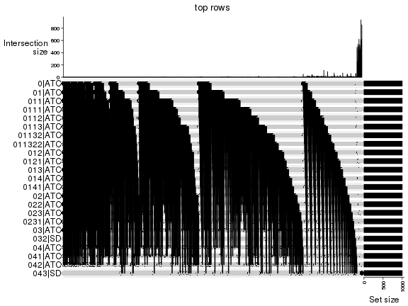


### UMAP plot

UMAP plot which shows how samples are separated.


<script>
$( function() {
	$( '#tabs-dimension-reduction-by-depth' ).tabs();
} );
</script>
<div id='tabs-dimension-reduction-by-depth'>
<ul>
<li><a href='#tab-dimension-reduction-by-depth-1'>n_signatures ≥ 1432</a></li>
<li><a href='#tab-dimension-reduction-by-depth-2'>n_signatures ≥ 1638</a></li>
<li><a href='#tab-dimension-reduction-by-depth-3'>n_signatures ≥ 1706</a></li>
<li><a href='#tab-dimension-reduction-by-depth-4'>n_signatures ≥ 2229</a></li>
<li><a href='#tab-dimension-reduction-by-depth-5'>n_signatures ≥ 2626</a></li>
<li><a href='#tab-dimension-reduction-by-depth-6'>n_signatures ≥ 3059</a></li>
<li><a href='#tab-dimension-reduction-by-depth-7'>n_signatures ≥ 3096</a></li>
<li><a href='#tab-dimension-reduction-by-depth-8'>n_signatures ≥ 3261</a></li>
<li><a href='#tab-dimension-reduction-by-depth-9'>n_signatures ≥ 3587</a></li>
<li><a href='#tab-dimension-reduction-by-depth-10'>n_signatures ≥ 3848</a></li>
<li><a href='#tab-dimension-reduction-by-depth-11'>n_signatures ≥ 5120</a></li>
<li><a href='#tab-dimension-reduction-by-depth-12'>n_signatures ≥ 5424</a></li>
<li><a href='#tab-dimension-reduction-by-depth-13'>n_signatures ≥ 7771</a></li>
<li><a href='#tab-dimension-reduction-by-depth-14'>n_signatures ≥ 8689</a></li>
<li><a href='#tab-dimension-reduction-by-depth-15'>n_signatures ≥ 9292</a></li>
<li><a href='#tab-dimension-reduction-by-depth-16'>n_signatures ≥ 10155</a></li>
<li><a href='#tab-dimension-reduction-by-depth-17'>n_signatures ≥ 12210</a></li>
<li><a href='#tab-dimension-reduction-by-depth-18'>n_signatures ≥ 12653</a></li>
<li><a href='#tab-dimension-reduction-by-depth-19'>n_signatures ≥ 13441</a></li>
<li><a href='#tab-dimension-reduction-by-depth-20'>n_signatures ≥ 18520</a></li>
<li><a href='#tab-dimension-reduction-by-depth-21'>n_signatures ≥ 20760</a></li>
<li><a href='#tab-dimension-reduction-by-depth-22'>n_signatures ≥ 20900</a></li>
<li><a href='#tab-dimension-reduction-by-depth-23'>n_signatures ≥ 36291</a></li>
</ul>
<div id='tab-dimension-reduction-by-depth-1'>
<pre><code class="r">par(mfrow = c(1, 2))
dimension_reduction(res_rh, merge_node = merge_node_param(min_n_signatures = 1432),
    method = &quot;UMAP&quot;, top_value_method = &quot;SD&quot;, top_n = 40000, scale_rows = FALSE)
dimension_reduction(res_rh, merge_node = merge_node_param(min_n_signatures = 1432),
    method = &quot;UMAP&quot;, top_value_method = &quot;ATC&quot;, top_n = 40000, scale_rows = TRUE)
</code></pre>

<p>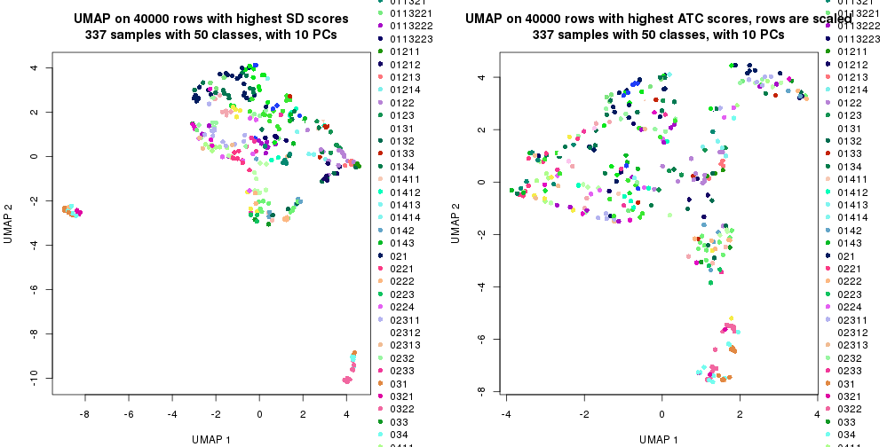</p>

</div>
<div id='tab-dimension-reduction-by-depth-2'>
<pre><code class="r">par(mfrow = c(1, 2))
dimension_reduction(res_rh, merge_node = merge_node_param(min_n_signatures = 1638),
    method = &quot;UMAP&quot;, top_value_method = &quot;SD&quot;, top_n = 40000, scale_rows = FALSE)
dimension_reduction(res_rh, merge_node = merge_node_param(min_n_signatures = 1638),
    method = &quot;UMAP&quot;, top_value_method = &quot;ATC&quot;, top_n = 40000, scale_rows = TRUE)
</code></pre>

<p>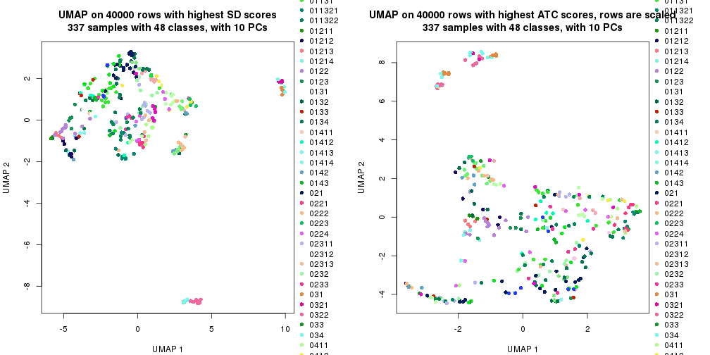</p>

</div>
<div id='tab-dimension-reduction-by-depth-3'>
<pre><code class="r">par(mfrow = c(1, 2))
dimension_reduction(res_rh, merge_node = merge_node_param(min_n_signatures = 1706),
    method = &quot;UMAP&quot;, top_value_method = &quot;SD&quot;, top_n = 40000, scale_rows = FALSE)
dimension_reduction(res_rh, merge_node = merge_node_param(min_n_signatures = 1706),
    method = &quot;UMAP&quot;, top_value_method = &quot;ATC&quot;, top_n = 40000, scale_rows = TRUE)
</code></pre>

<p>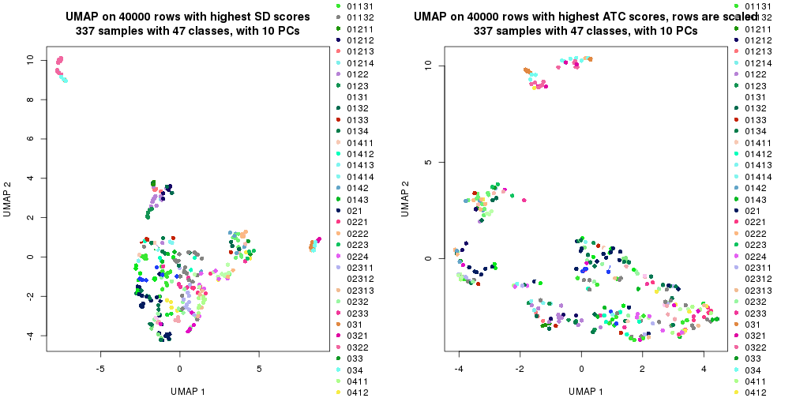</p>

</div>
<div id='tab-dimension-reduction-by-depth-4'>
<pre><code class="r">par(mfrow = c(1, 2))
dimension_reduction(res_rh, merge_node = merge_node_param(min_n_signatures = 2229),
    method = &quot;UMAP&quot;, top_value_method = &quot;SD&quot;, top_n = 40000, scale_rows = FALSE)
dimension_reduction(res_rh, merge_node = merge_node_param(min_n_signatures = 2229),
    method = &quot;UMAP&quot;, top_value_method = &quot;ATC&quot;, top_n = 40000, scale_rows = TRUE)
</code></pre>

<p>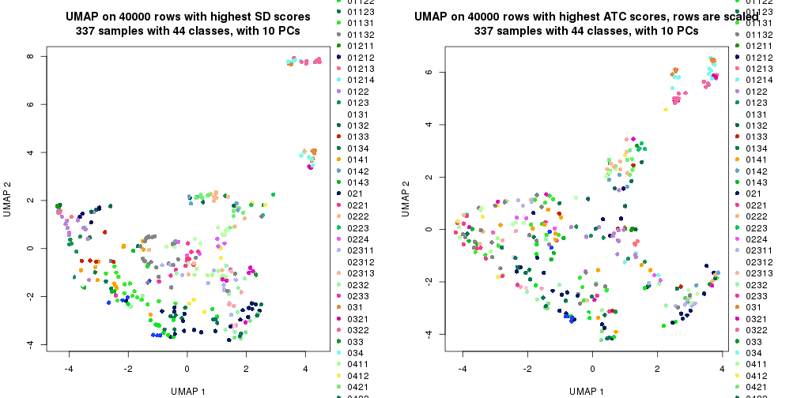</p>

</div>
<div id='tab-dimension-reduction-by-depth-5'>
<pre><code class="r">par(mfrow = c(1, 2))
dimension_reduction(res_rh, merge_node = merge_node_param(min_n_signatures = 2626),
    method = &quot;UMAP&quot;, top_value_method = &quot;SD&quot;, top_n = 40000, scale_rows = FALSE)
dimension_reduction(res_rh, merge_node = merge_node_param(min_n_signatures = 2626),
    method = &quot;UMAP&quot;, top_value_method = &quot;ATC&quot;, top_n = 40000, scale_rows = TRUE)
</code></pre>

<p>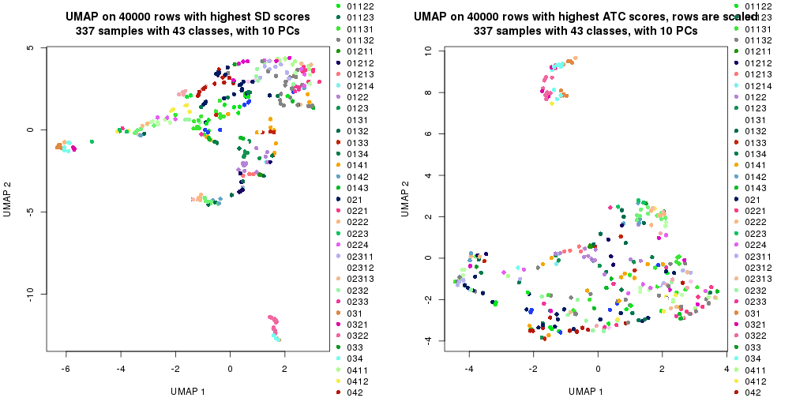</p>

</div>
<div id='tab-dimension-reduction-by-depth-6'>
<pre><code class="r">par(mfrow = c(1, 2))
dimension_reduction(res_rh, merge_node = merge_node_param(min_n_signatures = 3059),
    method = &quot;UMAP&quot;, top_value_method = &quot;SD&quot;, top_n = 40000, scale_rows = FALSE)
dimension_reduction(res_rh, merge_node = merge_node_param(min_n_signatures = 3059),
    method = &quot;UMAP&quot;, top_value_method = &quot;ATC&quot;, top_n = 40000, scale_rows = TRUE)
</code></pre>

<p>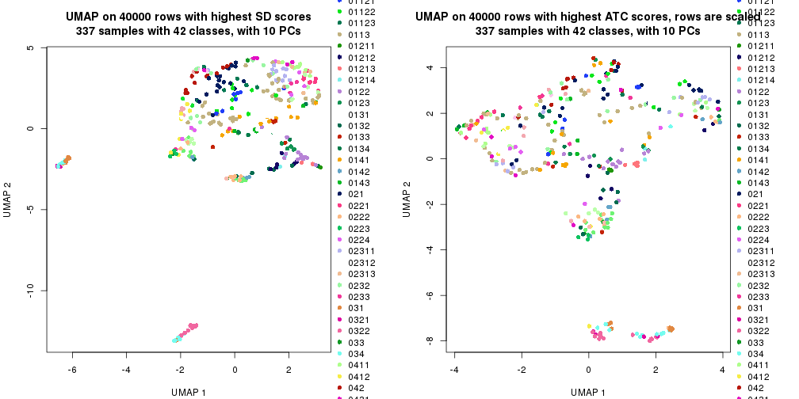</p>

</div>
<div id='tab-dimension-reduction-by-depth-7'>
<pre><code class="r">par(mfrow = c(1, 2))
dimension_reduction(res_rh, merge_node = merge_node_param(min_n_signatures = 3096),
    method = &quot;UMAP&quot;, top_value_method = &quot;SD&quot;, top_n = 40000, scale_rows = FALSE)
dimension_reduction(res_rh, merge_node = merge_node_param(min_n_signatures = 3096),
    method = &quot;UMAP&quot;, top_value_method = &quot;ATC&quot;, top_n = 40000, scale_rows = TRUE)
</code></pre>

<p>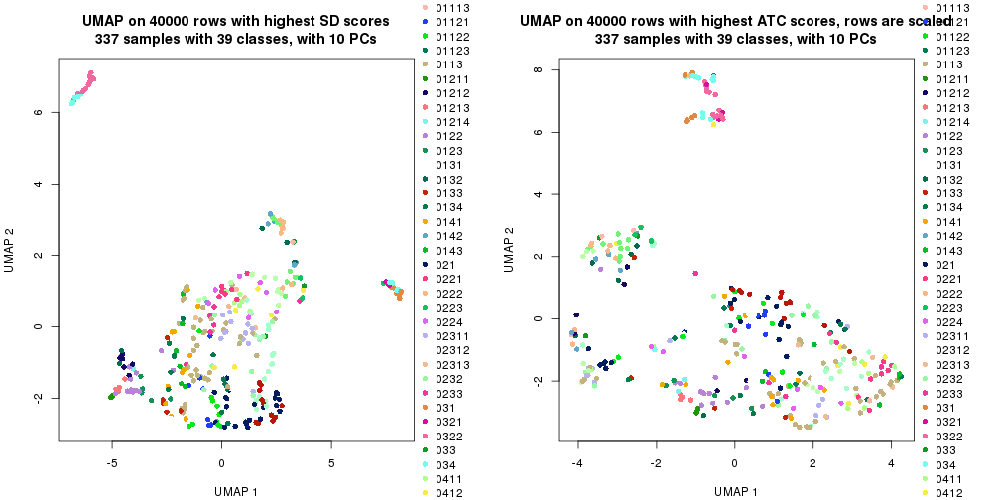</p>

</div>
<div id='tab-dimension-reduction-by-depth-8'>
<pre><code class="r">par(mfrow = c(1, 2))
dimension_reduction(res_rh, merge_node = merge_node_param(min_n_signatures = 3261),
    method = &quot;UMAP&quot;, top_value_method = &quot;SD&quot;, top_n = 40000, scale_rows = FALSE)
dimension_reduction(res_rh, merge_node = merge_node_param(min_n_signatures = 3261),
    method = &quot;UMAP&quot;, top_value_method = &quot;ATC&quot;, top_n = 40000, scale_rows = TRUE)
</code></pre>

<p>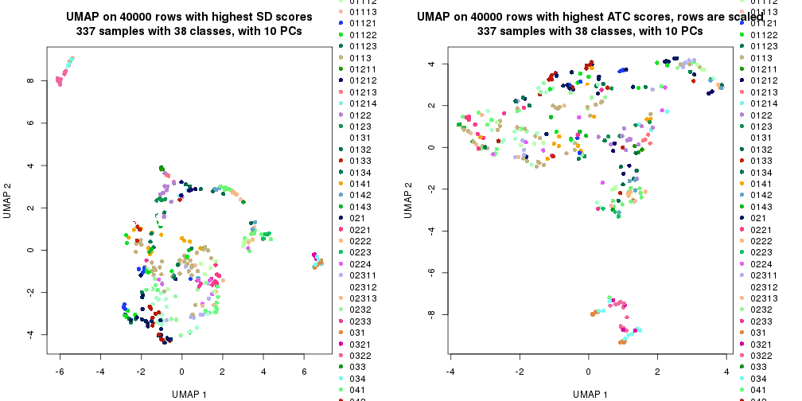</p>

</div>
<div id='tab-dimension-reduction-by-depth-9'>
<pre><code class="r">par(mfrow = c(1, 2))
dimension_reduction(res_rh, merge_node = merge_node_param(min_n_signatures = 3587),
    method = &quot;UMAP&quot;, top_value_method = &quot;SD&quot;, top_n = 40000, scale_rows = FALSE)
dimension_reduction(res_rh, merge_node = merge_node_param(min_n_signatures = 3587),
    method = &quot;UMAP&quot;, top_value_method = &quot;ATC&quot;, top_n = 40000, scale_rows = TRUE)
</code></pre>

<p>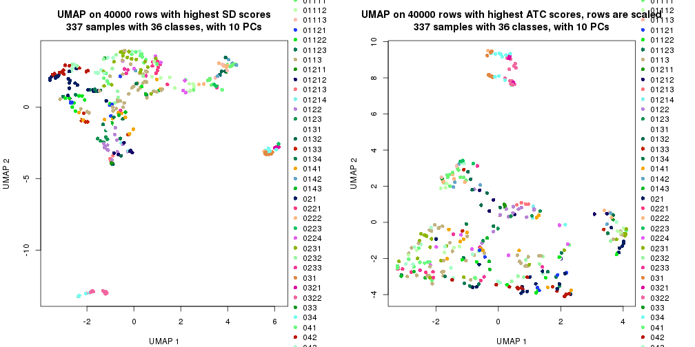</p>

</div>
<div id='tab-dimension-reduction-by-depth-10'>
<pre><code class="r">par(mfrow = c(1, 2))
dimension_reduction(res_rh, merge_node = merge_node_param(min_n_signatures = 3848),
    method = &quot;UMAP&quot;, top_value_method = &quot;SD&quot;, top_n = 40000, scale_rows = FALSE)
dimension_reduction(res_rh, merge_node = merge_node_param(min_n_signatures = 3848),
    method = &quot;UMAP&quot;, top_value_method = &quot;ATC&quot;, top_n = 40000, scale_rows = TRUE)
</code></pre>

<p>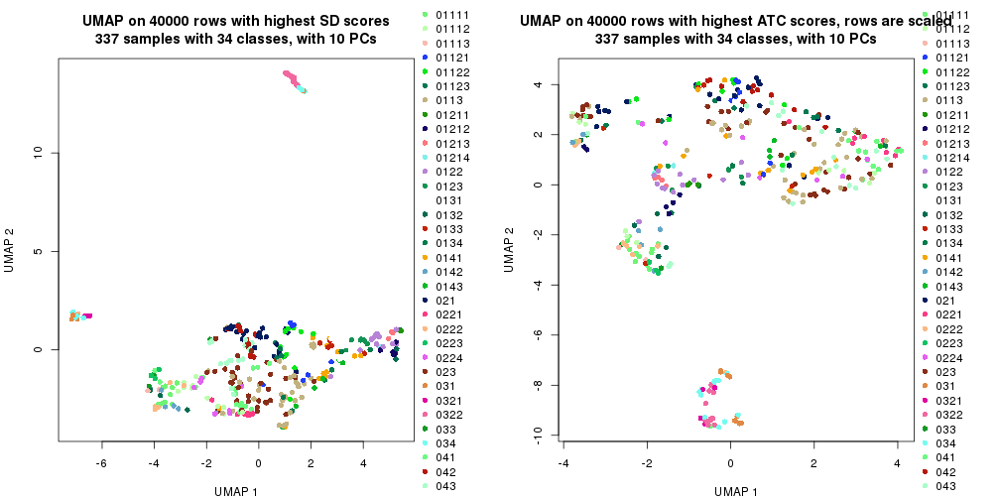</p>

</div>
<div id='tab-dimension-reduction-by-depth-11'>
<pre><code class="r">par(mfrow = c(1, 2))
dimension_reduction(res_rh, merge_node = merge_node_param(min_n_signatures = 5120),
    method = &quot;UMAP&quot;, top_value_method = &quot;SD&quot;, top_n = 40000, scale_rows = FALSE)
dimension_reduction(res_rh, merge_node = merge_node_param(min_n_signatures = 5120),
    method = &quot;UMAP&quot;, top_value_method = &quot;ATC&quot;, top_n = 40000, scale_rows = TRUE)
</code></pre>

<p>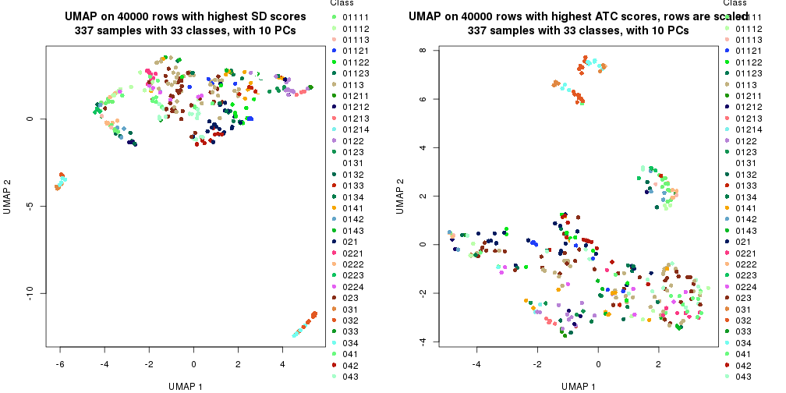</p>

</div>
<div id='tab-dimension-reduction-by-depth-12'>
<pre><code class="r">par(mfrow = c(1, 2))
dimension_reduction(res_rh, merge_node = merge_node_param(min_n_signatures = 5424),
    method = &quot;UMAP&quot;, top_value_method = &quot;SD&quot;, top_n = 40000, scale_rows = FALSE)
dimension_reduction(res_rh, merge_node = merge_node_param(min_n_signatures = 5424),
    method = &quot;UMAP&quot;, top_value_method = &quot;ATC&quot;, top_n = 40000, scale_rows = TRUE)
</code></pre>

<p>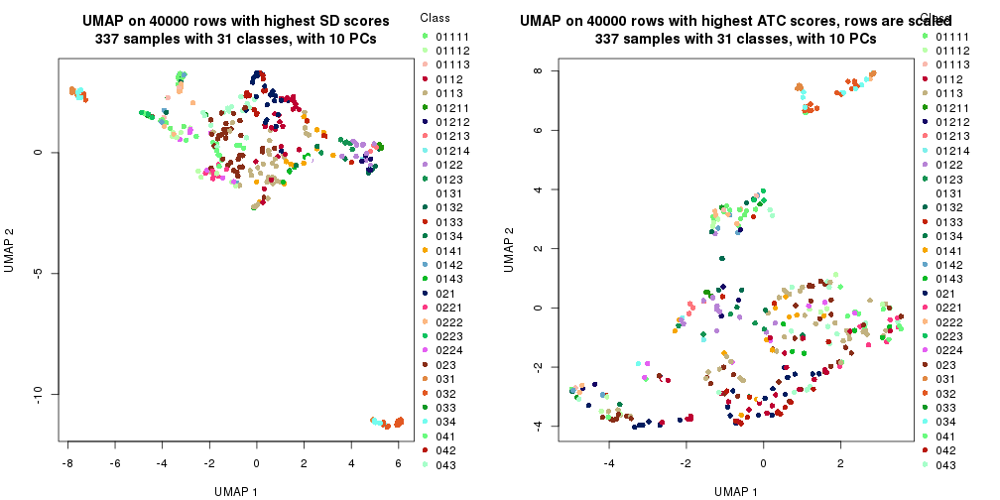</p>

</div>
<div id='tab-dimension-reduction-by-depth-13'>
<pre><code class="r">par(mfrow = c(1, 2))
dimension_reduction(res_rh, merge_node = merge_node_param(min_n_signatures = 7771),
    method = &quot;UMAP&quot;, top_value_method = &quot;SD&quot;, top_n = 40000, scale_rows = FALSE)
dimension_reduction(res_rh, merge_node = merge_node_param(min_n_signatures = 7771),
    method = &quot;UMAP&quot;, top_value_method = &quot;ATC&quot;, top_n = 40000, scale_rows = TRUE)
</code></pre>

<p>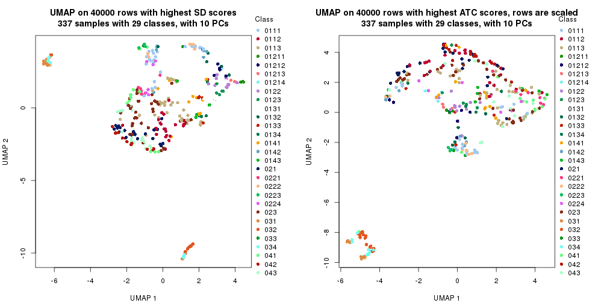</p>

</div>
<div id='tab-dimension-reduction-by-depth-14'>
<pre><code class="r">par(mfrow = c(1, 2))
dimension_reduction(res_rh, merge_node = merge_node_param(min_n_signatures = 8689),
    method = &quot;UMAP&quot;, top_value_method = &quot;SD&quot;, top_n = 40000, scale_rows = FALSE)
dimension_reduction(res_rh, merge_node = merge_node_param(min_n_signatures = 8689),
    method = &quot;UMAP&quot;, top_value_method = &quot;ATC&quot;, top_n = 40000, scale_rows = TRUE)
</code></pre>

<p>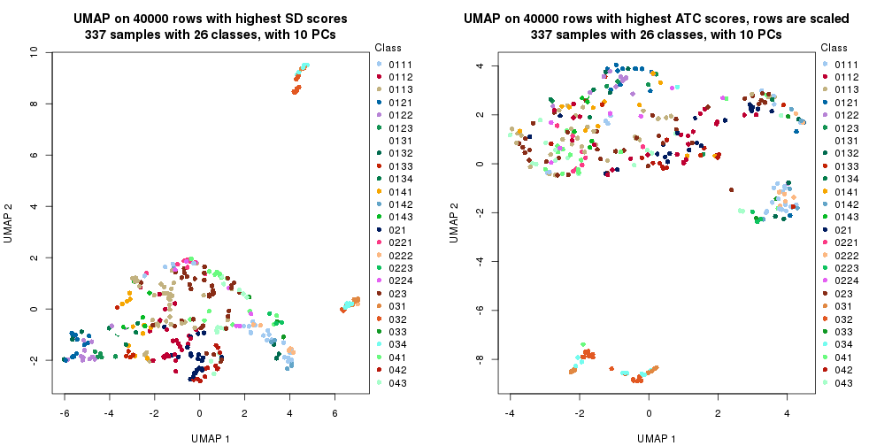</p>

</div>
<div id='tab-dimension-reduction-by-depth-15'>
<pre><code class="r">par(mfrow = c(1, 2))
dimension_reduction(res_rh, merge_node = merge_node_param(min_n_signatures = 9292),
    method = &quot;UMAP&quot;, top_value_method = &quot;SD&quot;, top_n = 40000, scale_rows = FALSE)
dimension_reduction(res_rh, merge_node = merge_node_param(min_n_signatures = 9292),
    method = &quot;UMAP&quot;, top_value_method = &quot;ATC&quot;, top_n = 40000, scale_rows = TRUE)
</code></pre>

<p>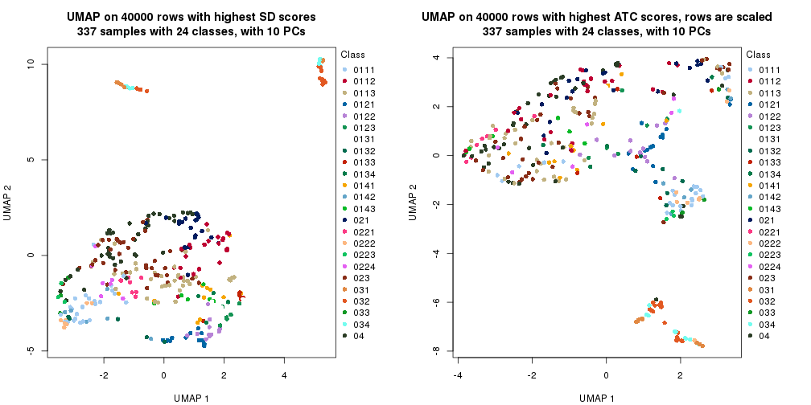</p>

</div>
<div id='tab-dimension-reduction-by-depth-16'>
<pre><code class="r">par(mfrow = c(1, 2))
dimension_reduction(res_rh, merge_node = merge_node_param(min_n_signatures = 10155),
    method = &quot;UMAP&quot;, top_value_method = &quot;SD&quot;, top_n = 40000, scale_rows = FALSE)
dimension_reduction(res_rh, merge_node = merge_node_param(min_n_signatures = 10155),
    method = &quot;UMAP&quot;, top_value_method = &quot;ATC&quot;, top_n = 40000, scale_rows = TRUE)
</code></pre>

<p>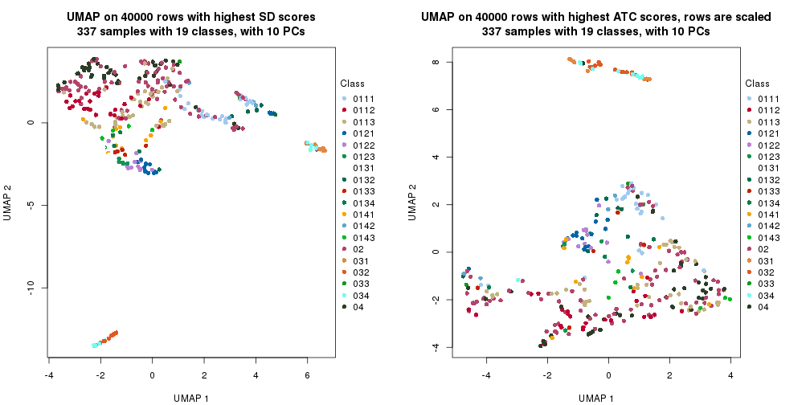</p>

</div>
<div id='tab-dimension-reduction-by-depth-17'>
<pre><code class="r">par(mfrow = c(1, 2))
dimension_reduction(res_rh, merge_node = merge_node_param(min_n_signatures = 12210),
    method = &quot;UMAP&quot;, top_value_method = &quot;SD&quot;, top_n = 40000, scale_rows = FALSE)
dimension_reduction(res_rh, merge_node = merge_node_param(min_n_signatures = 12210),
    method = &quot;UMAP&quot;, top_value_method = &quot;ATC&quot;, top_n = 40000, scale_rows = TRUE)
</code></pre>

<p>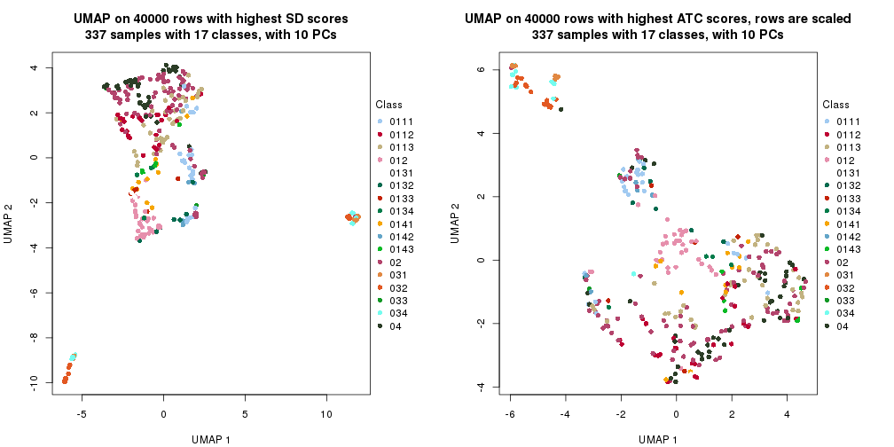</p>

</div>
<div id='tab-dimension-reduction-by-depth-18'>
<pre><code class="r">par(mfrow = c(1, 2))
dimension_reduction(res_rh, merge_node = merge_node_param(min_n_signatures = 12653),
    method = &quot;UMAP&quot;, top_value_method = &quot;SD&quot;, top_n = 40000, scale_rows = FALSE)
dimension_reduction(res_rh, merge_node = merge_node_param(min_n_signatures = 12653),
    method = &quot;UMAP&quot;, top_value_method = &quot;ATC&quot;, top_n = 40000, scale_rows = TRUE)
</code></pre>

<p>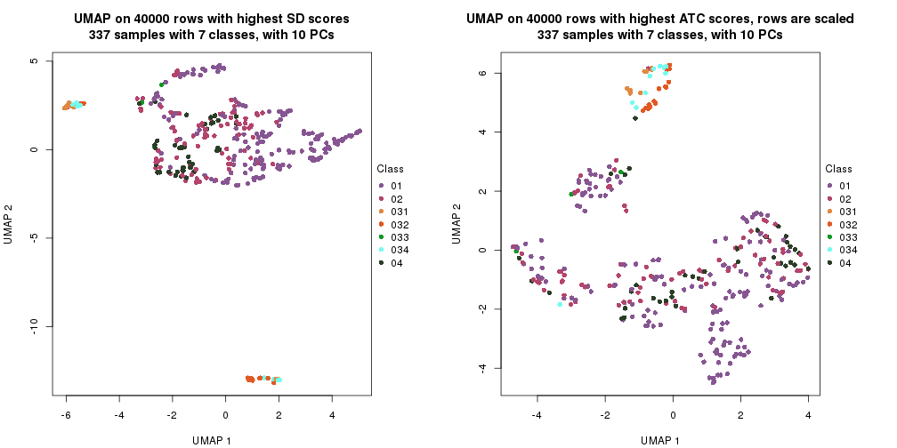</p>

</div>
<div id='tab-dimension-reduction-by-depth-19'>
<pre><code class="r">par(mfrow = c(1, 2))
dimension_reduction(res_rh, merge_node = merge_node_param(min_n_signatures = 13441),
    method = &quot;UMAP&quot;, top_value_method = &quot;SD&quot;, top_n = 40000, scale_rows = FALSE)
dimension_reduction(res_rh, merge_node = merge_node_param(min_n_signatures = 13441),
    method = &quot;UMAP&quot;, top_value_method = &quot;ATC&quot;, top_n = 40000, scale_rows = TRUE)
</code></pre>

<p>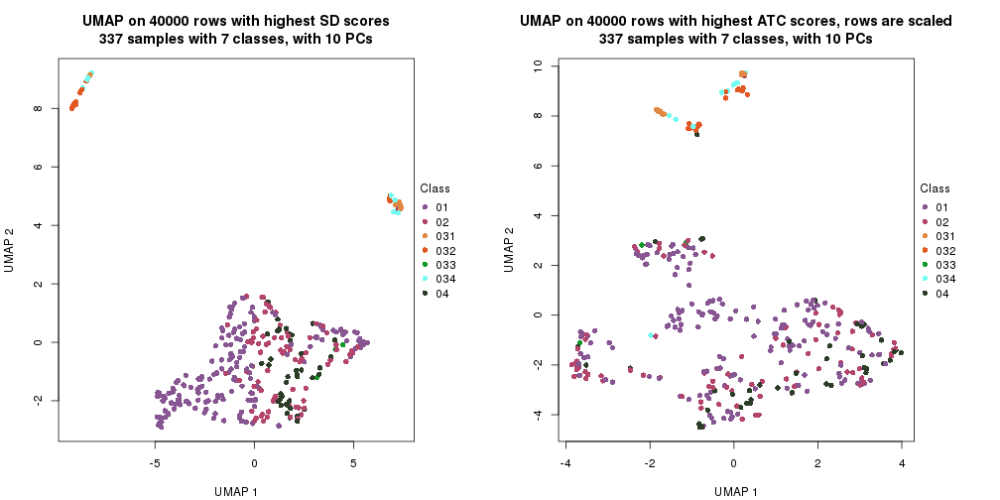</p>

</div>
<div id='tab-dimension-reduction-by-depth-20'>
<pre><code class="r">par(mfrow = c(1, 2))
dimension_reduction(res_rh, merge_node = merge_node_param(min_n_signatures = 18520),
    method = &quot;UMAP&quot;, top_value_method = &quot;SD&quot;, top_n = 40000, scale_rows = FALSE)
dimension_reduction(res_rh, merge_node = merge_node_param(min_n_signatures = 18520),
    method = &quot;UMAP&quot;, top_value_method = &quot;ATC&quot;, top_n = 40000, scale_rows = TRUE)
</code></pre>

<p>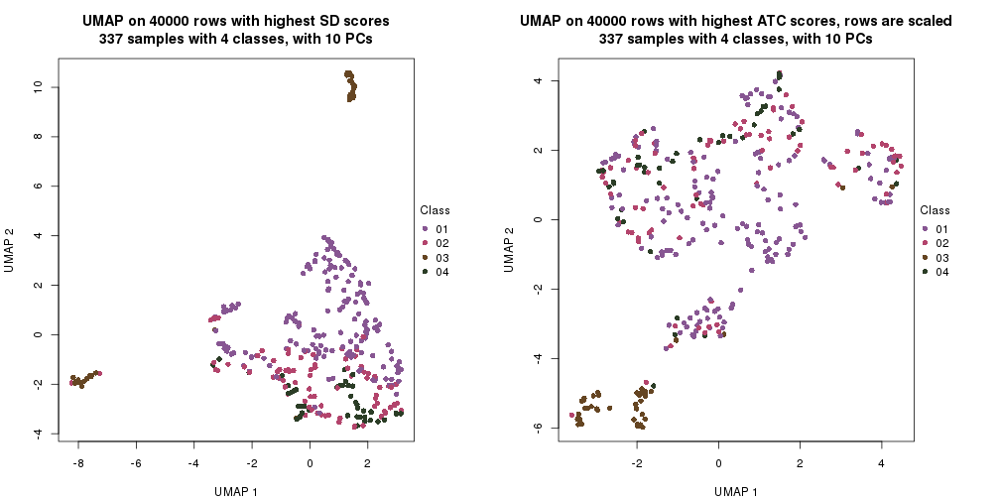</p>

</div>
<div id='tab-dimension-reduction-by-depth-21'>
<pre><code class="r">par(mfrow = c(1, 2))
dimension_reduction(res_rh, merge_node = merge_node_param(min_n_signatures = 20760),
    method = &quot;UMAP&quot;, top_value_method = &quot;SD&quot;, top_n = 40000, scale_rows = FALSE)
dimension_reduction(res_rh, merge_node = merge_node_param(min_n_signatures = 20760),
    method = &quot;UMAP&quot;, top_value_method = &quot;ATC&quot;, top_n = 40000, scale_rows = TRUE)
</code></pre>

<p>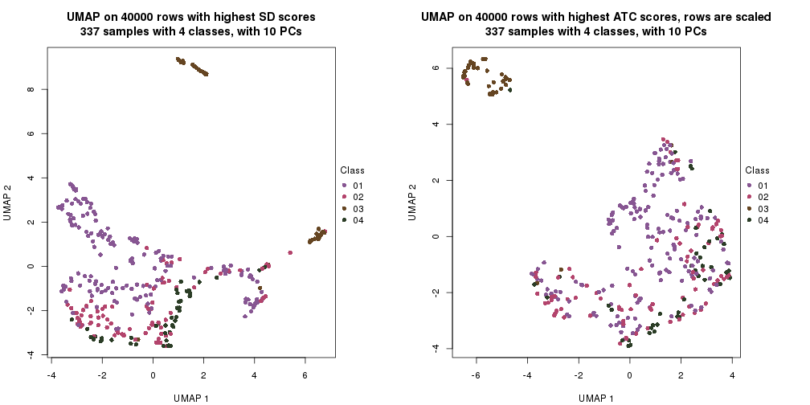</p>

</div>
<div id='tab-dimension-reduction-by-depth-22'>
<pre><code class="r">par(mfrow = c(1, 2))
dimension_reduction(res_rh, merge_node = merge_node_param(min_n_signatures = 20900),
    method = &quot;UMAP&quot;, top_value_method = &quot;SD&quot;, top_n = 40000, scale_rows = FALSE)
dimension_reduction(res_rh, merge_node = merge_node_param(min_n_signatures = 20900),
    method = &quot;UMAP&quot;, top_value_method = &quot;ATC&quot;, top_n = 40000, scale_rows = TRUE)
</code></pre>

<p>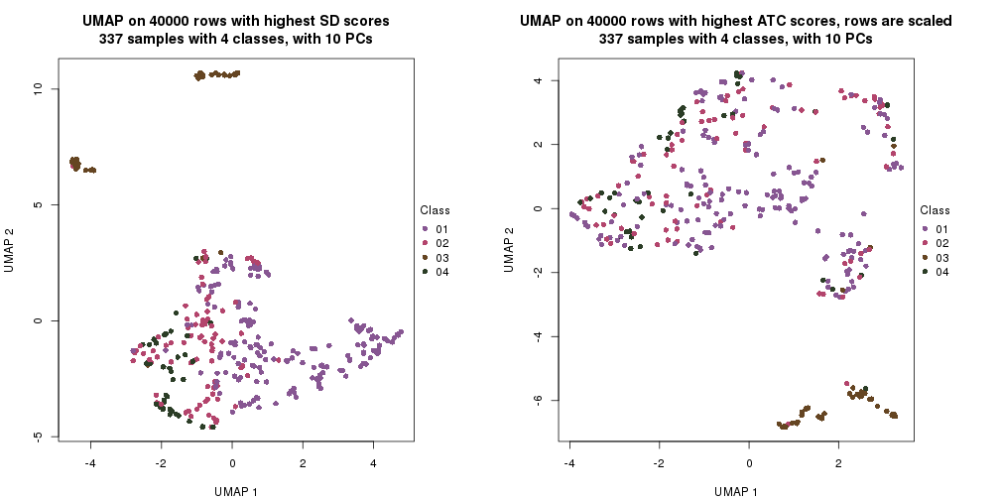</p>

</div>
<div id='tab-dimension-reduction-by-depth-23'>
<pre><code class="r">par(mfrow = c(1, 2))
dimension_reduction(res_rh, merge_node = merge_node_param(min_n_signatures = 36291),
    method = &quot;UMAP&quot;, top_value_method = &quot;SD&quot;, top_n = 40000, scale_rows = FALSE)
dimension_reduction(res_rh, merge_node = merge_node_param(min_n_signatures = 36291),
    method = &quot;UMAP&quot;, top_value_method = &quot;ATC&quot;, top_n = 40000, scale_rows = TRUE)
</code></pre>

<p>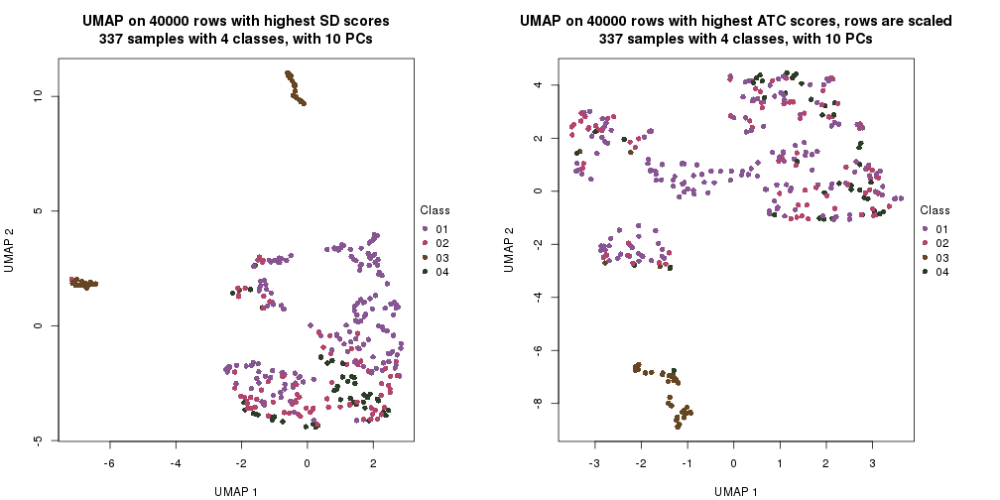</p>

</div>
</div>


### Signature heatmap

Signatures on the heatmap are the union of all signatures found on every node
on the hierarchy. The number of k-means on rows are automatically selected by the function.


<script>
$( function() {
	$( '#tabs-get-signatures-from-hierarchical-partition' ).tabs();
} );
</script>
<div id='tabs-get-signatures-from-hierarchical-partition'>
<ul>
<li><a href='#tab-get-signatures-from-hierarchical-partition-1'>n_signatures ≥ 1432</a></li>
<li><a href='#tab-get-signatures-from-hierarchical-partition-2'>n_signatures ≥ 1638</a></li>
<li><a href='#tab-get-signatures-from-hierarchical-partition-3'>n_signatures ≥ 1706</a></li>
<li><a href='#tab-get-signatures-from-hierarchical-partition-4'>n_signatures ≥ 2229</a></li>
<li><a href='#tab-get-signatures-from-hierarchical-partition-5'>n_signatures ≥ 2626</a></li>
<li><a href='#tab-get-signatures-from-hierarchical-partition-6'>n_signatures ≥ 3059</a></li>
<li><a href='#tab-get-signatures-from-hierarchical-partition-7'>n_signatures ≥ 3096</a></li>
<li><a href='#tab-get-signatures-from-hierarchical-partition-8'>n_signatures ≥ 3261</a></li>
<li><a href='#tab-get-signatures-from-hierarchical-partition-9'>n_signatures ≥ 3587</a></li>
<li><a href='#tab-get-signatures-from-hierarchical-partition-10'>n_signatures ≥ 3848</a></li>
<li><a href='#tab-get-signatures-from-hierarchical-partition-11'>n_signatures ≥ 5120</a></li>
<li><a href='#tab-get-signatures-from-hierarchical-partition-12'>n_signatures ≥ 5424</a></li>
<li><a href='#tab-get-signatures-from-hierarchical-partition-13'>n_signatures ≥ 7771</a></li>
<li><a href='#tab-get-signatures-from-hierarchical-partition-14'>n_signatures ≥ 8689</a></li>
<li><a href='#tab-get-signatures-from-hierarchical-partition-15'>n_signatures ≥ 9292</a></li>
<li><a href='#tab-get-signatures-from-hierarchical-partition-16'>n_signatures ≥ 10155</a></li>
<li><a href='#tab-get-signatures-from-hierarchical-partition-17'>n_signatures ≥ 12210</a></li>
<li><a href='#tab-get-signatures-from-hierarchical-partition-18'>n_signatures ≥ 12653</a></li>
<li><a href='#tab-get-signatures-from-hierarchical-partition-19'>n_signatures ≥ 13441</a></li>
<li><a href='#tab-get-signatures-from-hierarchical-partition-20'>n_signatures ≥ 18520</a></li>
<li><a href='#tab-get-signatures-from-hierarchical-partition-21'>n_signatures ≥ 20760</a></li>
<li><a href='#tab-get-signatures-from-hierarchical-partition-22'>n_signatures ≥ 20900</a></li>
<li><a href='#tab-get-signatures-from-hierarchical-partition-23'>n_signatures ≥ 36291</a></li>
</ul>
<div id='tab-get-signatures-from-hierarchical-partition-1'>
<pre><code class="r">get_signatures(res_rh, merge_node = merge_node_param(min_n_signatures = 1432))
</code></pre>

<p>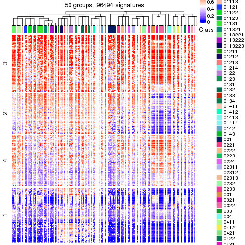</p>

</div>
<div id='tab-get-signatures-from-hierarchical-partition-2'>
<pre><code class="r">get_signatures(res_rh, merge_node = merge_node_param(min_n_signatures = 1638))
</code></pre>

<p>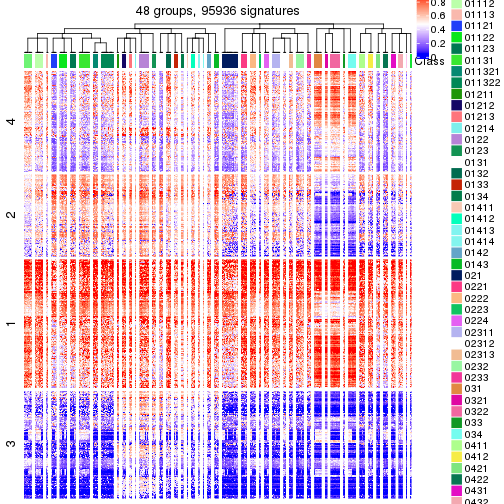</p>

</div>
<div id='tab-get-signatures-from-hierarchical-partition-3'>
<pre><code class="r">get_signatures(res_rh, merge_node = merge_node_param(min_n_signatures = 1706))
</code></pre>

<p>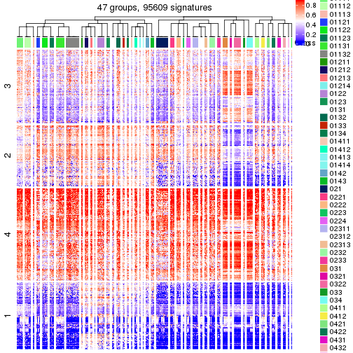</p>

</div>
<div id='tab-get-signatures-from-hierarchical-partition-4'>
<pre><code class="r">get_signatures(res_rh, merge_node = merge_node_param(min_n_signatures = 2229))
</code></pre>

<p>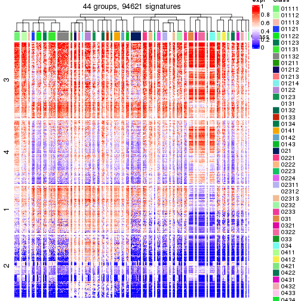</p>

</div>
<div id='tab-get-signatures-from-hierarchical-partition-5'>
<pre><code class="r">get_signatures(res_rh, merge_node = merge_node_param(min_n_signatures = 2626))
</code></pre>

<p>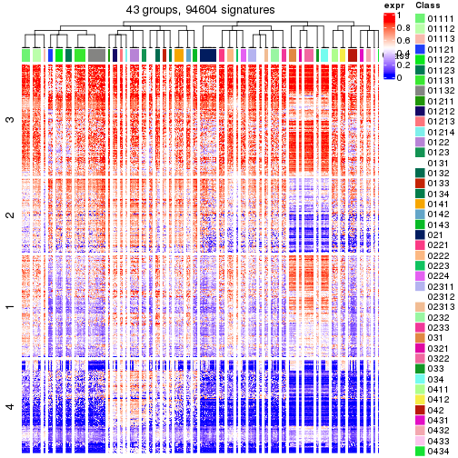</p>

</div>
<div id='tab-get-signatures-from-hierarchical-partition-6'>
<pre><code class="r">get_signatures(res_rh, merge_node = merge_node_param(min_n_signatures = 3059))
</code></pre>

<p>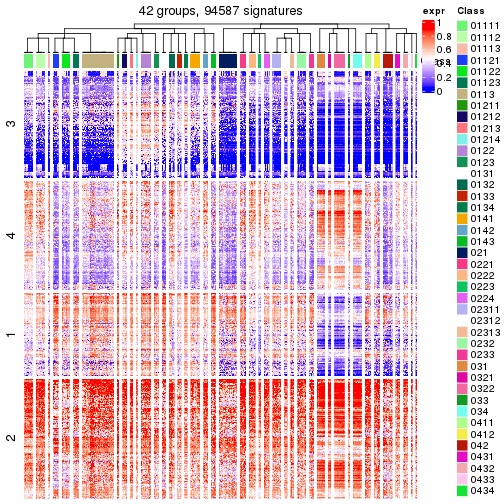</p>

</div>
<div id='tab-get-signatures-from-hierarchical-partition-7'>
<pre><code class="r">get_signatures(res_rh, merge_node = merge_node_param(min_n_signatures = 3096))
</code></pre>

<p>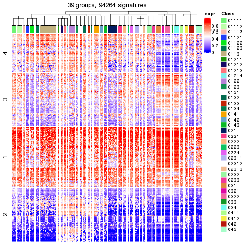</p>

</div>
<div id='tab-get-signatures-from-hierarchical-partition-8'>
<pre><code class="r">get_signatures(res_rh, merge_node = merge_node_param(min_n_signatures = 3261))
</code></pre>

<p>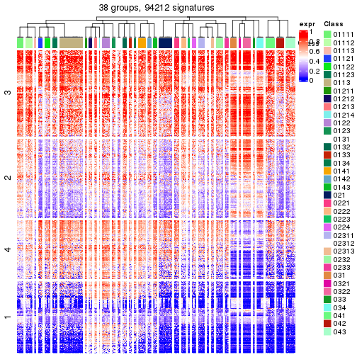</p>

</div>
<div id='tab-get-signatures-from-hierarchical-partition-9'>
<pre><code class="r">get_signatures(res_rh, merge_node = merge_node_param(min_n_signatures = 3587))
</code></pre>

<p>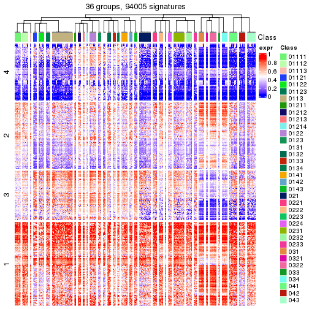</p>

</div>
<div id='tab-get-signatures-from-hierarchical-partition-10'>
<pre><code class="r">get_signatures(res_rh, merge_node = merge_node_param(min_n_signatures = 3848))
</code></pre>

<p>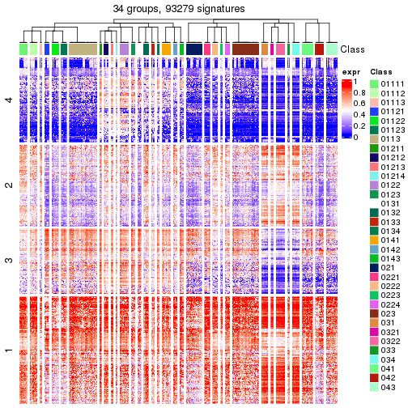</p>

</div>
<div id='tab-get-signatures-from-hierarchical-partition-11'>
<pre><code class="r">get_signatures(res_rh, merge_node = merge_node_param(min_n_signatures = 5120))
</code></pre>

<p>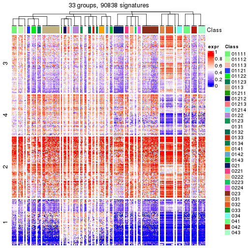</p>

</div>
<div id='tab-get-signatures-from-hierarchical-partition-12'>
<pre><code class="r">get_signatures(res_rh, merge_node = merge_node_param(min_n_signatures = 5424))
</code></pre>

<p>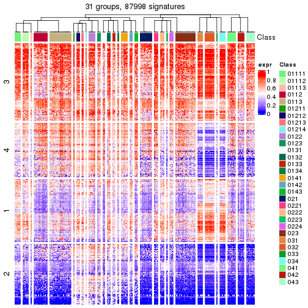</p>

</div>
<div id='tab-get-signatures-from-hierarchical-partition-13'>
<pre><code class="r">get_signatures(res_rh, merge_node = merge_node_param(min_n_signatures = 7771))
</code></pre>

<p>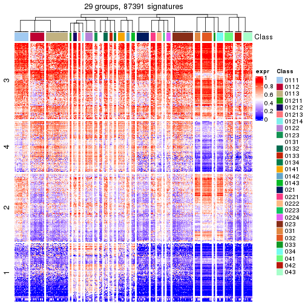</p>

</div>
<div id='tab-get-signatures-from-hierarchical-partition-14'>
<pre><code class="r">get_signatures(res_rh, merge_node = merge_node_param(min_n_signatures = 8689))
</code></pre>

<p>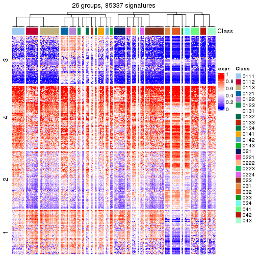</p>

</div>
<div id='tab-get-signatures-from-hierarchical-partition-15'>
<pre><code class="r">get_signatures(res_rh, merge_node = merge_node_param(min_n_signatures = 9292))
</code></pre>

<p>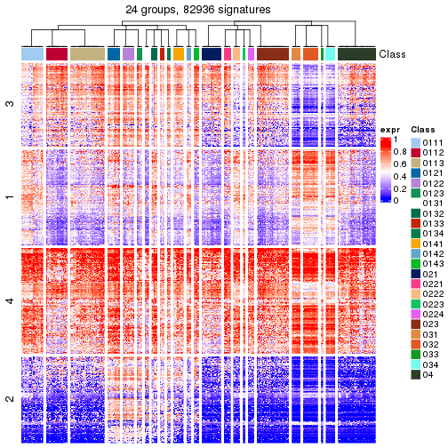</p>

</div>
<div id='tab-get-signatures-from-hierarchical-partition-16'>
<pre><code class="r">get_signatures(res_rh, merge_node = merge_node_param(min_n_signatures = 10155))
</code></pre>

<p>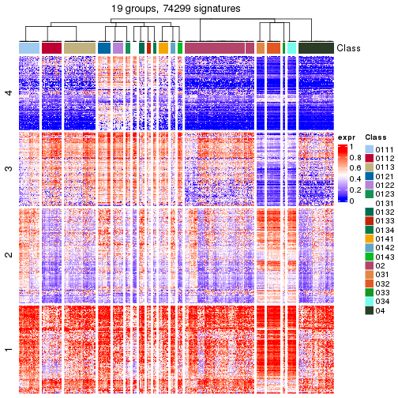</p>

</div>
<div id='tab-get-signatures-from-hierarchical-partition-17'>
<pre><code class="r">get_signatures(res_rh, merge_node = merge_node_param(min_n_signatures = 12210))
</code></pre>

<p>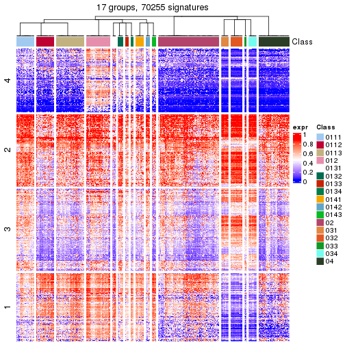</p>

</div>
<div id='tab-get-signatures-from-hierarchical-partition-18'>
<pre><code class="r">get_signatures(res_rh, merge_node = merge_node_param(min_n_signatures = 12653))
</code></pre>

<p></p>

</div>
<div id='tab-get-signatures-from-hierarchical-partition-19'>
<pre><code class="r">get_signatures(res_rh, merge_node = merge_node_param(min_n_signatures = 13441))
</code></pre>

<p>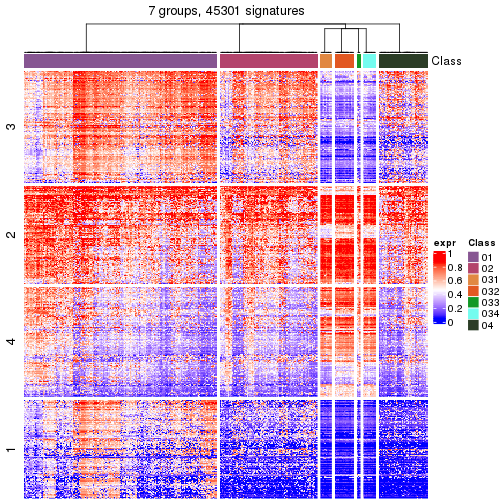</p>

</div>
<div id='tab-get-signatures-from-hierarchical-partition-20'>
<pre><code class="r">get_signatures(res_rh, merge_node = merge_node_param(min_n_signatures = 18520))
</code></pre>

<p>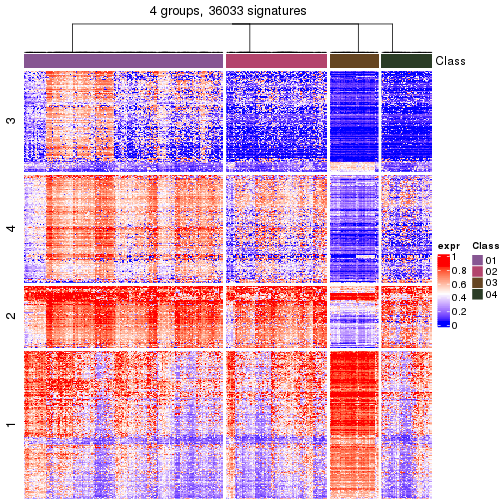</p>

</div>
<div id='tab-get-signatures-from-hierarchical-partition-21'>
<pre><code class="r">get_signatures(res_rh, merge_node = merge_node_param(min_n_signatures = 20760))
</code></pre>

<p>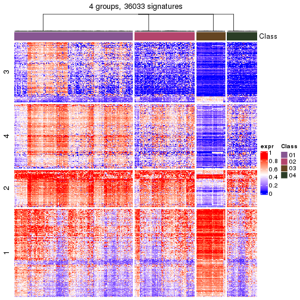</p>

</div>
<div id='tab-get-signatures-from-hierarchical-partition-22'>
<pre><code class="r">get_signatures(res_rh, merge_node = merge_node_param(min_n_signatures = 20900))
</code></pre>

<p></p>

</div>
<div id='tab-get-signatures-from-hierarchical-partition-23'>
<pre><code class="r">get_signatures(res_rh, merge_node = merge_node_param(min_n_signatures = 36291))
</code></pre>

<p></p>

</div>
</div>


Compare signatures from different nodes:


```r
compare_signatures(res_rh, verbose = FALSE)
```

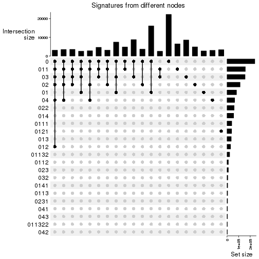

If there are too many signatures, `top_signatures = ...` can be set to only show the 
signatures with the highest FDRs. Note it only works on every node and the final signatures
are the union of all signatures of all nodes.


```r
# code only for demonstration
# e.g. to show the top 500 most significant rows on each node.
tb = get_signature(res_rh, top_signatures = 500)
```


## Results for each node


---------------------------------------------------


### Node0


Child nodes: 
                [Node01](#Node01)
        ,
                [Node02](#Node02)
        ,
                [Node03](#Node03)
        ,
                [Node04](#Node04)
        .


The object with results only for a single top-value method and a single partitioning method 
can be extracted as:

```r
res = res_rh["0"]
```

A summary of `res` and all the functions that can be applied to it:

```r
res
```

```
#> A 'ConsensusPartition' object with k = 2, 3, 4, 5, 6, 7, 8.
#>   On a matrix with 30000 rows and 337 columns.
#>   Top rows (1000) are extracted by 'ATC' method.
#>   Subgroups are detected by 'skmeans' method.
#>   Performed in total 350 partitions by row resampling.
#>   Best k for subgroups seems to be 5.
#> 
#> Following methods can be applied to this 'ConsensusPartition' object:
#>  [1] "cola_report"             "collect_classes"         "collect_plots"          
#>  [4] "collect_stats"           "colnames"                "compare_partitions"     
#>  [7] "compare_signatures"      "consensus_heatmap"       "dimension_reduction"    
#> [10] "functional_enrichment"   "get_anno_col"            "get_anno"               
#> [13] "get_classes"             "get_consensus"           "get_matrix"             
#> [16] "get_membership"          "get_param"               "get_signatures"         
#> [19] "get_stats"               "is_best_k"               "is_stable_k"            
#> [22] "membership_heatmap"      "ncol"                    "nrow"                   
#> [25] "plot_ecdf"               "predict_classes"         "rownames"               
#> [28] "select_partition_number" "show"                    "suggest_best_k"         
#> [31] "test_to_known_factors"   "top_rows_heatmap"
```

`collect_plots()` function collects all the plots made from `res` for all `k` (number of subgroups)
into one single page to provide an easy and fast comparison between different `k`.

```r
collect_plots(res)
```

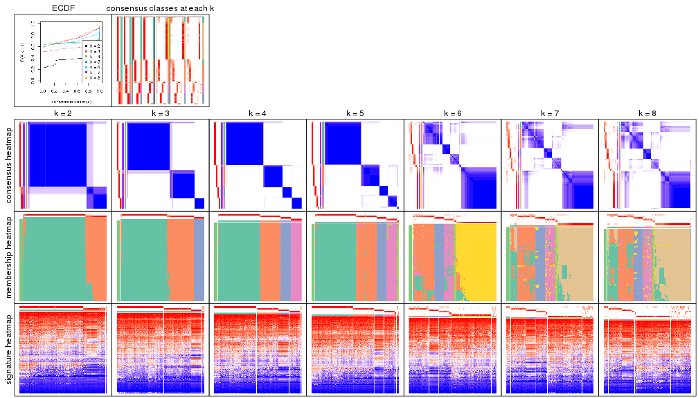

The plots are:

- The first row: a plot of the eCDF (empirical cumulative distribution
  function) curves of the consensus matrix for each `k` and the heatmap of
  predicted classes for each `k`.
- The second row: heatmaps of the consensus matrix for each `k`.
- The third row: heatmaps of the membership matrix for each `k`.
- The fouth row: heatmaps of the signatures for each `k`.

All the plots in panels can be made by individual functions and they are
plotted later in this section.

`select_partition_number()` produces several plots showing different
statistics for choosing "optimized" `k`. There are following statistics:

- eCDF curves of the consensus matrix for each `k`;
- 1-PAC. [The PAC score](https://en.wikipedia.org/wiki/Consensus_clustering#Over-interpretation_potential_of_consensus_clustering)
  measures the proportion of the ambiguous subgrouping.
- Mean silhouette score.
- Concordance. The mean probability of fiting the consensus subgroup labels in all
  partitions.
- Area increased. Denote $A_k$ as the area under the eCDF curve for current
  `k`, the area increased is defined as $A_k - A_{k-1}$.
- Rand index. The percent of pairs of samples that are both in a same cluster
  or both are not in a same cluster in the partition of k and k-1.
- Jaccard index. The ratio of pairs of samples are both in a same cluster in
  the partition of k and k-1 and the pairs of samples are both in a same
  cluster in the partition k or k-1.

The detailed explanations of these statistics can be found in [the _cola_
vignette](https://jokergoo.github.io/cola_vignettes/cola.html#toc_13).

Generally speaking, higher 1-PAC score, higher mean silhouette score or higher
concordance corresponds to better partition. Rand index and Jaccard index
measure how similar the current partition is compared to partition with `k-1`.
If they are too similar, we won't accept `k` is better than `k-1`.

```r
select_partition_number(res)
```

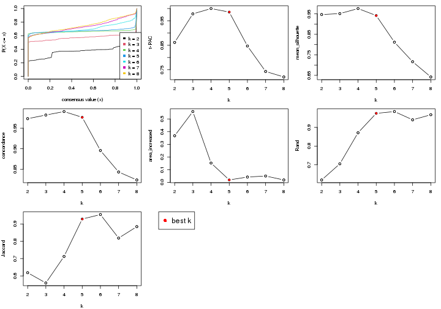

The numeric values for all these statistics can be obtained by `get_stats()`.

```r
get_stats(res)
```

```
#>   k 1-PAC mean_silhouette concordance area_increased  Rand Jaccard
#> 2 2 0.862           0.946       0.973         0.3678 0.619   0.619
#> 3 3 0.978           0.951       0.982         0.5587 0.705   0.560
#> 4 4 1.000           0.976       0.991         0.1525 0.871   0.713
#> 5 5 0.986           0.941       0.976         0.0194 0.975   0.929
#> 6 6 0.847           0.812       0.896         0.0423 0.985   0.954
#> 7 7 0.743           0.716       0.843         0.0501 0.941   0.819
#> 8 8 0.721           0.642       0.824         0.0191 0.968   0.885
```

`suggest_best_k()` suggests the best $k$ based on these statistics. The rules are as follows:

- All $k$ with Jaccard index larger than 0.95 are removed because increasing
  $k$ does not provide enough extra information. If all $k$ are removed, it is
  marked as no subgroup is detected.
- For all $k$ with 1-PAC score larger than 0.9, the maximal $k$ is taken as
  the best $k$, and other $k$ are marked as optional $k$.
- If it does not fit the second rule. The $k$ with the maximal vote of the
  highest 1-PAC score, highest mean silhouette, and highest concordance is
  taken as the best $k$.

```r
suggest_best_k(res)
```

```
#> [1] 5
#> attr(,"optional")
#> [1] 3 4
```

There is also optional best $k$ = 3 4 that is worth to check.

Following is the table of the partitions (You need to click the **show/hide
code output** link to see it). The membership matrix (columns with name `p*`)
is inferred by
[`clue::cl_consensus()`](https://www.rdocumentation.org/link/cl_consensus?package=clue)
function with the `SE` method. Basically the value in the membership matrix
represents the probability to belong to a certain group. The finall subgroup
label for an item is determined with the group with highest probability it
belongs to.

In `get_classes()` function, the entropy is calculated from the membership
matrix and the silhouette score is calculated from the consensus matrix.


<script>
$( function() {
	$( '#tabs-node-0-get-classes' ).tabs();
} );
</script>
<div id='tabs-node-0-get-classes'>
<ul>
<li><a href='#tab-node-0-get-classes-1'>k = 2</a></li>
<li><a href='#tab-node-0-get-classes-2'>k = 3</a></li>
<li><a href='#tab-node-0-get-classes-3'>k = 4</a></li>
<li><a href='#tab-node-0-get-classes-4'>k = 5</a></li>
<li><a href='#tab-node-0-get-classes-5'>k = 6</a></li>
<li><a href='#tab-node-0-get-classes-6'>k = 7</a></li>
<li><a href='#tab-node-0-get-classes-7'>k = 8</a></li>
</ul>

<div id='tab-node-0-get-classes-1'>
<p><a id='tab-node-0-get-classes-1-a' style='color:#0366d6' href='#'>show/hide code output</a></p>
<pre><code class="r">cbind(get_classes(res, k = 2), get_membership(res, k = 2))
</code></pre>

<pre><code>#&gt;                 class entropy silhouette   p1   p2
#&gt; TCGA.AA.3663.01     1   0.000     0.9883 1.00 0.00
#&gt; TCGA.D5.6530.01     1   0.000     0.9883 1.00 0.00
#&gt; TCGA.NH.A8F7.01     2   0.760     0.7959 0.22 0.78
#&gt; TCGA.CK.4948.01     1   0.000     0.9883 1.00 0.00
#&gt; TCGA.AZ.6600.11     2   0.000     0.9221 0.00 1.00
#&gt; TCGA.AA.3494.11     2   0.000     0.9221 0.00 1.00
#&gt; TCGA.A6.5667.11     2   0.000     0.9221 0.00 1.00
#&gt; TCGA.G4.6298.11     2   0.000     0.9221 0.00 1.00
#&gt; TCGA.3L.AA1B.01     1   0.000     0.9883 1.00 0.00
#&gt; TCGA.AZ.4615.01     1   0.000     0.9883 1.00 0.00
#&gt; TCGA.D5.5538.01     1   0.000     0.9883 1.00 0.00
#&gt; TCGA.G4.6306.01     1   0.000     0.9883 1.00 0.00
#&gt; TCGA.NH.A8F7.06     2   0.760     0.7959 0.22 0.78
#&gt; TCGA.AD.6964.01     2   0.000     0.9221 0.00 1.00
#&gt; TCGA.AD.A5EJ.01     1   0.000     0.9883 1.00 0.00
#&gt; TCGA.A6.6651.01     2   0.634     0.8431 0.16 0.84
#&gt; TCGA.DM.A1HB.01     1   0.000     0.9883 1.00 0.00
#&gt; TCGA.D5.6535.01     1   0.000     0.9883 1.00 0.00
#&gt; TCGA.AY.6197.01     1   0.000     0.9883 1.00 0.00
#&gt; TCGA.CA.5256.01     1   0.000     0.9883 1.00 0.00
#&gt; TCGA.T9.A92H.01     1   0.000     0.9883 1.00 0.00
#&gt; TCGA.AZ.6598.01     1   0.000     0.9883 1.00 0.00
#&gt; TCGA.AA.3713.11     2   0.000     0.9221 0.00 1.00
#&gt; TCGA.DM.A0X9.01     1   0.000     0.9883 1.00 0.00
#&gt; TCGA.AD.6963.01     2   0.760     0.7959 0.22 0.78
#&gt; TCGA.G4.6626.01     1   0.958     0.3026 0.62 0.38
#&gt; TCGA.AA.3655.11     2   0.000     0.9221 0.00 1.00
#&gt; TCGA.G4.6628.01     1   0.000     0.9883 1.00 0.00
#&gt; TCGA.CA.6716.01     1   0.000     0.9883 1.00 0.00
#&gt; TCGA.A6.6653.01     1   0.000     0.9883 1.00 0.00
#&gt; TCGA.AA.3489.01     1   0.000     0.9883 1.00 0.00
#&gt; TCGA.A6.2682.01     1   0.000     0.9883 1.00 0.00
#&gt; TCGA.G4.6304.01     1   0.000     0.9883 1.00 0.00
#&gt; TCGA.F4.6855.01     1   0.000     0.9883 1.00 0.00
#&gt; TCGA.AZ.4308.01     2   0.760     0.7959 0.22 0.78
#&gt; TCGA.NH.A6GA.01     1   0.000     0.9883 1.00 0.00
#&gt; TCGA.NH.A50V.01     1   0.000     0.9883 1.00 0.00
#&gt; TCGA.CK.5912.01     2   0.760     0.7959 0.22 0.78
#&gt; TCGA.A6.4107.11     2   0.000     0.9221 0.00 1.00
#&gt; TCGA.DM.A288.01     1   0.000     0.9883 1.00 0.00
#&gt; TCGA.A6.2681.11     2   0.000     0.9221 0.00 1.00
#&gt; TCGA.AD.6548.01     1   0.000     0.9883 1.00 0.00
#&gt; TCGA.AD.6890.01     1   0.000     0.9883 1.00 0.00
#&gt; TCGA.G4.6293.01     1   0.000     0.9883 1.00 0.00
#&gt; TCGA.CK.5916.01     1   0.000     0.9883 1.00 0.00
#&gt; TCGA.CK.6747.01     1   0.000     0.9883 1.00 0.00
#&gt; TCGA.QL.A97D.01     1   0.000     0.9883 1.00 0.00
#&gt; TCGA.A6.A56B.01     1   0.000     0.9883 1.00 0.00
#&gt; TCGA.G4.6307.01     2   0.000     0.9221 0.00 1.00
#&gt; TCGA.AZ.6600.01     1   0.000     0.9883 1.00 0.00
#&gt; TCGA.CM.4748.01     1   0.000     0.9883 1.00 0.00
#&gt; TCGA.F4.6808.01     1   0.000     0.9883 1.00 0.00
#&gt; TCGA.G4.6309.01     2   0.000     0.9221 0.00 1.00
#&gt; TCGA.AA.3662.01     1   0.000     0.9883 1.00 0.00
#&gt; TCGA.AY.A71X.01     1   0.000     0.9883 1.00 0.00
#&gt; TCGA.A6.2675.11     2   0.000     0.9221 0.00 1.00
#&gt; TCGA.CM.6169.01     1   0.000     0.9883 1.00 0.00
#&gt; TCGA.DM.A28K.01     1   0.000     0.9883 1.00 0.00
#&gt; TCGA.D5.6540.01     1   0.000     0.9883 1.00 0.00
#&gt; TCGA.CA.5254.01     1   0.000     0.9883 1.00 0.00
#&gt; TCGA.AY.6386.01     1   0.000     0.9883 1.00 0.00
#&gt; TCGA.AA.3655.01     1   0.000     0.9883 1.00 0.00
#&gt; TCGA.D5.6926.01     1   0.000     0.9883 1.00 0.00
#&gt; TCGA.AD.5900.01     1   0.000     0.9883 1.00 0.00
#&gt; TCGA.A6.A5ZU.01     1   0.000     0.9883 1.00 0.00
#&gt; TCGA.DM.A28C.01     1   0.000     0.9883 1.00 0.00
#&gt; TCGA.G4.6302.01     1   0.000     0.9883 1.00 0.00
#&gt; TCGA.AZ.5403.01     2   0.000     0.9221 0.00 1.00
#&gt; TCGA.D5.6923.01     2   0.760     0.7959 0.22 0.78
#&gt; TCGA.AA.3712.01     1   0.000     0.9883 1.00 0.00
#&gt; TCGA.AU.3779.01     2   0.760     0.7959 0.22 0.78
#&gt; TCGA.CM.6172.01     1   0.000     0.9883 1.00 0.00
#&gt; TCGA.AZ.4614.01     1   0.000     0.9883 1.00 0.00
#&gt; TCGA.5M.AATE.01     1   0.000     0.9883 1.00 0.00
#&gt; TCGA.A6.5664.01     1   0.000     0.9883 1.00 0.00
#&gt; TCGA.CM.4744.01     1   0.000     0.9883 1.00 0.00
#&gt; TCGA.AA.3697.11     2   0.000     0.9221 0.00 1.00
#&gt; TCGA.CM.6166.01     1   0.000     0.9883 1.00 0.00
#&gt; TCGA.DM.A280.01     1   0.000     0.9883 1.00 0.00
#&gt; TCGA.A6.4107.01     1   0.000     0.9883 1.00 0.00
#&gt; TCGA.AZ.6607.01     1   0.000     0.9883 1.00 0.00
#&gt; TCGA.CM.5862.01     1   0.000     0.9883 1.00 0.00
#&gt; TCGA.NH.A5IV.01     1   0.000     0.9883 1.00 0.00
#&gt; TCGA.AA.3511.01     1   0.722     0.7225 0.80 0.20
#&gt; TCGA.AD.A5EK.01     1   0.000     0.9883 1.00 0.00
#&gt; TCGA.QG.A5YX.01     1   0.000     0.9883 1.00 0.00
#&gt; TCGA.CM.6168.01     1   0.000     0.9883 1.00 0.00
#&gt; TCGA.AM.5821.01     1   0.000     0.9883 1.00 0.00
#&gt; TCGA.F4.6570.01     1   0.000     0.9883 1.00 0.00
#&gt; TCGA.D5.6924.01     1   0.000     0.9883 1.00 0.00
#&gt; TCGA.G4.6588.01     1   0.000     0.9883 1.00 0.00
#&gt; TCGA.AY.A54L.01     1   0.000     0.9883 1.00 0.00
#&gt; TCGA.CK.6746.01     1   0.000     0.9883 1.00 0.00
#&gt; TCGA.A6.3810.01     2   0.760     0.7959 0.22 0.78
#&gt; TCGA.G4.6298.01     1   0.000     0.9883 1.00 0.00
#&gt; TCGA.CK.5915.01     1   0.000     0.9883 1.00 0.00
#&gt; TCGA.CA.6718.01     1   0.000     0.9883 1.00 0.00
#&gt; TCGA.CM.6162.01     2   0.000     0.9221 0.00 1.00
#&gt; TCGA.D5.5539.01     1   0.000     0.9883 1.00 0.00
#&gt; TCGA.QG.A5YV.01     1   0.000     0.9883 1.00 0.00
#&gt; TCGA.G4.6314.01     1   0.000     0.9883 1.00 0.00
#&gt; TCGA.AZ.4313.01     2   0.529     0.8683 0.12 0.88
#&gt; TCGA.CM.6676.01     1   0.000     0.9883 1.00 0.00
#&gt; TCGA.AA.3509.11     2   0.000     0.9221 0.00 1.00
#&gt; TCGA.NH.A6GC.01     1   0.000     0.9883 1.00 0.00
#&gt; TCGA.A6.6654.01     1   0.000     0.9883 1.00 0.00
#&gt; TCGA.A6.2675.01     2   0.760     0.7959 0.22 0.78
#&gt; TCGA.F4.6460.01     2   0.000     0.9221 0.00 1.00
#&gt; TCGA.G4.6302.11     2   0.000     0.9221 0.00 1.00
#&gt; TCGA.AA.3510.11     2   0.000     0.9221 0.00 1.00
#&gt; TCGA.CA.6715.01     2   0.760     0.7959 0.22 0.78
#&gt; TCGA.CM.5341.01     1   0.000     0.9883 1.00 0.00
#&gt; TCGA.F4.6703.01     2   0.000     0.9221 0.00 1.00
#&gt; TCGA.WS.AB45.01     1   0.000     0.9883 1.00 0.00
#&gt; TCGA.G4.6321.01     1   0.000     0.9883 1.00 0.00
#&gt; TCGA.AZ.6608.01     2   0.760     0.7959 0.22 0.78
#&gt; TCGA.AA.3713.01     1   0.000     0.9883 1.00 0.00
#&gt; TCGA.CM.5864.01     1   0.000     0.9883 1.00 0.00
#&gt; TCGA.CK.5913.01     1   0.000     0.9883 1.00 0.00
#&gt; TCGA.CM.5863.01     1   0.000     0.9883 1.00 0.00
#&gt; TCGA.AA.3495.01     1   0.000     0.9883 1.00 0.00
#&gt; TCGA.F4.6857.01     1   0.000     0.9883 1.00 0.00
#&gt; TCGA.QG.A5YW.01     1   0.000     0.9883 1.00 0.00
#&gt; TCGA.A6.5665.01     1   0.000     0.9883 1.00 0.00
#&gt; TCGA.CA.5255.01     1   0.000     0.9883 1.00 0.00
#&gt; TCGA.CM.5349.01     1   0.000     0.9883 1.00 0.00
#&gt; TCGA.CK.4947.01     1   0.000     0.9883 1.00 0.00
#&gt; TCGA.G4.6297.01     1   0.000     0.9883 1.00 0.00
#&gt; TCGA.AZ.6606.01     1   0.000     0.9883 1.00 0.00
#&gt; TCGA.CM.6675.01     1   0.000     0.9883 1.00 0.00
#&gt; TCGA.NH.A50U.01     1   0.000     0.9883 1.00 0.00
#&gt; TCGA.AD.6899.01     1   0.000     0.9883 1.00 0.00
#&gt; TCGA.AY.A8YK.01     2   0.000     0.9221 0.00 1.00
#&gt; TCGA.AD.6895.01     1   0.000     0.9883 1.00 0.00
#&gt; TCGA.F4.6805.01     1   0.760     0.6870 0.78 0.22
#&gt; TCGA.A6.3809.01     1   0.000     0.9883 1.00 0.00
#&gt; TCGA.AY.5543.01     1   0.000     0.9883 1.00 0.00
#&gt; TCGA.D5.6931.01     1   0.000     0.9883 1.00 0.00
#&gt; TCGA.G4.6627.01     1   0.000     0.9883 1.00 0.00
#&gt; TCGA.A6.5657.01     1   0.000     0.9883 1.00 0.00
#&gt; TCGA.CM.6165.01     1   0.000     0.9883 1.00 0.00
#&gt; TCGA.CM.5861.01     1   0.000     0.9883 1.00 0.00
#&gt; TCGA.A6.6649.01     1   0.000     0.9883 1.00 0.00
#&gt; TCGA.G4.6317.02     2   0.722     0.8129 0.20 0.80
#&gt; TCGA.CM.5348.01     1   0.000     0.9883 1.00 0.00
#&gt; TCGA.A6.2671.01     1   0.000     0.9883 1.00 0.00
#&gt; TCGA.A6.2672.01     1   0.000     0.9883 1.00 0.00
#&gt; TCGA.AY.A69D.01     1   0.000     0.9883 1.00 0.00
#&gt; TCGA.A6.5662.01     2   0.827     0.7378 0.26 0.74
#&gt; TCGA.AA.3509.01     1   0.000     0.9883 1.00 0.00
#&gt; TCGA.D5.6536.01     1   0.000     0.9883 1.00 0.00
#&gt; TCGA.D5.6539.01     1   0.141     0.9673 0.98 0.02
#&gt; TCGA.D5.6929.01     1   0.981     0.1678 0.58 0.42
#&gt; TCGA.AA.3510.01     1   0.000     0.9883 1.00 0.00
#&gt; TCGA.CM.6679.01     1   0.000     0.9883 1.00 0.00
#&gt; TCGA.A6.5666.01     1   0.000     0.9883 1.00 0.00
#&gt; TCGA.A6.6140.01     2   0.000     0.9221 0.00 1.00
#&gt; TCGA.CA.5796.01     1   0.000     0.9883 1.00 0.00
#&gt; TCGA.F4.6463.01     1   0.000     0.9883 1.00 0.00
#&gt; TCGA.AA.3712.11     2   0.000     0.9221 0.00 1.00
#&gt; TCGA.D5.6928.01     1   0.000     0.9883 1.00 0.00
#&gt; TCGA.A6.6648.01     2   0.141     0.9149 0.02 0.98
#&gt; TCGA.CA.6719.01     1   0.000     0.9883 1.00 0.00
#&gt; TCGA.AZ.4323.01     1   0.000     0.9883 1.00 0.00
#&gt; TCGA.CM.6161.01     1   0.000     0.9883 1.00 0.00
#&gt; TCGA.F4.6856.01     1   0.000     0.9883 1.00 0.00
#&gt; TCGA.DM.A1D7.01     1   0.000     0.9883 1.00 0.00
#&gt; TCGA.CM.4746.01     1   0.000     0.9883 1.00 0.00
#&gt; TCGA.A6.5661.01     1   0.000     0.9883 1.00 0.00
#&gt; TCGA.DM.A1D6.01     1   0.722     0.7225 0.80 0.20
#&gt; TCGA.A6.2685.01     2   0.000     0.9221 0.00 1.00
#&gt; TCGA.AZ.6601.11     2   0.000     0.9221 0.00 1.00
#&gt; TCGA.AZ.4315.01     1   0.000     0.9883 1.00 0.00
#&gt; TCGA.CM.6674.01     1   0.000     0.9883 1.00 0.00
#&gt; TCGA.CM.4743.01     1   0.000     0.9883 1.00 0.00
#&gt; TCGA.A6.2677.01     1   0.000     0.9883 1.00 0.00
#&gt; TCGA.D5.5537.01     1   0.000     0.9883 1.00 0.00
#&gt; TCGA.CA.6717.01     1   0.000     0.9883 1.00 0.00
#&gt; TCGA.F4.6569.01     1   0.000     0.9883 1.00 0.00
#&gt; TCGA.D5.6930.01     1   0.000     0.9883 1.00 0.00
#&gt; TCGA.A6.2686.11     2   0.000     0.9221 0.00 1.00
#&gt; TCGA.F4.6807.01     1   0.000     0.9883 1.00 0.00
#&gt; TCGA.4T.AA8H.01     1   0.000     0.9883 1.00 0.00
#&gt; TCGA.CM.6164.01     2   0.760     0.7959 0.22 0.78
#&gt; TCGA.A6.6782.01     1   0.000     0.9883 1.00 0.00
#&gt; TCGA.A6.4105.01     1   0.000     0.9883 1.00 0.00
#&gt; TCGA.D5.5541.01     2   0.327     0.8990 0.06 0.94
#&gt; TCGA.AA.3495.11     2   0.000     0.9221 0.00 1.00
#&gt; TCGA.AA.3506.01     1   0.000     0.9883 1.00 0.00
#&gt; TCGA.DM.A28E.01     2   0.760     0.7959 0.22 0.78
#&gt; TCGA.A6.6138.01     1   0.000     0.9883 1.00 0.00
#&gt; TCGA.AZ.4682.01     2   0.760     0.7959 0.22 0.78
#&gt; TCGA.D5.6932.01     1   0.000     0.9883 1.00 0.00
#&gt; TCGA.A6.2684.11     2   0.000     0.9221 0.00 1.00
#&gt; TCGA.D5.6538.01     1   0.000     0.9883 1.00 0.00
#&gt; TCGA.AD.6888.01     1   0.242     0.9454 0.96 0.04
#&gt; TCGA.AA.3488.11     2   0.000     0.9221 0.00 1.00
#&gt; TCGA.CM.6678.01     1   0.000     0.9883 1.00 0.00
#&gt; TCGA.CM.5344.01     2   0.760     0.7959 0.22 0.78
#&gt; TCGA.A6.5656.01     1   0.000     0.9883 1.00 0.00
#&gt; TCGA.F4.6809.01     1   0.000     0.9883 1.00 0.00
#&gt; TCGA.F4.6806.01     1   0.000     0.9883 1.00 0.00
#&gt; TCGA.AA.3502.01     1   0.000     0.9883 1.00 0.00
#&gt; TCGA.G4.6320.11     2   0.000     0.9221 0.00 1.00
#&gt; TCGA.NH.A8F8.01     1   0.000     0.9883 1.00 0.00
#&gt; TCGA.AY.6196.01     1   0.000     0.9883 1.00 0.00
#&gt; TCGA.CM.5868.01     2   0.634     0.8431 0.16 0.84
#&gt; TCGA.RU.A8FL.01     1   0.000     0.9883 1.00 0.00
#&gt; TCGA.A6.2685.11     2   0.000     0.9221 0.00 1.00
#&gt; TCGA.CK.4951.01     1   0.000     0.9883 1.00 0.00
#&gt; TCGA.D5.6922.01     1   0.000     0.9883 1.00 0.00
#&gt; TCGA.AA.3697.01     1   0.680     0.7560 0.82 0.18
#&gt; TCGA.A6.6142.01     2   0.000     0.9221 0.00 1.00
#&gt; TCGA.F4.6704.01     2   0.469     0.8796 0.10 0.90
#&gt; TCGA.AZ.6599.01     1   0.000     0.9883 1.00 0.00
#&gt; TCGA.AZ.6599.11     2   0.000     0.9221 0.00 1.00
#&gt; TCGA.5M.AAT4.01     1   0.000     0.9883 1.00 0.00
#&gt; TCGA.CK.5914.01     1   0.000     0.9883 1.00 0.00
#&gt; TCGA.CM.5860.01     1   0.000     0.9883 1.00 0.00
#&gt; TCGA.AZ.4681.01     2   0.402     0.8898 0.08 0.92
#&gt; TCGA.AD.6965.01     1   0.000     0.9883 1.00 0.00
#&gt; TCGA.A6.6780.01     1   0.000     0.9883 1.00 0.00
#&gt; TCGA.A6.2686.01     1   0.000     0.9883 1.00 0.00
#&gt; TCGA.CM.4750.01     1   0.000     0.9883 1.00 0.00
#&gt; TCGA.CM.6677.01     1   0.000     0.9883 1.00 0.00
#&gt; TCGA.A6.A567.01     2   0.680     0.8286 0.18 0.82
#&gt; TCGA.D5.5540.01     1   0.000     0.9883 1.00 0.00
#&gt; TCGA.DM.A1DB.01     2   0.795     0.7681 0.24 0.76
#&gt; TCGA.QG.A5Z2.01     1   0.000     0.9883 1.00 0.00
#&gt; TCGA.AA.3506.11     2   0.000     0.9221 0.00 1.00
#&gt; TCGA.D5.6898.01     1   0.327     0.9222 0.94 0.06
#&gt; TCGA.AZ.5407.01     1   0.000     0.9883 1.00 0.00
#&gt; TCGA.A6.2684.01     1   0.000     0.9883 1.00 0.00
#&gt; TCGA.CM.6167.01     1   0.000     0.9883 1.00 0.00
#&gt; TCGA.DM.A28G.01     1   0.000     0.9883 1.00 0.00
#&gt; TCGA.AA.3488.01     1   0.000     0.9883 1.00 0.00
#&gt; TCGA.AA.3492.01     1   0.000     0.9883 1.00 0.00
#&gt; TCGA.G4.6322.01     1   0.000     0.9883 1.00 0.00
#&gt; TCGA.AD.6889.01     1   0.000     0.9883 1.00 0.00
#&gt; TCGA.AZ.6598.11     2   0.000     0.9221 0.00 1.00
#&gt; TCGA.CM.6163.01     1   0.000     0.9883 1.00 0.00
#&gt; TCGA.G4.6322.11     2   0.000     0.9221 0.00 1.00
#&gt; TCGA.G4.6586.01     1   0.000     0.9883 1.00 0.00
#&gt; TCGA.AA.3502.11     2   0.000     0.9221 0.00 1.00
#&gt; TCGA.G4.6323.01     1   0.000     0.9883 1.00 0.00
#&gt; TCGA.CA.5797.01     2   0.000     0.9221 0.00 1.00
#&gt; TCGA.CK.4950.01     1   0.000     0.9883 1.00 0.00
#&gt; TCGA.D5.6529.01     1   0.000     0.9883 1.00 0.00
#&gt; TCGA.A6.2680.11     2   0.000     0.9221 0.00 1.00
#&gt; TCGA.DM.A1D0.01     2   0.000     0.9221 0.00 1.00
#&gt; TCGA.DM.A282.01     1   0.000     0.9883 1.00 0.00
#&gt; TCGA.A6.5660.01     1   0.000     0.9883 1.00 0.00
#&gt; TCGA.G4.6299.01     1   0.000     0.9883 1.00 0.00
#&gt; TCGA.DM.A1DA.01     1   0.000     0.9883 1.00 0.00
#&gt; TCGA.A6.2671.11     2   0.000     0.9221 0.00 1.00
#&gt; TCGA.D5.6920.01     1   0.000     0.9883 1.00 0.00
#&gt; TCGA.DM.A1D8.01     1   0.000     0.9883 1.00 0.00
#&gt; TCGA.DM.A1HA.01     1   0.000     0.9883 1.00 0.00
#&gt; TCGA.DM.A285.01     1   0.000     0.9883 1.00 0.00
#&gt; TCGA.G4.6303.01     1   0.000     0.9883 1.00 0.00
#&gt; TCGA.G4.6294.01     1   0.000     0.9883 1.00 0.00
#&gt; TCGA.AZ.6601.01     1   0.000     0.9883 1.00 0.00
#&gt; TCGA.G4.6295.11     2   0.000     0.9221 0.00 1.00
#&gt; TCGA.CM.4752.01     1   0.000     0.9883 1.00 0.00
#&gt; TCGA.AZ.4684.01     1   0.000     0.9883 1.00 0.00
#&gt; TCGA.D5.6532.01     1   0.000     0.9883 1.00 0.00
#&gt; TCGA.A6.A565.01     2   0.000     0.9221 0.00 1.00
#&gt; TCGA.5M.AATA.01     1   0.000     0.9883 1.00 0.00
#&gt; TCGA.D5.6531.01     1   0.000     0.9883 1.00 0.00
#&gt; TCGA.5M.AAT5.01     2   0.402     0.8898 0.08 0.92
#&gt; TCGA.DM.A0XD.01     1   0.000     0.9883 1.00 0.00
#&gt; TCGA.AA.3663.11     2   0.000     0.9221 0.00 1.00
#&gt; TCGA.AA.3660.11     2   0.000     0.9221 0.00 1.00
#&gt; TCGA.CK.6751.01     1   0.000     0.9883 1.00 0.00
#&gt; TCGA.G4.6311.01     1   0.000     0.9883 1.00 0.00
#&gt; TCGA.A6.6137.01     1   0.000     0.9883 1.00 0.00
#&gt; TCGA.A6.A566.01     1   0.000     0.9883 1.00 0.00
#&gt; TCGA.G4.6625.01     1   0.000     0.9883 1.00 0.00
#&gt; TCGA.DM.A28F.01     1   0.000     0.9883 1.00 0.00
#&gt; TCGA.G4.6297.11     2   0.000     0.9221 0.00 1.00
#&gt; TCGA.A6.6141.01     1   0.000     0.9883 1.00 0.00
#&gt; TCGA.AA.3492.11     2   0.000     0.9221 0.00 1.00
#&gt; TCGA.A6.5659.01     1   0.000     0.9883 1.00 0.00
#&gt; TCGA.AZ.6603.01     2   0.760     0.7959 0.22 0.78
#&gt; TCGA.D5.6927.01     1   0.000     0.9883 1.00 0.00
#&gt; TCGA.AU.6004.01     1   0.000     0.9883 1.00 0.00
#&gt; TCGA.F4.6854.01     1   0.000     0.9883 1.00 0.00
#&gt; TCGA.CK.4952.01     1   0.000     0.9883 1.00 0.00
#&gt; TCGA.A6.5667.01     2   0.999     0.2131 0.48 0.52
#&gt; TCGA.G4.6315.01     1   0.000     0.9883 1.00 0.00
#&gt; TCGA.A6.6781.01     1   0.000     0.9883 1.00 0.00
#&gt; TCGA.D5.6541.01     1   0.000     0.9883 1.00 0.00
#&gt; TCGA.DM.A1D9.01     1   0.000     0.9883 1.00 0.00
#&gt; TCGA.A6.2680.01     1   0.000     0.9883 1.00 0.00
#&gt; TCGA.A6.2679.11     2   0.000     0.9221 0.00 1.00
#&gt; TCGA.AD.6901.01     1   0.000     0.9883 1.00 0.00
#&gt; TCGA.CK.6748.01     1   0.999    -0.0763 0.52 0.48
#&gt; TCGA.AA.3496.01     1   0.000     0.9883 1.00 0.00
#&gt; TCGA.CM.4751.01     1   0.000     0.9883 1.00 0.00
#&gt; TCGA.A6.6652.01     1   0.000     0.9883 1.00 0.00
#&gt; TCGA.AA.3494.01     2   0.000     0.9221 0.00 1.00
#&gt; TCGA.F4.6459.01     1   0.680     0.7556 0.82 0.18
#&gt; TCGA.SS.A7HO.01     1   0.000     0.9883 1.00 0.00
#&gt; TCGA.A6.6650.01     1   0.000     0.9883 1.00 0.00
#&gt; TCGA.DM.A28A.01     1   0.000     0.9883 1.00 0.00
#&gt; TCGA.D5.6534.01     1   0.000     0.9883 1.00 0.00
#&gt; TCGA.AZ.4616.01     1   0.000     0.9883 1.00 0.00
#&gt; TCGA.D5.6533.01     1   0.000     0.9883 1.00 0.00
#&gt; TCGA.QG.A5Z1.01     1   0.000     0.9883 1.00 0.00
#&gt; TCGA.DM.A0XF.01     1   0.827     0.6091 0.74 0.26
#&gt; TCGA.G4.6295.01     2   0.760     0.7959 0.22 0.78
#&gt; TCGA.CM.6680.01     1   0.000     0.9883 1.00 0.00
#&gt; TCGA.CM.6171.01     1   0.000     0.9883 1.00 0.00
#&gt; TCGA.AA.3660.01     1   0.000     0.9883 1.00 0.00
#&gt; TCGA.F4.6461.01     1   0.000     0.9883 1.00 0.00
#&gt; TCGA.CM.4747.01     1   0.000     0.9883 1.00 0.00
#&gt; TCGA.AM.5820.01     1   0.000     0.9883 1.00 0.00
#&gt; TCGA.DM.A28H.01     1   0.000     0.9883 1.00 0.00
#&gt; TCGA.G4.6311.11     2   0.000     0.9221 0.00 1.00
#&gt; TCGA.G4.6314.11     2   0.000     0.9221 0.00 1.00
#&gt; TCGA.D5.7000.01     1   0.000     0.9883 1.00 0.00
#&gt; TCGA.G4.6625.11     2   0.000     0.9221 0.00 1.00
#&gt; TCGA.G4.6320.01     1   0.000     0.9883 1.00 0.00
#&gt; TCGA.5M.AAT6.01     2   0.000     0.9221 0.00 1.00
#&gt; TCGA.A6.2682.11     2   0.000     0.9221 0.00 1.00
#&gt; TCGA.AZ.6605.01     1   0.000     0.9883 1.00 0.00
#&gt; TCGA.G4.6310.01     1   0.000     0.9883 1.00 0.00
#&gt; TCGA.DM.A28M.01     1   0.000     0.9883 1.00 0.00
#&gt; TCGA.G4.6317.01     2   0.855     0.7048 0.28 0.72
#&gt; TCGA.DM.A1D4.01     1   0.000     0.9883 1.00 0.00
#&gt; TCGA.CM.6170.01     2   0.760     0.7959 0.22 0.78
#&gt; TCGA.NH.A50T.01     1   0.000     0.9883 1.00 0.00
#&gt; TCGA.NH.A6GB.01     1   0.000     0.9883 1.00 0.00
#&gt; TCGA.A6.2681.01     1   0.000     0.9883 1.00 0.00
#&gt; TCGA.A6.2679.01     1   0.000     0.9883 1.00 0.00
#&gt; TCGA.D5.6537.01     1   0.000     0.9883 1.00 0.00
#&gt; TCGA.4N.A93T.01     1   0.000     0.9883 1.00 0.00
</code></pre>

<script>
$('#tab-node-0-get-classes-1-a').parent().next().next().hide();
$('#tab-node-0-get-classes-1-a').click(function(){
  $('#tab-node-0-get-classes-1-a').parent().next().next().toggle();
  return(false);
});
</script>
</div>

<div id='tab-node-0-get-classes-2'>
<p><a id='tab-node-0-get-classes-2-a' style='color:#0366d6' href='#'>show/hide code output</a></p>
<pre><code class="r">cbind(get_classes(res, k = 3), get_membership(res, k = 3))
</code></pre>

<pre><code>#&gt;                 class entropy silhouette   p1   p2   p3
#&gt; TCGA.AA.3663.01     1  0.0000     0.9856 1.00 0.00 0.00
#&gt; TCGA.D5.6530.01     2  0.0000     0.9537 0.00 1.00 0.00
#&gt; TCGA.NH.A8F7.01     2  0.0000     0.9537 0.00 1.00 0.00
#&gt; TCGA.CK.4948.01     2  0.0000     0.9537 0.00 1.00 0.00
#&gt; TCGA.AZ.6600.11     3  0.0000     0.9995 0.00 0.00 1.00
#&gt; TCGA.AA.3494.11     3  0.0000     0.9995 0.00 0.00 1.00
#&gt; TCGA.A6.5667.11     3  0.0000     0.9995 0.00 0.00 1.00
#&gt; TCGA.G4.6298.11     3  0.0000     0.9995 0.00 0.00 1.00
#&gt; TCGA.3L.AA1B.01     1  0.0000     0.9856 1.00 0.00 0.00
#&gt; TCGA.AZ.4615.01     1  0.0000     0.9856 1.00 0.00 0.00
#&gt; TCGA.D5.5538.01     1  0.0000     0.9856 1.00 0.00 0.00
#&gt; TCGA.G4.6306.01     1  0.0000     0.9856 1.00 0.00 0.00
#&gt; TCGA.NH.A8F7.06     2  0.0000     0.9537 0.00 1.00 0.00
#&gt; TCGA.AD.6964.01     3  0.0000     0.9995 0.00 0.00 1.00
#&gt; TCGA.AD.A5EJ.01     1  0.0000     0.9856 1.00 0.00 0.00
#&gt; TCGA.A6.6651.01     2  0.0000     0.9537 0.00 1.00 0.00
#&gt; TCGA.DM.A1HB.01     1  0.0000     0.9856 1.00 0.00 0.00
#&gt; TCGA.D5.6535.01     1  0.0000     0.9856 1.00 0.00 0.00
#&gt; TCGA.AY.6197.01     1  0.0000     0.9856 1.00 0.00 0.00
#&gt; TCGA.CA.5256.01     2  0.0000     0.9537 0.00 1.00 0.00
#&gt; TCGA.T9.A92H.01     2  0.0000     0.9537 0.00 1.00 0.00
#&gt; TCGA.AZ.6598.01     1  0.0000     0.9856 1.00 0.00 0.00
#&gt; TCGA.AA.3713.11     3  0.0000     0.9995 0.00 0.00 1.00
#&gt; TCGA.DM.A0X9.01     1  0.0000     0.9856 1.00 0.00 0.00
#&gt; TCGA.AD.6963.01     2  0.0000     0.9537 0.00 1.00 0.00
#&gt; TCGA.G4.6626.01     2  0.0000     0.9537 0.00 1.00 0.00
#&gt; TCGA.AA.3655.11     3  0.0000     0.9995 0.00 0.00 1.00
#&gt; TCGA.G4.6628.01     1  0.0000     0.9856 1.00 0.00 0.00
#&gt; TCGA.CA.6716.01     1  0.0000     0.9856 1.00 0.00 0.00
#&gt; TCGA.A6.6653.01     1  0.0000     0.9856 1.00 0.00 0.00
#&gt; TCGA.AA.3489.01     2  0.0000     0.9537 0.00 1.00 0.00
#&gt; TCGA.A6.2682.01     2  0.0000     0.9537 0.00 1.00 0.00
#&gt; TCGA.G4.6304.01     1  0.0000     0.9856 1.00 0.00 0.00
#&gt; TCGA.F4.6855.01     1  0.0000     0.9856 1.00 0.00 0.00
#&gt; TCGA.AZ.4308.01     2  0.0000     0.9537 0.00 1.00 0.00
#&gt; TCGA.NH.A6GA.01     1  0.0000     0.9856 1.00 0.00 0.00
#&gt; TCGA.NH.A50V.01     1  0.0000     0.9856 1.00 0.00 0.00
#&gt; TCGA.CK.5912.01     2  0.0000     0.9537 0.00 1.00 0.00
#&gt; TCGA.A6.4107.11     3  0.0000     0.9995 0.00 0.00 1.00
#&gt; TCGA.DM.A288.01     1  0.0000     0.9856 1.00 0.00 0.00
#&gt; TCGA.A6.2681.11     3  0.0000     0.9995 0.00 0.00 1.00
#&gt; TCGA.AD.6548.01     1  0.0000     0.9856 1.00 0.00 0.00
#&gt; TCGA.AD.6890.01     2  0.5216     0.6272 0.26 0.74 0.00
#&gt; TCGA.G4.6293.01     1  0.0000     0.9856 1.00 0.00 0.00
#&gt; TCGA.CK.5916.01     1  0.0000     0.9856 1.00 0.00 0.00
#&gt; TCGA.CK.6747.01     1  0.0000     0.9856 1.00 0.00 0.00
#&gt; TCGA.QL.A97D.01     1  0.0000     0.9856 1.00 0.00 0.00
#&gt; TCGA.A6.A56B.01     1  0.0000     0.9856 1.00 0.00 0.00
#&gt; TCGA.G4.6307.01     2  0.0000     0.9537 0.00 1.00 0.00
#&gt; TCGA.AZ.6600.01     1  0.0000     0.9856 1.00 0.00 0.00
#&gt; TCGA.CM.4748.01     1  0.0000     0.9856 1.00 0.00 0.00
#&gt; TCGA.F4.6808.01     2  0.0000     0.9537 0.00 1.00 0.00
#&gt; TCGA.G4.6309.01     2  0.0000     0.9537 0.00 1.00 0.00
#&gt; TCGA.AA.3662.01     1  0.0000     0.9856 1.00 0.00 0.00
#&gt; TCGA.AY.A71X.01     1  0.0000     0.9856 1.00 0.00 0.00
#&gt; TCGA.A6.2675.11     3  0.0000     0.9995 0.00 0.00 1.00
#&gt; TCGA.CM.6169.01     1  0.0000     0.9856 1.00 0.00 0.00
#&gt; TCGA.DM.A28K.01     1  0.0000     0.9856 1.00 0.00 0.00
#&gt; TCGA.D5.6540.01     1  0.0000     0.9856 1.00 0.00 0.00
#&gt; TCGA.CA.5254.01     1  0.0000     0.9856 1.00 0.00 0.00
#&gt; TCGA.AY.6386.01     1  0.0000     0.9856 1.00 0.00 0.00
#&gt; TCGA.AA.3655.01     2  0.6045     0.4232 0.38 0.62 0.00
#&gt; TCGA.D5.6926.01     2  0.4002     0.7654 0.16 0.84 0.00
#&gt; TCGA.AD.5900.01     1  0.0000     0.9856 1.00 0.00 0.00
#&gt; TCGA.A6.A5ZU.01     2  0.0000     0.9537 0.00 1.00 0.00
#&gt; TCGA.DM.A28C.01     2  0.0000     0.9537 0.00 1.00 0.00
#&gt; TCGA.G4.6302.01     1  0.0000     0.9856 1.00 0.00 0.00
#&gt; TCGA.AZ.5403.01     2  0.0000     0.9537 0.00 1.00 0.00
#&gt; TCGA.D5.6923.01     2  0.0000     0.9537 0.00 1.00 0.00
#&gt; TCGA.AA.3712.01     2  0.0000     0.9537 0.00 1.00 0.00
#&gt; TCGA.AU.3779.01     2  0.0000     0.9537 0.00 1.00 0.00
#&gt; TCGA.CM.6172.01     2  0.0000     0.9537 0.00 1.00 0.00
#&gt; TCGA.AZ.4614.01     1  0.0000     0.9856 1.00 0.00 0.00
#&gt; TCGA.5M.AATE.01     2  0.0000     0.9537 0.00 1.00 0.00
#&gt; TCGA.A6.5664.01     1  0.0000     0.9856 1.00 0.00 0.00
#&gt; TCGA.CM.4744.01     1  0.0000     0.9856 1.00 0.00 0.00
#&gt; TCGA.AA.3697.11     3  0.0000     0.9995 0.00 0.00 1.00
#&gt; TCGA.CM.6166.01     1  0.0000     0.9856 1.00 0.00 0.00
#&gt; TCGA.DM.A280.01     1  0.0000     0.9856 1.00 0.00 0.00
#&gt; TCGA.A6.4107.01     1  0.0000     0.9856 1.00 0.00 0.00
#&gt; TCGA.AZ.6607.01     1  0.0000     0.9856 1.00 0.00 0.00
#&gt; TCGA.CM.5862.01     2  0.5560     0.5678 0.30 0.70 0.00
#&gt; TCGA.NH.A5IV.01     1  0.0000     0.9856 1.00 0.00 0.00
#&gt; TCGA.AA.3511.01     2  0.0000     0.9537 0.00 1.00 0.00
#&gt; TCGA.AD.A5EK.01     1  0.0000     0.9856 1.00 0.00 0.00
#&gt; TCGA.QG.A5YX.01     2  0.0000     0.9537 0.00 1.00 0.00
#&gt; TCGA.CM.6168.01     1  0.0000     0.9856 1.00 0.00 0.00
#&gt; TCGA.AM.5821.01     1  0.0000     0.9856 1.00 0.00 0.00
#&gt; TCGA.F4.6570.01     1  0.0000     0.9856 1.00 0.00 0.00
#&gt; TCGA.D5.6924.01     2  0.0000     0.9537 0.00 1.00 0.00
#&gt; TCGA.G4.6588.01     1  0.0000     0.9856 1.00 0.00 0.00
#&gt; TCGA.AY.A54L.01     1  0.0000     0.9856 1.00 0.00 0.00
#&gt; TCGA.CK.6746.01     1  0.0000     0.9856 1.00 0.00 0.00
#&gt; TCGA.A6.3810.01     2  0.0000     0.9537 0.00 1.00 0.00
#&gt; TCGA.G4.6298.01     1  0.0000     0.9856 1.00 0.00 0.00
#&gt; TCGA.CK.5915.01     1  0.0000     0.9856 1.00 0.00 0.00
#&gt; TCGA.CA.6718.01     1  0.0000     0.9856 1.00 0.00 0.00
#&gt; TCGA.CM.6162.01     3  0.0000     0.9995 0.00 0.00 1.00
#&gt; TCGA.D5.5539.01     1  0.0000     0.9856 1.00 0.00 0.00
#&gt; TCGA.QG.A5YV.01     1  0.0000     0.9856 1.00 0.00 0.00
#&gt; TCGA.G4.6314.01     2  0.6045     0.4231 0.38 0.62 0.00
#&gt; TCGA.AZ.4313.01     2  0.0000     0.9537 0.00 1.00 0.00
#&gt; TCGA.CM.6676.01     2  0.0000     0.9537 0.00 1.00 0.00
#&gt; TCGA.AA.3509.11     3  0.0000     0.9995 0.00 0.00 1.00
#&gt; TCGA.NH.A6GC.01     2  0.0000     0.9537 0.00 1.00 0.00
#&gt; TCGA.A6.6654.01     1  0.0000     0.9856 1.00 0.00 0.00
#&gt; TCGA.A6.2675.01     2  0.0000     0.9537 0.00 1.00 0.00
#&gt; TCGA.F4.6460.01     2  0.0000     0.9537 0.00 1.00 0.00
#&gt; TCGA.G4.6302.11     3  0.0000     0.9995 0.00 0.00 1.00
#&gt; TCGA.AA.3510.11     3  0.0000     0.9995 0.00 0.00 1.00
#&gt; TCGA.CA.6715.01     2  0.0000     0.9537 0.00 1.00 0.00
#&gt; TCGA.CM.5341.01     1  0.0000     0.9856 1.00 0.00 0.00
#&gt; TCGA.F4.6703.01     3  0.0000     0.9995 0.00 0.00 1.00
#&gt; TCGA.WS.AB45.01     1  0.0000     0.9856 1.00 0.00 0.00
#&gt; TCGA.G4.6321.01     1  0.0000     0.9856 1.00 0.00 0.00
#&gt; TCGA.AZ.6608.01     2  0.0000     0.9537 0.00 1.00 0.00
#&gt; TCGA.AA.3713.01     1  0.0000     0.9856 1.00 0.00 0.00
#&gt; TCGA.CM.5864.01     1  0.0000     0.9856 1.00 0.00 0.00
#&gt; TCGA.CK.5913.01     1  0.0000     0.9856 1.00 0.00 0.00
#&gt; TCGA.CM.5863.01     1  0.0000     0.9856 1.00 0.00 0.00
#&gt; TCGA.AA.3495.01     1  0.0000     0.9856 1.00 0.00 0.00
#&gt; TCGA.F4.6857.01     1  0.0000     0.9856 1.00 0.00 0.00
#&gt; TCGA.QG.A5YW.01     1  0.0000     0.9856 1.00 0.00 0.00
#&gt; TCGA.A6.5665.01     1  0.0000     0.9856 1.00 0.00 0.00
#&gt; TCGA.CA.5255.01     1  0.0000     0.9856 1.00 0.00 0.00
#&gt; TCGA.CM.5349.01     1  0.0000     0.9856 1.00 0.00 0.00
#&gt; TCGA.CK.4947.01     1  0.0000     0.9856 1.00 0.00 0.00
#&gt; TCGA.G4.6297.01     1  0.0000     0.9856 1.00 0.00 0.00
#&gt; TCGA.AZ.6606.01     1  0.0000     0.9856 1.00 0.00 0.00
#&gt; TCGA.CM.6675.01     1  0.0000     0.9856 1.00 0.00 0.00
#&gt; TCGA.NH.A50U.01     1  0.0000     0.9856 1.00 0.00 0.00
#&gt; TCGA.AD.6899.01     1  0.0000     0.9856 1.00 0.00 0.00
#&gt; TCGA.AY.A8YK.01     2  0.0000     0.9537 0.00 1.00 0.00
#&gt; TCGA.AD.6895.01     1  0.0000     0.9856 1.00 0.00 0.00
#&gt; TCGA.F4.6805.01     2  0.0000     0.9537 0.00 1.00 0.00
#&gt; TCGA.A6.3809.01     1  0.0000     0.9856 1.00 0.00 0.00
#&gt; TCGA.AY.5543.01     2  0.0000     0.9537 0.00 1.00 0.00
#&gt; TCGA.D5.6931.01     1  0.0000     0.9856 1.00 0.00 0.00
#&gt; TCGA.G4.6627.01     1  0.0000     0.9856 1.00 0.00 0.00
#&gt; TCGA.A6.5657.01     1  0.0000     0.9856 1.00 0.00 0.00
#&gt; TCGA.CM.6165.01     2  0.3686     0.7917 0.14 0.86 0.00
#&gt; TCGA.CM.5861.01     1  0.0000     0.9856 1.00 0.00 0.00
#&gt; TCGA.A6.6649.01     1  0.0000     0.9856 1.00 0.00 0.00
#&gt; TCGA.G4.6317.02     2  0.0000     0.9537 0.00 1.00 0.00
#&gt; TCGA.CM.5348.01     1  0.0000     0.9856 1.00 0.00 0.00
#&gt; TCGA.A6.2671.01     2  0.0000     0.9537 0.00 1.00 0.00
#&gt; TCGA.A6.2672.01     1  0.0000     0.9856 1.00 0.00 0.00
#&gt; TCGA.AY.A69D.01     1  0.0000     0.9856 1.00 0.00 0.00
#&gt; TCGA.A6.5662.01     2  0.0000     0.9537 0.00 1.00 0.00
#&gt; TCGA.AA.3509.01     2  0.0000     0.9537 0.00 1.00 0.00
#&gt; TCGA.D5.6536.01     2  0.3686     0.7915 0.14 0.86 0.00
#&gt; TCGA.D5.6539.01     2  0.0000     0.9537 0.00 1.00 0.00
#&gt; TCGA.D5.6929.01     2  0.0000     0.9537 0.00 1.00 0.00
#&gt; TCGA.AA.3510.01     2  0.0000     0.9537 0.00 1.00 0.00
#&gt; TCGA.CM.6679.01     2  0.0000     0.9537 0.00 1.00 0.00
#&gt; TCGA.A6.5666.01     2  0.0000     0.9537 0.00 1.00 0.00
#&gt; TCGA.A6.6140.01     2  0.0000     0.9537 0.00 1.00 0.00
#&gt; TCGA.CA.5796.01     1  0.0000     0.9856 1.00 0.00 0.00
#&gt; TCGA.F4.6463.01     1  0.0000     0.9856 1.00 0.00 0.00
#&gt; TCGA.AA.3712.11     3  0.0000     0.9995 0.00 0.00 1.00
#&gt; TCGA.D5.6928.01     1  0.0000     0.9856 1.00 0.00 0.00
#&gt; TCGA.A6.6648.01     2  0.0000     0.9537 0.00 1.00 0.00
#&gt; TCGA.CA.6719.01     1  0.0000     0.9856 1.00 0.00 0.00
#&gt; TCGA.AZ.4323.01     1  0.0000     0.9856 1.00 0.00 0.00
#&gt; TCGA.CM.6161.01     1  0.0892     0.9642 0.98 0.02 0.00
#&gt; TCGA.F4.6856.01     1  0.0000     0.9856 1.00 0.00 0.00
#&gt; TCGA.DM.A1D7.01     2  0.5397     0.5981 0.28 0.72 0.00
#&gt; TCGA.CM.4746.01     2  0.0000     0.9537 0.00 1.00 0.00
#&gt; TCGA.A6.5661.01     1  0.0000     0.9856 1.00 0.00 0.00
#&gt; TCGA.DM.A1D6.01     2  0.0000     0.9537 0.00 1.00 0.00
#&gt; TCGA.A6.2685.01     2  0.0000     0.9537 0.00 1.00 0.00
#&gt; TCGA.AZ.6601.11     3  0.0000     0.9995 0.00 0.00 1.00
#&gt; TCGA.AZ.4315.01     1  0.0000     0.9856 1.00 0.00 0.00
#&gt; TCGA.CM.6674.01     2  0.5397     0.5966 0.28 0.72 0.00
#&gt; TCGA.CM.4743.01     1  0.0000     0.9856 1.00 0.00 0.00
#&gt; TCGA.A6.2677.01     1  0.0000     0.9856 1.00 0.00 0.00
#&gt; TCGA.D5.5537.01     1  0.0000     0.9856 1.00 0.00 0.00
#&gt; TCGA.CA.6717.01     1  0.0000     0.9856 1.00 0.00 0.00
#&gt; TCGA.F4.6569.01     1  0.0000     0.9856 1.00 0.00 0.00
#&gt; TCGA.D5.6930.01     1  0.0000     0.9856 1.00 0.00 0.00
#&gt; TCGA.A6.2686.11     3  0.0000     0.9995 0.00 0.00 1.00
#&gt; TCGA.F4.6807.01     1  0.0000     0.9856 1.00 0.00 0.00
#&gt; TCGA.4T.AA8H.01     1  0.0000     0.9856 1.00 0.00 0.00
#&gt; TCGA.CM.6164.01     2  0.0000     0.9537 0.00 1.00 0.00
#&gt; TCGA.A6.6782.01     2  0.0000     0.9537 0.00 1.00 0.00
#&gt; TCGA.A6.4105.01     1  0.0000     0.9856 1.00 0.00 0.00
#&gt; TCGA.D5.5541.01     2  0.0000     0.9537 0.00 1.00 0.00
#&gt; TCGA.AA.3495.11     3  0.0000     0.9995 0.00 0.00 1.00
#&gt; TCGA.AA.3506.01     1  0.0000     0.9856 1.00 0.00 0.00
#&gt; TCGA.DM.A28E.01     2  0.0000     0.9537 0.00 1.00 0.00
#&gt; TCGA.A6.6138.01     1  0.0000     0.9856 1.00 0.00 0.00
#&gt; TCGA.AZ.4682.01     2  0.0000     0.9537 0.00 1.00 0.00
#&gt; TCGA.D5.6932.01     2  0.0000     0.9537 0.00 1.00 0.00
#&gt; TCGA.A6.2684.11     3  0.0000     0.9995 0.00 0.00 1.00
#&gt; TCGA.D5.6538.01     1  0.0000     0.9856 1.00 0.00 0.00
#&gt; TCGA.AD.6888.01     2  0.0000     0.9537 0.00 1.00 0.00
#&gt; TCGA.AA.3488.11     3  0.0000     0.9995 0.00 0.00 1.00
#&gt; TCGA.CM.6678.01     1  0.0000     0.9856 1.00 0.00 0.00
#&gt; TCGA.CM.5344.01     2  0.0000     0.9537 0.00 1.00 0.00
#&gt; TCGA.A6.5656.01     1  0.6302     0.0246 0.52 0.48 0.00
#&gt; TCGA.F4.6809.01     1  0.0000     0.9856 1.00 0.00 0.00
#&gt; TCGA.F4.6806.01     1  0.0000     0.9856 1.00 0.00 0.00
#&gt; TCGA.AA.3502.01     1  0.0000     0.9856 1.00 0.00 0.00
#&gt; TCGA.G4.6320.11     3  0.0000     0.9995 0.00 0.00 1.00
#&gt; TCGA.NH.A8F8.01     1  0.0000     0.9856 1.00 0.00 0.00
#&gt; TCGA.AY.6196.01     1  0.0000     0.9856 1.00 0.00 0.00
#&gt; TCGA.CM.5868.01     2  0.0000     0.9537 0.00 1.00 0.00
#&gt; TCGA.RU.A8FL.01     2  0.4796     0.6839 0.22 0.78 0.00
#&gt; TCGA.A6.2685.11     3  0.0000     0.9995 0.00 0.00 1.00
#&gt; TCGA.CK.4951.01     1  0.0000     0.9856 1.00 0.00 0.00
#&gt; TCGA.D5.6922.01     2  0.0000     0.9537 0.00 1.00 0.00
#&gt; TCGA.AA.3697.01     2  0.0000     0.9537 0.00 1.00 0.00
#&gt; TCGA.A6.6142.01     2  0.0000     0.9537 0.00 1.00 0.00
#&gt; TCGA.F4.6704.01     2  0.0000     0.9537 0.00 1.00 0.00
#&gt; TCGA.AZ.6599.01     1  0.0000     0.9856 1.00 0.00 0.00
#&gt; TCGA.AZ.6599.11     3  0.0000     0.9995 0.00 0.00 1.00
#&gt; TCGA.5M.AAT4.01     1  0.0000     0.9856 1.00 0.00 0.00
#&gt; TCGA.CK.5914.01     1  0.0000     0.9856 1.00 0.00 0.00
#&gt; TCGA.CM.5860.01     1  0.0000     0.9856 1.00 0.00 0.00
#&gt; TCGA.AZ.4681.01     2  0.0000     0.9537 0.00 1.00 0.00
#&gt; TCGA.AD.6965.01     1  0.0000     0.9856 1.00 0.00 0.00
#&gt; TCGA.A6.6780.01     1  0.0000     0.9856 1.00 0.00 0.00
#&gt; TCGA.A6.2686.01     1  0.0000     0.9856 1.00 0.00 0.00
#&gt; TCGA.CM.4750.01     1  0.0000     0.9856 1.00 0.00 0.00
#&gt; TCGA.CM.6677.01     1  0.0000     0.9856 1.00 0.00 0.00
#&gt; TCGA.A6.A567.01     2  0.0000     0.9537 0.00 1.00 0.00
#&gt; TCGA.D5.5540.01     1  0.0000     0.9856 1.00 0.00 0.00
#&gt; TCGA.DM.A1DB.01     2  0.0000     0.9537 0.00 1.00 0.00
#&gt; TCGA.QG.A5Z2.01     1  0.0000     0.9856 1.00 0.00 0.00
#&gt; TCGA.AA.3506.11     3  0.0000     0.9995 0.00 0.00 1.00
#&gt; TCGA.D5.6898.01     2  0.0000     0.9537 0.00 1.00 0.00
#&gt; TCGA.AZ.5407.01     1  0.0000     0.9856 1.00 0.00 0.00
#&gt; TCGA.A6.2684.01     1  0.5948     0.4115 0.64 0.36 0.00
#&gt; TCGA.CM.6167.01     2  0.0000     0.9537 0.00 1.00 0.00
#&gt; TCGA.DM.A28G.01     1  0.0000     0.9856 1.00 0.00 0.00
#&gt; TCGA.AA.3488.01     2  0.0000     0.9537 0.00 1.00 0.00
#&gt; TCGA.AA.3492.01     1  0.0000     0.9856 1.00 0.00 0.00
#&gt; TCGA.G4.6322.01     1  0.0000     0.9856 1.00 0.00 0.00
#&gt; TCGA.AD.6889.01     1  0.0000     0.9856 1.00 0.00 0.00
#&gt; TCGA.AZ.6598.11     3  0.0000     0.9995 0.00 0.00 1.00
#&gt; TCGA.CM.6163.01     2  0.0000     0.9537 0.00 1.00 0.00
#&gt; TCGA.G4.6322.11     3  0.0000     0.9995 0.00 0.00 1.00
#&gt; TCGA.G4.6586.01     1  0.0000     0.9856 1.00 0.00 0.00
#&gt; TCGA.AA.3502.11     3  0.0000     0.9995 0.00 0.00 1.00
#&gt; TCGA.G4.6323.01     1  0.0000     0.9856 1.00 0.00 0.00
#&gt; TCGA.CA.5797.01     2  0.0000     0.9537 0.00 1.00 0.00
#&gt; TCGA.CK.4950.01     1  0.0000     0.9856 1.00 0.00 0.00
#&gt; TCGA.D5.6529.01     1  0.0000     0.9856 1.00 0.00 0.00
#&gt; TCGA.A6.2680.11     3  0.0000     0.9995 0.00 0.00 1.00
#&gt; TCGA.DM.A1D0.01     2  0.0000     0.9537 0.00 1.00 0.00
#&gt; TCGA.DM.A282.01     1  0.0000     0.9856 1.00 0.00 0.00
#&gt; TCGA.A6.5660.01     1  0.0000     0.9856 1.00 0.00 0.00
#&gt; TCGA.G4.6299.01     1  0.0000     0.9856 1.00 0.00 0.00
#&gt; TCGA.DM.A1DA.01     1  0.0000     0.9856 1.00 0.00 0.00
#&gt; TCGA.A6.2671.11     3  0.0000     0.9995 0.00 0.00 1.00
#&gt; TCGA.D5.6920.01     1  0.0000     0.9856 1.00 0.00 0.00
#&gt; TCGA.DM.A1D8.01     1  0.0000     0.9856 1.00 0.00 0.00
#&gt; TCGA.DM.A1HA.01     1  0.0000     0.9856 1.00 0.00 0.00
#&gt; TCGA.DM.A285.01     1  0.0000     0.9856 1.00 0.00 0.00
#&gt; TCGA.G4.6303.01     2  0.0000     0.9537 0.00 1.00 0.00
#&gt; TCGA.G4.6294.01     1  0.6302     0.0290 0.52 0.48 0.00
#&gt; TCGA.AZ.6601.01     1  0.0000     0.9856 1.00 0.00 0.00
#&gt; TCGA.G4.6295.11     3  0.0892     0.9798 0.00 0.02 0.98
#&gt; TCGA.CM.4752.01     2  0.0000     0.9537 0.00 1.00 0.00
#&gt; TCGA.AZ.4684.01     2  0.0000     0.9537 0.00 1.00 0.00
#&gt; TCGA.D5.6532.01     1  0.0000     0.9856 1.00 0.00 0.00
#&gt; TCGA.A6.A565.01     2  0.0000     0.9537 0.00 1.00 0.00
#&gt; TCGA.5M.AATA.01     2  0.0000     0.9537 0.00 1.00 0.00
#&gt; TCGA.D5.6531.01     1  0.0000     0.9856 1.00 0.00 0.00
#&gt; TCGA.5M.AAT5.01     2  0.0000     0.9537 0.00 1.00 0.00
#&gt; TCGA.DM.A0XD.01     1  0.0000     0.9856 1.00 0.00 0.00
#&gt; TCGA.AA.3663.11     3  0.0000     0.9995 0.00 0.00 1.00
#&gt; TCGA.AA.3660.11     3  0.0000     0.9995 0.00 0.00 1.00
#&gt; TCGA.CK.6751.01     1  0.0000     0.9856 1.00 0.00 0.00
#&gt; TCGA.G4.6311.01     1  0.4002     0.7934 0.84 0.16 0.00
#&gt; TCGA.A6.6137.01     2  0.0000     0.9537 0.00 1.00 0.00
#&gt; TCGA.A6.A566.01     1  0.0000     0.9856 1.00 0.00 0.00
#&gt; TCGA.G4.6625.01     1  0.2959     0.8713 0.90 0.10 0.00
#&gt; TCGA.DM.A28F.01     1  0.0000     0.9856 1.00 0.00 0.00
#&gt; TCGA.G4.6297.11     3  0.0000     0.9995 0.00 0.00 1.00
#&gt; TCGA.A6.6141.01     2  0.4002     0.7659 0.16 0.84 0.00
#&gt; TCGA.AA.3492.11     3  0.0000     0.9995 0.00 0.00 1.00
#&gt; TCGA.A6.5659.01     1  0.0000     0.9856 1.00 0.00 0.00
#&gt; TCGA.AZ.6603.01     2  0.0000     0.9537 0.00 1.00 0.00
#&gt; TCGA.D5.6927.01     2  0.0892     0.9323 0.02 0.98 0.00
#&gt; TCGA.AU.6004.01     1  0.0000     0.9856 1.00 0.00 0.00
#&gt; TCGA.F4.6854.01     1  0.0000     0.9856 1.00 0.00 0.00
#&gt; TCGA.CK.4952.01     1  0.0000     0.9856 1.00 0.00 0.00
#&gt; TCGA.A6.5667.01     2  0.0000     0.9537 0.00 1.00 0.00
#&gt; TCGA.G4.6315.01     2  0.5216     0.6268 0.26 0.74 0.00
#&gt; TCGA.A6.6781.01     2  0.5397     0.5961 0.28 0.72 0.00
#&gt; TCGA.D5.6541.01     1  0.0000     0.9856 1.00 0.00 0.00
#&gt; TCGA.DM.A1D9.01     1  0.0000     0.9856 1.00 0.00 0.00
#&gt; TCGA.A6.2680.01     1  0.0000     0.9856 1.00 0.00 0.00
#&gt; TCGA.A6.2679.11     3  0.0000     0.9995 0.00 0.00 1.00
#&gt; TCGA.AD.6901.01     1  0.0000     0.9856 1.00 0.00 0.00
#&gt; TCGA.CK.6748.01     2  0.0000     0.9537 0.00 1.00 0.00
#&gt; TCGA.AA.3496.01     1  0.0000     0.9856 1.00 0.00 0.00
#&gt; TCGA.CM.4751.01     1  0.0000     0.9856 1.00 0.00 0.00
#&gt; TCGA.A6.6652.01     2  0.0000     0.9537 0.00 1.00 0.00
#&gt; TCGA.AA.3494.01     2  0.0000     0.9537 0.00 1.00 0.00
#&gt; TCGA.F4.6459.01     2  0.0000     0.9537 0.00 1.00 0.00
#&gt; TCGA.SS.A7HO.01     1  0.5216     0.6326 0.74 0.26 0.00
#&gt; TCGA.A6.6650.01     1  0.0000     0.9856 1.00 0.00 0.00
#&gt; TCGA.DM.A28A.01     1  0.0000     0.9856 1.00 0.00 0.00
#&gt; TCGA.D5.6534.01     1  0.0000     0.9856 1.00 0.00 0.00
#&gt; TCGA.AZ.4616.01     1  0.0000     0.9856 1.00 0.00 0.00
#&gt; TCGA.D5.6533.01     2  0.0000     0.9537 0.00 1.00 0.00
#&gt; TCGA.QG.A5Z1.01     1  0.0000     0.9856 1.00 0.00 0.00
#&gt; TCGA.DM.A0XF.01     2  0.0000     0.9537 0.00 1.00 0.00
#&gt; TCGA.G4.6295.01     2  0.0000     0.9537 0.00 1.00 0.00
#&gt; TCGA.CM.6680.01     1  0.0000     0.9856 1.00 0.00 0.00
#&gt; TCGA.CM.6171.01     1  0.0000     0.9856 1.00 0.00 0.00
#&gt; TCGA.AA.3660.01     1  0.0000     0.9856 1.00 0.00 0.00
#&gt; TCGA.F4.6461.01     1  0.0000     0.9856 1.00 0.00 0.00
#&gt; TCGA.CM.4747.01     1  0.0000     0.9856 1.00 0.00 0.00
#&gt; TCGA.AM.5820.01     2  0.0000     0.9537 0.00 1.00 0.00
#&gt; TCGA.DM.A28H.01     1  0.0000     0.9856 1.00 0.00 0.00
#&gt; TCGA.G4.6311.11     3  0.0000     0.9995 0.00 0.00 1.00
#&gt; TCGA.G4.6314.11     3  0.0000     0.9995 0.00 0.00 1.00
#&gt; TCGA.D5.7000.01     1  0.0000     0.9856 1.00 0.00 0.00
#&gt; TCGA.G4.6625.11     3  0.0000     0.9995 0.00 0.00 1.00
#&gt; TCGA.G4.6320.01     1  0.0000     0.9856 1.00 0.00 0.00
#&gt; TCGA.5M.AAT6.01     2  0.5835     0.4786 0.00 0.66 0.34
#&gt; TCGA.A6.2682.11     3  0.0000     0.9995 0.00 0.00 1.00
#&gt; TCGA.AZ.6605.01     1  0.2066     0.9197 0.94 0.06 0.00
#&gt; TCGA.G4.6310.01     1  0.0000     0.9856 1.00 0.00 0.00
#&gt; TCGA.DM.A28M.01     1  0.0000     0.9856 1.00 0.00 0.00
#&gt; TCGA.G4.6317.01     2  0.0000     0.9537 0.00 1.00 0.00
#&gt; TCGA.DM.A1D4.01     1  0.0000     0.9856 1.00 0.00 0.00
#&gt; TCGA.CM.6170.01     2  0.0000     0.9537 0.00 1.00 0.00
#&gt; TCGA.NH.A50T.01     1  0.6244     0.1763 0.56 0.44 0.00
#&gt; TCGA.NH.A6GB.01     1  0.0000     0.9856 1.00 0.00 0.00
#&gt; TCGA.A6.2681.01     1  0.0000     0.9856 1.00 0.00 0.00
#&gt; TCGA.A6.2679.01     1  0.0000     0.9856 1.00 0.00 0.00
#&gt; TCGA.D5.6537.01     1  0.0000     0.9856 1.00 0.00 0.00
#&gt; TCGA.4N.A93T.01     2  0.2066     0.8875 0.06 0.94 0.00
</code></pre>

<script>
$('#tab-node-0-get-classes-2-a').parent().next().next().hide();
$('#tab-node-0-get-classes-2-a').click(function(){
  $('#tab-node-0-get-classes-2-a').parent().next().next().toggle();
  return(false);
});
</script>
</div>

<div id='tab-node-0-get-classes-3'>
<p><a id='tab-node-0-get-classes-3-a' style='color:#0366d6' href='#'>show/hide code output</a></p>
<pre><code class="r">cbind(get_classes(res, k = 4), get_membership(res, k = 4))
</code></pre>

<pre><code>#&gt;                 class entropy silhouette   p1   p2   p3   p4
#&gt; TCGA.AA.3663.01     1  0.0000      0.991 1.00 0.00 0.00 0.00
#&gt; TCGA.D5.6530.01     2  0.0000      0.981 0.00 1.00 0.00 0.00
#&gt; TCGA.NH.A8F7.01     4  0.0000      0.994 0.00 0.00 0.00 1.00
#&gt; TCGA.CK.4948.01     2  0.0000      0.981 0.00 1.00 0.00 0.00
#&gt; TCGA.AZ.6600.11     3  0.0000      0.992 0.00 0.00 1.00 0.00
#&gt; TCGA.AA.3494.11     3  0.0000      0.992 0.00 0.00 1.00 0.00
#&gt; TCGA.A6.5667.11     3  0.0000      0.992 0.00 0.00 1.00 0.00
#&gt; TCGA.G4.6298.11     3  0.0000      0.992 0.00 0.00 1.00 0.00
#&gt; TCGA.3L.AA1B.01     1  0.0000      0.991 1.00 0.00 0.00 0.00
#&gt; TCGA.AZ.4615.01     1  0.0000      0.991 1.00 0.00 0.00 0.00
#&gt; TCGA.D5.5538.01     1  0.0000      0.991 1.00 0.00 0.00 0.00
#&gt; TCGA.G4.6306.01     1  0.0000      0.991 1.00 0.00 0.00 0.00
#&gt; TCGA.NH.A8F7.06     4  0.0000      0.994 0.00 0.00 0.00 1.00
#&gt; TCGA.AD.6964.01     3  0.0000      0.992 0.00 0.00 1.00 0.00
#&gt; TCGA.AD.A5EJ.01     1  0.0000      0.991 1.00 0.00 0.00 0.00
#&gt; TCGA.A6.6651.01     4  0.0000      0.994 0.00 0.00 0.00 1.00
#&gt; TCGA.DM.A1HB.01     1  0.0000      0.991 1.00 0.00 0.00 0.00
#&gt; TCGA.D5.6535.01     1  0.0000      0.991 1.00 0.00 0.00 0.00
#&gt; TCGA.AY.6197.01     1  0.0000      0.991 1.00 0.00 0.00 0.00
#&gt; TCGA.CA.5256.01     2  0.0000      0.981 0.00 1.00 0.00 0.00
#&gt; TCGA.T9.A92H.01     2  0.0000      0.981 0.00 1.00 0.00 0.00
#&gt; TCGA.AZ.6598.01     1  0.0000      0.991 1.00 0.00 0.00 0.00
#&gt; TCGA.AA.3713.11     3  0.0000      0.992 0.00 0.00 1.00 0.00
#&gt; TCGA.DM.A0X9.01     1  0.0000      0.991 1.00 0.00 0.00 0.00
#&gt; TCGA.AD.6963.01     4  0.0000      0.994 0.00 0.00 0.00 1.00
#&gt; TCGA.G4.6626.01     4  0.2647      0.847 0.00 0.12 0.00 0.88
#&gt; TCGA.AA.3655.11     3  0.0000      0.992 0.00 0.00 1.00 0.00
#&gt; TCGA.G4.6628.01     1  0.0000      0.991 1.00 0.00 0.00 0.00
#&gt; TCGA.CA.6716.01     1  0.0000      0.991 1.00 0.00 0.00 0.00
#&gt; TCGA.A6.6653.01     1  0.0000      0.991 1.00 0.00 0.00 0.00
#&gt; TCGA.AA.3489.01     2  0.0000      0.981 0.00 1.00 0.00 0.00
#&gt; TCGA.A6.2682.01     2  0.0000      0.981 0.00 1.00 0.00 0.00
#&gt; TCGA.G4.6304.01     1  0.0000      0.991 1.00 0.00 0.00 0.00
#&gt; TCGA.F4.6855.01     1  0.0000      0.991 1.00 0.00 0.00 0.00
#&gt; TCGA.AZ.4308.01     4  0.0000      0.994 0.00 0.00 0.00 1.00
#&gt; TCGA.NH.A6GA.01     1  0.0000      0.991 1.00 0.00 0.00 0.00
#&gt; TCGA.NH.A50V.01     1  0.0000      0.991 1.00 0.00 0.00 0.00
#&gt; TCGA.CK.5912.01     4  0.0000      0.994 0.00 0.00 0.00 1.00
#&gt; TCGA.A6.4107.11     3  0.0000      0.992 0.00 0.00 1.00 0.00
#&gt; TCGA.DM.A288.01     1  0.0000      0.991 1.00 0.00 0.00 0.00
#&gt; TCGA.A6.2681.11     3  0.0000      0.992 0.00 0.00 1.00 0.00
#&gt; TCGA.AD.6548.01     1  0.0000      0.991 1.00 0.00 0.00 0.00
#&gt; TCGA.AD.6890.01     2  0.0000      0.981 0.00 1.00 0.00 0.00
#&gt; TCGA.G4.6293.01     1  0.0000      0.991 1.00 0.00 0.00 0.00
#&gt; TCGA.CK.5916.01     1  0.0000      0.991 1.00 0.00 0.00 0.00
#&gt; TCGA.CK.6747.01     1  0.0000      0.991 1.00 0.00 0.00 0.00
#&gt; TCGA.QL.A97D.01     1  0.0000      0.991 1.00 0.00 0.00 0.00
#&gt; TCGA.A6.A56B.01     2  0.0000      0.981 0.00 1.00 0.00 0.00
#&gt; TCGA.G4.6307.01     4  0.0000      0.994 0.00 0.00 0.00 1.00
#&gt; TCGA.AZ.6600.01     1  0.0000      0.991 1.00 0.00 0.00 0.00
#&gt; TCGA.CM.4748.01     2  0.0000      0.981 0.00 1.00 0.00 0.00
#&gt; TCGA.F4.6808.01     2  0.0000      0.981 0.00 1.00 0.00 0.00
#&gt; TCGA.G4.6309.01     4  0.0000      0.994 0.00 0.00 0.00 1.00
#&gt; TCGA.AA.3662.01     2  0.0000      0.981 0.00 1.00 0.00 0.00
#&gt; TCGA.AY.A71X.01     1  0.0000      0.991 1.00 0.00 0.00 0.00
#&gt; TCGA.A6.2675.11     3  0.0000      0.992 0.00 0.00 1.00 0.00
#&gt; TCGA.CM.6169.01     1  0.0707      0.971 0.98 0.02 0.00 0.00
#&gt; TCGA.DM.A28K.01     1  0.0000      0.991 1.00 0.00 0.00 0.00
#&gt; TCGA.D5.6540.01     1  0.0000      0.991 1.00 0.00 0.00 0.00
#&gt; TCGA.CA.5254.01     1  0.0000      0.991 1.00 0.00 0.00 0.00
#&gt; TCGA.AY.6386.01     1  0.0000      0.991 1.00 0.00 0.00 0.00
#&gt; TCGA.AA.3655.01     2  0.0000      0.981 0.00 1.00 0.00 0.00
#&gt; TCGA.D5.6926.01     2  0.0000      0.981 0.00 1.00 0.00 0.00
#&gt; TCGA.AD.5900.01     1  0.0000      0.991 1.00 0.00 0.00 0.00
#&gt; TCGA.A6.A5ZU.01     2  0.0000      0.981 0.00 1.00 0.00 0.00
#&gt; TCGA.DM.A28C.01     2  0.0000      0.981 0.00 1.00 0.00 0.00
#&gt; TCGA.G4.6302.01     1  0.0000      0.991 1.00 0.00 0.00 0.00
#&gt; TCGA.AZ.5403.01     4  0.0000      0.994 0.00 0.00 0.00 1.00
#&gt; TCGA.D5.6923.01     4  0.0000      0.994 0.00 0.00 0.00 1.00
#&gt; TCGA.AA.3712.01     2  0.0000      0.981 0.00 1.00 0.00 0.00
#&gt; TCGA.AU.3779.01     4  0.1211      0.949 0.00 0.04 0.00 0.96
#&gt; TCGA.CM.6172.01     2  0.0000      0.981 0.00 1.00 0.00 0.00
#&gt; TCGA.AZ.4614.01     1  0.0000      0.991 1.00 0.00 0.00 0.00
#&gt; TCGA.5M.AATE.01     2  0.0000      0.981 0.00 1.00 0.00 0.00
#&gt; TCGA.A6.5664.01     1  0.0000      0.991 1.00 0.00 0.00 0.00
#&gt; TCGA.CM.4744.01     1  0.0000      0.991 1.00 0.00 0.00 0.00
#&gt; TCGA.AA.3697.11     3  0.0000      0.992 0.00 0.00 1.00 0.00
#&gt; TCGA.CM.6166.01     1  0.0000      0.991 1.00 0.00 0.00 0.00
#&gt; TCGA.DM.A280.01     1  0.4977      0.148 0.54 0.46 0.00 0.00
#&gt; TCGA.A6.4107.01     1  0.0000      0.991 1.00 0.00 0.00 0.00
#&gt; TCGA.AZ.6607.01     1  0.0000      0.991 1.00 0.00 0.00 0.00
#&gt; TCGA.CM.5862.01     2  0.0000      0.981 0.00 1.00 0.00 0.00
#&gt; TCGA.NH.A5IV.01     1  0.0000      0.991 1.00 0.00 0.00 0.00
#&gt; TCGA.AA.3511.01     2  0.0000      0.981 0.00 1.00 0.00 0.00
#&gt; TCGA.AD.A5EK.01     1  0.0000      0.991 1.00 0.00 0.00 0.00
#&gt; TCGA.QG.A5YX.01     2  0.0000      0.981 0.00 1.00 0.00 0.00
#&gt; TCGA.CM.6168.01     1  0.0000      0.991 1.00 0.00 0.00 0.00
#&gt; TCGA.AM.5821.01     1  0.0000      0.991 1.00 0.00 0.00 0.00
#&gt; TCGA.F4.6570.01     1  0.0000      0.991 1.00 0.00 0.00 0.00
#&gt; TCGA.D5.6924.01     2  0.0000      0.981 0.00 1.00 0.00 0.00
#&gt; TCGA.G4.6588.01     1  0.0000      0.991 1.00 0.00 0.00 0.00
#&gt; TCGA.AY.A54L.01     1  0.0000      0.991 1.00 0.00 0.00 0.00
#&gt; TCGA.CK.6746.01     1  0.0000      0.991 1.00 0.00 0.00 0.00
#&gt; TCGA.A6.3810.01     4  0.0000      0.994 0.00 0.00 0.00 1.00
#&gt; TCGA.G4.6298.01     1  0.0000      0.991 1.00 0.00 0.00 0.00
#&gt; TCGA.CK.5915.01     1  0.0000      0.991 1.00 0.00 0.00 0.00
#&gt; TCGA.CA.6718.01     1  0.0000      0.991 1.00 0.00 0.00 0.00
#&gt; TCGA.CM.6162.01     3  0.0000      0.992 0.00 0.00 1.00 0.00
#&gt; TCGA.D5.5539.01     1  0.1211      0.949 0.96 0.04 0.00 0.00
#&gt; TCGA.QG.A5YV.01     2  0.0000      0.981 0.00 1.00 0.00 0.00
#&gt; TCGA.G4.6314.01     2  0.0000      0.981 0.00 1.00 0.00 0.00
#&gt; TCGA.AZ.4313.01     2  0.3172      0.803 0.00 0.84 0.00 0.16
#&gt; TCGA.CM.6676.01     2  0.0000      0.981 0.00 1.00 0.00 0.00
#&gt; TCGA.AA.3509.11     3  0.0000      0.992 0.00 0.00 1.00 0.00
#&gt; TCGA.NH.A6GC.01     2  0.0000      0.981 0.00 1.00 0.00 0.00
#&gt; TCGA.A6.6654.01     1  0.0000      0.991 1.00 0.00 0.00 0.00
#&gt; TCGA.A6.2675.01     4  0.0000      0.994 0.00 0.00 0.00 1.00
#&gt; TCGA.F4.6460.01     4  0.0000      0.994 0.00 0.00 0.00 1.00
#&gt; TCGA.G4.6302.11     3  0.0000      0.992 0.00 0.00 1.00 0.00
#&gt; TCGA.AA.3510.11     3  0.0000      0.992 0.00 0.00 1.00 0.00
#&gt; TCGA.CA.6715.01     4  0.0000      0.994 0.00 0.00 0.00 1.00
#&gt; TCGA.CM.5341.01     1  0.0000      0.991 1.00 0.00 0.00 0.00
#&gt; TCGA.F4.6703.01     3  0.0000      0.992 0.00 0.00 1.00 0.00
#&gt; TCGA.WS.AB45.01     1  0.0000      0.991 1.00 0.00 0.00 0.00
#&gt; TCGA.G4.6321.01     1  0.0000      0.991 1.00 0.00 0.00 0.00
#&gt; TCGA.AZ.6608.01     4  0.0000      0.994 0.00 0.00 0.00 1.00
#&gt; TCGA.AA.3713.01     1  0.0000      0.991 1.00 0.00 0.00 0.00
#&gt; TCGA.CM.5864.01     1  0.0000      0.991 1.00 0.00 0.00 0.00
#&gt; TCGA.CK.5913.01     1  0.0000      0.991 1.00 0.00 0.00 0.00
#&gt; TCGA.CM.5863.01     1  0.0000      0.991 1.00 0.00 0.00 0.00
#&gt; TCGA.AA.3495.01     1  0.0000      0.991 1.00 0.00 0.00 0.00
#&gt; TCGA.F4.6857.01     1  0.0000      0.991 1.00 0.00 0.00 0.00
#&gt; TCGA.QG.A5YW.01     1  0.0000      0.991 1.00 0.00 0.00 0.00
#&gt; TCGA.A6.5665.01     1  0.0000      0.991 1.00 0.00 0.00 0.00
#&gt; TCGA.CA.5255.01     1  0.0000      0.991 1.00 0.00 0.00 0.00
#&gt; TCGA.CM.5349.01     1  0.0000      0.991 1.00 0.00 0.00 0.00
#&gt; TCGA.CK.4947.01     1  0.0000      0.991 1.00 0.00 0.00 0.00
#&gt; TCGA.G4.6297.01     1  0.1637      0.927 0.94 0.06 0.00 0.00
#&gt; TCGA.AZ.6606.01     1  0.0000      0.991 1.00 0.00 0.00 0.00
#&gt; TCGA.CM.6675.01     1  0.0000      0.991 1.00 0.00 0.00 0.00
#&gt; TCGA.NH.A50U.01     2  0.0000      0.981 0.00 1.00 0.00 0.00
#&gt; TCGA.AD.6899.01     1  0.0000      0.991 1.00 0.00 0.00 0.00
#&gt; TCGA.AY.A8YK.01     4  0.0000      0.994 0.00 0.00 0.00 1.00
#&gt; TCGA.AD.6895.01     1  0.0000      0.991 1.00 0.00 0.00 0.00
#&gt; TCGA.F4.6805.01     2  0.0000      0.981 0.00 1.00 0.00 0.00
#&gt; TCGA.A6.3809.01     1  0.0000      0.991 1.00 0.00 0.00 0.00
#&gt; TCGA.AY.5543.01     2  0.0000      0.981 0.00 1.00 0.00 0.00
#&gt; TCGA.D5.6931.01     1  0.0000      0.991 1.00 0.00 0.00 0.00
#&gt; TCGA.G4.6627.01     1  0.0000      0.991 1.00 0.00 0.00 0.00
#&gt; TCGA.A6.5657.01     1  0.0000      0.991 1.00 0.00 0.00 0.00
#&gt; TCGA.CM.6165.01     2  0.0000      0.981 0.00 1.00 0.00 0.00
#&gt; TCGA.CM.5861.01     1  0.0000      0.991 1.00 0.00 0.00 0.00
#&gt; TCGA.A6.6649.01     1  0.0000      0.991 1.00 0.00 0.00 0.00
#&gt; TCGA.G4.6317.02     4  0.0000      0.994 0.00 0.00 0.00 1.00
#&gt; TCGA.CM.5348.01     1  0.0000      0.991 1.00 0.00 0.00 0.00
#&gt; TCGA.A6.2671.01     2  0.0000      0.981 0.00 1.00 0.00 0.00
#&gt; TCGA.A6.2672.01     1  0.0000      0.991 1.00 0.00 0.00 0.00
#&gt; TCGA.AY.A69D.01     1  0.0000      0.991 1.00 0.00 0.00 0.00
#&gt; TCGA.A6.5662.01     4  0.0000      0.994 0.00 0.00 0.00 1.00
#&gt; TCGA.AA.3509.01     2  0.0000      0.981 0.00 1.00 0.00 0.00
#&gt; TCGA.D5.6536.01     2  0.0000      0.981 0.00 1.00 0.00 0.00
#&gt; TCGA.D5.6539.01     2  0.0000      0.981 0.00 1.00 0.00 0.00
#&gt; TCGA.D5.6929.01     2  0.0707      0.963 0.00 0.98 0.00 0.02
#&gt; TCGA.AA.3510.01     2  0.0000      0.981 0.00 1.00 0.00 0.00
#&gt; TCGA.CM.6679.01     2  0.0000      0.981 0.00 1.00 0.00 0.00
#&gt; TCGA.A6.5666.01     2  0.0000      0.981 0.00 1.00 0.00 0.00
#&gt; TCGA.A6.6140.01     4  0.0000      0.994 0.00 0.00 0.00 1.00
#&gt; TCGA.CA.5796.01     2  0.0000      0.981 0.00 1.00 0.00 0.00
#&gt; TCGA.F4.6463.01     1  0.3172      0.802 0.84 0.16 0.00 0.00
#&gt; TCGA.AA.3712.11     3  0.0000      0.992 0.00 0.00 1.00 0.00
#&gt; TCGA.D5.6928.01     1  0.0000      0.991 1.00 0.00 0.00 0.00
#&gt; TCGA.A6.6648.01     4  0.0000      0.994 0.00 0.00 0.00 1.00
#&gt; TCGA.CA.6719.01     1  0.0000      0.991 1.00 0.00 0.00 0.00
#&gt; TCGA.AZ.4323.01     1  0.0000      0.991 1.00 0.00 0.00 0.00
#&gt; TCGA.CM.6161.01     2  0.0000      0.981 0.00 1.00 0.00 0.00
#&gt; TCGA.F4.6856.01     1  0.0000      0.991 1.00 0.00 0.00 0.00
#&gt; TCGA.DM.A1D7.01     2  0.0000      0.981 0.00 1.00 0.00 0.00
#&gt; TCGA.CM.4746.01     2  0.0000      0.981 0.00 1.00 0.00 0.00
#&gt; TCGA.A6.5661.01     1  0.0000      0.991 1.00 0.00 0.00 0.00
#&gt; TCGA.DM.A1D6.01     2  0.0000      0.981 0.00 1.00 0.00 0.00
#&gt; TCGA.A6.2685.01     4  0.0000      0.994 0.00 0.00 0.00 1.00
#&gt; TCGA.AZ.6601.11     3  0.0000      0.992 0.00 0.00 1.00 0.00
#&gt; TCGA.AZ.4315.01     1  0.0000      0.991 1.00 0.00 0.00 0.00
#&gt; TCGA.CM.6674.01     2  0.0000      0.981 0.00 1.00 0.00 0.00
#&gt; TCGA.CM.4743.01     1  0.0000      0.991 1.00 0.00 0.00 0.00
#&gt; TCGA.A6.2677.01     1  0.0000      0.991 1.00 0.00 0.00 0.00
#&gt; TCGA.D5.5537.01     1  0.0000      0.991 1.00 0.00 0.00 0.00
#&gt; TCGA.CA.6717.01     1  0.0000      0.991 1.00 0.00 0.00 0.00
#&gt; TCGA.F4.6569.01     1  0.0000      0.991 1.00 0.00 0.00 0.00
#&gt; TCGA.D5.6930.01     1  0.0000      0.991 1.00 0.00 0.00 0.00
#&gt; TCGA.A6.2686.11     3  0.0000      0.992 0.00 0.00 1.00 0.00
#&gt; TCGA.F4.6807.01     1  0.0000      0.991 1.00 0.00 0.00 0.00
#&gt; TCGA.4T.AA8H.01     1  0.0000      0.991 1.00 0.00 0.00 0.00
#&gt; TCGA.CM.6164.01     4  0.0000      0.994 0.00 0.00 0.00 1.00
#&gt; TCGA.A6.6782.01     2  0.0000      0.981 0.00 1.00 0.00 0.00
#&gt; TCGA.A6.4105.01     1  0.0000      0.991 1.00 0.00 0.00 0.00
#&gt; TCGA.D5.5541.01     4  0.0000      0.994 0.00 0.00 0.00 1.00
#&gt; TCGA.AA.3495.11     3  0.0000      0.992 0.00 0.00 1.00 0.00
#&gt; TCGA.AA.3506.01     1  0.0000      0.991 1.00 0.00 0.00 0.00
#&gt; TCGA.DM.A28E.01     4  0.0000      0.994 0.00 0.00 0.00 1.00
#&gt; TCGA.A6.6138.01     1  0.0000      0.991 1.00 0.00 0.00 0.00
#&gt; TCGA.AZ.4682.01     4  0.0000      0.994 0.00 0.00 0.00 1.00
#&gt; TCGA.D5.6932.01     2  0.0000      0.981 0.00 1.00 0.00 0.00
#&gt; TCGA.A6.2684.11     3  0.0000      0.992 0.00 0.00 1.00 0.00
#&gt; TCGA.D5.6538.01     1  0.0000      0.991 1.00 0.00 0.00 0.00
#&gt; TCGA.AD.6888.01     2  0.0000      0.981 0.00 1.00 0.00 0.00
#&gt; TCGA.AA.3488.11     3  0.0000      0.992 0.00 0.00 1.00 0.00
#&gt; TCGA.CM.6678.01     2  0.4624      0.461 0.34 0.66 0.00 0.00
#&gt; TCGA.CM.5344.01     4  0.0000      0.994 0.00 0.00 0.00 1.00
#&gt; TCGA.A6.5656.01     2  0.0000      0.981 0.00 1.00 0.00 0.00
#&gt; TCGA.F4.6809.01     1  0.0000      0.991 1.00 0.00 0.00 0.00
#&gt; TCGA.F4.6806.01     1  0.0000      0.991 1.00 0.00 0.00 0.00
#&gt; TCGA.AA.3502.01     1  0.0000      0.991 1.00 0.00 0.00 0.00
#&gt; TCGA.G4.6320.11     3  0.0000      0.992 0.00 0.00 1.00 0.00
#&gt; TCGA.NH.A8F8.01     1  0.0000      0.991 1.00 0.00 0.00 0.00
#&gt; TCGA.AY.6196.01     1  0.0000      0.991 1.00 0.00 0.00 0.00
#&gt; TCGA.CM.5868.01     4  0.0000      0.994 0.00 0.00 0.00 1.00
#&gt; TCGA.RU.A8FL.01     2  0.0000      0.981 0.00 1.00 0.00 0.00
#&gt; TCGA.A6.2685.11     3  0.0000      0.992 0.00 0.00 1.00 0.00
#&gt; TCGA.CK.4951.01     1  0.0000      0.991 1.00 0.00 0.00 0.00
#&gt; TCGA.D5.6922.01     2  0.0000      0.981 0.00 1.00 0.00 0.00
#&gt; TCGA.AA.3697.01     2  0.0000      0.981 0.00 1.00 0.00 0.00
#&gt; TCGA.A6.6142.01     4  0.0000      0.994 0.00 0.00 0.00 1.00
#&gt; TCGA.F4.6704.01     4  0.0000      0.994 0.00 0.00 0.00 1.00
#&gt; TCGA.AZ.6599.01     1  0.0000      0.991 1.00 0.00 0.00 0.00
#&gt; TCGA.AZ.6599.11     3  0.0000      0.992 0.00 0.00 1.00 0.00
#&gt; TCGA.5M.AAT4.01     1  0.0000      0.991 1.00 0.00 0.00 0.00
#&gt; TCGA.CK.5914.01     1  0.0000      0.991 1.00 0.00 0.00 0.00
#&gt; TCGA.CM.5860.01     1  0.0000      0.991 1.00 0.00 0.00 0.00
#&gt; TCGA.AZ.4681.01     4  0.0000      0.994 0.00 0.00 0.00 1.00
#&gt; TCGA.AD.6965.01     1  0.0000      0.991 1.00 0.00 0.00 0.00
#&gt; TCGA.A6.6780.01     1  0.0000      0.991 1.00 0.00 0.00 0.00
#&gt; TCGA.A6.2686.01     1  0.0000      0.991 1.00 0.00 0.00 0.00
#&gt; TCGA.CM.4750.01     1  0.0000      0.991 1.00 0.00 0.00 0.00
#&gt; TCGA.CM.6677.01     1  0.0000      0.991 1.00 0.00 0.00 0.00
#&gt; TCGA.A6.A567.01     4  0.0000      0.994 0.00 0.00 0.00 1.00
#&gt; TCGA.D5.5540.01     1  0.0000      0.991 1.00 0.00 0.00 0.00
#&gt; TCGA.DM.A1DB.01     4  0.0000      0.994 0.00 0.00 0.00 1.00
#&gt; TCGA.QG.A5Z2.01     1  0.0000      0.991 1.00 0.00 0.00 0.00
#&gt; TCGA.AA.3506.11     3  0.0000      0.992 0.00 0.00 1.00 0.00
#&gt; TCGA.D5.6898.01     2  0.0000      0.981 0.00 1.00 0.00 0.00
#&gt; TCGA.AZ.5407.01     1  0.0000      0.991 1.00 0.00 0.00 0.00
#&gt; TCGA.A6.2684.01     2  0.0000      0.981 0.00 1.00 0.00 0.00
#&gt; TCGA.CM.6167.01     2  0.0000      0.981 0.00 1.00 0.00 0.00
#&gt; TCGA.DM.A28G.01     1  0.0000      0.991 1.00 0.00 0.00 0.00
#&gt; TCGA.AA.3488.01     2  0.0000      0.981 0.00 1.00 0.00 0.00
#&gt; TCGA.AA.3492.01     1  0.0000      0.991 1.00 0.00 0.00 0.00
#&gt; TCGA.G4.6322.01     1  0.0000      0.991 1.00 0.00 0.00 0.00
#&gt; TCGA.AD.6889.01     1  0.0000      0.991 1.00 0.00 0.00 0.00
#&gt; TCGA.AZ.6598.11     3  0.0000      0.992 0.00 0.00 1.00 0.00
#&gt; TCGA.CM.6163.01     2  0.0000      0.981 0.00 1.00 0.00 0.00
#&gt; TCGA.G4.6322.11     3  0.0000      0.992 0.00 0.00 1.00 0.00
#&gt; TCGA.G4.6586.01     1  0.0000      0.991 1.00 0.00 0.00 0.00
#&gt; TCGA.AA.3502.11     3  0.0000      0.992 0.00 0.00 1.00 0.00
#&gt; TCGA.G4.6323.01     1  0.0000      0.991 1.00 0.00 0.00 0.00
#&gt; TCGA.CA.5797.01     4  0.0000      0.994 0.00 0.00 0.00 1.00
#&gt; TCGA.CK.4950.01     1  0.0000      0.991 1.00 0.00 0.00 0.00
#&gt; TCGA.D5.6529.01     1  0.0000      0.991 1.00 0.00 0.00 0.00
#&gt; TCGA.A6.2680.11     3  0.0000      0.992 0.00 0.00 1.00 0.00
#&gt; TCGA.DM.A1D0.01     4  0.0000      0.994 0.00 0.00 0.00 1.00
#&gt; TCGA.DM.A282.01     1  0.4907      0.275 0.58 0.42 0.00 0.00
#&gt; TCGA.A6.5660.01     1  0.0000      0.991 1.00 0.00 0.00 0.00
#&gt; TCGA.G4.6299.01     1  0.0000      0.991 1.00 0.00 0.00 0.00
#&gt; TCGA.DM.A1DA.01     1  0.0000      0.991 1.00 0.00 0.00 0.00
#&gt; TCGA.A6.2671.11     3  0.0000      0.992 0.00 0.00 1.00 0.00
#&gt; TCGA.D5.6920.01     1  0.0000      0.991 1.00 0.00 0.00 0.00
#&gt; TCGA.DM.A1D8.01     1  0.0000      0.991 1.00 0.00 0.00 0.00
#&gt; TCGA.DM.A1HA.01     1  0.0000      0.991 1.00 0.00 0.00 0.00
#&gt; TCGA.DM.A285.01     1  0.0000      0.991 1.00 0.00 0.00 0.00
#&gt; TCGA.G4.6303.01     2  0.0000      0.981 0.00 1.00 0.00 0.00
#&gt; TCGA.G4.6294.01     2  0.0000      0.981 0.00 1.00 0.00 0.00
#&gt; TCGA.AZ.6601.01     1  0.0000      0.991 1.00 0.00 0.00 0.00
#&gt; TCGA.G4.6295.11     3  0.4522      0.527 0.00 0.00 0.68 0.32
#&gt; TCGA.CM.4752.01     2  0.0000      0.981 0.00 1.00 0.00 0.00
#&gt; TCGA.AZ.4684.01     2  0.0000      0.981 0.00 1.00 0.00 0.00
#&gt; TCGA.D5.6532.01     1  0.0000      0.991 1.00 0.00 0.00 0.00
#&gt; TCGA.A6.A565.01     2  0.0000      0.981 0.00 1.00 0.00 0.00
#&gt; TCGA.5M.AATA.01     2  0.0000      0.981 0.00 1.00 0.00 0.00
#&gt; TCGA.D5.6531.01     1  0.0000      0.991 1.00 0.00 0.00 0.00
#&gt; TCGA.5M.AAT5.01     4  0.0000      0.994 0.00 0.00 0.00 1.00
#&gt; TCGA.DM.A0XD.01     1  0.0000      0.991 1.00 0.00 0.00 0.00
#&gt; TCGA.AA.3663.11     3  0.0000      0.992 0.00 0.00 1.00 0.00
#&gt; TCGA.AA.3660.11     3  0.0000      0.992 0.00 0.00 1.00 0.00
#&gt; TCGA.CK.6751.01     1  0.0000      0.991 1.00 0.00 0.00 0.00
#&gt; TCGA.G4.6311.01     2  0.0000      0.981 0.00 1.00 0.00 0.00
#&gt; TCGA.A6.6137.01     2  0.0000      0.981 0.00 1.00 0.00 0.00
#&gt; TCGA.A6.A566.01     1  0.0000      0.991 1.00 0.00 0.00 0.00
#&gt; TCGA.G4.6625.01     2  0.0000      0.981 0.00 1.00 0.00 0.00
#&gt; TCGA.DM.A28F.01     2  0.0000      0.981 0.00 1.00 0.00 0.00
#&gt; TCGA.G4.6297.11     3  0.0000      0.992 0.00 0.00 1.00 0.00
#&gt; TCGA.A6.6141.01     2  0.0000      0.981 0.00 1.00 0.00 0.00
#&gt; TCGA.AA.3492.11     3  0.0000      0.992 0.00 0.00 1.00 0.00
#&gt; TCGA.A6.5659.01     1  0.0000      0.991 1.00 0.00 0.00 0.00
#&gt; TCGA.AZ.6603.01     4  0.0000      0.994 0.00 0.00 0.00 1.00
#&gt; TCGA.D5.6927.01     2  0.0000      0.981 0.00 1.00 0.00 0.00
#&gt; TCGA.AU.6004.01     1  0.0000      0.991 1.00 0.00 0.00 0.00
#&gt; TCGA.F4.6854.01     2  0.0707      0.956 0.02 0.98 0.00 0.00
#&gt; TCGA.CK.4952.01     1  0.0000      0.991 1.00 0.00 0.00 0.00
#&gt; TCGA.A6.5667.01     4  0.1211      0.949 0.00 0.04 0.00 0.96
#&gt; TCGA.G4.6315.01     2  0.0000      0.981 0.00 1.00 0.00 0.00
#&gt; TCGA.A6.6781.01     2  0.0000      0.981 0.00 1.00 0.00 0.00
#&gt; TCGA.D5.6541.01     1  0.0000      0.991 1.00 0.00 0.00 0.00
#&gt; TCGA.DM.A1D9.01     2  0.2921      0.782 0.14 0.86 0.00 0.00
#&gt; TCGA.A6.2680.01     1  0.0000      0.991 1.00 0.00 0.00 0.00
#&gt; TCGA.A6.2679.11     3  0.0000      0.992 0.00 0.00 1.00 0.00
#&gt; TCGA.AD.6901.01     1  0.0000      0.991 1.00 0.00 0.00 0.00
#&gt; TCGA.CK.6748.01     2  0.4406      0.572 0.00 0.70 0.00 0.30
#&gt; TCGA.AA.3496.01     1  0.0000      0.991 1.00 0.00 0.00 0.00
#&gt; TCGA.CM.4751.01     1  0.0000      0.991 1.00 0.00 0.00 0.00
#&gt; TCGA.A6.6652.01     2  0.0000      0.981 0.00 1.00 0.00 0.00
#&gt; TCGA.AA.3494.01     4  0.0000      0.994 0.00 0.00 0.00 1.00
#&gt; TCGA.F4.6459.01     2  0.1637      0.923 0.00 0.94 0.00 0.06
#&gt; TCGA.SS.A7HO.01     2  0.0000      0.981 0.00 1.00 0.00 0.00
#&gt; TCGA.A6.6650.01     1  0.0707      0.971 0.98 0.02 0.00 0.00
#&gt; TCGA.DM.A28A.01     1  0.0000      0.991 1.00 0.00 0.00 0.00
#&gt; TCGA.D5.6534.01     1  0.0000      0.991 1.00 0.00 0.00 0.00
#&gt; TCGA.AZ.4616.01     1  0.0000      0.991 1.00 0.00 0.00 0.00
#&gt; TCGA.D5.6533.01     2  0.0000      0.981 0.00 1.00 0.00 0.00
#&gt; TCGA.QG.A5Z1.01     1  0.0000      0.991 1.00 0.00 0.00 0.00
#&gt; TCGA.DM.A0XF.01     2  0.0000      0.981 0.00 1.00 0.00 0.00
#&gt; TCGA.G4.6295.01     4  0.0000      0.994 0.00 0.00 0.00 1.00
#&gt; TCGA.CM.6680.01     1  0.0000      0.991 1.00 0.00 0.00 0.00
#&gt; TCGA.CM.6171.01     1  0.0000      0.991 1.00 0.00 0.00 0.00
#&gt; TCGA.AA.3660.01     1  0.0000      0.991 1.00 0.00 0.00 0.00
#&gt; TCGA.F4.6461.01     1  0.0000      0.991 1.00 0.00 0.00 0.00
#&gt; TCGA.CM.4747.01     1  0.0000      0.991 1.00 0.00 0.00 0.00
#&gt; TCGA.AM.5820.01     2  0.0000      0.981 0.00 1.00 0.00 0.00
#&gt; TCGA.DM.A28H.01     1  0.0000      0.991 1.00 0.00 0.00 0.00
#&gt; TCGA.G4.6311.11     3  0.0000      0.992 0.00 0.00 1.00 0.00
#&gt; TCGA.G4.6314.11     3  0.0000      0.992 0.00 0.00 1.00 0.00
#&gt; TCGA.D5.7000.01     1  0.0000      0.991 1.00 0.00 0.00 0.00
#&gt; TCGA.G4.6625.11     3  0.0000      0.992 0.00 0.00 1.00 0.00
#&gt; TCGA.G4.6320.01     1  0.0000      0.991 1.00 0.00 0.00 0.00
#&gt; TCGA.5M.AAT6.01     2  0.4406      0.570 0.00 0.70 0.30 0.00
#&gt; TCGA.A6.2682.11     3  0.0000      0.992 0.00 0.00 1.00 0.00
#&gt; TCGA.AZ.6605.01     2  0.0000      0.981 0.00 1.00 0.00 0.00
#&gt; TCGA.G4.6310.01     1  0.3172      0.802 0.84 0.16 0.00 0.00
#&gt; TCGA.DM.A28M.01     1  0.0000      0.991 1.00 0.00 0.00 0.00
#&gt; TCGA.G4.6317.01     4  0.0000      0.994 0.00 0.00 0.00 1.00
#&gt; TCGA.DM.A1D4.01     1  0.0000      0.991 1.00 0.00 0.00 0.00
#&gt; TCGA.CM.6170.01     4  0.0000      0.994 0.00 0.00 0.00 1.00
#&gt; TCGA.NH.A50T.01     2  0.0000      0.981 0.00 1.00 0.00 0.00
#&gt; TCGA.NH.A6GB.01     1  0.0000      0.991 1.00 0.00 0.00 0.00
#&gt; TCGA.A6.2681.01     1  0.0000      0.991 1.00 0.00 0.00 0.00
#&gt; TCGA.A6.2679.01     1  0.0000      0.991 1.00 0.00 0.00 0.00
#&gt; TCGA.D5.6537.01     1  0.0000      0.991 1.00 0.00 0.00 0.00
#&gt; TCGA.4N.A93T.01     2  0.0000      0.981 0.00 1.00 0.00 0.00
</code></pre>

<script>
$('#tab-node-0-get-classes-3-a').parent().next().next().hide();
$('#tab-node-0-get-classes-3-a').click(function(){
  $('#tab-node-0-get-classes-3-a').parent().next().next().toggle();
  return(false);
});
</script>
</div>

<div id='tab-node-0-get-classes-4'>
<p><a id='tab-node-0-get-classes-4-a' style='color:#0366d6' href='#'>show/hide code output</a></p>
<pre><code class="r">cbind(get_classes(res, k = 5), get_membership(res, k = 5))
</code></pre>

<pre><code>#&gt;                 class entropy silhouette   p1   p2   p3   p4   p5
#&gt; TCGA.AA.3663.01     1  0.0000     0.9905 1.00 0.00 0.00 0.00 0.00
#&gt; TCGA.D5.6530.01     2  0.0000     0.9455 0.00 1.00 0.00 0.00 0.00
#&gt; TCGA.NH.A8F7.01     4  0.0000     0.9451 0.00 0.00 0.00 1.00 0.00
#&gt; TCGA.CK.4948.01     2  0.2516     0.8054 0.00 0.86 0.00 0.00 0.14
#&gt; TCGA.AZ.6600.11     3  0.0000     0.9897 0.00 0.00 1.00 0.00 0.00
#&gt; TCGA.AA.3494.11     3  0.0000     0.9897 0.00 0.00 1.00 0.00 0.00
#&gt; TCGA.A6.5667.11     3  0.0000     0.9897 0.00 0.00 1.00 0.00 0.00
#&gt; TCGA.G4.6298.11     3  0.0000     0.9897 0.00 0.00 1.00 0.00 0.00
#&gt; TCGA.3L.AA1B.01     1  0.0000     0.9905 1.00 0.00 0.00 0.00 0.00
#&gt; TCGA.AZ.4615.01     1  0.0000     0.9905 1.00 0.00 0.00 0.00 0.00
#&gt; TCGA.D5.5538.01     1  0.0000     0.9905 1.00 0.00 0.00 0.00 0.00
#&gt; TCGA.G4.6306.01     1  0.0000     0.9905 1.00 0.00 0.00 0.00 0.00
#&gt; TCGA.NH.A8F7.06     4  0.0000     0.9451 0.00 0.00 0.00 1.00 0.00
#&gt; TCGA.AD.6964.01     5  0.1410     0.7954 0.00 0.00 0.06 0.00 0.94
#&gt; TCGA.AD.A5EJ.01     1  0.0000     0.9905 1.00 0.00 0.00 0.00 0.00
#&gt; TCGA.A6.6651.01     4  0.1410     0.9210 0.00 0.00 0.00 0.94 0.06
#&gt; TCGA.DM.A1HB.01     1  0.0000     0.9905 1.00 0.00 0.00 0.00 0.00
#&gt; TCGA.D5.6535.01     1  0.0000     0.9905 1.00 0.00 0.00 0.00 0.00
#&gt; TCGA.AY.6197.01     1  0.0000     0.9905 1.00 0.00 0.00 0.00 0.00
#&gt; TCGA.CA.5256.01     2  0.0609     0.9408 0.00 0.98 0.00 0.02 0.00
#&gt; TCGA.T9.A92H.01     2  0.0609     0.9408 0.00 0.98 0.00 0.02 0.00
#&gt; TCGA.AZ.6598.01     1  0.0000     0.9905 1.00 0.00 0.00 0.00 0.00
#&gt; TCGA.AA.3713.11     3  0.0000     0.9897 0.00 0.00 1.00 0.00 0.00
#&gt; TCGA.DM.A0X9.01     1  0.0000     0.9905 1.00 0.00 0.00 0.00 0.00
#&gt; TCGA.AD.6963.01     4  0.0000     0.9451 0.00 0.00 0.00 1.00 0.00
#&gt; TCGA.G4.6626.01     4  0.0609     0.9238 0.00 0.02 0.00 0.98 0.00
#&gt; TCGA.AA.3655.11     3  0.0000     0.9897 0.00 0.00 1.00 0.00 0.00
#&gt; TCGA.G4.6628.01     1  0.0000     0.9905 1.00 0.00 0.00 0.00 0.00
#&gt; TCGA.CA.6716.01     1  0.0000     0.9905 1.00 0.00 0.00 0.00 0.00
#&gt; TCGA.A6.6653.01     1  0.0000     0.9905 1.00 0.00 0.00 0.00 0.00
#&gt; TCGA.AA.3489.01     2  0.0000     0.9455 0.00 1.00 0.00 0.00 0.00
#&gt; TCGA.A6.2682.01     2  0.0000     0.9455 0.00 1.00 0.00 0.00 0.00
#&gt; TCGA.G4.6304.01     1  0.0000     0.9905 1.00 0.00 0.00 0.00 0.00
#&gt; TCGA.F4.6855.01     1  0.0000     0.9905 1.00 0.00 0.00 0.00 0.00
#&gt; TCGA.AZ.4308.01     4  0.0000     0.9451 0.00 0.00 0.00 1.00 0.00
#&gt; TCGA.NH.A6GA.01     1  0.0000     0.9905 1.00 0.00 0.00 0.00 0.00
#&gt; TCGA.NH.A50V.01     1  0.0000     0.9905 1.00 0.00 0.00 0.00 0.00
#&gt; TCGA.CK.5912.01     4  0.0000     0.9451 0.00 0.00 0.00 1.00 0.00
#&gt; TCGA.A6.4107.11     3  0.0000     0.9897 0.00 0.00 1.00 0.00 0.00
#&gt; TCGA.DM.A288.01     1  0.0000     0.9905 1.00 0.00 0.00 0.00 0.00
#&gt; TCGA.A6.2681.11     3  0.0000     0.9897 0.00 0.00 1.00 0.00 0.00
#&gt; TCGA.AD.6548.01     1  0.0000     0.9905 1.00 0.00 0.00 0.00 0.00
#&gt; TCGA.AD.6890.01     2  0.0000     0.9455 0.00 1.00 0.00 0.00 0.00
#&gt; TCGA.G4.6293.01     1  0.0000     0.9905 1.00 0.00 0.00 0.00 0.00
#&gt; TCGA.CK.5916.01     1  0.0000     0.9905 1.00 0.00 0.00 0.00 0.00
#&gt; TCGA.CK.6747.01     1  0.0000     0.9905 1.00 0.00 0.00 0.00 0.00
#&gt; TCGA.QL.A97D.01     1  0.0609     0.9719 0.98 0.02 0.00 0.00 0.00
#&gt; TCGA.A6.A56B.01     2  0.0000     0.9455 0.00 1.00 0.00 0.00 0.00
#&gt; TCGA.G4.6307.01     4  0.1043     0.9344 0.00 0.00 0.00 0.96 0.04
#&gt; TCGA.AZ.6600.01     1  0.0609     0.9719 0.98 0.02 0.00 0.00 0.00
#&gt; TCGA.CM.4748.01     2  0.0609     0.9232 0.02 0.98 0.00 0.00 0.00
#&gt; TCGA.F4.6808.01     2  0.0609     0.9408 0.00 0.98 0.00 0.02 0.00
#&gt; TCGA.G4.6309.01     5  0.0000     0.8098 0.00 0.00 0.00 0.00 1.00
#&gt; TCGA.AA.3662.01     2  0.0000     0.9455 0.00 1.00 0.00 0.00 0.00
#&gt; TCGA.AY.A71X.01     1  0.0000     0.9905 1.00 0.00 0.00 0.00 0.00
#&gt; TCGA.A6.2675.11     3  0.0000     0.9897 0.00 0.00 1.00 0.00 0.00
#&gt; TCGA.CM.6169.01     1  0.1410     0.9272 0.94 0.06 0.00 0.00 0.00
#&gt; TCGA.DM.A28K.01     1  0.0000     0.9905 1.00 0.00 0.00 0.00 0.00
#&gt; TCGA.D5.6540.01     1  0.0000     0.9905 1.00 0.00 0.00 0.00 0.00
#&gt; TCGA.CA.5254.01     1  0.0000     0.9905 1.00 0.00 0.00 0.00 0.00
#&gt; TCGA.AY.6386.01     1  0.0000     0.9905 1.00 0.00 0.00 0.00 0.00
#&gt; TCGA.AA.3655.01     2  0.0000     0.9455 0.00 1.00 0.00 0.00 0.00
#&gt; TCGA.D5.6926.01     2  0.0000     0.9455 0.00 1.00 0.00 0.00 0.00
#&gt; TCGA.AD.5900.01     1  0.0000     0.9905 1.00 0.00 0.00 0.00 0.00
#&gt; TCGA.A6.A5ZU.01     2  0.0000     0.9455 0.00 1.00 0.00 0.00 0.00
#&gt; TCGA.DM.A28C.01     2  0.0609     0.9408 0.00 0.98 0.00 0.02 0.00
#&gt; TCGA.G4.6302.01     1  0.0000     0.9905 1.00 0.00 0.00 0.00 0.00
#&gt; TCGA.AZ.5403.01     4  0.1043     0.9322 0.00 0.00 0.00 0.96 0.04
#&gt; TCGA.D5.6923.01     4  0.0000     0.9451 0.00 0.00 0.00 1.00 0.00
#&gt; TCGA.AA.3712.01     2  0.1043     0.9252 0.00 0.96 0.00 0.04 0.00
#&gt; TCGA.AU.3779.01     4  0.0000     0.9451 0.00 0.00 0.00 1.00 0.00
#&gt; TCGA.CM.6172.01     2  0.0000     0.9455 0.00 1.00 0.00 0.00 0.00
#&gt; TCGA.AZ.4614.01     1  0.0000     0.9905 1.00 0.00 0.00 0.00 0.00
#&gt; TCGA.5M.AATE.01     2  0.0609     0.9408 0.00 0.98 0.00 0.02 0.00
#&gt; TCGA.A6.5664.01     1  0.0000     0.9905 1.00 0.00 0.00 0.00 0.00
#&gt; TCGA.CM.4744.01     1  0.0000     0.9905 1.00 0.00 0.00 0.00 0.00
#&gt; TCGA.AA.3697.11     3  0.0000     0.9897 0.00 0.00 1.00 0.00 0.00
#&gt; TCGA.CM.6166.01     1  0.0000     0.9905 1.00 0.00 0.00 0.00 0.00
#&gt; TCGA.DM.A280.01     2  0.4262     0.1488 0.44 0.56 0.00 0.00 0.00
#&gt; TCGA.A6.4107.01     1  0.0000     0.9905 1.00 0.00 0.00 0.00 0.00
#&gt; TCGA.AZ.6607.01     1  0.0000     0.9905 1.00 0.00 0.00 0.00 0.00
#&gt; TCGA.CM.5862.01     2  0.0000     0.9455 0.00 1.00 0.00 0.00 0.00
#&gt; TCGA.NH.A5IV.01     1  0.1732     0.9019 0.92 0.08 0.00 0.00 0.00
#&gt; TCGA.AA.3511.01     2  0.0609     0.9408 0.00 0.98 0.00 0.02 0.00
#&gt; TCGA.AD.A5EK.01     1  0.0000     0.9905 1.00 0.00 0.00 0.00 0.00
#&gt; TCGA.QG.A5YX.01     2  0.1043     0.9252 0.00 0.96 0.00 0.04 0.00
#&gt; TCGA.CM.6168.01     1  0.0000     0.9905 1.00 0.00 0.00 0.00 0.00
#&gt; TCGA.AM.5821.01     1  0.0000     0.9905 1.00 0.00 0.00 0.00 0.00
#&gt; TCGA.F4.6570.01     1  0.0000     0.9905 1.00 0.00 0.00 0.00 0.00
#&gt; TCGA.D5.6924.01     2  0.0609     0.9408 0.00 0.98 0.00 0.02 0.00
#&gt; TCGA.G4.6588.01     1  0.0000     0.9905 1.00 0.00 0.00 0.00 0.00
#&gt; TCGA.AY.A54L.01     1  0.0000     0.9905 1.00 0.00 0.00 0.00 0.00
#&gt; TCGA.CK.6746.01     1  0.0000     0.9905 1.00 0.00 0.00 0.00 0.00
#&gt; TCGA.A6.3810.01     4  0.0609     0.9425 0.00 0.00 0.00 0.98 0.02
#&gt; TCGA.G4.6298.01     1  0.0609     0.9719 0.98 0.02 0.00 0.00 0.00
#&gt; TCGA.CK.5915.01     1  0.0000     0.9905 1.00 0.00 0.00 0.00 0.00
#&gt; TCGA.CA.6718.01     1  0.0000     0.9905 1.00 0.00 0.00 0.00 0.00
#&gt; TCGA.CM.6162.01     5  0.4060     0.3686 0.00 0.00 0.36 0.00 0.64
#&gt; TCGA.D5.5539.01     1  0.3561     0.6192 0.74 0.26 0.00 0.00 0.00
#&gt; TCGA.QG.A5YV.01     2  0.0000     0.9455 0.00 1.00 0.00 0.00 0.00
#&gt; TCGA.G4.6314.01     2  0.0000     0.9455 0.00 1.00 0.00 0.00 0.00
#&gt; TCGA.AZ.4313.01     5  0.0000     0.8098 0.00 0.00 0.00 0.00 1.00
#&gt; TCGA.CM.6676.01     2  0.0609     0.9408 0.00 0.98 0.00 0.02 0.00
#&gt; TCGA.AA.3509.11     3  0.0000     0.9897 0.00 0.00 1.00 0.00 0.00
#&gt; TCGA.NH.A6GC.01     2  0.0609     0.9408 0.00 0.98 0.00 0.02 0.00
#&gt; TCGA.A6.6654.01     1  0.0000     0.9905 1.00 0.00 0.00 0.00 0.00
#&gt; TCGA.A6.2675.01     4  0.0000     0.9451 0.00 0.00 0.00 1.00 0.00
#&gt; TCGA.F4.6460.01     4  0.2020     0.8888 0.00 0.00 0.00 0.90 0.10
#&gt; TCGA.G4.6302.11     3  0.0000     0.9897 0.00 0.00 1.00 0.00 0.00
#&gt; TCGA.AA.3510.11     3  0.0000     0.9897 0.00 0.00 1.00 0.00 0.00
#&gt; TCGA.CA.6715.01     4  0.0000     0.9451 0.00 0.00 0.00 1.00 0.00
#&gt; TCGA.CM.5341.01     1  0.0000     0.9905 1.00 0.00 0.00 0.00 0.00
#&gt; TCGA.F4.6703.01     5  0.1043     0.8062 0.00 0.00 0.04 0.00 0.96
#&gt; TCGA.WS.AB45.01     1  0.0000     0.9905 1.00 0.00 0.00 0.00 0.00
#&gt; TCGA.G4.6321.01     1  0.0000     0.9905 1.00 0.00 0.00 0.00 0.00
#&gt; TCGA.AZ.6608.01     4  0.0000     0.9451 0.00 0.00 0.00 1.00 0.00
#&gt; TCGA.AA.3713.01     1  0.0000     0.9905 1.00 0.00 0.00 0.00 0.00
#&gt; TCGA.CM.5864.01     1  0.0000     0.9905 1.00 0.00 0.00 0.00 0.00
#&gt; TCGA.CK.5913.01     1  0.0000     0.9905 1.00 0.00 0.00 0.00 0.00
#&gt; TCGA.CM.5863.01     1  0.0609     0.9719 0.98 0.02 0.00 0.00 0.00
#&gt; TCGA.AA.3495.01     1  0.0000     0.9905 1.00 0.00 0.00 0.00 0.00
#&gt; TCGA.F4.6857.01     1  0.0000     0.9905 1.00 0.00 0.00 0.00 0.00
#&gt; TCGA.QG.A5YW.01     1  0.0000     0.9905 1.00 0.00 0.00 0.00 0.00
#&gt; TCGA.A6.5665.01     1  0.0000     0.9905 1.00 0.00 0.00 0.00 0.00
#&gt; TCGA.CA.5255.01     1  0.0000     0.9905 1.00 0.00 0.00 0.00 0.00
#&gt; TCGA.CM.5349.01     1  0.0000     0.9905 1.00 0.00 0.00 0.00 0.00
#&gt; TCGA.CK.4947.01     1  0.0000     0.9905 1.00 0.00 0.00 0.00 0.00
#&gt; TCGA.G4.6297.01     1  0.3424     0.6560 0.76 0.24 0.00 0.00 0.00
#&gt; TCGA.AZ.6606.01     1  0.0000     0.9905 1.00 0.00 0.00 0.00 0.00
#&gt; TCGA.CM.6675.01     1  0.0000     0.9905 1.00 0.00 0.00 0.00 0.00
#&gt; TCGA.NH.A50U.01     2  0.0000     0.9455 0.00 1.00 0.00 0.00 0.00
#&gt; TCGA.AD.6899.01     1  0.0000     0.9905 1.00 0.00 0.00 0.00 0.00
#&gt; TCGA.AY.A8YK.01     4  0.0609     0.9425 0.00 0.00 0.00 0.98 0.02
#&gt; TCGA.AD.6895.01     1  0.0000     0.9905 1.00 0.00 0.00 0.00 0.00
#&gt; TCGA.F4.6805.01     2  0.0609     0.9408 0.00 0.98 0.00 0.02 0.00
#&gt; TCGA.A6.3809.01     1  0.0000     0.9905 1.00 0.00 0.00 0.00 0.00
#&gt; TCGA.AY.5543.01     2  0.0000     0.9455 0.00 1.00 0.00 0.00 0.00
#&gt; TCGA.D5.6931.01     1  0.0000     0.9905 1.00 0.00 0.00 0.00 0.00
#&gt; TCGA.G4.6627.01     1  0.0000     0.9905 1.00 0.00 0.00 0.00 0.00
#&gt; TCGA.A6.5657.01     1  0.0000     0.9905 1.00 0.00 0.00 0.00 0.00
#&gt; TCGA.CM.6165.01     2  0.0000     0.9455 0.00 1.00 0.00 0.00 0.00
#&gt; TCGA.CM.5861.01     1  0.0000     0.9905 1.00 0.00 0.00 0.00 0.00
#&gt; TCGA.A6.6649.01     1  0.0000     0.9905 1.00 0.00 0.00 0.00 0.00
#&gt; TCGA.G4.6317.02     4  0.0609     0.9425 0.00 0.00 0.00 0.98 0.02
#&gt; TCGA.CM.5348.01     1  0.0000     0.9905 1.00 0.00 0.00 0.00 0.00
#&gt; TCGA.A6.2671.01     2  0.0609     0.9408 0.00 0.98 0.00 0.02 0.00
#&gt; TCGA.A6.2672.01     1  0.0000     0.9905 1.00 0.00 0.00 0.00 0.00
#&gt; TCGA.AY.A69D.01     1  0.0000     0.9905 1.00 0.00 0.00 0.00 0.00
#&gt; TCGA.A6.5662.01     4  0.0000     0.9451 0.00 0.00 0.00 1.00 0.00
#&gt; TCGA.AA.3509.01     2  0.0609     0.9408 0.00 0.98 0.00 0.02 0.00
#&gt; TCGA.D5.6536.01     2  0.0000     0.9455 0.00 1.00 0.00 0.00 0.00
#&gt; TCGA.D5.6539.01     2  0.0000     0.9455 0.00 1.00 0.00 0.00 0.00
#&gt; TCGA.D5.6929.01     2  0.2516     0.8101 0.00 0.86 0.00 0.14 0.00
#&gt; TCGA.AA.3510.01     2  0.0000     0.9455 0.00 1.00 0.00 0.00 0.00
#&gt; TCGA.CM.6679.01     2  0.0609     0.9408 0.00 0.98 0.00 0.02 0.00
#&gt; TCGA.A6.5666.01     2  0.0609     0.9408 0.00 0.98 0.00 0.02 0.00
#&gt; TCGA.A6.6140.01     4  0.0609     0.9425 0.00 0.00 0.00 0.98 0.02
#&gt; TCGA.CA.5796.01     2  0.0000     0.9455 0.00 1.00 0.00 0.00 0.00
#&gt; TCGA.F4.6463.01     2  0.4302     0.0789 0.48 0.52 0.00 0.00 0.00
#&gt; TCGA.AA.3712.11     3  0.0000     0.9897 0.00 0.00 1.00 0.00 0.00
#&gt; TCGA.D5.6928.01     1  0.0000     0.9905 1.00 0.00 0.00 0.00 0.00
#&gt; TCGA.A6.6648.01     4  0.0609     0.9425 0.00 0.00 0.00 0.98 0.02
#&gt; TCGA.CA.6719.01     1  0.0000     0.9905 1.00 0.00 0.00 0.00 0.00
#&gt; TCGA.AZ.4323.01     1  0.1043     0.9506 0.96 0.04 0.00 0.00 0.00
#&gt; TCGA.CM.6161.01     2  0.0000     0.9455 0.00 1.00 0.00 0.00 0.00
#&gt; TCGA.F4.6856.01     1  0.0000     0.9905 1.00 0.00 0.00 0.00 0.00
#&gt; TCGA.DM.A1D7.01     2  0.0000     0.9455 0.00 1.00 0.00 0.00 0.00
#&gt; TCGA.CM.4746.01     2  0.0609     0.9408 0.00 0.98 0.00 0.02 0.00
#&gt; TCGA.A6.5661.01     1  0.0000     0.9905 1.00 0.00 0.00 0.00 0.00
#&gt; TCGA.DM.A1D6.01     2  0.2280     0.8381 0.00 0.88 0.00 0.12 0.00
#&gt; TCGA.A6.2685.01     5  0.3895     0.3738 0.00 0.00 0.00 0.32 0.68
#&gt; TCGA.AZ.6601.11     3  0.0000     0.9897 0.00 0.00 1.00 0.00 0.00
#&gt; TCGA.AZ.4315.01     1  0.1043     0.9506 0.96 0.04 0.00 0.00 0.00
#&gt; TCGA.CM.6674.01     5  0.4227     0.2629 0.00 0.42 0.00 0.00 0.58
#&gt; TCGA.CM.4743.01     1  0.0000     0.9905 1.00 0.00 0.00 0.00 0.00
#&gt; TCGA.A6.2677.01     1  0.0000     0.9905 1.00 0.00 0.00 0.00 0.00
#&gt; TCGA.D5.5537.01     1  0.0000     0.9905 1.00 0.00 0.00 0.00 0.00
#&gt; TCGA.CA.6717.01     1  0.0000     0.9905 1.00 0.00 0.00 0.00 0.00
#&gt; TCGA.F4.6569.01     1  0.0000     0.9905 1.00 0.00 0.00 0.00 0.00
#&gt; TCGA.D5.6930.01     1  0.0000     0.9905 1.00 0.00 0.00 0.00 0.00
#&gt; TCGA.A6.2686.11     3  0.0000     0.9897 0.00 0.00 1.00 0.00 0.00
#&gt; TCGA.F4.6807.01     1  0.0609     0.9719 0.98 0.02 0.00 0.00 0.00
#&gt; TCGA.4T.AA8H.01     1  0.0000     0.9905 1.00 0.00 0.00 0.00 0.00
#&gt; TCGA.CM.6164.01     4  0.0000     0.9451 0.00 0.00 0.00 1.00 0.00
#&gt; TCGA.A6.6782.01     2  0.0609     0.9408 0.00 0.98 0.00 0.02 0.00
#&gt; TCGA.A6.4105.01     1  0.0000     0.9905 1.00 0.00 0.00 0.00 0.00
#&gt; TCGA.D5.5541.01     4  0.0609     0.9425 0.00 0.00 0.00 0.98 0.02
#&gt; TCGA.AA.3495.11     3  0.0000     0.9897 0.00 0.00 1.00 0.00 0.00
#&gt; TCGA.AA.3506.01     1  0.0000     0.9905 1.00 0.00 0.00 0.00 0.00
#&gt; TCGA.DM.A28E.01     4  0.0609     0.9425 0.00 0.00 0.00 0.98 0.02
#&gt; TCGA.A6.6138.01     1  0.0000     0.9905 1.00 0.00 0.00 0.00 0.00
#&gt; TCGA.AZ.4682.01     4  0.0000     0.9451 0.00 0.00 0.00 1.00 0.00
#&gt; TCGA.D5.6932.01     2  0.0000     0.9455 0.00 1.00 0.00 0.00 0.00
#&gt; TCGA.A6.2684.11     3  0.0000     0.9897 0.00 0.00 1.00 0.00 0.00
#&gt; TCGA.D5.6538.01     1  0.0000     0.9905 1.00 0.00 0.00 0.00 0.00
#&gt; TCGA.AD.6888.01     2  0.0609     0.9408 0.00 0.98 0.00 0.02 0.00
#&gt; TCGA.AA.3488.11     3  0.0000     0.9897 0.00 0.00 1.00 0.00 0.00
#&gt; TCGA.CM.6678.01     2  0.2516     0.7167 0.14 0.86 0.00 0.00 0.00
#&gt; TCGA.CM.5344.01     4  0.0000     0.9451 0.00 0.00 0.00 1.00 0.00
#&gt; TCGA.A6.5656.01     2  0.0000     0.9455 0.00 1.00 0.00 0.00 0.00
#&gt; TCGA.F4.6809.01     1  0.0609     0.9719 0.98 0.02 0.00 0.00 0.00
#&gt; TCGA.F4.6806.01     1  0.0000     0.9905 1.00 0.00 0.00 0.00 0.00
#&gt; TCGA.AA.3502.01     1  0.0000     0.9905 1.00 0.00 0.00 0.00 0.00
#&gt; TCGA.G4.6320.11     3  0.0000     0.9897 0.00 0.00 1.00 0.00 0.00
#&gt; TCGA.NH.A8F8.01     1  0.0000     0.9905 1.00 0.00 0.00 0.00 0.00
#&gt; TCGA.AY.6196.01     1  0.0609     0.9719 0.98 0.02 0.00 0.00 0.00
#&gt; TCGA.CM.5868.01     4  0.0609     0.9425 0.00 0.00 0.00 0.98 0.02
#&gt; TCGA.RU.A8FL.01     2  0.0000     0.9455 0.00 1.00 0.00 0.00 0.00
#&gt; TCGA.A6.2685.11     3  0.0000     0.9897 0.00 0.00 1.00 0.00 0.00
#&gt; TCGA.CK.4951.01     1  0.0000     0.9905 1.00 0.00 0.00 0.00 0.00
#&gt; TCGA.D5.6922.01     2  0.0609     0.9408 0.00 0.98 0.00 0.02 0.00
#&gt; TCGA.AA.3697.01     2  0.3109     0.7224 0.00 0.80 0.00 0.20 0.00
#&gt; TCGA.A6.6142.01     4  0.2929     0.8035 0.00 0.00 0.00 0.82 0.18
#&gt; TCGA.F4.6704.01     4  0.0609     0.9425 0.00 0.00 0.00 0.98 0.02
#&gt; TCGA.AZ.6599.01     1  0.0000     0.9905 1.00 0.00 0.00 0.00 0.00
#&gt; TCGA.AZ.6599.11     3  0.0000     0.9897 0.00 0.00 1.00 0.00 0.00
#&gt; TCGA.5M.AAT4.01     1  0.0000     0.9905 1.00 0.00 0.00 0.00 0.00
#&gt; TCGA.CK.5914.01     1  0.0000     0.9905 1.00 0.00 0.00 0.00 0.00
#&gt; TCGA.CM.5860.01     1  0.0000     0.9905 1.00 0.00 0.00 0.00 0.00
#&gt; TCGA.AZ.4681.01     4  0.0609     0.9425 0.00 0.00 0.00 0.98 0.02
#&gt; TCGA.AD.6965.01     1  0.0000     0.9905 1.00 0.00 0.00 0.00 0.00
#&gt; TCGA.A6.6780.01     1  0.0000     0.9905 1.00 0.00 0.00 0.00 0.00
#&gt; TCGA.A6.2686.01     1  0.0000     0.9905 1.00 0.00 0.00 0.00 0.00
#&gt; TCGA.CM.4750.01     1  0.0000     0.9905 1.00 0.00 0.00 0.00 0.00
#&gt; TCGA.CM.6677.01     1  0.0000     0.9905 1.00 0.00 0.00 0.00 0.00
#&gt; TCGA.A6.A567.01     4  0.0609     0.9425 0.00 0.00 0.00 0.98 0.02
#&gt; TCGA.D5.5540.01     1  0.0000     0.9905 1.00 0.00 0.00 0.00 0.00
#&gt; TCGA.DM.A1DB.01     4  0.0000     0.9451 0.00 0.00 0.00 1.00 0.00
#&gt; TCGA.QG.A5Z2.01     1  0.0000     0.9905 1.00 0.00 0.00 0.00 0.00
#&gt; TCGA.AA.3506.11     3  0.0000     0.9897 0.00 0.00 1.00 0.00 0.00
#&gt; TCGA.D5.6898.01     2  0.1410     0.9054 0.00 0.94 0.00 0.06 0.00
#&gt; TCGA.AZ.5407.01     1  0.0000     0.9905 1.00 0.00 0.00 0.00 0.00
#&gt; TCGA.A6.2684.01     2  0.0000     0.9455 0.00 1.00 0.00 0.00 0.00
#&gt; TCGA.CM.6167.01     2  0.0000     0.9455 0.00 1.00 0.00 0.00 0.00
#&gt; TCGA.DM.A28G.01     1  0.0000     0.9905 1.00 0.00 0.00 0.00 0.00
#&gt; TCGA.AA.3488.01     2  0.0609     0.9408 0.00 0.98 0.00 0.02 0.00
#&gt; TCGA.AA.3492.01     1  0.0000     0.9905 1.00 0.00 0.00 0.00 0.00
#&gt; TCGA.G4.6322.01     1  0.0000     0.9905 1.00 0.00 0.00 0.00 0.00
#&gt; TCGA.AD.6889.01     1  0.0000     0.9905 1.00 0.00 0.00 0.00 0.00
#&gt; TCGA.AZ.6598.11     3  0.0000     0.9897 0.00 0.00 1.00 0.00 0.00
#&gt; TCGA.CM.6163.01     2  0.0000     0.9455 0.00 1.00 0.00 0.00 0.00
#&gt; TCGA.G4.6322.11     3  0.0000     0.9897 0.00 0.00 1.00 0.00 0.00
#&gt; TCGA.G4.6586.01     1  0.0000     0.9905 1.00 0.00 0.00 0.00 0.00
#&gt; TCGA.AA.3502.11     3  0.0000     0.9897 0.00 0.00 1.00 0.00 0.00
#&gt; TCGA.G4.6323.01     1  0.0000     0.9905 1.00 0.00 0.00 0.00 0.00
#&gt; TCGA.CA.5797.01     4  0.3561     0.6948 0.00 0.00 0.00 0.74 0.26
#&gt; TCGA.CK.4950.01     1  0.0000     0.9905 1.00 0.00 0.00 0.00 0.00
#&gt; TCGA.D5.6529.01     1  0.0000     0.9905 1.00 0.00 0.00 0.00 0.00
#&gt; TCGA.A6.2680.11     3  0.0000     0.9897 0.00 0.00 1.00 0.00 0.00
#&gt; TCGA.DM.A1D0.01     4  0.1410     0.9214 0.00 0.00 0.00 0.94 0.06
#&gt; TCGA.DM.A282.01     2  0.3274     0.5560 0.22 0.78 0.00 0.00 0.00
#&gt; TCGA.A6.5660.01     1  0.0000     0.9905 1.00 0.00 0.00 0.00 0.00
#&gt; TCGA.G4.6299.01     1  0.0000     0.9905 1.00 0.00 0.00 0.00 0.00
#&gt; TCGA.DM.A1DA.01     1  0.0000     0.9905 1.00 0.00 0.00 0.00 0.00
#&gt; TCGA.A6.2671.11     3  0.0000     0.9897 0.00 0.00 1.00 0.00 0.00
#&gt; TCGA.D5.6920.01     1  0.0609     0.9719 0.98 0.02 0.00 0.00 0.00
#&gt; TCGA.DM.A1D8.01     1  0.0000     0.9905 1.00 0.00 0.00 0.00 0.00
#&gt; TCGA.DM.A1HA.01     1  0.0000     0.9905 1.00 0.00 0.00 0.00 0.00
#&gt; TCGA.DM.A285.01     1  0.0000     0.9905 1.00 0.00 0.00 0.00 0.00
#&gt; TCGA.G4.6303.01     2  0.0000     0.9455 0.00 1.00 0.00 0.00 0.00
#&gt; TCGA.G4.6294.01     2  0.0000     0.9455 0.00 1.00 0.00 0.00 0.00
#&gt; TCGA.AZ.6601.01     1  0.0000     0.9905 1.00 0.00 0.00 0.00 0.00
#&gt; TCGA.G4.6295.11     3  0.5444     0.4609 0.00 0.00 0.66 0.16 0.18
#&gt; TCGA.CM.4752.01     2  0.0000     0.9455 0.00 1.00 0.00 0.00 0.00
#&gt; TCGA.AZ.4684.01     2  0.0609     0.9408 0.00 0.98 0.00 0.02 0.00
#&gt; TCGA.D5.6532.01     1  0.0000     0.9905 1.00 0.00 0.00 0.00 0.00
#&gt; TCGA.A6.A565.01     5  0.1043     0.8044 0.00 0.04 0.00 0.00 0.96
#&gt; TCGA.5M.AATA.01     2  0.0000     0.9455 0.00 1.00 0.00 0.00 0.00
#&gt; TCGA.D5.6531.01     1  0.0000     0.9905 1.00 0.00 0.00 0.00 0.00
#&gt; TCGA.5M.AAT5.01     4  0.0609     0.9425 0.00 0.00 0.00 0.98 0.02
#&gt; TCGA.DM.A0XD.01     1  0.0000     0.9905 1.00 0.00 0.00 0.00 0.00
#&gt; TCGA.AA.3663.11     3  0.0000     0.9897 0.00 0.00 1.00 0.00 0.00
#&gt; TCGA.AA.3660.11     3  0.0000     0.9897 0.00 0.00 1.00 0.00 0.00
#&gt; TCGA.CK.6751.01     1  0.0000     0.9905 1.00 0.00 0.00 0.00 0.00
#&gt; TCGA.G4.6311.01     2  0.0000     0.9455 0.00 1.00 0.00 0.00 0.00
#&gt; TCGA.A6.6137.01     2  0.0609     0.9408 0.00 0.98 0.00 0.02 0.00
#&gt; TCGA.A6.A566.01     1  0.0000     0.9905 1.00 0.00 0.00 0.00 0.00
#&gt; TCGA.G4.6625.01     2  0.0000     0.9455 0.00 1.00 0.00 0.00 0.00
#&gt; TCGA.DM.A28F.01     2  0.0000     0.9455 0.00 1.00 0.00 0.00 0.00
#&gt; TCGA.G4.6297.11     3  0.0000     0.9897 0.00 0.00 1.00 0.00 0.00
#&gt; TCGA.A6.6141.01     2  0.0000     0.9455 0.00 1.00 0.00 0.00 0.00
#&gt; TCGA.AA.3492.11     3  0.0000     0.9897 0.00 0.00 1.00 0.00 0.00
#&gt; TCGA.A6.5659.01     1  0.0000     0.9905 1.00 0.00 0.00 0.00 0.00
#&gt; TCGA.AZ.6603.01     4  0.0000     0.9451 0.00 0.00 0.00 1.00 0.00
#&gt; TCGA.D5.6927.01     2  0.0609     0.9337 0.00 0.98 0.00 0.00 0.02
#&gt; TCGA.AU.6004.01     1  0.0000     0.9905 1.00 0.00 0.00 0.00 0.00
#&gt; TCGA.F4.6854.01     2  0.0000     0.9455 0.00 1.00 0.00 0.00 0.00
#&gt; TCGA.CK.4952.01     1  0.0000     0.9905 1.00 0.00 0.00 0.00 0.00
#&gt; TCGA.A6.5667.01     4  0.1732     0.8371 0.00 0.08 0.00 0.92 0.00
#&gt; TCGA.G4.6315.01     2  0.0000     0.9455 0.00 1.00 0.00 0.00 0.00
#&gt; TCGA.A6.6781.01     2  0.2732     0.7807 0.00 0.84 0.00 0.00 0.16
#&gt; TCGA.D5.6541.01     1  0.0000     0.9905 1.00 0.00 0.00 0.00 0.00
#&gt; TCGA.DM.A1D9.01     2  0.1410     0.8631 0.06 0.94 0.00 0.00 0.00
#&gt; TCGA.A6.2680.01     1  0.0609     0.9719 0.98 0.02 0.00 0.00 0.00
#&gt; TCGA.A6.2679.11     3  0.0000     0.9897 0.00 0.00 1.00 0.00 0.00
#&gt; TCGA.AD.6901.01     1  0.0000     0.9905 1.00 0.00 0.00 0.00 0.00
#&gt; TCGA.CK.6748.01     4  0.4227     0.1743 0.00 0.42 0.00 0.58 0.00
#&gt; TCGA.AA.3496.01     1  0.0000     0.9905 1.00 0.00 0.00 0.00 0.00
#&gt; TCGA.CM.4751.01     1  0.0000     0.9905 1.00 0.00 0.00 0.00 0.00
#&gt; TCGA.A6.6652.01     2  0.0609     0.9408 0.00 0.98 0.00 0.02 0.00
#&gt; TCGA.AA.3494.01     4  0.2929     0.8005 0.00 0.00 0.00 0.82 0.18
#&gt; TCGA.F4.6459.01     2  0.2929     0.7540 0.00 0.82 0.00 0.18 0.00
#&gt; TCGA.SS.A7HO.01     2  0.0000     0.9455 0.00 1.00 0.00 0.00 0.00
#&gt; TCGA.A6.6650.01     1  0.2280     0.8488 0.88 0.12 0.00 0.00 0.00
#&gt; TCGA.DM.A28A.01     1  0.0000     0.9905 1.00 0.00 0.00 0.00 0.00
#&gt; TCGA.D5.6534.01     1  0.0000     0.9905 1.00 0.00 0.00 0.00 0.00
#&gt; TCGA.AZ.4616.01     1  0.0000     0.9905 1.00 0.00 0.00 0.00 0.00
#&gt; TCGA.D5.6533.01     2  0.0609     0.9408 0.00 0.98 0.00 0.02 0.00
#&gt; TCGA.QG.A5Z1.01     1  0.0000     0.9905 1.00 0.00 0.00 0.00 0.00
#&gt; TCGA.DM.A0XF.01     2  0.2732     0.7822 0.00 0.84 0.00 0.16 0.00
#&gt; TCGA.G4.6295.01     4  0.2929     0.7987 0.00 0.00 0.00 0.82 0.18
#&gt; TCGA.CM.6680.01     1  0.0000     0.9905 1.00 0.00 0.00 0.00 0.00
#&gt; TCGA.CM.6171.01     1  0.0000     0.9905 1.00 0.00 0.00 0.00 0.00
#&gt; TCGA.AA.3660.01     1  0.0000     0.9905 1.00 0.00 0.00 0.00 0.00
#&gt; TCGA.F4.6461.01     1  0.0000     0.9905 1.00 0.00 0.00 0.00 0.00
#&gt; TCGA.CM.4747.01     1  0.0000     0.9905 1.00 0.00 0.00 0.00 0.00
#&gt; TCGA.AM.5820.01     2  0.0609     0.9408 0.00 0.98 0.00 0.02 0.00
#&gt; TCGA.DM.A28H.01     1  0.0000     0.9905 1.00 0.00 0.00 0.00 0.00
#&gt; TCGA.G4.6311.11     3  0.0000     0.9897 0.00 0.00 1.00 0.00 0.00
#&gt; TCGA.G4.6314.11     3  0.0000     0.9897 0.00 0.00 1.00 0.00 0.00
#&gt; TCGA.D5.7000.01     1  0.0000     0.9905 1.00 0.00 0.00 0.00 0.00
#&gt; TCGA.G4.6625.11     3  0.0000     0.9897 0.00 0.00 1.00 0.00 0.00
#&gt; TCGA.G4.6320.01     1  0.0000     0.9905 1.00 0.00 0.00 0.00 0.00
#&gt; TCGA.5M.AAT6.01     5  0.0609     0.8111 0.00 0.02 0.00 0.00 0.98
#&gt; TCGA.A6.2682.11     3  0.0000     0.9897 0.00 0.00 1.00 0.00 0.00
#&gt; TCGA.AZ.6605.01     2  0.0000     0.9455 0.00 1.00 0.00 0.00 0.00
#&gt; TCGA.G4.6310.01     1  0.3983     0.4561 0.66 0.34 0.00 0.00 0.00
#&gt; TCGA.DM.A28M.01     1  0.0000     0.9905 1.00 0.00 0.00 0.00 0.00
#&gt; TCGA.G4.6317.01     4  0.0000     0.9451 0.00 0.00 0.00 1.00 0.00
#&gt; TCGA.DM.A1D4.01     1  0.0000     0.9905 1.00 0.00 0.00 0.00 0.00
#&gt; TCGA.CM.6170.01     4  0.0000     0.9451 0.00 0.00 0.00 1.00 0.00
#&gt; TCGA.NH.A50T.01     2  0.0000     0.9455 0.00 1.00 0.00 0.00 0.00
#&gt; TCGA.NH.A6GB.01     1  0.0000     0.9905 1.00 0.00 0.00 0.00 0.00
#&gt; TCGA.A6.2681.01     1  0.0000     0.9905 1.00 0.00 0.00 0.00 0.00
#&gt; TCGA.A6.2679.01     1  0.0000     0.9905 1.00 0.00 0.00 0.00 0.00
#&gt; TCGA.D5.6537.01     1  0.0000     0.9905 1.00 0.00 0.00 0.00 0.00
#&gt; TCGA.4N.A93T.01     2  0.0000     0.9455 0.00 1.00 0.00 0.00 0.00
</code></pre>

<script>
$('#tab-node-0-get-classes-4-a').parent().next().next().hide();
$('#tab-node-0-get-classes-4-a').click(function(){
  $('#tab-node-0-get-classes-4-a').parent().next().next().toggle();
  return(false);
});
</script>
</div>

<div id='tab-node-0-get-classes-5'>
<p><a id='tab-node-0-get-classes-5-a' style='color:#0366d6' href='#'>show/hide code output</a></p>
<pre><code class="r">cbind(get_classes(res, k = 6), get_membership(res, k = 6))
</code></pre>

<pre><code>#&gt;                 class entropy silhouette   p1   p2   p3   p4   p5   p6
#&gt; TCGA.AA.3663.01     6  0.0000     0.9424 0.00 0.00 0.00 0.00 0.00 1.00
#&gt; TCGA.D5.6530.01     2  0.0547     0.7553 0.02 0.98 0.00 0.00 0.00 0.00
#&gt; TCGA.NH.A8F7.01     4  0.1267     0.8020 0.06 0.00 0.00 0.94 0.00 0.00
#&gt; TCGA.CK.4948.01     2  0.3660     0.6807 0.16 0.78 0.00 0.00 0.06 0.00
#&gt; TCGA.AZ.6600.11     3  0.0000     0.9754 0.00 0.00 1.00 0.00 0.00 0.00
#&gt; TCGA.AA.3494.11     3  0.0000     0.9754 0.00 0.00 1.00 0.00 0.00 0.00
#&gt; TCGA.A6.5667.11     3  0.0000     0.9754 0.00 0.00 1.00 0.00 0.00 0.00
#&gt; TCGA.G4.6298.11     3  0.0937     0.9629 0.04 0.00 0.96 0.00 0.00 0.00
#&gt; TCGA.3L.AA1B.01     6  0.0000     0.9424 0.00 0.00 0.00 0.00 0.00 1.00
#&gt; TCGA.AZ.4615.01     6  0.0000     0.9424 0.00 0.00 0.00 0.00 0.00 1.00
#&gt; TCGA.D5.5538.01     6  0.0000     0.9424 0.00 0.00 0.00 0.00 0.00 1.00
#&gt; TCGA.G4.6306.01     6  0.3351     0.7690 0.04 0.16 0.00 0.00 0.00 0.80
#&gt; TCGA.NH.A8F7.06     4  0.1556     0.8017 0.08 0.00 0.00 0.92 0.00 0.00
#&gt; TCGA.AD.6964.01     5  0.0937     0.7610 0.00 0.00 0.04 0.00 0.96 0.00
#&gt; TCGA.AD.A5EJ.01     6  0.0000     0.9424 0.00 0.00 0.00 0.00 0.00 1.00
#&gt; TCGA.A6.6651.01     4  0.4004     0.7225 0.12 0.00 0.00 0.76 0.12 0.00
#&gt; TCGA.DM.A1HB.01     6  0.0000     0.9424 0.00 0.00 0.00 0.00 0.00 1.00
#&gt; TCGA.D5.6535.01     6  0.3163     0.7922 0.04 0.14 0.00 0.00 0.00 0.82
#&gt; TCGA.AY.6197.01     6  0.0000     0.9424 0.00 0.00 0.00 0.00 0.00 1.00
#&gt; TCGA.CA.5256.01     2  0.3916     0.6974 0.30 0.68 0.00 0.02 0.00 0.00
#&gt; TCGA.T9.A92H.01     2  0.3309     0.7185 0.28 0.72 0.00 0.00 0.00 0.00
#&gt; TCGA.AZ.6598.01     6  0.0000     0.9424 0.00 0.00 0.00 0.00 0.00 1.00
#&gt; TCGA.AA.3713.11     3  0.0000     0.9754 0.00 0.00 1.00 0.00 0.00 0.00
#&gt; TCGA.DM.A0X9.01     6  0.0000     0.9424 0.00 0.00 0.00 0.00 0.00 1.00
#&gt; TCGA.AD.6963.01     4  0.2631     0.7847 0.18 0.00 0.00 0.82 0.00 0.00
#&gt; TCGA.G4.6626.01     4  0.4631     0.5706 0.32 0.06 0.00 0.62 0.00 0.00
#&gt; TCGA.AA.3655.11     3  0.0000     0.9754 0.00 0.00 1.00 0.00 0.00 0.00
#&gt; TCGA.G4.6628.01     6  0.0000     0.9424 0.00 0.00 0.00 0.00 0.00 1.00
#&gt; TCGA.CA.6716.01     6  0.0000     0.9424 0.00 0.00 0.00 0.00 0.00 1.00
#&gt; TCGA.A6.6653.01     6  0.0000     0.9424 0.00 0.00 0.00 0.00 0.00 1.00
#&gt; TCGA.AA.3489.01     2  0.1267     0.7581 0.06 0.94 0.00 0.00 0.00 0.00
#&gt; TCGA.A6.2682.01     2  0.2048     0.7556 0.12 0.88 0.00 0.00 0.00 0.00
#&gt; TCGA.G4.6304.01     6  0.0547     0.9320 0.02 0.00 0.00 0.00 0.00 0.98
#&gt; TCGA.F4.6855.01     6  0.2956     0.8141 0.04 0.12 0.00 0.00 0.00 0.84
#&gt; TCGA.AZ.4308.01     4  0.4067     0.6771 0.26 0.04 0.00 0.70 0.00 0.00
#&gt; TCGA.NH.A6GA.01     6  0.0000     0.9424 0.00 0.00 0.00 0.00 0.00 1.00
#&gt; TCGA.NH.A50V.01     6  0.0000     0.9424 0.00 0.00 0.00 0.00 0.00 1.00
#&gt; TCGA.CK.5912.01     4  0.2941     0.7669 0.22 0.00 0.00 0.78 0.00 0.00
#&gt; TCGA.A6.4107.11     3  0.0000     0.9754 0.00 0.00 1.00 0.00 0.00 0.00
#&gt; TCGA.DM.A288.01     6  0.0937     0.9177 0.00 0.04 0.00 0.00 0.00 0.96
#&gt; TCGA.A6.2681.11     3  0.0000     0.9754 0.00 0.00 1.00 0.00 0.00 0.00
#&gt; TCGA.AD.6548.01     6  0.0000     0.9424 0.00 0.00 0.00 0.00 0.00 1.00
#&gt; TCGA.AD.6890.01     2  0.0547     0.7553 0.02 0.98 0.00 0.00 0.00 0.00
#&gt; TCGA.G4.6293.01     6  0.0000     0.9424 0.00 0.00 0.00 0.00 0.00 1.00
#&gt; TCGA.CK.5916.01     6  0.0000     0.9424 0.00 0.00 0.00 0.00 0.00 1.00
#&gt; TCGA.CK.6747.01     6  0.0000     0.9424 0.00 0.00 0.00 0.00 0.00 1.00
#&gt; TCGA.QL.A97D.01     6  0.4172     0.6080 0.04 0.28 0.00 0.00 0.00 0.68
#&gt; TCGA.A6.A56B.01     2  0.0937     0.7317 0.04 0.96 0.00 0.00 0.00 0.00
#&gt; TCGA.G4.6307.01     4  0.2793     0.7445 0.20 0.00 0.00 0.80 0.00 0.00
#&gt; TCGA.AZ.6600.01     6  0.4552     0.5568 0.06 0.30 0.00 0.00 0.00 0.64
#&gt; TCGA.CM.4748.01     2  0.1267     0.7187 0.06 0.94 0.00 0.00 0.00 0.00
#&gt; TCGA.F4.6808.01     2  0.3409     0.7094 0.30 0.70 0.00 0.00 0.00 0.00
#&gt; TCGA.G4.6309.01     5  0.0937     0.7584 0.04 0.00 0.00 0.00 0.96 0.00
#&gt; TCGA.AA.3662.01     2  0.0937     0.7317 0.04 0.96 0.00 0.00 0.00 0.00
#&gt; TCGA.AY.A71X.01     6  0.0000     0.9424 0.00 0.00 0.00 0.00 0.00 1.00
#&gt; TCGA.A6.2675.11     3  0.0000     0.9754 0.00 0.00 1.00 0.00 0.00 0.00
#&gt; TCGA.CM.6169.01     6  0.4758     0.4478 0.06 0.36 0.00 0.00 0.00 0.58
#&gt; TCGA.DM.A28K.01     6  0.2190     0.8719 0.04 0.06 0.00 0.00 0.00 0.90
#&gt; TCGA.D5.6540.01     6  0.0000     0.9424 0.00 0.00 0.00 0.00 0.00 1.00
#&gt; TCGA.CA.5254.01     6  0.0000     0.9424 0.00 0.00 0.00 0.00 0.00 1.00
#&gt; TCGA.AY.6386.01     6  0.0000     0.9424 0.00 0.00 0.00 0.00 0.00 1.00
#&gt; TCGA.AA.3655.01     2  0.0000     0.7501 0.00 1.00 0.00 0.00 0.00 0.00
#&gt; TCGA.D5.6926.01     2  0.0547     0.7559 0.02 0.98 0.00 0.00 0.00 0.00
#&gt; TCGA.AD.5900.01     6  0.0000     0.9424 0.00 0.00 0.00 0.00 0.00 1.00
#&gt; TCGA.A6.A5ZU.01     2  0.3309     0.7202 0.28 0.72 0.00 0.00 0.00 0.00
#&gt; TCGA.DM.A28C.01     2  0.3409     0.7116 0.30 0.70 0.00 0.00 0.00 0.00
#&gt; TCGA.G4.6302.01     6  0.0547     0.9320 0.02 0.00 0.00 0.00 0.00 0.98
#&gt; TCGA.AZ.5403.01     4  0.2981     0.7470 0.16 0.00 0.00 0.82 0.02 0.00
#&gt; TCGA.D5.6923.01     4  0.2048     0.7976 0.12 0.00 0.00 0.88 0.00 0.00
#&gt; TCGA.AA.3712.01     2  0.3916     0.6974 0.30 0.68 0.00 0.02 0.00 0.00
#&gt; TCGA.AU.3779.01     4  0.3916     0.6726 0.30 0.02 0.00 0.68 0.00 0.00
#&gt; TCGA.CM.6172.01     2  0.1556     0.7584 0.08 0.92 0.00 0.00 0.00 0.00
#&gt; TCGA.AZ.4614.01     6  0.0000     0.9424 0.00 0.00 0.00 0.00 0.00 1.00
#&gt; TCGA.5M.AATE.01     2  0.3409     0.7116 0.30 0.70 0.00 0.00 0.00 0.00
#&gt; TCGA.A6.5664.01     6  0.1267     0.9086 0.06 0.00 0.00 0.00 0.00 0.94
#&gt; TCGA.CM.4744.01     6  0.0000     0.9424 0.00 0.00 0.00 0.00 0.00 1.00
#&gt; TCGA.AA.3697.11     3  0.0000     0.9754 0.00 0.00 1.00 0.00 0.00 0.00
#&gt; TCGA.CM.6166.01     6  0.2956     0.8141 0.04 0.12 0.00 0.00 0.00 0.84
#&gt; TCGA.DM.A280.01     2  0.4462     0.2803 0.06 0.66 0.00 0.00 0.00 0.28
#&gt; TCGA.A6.4107.01     6  0.0000     0.9424 0.00 0.00 0.00 0.00 0.00 1.00
#&gt; TCGA.AZ.6607.01     6  0.4552     0.5568 0.06 0.30 0.00 0.00 0.00 0.64
#&gt; TCGA.CM.5862.01     2  0.0937     0.7508 0.04 0.96 0.00 0.00 0.00 0.00
#&gt; TCGA.NH.A5IV.01     6  0.4482     0.4725 0.04 0.36 0.00 0.00 0.00 0.60
#&gt; TCGA.AA.3511.01     2  0.3916     0.6994 0.30 0.68 0.00 0.02 0.00 0.00
#&gt; TCGA.AD.A5EK.01     6  0.0000     0.9424 0.00 0.00 0.00 0.00 0.00 1.00
#&gt; TCGA.QG.A5YX.01     2  0.4265     0.6839 0.30 0.66 0.00 0.04 0.00 0.00
#&gt; TCGA.CM.6168.01     6  0.1267     0.9086 0.06 0.00 0.00 0.00 0.00 0.94
#&gt; TCGA.AM.5821.01     6  0.0000     0.9424 0.00 0.00 0.00 0.00 0.00 1.00
#&gt; TCGA.F4.6570.01     6  0.0000     0.9424 0.00 0.00 0.00 0.00 0.00 1.00
#&gt; TCGA.D5.6924.01     2  0.3409     0.7094 0.30 0.70 0.00 0.00 0.00 0.00
#&gt; TCGA.G4.6588.01     6  0.0000     0.9424 0.00 0.00 0.00 0.00 0.00 1.00
#&gt; TCGA.AY.A54L.01     6  0.0000     0.9424 0.00 0.00 0.00 0.00 0.00 1.00
#&gt; TCGA.CK.6746.01     6  0.0000     0.9424 0.00 0.00 0.00 0.00 0.00 1.00
#&gt; TCGA.A6.3810.01     4  0.0937     0.7938 0.04 0.00 0.00 0.96 0.00 0.00
#&gt; TCGA.G4.6298.01     6  0.4462     0.5883 0.06 0.28 0.00 0.00 0.00 0.66
#&gt; TCGA.CK.5915.01     6  0.0000     0.9424 0.00 0.00 0.00 0.00 0.00 1.00
#&gt; TCGA.CA.6718.01     6  0.0000     0.9424 0.00 0.00 0.00 0.00 0.00 1.00
#&gt; TCGA.CM.6162.01     5  0.3797     0.1969 0.00 0.00 0.42 0.00 0.58 0.00
#&gt; TCGA.D5.5539.01     2  0.4902    -0.1325 0.06 0.48 0.00 0.00 0.00 0.46
#&gt; TCGA.QG.A5YV.01     2  0.0937     0.7317 0.04 0.96 0.00 0.00 0.00 0.00
#&gt; TCGA.G4.6314.01     2  0.0547     0.7417 0.02 0.98 0.00 0.00 0.00 0.00
#&gt; TCGA.AZ.4313.01     5  0.2094     0.7447 0.08 0.02 0.00 0.00 0.90 0.00
#&gt; TCGA.CM.6676.01     2  0.3916     0.6974 0.30 0.68 0.00 0.02 0.00 0.00
#&gt; TCGA.AA.3509.11     3  0.0000     0.9754 0.00 0.00 1.00 0.00 0.00 0.00
#&gt; TCGA.NH.A6GC.01     2  0.3198     0.7267 0.26 0.74 0.00 0.00 0.00 0.00
#&gt; TCGA.A6.6654.01     6  0.0547     0.9320 0.02 0.00 0.00 0.00 0.00 0.98
#&gt; TCGA.A6.2675.01     4  0.3409     0.7319 0.30 0.00 0.00 0.70 0.00 0.00
#&gt; TCGA.F4.6460.01     4  0.3928     0.6888 0.16 0.00 0.00 0.76 0.08 0.00
#&gt; TCGA.G4.6302.11     3  0.0547     0.9706 0.02 0.00 0.98 0.00 0.00 0.00
#&gt; TCGA.AA.3510.11     3  0.0000     0.9754 0.00 0.00 1.00 0.00 0.00 0.00
#&gt; TCGA.CA.6715.01     4  0.0547     0.7961 0.02 0.00 0.00 0.98 0.00 0.00
#&gt; TCGA.CM.5341.01     6  0.2474     0.8537 0.04 0.08 0.00 0.00 0.00 0.88
#&gt; TCGA.F4.6703.01     5  0.0937     0.7610 0.00 0.00 0.04 0.00 0.96 0.00
#&gt; TCGA.WS.AB45.01     6  0.0547     0.9320 0.02 0.00 0.00 0.00 0.00 0.98
#&gt; TCGA.G4.6321.01     6  0.0000     0.9424 0.00 0.00 0.00 0.00 0.00 1.00
#&gt; TCGA.AZ.6608.01     4  0.0547     0.7929 0.02 0.00 0.00 0.98 0.00 0.00
#&gt; TCGA.AA.3713.01     6  0.0000     0.9424 0.00 0.00 0.00 0.00 0.00 1.00
#&gt; TCGA.CM.5864.01     6  0.1092     0.9189 0.02 0.02 0.00 0.00 0.00 0.96
#&gt; TCGA.CK.5913.01     6  0.0000     0.9424 0.00 0.00 0.00 0.00 0.00 1.00
#&gt; TCGA.CM.5863.01     6  0.4631     0.5224 0.06 0.32 0.00 0.00 0.00 0.62
#&gt; TCGA.AA.3495.01     6  0.0000     0.9424 0.00 0.00 0.00 0.00 0.00 1.00
#&gt; TCGA.F4.6857.01     6  0.1267     0.9086 0.06 0.00 0.00 0.00 0.00 0.94
#&gt; TCGA.QG.A5YW.01     6  0.4067     0.6379 0.04 0.26 0.00 0.00 0.00 0.70
#&gt; TCGA.A6.5665.01     6  0.0000     0.9424 0.00 0.00 0.00 0.00 0.00 1.00
#&gt; TCGA.CA.5255.01     6  0.0547     0.9320 0.02 0.00 0.00 0.00 0.00 0.98
#&gt; TCGA.CM.5349.01     6  0.0937     0.9218 0.04 0.00 0.00 0.00 0.00 0.96
#&gt; TCGA.CK.4947.01     6  0.0000     0.9424 0.00 0.00 0.00 0.00 0.00 1.00
#&gt; TCGA.G4.6297.01     2  0.4902    -0.1334 0.06 0.48 0.00 0.00 0.00 0.46
#&gt; TCGA.AZ.6606.01     6  0.0000     0.9424 0.00 0.00 0.00 0.00 0.00 1.00
#&gt; TCGA.CM.6675.01     6  0.0000     0.9424 0.00 0.00 0.00 0.00 0.00 1.00
#&gt; TCGA.NH.A50U.01     2  0.0937     0.7317 0.04 0.96 0.00 0.00 0.00 0.00
#&gt; TCGA.AD.6899.01     6  0.0000     0.9424 0.00 0.00 0.00 0.00 0.00 1.00
#&gt; TCGA.AY.A8YK.01     4  0.3409     0.6673 0.30 0.00 0.00 0.70 0.00 0.00
#&gt; TCGA.AD.6895.01     6  0.0000     0.9424 0.00 0.00 0.00 0.00 0.00 1.00
#&gt; TCGA.F4.6805.01     2  0.3916     0.6974 0.30 0.68 0.00 0.02 0.00 0.00
#&gt; TCGA.A6.3809.01     6  0.0000     0.9424 0.00 0.00 0.00 0.00 0.00 1.00
#&gt; TCGA.AY.5543.01     2  0.2454     0.7511 0.16 0.84 0.00 0.00 0.00 0.00
#&gt; TCGA.D5.6931.01     6  0.0000     0.9424 0.00 0.00 0.00 0.00 0.00 1.00
#&gt; TCGA.G4.6627.01     6  0.0547     0.9320 0.02 0.00 0.00 0.00 0.00 0.98
#&gt; TCGA.A6.5657.01     6  0.0547     0.9320 0.02 0.00 0.00 0.00 0.00 0.98
#&gt; TCGA.CM.6165.01     2  0.0937     0.7583 0.04 0.96 0.00 0.00 0.00 0.00
#&gt; TCGA.CM.5861.01     6  0.0000     0.9424 0.00 0.00 0.00 0.00 0.00 1.00
#&gt; TCGA.A6.6649.01     6  0.0000     0.9424 0.00 0.00 0.00 0.00 0.00 1.00
#&gt; TCGA.G4.6317.02     4  0.2454     0.8018 0.16 0.00 0.00 0.84 0.00 0.00
#&gt; TCGA.CM.5348.01     6  0.0937     0.9218 0.04 0.00 0.00 0.00 0.00 0.96
#&gt; TCGA.A6.2671.01     2  0.3916     0.6974 0.30 0.68 0.00 0.02 0.00 0.00
#&gt; TCGA.A6.2672.01     6  0.0000     0.9424 0.00 0.00 0.00 0.00 0.00 1.00
#&gt; TCGA.AY.A69D.01     6  0.0000     0.9424 0.00 0.00 0.00 0.00 0.00 1.00
#&gt; TCGA.A6.5662.01     4  0.4078     0.6626 0.34 0.02 0.00 0.64 0.00 0.00
#&gt; TCGA.AA.3509.01     2  0.3916     0.6974 0.30 0.68 0.00 0.02 0.00 0.00
#&gt; TCGA.D5.6536.01     2  0.0547     0.7559 0.02 0.98 0.00 0.00 0.00 0.00
#&gt; TCGA.D5.6539.01     2  0.1267     0.7545 0.06 0.94 0.00 0.00 0.00 0.00
#&gt; TCGA.D5.6929.01     2  0.4873     0.6210 0.32 0.60 0.00 0.08 0.00 0.00
#&gt; TCGA.AA.3510.01     2  0.3076     0.7349 0.24 0.76 0.00 0.00 0.00 0.00
#&gt; TCGA.CM.6679.01     2  0.3409     0.7094 0.30 0.70 0.00 0.00 0.00 0.00
#&gt; TCGA.A6.5666.01     2  0.4348     0.6707 0.32 0.64 0.00 0.04 0.00 0.00
#&gt; TCGA.A6.6140.01     4  0.1480     0.7961 0.04 0.00 0.00 0.94 0.02 0.00
#&gt; TCGA.CA.5796.01     2  0.0937     0.7317 0.04 0.96 0.00 0.00 0.00 0.00
#&gt; TCGA.F4.6463.01     2  0.3982     0.4164 0.06 0.74 0.00 0.00 0.00 0.20
#&gt; TCGA.AA.3712.11     3  0.0547     0.9706 0.02 0.00 0.98 0.00 0.00 0.00
#&gt; TCGA.D5.6928.01     6  0.0547     0.9320 0.02 0.00 0.00 0.00 0.00 0.98
#&gt; TCGA.A6.6648.01     4  0.1267     0.7902 0.06 0.00 0.00 0.94 0.00 0.00
#&gt; TCGA.CA.6719.01     6  0.0000     0.9424 0.00 0.00 0.00 0.00 0.00 1.00
#&gt; TCGA.AZ.4323.01     6  0.5049     0.5217 0.06 0.30 0.00 0.00 0.02 0.62
#&gt; TCGA.CM.6161.01     2  0.0937     0.7317 0.04 0.96 0.00 0.00 0.00 0.00
#&gt; TCGA.F4.6856.01     6  0.0000     0.9424 0.00 0.00 0.00 0.00 0.00 1.00
#&gt; TCGA.DM.A1D7.01     2  0.1267     0.7581 0.06 0.94 0.00 0.00 0.00 0.00
#&gt; TCGA.CM.4746.01     2  0.2941     0.7397 0.22 0.78 0.00 0.00 0.00 0.00
#&gt; TCGA.A6.5661.01     6  0.0000     0.9424 0.00 0.00 0.00 0.00 0.00 1.00
#&gt; TCGA.DM.A1D6.01     2  0.5324     0.5572 0.34 0.54 0.00 0.12 0.00 0.00
#&gt; TCGA.A6.2685.01     5  0.5769     0.0748 0.18 0.00 0.00 0.36 0.46 0.00
#&gt; TCGA.AZ.6601.11     3  0.0000     0.9754 0.00 0.00 1.00 0.00 0.00 0.00
#&gt; TCGA.AZ.4315.01     6  0.4806     0.4069 0.06 0.38 0.00 0.00 0.00 0.56
#&gt; TCGA.CM.6674.01     5  0.4337     0.0694 0.02 0.48 0.00 0.00 0.50 0.00
#&gt; TCGA.CM.4743.01     6  0.0547     0.9320 0.02 0.00 0.00 0.00 0.00 0.98
#&gt; TCGA.A6.2677.01     6  0.1092     0.9189 0.02 0.02 0.00 0.00 0.00 0.96
#&gt; TCGA.D5.5537.01     6  0.0000     0.9424 0.00 0.00 0.00 0.00 0.00 1.00
#&gt; TCGA.CA.6717.01     6  0.0547     0.9320 0.02 0.00 0.00 0.00 0.00 0.98
#&gt; TCGA.F4.6569.01     6  0.0547     0.9320 0.02 0.00 0.00 0.00 0.00 0.98
#&gt; TCGA.D5.6930.01     6  0.0000     0.9424 0.00 0.00 0.00 0.00 0.00 1.00
#&gt; TCGA.A6.2686.11     3  0.0937     0.9629 0.04 0.00 0.96 0.00 0.00 0.00
#&gt; TCGA.F4.6807.01     6  0.4552     0.5568 0.06 0.30 0.00 0.00 0.00 0.64
#&gt; TCGA.4T.AA8H.01     6  0.0000     0.9424 0.00 0.00 0.00 0.00 0.00 1.00
#&gt; TCGA.CM.6164.01     4  0.2631     0.7718 0.18 0.00 0.00 0.82 0.00 0.00
#&gt; TCGA.A6.6782.01     2  0.3198     0.7267 0.26 0.74 0.00 0.00 0.00 0.00
#&gt; TCGA.A6.4105.01     6  0.0000     0.9424 0.00 0.00 0.00 0.00 0.00 1.00
#&gt; TCGA.D5.5541.01     4  0.1267     0.7901 0.06 0.00 0.00 0.94 0.00 0.00
#&gt; TCGA.AA.3495.11     3  0.0937     0.9629 0.04 0.00 0.96 0.00 0.00 0.00
#&gt; TCGA.AA.3506.01     6  0.0000     0.9424 0.00 0.00 0.00 0.00 0.00 1.00
#&gt; TCGA.DM.A28E.01     4  0.2260     0.7913 0.14 0.00 0.00 0.86 0.00 0.00
#&gt; TCGA.A6.6138.01     6  0.0000     0.9424 0.00 0.00 0.00 0.00 0.00 1.00
#&gt; TCGA.AZ.4682.01     4  0.2454     0.7909 0.16 0.00 0.00 0.84 0.00 0.00
#&gt; TCGA.D5.6932.01     2  0.3198     0.7285 0.26 0.74 0.00 0.00 0.00 0.00
#&gt; TCGA.A6.2684.11     3  0.0547     0.9706 0.02 0.00 0.98 0.00 0.00 0.00
#&gt; TCGA.D5.6538.01     6  0.0000     0.9424 0.00 0.00 0.00 0.00 0.00 1.00
#&gt; TCGA.AD.6888.01     2  0.3916     0.6974 0.30 0.68 0.00 0.02 0.00 0.00
#&gt; TCGA.AA.3488.11     3  0.0000     0.9754 0.00 0.00 1.00 0.00 0.00 0.00
#&gt; TCGA.CM.6678.01     2  0.2190     0.6659 0.04 0.90 0.00 0.00 0.00 0.06
#&gt; TCGA.CM.5344.01     4  0.2941     0.7669 0.22 0.00 0.00 0.78 0.00 0.00
#&gt; TCGA.A6.5656.01     2  0.0000     0.7501 0.00 1.00 0.00 0.00 0.00 0.00
#&gt; TCGA.F4.6809.01     6  0.4631     0.5224 0.06 0.32 0.00 0.00 0.00 0.62
#&gt; TCGA.F4.6806.01     6  0.0000     0.9424 0.00 0.00 0.00 0.00 0.00 1.00
#&gt; TCGA.AA.3502.01     6  0.0000     0.9424 0.00 0.00 0.00 0.00 0.00 1.00
#&gt; TCGA.G4.6320.11     3  0.0937     0.9629 0.04 0.00 0.96 0.00 0.00 0.00
#&gt; TCGA.NH.A8F8.01     6  0.0000     0.9424 0.00 0.00 0.00 0.00 0.00 1.00
#&gt; TCGA.AY.6196.01     6  0.4462     0.5886 0.06 0.28 0.00 0.00 0.00 0.66
#&gt; TCGA.CM.5868.01     4  0.1807     0.7916 0.06 0.00 0.00 0.92 0.02 0.00
#&gt; TCGA.RU.A8FL.01     2  0.0547     0.7556 0.02 0.98 0.00 0.00 0.00 0.00
#&gt; TCGA.A6.2685.11     3  0.0000     0.9754 0.00 0.00 1.00 0.00 0.00 0.00
#&gt; TCGA.CK.4951.01     6  0.0000     0.9424 0.00 0.00 0.00 0.00 0.00 1.00
#&gt; TCGA.D5.6922.01     2  0.3916     0.6974 0.30 0.68 0.00 0.02 0.00 0.00
#&gt; TCGA.AA.3697.01     2  0.5922     0.3694 0.34 0.44 0.00 0.22 0.00 0.00
#&gt; TCGA.A6.6142.01     4  0.4475     0.6066 0.20 0.00 0.00 0.70 0.10 0.00
#&gt; TCGA.F4.6704.01     4  0.1556     0.7801 0.08 0.00 0.00 0.92 0.00 0.00
#&gt; TCGA.AZ.6599.01     6  0.0000     0.9424 0.00 0.00 0.00 0.00 0.00 1.00
#&gt; TCGA.AZ.6599.11     3  0.0000     0.9754 0.00 0.00 1.00 0.00 0.00 0.00
#&gt; TCGA.5M.AAT4.01     6  0.0937     0.9177 0.00 0.04 0.00 0.00 0.00 0.96
#&gt; TCGA.CK.5914.01     6  0.0000     0.9424 0.00 0.00 0.00 0.00 0.00 1.00
#&gt; TCGA.CM.5860.01     6  0.0000     0.9424 0.00 0.00 0.00 0.00 0.00 1.00
#&gt; TCGA.AZ.4681.01     4  0.1267     0.7918 0.06 0.00 0.00 0.94 0.00 0.00
#&gt; TCGA.AD.6965.01     6  0.0000     0.9424 0.00 0.00 0.00 0.00 0.00 1.00
#&gt; TCGA.A6.6780.01     6  0.0000     0.9424 0.00 0.00 0.00 0.00 0.00 1.00
#&gt; TCGA.A6.2686.01     6  0.0000     0.9424 0.00 0.00 0.00 0.00 0.00 1.00
#&gt; TCGA.CM.4750.01     6  0.1865     0.8883 0.04 0.04 0.00 0.00 0.00 0.92
#&gt; TCGA.CM.6677.01     6  0.0000     0.9424 0.00 0.00 0.00 0.00 0.00 1.00
#&gt; TCGA.A6.A567.01     4  0.1814     0.7966 0.10 0.00 0.00 0.90 0.00 0.00
#&gt; TCGA.D5.5540.01     6  0.3163     0.7921 0.04 0.14 0.00 0.00 0.00 0.82
#&gt; TCGA.DM.A1DB.01     4  0.3409     0.7319 0.30 0.00 0.00 0.70 0.00 0.00
#&gt; TCGA.QG.A5Z2.01     6  0.0000     0.9424 0.00 0.00 0.00 0.00 0.00 1.00
#&gt; TCGA.AA.3506.11     3  0.0000     0.9754 0.00 0.00 1.00 0.00 0.00 0.00
#&gt; TCGA.D5.6898.01     2  0.5364     0.5776 0.30 0.56 0.00 0.14 0.00 0.00
#&gt; TCGA.AZ.5407.01     6  0.0000     0.9424 0.00 0.00 0.00 0.00 0.00 1.00
#&gt; TCGA.A6.2684.01     2  0.0000     0.7501 0.00 1.00 0.00 0.00 0.00 0.00
#&gt; TCGA.CM.6167.01     2  0.1556     0.7563 0.08 0.92 0.00 0.00 0.00 0.00
#&gt; TCGA.DM.A28G.01     6  0.0000     0.9424 0.00 0.00 0.00 0.00 0.00 1.00
#&gt; TCGA.AA.3488.01     2  0.4002     0.6848 0.32 0.66 0.00 0.02 0.00 0.00
#&gt; TCGA.AA.3492.01     6  0.0000     0.9424 0.00 0.00 0.00 0.00 0.00 1.00
#&gt; TCGA.G4.6322.01     6  0.0000     0.9424 0.00 0.00 0.00 0.00 0.00 1.00
#&gt; TCGA.AD.6889.01     6  0.0000     0.9424 0.00 0.00 0.00 0.00 0.00 1.00
#&gt; TCGA.AZ.6598.11     3  0.0937     0.9629 0.04 0.00 0.96 0.00 0.00 0.00
#&gt; TCGA.CM.6163.01     2  0.1814     0.7586 0.10 0.90 0.00 0.00 0.00 0.00
#&gt; TCGA.G4.6322.11     3  0.0547     0.9706 0.02 0.00 0.98 0.00 0.00 0.00
#&gt; TCGA.G4.6586.01     6  0.0000     0.9424 0.00 0.00 0.00 0.00 0.00 1.00
#&gt; TCGA.AA.3502.11     3  0.0000     0.9754 0.00 0.00 1.00 0.00 0.00 0.00
#&gt; TCGA.G4.6323.01     6  0.0000     0.9424 0.00 0.00 0.00 0.00 0.00 1.00
#&gt; TCGA.CA.5797.01     4  0.5120     0.5026 0.28 0.00 0.00 0.60 0.12 0.00
#&gt; TCGA.CK.4950.01     6  0.0000     0.9424 0.00 0.00 0.00 0.00 0.00 1.00
#&gt; TCGA.D5.6529.01     6  0.0547     0.9320 0.02 0.00 0.00 0.00 0.00 0.98
#&gt; TCGA.A6.2680.11     3  0.1092     0.9599 0.02 0.00 0.96 0.00 0.02 0.00
#&gt; TCGA.DM.A1D0.01     4  0.3309     0.6623 0.28 0.00 0.00 0.72 0.00 0.00
#&gt; TCGA.DM.A282.01     2  0.3163     0.5468 0.04 0.82 0.00 0.00 0.00 0.14
#&gt; TCGA.A6.5660.01     6  0.0000     0.9424 0.00 0.00 0.00 0.00 0.00 1.00
#&gt; TCGA.G4.6299.01     6  0.0000     0.9424 0.00 0.00 0.00 0.00 0.00 1.00
#&gt; TCGA.DM.A1DA.01     6  0.0000     0.9424 0.00 0.00 0.00 0.00 0.00 1.00
#&gt; TCGA.A6.2671.11     3  0.0937     0.9629 0.04 0.00 0.96 0.00 0.00 0.00
#&gt; TCGA.D5.6920.01     6  0.4552     0.5568 0.06 0.30 0.00 0.00 0.00 0.64
#&gt; TCGA.DM.A1D8.01     6  0.0000     0.9424 0.00 0.00 0.00 0.00 0.00 1.00
#&gt; TCGA.DM.A1HA.01     6  0.0000     0.9424 0.00 0.00 0.00 0.00 0.00 1.00
#&gt; TCGA.DM.A285.01     6  0.0547     0.9320 0.02 0.00 0.00 0.00 0.00 0.98
#&gt; TCGA.G4.6303.01     2  0.2454     0.7515 0.16 0.84 0.00 0.00 0.00 0.00
#&gt; TCGA.G4.6294.01     2  0.0000     0.7501 0.00 1.00 0.00 0.00 0.00 0.00
#&gt; TCGA.AZ.6601.01     6  0.0000     0.9424 0.00 0.00 0.00 0.00 0.00 1.00
#&gt; TCGA.G4.6295.11     3  0.6456     0.3134 0.10 0.00 0.56 0.16 0.18 0.00
#&gt; TCGA.CM.4752.01     2  0.2048     0.7539 0.12 0.88 0.00 0.00 0.00 0.00
#&gt; TCGA.AZ.4684.01     2  0.3916     0.6974 0.30 0.68 0.00 0.02 0.00 0.00
#&gt; TCGA.D5.6532.01     6  0.0000     0.9424 0.00 0.00 0.00 0.00 0.00 1.00
#&gt; TCGA.A6.A565.01     5  0.0000     0.7621 0.00 0.00 0.00 0.00 1.00 0.00
#&gt; TCGA.5M.AATA.01     2  0.1556     0.7584 0.08 0.92 0.00 0.00 0.00 0.00
#&gt; TCGA.D5.6531.01     6  0.0000     0.9424 0.00 0.00 0.00 0.00 0.00 1.00
#&gt; TCGA.5M.AAT5.01     4  0.2048     0.7689 0.12 0.00 0.00 0.88 0.00 0.00
#&gt; TCGA.DM.A0XD.01     6  0.0000     0.9424 0.00 0.00 0.00 0.00 0.00 1.00
#&gt; TCGA.AA.3663.11     3  0.0000     0.9754 0.00 0.00 1.00 0.00 0.00 0.00
#&gt; TCGA.AA.3660.11     3  0.0000     0.9754 0.00 0.00 1.00 0.00 0.00 0.00
#&gt; TCGA.CK.6751.01     6  0.0000     0.9424 0.00 0.00 0.00 0.00 0.00 1.00
#&gt; TCGA.G4.6311.01     2  0.1267     0.7187 0.06 0.94 0.00 0.00 0.00 0.00
#&gt; TCGA.A6.6137.01     2  0.3409     0.7094 0.30 0.70 0.00 0.00 0.00 0.00
#&gt; TCGA.A6.A566.01     6  0.0000     0.9424 0.00 0.00 0.00 0.00 0.00 1.00
#&gt; TCGA.G4.6625.01     2  0.0547     0.7417 0.02 0.98 0.00 0.00 0.00 0.00
#&gt; TCGA.DM.A28F.01     2  0.0937     0.7317 0.04 0.96 0.00 0.00 0.00 0.00
#&gt; TCGA.G4.6297.11     3  0.0000     0.9754 0.00 0.00 1.00 0.00 0.00 0.00
#&gt; TCGA.A6.6141.01     2  0.0547     0.7417 0.02 0.98 0.00 0.00 0.00 0.00
#&gt; TCGA.AA.3492.11     3  0.0937     0.9629 0.04 0.00 0.96 0.00 0.00 0.00
#&gt; TCGA.A6.5659.01     6  0.0000     0.9424 0.00 0.00 0.00 0.00 0.00 1.00
#&gt; TCGA.AZ.6603.01     4  0.2260     0.7964 0.14 0.00 0.00 0.86 0.00 0.00
#&gt; TCGA.D5.6927.01     2  0.1480     0.7338 0.04 0.94 0.00 0.00 0.02 0.00
#&gt; TCGA.AU.6004.01     6  0.0000     0.9424 0.00 0.00 0.00 0.00 0.00 1.00
#&gt; TCGA.F4.6854.01     2  0.0937     0.7317 0.04 0.96 0.00 0.00 0.00 0.00
#&gt; TCGA.CK.4952.01     6  0.0000     0.9424 0.00 0.00 0.00 0.00 0.00 1.00
#&gt; TCGA.A6.5667.01     4  0.4462     0.6332 0.28 0.06 0.00 0.66 0.00 0.00
#&gt; TCGA.G4.6315.01     2  0.0937     0.7317 0.04 0.96 0.00 0.00 0.00 0.00
#&gt; TCGA.A6.6781.01     2  0.3156     0.6077 0.02 0.80 0.00 0.00 0.18 0.00
#&gt; TCGA.D5.6541.01     6  0.2474     0.8584 0.04 0.08 0.00 0.00 0.00 0.88
#&gt; TCGA.DM.A1D9.01     2  0.1865     0.6915 0.04 0.92 0.00 0.00 0.00 0.04
#&gt; TCGA.A6.2680.01     6  0.4806     0.4072 0.06 0.38 0.00 0.00 0.00 0.56
#&gt; TCGA.A6.2679.11     3  0.0547     0.9706 0.02 0.00 0.98 0.00 0.00 0.00
#&gt; TCGA.AD.6901.01     6  0.0000     0.9424 0.00 0.00 0.00 0.00 0.00 1.00
#&gt; TCGA.CK.6748.01     2  0.6116     0.1184 0.34 0.36 0.00 0.30 0.00 0.00
#&gt; TCGA.AA.3496.01     6  0.0000     0.9424 0.00 0.00 0.00 0.00 0.00 1.00
#&gt; TCGA.CM.4751.01     6  0.0000     0.9424 0.00 0.00 0.00 0.00 0.00 1.00
#&gt; TCGA.A6.6652.01     2  0.3409     0.7094 0.30 0.70 0.00 0.00 0.00 0.00
#&gt; TCGA.AA.3494.01     4  0.4503     0.6105 0.24 0.00 0.00 0.68 0.08 0.00
#&gt; TCGA.F4.6459.01     2  0.5798     0.4386 0.32 0.48 0.00 0.20 0.00 0.00
#&gt; TCGA.SS.A7HO.01     2  0.0937     0.7317 0.04 0.96 0.00 0.00 0.00 0.00
#&gt; TCGA.A6.6650.01     6  0.4576     0.3912 0.04 0.40 0.00 0.00 0.00 0.56
#&gt; TCGA.DM.A28A.01     6  0.2728     0.8343 0.04 0.10 0.00 0.00 0.00 0.86
#&gt; TCGA.D5.6534.01     6  0.0547     0.9320 0.02 0.00 0.00 0.00 0.00 0.98
#&gt; TCGA.AZ.4616.01     6  0.0000     0.9424 0.00 0.00 0.00 0.00 0.00 1.00
#&gt; TCGA.D5.6533.01     2  0.3309     0.7202 0.28 0.72 0.00 0.00 0.00 0.00
#&gt; TCGA.QG.A5Z1.01     6  0.3523     0.7448 0.04 0.18 0.00 0.00 0.00 0.78
#&gt; TCGA.DM.A0XF.01     2  0.5569     0.5211 0.32 0.52 0.00 0.16 0.00 0.00
#&gt; TCGA.G4.6295.01     4  0.4165     0.7388 0.16 0.00 0.00 0.74 0.10 0.00
#&gt; TCGA.CM.6680.01     6  0.2190     0.8717 0.04 0.06 0.00 0.00 0.00 0.90
#&gt; TCGA.CM.6171.01     6  0.0000     0.9424 0.00 0.00 0.00 0.00 0.00 1.00
#&gt; TCGA.AA.3660.01     6  0.0000     0.9424 0.00 0.00 0.00 0.00 0.00 1.00
#&gt; TCGA.F4.6461.01     6  0.0000     0.9424 0.00 0.00 0.00 0.00 0.00 1.00
#&gt; TCGA.CM.4747.01     6  0.0000     0.9424 0.00 0.00 0.00 0.00 0.00 1.00
#&gt; TCGA.AM.5820.01     2  0.3198     0.7267 0.26 0.74 0.00 0.00 0.00 0.00
#&gt; TCGA.DM.A28H.01     6  0.0000     0.9424 0.00 0.00 0.00 0.00 0.00 1.00
#&gt; TCGA.G4.6311.11     3  0.0937     0.9629 0.04 0.00 0.96 0.00 0.00 0.00
#&gt; TCGA.G4.6314.11     3  0.0937     0.9629 0.04 0.00 0.96 0.00 0.00 0.00
#&gt; TCGA.D5.7000.01     6  0.0000     0.9424 0.00 0.00 0.00 0.00 0.00 1.00
#&gt; TCGA.G4.6625.11     3  0.0000     0.9754 0.00 0.00 1.00 0.00 0.00 0.00
#&gt; TCGA.G4.6320.01     6  0.0000     0.9424 0.00 0.00 0.00 0.00 0.00 1.00
#&gt; TCGA.5M.AAT6.01     5  0.0000     0.7621 0.00 0.00 0.00 0.00 1.00 0.00
#&gt; TCGA.A6.2682.11     3  0.0000     0.9754 0.00 0.00 1.00 0.00 0.00 0.00
#&gt; TCGA.AZ.6605.01     2  0.1267     0.7187 0.06 0.94 0.00 0.00 0.00 0.00
#&gt; TCGA.G4.6310.01     2  0.4552     0.2512 0.06 0.64 0.00 0.00 0.00 0.30
#&gt; TCGA.DM.A28M.01     6  0.0000     0.9424 0.00 0.00 0.00 0.00 0.00 1.00
#&gt; TCGA.G4.6317.01     4  0.2941     0.7539 0.22 0.00 0.00 0.78 0.00 0.00
#&gt; TCGA.DM.A1D4.01     6  0.0000     0.9424 0.00 0.00 0.00 0.00 0.00 1.00
#&gt; TCGA.CM.6170.01     4  0.2260     0.7905 0.14 0.00 0.00 0.86 0.00 0.00
#&gt; TCGA.NH.A50T.01     2  0.0000     0.7501 0.00 1.00 0.00 0.00 0.00 0.00
#&gt; TCGA.NH.A6GB.01     6  0.0000     0.9424 0.00 0.00 0.00 0.00 0.00 1.00
#&gt; TCGA.A6.2681.01     6  0.0937     0.9186 0.04 0.00 0.00 0.00 0.00 0.96
#&gt; TCGA.A6.2679.01     6  0.0000     0.9424 0.00 0.00 0.00 0.00 0.00 1.00
#&gt; TCGA.D5.6537.01     6  0.2956     0.8148 0.04 0.12 0.00 0.00 0.00 0.84
#&gt; TCGA.4N.A93T.01     2  0.0937     0.7574 0.04 0.96 0.00 0.00 0.00 0.00
</code></pre>

<script>
$('#tab-node-0-get-classes-5-a').parent().next().next().hide();
$('#tab-node-0-get-classes-5-a').click(function(){
  $('#tab-node-0-get-classes-5-a').parent().next().next().toggle();
  return(false);
});
</script>
</div>

<div id='tab-node-0-get-classes-6'>
<p><a id='tab-node-0-get-classes-6-a' style='color:#0366d6' href='#'>show/hide code output</a></p>
<pre><code class="r">cbind(get_classes(res, k = 7), get_membership(res, k = 7))
</code></pre>

<pre><code>#&gt;                 class entropy silhouette   p1   p2   p3   p4   p5   p6   p7
#&gt; TCGA.AA.3663.01     7  0.0000    0.89782 0.00 0.00 0.00 0.00 0.00 0.00 1.00
#&gt; TCGA.D5.6530.01     2  0.3186    0.67322 0.22 0.76 0.00 0.00 0.00 0.02 0.00
#&gt; TCGA.NH.A8F7.01     4  0.2313    0.78156 0.00 0.06 0.00 0.88 0.00 0.06 0.00
#&gt; TCGA.CK.4948.01     2  0.5535    0.51236 0.30 0.54 0.00 0.00 0.04 0.12 0.00
#&gt; TCGA.AZ.6600.11     3  0.0000    0.93888 0.00 0.00 1.00 0.00 0.00 0.00 0.00
#&gt; TCGA.AA.3494.11     3  0.0000    0.93888 0.00 0.00 1.00 0.00 0.00 0.00 0.00
#&gt; TCGA.A6.5667.11     3  0.0000    0.93888 0.00 0.00 1.00 0.00 0.00 0.00 0.00
#&gt; TCGA.G4.6298.11     3  0.2081    0.89034 0.00 0.00 0.86 0.00 0.00 0.14 0.00
#&gt; TCGA.3L.AA1B.01     7  0.1433    0.85487 0.08 0.00 0.00 0.00 0.00 0.00 0.92
#&gt; TCGA.AZ.4615.01     7  0.0000    0.89782 0.00 0.00 0.00 0.00 0.00 0.00 1.00
#&gt; TCGA.D5.5538.01     7  0.0863    0.87397 0.04 0.00 0.00 0.00 0.00 0.00 0.96
#&gt; TCGA.G4.6306.01     7  0.3459    0.13359 0.40 0.00 0.00 0.00 0.00 0.00 0.60
#&gt; TCGA.NH.A8F7.06     4  0.3086    0.76059 0.00 0.04 0.00 0.80 0.00 0.16 0.00
#&gt; TCGA.AD.6964.01     5  0.0000    0.76678 0.00 0.00 0.00 0.00 1.00 0.00 0.00
#&gt; TCGA.AD.A5EJ.01     7  0.0000    0.89782 0.00 0.00 0.00 0.00 0.00 0.00 1.00
#&gt; TCGA.A6.6651.01     4  0.4461    0.69327 0.02 0.02 0.00 0.70 0.04 0.22 0.00
#&gt; TCGA.DM.A1HB.01     7  0.0000    0.89782 0.00 0.00 0.00 0.00 0.00 0.00 1.00
#&gt; TCGA.D5.6535.01     1  0.3459    0.47307 0.60 0.00 0.00 0.00 0.00 0.00 0.40
#&gt; TCGA.AY.6197.01     7  0.0000    0.89782 0.00 0.00 0.00 0.00 0.00 0.00 1.00
#&gt; TCGA.CA.5256.01     2  0.1363    0.72914 0.02 0.94 0.00 0.00 0.00 0.04 0.00
#&gt; TCGA.T9.A92H.01     2  0.1006    0.73336 0.02 0.96 0.00 0.02 0.00 0.00 0.00
#&gt; TCGA.AZ.6598.01     7  0.0000    0.89782 0.00 0.00 0.00 0.00 0.00 0.00 1.00
#&gt; TCGA.AA.3713.11     3  0.0000    0.93888 0.00 0.00 1.00 0.00 0.00 0.00 0.00
#&gt; TCGA.DM.A0X9.01     7  0.0000    0.89782 0.00 0.00 0.00 0.00 0.00 0.00 1.00
#&gt; TCGA.AD.6963.01     4  0.2376    0.76114 0.00 0.12 0.00 0.86 0.00 0.02 0.00
#&gt; TCGA.G4.6626.01     4  0.4850    0.53525 0.00 0.32 0.00 0.56 0.00 0.12 0.00
#&gt; TCGA.AA.3655.11     3  0.0000    0.93888 0.00 0.00 1.00 0.00 0.00 0.00 0.00
#&gt; TCGA.G4.6628.01     7  0.0000    0.89782 0.00 0.00 0.00 0.00 0.00 0.00 1.00
#&gt; TCGA.CA.6716.01     7  0.0000    0.89782 0.00 0.00 0.00 0.00 0.00 0.00 1.00
#&gt; TCGA.A6.6653.01     7  0.0000    0.89782 0.00 0.00 0.00 0.00 0.00 0.00 1.00
#&gt; TCGA.AA.3489.01     2  0.3221    0.61411 0.32 0.68 0.00 0.00 0.00 0.00 0.00
#&gt; TCGA.A6.2682.01     2  0.2376    0.71672 0.12 0.86 0.00 0.00 0.00 0.02 0.00
#&gt; TCGA.G4.6304.01     7  0.2422    0.73416 0.18 0.00 0.00 0.00 0.00 0.00 0.82
#&gt; TCGA.F4.6855.01     7  0.3139    0.48846 0.30 0.00 0.00 0.00 0.00 0.00 0.70
#&gt; TCGA.AZ.4308.01     4  0.4309    0.69520 0.00 0.20 0.00 0.68 0.00 0.12 0.00
#&gt; TCGA.NH.A6GA.01     7  0.0863    0.87430 0.04 0.00 0.00 0.00 0.00 0.00 0.96
#&gt; TCGA.NH.A50V.01     7  0.0000    0.89782 0.00 0.00 0.00 0.00 0.00 0.00 1.00
#&gt; TCGA.CK.5912.01     4  0.3526    0.75588 0.00 0.06 0.00 0.76 0.00 0.18 0.00
#&gt; TCGA.A6.4107.11     3  0.0000    0.93888 0.00 0.00 1.00 0.00 0.00 0.00 0.00
#&gt; TCGA.DM.A288.01     7  0.2572    0.69979 0.20 0.00 0.00 0.00 0.00 0.00 0.80
#&gt; TCGA.A6.2681.11     3  0.0000    0.93888 0.00 0.00 1.00 0.00 0.00 0.00 0.00
#&gt; TCGA.AD.6548.01     7  0.0000    0.89782 0.00 0.00 0.00 0.00 0.00 0.00 1.00
#&gt; TCGA.AD.6890.01     2  0.3047    0.63347 0.28 0.72 0.00 0.00 0.00 0.00 0.00
#&gt; TCGA.G4.6293.01     7  0.0000    0.89782 0.00 0.00 0.00 0.00 0.00 0.00 1.00
#&gt; TCGA.CK.5916.01     7  0.0000    0.89782 0.00 0.00 0.00 0.00 0.00 0.00 1.00
#&gt; TCGA.CK.6747.01     7  0.0000    0.89782 0.00 0.00 0.00 0.00 0.00 0.00 1.00
#&gt; TCGA.QL.A97D.01     7  0.3994   -0.26353 0.48 0.02 0.00 0.00 0.00 0.00 0.50
#&gt; TCGA.A6.A56B.01     2  0.3558    0.26109 0.48 0.52 0.00 0.00 0.00 0.00 0.00
#&gt; TCGA.G4.6307.01     4  0.3765    0.69934 0.10 0.00 0.00 0.78 0.02 0.10 0.00
#&gt; TCGA.AZ.6600.01     1  0.4003    0.65589 0.64 0.04 0.00 0.00 0.00 0.00 0.32
#&gt; TCGA.CM.4748.01     1  0.3909    0.08973 0.58 0.40 0.00 0.00 0.00 0.00 0.02
#&gt; TCGA.F4.6808.01     2  0.1363    0.72914 0.02 0.94 0.00 0.00 0.00 0.04 0.00
#&gt; TCGA.G4.6309.01     5  0.3879    0.68337 0.04 0.00 0.00 0.08 0.78 0.10 0.00
#&gt; TCGA.AA.3662.01     2  0.3558    0.27438 0.48 0.52 0.00 0.00 0.00 0.00 0.00
#&gt; TCGA.AY.A71X.01     7  0.0000    0.89782 0.00 0.00 0.00 0.00 0.00 0.00 1.00
#&gt; TCGA.A6.2675.11     3  0.0000    0.93888 0.00 0.00 1.00 0.00 0.00 0.00 0.00
#&gt; TCGA.CM.6169.01     1  0.4353    0.66006 0.66 0.10 0.00 0.00 0.00 0.00 0.24
#&gt; TCGA.DM.A28K.01     7  0.2832    0.62880 0.24 0.00 0.00 0.00 0.00 0.00 0.76
#&gt; TCGA.D5.6540.01     7  0.0000    0.89782 0.00 0.00 0.00 0.00 0.00 0.00 1.00
#&gt; TCGA.CA.5254.01     7  0.0000    0.89782 0.00 0.00 0.00 0.00 0.00 0.00 1.00
#&gt; TCGA.AY.6386.01     7  0.0000    0.89782 0.00 0.00 0.00 0.00 0.00 0.00 1.00
#&gt; TCGA.AA.3655.01     2  0.2945    0.65168 0.26 0.74 0.00 0.00 0.00 0.00 0.00
#&gt; TCGA.D5.6926.01     2  0.3047    0.63159 0.28 0.72 0.00 0.00 0.00 0.00 0.00
#&gt; TCGA.AD.5900.01     7  0.0000    0.89782 0.00 0.00 0.00 0.00 0.00 0.00 1.00
#&gt; TCGA.A6.A5ZU.01     2  0.1664    0.73291 0.06 0.92 0.00 0.00 0.00 0.02 0.00
#&gt; TCGA.DM.A28C.01     2  0.2016    0.69865 0.00 0.90 0.00 0.06 0.00 0.04 0.00
#&gt; TCGA.G4.6302.01     7  0.2422    0.73416 0.18 0.00 0.00 0.00 0.00 0.00 0.82
#&gt; TCGA.AZ.5403.01     4  0.3086    0.70960 0.04 0.00 0.00 0.80 0.00 0.16 0.00
#&gt; TCGA.D5.6923.01     4  0.2376    0.76114 0.00 0.12 0.00 0.86 0.00 0.02 0.00
#&gt; TCGA.AA.3712.01     2  0.2572    0.64566 0.00 0.86 0.00 0.08 0.00 0.06 0.00
#&gt; TCGA.AU.3779.01     4  0.4146    0.66008 0.00 0.24 0.00 0.68 0.00 0.08 0.00
#&gt; TCGA.CM.6172.01     2  0.2081    0.71163 0.14 0.86 0.00 0.00 0.00 0.00 0.00
#&gt; TCGA.AZ.4614.01     7  0.0000    0.89782 0.00 0.00 0.00 0.00 0.00 0.00 1.00
#&gt; TCGA.5M.AATE.01     2  0.1006    0.72920 0.00 0.96 0.00 0.02 0.00 0.02 0.00
#&gt; TCGA.A6.5664.01     7  0.3221    0.54780 0.32 0.00 0.00 0.00 0.00 0.00 0.68
#&gt; TCGA.CM.4744.01     7  0.0000    0.89782 0.00 0.00 0.00 0.00 0.00 0.00 1.00
#&gt; TCGA.AA.3697.11     3  0.0000    0.93888 0.00 0.00 1.00 0.00 0.00 0.00 0.00
#&gt; TCGA.CM.6166.01     7  0.3139    0.48846 0.30 0.00 0.00 0.00 0.00 0.00 0.70
#&gt; TCGA.DM.A280.01     1  0.4033    0.45401 0.70 0.22 0.00 0.00 0.00 0.00 0.08
#&gt; TCGA.A6.4107.01     7  0.0000    0.89782 0.00 0.00 0.00 0.00 0.00 0.00 1.00
#&gt; TCGA.AZ.6607.01     1  0.3943    0.47095 0.56 0.02 0.00 0.00 0.00 0.00 0.42
#&gt; TCGA.CM.5862.01     2  0.3294    0.55832 0.34 0.66 0.00 0.00 0.00 0.00 0.00
#&gt; TCGA.NH.A5IV.01     1  0.4978    0.58722 0.50 0.12 0.00 0.00 0.00 0.00 0.38
#&gt; TCGA.AA.3511.01     2  0.1363    0.70824 0.00 0.94 0.00 0.04 0.00 0.02 0.00
#&gt; TCGA.AD.A5EK.01     7  0.0000    0.89782 0.00 0.00 0.00 0.00 0.00 0.00 1.00
#&gt; TCGA.QG.A5YX.01     2  0.2016    0.68380 0.00 0.90 0.00 0.04 0.00 0.06 0.00
#&gt; TCGA.CM.6168.01     7  0.3047    0.62057 0.28 0.00 0.00 0.00 0.00 0.00 0.72
#&gt; TCGA.AM.5821.01     7  0.0000    0.89782 0.00 0.00 0.00 0.00 0.00 0.00 1.00
#&gt; TCGA.F4.6570.01     7  0.0000    0.89782 0.00 0.00 0.00 0.00 0.00 0.00 1.00
#&gt; TCGA.D5.6924.01     2  0.0504    0.72884 0.00 0.98 0.00 0.00 0.00 0.02 0.00
#&gt; TCGA.G4.6588.01     7  0.0000    0.89782 0.00 0.00 0.00 0.00 0.00 0.00 1.00
#&gt; TCGA.AY.A54L.01     7  0.0000    0.89782 0.00 0.00 0.00 0.00 0.00 0.00 1.00
#&gt; TCGA.CK.6746.01     7  0.0000    0.89782 0.00 0.00 0.00 0.00 0.00 0.00 1.00
#&gt; TCGA.A6.3810.01     4  0.2313    0.77857 0.00 0.06 0.00 0.88 0.00 0.06 0.00
#&gt; TCGA.G4.6298.01     1  0.3221    0.64291 0.68 0.00 0.00 0.00 0.00 0.00 0.32
#&gt; TCGA.CK.5915.01     7  0.1166    0.86021 0.06 0.00 0.00 0.00 0.00 0.00 0.94
#&gt; TCGA.CA.6718.01     7  0.0000    0.89782 0.00 0.00 0.00 0.00 0.00 0.00 1.00
#&gt; TCGA.CM.6162.01     5  0.3525    0.12681 0.00 0.00 0.44 0.00 0.56 0.00 0.00
#&gt; TCGA.D5.5539.01     1  0.4763    0.61430 0.62 0.18 0.00 0.00 0.00 0.00 0.20
#&gt; TCGA.QG.A5YV.01     2  0.3562    0.19726 0.50 0.50 0.00 0.00 0.00 0.00 0.00
#&gt; TCGA.G4.6314.01     2  0.3413    0.50240 0.38 0.62 0.00 0.00 0.00 0.00 0.00
#&gt; TCGA.AZ.4313.01     5  0.3263    0.73088 0.12 0.00 0.00 0.00 0.80 0.08 0.00
#&gt; TCGA.CM.6676.01     2  0.1006    0.71974 0.00 0.96 0.00 0.02 0.00 0.02 0.00
#&gt; TCGA.AA.3509.11     3  0.0000    0.93888 0.00 0.00 1.00 0.00 0.00 0.00 0.00
#&gt; TCGA.NH.A6GC.01     2  0.1006    0.73459 0.02 0.96 0.00 0.00 0.00 0.02 0.00
#&gt; TCGA.A6.6654.01     7  0.2572    0.72010 0.20 0.00 0.00 0.00 0.00 0.00 0.80
#&gt; TCGA.A6.2675.01     4  0.3637    0.67696 0.00 0.24 0.00 0.72 0.00 0.04 0.00
#&gt; TCGA.F4.6460.01     4  0.4538    0.60886 0.10 0.00 0.00 0.62 0.00 0.28 0.00
#&gt; TCGA.G4.6302.11     3  0.1671    0.90927 0.00 0.00 0.90 0.00 0.00 0.10 0.00
#&gt; TCGA.AA.3510.11     3  0.0000    0.93888 0.00 0.00 1.00 0.00 0.00 0.00 0.00
#&gt; TCGA.CA.6715.01     4  0.1928    0.77607 0.00 0.02 0.00 0.90 0.00 0.08 0.00
#&gt; TCGA.CM.5341.01     7  0.3294    0.44260 0.34 0.00 0.00 0.00 0.00 0.00 0.66
#&gt; TCGA.F4.6703.01     5  0.0000    0.76678 0.00 0.00 0.00 0.00 1.00 0.00 0.00
#&gt; TCGA.WS.AB45.01     7  0.2422    0.73416 0.18 0.00 0.00 0.00 0.00 0.00 0.82
#&gt; TCGA.G4.6321.01     7  0.0000    0.89782 0.00 0.00 0.00 0.00 0.00 0.00 1.00
#&gt; TCGA.AZ.6608.01     4  0.2278    0.77200 0.00 0.04 0.00 0.88 0.00 0.08 0.00
#&gt; TCGA.AA.3713.01     7  0.0000    0.89782 0.00 0.00 0.00 0.00 0.00 0.00 1.00
#&gt; TCGA.CM.5864.01     7  0.2422    0.73110 0.18 0.00 0.00 0.00 0.00 0.00 0.82
#&gt; TCGA.CK.5913.01     7  0.0000    0.89782 0.00 0.00 0.00 0.00 0.00 0.00 1.00
#&gt; TCGA.CM.5863.01     1  0.3294    0.60542 0.66 0.00 0.00 0.00 0.00 0.00 0.34
#&gt; TCGA.AA.3495.01     7  0.0504    0.88666 0.02 0.00 0.00 0.00 0.00 0.00 0.98
#&gt; TCGA.F4.6857.01     7  0.3358    0.45105 0.36 0.00 0.00 0.00 0.00 0.00 0.64
#&gt; TCGA.QG.A5YW.01     7  0.4278   -0.31226 0.46 0.04 0.00 0.00 0.00 0.00 0.50
#&gt; TCGA.A6.5665.01     7  0.0000    0.89782 0.00 0.00 0.00 0.00 0.00 0.00 1.00
#&gt; TCGA.CA.5255.01     7  0.2259    0.75900 0.16 0.00 0.00 0.00 0.00 0.00 0.84
#&gt; TCGA.CM.5349.01     7  0.2945    0.65379 0.26 0.00 0.00 0.00 0.00 0.00 0.74
#&gt; TCGA.CK.4947.01     7  0.0000    0.89782 0.00 0.00 0.00 0.00 0.00 0.00 1.00
#&gt; TCGA.G4.6297.01     1  0.4348    0.62240 0.68 0.14 0.00 0.00 0.00 0.00 0.18
#&gt; TCGA.AZ.6606.01     7  0.0000    0.89782 0.00 0.00 0.00 0.00 0.00 0.00 1.00
#&gt; TCGA.CM.6675.01     7  0.0000    0.89782 0.00 0.00 0.00 0.00 0.00 0.00 1.00
#&gt; TCGA.NH.A50U.01     2  0.3546    0.32091 0.46 0.54 0.00 0.00 0.00 0.00 0.00
#&gt; TCGA.AD.6899.01     7  0.0000    0.89782 0.00 0.00 0.00 0.00 0.00 0.00 1.00
#&gt; TCGA.AY.A8YK.01     4  0.4638    0.41913 0.08 0.00 0.00 0.54 0.00 0.38 0.00
#&gt; TCGA.AD.6895.01     7  0.0000    0.89782 0.00 0.00 0.00 0.00 0.00 0.00 1.00
#&gt; TCGA.F4.6805.01     2  0.2016    0.69724 0.00 0.90 0.00 0.04 0.00 0.06 0.00
#&gt; TCGA.A6.3809.01     7  0.0000    0.89782 0.00 0.00 0.00 0.00 0.00 0.00 1.00
#&gt; TCGA.AY.5543.01     2  0.2376    0.72112 0.12 0.86 0.00 0.00 0.00 0.02 0.00
#&gt; TCGA.D5.6931.01     7  0.0000    0.89782 0.00 0.00 0.00 0.00 0.00 0.00 1.00
#&gt; TCGA.G4.6627.01     7  0.2422    0.73416 0.18 0.00 0.00 0.00 0.00 0.00 0.82
#&gt; TCGA.A6.5657.01     7  0.2422    0.73416 0.18 0.00 0.00 0.00 0.00 0.00 0.82
#&gt; TCGA.CM.6165.01     2  0.2832    0.66582 0.24 0.76 0.00 0.00 0.00 0.00 0.00
#&gt; TCGA.CM.5861.01     7  0.0000    0.89782 0.00 0.00 0.00 0.00 0.00 0.00 1.00
#&gt; TCGA.A6.6649.01     7  0.0000    0.89782 0.00 0.00 0.00 0.00 0.00 0.00 1.00
#&gt; TCGA.G4.6317.02     4  0.1363    0.77931 0.00 0.04 0.00 0.94 0.00 0.02 0.00
#&gt; TCGA.CM.5348.01     7  0.2832    0.68608 0.24 0.00 0.00 0.00 0.00 0.00 0.76
#&gt; TCGA.A6.2671.01     2  0.1718    0.69505 0.00 0.92 0.00 0.04 0.00 0.04 0.00
#&gt; TCGA.A6.2672.01     7  0.0000    0.89782 0.00 0.00 0.00 0.00 0.00 0.00 1.00
#&gt; TCGA.AY.A69D.01     7  0.0000    0.89782 0.00 0.00 0.00 0.00 0.00 0.00 1.00
#&gt; TCGA.A6.5662.01     4  0.4908    0.59643 0.02 0.26 0.00 0.62 0.00 0.10 0.00
#&gt; TCGA.AA.3509.01     2  0.1718    0.69505 0.00 0.92 0.00 0.04 0.00 0.04 0.00
#&gt; TCGA.D5.6536.01     2  0.3139    0.61483 0.30 0.70 0.00 0.00 0.00 0.00 0.00
#&gt; TCGA.D5.6539.01     2  0.3943    0.45550 0.42 0.56 0.00 0.00 0.00 0.02 0.00
#&gt; TCGA.D5.6929.01     2  0.2722    0.62632 0.00 0.84 0.00 0.12 0.00 0.04 0.00
#&gt; TCGA.AA.3510.01     2  0.1006    0.73496 0.02 0.96 0.00 0.00 0.00 0.02 0.00
#&gt; TCGA.CM.6679.01     2  0.0504    0.73300 0.02 0.98 0.00 0.00 0.00 0.00 0.00
#&gt; TCGA.A6.5666.01     2  0.2016    0.68380 0.00 0.90 0.00 0.04 0.00 0.06 0.00
#&gt; TCGA.A6.6140.01     4  0.2259    0.75964 0.00 0.00 0.00 0.84 0.00 0.16 0.00
#&gt; TCGA.CA.5796.01     2  0.3562    0.19726 0.50 0.50 0.00 0.00 0.00 0.00 0.00
#&gt; TCGA.F4.6463.01     1  0.4502    0.59107 0.66 0.18 0.00 0.00 0.00 0.00 0.16
#&gt; TCGA.AA.3712.11     3  0.0863    0.92951 0.00 0.00 0.96 0.00 0.00 0.04 0.00
#&gt; TCGA.D5.6928.01     7  0.2422    0.73416 0.18 0.00 0.00 0.00 0.00 0.00 0.82
#&gt; TCGA.A6.6648.01     4  0.3086    0.73917 0.04 0.00 0.00 0.80 0.00 0.16 0.00
#&gt; TCGA.CA.6719.01     7  0.0000    0.89782 0.00 0.00 0.00 0.00 0.00 0.00 1.00
#&gt; TCGA.AZ.4323.01     1  0.5165    0.53278 0.58 0.00 0.00 0.00 0.12 0.02 0.28
#&gt; TCGA.CM.6161.01     2  0.3558    0.26109 0.48 0.52 0.00 0.00 0.00 0.00 0.00
#&gt; TCGA.F4.6856.01     7  0.1671    0.83909 0.10 0.00 0.00 0.00 0.00 0.00 0.90
#&gt; TCGA.DM.A1D7.01     2  0.2832    0.66584 0.24 0.76 0.00 0.00 0.00 0.00 0.00
#&gt; TCGA.CM.4746.01     2  0.1006    0.73370 0.02 0.96 0.00 0.00 0.00 0.02 0.00
#&gt; TCGA.A6.5661.01     7  0.0000    0.89782 0.00 0.00 0.00 0.00 0.00 0.00 1.00
#&gt; TCGA.DM.A1D6.01     2  0.3086    0.55786 0.00 0.80 0.00 0.16 0.00 0.04 0.00
#&gt; TCGA.A6.2685.01     5  0.6585    0.22028 0.08 0.00 0.02 0.32 0.44 0.14 0.00
#&gt; TCGA.AZ.6601.11     3  0.0000    0.93888 0.00 0.00 1.00 0.00 0.00 0.00 0.00
#&gt; TCGA.AZ.4315.01     1  0.4003    0.66097 0.64 0.04 0.00 0.00 0.00 0.00 0.32
#&gt; TCGA.CM.6674.01     5  0.4873    0.36252 0.18 0.22 0.00 0.00 0.60 0.00 0.00
#&gt; TCGA.CM.4743.01     7  0.2259    0.75900 0.16 0.00 0.00 0.00 0.00 0.00 0.84
#&gt; TCGA.A6.2677.01     7  0.2708    0.66595 0.22 0.00 0.00 0.00 0.00 0.00 0.78
#&gt; TCGA.D5.5537.01     7  0.0000    0.89782 0.00 0.00 0.00 0.00 0.00 0.00 1.00
#&gt; TCGA.CA.6717.01     7  0.2832    0.68001 0.24 0.00 0.00 0.00 0.00 0.00 0.76
#&gt; TCGA.F4.6569.01     7  0.2945    0.65379 0.26 0.00 0.00 0.00 0.00 0.00 0.74
#&gt; TCGA.D5.6930.01     7  0.0000    0.89782 0.00 0.00 0.00 0.00 0.00 0.00 1.00
#&gt; TCGA.A6.2686.11     3  0.2081    0.89034 0.00 0.00 0.86 0.00 0.00 0.14 0.00
#&gt; TCGA.F4.6807.01     1  0.3685    0.64361 0.66 0.02 0.00 0.00 0.00 0.00 0.32
#&gt; TCGA.4T.AA8H.01     7  0.0000    0.89782 0.00 0.00 0.00 0.00 0.00 0.00 1.00
#&gt; TCGA.CM.6164.01     4  0.2722    0.75495 0.00 0.12 0.00 0.84 0.00 0.04 0.00
#&gt; TCGA.A6.6782.01     2  0.0863    0.73304 0.04 0.96 0.00 0.00 0.00 0.00 0.00
#&gt; TCGA.A6.4105.01     7  0.0000    0.89782 0.00 0.00 0.00 0.00 0.00 0.00 1.00
#&gt; TCGA.D5.5541.01     4  0.1886    0.74187 0.00 0.00 0.00 0.88 0.00 0.12 0.00
#&gt; TCGA.AA.3495.11     3  0.2081    0.89034 0.00 0.00 0.86 0.00 0.00 0.14 0.00
#&gt; TCGA.AA.3506.01     7  0.0863    0.87455 0.04 0.00 0.00 0.00 0.00 0.00 0.96
#&gt; TCGA.DM.A28E.01     4  0.1671    0.75229 0.00 0.00 0.00 0.90 0.00 0.10 0.00
#&gt; TCGA.A6.6138.01     7  0.0000    0.89782 0.00 0.00 0.00 0.00 0.00 0.00 1.00
#&gt; TCGA.AZ.4682.01     4  0.2804    0.77700 0.02 0.06 0.00 0.86 0.00 0.06 0.00
#&gt; TCGA.D5.6932.01     2  0.0863    0.73525 0.04 0.96 0.00 0.00 0.00 0.00 0.00
#&gt; TCGA.A6.2684.11     3  0.1671    0.90829 0.00 0.00 0.90 0.00 0.00 0.10 0.00
#&gt; TCGA.D5.6538.01     7  0.0000    0.89782 0.00 0.00 0.00 0.00 0.00 0.00 1.00
#&gt; TCGA.AD.6888.01     2  0.2016    0.68380 0.00 0.90 0.00 0.04 0.00 0.06 0.00
#&gt; TCGA.AA.3488.11     3  0.0000    0.93888 0.00 0.00 1.00 0.00 0.00 0.00 0.00
#&gt; TCGA.CM.6678.01     1  0.3525   -0.06735 0.56 0.44 0.00 0.00 0.00 0.00 0.00
#&gt; TCGA.CM.5344.01     4  0.3835    0.74878 0.00 0.10 0.00 0.74 0.00 0.16 0.00
#&gt; TCGA.A6.5656.01     2  0.3047    0.62851 0.28 0.72 0.00 0.00 0.00 0.00 0.00
#&gt; TCGA.F4.6809.01     1  0.3927    0.65723 0.66 0.04 0.00 0.00 0.00 0.00 0.30
#&gt; TCGA.F4.6806.01     7  0.0000    0.89782 0.00 0.00 0.00 0.00 0.00 0.00 1.00
#&gt; TCGA.AA.3502.01     7  0.0000    0.89782 0.00 0.00 0.00 0.00 0.00 0.00 1.00
#&gt; TCGA.G4.6320.11     3  0.2081    0.89034 0.00 0.00 0.86 0.00 0.00 0.14 0.00
#&gt; TCGA.NH.A8F8.01     7  0.1433    0.84369 0.08 0.00 0.00 0.00 0.00 0.00 0.92
#&gt; TCGA.AY.6196.01     1  0.3685    0.64412 0.66 0.02 0.00 0.00 0.00 0.00 0.32
#&gt; TCGA.CM.5868.01     4  0.1928    0.77262 0.00 0.02 0.00 0.90 0.00 0.08 0.00
#&gt; TCGA.RU.A8FL.01     2  0.2708    0.67656 0.22 0.78 0.00 0.00 0.00 0.00 0.00
#&gt; TCGA.A6.2685.11     3  0.0000    0.93888 0.00 0.00 1.00 0.00 0.00 0.00 0.00
#&gt; TCGA.CK.4951.01     7  0.0000    0.89782 0.00 0.00 0.00 0.00 0.00 0.00 1.00
#&gt; TCGA.D5.6922.01     2  0.1664    0.69956 0.00 0.92 0.00 0.02 0.00 0.06 0.00
#&gt; TCGA.AA.3697.01     2  0.3086    0.56126 0.00 0.80 0.00 0.16 0.00 0.04 0.00
#&gt; TCGA.A6.6142.01     4  0.4848    0.41760 0.10 0.00 0.00 0.50 0.00 0.40 0.00
#&gt; TCGA.F4.6704.01     4  0.2081    0.75113 0.00 0.00 0.00 0.86 0.00 0.14 0.00
#&gt; TCGA.AZ.6599.01     7  0.0000    0.89782 0.00 0.00 0.00 0.00 0.00 0.00 1.00
#&gt; TCGA.AZ.6599.11     3  0.0000    0.93888 0.00 0.00 1.00 0.00 0.00 0.00 0.00
#&gt; TCGA.5M.AAT4.01     7  0.2708    0.66595 0.22 0.00 0.00 0.00 0.00 0.00 0.78
#&gt; TCGA.CK.5914.01     7  0.1886    0.80637 0.12 0.00 0.00 0.00 0.00 0.00 0.88
#&gt; TCGA.CM.5860.01     7  0.0000    0.89782 0.00 0.00 0.00 0.00 0.00 0.00 1.00
#&gt; TCGA.AZ.4681.01     4  0.1886    0.76635 0.00 0.00 0.00 0.88 0.00 0.12 0.00
#&gt; TCGA.AD.6965.01     7  0.1671    0.82705 0.10 0.00 0.00 0.00 0.00 0.00 0.90
#&gt; TCGA.A6.6780.01     7  0.0000    0.89782 0.00 0.00 0.00 0.00 0.00 0.00 1.00
#&gt; TCGA.A6.2686.01     7  0.0000    0.89782 0.00 0.00 0.00 0.00 0.00 0.00 1.00
#&gt; TCGA.CM.4750.01     7  0.2832    0.62883 0.24 0.00 0.00 0.00 0.00 0.00 0.76
#&gt; TCGA.CM.6677.01     7  0.0000    0.89782 0.00 0.00 0.00 0.00 0.00 0.00 1.00
#&gt; TCGA.A6.A567.01     4  0.3307    0.68899 0.02 0.00 0.00 0.74 0.00 0.24 0.00
#&gt; TCGA.D5.5540.01     7  0.3358    0.29774 0.36 0.00 0.00 0.00 0.00 0.00 0.64
#&gt; TCGA.DM.A1DB.01     4  0.3667    0.70952 0.00 0.20 0.00 0.74 0.00 0.06 0.00
#&gt; TCGA.QG.A5Z2.01     7  0.0000    0.89782 0.00 0.00 0.00 0.00 0.00 0.00 1.00
#&gt; TCGA.AA.3506.11     3  0.0000    0.93888 0.00 0.00 1.00 0.00 0.00 0.00 0.00
#&gt; TCGA.D5.6898.01     2  0.2803    0.62913 0.00 0.84 0.00 0.10 0.00 0.06 0.00
#&gt; TCGA.AZ.5407.01     7  0.0000    0.89782 0.00 0.00 0.00 0.00 0.00 0.00 1.00
#&gt; TCGA.A6.2684.01     2  0.3294    0.56090 0.34 0.66 0.00 0.00 0.00 0.00 0.00
#&gt; TCGA.CM.6167.01     2  0.3496    0.48371 0.42 0.58 0.00 0.00 0.00 0.00 0.00
#&gt; TCGA.DM.A28G.01     7  0.1671    0.82623 0.10 0.00 0.00 0.00 0.00 0.00 0.90
#&gt; TCGA.AA.3488.01     2  0.1363    0.71241 0.00 0.94 0.00 0.02 0.00 0.04 0.00
#&gt; TCGA.AA.3492.01     7  0.0000    0.89782 0.00 0.00 0.00 0.00 0.00 0.00 1.00
#&gt; TCGA.G4.6322.01     7  0.0000    0.89782 0.00 0.00 0.00 0.00 0.00 0.00 1.00
#&gt; TCGA.AD.6889.01     7  0.0000    0.89782 0.00 0.00 0.00 0.00 0.00 0.00 1.00
#&gt; TCGA.AZ.6598.11     3  0.2081    0.89034 0.00 0.00 0.86 0.00 0.00 0.14 0.00
#&gt; TCGA.CM.6163.01     2  0.2081    0.71405 0.14 0.86 0.00 0.00 0.00 0.00 0.00
#&gt; TCGA.G4.6322.11     3  0.1886    0.89955 0.00 0.00 0.88 0.00 0.00 0.12 0.00
#&gt; TCGA.G4.6586.01     7  0.0000    0.89782 0.00 0.00 0.00 0.00 0.00 0.00 1.00
#&gt; TCGA.AA.3502.11     3  0.0000    0.93888 0.00 0.00 1.00 0.00 0.00 0.00 0.00
#&gt; TCGA.G4.6323.01     7  0.0000    0.89782 0.00 0.00 0.00 0.00 0.00 0.00 1.00
#&gt; TCGA.CA.5797.01     4  0.4938    0.49900 0.08 0.00 0.00 0.58 0.02 0.32 0.00
#&gt; TCGA.CK.4950.01     7  0.1166    0.85798 0.06 0.00 0.00 0.00 0.00 0.00 0.94
#&gt; TCGA.D5.6529.01     7  0.2422    0.73416 0.18 0.00 0.00 0.00 0.00 0.00 0.82
#&gt; TCGA.A6.2680.11     3  0.2016    0.90261 0.00 0.00 0.90 0.00 0.04 0.06 0.00
#&gt; TCGA.DM.A1D0.01     4  0.4535    0.58116 0.12 0.00 0.00 0.64 0.00 0.24 0.00
#&gt; TCGA.DM.A282.01     1  0.4487    0.08614 0.52 0.42 0.00 0.00 0.00 0.00 0.06
#&gt; TCGA.A6.5660.01     7  0.1671    0.82623 0.10 0.00 0.00 0.00 0.00 0.00 0.90
#&gt; TCGA.G4.6299.01     7  0.0000    0.89782 0.00 0.00 0.00 0.00 0.00 0.00 1.00
#&gt; TCGA.DM.A1DA.01     7  0.0000    0.89782 0.00 0.00 0.00 0.00 0.00 0.00 1.00
#&gt; TCGA.A6.2671.11     3  0.2081    0.89034 0.00 0.00 0.86 0.00 0.00 0.14 0.00
#&gt; TCGA.D5.6920.01     1  0.3294    0.60542 0.66 0.00 0.00 0.00 0.00 0.00 0.34
#&gt; TCGA.DM.A1D8.01     7  0.0504    0.88666 0.02 0.00 0.00 0.00 0.00 0.00 0.98
#&gt; TCGA.DM.A1HA.01     7  0.0000    0.89782 0.00 0.00 0.00 0.00 0.00 0.00 1.00
#&gt; TCGA.DM.A285.01     7  0.2945    0.65379 0.26 0.00 0.00 0.00 0.00 0.00 0.74
#&gt; TCGA.G4.6303.01     2  0.2081    0.71163 0.14 0.86 0.00 0.00 0.00 0.00 0.00
#&gt; TCGA.G4.6294.01     2  0.3685    0.58183 0.32 0.66 0.00 0.00 0.00 0.02 0.00
#&gt; TCGA.AZ.6601.01     7  0.1166    0.85798 0.06 0.00 0.00 0.00 0.00 0.00 0.94
#&gt; TCGA.G4.6295.11     3  0.6717    0.04524 0.04 0.00 0.40 0.14 0.06 0.36 0.00
#&gt; TCGA.CM.4752.01     2  0.3606    0.63321 0.30 0.68 0.00 0.00 0.00 0.02 0.00
#&gt; TCGA.AZ.4684.01     2  0.2016    0.68380 0.00 0.90 0.00 0.04 0.00 0.06 0.00
#&gt; TCGA.D5.6532.01     7  0.2259    0.75870 0.16 0.00 0.00 0.00 0.00 0.00 0.84
#&gt; TCGA.A6.A565.01     5  0.0504    0.76716 0.02 0.00 0.00 0.00 0.98 0.00 0.00
#&gt; TCGA.5M.AATA.01     2  0.2422    0.69950 0.18 0.82 0.00 0.00 0.00 0.00 0.00
#&gt; TCGA.D5.6531.01     7  0.0000    0.89782 0.00 0.00 0.00 0.00 0.00 0.00 1.00
#&gt; TCGA.5M.AAT5.01     4  0.2422    0.72493 0.00 0.00 0.00 0.82 0.00 0.18 0.00
#&gt; TCGA.DM.A0XD.01     7  0.0000    0.89782 0.00 0.00 0.00 0.00 0.00 0.00 1.00
#&gt; TCGA.AA.3663.11     3  0.0000    0.93888 0.00 0.00 1.00 0.00 0.00 0.00 0.00
#&gt; TCGA.AA.3660.11     3  0.0000    0.93888 0.00 0.00 1.00 0.00 0.00 0.00 0.00
#&gt; TCGA.CK.6751.01     7  0.0000    0.89782 0.00 0.00 0.00 0.00 0.00 0.00 1.00
#&gt; TCGA.G4.6311.01     1  0.3525   -0.14748 0.56 0.44 0.00 0.00 0.00 0.00 0.00
#&gt; TCGA.A6.6137.01     2  0.1928    0.70167 0.00 0.90 0.00 0.02 0.00 0.08 0.00
#&gt; TCGA.A6.A566.01     7  0.0000    0.89782 0.00 0.00 0.00 0.00 0.00 0.00 1.00
#&gt; TCGA.G4.6625.01     2  0.3496    0.44853 0.42 0.58 0.00 0.00 0.00 0.00 0.00
#&gt; TCGA.DM.A28F.01     1  0.3562   -0.23639 0.50 0.50 0.00 0.00 0.00 0.00 0.00
#&gt; TCGA.G4.6297.11     3  0.0000    0.93888 0.00 0.00 1.00 0.00 0.00 0.00 0.00
#&gt; TCGA.A6.6141.01     2  0.3685    0.58062 0.32 0.66 0.00 0.00 0.00 0.02 0.00
#&gt; TCGA.AA.3492.11     3  0.2081    0.89034 0.00 0.00 0.86 0.00 0.00 0.14 0.00
#&gt; TCGA.A6.5659.01     7  0.0000    0.89782 0.00 0.00 0.00 0.00 0.00 0.00 1.00
#&gt; TCGA.AZ.6603.01     4  0.2572    0.77047 0.00 0.08 0.00 0.86 0.00 0.06 0.00
#&gt; TCGA.D5.6927.01     2  0.3755    0.57899 0.34 0.64 0.00 0.00 0.00 0.02 0.00
#&gt; TCGA.AU.6004.01     7  0.0504    0.88624 0.02 0.00 0.00 0.00 0.00 0.00 0.98
#&gt; TCGA.F4.6854.01     1  0.3558   -0.18086 0.52 0.48 0.00 0.00 0.00 0.00 0.00
#&gt; TCGA.CK.4952.01     7  0.0000    0.89782 0.00 0.00 0.00 0.00 0.00 0.00 1.00
#&gt; TCGA.A6.5667.01     4  0.4070    0.54603 0.00 0.34 0.00 0.62 0.00 0.04 0.00
#&gt; TCGA.G4.6315.01     2  0.3413    0.50240 0.38 0.62 0.00 0.00 0.00 0.00 0.00
#&gt; TCGA.A6.6781.01     2  0.5871    0.28424 0.34 0.42 0.00 0.00 0.22 0.02 0.00
#&gt; TCGA.D5.6541.01     7  0.3413    0.40522 0.38 0.00 0.00 0.00 0.00 0.00 0.62
#&gt; TCGA.DM.A1D9.01     1  0.3994   -0.15109 0.50 0.48 0.00 0.00 0.00 0.00 0.02
#&gt; TCGA.A6.2680.01     1  0.4191    0.66566 0.64 0.06 0.00 0.00 0.00 0.00 0.30
#&gt; TCGA.A6.2679.11     3  0.0863    0.92925 0.00 0.00 0.96 0.00 0.00 0.04 0.00
#&gt; TCGA.AD.6901.01     7  0.0000    0.89782 0.00 0.00 0.00 0.00 0.00 0.00 1.00
#&gt; TCGA.CK.6748.01     2  0.4127    0.08368 0.00 0.60 0.00 0.36 0.00 0.04 0.00
#&gt; TCGA.AA.3496.01     7  0.0000    0.89782 0.00 0.00 0.00 0.00 0.00 0.00 1.00
#&gt; TCGA.CM.4751.01     7  0.0000    0.89782 0.00 0.00 0.00 0.00 0.00 0.00 1.00
#&gt; TCGA.A6.6652.01     2  0.1006    0.73272 0.02 0.96 0.00 0.00 0.00 0.02 0.00
#&gt; TCGA.AA.3494.01     4  0.5281    0.50914 0.08 0.00 0.00 0.60 0.06 0.26 0.00
#&gt; TCGA.F4.6459.01     2  0.3519    0.44868 0.00 0.74 0.00 0.22 0.00 0.04 0.00
#&gt; TCGA.SS.A7HO.01     2  0.3525    0.37443 0.44 0.56 0.00 0.00 0.00 0.00 0.00
#&gt; TCGA.A6.6650.01     1  0.5086    0.60956 0.50 0.14 0.00 0.00 0.00 0.00 0.36
#&gt; TCGA.DM.A28A.01     7  0.3221    0.43098 0.32 0.00 0.00 0.00 0.00 0.00 0.68
#&gt; TCGA.D5.6534.01     7  0.2422    0.73416 0.18 0.00 0.00 0.00 0.00 0.00 0.82
#&gt; TCGA.AZ.4616.01     7  0.0000    0.89782 0.00 0.00 0.00 0.00 0.00 0.00 1.00
#&gt; TCGA.D5.6533.01     2  0.1006    0.73338 0.02 0.96 0.00 0.00 0.00 0.02 0.00
#&gt; TCGA.QG.A5Z1.01     7  0.3496    0.03393 0.42 0.00 0.00 0.00 0.00 0.00 0.58
#&gt; TCGA.DM.A0XF.01     2  0.3388    0.49143 0.00 0.76 0.00 0.20 0.00 0.04 0.00
#&gt; TCGA.G4.6295.01     4  0.4524    0.63493 0.02 0.04 0.00 0.60 0.00 0.34 0.00
#&gt; TCGA.CM.6680.01     7  0.2945    0.58600 0.26 0.00 0.00 0.00 0.00 0.00 0.74
#&gt; TCGA.CM.6171.01     7  0.0000    0.89782 0.00 0.00 0.00 0.00 0.00 0.00 1.00
#&gt; TCGA.AA.3660.01     7  0.1433    0.84369 0.08 0.00 0.00 0.00 0.00 0.00 0.92
#&gt; TCGA.F4.6461.01     7  0.0000    0.89782 0.00 0.00 0.00 0.00 0.00 0.00 1.00
#&gt; TCGA.CM.4747.01     7  0.0000    0.89782 0.00 0.00 0.00 0.00 0.00 0.00 1.00
#&gt; TCGA.AM.5820.01     2  0.0000    0.73222 0.00 1.00 0.00 0.00 0.00 0.00 0.00
#&gt; TCGA.DM.A28H.01     7  0.2081    0.78368 0.14 0.00 0.00 0.00 0.00 0.00 0.86
#&gt; TCGA.G4.6311.11     3  0.2081    0.89034 0.00 0.00 0.86 0.00 0.00 0.14 0.00
#&gt; TCGA.G4.6314.11     3  0.2081    0.89034 0.00 0.00 0.86 0.00 0.00 0.14 0.00
#&gt; TCGA.D5.7000.01     7  0.0000    0.89782 0.00 0.00 0.00 0.00 0.00 0.00 1.00
#&gt; TCGA.G4.6625.11     3  0.0000    0.93888 0.00 0.00 1.00 0.00 0.00 0.00 0.00
#&gt; TCGA.G4.6320.01     7  0.0000    0.89782 0.00 0.00 0.00 0.00 0.00 0.00 1.00
#&gt; TCGA.5M.AAT6.01     5  0.0504    0.76716 0.02 0.00 0.00 0.00 0.98 0.00 0.00
#&gt; TCGA.A6.2682.11     3  0.0000    0.93888 0.00 0.00 1.00 0.00 0.00 0.00 0.00
#&gt; TCGA.AZ.6605.01     1  0.3459   -0.00635 0.60 0.40 0.00 0.00 0.00 0.00 0.00
#&gt; TCGA.G4.6310.01     1  0.4502    0.59137 0.66 0.18 0.00 0.00 0.00 0.00 0.16
#&gt; TCGA.DM.A28M.01     7  0.1886    0.80637 0.12 0.00 0.00 0.00 0.00 0.00 0.88
#&gt; TCGA.G4.6317.01     4  0.3370    0.73403 0.00 0.16 0.00 0.78 0.00 0.06 0.00
#&gt; TCGA.DM.A1D4.01     7  0.0000    0.89782 0.00 0.00 0.00 0.00 0.00 0.00 1.00
#&gt; TCGA.CM.6170.01     4  0.3284    0.76233 0.00 0.10 0.00 0.80 0.00 0.10 0.00
#&gt; TCGA.NH.A50T.01     2  0.3358    0.52606 0.36 0.64 0.00 0.00 0.00 0.00 0.00
#&gt; TCGA.NH.A6GB.01     7  0.0000    0.89782 0.00 0.00 0.00 0.00 0.00 0.00 1.00
#&gt; TCGA.A6.2681.01     7  0.2708    0.71832 0.22 0.00 0.00 0.00 0.00 0.00 0.78
#&gt; TCGA.A6.2679.01     7  0.0000    0.89782 0.00 0.00 0.00 0.00 0.00 0.00 1.00
#&gt; TCGA.D5.6537.01     7  0.3221    0.43108 0.32 0.00 0.00 0.00 0.00 0.00 0.68
#&gt; TCGA.4N.A93T.01     2  0.2832    0.66599 0.24 0.76 0.00 0.00 0.00 0.00 0.00
</code></pre>

<script>
$('#tab-node-0-get-classes-6-a').parent().next().next().hide();
$('#tab-node-0-get-classes-6-a').click(function(){
  $('#tab-node-0-get-classes-6-a').parent().next().next().toggle();
  return(false);
});
</script>
</div>

<div id='tab-node-0-get-classes-7'>
<p><a id='tab-node-0-get-classes-7-a' style='color:#0366d6' href='#'>show/hide code output</a></p>
<pre><code class="r">cbind(get_classes(res, k = 8), get_membership(res, k = 8))
</code></pre>

<pre><code>#&gt;                 class entropy silhouette   p1   p2   p3   p4   p5   p6   p7   p8
#&gt; TCGA.AA.3663.01     7  0.0000    0.89025 0.00 0.00 0.00 0.00 0.00 0.00 1.00 0.00
#&gt; TCGA.D5.6530.01     2  0.2756    0.65625 0.26 0.74 0.00 0.00 0.00 0.00 0.00 0.00
#&gt; TCGA.NH.A8F7.01     4  0.2204    0.52771 0.02 0.02 0.00 0.90 0.00 0.02 0.00 0.04
#&gt; TCGA.CK.4948.01     2  0.6080    0.38953 0.28 0.48 0.00 0.00 0.02 0.14 0.00 0.08
#&gt; TCGA.AZ.6600.11     3  0.0000    0.88829 0.00 0.00 1.00 0.00 0.00 0.00 0.00 0.00
#&gt; TCGA.AA.3494.11     3  0.0000    0.88829 0.00 0.00 1.00 0.00 0.00 0.00 0.00 0.00
#&gt; TCGA.A6.5667.11     3  0.0000    0.88829 0.00 0.00 1.00 0.00 0.00 0.00 0.00 0.00
#&gt; TCGA.G4.6298.11     3  0.2267    0.79104 0.00 0.00 0.82 0.00 0.00 0.18 0.00 0.00
#&gt; TCGA.3L.AA1B.01     7  0.1947    0.80413 0.14 0.00 0.00 0.00 0.00 0.00 0.86 0.00
#&gt; TCGA.AZ.4615.01     7  0.0000    0.89025 0.00 0.00 0.00 0.00 0.00 0.00 1.00 0.00
#&gt; TCGA.D5.5538.01     7  0.0941    0.87329 0.02 0.00 0.00 0.00 0.00 0.02 0.96 0.00
#&gt; TCGA.G4.6306.01     7  0.3729    0.00241 0.46 0.00 0.00 0.00 0.00 0.02 0.52 0.00
#&gt; TCGA.NH.A8F7.06     4  0.3311    0.46662 0.02 0.02 0.00 0.80 0.00 0.14 0.00 0.02
#&gt; TCGA.AD.6964.01     5  0.2020    0.52102 0.00 0.00 0.02 0.00 0.90 0.06 0.00 0.02
#&gt; TCGA.AD.A5EJ.01     7  0.0000    0.89025 0.00 0.00 0.00 0.00 0.00 0.00 1.00 0.00
#&gt; TCGA.A6.6651.01     4  0.5200    0.31876 0.02 0.02 0.00 0.68 0.10 0.08 0.00 0.10
#&gt; TCGA.DM.A1HB.01     7  0.0000    0.89025 0.00 0.00 0.00 0.00 0.00 0.00 1.00 0.00
#&gt; TCGA.D5.6535.01     1  0.3514    0.42023 0.64 0.00 0.00 0.00 0.00 0.02 0.34 0.00
#&gt; TCGA.AY.6197.01     7  0.0000    0.89025 0.00 0.00 0.00 0.00 0.00 0.00 1.00 0.00
#&gt; TCGA.CA.5256.01     2  0.0471    0.74942 0.00 0.98 0.00 0.02 0.00 0.00 0.00 0.00
#&gt; TCGA.T9.A92H.01     2  0.1275    0.75120 0.02 0.94 0.00 0.04 0.00 0.00 0.00 0.00
#&gt; TCGA.AZ.6598.01     7  0.0000    0.89025 0.00 0.00 0.00 0.00 0.00 0.00 1.00 0.00
#&gt; TCGA.AA.3713.11     3  0.0000    0.88829 0.00 0.00 1.00 0.00 0.00 0.00 0.00 0.00
#&gt; TCGA.DM.A0X9.01     7  0.0000    0.89025 0.00 0.00 0.00 0.00 0.00 0.00 1.00 0.00
#&gt; TCGA.AD.6963.01     4  0.3135    0.54441 0.00 0.12 0.00 0.82 0.02 0.02 0.00 0.02
#&gt; TCGA.G4.6626.01     4  0.4628    0.29452 0.00 0.36 0.00 0.52 0.00 0.12 0.00 0.00
#&gt; TCGA.AA.3655.11     3  0.0000    0.88829 0.00 0.00 1.00 0.00 0.00 0.00 0.00 0.00
#&gt; TCGA.G4.6628.01     7  0.0000    0.89025 0.00 0.00 0.00 0.00 0.00 0.00 1.00 0.00
#&gt; TCGA.CA.6716.01     7  0.0000    0.89025 0.00 0.00 0.00 0.00 0.00 0.00 1.00 0.00
#&gt; TCGA.A6.6653.01     7  0.0000    0.89025 0.00 0.00 0.00 0.00 0.00 0.00 1.00 0.00
#&gt; TCGA.AA.3489.01     2  0.3449    0.59780 0.32 0.66 0.00 0.00 0.00 0.02 0.00 0.00
#&gt; TCGA.A6.2682.01     2  0.2267    0.71118 0.18 0.82 0.00 0.00 0.00 0.00 0.00 0.00
#&gt; TCGA.G4.6304.01     7  0.3198    0.63663 0.26 0.00 0.00 0.00 0.00 0.02 0.72 0.00
#&gt; TCGA.F4.6855.01     7  0.3690    0.17332 0.42 0.00 0.00 0.00 0.00 0.02 0.56 0.00
#&gt; TCGA.AZ.4308.01     4  0.5321    0.32698 0.00 0.32 0.00 0.54 0.02 0.04 0.00 0.08
#&gt; TCGA.NH.A6GA.01     7  0.1557    0.85000 0.06 0.00 0.00 0.00 0.00 0.02 0.92 0.00
#&gt; TCGA.NH.A50V.01     7  0.0000    0.89025 0.00 0.00 0.00 0.00 0.00 0.00 1.00 0.00
#&gt; TCGA.CK.5912.01     4  0.3909    0.49883 0.00 0.12 0.00 0.70 0.00 0.18 0.00 0.00
#&gt; TCGA.A6.4107.11     3  0.0000    0.88829 0.00 0.00 1.00 0.00 0.00 0.00 0.00 0.00
#&gt; TCGA.DM.A288.01     7  0.2719    0.73067 0.18 0.00 0.00 0.00 0.00 0.02 0.80 0.00
#&gt; TCGA.A6.2681.11     3  0.0000    0.88829 0.00 0.00 1.00 0.00 0.00 0.00 0.00 0.00
#&gt; TCGA.AD.6548.01     7  0.0000    0.89025 0.00 0.00 0.00 0.00 0.00 0.00 1.00 0.00
#&gt; TCGA.AD.6890.01     2  0.3142    0.51652 0.36 0.64 0.00 0.00 0.00 0.00 0.00 0.00
#&gt; TCGA.G4.6293.01     7  0.0000    0.89025 0.00 0.00 0.00 0.00 0.00 0.00 1.00 0.00
#&gt; TCGA.CK.5916.01     7  0.0000    0.89025 0.00 0.00 0.00 0.00 0.00 0.00 1.00 0.00
#&gt; TCGA.CK.6747.01     7  0.0471    0.88075 0.00 0.00 0.00 0.00 0.00 0.02 0.98 0.00
#&gt; TCGA.QL.A97D.01     1  0.3942    0.50692 0.62 0.02 0.00 0.00 0.00 0.02 0.34 0.00
#&gt; TCGA.A6.A56B.01     1  0.3729    0.02418 0.52 0.46 0.00 0.00 0.00 0.02 0.00 0.00
#&gt; TCGA.G4.6307.01     4  0.5528   -0.17438 0.02 0.00 0.00 0.56 0.04 0.14 0.00 0.24
#&gt; TCGA.AZ.6600.01     1  0.2856    0.57483 0.78 0.00 0.00 0.00 0.00 0.02 0.20 0.00
#&gt; TCGA.CM.4748.01     1  0.3095    0.44444 0.74 0.24 0.00 0.00 0.00 0.00 0.02 0.00
#&gt; TCGA.F4.6808.01     2  0.0941    0.74379 0.00 0.96 0.00 0.02 0.00 0.02 0.00 0.00
#&gt; TCGA.G4.6309.01     5  0.4077    0.38536 0.02 0.00 0.00 0.04 0.76 0.10 0.00 0.08
#&gt; TCGA.AA.3662.01     1  0.3237    0.17263 0.60 0.40 0.00 0.00 0.00 0.00 0.00 0.00
#&gt; TCGA.AY.A71X.01     7  0.0000    0.89025 0.00 0.00 0.00 0.00 0.00 0.00 1.00 0.00
#&gt; TCGA.A6.2675.11     3  0.0471    0.87218 0.00 0.00 0.98 0.00 0.00 0.02 0.00 0.00
#&gt; TCGA.CM.6169.01     1  0.3615    0.59417 0.74 0.04 0.00 0.00 0.00 0.02 0.20 0.00
#&gt; TCGA.DM.A28K.01     7  0.3374    0.51837 0.30 0.00 0.00 0.00 0.00 0.02 0.68 0.00
#&gt; TCGA.D5.6540.01     7  0.0000    0.89025 0.00 0.00 0.00 0.00 0.00 0.00 1.00 0.00
#&gt; TCGA.CA.5254.01     7  0.0000    0.89025 0.00 0.00 0.00 0.00 0.00 0.00 1.00 0.00
#&gt; TCGA.AY.6386.01     7  0.0000    0.89025 0.00 0.00 0.00 0.00 0.00 0.00 1.00 0.00
#&gt; TCGA.AA.3655.01     2  0.3142    0.51652 0.36 0.64 0.00 0.00 0.00 0.00 0.00 0.00
#&gt; TCGA.D5.6926.01     2  0.3015    0.58309 0.32 0.68 0.00 0.00 0.00 0.00 0.00 0.00
#&gt; TCGA.AD.5900.01     7  0.0000    0.89025 0.00 0.00 0.00 0.00 0.00 0.00 1.00 0.00
#&gt; TCGA.A6.A5ZU.01     2  0.2071    0.75019 0.04 0.90 0.00 0.04 0.00 0.02 0.00 0.00
#&gt; TCGA.DM.A28C.01     2  0.0471    0.74408 0.00 0.98 0.00 0.02 0.00 0.00 0.00 0.00
#&gt; TCGA.G4.6302.01     7  0.3198    0.63663 0.26 0.00 0.00 0.00 0.00 0.02 0.72 0.00
#&gt; TCGA.AZ.5403.01     4  0.4224   -0.33310 0.00 0.00 0.00 0.48 0.00 0.06 0.00 0.46
#&gt; TCGA.D5.6923.01     4  0.2165    0.55276 0.00 0.06 0.00 0.88 0.00 0.06 0.00 0.00
#&gt; TCGA.AA.3712.01     2  0.1563    0.69849 0.00 0.90 0.00 0.10 0.00 0.00 0.00 0.00
#&gt; TCGA.AU.3779.01     4  0.4722    0.42061 0.00 0.18 0.00 0.66 0.00 0.06 0.00 0.10
#&gt; TCGA.CM.6172.01     2  0.2406    0.70131 0.20 0.80 0.00 0.00 0.00 0.00 0.00 0.00
#&gt; TCGA.AZ.4614.01     7  0.0000    0.89025 0.00 0.00 0.00 0.00 0.00 0.00 1.00 0.00
#&gt; TCGA.5M.AATE.01     2  0.0808    0.73484 0.00 0.96 0.00 0.04 0.00 0.00 0.00 0.00
#&gt; TCGA.A6.5664.01     7  0.3570    0.48358 0.36 0.00 0.00 0.00 0.00 0.02 0.62 0.00
#&gt; TCGA.CM.4744.01     7  0.0000    0.89025 0.00 0.00 0.00 0.00 0.00 0.00 1.00 0.00
#&gt; TCGA.AA.3697.11     3  0.0471    0.88330 0.00 0.00 0.98 0.00 0.00 0.02 0.00 0.00
#&gt; TCGA.CM.6166.01     7  0.3690    0.15306 0.42 0.00 0.00 0.00 0.00 0.02 0.56 0.00
#&gt; TCGA.DM.A280.01     1  0.3102    0.53541 0.82 0.08 0.00 0.00 0.00 0.02 0.08 0.00
#&gt; TCGA.A6.4107.01     7  0.0000    0.89025 0.00 0.00 0.00 0.00 0.00 0.00 1.00 0.00
#&gt; TCGA.AZ.6607.01     1  0.3291    0.52727 0.70 0.00 0.00 0.00 0.00 0.02 0.28 0.00
#&gt; TCGA.CM.5862.01     2  0.3193    0.48056 0.38 0.62 0.00 0.00 0.00 0.00 0.00 0.00
#&gt; TCGA.NH.A5IV.01     1  0.4518    0.48589 0.56 0.06 0.00 0.00 0.00 0.02 0.36 0.00
#&gt; TCGA.AA.3511.01     2  0.2020    0.72735 0.02 0.90 0.00 0.02 0.00 0.06 0.00 0.00
#&gt; TCGA.AD.A5EK.01     7  0.0471    0.88075 0.00 0.00 0.00 0.00 0.00 0.02 0.98 0.00
#&gt; TCGA.QG.A5YX.01     2  0.2224    0.66126 0.00 0.86 0.00 0.12 0.00 0.02 0.00 0.00
#&gt; TCGA.CM.6168.01     7  0.3514    0.52360 0.34 0.00 0.00 0.00 0.00 0.02 0.64 0.00
#&gt; TCGA.AM.5821.01     7  0.0000    0.89025 0.00 0.00 0.00 0.00 0.00 0.00 1.00 0.00
#&gt; TCGA.F4.6570.01     7  0.0000    0.89025 0.00 0.00 0.00 0.00 0.00 0.00 1.00 0.00
#&gt; TCGA.D5.6924.01     2  0.0808    0.74280 0.00 0.96 0.00 0.04 0.00 0.00 0.00 0.00
#&gt; TCGA.G4.6588.01     7  0.0000    0.89025 0.00 0.00 0.00 0.00 0.00 0.00 1.00 0.00
#&gt; TCGA.AY.A54L.01     7  0.0471    0.88075 0.00 0.00 0.00 0.00 0.00 0.02 0.98 0.00
#&gt; TCGA.CK.6746.01     7  0.0000    0.89025 0.00 0.00 0.00 0.00 0.00 0.00 1.00 0.00
#&gt; TCGA.A6.3810.01     4  0.2547    0.49237 0.00 0.04 0.00 0.84 0.00 0.00 0.00 0.12
#&gt; TCGA.G4.6298.01     1  0.3303    0.57881 0.76 0.02 0.00 0.00 0.00 0.02 0.20 0.00
#&gt; TCGA.CK.5915.01     7  0.2025    0.80832 0.10 0.00 0.00 0.00 0.00 0.02 0.88 0.00
#&gt; TCGA.CA.6718.01     7  0.0000    0.89025 0.00 0.00 0.00 0.00 0.00 0.00 1.00 0.00
#&gt; TCGA.CM.6162.01     3  0.5435   -0.42132 0.06 0.00 0.50 0.00 0.36 0.06 0.00 0.02
#&gt; TCGA.D5.5539.01     1  0.3503    0.58269 0.78 0.08 0.00 0.00 0.00 0.02 0.12 0.00
#&gt; TCGA.QG.A5YV.01     1  0.3729    0.02418 0.52 0.46 0.00 0.00 0.00 0.02 0.00 0.00
#&gt; TCGA.G4.6314.01     2  0.3299    0.32409 0.44 0.56 0.00 0.00 0.00 0.00 0.00 0.00
#&gt; TCGA.AZ.4313.01     5  0.5046    0.39283 0.06 0.04 0.00 0.00 0.66 0.06 0.00 0.18
#&gt; TCGA.CM.6676.01     2  0.1275    0.75120 0.02 0.94 0.00 0.04 0.00 0.00 0.00 0.00
#&gt; TCGA.AA.3509.11     3  0.0000    0.88829 0.00 0.00 1.00 0.00 0.00 0.00 0.00 0.00
#&gt; TCGA.NH.A6GC.01     2  0.0471    0.75443 0.02 0.98 0.00 0.00 0.00 0.00 0.00 0.00
#&gt; TCGA.A6.6654.01     7  0.3291    0.61207 0.28 0.00 0.00 0.00 0.00 0.02 0.70 0.00
#&gt; TCGA.A6.2675.01     4  0.4487    0.38725 0.00 0.28 0.00 0.62 0.00 0.08 0.00 0.02
#&gt; TCGA.F4.6460.01     4  0.6097   -0.19593 0.04 0.00 0.00 0.52 0.08 0.12 0.00 0.24
#&gt; TCGA.G4.6302.11     3  0.1947    0.82474 0.00 0.00 0.86 0.00 0.00 0.14 0.00 0.00
#&gt; TCGA.AA.3510.11     3  0.0000    0.88829 0.00 0.00 1.00 0.00 0.00 0.00 0.00 0.00
#&gt; TCGA.CA.6715.01     4  0.2624    0.48333 0.02 0.00 0.00 0.86 0.00 0.06 0.00 0.06
#&gt; TCGA.CM.5341.01     1  0.3729    0.04970 0.52 0.00 0.00 0.00 0.00 0.02 0.46 0.00
#&gt; TCGA.F4.6703.01     5  0.0808    0.50484 0.00 0.00 0.04 0.00 0.96 0.00 0.00 0.00
#&gt; TCGA.WS.AB45.01     7  0.3198    0.63663 0.26 0.00 0.00 0.00 0.00 0.02 0.72 0.00
#&gt; TCGA.G4.6321.01     7  0.0000    0.89025 0.00 0.00 0.00 0.00 0.00 0.00 1.00 0.00
#&gt; TCGA.AZ.6608.01     4  0.3530    0.49810 0.02 0.02 0.00 0.80 0.00 0.06 0.00 0.10
#&gt; TCGA.AA.3713.01     7  0.0000    0.89025 0.00 0.00 0.00 0.00 0.00 0.00 1.00 0.00
#&gt; TCGA.CM.5864.01     7  0.2981    0.66272 0.22 0.00 0.00 0.00 0.00 0.02 0.76 0.00
#&gt; TCGA.CK.5913.01     7  0.0000    0.89025 0.00 0.00 0.00 0.00 0.00 0.00 1.00 0.00
#&gt; TCGA.CM.5863.01     1  0.2719    0.59064 0.80 0.02 0.00 0.00 0.00 0.00 0.18 0.00
#&gt; TCGA.AA.3495.01     7  0.0808    0.87113 0.04 0.00 0.00 0.00 0.00 0.00 0.96 0.00
#&gt; TCGA.F4.6857.01     7  0.3658    0.38882 0.40 0.00 0.00 0.00 0.00 0.02 0.58 0.00
#&gt; TCGA.QG.A5YW.01     1  0.3714    0.30696 0.54 0.00 0.00 0.00 0.00 0.02 0.44 0.00
#&gt; TCGA.A6.5665.01     7  0.0000    0.89025 0.00 0.00 0.00 0.00 0.00 0.00 1.00 0.00
#&gt; TCGA.CA.5255.01     7  0.2756    0.65996 0.26 0.00 0.00 0.00 0.00 0.00 0.74 0.00
#&gt; TCGA.CM.5349.01     7  0.3449    0.55822 0.32 0.00 0.00 0.00 0.00 0.02 0.66 0.00
#&gt; TCGA.CK.4947.01     7  0.0471    0.88153 0.02 0.00 0.00 0.00 0.00 0.00 0.98 0.00
#&gt; TCGA.G4.6297.01     1  0.3444    0.58530 0.78 0.06 0.00 0.00 0.00 0.02 0.14 0.00
#&gt; TCGA.AZ.6606.01     7  0.0000    0.89025 0.00 0.00 0.00 0.00 0.00 0.00 1.00 0.00
#&gt; TCGA.CM.6675.01     7  0.0000    0.89025 0.00 0.00 0.00 0.00 0.00 0.00 1.00 0.00
#&gt; TCGA.NH.A50U.01     1  0.3318    0.00145 0.54 0.46 0.00 0.00 0.00 0.00 0.00 0.00
#&gt; TCGA.AD.6899.01     7  0.0000    0.89025 0.00 0.00 0.00 0.00 0.00 0.00 1.00 0.00
#&gt; TCGA.AY.A8YK.01     8  0.6052    0.52951 0.08 0.00 0.00 0.34 0.00 0.20 0.00 0.38
#&gt; TCGA.AD.6895.01     7  0.0000    0.89025 0.00 0.00 0.00 0.00 0.00 0.00 1.00 0.00
#&gt; TCGA.F4.6805.01     2  0.0808    0.73159 0.00 0.96 0.00 0.04 0.00 0.00 0.00 0.00
#&gt; TCGA.A6.3809.01     7  0.0000    0.89025 0.00 0.00 0.00 0.00 0.00 0.00 1.00 0.00
#&gt; TCGA.AY.5543.01     2  0.1947    0.73529 0.14 0.86 0.00 0.00 0.00 0.00 0.00 0.00
#&gt; TCGA.D5.6931.01     7  0.0000    0.89025 0.00 0.00 0.00 0.00 0.00 0.00 1.00 0.00
#&gt; TCGA.G4.6627.01     7  0.3198    0.63663 0.26 0.00 0.00 0.00 0.00 0.02 0.72 0.00
#&gt; TCGA.A6.5657.01     7  0.2756    0.65996 0.26 0.00 0.00 0.00 0.00 0.00 0.74 0.00
#&gt; TCGA.CM.6165.01     2  0.2756    0.65547 0.26 0.74 0.00 0.00 0.00 0.00 0.00 0.00
#&gt; TCGA.CM.5861.01     7  0.0000    0.89025 0.00 0.00 0.00 0.00 0.00 0.00 1.00 0.00
#&gt; TCGA.A6.6649.01     7  0.0000    0.89025 0.00 0.00 0.00 0.00 0.00 0.00 1.00 0.00
#&gt; TCGA.G4.6317.02     4  0.3630    0.50408 0.00 0.04 0.00 0.78 0.00 0.10 0.00 0.08
#&gt; TCGA.CM.5348.01     7  0.3374    0.58944 0.30 0.00 0.00 0.00 0.00 0.02 0.68 0.00
#&gt; TCGA.A6.2671.01     2  0.1557    0.74096 0.02 0.92 0.00 0.06 0.00 0.00 0.00 0.00
#&gt; TCGA.A6.2672.01     7  0.0000    0.89025 0.00 0.00 0.00 0.00 0.00 0.00 1.00 0.00
#&gt; TCGA.AY.A69D.01     7  0.1091    0.85890 0.06 0.00 0.00 0.00 0.00 0.00 0.94 0.00
#&gt; TCGA.A6.5662.01     4  0.4704    0.34235 0.04 0.32 0.00 0.58 0.00 0.06 0.00 0.00
#&gt; TCGA.AA.3509.01     2  0.1275    0.75120 0.02 0.94 0.00 0.04 0.00 0.00 0.00 0.00
#&gt; TCGA.D5.6536.01     2  0.3374    0.59870 0.30 0.68 0.00 0.00 0.00 0.02 0.00 0.00
#&gt; TCGA.D5.6539.01     2  0.4125    0.34773 0.44 0.52 0.00 0.00 0.02 0.02 0.00 0.00
#&gt; TCGA.D5.6929.01     2  0.2025    0.70097 0.00 0.88 0.00 0.10 0.00 0.02 0.00 0.00
#&gt; TCGA.AA.3510.01     2  0.0808    0.75780 0.04 0.96 0.00 0.00 0.00 0.00 0.00 0.00
#&gt; TCGA.CM.6679.01     2  0.1557    0.76028 0.06 0.92 0.00 0.02 0.00 0.00 0.00 0.00
#&gt; TCGA.A6.5666.01     2  0.2407    0.67143 0.00 0.86 0.00 0.08 0.00 0.06 0.00 0.00
#&gt; TCGA.A6.6140.01     4  0.4186    0.41026 0.00 0.02 0.00 0.72 0.02 0.06 0.00 0.18
#&gt; TCGA.CA.5796.01     1  0.3318    0.00145 0.54 0.46 0.00 0.00 0.00 0.00 0.00 0.00
#&gt; TCGA.F4.6463.01     1  0.3503    0.57681 0.78 0.08 0.00 0.00 0.00 0.02 0.12 0.00
#&gt; TCGA.AA.3712.11     3  0.1563    0.84993 0.00 0.00 0.90 0.00 0.00 0.10 0.00 0.00
#&gt; TCGA.D5.6928.01     7  0.2756    0.65996 0.26 0.00 0.00 0.00 0.00 0.00 0.74 0.00
#&gt; TCGA.A6.6648.01     4  0.2623    0.44337 0.00 0.00 0.00 0.84 0.00 0.06 0.00 0.10
#&gt; TCGA.CA.6719.01     7  0.0000    0.89025 0.00 0.00 0.00 0.00 0.00 0.00 1.00 0.00
#&gt; TCGA.AZ.4323.01     1  0.4097    0.45365 0.70 0.00 0.00 0.00 0.08 0.02 0.20 0.00
#&gt; TCGA.CM.6161.01     1  0.3318   -0.04682 0.54 0.46 0.00 0.00 0.00 0.00 0.00 0.00
#&gt; TCGA.F4.6856.01     7  0.2114    0.79017 0.16 0.00 0.00 0.00 0.00 0.00 0.84 0.00
#&gt; TCGA.DM.A1D7.01     2  0.2756    0.65459 0.26 0.74 0.00 0.00 0.00 0.00 0.00 0.00
#&gt; TCGA.CM.4746.01     2  0.1947    0.73450 0.14 0.86 0.00 0.00 0.00 0.00 0.00 0.00
#&gt; TCGA.A6.5661.01     7  0.0000    0.89025 0.00 0.00 0.00 0.00 0.00 0.00 1.00 0.00
#&gt; TCGA.DM.A1D6.01     2  0.3154    0.57748 0.00 0.78 0.00 0.16 0.00 0.06 0.00 0.00
#&gt; TCGA.A6.2685.01     5  0.6668   -0.12563 0.02 0.00 0.06 0.08 0.38 0.08 0.00 0.38
#&gt; TCGA.AZ.6601.11     3  0.0000    0.88829 0.00 0.00 1.00 0.00 0.00 0.00 0.00 0.00
#&gt; TCGA.AZ.4315.01     1  0.3483    0.59465 0.76 0.04 0.00 0.00 0.00 0.02 0.18 0.00
#&gt; TCGA.CM.6674.01     5  0.5159    0.28190 0.30 0.16 0.00 0.00 0.52 0.02 0.00 0.00
#&gt; TCGA.CM.4743.01     7  0.2534    0.69252 0.22 0.00 0.00 0.00 0.00 0.00 0.78 0.00
#&gt; TCGA.A6.2677.01     7  0.2981    0.66272 0.22 0.00 0.00 0.00 0.00 0.02 0.76 0.00
#&gt; TCGA.D5.5537.01     7  0.0000    0.89025 0.00 0.00 0.00 0.00 0.00 0.00 1.00 0.00
#&gt; TCGA.CA.6717.01     7  0.3374    0.58393 0.30 0.00 0.00 0.00 0.00 0.02 0.68 0.00
#&gt; TCGA.F4.6569.01     7  0.3291    0.61207 0.28 0.00 0.00 0.00 0.00 0.02 0.70 0.00
#&gt; TCGA.D5.6930.01     7  0.0000    0.89025 0.00 0.00 0.00 0.00 0.00 0.00 1.00 0.00
#&gt; TCGA.A6.2686.11     3  0.2267    0.79104 0.00 0.00 0.82 0.00 0.00 0.18 0.00 0.00
#&gt; TCGA.F4.6807.01     1  0.3169    0.58673 0.78 0.02 0.00 0.00 0.00 0.02 0.18 0.00
#&gt; TCGA.4T.AA8H.01     7  0.0000    0.89025 0.00 0.00 0.00 0.00 0.00 0.00 1.00 0.00
#&gt; TCGA.CM.6164.01     4  0.2407    0.55209 0.00 0.08 0.00 0.86 0.00 0.06 0.00 0.00
#&gt; TCGA.A6.6782.01     2  0.1341    0.75325 0.08 0.92 0.00 0.00 0.00 0.00 0.00 0.00
#&gt; TCGA.A6.4105.01     7  0.0000    0.89025 0.00 0.00 0.00 0.00 0.00 0.00 1.00 0.00
#&gt; TCGA.D5.5541.01     4  0.3293    0.33419 0.00 0.00 0.00 0.74 0.00 0.04 0.00 0.22
#&gt; TCGA.AA.3495.11     3  0.2267    0.79104 0.00 0.00 0.82 0.00 0.00 0.18 0.00 0.00
#&gt; TCGA.AA.3506.01     7  0.0471    0.88153 0.02 0.00 0.00 0.00 0.00 0.00 0.98 0.00
#&gt; TCGA.DM.A28E.01     4  0.4578    0.41274 0.02 0.04 0.00 0.70 0.00 0.08 0.00 0.16
#&gt; TCGA.A6.6138.01     7  0.0471    0.88153 0.02 0.00 0.00 0.00 0.00 0.00 0.98 0.00
#&gt; TCGA.AZ.4682.01     4  0.3454    0.52163 0.02 0.04 0.00 0.80 0.00 0.12 0.00 0.02
#&gt; TCGA.D5.6932.01     2  0.0471    0.75468 0.02 0.98 0.00 0.00 0.00 0.00 0.00 0.00
#&gt; TCGA.A6.2684.11     3  0.1765    0.83780 0.00 0.00 0.88 0.00 0.00 0.12 0.00 0.00
#&gt; TCGA.D5.6538.01     7  0.0000    0.89025 0.00 0.00 0.00 0.00 0.00 0.00 1.00 0.00
#&gt; TCGA.AD.6888.01     2  0.1557    0.70241 0.00 0.92 0.00 0.06 0.00 0.02 0.00 0.00
#&gt; TCGA.AA.3488.11     3  0.0000    0.88829 0.00 0.00 1.00 0.00 0.00 0.00 0.00 0.00
#&gt; TCGA.CM.6678.01     1  0.3449    0.35484 0.66 0.32 0.00 0.00 0.00 0.00 0.02 0.00
#&gt; TCGA.CM.5344.01     4  0.4500    0.51362 0.02 0.12 0.00 0.70 0.00 0.14 0.00 0.02
#&gt; TCGA.A6.5656.01     2  0.3237    0.43586 0.40 0.60 0.00 0.00 0.00 0.00 0.00 0.00
#&gt; TCGA.F4.6809.01     1  0.3169    0.58583 0.78 0.02 0.00 0.00 0.00 0.02 0.18 0.00
#&gt; TCGA.F4.6806.01     7  0.0000    0.89025 0.00 0.00 0.00 0.00 0.00 0.00 1.00 0.00
#&gt; TCGA.AA.3502.01     7  0.0471    0.88075 0.00 0.00 0.00 0.00 0.00 0.02 0.98 0.00
#&gt; TCGA.G4.6320.11     3  0.2267    0.79104 0.00 0.00 0.82 0.00 0.00 0.18 0.00 0.00
#&gt; TCGA.NH.A8F8.01     7  0.2025    0.81741 0.10 0.00 0.00 0.00 0.00 0.02 0.88 0.00
#&gt; TCGA.AY.6196.01     1  0.3303    0.57862 0.76 0.02 0.00 0.00 0.00 0.02 0.20 0.00
#&gt; TCGA.CM.5868.01     4  0.3048    0.52874 0.02 0.04 0.00 0.84 0.02 0.00 0.00 0.08
#&gt; TCGA.RU.A8FL.01     2  0.3015    0.58079 0.32 0.68 0.00 0.00 0.00 0.00 0.00 0.00
#&gt; TCGA.A6.2685.11     3  0.0000    0.88829 0.00 0.00 1.00 0.00 0.00 0.00 0.00 0.00
#&gt; TCGA.CK.4951.01     7  0.0000    0.89025 0.00 0.00 0.00 0.00 0.00 0.00 1.00 0.00
#&gt; TCGA.D5.6922.01     2  0.1275    0.73437 0.00 0.94 0.00 0.04 0.00 0.02 0.00 0.00
#&gt; TCGA.AA.3697.01     2  0.2888    0.56133 0.00 0.80 0.00 0.16 0.00 0.04 0.00 0.00
#&gt; TCGA.A6.6142.01     4  0.5080   -0.49465 0.00 0.00 0.00 0.46 0.02 0.12 0.00 0.40
#&gt; TCGA.F4.6704.01     4  0.2224    0.44225 0.02 0.00 0.00 0.86 0.00 0.00 0.00 0.12
#&gt; TCGA.AZ.6599.01     7  0.0471    0.88075 0.00 0.00 0.00 0.00 0.00 0.02 0.98 0.00
#&gt; TCGA.AZ.6599.11     3  0.0000    0.88829 0.00 0.00 1.00 0.00 0.00 0.00 0.00 0.00
#&gt; TCGA.5M.AAT4.01     7  0.3095    0.63907 0.24 0.00 0.00 0.00 0.00 0.02 0.74 0.00
#&gt; TCGA.CK.5914.01     7  0.2569    0.74946 0.16 0.00 0.00 0.00 0.00 0.02 0.82 0.00
#&gt; TCGA.CM.5860.01     7  0.0000    0.89025 0.00 0.00 0.00 0.00 0.00 0.00 1.00 0.00
#&gt; TCGA.AZ.4681.01     4  0.5951    0.14770 0.02 0.06 0.00 0.56 0.12 0.02 0.00 0.22
#&gt; TCGA.AD.6965.01     7  0.1275    0.85797 0.04 0.00 0.00 0.00 0.00 0.02 0.94 0.00
#&gt; TCGA.A6.6780.01     7  0.0000    0.89025 0.00 0.00 0.00 0.00 0.00 0.00 1.00 0.00
#&gt; TCGA.A6.2686.01     7  0.0000    0.89025 0.00 0.00 0.00 0.00 0.00 0.00 1.00 0.00
#&gt; TCGA.CM.4750.01     7  0.3291    0.56328 0.28 0.00 0.00 0.00 0.00 0.02 0.70 0.00
#&gt; TCGA.CM.6677.01     7  0.0000    0.89025 0.00 0.00 0.00 0.00 0.00 0.00 1.00 0.00
#&gt; TCGA.A6.A567.01     4  0.4621    0.15631 0.02 0.00 0.00 0.64 0.00 0.14 0.00 0.20
#&gt; TCGA.D5.5540.01     7  0.3658    0.22594 0.40 0.00 0.00 0.00 0.00 0.02 0.58 0.00
#&gt; TCGA.DM.A1DB.01     4  0.4880    0.35617 0.00 0.30 0.00 0.58 0.00 0.06 0.00 0.06
#&gt; TCGA.QG.A5Z2.01     7  0.0000    0.89025 0.00 0.00 0.00 0.00 0.00 0.00 1.00 0.00
#&gt; TCGA.AA.3506.11     3  0.0000    0.88829 0.00 0.00 1.00 0.00 0.00 0.00 0.00 0.00
#&gt; TCGA.D5.6898.01     2  0.2224    0.65974 0.00 0.86 0.00 0.12 0.00 0.02 0.00 0.00
#&gt; TCGA.AZ.5407.01     7  0.0000    0.89025 0.00 0.00 0.00 0.00 0.00 0.00 1.00 0.00
#&gt; TCGA.A6.2684.01     2  0.3299    0.31491 0.44 0.56 0.00 0.00 0.00 0.00 0.00 0.00
#&gt; TCGA.CM.6167.01     2  0.3995    0.52098 0.36 0.60 0.00 0.00 0.02 0.02 0.00 0.00
#&gt; TCGA.DM.A28G.01     7  0.1804    0.83199 0.08 0.00 0.00 0.00 0.00 0.02 0.90 0.00
#&gt; TCGA.AA.3488.01     2  0.1741    0.73854 0.02 0.92 0.00 0.04 0.00 0.02 0.00 0.00
#&gt; TCGA.AA.3492.01     7  0.0000    0.89025 0.00 0.00 0.00 0.00 0.00 0.00 1.00 0.00
#&gt; TCGA.G4.6322.01     7  0.0000    0.89025 0.00 0.00 0.00 0.00 0.00 0.00 1.00 0.00
#&gt; TCGA.AD.6889.01     7  0.0000    0.89025 0.00 0.00 0.00 0.00 0.00 0.00 1.00 0.00
#&gt; TCGA.AZ.6598.11     3  0.2114    0.80969 0.00 0.00 0.84 0.00 0.00 0.16 0.00 0.00
#&gt; TCGA.CM.6163.01     2  0.2406    0.69905 0.20 0.80 0.00 0.00 0.00 0.00 0.00 0.00
#&gt; TCGA.G4.6322.11     3  0.1947    0.82501 0.00 0.00 0.86 0.00 0.00 0.14 0.00 0.00
#&gt; TCGA.G4.6586.01     7  0.0000    0.89025 0.00 0.00 0.00 0.00 0.00 0.00 1.00 0.00
#&gt; TCGA.AA.3502.11     3  0.0000    0.88829 0.00 0.00 1.00 0.00 0.00 0.00 0.00 0.00
#&gt; TCGA.G4.6323.01     7  0.0000    0.89025 0.00 0.00 0.00 0.00 0.00 0.00 1.00 0.00
#&gt; TCGA.CA.5797.01     8  0.5762    0.56819 0.00 0.00 0.00 0.30 0.12 0.10 0.00 0.48
#&gt; TCGA.CK.4950.01     7  0.1563    0.82126 0.10 0.00 0.00 0.00 0.00 0.00 0.90 0.00
#&gt; TCGA.D5.6529.01     7  0.2756    0.65996 0.26 0.00 0.00 0.00 0.00 0.00 0.74 0.00
#&gt; TCGA.A6.2680.11     3  0.1804    0.83770 0.02 0.00 0.90 0.00 0.00 0.08 0.00 0.00
#&gt; TCGA.DM.A1D0.01     8  0.5080    0.53635 0.00 0.00 0.00 0.32 0.04 0.10 0.00 0.54
#&gt; TCGA.DM.A282.01     1  0.4862    0.52171 0.60 0.22 0.00 0.00 0.00 0.02 0.16 0.00
#&gt; TCGA.A6.5660.01     7  0.1804    0.83199 0.08 0.00 0.00 0.00 0.00 0.02 0.90 0.00
#&gt; TCGA.G4.6299.01     7  0.0000    0.89025 0.00 0.00 0.00 0.00 0.00 0.00 1.00 0.00
#&gt; TCGA.DM.A1DA.01     7  0.0000    0.89025 0.00 0.00 0.00 0.00 0.00 0.00 1.00 0.00
#&gt; TCGA.A6.2671.11     3  0.2267    0.79104 0.00 0.00 0.82 0.00 0.00 0.18 0.00 0.00
#&gt; TCGA.D5.6920.01     1  0.2856    0.57725 0.78 0.00 0.00 0.00 0.00 0.02 0.20 0.00
#&gt; TCGA.DM.A1D8.01     7  0.0471    0.88075 0.00 0.00 0.00 0.00 0.00 0.02 0.98 0.00
#&gt; TCGA.DM.A1HA.01     7  0.0000    0.89025 0.00 0.00 0.00 0.00 0.00 0.00 1.00 0.00
#&gt; TCGA.DM.A285.01     7  0.2756    0.65996 0.26 0.00 0.00 0.00 0.00 0.00 0.74 0.00
#&gt; TCGA.G4.6303.01     2  0.2406    0.70408 0.20 0.80 0.00 0.00 0.00 0.00 0.00 0.00
#&gt; TCGA.G4.6294.01     2  0.3570    0.52315 0.36 0.62 0.00 0.00 0.00 0.02 0.00 0.00
#&gt; TCGA.AZ.6601.01     7  0.1765    0.81245 0.12 0.00 0.00 0.00 0.00 0.00 0.88 0.00
#&gt; TCGA.G4.6295.11     6  0.7261    0.00000 0.02 0.00 0.26 0.10 0.12 0.40 0.00 0.10
#&gt; TCGA.CM.4752.01     2  0.3808    0.59642 0.30 0.66 0.00 0.00 0.00 0.02 0.00 0.02
#&gt; TCGA.AZ.4684.01     2  0.0808    0.74280 0.00 0.96 0.00 0.04 0.00 0.00 0.00 0.00
#&gt; TCGA.D5.6532.01     7  0.2856    0.70308 0.20 0.00 0.00 0.00 0.00 0.02 0.78 0.00
#&gt; TCGA.A6.A565.01     5  0.1275    0.53801 0.04 0.00 0.00 0.00 0.94 0.02 0.00 0.00
#&gt; TCGA.5M.AATA.01     2  0.2756    0.67118 0.26 0.74 0.00 0.00 0.00 0.00 0.00 0.00
#&gt; TCGA.D5.6531.01     7  0.0000    0.89025 0.00 0.00 0.00 0.00 0.00 0.00 1.00 0.00
#&gt; TCGA.5M.AAT5.01     4  0.3528    0.41460 0.00 0.00 0.00 0.74 0.00 0.08 0.00 0.18
#&gt; TCGA.DM.A0XD.01     7  0.0000    0.89025 0.00 0.00 0.00 0.00 0.00 0.00 1.00 0.00
#&gt; TCGA.AA.3663.11     3  0.0000    0.88829 0.00 0.00 1.00 0.00 0.00 0.00 0.00 0.00
#&gt; TCGA.AA.3660.11     3  0.0000    0.88829 0.00 0.00 1.00 0.00 0.00 0.00 0.00 0.00
#&gt; TCGA.CK.6751.01     7  0.0000    0.89025 0.00 0.00 0.00 0.00 0.00 0.00 1.00 0.00
#&gt; TCGA.G4.6311.01     1  0.3198    0.36999 0.72 0.26 0.00 0.00 0.00 0.02 0.00 0.00
#&gt; TCGA.A6.6137.01     2  0.0471    0.74942 0.00 0.98 0.00 0.02 0.00 0.00 0.00 0.00
#&gt; TCGA.A6.A566.01     7  0.0000    0.89025 0.00 0.00 0.00 0.00 0.00 0.00 1.00 0.00
#&gt; TCGA.G4.6625.01     1  0.3714    0.00899 0.54 0.44 0.00 0.00 0.00 0.02 0.00 0.00
#&gt; TCGA.DM.A28F.01     1  0.3299    0.06903 0.56 0.44 0.00 0.00 0.00 0.00 0.00 0.00
#&gt; TCGA.G4.6297.11     3  0.0000    0.88829 0.00 0.00 1.00 0.00 0.00 0.00 0.00 0.00
#&gt; TCGA.A6.6141.01     2  0.3272    0.38423 0.42 0.58 0.00 0.00 0.00 0.00 0.00 0.00
#&gt; TCGA.AA.3492.11     3  0.2267    0.79104 0.00 0.00 0.82 0.00 0.00 0.18 0.00 0.00
#&gt; TCGA.A6.5659.01     7  0.0000    0.89025 0.00 0.00 0.00 0.00 0.00 0.00 1.00 0.00
#&gt; TCGA.AZ.6603.01     4  0.3630    0.52853 0.00 0.08 0.00 0.78 0.00 0.10 0.00 0.04
#&gt; TCGA.D5.6927.01     1  0.4886   -0.19833 0.46 0.44 0.00 0.00 0.06 0.04 0.00 0.00
#&gt; TCGA.AU.6004.01     7  0.0808    0.86787 0.04 0.00 0.00 0.00 0.00 0.00 0.96 0.00
#&gt; TCGA.F4.6854.01     1  0.3193    0.22856 0.62 0.38 0.00 0.00 0.00 0.00 0.00 0.00
#&gt; TCGA.CK.4952.01     7  0.0000    0.89025 0.00 0.00 0.00 0.00 0.00 0.00 1.00 0.00
#&gt; TCGA.A6.5667.01     4  0.3714    0.24189 0.00 0.44 0.00 0.54 0.00 0.02 0.00 0.00
#&gt; TCGA.G4.6315.01     2  0.3237    0.43466 0.40 0.60 0.00 0.00 0.00 0.00 0.00 0.00
#&gt; TCGA.A6.6781.01     5  0.5211    0.13137 0.34 0.26 0.00 0.00 0.40 0.00 0.00 0.00
#&gt; TCGA.D5.6541.01     1  0.3729   -0.02839 0.52 0.00 0.00 0.00 0.00 0.02 0.46 0.00
#&gt; TCGA.DM.A1D9.01     1  0.4284    0.28696 0.58 0.36 0.00 0.00 0.00 0.02 0.04 0.00
#&gt; TCGA.A6.2680.01     1  0.3426    0.58014 0.74 0.02 0.00 0.00 0.00 0.02 0.22 0.00
#&gt; TCGA.A6.2679.11     3  0.1563    0.84993 0.00 0.00 0.90 0.00 0.00 0.10 0.00 0.00
#&gt; TCGA.AD.6901.01     7  0.0471    0.88153 0.02 0.00 0.00 0.00 0.00 0.00 0.98 0.00
#&gt; TCGA.CK.6748.01     2  0.3675    0.27903 0.00 0.66 0.00 0.30 0.00 0.04 0.00 0.00
#&gt; TCGA.AA.3496.01     7  0.0000    0.89025 0.00 0.00 0.00 0.00 0.00 0.00 1.00 0.00
#&gt; TCGA.CM.4751.01     7  0.0000    0.89025 0.00 0.00 0.00 0.00 0.00 0.00 1.00 0.00
#&gt; TCGA.A6.6652.01     2  0.0000    0.74892 0.00 1.00 0.00 0.00 0.00 0.00 0.00 0.00
#&gt; TCGA.AA.3494.01     4  0.5659   -0.47619 0.02 0.00 0.00 0.44 0.08 0.06 0.00 0.40
#&gt; TCGA.F4.6459.01     2  0.3198    0.38352 0.00 0.72 0.00 0.26 0.00 0.02 0.00 0.00
#&gt; TCGA.SS.A7HO.01     1  0.3737   -0.04576 0.50 0.48 0.00 0.00 0.00 0.02 0.00 0.00
#&gt; TCGA.A6.6650.01     1  0.4325    0.46504 0.56 0.04 0.00 0.00 0.00 0.02 0.38 0.00
#&gt; TCGA.DM.A28A.01     7  0.3449    0.47153 0.32 0.00 0.00 0.00 0.00 0.02 0.66 0.00
#&gt; TCGA.D5.6534.01     7  0.3198    0.63663 0.26 0.00 0.00 0.00 0.00 0.02 0.72 0.00
#&gt; TCGA.AZ.4616.01     7  0.0000    0.89025 0.00 0.00 0.00 0.00 0.00 0.00 1.00 0.00
#&gt; TCGA.D5.6533.01     2  0.1275    0.75858 0.04 0.94 0.00 0.02 0.00 0.00 0.00 0.00
#&gt; TCGA.QG.A5Z1.01     7  0.3737   -0.10923 0.48 0.00 0.00 0.00 0.00 0.02 0.50 0.00
#&gt; TCGA.DM.A0XF.01     2  0.2224    0.68301 0.00 0.86 0.00 0.12 0.00 0.02 0.00 0.00
#&gt; TCGA.G4.6295.01     4  0.5692    0.18333 0.02 0.08 0.00 0.52 0.00 0.30 0.00 0.08
#&gt; TCGA.CM.6680.01     7  0.3374    0.51802 0.30 0.00 0.00 0.00 0.00 0.02 0.68 0.00
#&gt; TCGA.CM.6171.01     7  0.0000    0.89025 0.00 0.00 0.00 0.00 0.00 0.00 1.00 0.00
#&gt; TCGA.AA.3660.01     7  0.1557    0.84656 0.06 0.00 0.00 0.00 0.00 0.02 0.92 0.00
#&gt; TCGA.F4.6461.01     7  0.0000    0.89025 0.00 0.00 0.00 0.00 0.00 0.00 1.00 0.00
#&gt; TCGA.CM.4747.01     7  0.0000    0.89025 0.00 0.00 0.00 0.00 0.00 0.00 1.00 0.00
#&gt; TCGA.AM.5820.01     2  0.1557    0.75952 0.06 0.92 0.00 0.02 0.00 0.00 0.00 0.00
#&gt; TCGA.DM.A28H.01     7  0.2569    0.75622 0.16 0.00 0.00 0.00 0.00 0.02 0.82 0.00
#&gt; TCGA.G4.6311.11     3  0.2267    0.79104 0.00 0.00 0.82 0.00 0.00 0.18 0.00 0.00
#&gt; TCGA.G4.6314.11     3  0.2267    0.79104 0.00 0.00 0.82 0.00 0.00 0.18 0.00 0.00
#&gt; TCGA.D5.7000.01     7  0.0000    0.89025 0.00 0.00 0.00 0.00 0.00 0.00 1.00 0.00
#&gt; TCGA.G4.6625.11     3  0.0000    0.88829 0.00 0.00 1.00 0.00 0.00 0.00 0.00 0.00
#&gt; TCGA.G4.6320.01     7  0.0000    0.89025 0.00 0.00 0.00 0.00 0.00 0.00 1.00 0.00
#&gt; TCGA.5M.AAT6.01     5  0.1887    0.53627 0.04 0.00 0.00 0.00 0.90 0.06 0.00 0.00
#&gt; TCGA.A6.2682.11     3  0.0808    0.87708 0.00 0.00 0.96 0.00 0.00 0.04 0.00 0.00
#&gt; TCGA.AZ.6605.01     1  0.3291    0.33278 0.70 0.28 0.00 0.00 0.00 0.02 0.00 0.00
#&gt; TCGA.G4.6310.01     1  0.3444    0.58530 0.78 0.06 0.00 0.00 0.00 0.02 0.14 0.00
#&gt; TCGA.DM.A28M.01     7  0.2404    0.77343 0.14 0.00 0.00 0.00 0.00 0.02 0.84 0.00
#&gt; TCGA.G4.6317.01     4  0.2807    0.54410 0.00 0.10 0.00 0.84 0.00 0.04 0.00 0.02
#&gt; TCGA.DM.A1D4.01     7  0.0000    0.89025 0.00 0.00 0.00 0.00 0.00 0.00 1.00 0.00
#&gt; TCGA.CM.6170.01     4  0.3523    0.53462 0.00 0.10 0.00 0.78 0.00 0.10 0.00 0.02
#&gt; TCGA.NH.A50T.01     2  0.3237    0.43586 0.40 0.60 0.00 0.00 0.00 0.00 0.00 0.00
#&gt; TCGA.NH.A6GB.01     7  0.0000    0.89025 0.00 0.00 0.00 0.00 0.00 0.00 1.00 0.00
#&gt; TCGA.A6.2681.01     7  0.3449    0.55334 0.32 0.00 0.00 0.00 0.00 0.02 0.66 0.00
#&gt; TCGA.A6.2679.01     7  0.0471    0.88153 0.02 0.00 0.00 0.00 0.00 0.00 0.98 0.00
#&gt; TCGA.D5.6537.01     7  0.3658    0.22815 0.40 0.00 0.00 0.00 0.00 0.02 0.58 0.00
#&gt; TCGA.4N.A93T.01     2  0.2938    0.59910 0.30 0.70 0.00 0.00 0.00 0.00 0.00 0.00
</code></pre>

<script>
$('#tab-node-0-get-classes-7-a').parent().next().next().hide();
$('#tab-node-0-get-classes-7-a').click(function(){
  $('#tab-node-0-get-classes-7-a').parent().next().next().toggle();
  return(false);
});
</script>
</div>
</div>

Heatmaps for the consensus matrix. It visualizes the probability of two
samples to be in a same group.


<script>
$( function() {
	$( '#tabs-node-0-consensus-heatmap' ).tabs();
} );
</script>
<div id='tabs-node-0-consensus-heatmap'>
<ul>
<li><a href='#tab-node-0-consensus-heatmap-1'>k = 2</a></li>
<li><a href='#tab-node-0-consensus-heatmap-2'>k = 3</a></li>
<li><a href='#tab-node-0-consensus-heatmap-3'>k = 4</a></li>
<li><a href='#tab-node-0-consensus-heatmap-4'>k = 5</a></li>
<li><a href='#tab-node-0-consensus-heatmap-5'>k = 6</a></li>
<li><a href='#tab-node-0-consensus-heatmap-6'>k = 7</a></li>
<li><a href='#tab-node-0-consensus-heatmap-7'>k = 8</a></li>
</ul>
<div id='tab-node-0-consensus-heatmap-1'>
<pre><code class="r">consensus_heatmap(res, k = 2)
</code></pre>

<p>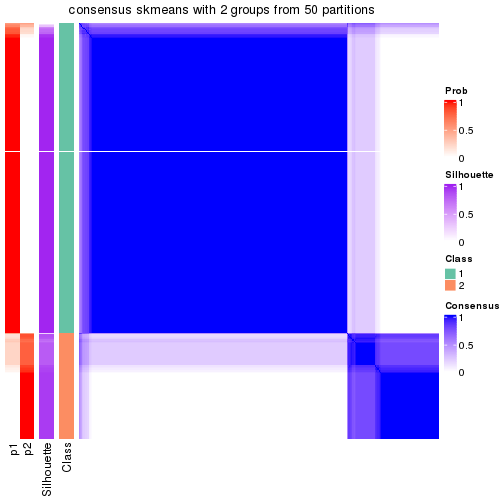</p>

</div>
<div id='tab-node-0-consensus-heatmap-2'>
<pre><code class="r">consensus_heatmap(res, k = 3)
</code></pre>

<p>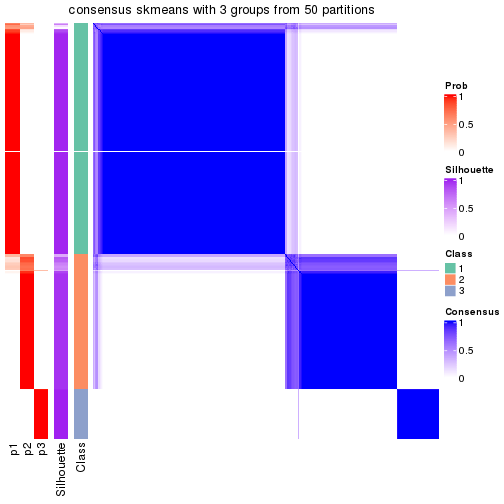</p>

</div>
<div id='tab-node-0-consensus-heatmap-3'>
<pre><code class="r">consensus_heatmap(res, k = 4)
</code></pre>

<p>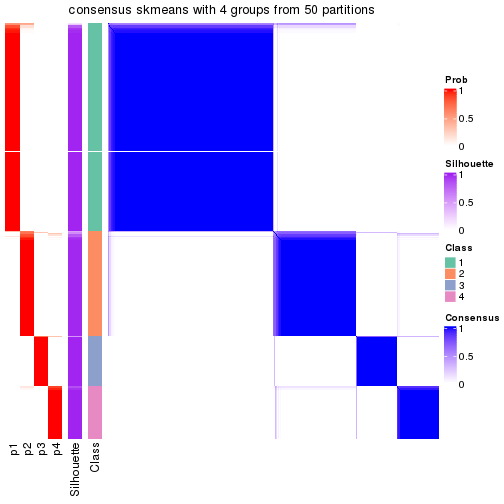</p>

</div>
<div id='tab-node-0-consensus-heatmap-4'>
<pre><code class="r">consensus_heatmap(res, k = 5)
</code></pre>

<p>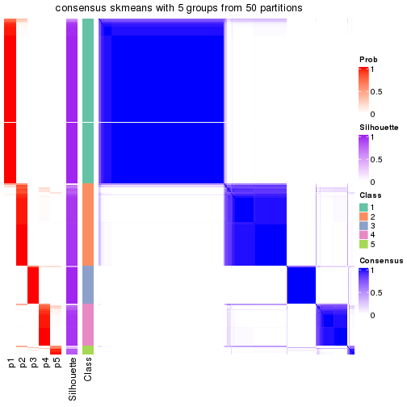</p>

</div>
<div id='tab-node-0-consensus-heatmap-5'>
<pre><code class="r">consensus_heatmap(res, k = 6)
</code></pre>

<p>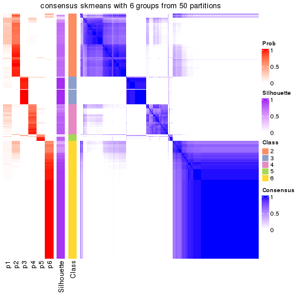</p>

</div>
<div id='tab-node-0-consensus-heatmap-6'>
<pre><code class="r">consensus_heatmap(res, k = 7)
</code></pre>

<p>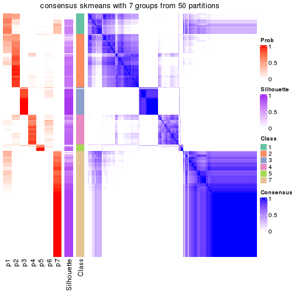</p>

</div>
<div id='tab-node-0-consensus-heatmap-7'>
<pre><code class="r">consensus_heatmap(res, k = 8)
</code></pre>

<p>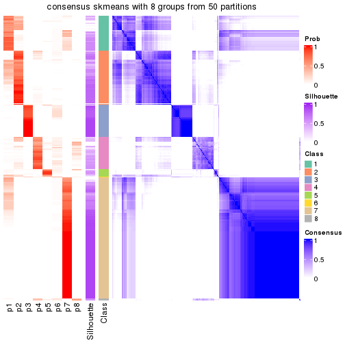</p>

</div>
</div>

Heatmaps for the membership of samples in all partitions to see how consistent they are:


<script>
$( function() {
	$( '#tabs-node-0-membership-heatmap' ).tabs();
} );
</script>
<div id='tabs-node-0-membership-heatmap'>
<ul>
<li><a href='#tab-node-0-membership-heatmap-1'>k = 2</a></li>
<li><a href='#tab-node-0-membership-heatmap-2'>k = 3</a></li>
<li><a href='#tab-node-0-membership-heatmap-3'>k = 4</a></li>
<li><a href='#tab-node-0-membership-heatmap-4'>k = 5</a></li>
<li><a href='#tab-node-0-membership-heatmap-5'>k = 6</a></li>
<li><a href='#tab-node-0-membership-heatmap-6'>k = 7</a></li>
<li><a href='#tab-node-0-membership-heatmap-7'>k = 8</a></li>
</ul>
<div id='tab-node-0-membership-heatmap-1'>
<pre><code class="r">membership_heatmap(res, k = 2)
</code></pre>

<p>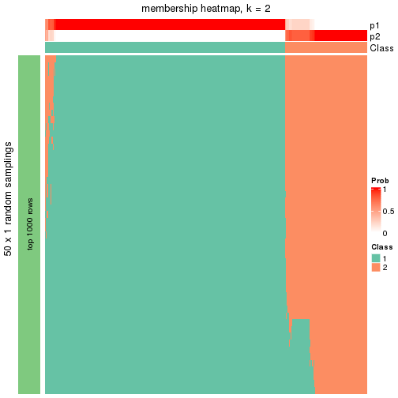</p>

</div>
<div id='tab-node-0-membership-heatmap-2'>
<pre><code class="r">membership_heatmap(res, k = 3)
</code></pre>

<p>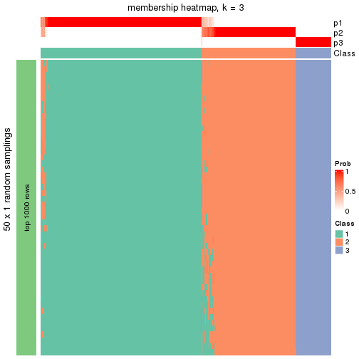</p>

</div>
<div id='tab-node-0-membership-heatmap-3'>
<pre><code class="r">membership_heatmap(res, k = 4)
</code></pre>

<p>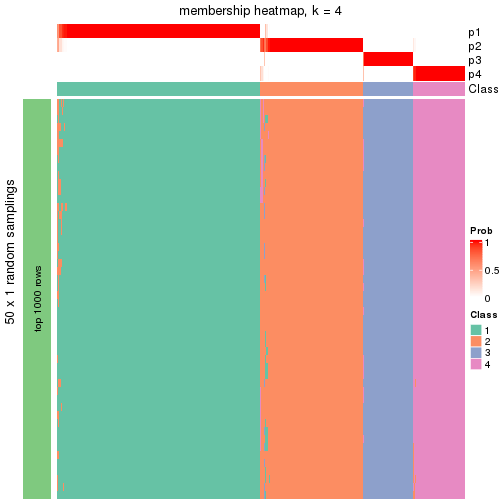</p>

</div>
<div id='tab-node-0-membership-heatmap-4'>
<pre><code class="r">membership_heatmap(res, k = 5)
</code></pre>

<p>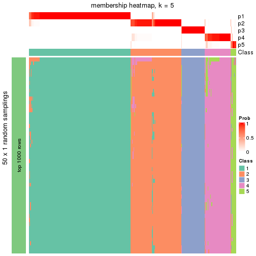</p>

</div>
<div id='tab-node-0-membership-heatmap-5'>
<pre><code class="r">membership_heatmap(res, k = 6)
</code></pre>

<p>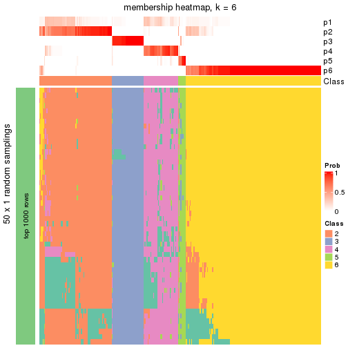</p>

</div>
<div id='tab-node-0-membership-heatmap-6'>
<pre><code class="r">membership_heatmap(res, k = 7)
</code></pre>

<p>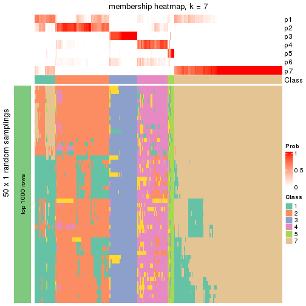</p>

</div>
<div id='tab-node-0-membership-heatmap-7'>
<pre><code class="r">membership_heatmap(res, k = 8)
</code></pre>

<p>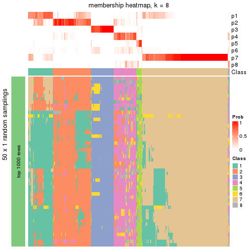</p>

</div>
</div>

As soon as the classes for columns are determined, the signatures
that are significantly different between subgroups can be looked for. 
Following are the heatmaps for signatures.


<script>
$( function() {
	$( '#tabs-node-0-get-signatures' ).tabs();
} );
</script>
<div id='tabs-node-0-get-signatures'>
<ul>
<li><a href='#tab-node-0-get-signatures-1'>k = 2</a></li>
<li><a href='#tab-node-0-get-signatures-2'>k = 3</a></li>
<li><a href='#tab-node-0-get-signatures-3'>k = 4</a></li>
<li><a href='#tab-node-0-get-signatures-4'>k = 5</a></li>
<li><a href='#tab-node-0-get-signatures-5'>k = 6</a></li>
<li><a href='#tab-node-0-get-signatures-6'>k = 7</a></li>
<li><a href='#tab-node-0-get-signatures-7'>k = 8</a></li>
</ul>
<div id='tab-node-0-get-signatures-1'>
<pre><code class="r">get_signatures(res, k = 2)
</code></pre>

<p>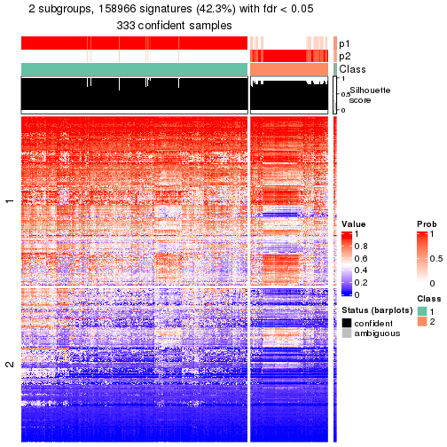</p>

</div>
<div id='tab-node-0-get-signatures-2'>
<pre><code class="r">get_signatures(res, k = 3)
</code></pre>

<p>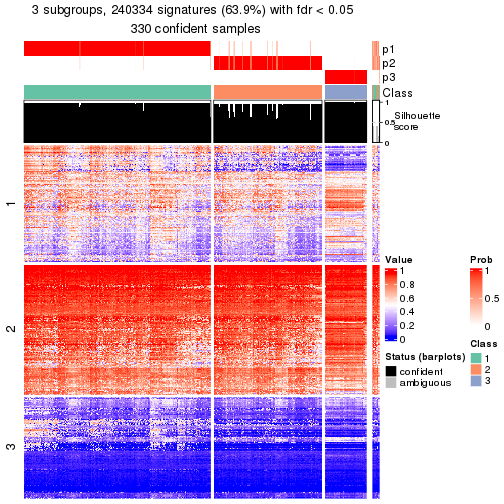</p>

</div>
<div id='tab-node-0-get-signatures-3'>
<pre><code class="r">get_signatures(res, k = 4)
</code></pre>

<p>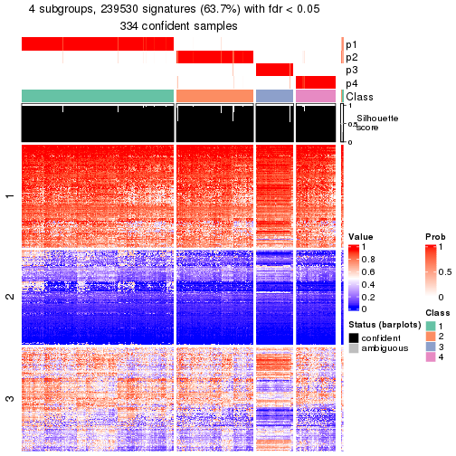</p>

</div>
<div id='tab-node-0-get-signatures-4'>
<pre><code class="r">get_signatures(res, k = 5)
</code></pre>

<p>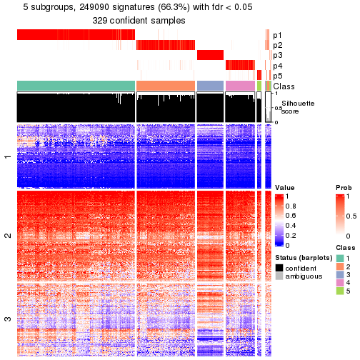</p>

</div>
<div id='tab-node-0-get-signatures-5'>
<pre><code class="r">get_signatures(res, k = 6)
</code></pre>

<p>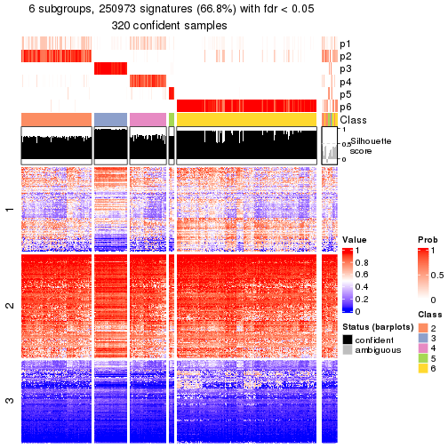</p>

</div>
<div id='tab-node-0-get-signatures-6'>
<pre><code class="r">get_signatures(res, k = 7)
</code></pre>

<p>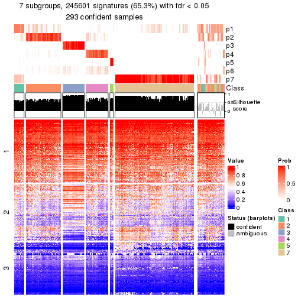</p>

</div>
<div id='tab-node-0-get-signatures-7'>
<pre><code class="r">get_signatures(res, k = 8)
</code></pre>

<p>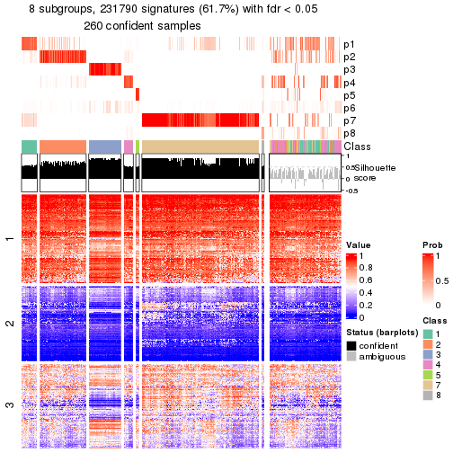</p>

</div>
</div>


Compare the overlap of signatures from different k:

```r
compare_signatures(res)
```

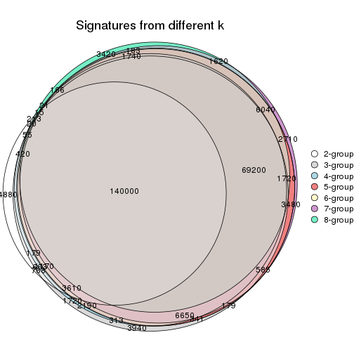

`get_signature()` returns a data frame invisibly. To get the list of signatures, the function
call should be assigned to a variable explicitly. In following code, if `plot` argument is set
to `FALSE`, no heatmap is plotted while only the differential analysis is performed.

```r
# code only for demonstration
tb = get_signature(res, k = ..., plot = FALSE)
```

An example of the output of `tb` is:

```
#>   which_row         fdr    mean_1    mean_2 scaled_mean_1 scaled_mean_2 km
#> 1        38 0.042760348  8.373488  9.131774    -0.5533452     0.5164555  1
#> 2        40 0.018707592  7.106213  8.469186    -0.6173731     0.5762149  1
#> 3        55 0.019134737 10.221463 11.207825    -0.6159697     0.5749050  1
#> 4        59 0.006059896  5.921854  7.869574    -0.6899429     0.6439467  1
#> 5        60 0.018055526  8.928898 10.211722    -0.6204761     0.5791110  1
#> 6        98 0.009384629 15.714769 14.887706     0.6635654    -0.6193277  2
...
```

The columns in `tb` are:

1. `which_row`: row indices corresponding to the input matrix.
2. `fdr`: FDR for the differential test. 
3. `mean_x`: The mean value in group x.
4. `scaled_mean_x`: The mean value in group x after rows are scaled.
5. `km`: Row groups if k-means clustering is applied to rows (which is done by automatically selecting number of clusters).

If there are too many signatures, `top_signatures = ...` can be set to only show the 
signatures with the highest FDRs:

```r
# code only for demonstration
# e.g. to show the top 500 most significant rows
tb = get_signature(res, k = ..., top_signatures = 500)
```

If the signatures are defined as these which are uniquely high in current group, `diff_method` argument
can be set to `"uniquely_high_in_one_group"`:

```r
# code only for demonstration
tb = get_signature(res, k = ..., diff_method = "uniquely_high_in_one_group")
```


UMAP plot which shows how samples are separated.


<script>
$( function() {
	$( '#tabs-node-0-dimension-reduction' ).tabs();
} );
</script>
<div id='tabs-node-0-dimension-reduction'>
<ul>
<li><a href='#tab-node-0-dimension-reduction-1'>k = 2</a></li>
<li><a href='#tab-node-0-dimension-reduction-2'>k = 3</a></li>
<li><a href='#tab-node-0-dimension-reduction-3'>k = 4</a></li>
<li><a href='#tab-node-0-dimension-reduction-4'>k = 5</a></li>
<li><a href='#tab-node-0-dimension-reduction-5'>k = 6</a></li>
<li><a href='#tab-node-0-dimension-reduction-6'>k = 7</a></li>
<li><a href='#tab-node-0-dimension-reduction-7'>k = 8</a></li>
</ul>
<div id='tab-node-0-dimension-reduction-1'>
<pre><code class="r">dimension_reduction(res, k = 2, method = &quot;UMAP&quot;)
</code></pre>

<p>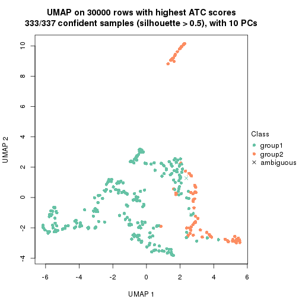</p>

</div>
<div id='tab-node-0-dimension-reduction-2'>
<pre><code class="r">dimension_reduction(res, k = 3, method = &quot;UMAP&quot;)
</code></pre>

<p>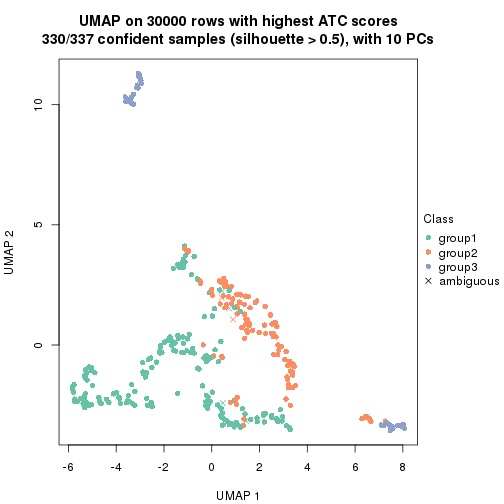</p>

</div>
<div id='tab-node-0-dimension-reduction-3'>
<pre><code class="r">dimension_reduction(res, k = 4, method = &quot;UMAP&quot;)
</code></pre>

<p>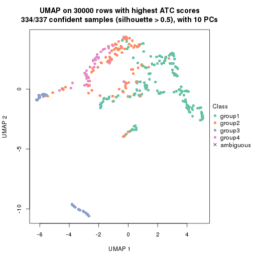</p>

</div>
<div id='tab-node-0-dimension-reduction-4'>
<pre><code class="r">dimension_reduction(res, k = 5, method = &quot;UMAP&quot;)
</code></pre>

<p>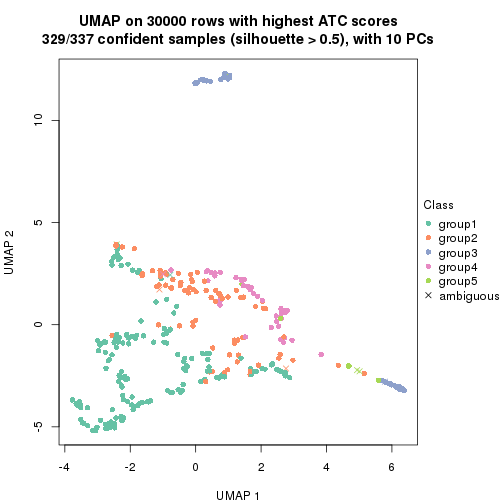</p>

</div>
<div id='tab-node-0-dimension-reduction-5'>
<pre><code class="r">dimension_reduction(res, k = 6, method = &quot;UMAP&quot;)
</code></pre>

<p>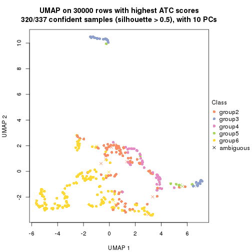</p>

</div>
<div id='tab-node-0-dimension-reduction-6'>
<pre><code class="r">dimension_reduction(res, k = 7, method = &quot;UMAP&quot;)
</code></pre>

<p>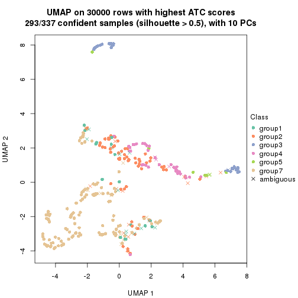</p>

</div>
<div id='tab-node-0-dimension-reduction-7'>
<pre><code class="r">dimension_reduction(res, k = 8, method = &quot;UMAP&quot;)
</code></pre>

<p>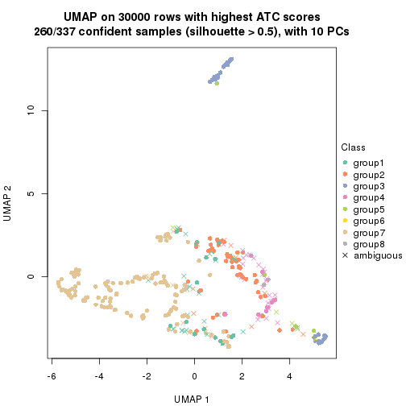</p>

</div>
</div>


Following heatmap shows how subgroups are split when increasing `k`:

```r
collect_classes(res)
```

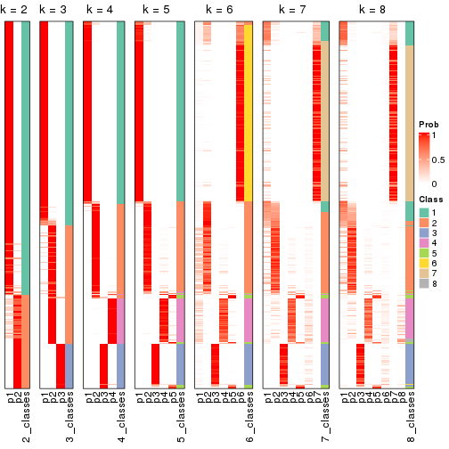


If matrix rows can be associated to genes, consider to use `functional_enrichment(res,
...)` to perform function enrichment for the signature genes. See [this vignette](https://jokergoo.github.io/cola_vignettes/functional_enrichment.html) for more detailed explanations.


 

---------------------------------------------------


### Node01


Parent node: [Node0](#Node0).
Child nodes: 
                [Node011](#Node011)
        ,
                [Node012](#Node012)
        ,
                [Node013](#Node013)
        ,
                [Node014](#Node014)
        ,
                Node021-leaf
        ,
                [Node022](#Node022)
        ,
                [Node023](#Node023)
        ,
                Node031-leaf
        ,
                [Node032](#Node032)
        ,
                Node033-leaf
        ,
                Node034-leaf
        ,
                [Node041](#Node041)
        ,
                [Node042](#Node042)
        ,
                [Node043](#Node043)
        .


The object with results only for a single top-value method and a single partitioning method 
can be extracted as:

```r
res = res_rh["01"]
```

A summary of `res` and all the functions that can be applied to it:

```r
res
```

```
#> A 'ConsensusPartition' object with k = 2, 3, 4, 5, 6, 7, 8.
#>   On a matrix with 30000 rows and 168 columns.
#>   Top rows (1000) are extracted by 'ATC' method.
#>   Subgroups are detected by 'kmeans' method.
#>   Performed in total 350 partitions by row resampling.
#>   Best k for subgroups seems to be 4.
#> 
#> Following methods can be applied to this 'ConsensusPartition' object:
#>  [1] "cola_report"             "collect_classes"         "collect_plots"          
#>  [4] "collect_stats"           "colnames"                "compare_partitions"     
#>  [7] "compare_signatures"      "consensus_heatmap"       "dimension_reduction"    
#> [10] "functional_enrichment"   "get_anno_col"            "get_anno"               
#> [13] "get_classes"             "get_consensus"           "get_matrix"             
#> [16] "get_membership"          "get_param"               "get_signatures"         
#> [19] "get_stats"               "is_best_k"               "is_stable_k"            
#> [22] "membership_heatmap"      "ncol"                    "nrow"                   
#> [25] "plot_ecdf"               "predict_classes"         "rownames"               
#> [28] "select_partition_number" "show"                    "suggest_best_k"         
#> [31] "test_to_known_factors"   "top_rows_heatmap"
```

`collect_plots()` function collects all the plots made from `res` for all `k` (number of subgroups)
into one single page to provide an easy and fast comparison between different `k`.

```r
collect_plots(res)
```

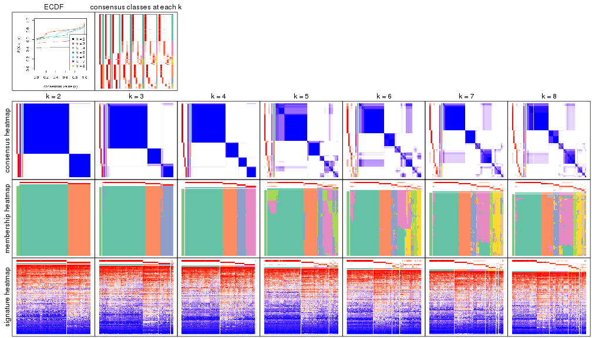

The plots are:

- The first row: a plot of the eCDF (empirical cumulative distribution
  function) curves of the consensus matrix for each `k` and the heatmap of
  predicted classes for each `k`.
- The second row: heatmaps of the consensus matrix for each `k`.
- The third row: heatmaps of the membership matrix for each `k`.
- The fouth row: heatmaps of the signatures for each `k`.

All the plots in panels can be made by individual functions and they are
plotted later in this section.

`select_partition_number()` produces several plots showing different
statistics for choosing "optimized" `k`. There are following statistics:

- eCDF curves of the consensus matrix for each `k`;
- 1-PAC. [The PAC score](https://en.wikipedia.org/wiki/Consensus_clustering#Over-interpretation_potential_of_consensus_clustering)
  measures the proportion of the ambiguous subgrouping.
- Mean silhouette score.
- Concordance. The mean probability of fiting the consensus subgroup labels in all
  partitions.
- Area increased. Denote $A_k$ as the area under the eCDF curve for current
  `k`, the area increased is defined as $A_k - A_{k-1}$.
- Rand index. The percent of pairs of samples that are both in a same cluster
  or both are not in a same cluster in the partition of k and k-1.
- Jaccard index. The ratio of pairs of samples are both in a same cluster in
  the partition of k and k-1 and the pairs of samples are both in a same
  cluster in the partition k or k-1.

The detailed explanations of these statistics can be found in [the _cola_
vignette](https://jokergoo.github.io/cola_vignettes/cola.html#toc_13).

Generally speaking, higher 1-PAC score, higher mean silhouette score or higher
concordance corresponds to better partition. Rand index and Jaccard index
measure how similar the current partition is compared to partition with `k-1`.
If they are too similar, we won't accept `k` is better than `k-1`.

```r
select_partition_number(res)
```

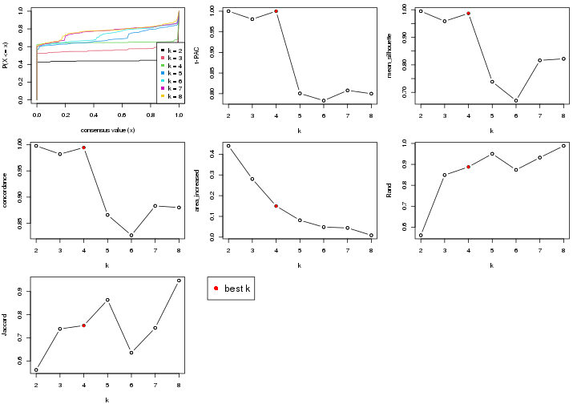

The numeric values for all these statistics can be obtained by `get_stats()`.

```r
get_stats(res)
```

```
#>   k 1-PAC mean_silhouette concordance area_increased  Rand Jaccard
#> 2 2 1.000           0.995       0.998        0.44014 0.561   0.561
#> 3 3 0.981           0.958       0.982        0.28033 0.849   0.739
#> 4 4 1.000           0.987       0.995        0.15002 0.888   0.753
#> 5 5 0.801           0.739       0.866        0.08132 0.951   0.864
#> 6 6 0.783           0.670       0.827        0.04835 0.874   0.636
#> 7 7 0.808           0.816       0.883        0.04445 0.933   0.743
#> 8 8 0.800           0.822       0.880        0.00893 0.989   0.948
```

`suggest_best_k()` suggests the best $k$ based on these statistics. The rules are as follows:

- All $k$ with Jaccard index larger than 0.95 are removed because increasing
  $k$ does not provide enough extra information. If all $k$ are removed, it is
  marked as no subgroup is detected.
- For all $k$ with 1-PAC score larger than 0.9, the maximal $k$ is taken as
  the best $k$, and other $k$ are marked as optional $k$.
- If it does not fit the second rule. The $k$ with the maximal vote of the
  highest 1-PAC score, highest mean silhouette, and highest concordance is
  taken as the best $k$.

```r
suggest_best_k(res)
```

```
#> [1] 4
#> attr(,"optional")
#> [1] 2 3
```

There is also optional best $k$ = 2 3 that is worth to check.

Following is the table of the partitions (You need to click the **show/hide
code output** link to see it). The membership matrix (columns with name `p*`)
is inferred by
[`clue::cl_consensus()`](https://www.rdocumentation.org/link/cl_consensus?package=clue)
function with the `SE` method. Basically the value in the membership matrix
represents the probability to belong to a certain group. The finall subgroup
label for an item is determined with the group with highest probability it
belongs to.

In `get_classes()` function, the entropy is calculated from the membership
matrix and the silhouette score is calculated from the consensus matrix.


<script>
$( function() {
	$( '#tabs-node-01-get-classes' ).tabs();
} );
</script>
<div id='tabs-node-01-get-classes'>
<ul>
<li><a href='#tab-node-01-get-classes-1'>k = 2</a></li>
<li><a href='#tab-node-01-get-classes-2'>k = 3</a></li>
<li><a href='#tab-node-01-get-classes-3'>k = 4</a></li>
<li><a href='#tab-node-01-get-classes-4'>k = 5</a></li>
<li><a href='#tab-node-01-get-classes-5'>k = 6</a></li>
<li><a href='#tab-node-01-get-classes-6'>k = 7</a></li>
<li><a href='#tab-node-01-get-classes-7'>k = 8</a></li>
</ul>

<div id='tab-node-01-get-classes-1'>
<p><a id='tab-node-01-get-classes-1-a' style='color:#0366d6' href='#'>show/hide code output</a></p>
<pre><code class="r">cbind(get_classes(res, k = 2), get_membership(res, k = 2))
</code></pre>

<pre><code>#&gt;                 class entropy silhouette   p1   p2
#&gt; TCGA.AA.3663.01     2   0.000      0.998 0.00 1.00
#&gt; TCGA.3L.AA1B.01     1   0.000      0.998 1.00 0.00
#&gt; TCGA.AZ.4615.01     2   0.000      0.998 0.00 1.00
#&gt; TCGA.D5.5538.01     1   0.000      0.998 1.00 0.00
#&gt; TCGA.G4.6306.01     1   0.000      0.998 1.00 0.00
#&gt; TCGA.AD.A5EJ.01     2   0.000      0.998 0.00 1.00
#&gt; TCGA.DM.A1HB.01     2   0.000      0.998 0.00 1.00
#&gt; TCGA.D5.6535.01     1   0.000      0.998 1.00 0.00
#&gt; TCGA.AY.6197.01     1   0.000      0.998 1.00 0.00
#&gt; TCGA.AZ.6598.01     2   0.000      0.998 0.00 1.00
#&gt; TCGA.DM.A0X9.01     1   0.000      0.998 1.00 0.00
#&gt; TCGA.G4.6628.01     2   0.000      0.998 0.00 1.00
#&gt; TCGA.CA.6716.01     1   0.000      0.998 1.00 0.00
#&gt; TCGA.A6.6653.01     2   0.000      0.998 0.00 1.00
#&gt; TCGA.G4.6304.01     1   0.000      0.998 1.00 0.00
#&gt; TCGA.F4.6855.01     1   0.000      0.998 1.00 0.00
#&gt; TCGA.NH.A6GA.01     1   0.000      0.998 1.00 0.00
#&gt; TCGA.NH.A50V.01     1   0.000      0.998 1.00 0.00
#&gt; TCGA.DM.A288.01     1   0.000      0.998 1.00 0.00
#&gt; TCGA.AD.6548.01     1   0.000      0.998 1.00 0.00
#&gt; TCGA.G4.6293.01     1   0.000      0.998 1.00 0.00
#&gt; TCGA.CK.5916.01     2   0.000      0.998 0.00 1.00
#&gt; TCGA.CK.6747.01     1   0.000      0.998 1.00 0.00
#&gt; TCGA.QL.A97D.01     1   0.000      0.998 1.00 0.00
#&gt; TCGA.AZ.6600.01     1   0.000      0.998 1.00 0.00
#&gt; TCGA.AY.A71X.01     1   0.000      0.998 1.00 0.00
#&gt; TCGA.CM.6169.01     1   0.000      0.998 1.00 0.00
#&gt; TCGA.DM.A28K.01     1   0.000      0.998 1.00 0.00
#&gt; TCGA.D5.6540.01     2   0.000      0.998 0.00 1.00
#&gt; TCGA.CA.5254.01     2   0.000      0.998 0.00 1.00
#&gt; TCGA.AY.6386.01     1   0.000      0.998 1.00 0.00
#&gt; TCGA.AD.5900.01     2   0.000      0.998 0.00 1.00
#&gt; TCGA.G4.6302.01     1   0.000      0.998 1.00 0.00
#&gt; TCGA.AZ.4614.01     2   0.000      0.998 0.00 1.00
#&gt; TCGA.A6.5664.01     1   0.000      0.998 1.00 0.00
#&gt; TCGA.CM.4744.01     1   0.000      0.998 1.00 0.00
#&gt; TCGA.CM.6166.01     1   0.000      0.998 1.00 0.00
#&gt; TCGA.DM.A280.01     1   0.000      0.998 1.00 0.00
#&gt; TCGA.A6.4107.01     2   0.000      0.998 0.00 1.00
#&gt; TCGA.AZ.6607.01     1   0.000      0.998 1.00 0.00
#&gt; TCGA.NH.A5IV.01     1   0.000      0.998 1.00 0.00
#&gt; TCGA.AD.A5EK.01     1   0.000      0.998 1.00 0.00
#&gt; TCGA.CM.6168.01     1   0.000      0.998 1.00 0.00
#&gt; TCGA.AM.5821.01     2   0.000      0.998 0.00 1.00
#&gt; TCGA.F4.6570.01     2   0.000      0.998 0.00 1.00
#&gt; TCGA.G4.6588.01     2   0.000      0.998 0.00 1.00
#&gt; TCGA.AY.A54L.01     1   0.000      0.998 1.00 0.00
#&gt; TCGA.CK.6746.01     2   0.000      0.998 0.00 1.00
#&gt; TCGA.G4.6298.01     1   0.000      0.998 1.00 0.00
#&gt; TCGA.CK.5915.01     1   0.000      0.998 1.00 0.00
#&gt; TCGA.CA.6718.01     2   0.000      0.998 0.00 1.00
#&gt; TCGA.D5.5539.01     1   0.000      0.998 1.00 0.00
#&gt; TCGA.A6.6654.01     1   0.000      0.998 1.00 0.00
#&gt; TCGA.CM.5341.01     1   0.000      0.998 1.00 0.00
#&gt; TCGA.WS.AB45.01     1   0.855      0.610 0.72 0.28
#&gt; TCGA.G4.6321.01     2   0.000      0.998 0.00 1.00
#&gt; TCGA.AA.3713.01     2   0.000      0.998 0.00 1.00
#&gt; TCGA.CM.5864.01     1   0.000      0.998 1.00 0.00
#&gt; TCGA.CK.5913.01     2   0.000      0.998 0.00 1.00
#&gt; TCGA.CM.5863.01     1   0.000      0.998 1.00 0.00
#&gt; TCGA.AA.3495.01     1   0.000      0.998 1.00 0.00
#&gt; TCGA.F4.6857.01     1   0.000      0.998 1.00 0.00
#&gt; TCGA.QG.A5YW.01     1   0.000      0.998 1.00 0.00
#&gt; TCGA.A6.5665.01     2   0.000      0.998 0.00 1.00
#&gt; TCGA.CA.5255.01     1   0.000      0.998 1.00 0.00
#&gt; TCGA.CM.5349.01     1   0.000      0.998 1.00 0.00
#&gt; TCGA.CK.4947.01     1   0.000      0.998 1.00 0.00
#&gt; TCGA.G4.6297.01     1   0.000      0.998 1.00 0.00
#&gt; TCGA.AZ.6606.01     2   0.000      0.998 0.00 1.00
#&gt; TCGA.CM.6675.01     2   0.000      0.998 0.00 1.00
#&gt; TCGA.AD.6899.01     1   0.000      0.998 1.00 0.00
#&gt; TCGA.AD.6895.01     2   0.000      0.998 0.00 1.00
#&gt; TCGA.A6.3809.01     2   0.000      0.998 0.00 1.00
#&gt; TCGA.D5.6931.01     2   0.000      0.998 0.00 1.00
#&gt; TCGA.G4.6627.01     1   0.000      0.998 1.00 0.00
#&gt; TCGA.A6.5657.01     1   0.000      0.998 1.00 0.00
#&gt; TCGA.CM.5861.01     2   0.000      0.998 0.00 1.00
#&gt; TCGA.A6.6649.01     2   0.000      0.998 0.00 1.00
#&gt; TCGA.CM.5348.01     1   0.000      0.998 1.00 0.00
#&gt; TCGA.A6.2672.01     2   0.000      0.998 0.00 1.00
#&gt; TCGA.AY.A69D.01     1   0.000      0.998 1.00 0.00
#&gt; TCGA.F4.6463.01     1   0.000      0.998 1.00 0.00
#&gt; TCGA.D5.6928.01     2   0.000      0.998 0.00 1.00
#&gt; TCGA.CA.6719.01     1   0.000      0.998 1.00 0.00
#&gt; TCGA.AZ.4323.01     1   0.000      0.998 1.00 0.00
#&gt; TCGA.F4.6856.01     1   0.000      0.998 1.00 0.00
#&gt; TCGA.A6.5661.01     2   0.000      0.998 0.00 1.00
#&gt; TCGA.AZ.4315.01     1   0.000      0.998 1.00 0.00
#&gt; TCGA.CM.4743.01     2   0.000      0.998 0.00 1.00
#&gt; TCGA.A6.2677.01     1   0.000      0.998 1.00 0.00
#&gt; TCGA.D5.5537.01     1   0.000      0.998 1.00 0.00
#&gt; TCGA.CA.6717.01     1   0.000      0.998 1.00 0.00
#&gt; TCGA.F4.6569.01     1   0.000      0.998 1.00 0.00
#&gt; TCGA.D5.6930.01     2   0.000      0.998 0.00 1.00
#&gt; TCGA.F4.6807.01     1   0.000      0.998 1.00 0.00
#&gt; TCGA.4T.AA8H.01     1   0.000      0.998 1.00 0.00
#&gt; TCGA.A6.4105.01     1   0.000      0.998 1.00 0.00
#&gt; TCGA.AA.3506.01     1   0.000      0.998 1.00 0.00
#&gt; TCGA.A6.6138.01     1   0.000      0.998 1.00 0.00
#&gt; TCGA.D5.6538.01     1   0.000      0.998 1.00 0.00
#&gt; TCGA.F4.6809.01     1   0.000      0.998 1.00 0.00
#&gt; TCGA.F4.6806.01     1   0.000      0.998 1.00 0.00
#&gt; TCGA.AA.3502.01     1   0.000      0.998 1.00 0.00
#&gt; TCGA.NH.A8F8.01     1   0.000      0.998 1.00 0.00
#&gt; TCGA.AY.6196.01     1   0.000      0.998 1.00 0.00
#&gt; TCGA.CK.4951.01     2   0.000      0.998 0.00 1.00
#&gt; TCGA.AZ.6599.01     1   0.000      0.998 1.00 0.00
#&gt; TCGA.5M.AAT4.01     1   0.000      0.998 1.00 0.00
#&gt; TCGA.CK.5914.01     1   0.000      0.998 1.00 0.00
#&gt; TCGA.CM.5860.01     1   0.000      0.998 1.00 0.00
#&gt; TCGA.AD.6965.01     1   0.000      0.998 1.00 0.00
#&gt; TCGA.A6.6780.01     1   0.000      0.998 1.00 0.00
#&gt; TCGA.A6.2686.01     2   0.000      0.998 0.00 1.00
#&gt; TCGA.CM.4750.01     1   0.000      0.998 1.00 0.00
#&gt; TCGA.CM.6677.01     1   0.000      0.998 1.00 0.00
#&gt; TCGA.D5.5540.01     1   0.000      0.998 1.00 0.00
#&gt; TCGA.QG.A5Z2.01     2   0.000      0.998 0.00 1.00
#&gt; TCGA.AZ.5407.01     1   0.000      0.998 1.00 0.00
#&gt; TCGA.DM.A28G.01     1   0.000      0.998 1.00 0.00
#&gt; TCGA.AA.3492.01     2   0.000      0.998 0.00 1.00
#&gt; TCGA.G4.6322.01     2   0.000      0.998 0.00 1.00
#&gt; TCGA.AD.6889.01     2   0.000      0.998 0.00 1.00
#&gt; TCGA.G4.6586.01     2   0.000      0.998 0.00 1.00
#&gt; TCGA.G4.6323.01     1   0.000      0.998 1.00 0.00
#&gt; TCGA.CK.4950.01     1   0.000      0.998 1.00 0.00
#&gt; TCGA.D5.6529.01     1   0.000      0.998 1.00 0.00
#&gt; TCGA.DM.A282.01     1   0.000      0.998 1.00 0.00
#&gt; TCGA.A6.5660.01     1   0.000      0.998 1.00 0.00
#&gt; TCGA.G4.6299.01     2   0.000      0.998 0.00 1.00
#&gt; TCGA.DM.A1DA.01     2   0.000      0.998 0.00 1.00
#&gt; TCGA.D5.6920.01     1   0.000      0.998 1.00 0.00
#&gt; TCGA.DM.A1D8.01     1   0.000      0.998 1.00 0.00
#&gt; TCGA.DM.A1HA.01     1   0.000      0.998 1.00 0.00
#&gt; TCGA.DM.A285.01     1   0.000      0.998 1.00 0.00
#&gt; TCGA.AZ.6601.01     1   0.000      0.998 1.00 0.00
#&gt; TCGA.D5.6532.01     1   0.000      0.998 1.00 0.00
#&gt; TCGA.D5.6531.01     2   0.000      0.998 0.00 1.00
#&gt; TCGA.DM.A0XD.01     1   0.000      0.998 1.00 0.00
#&gt; TCGA.CK.6751.01     2   0.000      0.998 0.00 1.00
#&gt; TCGA.A6.A566.01     2   0.000      0.998 0.00 1.00
#&gt; TCGA.A6.5659.01     2   0.469      0.888 0.10 0.90
#&gt; TCGA.AU.6004.01     2   0.000      0.998 0.00 1.00
#&gt; TCGA.CK.4952.01     2   0.000      0.998 0.00 1.00
#&gt; TCGA.D5.6541.01     1   0.000      0.998 1.00 0.00
#&gt; TCGA.A6.2680.01     1   0.000      0.998 1.00 0.00
#&gt; TCGA.AD.6901.01     1   0.000      0.998 1.00 0.00
#&gt; TCGA.AA.3496.01     1   0.000      0.998 1.00 0.00
#&gt; TCGA.CM.4751.01     2   0.000      0.998 0.00 1.00
#&gt; TCGA.A6.6650.01     1   0.000      0.998 1.00 0.00
#&gt; TCGA.DM.A28A.01     1   0.000      0.998 1.00 0.00
#&gt; TCGA.D5.6534.01     1   0.000      0.998 1.00 0.00
#&gt; TCGA.AZ.4616.01     1   0.000      0.998 1.00 0.00
#&gt; TCGA.QG.A5Z1.01     1   0.000      0.998 1.00 0.00
#&gt; TCGA.CM.6680.01     1   0.000      0.998 1.00 0.00
#&gt; TCGA.CM.6171.01     2   0.000      0.998 0.00 1.00
#&gt; TCGA.AA.3660.01     1   0.000      0.998 1.00 0.00
#&gt; TCGA.F4.6461.01     2   0.000      0.998 0.00 1.00
#&gt; TCGA.CM.4747.01     1   0.000      0.998 1.00 0.00
#&gt; TCGA.DM.A28H.01     1   0.000      0.998 1.00 0.00
#&gt; TCGA.D5.7000.01     2   0.000      0.998 0.00 1.00
#&gt; TCGA.G4.6320.01     2   0.000      0.998 0.00 1.00
#&gt; TCGA.G4.6310.01     1   0.000      0.998 1.00 0.00
#&gt; TCGA.DM.A28M.01     1   0.000      0.998 1.00 0.00
#&gt; TCGA.DM.A1D4.01     1   0.000      0.998 1.00 0.00
#&gt; TCGA.NH.A6GB.01     1   0.000      0.998 1.00 0.00
#&gt; TCGA.A6.2681.01     1   0.000      0.998 1.00 0.00
#&gt; TCGA.A6.2679.01     1   0.000      0.998 1.00 0.00
#&gt; TCGA.D5.6537.01     1   0.000      0.998 1.00 0.00
</code></pre>

<script>
$('#tab-node-01-get-classes-1-a').parent().next().next().hide();
$('#tab-node-01-get-classes-1-a').click(function(){
  $('#tab-node-01-get-classes-1-a').parent().next().next().toggle();
  return(false);
});
</script>
</div>

<div id='tab-node-01-get-classes-2'>
<p><a id='tab-node-01-get-classes-2-a' style='color:#0366d6' href='#'>show/hide code output</a></p>
<pre><code class="r">cbind(get_classes(res, k = 3), get_membership(res, k = 3))
</code></pre>

<pre><code>#&gt;                 class entropy silhouette   p1   p2   p3
#&gt; TCGA.AA.3663.01     3   0.000      0.943 0.00 0.00 1.00
#&gt; TCGA.3L.AA1B.01     1   0.000      0.986 1.00 0.00 0.00
#&gt; TCGA.AZ.4615.01     2   0.000      1.000 0.00 1.00 0.00
#&gt; TCGA.D5.5538.01     1   0.000      0.986 1.00 0.00 0.00
#&gt; TCGA.G4.6306.01     1   0.000      0.986 1.00 0.00 0.00
#&gt; TCGA.AD.A5EJ.01     2   0.000      1.000 0.00 1.00 0.00
#&gt; TCGA.DM.A1HB.01     2   0.000      1.000 0.00 1.00 0.00
#&gt; TCGA.D5.6535.01     1   0.000      0.986 1.00 0.00 0.00
#&gt; TCGA.AY.6197.01     3   0.000      0.943 0.00 0.00 1.00
#&gt; TCGA.AZ.6598.01     2   0.000      1.000 0.00 1.00 0.00
#&gt; TCGA.DM.A0X9.01     1   0.334      0.862 0.88 0.00 0.12
#&gt; TCGA.G4.6628.01     2   0.000      1.000 0.00 1.00 0.00
#&gt; TCGA.CA.6716.01     1   0.334      0.862 0.88 0.00 0.12
#&gt; TCGA.A6.6653.01     2   0.000      1.000 0.00 1.00 0.00
#&gt; TCGA.G4.6304.01     1   0.000      0.986 1.00 0.00 0.00
#&gt; TCGA.F4.6855.01     1   0.000      0.986 1.00 0.00 0.00
#&gt; TCGA.NH.A6GA.01     1   0.000      0.986 1.00 0.00 0.00
#&gt; TCGA.NH.A50V.01     1   0.000      0.986 1.00 0.00 0.00
#&gt; TCGA.DM.A288.01     1   0.000      0.986 1.00 0.00 0.00
#&gt; TCGA.AD.6548.01     1   0.000      0.986 1.00 0.00 0.00
#&gt; TCGA.G4.6293.01     1   0.000      0.986 1.00 0.00 0.00
#&gt; TCGA.CK.5916.01     2   0.000      1.000 0.00 1.00 0.00
#&gt; TCGA.CK.6747.01     1   0.000      0.986 1.00 0.00 0.00
#&gt; TCGA.QL.A97D.01     1   0.000      0.986 1.00 0.00 0.00
#&gt; TCGA.AZ.6600.01     1   0.000      0.986 1.00 0.00 0.00
#&gt; TCGA.AY.A71X.01     1   0.000      0.986 1.00 0.00 0.00
#&gt; TCGA.CM.6169.01     1   0.000      0.986 1.00 0.00 0.00
#&gt; TCGA.DM.A28K.01     1   0.000      0.986 1.00 0.00 0.00
#&gt; TCGA.D5.6540.01     2   0.000      1.000 0.00 1.00 0.00
#&gt; TCGA.CA.5254.01     2   0.000      1.000 0.00 1.00 0.00
#&gt; TCGA.AY.6386.01     1   0.000      0.986 1.00 0.00 0.00
#&gt; TCGA.AD.5900.01     2   0.000      1.000 0.00 1.00 0.00
#&gt; TCGA.G4.6302.01     3   0.000      0.943 0.00 0.00 1.00
#&gt; TCGA.AZ.4614.01     3   0.480      0.729 0.00 0.22 0.78
#&gt; TCGA.A6.5664.01     1   0.000      0.986 1.00 0.00 0.00
#&gt; TCGA.CM.4744.01     3   0.000      0.943 0.00 0.00 1.00
#&gt; TCGA.CM.6166.01     1   0.000      0.986 1.00 0.00 0.00
#&gt; TCGA.DM.A280.01     1   0.000      0.986 1.00 0.00 0.00
#&gt; TCGA.A6.4107.01     3   0.000      0.943 0.00 0.00 1.00
#&gt; TCGA.AZ.6607.01     1   0.000      0.986 1.00 0.00 0.00
#&gt; TCGA.NH.A5IV.01     1   0.000      0.986 1.00 0.00 0.00
#&gt; TCGA.AD.A5EK.01     1   0.000      0.986 1.00 0.00 0.00
#&gt; TCGA.CM.6168.01     1   0.000      0.986 1.00 0.00 0.00
#&gt; TCGA.AM.5821.01     2   0.000      1.000 0.00 1.00 0.00
#&gt; TCGA.F4.6570.01     2   0.000      1.000 0.00 1.00 0.00
#&gt; TCGA.G4.6588.01     2   0.000      1.000 0.00 1.00 0.00
#&gt; TCGA.AY.A54L.01     1   0.000      0.986 1.00 0.00 0.00
#&gt; TCGA.CK.6746.01     2   0.000      1.000 0.00 1.00 0.00
#&gt; TCGA.G4.6298.01     1   0.000      0.986 1.00 0.00 0.00
#&gt; TCGA.CK.5915.01     1   0.000      0.986 1.00 0.00 0.00
#&gt; TCGA.CA.6718.01     3   0.000      0.943 0.00 0.00 1.00
#&gt; TCGA.D5.5539.01     1   0.000      0.986 1.00 0.00 0.00
#&gt; TCGA.A6.6654.01     1   0.000      0.986 1.00 0.00 0.00
#&gt; TCGA.CM.5341.01     1   0.000      0.986 1.00 0.00 0.00
#&gt; TCGA.WS.AB45.01     3   0.000      0.943 0.00 0.00 1.00
#&gt; TCGA.G4.6321.01     2   0.000      1.000 0.00 1.00 0.00
#&gt; TCGA.AA.3713.01     3   0.595      0.497 0.00 0.36 0.64
#&gt; TCGA.CM.5864.01     1   0.000      0.986 1.00 0.00 0.00
#&gt; TCGA.CK.5913.01     2   0.000      1.000 0.00 1.00 0.00
#&gt; TCGA.CM.5863.01     1   0.000      0.986 1.00 0.00 0.00
#&gt; TCGA.AA.3495.01     1   0.000      0.986 1.00 0.00 0.00
#&gt; TCGA.F4.6857.01     1   0.000      0.986 1.00 0.00 0.00
#&gt; TCGA.QG.A5YW.01     1   0.000      0.986 1.00 0.00 0.00
#&gt; TCGA.A6.5665.01     2   0.000      1.000 0.00 1.00 0.00
#&gt; TCGA.CA.5255.01     1   0.429      0.786 0.82 0.00 0.18
#&gt; TCGA.CM.5349.01     1   0.000      0.986 1.00 0.00 0.00
#&gt; TCGA.CK.4947.01     1   0.000      0.986 1.00 0.00 0.00
#&gt; TCGA.G4.6297.01     1   0.000      0.986 1.00 0.00 0.00
#&gt; TCGA.AZ.6606.01     3   0.400      0.802 0.00 0.16 0.84
#&gt; TCGA.CM.6675.01     2   0.000      1.000 0.00 1.00 0.00
#&gt; TCGA.AD.6899.01     1   0.000      0.986 1.00 0.00 0.00
#&gt; TCGA.AD.6895.01     2   0.000      1.000 0.00 1.00 0.00
#&gt; TCGA.A6.3809.01     2   0.000      1.000 0.00 1.00 0.00
#&gt; TCGA.D5.6931.01     3   0.000      0.943 0.00 0.00 1.00
#&gt; TCGA.G4.6627.01     1   0.000      0.986 1.00 0.00 0.00
#&gt; TCGA.A6.5657.01     1   0.000      0.986 1.00 0.00 0.00
#&gt; TCGA.CM.5861.01     2   0.000      1.000 0.00 1.00 0.00
#&gt; TCGA.A6.6649.01     3   0.000      0.943 0.00 0.00 1.00
#&gt; TCGA.CM.5348.01     1   0.000      0.986 1.00 0.00 0.00
#&gt; TCGA.A6.2672.01     2   0.000      1.000 0.00 1.00 0.00
#&gt; TCGA.AY.A69D.01     1   0.000      0.986 1.00 0.00 0.00
#&gt; TCGA.F4.6463.01     1   0.000      0.986 1.00 0.00 0.00
#&gt; TCGA.D5.6928.01     3   0.000      0.943 0.00 0.00 1.00
#&gt; TCGA.CA.6719.01     1   0.000      0.986 1.00 0.00 0.00
#&gt; TCGA.AZ.4323.01     1   0.000      0.986 1.00 0.00 0.00
#&gt; TCGA.F4.6856.01     1   0.000      0.986 1.00 0.00 0.00
#&gt; TCGA.A6.5661.01     2   0.000      1.000 0.00 1.00 0.00
#&gt; TCGA.AZ.4315.01     1   0.000      0.986 1.00 0.00 0.00
#&gt; TCGA.CM.4743.01     3   0.595      0.497 0.00 0.36 0.64
#&gt; TCGA.A6.2677.01     1   0.000      0.986 1.00 0.00 0.00
#&gt; TCGA.D5.5537.01     1   0.000      0.986 1.00 0.00 0.00
#&gt; TCGA.CA.6717.01     1   0.000      0.986 1.00 0.00 0.00
#&gt; TCGA.F4.6569.01     1   0.000      0.986 1.00 0.00 0.00
#&gt; TCGA.D5.6930.01     2   0.000      1.000 0.00 1.00 0.00
#&gt; TCGA.F4.6807.01     1   0.000      0.986 1.00 0.00 0.00
#&gt; TCGA.4T.AA8H.01     1   0.000      0.986 1.00 0.00 0.00
#&gt; TCGA.A6.4105.01     3   0.000      0.943 0.00 0.00 1.00
#&gt; TCGA.AA.3506.01     1   0.000      0.986 1.00 0.00 0.00
#&gt; TCGA.A6.6138.01     1   0.000      0.986 1.00 0.00 0.00
#&gt; TCGA.D5.6538.01     3   0.000      0.943 0.00 0.00 1.00
#&gt; TCGA.F4.6809.01     1   0.000      0.986 1.00 0.00 0.00
#&gt; TCGA.F4.6806.01     1   0.000      0.986 1.00 0.00 0.00
#&gt; TCGA.AA.3502.01     1   0.000      0.986 1.00 0.00 0.00
#&gt; TCGA.NH.A8F8.01     1   0.000      0.986 1.00 0.00 0.00
#&gt; TCGA.AY.6196.01     1   0.000      0.986 1.00 0.00 0.00
#&gt; TCGA.CK.4951.01     2   0.000      1.000 0.00 1.00 0.00
#&gt; TCGA.AZ.6599.01     1   0.000      0.986 1.00 0.00 0.00
#&gt; TCGA.5M.AAT4.01     1   0.000      0.986 1.00 0.00 0.00
#&gt; TCGA.CK.5914.01     1   0.000      0.986 1.00 0.00 0.00
#&gt; TCGA.CM.5860.01     3   0.000      0.943 0.00 0.00 1.00
#&gt; TCGA.AD.6965.01     1   0.000      0.986 1.00 0.00 0.00
#&gt; TCGA.A6.6780.01     1   0.429      0.786 0.82 0.00 0.18
#&gt; TCGA.A6.2686.01     2   0.000      1.000 0.00 1.00 0.00
#&gt; TCGA.CM.4750.01     1   0.000      0.986 1.00 0.00 0.00
#&gt; TCGA.CM.6677.01     1   0.000      0.986 1.00 0.00 0.00
#&gt; TCGA.D5.5540.01     1   0.000      0.986 1.00 0.00 0.00
#&gt; TCGA.QG.A5Z2.01     2   0.000      1.000 0.00 1.00 0.00
#&gt; TCGA.AZ.5407.01     3   0.000      0.943 0.00 0.00 1.00
#&gt; TCGA.DM.A28G.01     1   0.000      0.986 1.00 0.00 0.00
#&gt; TCGA.AA.3492.01     2   0.000      1.000 0.00 1.00 0.00
#&gt; TCGA.G4.6322.01     3   0.000      0.943 0.00 0.00 1.00
#&gt; TCGA.AD.6889.01     2   0.000      1.000 0.00 1.00 0.00
#&gt; TCGA.G4.6586.01     2   0.000      1.000 0.00 1.00 0.00
#&gt; TCGA.G4.6323.01     1   0.595      0.464 0.64 0.00 0.36
#&gt; TCGA.CK.4950.01     3   0.000      0.943 0.00 0.00 1.00
#&gt; TCGA.D5.6529.01     1   0.000      0.986 1.00 0.00 0.00
#&gt; TCGA.DM.A282.01     1   0.000      0.986 1.00 0.00 0.00
#&gt; TCGA.A6.5660.01     1   0.000      0.986 1.00 0.00 0.00
#&gt; TCGA.G4.6299.01     2   0.000      1.000 0.00 1.00 0.00
#&gt; TCGA.DM.A1DA.01     3   0.000      0.943 0.00 0.00 1.00
#&gt; TCGA.D5.6920.01     1   0.000      0.986 1.00 0.00 0.00
#&gt; TCGA.DM.A1D8.01     1   0.000      0.986 1.00 0.00 0.00
#&gt; TCGA.DM.A1HA.01     1   0.000      0.986 1.00 0.00 0.00
#&gt; TCGA.DM.A285.01     1   0.000      0.986 1.00 0.00 0.00
#&gt; TCGA.AZ.6601.01     3   0.254      0.847 0.08 0.00 0.92
#&gt; TCGA.D5.6532.01     1   0.000      0.986 1.00 0.00 0.00
#&gt; TCGA.D5.6531.01     2   0.000      1.000 0.00 1.00 0.00
#&gt; TCGA.DM.A0XD.01     3   0.000      0.943 0.00 0.00 1.00
#&gt; TCGA.CK.6751.01     3   0.000      0.943 0.00 0.00 1.00
#&gt; TCGA.A6.A566.01     3   0.000      0.943 0.00 0.00 1.00
#&gt; TCGA.A6.5659.01     3   0.000      0.943 0.00 0.00 1.00
#&gt; TCGA.AU.6004.01     2   0.000      1.000 0.00 1.00 0.00
#&gt; TCGA.CK.4952.01     3   0.595      0.497 0.00 0.36 0.64
#&gt; TCGA.D5.6541.01     1   0.000      0.986 1.00 0.00 0.00
#&gt; TCGA.A6.2680.01     1   0.000      0.986 1.00 0.00 0.00
#&gt; TCGA.AD.6901.01     1   0.000      0.986 1.00 0.00 0.00
#&gt; TCGA.AA.3496.01     1   0.000      0.986 1.00 0.00 0.00
#&gt; TCGA.CM.4751.01     3   0.000      0.943 0.00 0.00 1.00
#&gt; TCGA.A6.6650.01     1   0.000      0.986 1.00 0.00 0.00
#&gt; TCGA.DM.A28A.01     1   0.000      0.986 1.00 0.00 0.00
#&gt; TCGA.D5.6534.01     3   0.000      0.943 0.00 0.00 1.00
#&gt; TCGA.AZ.4616.01     1   0.000      0.986 1.00 0.00 0.00
#&gt; TCGA.QG.A5Z1.01     1   0.000      0.986 1.00 0.00 0.00
#&gt; TCGA.CM.6680.01     1   0.000      0.986 1.00 0.00 0.00
#&gt; TCGA.CM.6171.01     2   0.000      1.000 0.00 1.00 0.00
#&gt; TCGA.AA.3660.01     1   0.000      0.986 1.00 0.00 0.00
#&gt; TCGA.F4.6461.01     3   0.207      0.898 0.00 0.06 0.94
#&gt; TCGA.CM.4747.01     1   0.000      0.986 1.00 0.00 0.00
#&gt; TCGA.DM.A28H.01     1   0.000      0.986 1.00 0.00 0.00
#&gt; TCGA.D5.7000.01     3   0.000      0.943 0.00 0.00 1.00
#&gt; TCGA.G4.6320.01     2   0.000      1.000 0.00 1.00 0.00
#&gt; TCGA.G4.6310.01     1   0.000      0.986 1.00 0.00 0.00
#&gt; TCGA.DM.A28M.01     1   0.000      0.986 1.00 0.00 0.00
#&gt; TCGA.DM.A1D4.01     1   0.628      0.189 0.54 0.00 0.46
#&gt; TCGA.NH.A6GB.01     1   0.000      0.986 1.00 0.00 0.00
#&gt; TCGA.A6.2681.01     1   0.000      0.986 1.00 0.00 0.00
#&gt; TCGA.A6.2679.01     1   0.000      0.986 1.00 0.00 0.00
#&gt; TCGA.D5.6537.01     1   0.000      0.986 1.00 0.00 0.00
</code></pre>

<script>
$('#tab-node-01-get-classes-2-a').parent().next().next().hide();
$('#tab-node-01-get-classes-2-a').click(function(){
  $('#tab-node-01-get-classes-2-a').parent().next().next().toggle();
  return(false);
});
</script>
</div>

<div id='tab-node-01-get-classes-3'>
<p><a id='tab-node-01-get-classes-3-a' style='color:#0366d6' href='#'>show/hide code output</a></p>
<pre><code class="r">cbind(get_classes(res, k = 4), get_membership(res, k = 4))
</code></pre>

<pre><code>#&gt;                 class entropy silhouette   p1   p2   p3   p4
#&gt; TCGA.AA.3663.01     3  0.0707      0.976 0.00 0.00 0.98 0.02
#&gt; TCGA.3L.AA1B.01     1  0.0000      0.995 1.00 0.00 0.00 0.00
#&gt; TCGA.AZ.4615.01     2  0.0000      0.996 0.00 1.00 0.00 0.00
#&gt; TCGA.D5.5538.01     1  0.0000      0.995 1.00 0.00 0.00 0.00
#&gt; TCGA.G4.6306.01     1  0.0000      0.995 1.00 0.00 0.00 0.00
#&gt; TCGA.AD.A5EJ.01     2  0.0000      0.996 0.00 1.00 0.00 0.00
#&gt; TCGA.DM.A1HB.01     2  0.0000      0.996 0.00 1.00 0.00 0.00
#&gt; TCGA.D5.6535.01     1  0.0000      0.995 1.00 0.00 0.00 0.00
#&gt; TCGA.AY.6197.01     4  0.0000      0.988 0.00 0.00 0.00 1.00
#&gt; TCGA.AZ.6598.01     2  0.0000      0.996 0.00 1.00 0.00 0.00
#&gt; TCGA.DM.A0X9.01     4  0.0000      0.988 0.00 0.00 0.00 1.00
#&gt; TCGA.G4.6628.01     2  0.0000      0.996 0.00 1.00 0.00 0.00
#&gt; TCGA.CA.6716.01     4  0.0000      0.988 0.00 0.00 0.00 1.00
#&gt; TCGA.A6.6653.01     2  0.0000      0.996 0.00 1.00 0.00 0.00
#&gt; TCGA.G4.6304.01     1  0.0000      0.995 1.00 0.00 0.00 0.00
#&gt; TCGA.F4.6855.01     1  0.0000      0.995 1.00 0.00 0.00 0.00
#&gt; TCGA.NH.A6GA.01     1  0.0000      0.995 1.00 0.00 0.00 0.00
#&gt; TCGA.NH.A50V.01     4  0.0000      0.988 0.00 0.00 0.00 1.00
#&gt; TCGA.DM.A288.01     1  0.0000      0.995 1.00 0.00 0.00 0.00
#&gt; TCGA.AD.6548.01     1  0.0000      0.995 1.00 0.00 0.00 0.00
#&gt; TCGA.G4.6293.01     1  0.0000      0.995 1.00 0.00 0.00 0.00
#&gt; TCGA.CK.5916.01     2  0.0000      0.996 0.00 1.00 0.00 0.00
#&gt; TCGA.CK.6747.01     1  0.0000      0.995 1.00 0.00 0.00 0.00
#&gt; TCGA.QL.A97D.01     1  0.0000      0.995 1.00 0.00 0.00 0.00
#&gt; TCGA.AZ.6600.01     1  0.0000      0.995 1.00 0.00 0.00 0.00
#&gt; TCGA.AY.A71X.01     1  0.0000      0.995 1.00 0.00 0.00 0.00
#&gt; TCGA.CM.6169.01     1  0.0000      0.995 1.00 0.00 0.00 0.00
#&gt; TCGA.DM.A28K.01     1  0.0000      0.995 1.00 0.00 0.00 0.00
#&gt; TCGA.D5.6540.01     2  0.0000      0.996 0.00 1.00 0.00 0.00
#&gt; TCGA.CA.5254.01     2  0.1637      0.940 0.00 0.94 0.06 0.00
#&gt; TCGA.AY.6386.01     4  0.0000      0.988 0.00 0.00 0.00 1.00
#&gt; TCGA.AD.5900.01     2  0.0000      0.996 0.00 1.00 0.00 0.00
#&gt; TCGA.G4.6302.01     4  0.0000      0.988 0.00 0.00 0.00 1.00
#&gt; TCGA.AZ.4614.01     3  0.0000      0.994 0.00 0.00 1.00 0.00
#&gt; TCGA.A6.5664.01     1  0.0000      0.995 1.00 0.00 0.00 0.00
#&gt; TCGA.CM.4744.01     4  0.0000      0.988 0.00 0.00 0.00 1.00
#&gt; TCGA.CM.6166.01     1  0.0000      0.995 1.00 0.00 0.00 0.00
#&gt; TCGA.DM.A280.01     1  0.0000      0.995 1.00 0.00 0.00 0.00
#&gt; TCGA.A6.4107.01     3  0.0000      0.994 0.00 0.00 1.00 0.00
#&gt; TCGA.AZ.6607.01     4  0.0000      0.988 0.00 0.00 0.00 1.00
#&gt; TCGA.NH.A5IV.01     1  0.0000      0.995 1.00 0.00 0.00 0.00
#&gt; TCGA.AD.A5EK.01     1  0.0000      0.995 1.00 0.00 0.00 0.00
#&gt; TCGA.CM.6168.01     1  0.0000      0.995 1.00 0.00 0.00 0.00
#&gt; TCGA.AM.5821.01     2  0.0000      0.996 0.00 1.00 0.00 0.00
#&gt; TCGA.F4.6570.01     2  0.0000      0.996 0.00 1.00 0.00 0.00
#&gt; TCGA.G4.6588.01     2  0.0000      0.996 0.00 1.00 0.00 0.00
#&gt; TCGA.AY.A54L.01     1  0.0000      0.995 1.00 0.00 0.00 0.00
#&gt; TCGA.CK.6746.01     2  0.0000      0.996 0.00 1.00 0.00 0.00
#&gt; TCGA.G4.6298.01     1  0.0000      0.995 1.00 0.00 0.00 0.00
#&gt; TCGA.CK.5915.01     1  0.0000      0.995 1.00 0.00 0.00 0.00
#&gt; TCGA.CA.6718.01     3  0.0000      0.994 0.00 0.00 1.00 0.00
#&gt; TCGA.D5.5539.01     1  0.0000      0.995 1.00 0.00 0.00 0.00
#&gt; TCGA.A6.6654.01     1  0.0000      0.995 1.00 0.00 0.00 0.00
#&gt; TCGA.CM.5341.01     1  0.0000      0.995 1.00 0.00 0.00 0.00
#&gt; TCGA.WS.AB45.01     3  0.2345      0.890 0.00 0.00 0.90 0.10
#&gt; TCGA.G4.6321.01     2  0.0000      0.996 0.00 1.00 0.00 0.00
#&gt; TCGA.AA.3713.01     3  0.0000      0.994 0.00 0.00 1.00 0.00
#&gt; TCGA.CM.5864.01     1  0.0000      0.995 1.00 0.00 0.00 0.00
#&gt; TCGA.CK.5913.01     2  0.0000      0.996 0.00 1.00 0.00 0.00
#&gt; TCGA.CM.5863.01     1  0.0000      0.995 1.00 0.00 0.00 0.00
#&gt; TCGA.AA.3495.01     1  0.0000      0.995 1.00 0.00 0.00 0.00
#&gt; TCGA.F4.6857.01     1  0.0000      0.995 1.00 0.00 0.00 0.00
#&gt; TCGA.QG.A5YW.01     1  0.0000      0.995 1.00 0.00 0.00 0.00
#&gt; TCGA.A6.5665.01     2  0.0000      0.996 0.00 1.00 0.00 0.00
#&gt; TCGA.CA.5255.01     4  0.0000      0.988 0.00 0.00 0.00 1.00
#&gt; TCGA.CM.5349.01     1  0.0000      0.995 1.00 0.00 0.00 0.00
#&gt; TCGA.CK.4947.01     1  0.0000      0.995 1.00 0.00 0.00 0.00
#&gt; TCGA.G4.6297.01     1  0.0000      0.995 1.00 0.00 0.00 0.00
#&gt; TCGA.AZ.6606.01     3  0.0000      0.994 0.00 0.00 1.00 0.00
#&gt; TCGA.CM.6675.01     2  0.1211      0.961 0.00 0.96 0.04 0.00
#&gt; TCGA.AD.6899.01     1  0.0000      0.995 1.00 0.00 0.00 0.00
#&gt; TCGA.AD.6895.01     2  0.0000      0.996 0.00 1.00 0.00 0.00
#&gt; TCGA.A6.3809.01     2  0.0000      0.996 0.00 1.00 0.00 0.00
#&gt; TCGA.D5.6931.01     3  0.0000      0.994 0.00 0.00 1.00 0.00
#&gt; TCGA.G4.6627.01     1  0.0000      0.995 1.00 0.00 0.00 0.00
#&gt; TCGA.A6.5657.01     1  0.1211      0.956 0.96 0.00 0.00 0.04
#&gt; TCGA.CM.5861.01     2  0.0000      0.996 0.00 1.00 0.00 0.00
#&gt; TCGA.A6.6649.01     3  0.0000      0.994 0.00 0.00 1.00 0.00
#&gt; TCGA.CM.5348.01     1  0.0000      0.995 1.00 0.00 0.00 0.00
#&gt; TCGA.A6.2672.01     2  0.0000      0.996 0.00 1.00 0.00 0.00
#&gt; TCGA.AY.A69D.01     1  0.0707      0.976 0.98 0.00 0.00 0.02
#&gt; TCGA.F4.6463.01     1  0.0000      0.995 1.00 0.00 0.00 0.00
#&gt; TCGA.D5.6928.01     3  0.0000      0.994 0.00 0.00 1.00 0.00
#&gt; TCGA.CA.6719.01     1  0.0000      0.995 1.00 0.00 0.00 0.00
#&gt; TCGA.AZ.4323.01     1  0.0000      0.995 1.00 0.00 0.00 0.00
#&gt; TCGA.F4.6856.01     4  0.2921      0.766 0.14 0.00 0.00 0.86
#&gt; TCGA.A6.5661.01     2  0.0000      0.996 0.00 1.00 0.00 0.00
#&gt; TCGA.AZ.4315.01     1  0.0000      0.995 1.00 0.00 0.00 0.00
#&gt; TCGA.CM.4743.01     3  0.0000      0.994 0.00 0.00 1.00 0.00
#&gt; TCGA.A6.2677.01     1  0.0000      0.995 1.00 0.00 0.00 0.00
#&gt; TCGA.D5.5537.01     1  0.0000      0.995 1.00 0.00 0.00 0.00
#&gt; TCGA.CA.6717.01     1  0.1211      0.956 0.96 0.00 0.00 0.04
#&gt; TCGA.F4.6569.01     1  0.0000      0.995 1.00 0.00 0.00 0.00
#&gt; TCGA.D5.6930.01     2  0.0000      0.996 0.00 1.00 0.00 0.00
#&gt; TCGA.F4.6807.01     1  0.0000      0.995 1.00 0.00 0.00 0.00
#&gt; TCGA.4T.AA8H.01     1  0.0000      0.995 1.00 0.00 0.00 0.00
#&gt; TCGA.A6.4105.01     4  0.0000      0.988 0.00 0.00 0.00 1.00
#&gt; TCGA.AA.3506.01     1  0.0000      0.995 1.00 0.00 0.00 0.00
#&gt; TCGA.A6.6138.01     1  0.0000      0.995 1.00 0.00 0.00 0.00
#&gt; TCGA.D5.6538.01     4  0.0000      0.988 0.00 0.00 0.00 1.00
#&gt; TCGA.F4.6809.01     1  0.0000      0.995 1.00 0.00 0.00 0.00
#&gt; TCGA.F4.6806.01     4  0.0000      0.988 0.00 0.00 0.00 1.00
#&gt; TCGA.AA.3502.01     1  0.0000      0.995 1.00 0.00 0.00 0.00
#&gt; TCGA.NH.A8F8.01     1  0.0000      0.995 1.00 0.00 0.00 0.00
#&gt; TCGA.AY.6196.01     1  0.0000      0.995 1.00 0.00 0.00 0.00
#&gt; TCGA.CK.4951.01     2  0.0000      0.996 0.00 1.00 0.00 0.00
#&gt; TCGA.AZ.6599.01     1  0.0000      0.995 1.00 0.00 0.00 0.00
#&gt; TCGA.5M.AAT4.01     1  0.0000      0.995 1.00 0.00 0.00 0.00
#&gt; TCGA.CK.5914.01     1  0.0000      0.995 1.00 0.00 0.00 0.00
#&gt; TCGA.CM.5860.01     4  0.0000      0.988 0.00 0.00 0.00 1.00
#&gt; TCGA.AD.6965.01     1  0.0000      0.995 1.00 0.00 0.00 0.00
#&gt; TCGA.A6.6780.01     4  0.0000      0.988 0.00 0.00 0.00 1.00
#&gt; TCGA.A6.2686.01     2  0.0000      0.996 0.00 1.00 0.00 0.00
#&gt; TCGA.CM.4750.01     1  0.0000      0.995 1.00 0.00 0.00 0.00
#&gt; TCGA.CM.6677.01     1  0.4713      0.437 0.64 0.00 0.00 0.36
#&gt; TCGA.D5.5540.01     1  0.0000      0.995 1.00 0.00 0.00 0.00
#&gt; TCGA.QG.A5Z2.01     2  0.0000      0.996 0.00 1.00 0.00 0.00
#&gt; TCGA.AZ.5407.01     4  0.0000      0.988 0.00 0.00 0.00 1.00
#&gt; TCGA.DM.A28G.01     1  0.0000      0.995 1.00 0.00 0.00 0.00
#&gt; TCGA.AA.3492.01     2  0.0000      0.996 0.00 1.00 0.00 0.00
#&gt; TCGA.G4.6322.01     3  0.0000      0.994 0.00 0.00 1.00 0.00
#&gt; TCGA.AD.6889.01     2  0.0000      0.996 0.00 1.00 0.00 0.00
#&gt; TCGA.G4.6586.01     2  0.0000      0.996 0.00 1.00 0.00 0.00
#&gt; TCGA.G4.6323.01     4  0.0000      0.988 0.00 0.00 0.00 1.00
#&gt; TCGA.CK.4950.01     4  0.0000      0.988 0.00 0.00 0.00 1.00
#&gt; TCGA.D5.6529.01     1  0.0000      0.995 1.00 0.00 0.00 0.00
#&gt; TCGA.DM.A282.01     1  0.0000      0.995 1.00 0.00 0.00 0.00
#&gt; TCGA.A6.5660.01     1  0.0000      0.995 1.00 0.00 0.00 0.00
#&gt; TCGA.G4.6299.01     2  0.0000      0.996 0.00 1.00 0.00 0.00
#&gt; TCGA.DM.A1DA.01     3  0.0000      0.994 0.00 0.00 1.00 0.00
#&gt; TCGA.D5.6920.01     1  0.0000      0.995 1.00 0.00 0.00 0.00
#&gt; TCGA.DM.A1D8.01     4  0.0000      0.988 0.00 0.00 0.00 1.00
#&gt; TCGA.DM.A1HA.01     1  0.0000      0.995 1.00 0.00 0.00 0.00
#&gt; TCGA.DM.A285.01     4  0.0000      0.988 0.00 0.00 0.00 1.00
#&gt; TCGA.AZ.6601.01     4  0.0000      0.988 0.00 0.00 0.00 1.00
#&gt; TCGA.D5.6532.01     1  0.0000      0.995 1.00 0.00 0.00 0.00
#&gt; TCGA.D5.6531.01     3  0.0000      0.994 0.00 0.00 1.00 0.00
#&gt; TCGA.DM.A0XD.01     4  0.1637      0.927 0.00 0.00 0.06 0.94
#&gt; TCGA.CK.6751.01     3  0.0000      0.994 0.00 0.00 1.00 0.00
#&gt; TCGA.A6.A566.01     3  0.0000      0.994 0.00 0.00 1.00 0.00
#&gt; TCGA.A6.5659.01     3  0.0000      0.994 0.00 0.00 1.00 0.00
#&gt; TCGA.AU.6004.01     2  0.0000      0.996 0.00 1.00 0.00 0.00
#&gt; TCGA.CK.4952.01     3  0.0000      0.994 0.00 0.00 1.00 0.00
#&gt; TCGA.D5.6541.01     1  0.0000      0.995 1.00 0.00 0.00 0.00
#&gt; TCGA.A6.2680.01     1  0.0000      0.995 1.00 0.00 0.00 0.00
#&gt; TCGA.AD.6901.01     1  0.0000      0.995 1.00 0.00 0.00 0.00
#&gt; TCGA.AA.3496.01     1  0.0000      0.995 1.00 0.00 0.00 0.00
#&gt; TCGA.CM.4751.01     3  0.0000      0.994 0.00 0.00 1.00 0.00
#&gt; TCGA.A6.6650.01     1  0.0000      0.995 1.00 0.00 0.00 0.00
#&gt; TCGA.DM.A28A.01     1  0.0000      0.995 1.00 0.00 0.00 0.00
#&gt; TCGA.D5.6534.01     4  0.0000      0.988 0.00 0.00 0.00 1.00
#&gt; TCGA.AZ.4616.01     1  0.0000      0.995 1.00 0.00 0.00 0.00
#&gt; TCGA.QG.A5Z1.01     1  0.0000      0.995 1.00 0.00 0.00 0.00
#&gt; TCGA.CM.6680.01     1  0.0000      0.995 1.00 0.00 0.00 0.00
#&gt; TCGA.CM.6171.01     2  0.0000      0.996 0.00 1.00 0.00 0.00
#&gt; TCGA.AA.3660.01     1  0.0000      0.995 1.00 0.00 0.00 0.00
#&gt; TCGA.F4.6461.01     3  0.0000      0.994 0.00 0.00 1.00 0.00
#&gt; TCGA.CM.4747.01     1  0.0000      0.995 1.00 0.00 0.00 0.00
#&gt; TCGA.DM.A28H.01     1  0.0000      0.995 1.00 0.00 0.00 0.00
#&gt; TCGA.D5.7000.01     3  0.0000      0.994 0.00 0.00 1.00 0.00
#&gt; TCGA.G4.6320.01     2  0.1211      0.961 0.00 0.96 0.04 0.00
#&gt; TCGA.G4.6310.01     1  0.0000      0.995 1.00 0.00 0.00 0.00
#&gt; TCGA.DM.A28M.01     1  0.0000      0.995 1.00 0.00 0.00 0.00
#&gt; TCGA.DM.A1D4.01     4  0.0000      0.988 0.00 0.00 0.00 1.00
#&gt; TCGA.NH.A6GB.01     1  0.0000      0.995 1.00 0.00 0.00 0.00
#&gt; TCGA.A6.2681.01     1  0.0000      0.995 1.00 0.00 0.00 0.00
#&gt; TCGA.A6.2679.01     1  0.0000      0.995 1.00 0.00 0.00 0.00
#&gt; TCGA.D5.6537.01     1  0.0000      0.995 1.00 0.00 0.00 0.00
</code></pre>

<script>
$('#tab-node-01-get-classes-3-a').parent().next().next().hide();
$('#tab-node-01-get-classes-3-a').click(function(){
  $('#tab-node-01-get-classes-3-a').parent().next().next().toggle();
  return(false);
});
</script>
</div>

<div id='tab-node-01-get-classes-4'>
<p><a id='tab-node-01-get-classes-4-a' style='color:#0366d6' href='#'>show/hide code output</a></p>
<pre><code class="r">cbind(get_classes(res, k = 5), get_membership(res, k = 5))
</code></pre>

<pre><code>#&gt;                 class entropy silhouette   p1   p2   p3   p4   p5
#&gt; TCGA.AA.3663.01     5  0.3796     0.3693 0.00 0.00 0.30 0.00 0.70
#&gt; TCGA.3L.AA1B.01     1  0.0000     0.9039 1.00 0.00 0.00 0.00 0.00
#&gt; TCGA.AZ.4615.01     2  0.0000     0.9333 0.00 1.00 0.00 0.00 0.00
#&gt; TCGA.D5.5538.01     1  0.0000     0.9039 1.00 0.00 0.00 0.00 0.00
#&gt; TCGA.G4.6306.01     1  0.0000     0.9039 1.00 0.00 0.00 0.00 0.00
#&gt; TCGA.AD.A5EJ.01     2  0.0000     0.9333 0.00 1.00 0.00 0.00 0.00
#&gt; TCGA.DM.A1HB.01     2  0.0000     0.9333 0.00 1.00 0.00 0.00 0.00
#&gt; TCGA.D5.6535.01     1  0.1732     0.8605 0.92 0.00 0.00 0.08 0.00
#&gt; TCGA.AY.6197.01     4  0.4921     0.6063 0.00 0.00 0.34 0.62 0.04
#&gt; TCGA.AZ.6598.01     2  0.0000     0.9333 0.00 1.00 0.00 0.00 0.00
#&gt; TCGA.DM.A0X9.01     4  0.3274     0.6474 0.00 0.00 0.22 0.78 0.00
#&gt; TCGA.G4.6628.01     2  0.0000     0.9333 0.00 1.00 0.00 0.00 0.00
#&gt; TCGA.CA.6716.01     4  0.3109     0.6494 0.00 0.00 0.20 0.80 0.00
#&gt; TCGA.A6.6653.01     2  0.0000     0.9333 0.00 1.00 0.00 0.00 0.00
#&gt; TCGA.G4.6304.01     1  0.4060     0.6118 0.64 0.00 0.00 0.36 0.00
#&gt; TCGA.F4.6855.01     1  0.0000     0.9039 1.00 0.00 0.00 0.00 0.00
#&gt; TCGA.NH.A6GA.01     1  0.3561     0.7250 0.74 0.00 0.00 0.26 0.00
#&gt; TCGA.NH.A50V.01     4  0.0609     0.6458 0.02 0.00 0.00 0.98 0.00
#&gt; TCGA.DM.A288.01     1  0.3684     0.7052 0.72 0.00 0.00 0.28 0.00
#&gt; TCGA.AD.6548.01     1  0.4060     0.6118 0.64 0.00 0.00 0.36 0.00
#&gt; TCGA.G4.6293.01     1  0.0000     0.9039 1.00 0.00 0.00 0.00 0.00
#&gt; TCGA.CK.5916.01     2  0.0000     0.9333 0.00 1.00 0.00 0.00 0.00
#&gt; TCGA.CK.6747.01     1  0.0000     0.9039 1.00 0.00 0.00 0.00 0.00
#&gt; TCGA.QL.A97D.01     1  0.3983     0.6379 0.66 0.00 0.00 0.34 0.00
#&gt; TCGA.AZ.6600.01     1  0.2732     0.8081 0.84 0.00 0.00 0.16 0.00
#&gt; TCGA.AY.A71X.01     1  0.4060     0.6118 0.64 0.00 0.00 0.36 0.00
#&gt; TCGA.CM.6169.01     1  0.0000     0.9039 1.00 0.00 0.00 0.00 0.00
#&gt; TCGA.DM.A28K.01     1  0.0000     0.9039 1.00 0.00 0.00 0.00 0.00
#&gt; TCGA.D5.6540.01     2  0.0000     0.9333 0.00 1.00 0.00 0.00 0.00
#&gt; TCGA.CA.5254.01     3  0.4829    -0.1478 0.00 0.48 0.50 0.00 0.02
#&gt; TCGA.AY.6386.01     4  0.0609     0.6458 0.02 0.00 0.00 0.98 0.00
#&gt; TCGA.AD.5900.01     2  0.0000     0.9333 0.00 1.00 0.00 0.00 0.00
#&gt; TCGA.G4.6302.01     4  0.5232     0.5886 0.00 0.00 0.34 0.60 0.06
#&gt; TCGA.AZ.4614.01     3  0.3983     0.7469 0.00 0.00 0.66 0.00 0.34
#&gt; TCGA.A6.5664.01     1  0.0000     0.9039 1.00 0.00 0.00 0.00 0.00
#&gt; TCGA.CM.4744.01     4  0.5232     0.5886 0.00 0.00 0.34 0.60 0.06
#&gt; TCGA.CM.6166.01     1  0.0000     0.9039 1.00 0.00 0.00 0.00 0.00
#&gt; TCGA.DM.A280.01     1  0.0000     0.9039 1.00 0.00 0.00 0.00 0.00
#&gt; TCGA.A6.4107.01     5  0.1410     0.4518 0.00 0.00 0.06 0.00 0.94
#&gt; TCGA.AZ.6607.01     4  0.1216     0.6471 0.02 0.00 0.02 0.96 0.00
#&gt; TCGA.NH.A5IV.01     1  0.0000     0.9039 1.00 0.00 0.00 0.00 0.00
#&gt; TCGA.AD.A5EK.01     1  0.4060     0.6118 0.64 0.00 0.00 0.36 0.00
#&gt; TCGA.CM.6168.01     1  0.3274     0.7610 0.78 0.00 0.00 0.22 0.00
#&gt; TCGA.AM.5821.01     2  0.0000     0.9333 0.00 1.00 0.00 0.00 0.00
#&gt; TCGA.F4.6570.01     2  0.0000     0.9333 0.00 1.00 0.00 0.00 0.00
#&gt; TCGA.G4.6588.01     2  0.0000     0.9333 0.00 1.00 0.00 0.00 0.00
#&gt; TCGA.AY.A54L.01     1  0.0000     0.9039 1.00 0.00 0.00 0.00 0.00
#&gt; TCGA.CK.6746.01     2  0.0000     0.9333 0.00 1.00 0.00 0.00 0.00
#&gt; TCGA.G4.6298.01     1  0.0000     0.9039 1.00 0.00 0.00 0.00 0.00
#&gt; TCGA.CK.5915.01     1  0.0000     0.9039 1.00 0.00 0.00 0.00 0.00
#&gt; TCGA.CA.6718.01     5  0.3796     0.1823 0.00 0.00 0.30 0.00 0.70
#&gt; TCGA.D5.5539.01     1  0.0000     0.9039 1.00 0.00 0.00 0.00 0.00
#&gt; TCGA.A6.6654.01     1  0.3274     0.7610 0.78 0.00 0.00 0.22 0.00
#&gt; TCGA.CM.5341.01     1  0.0000     0.9039 1.00 0.00 0.00 0.00 0.00
#&gt; TCGA.WS.AB45.01     3  0.4287    -0.4637 0.00 0.00 0.54 0.00 0.46
#&gt; TCGA.G4.6321.01     2  0.4287     0.2322 0.00 0.54 0.46 0.00 0.00
#&gt; TCGA.AA.3713.01     3  0.3983     0.7469 0.00 0.00 0.66 0.00 0.34
#&gt; TCGA.CM.5864.01     1  0.0000     0.9039 1.00 0.00 0.00 0.00 0.00
#&gt; TCGA.CK.5913.01     2  0.0000     0.9333 0.00 1.00 0.00 0.00 0.00
#&gt; TCGA.CM.5863.01     1  0.3895     0.6616 0.68 0.00 0.00 0.32 0.00
#&gt; TCGA.AA.3495.01     1  0.0000     0.9039 1.00 0.00 0.00 0.00 0.00
#&gt; TCGA.F4.6857.01     1  0.0000     0.9039 1.00 0.00 0.00 0.00 0.00
#&gt; TCGA.QG.A5YW.01     1  0.0000     0.9039 1.00 0.00 0.00 0.00 0.00
#&gt; TCGA.A6.5665.01     2  0.0000     0.9333 0.00 1.00 0.00 0.00 0.00
#&gt; TCGA.CA.5255.01     4  0.4252     0.6402 0.00 0.00 0.28 0.70 0.02
#&gt; TCGA.CM.5349.01     1  0.0000     0.9039 1.00 0.00 0.00 0.00 0.00
#&gt; TCGA.CK.4947.01     1  0.4060     0.6118 0.64 0.00 0.00 0.36 0.00
#&gt; TCGA.G4.6297.01     1  0.0000     0.9039 1.00 0.00 0.00 0.00 0.00
#&gt; TCGA.AZ.6606.01     3  0.4227     0.6800 0.00 0.00 0.58 0.00 0.42
#&gt; TCGA.CM.6675.01     2  0.4302     0.1767 0.00 0.52 0.48 0.00 0.00
#&gt; TCGA.AD.6899.01     1  0.1732     0.8609 0.92 0.00 0.00 0.08 0.00
#&gt; TCGA.AD.6895.01     2  0.0609     0.9181 0.00 0.98 0.02 0.00 0.00
#&gt; TCGA.A6.3809.01     2  0.0000     0.9333 0.00 1.00 0.00 0.00 0.00
#&gt; TCGA.D5.6931.01     3  0.4126     0.7325 0.00 0.00 0.62 0.00 0.38
#&gt; TCGA.G4.6627.01     1  0.3684     0.7052 0.72 0.00 0.00 0.28 0.00
#&gt; TCGA.A6.5657.01     4  0.3424     0.4377 0.24 0.00 0.00 0.76 0.00
#&gt; TCGA.CM.5861.01     2  0.0000     0.9333 0.00 1.00 0.00 0.00 0.00
#&gt; TCGA.A6.6649.01     5  0.3561     0.2873 0.00 0.00 0.26 0.00 0.74
#&gt; TCGA.CM.5348.01     1  0.4060     0.6118 0.64 0.00 0.00 0.36 0.00
#&gt; TCGA.A6.2672.01     2  0.0000     0.9333 0.00 1.00 0.00 0.00 0.00
#&gt; TCGA.AY.A69D.01     4  0.4182     0.0224 0.40 0.00 0.00 0.60 0.00
#&gt; TCGA.F4.6463.01     1  0.0000     0.9039 1.00 0.00 0.00 0.00 0.00
#&gt; TCGA.D5.6928.01     5  0.4126    -0.1309 0.00 0.00 0.38 0.00 0.62
#&gt; TCGA.CA.6719.01     1  0.0000     0.9039 1.00 0.00 0.00 0.00 0.00
#&gt; TCGA.AZ.4323.01     1  0.3424     0.7435 0.76 0.00 0.00 0.24 0.00
#&gt; TCGA.F4.6856.01     4  0.1043     0.6371 0.04 0.00 0.00 0.96 0.00
#&gt; TCGA.A6.5661.01     2  0.0000     0.9333 0.00 1.00 0.00 0.00 0.00
#&gt; TCGA.AZ.4315.01     1  0.0000     0.9039 1.00 0.00 0.00 0.00 0.00
#&gt; TCGA.CM.4743.01     3  0.3983     0.7469 0.00 0.00 0.66 0.00 0.34
#&gt; TCGA.A6.2677.01     1  0.0000     0.9039 1.00 0.00 0.00 0.00 0.00
#&gt; TCGA.D5.5537.01     1  0.0000     0.9039 1.00 0.00 0.00 0.00 0.00
#&gt; TCGA.CA.6717.01     4  0.3274     0.4596 0.22 0.00 0.00 0.78 0.00
#&gt; TCGA.F4.6569.01     1  0.2516     0.8222 0.86 0.00 0.00 0.14 0.00
#&gt; TCGA.D5.6930.01     2  0.1043     0.9015 0.00 0.96 0.04 0.00 0.00
#&gt; TCGA.F4.6807.01     1  0.0000     0.9039 1.00 0.00 0.00 0.00 0.00
#&gt; TCGA.4T.AA8H.01     1  0.4060     0.6118 0.64 0.00 0.00 0.36 0.00
#&gt; TCGA.A6.4105.01     5  0.6200     0.3647 0.00 0.00 0.32 0.16 0.52
#&gt; TCGA.AA.3506.01     1  0.0000     0.9039 1.00 0.00 0.00 0.00 0.00
#&gt; TCGA.A6.6138.01     1  0.4060     0.6118 0.64 0.00 0.00 0.36 0.00
#&gt; TCGA.D5.6538.01     5  0.6200     0.3647 0.00 0.00 0.32 0.16 0.52
#&gt; TCGA.F4.6809.01     1  0.0000     0.9039 1.00 0.00 0.00 0.00 0.00
#&gt; TCGA.F4.6806.01     4  0.0609     0.6458 0.02 0.00 0.00 0.98 0.00
#&gt; TCGA.AA.3502.01     1  0.0000     0.9039 1.00 0.00 0.00 0.00 0.00
#&gt; TCGA.NH.A8F8.01     1  0.0609     0.8937 0.98 0.00 0.00 0.02 0.00
#&gt; TCGA.AY.6196.01     1  0.0000     0.9039 1.00 0.00 0.00 0.00 0.00
#&gt; TCGA.CK.4951.01     2  0.0000     0.9333 0.00 1.00 0.00 0.00 0.00
#&gt; TCGA.AZ.6599.01     1  0.4060     0.6118 0.64 0.00 0.00 0.36 0.00
#&gt; TCGA.5M.AAT4.01     1  0.0000     0.9039 1.00 0.00 0.00 0.00 0.00
#&gt; TCGA.CK.5914.01     1  0.0000     0.9039 1.00 0.00 0.00 0.00 0.00
#&gt; TCGA.CM.5860.01     4  0.6200     0.4426 0.00 0.00 0.32 0.52 0.16
#&gt; TCGA.AD.6965.01     1  0.0000     0.9039 1.00 0.00 0.00 0.00 0.00
#&gt; TCGA.A6.6780.01     4  0.4132     0.6454 0.00 0.00 0.26 0.72 0.02
#&gt; TCGA.A6.2686.01     2  0.0000     0.9333 0.00 1.00 0.00 0.00 0.00
#&gt; TCGA.CM.4750.01     1  0.0000     0.9039 1.00 0.00 0.00 0.00 0.00
#&gt; TCGA.CM.6677.01     4  0.2516     0.5423 0.14 0.00 0.00 0.86 0.00
#&gt; TCGA.D5.5540.01     1  0.0000     0.9039 1.00 0.00 0.00 0.00 0.00
#&gt; TCGA.QG.A5Z2.01     2  0.0000     0.9333 0.00 1.00 0.00 0.00 0.00
#&gt; TCGA.AZ.5407.01     4  0.5232     0.5886 0.00 0.00 0.34 0.60 0.06
#&gt; TCGA.DM.A28G.01     1  0.0000     0.9039 1.00 0.00 0.00 0.00 0.00
#&gt; TCGA.AA.3492.01     2  0.0000     0.9333 0.00 1.00 0.00 0.00 0.00
#&gt; TCGA.G4.6322.01     5  0.3424     0.3268 0.00 0.00 0.24 0.00 0.76
#&gt; TCGA.AD.6889.01     2  0.0000     0.9333 0.00 1.00 0.00 0.00 0.00
#&gt; TCGA.G4.6586.01     2  0.0000     0.9333 0.00 1.00 0.00 0.00 0.00
#&gt; TCGA.G4.6323.01     4  0.4840     0.6061 0.00 0.00 0.32 0.64 0.04
#&gt; TCGA.CK.4950.01     5  0.6498     0.2277 0.00 0.00 0.34 0.20 0.46
#&gt; TCGA.D5.6529.01     1  0.0000     0.9039 1.00 0.00 0.00 0.00 0.00
#&gt; TCGA.DM.A282.01     1  0.0000     0.9039 1.00 0.00 0.00 0.00 0.00
#&gt; TCGA.A6.5660.01     1  0.0000     0.9039 1.00 0.00 0.00 0.00 0.00
#&gt; TCGA.G4.6299.01     2  0.0000     0.9333 0.00 1.00 0.00 0.00 0.00
#&gt; TCGA.DM.A1DA.01     5  0.2280     0.4104 0.00 0.00 0.12 0.00 0.88
#&gt; TCGA.D5.6920.01     1  0.0000     0.9039 1.00 0.00 0.00 0.00 0.00
#&gt; TCGA.DM.A1D8.01     4  0.1216     0.6471 0.02 0.00 0.02 0.96 0.00
#&gt; TCGA.DM.A1HA.01     1  0.4060     0.6118 0.64 0.00 0.00 0.36 0.00
#&gt; TCGA.DM.A285.01     4  0.1216     0.6471 0.02 0.00 0.02 0.96 0.00
#&gt; TCGA.AZ.6601.01     4  0.4921     0.6063 0.00 0.00 0.34 0.62 0.04
#&gt; TCGA.D5.6532.01     1  0.0000     0.9039 1.00 0.00 0.00 0.00 0.00
#&gt; TCGA.D5.6531.01     3  0.4182     0.7040 0.00 0.00 0.60 0.00 0.40
#&gt; TCGA.DM.A0XD.01     5  0.5498     0.4180 0.00 0.00 0.34 0.08 0.58
#&gt; TCGA.CK.6751.01     5  0.0609     0.5013 0.00 0.00 0.00 0.02 0.98
#&gt; TCGA.A6.A566.01     3  0.4126     0.7325 0.00 0.00 0.62 0.00 0.38
#&gt; TCGA.A6.5659.01     5  0.2331     0.5075 0.00 0.00 0.08 0.02 0.90
#&gt; TCGA.AU.6004.01     2  0.4307     0.1162 0.00 0.50 0.50 0.00 0.00
#&gt; TCGA.CK.4952.01     3  0.3983     0.7469 0.00 0.00 0.66 0.00 0.34
#&gt; TCGA.D5.6541.01     1  0.0000     0.9039 1.00 0.00 0.00 0.00 0.00
#&gt; TCGA.A6.2680.01     1  0.0000     0.9039 1.00 0.00 0.00 0.00 0.00
#&gt; TCGA.AD.6901.01     1  0.0000     0.9039 1.00 0.00 0.00 0.00 0.00
#&gt; TCGA.AA.3496.01     1  0.0000     0.9039 1.00 0.00 0.00 0.00 0.00
#&gt; TCGA.CM.4751.01     3  0.4126     0.7325 0.00 0.00 0.62 0.00 0.38
#&gt; TCGA.A6.6650.01     1  0.0000     0.9039 1.00 0.00 0.00 0.00 0.00
#&gt; TCGA.DM.A28A.01     1  0.0000     0.9039 1.00 0.00 0.00 0.00 0.00
#&gt; TCGA.D5.6534.01     4  0.5232     0.5886 0.00 0.00 0.34 0.60 0.06
#&gt; TCGA.AZ.4616.01     1  0.3983     0.6379 0.66 0.00 0.00 0.34 0.00
#&gt; TCGA.QG.A5Z1.01     1  0.0000     0.9039 1.00 0.00 0.00 0.00 0.00
#&gt; TCGA.CM.6680.01     1  0.0000     0.9039 1.00 0.00 0.00 0.00 0.00
#&gt; TCGA.CM.6171.01     2  0.0000     0.9333 0.00 1.00 0.00 0.00 0.00
#&gt; TCGA.AA.3660.01     1  0.0000     0.9039 1.00 0.00 0.00 0.00 0.00
#&gt; TCGA.F4.6461.01     3  0.4126     0.7325 0.00 0.00 0.62 0.00 0.38
#&gt; TCGA.CM.4747.01     1  0.0000     0.9039 1.00 0.00 0.00 0.00 0.00
#&gt; TCGA.DM.A28H.01     1  0.4060     0.6118 0.64 0.00 0.00 0.36 0.00
#&gt; TCGA.D5.7000.01     5  0.0000     0.5060 0.00 0.00 0.00 0.00 1.00
#&gt; TCGA.G4.6320.01     2  0.4829     0.1127 0.00 0.50 0.48 0.00 0.02
#&gt; TCGA.G4.6310.01     1  0.0000     0.9039 1.00 0.00 0.00 0.00 0.00
#&gt; TCGA.DM.A28M.01     1  0.0000     0.9039 1.00 0.00 0.00 0.00 0.00
#&gt; TCGA.DM.A1D4.01     4  0.4456     0.6038 0.00 0.00 0.32 0.66 0.02
#&gt; TCGA.NH.A6GB.01     1  0.2732     0.8084 0.84 0.00 0.00 0.16 0.00
#&gt; TCGA.A6.2681.01     1  0.0000     0.9039 1.00 0.00 0.00 0.00 0.00
#&gt; TCGA.A6.2679.01     1  0.4060     0.6118 0.64 0.00 0.00 0.36 0.00
#&gt; TCGA.D5.6537.01     1  0.0000     0.9039 1.00 0.00 0.00 0.00 0.00
</code></pre>

<script>
$('#tab-node-01-get-classes-4-a').parent().next().next().hide();
$('#tab-node-01-get-classes-4-a').click(function(){
  $('#tab-node-01-get-classes-4-a').parent().next().next().toggle();
  return(false);
});
</script>
</div>

<div id='tab-node-01-get-classes-5'>
<p><a id='tab-node-01-get-classes-5-a' style='color:#0366d6' href='#'>show/hide code output</a></p>
<pre><code class="r">cbind(get_classes(res, k = 6), get_membership(res, k = 6))
</code></pre>

<pre><code>#&gt;                 class entropy silhouette   p1   p2   p3   p4   p5   p6
#&gt; TCGA.AA.3663.01     5  0.5173     0.4992 0.00 0.00 0.18 0.00 0.62 0.20
#&gt; TCGA.3L.AA1B.01     1  0.0000     0.9194 1.00 0.00 0.00 0.00 0.00 0.00
#&gt; TCGA.AZ.4615.01     2  0.0000     0.9860 0.00 1.00 0.00 0.00 0.00 0.00
#&gt; TCGA.D5.5538.01     1  0.0000     0.9194 1.00 0.00 0.00 0.00 0.00 0.00
#&gt; TCGA.G4.6306.01     1  0.0000     0.9194 1.00 0.00 0.00 0.00 0.00 0.00
#&gt; TCGA.AD.A5EJ.01     2  0.0000     0.9860 0.00 1.00 0.00 0.00 0.00 0.00
#&gt; TCGA.DM.A1HB.01     2  0.0000     0.9860 0.00 1.00 0.00 0.00 0.00 0.00
#&gt; TCGA.D5.6535.01     1  0.2793     0.6481 0.80 0.00 0.00 0.20 0.00 0.00
#&gt; TCGA.AY.6197.01     6  0.4310     0.8221 0.00 0.00 0.00 0.44 0.02 0.54
#&gt; TCGA.AZ.6598.01     2  0.0000     0.9860 0.00 1.00 0.00 0.00 0.00 0.00
#&gt; TCGA.DM.A0X9.01     4  0.4310    -0.6602 0.00 0.00 0.00 0.54 0.02 0.44
#&gt; TCGA.G4.6628.01     2  0.0547     0.9830 0.00 0.98 0.00 0.00 0.00 0.02
#&gt; TCGA.CA.6716.01     4  0.4310    -0.6602 0.00 0.00 0.00 0.54 0.02 0.44
#&gt; TCGA.A6.6653.01     2  0.0000     0.9860 0.00 1.00 0.00 0.00 0.00 0.00
#&gt; TCGA.G4.6304.01     4  0.3797     0.4918 0.42 0.00 0.00 0.58 0.00 0.00
#&gt; TCGA.F4.6855.01     1  0.0000     0.9194 1.00 0.00 0.00 0.00 0.00 0.00
#&gt; TCGA.NH.A6GA.01     1  0.3851    -0.1805 0.54 0.00 0.00 0.46 0.00 0.00
#&gt; TCGA.NH.A50V.01     4  0.1267     0.0227 0.00 0.00 0.00 0.94 0.00 0.06
#&gt; TCGA.DM.A288.01     4  0.3864     0.3559 0.48 0.00 0.00 0.52 0.00 0.00
#&gt; TCGA.AD.6548.01     4  0.3828     0.4607 0.44 0.00 0.00 0.56 0.00 0.00
#&gt; TCGA.G4.6293.01     1  0.0000     0.9194 1.00 0.00 0.00 0.00 0.00 0.00
#&gt; TCGA.CK.5916.01     2  0.0000     0.9860 0.00 1.00 0.00 0.00 0.00 0.00
#&gt; TCGA.CK.6747.01     1  0.0000     0.9194 1.00 0.00 0.00 0.00 0.00 0.00
#&gt; TCGA.QL.A97D.01     4  0.3828     0.4607 0.44 0.00 0.00 0.56 0.00 0.00
#&gt; TCGA.AZ.6600.01     1  0.3756     0.0779 0.60 0.00 0.00 0.40 0.00 0.00
#&gt; TCGA.AY.A71X.01     4  0.3797     0.4918 0.42 0.00 0.00 0.58 0.00 0.00
#&gt; TCGA.CM.6169.01     1  0.0000     0.9194 1.00 0.00 0.00 0.00 0.00 0.00
#&gt; TCGA.DM.A28K.01     1  0.0000     0.9194 1.00 0.00 0.00 0.00 0.00 0.00
#&gt; TCGA.D5.6540.01     2  0.0000     0.9860 0.00 1.00 0.00 0.00 0.00 0.00
#&gt; TCGA.CA.5254.01     3  0.2581     0.7278 0.00 0.12 0.86 0.00 0.00 0.02
#&gt; TCGA.AY.6386.01     4  0.2941    -0.2728 0.00 0.00 0.00 0.78 0.00 0.22
#&gt; TCGA.AD.5900.01     2  0.0547     0.9830 0.00 0.98 0.00 0.00 0.00 0.02
#&gt; TCGA.G4.6302.01     6  0.3756     0.8233 0.00 0.00 0.00 0.40 0.00 0.60
#&gt; TCGA.AZ.4614.01     3  0.1807     0.7588 0.00 0.00 0.92 0.00 0.02 0.06
#&gt; TCGA.A6.5664.01     1  0.0000     0.9194 1.00 0.00 0.00 0.00 0.00 0.00
#&gt; TCGA.CM.4744.01     6  0.4282     0.8283 0.00 0.00 0.00 0.42 0.02 0.56
#&gt; TCGA.CM.6166.01     1  0.0000     0.9194 1.00 0.00 0.00 0.00 0.00 0.00
#&gt; TCGA.DM.A280.01     1  0.0000     0.9194 1.00 0.00 0.00 0.00 0.00 0.00
#&gt; TCGA.A6.4107.01     5  0.4067     0.6391 0.00 0.00 0.04 0.00 0.70 0.26
#&gt; TCGA.AZ.6607.01     4  0.2048    -0.1012 0.00 0.00 0.00 0.88 0.00 0.12
#&gt; TCGA.NH.A5IV.01     1  0.2260     0.7502 0.86 0.00 0.00 0.14 0.00 0.00
#&gt; TCGA.AD.A5EK.01     4  0.3797     0.4918 0.42 0.00 0.00 0.58 0.00 0.00
#&gt; TCGA.CM.6168.01     1  0.3756     0.0779 0.60 0.00 0.00 0.40 0.00 0.00
#&gt; TCGA.AM.5821.01     2  0.0547     0.9830 0.00 0.98 0.00 0.00 0.00 0.02
#&gt; TCGA.F4.6570.01     2  0.0000     0.9860 0.00 1.00 0.00 0.00 0.00 0.00
#&gt; TCGA.G4.6588.01     2  0.0000     0.9860 0.00 1.00 0.00 0.00 0.00 0.00
#&gt; TCGA.AY.A54L.01     1  0.0000     0.9194 1.00 0.00 0.00 0.00 0.00 0.00
#&gt; TCGA.CK.6746.01     2  0.0547     0.9830 0.00 0.98 0.00 0.00 0.00 0.02
#&gt; TCGA.G4.6298.01     1  0.0000     0.9194 1.00 0.00 0.00 0.00 0.00 0.00
#&gt; TCGA.CK.5915.01     1  0.0000     0.9194 1.00 0.00 0.00 0.00 0.00 0.00
#&gt; TCGA.CA.6718.01     5  0.4993     0.2970 0.00 0.00 0.36 0.00 0.56 0.08
#&gt; TCGA.D5.5539.01     1  0.0000     0.9194 1.00 0.00 0.00 0.00 0.00 0.00
#&gt; TCGA.A6.6654.01     1  0.3828    -0.0969 0.56 0.00 0.00 0.44 0.00 0.00
#&gt; TCGA.CM.5341.01     1  0.0000     0.9194 1.00 0.00 0.00 0.00 0.00 0.00
#&gt; TCGA.WS.AB45.01     5  0.5509     0.4466 0.00 0.00 0.16 0.00 0.54 0.30
#&gt; TCGA.G4.6321.01     3  0.3592     0.6108 0.00 0.24 0.74 0.00 0.00 0.02
#&gt; TCGA.AA.3713.01     3  0.0937     0.7667 0.00 0.00 0.96 0.00 0.04 0.00
#&gt; TCGA.CM.5864.01     1  0.0000     0.9194 1.00 0.00 0.00 0.00 0.00 0.00
#&gt; TCGA.CK.5913.01     2  0.0547     0.9830 0.00 0.98 0.00 0.00 0.00 0.02
#&gt; TCGA.CM.5863.01     4  0.3851     0.4144 0.46 0.00 0.00 0.54 0.00 0.00
#&gt; TCGA.AA.3495.01     1  0.0000     0.9194 1.00 0.00 0.00 0.00 0.00 0.00
#&gt; TCGA.F4.6857.01     1  0.0000     0.9194 1.00 0.00 0.00 0.00 0.00 0.00
#&gt; TCGA.QG.A5YW.01     1  0.0000     0.9194 1.00 0.00 0.00 0.00 0.00 0.00
#&gt; TCGA.A6.5665.01     2  0.0000     0.9860 0.00 1.00 0.00 0.00 0.00 0.00
#&gt; TCGA.CA.5255.01     4  0.3869    -0.8025 0.00 0.00 0.00 0.50 0.00 0.50
#&gt; TCGA.CM.5349.01     1  0.0000     0.9194 1.00 0.00 0.00 0.00 0.00 0.00
#&gt; TCGA.CK.4947.01     4  0.3756     0.5039 0.40 0.00 0.00 0.60 0.00 0.00
#&gt; TCGA.G4.6297.01     1  0.0000     0.9194 1.00 0.00 0.00 0.00 0.00 0.00
#&gt; TCGA.AZ.6606.01     3  0.2794     0.7252 0.00 0.00 0.86 0.00 0.08 0.06
#&gt; TCGA.CM.6675.01     3  0.2631     0.6889 0.00 0.18 0.82 0.00 0.00 0.00
#&gt; TCGA.AD.6899.01     1  0.2631     0.6853 0.82 0.00 0.00 0.18 0.00 0.00
#&gt; TCGA.AD.6895.01     2  0.1807     0.9296 0.00 0.92 0.06 0.00 0.00 0.02
#&gt; TCGA.A6.3809.01     2  0.0547     0.9830 0.00 0.98 0.00 0.00 0.00 0.02
#&gt; TCGA.D5.6931.01     3  0.2981     0.6953 0.00 0.00 0.82 0.00 0.16 0.02
#&gt; TCGA.G4.6627.01     4  0.3851     0.4144 0.46 0.00 0.00 0.54 0.00 0.00
#&gt; TCGA.A6.5657.01     4  0.1814     0.3403 0.10 0.00 0.00 0.90 0.00 0.00
#&gt; TCGA.CM.5861.01     2  0.0547     0.9830 0.00 0.98 0.00 0.00 0.00 0.02
#&gt; TCGA.A6.6649.01     5  0.4503     0.5021 0.00 0.00 0.24 0.00 0.68 0.08
#&gt; TCGA.CM.5348.01     4  0.3797     0.4918 0.42 0.00 0.00 0.58 0.00 0.00
#&gt; TCGA.A6.2672.01     2  0.0000     0.9860 0.00 1.00 0.00 0.00 0.00 0.00
#&gt; TCGA.AY.A69D.01     4  0.2793     0.4665 0.20 0.00 0.00 0.80 0.00 0.00
#&gt; TCGA.F4.6463.01     1  0.0000     0.9194 1.00 0.00 0.00 0.00 0.00 0.00
#&gt; TCGA.D5.6928.01     5  0.4902     0.0454 0.00 0.00 0.46 0.00 0.48 0.06
#&gt; TCGA.CA.6719.01     1  0.0547     0.9005 0.98 0.00 0.00 0.02 0.00 0.00
#&gt; TCGA.AZ.4323.01     1  0.3864    -0.2521 0.52 0.00 0.00 0.48 0.00 0.00
#&gt; TCGA.F4.6856.01     4  0.0000     0.1291 0.00 0.00 0.00 1.00 0.00 0.00
#&gt; TCGA.A6.5661.01     2  0.0000     0.9860 0.00 1.00 0.00 0.00 0.00 0.00
#&gt; TCGA.AZ.4315.01     1  0.0000     0.9194 1.00 0.00 0.00 0.00 0.00 0.00
#&gt; TCGA.CM.4743.01     3  0.0937     0.7667 0.00 0.00 0.96 0.00 0.04 0.00
#&gt; TCGA.A6.2677.01     1  0.0000     0.9194 1.00 0.00 0.00 0.00 0.00 0.00
#&gt; TCGA.D5.5537.01     1  0.0000     0.9194 1.00 0.00 0.00 0.00 0.00 0.00
#&gt; TCGA.CA.6717.01     4  0.1814     0.3403 0.10 0.00 0.00 0.90 0.00 0.00
#&gt; TCGA.F4.6569.01     1  0.3706     0.1560 0.62 0.00 0.00 0.38 0.00 0.00
#&gt; TCGA.D5.6930.01     2  0.2350     0.8834 0.00 0.88 0.10 0.00 0.00 0.02
#&gt; TCGA.F4.6807.01     1  0.0000     0.9194 1.00 0.00 0.00 0.00 0.00 0.00
#&gt; TCGA.4T.AA8H.01     4  0.3797     0.4918 0.42 0.00 0.00 0.58 0.00 0.00
#&gt; TCGA.A6.4105.01     5  0.4806     0.4367 0.00 0.00 0.00 0.06 0.56 0.38
#&gt; TCGA.AA.3506.01     1  0.0000     0.9194 1.00 0.00 0.00 0.00 0.00 0.00
#&gt; TCGA.A6.6138.01     4  0.3797     0.4918 0.42 0.00 0.00 0.58 0.00 0.00
#&gt; TCGA.D5.6538.01     5  0.4806     0.4367 0.00 0.00 0.00 0.06 0.56 0.38
#&gt; TCGA.F4.6809.01     1  0.0000     0.9194 1.00 0.00 0.00 0.00 0.00 0.00
#&gt; TCGA.F4.6806.01     4  0.2454    -0.1826 0.00 0.00 0.00 0.84 0.00 0.16
#&gt; TCGA.AA.3502.01     1  0.0000     0.9194 1.00 0.00 0.00 0.00 0.00 0.00
#&gt; TCGA.NH.A8F8.01     1  0.2631     0.6841 0.82 0.00 0.00 0.18 0.00 0.00
#&gt; TCGA.AY.6196.01     1  0.0000     0.9194 1.00 0.00 0.00 0.00 0.00 0.00
#&gt; TCGA.CK.4951.01     2  0.0547     0.9830 0.00 0.98 0.00 0.00 0.00 0.02
#&gt; TCGA.AZ.6599.01     4  0.3797     0.4918 0.42 0.00 0.00 0.58 0.00 0.00
#&gt; TCGA.5M.AAT4.01     1  0.0000     0.9194 1.00 0.00 0.00 0.00 0.00 0.00
#&gt; TCGA.CK.5914.01     1  0.0000     0.9194 1.00 0.00 0.00 0.00 0.00 0.00
#&gt; TCGA.CM.5860.01     6  0.5202     0.6494 0.00 0.00 0.00 0.26 0.14 0.60
#&gt; TCGA.AD.6965.01     1  0.0000     0.9194 1.00 0.00 0.00 0.00 0.00 0.00
#&gt; TCGA.A6.6780.01     4  0.4337    -0.8023 0.00 0.00 0.00 0.50 0.02 0.48
#&gt; TCGA.A6.2686.01     2  0.0547     0.9830 0.00 0.98 0.00 0.00 0.00 0.02
#&gt; TCGA.CM.4750.01     1  0.0000     0.9194 1.00 0.00 0.00 0.00 0.00 0.00
#&gt; TCGA.CM.6677.01     4  0.1267     0.2667 0.06 0.00 0.00 0.94 0.00 0.00
#&gt; TCGA.D5.5540.01     1  0.0000     0.9194 1.00 0.00 0.00 0.00 0.00 0.00
#&gt; TCGA.QG.A5Z2.01     2  0.0547     0.9830 0.00 0.98 0.00 0.00 0.00 0.02
#&gt; TCGA.AZ.5407.01     6  0.3797     0.8301 0.00 0.00 0.00 0.42 0.00 0.58
#&gt; TCGA.DM.A28G.01     1  0.0000     0.9194 1.00 0.00 0.00 0.00 0.00 0.00
#&gt; TCGA.AA.3492.01     2  0.0000     0.9860 0.00 1.00 0.00 0.00 0.00 0.00
#&gt; TCGA.G4.6322.01     5  0.4380     0.5272 0.00 0.00 0.22 0.00 0.70 0.08
#&gt; TCGA.AD.6889.01     2  0.0000     0.9860 0.00 1.00 0.00 0.00 0.00 0.00
#&gt; TCGA.G4.6586.01     2  0.0000     0.9860 0.00 1.00 0.00 0.00 0.00 0.00
#&gt; TCGA.G4.6323.01     6  0.3851     0.8072 0.00 0.00 0.00 0.46 0.00 0.54
#&gt; TCGA.CK.4950.01     6  0.5419     0.4442 0.00 0.00 0.00 0.20 0.22 0.58
#&gt; TCGA.D5.6529.01     1  0.1556     0.8329 0.92 0.00 0.00 0.08 0.00 0.00
#&gt; TCGA.DM.A282.01     1  0.0000     0.9194 1.00 0.00 0.00 0.00 0.00 0.00
#&gt; TCGA.A6.5660.01     1  0.0000     0.9194 1.00 0.00 0.00 0.00 0.00 0.00
#&gt; TCGA.G4.6299.01     2  0.0547     0.9830 0.00 0.98 0.00 0.00 0.00 0.02
#&gt; TCGA.DM.A1DA.01     5  0.4989     0.6110 0.00 0.00 0.14 0.00 0.64 0.22
#&gt; TCGA.D5.6920.01     1  0.0000     0.9194 1.00 0.00 0.00 0.00 0.00 0.00
#&gt; TCGA.DM.A1D8.01     4  0.2454    -0.1826 0.00 0.00 0.00 0.84 0.00 0.16
#&gt; TCGA.DM.A1HA.01     4  0.3851     0.4144 0.46 0.00 0.00 0.54 0.00 0.00
#&gt; TCGA.DM.A285.01     4  0.3198    -0.3980 0.00 0.00 0.00 0.74 0.00 0.26
#&gt; TCGA.AZ.6601.01     6  0.4282     0.8283 0.00 0.00 0.00 0.42 0.02 0.56
#&gt; TCGA.D5.6532.01     1  0.0000     0.9194 1.00 0.00 0.00 0.00 0.00 0.00
#&gt; TCGA.D5.6531.01     3  0.1092     0.7672 0.00 0.00 0.96 0.00 0.02 0.02
#&gt; TCGA.DM.A0XD.01     6  0.4282    -0.4045 0.00 0.00 0.00 0.02 0.42 0.56
#&gt; TCGA.CK.6751.01     5  0.3592     0.6426 0.00 0.00 0.02 0.00 0.74 0.24
#&gt; TCGA.A6.A566.01     3  0.3156     0.6762 0.00 0.00 0.80 0.00 0.18 0.02
#&gt; TCGA.A6.5659.01     5  0.3592     0.6426 0.00 0.00 0.02 0.00 0.74 0.24
#&gt; TCGA.AU.6004.01     3  0.3315     0.6643 0.00 0.20 0.78 0.00 0.00 0.02
#&gt; TCGA.CK.4952.01     3  0.1092     0.7656 0.00 0.00 0.96 0.00 0.02 0.02
#&gt; TCGA.D5.6541.01     1  0.0000     0.9194 1.00 0.00 0.00 0.00 0.00 0.00
#&gt; TCGA.A6.2680.01     1  0.0000     0.9194 1.00 0.00 0.00 0.00 0.00 0.00
#&gt; TCGA.AD.6901.01     1  0.0000     0.9194 1.00 0.00 0.00 0.00 0.00 0.00
#&gt; TCGA.AA.3496.01     1  0.0000     0.9194 1.00 0.00 0.00 0.00 0.00 0.00
#&gt; TCGA.CM.4751.01     3  0.2981     0.6953 0.00 0.00 0.82 0.00 0.16 0.02
#&gt; TCGA.A6.6650.01     1  0.0000     0.9194 1.00 0.00 0.00 0.00 0.00 0.00
#&gt; TCGA.DM.A28A.01     1  0.0000     0.9194 1.00 0.00 0.00 0.00 0.00 0.00
#&gt; TCGA.D5.6534.01     6  0.3797     0.8301 0.00 0.00 0.00 0.42 0.00 0.58
#&gt; TCGA.AZ.4616.01     4  0.3828     0.4607 0.44 0.00 0.00 0.56 0.00 0.00
#&gt; TCGA.QG.A5Z1.01     1  0.0000     0.9194 1.00 0.00 0.00 0.00 0.00 0.00
#&gt; TCGA.CM.6680.01     1  0.0000     0.9194 1.00 0.00 0.00 0.00 0.00 0.00
#&gt; TCGA.CM.6171.01     2  0.0000     0.9860 0.00 1.00 0.00 0.00 0.00 0.00
#&gt; TCGA.AA.3660.01     1  0.0547     0.9005 0.98 0.00 0.00 0.02 0.00 0.00
#&gt; TCGA.F4.6461.01     3  0.4078     0.4243 0.00 0.00 0.64 0.00 0.34 0.02
#&gt; TCGA.CM.4747.01     1  0.0937     0.8797 0.96 0.00 0.00 0.04 0.00 0.00
#&gt; TCGA.DM.A28H.01     4  0.3828     0.4607 0.44 0.00 0.00 0.56 0.00 0.00
#&gt; TCGA.D5.7000.01     5  0.3950     0.6431 0.00 0.00 0.04 0.00 0.72 0.24
#&gt; TCGA.G4.6320.01     3  0.2631     0.6889 0.00 0.18 0.82 0.00 0.00 0.00
#&gt; TCGA.G4.6310.01     1  0.0000     0.9194 1.00 0.00 0.00 0.00 0.00 0.00
#&gt; TCGA.DM.A28M.01     1  0.0000     0.9194 1.00 0.00 0.00 0.00 0.00 0.00
#&gt; TCGA.DM.A1D4.01     6  0.4246     0.7887 0.00 0.00 0.00 0.40 0.02 0.58
#&gt; TCGA.NH.A6GB.01     1  0.3797    -0.0139 0.58 0.00 0.00 0.42 0.00 0.00
#&gt; TCGA.A6.2681.01     1  0.0000     0.9194 1.00 0.00 0.00 0.00 0.00 0.00
#&gt; TCGA.A6.2679.01     4  0.3828     0.4585 0.44 0.00 0.00 0.56 0.00 0.00
#&gt; TCGA.D5.6537.01     1  0.0000     0.9194 1.00 0.00 0.00 0.00 0.00 0.00
</code></pre>

<script>
$('#tab-node-01-get-classes-5-a').parent().next().next().hide();
$('#tab-node-01-get-classes-5-a').click(function(){
  $('#tab-node-01-get-classes-5-a').parent().next().next().toggle();
  return(false);
});
</script>
</div>

<div id='tab-node-01-get-classes-6'>
<p><a id='tab-node-01-get-classes-6-a' style='color:#0366d6' href='#'>show/hide code output</a></p>
<pre><code class="r">cbind(get_classes(res, k = 7), get_membership(res, k = 7))
</code></pre>

<pre><code>#&gt;                 class entropy silhouette   p1   p2   p3   p4   p5   p6   p7
#&gt; TCGA.AA.3663.01     7  0.5511     0.5980 0.00 0.00 0.06 0.00 0.14 0.20 0.60
#&gt; TCGA.3L.AA1B.01     1  0.0000     0.9627 1.00 0.00 0.00 0.00 0.00 0.00 0.00
#&gt; TCGA.AZ.4615.01     2  0.0000     0.9897 0.00 1.00 0.00 0.00 0.00 0.00 0.00
#&gt; TCGA.D5.5538.01     1  0.0000     0.9627 1.00 0.00 0.00 0.00 0.00 0.00 0.00
#&gt; TCGA.G4.6306.01     1  0.0000     0.9627 1.00 0.00 0.00 0.00 0.00 0.00 0.00
#&gt; TCGA.AD.A5EJ.01     2  0.0000     0.9897 0.00 1.00 0.00 0.00 0.00 0.00 0.00
#&gt; TCGA.DM.A1HB.01     2  0.0000     0.9897 0.00 1.00 0.00 0.00 0.00 0.00 0.00
#&gt; TCGA.D5.6535.01     1  0.3558    -0.2595 0.52 0.00 0.00 0.48 0.00 0.00 0.00
#&gt; TCGA.AY.6197.01     6  0.1166     0.7080 0.00 0.00 0.00 0.00 0.00 0.94 0.06
#&gt; TCGA.AZ.6598.01     2  0.0000     0.9897 0.00 1.00 0.00 0.00 0.00 0.00 0.00
#&gt; TCGA.DM.A0X9.01     6  0.4547     0.5601 0.00 0.00 0.00 0.08 0.00 0.58 0.34
#&gt; TCGA.G4.6628.01     2  0.0000     0.9897 0.00 1.00 0.00 0.00 0.00 0.00 0.00
#&gt; TCGA.CA.6716.01     6  0.4547     0.5601 0.00 0.00 0.00 0.08 0.00 0.58 0.34
#&gt; TCGA.A6.6653.01     2  0.0000     0.9897 0.00 1.00 0.00 0.00 0.00 0.00 0.00
#&gt; TCGA.G4.6304.01     4  0.2572     0.8784 0.20 0.00 0.00 0.80 0.00 0.00 0.00
#&gt; TCGA.F4.6855.01     1  0.0000     0.9627 1.00 0.00 0.00 0.00 0.00 0.00 0.00
#&gt; TCGA.NH.A6GA.01     4  0.2708     0.8654 0.22 0.00 0.00 0.78 0.00 0.00 0.00
#&gt; TCGA.NH.A50V.01     4  0.4426    -0.0279 0.00 0.00 0.00 0.56 0.00 0.38 0.06
#&gt; TCGA.DM.A288.01     4  0.2572     0.8784 0.20 0.00 0.00 0.80 0.00 0.00 0.00
#&gt; TCGA.AD.6548.01     4  0.2572     0.8784 0.20 0.00 0.00 0.80 0.00 0.00 0.00
#&gt; TCGA.G4.6293.01     1  0.0000     0.9627 1.00 0.00 0.00 0.00 0.00 0.00 0.00
#&gt; TCGA.CK.5916.01     2  0.0000     0.9897 0.00 1.00 0.00 0.00 0.00 0.00 0.00
#&gt; TCGA.CK.6747.01     1  0.0000     0.9627 1.00 0.00 0.00 0.00 0.00 0.00 0.00
#&gt; TCGA.QL.A97D.01     4  0.2572     0.8784 0.20 0.00 0.00 0.80 0.00 0.00 0.00
#&gt; TCGA.AZ.6600.01     4  0.3221     0.7525 0.32 0.00 0.00 0.68 0.00 0.00 0.00
#&gt; TCGA.AY.A71X.01     4  0.2572     0.8784 0.20 0.00 0.00 0.80 0.00 0.00 0.00
#&gt; TCGA.CM.6169.01     1  0.0000     0.9627 1.00 0.00 0.00 0.00 0.00 0.00 0.00
#&gt; TCGA.DM.A28K.01     1  0.0000     0.9627 1.00 0.00 0.00 0.00 0.00 0.00 0.00
#&gt; TCGA.D5.6540.01     2  0.0000     0.9897 0.00 1.00 0.00 0.00 0.00 0.00 0.00
#&gt; TCGA.CA.5254.01     3  0.1928     0.7669 0.00 0.08 0.90 0.02 0.00 0.00 0.00
#&gt; TCGA.AY.6386.01     6  0.5325     0.5135 0.00 0.00 0.00 0.28 0.00 0.50 0.22
#&gt; TCGA.AD.5900.01     2  0.0000     0.9897 0.00 1.00 0.00 0.00 0.00 0.00 0.00
#&gt; TCGA.G4.6302.01     6  0.1664     0.6995 0.00 0.00 0.00 0.02 0.00 0.92 0.06
#&gt; TCGA.AZ.4614.01     3  0.2163     0.7648 0.00 0.00 0.88 0.10 0.00 0.00 0.02
#&gt; TCGA.A6.5664.01     1  0.0000     0.9627 1.00 0.00 0.00 0.00 0.00 0.00 0.00
#&gt; TCGA.CM.4744.01     6  0.1363     0.7084 0.00 0.00 0.00 0.02 0.00 0.94 0.04
#&gt; TCGA.CM.6166.01     1  0.0000     0.9627 1.00 0.00 0.00 0.00 0.00 0.00 0.00
#&gt; TCGA.DM.A280.01     1  0.0000     0.9627 1.00 0.00 0.00 0.00 0.00 0.00 0.00
#&gt; TCGA.A6.4107.01     5  0.3149     0.6744 0.00 0.00 0.06 0.04 0.84 0.00 0.06
#&gt; TCGA.AZ.6607.01     4  0.3558    -0.2463 0.00 0.00 0.00 0.52 0.00 0.48 0.00
#&gt; TCGA.NH.A5IV.01     1  0.2259     0.7462 0.84 0.00 0.00 0.16 0.00 0.00 0.00
#&gt; TCGA.AD.A5EK.01     4  0.3052     0.8719 0.20 0.00 0.00 0.78 0.00 0.00 0.02
#&gt; TCGA.CM.6168.01     4  0.2832     0.8480 0.24 0.00 0.00 0.76 0.00 0.00 0.00
#&gt; TCGA.AM.5821.01     2  0.0000     0.9897 0.00 1.00 0.00 0.00 0.00 0.00 0.00
#&gt; TCGA.F4.6570.01     2  0.0000     0.9897 0.00 1.00 0.00 0.00 0.00 0.00 0.00
#&gt; TCGA.G4.6588.01     2  0.0000     0.9897 0.00 1.00 0.00 0.00 0.00 0.00 0.00
#&gt; TCGA.AY.A54L.01     1  0.0000     0.9627 1.00 0.00 0.00 0.00 0.00 0.00 0.00
#&gt; TCGA.CK.6746.01     2  0.0000     0.9897 0.00 1.00 0.00 0.00 0.00 0.00 0.00
#&gt; TCGA.G4.6298.01     1  0.0000     0.9627 1.00 0.00 0.00 0.00 0.00 0.00 0.00
#&gt; TCGA.CK.5915.01     1  0.0000     0.9627 1.00 0.00 0.00 0.00 0.00 0.00 0.00
#&gt; TCGA.CA.6718.01     7  0.5152     0.6516 0.00 0.00 0.24 0.00 0.14 0.02 0.60
#&gt; TCGA.D5.5539.01     1  0.0000     0.9627 1.00 0.00 0.00 0.00 0.00 0.00 0.00
#&gt; TCGA.A6.6654.01     4  0.2945     0.8280 0.26 0.00 0.00 0.74 0.00 0.00 0.00
#&gt; TCGA.CM.5341.01     1  0.0000     0.9627 1.00 0.00 0.00 0.00 0.00 0.00 0.00
#&gt; TCGA.WS.AB45.01     7  0.4828     0.4754 0.00 0.00 0.02 0.00 0.06 0.36 0.56
#&gt; TCGA.G4.6321.01     3  0.2259     0.7042 0.00 0.16 0.84 0.00 0.00 0.00 0.00
#&gt; TCGA.AA.3713.01     3  0.1433     0.7724 0.00 0.00 0.92 0.00 0.00 0.00 0.08
#&gt; TCGA.CM.5864.01     1  0.0000     0.9627 1.00 0.00 0.00 0.00 0.00 0.00 0.00
#&gt; TCGA.CK.5913.01     2  0.0000     0.9897 0.00 1.00 0.00 0.00 0.00 0.00 0.00
#&gt; TCGA.CM.5863.01     4  0.2572     0.8784 0.20 0.00 0.00 0.80 0.00 0.00 0.00
#&gt; TCGA.AA.3495.01     1  0.0000     0.9627 1.00 0.00 0.00 0.00 0.00 0.00 0.00
#&gt; TCGA.F4.6857.01     1  0.0000     0.9627 1.00 0.00 0.00 0.00 0.00 0.00 0.00
#&gt; TCGA.QG.A5YW.01     1  0.0000     0.9627 1.00 0.00 0.00 0.00 0.00 0.00 0.00
#&gt; TCGA.A6.5665.01     2  0.0000     0.9897 0.00 1.00 0.00 0.00 0.00 0.00 0.00
#&gt; TCGA.CA.5255.01     6  0.1433     0.7169 0.00 0.00 0.00 0.08 0.00 0.92 0.00
#&gt; TCGA.CM.5349.01     1  0.0000     0.9627 1.00 0.00 0.00 0.00 0.00 0.00 0.00
#&gt; TCGA.CK.4947.01     4  0.2259     0.8464 0.16 0.00 0.00 0.84 0.00 0.00 0.00
#&gt; TCGA.G4.6297.01     1  0.0000     0.9627 1.00 0.00 0.00 0.00 0.00 0.00 0.00
#&gt; TCGA.AZ.6606.01     3  0.4161     0.6792 0.00 0.00 0.76 0.08 0.10 0.00 0.06
#&gt; TCGA.CM.6675.01     3  0.2163     0.7570 0.00 0.10 0.88 0.02 0.00 0.00 0.00
#&gt; TCGA.AD.6899.01     1  0.3546    -0.1818 0.54 0.00 0.00 0.46 0.00 0.00 0.00
#&gt; TCGA.AD.6895.01     2  0.1886     0.8656 0.00 0.88 0.12 0.00 0.00 0.00 0.00
#&gt; TCGA.A6.3809.01     2  0.0000     0.9897 0.00 1.00 0.00 0.00 0.00 0.00 0.00
#&gt; TCGA.D5.6931.01     3  0.3186     0.6783 0.00 0.00 0.76 0.00 0.02 0.00 0.22
#&gt; TCGA.G4.6627.01     4  0.2572     0.8784 0.20 0.00 0.00 0.80 0.00 0.00 0.00
#&gt; TCGA.A6.5657.01     4  0.2722     0.6654 0.04 0.00 0.00 0.84 0.00 0.12 0.00
#&gt; TCGA.CM.5861.01     2  0.0000     0.9897 0.00 1.00 0.00 0.00 0.00 0.00 0.00
#&gt; TCGA.A6.6649.01     7  0.5913     0.6311 0.00 0.00 0.12 0.02 0.28 0.04 0.54
#&gt; TCGA.CM.5348.01     4  0.2259     0.8464 0.16 0.00 0.00 0.84 0.00 0.00 0.00
#&gt; TCGA.A6.2672.01     2  0.0000     0.9897 0.00 1.00 0.00 0.00 0.00 0.00 0.00
#&gt; TCGA.AY.A69D.01     4  0.3058     0.7699 0.10 0.00 0.00 0.82 0.00 0.08 0.00
#&gt; TCGA.F4.6463.01     1  0.0000     0.9627 1.00 0.00 0.00 0.00 0.00 0.00 0.00
#&gt; TCGA.D5.6928.01     7  0.5128     0.5904 0.00 0.00 0.32 0.00 0.10 0.02 0.56
#&gt; TCGA.CA.6719.01     1  0.0504     0.9420 0.98 0.00 0.00 0.02 0.00 0.00 0.00
#&gt; TCGA.AZ.4323.01     4  0.2708     0.8659 0.22 0.00 0.00 0.78 0.00 0.00 0.00
#&gt; TCGA.F4.6856.01     4  0.3047     0.3863 0.00 0.00 0.00 0.72 0.00 0.28 0.00
#&gt; TCGA.A6.5661.01     2  0.0000     0.9897 0.00 1.00 0.00 0.00 0.00 0.00 0.00
#&gt; TCGA.AZ.4315.01     1  0.0000     0.9627 1.00 0.00 0.00 0.00 0.00 0.00 0.00
#&gt; TCGA.CM.4743.01     3  0.1433     0.7724 0.00 0.00 0.92 0.00 0.00 0.00 0.08
#&gt; TCGA.A6.2677.01     1  0.0000     0.9627 1.00 0.00 0.00 0.00 0.00 0.00 0.00
#&gt; TCGA.D5.5537.01     1  0.0000     0.9627 1.00 0.00 0.00 0.00 0.00 0.00 0.00
#&gt; TCGA.CA.6717.01     4  0.2803     0.7041 0.06 0.00 0.00 0.84 0.00 0.10 0.00
#&gt; TCGA.F4.6569.01     4  0.3139     0.7791 0.30 0.00 0.00 0.70 0.00 0.00 0.00
#&gt; TCGA.D5.6930.01     2  0.2259     0.8160 0.00 0.84 0.16 0.00 0.00 0.00 0.00
#&gt; TCGA.F4.6807.01     1  0.0000     0.9627 1.00 0.00 0.00 0.00 0.00 0.00 0.00
#&gt; TCGA.4T.AA8H.01     4  0.2572     0.8784 0.20 0.00 0.00 0.80 0.00 0.00 0.00
#&gt; TCGA.A6.4105.01     5  0.3985     0.6602 0.00 0.00 0.00 0.00 0.72 0.18 0.10
#&gt; TCGA.AA.3506.01     1  0.0000     0.9627 1.00 0.00 0.00 0.00 0.00 0.00 0.00
#&gt; TCGA.A6.6138.01     4  0.2572     0.8784 0.20 0.00 0.00 0.80 0.00 0.00 0.00
#&gt; TCGA.D5.6538.01     5  0.3835     0.6736 0.00 0.00 0.00 0.00 0.74 0.16 0.10
#&gt; TCGA.F4.6809.01     1  0.0000     0.9627 1.00 0.00 0.00 0.00 0.00 0.00 0.00
#&gt; TCGA.F4.6806.01     6  0.3909     0.4700 0.00 0.00 0.00 0.40 0.00 0.58 0.02
#&gt; TCGA.AA.3502.01     1  0.0000     0.9627 1.00 0.00 0.00 0.00 0.00 0.00 0.00
#&gt; TCGA.NH.A8F8.01     1  0.3413     0.1744 0.62 0.00 0.00 0.38 0.00 0.00 0.00
#&gt; TCGA.AY.6196.01     1  0.0000     0.9627 1.00 0.00 0.00 0.00 0.00 0.00 0.00
#&gt; TCGA.CK.4951.01     2  0.0000     0.9897 0.00 1.00 0.00 0.00 0.00 0.00 0.00
#&gt; TCGA.AZ.6599.01     4  0.3052     0.8719 0.20 0.00 0.00 0.78 0.00 0.00 0.02
#&gt; TCGA.5M.AAT4.01     1  0.0000     0.9627 1.00 0.00 0.00 0.00 0.00 0.00 0.00
#&gt; TCGA.CK.5914.01     1  0.0000     0.9627 1.00 0.00 0.00 0.00 0.00 0.00 0.00
#&gt; TCGA.CM.5860.01     6  0.3985     0.5129 0.00 0.00 0.00 0.00 0.18 0.72 0.10
#&gt; TCGA.AD.6965.01     1  0.0000     0.9627 1.00 0.00 0.00 0.00 0.00 0.00 0.00
#&gt; TCGA.A6.6780.01     6  0.2016     0.7173 0.00 0.00 0.00 0.04 0.00 0.90 0.06
#&gt; TCGA.A6.2686.01     2  0.0000     0.9897 0.00 1.00 0.00 0.00 0.00 0.00 0.00
#&gt; TCGA.CM.4750.01     1  0.0000     0.9627 1.00 0.00 0.00 0.00 0.00 0.00 0.00
#&gt; TCGA.CM.6677.01     4  0.3208     0.6555 0.04 0.00 0.00 0.82 0.00 0.12 0.02
#&gt; TCGA.D5.5540.01     1  0.0504     0.9420 0.98 0.00 0.00 0.02 0.00 0.00 0.00
#&gt; TCGA.QG.A5Z2.01     2  0.0000     0.9897 0.00 1.00 0.00 0.00 0.00 0.00 0.00
#&gt; TCGA.AZ.5407.01     6  0.0504     0.7129 0.00 0.00 0.00 0.00 0.00 0.98 0.02
#&gt; TCGA.DM.A28G.01     1  0.0000     0.9627 1.00 0.00 0.00 0.00 0.00 0.00 0.00
#&gt; TCGA.AA.3492.01     2  0.0000     0.9897 0.00 1.00 0.00 0.00 0.00 0.00 0.00
#&gt; TCGA.G4.6322.01     7  0.4938     0.5748 0.00 0.00 0.08 0.00 0.32 0.02 0.58
#&gt; TCGA.AD.6889.01     2  0.0000     0.9897 0.00 1.00 0.00 0.00 0.00 0.00 0.00
#&gt; TCGA.G4.6586.01     2  0.0000     0.9897 0.00 1.00 0.00 0.00 0.00 0.00 0.00
#&gt; TCGA.G4.6323.01     6  0.1363     0.7144 0.00 0.00 0.00 0.02 0.00 0.94 0.04
#&gt; TCGA.CK.4950.01     6  0.3370     0.5371 0.00 0.00 0.00 0.00 0.16 0.78 0.06
#&gt; TCGA.D5.6529.01     1  0.2572     0.6734 0.80 0.00 0.00 0.20 0.00 0.00 0.00
#&gt; TCGA.DM.A282.01     1  0.0000     0.9627 1.00 0.00 0.00 0.00 0.00 0.00 0.00
#&gt; TCGA.A6.5660.01     1  0.0000     0.9627 1.00 0.00 0.00 0.00 0.00 0.00 0.00
#&gt; TCGA.G4.6299.01     2  0.0000     0.9897 0.00 1.00 0.00 0.00 0.00 0.00 0.00
#&gt; TCGA.DM.A1DA.01     5  0.3439     0.6593 0.00 0.00 0.06 0.06 0.82 0.00 0.06
#&gt; TCGA.D5.6920.01     1  0.0000     0.9627 1.00 0.00 0.00 0.00 0.00 0.00 0.00
#&gt; TCGA.DM.A1D8.01     6  0.3525     0.4018 0.00 0.00 0.00 0.44 0.00 0.56 0.00
#&gt; TCGA.DM.A1HA.01     4  0.3186     0.8602 0.22 0.00 0.00 0.76 0.00 0.00 0.02
#&gt; TCGA.DM.A285.01     6  0.3413     0.5221 0.00 0.00 0.00 0.38 0.00 0.62 0.00
#&gt; TCGA.AZ.6601.01     6  0.1718     0.7127 0.00 0.00 0.00 0.04 0.00 0.92 0.04
#&gt; TCGA.D5.6532.01     1  0.0000     0.9627 1.00 0.00 0.00 0.00 0.00 0.00 0.00
#&gt; TCGA.D5.6531.01     3  0.1664     0.7775 0.00 0.00 0.92 0.02 0.00 0.00 0.06
#&gt; TCGA.DM.A0XD.01     5  0.4214     0.3778 0.00 0.00 0.00 0.00 0.56 0.40 0.04
#&gt; TCGA.CK.6751.01     5  0.0000     0.7537 0.00 0.00 0.00 0.00 1.00 0.00 0.00
#&gt; TCGA.A6.A566.01     3  0.3417     0.6157 0.00 0.00 0.72 0.00 0.02 0.00 0.26
#&gt; TCGA.A6.5659.01     5  0.0000     0.7537 0.00 0.00 0.00 0.00 1.00 0.00 0.00
#&gt; TCGA.AU.6004.01     3  0.2259     0.7042 0.00 0.16 0.84 0.00 0.00 0.00 0.00
#&gt; TCGA.CK.4952.01     3  0.2016     0.7747 0.00 0.00 0.90 0.06 0.00 0.00 0.04
#&gt; TCGA.D5.6541.01     1  0.0000     0.9627 1.00 0.00 0.00 0.00 0.00 0.00 0.00
#&gt; TCGA.A6.2680.01     1  0.0000     0.9627 1.00 0.00 0.00 0.00 0.00 0.00 0.00
#&gt; TCGA.AD.6901.01     1  0.0000     0.9627 1.00 0.00 0.00 0.00 0.00 0.00 0.00
#&gt; TCGA.AA.3496.01     1  0.0000     0.9627 1.00 0.00 0.00 0.00 0.00 0.00 0.00
#&gt; TCGA.CM.4751.01     3  0.3186     0.6783 0.00 0.00 0.76 0.00 0.02 0.00 0.22
#&gt; TCGA.A6.6650.01     1  0.0000     0.9627 1.00 0.00 0.00 0.00 0.00 0.00 0.00
#&gt; TCGA.DM.A28A.01     1  0.0000     0.9627 1.00 0.00 0.00 0.00 0.00 0.00 0.00
#&gt; TCGA.D5.6534.01     6  0.1664     0.6995 0.00 0.00 0.00 0.02 0.00 0.92 0.06
#&gt; TCGA.AZ.4616.01     4  0.2572     0.8784 0.20 0.00 0.00 0.80 0.00 0.00 0.00
#&gt; TCGA.QG.A5Z1.01     1  0.0000     0.9627 1.00 0.00 0.00 0.00 0.00 0.00 0.00
#&gt; TCGA.CM.6680.01     1  0.0000     0.9627 1.00 0.00 0.00 0.00 0.00 0.00 0.00
#&gt; TCGA.CM.6171.01     2  0.0000     0.9897 0.00 1.00 0.00 0.00 0.00 0.00 0.00
#&gt; TCGA.AA.3660.01     1  0.0000     0.9627 1.00 0.00 0.00 0.00 0.00 0.00 0.00
#&gt; TCGA.F4.6461.01     7  0.3496     0.2608 0.00 0.00 0.42 0.00 0.00 0.00 0.58
#&gt; TCGA.CM.4747.01     1  0.1166     0.8954 0.94 0.00 0.00 0.06 0.00 0.00 0.00
#&gt; TCGA.DM.A28H.01     4  0.2572     0.8784 0.20 0.00 0.00 0.80 0.00 0.00 0.00
#&gt; TCGA.D5.7000.01     5  0.0000     0.7537 0.00 0.00 0.00 0.00 1.00 0.00 0.00
#&gt; TCGA.G4.6320.01     3  0.2163     0.7570 0.00 0.10 0.88 0.02 0.00 0.00 0.00
#&gt; TCGA.G4.6310.01     1  0.0000     0.9627 1.00 0.00 0.00 0.00 0.00 0.00 0.00
#&gt; TCGA.DM.A28M.01     1  0.0000     0.9627 1.00 0.00 0.00 0.00 0.00 0.00 0.00
#&gt; TCGA.DM.A1D4.01     6  0.3755     0.5669 0.00 0.00 0.00 0.02 0.00 0.64 0.34
#&gt; TCGA.NH.A6GB.01     4  0.3221     0.7538 0.32 0.00 0.00 0.68 0.00 0.00 0.00
#&gt; TCGA.A6.2681.01     1  0.0000     0.9627 1.00 0.00 0.00 0.00 0.00 0.00 0.00
#&gt; TCGA.A6.2679.01     4  0.2572     0.8784 0.20 0.00 0.00 0.80 0.00 0.00 0.00
#&gt; TCGA.D5.6537.01     1  0.0000     0.9627 1.00 0.00 0.00 0.00 0.00 0.00 0.00
</code></pre>

<script>
$('#tab-node-01-get-classes-6-a').parent().next().next().hide();
$('#tab-node-01-get-classes-6-a').click(function(){
  $('#tab-node-01-get-classes-6-a').parent().next().next().toggle();
  return(false);
});
</script>
</div>

<div id='tab-node-01-get-classes-7'>
<p><a id='tab-node-01-get-classes-7-a' style='color:#0366d6' href='#'>show/hide code output</a></p>
<pre><code class="r">cbind(get_classes(res, k = 8), get_membership(res, k = 8))
</code></pre>

<pre><code>#&gt;                 class entropy silhouette   p1   p2   p3   p4   p5   p6   p7   p8
#&gt; TCGA.AA.3663.01     7  0.2680     0.7523 0.00 0.00 0.02 0.00 0.00 0.12 0.84 0.02
#&gt; TCGA.3L.AA1B.01     1  0.0000     0.9610 1.00 0.00 0.00 0.00 0.00 0.00 0.00 0.00
#&gt; TCGA.AZ.4615.01     2  0.0000     0.9372 0.00 1.00 0.00 0.00 0.00 0.00 0.00 0.00
#&gt; TCGA.D5.5538.01     1  0.0000     0.9610 1.00 0.00 0.00 0.00 0.00 0.00 0.00 0.00
#&gt; TCGA.G4.6306.01     1  0.0000     0.9610 1.00 0.00 0.00 0.00 0.00 0.00 0.00 0.00
#&gt; TCGA.AD.A5EJ.01     2  0.0000     0.9372 0.00 1.00 0.00 0.00 0.00 0.00 0.00 0.00
#&gt; TCGA.DM.A1HB.01     2  0.0000     0.9372 0.00 1.00 0.00 0.00 0.00 0.00 0.00 0.00
#&gt; TCGA.D5.6535.01     1  0.3237     0.1743 0.60 0.00 0.00 0.40 0.00 0.00 0.00 0.00
#&gt; TCGA.AY.6197.01     6  0.3830     0.5739 0.00 0.00 0.00 0.02 0.00 0.74 0.08 0.16
#&gt; TCGA.AZ.6598.01     2  0.0000     0.9372 0.00 1.00 0.00 0.00 0.00 0.00 0.00 0.00
#&gt; TCGA.DM.A0X9.01     8  0.3880     0.7851 0.00 0.00 0.00 0.08 0.00 0.24 0.00 0.68
#&gt; TCGA.G4.6628.01     2  0.2165     0.9238 0.00 0.88 0.00 0.06 0.00 0.00 0.00 0.06
#&gt; TCGA.CA.6716.01     8  0.3880     0.7851 0.00 0.00 0.00 0.08 0.00 0.24 0.00 0.68
#&gt; TCGA.A6.6653.01     2  0.0000     0.9372 0.00 1.00 0.00 0.00 0.00 0.00 0.00 0.00
#&gt; TCGA.G4.6304.01     4  0.2267     0.8526 0.18 0.00 0.00 0.82 0.00 0.00 0.00 0.00
#&gt; TCGA.F4.6855.01     1  0.0000     0.9610 1.00 0.00 0.00 0.00 0.00 0.00 0.00 0.00
#&gt; TCGA.NH.A6GA.01     4  0.2406     0.8408 0.20 0.00 0.00 0.80 0.00 0.00 0.00 0.00
#&gt; TCGA.NH.A50V.01     4  0.4605     0.3618 0.00 0.00 0.00 0.68 0.02 0.18 0.02 0.10
#&gt; TCGA.DM.A288.01     4  0.2267     0.8526 0.18 0.00 0.00 0.82 0.00 0.00 0.00 0.00
#&gt; TCGA.AD.6548.01     4  0.2267     0.8526 0.18 0.00 0.00 0.82 0.00 0.00 0.00 0.00
#&gt; TCGA.G4.6293.01     1  0.0808     0.9359 0.96 0.00 0.00 0.04 0.00 0.00 0.00 0.00
#&gt; TCGA.CK.5916.01     2  0.0000     0.9372 0.00 1.00 0.00 0.00 0.00 0.00 0.00 0.00
#&gt; TCGA.CK.6747.01     1  0.0000     0.9610 1.00 0.00 0.00 0.00 0.00 0.00 0.00 0.00
#&gt; TCGA.QL.A97D.01     4  0.2267     0.8526 0.18 0.00 0.00 0.82 0.00 0.00 0.00 0.00
#&gt; TCGA.AZ.6600.01     4  0.2938     0.7183 0.30 0.00 0.00 0.70 0.00 0.00 0.00 0.00
#&gt; TCGA.AY.A71X.01     4  0.3169     0.8463 0.18 0.00 0.00 0.78 0.02 0.00 0.02 0.00
#&gt; TCGA.CM.6169.01     1  0.0000     0.9610 1.00 0.00 0.00 0.00 0.00 0.00 0.00 0.00
#&gt; TCGA.DM.A28K.01     1  0.0000     0.9610 1.00 0.00 0.00 0.00 0.00 0.00 0.00 0.00
#&gt; TCGA.D5.6540.01     2  0.0000     0.9372 0.00 1.00 0.00 0.00 0.00 0.00 0.00 0.00
#&gt; TCGA.CA.5254.01     3  0.2482     0.7831 0.00 0.02 0.88 0.02 0.00 0.00 0.02 0.06
#&gt; TCGA.AY.6386.01     8  0.5210     0.4950 0.00 0.00 0.00 0.28 0.00 0.18 0.02 0.52
#&gt; TCGA.AD.5900.01     2  0.2165     0.9238 0.00 0.88 0.00 0.06 0.00 0.00 0.00 0.06
#&gt; TCGA.G4.6302.01     6  0.0471     0.7254 0.00 0.00 0.00 0.02 0.00 0.98 0.00 0.00
#&gt; TCGA.AZ.4614.01     3  0.4202     0.7282 0.00 0.00 0.74 0.04 0.02 0.00 0.06 0.14
#&gt; TCGA.A6.5664.01     1  0.0471     0.9516 0.98 0.00 0.00 0.02 0.00 0.00 0.00 0.00
#&gt; TCGA.CM.4744.01     6  0.0471     0.7254 0.00 0.00 0.00 0.02 0.00 0.98 0.00 0.00
#&gt; TCGA.CM.6166.01     1  0.0000     0.9610 1.00 0.00 0.00 0.00 0.00 0.00 0.00 0.00
#&gt; TCGA.DM.A280.01     1  0.0000     0.9610 1.00 0.00 0.00 0.00 0.00 0.00 0.00 0.00
#&gt; TCGA.A6.4107.01     5  0.2224     0.7993 0.00 0.00 0.00 0.00 0.86 0.00 0.12 0.02
#&gt; TCGA.AZ.6607.01     4  0.3570     0.2763 0.00 0.00 0.00 0.62 0.02 0.36 0.00 0.00
#&gt; TCGA.NH.A5IV.01     1  0.2650     0.6388 0.76 0.00 0.00 0.24 0.00 0.00 0.00 0.00
#&gt; TCGA.AD.A5EK.01     4  0.3021     0.8339 0.16 0.00 0.00 0.80 0.02 0.00 0.02 0.00
#&gt; TCGA.CM.6168.01     4  0.2534     0.8210 0.22 0.00 0.00 0.78 0.00 0.00 0.00 0.00
#&gt; TCGA.AM.5821.01     2  0.2165     0.9238 0.00 0.88 0.00 0.06 0.00 0.00 0.00 0.06
#&gt; TCGA.F4.6570.01     2  0.0000     0.9372 0.00 1.00 0.00 0.00 0.00 0.00 0.00 0.00
#&gt; TCGA.G4.6588.01     2  0.0000     0.9372 0.00 1.00 0.00 0.00 0.00 0.00 0.00 0.00
#&gt; TCGA.AY.A54L.01     1  0.0000     0.9610 1.00 0.00 0.00 0.00 0.00 0.00 0.00 0.00
#&gt; TCGA.CK.6746.01     2  0.2165     0.9238 0.00 0.88 0.00 0.06 0.00 0.00 0.00 0.06
#&gt; TCGA.G4.6298.01     1  0.0000     0.9610 1.00 0.00 0.00 0.00 0.00 0.00 0.00 0.00
#&gt; TCGA.CK.5915.01     1  0.0471     0.9516 0.98 0.00 0.00 0.02 0.00 0.00 0.00 0.00
#&gt; TCGA.CA.6718.01     7  0.3002     0.8095 0.00 0.00 0.12 0.00 0.02 0.04 0.82 0.00
#&gt; TCGA.D5.5539.01     1  0.0000     0.9610 1.00 0.00 0.00 0.00 0.00 0.00 0.00 0.00
#&gt; TCGA.A6.6654.01     4  0.2534     0.8210 0.22 0.00 0.00 0.78 0.00 0.00 0.00 0.00
#&gt; TCGA.CM.5341.01     1  0.0808     0.9359 0.96 0.00 0.00 0.04 0.00 0.00 0.00 0.00
#&gt; TCGA.WS.AB45.01     7  0.3015     0.6559 0.00 0.00 0.00 0.00 0.00 0.32 0.68 0.00
#&gt; TCGA.G4.6321.01     3  0.2674     0.7485 0.00 0.06 0.86 0.04 0.00 0.00 0.00 0.04
#&gt; TCGA.AA.3713.01     3  0.1341     0.8103 0.00 0.00 0.92 0.00 0.00 0.00 0.08 0.00
#&gt; TCGA.CM.5864.01     1  0.0000     0.9610 1.00 0.00 0.00 0.00 0.00 0.00 0.00 0.00
#&gt; TCGA.CK.5913.01     2  0.2624     0.9124 0.00 0.86 0.02 0.06 0.00 0.00 0.00 0.06
#&gt; TCGA.CM.5863.01     4  0.2267     0.8526 0.18 0.00 0.00 0.82 0.00 0.00 0.00 0.00
#&gt; TCGA.AA.3495.01     1  0.0000     0.9610 1.00 0.00 0.00 0.00 0.00 0.00 0.00 0.00
#&gt; TCGA.F4.6857.01     1  0.0808     0.9359 0.96 0.00 0.00 0.04 0.00 0.00 0.00 0.00
#&gt; TCGA.QG.A5YW.01     1  0.0000     0.9610 1.00 0.00 0.00 0.00 0.00 0.00 0.00 0.00
#&gt; TCGA.A6.5665.01     2  0.0000     0.9372 0.00 1.00 0.00 0.00 0.00 0.00 0.00 0.00
#&gt; TCGA.CA.5255.01     6  0.2591     0.6753 0.00 0.00 0.00 0.04 0.02 0.86 0.00 0.08
#&gt; TCGA.CM.5349.01     1  0.0471     0.9516 0.98 0.00 0.00 0.02 0.00 0.00 0.00 0.00
#&gt; TCGA.CK.4947.01     4  0.2114     0.8448 0.16 0.00 0.00 0.84 0.00 0.00 0.00 0.00
#&gt; TCGA.G4.6297.01     1  0.0000     0.9610 1.00 0.00 0.00 0.00 0.00 0.00 0.00 0.00
#&gt; TCGA.AZ.6606.01     3  0.3879     0.7107 0.00 0.00 0.74 0.00 0.14 0.00 0.10 0.02
#&gt; TCGA.CM.6675.01     3  0.1408     0.8159 0.00 0.02 0.94 0.00 0.02 0.00 0.02 0.00
#&gt; TCGA.AD.6899.01     1  0.3237     0.1846 0.60 0.00 0.00 0.40 0.00 0.00 0.00 0.00
#&gt; TCGA.AD.6895.01     2  0.3663     0.8431 0.00 0.78 0.10 0.06 0.00 0.00 0.00 0.06
#&gt; TCGA.A6.3809.01     2  0.2165     0.9238 0.00 0.88 0.00 0.06 0.00 0.00 0.00 0.06
#&gt; TCGA.D5.6931.01     3  0.3291     0.6496 0.00 0.00 0.70 0.00 0.02 0.00 0.28 0.00
#&gt; TCGA.G4.6627.01     4  0.2406     0.8408 0.20 0.00 0.00 0.80 0.00 0.00 0.00 0.00
#&gt; TCGA.A6.5657.01     4  0.3078     0.7184 0.06 0.00 0.00 0.82 0.02 0.10 0.00 0.00
#&gt; TCGA.CM.5861.01     2  0.2165     0.9238 0.00 0.88 0.00 0.06 0.00 0.00 0.00 0.06
#&gt; TCGA.A6.6649.01     7  0.3847     0.7899 0.00 0.00 0.04 0.02 0.06 0.10 0.78 0.00
#&gt; TCGA.CM.5348.01     4  0.2267     0.8526 0.18 0.00 0.00 0.82 0.00 0.00 0.00 0.00
#&gt; TCGA.A6.2672.01     2  0.0000     0.9372 0.00 1.00 0.00 0.00 0.00 0.00 0.00 0.00
#&gt; TCGA.AY.A69D.01     4  0.2807     0.7844 0.10 0.00 0.00 0.84 0.00 0.04 0.00 0.02
#&gt; TCGA.F4.6463.01     1  0.0000     0.9610 1.00 0.00 0.00 0.00 0.00 0.00 0.00 0.00
#&gt; TCGA.D5.6928.01     7  0.3879     0.8011 0.00 0.00 0.14 0.00 0.02 0.10 0.74 0.00
#&gt; TCGA.CA.6719.01     1  0.0808     0.9351 0.96 0.00 0.00 0.04 0.00 0.00 0.00 0.00
#&gt; TCGA.AZ.4323.01     4  0.2406     0.8408 0.20 0.00 0.00 0.80 0.00 0.00 0.00 0.00
#&gt; TCGA.F4.6856.01     4  0.2719     0.5817 0.00 0.00 0.00 0.80 0.02 0.18 0.00 0.00
#&gt; TCGA.A6.5661.01     2  0.0000     0.9372 0.00 1.00 0.00 0.00 0.00 0.00 0.00 0.00
#&gt; TCGA.AZ.4315.01     1  0.0471     0.9516 0.98 0.00 0.00 0.02 0.00 0.00 0.00 0.00
#&gt; TCGA.CM.4743.01     3  0.1341     0.8103 0.00 0.00 0.92 0.00 0.00 0.00 0.08 0.00
#&gt; TCGA.A6.2677.01     1  0.0000     0.9610 1.00 0.00 0.00 0.00 0.00 0.00 0.00 0.00
#&gt; TCGA.D5.5537.01     1  0.0000     0.9610 1.00 0.00 0.00 0.00 0.00 0.00 0.00 0.00
#&gt; TCGA.CA.6717.01     4  0.3078     0.7184 0.06 0.00 0.00 0.82 0.02 0.10 0.00 0.00
#&gt; TCGA.F4.6569.01     4  0.2938     0.7183 0.30 0.00 0.00 0.70 0.00 0.00 0.00 0.00
#&gt; TCGA.D5.6930.01     2  0.4171     0.7714 0.00 0.72 0.16 0.06 0.00 0.00 0.00 0.06
#&gt; TCGA.F4.6807.01     1  0.0471     0.9516 0.98 0.00 0.00 0.02 0.00 0.00 0.00 0.00
#&gt; TCGA.4T.AA8H.01     4  0.3169     0.8463 0.18 0.00 0.00 0.78 0.02 0.00 0.02 0.00
#&gt; TCGA.A6.4105.01     5  0.4293     0.6336 0.00 0.00 0.00 0.00 0.68 0.10 0.02 0.20
#&gt; TCGA.AA.3506.01     1  0.0000     0.9610 1.00 0.00 0.00 0.00 0.00 0.00 0.00 0.00
#&gt; TCGA.A6.6138.01     4  0.3169     0.8463 0.18 0.00 0.00 0.78 0.02 0.00 0.02 0.00
#&gt; TCGA.D5.6538.01     5  0.4293     0.6336 0.00 0.00 0.00 0.00 0.68 0.10 0.02 0.20
#&gt; TCGA.F4.6809.01     1  0.0471     0.9516 0.98 0.00 0.00 0.02 0.00 0.00 0.00 0.00
#&gt; TCGA.F4.6806.01     4  0.4599     0.2436 0.00 0.00 0.00 0.60 0.02 0.32 0.02 0.04
#&gt; TCGA.AA.3502.01     1  0.0000     0.9610 1.00 0.00 0.00 0.00 0.00 0.00 0.00 0.00
#&gt; TCGA.NH.A8F8.01     1  0.2938     0.4916 0.70 0.00 0.00 0.30 0.00 0.00 0.00 0.00
#&gt; TCGA.AY.6196.01     1  0.0471     0.9516 0.98 0.00 0.00 0.02 0.00 0.00 0.00 0.00
#&gt; TCGA.CK.4951.01     2  0.2165     0.9238 0.00 0.88 0.00 0.06 0.00 0.00 0.00 0.06
#&gt; TCGA.AZ.6599.01     4  0.3021     0.8339 0.16 0.00 0.00 0.80 0.02 0.00 0.02 0.00
#&gt; TCGA.5M.AAT4.01     1  0.0000     0.9610 1.00 0.00 0.00 0.00 0.00 0.00 0.00 0.00
#&gt; TCGA.CK.5914.01     1  0.0000     0.9610 1.00 0.00 0.00 0.00 0.00 0.00 0.00 0.00
#&gt; TCGA.CM.5860.01     6  0.5069     0.2767 0.00 0.00 0.00 0.00 0.18 0.56 0.02 0.24
#&gt; TCGA.AD.6965.01     1  0.0000     0.9610 1.00 0.00 0.00 0.00 0.00 0.00 0.00 0.00
#&gt; TCGA.A6.6780.01     6  0.3830     0.5739 0.00 0.00 0.00 0.02 0.00 0.74 0.08 0.16
#&gt; TCGA.A6.2686.01     2  0.2165     0.9238 0.00 0.88 0.00 0.06 0.00 0.00 0.00 0.06
#&gt; TCGA.CM.4750.01     1  0.0000     0.9610 1.00 0.00 0.00 0.00 0.00 0.00 0.00 0.00
#&gt; TCGA.CM.6677.01     4  0.2940     0.6386 0.02 0.00 0.00 0.84 0.02 0.10 0.02 0.00
#&gt; TCGA.D5.5540.01     1  0.0471     0.9516 0.98 0.00 0.00 0.02 0.00 0.00 0.00 0.00
#&gt; TCGA.QG.A5Z2.01     2  0.2165     0.9238 0.00 0.88 0.00 0.06 0.00 0.00 0.00 0.06
#&gt; TCGA.AZ.5407.01     6  0.1341     0.7029 0.00 0.00 0.00 0.00 0.00 0.92 0.00 0.08
#&gt; TCGA.DM.A28G.01     1  0.0000     0.9610 1.00 0.00 0.00 0.00 0.00 0.00 0.00 0.00
#&gt; TCGA.AA.3492.01     2  0.0000     0.9372 0.00 1.00 0.00 0.00 0.00 0.00 0.00 0.00
#&gt; TCGA.G4.6322.01     7  0.3454     0.7619 0.00 0.00 0.02 0.00 0.12 0.04 0.80 0.02
#&gt; TCGA.AD.6889.01     2  0.0000     0.9372 0.00 1.00 0.00 0.00 0.00 0.00 0.00 0.00
#&gt; TCGA.G4.6586.01     2  0.0000     0.9372 0.00 1.00 0.00 0.00 0.00 0.00 0.00 0.00
#&gt; TCGA.G4.6323.01     6  0.2267     0.6394 0.00 0.00 0.00 0.00 0.00 0.82 0.00 0.18
#&gt; TCGA.CK.4950.01     6  0.0808     0.6905 0.00 0.00 0.00 0.00 0.04 0.96 0.00 0.00
#&gt; TCGA.D5.6529.01     1  0.2267     0.7513 0.82 0.00 0.00 0.18 0.00 0.00 0.00 0.00
#&gt; TCGA.DM.A282.01     1  0.0000     0.9610 1.00 0.00 0.00 0.00 0.00 0.00 0.00 0.00
#&gt; TCGA.A6.5660.01     1  0.0000     0.9610 1.00 0.00 0.00 0.00 0.00 0.00 0.00 0.00
#&gt; TCGA.G4.6299.01     2  0.2165     0.9238 0.00 0.88 0.00 0.06 0.00 0.00 0.00 0.06
#&gt; TCGA.DM.A1DA.01     5  0.4236     0.6601 0.00 0.00 0.04 0.02 0.72 0.00 0.18 0.04
#&gt; TCGA.D5.6920.01     1  0.0471     0.9516 0.98 0.00 0.00 0.02 0.00 0.00 0.00 0.00
#&gt; TCGA.DM.A1D8.01     4  0.4837     0.1337 0.00 0.00 0.00 0.58 0.02 0.32 0.02 0.06
#&gt; TCGA.DM.A1HA.01     4  0.2719     0.8501 0.18 0.00 0.00 0.80 0.00 0.00 0.02 0.00
#&gt; TCGA.DM.A285.01     6  0.4471     0.0602 0.00 0.00 0.00 0.34 0.02 0.58 0.00 0.06
#&gt; TCGA.AZ.6601.01     6  0.0471     0.7254 0.00 0.00 0.00 0.02 0.00 0.98 0.00 0.00
#&gt; TCGA.D5.6532.01     1  0.0000     0.9610 1.00 0.00 0.00 0.00 0.00 0.00 0.00 0.00
#&gt; TCGA.D5.6531.01     3  0.1408     0.8152 0.00 0.00 0.94 0.00 0.02 0.00 0.02 0.02
#&gt; TCGA.DM.A0XD.01     6  0.4397     0.3591 0.00 0.00 0.00 0.00 0.24 0.66 0.04 0.06
#&gt; TCGA.CK.6751.01     5  0.1563     0.8106 0.00 0.00 0.00 0.00 0.90 0.00 0.10 0.00
#&gt; TCGA.A6.A566.01     3  0.3449     0.5845 0.00 0.00 0.66 0.00 0.02 0.00 0.32 0.00
#&gt; TCGA.A6.5659.01     5  0.1091     0.8071 0.00 0.00 0.00 0.00 0.94 0.00 0.06 0.00
#&gt; TCGA.AU.6004.01     3  0.2674     0.7485 0.00 0.06 0.86 0.04 0.00 0.00 0.00 0.04
#&gt; TCGA.CK.4952.01     3  0.1557     0.8096 0.00 0.00 0.92 0.00 0.00 0.00 0.06 0.02
#&gt; TCGA.D5.6541.01     1  0.0000     0.9610 1.00 0.00 0.00 0.00 0.00 0.00 0.00 0.00
#&gt; TCGA.A6.2680.01     1  0.0000     0.9610 1.00 0.00 0.00 0.00 0.00 0.00 0.00 0.00
#&gt; TCGA.AD.6901.01     1  0.0471     0.9516 0.98 0.00 0.00 0.02 0.00 0.00 0.00 0.00
#&gt; TCGA.AA.3496.01     1  0.0000     0.9610 1.00 0.00 0.00 0.00 0.00 0.00 0.00 0.00
#&gt; TCGA.CM.4751.01     3  0.3291     0.6496 0.00 0.00 0.70 0.00 0.02 0.00 0.28 0.00
#&gt; TCGA.A6.6650.01     1  0.0000     0.9610 1.00 0.00 0.00 0.00 0.00 0.00 0.00 0.00
#&gt; TCGA.DM.A28A.01     1  0.0000     0.9610 1.00 0.00 0.00 0.00 0.00 0.00 0.00 0.00
#&gt; TCGA.D5.6534.01     6  0.0471     0.7254 0.00 0.00 0.00 0.02 0.00 0.98 0.00 0.00
#&gt; TCGA.AZ.4616.01     4  0.2267     0.8526 0.18 0.00 0.00 0.82 0.00 0.00 0.00 0.00
#&gt; TCGA.QG.A5Z1.01     1  0.0000     0.9610 1.00 0.00 0.00 0.00 0.00 0.00 0.00 0.00
#&gt; TCGA.CM.6680.01     1  0.0000     0.9610 1.00 0.00 0.00 0.00 0.00 0.00 0.00 0.00
#&gt; TCGA.CM.6171.01     2  0.1275     0.9321 0.00 0.94 0.00 0.02 0.00 0.00 0.00 0.04
#&gt; TCGA.AA.3660.01     1  0.0471     0.9516 0.98 0.00 0.00 0.02 0.00 0.00 0.00 0.00
#&gt; TCGA.F4.6461.01     7  0.3021     0.7627 0.00 0.00 0.16 0.00 0.02 0.00 0.80 0.02
#&gt; TCGA.CM.4747.01     1  0.1341     0.8792 0.92 0.00 0.00 0.08 0.00 0.00 0.00 0.00
#&gt; TCGA.DM.A28H.01     4  0.2267     0.8526 0.18 0.00 0.00 0.82 0.00 0.00 0.00 0.00
#&gt; TCGA.D5.7000.01     5  0.1765     0.8057 0.00 0.00 0.00 0.00 0.88 0.00 0.12 0.00
#&gt; TCGA.G4.6320.01     3  0.1408     0.8159 0.00 0.02 0.94 0.00 0.02 0.00 0.02 0.00
#&gt; TCGA.G4.6310.01     1  0.0000     0.9610 1.00 0.00 0.00 0.00 0.00 0.00 0.00 0.00
#&gt; TCGA.DM.A28M.01     1  0.0000     0.9610 1.00 0.00 0.00 0.00 0.00 0.00 0.00 0.00
#&gt; TCGA.DM.A1D4.01     8  0.3843     0.7239 0.00 0.00 0.00 0.04 0.02 0.24 0.00 0.70
#&gt; TCGA.NH.A6GB.01     4  0.2938     0.7163 0.30 0.00 0.00 0.70 0.00 0.00 0.00 0.00
#&gt; TCGA.A6.2681.01     1  0.0000     0.9610 1.00 0.00 0.00 0.00 0.00 0.00 0.00 0.00
#&gt; TCGA.A6.2679.01     4  0.3169     0.8463 0.18 0.00 0.00 0.78 0.02 0.00 0.02 0.00
#&gt; TCGA.D5.6537.01     1  0.0000     0.9610 1.00 0.00 0.00 0.00 0.00 0.00 0.00 0.00
</code></pre>

<script>
$('#tab-node-01-get-classes-7-a').parent().next().next().hide();
$('#tab-node-01-get-classes-7-a').click(function(){
  $('#tab-node-01-get-classes-7-a').parent().next().next().toggle();
  return(false);
});
</script>
</div>
</div>

Heatmaps for the consensus matrix. It visualizes the probability of two
samples to be in a same group.


<script>
$( function() {
	$( '#tabs-node-01-consensus-heatmap' ).tabs();
} );
</script>
<div id='tabs-node-01-consensus-heatmap'>
<ul>
<li><a href='#tab-node-01-consensus-heatmap-1'>k = 2</a></li>
<li><a href='#tab-node-01-consensus-heatmap-2'>k = 3</a></li>
<li><a href='#tab-node-01-consensus-heatmap-3'>k = 4</a></li>
<li><a href='#tab-node-01-consensus-heatmap-4'>k = 5</a></li>
<li><a href='#tab-node-01-consensus-heatmap-5'>k = 6</a></li>
<li><a href='#tab-node-01-consensus-heatmap-6'>k = 7</a></li>
<li><a href='#tab-node-01-consensus-heatmap-7'>k = 8</a></li>
</ul>
<div id='tab-node-01-consensus-heatmap-1'>
<pre><code class="r">consensus_heatmap(res, k = 2)
</code></pre>

<p>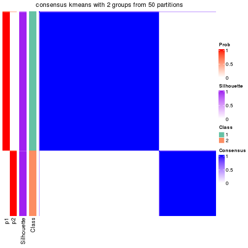</p>

</div>
<div id='tab-node-01-consensus-heatmap-2'>
<pre><code class="r">consensus_heatmap(res, k = 3)
</code></pre>

<p>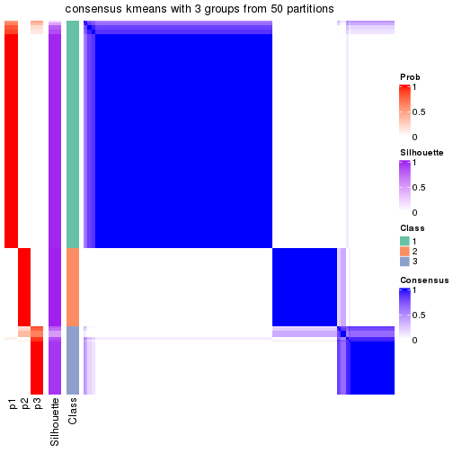</p>

</div>
<div id='tab-node-01-consensus-heatmap-3'>
<pre><code class="r">consensus_heatmap(res, k = 4)
</code></pre>

<p>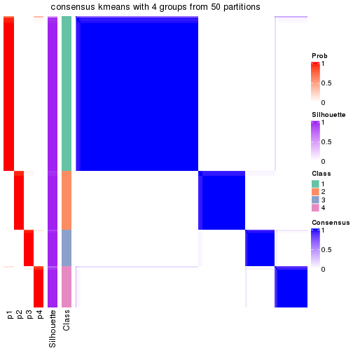</p>

</div>
<div id='tab-node-01-consensus-heatmap-4'>
<pre><code class="r">consensus_heatmap(res, k = 5)
</code></pre>

<p>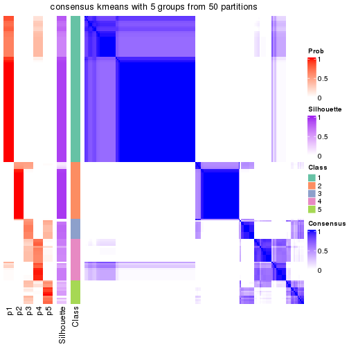</p>

</div>
<div id='tab-node-01-consensus-heatmap-5'>
<pre><code class="r">consensus_heatmap(res, k = 6)
</code></pre>

<p>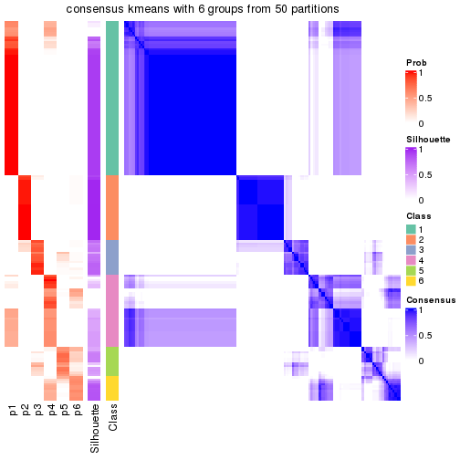</p>

</div>
<div id='tab-node-01-consensus-heatmap-6'>
<pre><code class="r">consensus_heatmap(res, k = 7)
</code></pre>

<p>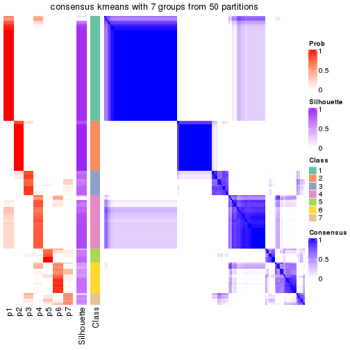</p>

</div>
<div id='tab-node-01-consensus-heatmap-7'>
<pre><code class="r">consensus_heatmap(res, k = 8)
</code></pre>

<p>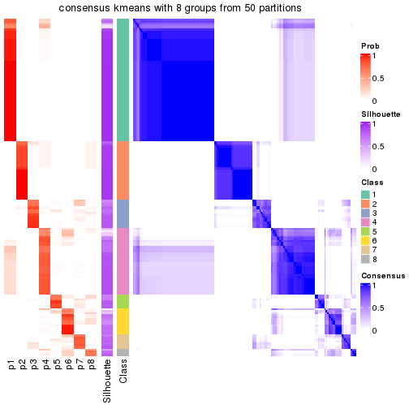</p>

</div>
</div>

Heatmaps for the membership of samples in all partitions to see how consistent they are:


<script>
$( function() {
	$( '#tabs-node-01-membership-heatmap' ).tabs();
} );
</script>
<div id='tabs-node-01-membership-heatmap'>
<ul>
<li><a href='#tab-node-01-membership-heatmap-1'>k = 2</a></li>
<li><a href='#tab-node-01-membership-heatmap-2'>k = 3</a></li>
<li><a href='#tab-node-01-membership-heatmap-3'>k = 4</a></li>
<li><a href='#tab-node-01-membership-heatmap-4'>k = 5</a></li>
<li><a href='#tab-node-01-membership-heatmap-5'>k = 6</a></li>
<li><a href='#tab-node-01-membership-heatmap-6'>k = 7</a></li>
<li><a href='#tab-node-01-membership-heatmap-7'>k = 8</a></li>
</ul>
<div id='tab-node-01-membership-heatmap-1'>
<pre><code class="r">membership_heatmap(res, k = 2)
</code></pre>

<p>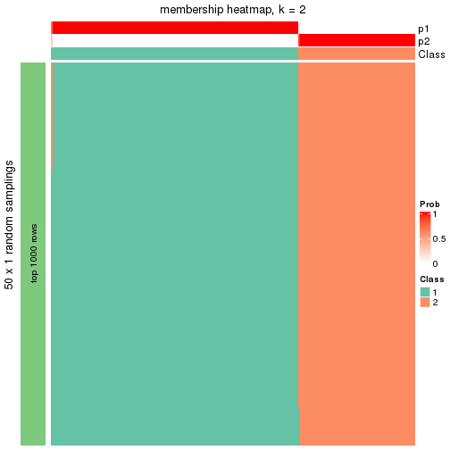</p>

</div>
<div id='tab-node-01-membership-heatmap-2'>
<pre><code class="r">membership_heatmap(res, k = 3)
</code></pre>

<p>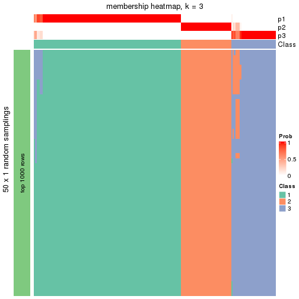</p>

</div>
<div id='tab-node-01-membership-heatmap-3'>
<pre><code class="r">membership_heatmap(res, k = 4)
</code></pre>

<p>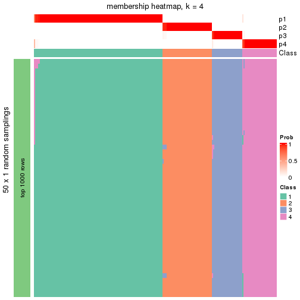</p>

</div>
<div id='tab-node-01-membership-heatmap-4'>
<pre><code class="r">membership_heatmap(res, k = 5)
</code></pre>

<p>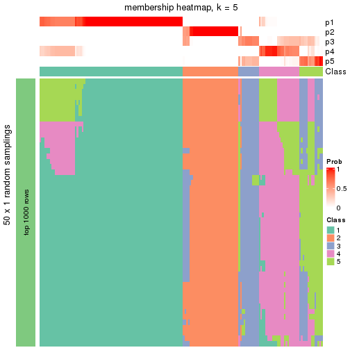</p>

</div>
<div id='tab-node-01-membership-heatmap-5'>
<pre><code class="r">membership_heatmap(res, k = 6)
</code></pre>

<p>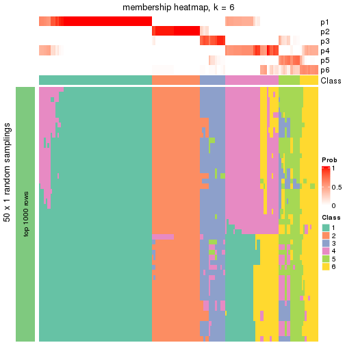</p>

</div>
<div id='tab-node-01-membership-heatmap-6'>
<pre><code class="r">membership_heatmap(res, k = 7)
</code></pre>

<p>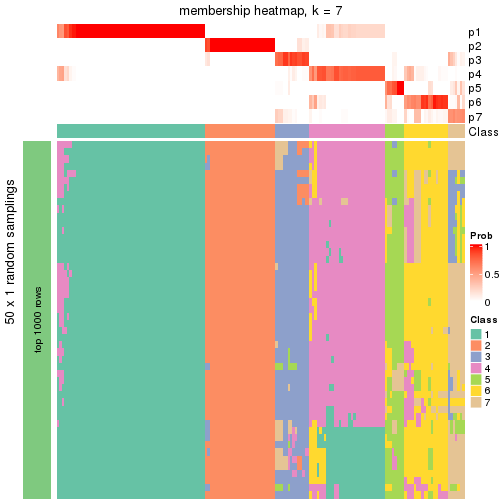</p>

</div>
<div id='tab-node-01-membership-heatmap-7'>
<pre><code class="r">membership_heatmap(res, k = 8)
</code></pre>

<p>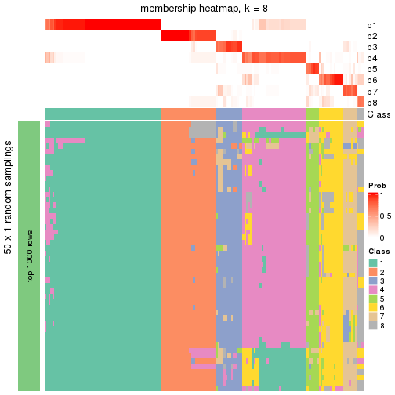</p>

</div>
</div>

As soon as the classes for columns are determined, the signatures
that are significantly different between subgroups can be looked for. 
Following are the heatmaps for signatures.


<script>
$( function() {
	$( '#tabs-node-01-get-signatures' ).tabs();
} );
</script>
<div id='tabs-node-01-get-signatures'>
<ul>
<li><a href='#tab-node-01-get-signatures-1'>k = 2</a></li>
<li><a href='#tab-node-01-get-signatures-2'>k = 3</a></li>
<li><a href='#tab-node-01-get-signatures-3'>k = 4</a></li>
<li><a href='#tab-node-01-get-signatures-4'>k = 5</a></li>
<li><a href='#tab-node-01-get-signatures-5'>k = 6</a></li>
<li><a href='#tab-node-01-get-signatures-6'>k = 7</a></li>
<li><a href='#tab-node-01-get-signatures-7'>k = 8</a></li>
</ul>
<div id='tab-node-01-get-signatures-1'>
<pre><code class="r">get_signatures(res, k = 2)
</code></pre>

<p>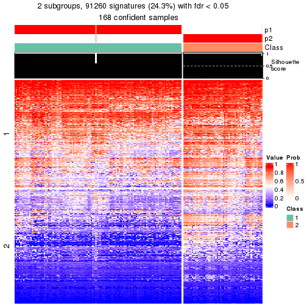</p>

</div>
<div id='tab-node-01-get-signatures-2'>
<pre><code class="r">get_signatures(res, k = 3)
</code></pre>

<p>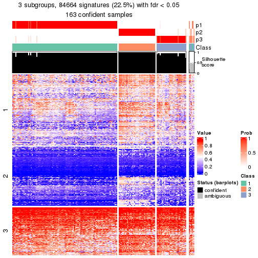</p>

</div>
<div id='tab-node-01-get-signatures-3'>
<pre><code class="r">get_signatures(res, k = 4)
</code></pre>

<p>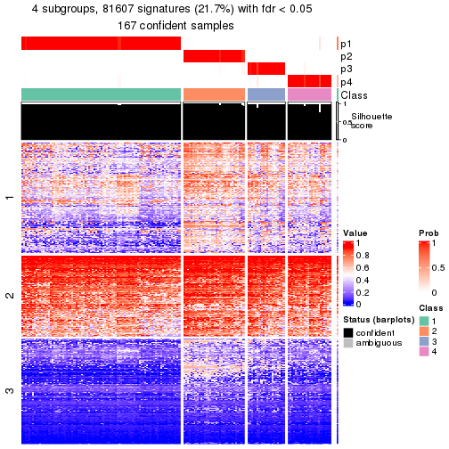</p>

</div>
<div id='tab-node-01-get-signatures-4'>
<pre><code class="r">get_signatures(res, k = 5)
</code></pre>

<p>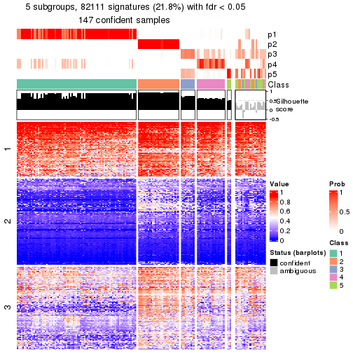</p>

</div>
<div id='tab-node-01-get-signatures-5'>
<pre><code class="r">get_signatures(res, k = 6)
</code></pre>

<p>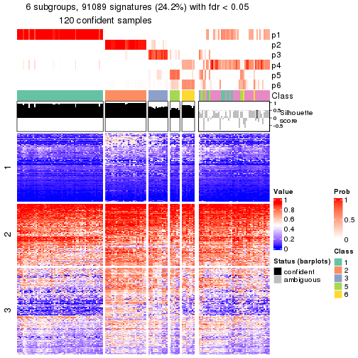</p>

</div>
<div id='tab-node-01-get-signatures-6'>
<pre><code class="r">get_signatures(res, k = 7)
</code></pre>

<p>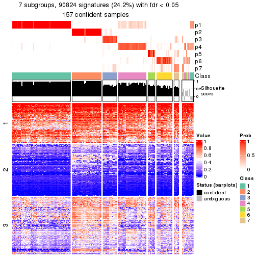</p>

</div>
<div id='tab-node-01-get-signatures-7'>
<pre><code class="r">get_signatures(res, k = 8)
</code></pre>

<p>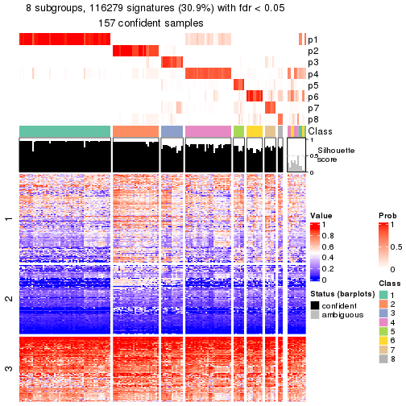</p>

</div>
</div>


Compare the overlap of signatures from different k:

```r
compare_signatures(res)
```

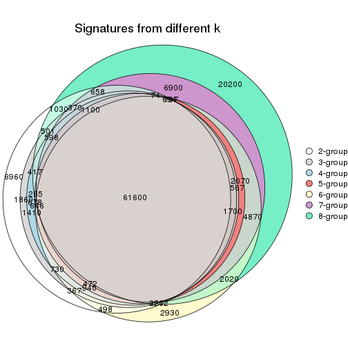

`get_signature()` returns a data frame invisibly. To get the list of signatures, the function
call should be assigned to a variable explicitly. In following code, if `plot` argument is set
to `FALSE`, no heatmap is plotted while only the differential analysis is performed.

```r
# code only for demonstration
tb = get_signature(res, k = ..., plot = FALSE)
```

An example of the output of `tb` is:

```
#>   which_row         fdr    mean_1    mean_2 scaled_mean_1 scaled_mean_2 km
#> 1        38 0.042760348  8.373488  9.131774    -0.5533452     0.5164555  1
#> 2        40 0.018707592  7.106213  8.469186    -0.6173731     0.5762149  1
#> 3        55 0.019134737 10.221463 11.207825    -0.6159697     0.5749050  1
#> 4        59 0.006059896  5.921854  7.869574    -0.6899429     0.6439467  1
#> 5        60 0.018055526  8.928898 10.211722    -0.6204761     0.5791110  1
#> 6        98 0.009384629 15.714769 14.887706     0.6635654    -0.6193277  2
...
```

The columns in `tb` are:

1. `which_row`: row indices corresponding to the input matrix.
2. `fdr`: FDR for the differential test. 
3. `mean_x`: The mean value in group x.
4. `scaled_mean_x`: The mean value in group x after rows are scaled.
5. `km`: Row groups if k-means clustering is applied to rows (which is done by automatically selecting number of clusters).

If there are too many signatures, `top_signatures = ...` can be set to only show the 
signatures with the highest FDRs:

```r
# code only for demonstration
# e.g. to show the top 500 most significant rows
tb = get_signature(res, k = ..., top_signatures = 500)
```

If the signatures are defined as these which are uniquely high in current group, `diff_method` argument
can be set to `"uniquely_high_in_one_group"`:

```r
# code only for demonstration
tb = get_signature(res, k = ..., diff_method = "uniquely_high_in_one_group")
```


UMAP plot which shows how samples are separated.


<script>
$( function() {
	$( '#tabs-node-01-dimension-reduction' ).tabs();
} );
</script>
<div id='tabs-node-01-dimension-reduction'>
<ul>
<li><a href='#tab-node-01-dimension-reduction-1'>k = 2</a></li>
<li><a href='#tab-node-01-dimension-reduction-2'>k = 3</a></li>
<li><a href='#tab-node-01-dimension-reduction-3'>k = 4</a></li>
<li><a href='#tab-node-01-dimension-reduction-4'>k = 5</a></li>
<li><a href='#tab-node-01-dimension-reduction-5'>k = 6</a></li>
<li><a href='#tab-node-01-dimension-reduction-6'>k = 7</a></li>
<li><a href='#tab-node-01-dimension-reduction-7'>k = 8</a></li>
</ul>
<div id='tab-node-01-dimension-reduction-1'>
<pre><code class="r">dimension_reduction(res, k = 2, method = &quot;UMAP&quot;)
</code></pre>

<p>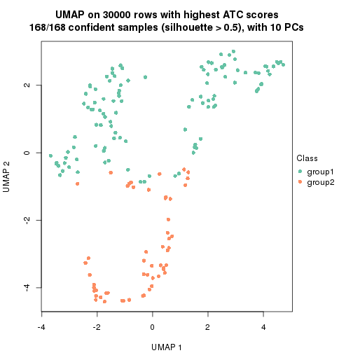</p>

</div>
<div id='tab-node-01-dimension-reduction-2'>
<pre><code class="r">dimension_reduction(res, k = 3, method = &quot;UMAP&quot;)
</code></pre>

<p>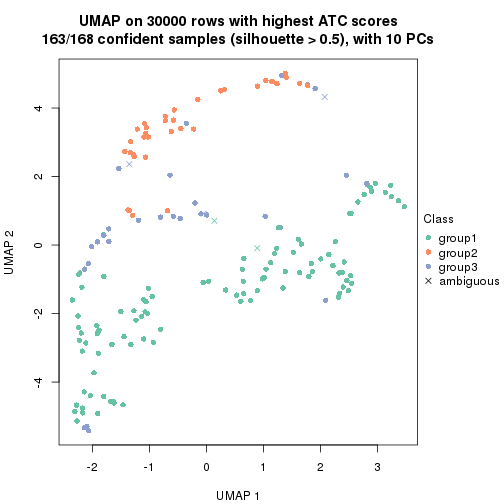</p>

</div>
<div id='tab-node-01-dimension-reduction-3'>
<pre><code class="r">dimension_reduction(res, k = 4, method = &quot;UMAP&quot;)
</code></pre>

<p>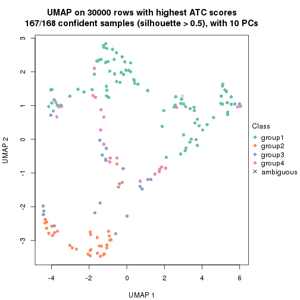</p>

</div>
<div id='tab-node-01-dimension-reduction-4'>
<pre><code class="r">dimension_reduction(res, k = 5, method = &quot;UMAP&quot;)
</code></pre>

<p>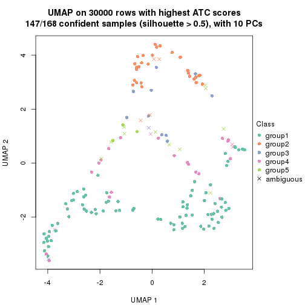</p>

</div>
<div id='tab-node-01-dimension-reduction-5'>
<pre><code class="r">dimension_reduction(res, k = 6, method = &quot;UMAP&quot;)
</code></pre>

<p>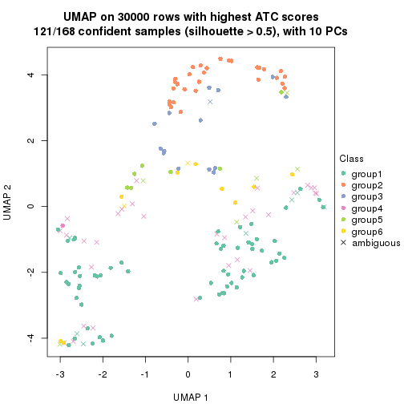</p>

</div>
<div id='tab-node-01-dimension-reduction-6'>
<pre><code class="r">dimension_reduction(res, k = 7, method = &quot;UMAP&quot;)
</code></pre>

<p>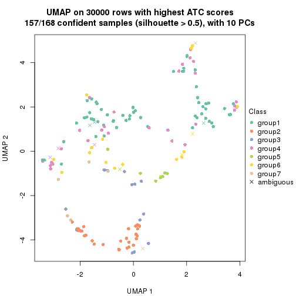</p>

</div>
<div id='tab-node-01-dimension-reduction-7'>
<pre><code class="r">dimension_reduction(res, k = 8, method = &quot;UMAP&quot;)
</code></pre>

<p>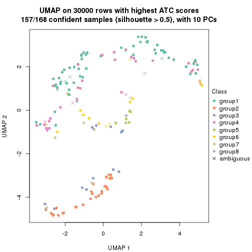</p>

</div>
</div>


Following heatmap shows how subgroups are split when increasing `k`:

```r
collect_classes(res)
```

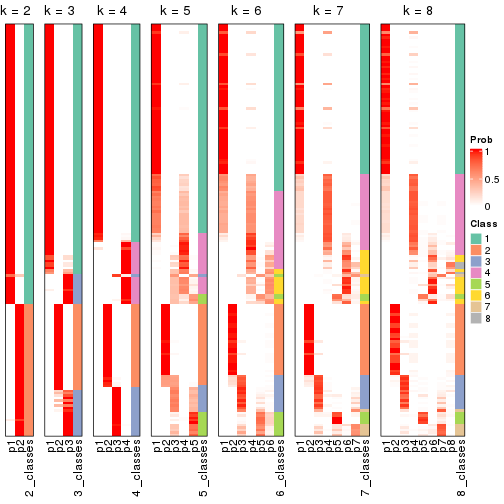


If matrix rows can be associated to genes, consider to use `functional_enrichment(res,
...)` to perform function enrichment for the signature genes. See [this vignette](https://jokergoo.github.io/cola_vignettes/functional_enrichment.html) for more detailed explanations.


 

---------------------------------------------------


### Node011


Parent node: [Node01](#Node01).
Child nodes: 
                [Node0111](#Node0111)
        ,
                [Node0112](#Node0112)
        ,
                [Node0113](#Node0113)
        ,
                [Node0121](#Node0121)
        ,
                Node0122-leaf
        ,
                Node0123-leaf
        ,
                Node0131-leaf
        ,
                Node0132-leaf
        ,
                Node0133-leaf
        ,
                Node0134-leaf
        ,
                [Node0141](#Node0141)
        ,
                Node0142-leaf
        ,
                Node0143-leaf
        ,
                Node0221-leaf
        ,
                Node0222-leaf
        ,
                Node0223-leaf
        ,
                Node0224-leaf
        ,
                [Node0231](#Node0231)
        ,
                Node0232-leaf
        ,
                Node0233-leaf
        ,
                Node0321-leaf
        ,
                Node0322-leaf
        ,
                Node0411-leaf
        ,
                Node0412-leaf
        ,
                Node0421-leaf
        ,
                Node0422-leaf
        ,
                Node0431-leaf
        ,
                Node0432-leaf
        ,
                Node0433-leaf
        ,
                Node0434-leaf
        .


The object with results only for a single top-value method and a single partitioning method 
can be extracted as:

```r
res = res_rh["011"]
```

A summary of `res` and all the functions that can be applied to it:

```r
res
```

```
#> A 'ConsensusPartition' object with k = 2, 3, 4, 5, 6, 7, 8.
#>   On a matrix with 30000 rows and 89 columns.
#>   Top rows (1000) are extracted by 'ATC' method.
#>   Subgroups are detected by 'kmeans' method.
#>   Performed in total 350 partitions by row resampling.
#>   Best k for subgroups seems to be 3.
#> 
#> Following methods can be applied to this 'ConsensusPartition' object:
#>  [1] "cola_report"             "collect_classes"         "collect_plots"          
#>  [4] "collect_stats"           "colnames"                "compare_partitions"     
#>  [7] "compare_signatures"      "consensus_heatmap"       "dimension_reduction"    
#> [10] "functional_enrichment"   "get_anno_col"            "get_anno"               
#> [13] "get_classes"             "get_consensus"           "get_matrix"             
#> [16] "get_membership"          "get_param"               "get_signatures"         
#> [19] "get_stats"               "is_best_k"               "is_stable_k"            
#> [22] "membership_heatmap"      "ncol"                    "nrow"                   
#> [25] "plot_ecdf"               "predict_classes"         "rownames"               
#> [28] "select_partition_number" "show"                    "suggest_best_k"         
#> [31] "test_to_known_factors"   "top_rows_heatmap"
```

`collect_plots()` function collects all the plots made from `res` for all `k` (number of subgroups)
into one single page to provide an easy and fast comparison between different `k`.

```r
collect_plots(res)
```

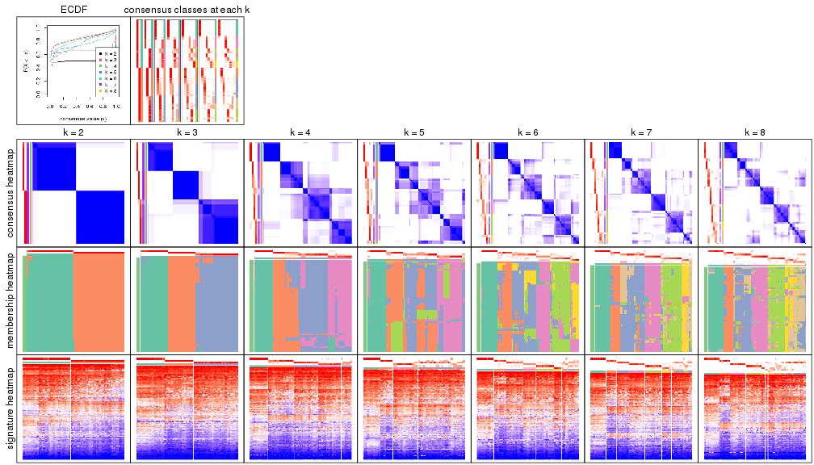

The plots are:

- The first row: a plot of the eCDF (empirical cumulative distribution
  function) curves of the consensus matrix for each `k` and the heatmap of
  predicted classes for each `k`.
- The second row: heatmaps of the consensus matrix for each `k`.
- The third row: heatmaps of the membership matrix for each `k`.
- The fouth row: heatmaps of the signatures for each `k`.

All the plots in panels can be made by individual functions and they are
plotted later in this section.

`select_partition_number()` produces several plots showing different
statistics for choosing "optimized" `k`. There are following statistics:

- eCDF curves of the consensus matrix for each `k`;
- 1-PAC. [The PAC score](https://en.wikipedia.org/wiki/Consensus_clustering#Over-interpretation_potential_of_consensus_clustering)
  measures the proportion of the ambiguous subgrouping.
- Mean silhouette score.
- Concordance. The mean probability of fiting the consensus subgroup labels in all
  partitions.
- Area increased. Denote $A_k$ as the area under the eCDF curve for current
  `k`, the area increased is defined as $A_k - A_{k-1}$.
- Rand index. The percent of pairs of samples that are both in a same cluster
  or both are not in a same cluster in the partition of k and k-1.
- Jaccard index. The ratio of pairs of samples are both in a same cluster in
  the partition of k and k-1 and the pairs of samples are both in a same
  cluster in the partition k or k-1.

The detailed explanations of these statistics can be found in [the _cola_
vignette](https://jokergoo.github.io/cola_vignettes/cola.html#toc_13).

Generally speaking, higher 1-PAC score, higher mean silhouette score or higher
concordance corresponds to better partition. Rand index and Jaccard index
measure how similar the current partition is compared to partition with `k-1`.
If they are too similar, we won't accept `k` is better than `k-1`.

```r
select_partition_number(res)
```

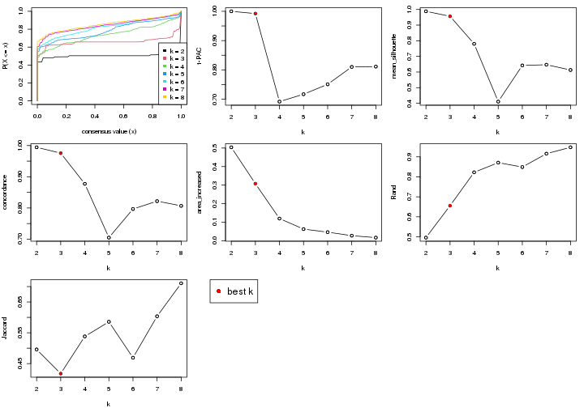

The numeric values for all these statistics can be obtained by `get_stats()`.

```r
get_stats(res)
```

```
#>   k 1-PAC mean_silhouette concordance area_increased  Rand Jaccard
#> 2 2 1.000           0.988       0.994         0.5039 0.496   0.496
#> 3 3 0.992           0.956       0.976         0.3078 0.656   0.418
#> 4 4 0.692           0.780       0.877         0.1196 0.823   0.538
#> 5 5 0.717           0.411       0.705         0.0628 0.871   0.586
#> 6 6 0.751           0.642       0.797         0.0462 0.849   0.469
#> 7 7 0.810           0.647       0.822         0.0273 0.916   0.604
#> 8 8 0.811           0.613       0.807         0.0168 0.948   0.711
```

`suggest_best_k()` suggests the best $k$ based on these statistics. The rules are as follows:

- All $k$ with Jaccard index larger than 0.95 are removed because increasing
  $k$ does not provide enough extra information. If all $k$ are removed, it is
  marked as no subgroup is detected.
- For all $k$ with 1-PAC score larger than 0.9, the maximal $k$ is taken as
  the best $k$, and other $k$ are marked as optional $k$.
- If it does not fit the second rule. The $k$ with the maximal vote of the
  highest 1-PAC score, highest mean silhouette, and highest concordance is
  taken as the best $k$.

```r
suggest_best_k(res)
```

```
#> [1] 3
#> attr(,"optional")
#> [1] 2
```

There is also optional best $k$ = 2 that is worth to check.

Following is the table of the partitions (You need to click the **show/hide
code output** link to see it). The membership matrix (columns with name `p*`)
is inferred by
[`clue::cl_consensus()`](https://www.rdocumentation.org/link/cl_consensus?package=clue)
function with the `SE` method. Basically the value in the membership matrix
represents the probability to belong to a certain group. The finall subgroup
label for an item is determined with the group with highest probability it
belongs to.

In `get_classes()` function, the entropy is calculated from the membership
matrix and the silhouette score is calculated from the consensus matrix.


<script>
$( function() {
	$( '#tabs-node-011-get-classes' ).tabs();
} );
</script>
<div id='tabs-node-011-get-classes'>
<ul>
<li><a href='#tab-node-011-get-classes-1'>k = 2</a></li>
<li><a href='#tab-node-011-get-classes-2'>k = 3</a></li>
<li><a href='#tab-node-011-get-classes-3'>k = 4</a></li>
<li><a href='#tab-node-011-get-classes-4'>k = 5</a></li>
<li><a href='#tab-node-011-get-classes-5'>k = 6</a></li>
<li><a href='#tab-node-011-get-classes-6'>k = 7</a></li>
<li><a href='#tab-node-011-get-classes-7'>k = 8</a></li>
</ul>

<div id='tab-node-011-get-classes-1'>
<p><a id='tab-node-011-get-classes-1-a' style='color:#0366d6' href='#'>show/hide code output</a></p>
<pre><code class="r">cbind(get_classes(res, k = 2), get_membership(res, k = 2))
</code></pre>

<pre><code>#&gt;                 class entropy silhouette   p1   p2
#&gt; TCGA.3L.AA1B.01     1   0.000      0.991 1.00 0.00
#&gt; TCGA.D5.5538.01     2   0.000      0.997 0.00 1.00
#&gt; TCGA.G4.6306.01     2   0.000      0.997 0.00 1.00
#&gt; TCGA.D5.6535.01     2   0.000      0.997 0.00 1.00
#&gt; TCGA.G4.6304.01     1   0.000      0.991 1.00 0.00
#&gt; TCGA.F4.6855.01     2   0.000      0.997 0.00 1.00
#&gt; TCGA.NH.A6GA.01     2   0.000      0.997 0.00 1.00
#&gt; TCGA.DM.A288.01     2   0.000      0.997 0.00 1.00
#&gt; TCGA.AD.6548.01     1   0.000      0.991 1.00 0.00
#&gt; TCGA.G4.6293.01     2   0.000      0.997 0.00 1.00
#&gt; TCGA.CK.6747.01     2   0.000      0.997 0.00 1.00
#&gt; TCGA.QL.A97D.01     2   0.000      0.997 0.00 1.00
#&gt; TCGA.AZ.6600.01     1   0.000      0.991 1.00 0.00
#&gt; TCGA.AY.A71X.01     2   0.000      0.997 0.00 1.00
#&gt; TCGA.CM.6169.01     2   0.000      0.997 0.00 1.00
#&gt; TCGA.DM.A28K.01     2   0.000      0.997 0.00 1.00
#&gt; TCGA.A6.5664.01     1   0.000      0.991 1.00 0.00
#&gt; TCGA.CM.6166.01     2   0.000      0.997 0.00 1.00
#&gt; TCGA.DM.A280.01     1   0.000      0.991 1.00 0.00
#&gt; TCGA.NH.A5IV.01     2   0.000      0.997 0.00 1.00
#&gt; TCGA.AD.A5EK.01     1   0.000      0.991 1.00 0.00
#&gt; TCGA.CM.6168.01     1   0.000      0.991 1.00 0.00
#&gt; TCGA.AY.A54L.01     2   0.000      0.997 0.00 1.00
#&gt; TCGA.G4.6298.01     1   0.000      0.991 1.00 0.00
#&gt; TCGA.CK.5915.01     2   0.000      0.997 0.00 1.00
#&gt; TCGA.D5.5539.01     2   0.000      0.997 0.00 1.00
#&gt; TCGA.A6.6654.01     1   0.000      0.991 1.00 0.00
#&gt; TCGA.CM.5341.01     1   0.000      0.991 1.00 0.00
#&gt; TCGA.CM.5864.01     2   0.000      0.997 0.00 1.00
#&gt; TCGA.CM.5863.01     1   0.000      0.991 1.00 0.00
#&gt; TCGA.AA.3495.01     1   0.000      0.991 1.00 0.00
#&gt; TCGA.F4.6857.01     1   0.000      0.991 1.00 0.00
#&gt; TCGA.QG.A5YW.01     2   0.000      0.997 0.00 1.00
#&gt; TCGA.CM.5349.01     1   0.000      0.991 1.00 0.00
#&gt; TCGA.CK.4947.01     2   0.000      0.997 0.00 1.00
#&gt; TCGA.G4.6297.01     1   0.000      0.991 1.00 0.00
#&gt; TCGA.AD.6899.01     1   0.000      0.991 1.00 0.00
#&gt; TCGA.G4.6627.01     1   0.000      0.991 1.00 0.00
#&gt; TCGA.A6.5657.01     1   0.000      0.991 1.00 0.00
#&gt; TCGA.CM.5348.01     2   0.000      0.997 0.00 1.00
#&gt; TCGA.AY.A69D.01     1   0.000      0.991 1.00 0.00
#&gt; TCGA.F4.6463.01     1   0.000      0.991 1.00 0.00
#&gt; TCGA.CA.6719.01     2   0.000      0.997 0.00 1.00
#&gt; TCGA.AZ.4323.01     1   0.000      0.991 1.00 0.00
#&gt; TCGA.AZ.4315.01     1   0.000      0.991 1.00 0.00
#&gt; TCGA.A6.2677.01     2   0.000      0.997 0.00 1.00
#&gt; TCGA.D5.5537.01     2   0.000      0.997 0.00 1.00
#&gt; TCGA.CA.6717.01     1   0.000      0.991 1.00 0.00
#&gt; TCGA.F4.6569.01     1   0.000      0.991 1.00 0.00
#&gt; TCGA.F4.6807.01     1   0.000      0.991 1.00 0.00
#&gt; TCGA.4T.AA8H.01     2   0.000      0.997 0.00 1.00
#&gt; TCGA.AA.3506.01     2   0.000      0.997 0.00 1.00
#&gt; TCGA.A6.6138.01     1   0.000      0.991 1.00 0.00
#&gt; TCGA.F4.6809.01     1   0.000      0.991 1.00 0.00
#&gt; TCGA.AA.3502.01     2   0.000      0.997 0.00 1.00
#&gt; TCGA.NH.A8F8.01     2   0.529      0.861 0.12 0.88
#&gt; TCGA.AY.6196.01     1   0.000      0.991 1.00 0.00
#&gt; TCGA.AZ.6599.01     2   0.000      0.997 0.00 1.00
#&gt; TCGA.5M.AAT4.01     2   0.000      0.997 0.00 1.00
#&gt; TCGA.CK.5914.01     1   0.242      0.957 0.96 0.04
#&gt; TCGA.AD.6965.01     2   0.000      0.997 0.00 1.00
#&gt; TCGA.CM.4750.01     2   0.000      0.997 0.00 1.00
#&gt; TCGA.CM.6677.01     2   0.000      0.997 0.00 1.00
#&gt; TCGA.D5.5540.01     1   0.000      0.991 1.00 0.00
#&gt; TCGA.DM.A28G.01     2   0.000      0.997 0.00 1.00
#&gt; TCGA.D5.6529.01     1   0.000      0.991 1.00 0.00
#&gt; TCGA.DM.A282.01     1   0.242      0.957 0.96 0.04
#&gt; TCGA.A6.5660.01     2   0.000      0.997 0.00 1.00
#&gt; TCGA.D5.6920.01     1   0.000      0.991 1.00 0.00
#&gt; TCGA.DM.A1HA.01     2   0.000      0.997 0.00 1.00
#&gt; TCGA.D5.6532.01     2   0.000      0.997 0.00 1.00
#&gt; TCGA.D5.6541.01     1   0.000      0.991 1.00 0.00
#&gt; TCGA.A6.2680.01     2   0.000      0.997 0.00 1.00
#&gt; TCGA.AD.6901.01     1   0.000      0.991 1.00 0.00
#&gt; TCGA.AA.3496.01     2   0.000      0.997 0.00 1.00
#&gt; TCGA.A6.6650.01     2   0.000      0.997 0.00 1.00
#&gt; TCGA.DM.A28A.01     1   0.000      0.991 1.00 0.00
#&gt; TCGA.AZ.4616.01     1   0.000      0.991 1.00 0.00
#&gt; TCGA.QG.A5Z1.01     1   0.242      0.957 0.96 0.04
#&gt; TCGA.CM.6680.01     2   0.000      0.997 0.00 1.00
#&gt; TCGA.AA.3660.01     2   0.000      0.997 0.00 1.00
#&gt; TCGA.CM.4747.01     1   0.242      0.957 0.96 0.04
#&gt; TCGA.DM.A28H.01     2   0.000      0.997 0.00 1.00
#&gt; TCGA.G4.6310.01     1   0.000      0.991 1.00 0.00
#&gt; TCGA.DM.A28M.01     2   0.000      0.997 0.00 1.00
#&gt; TCGA.NH.A6GB.01     2   0.000      0.997 0.00 1.00
#&gt; TCGA.A6.2681.01     1   0.760      0.725 0.78 0.22
#&gt; TCGA.A6.2679.01     2   0.000      0.997 0.00 1.00
#&gt; TCGA.D5.6537.01     2   0.000      0.997 0.00 1.00
</code></pre>

<script>
$('#tab-node-011-get-classes-1-a').parent().next().next().hide();
$('#tab-node-011-get-classes-1-a').click(function(){
  $('#tab-node-011-get-classes-1-a').parent().next().next().toggle();
  return(false);
});
</script>
</div>

<div id='tab-node-011-get-classes-2'>
<p><a id='tab-node-011-get-classes-2-a' style='color:#0366d6' href='#'>show/hide code output</a></p>
<pre><code class="r">cbind(get_classes(res, k = 3), get_membership(res, k = 3))
</code></pre>

<pre><code>#&gt;                 class entropy silhouette   p1   p2   p3
#&gt; TCGA.3L.AA1B.01     1  0.5216      0.687 0.74 0.00 0.26
#&gt; TCGA.D5.5538.01     2  0.0000      1.000 0.00 1.00 0.00
#&gt; TCGA.G4.6306.01     3  0.5216      0.706 0.00 0.26 0.74
#&gt; TCGA.D5.6535.01     3  0.0000      0.956 0.00 0.00 1.00
#&gt; TCGA.G4.6304.01     1  0.0000      0.976 1.00 0.00 0.00
#&gt; TCGA.F4.6855.01     3  0.0000      0.956 0.00 0.00 1.00
#&gt; TCGA.NH.A6GA.01     3  0.2066      0.933 0.00 0.06 0.94
#&gt; TCGA.DM.A288.01     3  0.5216      0.706 0.00 0.26 0.74
#&gt; TCGA.AD.6548.01     3  0.0000      0.956 0.00 0.00 1.00
#&gt; TCGA.G4.6293.01     3  0.0000      0.956 0.00 0.00 1.00
#&gt; TCGA.CK.6747.01     3  0.5016      0.736 0.00 0.24 0.76
#&gt; TCGA.QL.A97D.01     3  0.0000      0.956 0.00 0.00 1.00
#&gt; TCGA.AZ.6600.01     1  0.0892      0.968 0.98 0.00 0.02
#&gt; TCGA.AY.A71X.01     2  0.0000      1.000 0.00 1.00 0.00
#&gt; TCGA.CM.6169.01     2  0.0000      1.000 0.00 1.00 0.00
#&gt; TCGA.DM.A28K.01     2  0.0000      1.000 0.00 1.00 0.00
#&gt; TCGA.A6.5664.01     1  0.0000      0.976 1.00 0.00 0.00
#&gt; TCGA.CM.6166.01     3  0.2066      0.933 0.00 0.06 0.94
#&gt; TCGA.DM.A280.01     1  0.0000      0.976 1.00 0.00 0.00
#&gt; TCGA.NH.A5IV.01     2  0.0000      1.000 0.00 1.00 0.00
#&gt; TCGA.AD.A5EK.01     3  0.0000      0.956 0.00 0.00 1.00
#&gt; TCGA.CM.6168.01     1  0.0000      0.976 1.00 0.00 0.00
#&gt; TCGA.AY.A54L.01     2  0.0000      1.000 0.00 1.00 0.00
#&gt; TCGA.G4.6298.01     3  0.2066      0.911 0.06 0.00 0.94
#&gt; TCGA.CK.5915.01     3  0.2066      0.933 0.00 0.06 0.94
#&gt; TCGA.D5.5539.01     3  0.2066      0.933 0.00 0.06 0.94
#&gt; TCGA.A6.6654.01     1  0.0000      0.976 1.00 0.00 0.00
#&gt; TCGA.CM.5341.01     1  0.2066      0.943 0.94 0.00 0.06
#&gt; TCGA.CM.5864.01     2  0.0000      1.000 0.00 1.00 0.00
#&gt; TCGA.CM.5863.01     1  0.0000      0.976 1.00 0.00 0.00
#&gt; TCGA.AA.3495.01     3  0.0000      0.956 0.00 0.00 1.00
#&gt; TCGA.F4.6857.01     1  0.0000      0.976 1.00 0.00 0.00
#&gt; TCGA.QG.A5YW.01     2  0.0000      1.000 0.00 1.00 0.00
#&gt; TCGA.CM.5349.01     1  0.0000      0.976 1.00 0.00 0.00
#&gt; TCGA.CK.4947.01     3  0.0000      0.956 0.00 0.00 1.00
#&gt; TCGA.G4.6297.01     3  0.0000      0.956 0.00 0.00 1.00
#&gt; TCGA.AD.6899.01     3  0.0892      0.944 0.02 0.00 0.98
#&gt; TCGA.G4.6627.01     1  0.0000      0.976 1.00 0.00 0.00
#&gt; TCGA.A6.5657.01     1  0.0000      0.976 1.00 0.00 0.00
#&gt; TCGA.CM.5348.01     3  0.0000      0.956 0.00 0.00 1.00
#&gt; TCGA.AY.A69D.01     1  0.1529      0.957 0.96 0.00 0.04
#&gt; TCGA.F4.6463.01     3  0.0000      0.956 0.00 0.00 1.00
#&gt; TCGA.CA.6719.01     3  0.2066      0.933 0.00 0.06 0.94
#&gt; TCGA.AZ.4323.01     1  0.0000      0.976 1.00 0.00 0.00
#&gt; TCGA.AZ.4315.01     3  0.1529      0.929 0.04 0.00 0.96
#&gt; TCGA.A6.2677.01     2  0.0000      1.000 0.00 1.00 0.00
#&gt; TCGA.D5.5537.01     3  0.2066      0.933 0.00 0.06 0.94
#&gt; TCGA.CA.6717.01     1  0.0000      0.976 1.00 0.00 0.00
#&gt; TCGA.F4.6569.01     1  0.0000      0.976 1.00 0.00 0.00
#&gt; TCGA.F4.6807.01     1  0.1529      0.957 0.96 0.00 0.04
#&gt; TCGA.4T.AA8H.01     2  0.0000      1.000 0.00 1.00 0.00
#&gt; TCGA.AA.3506.01     2  0.0000      1.000 0.00 1.00 0.00
#&gt; TCGA.A6.6138.01     1  0.2066      0.943 0.94 0.00 0.06
#&gt; TCGA.F4.6809.01     1  0.0000      0.976 1.00 0.00 0.00
#&gt; TCGA.AA.3502.01     2  0.0000      1.000 0.00 1.00 0.00
#&gt; TCGA.NH.A8F8.01     3  0.0000      0.956 0.00 0.00 1.00
#&gt; TCGA.AY.6196.01     1  0.0000      0.976 1.00 0.00 0.00
#&gt; TCGA.AZ.6599.01     2  0.0000      1.000 0.00 1.00 0.00
#&gt; TCGA.5M.AAT4.01     3  0.4002      0.839 0.00 0.16 0.84
#&gt; TCGA.CK.5914.01     3  0.0000      0.956 0.00 0.00 1.00
#&gt; TCGA.AD.6965.01     2  0.0000      1.000 0.00 1.00 0.00
#&gt; TCGA.CM.4750.01     2  0.0000      1.000 0.00 1.00 0.00
#&gt; TCGA.CM.6677.01     3  0.2537      0.918 0.00 0.08 0.92
#&gt; TCGA.D5.5540.01     3  0.0000      0.956 0.00 0.00 1.00
#&gt; TCGA.DM.A28G.01     2  0.0000      1.000 0.00 1.00 0.00
#&gt; TCGA.D5.6529.01     1  0.0000      0.976 1.00 0.00 0.00
#&gt; TCGA.DM.A282.01     3  0.0000      0.956 0.00 0.00 1.00
#&gt; TCGA.A6.5660.01     2  0.0000      1.000 0.00 1.00 0.00
#&gt; TCGA.D5.6920.01     1  0.0000      0.976 1.00 0.00 0.00
#&gt; TCGA.DM.A1HA.01     2  0.0000      1.000 0.00 1.00 0.00
#&gt; TCGA.D5.6532.01     2  0.0000      1.000 0.00 1.00 0.00
#&gt; TCGA.D5.6541.01     3  0.0000      0.956 0.00 0.00 1.00
#&gt; TCGA.A6.2680.01     2  0.0000      1.000 0.00 1.00 0.00
#&gt; TCGA.AD.6901.01     3  0.0000      0.956 0.00 0.00 1.00
#&gt; TCGA.AA.3496.01     3  0.2066      0.933 0.00 0.06 0.94
#&gt; TCGA.A6.6650.01     2  0.0000      1.000 0.00 1.00 0.00
#&gt; TCGA.DM.A28A.01     3  0.0000      0.956 0.00 0.00 1.00
#&gt; TCGA.AZ.4616.01     1  0.0892      0.968 0.98 0.00 0.02
#&gt; TCGA.QG.A5Z1.01     3  0.0000      0.956 0.00 0.00 1.00
#&gt; TCGA.CM.6680.01     2  0.0000      1.000 0.00 1.00 0.00
#&gt; TCGA.AA.3660.01     3  0.0000      0.956 0.00 0.00 1.00
#&gt; TCGA.CM.4747.01     3  0.0000      0.956 0.00 0.00 1.00
#&gt; TCGA.DM.A28H.01     3  0.2066      0.933 0.00 0.06 0.94
#&gt; TCGA.G4.6310.01     1  0.2066      0.943 0.94 0.00 0.06
#&gt; TCGA.DM.A28M.01     2  0.0000      1.000 0.00 1.00 0.00
#&gt; TCGA.NH.A6GB.01     2  0.0000      1.000 0.00 1.00 0.00
#&gt; TCGA.A6.2681.01     3  0.0000      0.956 0.00 0.00 1.00
#&gt; TCGA.A6.2679.01     3  0.0000      0.956 0.00 0.00 1.00
#&gt; TCGA.D5.6537.01     2  0.0000      1.000 0.00 1.00 0.00
</code></pre>

<script>
$('#tab-node-011-get-classes-2-a').parent().next().next().hide();
$('#tab-node-011-get-classes-2-a').click(function(){
  $('#tab-node-011-get-classes-2-a').parent().next().next().toggle();
  return(false);
});
</script>
</div>

<div id='tab-node-011-get-classes-3'>
<p><a id='tab-node-011-get-classes-3-a' style='color:#0366d6' href='#'>show/hide code output</a></p>
<pre><code class="r">cbind(get_classes(res, k = 4), get_membership(res, k = 4))
</code></pre>

<pre><code>#&gt;                 class entropy silhouette   p1   p2   p3   p4
#&gt; TCGA.3L.AA1B.01     4  0.1211     0.8445 0.04 0.00 0.00 0.96
#&gt; TCGA.D5.5538.01     2  0.4406     0.7557 0.00 0.70 0.30 0.00
#&gt; TCGA.G4.6306.01     3  0.0707     0.8253 0.00 0.02 0.98 0.00
#&gt; TCGA.D5.6535.01     3  0.2921     0.8169 0.00 0.00 0.86 0.14
#&gt; TCGA.G4.6304.01     1  0.0000     0.9780 1.00 0.00 0.00 0.00
#&gt; TCGA.F4.6855.01     3  0.4522     0.4528 0.00 0.00 0.68 0.32
#&gt; TCGA.NH.A6GA.01     3  0.1913     0.8287 0.00 0.02 0.94 0.04
#&gt; TCGA.DM.A288.01     3  0.0707     0.8253 0.00 0.02 0.98 0.00
#&gt; TCGA.AD.6548.01     3  0.4977     0.2831 0.00 0.00 0.54 0.46
#&gt; TCGA.G4.6293.01     3  0.2647     0.8220 0.00 0.00 0.88 0.12
#&gt; TCGA.CK.6747.01     3  0.0707     0.8253 0.00 0.02 0.98 0.00
#&gt; TCGA.QL.A97D.01     3  0.1211     0.8215 0.00 0.00 0.96 0.04
#&gt; TCGA.AZ.6600.01     4  0.3172     0.7984 0.16 0.00 0.00 0.84
#&gt; TCGA.AY.A71X.01     2  0.0000     0.8183 0.00 1.00 0.00 0.00
#&gt; TCGA.CM.6169.01     3  0.2921     0.7019 0.00 0.14 0.86 0.00
#&gt; TCGA.DM.A28K.01     2  0.4624     0.7214 0.00 0.66 0.34 0.00
#&gt; TCGA.A6.5664.01     1  0.0000     0.9780 1.00 0.00 0.00 0.00
#&gt; TCGA.CM.6166.01     3  0.0707     0.8253 0.00 0.02 0.98 0.00
#&gt; TCGA.DM.A280.01     1  0.0000     0.9780 1.00 0.00 0.00 0.00
#&gt; TCGA.NH.A5IV.01     2  0.3400     0.8047 0.00 0.82 0.18 0.00
#&gt; TCGA.AD.A5EK.01     4  0.2921     0.8387 0.00 0.00 0.14 0.86
#&gt; TCGA.CM.6168.01     1  0.0000     0.9780 1.00 0.00 0.00 0.00
#&gt; TCGA.AY.A54L.01     2  0.0000     0.8183 0.00 1.00 0.00 0.00
#&gt; TCGA.G4.6298.01     4  0.1211     0.8444 0.00 0.00 0.04 0.96
#&gt; TCGA.CK.5915.01     3  0.0000     0.8243 0.00 0.00 1.00 0.00
#&gt; TCGA.D5.5539.01     3  0.2706     0.8220 0.00 0.02 0.90 0.08
#&gt; TCGA.A6.6654.01     1  0.0000     0.9780 1.00 0.00 0.00 0.00
#&gt; TCGA.CM.5341.01     4  0.3172     0.7984 0.16 0.00 0.00 0.84
#&gt; TCGA.CM.5864.01     2  0.0000     0.8183 0.00 1.00 0.00 0.00
#&gt; TCGA.CM.5863.01     1  0.4406     0.4816 0.70 0.00 0.00 0.30
#&gt; TCGA.AA.3495.01     4  0.1211     0.8444 0.00 0.00 0.04 0.96
#&gt; TCGA.F4.6857.01     1  0.0000     0.9780 1.00 0.00 0.00 0.00
#&gt; TCGA.QG.A5YW.01     2  0.0707     0.8197 0.00 0.98 0.02 0.00
#&gt; TCGA.CM.5349.01     1  0.0000     0.9780 1.00 0.00 0.00 0.00
#&gt; TCGA.CK.4947.01     3  0.2921     0.8169 0.00 0.00 0.86 0.14
#&gt; TCGA.G4.6297.01     3  0.4977     0.2831 0.00 0.00 0.54 0.46
#&gt; TCGA.AD.6899.01     4  0.1211     0.8444 0.00 0.00 0.04 0.96
#&gt; TCGA.G4.6627.01     1  0.0000     0.9780 1.00 0.00 0.00 0.00
#&gt; TCGA.A6.5657.01     1  0.0000     0.9780 1.00 0.00 0.00 0.00
#&gt; TCGA.CM.5348.01     3  0.2647     0.8220 0.00 0.00 0.88 0.12
#&gt; TCGA.AY.A69D.01     4  0.3172     0.7984 0.16 0.00 0.00 0.84
#&gt; TCGA.F4.6463.01     4  0.1211     0.8444 0.00 0.00 0.04 0.96
#&gt; TCGA.CA.6719.01     3  0.1411     0.8284 0.00 0.02 0.96 0.02
#&gt; TCGA.AZ.4323.01     1  0.0000     0.9780 1.00 0.00 0.00 0.00
#&gt; TCGA.AZ.4315.01     4  0.1211     0.8444 0.00 0.00 0.04 0.96
#&gt; TCGA.A6.2677.01     2  0.4406     0.7557 0.00 0.70 0.30 0.00
#&gt; TCGA.D5.5537.01     3  0.0707     0.8253 0.00 0.02 0.98 0.00
#&gt; TCGA.CA.6717.01     1  0.0000     0.9780 1.00 0.00 0.00 0.00
#&gt; TCGA.F4.6569.01     1  0.0000     0.9780 1.00 0.00 0.00 0.00
#&gt; TCGA.F4.6807.01     4  0.3400     0.7816 0.18 0.00 0.00 0.82
#&gt; TCGA.4T.AA8H.01     2  0.0000     0.8183 0.00 1.00 0.00 0.00
#&gt; TCGA.AA.3506.01     2  0.4406     0.7557 0.00 0.70 0.30 0.00
#&gt; TCGA.A6.6138.01     4  0.2921     0.8138 0.14 0.00 0.00 0.86
#&gt; TCGA.F4.6809.01     1  0.0000     0.9780 1.00 0.00 0.00 0.00
#&gt; TCGA.AA.3502.01     2  0.0000     0.8183 0.00 1.00 0.00 0.00
#&gt; TCGA.NH.A8F8.01     3  0.4948     0.3335 0.00 0.00 0.56 0.44
#&gt; TCGA.AY.6196.01     1  0.0000     0.9780 1.00 0.00 0.00 0.00
#&gt; TCGA.AZ.6599.01     2  0.0000     0.8183 0.00 1.00 0.00 0.00
#&gt; TCGA.5M.AAT4.01     3  0.0707     0.8253 0.00 0.02 0.98 0.00
#&gt; TCGA.CK.5914.01     4  0.2921     0.8387 0.00 0.00 0.14 0.86
#&gt; TCGA.AD.6965.01     2  0.0000     0.8183 0.00 1.00 0.00 0.00
#&gt; TCGA.CM.4750.01     2  0.3801     0.7925 0.00 0.78 0.22 0.00
#&gt; TCGA.CM.6677.01     3  0.2706     0.8220 0.00 0.02 0.90 0.08
#&gt; TCGA.D5.5540.01     4  0.2921     0.8387 0.00 0.00 0.14 0.86
#&gt; TCGA.DM.A28G.01     2  0.4624     0.7214 0.00 0.66 0.34 0.00
#&gt; TCGA.D5.6529.01     1  0.0000     0.9780 1.00 0.00 0.00 0.00
#&gt; TCGA.DM.A282.01     4  0.2921     0.8387 0.00 0.00 0.14 0.86
#&gt; TCGA.A6.5660.01     2  0.4624     0.7214 0.00 0.66 0.34 0.00
#&gt; TCGA.D5.6920.01     1  0.0000     0.9780 1.00 0.00 0.00 0.00
#&gt; TCGA.DM.A1HA.01     2  0.5793     0.6683 0.00 0.60 0.36 0.04
#&gt; TCGA.D5.6532.01     2  0.0000     0.8183 0.00 1.00 0.00 0.00
#&gt; TCGA.D5.6541.01     4  0.4994    -0.1521 0.00 0.00 0.48 0.52
#&gt; TCGA.A6.2680.01     3  0.4522     0.2807 0.00 0.32 0.68 0.00
#&gt; TCGA.AD.6901.01     4  0.1211     0.8444 0.00 0.00 0.04 0.96
#&gt; TCGA.AA.3496.01     3  0.2706     0.8220 0.00 0.02 0.90 0.08
#&gt; TCGA.A6.6650.01     2  0.3400     0.8047 0.00 0.82 0.18 0.00
#&gt; TCGA.DM.A28A.01     4  0.2921     0.8387 0.00 0.00 0.14 0.86
#&gt; TCGA.AZ.4616.01     4  0.3400     0.7816 0.18 0.00 0.00 0.82
#&gt; TCGA.QG.A5Z1.01     4  0.2921     0.8387 0.00 0.00 0.14 0.86
#&gt; TCGA.CM.6680.01     2  0.4713     0.6927 0.00 0.64 0.36 0.00
#&gt; TCGA.AA.3660.01     3  0.1211     0.8215 0.00 0.00 0.96 0.04
#&gt; TCGA.CM.4747.01     4  0.4977    -0.0793 0.00 0.00 0.46 0.54
#&gt; TCGA.DM.A28H.01     3  0.0000     0.8243 0.00 0.00 1.00 0.00
#&gt; TCGA.G4.6310.01     4  0.2647     0.8253 0.12 0.00 0.00 0.88
#&gt; TCGA.DM.A28M.01     2  0.4624     0.7214 0.00 0.66 0.34 0.00
#&gt; TCGA.NH.A6GB.01     2  0.0707     0.8197 0.00 0.98 0.02 0.00
#&gt; TCGA.A6.2681.01     3  0.4977     0.2831 0.00 0.00 0.54 0.46
#&gt; TCGA.A6.2679.01     3  0.2921     0.8169 0.00 0.00 0.86 0.14
#&gt; TCGA.D5.6537.01     2  0.0000     0.8183 0.00 1.00 0.00 0.00
</code></pre>

<script>
$('#tab-node-011-get-classes-3-a').parent().next().next().hide();
$('#tab-node-011-get-classes-3-a').click(function(){
  $('#tab-node-011-get-classes-3-a').parent().next().next().toggle();
  return(false);
});
</script>
</div>

<div id='tab-node-011-get-classes-4'>
<p><a id='tab-node-011-get-classes-4-a' style='color:#0366d6' href='#'>show/hide code output</a></p>
<pre><code class="r">cbind(get_classes(res, k = 5), get_membership(res, k = 5))
</code></pre>

<pre><code>#&gt;                 class entropy silhouette   p1   p2   p3   p4   p5
#&gt; TCGA.3L.AA1B.01     4  0.0609     0.7644 0.00 0.00 0.00 0.98 0.02
#&gt; TCGA.D5.5538.01     2  0.5297     0.4104 0.00 0.58 0.36 0.00 0.06
#&gt; TCGA.G4.6306.01     3  0.0000     0.3704 0.00 0.00 1.00 0.00 0.00
#&gt; TCGA.D5.6535.01     3  0.4798    -0.6936 0.00 0.00 0.54 0.02 0.44
#&gt; TCGA.G4.6304.01     1  0.0000     0.9443 1.00 0.00 0.00 0.00 0.00
#&gt; TCGA.F4.6855.01     3  0.5689    -0.7876 0.00 0.00 0.48 0.08 0.44
#&gt; TCGA.NH.A6GA.01     3  0.4252    -0.1825 0.00 0.00 0.70 0.02 0.28
#&gt; TCGA.DM.A288.01     3  0.0000     0.3704 0.00 0.00 1.00 0.00 0.00
#&gt; TCGA.AD.6548.01     4  0.5457    -0.0904 0.00 0.00 0.06 0.48 0.46
#&gt; TCGA.G4.6293.01     3  0.4829    -0.7089 0.00 0.00 0.50 0.02 0.48
#&gt; TCGA.CK.6747.01     3  0.0000     0.3704 0.00 0.00 1.00 0.00 0.00
#&gt; TCGA.QL.A97D.01     3  0.3895    -0.3748 0.00 0.00 0.68 0.00 0.32
#&gt; TCGA.AZ.6600.01     4  0.0609     0.7701 0.02 0.00 0.00 0.98 0.00
#&gt; TCGA.AY.A71X.01     2  0.0000     0.8327 0.00 1.00 0.00 0.00 0.00
#&gt; TCGA.CM.6169.01     3  0.3999     0.0547 0.00 0.02 0.74 0.00 0.24
#&gt; TCGA.DM.A28K.01     3  0.4798    -0.1645 0.00 0.44 0.54 0.00 0.02
#&gt; TCGA.A6.5664.01     1  0.0000     0.9443 1.00 0.00 0.00 0.00 0.00
#&gt; TCGA.CM.6166.01     3  0.0000     0.3704 0.00 0.00 1.00 0.00 0.00
#&gt; TCGA.DM.A280.01     1  0.0000     0.9443 1.00 0.00 0.00 0.00 0.00
#&gt; TCGA.NH.A5IV.01     3  0.4798    -0.1645 0.00 0.44 0.54 0.00 0.02
#&gt; TCGA.AD.A5EK.01     4  0.4540     0.6334 0.00 0.00 0.02 0.64 0.34
#&gt; TCGA.CM.6168.01     1  0.0000     0.9443 1.00 0.00 0.00 0.00 0.00
#&gt; TCGA.AY.A54L.01     2  0.0000     0.8327 0.00 1.00 0.00 0.00 0.00
#&gt; TCGA.G4.6298.01     4  0.0000     0.7685 0.00 0.00 0.00 1.00 0.00
#&gt; TCGA.CK.5915.01     3  0.3983     0.2653 0.00 0.00 0.66 0.00 0.34
#&gt; TCGA.D5.5539.01     3  0.4829    -0.7089 0.00 0.00 0.50 0.02 0.48
#&gt; TCGA.A6.6654.01     1  0.0000     0.9443 1.00 0.00 0.00 0.00 0.00
#&gt; TCGA.CM.5341.01     4  0.0609     0.7701 0.02 0.00 0.00 0.98 0.00
#&gt; TCGA.CM.5864.01     2  0.0000     0.8327 0.00 1.00 0.00 0.00 0.00
#&gt; TCGA.CM.5863.01     1  0.4818     0.1448 0.52 0.00 0.00 0.46 0.02
#&gt; TCGA.AA.3495.01     4  0.0000     0.7685 0.00 0.00 0.00 1.00 0.00
#&gt; TCGA.F4.6857.01     1  0.0000     0.9443 1.00 0.00 0.00 0.00 0.00
#&gt; TCGA.QG.A5YW.01     2  0.1648     0.8056 0.00 0.94 0.02 0.00 0.04
#&gt; TCGA.CM.5349.01     1  0.0000     0.9443 1.00 0.00 0.00 0.00 0.00
#&gt; TCGA.CK.4947.01     3  0.4818    -0.7121 0.00 0.00 0.52 0.02 0.46
#&gt; TCGA.G4.6297.01     4  0.5457    -0.0904 0.00 0.00 0.06 0.48 0.46
#&gt; TCGA.AD.6899.01     4  0.0000     0.7685 0.00 0.00 0.00 1.00 0.00
#&gt; TCGA.G4.6627.01     1  0.0000     0.9443 1.00 0.00 0.00 0.00 0.00
#&gt; TCGA.A6.5657.01     1  0.0000     0.9443 1.00 0.00 0.00 0.00 0.00
#&gt; TCGA.CM.5348.01     5  0.4829     0.6013 0.00 0.00 0.48 0.02 0.50
#&gt; TCGA.AY.A69D.01     4  0.0609     0.7701 0.02 0.00 0.00 0.98 0.00
#&gt; TCGA.F4.6463.01     4  0.4287     0.1201 0.00 0.00 0.00 0.54 0.46
#&gt; TCGA.CA.6719.01     3  0.2732     0.1394 0.00 0.00 0.84 0.00 0.16
#&gt; TCGA.AZ.4323.01     1  0.0000     0.9443 1.00 0.00 0.00 0.00 0.00
#&gt; TCGA.AZ.4315.01     4  0.0000     0.7685 0.00 0.00 0.00 1.00 0.00
#&gt; TCGA.A6.2677.01     2  0.5131     0.3487 0.00 0.54 0.42 0.00 0.04
#&gt; TCGA.D5.5537.01     3  0.0000     0.3704 0.00 0.00 1.00 0.00 0.00
#&gt; TCGA.CA.6717.01     1  0.0000     0.9443 1.00 0.00 0.00 0.00 0.00
#&gt; TCGA.F4.6569.01     1  0.0000     0.9443 1.00 0.00 0.00 0.00 0.00
#&gt; TCGA.F4.6807.01     4  0.2616     0.7219 0.10 0.00 0.00 0.88 0.02
#&gt; TCGA.4T.AA8H.01     2  0.0000     0.8327 0.00 1.00 0.00 0.00 0.00
#&gt; TCGA.AA.3506.01     2  0.5157     0.3045 0.00 0.52 0.44 0.00 0.04
#&gt; TCGA.A6.6138.01     4  0.0609     0.7701 0.02 0.00 0.00 0.98 0.00
#&gt; TCGA.F4.6809.01     1  0.0000     0.9443 1.00 0.00 0.00 0.00 0.00
#&gt; TCGA.AA.3502.01     2  0.0000     0.8327 0.00 1.00 0.00 0.00 0.00
#&gt; TCGA.NH.A8F8.01     5  0.6219     0.8133 0.00 0.00 0.42 0.14 0.44
#&gt; TCGA.AY.6196.01     1  0.0000     0.9443 1.00 0.00 0.00 0.00 0.00
#&gt; TCGA.AZ.6599.01     2  0.0000     0.8327 0.00 1.00 0.00 0.00 0.00
#&gt; TCGA.5M.AAT4.01     3  0.0000     0.3704 0.00 0.00 1.00 0.00 0.00
#&gt; TCGA.CK.5914.01     4  0.5232     0.6068 0.00 0.00 0.06 0.60 0.34
#&gt; TCGA.AD.6965.01     2  0.0000     0.8327 0.00 1.00 0.00 0.00 0.00
#&gt; TCGA.CM.4750.01     2  0.5131     0.3487 0.00 0.54 0.42 0.00 0.04
#&gt; TCGA.CM.6677.01     3  0.4829    -0.7089 0.00 0.00 0.50 0.02 0.48
#&gt; TCGA.D5.5540.01     4  0.4540     0.6334 0.00 0.00 0.02 0.64 0.34
#&gt; TCGA.DM.A28G.01     3  0.4767    -0.1186 0.00 0.42 0.56 0.00 0.02
#&gt; TCGA.D5.6529.01     1  0.4456     0.4978 0.66 0.00 0.00 0.32 0.02
#&gt; TCGA.DM.A282.01     4  0.5232     0.6068 0.00 0.00 0.06 0.60 0.34
#&gt; TCGA.A6.5660.01     3  0.4767    -0.1186 0.00 0.42 0.56 0.00 0.02
#&gt; TCGA.D5.6920.01     1  0.0000     0.9443 1.00 0.00 0.00 0.00 0.00
#&gt; TCGA.DM.A1HA.01     3  0.6498    -0.1807 0.00 0.34 0.46 0.00 0.20
#&gt; TCGA.D5.6532.01     2  0.0000     0.8327 0.00 1.00 0.00 0.00 0.00
#&gt; TCGA.D5.6541.01     4  0.5457    -0.0904 0.00 0.00 0.06 0.48 0.46
#&gt; TCGA.A6.2680.01     3  0.2331     0.3824 0.00 0.08 0.90 0.00 0.02
#&gt; TCGA.AD.6901.01     4  0.0609     0.7644 0.00 0.00 0.00 0.98 0.02
#&gt; TCGA.AA.3496.01     3  0.4829    -0.7089 0.00 0.00 0.50 0.02 0.48
#&gt; TCGA.A6.6650.01     3  0.4798    -0.1645 0.00 0.44 0.54 0.00 0.02
#&gt; TCGA.DM.A28A.01     4  0.4540     0.6334 0.00 0.00 0.02 0.64 0.34
#&gt; TCGA.AZ.4616.01     4  0.2616     0.7219 0.10 0.00 0.00 0.88 0.02
#&gt; TCGA.QG.A5Z1.01     4  0.5232     0.6068 0.00 0.00 0.06 0.60 0.34
#&gt; TCGA.CM.6680.01     3  0.4748     0.1629 0.00 0.30 0.66 0.00 0.04
#&gt; TCGA.AA.3660.01     3  0.3109     0.0119 0.00 0.00 0.80 0.00 0.20
#&gt; TCGA.CM.4747.01     3  0.6691    -0.6874 0.00 0.00 0.40 0.24 0.36
#&gt; TCGA.DM.A28H.01     3  0.0000     0.3704 0.00 0.00 1.00 0.00 0.00
#&gt; TCGA.G4.6310.01     4  0.0609     0.7701 0.02 0.00 0.00 0.98 0.00
#&gt; TCGA.DM.A28M.01     3  0.4798    -0.1645 0.00 0.44 0.54 0.00 0.02
#&gt; TCGA.NH.A6GB.01     2  0.1648     0.8056 0.00 0.94 0.02 0.00 0.04
#&gt; TCGA.A6.2681.01     5  0.6344     0.7955 0.00 0.00 0.40 0.16 0.44
#&gt; TCGA.A6.2679.01     3  0.4798    -0.6936 0.00 0.00 0.54 0.02 0.44
#&gt; TCGA.D5.6537.01     2  0.0000     0.8327 0.00 1.00 0.00 0.00 0.00
</code></pre>

<script>
$('#tab-node-011-get-classes-4-a').parent().next().next().hide();
$('#tab-node-011-get-classes-4-a').click(function(){
  $('#tab-node-011-get-classes-4-a').parent().next().next().toggle();
  return(false);
});
</script>
</div>

<div id='tab-node-011-get-classes-5'>
<p><a id='tab-node-011-get-classes-5-a' style='color:#0366d6' href='#'>show/hide code output</a></p>
<pre><code class="r">cbind(get_classes(res, k = 6), get_membership(res, k = 6))
</code></pre>

<pre><code>#&gt;                 class entropy silhouette   p1   p2   p3   p4   p5   p6
#&gt; TCGA.3L.AA1B.01     4  0.4420     0.7754 0.00 0.00 0.00 0.62 0.04 0.34
#&gt; TCGA.D5.5538.01     2  0.7374    -0.1208 0.00 0.36 0.28 0.12 0.24 0.00
#&gt; TCGA.G4.6306.01     3  0.1814     0.6736 0.00 0.00 0.90 0.00 0.10 0.00
#&gt; TCGA.D5.6535.01     5  0.2260     0.7549 0.00 0.00 0.14 0.00 0.86 0.00
#&gt; TCGA.G4.6304.01     1  0.0000     0.9805 1.00 0.00 0.00 0.00 0.00 0.00
#&gt; TCGA.F4.6855.01     5  0.5144     0.6509 0.00 0.00 0.20 0.06 0.68 0.06
#&gt; TCGA.NH.A6GA.01     5  0.3864    -0.0329 0.00 0.00 0.48 0.00 0.52 0.00
#&gt; TCGA.DM.A288.01     3  0.1807     0.6606 0.00 0.00 0.92 0.02 0.06 0.00
#&gt; TCGA.AD.6548.01     5  0.2454     0.7067 0.00 0.00 0.00 0.16 0.84 0.00
#&gt; TCGA.G4.6293.01     5  0.0000     0.7702 0.00 0.00 0.00 0.00 1.00 0.00
#&gt; TCGA.CK.6747.01     3  0.1807     0.6606 0.00 0.00 0.92 0.02 0.06 0.00
#&gt; TCGA.QL.A97D.01     3  0.5244     0.0368 0.00 0.00 0.56 0.02 0.36 0.06
#&gt; TCGA.AZ.6600.01     4  0.4144     0.7967 0.02 0.00 0.00 0.62 0.00 0.36
#&gt; TCGA.AY.A71X.01     2  0.1814     0.7808 0.00 0.90 0.00 0.10 0.00 0.00
#&gt; TCGA.CM.6169.01     5  0.6687    -0.2369 0.00 0.10 0.30 0.12 0.48 0.00
#&gt; TCGA.DM.A28K.01     3  0.5144     0.6126 0.00 0.20 0.68 0.06 0.06 0.00
#&gt; TCGA.A6.5664.01     1  0.0000     0.9805 1.00 0.00 0.00 0.00 0.00 0.00
#&gt; TCGA.CM.6166.01     3  0.1807     0.6606 0.00 0.00 0.92 0.02 0.06 0.00
#&gt; TCGA.DM.A280.01     1  0.0000     0.9805 1.00 0.00 0.00 0.00 0.00 0.00
#&gt; TCGA.NH.A5IV.01     3  0.5636     0.5684 0.00 0.24 0.62 0.08 0.06 0.00
#&gt; TCGA.AD.A5EK.01     6  0.0000     0.6991 0.00 0.00 0.00 0.00 0.00 1.00
#&gt; TCGA.CM.6168.01     1  0.0000     0.9805 1.00 0.00 0.00 0.00 0.00 0.00
#&gt; TCGA.AY.A54L.01     2  0.0000     0.7712 0.00 1.00 0.00 0.00 0.00 0.00
#&gt; TCGA.G4.6298.01     4  0.4144     0.7874 0.00 0.00 0.00 0.62 0.02 0.36
#&gt; TCGA.CK.5915.01     3  0.4002     0.2586 0.00 0.00 0.66 0.02 0.00 0.32
#&gt; TCGA.D5.5539.01     5  0.0547     0.7756 0.00 0.00 0.02 0.00 0.98 0.00
#&gt; TCGA.A6.6654.01     1  0.0000     0.9805 1.00 0.00 0.00 0.00 0.00 0.00
#&gt; TCGA.CM.5341.01     4  0.4144     0.7967 0.02 0.00 0.00 0.62 0.00 0.36
#&gt; TCGA.CM.5864.01     2  0.1814     0.7808 0.00 0.90 0.00 0.10 0.00 0.00
#&gt; TCGA.CM.5863.01     4  0.3706     0.3726 0.38 0.00 0.00 0.62 0.00 0.00
#&gt; TCGA.AA.3495.01     6  0.6077    -0.1412 0.00 0.00 0.00 0.30 0.30 0.40
#&gt; TCGA.F4.6857.01     1  0.0000     0.9805 1.00 0.00 0.00 0.00 0.00 0.00
#&gt; TCGA.QG.A5YW.01     2  0.4430     0.5917 0.00 0.76 0.04 0.12 0.08 0.00
#&gt; TCGA.CM.5349.01     1  0.0000     0.9805 1.00 0.00 0.00 0.00 0.00 0.00
#&gt; TCGA.CK.4947.01     5  0.0547     0.7756 0.00 0.00 0.02 0.00 0.98 0.00
#&gt; TCGA.G4.6297.01     5  0.2631     0.6943 0.00 0.00 0.00 0.18 0.82 0.00
#&gt; TCGA.AD.6899.01     4  0.4144     0.7874 0.00 0.00 0.00 0.62 0.02 0.36
#&gt; TCGA.G4.6627.01     1  0.0000     0.9805 1.00 0.00 0.00 0.00 0.00 0.00
#&gt; TCGA.A6.5657.01     1  0.0000     0.9805 1.00 0.00 0.00 0.00 0.00 0.00
#&gt; TCGA.CM.5348.01     5  0.0000     0.7702 0.00 0.00 0.00 0.00 1.00 0.00
#&gt; TCGA.AY.A69D.01     6  0.3864    -0.5554 0.00 0.00 0.00 0.48 0.00 0.52
#&gt; TCGA.F4.6463.01     5  0.3578     0.5093 0.00 0.00 0.00 0.34 0.66 0.00
#&gt; TCGA.CA.6719.01     3  0.3647     0.3152 0.00 0.00 0.64 0.00 0.36 0.00
#&gt; TCGA.AZ.4323.01     1  0.0000     0.9805 1.00 0.00 0.00 0.00 0.00 0.00
#&gt; TCGA.AZ.4315.01     4  0.4144     0.7874 0.00 0.00 0.00 0.62 0.02 0.36
#&gt; TCGA.A6.2677.01     3  0.6791     0.2554 0.00 0.36 0.42 0.12 0.10 0.00
#&gt; TCGA.D5.5537.01     3  0.1807     0.6606 0.00 0.00 0.92 0.02 0.06 0.00
#&gt; TCGA.CA.6717.01     1  0.0000     0.9805 1.00 0.00 0.00 0.00 0.00 0.00
#&gt; TCGA.F4.6569.01     1  0.0000     0.9805 1.00 0.00 0.00 0.00 0.00 0.00
#&gt; TCGA.F4.6807.01     4  0.4798     0.7511 0.08 0.00 0.00 0.62 0.00 0.30
#&gt; TCGA.4T.AA8H.01     2  0.1814     0.7808 0.00 0.90 0.00 0.10 0.00 0.00
#&gt; TCGA.AA.3506.01     2  0.6944    -0.2665 0.00 0.38 0.38 0.12 0.12 0.00
#&gt; TCGA.A6.6138.01     4  0.4144     0.7967 0.02 0.00 0.00 0.62 0.00 0.36
#&gt; TCGA.F4.6809.01     1  0.0000     0.9805 1.00 0.00 0.00 0.00 0.00 0.00
#&gt; TCGA.AA.3502.01     2  0.1814     0.7808 0.00 0.90 0.00 0.10 0.00 0.00
#&gt; TCGA.NH.A8F8.01     5  0.2474     0.7651 0.00 0.00 0.08 0.04 0.88 0.00
#&gt; TCGA.AY.6196.01     1  0.0000     0.9805 1.00 0.00 0.00 0.00 0.00 0.00
#&gt; TCGA.AZ.6599.01     2  0.1814     0.7808 0.00 0.90 0.00 0.10 0.00 0.00
#&gt; TCGA.5M.AAT4.01     3  0.1814     0.6736 0.00 0.00 0.90 0.00 0.10 0.00
#&gt; TCGA.CK.5914.01     6  0.2094     0.6960 0.00 0.00 0.08 0.02 0.00 0.90
#&gt; TCGA.AD.6965.01     2  0.1814     0.7808 0.00 0.90 0.00 0.10 0.00 0.00
#&gt; TCGA.CM.4750.01     3  0.6803     0.2009 0.00 0.38 0.40 0.12 0.10 0.00
#&gt; TCGA.CM.6677.01     5  0.1807     0.7177 0.00 0.00 0.02 0.06 0.92 0.00
#&gt; TCGA.D5.5540.01     6  0.0000     0.6991 0.00 0.00 0.00 0.00 0.00 1.00
#&gt; TCGA.DM.A28G.01     3  0.6265     0.5449 0.00 0.20 0.58 0.12 0.10 0.00
#&gt; TCGA.D5.6529.01     4  0.3756     0.3515 0.40 0.00 0.00 0.60 0.00 0.00
#&gt; TCGA.DM.A282.01     6  0.2956     0.6772 0.00 0.00 0.12 0.04 0.00 0.84
#&gt; TCGA.A6.5660.01     3  0.5256     0.6172 0.00 0.18 0.68 0.06 0.08 0.00
#&gt; TCGA.D5.6920.01     1  0.3076     0.6454 0.76 0.00 0.00 0.24 0.00 0.00
#&gt; TCGA.DM.A1HA.01     3  0.7005     0.4551 0.00 0.16 0.46 0.26 0.12 0.00
#&gt; TCGA.D5.6532.01     2  0.0000     0.7712 0.00 1.00 0.00 0.00 0.00 0.00
#&gt; TCGA.D5.6541.01     5  0.3076     0.6470 0.00 0.00 0.00 0.24 0.76 0.00
#&gt; TCGA.A6.2680.01     3  0.4926     0.6592 0.00 0.08 0.72 0.06 0.14 0.00
#&gt; TCGA.AD.6901.01     4  0.4420     0.7754 0.00 0.00 0.00 0.62 0.04 0.34
#&gt; TCGA.AA.3496.01     5  0.0547     0.7612 0.00 0.00 0.00 0.02 0.98 0.00
#&gt; TCGA.A6.6650.01     3  0.5144     0.6126 0.00 0.20 0.68 0.06 0.06 0.00
#&gt; TCGA.DM.A28A.01     6  0.0000     0.6991 0.00 0.00 0.00 0.00 0.00 1.00
#&gt; TCGA.AZ.4616.01     4  0.4798     0.7511 0.08 0.00 0.00 0.62 0.00 0.30
#&gt; TCGA.QG.A5Z1.01     6  0.2956     0.6772 0.00 0.00 0.12 0.04 0.00 0.84
#&gt; TCGA.CM.6680.01     3  0.6491     0.5532 0.00 0.18 0.56 0.12 0.14 0.00
#&gt; TCGA.AA.3660.01     3  0.5124     0.1592 0.00 0.00 0.60 0.02 0.32 0.06
#&gt; TCGA.CM.4747.01     5  0.5679     0.5658 0.00 0.00 0.12 0.06 0.64 0.18
#&gt; TCGA.DM.A28H.01     3  0.1807     0.6606 0.00 0.00 0.92 0.02 0.06 0.00
#&gt; TCGA.G4.6310.01     4  0.4144     0.7967 0.02 0.00 0.00 0.62 0.00 0.36
#&gt; TCGA.DM.A28M.01     3  0.4541     0.6375 0.00 0.16 0.74 0.04 0.06 0.00
#&gt; TCGA.NH.A6GB.01     2  0.4879     0.5566 0.00 0.72 0.04 0.12 0.12 0.00
#&gt; TCGA.A6.2681.01     5  0.3270     0.7498 0.00 0.00 0.12 0.06 0.82 0.00
#&gt; TCGA.A6.2679.01     5  0.2260     0.7549 0.00 0.00 0.14 0.00 0.86 0.00
#&gt; TCGA.D5.6537.01     2  0.0000     0.7712 0.00 1.00 0.00 0.00 0.00 0.00
</code></pre>

<script>
$('#tab-node-011-get-classes-5-a').parent().next().next().hide();
$('#tab-node-011-get-classes-5-a').click(function(){
  $('#tab-node-011-get-classes-5-a').parent().next().next().toggle();
  return(false);
});
</script>
</div>

<div id='tab-node-011-get-classes-6'>
<p><a id='tab-node-011-get-classes-6-a' style='color:#0366d6' href='#'>show/hide code output</a></p>
<pre><code class="r">cbind(get_classes(res, k = 7), get_membership(res, k = 7))
</code></pre>

<pre><code>#&gt;                 class entropy silhouette   p1   p2   p3   p4   p5   p6   p7
#&gt; TCGA.3L.AA1B.01     4  0.1928     0.8769 0.00 0.00 0.00 0.90 0.02 0.00 0.08
#&gt; TCGA.D5.5538.01     3  0.4702     0.4774 0.00 0.04 0.68 0.00 0.20 0.00 0.08
#&gt; TCGA.G4.6306.01     3  0.4127     0.2321 0.00 0.00 0.60 0.00 0.04 0.00 0.36
#&gt; TCGA.D5.6535.01     5  0.1718     0.7244 0.00 0.00 0.00 0.00 0.92 0.04 0.04
#&gt; TCGA.G4.6304.01     1  0.0504     0.9872 0.98 0.00 0.00 0.00 0.00 0.00 0.02
#&gt; TCGA.F4.6855.01     5  0.4850     0.2479 0.00 0.00 0.00 0.00 0.56 0.32 0.12
#&gt; TCGA.NH.A6GA.01     5  0.4850     0.0868 0.00 0.00 0.32 0.00 0.56 0.00 0.12
#&gt; TCGA.DM.A288.01     3  0.4214     0.1400 0.00 0.00 0.56 0.00 0.04 0.00 0.40
#&gt; TCGA.AD.6548.01     5  0.2278     0.7096 0.00 0.00 0.00 0.04 0.88 0.00 0.08
#&gt; TCGA.G4.6293.01     5  0.0000     0.7304 0.00 0.00 0.00 0.00 1.00 0.00 0.00
#&gt; TCGA.CK.6747.01     3  0.4214     0.1400 0.00 0.00 0.56 0.00 0.04 0.00 0.40
#&gt; TCGA.QL.A97D.01     7  0.6120     0.6354 0.00 0.00 0.04 0.00 0.22 0.32 0.42
#&gt; TCGA.AZ.6600.01     4  0.0504     0.8939 0.02 0.00 0.00 0.98 0.00 0.00 0.00
#&gt; TCGA.AY.A71X.01     2  0.0863     0.8647 0.00 0.96 0.04 0.00 0.00 0.00 0.00
#&gt; TCGA.CM.6169.01     3  0.4338     0.4268 0.00 0.00 0.64 0.00 0.28 0.00 0.08
#&gt; TCGA.DM.A28K.01     3  0.1671     0.6008 0.00 0.00 0.90 0.00 0.00 0.00 0.10
#&gt; TCGA.A6.5664.01     1  0.0000     0.9929 1.00 0.00 0.00 0.00 0.00 0.00 0.00
#&gt; TCGA.CM.6166.01     3  0.4954     0.0146 0.00 0.00 0.52 0.00 0.04 0.04 0.40
#&gt; TCGA.DM.A280.01     1  0.0000     0.9929 1.00 0.00 0.00 0.00 0.00 0.00 0.00
#&gt; TCGA.NH.A5IV.01     3  0.0863     0.6222 0.00 0.00 0.96 0.00 0.00 0.00 0.04
#&gt; TCGA.AD.A5EK.01     6  0.4353     0.6742 0.00 0.00 0.00 0.10 0.00 0.66 0.24
#&gt; TCGA.CM.6168.01     1  0.0000     0.9929 1.00 0.00 0.00 0.00 0.00 0.00 0.00
#&gt; TCGA.AY.A54L.01     2  0.3606     0.7034 0.00 0.68 0.30 0.00 0.00 0.00 0.02
#&gt; TCGA.G4.6298.01     4  0.1363     0.8873 0.00 0.00 0.00 0.94 0.02 0.00 0.04
#&gt; TCGA.CK.5915.01     6  0.5429    -0.5656 0.00 0.00 0.12 0.00 0.02 0.46 0.40
#&gt; TCGA.D5.5539.01     5  0.0504     0.7234 0.00 0.00 0.02 0.00 0.98 0.00 0.00
#&gt; TCGA.A6.6654.01     1  0.0504     0.9872 0.98 0.00 0.00 0.00 0.00 0.00 0.02
#&gt; TCGA.CM.5341.01     4  0.0504     0.8939 0.02 0.00 0.00 0.98 0.00 0.00 0.00
#&gt; TCGA.CM.5864.01     2  0.0863     0.8647 0.00 0.96 0.04 0.00 0.00 0.00 0.00
#&gt; TCGA.CM.5863.01     4  0.2829     0.8531 0.08 0.00 0.00 0.84 0.00 0.00 0.08
#&gt; TCGA.AA.3495.01     5  0.6433     0.3033 0.00 0.00 0.00 0.20 0.46 0.24 0.10
#&gt; TCGA.F4.6857.01     1  0.0000     0.9929 1.00 0.00 0.00 0.00 0.00 0.00 0.00
#&gt; TCGA.QG.A5YW.01     3  0.4692    -0.2287 0.00 0.42 0.50 0.00 0.00 0.00 0.08
#&gt; TCGA.CM.5349.01     1  0.0000     0.9929 1.00 0.00 0.00 0.00 0.00 0.00 0.00
#&gt; TCGA.CK.4947.01     5  0.0000     0.7304 0.00 0.00 0.00 0.00 1.00 0.00 0.00
#&gt; TCGA.G4.6297.01     5  0.2512     0.7098 0.00 0.00 0.00 0.04 0.86 0.00 0.10
#&gt; TCGA.AD.6899.01     4  0.0504     0.8886 0.00 0.00 0.00 0.98 0.02 0.00 0.00
#&gt; TCGA.G4.6627.01     1  0.0504     0.9872 0.98 0.00 0.00 0.00 0.00 0.00 0.02
#&gt; TCGA.A6.5657.01     1  0.0000     0.9929 1.00 0.00 0.00 0.00 0.00 0.00 0.00
#&gt; TCGA.CM.5348.01     5  0.0504     0.7315 0.00 0.00 0.00 0.00 0.98 0.00 0.02
#&gt; TCGA.AY.A69D.01     4  0.2421     0.7921 0.00 0.02 0.00 0.88 0.00 0.02 0.08
#&gt; TCGA.F4.6463.01     5  0.4248     0.5254 0.00 0.00 0.00 0.26 0.66 0.00 0.08
#&gt; TCGA.CA.6719.01     5  0.5997    -0.3686 0.00 0.00 0.32 0.00 0.38 0.02 0.28
#&gt; TCGA.AZ.4323.01     1  0.0504     0.9872 0.98 0.00 0.00 0.00 0.00 0.00 0.02
#&gt; TCGA.AZ.4315.01     4  0.0504     0.8886 0.00 0.00 0.00 0.98 0.02 0.00 0.00
#&gt; TCGA.A6.2677.01     3  0.1928     0.6103 0.00 0.02 0.90 0.00 0.00 0.00 0.08
#&gt; TCGA.D5.5537.01     3  0.5194    -0.0626 0.00 0.00 0.50 0.00 0.04 0.06 0.40
#&gt; TCGA.CA.6717.01     1  0.0504     0.9872 0.98 0.00 0.00 0.00 0.00 0.00 0.02
#&gt; TCGA.F4.6569.01     1  0.0000     0.9929 1.00 0.00 0.00 0.00 0.00 0.00 0.00
#&gt; TCGA.F4.6807.01     4  0.2278     0.8810 0.04 0.00 0.00 0.88 0.00 0.00 0.08
#&gt; TCGA.4T.AA8H.01     2  0.0863     0.8647 0.00 0.96 0.04 0.00 0.00 0.00 0.00
#&gt; TCGA.AA.3506.01     3  0.3404     0.5809 0.00 0.04 0.82 0.00 0.06 0.00 0.08
#&gt; TCGA.A6.6138.01     4  0.0504     0.8939 0.02 0.00 0.00 0.98 0.00 0.00 0.00
#&gt; TCGA.F4.6809.01     1  0.0000     0.9929 1.00 0.00 0.00 0.00 0.00 0.00 0.00
#&gt; TCGA.AA.3502.01     2  0.0863     0.8647 0.00 0.96 0.04 0.00 0.00 0.00 0.00
#&gt; TCGA.NH.A8F8.01     5  0.2016     0.7223 0.00 0.00 0.00 0.00 0.90 0.04 0.06
#&gt; TCGA.AY.6196.01     1  0.0000     0.9929 1.00 0.00 0.00 0.00 0.00 0.00 0.00
#&gt; TCGA.AZ.6599.01     2  0.0863     0.8647 0.00 0.96 0.04 0.00 0.00 0.00 0.00
#&gt; TCGA.5M.AAT4.01     3  0.4127     0.2321 0.00 0.00 0.60 0.00 0.04 0.00 0.36
#&gt; TCGA.CK.5914.01     6  0.1166     0.6443 0.00 0.00 0.00 0.06 0.00 0.94 0.00
#&gt; TCGA.AD.6965.01     2  0.0863     0.8647 0.00 0.96 0.04 0.00 0.00 0.00 0.00
#&gt; TCGA.CM.4750.01     3  0.2278     0.6042 0.00 0.04 0.88 0.00 0.00 0.00 0.08
#&gt; TCGA.CM.6677.01     5  0.2572     0.6433 0.00 0.00 0.06 0.00 0.86 0.00 0.08
#&gt; TCGA.D5.5540.01     6  0.4353     0.6742 0.00 0.00 0.00 0.10 0.00 0.66 0.24
#&gt; TCGA.DM.A28G.01     3  0.0000     0.6241 0.00 0.00 1.00 0.00 0.00 0.00 0.00
#&gt; TCGA.D5.6529.01     4  0.3011     0.8284 0.12 0.00 0.00 0.82 0.00 0.00 0.06
#&gt; TCGA.DM.A282.01     6  0.2829     0.5994 0.00 0.00 0.00 0.08 0.00 0.84 0.08
#&gt; TCGA.A6.5660.01     3  0.1166     0.6187 0.00 0.00 0.94 0.00 0.00 0.00 0.06
#&gt; TCGA.D5.6920.01     4  0.3525     0.2897 0.44 0.00 0.00 0.56 0.00 0.00 0.00
#&gt; TCGA.DM.A1HA.01     3  0.4264     0.5086 0.00 0.02 0.70 0.00 0.00 0.06 0.22
#&gt; TCGA.D5.6532.01     2  0.3606     0.7034 0.00 0.68 0.30 0.00 0.00 0.00 0.02
#&gt; TCGA.D5.6541.01     5  0.3487     0.6624 0.00 0.00 0.00 0.12 0.78 0.00 0.10
#&gt; TCGA.A6.2680.01     3  0.2278     0.5875 0.00 0.00 0.88 0.00 0.04 0.00 0.08
#&gt; TCGA.AD.6901.01     4  0.1664     0.8820 0.00 0.00 0.00 0.92 0.02 0.00 0.06
#&gt; TCGA.AA.3496.01     5  0.1928     0.6790 0.00 0.00 0.02 0.00 0.90 0.00 0.08
#&gt; TCGA.A6.6650.01     3  0.1166     0.6187 0.00 0.00 0.94 0.00 0.00 0.00 0.06
#&gt; TCGA.DM.A28A.01     6  0.4707     0.6723 0.00 0.02 0.00 0.10 0.00 0.66 0.22
#&gt; TCGA.AZ.4616.01     4  0.2278     0.8810 0.04 0.00 0.00 0.88 0.00 0.00 0.08
#&gt; TCGA.QG.A5Z1.01     6  0.2829     0.5994 0.00 0.00 0.00 0.08 0.00 0.84 0.08
#&gt; TCGA.CM.6680.01     3  0.2572     0.5999 0.00 0.00 0.86 0.00 0.08 0.00 0.06
#&gt; TCGA.AA.3660.01     7  0.6184     0.6758 0.00 0.00 0.06 0.00 0.18 0.32 0.44
#&gt; TCGA.CM.4747.01     5  0.4377     0.5385 0.00 0.00 0.00 0.02 0.68 0.24 0.06
#&gt; TCGA.DM.A28H.01     7  0.6268     0.4040 0.00 0.00 0.32 0.00 0.06 0.20 0.42
#&gt; TCGA.G4.6310.01     4  0.0504     0.8939 0.02 0.00 0.00 0.98 0.00 0.00 0.00
#&gt; TCGA.DM.A28M.01     3  0.2708     0.4977 0.00 0.00 0.78 0.00 0.00 0.00 0.22
#&gt; TCGA.NH.A6GB.01     3  0.5743    -0.0935 0.00 0.34 0.50 0.00 0.08 0.00 0.08
#&gt; TCGA.A6.2681.01     5  0.3011     0.6739 0.00 0.00 0.00 0.00 0.82 0.12 0.06
#&gt; TCGA.A6.2679.01     5  0.1718     0.7244 0.00 0.00 0.00 0.00 0.92 0.04 0.04
#&gt; TCGA.D5.6537.01     2  0.3606     0.7034 0.00 0.68 0.30 0.00 0.00 0.00 0.02
</code></pre>

<script>
$('#tab-node-011-get-classes-6-a').parent().next().next().hide();
$('#tab-node-011-get-classes-6-a').click(function(){
  $('#tab-node-011-get-classes-6-a').parent().next().next().toggle();
  return(false);
});
</script>
</div>

<div id='tab-node-011-get-classes-7'>
<p><a id='tab-node-011-get-classes-7-a' style='color:#0366d6' href='#'>show/hide code output</a></p>
<pre><code class="r">cbind(get_classes(res, k = 8), get_membership(res, k = 8))
</code></pre>

<pre><code>#&gt;                 class entropy silhouette   p1   p2   p3   p4   p5   p6   p7   p8
#&gt; TCGA.3L.AA1B.01     4  0.1341     0.8650 0.00 0.00 0.00 0.92 0.00 0.00 0.00 0.08
#&gt; TCGA.D5.5538.01     3  0.5385     0.1713 0.00 0.04 0.58 0.00 0.24 0.00 0.02 0.12
#&gt; TCGA.G4.6306.01     7  0.3333     0.4498 0.00 0.00 0.50 0.00 0.00 0.00 0.50 0.00
#&gt; TCGA.D5.6535.01     5  0.2404     0.7452 0.00 0.00 0.00 0.00 0.84 0.02 0.14 0.00
#&gt; TCGA.G4.6304.01     1  0.1275     0.9357 0.94 0.00 0.00 0.00 0.00 0.00 0.02 0.04
#&gt; TCGA.F4.6855.01     6  0.5509    -0.1985 0.00 0.00 0.00 0.00 0.36 0.40 0.22 0.02
#&gt; TCGA.NH.A6GA.01     7  0.5560     0.2688 0.00 0.00 0.24 0.00 0.36 0.02 0.38 0.00
#&gt; TCGA.DM.A288.01     3  0.3333    -0.5245 0.00 0.00 0.50 0.00 0.00 0.00 0.50 0.00
#&gt; TCGA.AD.6548.01     5  0.2165     0.7736 0.00 0.00 0.00 0.06 0.88 0.00 0.00 0.06
#&gt; TCGA.G4.6293.01     5  0.0471     0.7834 0.00 0.00 0.00 0.00 0.98 0.00 0.02 0.00
#&gt; TCGA.CK.6747.01     7  0.3329     0.4698 0.00 0.00 0.48 0.00 0.00 0.00 0.52 0.00
#&gt; TCGA.QL.A97D.01     7  0.4751     0.2929 0.00 0.00 0.02 0.00 0.08 0.38 0.52 0.00
#&gt; TCGA.AZ.6600.01     4  0.0000     0.8797 0.00 0.00 0.00 1.00 0.00 0.00 0.00 0.00
#&gt; TCGA.AY.A71X.01     2  0.0000     0.7992 0.00 1.00 0.00 0.00 0.00 0.00 0.00 0.00
#&gt; TCGA.CM.6169.01     3  0.4833     0.1384 0.00 0.00 0.58 0.00 0.28 0.00 0.02 0.12
#&gt; TCGA.DM.A28K.01     3  0.1563     0.4536 0.00 0.00 0.90 0.00 0.00 0.00 0.10 0.00
#&gt; TCGA.A6.5664.01     1  0.0000     0.9466 1.00 0.00 0.00 0.00 0.00 0.00 0.00 0.00
#&gt; TCGA.CM.6166.01     7  0.3714     0.5241 0.00 0.00 0.44 0.00 0.02 0.00 0.54 0.00
#&gt; TCGA.DM.A280.01     1  0.1341     0.9261 0.92 0.00 0.00 0.00 0.00 0.00 0.00 0.08
#&gt; TCGA.NH.A5IV.01     3  0.1275     0.4834 0.00 0.02 0.94 0.00 0.00 0.00 0.04 0.00
#&gt; TCGA.AD.A5EK.01     6  0.5837     0.4917 0.00 0.00 0.00 0.08 0.00 0.46 0.30 0.16
#&gt; TCGA.CM.6168.01     1  0.1091     0.9368 0.94 0.00 0.00 0.00 0.00 0.00 0.00 0.06
#&gt; TCGA.AY.A54L.01     2  0.4247     0.5042 0.00 0.62 0.28 0.00 0.00 0.00 0.00 0.10
#&gt; TCGA.G4.6298.01     4  0.0808     0.8696 0.00 0.00 0.00 0.96 0.00 0.00 0.00 0.04
#&gt; TCGA.CK.5915.01     7  0.4403     0.3199 0.00 0.00 0.08 0.00 0.00 0.44 0.48 0.00
#&gt; TCGA.D5.5539.01     5  0.1275     0.7855 0.00 0.00 0.00 0.00 0.94 0.02 0.04 0.00
#&gt; TCGA.A6.6654.01     1  0.1275     0.9357 0.94 0.00 0.00 0.00 0.00 0.00 0.02 0.04
#&gt; TCGA.CM.5341.01     4  0.0000     0.8797 0.00 0.00 0.00 1.00 0.00 0.00 0.00 0.00
#&gt; TCGA.CM.5864.01     2  0.0000     0.7992 0.00 1.00 0.00 0.00 0.00 0.00 0.00 0.00
#&gt; TCGA.CM.5863.01     4  0.3434     0.7298 0.14 0.00 0.00 0.76 0.00 0.00 0.00 0.10
#&gt; TCGA.AA.3495.01     5  0.6510     0.2133 0.00 0.00 0.00 0.22 0.40 0.28 0.04 0.06
#&gt; TCGA.F4.6857.01     1  0.1563     0.9397 0.90 0.00 0.00 0.00 0.00 0.00 0.00 0.10
#&gt; TCGA.QG.A5YW.01     3  0.5035     0.0106 0.00 0.36 0.50 0.00 0.00 0.00 0.02 0.12
#&gt; TCGA.CM.5349.01     1  0.0000     0.9466 1.00 0.00 0.00 0.00 0.00 0.00 0.00 0.00
#&gt; TCGA.CK.4947.01     5  0.0471     0.7905 0.00 0.00 0.00 0.00 0.98 0.00 0.02 0.00
#&gt; TCGA.G4.6297.01     5  0.2407     0.7691 0.00 0.00 0.00 0.06 0.86 0.00 0.00 0.08
#&gt; TCGA.AD.6899.01     4  0.0471     0.8777 0.00 0.00 0.00 0.98 0.00 0.00 0.00 0.02
#&gt; TCGA.G4.6627.01     1  0.1275     0.9357 0.94 0.00 0.00 0.00 0.00 0.00 0.02 0.04
#&gt; TCGA.A6.5657.01     1  0.1091     0.9368 0.94 0.00 0.00 0.00 0.00 0.00 0.00 0.06
#&gt; TCGA.CM.5348.01     5  0.0941     0.7792 0.00 0.00 0.00 0.00 0.96 0.00 0.02 0.02
#&gt; TCGA.AY.A69D.01     4  0.2591     0.7755 0.00 0.00 0.00 0.86 0.00 0.02 0.04 0.08
#&gt; TCGA.F4.6463.01     5  0.3774     0.6219 0.00 0.00 0.00 0.22 0.70 0.00 0.00 0.08
#&gt; TCGA.CA.6719.01     7  0.5455     0.4266 0.00 0.00 0.28 0.00 0.24 0.02 0.46 0.00
#&gt; TCGA.AZ.4323.01     1  0.1275     0.9357 0.94 0.00 0.00 0.00 0.00 0.00 0.02 0.04
#&gt; TCGA.AZ.4315.01     4  0.0471     0.8777 0.00 0.00 0.00 0.98 0.00 0.00 0.00 0.02
#&gt; TCGA.A6.2677.01     3  0.2547     0.4217 0.00 0.04 0.84 0.00 0.00 0.00 0.00 0.12
#&gt; TCGA.D5.5537.01     7  0.4077     0.5463 0.00 0.00 0.40 0.00 0.02 0.02 0.56 0.00
#&gt; TCGA.CA.6717.01     1  0.1275     0.9357 0.94 0.00 0.00 0.00 0.00 0.00 0.02 0.04
#&gt; TCGA.F4.6569.01     1  0.1091     0.9368 0.94 0.00 0.00 0.00 0.00 0.00 0.00 0.06
#&gt; TCGA.F4.6807.01     4  0.1275     0.8704 0.02 0.00 0.00 0.94 0.00 0.00 0.00 0.04
#&gt; TCGA.4T.AA8H.01     2  0.0000     0.7992 0.00 1.00 0.00 0.00 0.00 0.00 0.00 0.00
#&gt; TCGA.AA.3506.01     3  0.4464     0.3506 0.00 0.04 0.72 0.00 0.10 0.00 0.02 0.12
#&gt; TCGA.A6.6138.01     4  0.0000     0.8797 0.00 0.00 0.00 1.00 0.00 0.00 0.00 0.00
#&gt; TCGA.F4.6809.01     1  0.0000     0.9466 1.00 0.00 0.00 0.00 0.00 0.00 0.00 0.00
#&gt; TCGA.AA.3502.01     2  0.0000     0.7992 0.00 1.00 0.00 0.00 0.00 0.00 0.00 0.00
#&gt; TCGA.NH.A8F8.01     5  0.2624     0.7778 0.00 0.00 0.00 0.00 0.86 0.02 0.06 0.06
#&gt; TCGA.AY.6196.01     1  0.1341     0.9261 0.92 0.00 0.00 0.00 0.00 0.00 0.00 0.08
#&gt; TCGA.AZ.6599.01     2  0.0000     0.7992 0.00 1.00 0.00 0.00 0.00 0.00 0.00 0.00
#&gt; TCGA.5M.AAT4.01     7  0.3333     0.4498 0.00 0.00 0.50 0.00 0.00 0.00 0.50 0.00
#&gt; TCGA.CK.5914.01     6  0.1091     0.5579 0.00 0.00 0.00 0.06 0.00 0.94 0.00 0.00
#&gt; TCGA.AD.6965.01     2  0.0000     0.7992 0.00 1.00 0.00 0.00 0.00 0.00 0.00 0.00
#&gt; TCGA.CM.4750.01     3  0.2547     0.4217 0.00 0.04 0.84 0.00 0.00 0.00 0.00 0.12
#&gt; TCGA.CM.6677.01     5  0.1408     0.7656 0.00 0.00 0.02 0.00 0.94 0.00 0.02 0.02
#&gt; TCGA.D5.5540.01     6  0.5767     0.4930 0.00 0.00 0.00 0.08 0.00 0.46 0.32 0.14
#&gt; TCGA.DM.A28G.01     3  0.0471     0.4912 0.00 0.00 0.98 0.00 0.00 0.00 0.02 0.00
#&gt; TCGA.D5.6529.01     4  0.3434     0.7298 0.14 0.00 0.00 0.76 0.00 0.00 0.00 0.10
#&gt; TCGA.DM.A282.01     6  0.2348     0.5532 0.00 0.00 0.00 0.06 0.02 0.88 0.04 0.00
#&gt; TCGA.A6.5660.01     3  0.1563     0.4536 0.00 0.00 0.90 0.00 0.00 0.00 0.10 0.00
#&gt; TCGA.D5.6920.01     4  0.4391     0.1958 0.42 0.00 0.00 0.50 0.00 0.00 0.00 0.08
#&gt; TCGA.DM.A1HA.01     8  0.3995     0.0000 0.00 0.00 0.36 0.00 0.00 0.02 0.02 0.60
#&gt; TCGA.D5.6532.01     2  0.4247     0.5042 0.00 0.62 0.28 0.00 0.00 0.00 0.00 0.10
#&gt; TCGA.D5.6541.01     5  0.3314     0.7436 0.00 0.00 0.00 0.10 0.80 0.00 0.02 0.08
#&gt; TCGA.A6.2680.01     3  0.1341     0.4689 0.00 0.00 0.92 0.00 0.00 0.00 0.08 0.00
#&gt; TCGA.AD.6901.01     4  0.1804     0.8391 0.00 0.00 0.00 0.90 0.02 0.00 0.00 0.08
#&gt; TCGA.AA.3496.01     5  0.1275     0.7705 0.00 0.00 0.00 0.00 0.94 0.00 0.02 0.04
#&gt; TCGA.A6.6650.01     3  0.0808     0.4866 0.00 0.00 0.96 0.00 0.00 0.00 0.04 0.00
#&gt; TCGA.DM.A28A.01     6  0.5872     0.4848 0.00 0.00 0.00 0.08 0.00 0.44 0.32 0.16
#&gt; TCGA.AZ.4616.01     4  0.1275     0.8704 0.02 0.00 0.00 0.94 0.00 0.00 0.00 0.04
#&gt; TCGA.QG.A5Z1.01     6  0.2348     0.5532 0.00 0.00 0.00 0.06 0.02 0.88 0.04 0.00
#&gt; TCGA.CM.6680.01     3  0.3102     0.4184 0.00 0.00 0.82 0.00 0.08 0.00 0.02 0.08
#&gt; TCGA.AA.3660.01     7  0.4751     0.2929 0.00 0.00 0.02 0.00 0.08 0.38 0.52 0.00
#&gt; TCGA.CM.4747.01     5  0.5583     0.3468 0.00 0.00 0.00 0.00 0.48 0.32 0.14 0.06
#&gt; TCGA.DM.A28H.01     7  0.4821     0.4944 0.00 0.00 0.14 0.00 0.02 0.24 0.60 0.00
#&gt; TCGA.G4.6310.01     4  0.0000     0.8797 0.00 0.00 0.00 1.00 0.00 0.00 0.00 0.00
#&gt; TCGA.DM.A28M.01     3  0.2267     0.3374 0.00 0.00 0.82 0.00 0.00 0.00 0.18 0.00
#&gt; TCGA.NH.A6GB.01     3  0.5952     0.0458 0.00 0.28 0.50 0.00 0.08 0.00 0.02 0.12
#&gt; TCGA.A6.2681.01     5  0.4759     0.5949 0.00 0.00 0.00 0.00 0.64 0.22 0.08 0.06
#&gt; TCGA.A6.2679.01     5  0.2404     0.7452 0.00 0.00 0.00 0.00 0.84 0.02 0.14 0.00
#&gt; TCGA.D5.6537.01     2  0.4247     0.5042 0.00 0.62 0.28 0.00 0.00 0.00 0.00 0.10
</code></pre>

<script>
$('#tab-node-011-get-classes-7-a').parent().next().next().hide();
$('#tab-node-011-get-classes-7-a').click(function(){
  $('#tab-node-011-get-classes-7-a').parent().next().next().toggle();
  return(false);
});
</script>
</div>
</div>

Heatmaps for the consensus matrix. It visualizes the probability of two
samples to be in a same group.


<script>
$( function() {
	$( '#tabs-node-011-consensus-heatmap' ).tabs();
} );
</script>
<div id='tabs-node-011-consensus-heatmap'>
<ul>
<li><a href='#tab-node-011-consensus-heatmap-1'>k = 2</a></li>
<li><a href='#tab-node-011-consensus-heatmap-2'>k = 3</a></li>
<li><a href='#tab-node-011-consensus-heatmap-3'>k = 4</a></li>
<li><a href='#tab-node-011-consensus-heatmap-4'>k = 5</a></li>
<li><a href='#tab-node-011-consensus-heatmap-5'>k = 6</a></li>
<li><a href='#tab-node-011-consensus-heatmap-6'>k = 7</a></li>
<li><a href='#tab-node-011-consensus-heatmap-7'>k = 8</a></li>
</ul>
<div id='tab-node-011-consensus-heatmap-1'>
<pre><code class="r">consensus_heatmap(res, k = 2)
</code></pre>

<p>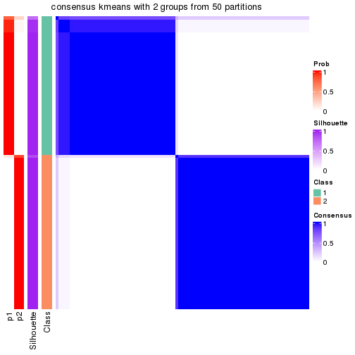</p>

</div>
<div id='tab-node-011-consensus-heatmap-2'>
<pre><code class="r">consensus_heatmap(res, k = 3)
</code></pre>

<p>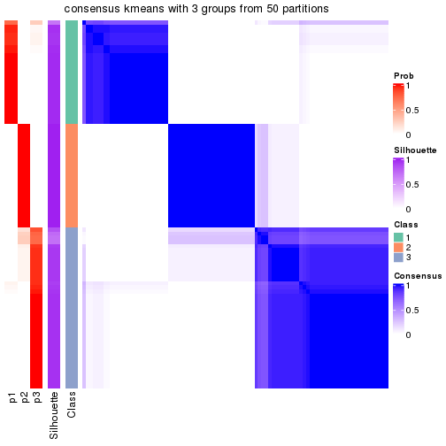</p>

</div>
<div id='tab-node-011-consensus-heatmap-3'>
<pre><code class="r">consensus_heatmap(res, k = 4)
</code></pre>

<p>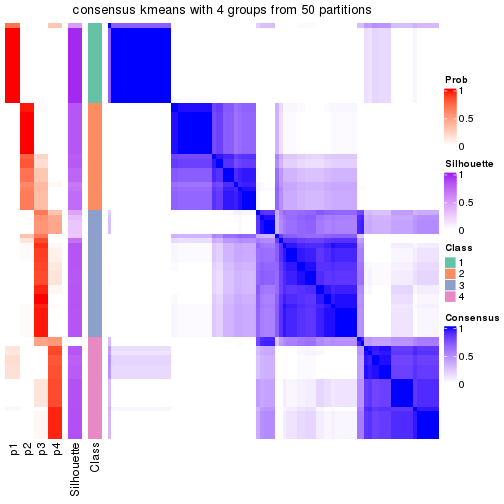</p>

</div>
<div id='tab-node-011-consensus-heatmap-4'>
<pre><code class="r">consensus_heatmap(res, k = 5)
</code></pre>

<p>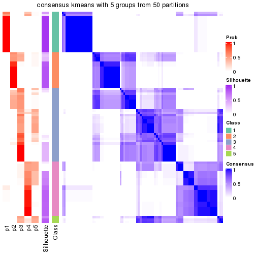</p>

</div>
<div id='tab-node-011-consensus-heatmap-5'>
<pre><code class="r">consensus_heatmap(res, k = 6)
</code></pre>

<p>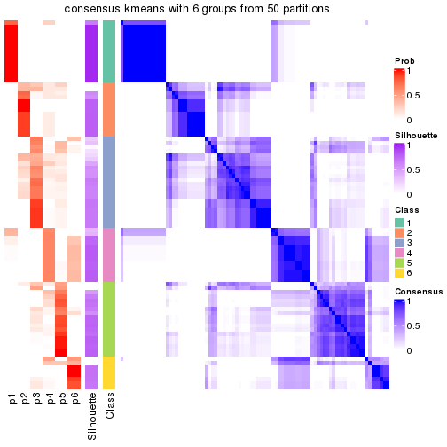</p>

</div>
<div id='tab-node-011-consensus-heatmap-6'>
<pre><code class="r">consensus_heatmap(res, k = 7)
</code></pre>

<p>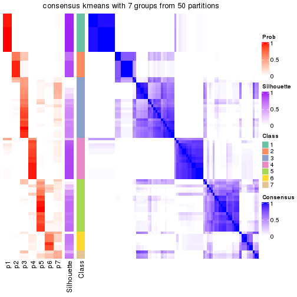</p>

</div>
<div id='tab-node-011-consensus-heatmap-7'>
<pre><code class="r">consensus_heatmap(res, k = 8)
</code></pre>

<p>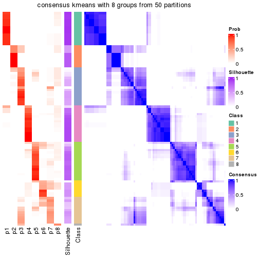</p>

</div>
</div>

Heatmaps for the membership of samples in all partitions to see how consistent they are:


<script>
$( function() {
	$( '#tabs-node-011-membership-heatmap' ).tabs();
} );
</script>
<div id='tabs-node-011-membership-heatmap'>
<ul>
<li><a href='#tab-node-011-membership-heatmap-1'>k = 2</a></li>
<li><a href='#tab-node-011-membership-heatmap-2'>k = 3</a></li>
<li><a href='#tab-node-011-membership-heatmap-3'>k = 4</a></li>
<li><a href='#tab-node-011-membership-heatmap-4'>k = 5</a></li>
<li><a href='#tab-node-011-membership-heatmap-5'>k = 6</a></li>
<li><a href='#tab-node-011-membership-heatmap-6'>k = 7</a></li>
<li><a href='#tab-node-011-membership-heatmap-7'>k = 8</a></li>
</ul>
<div id='tab-node-011-membership-heatmap-1'>
<pre><code class="r">membership_heatmap(res, k = 2)
</code></pre>

<p>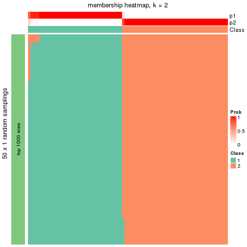</p>

</div>
<div id='tab-node-011-membership-heatmap-2'>
<pre><code class="r">membership_heatmap(res, k = 3)
</code></pre>

<p>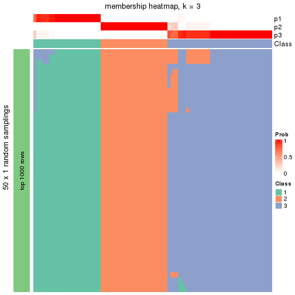</p>

</div>
<div id='tab-node-011-membership-heatmap-3'>
<pre><code class="r">membership_heatmap(res, k = 4)
</code></pre>

<p>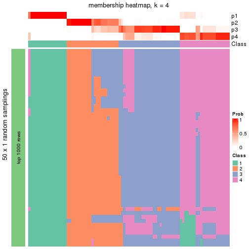</p>

</div>
<div id='tab-node-011-membership-heatmap-4'>
<pre><code class="r">membership_heatmap(res, k = 5)
</code></pre>

<p>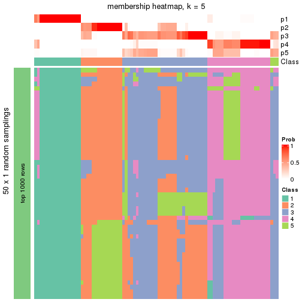</p>

</div>
<div id='tab-node-011-membership-heatmap-5'>
<pre><code class="r">membership_heatmap(res, k = 6)
</code></pre>

<p></p>

</div>
<div id='tab-node-011-membership-heatmap-6'>
<pre><code class="r">membership_heatmap(res, k = 7)
</code></pre>

<p>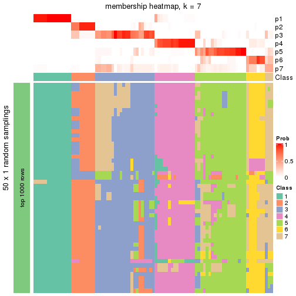</p>

</div>
<div id='tab-node-011-membership-heatmap-7'>
<pre><code class="r">membership_heatmap(res, k = 8)
</code></pre>

<p>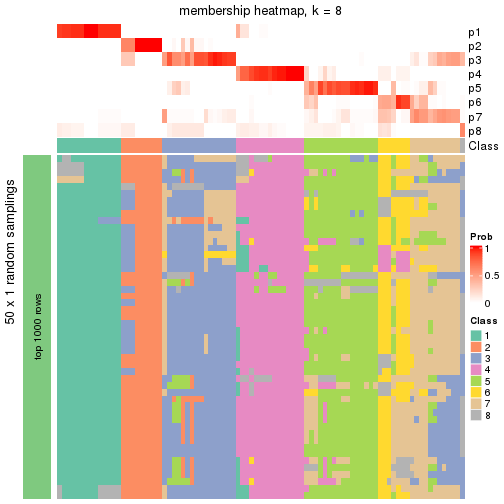</p>

</div>
</div>

As soon as the classes for columns are determined, the signatures
that are significantly different between subgroups can be looked for. 
Following are the heatmaps for signatures.


<script>
$( function() {
	$( '#tabs-node-011-get-signatures' ).tabs();
} );
</script>
<div id='tabs-node-011-get-signatures'>
<ul>
<li><a href='#tab-node-011-get-signatures-1'>k = 2</a></li>
<li><a href='#tab-node-011-get-signatures-2'>k = 3</a></li>
<li><a href='#tab-node-011-get-signatures-3'>k = 4</a></li>
<li><a href='#tab-node-011-get-signatures-4'>k = 5</a></li>
<li><a href='#tab-node-011-get-signatures-5'>k = 6</a></li>
<li><a href='#tab-node-011-get-signatures-6'>k = 7</a></li>
<li><a href='#tab-node-011-get-signatures-7'>k = 8</a></li>
</ul>
<div id='tab-node-011-get-signatures-1'>
<pre><code class="r">get_signatures(res, k = 2)
</code></pre>

<p>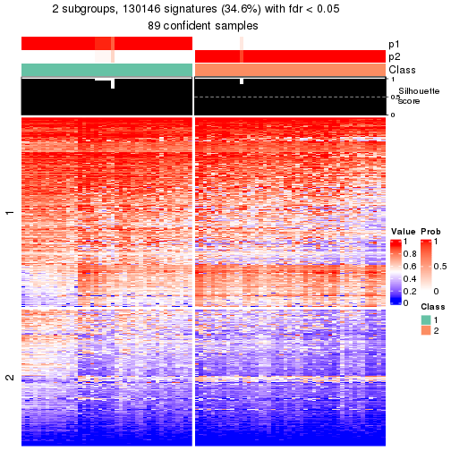</p>

</div>
<div id='tab-node-011-get-signatures-2'>
<pre><code class="r">get_signatures(res, k = 3)
</code></pre>

<p>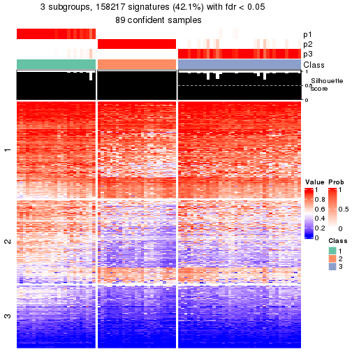</p>

</div>
<div id='tab-node-011-get-signatures-3'>
<pre><code class="r">get_signatures(res, k = 4)
</code></pre>

<p>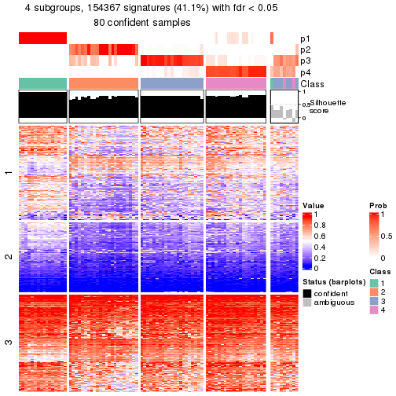</p>

</div>
<div id='tab-node-011-get-signatures-4'>
<pre><code class="r">get_signatures(res, k = 5)
</code></pre>

<p>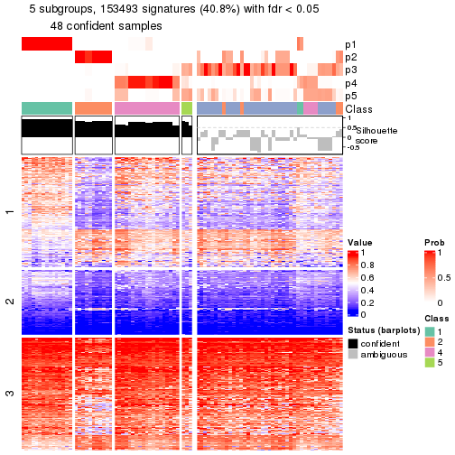</p>

</div>
<div id='tab-node-011-get-signatures-5'>
<pre><code class="r">get_signatures(res, k = 6)
</code></pre>

<p>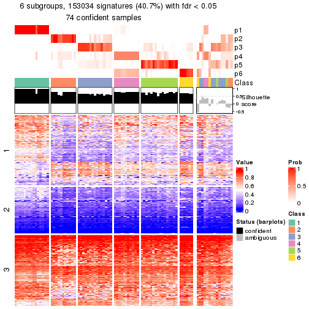</p>

</div>
<div id='tab-node-011-get-signatures-6'>
<pre><code class="r">get_signatures(res, k = 7)
</code></pre>

<p>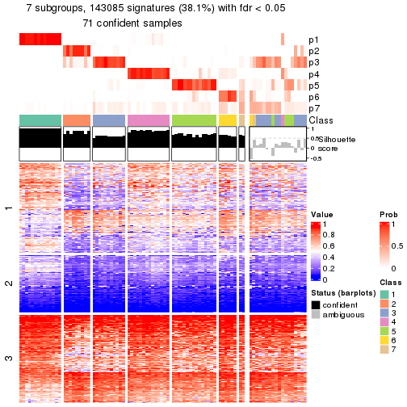</p>

</div>
<div id='tab-node-011-get-signatures-7'>
<pre><code class="r">get_signatures(res, k = 8)
</code></pre>

<p>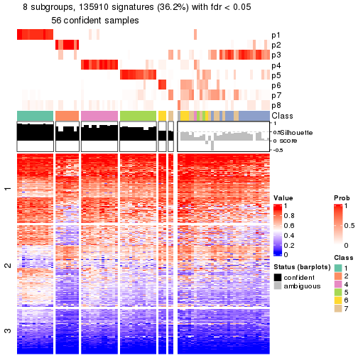</p>

</div>
</div>


Compare the overlap of signatures from different k:

```r
compare_signatures(res)
```

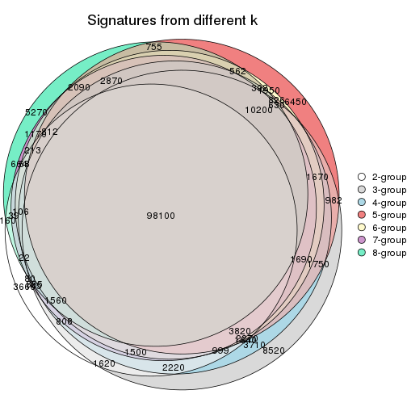

`get_signature()` returns a data frame invisibly. To get the list of signatures, the function
call should be assigned to a variable explicitly. In following code, if `plot` argument is set
to `FALSE`, no heatmap is plotted while only the differential analysis is performed.

```r
# code only for demonstration
tb = get_signature(res, k = ..., plot = FALSE)
```

An example of the output of `tb` is:

```
#>   which_row         fdr    mean_1    mean_2 scaled_mean_1 scaled_mean_2 km
#> 1        38 0.042760348  8.373488  9.131774    -0.5533452     0.5164555  1
#> 2        40 0.018707592  7.106213  8.469186    -0.6173731     0.5762149  1
#> 3        55 0.019134737 10.221463 11.207825    -0.6159697     0.5749050  1
#> 4        59 0.006059896  5.921854  7.869574    -0.6899429     0.6439467  1
#> 5        60 0.018055526  8.928898 10.211722    -0.6204761     0.5791110  1
#> 6        98 0.009384629 15.714769 14.887706     0.6635654    -0.6193277  2
...
```

The columns in `tb` are:

1. `which_row`: row indices corresponding to the input matrix.
2. `fdr`: FDR for the differential test. 
3. `mean_x`: The mean value in group x.
4. `scaled_mean_x`: The mean value in group x after rows are scaled.
5. `km`: Row groups if k-means clustering is applied to rows (which is done by automatically selecting number of clusters).

If there are too many signatures, `top_signatures = ...` can be set to only show the 
signatures with the highest FDRs:

```r
# code only for demonstration
# e.g. to show the top 500 most significant rows
tb = get_signature(res, k = ..., top_signatures = 500)
```

If the signatures are defined as these which are uniquely high in current group, `diff_method` argument
can be set to `"uniquely_high_in_one_group"`:

```r
# code only for demonstration
tb = get_signature(res, k = ..., diff_method = "uniquely_high_in_one_group")
```


UMAP plot which shows how samples are separated.


<script>
$( function() {
	$( '#tabs-node-011-dimension-reduction' ).tabs();
} );
</script>
<div id='tabs-node-011-dimension-reduction'>
<ul>
<li><a href='#tab-node-011-dimension-reduction-1'>k = 2</a></li>
<li><a href='#tab-node-011-dimension-reduction-2'>k = 3</a></li>
<li><a href='#tab-node-011-dimension-reduction-3'>k = 4</a></li>
<li><a href='#tab-node-011-dimension-reduction-4'>k = 5</a></li>
<li><a href='#tab-node-011-dimension-reduction-5'>k = 6</a></li>
<li><a href='#tab-node-011-dimension-reduction-6'>k = 7</a></li>
<li><a href='#tab-node-011-dimension-reduction-7'>k = 8</a></li>
</ul>
<div id='tab-node-011-dimension-reduction-1'>
<pre><code class="r">dimension_reduction(res, k = 2, method = &quot;UMAP&quot;)
</code></pre>

<p></p>

</div>
<div id='tab-node-011-dimension-reduction-2'>
<pre><code class="r">dimension_reduction(res, k = 3, method = &quot;UMAP&quot;)
</code></pre>

<p>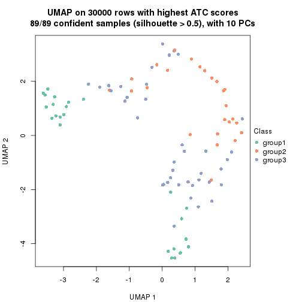</p>

</div>
<div id='tab-node-011-dimension-reduction-3'>
<pre><code class="r">dimension_reduction(res, k = 4, method = &quot;UMAP&quot;)
</code></pre>

<p>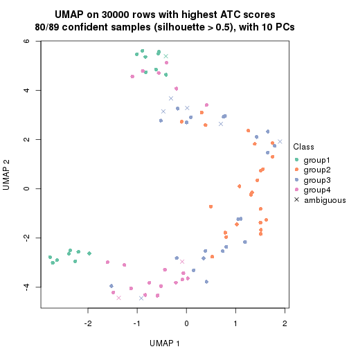</p>

</div>
<div id='tab-node-011-dimension-reduction-4'>
<pre><code class="r">dimension_reduction(res, k = 5, method = &quot;UMAP&quot;)
</code></pre>

<p>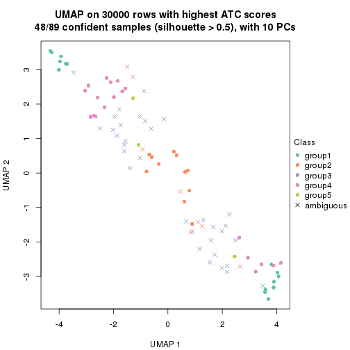</p>

</div>
<div id='tab-node-011-dimension-reduction-5'>
<pre><code class="r">dimension_reduction(res, k = 6, method = &quot;UMAP&quot;)
</code></pre>

<p>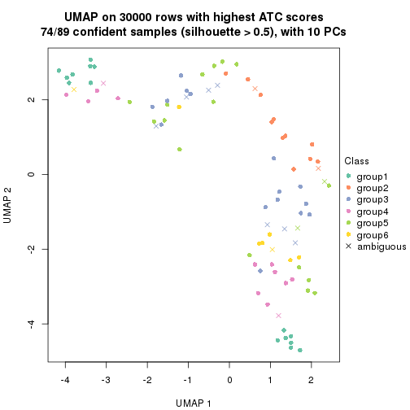</p>

</div>
<div id='tab-node-011-dimension-reduction-6'>
<pre><code class="r">dimension_reduction(res, k = 7, method = &quot;UMAP&quot;)
</code></pre>

<p>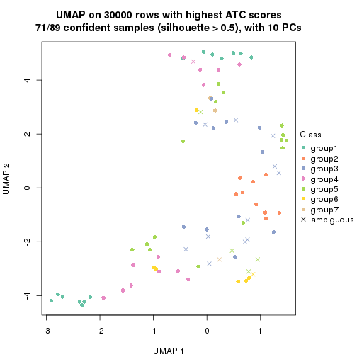</p>

</div>
<div id='tab-node-011-dimension-reduction-7'>
<pre><code class="r">dimension_reduction(res, k = 8, method = &quot;UMAP&quot;)
</code></pre>

<p>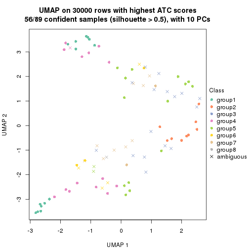</p>

</div>
</div>


Following heatmap shows how subgroups are split when increasing `k`:

```r
collect_classes(res)
```

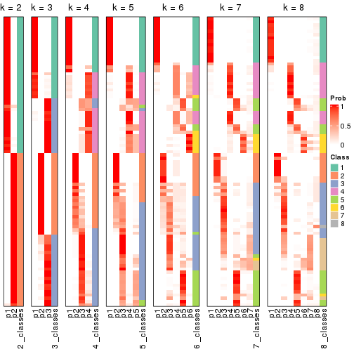


If matrix rows can be associated to genes, consider to use `functional_enrichment(res,
...)` to perform function enrichment for the signature genes. See [this vignette](https://jokergoo.github.io/cola_vignettes/functional_enrichment.html) for more detailed explanations.


 

---------------------------------------------------


### Node0111


Parent node: [Node011](#Node011).
Child nodes: 
                Node01111-leaf
        ,
                Node01112-leaf
        ,
                Node01113-leaf
        ,
                Node01121-leaf
        ,
                Node01122-leaf
        ,
                Node01123-leaf
        ,
                Node01131-leaf
        ,
                [Node01132](#Node01132)
        ,
                Node01211-leaf
        ,
                Node01212-leaf
        ,
                Node01213-leaf
        ,
                Node01214-leaf
        ,
                Node01411-leaf
        ,
                Node01412-leaf
        ,
                Node01413-leaf
        ,
                Node01414-leaf
        ,
                Node02311-leaf
        ,
                Node02312-leaf
        ,
                Node02313-leaf
        .


The object with results only for a single top-value method and a single partitioning method 
can be extracted as:

```r
res = res_rh["0111"]
```

A summary of `res` and all the functions that can be applied to it:

```r
res
```

```
#> A 'ConsensusPartition' object with k = 2, 3, 4, 5, 6, 7, 8.
#>   On a matrix with 30000 rows and 25 columns.
#>   Top rows (1000) are extracted by 'ATC' method.
#>   Subgroups are detected by 'skmeans' method.
#>   Performed in total 350 partitions by row resampling.
#>   Best k for subgroups seems to be 3.
#> 
#> Following methods can be applied to this 'ConsensusPartition' object:
#>  [1] "cola_report"             "collect_classes"         "collect_plots"          
#>  [4] "collect_stats"           "colnames"                "compare_partitions"     
#>  [7] "compare_signatures"      "consensus_heatmap"       "dimension_reduction"    
#> [10] "functional_enrichment"   "get_anno_col"            "get_anno"               
#> [13] "get_classes"             "get_consensus"           "get_matrix"             
#> [16] "get_membership"          "get_param"               "get_signatures"         
#> [19] "get_stats"               "is_best_k"               "is_stable_k"            
#> [22] "membership_heatmap"      "ncol"                    "nrow"                   
#> [25] "plot_ecdf"               "predict_classes"         "rownames"               
#> [28] "select_partition_number" "show"                    "suggest_best_k"         
#> [31] "test_to_known_factors"   "top_rows_heatmap"
```

`collect_plots()` function collects all the plots made from `res` for all `k` (number of subgroups)
into one single page to provide an easy and fast comparison between different `k`.

```r
collect_plots(res)
```

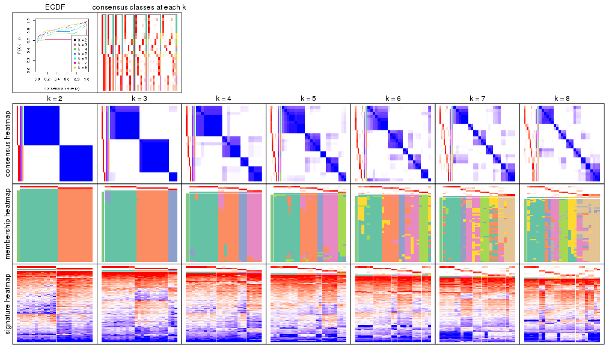

The plots are:

- The first row: a plot of the eCDF (empirical cumulative distribution
  function) curves of the consensus matrix for each `k` and the heatmap of
  predicted classes for each `k`.
- The second row: heatmaps of the consensus matrix for each `k`.
- The third row: heatmaps of the membership matrix for each `k`.
- The fouth row: heatmaps of the signatures for each `k`.

All the plots in panels can be made by individual functions and they are
plotted later in this section.

`select_partition_number()` produces several plots showing different
statistics for choosing "optimized" `k`. There are following statistics:

- eCDF curves of the consensus matrix for each `k`;
- 1-PAC. [The PAC score](https://en.wikipedia.org/wiki/Consensus_clustering#Over-interpretation_potential_of_consensus_clustering)
  measures the proportion of the ambiguous subgrouping.
- Mean silhouette score.
- Concordance. The mean probability of fiting the consensus subgroup labels in all
  partitions.
- Area increased. Denote $A_k$ as the area under the eCDF curve for current
  `k`, the area increased is defined as $A_k - A_{k-1}$.
- Rand index. The percent of pairs of samples that are both in a same cluster
  or both are not in a same cluster in the partition of k and k-1.
- Jaccard index. The ratio of pairs of samples are both in a same cluster in
  the partition of k and k-1 and the pairs of samples are both in a same
  cluster in the partition k or k-1.

The detailed explanations of these statistics can be found in [the _cola_
vignette](https://jokergoo.github.io/cola_vignettes/cola.html#toc_13).

Generally speaking, higher 1-PAC score, higher mean silhouette score or higher
concordance corresponds to better partition. Rand index and Jaccard index
measure how similar the current partition is compared to partition with `k-1`.
If they are too similar, we won't accept `k` is better than `k-1`.

```r
select_partition_number(res)
```

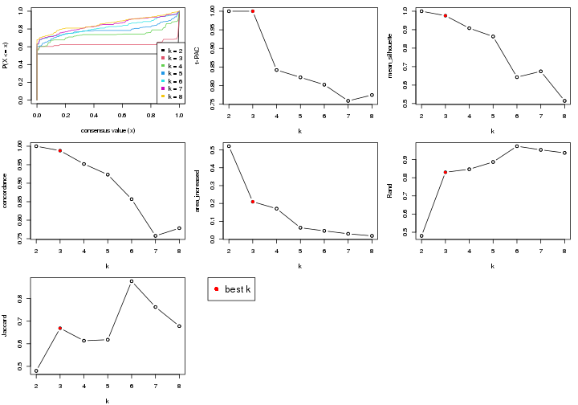

The numeric values for all these statistics can be obtained by `get_stats()`.

```r
get_stats(res)
```

```
#>   k 1-PAC mean_silhouette concordance area_increased  Rand Jaccard
#> 2 2 1.000           1.000       1.000         0.5205 0.480   0.480
#> 3 3 1.000           0.976       0.988         0.2094 0.830   0.669
#> 4 4 0.842           0.908       0.952         0.1708 0.847   0.613
#> 5 5 0.822           0.863       0.923         0.0639 0.887   0.618
#> 6 6 0.802           0.643       0.857         0.0465 0.973   0.877
#> 7 7 0.759           0.674       0.758         0.0302 0.953   0.763
#> 8 8 0.775           0.514       0.778         0.0185 0.937   0.678
```

`suggest_best_k()` suggests the best $k$ based on these statistics. The rules are as follows:

- All $k$ with Jaccard index larger than 0.95 are removed because increasing
  $k$ does not provide enough extra information. If all $k$ are removed, it is
  marked as no subgroup is detected.
- For all $k$ with 1-PAC score larger than 0.9, the maximal $k$ is taken as
  the best $k$, and other $k$ are marked as optional $k$.
- If it does not fit the second rule. The $k$ with the maximal vote of the
  highest 1-PAC score, highest mean silhouette, and highest concordance is
  taken as the best $k$.

```r
suggest_best_k(res)
```

```
#> [1] 3
#> attr(,"optional")
#> [1] 2
```

There is also optional best $k$ = 2 that is worth to check.

Following is the table of the partitions (You need to click the **show/hide
code output** link to see it). The membership matrix (columns with name `p*`)
is inferred by
[`clue::cl_consensus()`](https://www.rdocumentation.org/link/cl_consensus?package=clue)
function with the `SE` method. Basically the value in the membership matrix
represents the probability to belong to a certain group. The finall subgroup
label for an item is determined with the group with highest probability it
belongs to.

In `get_classes()` function, the entropy is calculated from the membership
matrix and the silhouette score is calculated from the consensus matrix.


<script>
$( function() {
	$( '#tabs-node-0111-get-classes' ).tabs();
} );
</script>
<div id='tabs-node-0111-get-classes'>
<ul>
<li><a href='#tab-node-0111-get-classes-1'>k = 2</a></li>
<li><a href='#tab-node-0111-get-classes-2'>k = 3</a></li>
<li><a href='#tab-node-0111-get-classes-3'>k = 4</a></li>
<li><a href='#tab-node-0111-get-classes-4'>k = 5</a></li>
<li><a href='#tab-node-0111-get-classes-5'>k = 6</a></li>
<li><a href='#tab-node-0111-get-classes-6'>k = 7</a></li>
<li><a href='#tab-node-0111-get-classes-7'>k = 8</a></li>
</ul>

<div id='tab-node-0111-get-classes-1'>
<p><a id='tab-node-0111-get-classes-1-a' style='color:#0366d6' href='#'>show/hide code output</a></p>
<pre><code class="r">cbind(get_classes(res, k = 2), get_membership(res, k = 2))
</code></pre>

<pre><code>#&gt;                 class entropy silhouette p1 p2
#&gt; TCGA.3L.AA1B.01     2       0          1  0  1
#&gt; TCGA.G4.6304.01     1       0          1  1  0
#&gt; TCGA.AZ.6600.01     2       0          1  0  1
#&gt; TCGA.A6.5664.01     1       0          1  1  0
#&gt; TCGA.DM.A280.01     1       0          1  1  0
#&gt; TCGA.CM.6168.01     1       0          1  1  0
#&gt; TCGA.A6.6654.01     1       0          1  1  0
#&gt; TCGA.CM.5341.01     2       0          1  0  1
#&gt; TCGA.CM.5863.01     1       0          1  1  0
#&gt; TCGA.F4.6857.01     1       0          1  1  0
#&gt; TCGA.CM.5349.01     2       0          1  0  1
#&gt; TCGA.G4.6627.01     1       0          1  1  0
#&gt; TCGA.A6.5657.01     1       0          1  1  0
#&gt; TCGA.AY.A69D.01     2       0          1  0  1
#&gt; TCGA.AZ.4323.01     1       0          1  1  0
#&gt; TCGA.CA.6717.01     1       0          1  1  0
#&gt; TCGA.F4.6569.01     1       0          1  1  0
#&gt; TCGA.F4.6807.01     2       0          1  0  1
#&gt; TCGA.A6.6138.01     2       0          1  0  1
#&gt; TCGA.F4.6809.01     2       0          1  0  1
#&gt; TCGA.AY.6196.01     1       0          1  1  0
#&gt; TCGA.D5.6529.01     2       0          1  0  1
#&gt; TCGA.D5.6920.01     2       0          1  0  1
#&gt; TCGA.AZ.4616.01     2       0          1  0  1
#&gt; TCGA.G4.6310.01     2       0          1  0  1
</code></pre>

<script>
$('#tab-node-0111-get-classes-1-a').parent().next().next().hide();
$('#tab-node-0111-get-classes-1-a').click(function(){
  $('#tab-node-0111-get-classes-1-a').parent().next().next().toggle();
  return(false);
});
</script>
</div>

<div id='tab-node-0111-get-classes-2'>
<p><a id='tab-node-0111-get-classes-2-a' style='color:#0366d6' href='#'>show/hide code output</a></p>
<pre><code class="r">cbind(get_classes(res, k = 3), get_membership(res, k = 3))
</code></pre>

<pre><code>#&gt;                 class entropy silhouette   p1   p2   p3
#&gt; TCGA.3L.AA1B.01     2  0.0000      0.998 0.00 1.00 0.00
#&gt; TCGA.G4.6304.01     3  0.0000      1.000 0.00 0.00 1.00
#&gt; TCGA.AZ.6600.01     2  0.0000      0.998 0.00 1.00 0.00
#&gt; TCGA.A6.5664.01     1  0.0000      0.971 1.00 0.00 0.00
#&gt; TCGA.DM.A280.01     1  0.3340      0.872 0.88 0.00 0.12
#&gt; TCGA.CM.6168.01     1  0.0000      0.971 1.00 0.00 0.00
#&gt; TCGA.A6.6654.01     1  0.0000      0.971 1.00 0.00 0.00
#&gt; TCGA.CM.5341.01     2  0.0000      0.998 0.00 1.00 0.00
#&gt; TCGA.CM.5863.01     1  0.0000      0.971 1.00 0.00 0.00
#&gt; TCGA.F4.6857.01     1  0.4002      0.828 0.84 0.00 0.16
#&gt; TCGA.CM.5349.01     2  0.0000      0.998 0.00 1.00 0.00
#&gt; TCGA.G4.6627.01     1  0.0000      0.971 1.00 0.00 0.00
#&gt; TCGA.A6.5657.01     1  0.0000      0.971 1.00 0.00 0.00
#&gt; TCGA.AY.A69D.01     2  0.0000      0.998 0.00 1.00 0.00
#&gt; TCGA.AZ.4323.01     3  0.0000      1.000 0.00 0.00 1.00
#&gt; TCGA.CA.6717.01     1  0.0000      0.971 1.00 0.00 0.00
#&gt; TCGA.F4.6569.01     1  0.0000      0.971 1.00 0.00 0.00
#&gt; TCGA.F4.6807.01     2  0.0892      0.976 0.02 0.98 0.00
#&gt; TCGA.A6.6138.01     2  0.0000      0.998 0.00 1.00 0.00
#&gt; TCGA.F4.6809.01     2  0.0000      0.998 0.00 1.00 0.00
#&gt; TCGA.AY.6196.01     3  0.0000      1.000 0.00 0.00 1.00
#&gt; TCGA.D5.6529.01     1  0.0000      0.971 1.00 0.00 0.00
#&gt; TCGA.D5.6920.01     2  0.0000      0.998 0.00 1.00 0.00
#&gt; TCGA.AZ.4616.01     2  0.0000      0.998 0.00 1.00 0.00
#&gt; TCGA.G4.6310.01     2  0.0000      0.998 0.00 1.00 0.00
</code></pre>

<script>
$('#tab-node-0111-get-classes-2-a').parent().next().next().hide();
$('#tab-node-0111-get-classes-2-a').click(function(){
  $('#tab-node-0111-get-classes-2-a').parent().next().next().toggle();
  return(false);
});
</script>
</div>

<div id='tab-node-0111-get-classes-3'>
<p><a id='tab-node-0111-get-classes-3-a' style='color:#0366d6' href='#'>show/hide code output</a></p>
<pre><code class="r">cbind(get_classes(res, k = 4), get_membership(res, k = 4))
</code></pre>

<pre><code>#&gt;                 class entropy silhouette   p1   p2   p3   p4
#&gt; TCGA.3L.AA1B.01     2  0.0000      0.871 0.00 1.00 0.00 0.00
#&gt; TCGA.G4.6304.01     3  0.0707      0.984 0.00 0.00 0.98 0.02
#&gt; TCGA.AZ.6600.01     4  0.2011      0.943 0.00 0.08 0.00 0.92
#&gt; TCGA.A6.5664.01     1  0.0000      0.962 1.00 0.00 0.00 0.00
#&gt; TCGA.DM.A280.01     1  0.2706      0.893 0.90 0.00 0.08 0.02
#&gt; TCGA.CM.6168.01     1  0.0000      0.962 1.00 0.00 0.00 0.00
#&gt; TCGA.A6.6654.01     1  0.0000      0.962 1.00 0.00 0.00 0.00
#&gt; TCGA.CM.5341.01     4  0.0707      0.963 0.00 0.02 0.00 0.98
#&gt; TCGA.CM.5863.01     1  0.2345      0.875 0.90 0.10 0.00 0.00
#&gt; TCGA.F4.6857.01     1  0.3037      0.874 0.88 0.00 0.10 0.02
#&gt; TCGA.CM.5349.01     2  0.3610      0.735 0.00 0.80 0.00 0.20
#&gt; TCGA.G4.6627.01     1  0.0000      0.962 1.00 0.00 0.00 0.00
#&gt; TCGA.A6.5657.01     1  0.0000      0.962 1.00 0.00 0.00 0.00
#&gt; TCGA.AY.A69D.01     4  0.0707      0.963 0.00 0.02 0.00 0.98
#&gt; TCGA.AZ.4323.01     3  0.0000      0.992 0.00 0.00 1.00 0.00
#&gt; TCGA.CA.6717.01     1  0.0000      0.962 1.00 0.00 0.00 0.00
#&gt; TCGA.F4.6569.01     1  0.0000      0.962 1.00 0.00 0.00 0.00
#&gt; TCGA.F4.6807.01     2  0.0000      0.871 0.00 1.00 0.00 0.00
#&gt; TCGA.A6.6138.01     4  0.2011      0.943 0.00 0.08 0.00 0.92
#&gt; TCGA.F4.6809.01     2  0.0000      0.871 0.00 1.00 0.00 0.00
#&gt; TCGA.AY.6196.01     3  0.0000      0.992 0.00 0.00 1.00 0.00
#&gt; TCGA.D5.6529.01     2  0.3610      0.678 0.20 0.80 0.00 0.00
#&gt; TCGA.D5.6920.01     2  0.3975      0.685 0.00 0.76 0.00 0.24
#&gt; TCGA.AZ.4616.01     2  0.0000      0.871 0.00 1.00 0.00 0.00
#&gt; TCGA.G4.6310.01     4  0.0707      0.963 0.00 0.02 0.00 0.98
</code></pre>

<script>
$('#tab-node-0111-get-classes-3-a').parent().next().next().hide();
$('#tab-node-0111-get-classes-3-a').click(function(){
  $('#tab-node-0111-get-classes-3-a').parent().next().next().toggle();
  return(false);
});
</script>
</div>

<div id='tab-node-0111-get-classes-4'>
<p><a id='tab-node-0111-get-classes-4-a' style='color:#0366d6' href='#'>show/hide code output</a></p>
<pre><code class="r">cbind(get_classes(res, k = 5), get_membership(res, k = 5))
</code></pre>

<pre><code>#&gt;                 class entropy silhouette   p1   p2   p3   p4   p5
#&gt; TCGA.3L.AA1B.01     2  0.1043      0.861 0.00 0.96 0.00 0.04 0.00
#&gt; TCGA.G4.6304.01     5  0.2929      0.737 0.00 0.00 0.18 0.00 0.82
#&gt; TCGA.AZ.6600.01     4  0.3291      0.851 0.00 0.12 0.00 0.84 0.04
#&gt; TCGA.A6.5664.01     1  0.0609      0.922 0.98 0.00 0.00 0.00 0.02
#&gt; TCGA.DM.A280.01     5  0.2516      0.818 0.14 0.00 0.00 0.00 0.86
#&gt; TCGA.CM.6168.01     1  0.1043      0.906 0.96 0.00 0.00 0.00 0.04
#&gt; TCGA.A6.6654.01     1  0.1043      0.913 0.96 0.00 0.00 0.00 0.04
#&gt; TCGA.CM.5341.01     4  0.0000      0.912 0.00 0.00 0.00 1.00 0.00
#&gt; TCGA.CM.5863.01     1  0.2797      0.851 0.88 0.06 0.00 0.00 0.06
#&gt; TCGA.F4.6857.01     5  0.2754      0.854 0.08 0.00 0.04 0.00 0.88
#&gt; TCGA.CM.5349.01     2  0.3109      0.757 0.00 0.80 0.00 0.20 0.00
#&gt; TCGA.G4.6627.01     1  0.0609      0.922 0.98 0.00 0.00 0.00 0.02
#&gt; TCGA.A6.5657.01     1  0.0609      0.922 0.98 0.00 0.00 0.00 0.02
#&gt; TCGA.AY.A69D.01     4  0.0609      0.902 0.00 0.00 0.00 0.98 0.02
#&gt; TCGA.AZ.4323.01     3  0.0000      1.000 0.00 0.00 1.00 0.00 0.00
#&gt; TCGA.CA.6717.01     1  0.0000      0.922 1.00 0.00 0.00 0.00 0.00
#&gt; TCGA.F4.6569.01     1  0.0000      0.922 1.00 0.00 0.00 0.00 0.00
#&gt; TCGA.F4.6807.01     2  0.1410      0.825 0.00 0.94 0.00 0.00 0.06
#&gt; TCGA.A6.6138.01     4  0.3037      0.870 0.00 0.10 0.00 0.86 0.04
#&gt; TCGA.F4.6809.01     2  0.0000      0.860 0.00 1.00 0.00 0.00 0.00
#&gt; TCGA.AY.6196.01     3  0.0000      1.000 0.00 0.00 1.00 0.00 0.00
#&gt; TCGA.D5.6529.01     1  0.4854      0.619 0.68 0.26 0.00 0.00 0.06
#&gt; TCGA.D5.6920.01     2  0.4132      0.657 0.00 0.72 0.00 0.26 0.02
#&gt; TCGA.AZ.4616.01     2  0.0000      0.860 0.00 1.00 0.00 0.00 0.00
#&gt; TCGA.G4.6310.01     4  0.0000      0.912 0.00 0.00 0.00 1.00 0.00
</code></pre>

<script>
$('#tab-node-0111-get-classes-4-a').parent().next().next().hide();
$('#tab-node-0111-get-classes-4-a').click(function(){
  $('#tab-node-0111-get-classes-4-a').parent().next().next().toggle();
  return(false);
});
</script>
</div>

<div id='tab-node-0111-get-classes-5'>
<p><a id='tab-node-0111-get-classes-5-a' style='color:#0366d6' href='#'>show/hide code output</a></p>
<pre><code class="r">cbind(get_classes(res, k = 6), get_membership(res, k = 6))
</code></pre>

<pre><code>#&gt;                 class entropy silhouette   p1   p2   p3   p4   p5   p6
#&gt; TCGA.3L.AA1B.01     2  0.0000     0.8626 0.00 1.00 0.00 0.00 0.00 0.00
#&gt; TCGA.G4.6304.01     5  0.0937     0.9481 0.00 0.00 0.04 0.00 0.96 0.00
#&gt; TCGA.AZ.6600.01     4  0.4700     0.5020 0.00 0.34 0.00 0.60 0.00 0.06
#&gt; TCGA.A6.5664.01     1  0.0547     0.7108 0.98 0.00 0.00 0.00 0.02 0.00
#&gt; TCGA.DM.A280.01     5  0.0000     0.9747 0.00 0.00 0.00 0.00 1.00 0.00
#&gt; TCGA.CM.6168.01     1  0.4002     0.0741 0.66 0.00 0.00 0.00 0.02 0.32
#&gt; TCGA.A6.6654.01     1  0.2581     0.5887 0.86 0.00 0.00 0.00 0.02 0.12
#&gt; TCGA.CM.5341.01     4  0.0937     0.6717 0.00 0.00 0.00 0.96 0.00 0.04
#&gt; TCGA.CM.5863.01     1  0.4337    -0.5218 0.50 0.00 0.00 0.00 0.02 0.48
#&gt; TCGA.F4.6857.01     5  0.0000     0.9747 0.00 0.00 0.00 0.00 1.00 0.00
#&gt; TCGA.CM.5349.01     2  0.1556     0.8272 0.00 0.92 0.00 0.08 0.00 0.00
#&gt; TCGA.G4.6627.01     1  0.0547     0.7108 0.98 0.00 0.00 0.00 0.02 0.00
#&gt; TCGA.A6.5657.01     1  0.2793     0.5402 0.80 0.00 0.00 0.00 0.20 0.00
#&gt; TCGA.AY.A69D.01     4  0.3409     0.5019 0.00 0.00 0.00 0.70 0.00 0.30
#&gt; TCGA.AZ.4323.01     3  0.0000     0.9342 0.00 0.00 1.00 0.00 0.00 0.00
#&gt; TCGA.CA.6717.01     1  0.0547     0.7108 0.98 0.00 0.00 0.00 0.02 0.00
#&gt; TCGA.F4.6569.01     1  0.0000     0.7024 1.00 0.00 0.00 0.00 0.00 0.00
#&gt; TCGA.F4.6807.01     2  0.3198     0.6570 0.00 0.74 0.00 0.00 0.00 0.26
#&gt; TCGA.A6.6138.01     4  0.4552     0.5592 0.00 0.30 0.00 0.64 0.00 0.06
#&gt; TCGA.F4.6809.01     2  0.1267     0.8639 0.00 0.94 0.00 0.00 0.00 0.06
#&gt; TCGA.AY.6196.01     3  0.1814     0.9342 0.00 0.00 0.90 0.00 0.00 0.10
#&gt; TCGA.D5.6529.01     6  0.5555     0.0000 0.38 0.14 0.00 0.00 0.00 0.48
#&gt; TCGA.D5.6920.01     2  0.1814     0.8069 0.00 0.90 0.00 0.10 0.00 0.00
#&gt; TCGA.AZ.4616.01     2  0.1556     0.8574 0.00 0.92 0.00 0.00 0.00 0.08
#&gt; TCGA.G4.6310.01     4  0.0000     0.6788 0.00 0.00 0.00 1.00 0.00 0.00
</code></pre>

<script>
$('#tab-node-0111-get-classes-5-a').parent().next().next().hide();
$('#tab-node-0111-get-classes-5-a').click(function(){
  $('#tab-node-0111-get-classes-5-a').parent().next().next().toggle();
  return(false);
});
</script>
</div>

<div id='tab-node-0111-get-classes-6'>
<p><a id='tab-node-0111-get-classes-6-a' style='color:#0366d6' href='#'>show/hide code output</a></p>
<pre><code class="r">cbind(get_classes(res, k = 7), get_membership(res, k = 7))
</code></pre>

<pre><code>#&gt;                 class entropy silhouette   p1   p2   p3   p4   p5   p6   p7
#&gt; TCGA.3L.AA1B.01     7  0.0504      0.786 0.00 0.02 0.00 0.00 0.00 0.00 0.98
#&gt; TCGA.G4.6304.01     5  0.1166      0.904 0.00 0.00 0.06 0.00 0.94 0.00 0.00
#&gt; TCGA.AZ.6600.01     4  0.4930      0.540 0.00 0.26 0.00 0.58 0.00 0.00 0.16
#&gt; TCGA.A6.5664.01     1  0.0000      0.840 1.00 0.00 0.00 0.00 0.00 0.00 0.00
#&gt; TCGA.DM.A280.01     5  0.1664      0.901 0.02 0.06 0.00 0.00 0.92 0.00 0.00
#&gt; TCGA.CM.6168.01     6  0.3525      0.488 0.44 0.00 0.00 0.00 0.00 0.56 0.00
#&gt; TCGA.A6.6654.01     1  0.3815     -0.119 0.62 0.00 0.00 0.00 0.02 0.36 0.00
#&gt; TCGA.CM.5341.01     4  0.0863      0.638 0.00 0.04 0.00 0.96 0.00 0.00 0.00
#&gt; TCGA.CM.5863.01     6  0.3606      0.666 0.30 0.00 0.00 0.00 0.00 0.68 0.02
#&gt; TCGA.F4.6857.01     5  0.0504      0.923 0.02 0.00 0.00 0.00 0.98 0.00 0.00
#&gt; TCGA.CM.5349.01     7  0.5521      0.572 0.00 0.12 0.00 0.16 0.00 0.10 0.62
#&gt; TCGA.G4.6627.01     1  0.0000      0.840 1.00 0.00 0.00 0.00 0.00 0.00 0.00
#&gt; TCGA.A6.5657.01     1  0.1671      0.743 0.90 0.00 0.00 0.00 0.10 0.00 0.00
#&gt; TCGA.AY.A69D.01     4  0.3459      0.368 0.00 0.40 0.00 0.60 0.00 0.00 0.00
#&gt; TCGA.AZ.4323.01     3  0.0000      0.787 0.00 0.00 1.00 0.00 0.00 0.00 0.00
#&gt; TCGA.CA.6717.01     1  0.0000      0.840 1.00 0.00 0.00 0.00 0.00 0.00 0.00
#&gt; TCGA.F4.6569.01     1  0.0504      0.825 0.98 0.00 0.00 0.00 0.00 0.02 0.00
#&gt; TCGA.F4.6807.01     7  0.3244      0.613 0.00 0.04 0.00 0.00 0.00 0.18 0.78
#&gt; TCGA.A6.6138.01     4  0.4870      0.554 0.00 0.28 0.00 0.58 0.00 0.00 0.14
#&gt; TCGA.F4.6809.01     7  0.0000      0.787 0.00 0.00 0.00 0.00 0.00 0.00 1.00
#&gt; TCGA.AY.6196.01     3  0.4204      0.787 0.00 0.16 0.70 0.00 0.00 0.14 0.00
#&gt; TCGA.D5.6529.01     6  0.5182      0.557 0.24 0.00 0.00 0.00 0.00 0.54 0.22
#&gt; TCGA.D5.6920.01     7  0.5373      0.597 0.00 0.12 0.00 0.14 0.00 0.10 0.64
#&gt; TCGA.AZ.4616.01     7  0.0000      0.787 0.00 0.00 0.00 0.00 0.00 0.00 1.00
#&gt; TCGA.G4.6310.01     4  0.1006      0.636 0.00 0.02 0.00 0.96 0.00 0.02 0.00
</code></pre>

<script>
$('#tab-node-0111-get-classes-6-a').parent().next().next().hide();
$('#tab-node-0111-get-classes-6-a').click(function(){
  $('#tab-node-0111-get-classes-6-a').parent().next().next().toggle();
  return(false);
});
</script>
</div>

<div id='tab-node-0111-get-classes-7'>
<p><a id='tab-node-0111-get-classes-7-a' style='color:#0366d6' href='#'>show/hide code output</a></p>
<pre><code class="r">cbind(get_classes(res, k = 8), get_membership(res, k = 8))
</code></pre>

<pre><code>#&gt;                 class entropy silhouette   p1   p2   p3   p4   p5   p6   p7   p8
#&gt; TCGA.3L.AA1B.01     7  0.3015     0.5881 0.00 0.00 0.00 0.00 0.00 0.00 0.68 0.32
#&gt; TCGA.G4.6304.01     5  0.1091     0.8522 0.00 0.06 0.00 0.00 0.94 0.00 0.00 0.00
#&gt; TCGA.AZ.6600.01     7  0.6173    -0.2192 0.00 0.08 0.00 0.32 0.00 0.00 0.34 0.26
#&gt; TCGA.A6.5664.01     1  0.0471     0.8168 0.98 0.00 0.00 0.00 0.00 0.02 0.00 0.00
#&gt; TCGA.DM.A280.01     5  0.3637     0.8047 0.02 0.08 0.00 0.00 0.80 0.04 0.00 0.06
#&gt; TCGA.CM.6168.01     6  0.3237     0.3529 0.40 0.00 0.00 0.00 0.00 0.60 0.00 0.00
#&gt; TCGA.A6.6654.01     1  0.4040    -0.0227 0.58 0.02 0.00 0.00 0.02 0.38 0.00 0.00
#&gt; TCGA.CM.5341.01     4  0.2404     0.7053 0.00 0.00 0.00 0.84 0.00 0.00 0.14 0.02
#&gt; TCGA.CM.5863.01     6  0.1765     0.6742 0.12 0.00 0.00 0.00 0.00 0.88 0.00 0.00
#&gt; TCGA.F4.6857.01     5  0.0941     0.8706 0.02 0.02 0.00 0.00 0.96 0.00 0.00 0.00
#&gt; TCGA.CM.5349.01     7  0.0000     0.5226 0.00 0.00 0.00 0.00 0.00 0.00 1.00 0.00
#&gt; TCGA.G4.6627.01     1  0.0808     0.8111 0.96 0.00 0.00 0.00 0.00 0.04 0.00 0.00
#&gt; TCGA.A6.5657.01     1  0.1275     0.7800 0.94 0.00 0.00 0.00 0.04 0.00 0.00 0.02
#&gt; TCGA.AY.A69D.01     4  0.4033     0.4616 0.00 0.12 0.00 0.68 0.00 0.00 0.00 0.20
#&gt; TCGA.AZ.4323.01     2  0.3193     0.0000 0.00 0.62 0.38 0.00 0.00 0.00 0.00 0.00
#&gt; TCGA.CA.6717.01     1  0.1341     0.8064 0.92 0.00 0.00 0.00 0.00 0.08 0.00 0.00
#&gt; TCGA.F4.6569.01     1  0.1563     0.8078 0.90 0.00 0.00 0.00 0.00 0.10 0.00 0.00
#&gt; TCGA.F4.6807.01     7  0.4407     0.4806 0.00 0.02 0.00 0.00 0.00 0.04 0.48 0.46
#&gt; TCGA.A6.6138.01     7  0.6147    -0.2234 0.00 0.08 0.00 0.34 0.00 0.00 0.34 0.24
#&gt; TCGA.F4.6809.01     7  0.3142     0.5824 0.00 0.00 0.00 0.00 0.00 0.00 0.64 0.36
#&gt; TCGA.AY.6196.01     3  0.0000     0.0000 0.00 0.00 1.00 0.00 0.00 0.00 0.00 0.00
#&gt; TCGA.D5.6529.01     6  0.4031     0.6169 0.10 0.02 0.00 0.00 0.00 0.72 0.00 0.16
#&gt; TCGA.D5.6920.01     7  0.0000     0.5226 0.00 0.00 0.00 0.00 0.00 0.00 1.00 0.00
#&gt; TCGA.AZ.4616.01     7  0.3193     0.5749 0.00 0.00 0.00 0.00 0.00 0.00 0.62 0.38
#&gt; TCGA.G4.6310.01     4  0.2680     0.6958 0.00 0.02 0.00 0.84 0.00 0.02 0.12 0.00
</code></pre>

<script>
$('#tab-node-0111-get-classes-7-a').parent().next().next().hide();
$('#tab-node-0111-get-classes-7-a').click(function(){
  $('#tab-node-0111-get-classes-7-a').parent().next().next().toggle();
  return(false);
});
</script>
</div>
</div>

Heatmaps for the consensus matrix. It visualizes the probability of two
samples to be in a same group.


<script>
$( function() {
	$( '#tabs-node-0111-consensus-heatmap' ).tabs();
} );
</script>
<div id='tabs-node-0111-consensus-heatmap'>
<ul>
<li><a href='#tab-node-0111-consensus-heatmap-1'>k = 2</a></li>
<li><a href='#tab-node-0111-consensus-heatmap-2'>k = 3</a></li>
<li><a href='#tab-node-0111-consensus-heatmap-3'>k = 4</a></li>
<li><a href='#tab-node-0111-consensus-heatmap-4'>k = 5</a></li>
<li><a href='#tab-node-0111-consensus-heatmap-5'>k = 6</a></li>
<li><a href='#tab-node-0111-consensus-heatmap-6'>k = 7</a></li>
<li><a href='#tab-node-0111-consensus-heatmap-7'>k = 8</a></li>
</ul>
<div id='tab-node-0111-consensus-heatmap-1'>
<pre><code class="r">consensus_heatmap(res, k = 2)
</code></pre>

<p>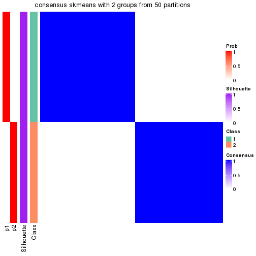</p>

</div>
<div id='tab-node-0111-consensus-heatmap-2'>
<pre><code class="r">consensus_heatmap(res, k = 3)
</code></pre>

<p>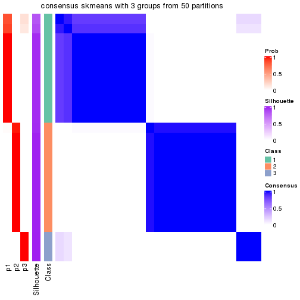</p>

</div>
<div id='tab-node-0111-consensus-heatmap-3'>
<pre><code class="r">consensus_heatmap(res, k = 4)
</code></pre>

<p>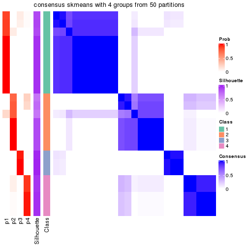</p>

</div>
<div id='tab-node-0111-consensus-heatmap-4'>
<pre><code class="r">consensus_heatmap(res, k = 5)
</code></pre>

<p>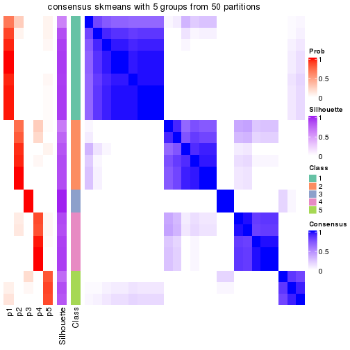</p>

</div>
<div id='tab-node-0111-consensus-heatmap-5'>
<pre><code class="r">consensus_heatmap(res, k = 6)
</code></pre>

<p>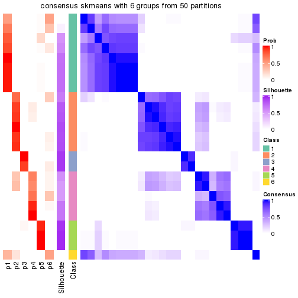</p>

</div>
<div id='tab-node-0111-consensus-heatmap-6'>
<pre><code class="r">consensus_heatmap(res, k = 7)
</code></pre>

<p>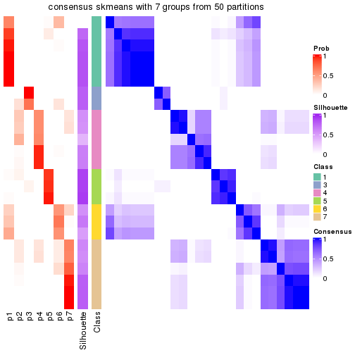</p>

</div>
<div id='tab-node-0111-consensus-heatmap-7'>
<pre><code class="r">consensus_heatmap(res, k = 8)
</code></pre>

<p>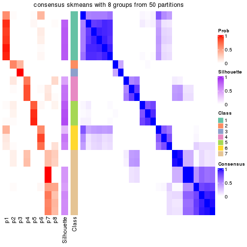</p>

</div>
</div>

Heatmaps for the membership of samples in all partitions to see how consistent they are:


<script>
$( function() {
	$( '#tabs-node-0111-membership-heatmap' ).tabs();
} );
</script>
<div id='tabs-node-0111-membership-heatmap'>
<ul>
<li><a href='#tab-node-0111-membership-heatmap-1'>k = 2</a></li>
<li><a href='#tab-node-0111-membership-heatmap-2'>k = 3</a></li>
<li><a href='#tab-node-0111-membership-heatmap-3'>k = 4</a></li>
<li><a href='#tab-node-0111-membership-heatmap-4'>k = 5</a></li>
<li><a href='#tab-node-0111-membership-heatmap-5'>k = 6</a></li>
<li><a href='#tab-node-0111-membership-heatmap-6'>k = 7</a></li>
<li><a href='#tab-node-0111-membership-heatmap-7'>k = 8</a></li>
</ul>
<div id='tab-node-0111-membership-heatmap-1'>
<pre><code class="r">membership_heatmap(res, k = 2)
</code></pre>

<p>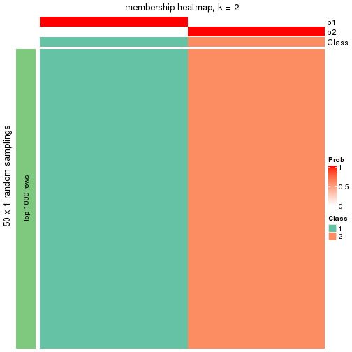</p>

</div>
<div id='tab-node-0111-membership-heatmap-2'>
<pre><code class="r">membership_heatmap(res, k = 3)
</code></pre>

<p>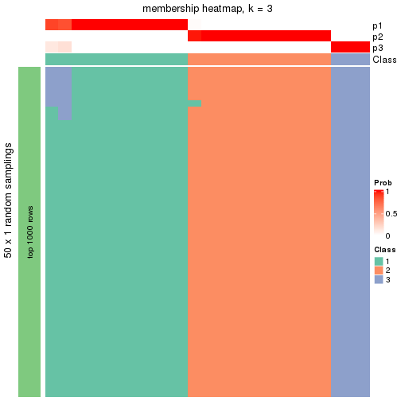</p>

</div>
<div id='tab-node-0111-membership-heatmap-3'>
<pre><code class="r">membership_heatmap(res, k = 4)
</code></pre>

<p>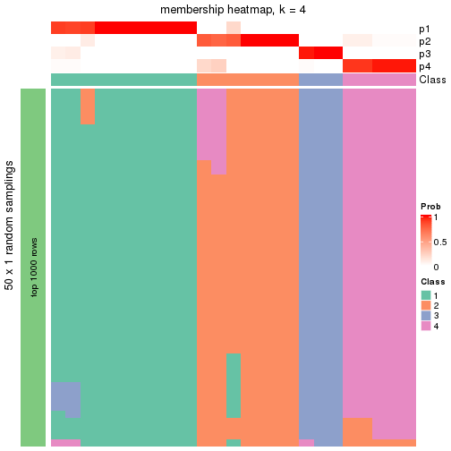</p>

</div>
<div id='tab-node-0111-membership-heatmap-4'>
<pre><code class="r">membership_heatmap(res, k = 5)
</code></pre>

<p>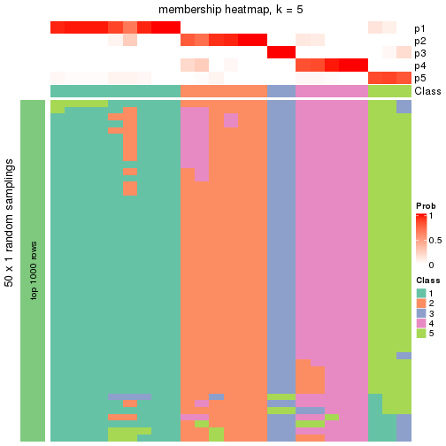</p>

</div>
<div id='tab-node-0111-membership-heatmap-5'>
<pre><code class="r">membership_heatmap(res, k = 6)
</code></pre>

<p>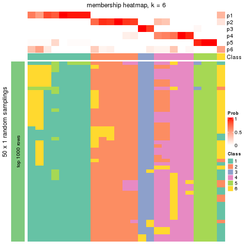</p>

</div>
<div id='tab-node-0111-membership-heatmap-6'>
<pre><code class="r">membership_heatmap(res, k = 7)
</code></pre>

<p>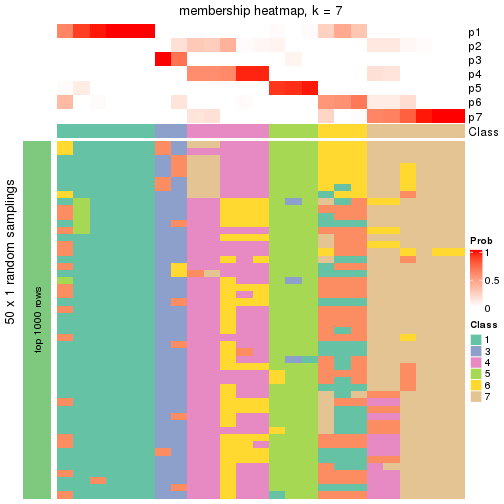</p>

</div>
<div id='tab-node-0111-membership-heatmap-7'>
<pre><code class="r">membership_heatmap(res, k = 8)
</code></pre>

<p>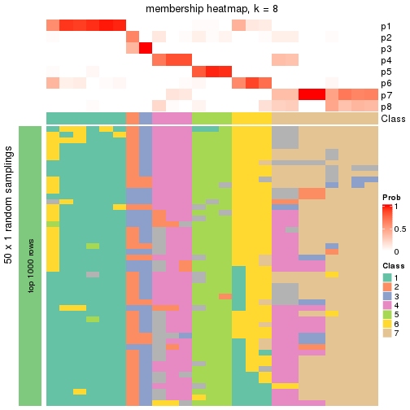</p>

</div>
</div>

As soon as the classes for columns are determined, the signatures
that are significantly different between subgroups can be looked for. 
Following are the heatmaps for signatures.


<script>
$( function() {
	$( '#tabs-node-0111-get-signatures' ).tabs();
} );
</script>
<div id='tabs-node-0111-get-signatures'>
<ul>
<li><a href='#tab-node-0111-get-signatures-1'>k = 2</a></li>
<li><a href='#tab-node-0111-get-signatures-2'>k = 3</a></li>
<li><a href='#tab-node-0111-get-signatures-3'>k = 4</a></li>
<li><a href='#tab-node-0111-get-signatures-4'>k = 5</a></li>
<li><a href='#tab-node-0111-get-signatures-5'>k = 6</a></li>
<li><a href='#tab-node-0111-get-signatures-6'>k = 7</a></li>
<li><a href='#tab-node-0111-get-signatures-7'>k = 8</a></li>
</ul>
<div id='tab-node-0111-get-signatures-1'>
<pre><code class="r">get_signatures(res, k = 2)
</code></pre>

<p>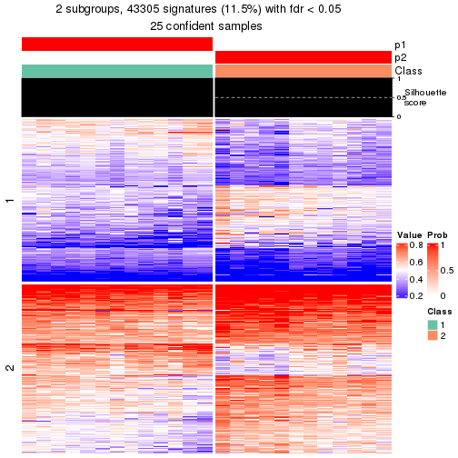</p>

</div>
<div id='tab-node-0111-get-signatures-2'>
<pre><code class="r">get_signatures(res, k = 3)
</code></pre>

<p>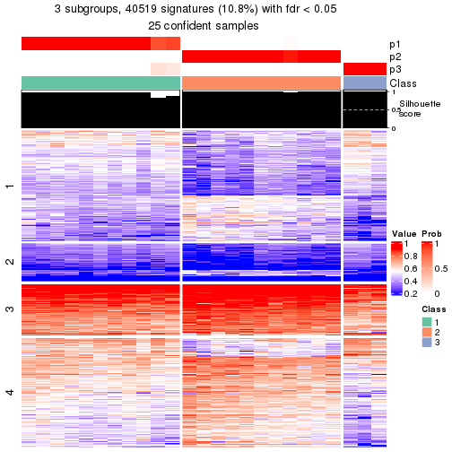</p>

</div>
<div id='tab-node-0111-get-signatures-3'>
<pre><code class="r">get_signatures(res, k = 4)
</code></pre>

<p>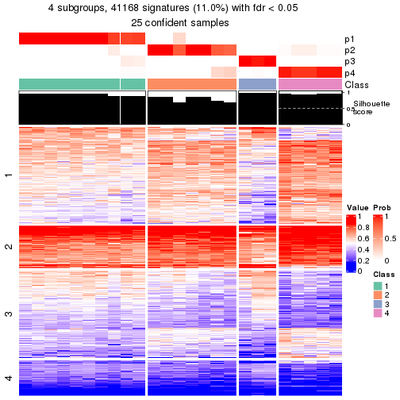</p>

</div>
<div id='tab-node-0111-get-signatures-4'>
<pre><code class="r">get_signatures(res, k = 5)
</code></pre>

<p>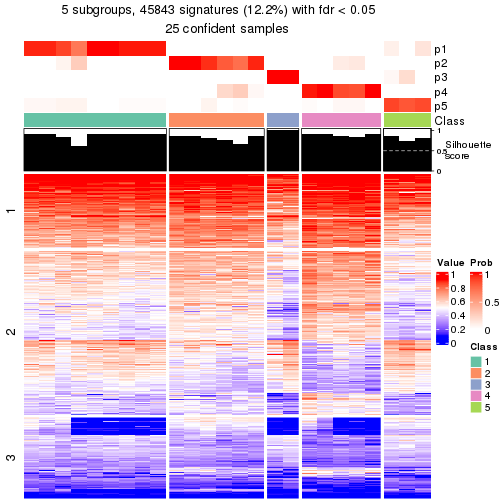</p>

</div>
<div id='tab-node-0111-get-signatures-5'>
<pre><code class="r">get_signatures(res, k = 6)
</code></pre>

<p>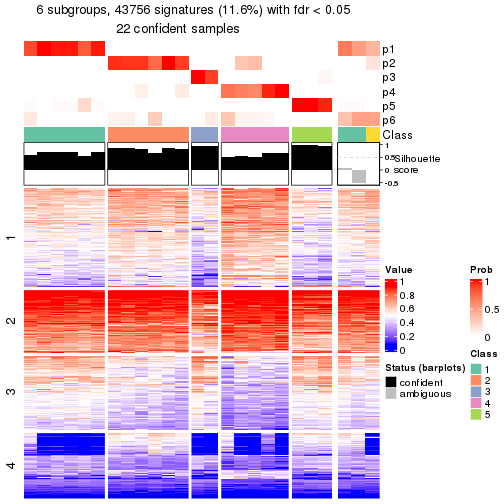</p>

</div>
<div id='tab-node-0111-get-signatures-6'>
<pre><code class="r">get_signatures(res, k = 7)
</code></pre>

<p>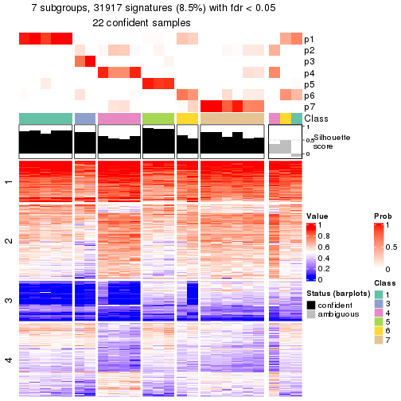</p>

</div>
<div id='tab-node-0111-get-signatures-7'>
<pre><code class="r">get_signatures(res, k = 8)
</code></pre>

<p>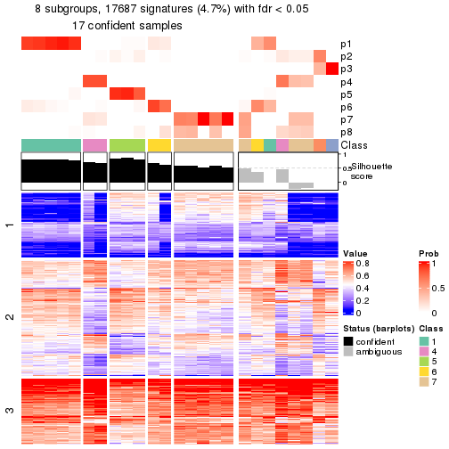</p>

</div>
</div>


Compare the overlap of signatures from different k:

```r
compare_signatures(res)
```

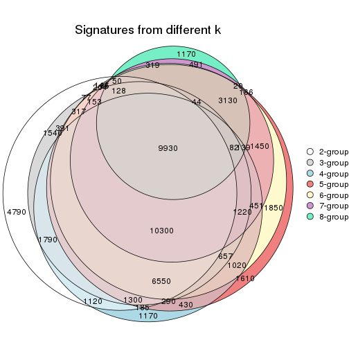

`get_signature()` returns a data frame invisibly. To get the list of signatures, the function
call should be assigned to a variable explicitly. In following code, if `plot` argument is set
to `FALSE`, no heatmap is plotted while only the differential analysis is performed.

```r
# code only for demonstration
tb = get_signature(res, k = ..., plot = FALSE)
```

An example of the output of `tb` is:

```
#>   which_row         fdr    mean_1    mean_2 scaled_mean_1 scaled_mean_2 km
#> 1        38 0.042760348  8.373488  9.131774    -0.5533452     0.5164555  1
#> 2        40 0.018707592  7.106213  8.469186    -0.6173731     0.5762149  1
#> 3        55 0.019134737 10.221463 11.207825    -0.6159697     0.5749050  1
#> 4        59 0.006059896  5.921854  7.869574    -0.6899429     0.6439467  1
#> 5        60 0.018055526  8.928898 10.211722    -0.6204761     0.5791110  1
#> 6        98 0.009384629 15.714769 14.887706     0.6635654    -0.6193277  2
...
```

The columns in `tb` are:

1. `which_row`: row indices corresponding to the input matrix.
2. `fdr`: FDR for the differential test. 
3. `mean_x`: The mean value in group x.
4. `scaled_mean_x`: The mean value in group x after rows are scaled.
5. `km`: Row groups if k-means clustering is applied to rows (which is done by automatically selecting number of clusters).

If there are too many signatures, `top_signatures = ...` can be set to only show the 
signatures with the highest FDRs:

```r
# code only for demonstration
# e.g. to show the top 500 most significant rows
tb = get_signature(res, k = ..., top_signatures = 500)
```

If the signatures are defined as these which are uniquely high in current group, `diff_method` argument
can be set to `"uniquely_high_in_one_group"`:

```r
# code only for demonstration
tb = get_signature(res, k = ..., diff_method = "uniquely_high_in_one_group")
```


UMAP plot which shows how samples are separated.


<script>
$( function() {
	$( '#tabs-node-0111-dimension-reduction' ).tabs();
} );
</script>
<div id='tabs-node-0111-dimension-reduction'>
<ul>
<li><a href='#tab-node-0111-dimension-reduction-1'>k = 2</a></li>
<li><a href='#tab-node-0111-dimension-reduction-2'>k = 3</a></li>
<li><a href='#tab-node-0111-dimension-reduction-3'>k = 4</a></li>
<li><a href='#tab-node-0111-dimension-reduction-4'>k = 5</a></li>
<li><a href='#tab-node-0111-dimension-reduction-5'>k = 6</a></li>
<li><a href='#tab-node-0111-dimension-reduction-6'>k = 7</a></li>
<li><a href='#tab-node-0111-dimension-reduction-7'>k = 8</a></li>
</ul>
<div id='tab-node-0111-dimension-reduction-1'>
<pre><code class="r">dimension_reduction(res, k = 2, method = &quot;UMAP&quot;)
</code></pre>

<p>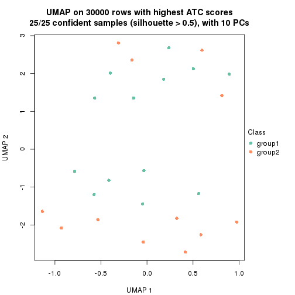</p>

</div>
<div id='tab-node-0111-dimension-reduction-2'>
<pre><code class="r">dimension_reduction(res, k = 3, method = &quot;UMAP&quot;)
</code></pre>

<p>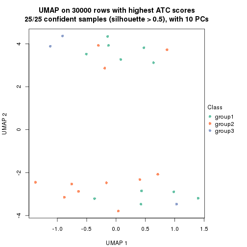</p>

</div>
<div id='tab-node-0111-dimension-reduction-3'>
<pre><code class="r">dimension_reduction(res, k = 4, method = &quot;UMAP&quot;)
</code></pre>

<p>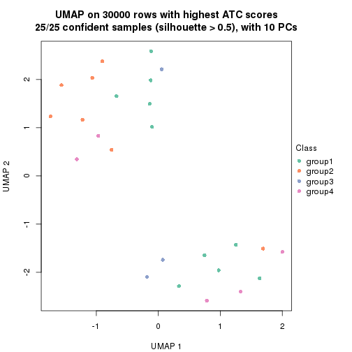</p>

</div>
<div id='tab-node-0111-dimension-reduction-4'>
<pre><code class="r">dimension_reduction(res, k = 5, method = &quot;UMAP&quot;)
</code></pre>

<p>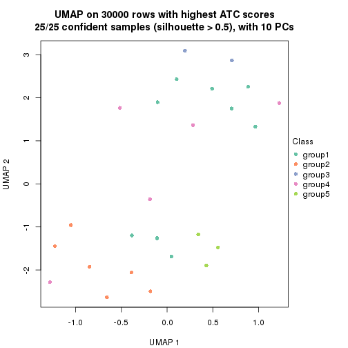</p>

</div>
<div id='tab-node-0111-dimension-reduction-5'>
<pre><code class="r">dimension_reduction(res, k = 6, method = &quot;UMAP&quot;)
</code></pre>

<p>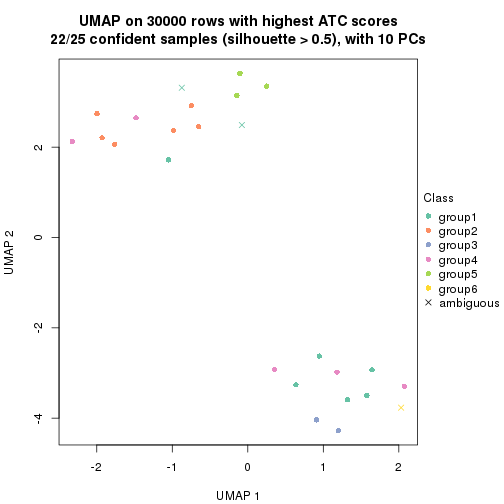</p>

</div>
<div id='tab-node-0111-dimension-reduction-6'>
<pre><code class="r">dimension_reduction(res, k = 7, method = &quot;UMAP&quot;)
</code></pre>

<p>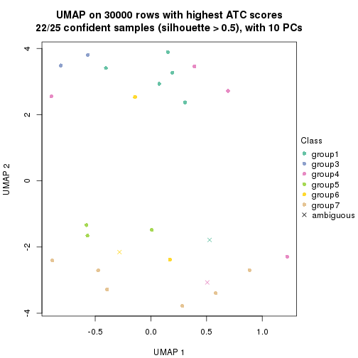</p>

</div>
<div id='tab-node-0111-dimension-reduction-7'>
<pre><code class="r">dimension_reduction(res, k = 8, method = &quot;UMAP&quot;)
</code></pre>

<p>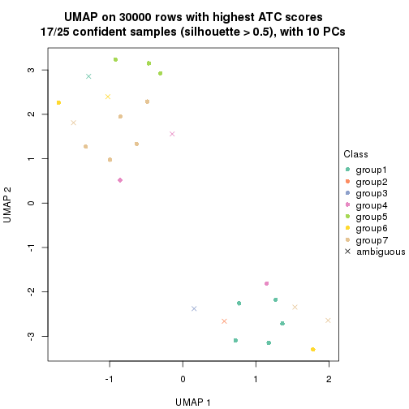</p>

</div>
</div>


Following heatmap shows how subgroups are split when increasing `k`:

```r
collect_classes(res)
```

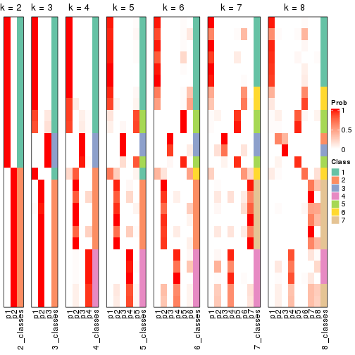


If matrix rows can be associated to genes, consider to use `functional_enrichment(res,
...)` to perform function enrichment for the signature genes. See [this vignette](https://jokergoo.github.io/cola_vignettes/functional_enrichment.html) for more detailed explanations.


 

---------------------------------------------------


### Node0112


Parent node: [Node011](#Node011).
Child nodes: 
                Node01111-leaf
        ,
                Node01112-leaf
        ,
                Node01113-leaf
        ,
                Node01121-leaf
        ,
                Node01122-leaf
        ,
                Node01123-leaf
        ,
                Node01131-leaf
        ,
                [Node01132](#Node01132)
        ,
                Node01211-leaf
        ,
                Node01212-leaf
        ,
                Node01213-leaf
        ,
                Node01214-leaf
        ,
                Node01411-leaf
        ,
                Node01412-leaf
        ,
                Node01413-leaf
        ,
                Node01414-leaf
        ,
                Node02311-leaf
        ,
                Node02312-leaf
        ,
                Node02313-leaf
        .


The object with results only for a single top-value method and a single partitioning method 
can be extracted as:

```r
res = res_rh["0112"]
```

A summary of `res` and all the functions that can be applied to it:

```r
res
```

```
#> A 'ConsensusPartition' object with k = 2, 3, 4, 5, 6, 7, 8.
#>   On a matrix with 30000 rows and 25 columns.
#>   Top rows (1000) are extracted by 'ATC' method.
#>   Subgroups are detected by 'kmeans' method.
#>   Performed in total 350 partitions by row resampling.
#>   Best k for subgroups seems to be 2.
#> 
#> Following methods can be applied to this 'ConsensusPartition' object:
#>  [1] "cola_report"             "collect_classes"         "collect_plots"          
#>  [4] "collect_stats"           "colnames"                "compare_partitions"     
#>  [7] "compare_signatures"      "consensus_heatmap"       "dimension_reduction"    
#> [10] "functional_enrichment"   "get_anno_col"            "get_anno"               
#> [13] "get_classes"             "get_consensus"           "get_matrix"             
#> [16] "get_membership"          "get_param"               "get_signatures"         
#> [19] "get_stats"               "is_best_k"               "is_stable_k"            
#> [22] "membership_heatmap"      "ncol"                    "nrow"                   
#> [25] "plot_ecdf"               "predict_classes"         "rownames"               
#> [28] "select_partition_number" "show"                    "suggest_best_k"         
#> [31] "test_to_known_factors"   "top_rows_heatmap"
```

`collect_plots()` function collects all the plots made from `res` for all `k` (number of subgroups)
into one single page to provide an easy and fast comparison between different `k`.

```r
collect_plots(res)
```

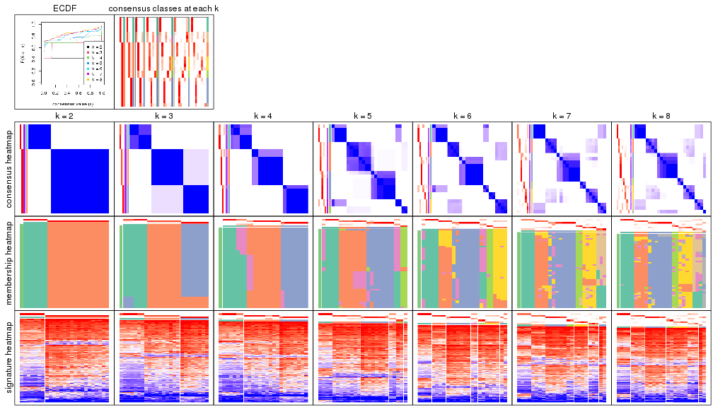

The plots are:

- The first row: a plot of the eCDF (empirical cumulative distribution
  function) curves of the consensus matrix for each `k` and the heatmap of
  predicted classes for each `k`.
- The second row: heatmaps of the consensus matrix for each `k`.
- The third row: heatmaps of the membership matrix for each `k`.
- The fouth row: heatmaps of the signatures for each `k`.

All the plots in panels can be made by individual functions and they are
plotted later in this section.

`select_partition_number()` produces several plots showing different
statistics for choosing "optimized" `k`. There are following statistics:

- eCDF curves of the consensus matrix for each `k`;
- 1-PAC. [The PAC score](https://en.wikipedia.org/wiki/Consensus_clustering#Over-interpretation_potential_of_consensus_clustering)
  measures the proportion of the ambiguous subgrouping.
- Mean silhouette score.
- Concordance. The mean probability of fiting the consensus subgroup labels in all
  partitions.
- Area increased. Denote $A_k$ as the area under the eCDF curve for current
  `k`, the area increased is defined as $A_k - A_{k-1}$.
- Rand index. The percent of pairs of samples that are both in a same cluster
  or both are not in a same cluster in the partition of k and k-1.
- Jaccard index. The ratio of pairs of samples are both in a same cluster in
  the partition of k and k-1 and the pairs of samples are both in a same
  cluster in the partition k or k-1.

The detailed explanations of these statistics can be found in [the _cola_
vignette](https://jokergoo.github.io/cola_vignettes/cola.html#toc_13).

Generally speaking, higher 1-PAC score, higher mean silhouette score or higher
concordance corresponds to better partition. Rand index and Jaccard index
measure how similar the current partition is compared to partition with `k-1`.
If they are too similar, we won't accept `k` is better than `k-1`.

```r
select_partition_number(res)
```

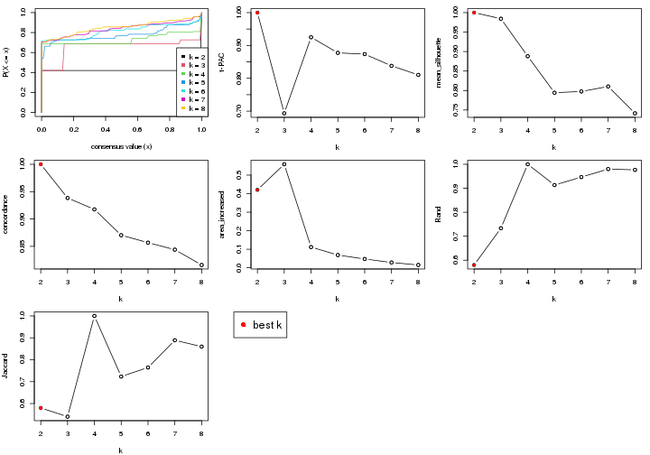

The numeric values for all these statistics can be obtained by `get_stats()`.

```r
get_stats(res)
```

```
#>   k 1-PAC mean_silhouette concordance area_increased  Rand Jaccard
#> 2 2 1.000           1.000       1.000         0.4206 0.580   0.580
#> 3 3 0.693           0.984       0.938         0.5584 0.733   0.540
#> 4 4 0.925           0.888       0.918         0.1118 1.000   1.000
#> 5 5 0.877           0.794       0.870         0.0686 0.913   0.723
#> 6 6 0.874           0.798       0.857         0.0474 0.947   0.765
#> 7 7 0.838           0.810       0.844         0.0285 0.980   0.889
#> 8 8 0.810           0.741       0.816         0.0151 0.977   0.860
```

`suggest_best_k()` suggests the best $k$ based on these statistics. The rules are as follows:

- All $k$ with Jaccard index larger than 0.95 are removed because increasing
  $k$ does not provide enough extra information. If all $k$ are removed, it is
  marked as no subgroup is detected.
- For all $k$ with 1-PAC score larger than 0.9, the maximal $k$ is taken as
  the best $k$, and other $k$ are marked as optional $k$.
- If it does not fit the second rule. The $k$ with the maximal vote of the
  highest 1-PAC score, highest mean silhouette, and highest concordance is
  taken as the best $k$.

```r
suggest_best_k(res)
```

```
#> [1] 2
```


Following is the table of the partitions (You need to click the **show/hide
code output** link to see it). The membership matrix (columns with name `p*`)
is inferred by
[`clue::cl_consensus()`](https://www.rdocumentation.org/link/cl_consensus?package=clue)
function with the `SE` method. Basically the value in the membership matrix
represents the probability to belong to a certain group. The finall subgroup
label for an item is determined with the group with highest probability it
belongs to.

In `get_classes()` function, the entropy is calculated from the membership
matrix and the silhouette score is calculated from the consensus matrix.


<script>
$( function() {
	$( '#tabs-node-0112-get-classes' ).tabs();
} );
</script>
<div id='tabs-node-0112-get-classes'>
<ul>
<li><a href='#tab-node-0112-get-classes-1'>k = 2</a></li>
<li><a href='#tab-node-0112-get-classes-2'>k = 3</a></li>
<li><a href='#tab-node-0112-get-classes-3'>k = 4</a></li>
<li><a href='#tab-node-0112-get-classes-4'>k = 5</a></li>
<li><a href='#tab-node-0112-get-classes-5'>k = 6</a></li>
<li><a href='#tab-node-0112-get-classes-6'>k = 7</a></li>
<li><a href='#tab-node-0112-get-classes-7'>k = 8</a></li>
</ul>

<div id='tab-node-0112-get-classes-1'>
<p><a id='tab-node-0112-get-classes-1-a' style='color:#0366d6' href='#'>show/hide code output</a></p>
<pre><code class="r">cbind(get_classes(res, k = 2), get_membership(res, k = 2))
</code></pre>

<pre><code>#&gt;                 class entropy silhouette p1 p2
#&gt; TCGA.D5.5538.01     2       0          1  0  1
#&gt; TCGA.AY.A71X.01     1       0          1  1  0
#&gt; TCGA.CM.6169.01     2       0          1  0  1
#&gt; TCGA.DM.A28K.01     1       0          1  1  0
#&gt; TCGA.NH.A5IV.01     1       0          1  1  0
#&gt; TCGA.AY.A54L.01     2       0          1  0  1
#&gt; TCGA.CM.5864.01     2       0          1  0  1
#&gt; TCGA.QG.A5YW.01     2       0          1  0  1
#&gt; TCGA.A6.2677.01     2       0          1  0  1
#&gt; TCGA.4T.AA8H.01     1       0          1  1  0
#&gt; TCGA.AA.3506.01     2       0          1  0  1
#&gt; TCGA.AA.3502.01     1       0          1  1  0
#&gt; TCGA.AZ.6599.01     1       0          1  1  0
#&gt; TCGA.AD.6965.01     2       0          1  0  1
#&gt; TCGA.CM.4750.01     2       0          1  0  1
#&gt; TCGA.DM.A28G.01     2       0          1  0  1
#&gt; TCGA.A6.5660.01     2       0          1  0  1
#&gt; TCGA.DM.A1HA.01     2       0          1  0  1
#&gt; TCGA.D5.6532.01     2       0          1  0  1
#&gt; TCGA.A6.2680.01     2       0          1  0  1
#&gt; TCGA.A6.6650.01     2       0          1  0  1
#&gt; TCGA.CM.6680.01     1       0          1  1  0
#&gt; TCGA.DM.A28M.01     2       0          1  0  1
#&gt; TCGA.NH.A6GB.01     2       0          1  0  1
#&gt; TCGA.D5.6537.01     2       0          1  0  1
</code></pre>

<script>
$('#tab-node-0112-get-classes-1-a').parent().next().next().hide();
$('#tab-node-0112-get-classes-1-a').click(function(){
  $('#tab-node-0112-get-classes-1-a').parent().next().next().toggle();
  return(false);
});
</script>
</div>

<div id='tab-node-0112-get-classes-2'>
<p><a id='tab-node-0112-get-classes-2-a' style='color:#0366d6' href='#'>show/hide code output</a></p>
<pre><code class="r">cbind(get_classes(res, k = 3), get_membership(res, k = 3))
</code></pre>

<pre><code>#&gt;                 class entropy silhouette   p1   p2   p3
#&gt; TCGA.D5.5538.01     2   0.369      1.000 0.00 0.86 0.14
#&gt; TCGA.AY.A71X.01     1   0.000      0.951 1.00 0.00 0.00
#&gt; TCGA.CM.6169.01     3   0.000      1.000 0.00 0.00 1.00
#&gt; TCGA.DM.A28K.01     1   0.000      0.951 1.00 0.00 0.00
#&gt; TCGA.NH.A5IV.01     1   0.369      0.934 0.86 0.14 0.00
#&gt; TCGA.AY.A54L.01     2   0.369      1.000 0.00 0.86 0.14
#&gt; TCGA.CM.5864.01     3   0.000      1.000 0.00 0.00 1.00
#&gt; TCGA.QG.A5YW.01     2   0.369      1.000 0.00 0.86 0.14
#&gt; TCGA.A6.2677.01     3   0.000      1.000 0.00 0.00 1.00
#&gt; TCGA.4T.AA8H.01     1   0.369      0.934 0.86 0.14 0.00
#&gt; TCGA.AA.3506.01     2   0.369      1.000 0.00 0.86 0.14
#&gt; TCGA.AA.3502.01     1   0.000      0.951 1.00 0.00 0.00
#&gt; TCGA.AZ.6599.01     1   0.000      0.951 1.00 0.00 0.00
#&gt; TCGA.AD.6965.01     2   0.369      1.000 0.00 0.86 0.14
#&gt; TCGA.CM.4750.01     3   0.000      1.000 0.00 0.00 1.00
#&gt; TCGA.DM.A28G.01     2   0.369      1.000 0.00 0.86 0.14
#&gt; TCGA.A6.5660.01     3   0.000      1.000 0.00 0.00 1.00
#&gt; TCGA.DM.A1HA.01     3   0.000      1.000 0.00 0.00 1.00
#&gt; TCGA.D5.6532.01     3   0.000      1.000 0.00 0.00 1.00
#&gt; TCGA.A6.2680.01     2   0.369      1.000 0.00 0.86 0.14
#&gt; TCGA.A6.6650.01     2   0.369      1.000 0.00 0.86 0.14
#&gt; TCGA.CM.6680.01     1   0.369      0.934 0.86 0.14 0.00
#&gt; TCGA.DM.A28M.01     2   0.369      1.000 0.00 0.86 0.14
#&gt; TCGA.NH.A6GB.01     2   0.369      1.000 0.00 0.86 0.14
#&gt; TCGA.D5.6537.01     3   0.000      1.000 0.00 0.00 1.00
</code></pre>

<script>
$('#tab-node-0112-get-classes-2-a').parent().next().next().hide();
$('#tab-node-0112-get-classes-2-a').click(function(){
  $('#tab-node-0112-get-classes-2-a').parent().next().next().toggle();
  return(false);
});
</script>
</div>

<div id='tab-node-0112-get-classes-3'>
<p><a id='tab-node-0112-get-classes-3-a' style='color:#0366d6' href='#'>show/hide code output</a></p>
<pre><code class="r">cbind(get_classes(res, k = 4), get_membership(res, k = 4))
</code></pre>

<pre><code>#&gt;                 class entropy silhouette   p1   p2   p3   p4
#&gt; TCGA.D5.5538.01     2   0.000      0.917 0.00 1.00 0.00 0.00
#&gt; TCGA.AY.A71X.01     1   0.000      0.885 1.00 0.00 0.00 0.00
#&gt; TCGA.CM.6169.01     3   0.000      0.975 0.00 0.00 1.00 0.00
#&gt; TCGA.DM.A28K.01     1   0.000      0.885 1.00 0.00 0.00 0.00
#&gt; TCGA.NH.A5IV.01     1   0.462      0.826 0.66 0.00 0.00 0.34
#&gt; TCGA.AY.A54L.01     2   0.000      0.917 0.00 1.00 0.00 0.00
#&gt; TCGA.CM.5864.01     3   0.000      0.975 0.00 0.00 1.00 0.00
#&gt; TCGA.QG.A5YW.01     2   0.000      0.917 0.00 1.00 0.00 0.00
#&gt; TCGA.A6.2677.01     3   0.000      0.975 0.00 0.00 1.00 0.00
#&gt; TCGA.4T.AA8H.01     1   0.462      0.826 0.66 0.00 0.00 0.34
#&gt; TCGA.AA.3506.01     2   0.000      0.917 0.00 1.00 0.00 0.00
#&gt; TCGA.AA.3502.01     1   0.000      0.885 1.00 0.00 0.00 0.00
#&gt; TCGA.AZ.6599.01     1   0.000      0.885 1.00 0.00 0.00 0.00
#&gt; TCGA.AD.6965.01     2   0.000      0.917 0.00 1.00 0.00 0.00
#&gt; TCGA.CM.4750.01     3   0.000      0.975 0.00 0.00 1.00 0.00
#&gt; TCGA.DM.A28G.01     2   0.495      0.601 0.00 0.56 0.00 0.44
#&gt; TCGA.A6.5660.01     3   0.000      0.975 0.00 0.00 1.00 0.00
#&gt; TCGA.DM.A1HA.01     3   0.380      0.807 0.00 0.00 0.78 0.22
#&gt; TCGA.D5.6532.01     3   0.000      0.975 0.00 0.00 1.00 0.00
#&gt; TCGA.A6.2680.01     2   0.000      0.917 0.00 1.00 0.00 0.00
#&gt; TCGA.A6.6650.01     2   0.000      0.917 0.00 1.00 0.00 0.00
#&gt; TCGA.CM.6680.01     1   0.428      0.843 0.72 0.00 0.00 0.28
#&gt; TCGA.DM.A28M.01     2   0.495      0.601 0.00 0.56 0.00 0.44
#&gt; TCGA.NH.A6GB.01     2   0.000      0.917 0.00 1.00 0.00 0.00
#&gt; TCGA.D5.6537.01     3   0.000      0.975 0.00 0.00 1.00 0.00
</code></pre>

<script>
$('#tab-node-0112-get-classes-3-a').parent().next().next().hide();
$('#tab-node-0112-get-classes-3-a').click(function(){
  $('#tab-node-0112-get-classes-3-a').parent().next().next().toggle();
  return(false);
});
</script>
</div>

<div id='tab-node-0112-get-classes-4'>
<p><a id='tab-node-0112-get-classes-4-a' style='color:#0366d6' href='#'>show/hide code output</a></p>
<pre><code class="r">cbind(get_classes(res, k = 5), get_membership(res, k = 5))
</code></pre>

<pre><code>#&gt;                 class entropy silhouette   p1   p2   p3   p4   p5
#&gt; TCGA.D5.5538.01     2  0.3690      0.834 0.00 0.78 0.00 0.20 0.02
#&gt; TCGA.AY.A71X.01     1  0.0000      0.779 1.00 0.00 0.00 0.00 0.00
#&gt; TCGA.CM.6169.01     3  0.4132      0.648 0.00 0.26 0.72 0.02 0.00
#&gt; TCGA.DM.A28K.01     1  0.0000      0.779 1.00 0.00 0.00 0.00 0.00
#&gt; TCGA.NH.A5IV.01     4  0.4287      1.000 0.46 0.00 0.00 0.54 0.00
#&gt; TCGA.AY.A54L.01     2  0.4132      0.811 0.00 0.72 0.00 0.26 0.02
#&gt; TCGA.CM.5864.01     3  0.0609      0.917 0.00 0.00 0.98 0.02 0.00
#&gt; TCGA.QG.A5YW.01     2  0.1648      0.841 0.00 0.94 0.02 0.04 0.00
#&gt; TCGA.A6.2677.01     3  0.0000      0.922 0.00 0.00 1.00 0.00 0.00
#&gt; TCGA.4T.AA8H.01     4  0.4287      1.000 0.46 0.00 0.00 0.54 0.00
#&gt; TCGA.AA.3506.01     2  0.1216      0.841 0.00 0.96 0.02 0.02 0.00
#&gt; TCGA.AA.3502.01     1  0.0000      0.779 1.00 0.00 0.00 0.00 0.00
#&gt; TCGA.AZ.6599.01     1  0.0000      0.779 1.00 0.00 0.00 0.00 0.00
#&gt; TCGA.AD.6965.01     2  0.3690      0.845 0.00 0.78 0.02 0.20 0.00
#&gt; TCGA.CM.4750.01     3  0.0000      0.922 0.00 0.00 1.00 0.00 0.00
#&gt; TCGA.DM.A28G.01     5  0.2012      0.985 0.00 0.06 0.00 0.02 0.92
#&gt; TCGA.A6.5660.01     3  0.0000      0.922 0.00 0.00 1.00 0.00 0.00
#&gt; TCGA.DM.A1HA.01     3  0.4449      0.746 0.00 0.02 0.78 0.14 0.06
#&gt; TCGA.D5.6532.01     3  0.0609      0.917 0.00 0.00 0.98 0.02 0.00
#&gt; TCGA.A6.2680.01     2  0.1216      0.841 0.00 0.96 0.02 0.02 0.00
#&gt; TCGA.A6.6650.01     2  0.2331      0.824 0.00 0.90 0.02 0.08 0.00
#&gt; TCGA.CM.6680.01     1  0.4287     -0.826 0.54 0.00 0.00 0.46 0.00
#&gt; TCGA.DM.A28M.01     5  0.1410      0.985 0.00 0.06 0.00 0.00 0.94
#&gt; TCGA.NH.A6GB.01     2  0.3690      0.845 0.00 0.78 0.02 0.20 0.00
#&gt; TCGA.D5.6537.01     3  0.0000      0.922 0.00 0.00 1.00 0.00 0.00
</code></pre>

<script>
$('#tab-node-0112-get-classes-4-a').parent().next().next().hide();
$('#tab-node-0112-get-classes-4-a').click(function(){
  $('#tab-node-0112-get-classes-4-a').parent().next().next().toggle();
  return(false);
});
</script>
</div>

<div id='tab-node-0112-get-classes-5'>
<p><a id='tab-node-0112-get-classes-5-a' style='color:#0366d6' href='#'>show/hide code output</a></p>
<pre><code class="r">cbind(get_classes(res, k = 6), get_membership(res, k = 6))
</code></pre>

<pre><code>#&gt;                 class entropy silhouette   p1   p2   p3   p4   p5   p6
#&gt; TCGA.D5.5538.01     2  0.0000      0.962 0.00 1.00 0.00 0.00 0.00 0.00
#&gt; TCGA.AY.A71X.01     1  0.0000      0.799 1.00 0.00 0.00 0.00 0.00 0.00
#&gt; TCGA.CM.6169.01     3  0.4002      0.486 0.00 0.02 0.66 0.00 0.00 0.32
#&gt; TCGA.DM.A28K.01     1  0.0000      0.799 1.00 0.00 0.00 0.00 0.00 0.00
#&gt; TCGA.NH.A5IV.01     4  0.3647      0.785 0.36 0.00 0.00 0.64 0.00 0.00
#&gt; TCGA.AY.A54L.01     2  0.1092      0.945 0.00 0.96 0.00 0.02 0.00 0.02
#&gt; TCGA.CM.5864.01     3  0.0000      0.892 0.00 0.00 1.00 0.00 0.00 0.00
#&gt; TCGA.QG.A5YW.01     6  0.3409      0.935 0.00 0.30 0.00 0.00 0.00 0.70
#&gt; TCGA.A6.2677.01     3  0.0000      0.892 0.00 0.00 1.00 0.00 0.00 0.00
#&gt; TCGA.4T.AA8H.01     4  0.5769      0.786 0.36 0.00 0.00 0.46 0.00 0.18
#&gt; TCGA.AA.3506.01     6  0.3706      0.879 0.00 0.38 0.00 0.00 0.00 0.62
#&gt; TCGA.AA.3502.01     1  0.0000      0.799 1.00 0.00 0.00 0.00 0.00 0.00
#&gt; TCGA.AZ.6599.01     1  0.0000      0.799 1.00 0.00 0.00 0.00 0.00 0.00
#&gt; TCGA.AD.6965.01     2  0.1092      0.961 0.00 0.96 0.00 0.02 0.00 0.02
#&gt; TCGA.CM.4750.01     3  0.0000      0.892 0.00 0.00 1.00 0.00 0.00 0.00
#&gt; TCGA.DM.A28G.01     5  0.0000      0.974 0.00 0.00 0.00 0.00 1.00 0.00
#&gt; TCGA.A6.5660.01     3  0.0000      0.892 0.00 0.00 1.00 0.00 0.00 0.00
#&gt; TCGA.DM.A1HA.01     3  0.5029      0.525 0.00 0.00 0.62 0.26 0.00 0.12
#&gt; TCGA.D5.6532.01     3  0.0000      0.892 0.00 0.00 1.00 0.00 0.00 0.00
#&gt; TCGA.A6.2680.01     6  0.3499      0.934 0.00 0.32 0.00 0.00 0.00 0.68
#&gt; TCGA.A6.6650.01     6  0.4265      0.913 0.00 0.30 0.00 0.04 0.00 0.66
#&gt; TCGA.CM.6680.01     1  0.3864     -0.628 0.52 0.00 0.00 0.48 0.00 0.00
#&gt; TCGA.DM.A28M.01     5  0.0937      0.974 0.00 0.00 0.00 0.04 0.96 0.00
#&gt; TCGA.NH.A6GB.01     2  0.0547      0.961 0.00 0.98 0.00 0.00 0.00 0.02
#&gt; TCGA.D5.6537.01     3  0.0000      0.892 0.00 0.00 1.00 0.00 0.00 0.00
</code></pre>

<script>
$('#tab-node-0112-get-classes-5-a').parent().next().next().hide();
$('#tab-node-0112-get-classes-5-a').click(function(){
  $('#tab-node-0112-get-classes-5-a').parent().next().next().toggle();
  return(false);
});
</script>
</div>

<div id='tab-node-0112-get-classes-6'>
<p><a id='tab-node-0112-get-classes-6-a' style='color:#0366d6' href='#'>show/hide code output</a></p>
<pre><code class="r">cbind(get_classes(res, k = 7), get_membership(res, k = 7))
</code></pre>

<pre><code>#&gt;                 class entropy silhouette   p1   p2   p3   p4   p5   p6   p7
#&gt; TCGA.D5.5538.01     2   0.189      0.893 0.00 0.88 0.00 0.00 0.00 0.12 0.00
#&gt; TCGA.AY.A71X.01     1   0.314      1.000 0.70 0.00 0.00 0.00 0.00 0.00 0.30
#&gt; TCGA.CM.6169.01     3   0.394      0.322 0.00 0.00 0.56 0.02 0.00 0.42 0.00
#&gt; TCGA.DM.A28K.01     1   0.314      1.000 0.70 0.00 0.00 0.00 0.00 0.00 0.30
#&gt; TCGA.NH.A5IV.01     7   0.000      0.788 0.00 0.00 0.00 0.00 0.00 0.00 1.00
#&gt; TCGA.AY.A54L.01     2   0.374      0.873 0.08 0.78 0.00 0.02 0.00 0.12 0.00
#&gt; TCGA.CM.5864.01     3   0.136      0.831 0.00 0.00 0.94 0.02 0.00 0.04 0.00
#&gt; TCGA.QG.A5YW.01     6   0.272      0.796 0.12 0.00 0.00 0.04 0.00 0.84 0.00
#&gt; TCGA.A6.2677.01     3   0.000      0.846 0.00 0.00 1.00 0.00 0.00 0.00 0.00
#&gt; TCGA.4T.AA8H.01     7   0.353      0.730 0.00 0.06 0.00 0.18 0.00 0.00 0.76
#&gt; TCGA.AA.3506.01     6   0.143      0.757 0.00 0.08 0.00 0.00 0.00 0.92 0.00
#&gt; TCGA.AA.3502.01     1   0.314      1.000 0.70 0.00 0.00 0.00 0.00 0.00 0.30
#&gt; TCGA.AZ.6599.01     1   0.314      1.000 0.70 0.00 0.00 0.00 0.00 0.00 0.30
#&gt; TCGA.AD.6965.01     2   0.366      0.886 0.02 0.74 0.00 0.02 0.00 0.22 0.00
#&gt; TCGA.CM.4750.01     3   0.000      0.846 0.00 0.00 1.00 0.00 0.00 0.00 0.00
#&gt; TCGA.DM.A28G.01     5   0.329      0.877 0.10 0.02 0.00 0.06 0.82 0.00 0.00
#&gt; TCGA.A6.5660.01     3   0.000      0.846 0.00 0.00 1.00 0.00 0.00 0.00 0.00
#&gt; TCGA.DM.A1HA.01     3   0.356      0.317 0.00 0.00 0.50 0.50 0.00 0.00 0.00
#&gt; TCGA.D5.6532.01     3   0.136      0.829 0.00 0.00 0.94 0.02 0.00 0.04 0.00
#&gt; TCGA.A6.2680.01     6   0.000      0.807 0.00 0.00 0.00 0.00 0.00 1.00 0.00
#&gt; TCGA.A6.6650.01     6   0.424      0.691 0.10 0.00 0.00 0.22 0.00 0.68 0.00
#&gt; TCGA.CM.6680.01     7   0.272      0.705 0.12 0.04 0.00 0.00 0.00 0.00 0.84
#&gt; TCGA.DM.A28M.01     5   0.000      0.877 0.00 0.00 0.00 0.00 1.00 0.00 0.00
#&gt; TCGA.NH.A6GB.01     2   0.257      0.894 0.00 0.80 0.00 0.00 0.00 0.20 0.00
#&gt; TCGA.D5.6537.01     3   0.000      0.846 0.00 0.00 1.00 0.00 0.00 0.00 0.00
</code></pre>

<script>
$('#tab-node-0112-get-classes-6-a').parent().next().next().hide();
$('#tab-node-0112-get-classes-6-a').click(function(){
  $('#tab-node-0112-get-classes-6-a').parent().next().next().toggle();
  return(false);
});
</script>
</div>

<div id='tab-node-0112-get-classes-7'>
<p><a id='tab-node-0112-get-classes-7-a' style='color:#0366d6' href='#'>show/hide code output</a></p>
<pre><code class="r">cbind(get_classes(res, k = 8), get_membership(res, k = 8))
</code></pre>

<pre><code>#&gt;                 class entropy silhouette   p1   p2   p3   p4   p5   p6   p7   p8
#&gt; TCGA.D5.5538.01     2  0.1275      0.798 0.00 0.94 0.00 0.04 0.00 0.00 0.00 0.02
#&gt; TCGA.AY.A71X.01     1  0.0000      0.992 1.00 0.00 0.00 0.00 0.00 0.00 0.00 0.00
#&gt; TCGA.CM.6169.01     3  0.3808      0.370 0.00 0.02 0.66 0.00 0.00 0.30 0.00 0.02
#&gt; TCGA.DM.A28K.01     1  0.0471      0.977 0.98 0.00 0.00 0.00 0.00 0.00 0.00 0.02
#&gt; TCGA.NH.A5IV.01     7  0.6886      0.725 0.22 0.00 0.00 0.30 0.00 0.08 0.34 0.06
#&gt; TCGA.AY.A54L.01     2  0.2020      0.750 0.00 0.90 0.00 0.06 0.02 0.00 0.00 0.02
#&gt; TCGA.CM.5864.01     3  0.2348      0.772 0.00 0.00 0.88 0.00 0.00 0.04 0.06 0.02
#&gt; TCGA.QG.A5YW.01     6  0.5543      0.597 0.00 0.14 0.00 0.24 0.00 0.54 0.00 0.08
#&gt; TCGA.A6.2677.01     3  0.0000      0.858 0.00 0.00 1.00 0.00 0.00 0.00 0.00 0.00
#&gt; TCGA.4T.AA8H.01     7  0.2534      0.634 0.22 0.00 0.00 0.00 0.00 0.00 0.78 0.00
#&gt; TCGA.AA.3506.01     6  0.2719      0.704 0.00 0.18 0.00 0.02 0.00 0.80 0.00 0.00
#&gt; TCGA.AA.3502.01     1  0.0000      0.992 1.00 0.00 0.00 0.00 0.00 0.00 0.00 0.00
#&gt; TCGA.AZ.6599.01     1  0.0000      0.992 1.00 0.00 0.00 0.00 0.00 0.00 0.00 0.00
#&gt; TCGA.AD.6965.01     2  0.2484      0.773 0.00 0.86 0.00 0.02 0.00 0.10 0.02 0.00
#&gt; TCGA.CM.4750.01     3  0.0000      0.858 0.00 0.00 1.00 0.00 0.00 0.00 0.00 0.00
#&gt; TCGA.DM.A28G.01     5  0.0000      0.750 0.00 0.00 0.00 0.00 1.00 0.00 0.00 0.00
#&gt; TCGA.A6.5660.01     3  0.0000      0.858 0.00 0.00 1.00 0.00 0.00 0.00 0.00 0.00
#&gt; TCGA.DM.A1HA.01     8  0.3193      0.000 0.00 0.00 0.38 0.00 0.00 0.00 0.00 0.62
#&gt; TCGA.D5.6532.01     3  0.1275      0.826 0.00 0.00 0.94 0.00 0.00 0.04 0.00 0.02
#&gt; TCGA.A6.2680.01     6  0.1947      0.733 0.00 0.14 0.00 0.00 0.00 0.86 0.00 0.00
#&gt; TCGA.A6.6650.01     6  0.5893      0.578 0.00 0.10 0.00 0.04 0.00 0.58 0.14 0.14
#&gt; TCGA.CM.6680.01     7  0.5862      0.703 0.30 0.00 0.00 0.30 0.00 0.00 0.36 0.04
#&gt; TCGA.DM.A28M.01     5  0.3728      0.750 0.00 0.00 0.00 0.28 0.68 0.02 0.00 0.02
#&gt; TCGA.NH.A6GB.01     2  0.4427      0.688 0.00 0.68 0.00 0.22 0.00 0.06 0.02 0.02
#&gt; TCGA.D5.6537.01     3  0.0000      0.858 0.00 0.00 1.00 0.00 0.00 0.00 0.00 0.00
</code></pre>

<script>
$('#tab-node-0112-get-classes-7-a').parent().next().next().hide();
$('#tab-node-0112-get-classes-7-a').click(function(){
  $('#tab-node-0112-get-classes-7-a').parent().next().next().toggle();
  return(false);
});
</script>
</div>
</div>

Heatmaps for the consensus matrix. It visualizes the probability of two
samples to be in a same group.


<script>
$( function() {
	$( '#tabs-node-0112-consensus-heatmap' ).tabs();
} );
</script>
<div id='tabs-node-0112-consensus-heatmap'>
<ul>
<li><a href='#tab-node-0112-consensus-heatmap-1'>k = 2</a></li>
<li><a href='#tab-node-0112-consensus-heatmap-2'>k = 3</a></li>
<li><a href='#tab-node-0112-consensus-heatmap-3'>k = 4</a></li>
<li><a href='#tab-node-0112-consensus-heatmap-4'>k = 5</a></li>
<li><a href='#tab-node-0112-consensus-heatmap-5'>k = 6</a></li>
<li><a href='#tab-node-0112-consensus-heatmap-6'>k = 7</a></li>
<li><a href='#tab-node-0112-consensus-heatmap-7'>k = 8</a></li>
</ul>
<div id='tab-node-0112-consensus-heatmap-1'>
<pre><code class="r">consensus_heatmap(res, k = 2)
</code></pre>

<p>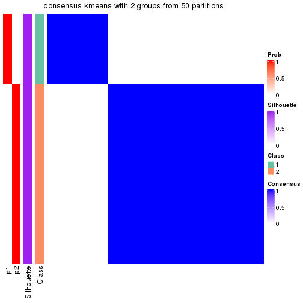</p>

</div>
<div id='tab-node-0112-consensus-heatmap-2'>
<pre><code class="r">consensus_heatmap(res, k = 3)
</code></pre>

<p>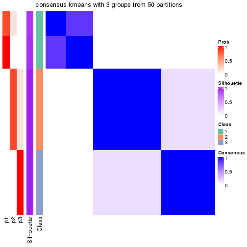</p>

</div>
<div id='tab-node-0112-consensus-heatmap-3'>
<pre><code class="r">consensus_heatmap(res, k = 4)
</code></pre>

<p>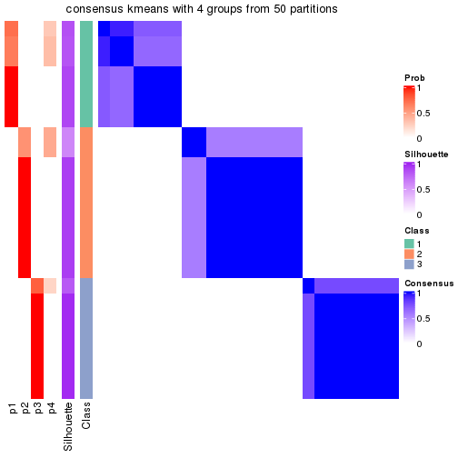</p>

</div>
<div id='tab-node-0112-consensus-heatmap-4'>
<pre><code class="r">consensus_heatmap(res, k = 5)
</code></pre>

<p>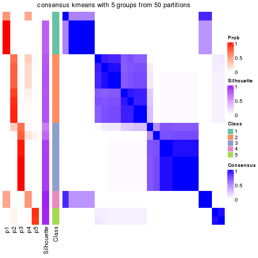</p>

</div>
<div id='tab-node-0112-consensus-heatmap-5'>
<pre><code class="r">consensus_heatmap(res, k = 6)
</code></pre>

<p>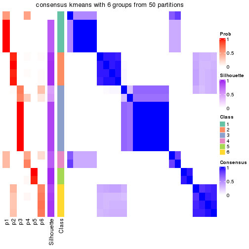</p>

</div>
<div id='tab-node-0112-consensus-heatmap-6'>
<pre><code class="r">consensus_heatmap(res, k = 7)
</code></pre>

<p>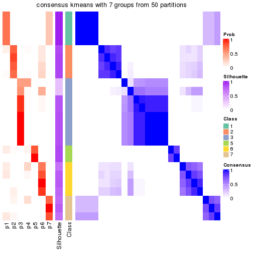</p>

</div>
<div id='tab-node-0112-consensus-heatmap-7'>
<pre><code class="r">consensus_heatmap(res, k = 8)
</code></pre>

<p>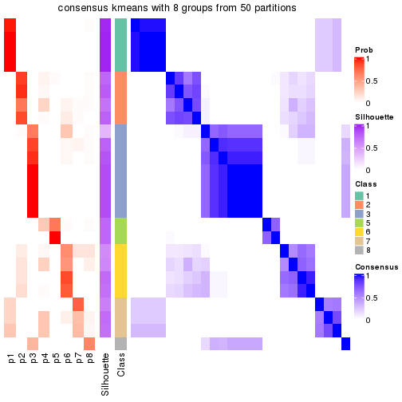</p>

</div>
</div>

Heatmaps for the membership of samples in all partitions to see how consistent they are:


<script>
$( function() {
	$( '#tabs-node-0112-membership-heatmap' ).tabs();
} );
</script>
<div id='tabs-node-0112-membership-heatmap'>
<ul>
<li><a href='#tab-node-0112-membership-heatmap-1'>k = 2</a></li>
<li><a href='#tab-node-0112-membership-heatmap-2'>k = 3</a></li>
<li><a href='#tab-node-0112-membership-heatmap-3'>k = 4</a></li>
<li><a href='#tab-node-0112-membership-heatmap-4'>k = 5</a></li>
<li><a href='#tab-node-0112-membership-heatmap-5'>k = 6</a></li>
<li><a href='#tab-node-0112-membership-heatmap-6'>k = 7</a></li>
<li><a href='#tab-node-0112-membership-heatmap-7'>k = 8</a></li>
</ul>
<div id='tab-node-0112-membership-heatmap-1'>
<pre><code class="r">membership_heatmap(res, k = 2)
</code></pre>

<p>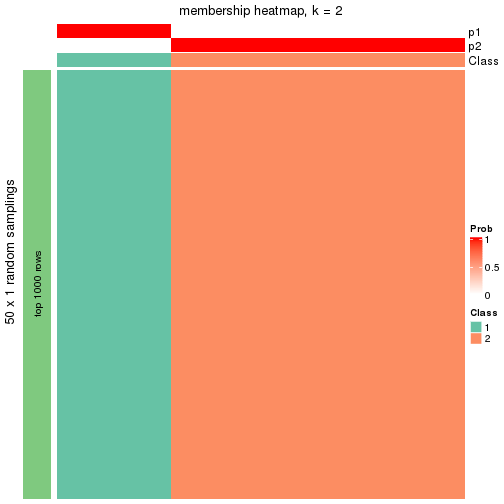</p>

</div>
<div id='tab-node-0112-membership-heatmap-2'>
<pre><code class="r">membership_heatmap(res, k = 3)
</code></pre>

<p>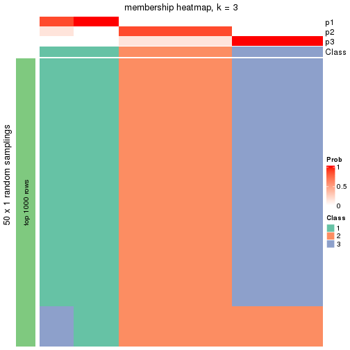</p>

</div>
<div id='tab-node-0112-membership-heatmap-3'>
<pre><code class="r">membership_heatmap(res, k = 4)
</code></pre>

<p>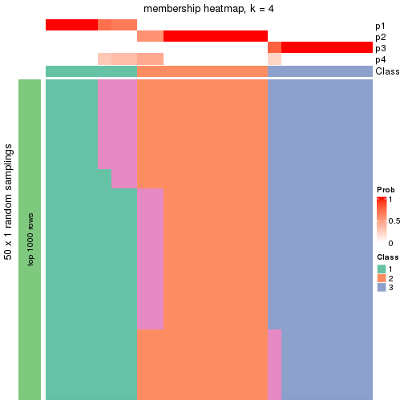</p>

</div>
<div id='tab-node-0112-membership-heatmap-4'>
<pre><code class="r">membership_heatmap(res, k = 5)
</code></pre>

<p>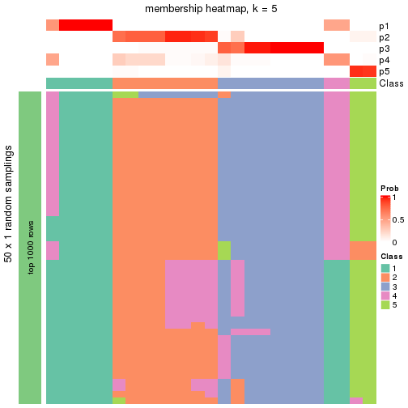</p>

</div>
<div id='tab-node-0112-membership-heatmap-5'>
<pre><code class="r">membership_heatmap(res, k = 6)
</code></pre>

<p>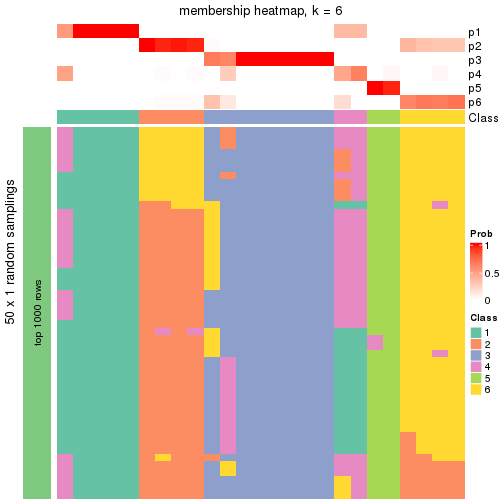</p>

</div>
<div id='tab-node-0112-membership-heatmap-6'>
<pre><code class="r">membership_heatmap(res, k = 7)
</code></pre>

<p>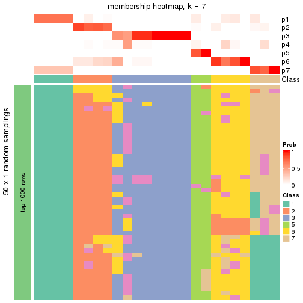</p>

</div>
<div id='tab-node-0112-membership-heatmap-7'>
<pre><code class="r">membership_heatmap(res, k = 8)
</code></pre>

<p>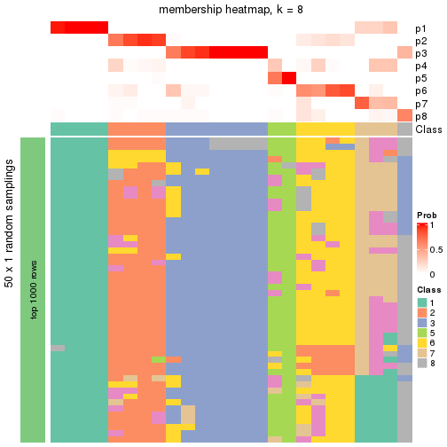</p>

</div>
</div>

As soon as the classes for columns are determined, the signatures
that are significantly different between subgroups can be looked for. 
Following are the heatmaps for signatures.


<script>
$( function() {
	$( '#tabs-node-0112-get-signatures' ).tabs();
} );
</script>
<div id='tabs-node-0112-get-signatures'>
<ul>
<li><a href='#tab-node-0112-get-signatures-1'>k = 2</a></li>
<li><a href='#tab-node-0112-get-signatures-2'>k = 3</a></li>
<li><a href='#tab-node-0112-get-signatures-3'>k = 4</a></li>
<li><a href='#tab-node-0112-get-signatures-4'>k = 5</a></li>
<li><a href='#tab-node-0112-get-signatures-5'>k = 6</a></li>
<li><a href='#tab-node-0112-get-signatures-6'>k = 7</a></li>
<li><a href='#tab-node-0112-get-signatures-7'>k = 8</a></li>
</ul>
<div id='tab-node-0112-get-signatures-1'>
<pre><code class="r">get_signatures(res, k = 2)
</code></pre>

<p>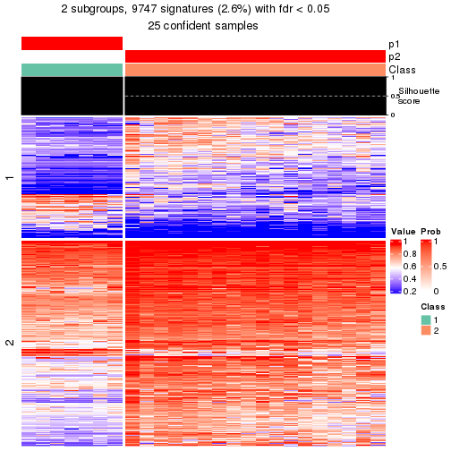</p>

</div>
<div id='tab-node-0112-get-signatures-2'>
<pre><code class="r">get_signatures(res, k = 3)
</code></pre>

<p>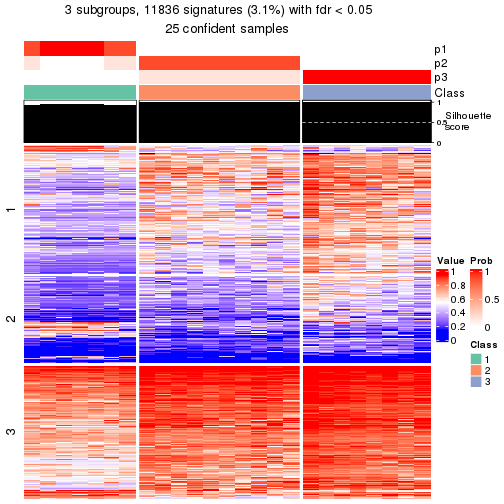</p>

</div>
<div id='tab-node-0112-get-signatures-3'>
<pre><code class="r">get_signatures(res, k = 4)
</code></pre>

<p>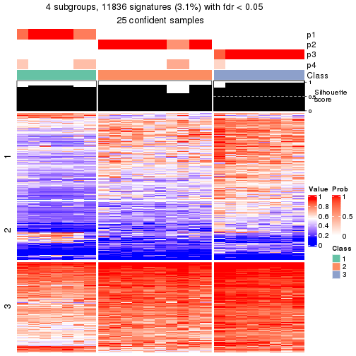</p>

</div>
<div id='tab-node-0112-get-signatures-4'>
<pre><code class="r">get_signatures(res, k = 5)
</code></pre>

<p>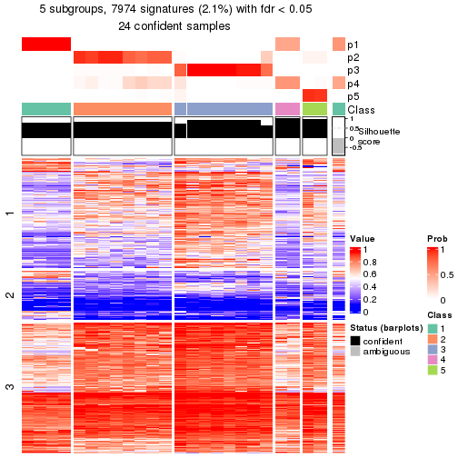</p>

</div>
<div id='tab-node-0112-get-signatures-5'>
<pre><code class="r">get_signatures(res, k = 6)
</code></pre>

<p>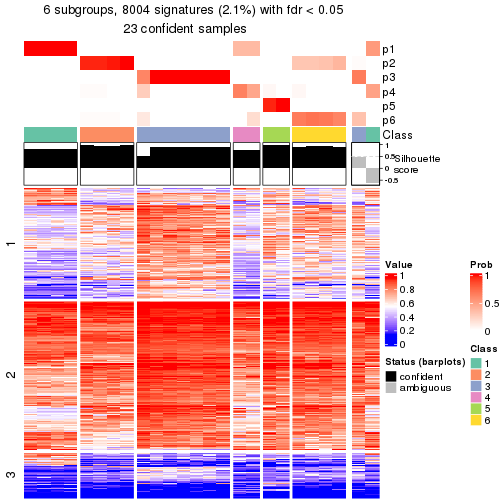</p>

</div>
<div id='tab-node-0112-get-signatures-6'>
<pre><code class="r">get_signatures(res, k = 7)
</code></pre>

<p>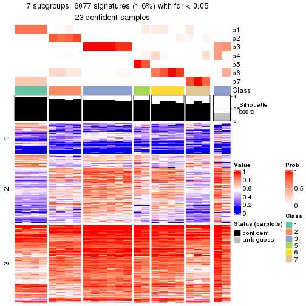</p>

</div>
<div id='tab-node-0112-get-signatures-7'>
<pre><code class="r">get_signatures(res, k = 8)
</code></pre>

<p>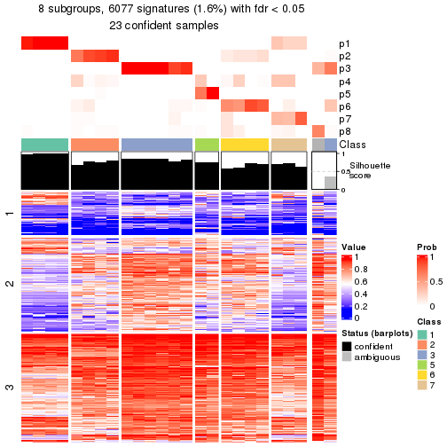</p>

</div>
</div>


Compare the overlap of signatures from different k:

```r
compare_signatures(res)
```

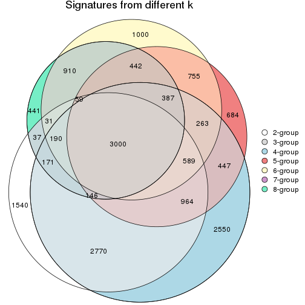

`get_signature()` returns a data frame invisibly. To get the list of signatures, the function
call should be assigned to a variable explicitly. In following code, if `plot` argument is set
to `FALSE`, no heatmap is plotted while only the differential analysis is performed.

```r
# code only for demonstration
tb = get_signature(res, k = ..., plot = FALSE)
```

An example of the output of `tb` is:

```
#>   which_row         fdr    mean_1    mean_2 scaled_mean_1 scaled_mean_2 km
#> 1        38 0.042760348  8.373488  9.131774    -0.5533452     0.5164555  1
#> 2        40 0.018707592  7.106213  8.469186    -0.6173731     0.5762149  1
#> 3        55 0.019134737 10.221463 11.207825    -0.6159697     0.5749050  1
#> 4        59 0.006059896  5.921854  7.869574    -0.6899429     0.6439467  1
#> 5        60 0.018055526  8.928898 10.211722    -0.6204761     0.5791110  1
#> 6        98 0.009384629 15.714769 14.887706     0.6635654    -0.6193277  2
...
```

The columns in `tb` are:

1. `which_row`: row indices corresponding to the input matrix.
2. `fdr`: FDR for the differential test. 
3. `mean_x`: The mean value in group x.
4. `scaled_mean_x`: The mean value in group x after rows are scaled.
5. `km`: Row groups if k-means clustering is applied to rows (which is done by automatically selecting number of clusters).

If there are too many signatures, `top_signatures = ...` can be set to only show the 
signatures with the highest FDRs:

```r
# code only for demonstration
# e.g. to show the top 500 most significant rows
tb = get_signature(res, k = ..., top_signatures = 500)
```

If the signatures are defined as these which are uniquely high in current group, `diff_method` argument
can be set to `"uniquely_high_in_one_group"`:

```r
# code only for demonstration
tb = get_signature(res, k = ..., diff_method = "uniquely_high_in_one_group")
```


UMAP plot which shows how samples are separated.


<script>
$( function() {
	$( '#tabs-node-0112-dimension-reduction' ).tabs();
} );
</script>
<div id='tabs-node-0112-dimension-reduction'>
<ul>
<li><a href='#tab-node-0112-dimension-reduction-1'>k = 2</a></li>
<li><a href='#tab-node-0112-dimension-reduction-2'>k = 3</a></li>
<li><a href='#tab-node-0112-dimension-reduction-3'>k = 4</a></li>
<li><a href='#tab-node-0112-dimension-reduction-4'>k = 5</a></li>
<li><a href='#tab-node-0112-dimension-reduction-5'>k = 6</a></li>
<li><a href='#tab-node-0112-dimension-reduction-6'>k = 7</a></li>
<li><a href='#tab-node-0112-dimension-reduction-7'>k = 8</a></li>
</ul>
<div id='tab-node-0112-dimension-reduction-1'>
<pre><code class="r">dimension_reduction(res, k = 2, method = &quot;UMAP&quot;)
</code></pre>

<p>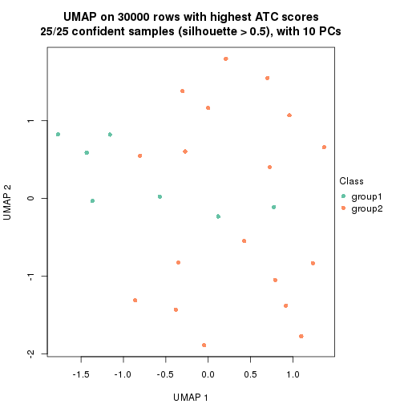</p>

</div>
<div id='tab-node-0112-dimension-reduction-2'>
<pre><code class="r">dimension_reduction(res, k = 3, method = &quot;UMAP&quot;)
</code></pre>

<p>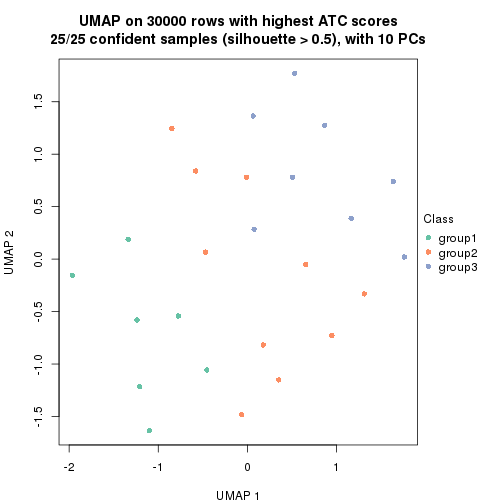</p>

</div>
<div id='tab-node-0112-dimension-reduction-3'>
<pre><code class="r">dimension_reduction(res, k = 4, method = &quot;UMAP&quot;)
</code></pre>

<p>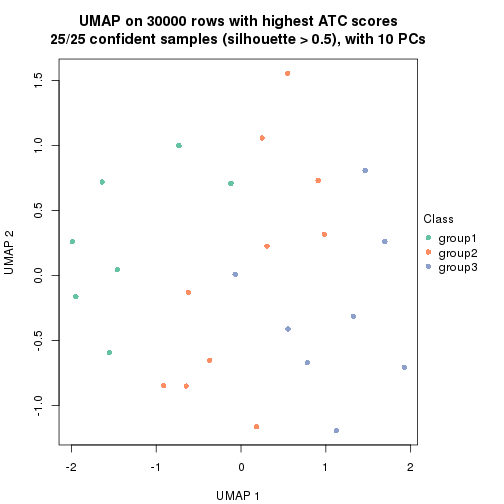</p>

</div>
<div id='tab-node-0112-dimension-reduction-4'>
<pre><code class="r">dimension_reduction(res, k = 5, method = &quot;UMAP&quot;)
</code></pre>

<p>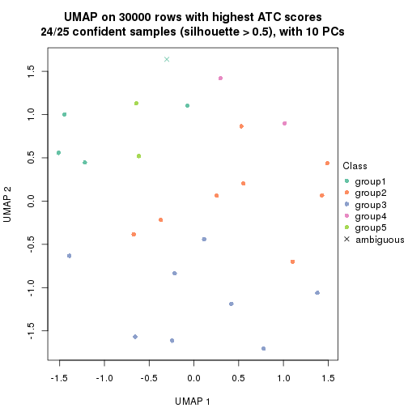</p>

</div>
<div id='tab-node-0112-dimension-reduction-5'>
<pre><code class="r">dimension_reduction(res, k = 6, method = &quot;UMAP&quot;)
</code></pre>

<p>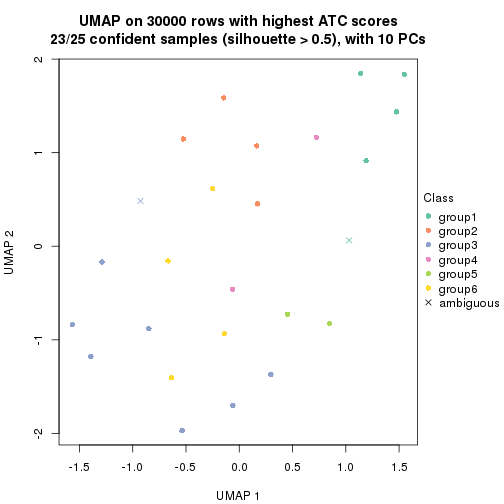</p>

</div>
<div id='tab-node-0112-dimension-reduction-6'>
<pre><code class="r">dimension_reduction(res, k = 7, method = &quot;UMAP&quot;)
</code></pre>

<p>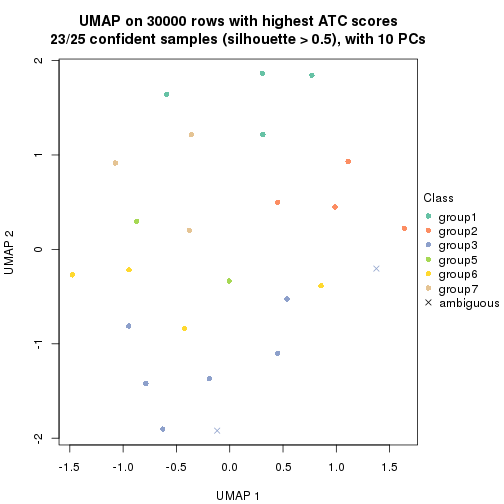</p>

</div>
<div id='tab-node-0112-dimension-reduction-7'>
<pre><code class="r">dimension_reduction(res, k = 8, method = &quot;UMAP&quot;)
</code></pre>

<p>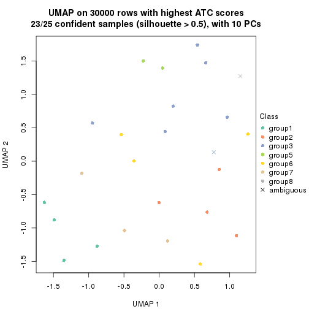</p>

</div>
</div>


Following heatmap shows how subgroups are split when increasing `k`:

```r
collect_classes(res)
```

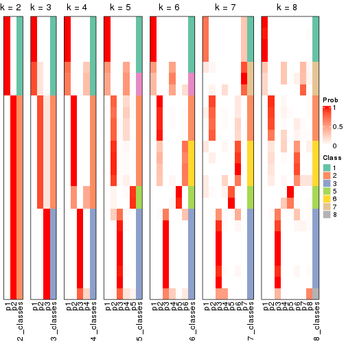


If matrix rows can be associated to genes, consider to use `functional_enrichment(res,
...)` to perform function enrichment for the signature genes. See [this vignette](https://jokergoo.github.io/cola_vignettes/functional_enrichment.html) for more detailed explanations.


 

---------------------------------------------------


### Node0113


Parent node: [Node011](#Node011).
Child nodes: 
                Node01111-leaf
        ,
                Node01112-leaf
        ,
                Node01113-leaf
        ,
                Node01121-leaf
        ,
                Node01122-leaf
        ,
                Node01123-leaf
        ,
                Node01131-leaf
        ,
                [Node01132](#Node01132)
        ,
                Node01211-leaf
        ,
                Node01212-leaf
        ,
                Node01213-leaf
        ,
                Node01214-leaf
        ,
                Node01411-leaf
        ,
                Node01412-leaf
        ,
                Node01413-leaf
        ,
                Node01414-leaf
        ,
                Node02311-leaf
        ,
                Node02312-leaf
        ,
                Node02313-leaf
        .


The object with results only for a single top-value method and a single partitioning method 
can be extracted as:

```r
res = res_rh["0113"]
```

A summary of `res` and all the functions that can be applied to it:

```r
res
```

```
#> A 'ConsensusPartition' object with k = 2, 3, 4, 5, 6, 7, 8.
#>   On a matrix with 30000 rows and 39 columns.
#>   Top rows (1000) are extracted by 'ATC' method.
#>   Subgroups are detected by 'kmeans' method.
#>   Performed in total 350 partitions by row resampling.
#>   Best k for subgroups seems to be 2.
#> 
#> Following methods can be applied to this 'ConsensusPartition' object:
#>  [1] "cola_report"             "collect_classes"         "collect_plots"          
#>  [4] "collect_stats"           "colnames"                "compare_partitions"     
#>  [7] "compare_signatures"      "consensus_heatmap"       "dimension_reduction"    
#> [10] "functional_enrichment"   "get_anno_col"            "get_anno"               
#> [13] "get_classes"             "get_consensus"           "get_matrix"             
#> [16] "get_membership"          "get_param"               "get_signatures"         
#> [19] "get_stats"               "is_best_k"               "is_stable_k"            
#> [22] "membership_heatmap"      "ncol"                    "nrow"                   
#> [25] "plot_ecdf"               "predict_classes"         "rownames"               
#> [28] "select_partition_number" "show"                    "suggest_best_k"         
#> [31] "test_to_known_factors"   "top_rows_heatmap"
```

`collect_plots()` function collects all the plots made from `res` for all `k` (number of subgroups)
into one single page to provide an easy and fast comparison between different `k`.

```r
collect_plots(res)
```

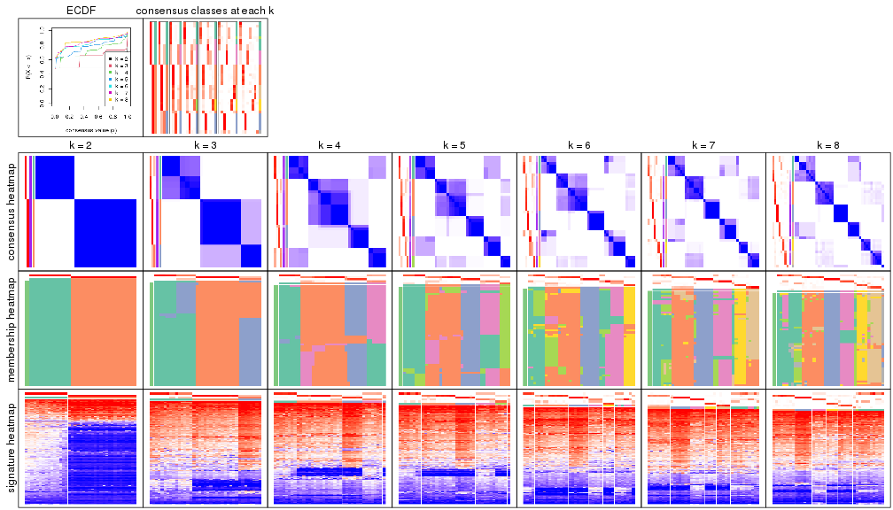

The plots are:

- The first row: a plot of the eCDF (empirical cumulative distribution
  function) curves of the consensus matrix for each `k` and the heatmap of
  predicted classes for each `k`.
- The second row: heatmaps of the consensus matrix for each `k`.
- The third row: heatmaps of the membership matrix for each `k`.
- The fouth row: heatmaps of the signatures for each `k`.

All the plots in panels can be made by individual functions and they are
plotted later in this section.

`select_partition_number()` produces several plots showing different
statistics for choosing "optimized" `k`. There are following statistics:

- eCDF curves of the consensus matrix for each `k`;
- 1-PAC. [The PAC score](https://en.wikipedia.org/wiki/Consensus_clustering#Over-interpretation_potential_of_consensus_clustering)
  measures the proportion of the ambiguous subgrouping.
- Mean silhouette score.
- Concordance. The mean probability of fiting the consensus subgroup labels in all
  partitions.
- Area increased. Denote $A_k$ as the area under the eCDF curve for current
  `k`, the area increased is defined as $A_k - A_{k-1}$.
- Rand index. The percent of pairs of samples that are both in a same cluster
  or both are not in a same cluster in the partition of k and k-1.
- Jaccard index. The ratio of pairs of samples are both in a same cluster in
  the partition of k and k-1 and the pairs of samples are both in a same
  cluster in the partition k or k-1.

The detailed explanations of these statistics can be found in [the _cola_
vignette](https://jokergoo.github.io/cola_vignettes/cola.html#toc_13).

Generally speaking, higher 1-PAC score, higher mean silhouette score or higher
concordance corresponds to better partition. Rand index and Jaccard index
measure how similar the current partition is compared to partition with `k-1`.
If they are too similar, we won't accept `k` is better than `k-1`.

```r
select_partition_number(res)
```

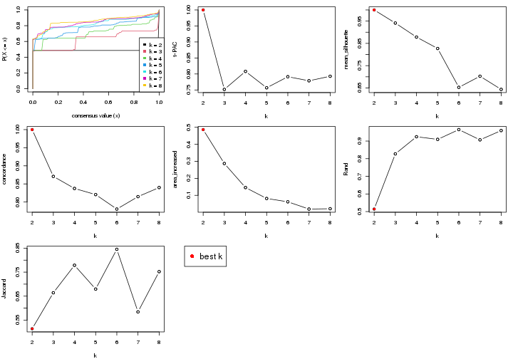

The numeric values for all these statistics can be obtained by `get_stats()`.

```r
get_stats(res)
```

```
#>   k 1-PAC mean_silhouette concordance area_increased  Rand Jaccard
#> 2 2 1.000           1.000       1.000         0.4863 0.514   0.514
#> 3 3 0.752           0.941       0.871         0.2871 0.827   0.664
#> 4 4 0.808           0.878       0.837         0.1458 0.924   0.779
#> 5 5 0.757           0.827       0.821         0.0815 0.910   0.679
#> 6 6 0.791           0.653       0.781         0.0620 0.965   0.845
#> 7 7 0.779           0.703       0.815         0.0193 0.907   0.584
#> 8 8 0.793           0.643       0.840         0.0214 0.960   0.752
```

`suggest_best_k()` suggests the best $k$ based on these statistics. The rules are as follows:

- All $k$ with Jaccard index larger than 0.95 are removed because increasing
  $k$ does not provide enough extra information. If all $k$ are removed, it is
  marked as no subgroup is detected.
- For all $k$ with 1-PAC score larger than 0.9, the maximal $k$ is taken as
  the best $k$, and other $k$ are marked as optional $k$.
- If it does not fit the second rule. The $k$ with the maximal vote of the
  highest 1-PAC score, highest mean silhouette, and highest concordance is
  taken as the best $k$.

```r
suggest_best_k(res)
```

```
#> [1] 2
```


Following is the table of the partitions (You need to click the **show/hide
code output** link to see it). The membership matrix (columns with name `p*`)
is inferred by
[`clue::cl_consensus()`](https://www.rdocumentation.org/link/cl_consensus?package=clue)
function with the `SE` method. Basically the value in the membership matrix
represents the probability to belong to a certain group. The finall subgroup
label for an item is determined with the group with highest probability it
belongs to.

In `get_classes()` function, the entropy is calculated from the membership
matrix and the silhouette score is calculated from the consensus matrix.


<script>
$( function() {
	$( '#tabs-node-0113-get-classes' ).tabs();
} );
</script>
<div id='tabs-node-0113-get-classes'>
<ul>
<li><a href='#tab-node-0113-get-classes-1'>k = 2</a></li>
<li><a href='#tab-node-0113-get-classes-2'>k = 3</a></li>
<li><a href='#tab-node-0113-get-classes-3'>k = 4</a></li>
<li><a href='#tab-node-0113-get-classes-4'>k = 5</a></li>
<li><a href='#tab-node-0113-get-classes-5'>k = 6</a></li>
<li><a href='#tab-node-0113-get-classes-6'>k = 7</a></li>
<li><a href='#tab-node-0113-get-classes-7'>k = 8</a></li>
</ul>

<div id='tab-node-0113-get-classes-1'>
<p><a id='tab-node-0113-get-classes-1-a' style='color:#0366d6' href='#'>show/hide code output</a></p>
<pre><code class="r">cbind(get_classes(res, k = 2), get_membership(res, k = 2))
</code></pre>

<pre><code>#&gt;                 class entropy silhouette p1 p2
#&gt; TCGA.G4.6306.01     2       0          1  0  1
#&gt; TCGA.D5.6535.01     1       0          1  1  0
#&gt; TCGA.F4.6855.01     1       0          1  1  0
#&gt; TCGA.NH.A6GA.01     2       0          1  0  1
#&gt; TCGA.DM.A288.01     2       0          1  0  1
#&gt; TCGA.AD.6548.01     1       0          1  1  0
#&gt; TCGA.G4.6293.01     1       0          1  1  0
#&gt; TCGA.CK.6747.01     1       0          1  1  0
#&gt; TCGA.QL.A97D.01     1       0          1  1  0
#&gt; TCGA.CM.6166.01     1       0          1  1  0
#&gt; TCGA.AD.A5EK.01     2       0          1  0  1
#&gt; TCGA.G4.6298.01     2       0          1  0  1
#&gt; TCGA.CK.5915.01     2       0          1  0  1
#&gt; TCGA.D5.5539.01     2       0          1  0  1
#&gt; TCGA.AA.3495.01     2       0          1  0  1
#&gt; TCGA.CK.4947.01     1       0          1  1  0
#&gt; TCGA.G4.6297.01     1       0          1  1  0
#&gt; TCGA.AD.6899.01     2       0          1  0  1
#&gt; TCGA.CM.5348.01     2       0          1  0  1
#&gt; TCGA.F4.6463.01     2       0          1  0  1
#&gt; TCGA.CA.6719.01     2       0          1  0  1
#&gt; TCGA.AZ.4315.01     2       0          1  0  1
#&gt; TCGA.D5.5537.01     2       0          1  0  1
#&gt; TCGA.NH.A8F8.01     2       0          1  0  1
#&gt; TCGA.5M.AAT4.01     2       0          1  0  1
#&gt; TCGA.CK.5914.01     2       0          1  0  1
#&gt; TCGA.CM.6677.01     1       0          1  1  0
#&gt; TCGA.D5.5540.01     2       0          1  0  1
#&gt; TCGA.DM.A282.01     1       0          1  1  0
#&gt; TCGA.D5.6541.01     2       0          1  0  1
#&gt; TCGA.AD.6901.01     2       0          1  0  1
#&gt; TCGA.AA.3496.01     1       0          1  1  0
#&gt; TCGA.DM.A28A.01     2       0          1  0  1
#&gt; TCGA.QG.A5Z1.01     2       0          1  0  1
#&gt; TCGA.AA.3660.01     1       0          1  1  0
#&gt; TCGA.CM.4747.01     2       0          1  0  1
#&gt; TCGA.DM.A28H.01     2       0          1  0  1
#&gt; TCGA.A6.2681.01     1       0          1  1  0
#&gt; TCGA.A6.2679.01     1       0          1  1  0
</code></pre>

<script>
$('#tab-node-0113-get-classes-1-a').parent().next().next().hide();
$('#tab-node-0113-get-classes-1-a').click(function(){
  $('#tab-node-0113-get-classes-1-a').parent().next().next().toggle();
  return(false);
});
</script>
</div>

<div id='tab-node-0113-get-classes-2'>
<p><a id='tab-node-0113-get-classes-2-a' style='color:#0366d6' href='#'>show/hide code output</a></p>
<pre><code class="r">cbind(get_classes(res, k = 3), get_membership(res, k = 3))
</code></pre>

<pre><code>#&gt;                 class entropy silhouette   p1   p2   p3
#&gt; TCGA.G4.6306.01     2  0.0000      0.998 0.00 1.00 0.00
#&gt; TCGA.D5.6535.01     1  0.5706      0.845 0.68 0.00 0.32
#&gt; TCGA.F4.6855.01     1  0.0000      0.859 1.00 0.00 0.00
#&gt; TCGA.NH.A6GA.01     2  0.0000      0.998 0.00 1.00 0.00
#&gt; TCGA.DM.A288.01     2  0.0000      0.998 0.00 1.00 0.00
#&gt; TCGA.AD.6548.01     1  0.5706      0.845 0.68 0.00 0.32
#&gt; TCGA.G4.6293.01     1  0.5706      0.845 0.68 0.00 0.32
#&gt; TCGA.CK.6747.01     1  0.0892      0.861 0.98 0.00 0.02
#&gt; TCGA.QL.A97D.01     1  0.0892      0.861 0.98 0.00 0.02
#&gt; TCGA.CM.6166.01     1  0.0892      0.854 0.98 0.00 0.02
#&gt; TCGA.AD.A5EK.01     3  0.5835      1.000 0.00 0.34 0.66
#&gt; TCGA.G4.6298.01     2  0.0000      0.998 0.00 1.00 0.00
#&gt; TCGA.CK.5915.01     3  0.5835      1.000 0.00 0.34 0.66
#&gt; TCGA.D5.5539.01     2  0.0000      0.998 0.00 1.00 0.00
#&gt; TCGA.AA.3495.01     2  0.0000      0.998 0.00 1.00 0.00
#&gt; TCGA.CK.4947.01     1  0.5706      0.845 0.68 0.00 0.32
#&gt; TCGA.G4.6297.01     1  0.5706      0.845 0.68 0.00 0.32
#&gt; TCGA.AD.6899.01     2  0.0000      0.998 0.00 1.00 0.00
#&gt; TCGA.CM.5348.01     2  0.0892      0.965 0.00 0.98 0.02
#&gt; TCGA.F4.6463.01     2  0.0000      0.998 0.00 1.00 0.00
#&gt; TCGA.CA.6719.01     2  0.0000      0.998 0.00 1.00 0.00
#&gt; TCGA.AZ.4315.01     2  0.0000      0.998 0.00 1.00 0.00
#&gt; TCGA.D5.5537.01     3  0.5835      1.000 0.00 0.34 0.66
#&gt; TCGA.NH.A8F8.01     2  0.0000      0.998 0.00 1.00 0.00
#&gt; TCGA.5M.AAT4.01     2  0.0000      0.998 0.00 1.00 0.00
#&gt; TCGA.CK.5914.01     3  0.5835      1.000 0.00 0.34 0.66
#&gt; TCGA.CM.6677.01     1  0.5706      0.845 0.68 0.00 0.32
#&gt; TCGA.D5.5540.01     3  0.5835      1.000 0.00 0.34 0.66
#&gt; TCGA.DM.A282.01     1  0.0892      0.854 0.98 0.00 0.02
#&gt; TCGA.D5.6541.01     2  0.0000      0.998 0.00 1.00 0.00
#&gt; TCGA.AD.6901.01     2  0.0000      0.998 0.00 1.00 0.00
#&gt; TCGA.AA.3496.01     1  0.0892      0.854 0.98 0.00 0.02
#&gt; TCGA.DM.A28A.01     3  0.5835      1.000 0.00 0.34 0.66
#&gt; TCGA.QG.A5Z1.01     3  0.5835      1.000 0.00 0.34 0.66
#&gt; TCGA.AA.3660.01     1  0.0892      0.854 0.98 0.00 0.02
#&gt; TCGA.CM.4747.01     2  0.0000      0.998 0.00 1.00 0.00
#&gt; TCGA.DM.A28H.01     3  0.5835      1.000 0.00 0.34 0.66
#&gt; TCGA.A6.2681.01     1  0.5706      0.845 0.68 0.00 0.32
#&gt; TCGA.A6.2679.01     1  0.0000      0.859 1.00 0.00 0.00
</code></pre>

<script>
$('#tab-node-0113-get-classes-2-a').parent().next().next().hide();
$('#tab-node-0113-get-classes-2-a').click(function(){
  $('#tab-node-0113-get-classes-2-a').parent().next().next().toggle();
  return(false);
});
</script>
</div>

<div id='tab-node-0113-get-classes-3'>
<p><a id='tab-node-0113-get-classes-3-a' style='color:#0366d6' href='#'>show/hide code output</a></p>
<pre><code class="r">cbind(get_classes(res, k = 4), get_membership(res, k = 4))
</code></pre>

<pre><code>#&gt;                 class entropy silhouette   p1   p2   p3   p4
#&gt; TCGA.G4.6306.01     2  0.2011      0.855 0.00 0.92 0.00 0.08
#&gt; TCGA.D5.6535.01     4  0.4977      0.945 0.46 0.00 0.00 0.54
#&gt; TCGA.F4.6855.01     1  0.0707      0.930 0.98 0.00 0.00 0.02
#&gt; TCGA.NH.A6GA.01     2  0.3801      0.804 0.00 0.78 0.00 0.22
#&gt; TCGA.DM.A288.01     2  0.2011      0.855 0.00 0.92 0.00 0.08
#&gt; TCGA.AD.6548.01     4  0.4907      0.979 0.42 0.00 0.00 0.58
#&gt; TCGA.G4.6293.01     4  0.4907      0.979 0.42 0.00 0.00 0.58
#&gt; TCGA.CK.6747.01     1  0.1913      0.909 0.94 0.00 0.04 0.02
#&gt; TCGA.QL.A97D.01     1  0.1913      0.909 0.94 0.00 0.04 0.02
#&gt; TCGA.CM.6166.01     1  0.1211      0.938 0.96 0.00 0.04 0.00
#&gt; TCGA.AD.A5EK.01     3  0.2011      0.937 0.00 0.08 0.92 0.00
#&gt; TCGA.G4.6298.01     2  0.0000      0.872 0.00 1.00 0.00 0.00
#&gt; TCGA.CK.5915.01     3  0.2011      0.937 0.00 0.08 0.92 0.00
#&gt; TCGA.D5.5539.01     2  0.4713      0.689 0.00 0.64 0.00 0.36
#&gt; TCGA.AA.3495.01     2  0.0000      0.872 0.00 1.00 0.00 0.00
#&gt; TCGA.CK.4947.01     4  0.4907      0.979 0.42 0.00 0.00 0.58
#&gt; TCGA.G4.6297.01     4  0.4907      0.979 0.42 0.00 0.00 0.58
#&gt; TCGA.AD.6899.01     2  0.0000      0.872 0.00 1.00 0.00 0.00
#&gt; TCGA.CM.5348.01     2  0.4713      0.689 0.00 0.64 0.00 0.36
#&gt; TCGA.F4.6463.01     2  0.4624      0.691 0.00 0.66 0.00 0.34
#&gt; TCGA.CA.6719.01     2  0.2011      0.855 0.00 0.92 0.00 0.08
#&gt; TCGA.AZ.4315.01     2  0.0000      0.872 0.00 1.00 0.00 0.00
#&gt; TCGA.D5.5537.01     3  0.4948      0.425 0.00 0.44 0.56 0.00
#&gt; TCGA.NH.A8F8.01     2  0.0000      0.872 0.00 1.00 0.00 0.00
#&gt; TCGA.5M.AAT4.01     2  0.2011      0.855 0.00 0.92 0.00 0.08
#&gt; TCGA.CK.5914.01     3  0.2011      0.937 0.00 0.08 0.92 0.00
#&gt; TCGA.CM.6677.01     4  0.4907      0.979 0.42 0.00 0.00 0.58
#&gt; TCGA.D5.5540.01     3  0.2011      0.937 0.00 0.08 0.92 0.00
#&gt; TCGA.DM.A282.01     1  0.1211      0.938 0.96 0.00 0.04 0.00
#&gt; TCGA.D5.6541.01     2  0.4713      0.689 0.00 0.64 0.00 0.36
#&gt; TCGA.AD.6901.01     2  0.0000      0.872 0.00 1.00 0.00 0.00
#&gt; TCGA.AA.3496.01     1  0.1211      0.938 0.96 0.00 0.04 0.00
#&gt; TCGA.DM.A28A.01     3  0.2011      0.937 0.00 0.08 0.92 0.00
#&gt; TCGA.QG.A5Z1.01     3  0.2011      0.937 0.00 0.08 0.92 0.00
#&gt; TCGA.AA.3660.01     1  0.1211      0.938 0.96 0.00 0.04 0.00
#&gt; TCGA.CM.4747.01     2  0.0000      0.872 0.00 1.00 0.00 0.00
#&gt; TCGA.DM.A28H.01     3  0.2647      0.907 0.00 0.12 0.88 0.00
#&gt; TCGA.A6.2681.01     4  0.4977      0.945 0.46 0.00 0.00 0.54
#&gt; TCGA.A6.2679.01     1  0.0707      0.930 0.98 0.00 0.00 0.02
</code></pre>

<script>
$('#tab-node-0113-get-classes-3-a').parent().next().next().hide();
$('#tab-node-0113-get-classes-3-a').click(function(){
  $('#tab-node-0113-get-classes-3-a').parent().next().next().toggle();
  return(false);
});
</script>
</div>

<div id='tab-node-0113-get-classes-4'>
<p><a id='tab-node-0113-get-classes-4-a' style='color:#0366d6' href='#'>show/hide code output</a></p>
<pre><code class="r">cbind(get_classes(res, k = 5), get_membership(res, k = 5))
</code></pre>

<pre><code>#&gt;                 class entropy silhouette   p1   p2   p3   p4   p5
#&gt; TCGA.G4.6306.01     2  0.4854      0.666 0.00 0.68 0.00 0.26 0.06
#&gt; TCGA.D5.6535.01     4  0.6422      0.737 0.36 0.00 0.00 0.46 0.18
#&gt; TCGA.F4.6855.01     1  0.2929      0.840 0.82 0.00 0.00 0.00 0.18
#&gt; TCGA.NH.A6GA.01     2  0.6458      0.354 0.00 0.50 0.00 0.26 0.24
#&gt; TCGA.DM.A288.01     2  0.4967      0.664 0.00 0.66 0.00 0.28 0.06
#&gt; TCGA.AD.6548.01     4  0.4060      0.910 0.36 0.00 0.00 0.64 0.00
#&gt; TCGA.G4.6293.01     4  0.4060      0.910 0.36 0.00 0.00 0.64 0.00
#&gt; TCGA.CK.6747.01     1  0.3319      0.839 0.82 0.00 0.02 0.00 0.16
#&gt; TCGA.QL.A97D.01     1  0.2929      0.840 0.82 0.00 0.00 0.00 0.18
#&gt; TCGA.CM.6166.01     1  0.0000      0.852 1.00 0.00 0.00 0.00 0.00
#&gt; TCGA.AD.A5EK.01     3  0.0609      0.973 0.00 0.02 0.98 0.00 0.00
#&gt; TCGA.G4.6298.01     2  0.1043      0.748 0.00 0.96 0.00 0.04 0.00
#&gt; TCGA.CK.5915.01     3  0.0609      0.973 0.00 0.02 0.98 0.00 0.00
#&gt; TCGA.D5.5539.01     5  0.3424      0.990 0.00 0.24 0.00 0.00 0.76
#&gt; TCGA.AA.3495.01     2  0.1648      0.745 0.00 0.94 0.00 0.04 0.02
#&gt; TCGA.CK.4947.01     4  0.4060      0.910 0.36 0.00 0.00 0.64 0.00
#&gt; TCGA.G4.6297.01     4  0.4060      0.910 0.36 0.00 0.00 0.64 0.00
#&gt; TCGA.AD.6899.01     2  0.0609      0.762 0.00 0.98 0.00 0.02 0.00
#&gt; TCGA.CM.5348.01     5  0.3424      0.990 0.00 0.24 0.00 0.00 0.76
#&gt; TCGA.F4.6463.01     5  0.3561      0.968 0.00 0.26 0.00 0.00 0.74
#&gt; TCGA.CA.6719.01     2  0.4854      0.666 0.00 0.68 0.00 0.26 0.06
#&gt; TCGA.AZ.4315.01     2  0.0609      0.762 0.00 0.98 0.00 0.02 0.00
#&gt; TCGA.D5.5537.01     2  0.5005      0.532 0.00 0.72 0.20 0.06 0.02
#&gt; TCGA.NH.A8F8.01     2  0.0000      0.764 0.00 1.00 0.00 0.00 0.00
#&gt; TCGA.5M.AAT4.01     2  0.4854      0.666 0.00 0.68 0.00 0.26 0.06
#&gt; TCGA.CK.5914.01     3  0.0609      0.973 0.00 0.02 0.98 0.00 0.00
#&gt; TCGA.CM.6677.01     4  0.4060      0.910 0.36 0.00 0.00 0.64 0.00
#&gt; TCGA.D5.5540.01     3  0.0609      0.973 0.00 0.02 0.98 0.00 0.00
#&gt; TCGA.DM.A282.01     1  0.0000      0.852 1.00 0.00 0.00 0.00 0.00
#&gt; TCGA.D5.6541.01     5  0.3424      0.990 0.00 0.24 0.00 0.00 0.76
#&gt; TCGA.AD.6901.01     2  0.0000      0.764 0.00 1.00 0.00 0.00 0.00
#&gt; TCGA.AA.3496.01     1  0.0000      0.852 1.00 0.00 0.00 0.00 0.00
#&gt; TCGA.DM.A28A.01     3  0.0609      0.973 0.00 0.02 0.98 0.00 0.00
#&gt; TCGA.QG.A5Z1.01     3  0.1216      0.962 0.00 0.02 0.96 0.00 0.02
#&gt; TCGA.AA.3660.01     1  0.0000      0.852 1.00 0.00 0.00 0.00 0.00
#&gt; TCGA.CM.4747.01     2  0.0609      0.762 0.00 0.98 0.00 0.02 0.00
#&gt; TCGA.DM.A28H.01     3  0.4008      0.844 0.00 0.08 0.82 0.08 0.02
#&gt; TCGA.A6.2681.01     4  0.6422      0.737 0.36 0.00 0.00 0.46 0.18
#&gt; TCGA.A6.2679.01     1  0.2929      0.840 0.82 0.00 0.00 0.00 0.18
</code></pre>

<script>
$('#tab-node-0113-get-classes-4-a').parent().next().next().hide();
$('#tab-node-0113-get-classes-4-a').click(function(){
  $('#tab-node-0113-get-classes-4-a').parent().next().next().toggle();
  return(false);
});
</script>
</div>

<div id='tab-node-0113-get-classes-5'>
<p><a id='tab-node-0113-get-classes-5-a' style='color:#0366d6' href='#'>show/hide code output</a></p>
<pre><code class="r">cbind(get_classes(res, k = 6), get_membership(res, k = 6))
</code></pre>

<pre><code>#&gt;                 class entropy silhouette   p1   p2   p3   p4   p5   p6
#&gt; TCGA.G4.6306.01     2  0.5682      0.530 0.00 0.46 0.00 0.00 0.38 0.16
#&gt; TCGA.D5.6535.01     4  0.0000      0.443 0.00 0.00 0.00 1.00 0.00 0.00
#&gt; TCGA.F4.6855.01     1  0.3864      0.493 0.52 0.00 0.00 0.48 0.00 0.00
#&gt; TCGA.NH.A6GA.01     2  0.6016      0.413 0.00 0.38 0.00 0.00 0.38 0.24
#&gt; TCGA.DM.A288.01     2  0.5432      0.548 0.00 0.48 0.00 0.00 0.40 0.12
#&gt; TCGA.AD.6548.01     4  0.3756      0.649 0.00 0.00 0.00 0.60 0.40 0.00
#&gt; TCGA.G4.6293.01     4  0.3756      0.649 0.00 0.00 0.00 0.60 0.40 0.00
#&gt; TCGA.CK.6747.01     1  0.5115      0.474 0.48 0.00 0.00 0.46 0.04 0.02
#&gt; TCGA.QL.A97D.01     4  0.4651     -0.601 0.48 0.00 0.00 0.48 0.04 0.00
#&gt; TCGA.CM.6166.01     1  0.1556      0.782 0.92 0.00 0.00 0.08 0.00 0.00
#&gt; TCGA.AD.A5EK.01     3  0.0000      0.965 0.00 0.00 1.00 0.00 0.00 0.00
#&gt; TCGA.G4.6298.01     2  0.1556      0.657 0.00 0.92 0.00 0.00 0.08 0.00
#&gt; TCGA.CK.5915.01     3  0.0000      0.965 0.00 0.00 1.00 0.00 0.00 0.00
#&gt; TCGA.D5.5539.01     6  0.1556      0.981 0.00 0.08 0.00 0.00 0.00 0.92
#&gt; TCGA.AA.3495.01     2  0.1556      0.657 0.00 0.92 0.00 0.00 0.08 0.00
#&gt; TCGA.CK.4947.01     4  0.3756      0.649 0.00 0.00 0.00 0.60 0.40 0.00
#&gt; TCGA.G4.6297.01     4  0.3756      0.649 0.00 0.00 0.00 0.60 0.40 0.00
#&gt; TCGA.AD.6899.01     2  0.0937      0.708 0.00 0.96 0.00 0.00 0.00 0.04
#&gt; TCGA.CM.5348.01     6  0.1556      0.981 0.00 0.08 0.00 0.00 0.00 0.92
#&gt; TCGA.F4.6463.01     6  0.2048      0.941 0.00 0.12 0.00 0.00 0.00 0.88
#&gt; TCGA.CA.6719.01     2  0.5555      0.544 0.00 0.48 0.00 0.00 0.38 0.14
#&gt; TCGA.AZ.4315.01     2  0.1480      0.703 0.00 0.94 0.00 0.00 0.02 0.04
#&gt; TCGA.D5.5537.01     2  0.3073      0.608 0.00 0.84 0.08 0.00 0.08 0.00
#&gt; TCGA.NH.A8F8.01     2  0.1267      0.701 0.00 0.94 0.00 0.00 0.00 0.06
#&gt; TCGA.5M.AAT4.01     2  0.5682      0.530 0.00 0.46 0.00 0.00 0.38 0.16
#&gt; TCGA.CK.5914.01     3  0.0000      0.965 0.00 0.00 1.00 0.00 0.00 0.00
#&gt; TCGA.CM.6677.01     4  0.3756      0.649 0.00 0.00 0.00 0.60 0.40 0.00
#&gt; TCGA.D5.5540.01     3  0.0000      0.965 0.00 0.00 1.00 0.00 0.00 0.00
#&gt; TCGA.DM.A282.01     1  0.1556      0.782 0.92 0.00 0.00 0.08 0.00 0.00
#&gt; TCGA.D5.6541.01     6  0.1556      0.981 0.00 0.08 0.00 0.00 0.00 0.92
#&gt; TCGA.AD.6901.01     2  0.0937      0.708 0.00 0.96 0.00 0.00 0.00 0.04
#&gt; TCGA.AA.3496.01     1  0.3324      0.744 0.84 0.00 0.00 0.08 0.06 0.02
#&gt; TCGA.DM.A28A.01     3  0.0000      0.965 0.00 0.00 1.00 0.00 0.00 0.00
#&gt; TCGA.QG.A5Z1.01     3  0.0000      0.965 0.00 0.00 1.00 0.00 0.00 0.00
#&gt; TCGA.AA.3660.01     1  0.1556      0.782 0.92 0.00 0.00 0.08 0.00 0.00
#&gt; TCGA.CM.4747.01     2  0.0937      0.708 0.00 0.96 0.00 0.00 0.00 0.04
#&gt; TCGA.DM.A28H.01     3  0.4519      0.767 0.08 0.06 0.76 0.00 0.10 0.00
#&gt; TCGA.A6.2681.01     4  0.0000      0.443 0.00 0.00 0.00 1.00 0.00 0.00
#&gt; TCGA.A6.2679.01     4  0.4646     -0.586 0.46 0.00 0.00 0.50 0.04 0.00
</code></pre>

<script>
$('#tab-node-0113-get-classes-5-a').parent().next().next().hide();
$('#tab-node-0113-get-classes-5-a').click(function(){
  $('#tab-node-0113-get-classes-5-a').parent().next().next().toggle();
  return(false);
});
</script>
</div>

<div id='tab-node-0113-get-classes-6'>
<p><a id='tab-node-0113-get-classes-6-a' style='color:#0366d6' href='#'>show/hide code output</a></p>
<pre><code class="r">cbind(get_classes(res, k = 7), get_membership(res, k = 7))
</code></pre>

<pre><code>#&gt;                 class entropy silhouette   p1   p2   p3   p4   p5   p6   p7
#&gt; TCGA.G4.6306.01     7   0.000      0.929 0.00 0.00 0.00 0.00 0.00 0.00 1.00
#&gt; TCGA.D5.6535.01     4   0.391      0.453 0.40 0.02 0.00 0.58 0.00 0.00 0.00
#&gt; TCGA.F4.6855.01     1   0.208      0.458 0.86 0.00 0.00 0.14 0.00 0.00 0.00
#&gt; TCGA.NH.A6GA.01     7   0.166      0.864 0.00 0.00 0.00 0.00 0.02 0.06 0.92
#&gt; TCGA.DM.A288.01     7   0.286      0.830 0.04 0.04 0.00 0.00 0.06 0.00 0.86
#&gt; TCGA.AD.6548.01     4   0.000      0.832 0.00 0.00 0.00 1.00 0.00 0.00 0.00
#&gt; TCGA.G4.6293.01     4   0.000      0.832 0.00 0.00 0.00 1.00 0.00 0.00 0.00
#&gt; TCGA.CK.6747.01     1   0.451      0.414 0.70 0.14 0.00 0.14 0.00 0.02 0.00
#&gt; TCGA.QL.A97D.01     1   0.368      0.461 0.78 0.06 0.00 0.14 0.00 0.02 0.00
#&gt; TCGA.CM.6166.01     1   0.485     -0.287 0.50 0.00 0.00 0.10 0.40 0.00 0.00
#&gt; TCGA.AD.A5EK.01     3   0.000      0.933 0.00 0.00 1.00 0.00 0.00 0.00 0.00
#&gt; TCGA.G4.6298.01     2   0.369      0.891 0.00 0.66 0.00 0.00 0.02 0.00 0.32
#&gt; TCGA.CK.5915.01     3   0.000      0.933 0.00 0.00 1.00 0.00 0.00 0.00 0.00
#&gt; TCGA.D5.5539.01     6   0.136      0.969 0.00 0.02 0.00 0.00 0.00 0.94 0.04
#&gt; TCGA.AA.3495.01     2   0.369      0.891 0.00 0.66 0.00 0.00 0.02 0.00 0.32
#&gt; TCGA.CK.4947.01     4   0.000      0.832 0.00 0.00 0.00 1.00 0.00 0.00 0.00
#&gt; TCGA.G4.6297.01     4   0.000      0.832 0.00 0.00 0.00 1.00 0.00 0.00 0.00
#&gt; TCGA.AD.6899.01     2   0.329      0.899 0.00 0.66 0.00 0.00 0.00 0.00 0.34
#&gt; TCGA.CM.5348.01     6   0.300      0.905 0.06 0.02 0.00 0.00 0.04 0.86 0.02
#&gt; TCGA.F4.6463.01     6   0.136      0.969 0.00 0.02 0.00 0.00 0.00 0.94 0.04
#&gt; TCGA.CA.6719.01     7   0.000      0.929 0.00 0.00 0.00 0.00 0.00 0.00 1.00
#&gt; TCGA.AZ.4315.01     2   0.497      0.840 0.04 0.58 0.00 0.00 0.02 0.02 0.34
#&gt; TCGA.D5.5537.01     2   0.374      0.842 0.00 0.70 0.04 0.00 0.00 0.00 0.26
#&gt; TCGA.NH.A8F8.01     2   0.458      0.885 0.00 0.58 0.00 0.00 0.02 0.04 0.36
#&gt; TCGA.5M.AAT4.01     7   0.000      0.929 0.00 0.00 0.00 0.00 0.00 0.00 1.00
#&gt; TCGA.CK.5914.01     3   0.000      0.933 0.00 0.00 1.00 0.00 0.00 0.00 0.00
#&gt; TCGA.CM.6677.01     4   0.000      0.832 0.00 0.00 0.00 1.00 0.00 0.00 0.00
#&gt; TCGA.D5.5540.01     3   0.000      0.933 0.00 0.00 1.00 0.00 0.00 0.00 0.00
#&gt; TCGA.DM.A282.01     1   0.485     -0.287 0.50 0.00 0.00 0.10 0.40 0.00 0.00
#&gt; TCGA.D5.6541.01     6   0.136      0.969 0.00 0.02 0.00 0.00 0.00 0.94 0.04
#&gt; TCGA.AD.6901.01     2   0.387      0.890 0.00 0.60 0.00 0.00 0.02 0.00 0.38
#&gt; TCGA.AA.3496.01     5   0.634      0.000 0.34 0.08 0.00 0.10 0.46 0.02 0.00
#&gt; TCGA.DM.A28A.01     3   0.000      0.933 0.00 0.00 1.00 0.00 0.00 0.00 0.00
#&gt; TCGA.QG.A5Z1.01     3   0.000      0.933 0.00 0.00 1.00 0.00 0.00 0.00 0.00
#&gt; TCGA.AA.3660.01     1   0.485     -0.287 0.50 0.00 0.00 0.10 0.40 0.00 0.00
#&gt; TCGA.CM.4747.01     2   0.329      0.899 0.00 0.66 0.00 0.00 0.00 0.00 0.34
#&gt; TCGA.DM.A28H.01     3   0.538      0.501 0.00 0.14 0.54 0.00 0.30 0.00 0.02
#&gt; TCGA.A6.2681.01     4   0.391      0.453 0.40 0.02 0.00 0.58 0.00 0.00 0.00
#&gt; TCGA.A6.2679.01     1   0.305      0.430 0.82 0.02 0.00 0.14 0.02 0.00 0.00
</code></pre>

<script>
$('#tab-node-0113-get-classes-6-a').parent().next().next().hide();
$('#tab-node-0113-get-classes-6-a').click(function(){
  $('#tab-node-0113-get-classes-6-a').parent().next().next().toggle();
  return(false);
});
</script>
</div>

<div id='tab-node-0113-get-classes-7'>
<p><a id='tab-node-0113-get-classes-7-a' style='color:#0366d6' href='#'>show/hide code output</a></p>
<pre><code class="r">cbind(get_classes(res, k = 8), get_membership(res, k = 8))
</code></pre>

<pre><code>#&gt;                 class entropy silhouette   p1   p2   p3   p4   p5   p6   p7   p8
#&gt; TCGA.G4.6306.01     7  0.1804     0.8694 0.00 0.08 0.00 0.00 0.00 0.02 0.90 0.00
#&gt; TCGA.D5.6535.01     1  0.4522     0.0191 0.58 0.00 0.00 0.34 0.04 0.04 0.00 0.00
#&gt; TCGA.F4.6855.01     1  0.0000     0.3213 1.00 0.00 0.00 0.00 0.00 0.00 0.00 0.00
#&gt; TCGA.NH.A6GA.01     7  0.2807     0.8204 0.00 0.04 0.00 0.02 0.02 0.06 0.86 0.00
#&gt; TCGA.DM.A288.01     7  0.5180     0.5174 0.00 0.12 0.00 0.02 0.26 0.00 0.58 0.02
#&gt; TCGA.AD.6548.01     4  0.1947     0.9887 0.14 0.00 0.00 0.86 0.00 0.00 0.00 0.00
#&gt; TCGA.G4.6293.01     4  0.1947     0.9887 0.14 0.00 0.00 0.86 0.00 0.00 0.00 0.00
#&gt; TCGA.CK.6747.01     1  0.2406     0.2277 0.80 0.00 0.00 0.00 0.00 0.00 0.00 0.20
#&gt; TCGA.QL.A97D.01     1  0.1341     0.3050 0.92 0.00 0.00 0.00 0.00 0.00 0.00 0.08
#&gt; TCGA.CM.6166.01     1  0.3318    -0.3800 0.54 0.00 0.00 0.00 0.46 0.00 0.00 0.00
#&gt; TCGA.AD.A5EK.01     3  0.0000     1.0000 0.00 0.00 1.00 0.00 0.00 0.00 0.00 0.00
#&gt; TCGA.G4.6298.01     2  0.1741     0.8720 0.00 0.92 0.00 0.02 0.02 0.00 0.04 0.00
#&gt; TCGA.CK.5915.01     3  0.0000     1.0000 0.00 0.00 1.00 0.00 0.00 0.00 0.00 0.00
#&gt; TCGA.D5.5539.01     6  0.1887     0.9208 0.00 0.06 0.00 0.00 0.00 0.90 0.04 0.00
#&gt; TCGA.AA.3495.01     2  0.2204     0.8650 0.00 0.90 0.00 0.02 0.02 0.00 0.04 0.02
#&gt; TCGA.CK.4947.01     4  0.1947     0.9887 0.14 0.00 0.00 0.86 0.00 0.00 0.00 0.00
#&gt; TCGA.G4.6297.01     4  0.2859     0.9540 0.14 0.00 0.00 0.82 0.02 0.02 0.00 0.00
#&gt; TCGA.AD.6899.01     2  0.0000     0.8741 0.00 1.00 0.00 0.00 0.00 0.00 0.00 0.00
#&gt; TCGA.CM.5348.01     6  0.3954     0.8226 0.00 0.04 0.00 0.08 0.00 0.78 0.04 0.06
#&gt; TCGA.F4.6463.01     6  0.1804     0.9052 0.00 0.08 0.00 0.00 0.00 0.90 0.02 0.00
#&gt; TCGA.CA.6719.01     7  0.2025     0.8577 0.00 0.10 0.00 0.00 0.00 0.02 0.88 0.00
#&gt; TCGA.AZ.4315.01     2  0.4053     0.6780 0.00 0.72 0.00 0.00 0.18 0.06 0.04 0.00
#&gt; TCGA.D5.5537.01     2  0.2665     0.8099 0.00 0.88 0.04 0.02 0.02 0.00 0.02 0.02
#&gt; TCGA.NH.A8F8.01     2  0.2165     0.8395 0.00 0.88 0.00 0.00 0.00 0.06 0.06 0.00
#&gt; TCGA.5M.AAT4.01     7  0.1804     0.8694 0.00 0.08 0.00 0.00 0.00 0.02 0.90 0.00
#&gt; TCGA.CK.5914.01     3  0.0000     1.0000 0.00 0.00 1.00 0.00 0.00 0.00 0.00 0.00
#&gt; TCGA.CM.6677.01     4  0.1947     0.9887 0.14 0.00 0.00 0.86 0.00 0.00 0.00 0.00
#&gt; TCGA.D5.5540.01     3  0.0000     1.0000 0.00 0.00 1.00 0.00 0.00 0.00 0.00 0.00
#&gt; TCGA.DM.A282.01     1  0.3318    -0.3800 0.54 0.00 0.00 0.00 0.46 0.00 0.00 0.00
#&gt; TCGA.D5.6541.01     6  0.1887     0.9157 0.00 0.04 0.00 0.00 0.00 0.90 0.06 0.00
#&gt; TCGA.AD.6901.01     2  0.0808     0.8748 0.00 0.96 0.00 0.00 0.00 0.00 0.04 0.00
#&gt; TCGA.AA.3496.01     5  0.5706     0.0000 0.36 0.00 0.00 0.00 0.48 0.04 0.06 0.06
#&gt; TCGA.DM.A28A.01     3  0.0000     1.0000 0.00 0.00 1.00 0.00 0.00 0.00 0.00 0.00
#&gt; TCGA.QG.A5Z1.01     3  0.0000     1.0000 0.00 0.00 1.00 0.00 0.00 0.00 0.00 0.00
#&gt; TCGA.AA.3660.01     1  0.3299    -0.3730 0.56 0.00 0.00 0.00 0.44 0.00 0.00 0.00
#&gt; TCGA.CM.4747.01     2  0.1804     0.8316 0.00 0.90 0.00 0.00 0.08 0.00 0.02 0.00
#&gt; TCGA.DM.A28H.01     8  0.4211     0.0000 0.00 0.08 0.22 0.00 0.00 0.00 0.02 0.68
#&gt; TCGA.A6.2681.01     1  0.4522     0.0191 0.58 0.00 0.00 0.34 0.04 0.04 0.00 0.00
#&gt; TCGA.A6.2679.01     1  0.1804     0.2819 0.90 0.00 0.00 0.00 0.08 0.02 0.00 0.00
</code></pre>

<script>
$('#tab-node-0113-get-classes-7-a').parent().next().next().hide();
$('#tab-node-0113-get-classes-7-a').click(function(){
  $('#tab-node-0113-get-classes-7-a').parent().next().next().toggle();
  return(false);
});
</script>
</div>
</div>

Heatmaps for the consensus matrix. It visualizes the probability of two
samples to be in a same group.


<script>
$( function() {
	$( '#tabs-node-0113-consensus-heatmap' ).tabs();
} );
</script>
<div id='tabs-node-0113-consensus-heatmap'>
<ul>
<li><a href='#tab-node-0113-consensus-heatmap-1'>k = 2</a></li>
<li><a href='#tab-node-0113-consensus-heatmap-2'>k = 3</a></li>
<li><a href='#tab-node-0113-consensus-heatmap-3'>k = 4</a></li>
<li><a href='#tab-node-0113-consensus-heatmap-4'>k = 5</a></li>
<li><a href='#tab-node-0113-consensus-heatmap-5'>k = 6</a></li>
<li><a href='#tab-node-0113-consensus-heatmap-6'>k = 7</a></li>
<li><a href='#tab-node-0113-consensus-heatmap-7'>k = 8</a></li>
</ul>
<div id='tab-node-0113-consensus-heatmap-1'>
<pre><code class="r">consensus_heatmap(res, k = 2)
</code></pre>

<p>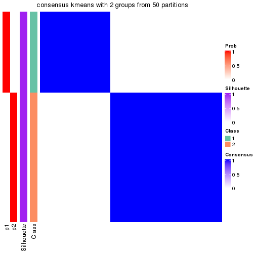</p>

</div>
<div id='tab-node-0113-consensus-heatmap-2'>
<pre><code class="r">consensus_heatmap(res, k = 3)
</code></pre>

<p>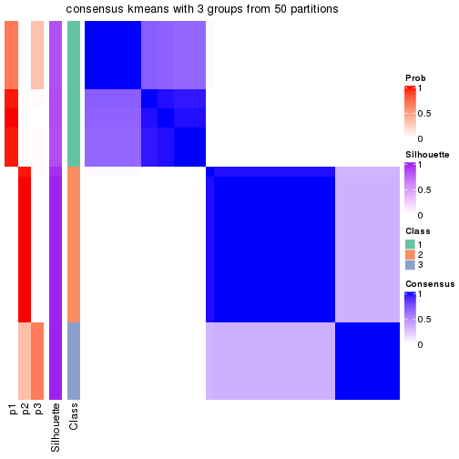</p>

</div>
<div id='tab-node-0113-consensus-heatmap-3'>
<pre><code class="r">consensus_heatmap(res, k = 4)
</code></pre>

<p>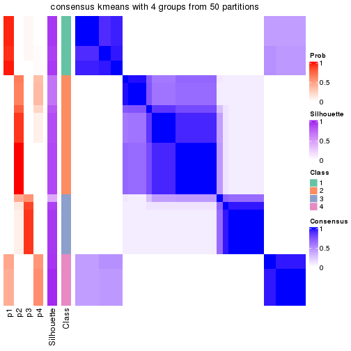</p>

</div>
<div id='tab-node-0113-consensus-heatmap-4'>
<pre><code class="r">consensus_heatmap(res, k = 5)
</code></pre>

<p>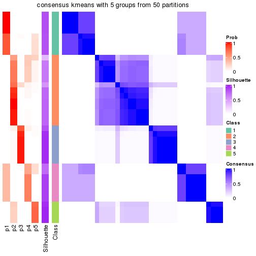</p>

</div>
<div id='tab-node-0113-consensus-heatmap-5'>
<pre><code class="r">consensus_heatmap(res, k = 6)
</code></pre>

<p>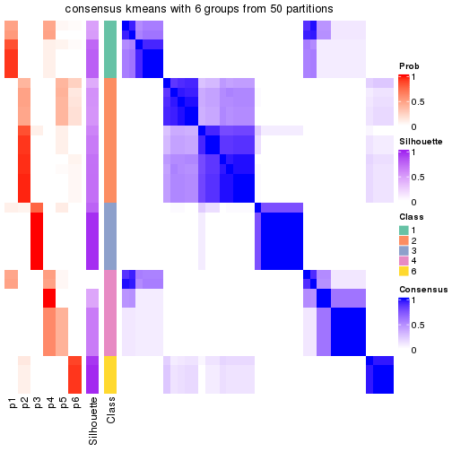</p>

</div>
<div id='tab-node-0113-consensus-heatmap-6'>
<pre><code class="r">consensus_heatmap(res, k = 7)
</code></pre>

<p>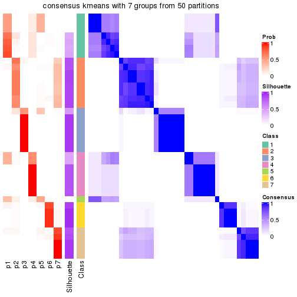</p>

</div>
<div id='tab-node-0113-consensus-heatmap-7'>
<pre><code class="r">consensus_heatmap(res, k = 8)
</code></pre>

<p>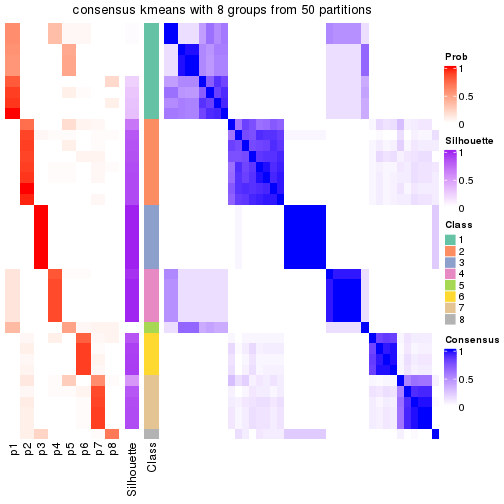</p>

</div>
</div>

Heatmaps for the membership of samples in all partitions to see how consistent they are:


<script>
$( function() {
	$( '#tabs-node-0113-membership-heatmap' ).tabs();
} );
</script>
<div id='tabs-node-0113-membership-heatmap'>
<ul>
<li><a href='#tab-node-0113-membership-heatmap-1'>k = 2</a></li>
<li><a href='#tab-node-0113-membership-heatmap-2'>k = 3</a></li>
<li><a href='#tab-node-0113-membership-heatmap-3'>k = 4</a></li>
<li><a href='#tab-node-0113-membership-heatmap-4'>k = 5</a></li>
<li><a href='#tab-node-0113-membership-heatmap-5'>k = 6</a></li>
<li><a href='#tab-node-0113-membership-heatmap-6'>k = 7</a></li>
<li><a href='#tab-node-0113-membership-heatmap-7'>k = 8</a></li>
</ul>
<div id='tab-node-0113-membership-heatmap-1'>
<pre><code class="r">membership_heatmap(res, k = 2)
</code></pre>

<p></p>

</div>
<div id='tab-node-0113-membership-heatmap-2'>
<pre><code class="r">membership_heatmap(res, k = 3)
</code></pre>

<p>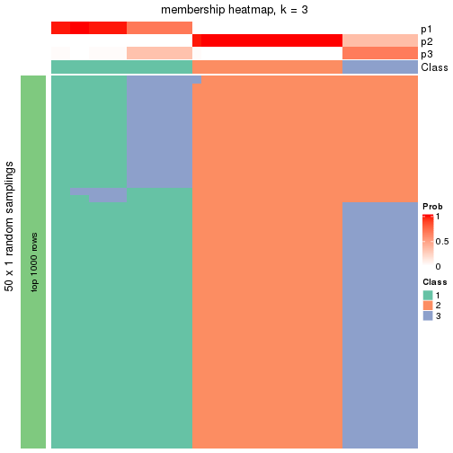</p>

</div>
<div id='tab-node-0113-membership-heatmap-3'>
<pre><code class="r">membership_heatmap(res, k = 4)
</code></pre>

<p>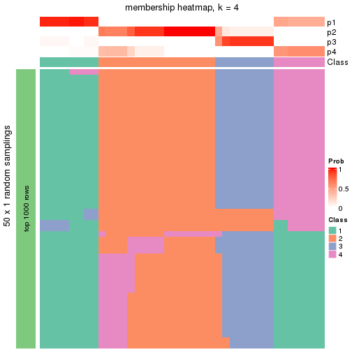</p>

</div>
<div id='tab-node-0113-membership-heatmap-4'>
<pre><code class="r">membership_heatmap(res, k = 5)
</code></pre>

<p>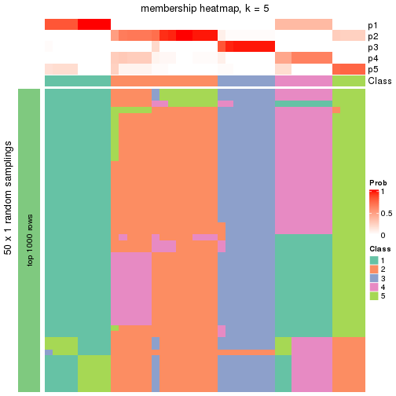</p>

</div>
<div id='tab-node-0113-membership-heatmap-5'>
<pre><code class="r">membership_heatmap(res, k = 6)
</code></pre>

<p>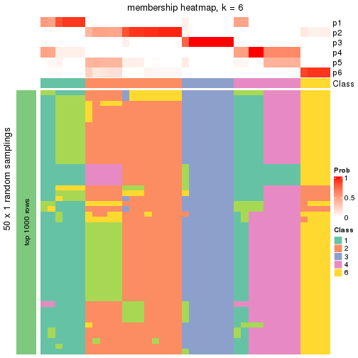</p>

</div>
<div id='tab-node-0113-membership-heatmap-6'>
<pre><code class="r">membership_heatmap(res, k = 7)
</code></pre>

<p>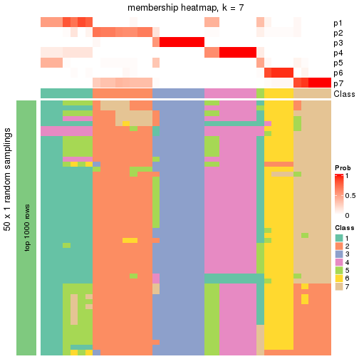</p>

</div>
<div id='tab-node-0113-membership-heatmap-7'>
<pre><code class="r">membership_heatmap(res, k = 8)
</code></pre>

<p>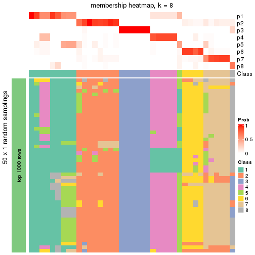</p>

</div>
</div>

As soon as the classes for columns are determined, the signatures
that are significantly different between subgroups can be looked for. 
Following are the heatmaps for signatures.


<script>
$( function() {
	$( '#tabs-node-0113-get-signatures' ).tabs();
} );
</script>
<div id='tabs-node-0113-get-signatures'>
<ul>
<li><a href='#tab-node-0113-get-signatures-1'>k = 2</a></li>
<li><a href='#tab-node-0113-get-signatures-2'>k = 3</a></li>
<li><a href='#tab-node-0113-get-signatures-3'>k = 4</a></li>
<li><a href='#tab-node-0113-get-signatures-4'>k = 5</a></li>
<li><a href='#tab-node-0113-get-signatures-5'>k = 6</a></li>
<li><a href='#tab-node-0113-get-signatures-6'>k = 7</a></li>
<li><a href='#tab-node-0113-get-signatures-7'>k = 8</a></li>
</ul>
<div id='tab-node-0113-get-signatures-1'>
<pre><code class="r">get_signatures(res, k = 2)
</code></pre>

<p>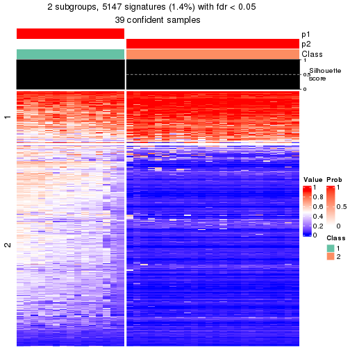</p>

</div>
<div id='tab-node-0113-get-signatures-2'>
<pre><code class="r">get_signatures(res, k = 3)
</code></pre>

<p>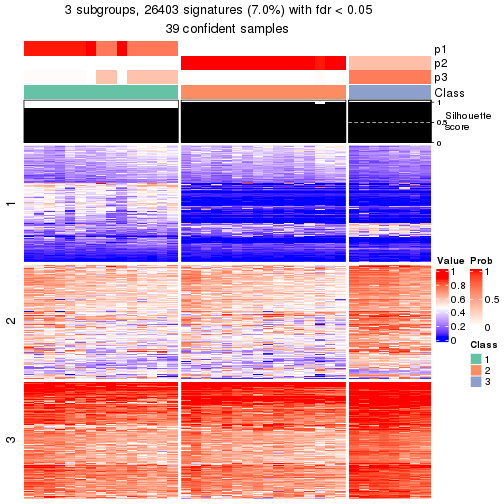</p>

</div>
<div id='tab-node-0113-get-signatures-3'>
<pre><code class="r">get_signatures(res, k = 4)
</code></pre>

<p>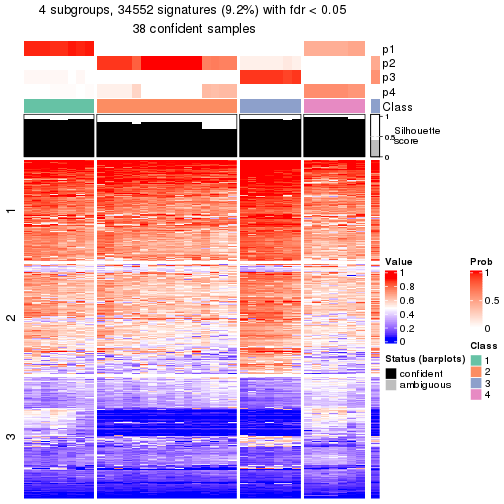</p>

</div>
<div id='tab-node-0113-get-signatures-4'>
<pre><code class="r">get_signatures(res, k = 5)
</code></pre>

<p>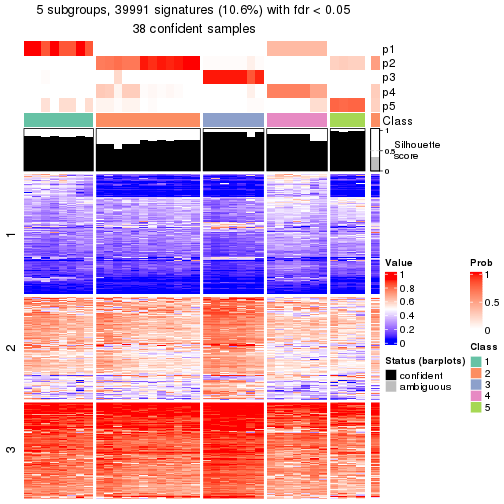</p>

</div>
<div id='tab-node-0113-get-signatures-5'>
<pre><code class="r">get_signatures(res, k = 6)
</code></pre>

<p>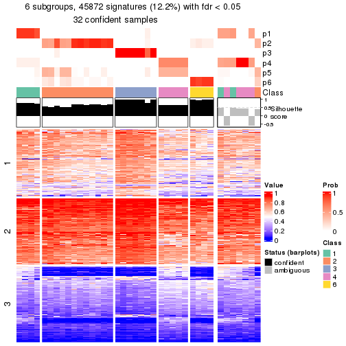</p>

</div>
<div id='tab-node-0113-get-signatures-6'>
<pre><code class="r">get_signatures(res, k = 7)
</code></pre>

<p>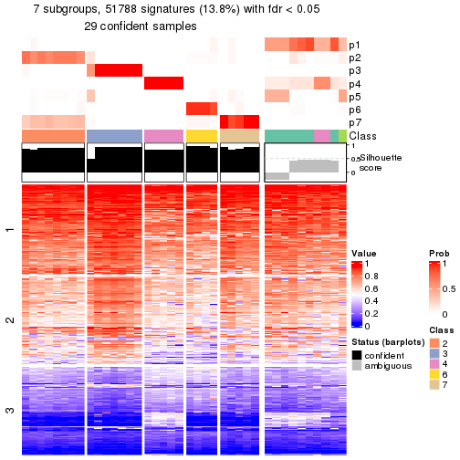</p>

</div>
<div id='tab-node-0113-get-signatures-7'>
<pre><code class="r">get_signatures(res, k = 8)
</code></pre>

<p>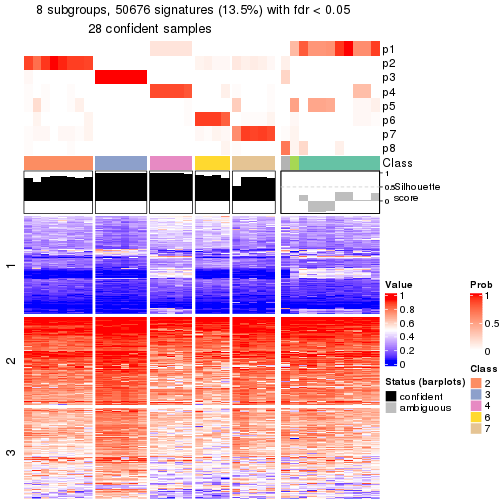</p>

</div>
</div>


Compare the overlap of signatures from different k:

```r
compare_signatures(res)
```

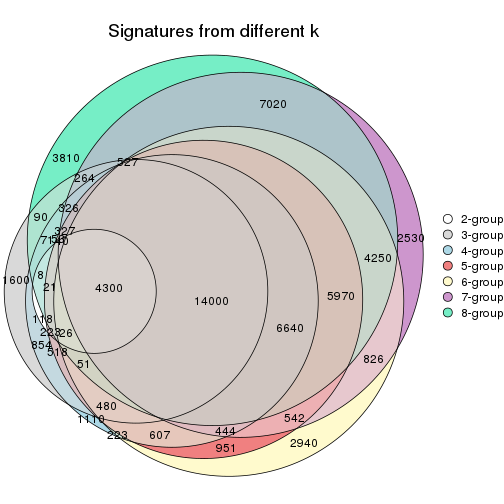

`get_signature()` returns a data frame invisibly. To get the list of signatures, the function
call should be assigned to a variable explicitly. In following code, if `plot` argument is set
to `FALSE`, no heatmap is plotted while only the differential analysis is performed.

```r
# code only for demonstration
tb = get_signature(res, k = ..., plot = FALSE)
```

An example of the output of `tb` is:

```
#>   which_row         fdr    mean_1    mean_2 scaled_mean_1 scaled_mean_2 km
#> 1        38 0.042760348  8.373488  9.131774    -0.5533452     0.5164555  1
#> 2        40 0.018707592  7.106213  8.469186    -0.6173731     0.5762149  1
#> 3        55 0.019134737 10.221463 11.207825    -0.6159697     0.5749050  1
#> 4        59 0.006059896  5.921854  7.869574    -0.6899429     0.6439467  1
#> 5        60 0.018055526  8.928898 10.211722    -0.6204761     0.5791110  1
#> 6        98 0.009384629 15.714769 14.887706     0.6635654    -0.6193277  2
...
```

The columns in `tb` are:

1. `which_row`: row indices corresponding to the input matrix.
2. `fdr`: FDR for the differential test. 
3. `mean_x`: The mean value in group x.
4. `scaled_mean_x`: The mean value in group x after rows are scaled.
5. `km`: Row groups if k-means clustering is applied to rows (which is done by automatically selecting number of clusters).

If there are too many signatures, `top_signatures = ...` can be set to only show the 
signatures with the highest FDRs:

```r
# code only for demonstration
# e.g. to show the top 500 most significant rows
tb = get_signature(res, k = ..., top_signatures = 500)
```

If the signatures are defined as these which are uniquely high in current group, `diff_method` argument
can be set to `"uniquely_high_in_one_group"`:

```r
# code only for demonstration
tb = get_signature(res, k = ..., diff_method = "uniquely_high_in_one_group")
```


UMAP plot which shows how samples are separated.


<script>
$( function() {
	$( '#tabs-node-0113-dimension-reduction' ).tabs();
} );
</script>
<div id='tabs-node-0113-dimension-reduction'>
<ul>
<li><a href='#tab-node-0113-dimension-reduction-1'>k = 2</a></li>
<li><a href='#tab-node-0113-dimension-reduction-2'>k = 3</a></li>
<li><a href='#tab-node-0113-dimension-reduction-3'>k = 4</a></li>
<li><a href='#tab-node-0113-dimension-reduction-4'>k = 5</a></li>
<li><a href='#tab-node-0113-dimension-reduction-5'>k = 6</a></li>
<li><a href='#tab-node-0113-dimension-reduction-6'>k = 7</a></li>
<li><a href='#tab-node-0113-dimension-reduction-7'>k = 8</a></li>
</ul>
<div id='tab-node-0113-dimension-reduction-1'>
<pre><code class="r">dimension_reduction(res, k = 2, method = &quot;UMAP&quot;)
</code></pre>

<p>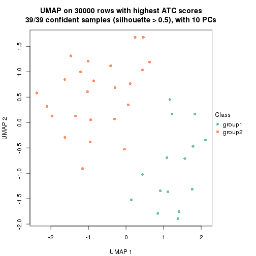</p>

</div>
<div id='tab-node-0113-dimension-reduction-2'>
<pre><code class="r">dimension_reduction(res, k = 3, method = &quot;UMAP&quot;)
</code></pre>

<p>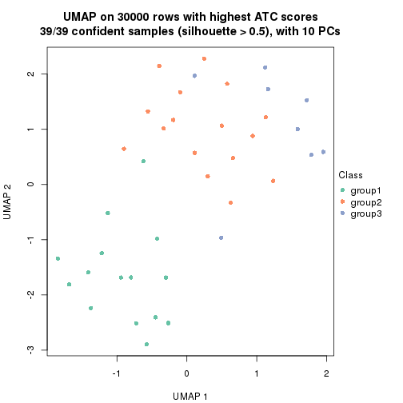</p>

</div>
<div id='tab-node-0113-dimension-reduction-3'>
<pre><code class="r">dimension_reduction(res, k = 4, method = &quot;UMAP&quot;)
</code></pre>

<p>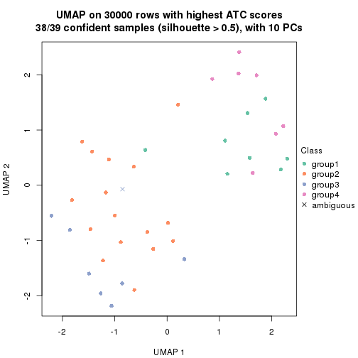</p>

</div>
<div id='tab-node-0113-dimension-reduction-4'>
<pre><code class="r">dimension_reduction(res, k = 5, method = &quot;UMAP&quot;)
</code></pre>

<p>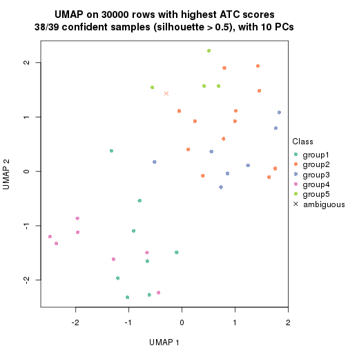</p>

</div>
<div id='tab-node-0113-dimension-reduction-5'>
<pre><code class="r">dimension_reduction(res, k = 6, method = &quot;UMAP&quot;)
</code></pre>

<p>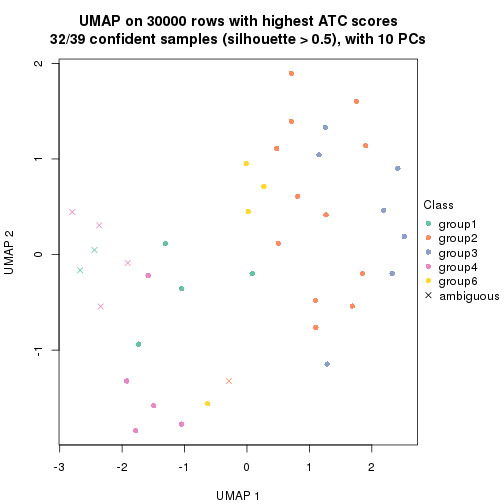</p>

</div>
<div id='tab-node-0113-dimension-reduction-6'>
<pre><code class="r">dimension_reduction(res, k = 7, method = &quot;UMAP&quot;)
</code></pre>

<p>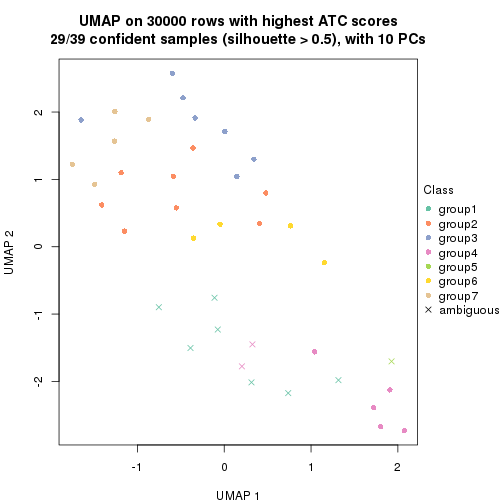</p>

</div>
<div id='tab-node-0113-dimension-reduction-7'>
<pre><code class="r">dimension_reduction(res, k = 8, method = &quot;UMAP&quot;)
</code></pre>

<p>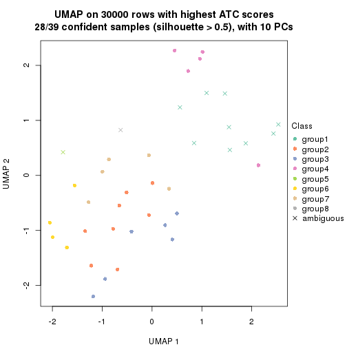</p>

</div>
</div>


Following heatmap shows how subgroups are split when increasing `k`:

```r
collect_classes(res)
```

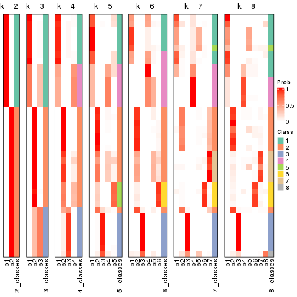


If matrix rows can be associated to genes, consider to use `functional_enrichment(res,
...)` to perform function enrichment for the signature genes. See [this vignette](https://jokergoo.github.io/cola_vignettes/functional_enrichment.html) for more detailed explanations.


 

---------------------------------------------------


### Node01132


Parent node: [Node0113](#Node0113).
Child nodes: 
                Node011321-leaf
        ,
                [Node011322](#Node011322)
        .


The object with results only for a single top-value method and a single partitioning method 
can be extracted as:

```r
res = res_rh["01132"]
```

A summary of `res` and all the functions that can be applied to it:

```r
res
```

```
#> A 'ConsensusPartition' object with k = 2, 3, 4, 5, 6, 7, 8.
#>   On a matrix with 30000 rows and 24 columns.
#>   Top rows (1000) are extracted by 'ATC' method.
#>   Subgroups are detected by 'kmeans' method.
#>   Performed in total 350 partitions by row resampling.
#>   Best k for subgroups seems to be 3.
#> 
#> Following methods can be applied to this 'ConsensusPartition' object:
#>  [1] "cola_report"             "collect_classes"         "collect_plots"          
#>  [4] "collect_stats"           "colnames"                "compare_partitions"     
#>  [7] "compare_signatures"      "consensus_heatmap"       "dimension_reduction"    
#> [10] "functional_enrichment"   "get_anno_col"            "get_anno"               
#> [13] "get_classes"             "get_consensus"           "get_matrix"             
#> [16] "get_membership"          "get_param"               "get_signatures"         
#> [19] "get_stats"               "is_best_k"               "is_stable_k"            
#> [22] "membership_heatmap"      "ncol"                    "nrow"                   
#> [25] "plot_ecdf"               "predict_classes"         "rownames"               
#> [28] "select_partition_number" "show"                    "suggest_best_k"         
#> [31] "test_to_known_factors"   "top_rows_heatmap"
```

`collect_plots()` function collects all the plots made from `res` for all `k` (number of subgroups)
into one single page to provide an easy and fast comparison between different `k`.

```r
collect_plots(res)
```

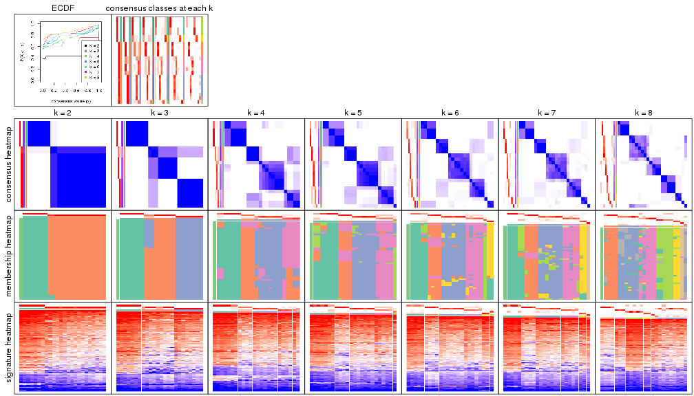

The plots are:

- The first row: a plot of the eCDF (empirical cumulative distribution
  function) curves of the consensus matrix for each `k` and the heatmap of
  predicted classes for each `k`.
- The second row: heatmaps of the consensus matrix for each `k`.
- The third row: heatmaps of the membership matrix for each `k`.
- The fouth row: heatmaps of the signatures for each `k`.

All the plots in panels can be made by individual functions and they are
plotted later in this section.

`select_partition_number()` produces several plots showing different
statistics for choosing "optimized" `k`. There are following statistics:

- eCDF curves of the consensus matrix for each `k`;
- 1-PAC. [The PAC score](https://en.wikipedia.org/wiki/Consensus_clustering#Over-interpretation_potential_of_consensus_clustering)
  measures the proportion of the ambiguous subgrouping.
- Mean silhouette score.
- Concordance. The mean probability of fiting the consensus subgroup labels in all
  partitions.
- Area increased. Denote $A_k$ as the area under the eCDF curve for current
  `k`, the area increased is defined as $A_k - A_{k-1}$.
- Rand index. The percent of pairs of samples that are both in a same cluster
  or both are not in a same cluster in the partition of k and k-1.
- Jaccard index. The ratio of pairs of samples are both in a same cluster in
  the partition of k and k-1 and the pairs of samples are both in a same
  cluster in the partition k or k-1.

The detailed explanations of these statistics can be found in [the _cola_
vignette](https://jokergoo.github.io/cola_vignettes/cola.html#toc_13).

Generally speaking, higher 1-PAC score, higher mean silhouette score or higher
concordance corresponds to better partition. Rand index and Jaccard index
measure how similar the current partition is compared to partition with `k-1`.
If they are too similar, we won't accept `k` is better than `k-1`.

```r
select_partition_number(res)
```

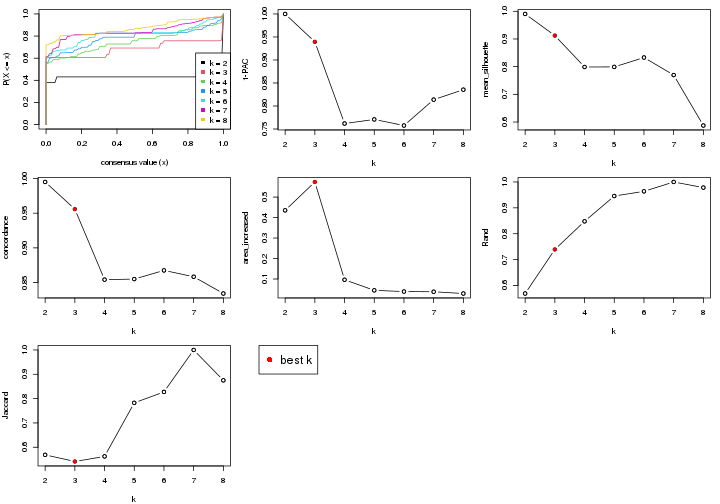

The numeric values for all these statistics can be obtained by `get_stats()`.

```r
get_stats(res)
```

```
#>   k 1-PAC mean_silhouette concordance area_increased  Rand Jaccard
#> 2 2 1.000           0.990       0.995         0.4352 0.569   0.569
#> 3 3 0.939           0.912       0.956         0.5737 0.739   0.541
#> 4 4 0.762           0.799       0.854         0.0962 0.848   0.562
#> 5 5 0.771           0.799       0.855         0.0446 0.946   0.783
#> 6 6 0.758           0.833       0.868         0.0388 0.964   0.828
#> 7 7 0.814           0.770       0.858         0.0378 1.000   1.000
#> 8 8 0.835           0.587       0.834         0.0291 0.978   0.875
```

`suggest_best_k()` suggests the best $k$ based on these statistics. The rules are as follows:

- All $k$ with Jaccard index larger than 0.95 are removed because increasing
  $k$ does not provide enough extra information. If all $k$ are removed, it is
  marked as no subgroup is detected.
- For all $k$ with 1-PAC score larger than 0.9, the maximal $k$ is taken as
  the best $k$, and other $k$ are marked as optional $k$.
- If it does not fit the second rule. The $k$ with the maximal vote of the
  highest 1-PAC score, highest mean silhouette, and highest concordance is
  taken as the best $k$.

```r
suggest_best_k(res)
```

```
#> [1] 3
#> attr(,"optional")
#> [1] 2
```

There is also optional best $k$ = 2 that is worth to check.

Following is the table of the partitions (You need to click the **show/hide
code output** link to see it). The membership matrix (columns with name `p*`)
is inferred by
[`clue::cl_consensus()`](https://www.rdocumentation.org/link/cl_consensus?package=clue)
function with the `SE` method. Basically the value in the membership matrix
represents the probability to belong to a certain group. The finall subgroup
label for an item is determined with the group with highest probability it
belongs to.

In `get_classes()` function, the entropy is calculated from the membership
matrix and the silhouette score is calculated from the consensus matrix.


<script>
$( function() {
	$( '#tabs-node-01132-get-classes' ).tabs();
} );
</script>
<div id='tabs-node-01132-get-classes'>
<ul>
<li><a href='#tab-node-01132-get-classes-1'>k = 2</a></li>
<li><a href='#tab-node-01132-get-classes-2'>k = 3</a></li>
<li><a href='#tab-node-01132-get-classes-3'>k = 4</a></li>
<li><a href='#tab-node-01132-get-classes-4'>k = 5</a></li>
<li><a href='#tab-node-01132-get-classes-5'>k = 6</a></li>
<li><a href='#tab-node-01132-get-classes-6'>k = 7</a></li>
<li><a href='#tab-node-01132-get-classes-7'>k = 8</a></li>
</ul>

<div id='tab-node-01132-get-classes-1'>
<p><a id='tab-node-01132-get-classes-1-a' style='color:#0366d6' href='#'>show/hide code output</a></p>
<pre><code class="r">cbind(get_classes(res, k = 2), get_membership(res, k = 2))
</code></pre>

<pre><code>#&gt;                 class entropy silhouette   p1   p2
#&gt; TCGA.G4.6306.01     2   0.000      0.992 0.00 1.00
#&gt; TCGA.NH.A6GA.01     2   0.000      0.992 0.00 1.00
#&gt; TCGA.DM.A288.01     2   0.000      0.992 0.00 1.00
#&gt; TCGA.AD.A5EK.01     1   0.000      1.000 1.00 0.00
#&gt; TCGA.G4.6298.01     2   0.000      0.992 0.00 1.00
#&gt; TCGA.CK.5915.01     1   0.000      1.000 1.00 0.00
#&gt; TCGA.D5.5539.01     2   0.000      0.992 0.00 1.00
#&gt; TCGA.AA.3495.01     2   0.327      0.940 0.06 0.94
#&gt; TCGA.AD.6899.01     2   0.000      0.992 0.00 1.00
#&gt; TCGA.CM.5348.01     2   0.000      0.992 0.00 1.00
#&gt; TCGA.F4.6463.01     2   0.000      0.992 0.00 1.00
#&gt; TCGA.CA.6719.01     2   0.000      0.992 0.00 1.00
#&gt; TCGA.AZ.4315.01     2   0.000      0.992 0.00 1.00
#&gt; TCGA.D5.5537.01     2   0.327      0.940 0.06 0.94
#&gt; TCGA.NH.A8F8.01     2   0.000      0.992 0.00 1.00
#&gt; TCGA.5M.AAT4.01     2   0.000      0.992 0.00 1.00
#&gt; TCGA.CK.5914.01     1   0.000      1.000 1.00 0.00
#&gt; TCGA.D5.5540.01     1   0.000      1.000 1.00 0.00
#&gt; TCGA.D5.6541.01     2   0.000      0.992 0.00 1.00
#&gt; TCGA.AD.6901.01     2   0.000      0.992 0.00 1.00
#&gt; TCGA.DM.A28A.01     1   0.000      1.000 1.00 0.00
#&gt; TCGA.QG.A5Z1.01     1   0.000      1.000 1.00 0.00
#&gt; TCGA.CM.4747.01     2   0.000      0.992 0.00 1.00
#&gt; TCGA.DM.A28H.01     1   0.000      1.000 1.00 0.00
</code></pre>

<script>
$('#tab-node-01132-get-classes-1-a').parent().next().next().hide();
$('#tab-node-01132-get-classes-1-a').click(function(){
  $('#tab-node-01132-get-classes-1-a').parent().next().next().toggle();
  return(false);
});
</script>
</div>

<div id='tab-node-01132-get-classes-2'>
<p><a id='tab-node-01132-get-classes-2-a' style='color:#0366d6' href='#'>show/hide code output</a></p>
<pre><code class="r">cbind(get_classes(res, k = 3), get_membership(res, k = 3))
</code></pre>

<pre><code>#&gt;                 class entropy silhouette p1   p2   p3
#&gt; TCGA.G4.6306.01     2   0.595      0.577  0 0.64 0.36
#&gt; TCGA.NH.A6GA.01     2   0.000      0.856  0 1.00 0.00
#&gt; TCGA.DM.A288.01     3   0.000      1.000  0 0.00 1.00
#&gt; TCGA.AD.A5EK.01     1   0.000      1.000  1 0.00 0.00
#&gt; TCGA.G4.6298.01     3   0.000      1.000  0 0.00 1.00
#&gt; TCGA.CK.5915.01     1   0.000      1.000  1 0.00 0.00
#&gt; TCGA.D5.5539.01     2   0.000      0.856  0 1.00 0.00
#&gt; TCGA.AA.3495.01     3   0.000      1.000  0 0.00 1.00
#&gt; TCGA.AD.6899.01     3   0.000      1.000  0 0.00 1.00
#&gt; TCGA.CM.5348.01     2   0.000      0.856  0 1.00 0.00
#&gt; TCGA.F4.6463.01     2   0.000      0.856  0 1.00 0.00
#&gt; TCGA.CA.6719.01     3   0.000      1.000  0 0.00 1.00
#&gt; TCGA.AZ.4315.01     2   0.000      0.856  0 1.00 0.00
#&gt; TCGA.D5.5537.01     3   0.000      1.000  0 0.00 1.00
#&gt; TCGA.NH.A8F8.01     2   0.583      0.603  0 0.66 0.34
#&gt; TCGA.5M.AAT4.01     2   0.595      0.577  0 0.64 0.36
#&gt; TCGA.CK.5914.01     1   0.000      1.000  1 0.00 0.00
#&gt; TCGA.D5.5540.01     1   0.000      1.000  1 0.00 0.00
#&gt; TCGA.D5.6541.01     2   0.000      0.856  0 1.00 0.00
#&gt; TCGA.AD.6901.01     3   0.000      1.000  0 0.00 1.00
#&gt; TCGA.DM.A28A.01     1   0.000      1.000  1 0.00 0.00
#&gt; TCGA.QG.A5Z1.01     1   0.000      1.000  1 0.00 0.00
#&gt; TCGA.CM.4747.01     3   0.000      1.000  0 0.00 1.00
#&gt; TCGA.DM.A28H.01     1   0.000      1.000  1 0.00 0.00
</code></pre>

<script>
$('#tab-node-01132-get-classes-2-a').parent().next().next().hide();
$('#tab-node-01132-get-classes-2-a').click(function(){
  $('#tab-node-01132-get-classes-2-a').parent().next().next().toggle();
  return(false);
});
</script>
</div>

<div id='tab-node-01132-get-classes-3'>
<p><a id='tab-node-01132-get-classes-3-a' style='color:#0366d6' href='#'>show/hide code output</a></p>
<pre><code class="r">cbind(get_classes(res, k = 4), get_membership(res, k = 4))
</code></pre>

<pre><code>#&gt;                 class entropy silhouette   p1   p2   p3   p4
#&gt; TCGA.G4.6306.01     4   0.201      0.685 0.00 0.00 0.08 0.92
#&gt; TCGA.NH.A6GA.01     4   0.340      0.551 0.00 0.18 0.00 0.82
#&gt; TCGA.DM.A288.01     4   0.586      0.454 0.00 0.18 0.12 0.70
#&gt; TCGA.AD.A5EK.01     1   0.000      0.922 1.00 0.00 0.00 0.00
#&gt; TCGA.G4.6298.01     3   0.234      0.861 0.00 0.00 0.90 0.10
#&gt; TCGA.CK.5915.01     1   0.000      0.922 1.00 0.00 0.00 0.00
#&gt; TCGA.D5.5539.01     2   0.441      1.000 0.00 0.70 0.00 0.30
#&gt; TCGA.AA.3495.01     3   0.265      0.725 0.00 0.12 0.88 0.00
#&gt; TCGA.AD.6899.01     3   0.334      0.848 0.00 0.02 0.86 0.12
#&gt; TCGA.CM.5348.01     2   0.441      1.000 0.00 0.70 0.00 0.30
#&gt; TCGA.F4.6463.01     2   0.441      1.000 0.00 0.70 0.00 0.30
#&gt; TCGA.CA.6719.01     3   0.234      0.861 0.00 0.00 0.90 0.10
#&gt; TCGA.AZ.4315.01     4   0.340      0.551 0.00 0.18 0.00 0.82
#&gt; TCGA.D5.5537.01     3   0.121      0.801 0.00 0.04 0.96 0.00
#&gt; TCGA.NH.A8F8.01     3   0.599      0.258 0.00 0.04 0.52 0.44
#&gt; TCGA.5M.AAT4.01     4   0.201      0.685 0.00 0.00 0.08 0.92
#&gt; TCGA.CK.5914.01     1   0.000      0.922 1.00 0.00 0.00 0.00
#&gt; TCGA.D5.5540.01     1   0.000      0.922 1.00 0.00 0.00 0.00
#&gt; TCGA.D5.6541.01     2   0.441      1.000 0.00 0.70 0.00 0.30
#&gt; TCGA.AD.6901.01     3   0.234      0.861 0.00 0.00 0.90 0.10
#&gt; TCGA.DM.A28A.01     1   0.000      0.922 1.00 0.00 0.00 0.00
#&gt; TCGA.QG.A5Z1.01     1   0.543      0.791 0.74 0.12 0.14 0.00
#&gt; TCGA.CM.4747.01     3   0.382      0.840 0.00 0.04 0.84 0.12
#&gt; TCGA.DM.A28H.01     1   0.543      0.791 0.74 0.12 0.14 0.00
</code></pre>

<script>
$('#tab-node-01132-get-classes-3-a').parent().next().next().hide();
$('#tab-node-01132-get-classes-3-a').click(function(){
  $('#tab-node-01132-get-classes-3-a').parent().next().next().toggle();
  return(false);
});
</script>
</div>

<div id='tab-node-01132-get-classes-4'>
<p><a id='tab-node-01132-get-classes-4-a' style='color:#0366d6' href='#'>show/hide code output</a></p>
<pre><code class="r">cbind(get_classes(res, k = 5), get_membership(res, k = 5))
</code></pre>

<pre><code>#&gt;                 class entropy silhouette   p1   p2   p3   p4   p5
#&gt; TCGA.G4.6306.01     4  0.5415      0.851 0.00 0.26 0.06 0.66 0.02
#&gt; TCGA.NH.A6GA.01     4  0.3796      0.824 0.00 0.30 0.00 0.70 0.00
#&gt; TCGA.DM.A288.01     5  0.5273      0.000 0.00 0.00 0.16 0.16 0.68
#&gt; TCGA.AD.A5EK.01     1  0.0000      0.798 1.00 0.00 0.00 0.00 0.00
#&gt; TCGA.G4.6298.01     3  0.0609      0.932 0.00 0.00 0.98 0.02 0.00
#&gt; TCGA.CK.5915.01     1  0.0000      0.798 1.00 0.00 0.00 0.00 0.00
#&gt; TCGA.D5.5539.01     2  0.0000      0.984 0.00 1.00 0.00 0.00 0.00
#&gt; TCGA.AA.3495.01     3  0.3291      0.782 0.00 0.00 0.84 0.12 0.04
#&gt; TCGA.AD.6899.01     3  0.0609      0.932 0.00 0.00 0.98 0.02 0.00
#&gt; TCGA.CM.5348.01     2  0.1216      0.951 0.00 0.96 0.00 0.02 0.02
#&gt; TCGA.F4.6463.01     2  0.0000      0.984 0.00 1.00 0.00 0.00 0.00
#&gt; TCGA.CA.6719.01     3  0.0000      0.929 0.00 0.00 1.00 0.00 0.00
#&gt; TCGA.AZ.4315.01     4  0.3895      0.828 0.00 0.32 0.00 0.68 0.00
#&gt; TCGA.D5.5537.01     3  0.1410      0.891 0.00 0.00 0.94 0.06 0.00
#&gt; TCGA.NH.A8F8.01     4  0.6532      0.619 0.00 0.28 0.24 0.48 0.00
#&gt; TCGA.5M.AAT4.01     4  0.5415      0.851 0.00 0.26 0.06 0.66 0.02
#&gt; TCGA.CK.5914.01     1  0.0000      0.798 1.00 0.00 0.00 0.00 0.00
#&gt; TCGA.D5.5540.01     1  0.2280      0.782 0.88 0.00 0.00 0.00 0.12
#&gt; TCGA.D5.6541.01     2  0.0000      0.984 0.00 1.00 0.00 0.00 0.00
#&gt; TCGA.AD.6901.01     3  0.0609      0.932 0.00 0.00 0.98 0.02 0.00
#&gt; TCGA.DM.A28A.01     1  0.2280      0.782 0.88 0.00 0.00 0.00 0.12
#&gt; TCGA.QG.A5Z1.01     1  0.6802      0.515 0.50 0.00 0.02 0.30 0.18
#&gt; TCGA.CM.4747.01     3  0.1043      0.915 0.00 0.00 0.96 0.00 0.04
#&gt; TCGA.DM.A28H.01     1  0.6802      0.515 0.50 0.00 0.02 0.30 0.18
</code></pre>

<script>
$('#tab-node-01132-get-classes-4-a').parent().next().next().hide();
$('#tab-node-01132-get-classes-4-a').click(function(){
  $('#tab-node-01132-get-classes-4-a').parent().next().next().toggle();
  return(false);
});
</script>
</div>

<div id='tab-node-01132-get-classes-5'>
<p><a id='tab-node-01132-get-classes-5-a' style='color:#0366d6' href='#'>show/hide code output</a></p>
<pre><code class="r">cbind(get_classes(res, k = 6), get_membership(res, k = 6))
</code></pre>

<pre><code>#&gt;                 class entropy silhouette   p1   p2   p3   p4   p5   p6
#&gt; TCGA.G4.6306.01     4  0.3523      0.847 0.00 0.18 0.04 0.78 0.00 0.00
#&gt; TCGA.NH.A6GA.01     4  0.3315      0.829 0.02 0.20 0.00 0.78 0.00 0.00
#&gt; TCGA.DM.A288.01     5  0.2581      0.000 0.00 0.00 0.02 0.12 0.86 0.00
#&gt; TCGA.AD.A5EK.01     1  0.3309      0.875 0.72 0.00 0.00 0.00 0.00 0.28
#&gt; TCGA.G4.6298.01     3  0.1092      0.906 0.02 0.00 0.96 0.02 0.00 0.00
#&gt; TCGA.CK.5915.01     1  0.3309      0.875 0.72 0.00 0.00 0.00 0.00 0.28
#&gt; TCGA.D5.5539.01     2  0.0000      0.962 0.00 1.00 0.00 0.00 0.00 0.00
#&gt; TCGA.AA.3495.01     3  0.3697      0.847 0.04 0.00 0.82 0.06 0.00 0.08
#&gt; TCGA.AD.6899.01     3  0.1267      0.900 0.06 0.00 0.94 0.00 0.00 0.00
#&gt; TCGA.CM.5348.01     2  0.2345      0.902 0.06 0.90 0.00 0.02 0.02 0.00
#&gt; TCGA.F4.6463.01     2  0.0547      0.954 0.02 0.98 0.00 0.00 0.00 0.00
#&gt; TCGA.CA.6719.01     3  0.1480      0.894 0.02 0.00 0.94 0.04 0.00 0.00
#&gt; TCGA.AZ.4315.01     4  0.4727      0.766 0.10 0.24 0.00 0.66 0.00 0.00
#&gt; TCGA.D5.5537.01     3  0.4008      0.848 0.08 0.00 0.80 0.06 0.00 0.06
#&gt; TCGA.NH.A8F8.01     4  0.5840      0.593 0.02 0.16 0.26 0.56 0.00 0.00
#&gt; TCGA.5M.AAT4.01     4  0.3523      0.847 0.00 0.18 0.04 0.78 0.00 0.00
#&gt; TCGA.CK.5914.01     1  0.3309      0.875 0.72 0.00 0.00 0.00 0.00 0.28
#&gt; TCGA.D5.5540.01     1  0.6435      0.800 0.52 0.00 0.00 0.08 0.12 0.28
#&gt; TCGA.D5.6541.01     2  0.0000      0.962 0.00 1.00 0.00 0.00 0.00 0.00
#&gt; TCGA.AD.6901.01     3  0.0547      0.905 0.02 0.00 0.98 0.00 0.00 0.00
#&gt; TCGA.DM.A28A.01     1  0.6457      0.800 0.52 0.00 0.00 0.10 0.10 0.28
#&gt; TCGA.QG.A5Z1.01     6  0.0937      0.954 0.00 0.00 0.00 0.04 0.00 0.96
#&gt; TCGA.CM.4747.01     3  0.1807      0.896 0.06 0.00 0.92 0.00 0.02 0.00
#&gt; TCGA.DM.A28H.01     6  0.0000      0.954 0.00 0.00 0.00 0.00 0.00 1.00
</code></pre>

<script>
$('#tab-node-01132-get-classes-5-a').parent().next().next().hide();
$('#tab-node-01132-get-classes-5-a').click(function(){
  $('#tab-node-01132-get-classes-5-a').parent().next().next().toggle();
  return(false);
});
</script>
</div>

<div id='tab-node-01132-get-classes-6'>
<p><a id='tab-node-01132-get-classes-6-a' style='color:#0366d6' href='#'>show/hide code output</a></p>
<pre><code class="r">cbind(get_classes(res, k = 7), get_membership(res, k = 7))
</code></pre>

<pre><code>#&gt;                 class entropy silhouette   p1   p2   p3   p4   p5   p6   p7
#&gt; TCGA.G4.6306.01     4  0.3114      0.811 0.00 0.08 0.04 0.84 0.00 0.00 0.04
#&gt; TCGA.NH.A6GA.01     4  0.2864      0.788 0.00 0.12 0.00 0.84 0.02 0.02 0.00
#&gt; TCGA.DM.A288.01     7  0.0000      0.000 0.00 0.00 0.00 0.00 0.00 0.00 1.00
#&gt; TCGA.AD.A5EK.01     1  0.0000      0.792 1.00 0.00 0.00 0.00 0.00 0.00 0.00
#&gt; TCGA.G4.6298.01     3  0.0863      0.835 0.00 0.00 0.96 0.00 0.04 0.00 0.00
#&gt; TCGA.CK.5915.01     1  0.0000      0.792 1.00 0.00 0.00 0.00 0.00 0.00 0.00
#&gt; TCGA.D5.5539.01     2  0.0000      0.964 0.00 1.00 0.00 0.00 0.00 0.00 0.00
#&gt; TCGA.AA.3495.01     3  0.3630      0.770 0.00 0.00 0.80 0.04 0.10 0.06 0.00
#&gt; TCGA.AD.6899.01     3  0.2163      0.817 0.00 0.00 0.88 0.02 0.10 0.00 0.00
#&gt; TCGA.CM.5348.01     2  0.2278      0.885 0.00 0.88 0.00 0.00 0.08 0.04 0.00
#&gt; TCGA.F4.6463.01     2  0.0000      0.964 0.00 1.00 0.00 0.00 0.00 0.00 0.00
#&gt; TCGA.CA.6719.01     3  0.3061      0.792 0.00 0.00 0.84 0.06 0.08 0.00 0.02
#&gt; TCGA.AZ.4315.01     4  0.4965      0.676 0.00 0.12 0.00 0.66 0.18 0.04 0.00
#&gt; TCGA.D5.5537.01     3  0.4708      0.692 0.00 0.00 0.64 0.08 0.26 0.02 0.00
#&gt; TCGA.NH.A8F8.01     4  0.3927      0.586 0.00 0.04 0.30 0.66 0.00 0.00 0.00
#&gt; TCGA.5M.AAT4.01     4  0.3114      0.811 0.00 0.08 0.04 0.84 0.00 0.00 0.04
#&gt; TCGA.CK.5914.01     1  0.0000      0.792 1.00 0.00 0.00 0.00 0.00 0.00 0.00
#&gt; TCGA.D5.5540.01     1  0.3459      0.666 0.60 0.00 0.00 0.00 0.40 0.00 0.00
#&gt; TCGA.D5.6541.01     2  0.0000      0.964 0.00 1.00 0.00 0.00 0.00 0.00 0.00
#&gt; TCGA.AD.6901.01     3  0.0504      0.833 0.00 0.00 0.98 0.00 0.02 0.00 0.00
#&gt; TCGA.DM.A28A.01     1  0.3459      0.666 0.60 0.00 0.00 0.00 0.40 0.00 0.00
#&gt; TCGA.QG.A5Z1.01     6  0.3404      0.893 0.08 0.00 0.00 0.04 0.06 0.82 0.00
#&gt; TCGA.CM.4747.01     3  0.3494      0.790 0.00 0.00 0.80 0.02 0.12 0.00 0.06
#&gt; TCGA.DM.A28H.01     6  0.1433      0.893 0.08 0.00 0.00 0.00 0.00 0.92 0.00
</code></pre>

<script>
$('#tab-node-01132-get-classes-6-a').parent().next().next().hide();
$('#tab-node-01132-get-classes-6-a').click(function(){
  $('#tab-node-01132-get-classes-6-a').parent().next().next().toggle();
  return(false);
});
</script>
</div>

<div id='tab-node-01132-get-classes-7'>
<p><a id='tab-node-01132-get-classes-7-a' style='color:#0366d6' href='#'>show/hide code output</a></p>
<pre><code class="r">cbind(get_classes(res, k = 8), get_membership(res, k = 8))
</code></pre>

<pre><code>#&gt;                 class entropy silhouette   p1   p2   p3   p4   p5   p6   p7   p8
#&gt; TCGA.G4.6306.01     4  0.0000      0.671 0.00 0.00 0.00 1.00 0.00 0.00 0.00 0.00
#&gt; TCGA.NH.A6GA.01     4  0.2071      0.655 0.04 0.00 0.00 0.90 0.00 0.02 0.00 0.04
#&gt; TCGA.DM.A288.01     7  0.0808      0.000 0.00 0.00 0.00 0.04 0.00 0.00 0.96 0.00
#&gt; TCGA.AD.A5EK.01     5  0.3015      0.837 0.32 0.00 0.00 0.00 0.68 0.00 0.00 0.00
#&gt; TCGA.G4.6298.01     3  0.3941      0.384 0.04 0.00 0.68 0.00 0.00 0.02 0.00 0.26
#&gt; TCGA.CK.5915.01     5  0.3015      0.837 0.32 0.00 0.00 0.00 0.68 0.00 0.00 0.00
#&gt; TCGA.D5.5539.01     2  0.0000      0.918 0.00 1.00 0.00 0.00 0.00 0.00 0.00 0.00
#&gt; TCGA.AA.3495.01     3  0.3078      0.486 0.02 0.00 0.82 0.00 0.00 0.06 0.00 0.10
#&gt; TCGA.AD.6899.01     3  0.2852      0.268 0.00 0.00 0.72 0.00 0.00 0.00 0.00 0.28
#&gt; TCGA.CM.5348.01     2  0.4282      0.726 0.10 0.74 0.00 0.00 0.00 0.04 0.02 0.10
#&gt; TCGA.F4.6463.01     2  0.0000      0.918 0.00 1.00 0.00 0.00 0.00 0.00 0.00 0.00
#&gt; TCGA.CA.6719.01     3  0.2484      0.477 0.02 0.00 0.86 0.02 0.00 0.00 0.00 0.10
#&gt; TCGA.AZ.4315.01     4  0.5098      0.268 0.44 0.06 0.00 0.44 0.00 0.00 0.00 0.06
#&gt; TCGA.D5.5537.01     8  0.3514      0.000 0.02 0.00 0.34 0.00 0.00 0.00 0.00 0.64
#&gt; TCGA.NH.A8F8.01     4  0.5755      0.168 0.02 0.00 0.30 0.46 0.00 0.02 0.00 0.20
#&gt; TCGA.5M.AAT4.01     4  0.0000      0.671 0.00 0.00 0.00 1.00 0.00 0.00 0.00 0.00
#&gt; TCGA.CK.5914.01     5  0.3015      0.837 0.32 0.00 0.00 0.00 0.68 0.00 0.00 0.00
#&gt; TCGA.D5.5540.01     5  0.0000      0.742 0.00 0.00 0.00 0.00 1.00 0.00 0.00 0.00
#&gt; TCGA.D5.6541.01     2  0.0000      0.918 0.00 1.00 0.00 0.00 0.00 0.00 0.00 0.00
#&gt; TCGA.AD.6901.01     3  0.0000      0.561 0.00 0.00 1.00 0.00 0.00 0.00 0.00 0.00
#&gt; TCGA.DM.A28A.01     5  0.0000      0.742 0.00 0.00 0.00 0.00 1.00 0.00 0.00 0.00
#&gt; TCGA.QG.A5Z1.01     6  0.2864      0.933 0.06 0.00 0.00 0.00 0.08 0.84 0.02 0.00
#&gt; TCGA.CM.4747.01     3  0.3449      0.145 0.00 0.00 0.66 0.00 0.00 0.00 0.02 0.32
#&gt; TCGA.DM.A28H.01     6  0.1341      0.933 0.00 0.00 0.00 0.00 0.08 0.92 0.00 0.00
</code></pre>

<script>
$('#tab-node-01132-get-classes-7-a').parent().next().next().hide();
$('#tab-node-01132-get-classes-7-a').click(function(){
  $('#tab-node-01132-get-classes-7-a').parent().next().next().toggle();
  return(false);
});
</script>
</div>
</div>

Heatmaps for the consensus matrix. It visualizes the probability of two
samples to be in a same group.


<script>
$( function() {
	$( '#tabs-node-01132-consensus-heatmap' ).tabs();
} );
</script>
<div id='tabs-node-01132-consensus-heatmap'>
<ul>
<li><a href='#tab-node-01132-consensus-heatmap-1'>k = 2</a></li>
<li><a href='#tab-node-01132-consensus-heatmap-2'>k = 3</a></li>
<li><a href='#tab-node-01132-consensus-heatmap-3'>k = 4</a></li>
<li><a href='#tab-node-01132-consensus-heatmap-4'>k = 5</a></li>
<li><a href='#tab-node-01132-consensus-heatmap-5'>k = 6</a></li>
<li><a href='#tab-node-01132-consensus-heatmap-6'>k = 7</a></li>
<li><a href='#tab-node-01132-consensus-heatmap-7'>k = 8</a></li>
</ul>
<div id='tab-node-01132-consensus-heatmap-1'>
<pre><code class="r">consensus_heatmap(res, k = 2)
</code></pre>

<p>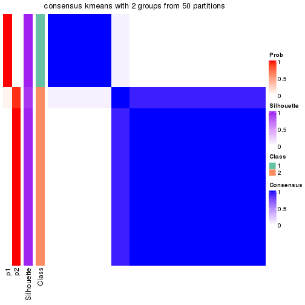</p>

</div>
<div id='tab-node-01132-consensus-heatmap-2'>
<pre><code class="r">consensus_heatmap(res, k = 3)
</code></pre>

<p>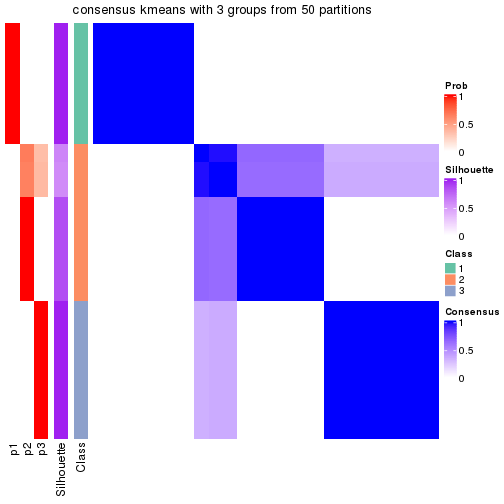</p>

</div>
<div id='tab-node-01132-consensus-heatmap-3'>
<pre><code class="r">consensus_heatmap(res, k = 4)
</code></pre>

<p>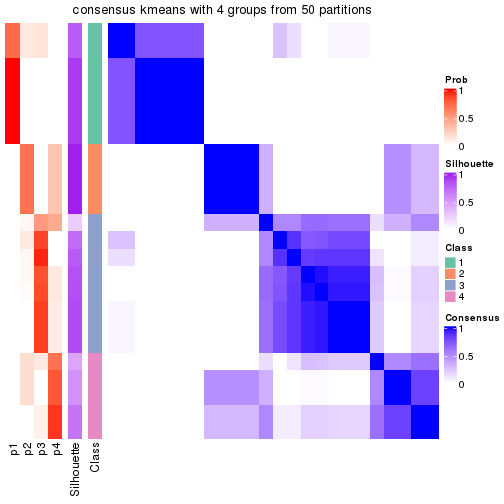</p>

</div>
<div id='tab-node-01132-consensus-heatmap-4'>
<pre><code class="r">consensus_heatmap(res, k = 5)
</code></pre>

<p>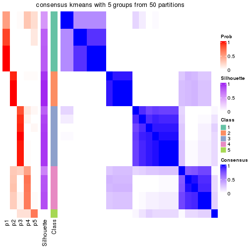</p>

</div>
<div id='tab-node-01132-consensus-heatmap-5'>
<pre><code class="r">consensus_heatmap(res, k = 6)
</code></pre>

<p>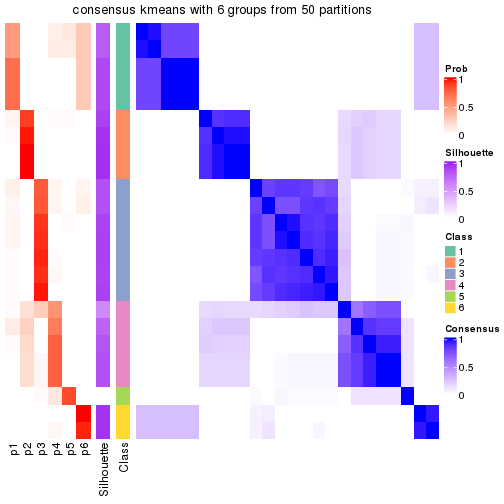</p>

</div>
<div id='tab-node-01132-consensus-heatmap-6'>
<pre><code class="r">consensus_heatmap(res, k = 7)
</code></pre>

<p>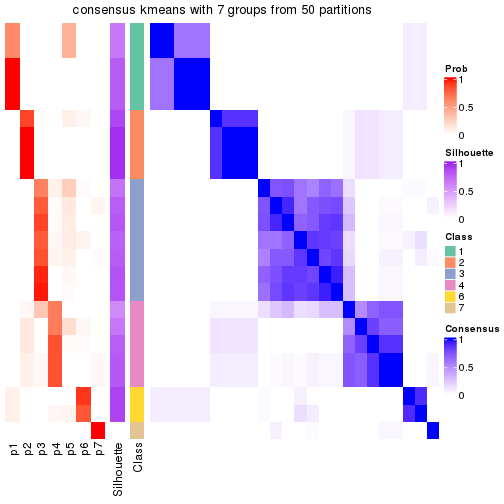</p>

</div>
<div id='tab-node-01132-consensus-heatmap-7'>
<pre><code class="r">consensus_heatmap(res, k = 8)
</code></pre>

<p>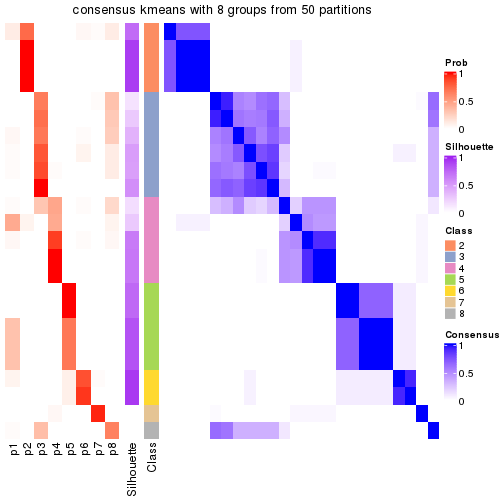</p>

</div>
</div>

Heatmaps for the membership of samples in all partitions to see how consistent they are:


<script>
$( function() {
	$( '#tabs-node-01132-membership-heatmap' ).tabs();
} );
</script>
<div id='tabs-node-01132-membership-heatmap'>
<ul>
<li><a href='#tab-node-01132-membership-heatmap-1'>k = 2</a></li>
<li><a href='#tab-node-01132-membership-heatmap-2'>k = 3</a></li>
<li><a href='#tab-node-01132-membership-heatmap-3'>k = 4</a></li>
<li><a href='#tab-node-01132-membership-heatmap-4'>k = 5</a></li>
<li><a href='#tab-node-01132-membership-heatmap-5'>k = 6</a></li>
<li><a href='#tab-node-01132-membership-heatmap-6'>k = 7</a></li>
<li><a href='#tab-node-01132-membership-heatmap-7'>k = 8</a></li>
</ul>
<div id='tab-node-01132-membership-heatmap-1'>
<pre><code class="r">membership_heatmap(res, k = 2)
</code></pre>

<p>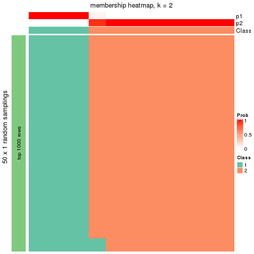</p>

</div>
<div id='tab-node-01132-membership-heatmap-2'>
<pre><code class="r">membership_heatmap(res, k = 3)
</code></pre>

<p>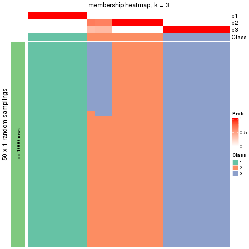</p>

</div>
<div id='tab-node-01132-membership-heatmap-3'>
<pre><code class="r">membership_heatmap(res, k = 4)
</code></pre>

<p>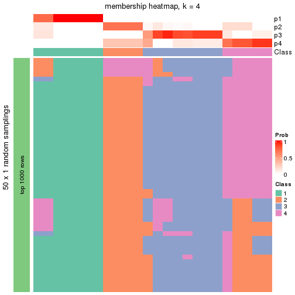</p>

</div>
<div id='tab-node-01132-membership-heatmap-4'>
<pre><code class="r">membership_heatmap(res, k = 5)
</code></pre>

<p>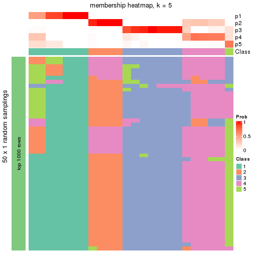</p>

</div>
<div id='tab-node-01132-membership-heatmap-5'>
<pre><code class="r">membership_heatmap(res, k = 6)
</code></pre>

<p>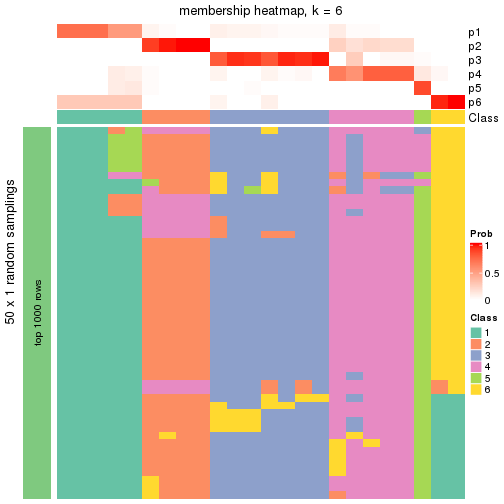</p>

</div>
<div id='tab-node-01132-membership-heatmap-6'>
<pre><code class="r">membership_heatmap(res, k = 7)
</code></pre>

<p>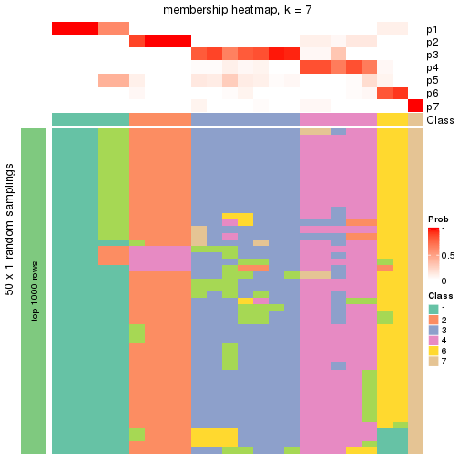</p>

</div>
<div id='tab-node-01132-membership-heatmap-7'>
<pre><code class="r">membership_heatmap(res, k = 8)
</code></pre>

<p>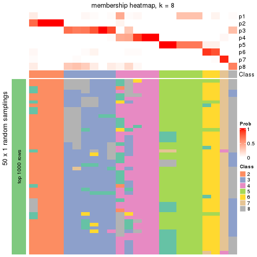</p>

</div>
</div>

As soon as the classes for columns are determined, the signatures
that are significantly different between subgroups can be looked for. 
Following are the heatmaps for signatures.


<script>
$( function() {
	$( '#tabs-node-01132-get-signatures' ).tabs();
} );
</script>
<div id='tabs-node-01132-get-signatures'>
<ul>
<li><a href='#tab-node-01132-get-signatures-1'>k = 2</a></li>
<li><a href='#tab-node-01132-get-signatures-2'>k = 3</a></li>
<li><a href='#tab-node-01132-get-signatures-3'>k = 4</a></li>
<li><a href='#tab-node-01132-get-signatures-4'>k = 5</a></li>
<li><a href='#tab-node-01132-get-signatures-5'>k = 6</a></li>
<li><a href='#tab-node-01132-get-signatures-6'>k = 7</a></li>
<li><a href='#tab-node-01132-get-signatures-7'>k = 8</a></li>
</ul>
<div id='tab-node-01132-get-signatures-1'>
<pre><code class="r">get_signatures(res, k = 2)
</code></pre>

<p>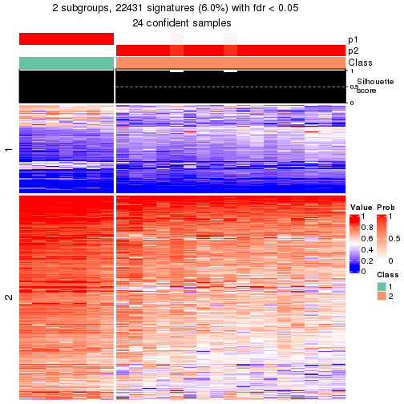</p>

</div>
<div id='tab-node-01132-get-signatures-2'>
<pre><code class="r">get_signatures(res, k = 3)
</code></pre>

<p>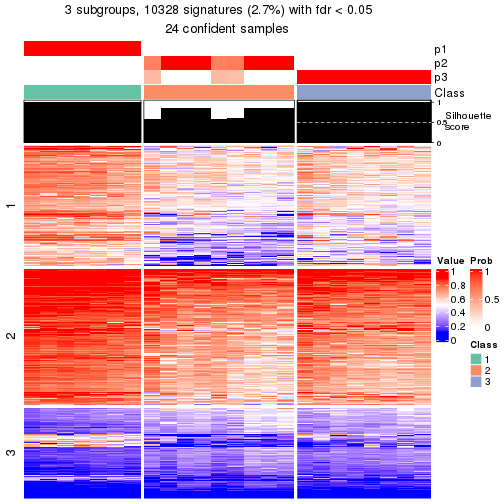</p>

</div>
<div id='tab-node-01132-get-signatures-3'>
<pre><code class="r">get_signatures(res, k = 4)
</code></pre>

<p>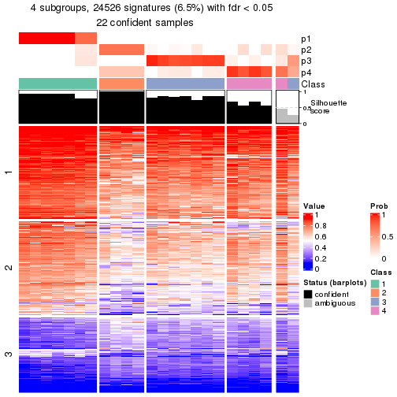</p>

</div>
<div id='tab-node-01132-get-signatures-4'>
<pre><code class="r">get_signatures(res, k = 5)
</code></pre>

<p>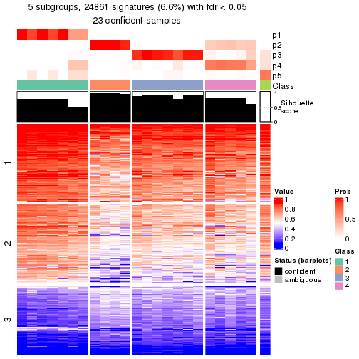</p>

</div>
<div id='tab-node-01132-get-signatures-5'>
<pre><code class="r">get_signatures(res, k = 6)
</code></pre>

<p>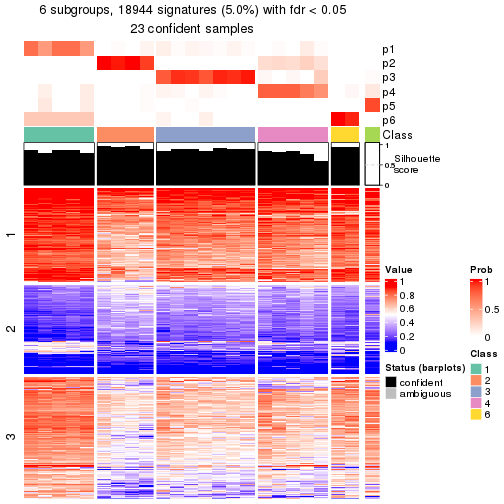</p>

</div>
<div id='tab-node-01132-get-signatures-6'>
<pre><code class="r">get_signatures(res, k = 7)
</code></pre>

<p>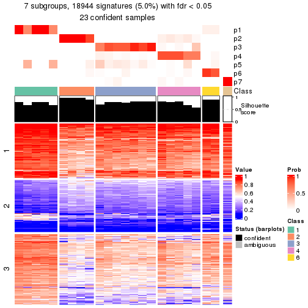</p>

</div>
<div id='tab-node-01132-get-signatures-7'>
<pre><code class="r">get_signatures(res, k = 8)
</code></pre>

<p>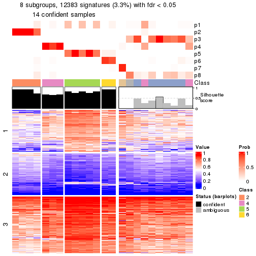</p>

</div>
</div>


Compare the overlap of signatures from different k:

```r
compare_signatures(res)
```

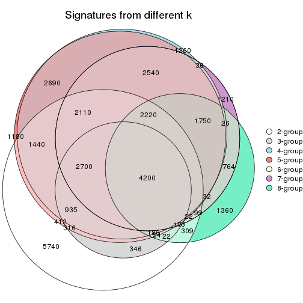

`get_signature()` returns a data frame invisibly. To get the list of signatures, the function
call should be assigned to a variable explicitly. In following code, if `plot` argument is set
to `FALSE`, no heatmap is plotted while only the differential analysis is performed.

```r
# code only for demonstration
tb = get_signature(res, k = ..., plot = FALSE)
```

An example of the output of `tb` is:

```
#>   which_row         fdr    mean_1    mean_2 scaled_mean_1 scaled_mean_2 km
#> 1        38 0.042760348  8.373488  9.131774    -0.5533452     0.5164555  1
#> 2        40 0.018707592  7.106213  8.469186    -0.6173731     0.5762149  1
#> 3        55 0.019134737 10.221463 11.207825    -0.6159697     0.5749050  1
#> 4        59 0.006059896  5.921854  7.869574    -0.6899429     0.6439467  1
#> 5        60 0.018055526  8.928898 10.211722    -0.6204761     0.5791110  1
#> 6        98 0.009384629 15.714769 14.887706     0.6635654    -0.6193277  2
...
```

The columns in `tb` are:

1. `which_row`: row indices corresponding to the input matrix.
2. `fdr`: FDR for the differential test. 
3. `mean_x`: The mean value in group x.
4. `scaled_mean_x`: The mean value in group x after rows are scaled.
5. `km`: Row groups if k-means clustering is applied to rows (which is done by automatically selecting number of clusters).

If there are too many signatures, `top_signatures = ...` can be set to only show the 
signatures with the highest FDRs:

```r
# code only for demonstration
# e.g. to show the top 500 most significant rows
tb = get_signature(res, k = ..., top_signatures = 500)
```

If the signatures are defined as these which are uniquely high in current group, `diff_method` argument
can be set to `"uniquely_high_in_one_group"`:

```r
# code only for demonstration
tb = get_signature(res, k = ..., diff_method = "uniquely_high_in_one_group")
```


UMAP plot which shows how samples are separated.


<script>
$( function() {
	$( '#tabs-node-01132-dimension-reduction' ).tabs();
} );
</script>
<div id='tabs-node-01132-dimension-reduction'>
<ul>
<li><a href='#tab-node-01132-dimension-reduction-1'>k = 2</a></li>
<li><a href='#tab-node-01132-dimension-reduction-2'>k = 3</a></li>
<li><a href='#tab-node-01132-dimension-reduction-3'>k = 4</a></li>
<li><a href='#tab-node-01132-dimension-reduction-4'>k = 5</a></li>
<li><a href='#tab-node-01132-dimension-reduction-5'>k = 6</a></li>
<li><a href='#tab-node-01132-dimension-reduction-6'>k = 7</a></li>
<li><a href='#tab-node-01132-dimension-reduction-7'>k = 8</a></li>
</ul>
<div id='tab-node-01132-dimension-reduction-1'>
<pre><code class="r">dimension_reduction(res, k = 2, method = &quot;UMAP&quot;)
</code></pre>

<p>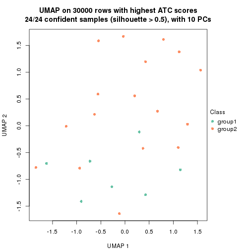</p>

</div>
<div id='tab-node-01132-dimension-reduction-2'>
<pre><code class="r">dimension_reduction(res, k = 3, method = &quot;UMAP&quot;)
</code></pre>

<p>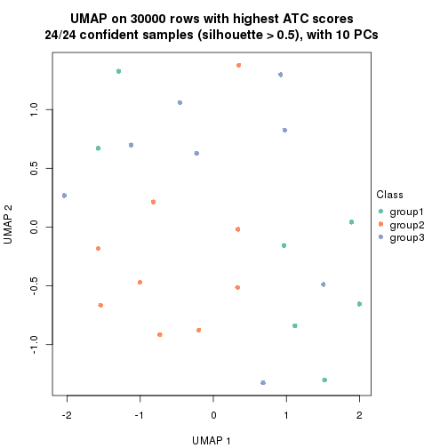</p>

</div>
<div id='tab-node-01132-dimension-reduction-3'>
<pre><code class="r">dimension_reduction(res, k = 4, method = &quot;UMAP&quot;)
</code></pre>

<p>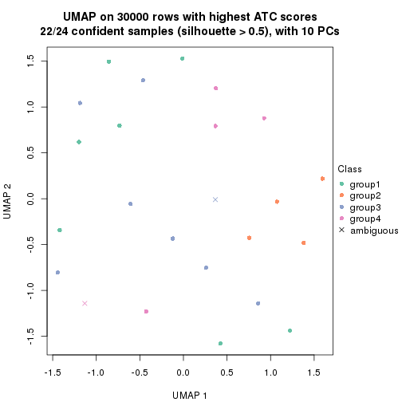</p>

</div>
<div id='tab-node-01132-dimension-reduction-4'>
<pre><code class="r">dimension_reduction(res, k = 5, method = &quot;UMAP&quot;)
</code></pre>

<p>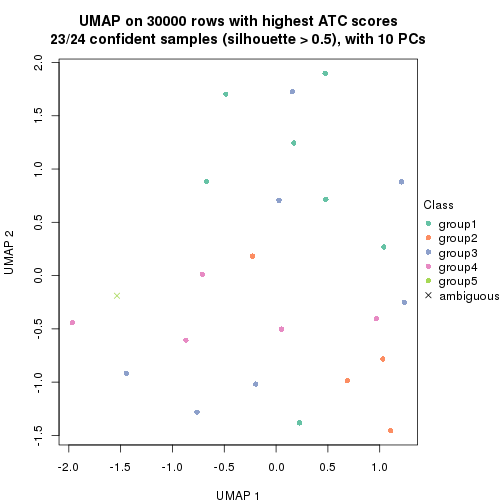</p>

</div>
<div id='tab-node-01132-dimension-reduction-5'>
<pre><code class="r">dimension_reduction(res, k = 6, method = &quot;UMAP&quot;)
</code></pre>

<p>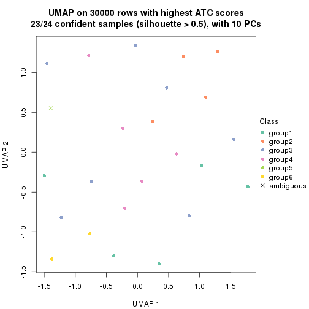</p>

</div>
<div id='tab-node-01132-dimension-reduction-6'>
<pre><code class="r">dimension_reduction(res, k = 7, method = &quot;UMAP&quot;)
</code></pre>

<p>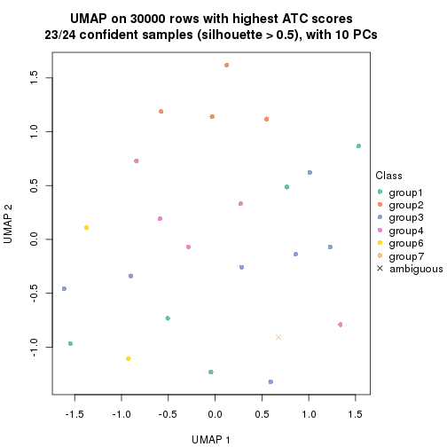</p>

</div>
<div id='tab-node-01132-dimension-reduction-7'>
<pre><code class="r">dimension_reduction(res, k = 8, method = &quot;UMAP&quot;)
</code></pre>

<p>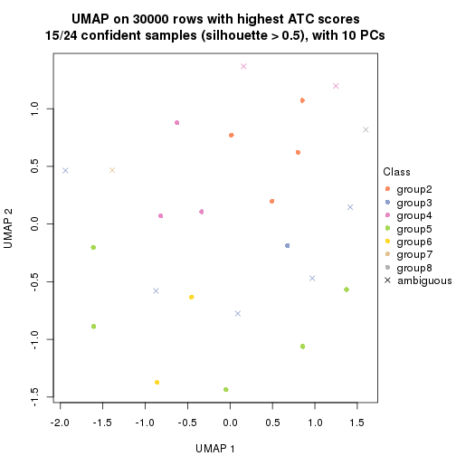</p>

</div>
</div>


Following heatmap shows how subgroups are split when increasing `k`:

```r
collect_classes(res)
```

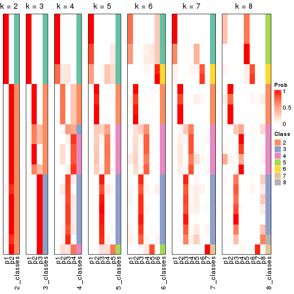


If matrix rows can be associated to genes, consider to use `functional_enrichment(res,
...)` to perform function enrichment for the signature genes. See [this vignette](https://jokergoo.github.io/cola_vignettes/functional_enrichment.html) for more detailed explanations.


 

---------------------------------------------------


### Node011322


Parent node: [Node01132](#Node01132).
Child nodes: 
                Node0113221-leaf
        ,
                Node0113222-leaf
        ,
                Node0113223-leaf
        .


The object with results only for a single top-value method and a single partitioning method 
can be extracted as:

```r
res = res_rh["011322"]
```

A summary of `res` and all the functions that can be applied to it:

```r
res
```

```
#> A 'ConsensusPartition' object with k = 2, 3, 4, 5, 6, 7, 8.
#>   On a matrix with 30000 rows and 17 columns.
#>   Top rows (1000) are extracted by 'ATC' method.
#>   Subgroups are detected by 'skmeans' method.
#>   Performed in total 350 partitions by row resampling.
#>   Best k for subgroups seems to be 3.
#> 
#> Following methods can be applied to this 'ConsensusPartition' object:
#>  [1] "cola_report"             "collect_classes"         "collect_plots"          
#>  [4] "collect_stats"           "colnames"                "compare_partitions"     
#>  [7] "compare_signatures"      "consensus_heatmap"       "dimension_reduction"    
#> [10] "functional_enrichment"   "get_anno_col"            "get_anno"               
#> [13] "get_classes"             "get_consensus"           "get_matrix"             
#> [16] "get_membership"          "get_param"               "get_signatures"         
#> [19] "get_stats"               "is_best_k"               "is_stable_k"            
#> [22] "membership_heatmap"      "ncol"                    "nrow"                   
#> [25] "plot_ecdf"               "predict_classes"         "rownames"               
#> [28] "select_partition_number" "show"                    "suggest_best_k"         
#> [31] "test_to_known_factors"   "top_rows_heatmap"
```

`collect_plots()` function collects all the plots made from `res` for all `k` (number of subgroups)
into one single page to provide an easy and fast comparison between different `k`.

```r
collect_plots(res)
```

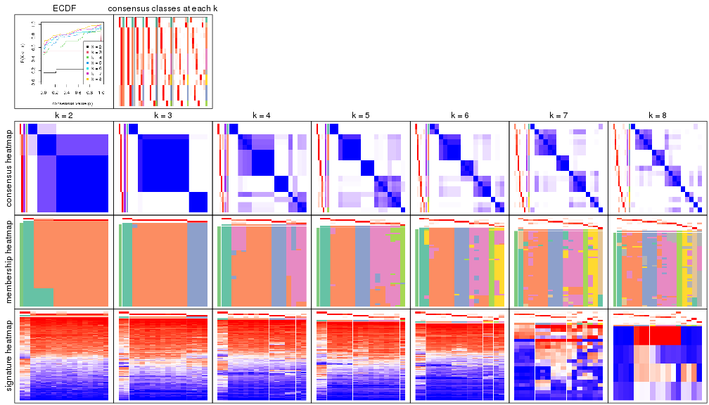

The plots are:

- The first row: a plot of the eCDF (empirical cumulative distribution
  function) curves of the consensus matrix for each `k` and the heatmap of
  predicted classes for each `k`.
- The second row: heatmaps of the consensus matrix for each `k`.
- The third row: heatmaps of the membership matrix for each `k`.
- The fouth row: heatmaps of the signatures for each `k`.

All the plots in panels can be made by individual functions and they are
plotted later in this section.

`select_partition_number()` produces several plots showing different
statistics for choosing "optimized" `k`. There are following statistics:

- eCDF curves of the consensus matrix for each `k`;
- 1-PAC. [The PAC score](https://en.wikipedia.org/wiki/Consensus_clustering#Over-interpretation_potential_of_consensus_clustering)
  measures the proportion of the ambiguous subgrouping.
- Mean silhouette score.
- Concordance. The mean probability of fiting the consensus subgroup labels in all
  partitions.
- Area increased. Denote $A_k$ as the area under the eCDF curve for current
  `k`, the area increased is defined as $A_k - A_{k-1}$.
- Rand index. The percent of pairs of samples that are both in a same cluster
  or both are not in a same cluster in the partition of k and k-1.
- Jaccard index. The ratio of pairs of samples are both in a same cluster in
  the partition of k and k-1 and the pairs of samples are both in a same
  cluster in the partition k or k-1.

The detailed explanations of these statistics can be found in [the _cola_
vignette](https://jokergoo.github.io/cola_vignettes/cola.html#toc_13).

Generally speaking, higher 1-PAC score, higher mean silhouette score or higher
concordance corresponds to better partition. Rand index and Jaccard index
measure how similar the current partition is compared to partition with `k-1`.
If they are too similar, we won't accept `k` is better than `k-1`.

```r
select_partition_number(res)
```

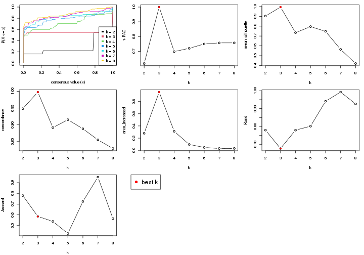

The numeric values for all these statistics can be obtained by `get_stats()`.

```r
get_stats(res)
```

```
#>   k 1-PAC mean_silhouette concordance area_increased  Rand Jaccard
#> 2 2 0.618           0.903       0.948         0.2794 0.779   0.779
#> 3 3 1.000           0.995       0.998         0.9553 0.676   0.585
#> 4 4 0.699           0.734       0.892         0.3119 0.779   0.538
#> 5 5 0.721           0.796       0.915         0.0964 0.801   0.426
#> 6 6 0.750           0.747       0.888         0.0473 0.941   0.724
#> 7 7 0.757           0.564       0.855         0.0300 0.993   0.952
#> 8 8 0.757           0.420       0.829         0.0314 0.926   0.565
```

`suggest_best_k()` suggests the best $k$ based on these statistics. The rules are as follows:

- All $k$ with Jaccard index larger than 0.95 are removed because increasing
  $k$ does not provide enough extra information. If all $k$ are removed, it is
  marked as no subgroup is detected.
- For all $k$ with 1-PAC score larger than 0.9, the maximal $k$ is taken as
  the best $k$, and other $k$ are marked as optional $k$.
- If it does not fit the second rule. The $k$ with the maximal vote of the
  highest 1-PAC score, highest mean silhouette, and highest concordance is
  taken as the best $k$.

```r
suggest_best_k(res)
```

```
#> [1] 3
```


Following is the table of the partitions (You need to click the **show/hide
code output** link to see it). The membership matrix (columns with name `p*`)
is inferred by
[`clue::cl_consensus()`](https://www.rdocumentation.org/link/cl_consensus?package=clue)
function with the `SE` method. Basically the value in the membership matrix
represents the probability to belong to a certain group. The finall subgroup
label for an item is determined with the group with highest probability it
belongs to.

In `get_classes()` function, the entropy is calculated from the membership
matrix and the silhouette score is calculated from the consensus matrix.


<script>
$( function() {
	$( '#tabs-node-011322-get-classes' ).tabs();
} );
</script>
<div id='tabs-node-011322-get-classes'>
<ul>
<li><a href='#tab-node-011322-get-classes-1'>k = 2</a></li>
<li><a href='#tab-node-011322-get-classes-2'>k = 3</a></li>
<li><a href='#tab-node-011322-get-classes-3'>k = 4</a></li>
<li><a href='#tab-node-011322-get-classes-4'>k = 5</a></li>
<li><a href='#tab-node-011322-get-classes-5'>k = 6</a></li>
<li><a href='#tab-node-011322-get-classes-6'>k = 7</a></li>
<li><a href='#tab-node-011322-get-classes-7'>k = 8</a></li>
</ul>

<div id='tab-node-011322-get-classes-1'>
<p><a id='tab-node-011322-get-classes-1-a' style='color:#0366d6' href='#'>show/hide code output</a></p>
<pre><code class="r">cbind(get_classes(res, k = 2), get_membership(res, k = 2))
</code></pre>

<pre><code>#&gt;                 class entropy silhouette   p1   p2
#&gt; TCGA.G4.6306.01     2    0.76      0.778 0.22 0.78
#&gt; TCGA.NH.A6GA.01     1    0.00      1.000 1.00 0.00
#&gt; TCGA.DM.A288.01     2    0.76      0.778 0.22 0.78
#&gt; TCGA.G4.6298.01     2    0.00      0.931 0.00 1.00
#&gt; TCGA.D5.5539.01     2    0.00      0.931 0.00 1.00
#&gt; TCGA.AA.3495.01     2    0.00      0.931 0.00 1.00
#&gt; TCGA.AD.6899.01     2    0.00      0.931 0.00 1.00
#&gt; TCGA.CM.5348.01     1    0.00      1.000 1.00 0.00
#&gt; TCGA.F4.6463.01     2    0.00      0.931 0.00 1.00
#&gt; TCGA.CA.6719.01     2    0.76      0.778 0.22 0.78
#&gt; TCGA.AZ.4315.01     2    0.00      0.931 0.00 1.00
#&gt; TCGA.D5.5537.01     2    0.00      0.931 0.00 1.00
#&gt; TCGA.NH.A8F8.01     2    0.00      0.931 0.00 1.00
#&gt; TCGA.5M.AAT4.01     2    0.76      0.778 0.22 0.78
#&gt; TCGA.D5.6541.01     2    0.00      0.931 0.00 1.00
#&gt; TCGA.AD.6901.01     2    0.00      0.931 0.00 1.00
#&gt; TCGA.CM.4747.01     2    0.00      0.931 0.00 1.00
</code></pre>

<script>
$('#tab-node-011322-get-classes-1-a').parent().next().next().hide();
$('#tab-node-011322-get-classes-1-a').click(function(){
  $('#tab-node-011322-get-classes-1-a').parent().next().next().toggle();
  return(false);
});
</script>
</div>

<div id='tab-node-011322-get-classes-2'>
<p><a id='tab-node-011322-get-classes-2-a' style='color:#0366d6' href='#'>show/hide code output</a></p>
<pre><code class="r">cbind(get_classes(res, k = 3), get_membership(res, k = 3))
</code></pre>

<pre><code>#&gt;                 class entropy silhouette p1   p2   p3
#&gt; TCGA.G4.6306.01     3   0.000      1.000  0 0.00 1.00
#&gt; TCGA.NH.A6GA.01     1   0.000      1.000  1 0.00 0.00
#&gt; TCGA.DM.A288.01     3   0.000      1.000  0 0.00 1.00
#&gt; TCGA.G4.6298.01     2   0.000      0.996  0 1.00 0.00
#&gt; TCGA.D5.5539.01     2   0.000      0.996  0 1.00 0.00
#&gt; TCGA.AA.3495.01     2   0.000      0.996  0 1.00 0.00
#&gt; TCGA.AD.6899.01     2   0.000      0.996  0 1.00 0.00
#&gt; TCGA.CM.5348.01     1   0.000      1.000  1 0.00 0.00
#&gt; TCGA.F4.6463.01     2   0.000      0.996  0 1.00 0.00
#&gt; TCGA.CA.6719.01     3   0.000      1.000  0 0.00 1.00
#&gt; TCGA.AZ.4315.01     2   0.000      0.996  0 1.00 0.00
#&gt; TCGA.D5.5537.01     2   0.000      0.996  0 1.00 0.00
#&gt; TCGA.NH.A8F8.01     2   0.000      0.996  0 1.00 0.00
#&gt; TCGA.5M.AAT4.01     3   0.000      1.000  0 0.00 1.00
#&gt; TCGA.D5.6541.01     2   0.000      0.996  0 1.00 0.00
#&gt; TCGA.AD.6901.01     2   0.000      0.996  0 1.00 0.00
#&gt; TCGA.CM.4747.01     2   0.153      0.956  0 0.96 0.04
</code></pre>

<script>
$('#tab-node-011322-get-classes-2-a').parent().next().next().hide();
$('#tab-node-011322-get-classes-2-a').click(function(){
  $('#tab-node-011322-get-classes-2-a').parent().next().next().toggle();
  return(false);
});
</script>
</div>

<div id='tab-node-011322-get-classes-3'>
<p><a id='tab-node-011322-get-classes-3-a' style='color:#0366d6' href='#'>show/hide code output</a></p>
<pre><code class="r">cbind(get_classes(res, k = 4), get_membership(res, k = 4))
</code></pre>

<pre><code>#&gt;                 class entropy silhouette p1   p2   p3   p4
#&gt; TCGA.G4.6306.01     3   0.000      1.000  0 0.00 1.00 0.00
#&gt; TCGA.NH.A6GA.01     1   0.000      1.000  1 0.00 0.00 0.00
#&gt; TCGA.DM.A288.01     4   0.441      0.224  0 0.00 0.30 0.70
#&gt; TCGA.G4.6298.01     2   0.000      0.817  0 1.00 0.00 0.00
#&gt; TCGA.D5.5539.01     2   0.000      0.817  0 1.00 0.00 0.00
#&gt; TCGA.AA.3495.01     2   0.648      0.501  0 0.60 0.10 0.30
#&gt; TCGA.AD.6899.01     2   0.441      0.614  0 0.70 0.00 0.30
#&gt; TCGA.CM.5348.01     1   0.000      1.000  1 0.00 0.00 0.00
#&gt; TCGA.F4.6463.01     2   0.000      0.817  0 1.00 0.00 0.00
#&gt; TCGA.CA.6719.01     3   0.000      1.000  0 0.00 1.00 0.00
#&gt; TCGA.AZ.4315.01     4   0.201      0.674  0 0.08 0.00 0.92
#&gt; TCGA.D5.5537.01     4   0.479      0.110  0 0.38 0.00 0.62
#&gt; TCGA.NH.A8F8.01     2   0.000      0.817  0 1.00 0.00 0.00
#&gt; TCGA.5M.AAT4.01     3   0.000      1.000  0 0.00 1.00 0.00
#&gt; TCGA.D5.6541.01     2   0.000      0.817  0 1.00 0.00 0.00
#&gt; TCGA.AD.6901.01     2   0.506      0.599  0 0.68 0.02 0.30
#&gt; TCGA.CM.4747.01     4   0.164      0.672  0 0.06 0.00 0.94
</code></pre>

<script>
$('#tab-node-011322-get-classes-3-a').parent().next().next().hide();
$('#tab-node-011322-get-classes-3-a').click(function(){
  $('#tab-node-011322-get-classes-3-a').parent().next().next().toggle();
  return(false);
});
</script>
</div>

<div id='tab-node-011322-get-classes-4'>
<p><a id='tab-node-011322-get-classes-4-a' style='color:#0366d6' href='#'>show/hide code output</a></p>
<pre><code class="r">cbind(get_classes(res, k = 5), get_membership(res, k = 5))
</code></pre>

<pre><code>#&gt;                 class entropy silhouette p1   p2   p3   p4   p5
#&gt; TCGA.G4.6306.01     3  0.0000      1.000  0 0.00 1.00 0.00 0.00
#&gt; TCGA.NH.A6GA.01     1  0.0000      1.000  1 0.00 0.00 0.00 0.00
#&gt; TCGA.DM.A288.01     5  0.0609      0.000  0 0.00 0.02 0.00 0.98
#&gt; TCGA.G4.6298.01     2  0.0000      0.969  0 1.00 0.00 0.00 0.00
#&gt; TCGA.D5.5539.01     2  0.0000      0.969  0 1.00 0.00 0.00 0.00
#&gt; TCGA.AA.3495.01     4  0.5733      0.592  0 0.22 0.16 0.62 0.00
#&gt; TCGA.AD.6899.01     4  0.3274      0.700  0 0.22 0.00 0.78 0.00
#&gt; TCGA.CM.5348.01     1  0.0000      1.000  1 0.00 0.00 0.00 0.00
#&gt; TCGA.F4.6463.01     2  0.0000      0.969  0 1.00 0.00 0.00 0.00
#&gt; TCGA.CA.6719.01     3  0.0000      1.000  0 0.00 1.00 0.00 0.00
#&gt; TCGA.AZ.4315.01     4  0.3690      0.543  0 0.02 0.00 0.78 0.20
#&gt; TCGA.D5.5537.01     4  0.1648      0.684  0 0.04 0.00 0.94 0.02
#&gt; TCGA.NH.A8F8.01     2  0.2020      0.867  0 0.90 0.00 0.10 0.00
#&gt; TCGA.5M.AAT4.01     3  0.0000      1.000  0 0.00 1.00 0.00 0.00
#&gt; TCGA.D5.6541.01     2  0.0000      0.969  0 1.00 0.00 0.00 0.00
#&gt; TCGA.AD.6901.01     4  0.3561      0.678  0 0.26 0.00 0.74 0.00
#&gt; TCGA.CM.4747.01     4  0.2929      0.589  0 0.00 0.00 0.82 0.18
</code></pre>

<script>
$('#tab-node-011322-get-classes-4-a').parent().next().next().hide();
$('#tab-node-011322-get-classes-4-a').click(function(){
  $('#tab-node-011322-get-classes-4-a').parent().next().next().toggle();
  return(false);
});
</script>
</div>

<div id='tab-node-011322-get-classes-5'>
<p><a id='tab-node-011322-get-classes-5-a' style='color:#0366d6' href='#'>show/hide code output</a></p>
<pre><code class="r">cbind(get_classes(res, k = 6), get_membership(res, k = 6))
</code></pre>

<pre><code>#&gt;                 class entropy silhouette   p1   p2   p3   p4   p5   p6
#&gt; TCGA.G4.6306.01     3  0.0547      0.976 0.00 0.00 0.98 0.00 0.00 0.02
#&gt; TCGA.NH.A6GA.01     1  0.0000      0.789 1.00 0.00 0.00 0.00 0.00 0.00
#&gt; TCGA.DM.A288.01     5  0.0547      0.000 0.00 0.00 0.00 0.00 0.98 0.02
#&gt; TCGA.G4.6298.01     2  0.0937      0.927 0.00 0.96 0.00 0.04 0.00 0.00
#&gt; TCGA.D5.5539.01     2  0.0000      0.942 0.00 1.00 0.00 0.00 0.00 0.00
#&gt; TCGA.AA.3495.01     4  0.4938      0.421 0.00 0.08 0.34 0.58 0.00 0.00
#&gt; TCGA.AD.6899.01     4  0.2260      0.702 0.00 0.14 0.00 0.86 0.00 0.00
#&gt; TCGA.CM.5348.01     1  0.3460      0.789 0.76 0.00 0.00 0.00 0.02 0.22
#&gt; TCGA.F4.6463.01     2  0.0000      0.942 0.00 1.00 0.00 0.00 0.00 0.00
#&gt; TCGA.CA.6719.01     3  0.0000      0.981 0.00 0.00 1.00 0.00 0.00 0.00
#&gt; TCGA.AZ.4315.01     6  0.3976      0.679 0.00 0.02 0.00 0.22 0.02 0.74
#&gt; TCGA.D5.5537.01     4  0.0937      0.513 0.00 0.00 0.00 0.96 0.00 0.04
#&gt; TCGA.NH.A8F8.01     2  0.2454      0.804 0.00 0.84 0.00 0.16 0.00 0.00
#&gt; TCGA.5M.AAT4.01     3  0.0547      0.975 0.00 0.00 0.98 0.00 0.00 0.02
#&gt; TCGA.D5.6541.01     2  0.0000      0.942 0.00 1.00 0.00 0.00 0.00 0.00
#&gt; TCGA.AD.6901.01     4  0.2260      0.702 0.00 0.14 0.00 0.86 0.00 0.00
#&gt; TCGA.CM.4747.01     6  0.3828      0.620 0.00 0.00 0.00 0.44 0.00 0.56
</code></pre>

<script>
$('#tab-node-011322-get-classes-5-a').parent().next().next().hide();
$('#tab-node-011322-get-classes-5-a').click(function(){
  $('#tab-node-011322-get-classes-5-a').parent().next().next().toggle();
  return(false);
});
</script>
</div>

<div id='tab-node-011322-get-classes-6'>
<p><a id='tab-node-011322-get-classes-6-a' style='color:#0366d6' href='#'>show/hide code output</a></p>
<pre><code class="r">cbind(get_classes(res, k = 7), get_membership(res, k = 7))
</code></pre>

<pre><code>#&gt;                 class entropy silhouette   p1   p2   p3   p4   p5   p6  p7
#&gt; TCGA.G4.6306.01     3  0.1664      0.927 0.06 0.00 0.92 0.02 0.00 0.00 0.0
#&gt; TCGA.NH.A6GA.01     1  0.3459      0.000 0.60 0.00 0.00 0.00 0.00 0.00 0.4
#&gt; TCGA.DM.A288.01     5  0.0000      0.000 0.00 0.00 0.00 0.00 1.00 0.00 0.0
#&gt; TCGA.G4.6298.01     2  0.2081      0.770 0.00 0.86 0.00 0.14 0.00 0.00 0.0
#&gt; TCGA.D5.5539.01     2  0.2163      0.711 0.10 0.88 0.00 0.00 0.00 0.02 0.0
#&gt; TCGA.AA.3495.01     4  0.2804      0.729 0.02 0.06 0.06 0.86 0.00 0.00 0.0
#&gt; TCGA.AD.6899.01     4  0.1928      0.761 0.00 0.08 0.00 0.90 0.00 0.02 0.0
#&gt; TCGA.CM.5348.01     7  0.0000      0.000 0.00 0.00 0.00 0.00 0.00 0.00 1.0
#&gt; TCGA.F4.6463.01     2  0.0863      0.801 0.00 0.96 0.00 0.04 0.00 0.00 0.0
#&gt; TCGA.CA.6719.01     3  0.0000      0.964 0.00 0.00 1.00 0.00 0.00 0.00 0.0
#&gt; TCGA.AZ.4315.01     6  0.0863      0.517 0.00 0.00 0.00 0.04 0.00 0.96 0.0
#&gt; TCGA.D5.5537.01     4  0.4873      0.130 0.22 0.00 0.00 0.60 0.00 0.18 0.0
#&gt; TCGA.NH.A8F8.01     2  0.3525      0.267 0.00 0.56 0.00 0.44 0.00 0.00 0.0
#&gt; TCGA.5M.AAT4.01     3  0.0000      0.964 0.00 0.00 1.00 0.00 0.00 0.00 0.0
#&gt; TCGA.D5.6541.01     2  0.1363      0.800 0.02 0.94 0.00 0.04 0.00 0.00 0.0
#&gt; TCGA.AD.6901.01     4  0.1433      0.764 0.00 0.08 0.00 0.92 0.00 0.00 0.0
#&gt; TCGA.CM.4747.01     6  0.5065      0.478 0.10 0.00 0.00 0.30 0.02 0.58 0.0
</code></pre>

<script>
$('#tab-node-011322-get-classes-6-a').parent().next().next().hide();
$('#tab-node-011322-get-classes-6-a').click(function(){
  $('#tab-node-011322-get-classes-6-a').parent().next().next().toggle();
  return(false);
});
</script>
</div>

<div id='tab-node-011322-get-classes-7'>
<p><a id='tab-node-011322-get-classes-7-a' style='color:#0366d6' href='#'>show/hide code output</a></p>
<pre><code class="r">cbind(get_classes(res, k = 8), get_membership(res, k = 8))
</code></pre>

<pre><code>#&gt;                 class entropy silhouette   p1   p2   p3   p4 p5   p6   p7   p8
#&gt; TCGA.G4.6306.01     3  0.2569      0.803 0.02 0.00 0.82 0.00  0 0.00 0.00 0.16
#&gt; TCGA.NH.A6GA.01     1  0.2114      0.000 0.84 0.00 0.00 0.00  0 0.00 0.16 0.00
#&gt; TCGA.DM.A288.01     5  0.0000      0.000 0.00 0.00 0.00 0.00  1 0.00 0.00 0.00
#&gt; TCGA.G4.6298.01     2  0.2994      0.701 0.00 0.80 0.00 0.14  0 0.00 0.00 0.06
#&gt; TCGA.D5.5539.01     2  0.4031      0.642 0.10 0.72 0.00 0.00  0 0.02 0.00 0.16
#&gt; TCGA.AA.3495.01     4  0.3601      0.412 0.00 0.02 0.16 0.76  0 0.00 0.00 0.06
#&gt; TCGA.AD.6899.01     4  0.1275      0.451 0.00 0.02 0.00 0.94  0 0.00 0.00 0.04
#&gt; TCGA.CM.5348.01     7  0.0000      0.000 0.00 0.00 0.00 0.00  0 0.00 1.00 0.00
#&gt; TCGA.F4.6463.01     2  0.0000      0.799 0.00 1.00 0.00 0.00  0 0.00 0.00 0.00
#&gt; TCGA.CA.6719.01     3  0.1741      0.858 0.04 0.00 0.92 0.02  0 0.00 0.00 0.02
#&gt; TCGA.AZ.4315.01     6  0.0000      0.301 0.00 0.00 0.00 0.00  0 1.00 0.00 0.00
#&gt; TCGA.D5.5537.01     8  0.3318      0.000 0.00 0.00 0.00 0.46  0 0.00 0.00 0.54
#&gt; TCGA.NH.A8F8.01     4  0.3943      0.160 0.00 0.40 0.00 0.56  0 0.00 0.00 0.04
#&gt; TCGA.5M.AAT4.01     3  0.0000      0.877 0.00 0.00 1.00 0.00  0 0.00 0.00 0.00
#&gt; TCGA.D5.6541.01     2  0.1341      0.783 0.00 0.92 0.00 0.08  0 0.00 0.00 0.00
#&gt; TCGA.AD.6901.01     4  0.0471      0.494 0.00 0.02 0.00 0.98  0 0.00 0.00 0.00
#&gt; TCGA.CM.4747.01     6  0.5165     -0.138 0.00 0.00 0.00 0.28  0 0.44 0.00 0.28
</code></pre>

<script>
$('#tab-node-011322-get-classes-7-a').parent().next().next().hide();
$('#tab-node-011322-get-classes-7-a').click(function(){
  $('#tab-node-011322-get-classes-7-a').parent().next().next().toggle();
  return(false);
});
</script>
</div>
</div>

Heatmaps for the consensus matrix. It visualizes the probability of two
samples to be in a same group.


<script>
$( function() {
	$( '#tabs-node-011322-consensus-heatmap' ).tabs();
} );
</script>
<div id='tabs-node-011322-consensus-heatmap'>
<ul>
<li><a href='#tab-node-011322-consensus-heatmap-1'>k = 2</a></li>
<li><a href='#tab-node-011322-consensus-heatmap-2'>k = 3</a></li>
<li><a href='#tab-node-011322-consensus-heatmap-3'>k = 4</a></li>
<li><a href='#tab-node-011322-consensus-heatmap-4'>k = 5</a></li>
<li><a href='#tab-node-011322-consensus-heatmap-5'>k = 6</a></li>
<li><a href='#tab-node-011322-consensus-heatmap-6'>k = 7</a></li>
<li><a href='#tab-node-011322-consensus-heatmap-7'>k = 8</a></li>
</ul>
<div id='tab-node-011322-consensus-heatmap-1'>
<pre><code class="r">consensus_heatmap(res, k = 2)
</code></pre>

<p>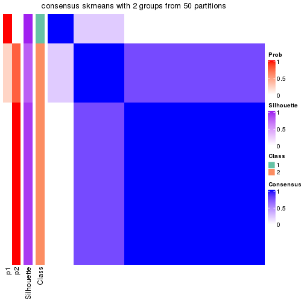</p>

</div>
<div id='tab-node-011322-consensus-heatmap-2'>
<pre><code class="r">consensus_heatmap(res, k = 3)
</code></pre>

<p>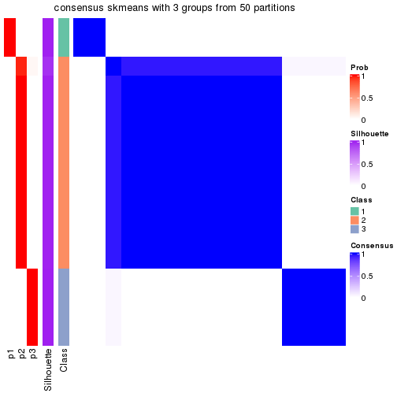</p>

</div>
<div id='tab-node-011322-consensus-heatmap-3'>
<pre><code class="r">consensus_heatmap(res, k = 4)
</code></pre>

<p>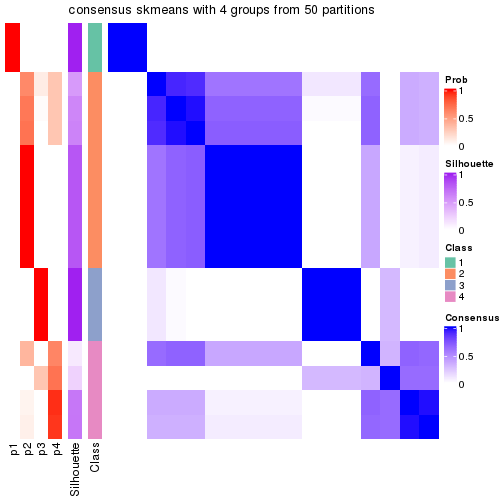</p>

</div>
<div id='tab-node-011322-consensus-heatmap-4'>
<pre><code class="r">consensus_heatmap(res, k = 5)
</code></pre>

<p>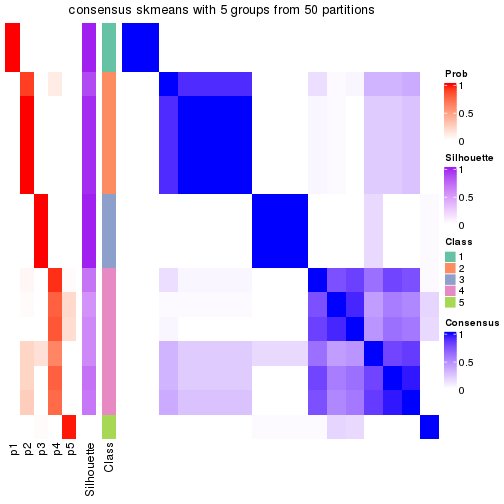</p>

</div>
<div id='tab-node-011322-consensus-heatmap-5'>
<pre><code class="r">consensus_heatmap(res, k = 6)
</code></pre>

<p>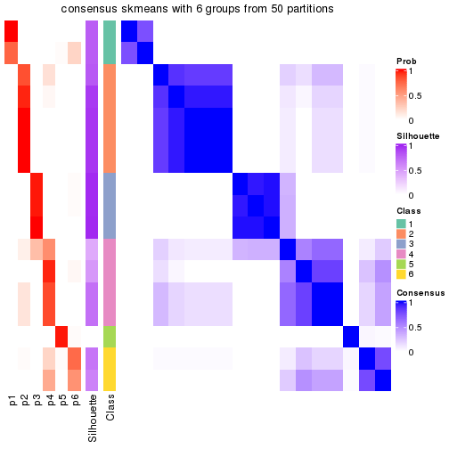</p>

</div>
<div id='tab-node-011322-consensus-heatmap-6'>
<pre><code class="r">consensus_heatmap(res, k = 7)
</code></pre>

<p>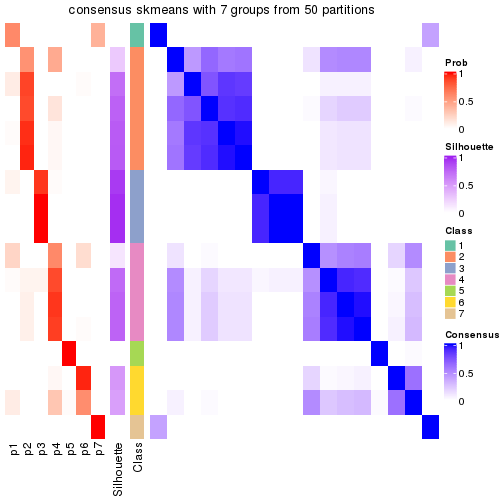</p>

</div>
<div id='tab-node-011322-consensus-heatmap-7'>
<pre><code class="r">consensus_heatmap(res, k = 8)
</code></pre>

<p>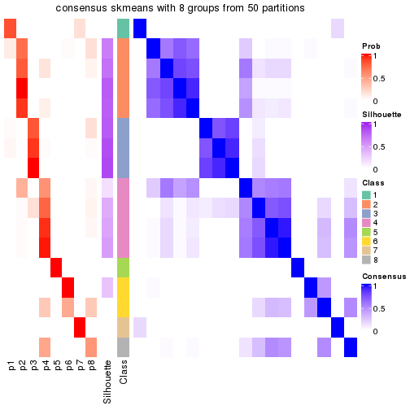</p>

</div>
</div>

Heatmaps for the membership of samples in all partitions to see how consistent they are:


<script>
$( function() {
	$( '#tabs-node-011322-membership-heatmap' ).tabs();
} );
</script>
<div id='tabs-node-011322-membership-heatmap'>
<ul>
<li><a href='#tab-node-011322-membership-heatmap-1'>k = 2</a></li>
<li><a href='#tab-node-011322-membership-heatmap-2'>k = 3</a></li>
<li><a href='#tab-node-011322-membership-heatmap-3'>k = 4</a></li>
<li><a href='#tab-node-011322-membership-heatmap-4'>k = 5</a></li>
<li><a href='#tab-node-011322-membership-heatmap-5'>k = 6</a></li>
<li><a href='#tab-node-011322-membership-heatmap-6'>k = 7</a></li>
<li><a href='#tab-node-011322-membership-heatmap-7'>k = 8</a></li>
</ul>
<div id='tab-node-011322-membership-heatmap-1'>
<pre><code class="r">membership_heatmap(res, k = 2)
</code></pre>

<p>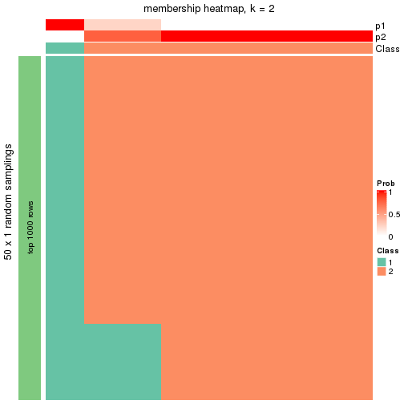</p>

</div>
<div id='tab-node-011322-membership-heatmap-2'>
<pre><code class="r">membership_heatmap(res, k = 3)
</code></pre>

<p>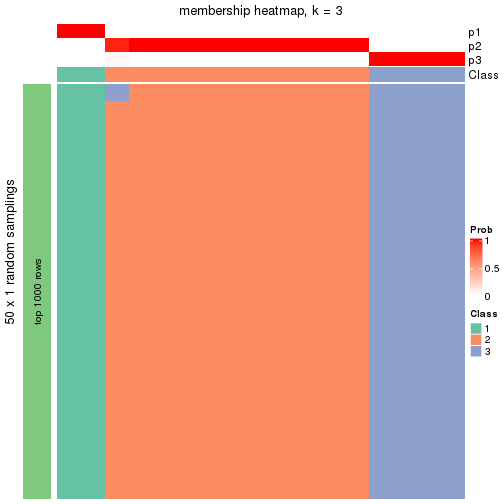</p>

</div>
<div id='tab-node-011322-membership-heatmap-3'>
<pre><code class="r">membership_heatmap(res, k = 4)
</code></pre>

<p>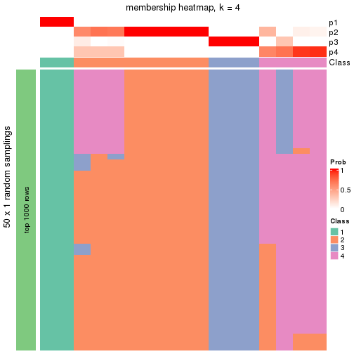</p>

</div>
<div id='tab-node-011322-membership-heatmap-4'>
<pre><code class="r">membership_heatmap(res, k = 5)
</code></pre>

<p>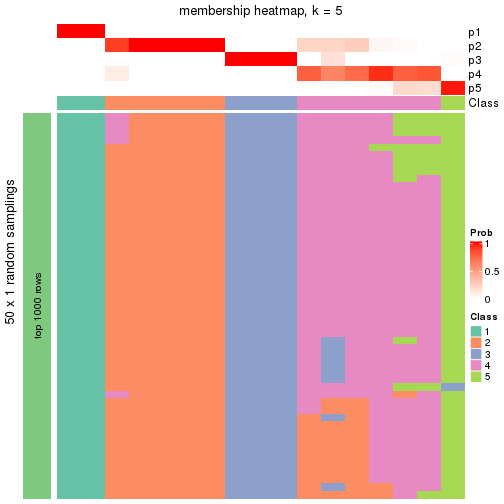</p>

</div>
<div id='tab-node-011322-membership-heatmap-5'>
<pre><code class="r">membership_heatmap(res, k = 6)
</code></pre>

<p>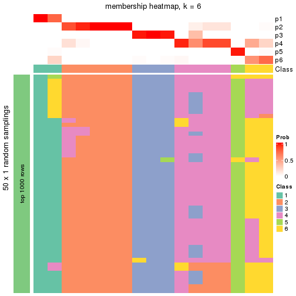</p>

</div>
<div id='tab-node-011322-membership-heatmap-6'>
<pre><code class="r">membership_heatmap(res, k = 7)
</code></pre>

<p>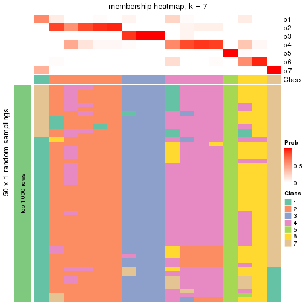</p>

</div>
<div id='tab-node-011322-membership-heatmap-7'>
<pre><code class="r">membership_heatmap(res, k = 8)
</code></pre>

<p>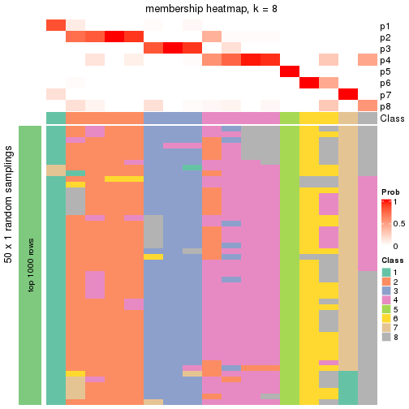</p>

</div>
</div>

As soon as the classes for columns are determined, the signatures
that are significantly different between subgroups can be looked for. 
Following are the heatmaps for signatures.


<script>
$( function() {
	$( '#tabs-node-011322-get-signatures' ).tabs();
} );
</script>
<div id='tabs-node-011322-get-signatures'>
<ul>
<li><a href='#tab-node-011322-get-signatures-1'>k = 2</a></li>
<li><a href='#tab-node-011322-get-signatures-2'>k = 3</a></li>
<li><a href='#tab-node-011322-get-signatures-3'>k = 4</a></li>
<li><a href='#tab-node-011322-get-signatures-4'>k = 5</a></li>
<li><a href='#tab-node-011322-get-signatures-5'>k = 6</a></li>
<li><a href='#tab-node-011322-get-signatures-6'>k = 7</a></li>
<li><a href='#tab-node-011322-get-signatures-7'>k = 8</a></li>
</ul>
<div id='tab-node-011322-get-signatures-1'>
<pre><code class="r">get_signatures(res, k = 2)
</code></pre>

<p>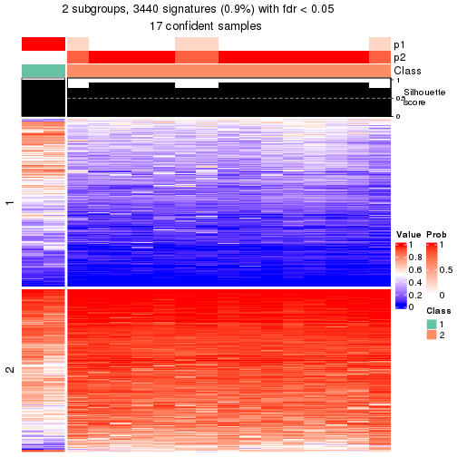</p>

</div>
<div id='tab-node-011322-get-signatures-2'>
<pre><code class="r">get_signatures(res, k = 3)
</code></pre>

<p>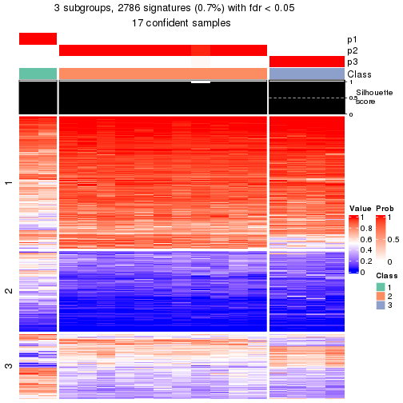</p>

</div>
<div id='tab-node-011322-get-signatures-3'>
<pre><code class="r">get_signatures(res, k = 4)
</code></pre>

<p>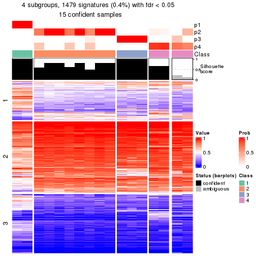</p>

</div>
<div id='tab-node-011322-get-signatures-4'>
<pre><code class="r">get_signatures(res, k = 5)
</code></pre>

<p>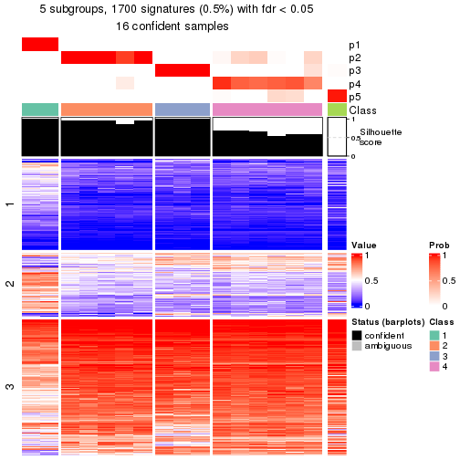</p>

</div>
<div id='tab-node-011322-get-signatures-5'>
<pre><code class="r">get_signatures(res, k = 6)
</code></pre>

<p>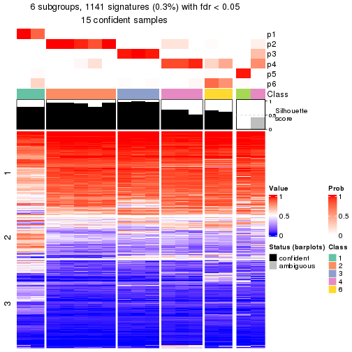</p>

</div>
<div id='tab-node-011322-get-signatures-6'>
<pre><code class="r">get_signatures(res, k = 7)
</code></pre>

<p>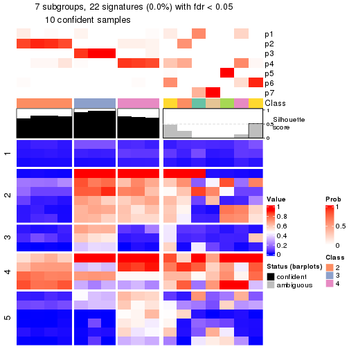</p>

</div>
<div id='tab-node-011322-get-signatures-7'>
<pre><code class="r">get_signatures(res, k = 8)
</code></pre>

<p>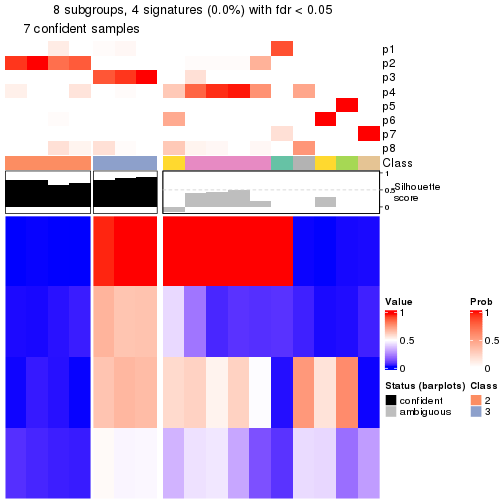</p>

</div>
</div>


Compare the overlap of signatures from different k:

```r
compare_signatures(res)
```

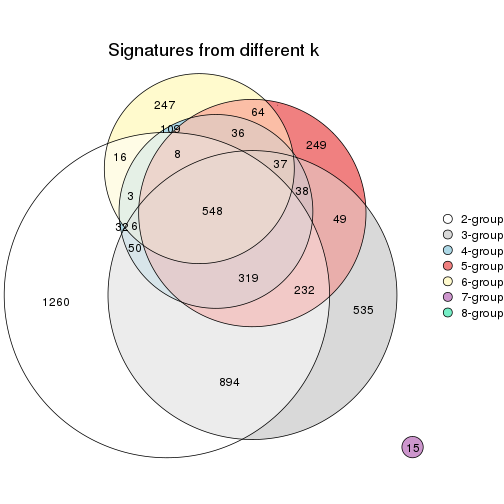

`get_signature()` returns a data frame invisibly. To get the list of signatures, the function
call should be assigned to a variable explicitly. In following code, if `plot` argument is set
to `FALSE`, no heatmap is plotted while only the differential analysis is performed.

```r
# code only for demonstration
tb = get_signature(res, k = ..., plot = FALSE)
```

An example of the output of `tb` is:

```
#>   which_row         fdr    mean_1    mean_2 scaled_mean_1 scaled_mean_2 km
#> 1        38 0.042760348  8.373488  9.131774    -0.5533452     0.5164555  1
#> 2        40 0.018707592  7.106213  8.469186    -0.6173731     0.5762149  1
#> 3        55 0.019134737 10.221463 11.207825    -0.6159697     0.5749050  1
#> 4        59 0.006059896  5.921854  7.869574    -0.6899429     0.6439467  1
#> 5        60 0.018055526  8.928898 10.211722    -0.6204761     0.5791110  1
#> 6        98 0.009384629 15.714769 14.887706     0.6635654    -0.6193277  2
...
```

The columns in `tb` are:

1. `which_row`: row indices corresponding to the input matrix.
2. `fdr`: FDR for the differential test. 
3. `mean_x`: The mean value in group x.
4. `scaled_mean_x`: The mean value in group x after rows are scaled.
5. `km`: Row groups if k-means clustering is applied to rows (which is done by automatically selecting number of clusters).

If there are too many signatures, `top_signatures = ...` can be set to only show the 
signatures with the highest FDRs:

```r
# code only for demonstration
# e.g. to show the top 500 most significant rows
tb = get_signature(res, k = ..., top_signatures = 500)
```

If the signatures are defined as these which are uniquely high in current group, `diff_method` argument
can be set to `"uniquely_high_in_one_group"`:

```r
# code only for demonstration
tb = get_signature(res, k = ..., diff_method = "uniquely_high_in_one_group")
```


UMAP plot which shows how samples are separated.


<script>
$( function() {
	$( '#tabs-node-011322-dimension-reduction' ).tabs();
} );
</script>
<div id='tabs-node-011322-dimension-reduction'>
<ul>
<li><a href='#tab-node-011322-dimension-reduction-1'>k = 2</a></li>
<li><a href='#tab-node-011322-dimension-reduction-2'>k = 3</a></li>
<li><a href='#tab-node-011322-dimension-reduction-3'>k = 4</a></li>
<li><a href='#tab-node-011322-dimension-reduction-4'>k = 5</a></li>
<li><a href='#tab-node-011322-dimension-reduction-5'>k = 6</a></li>
<li><a href='#tab-node-011322-dimension-reduction-6'>k = 7</a></li>
<li><a href='#tab-node-011322-dimension-reduction-7'>k = 8</a></li>
</ul>
<div id='tab-node-011322-dimension-reduction-1'>
<pre><code class="r">dimension_reduction(res, k = 2, method = &quot;UMAP&quot;)
</code></pre>

<p>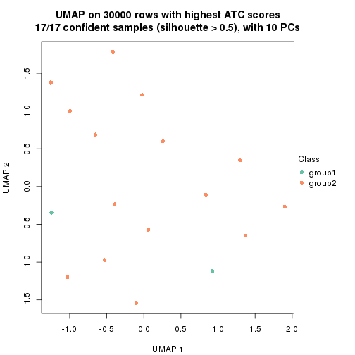</p>

</div>
<div id='tab-node-011322-dimension-reduction-2'>
<pre><code class="r">dimension_reduction(res, k = 3, method = &quot;UMAP&quot;)
</code></pre>

<p>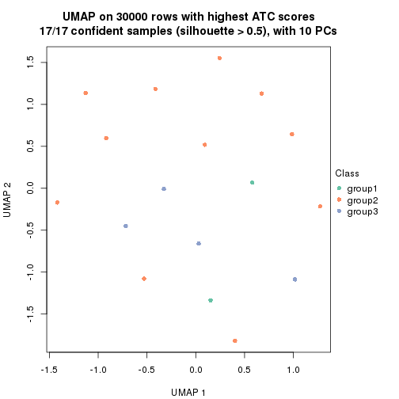</p>

</div>
<div id='tab-node-011322-dimension-reduction-3'>
<pre><code class="r">dimension_reduction(res, k = 4, method = &quot;UMAP&quot;)
</code></pre>

<p>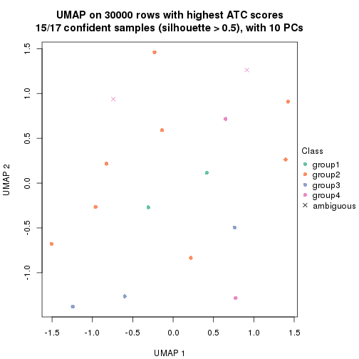</p>

</div>
<div id='tab-node-011322-dimension-reduction-4'>
<pre><code class="r">dimension_reduction(res, k = 5, method = &quot;UMAP&quot;)
</code></pre>

<p>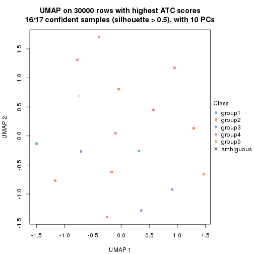</p>

</div>
<div id='tab-node-011322-dimension-reduction-5'>
<pre><code class="r">dimension_reduction(res, k = 6, method = &quot;UMAP&quot;)
</code></pre>

<p>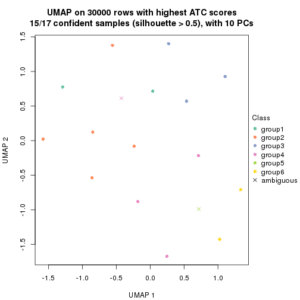</p>

</div>
<div id='tab-node-011322-dimension-reduction-6'>
<pre><code class="r">dimension_reduction(res, k = 7, method = &quot;UMAP&quot;)
</code></pre>

<p>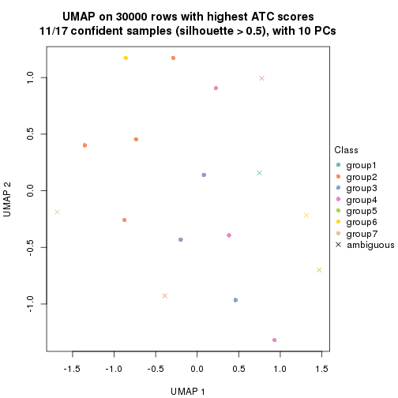</p>

</div>
<div id='tab-node-011322-dimension-reduction-7'>
<pre><code class="r">dimension_reduction(res, k = 8, method = &quot;UMAP&quot;)
</code></pre>

<p>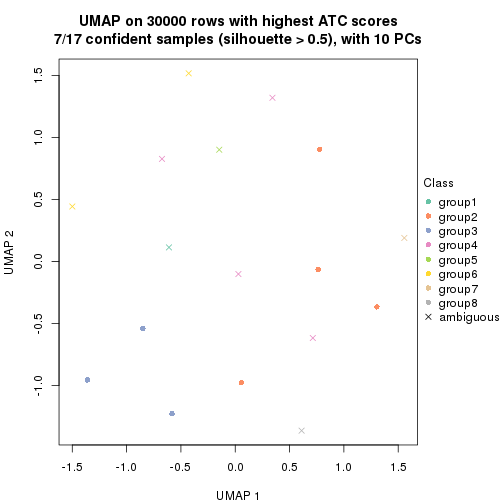</p>

</div>
</div>


Following heatmap shows how subgroups are split when increasing `k`:

```r
collect_classes(res)
```

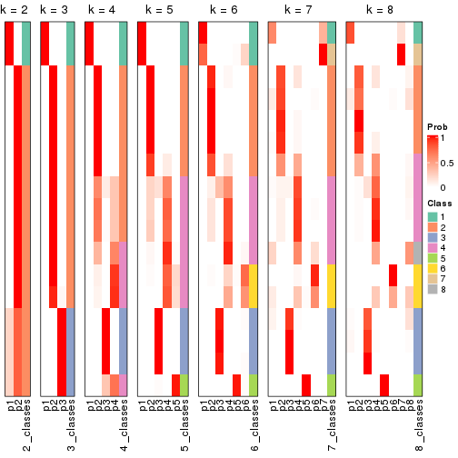


If matrix rows can be associated to genes, consider to use `functional_enrichment(res,
...)` to perform function enrichment for the signature genes. See [this vignette](https://jokergoo.github.io/cola_vignettes/functional_enrichment.html) for more detailed explanations.


 

---------------------------------------------------


### Node012


Parent node: [Node01](#Node01).
Child nodes: 
                [Node0111](#Node0111)
        ,
                [Node0112](#Node0112)
        ,
                [Node0113](#Node0113)
        ,
                [Node0121](#Node0121)
        ,
                Node0122-leaf
        ,
                Node0123-leaf
        ,
                Node0131-leaf
        ,
                Node0132-leaf
        ,
                Node0133-leaf
        ,
                Node0134-leaf
        ,
                [Node0141](#Node0141)
        ,
                Node0142-leaf
        ,
                Node0143-leaf
        ,
                Node0221-leaf
        ,
                Node0222-leaf
        ,
                Node0223-leaf
        ,
                Node0224-leaf
        ,
                [Node0231](#Node0231)
        ,
                Node0232-leaf
        ,
                Node0233-leaf
        ,
                Node0321-leaf
        ,
                Node0322-leaf
        ,
                Node0411-leaf
        ,
                Node0412-leaf
        ,
                Node0421-leaf
        ,
                Node0422-leaf
        ,
                Node0431-leaf
        ,
                Node0432-leaf
        ,
                Node0433-leaf
        ,
                Node0434-leaf
        .


The object with results only for a single top-value method and a single partitioning method 
can be extracted as:

```r
res = res_rh["012"]
```

A summary of `res` and all the functions that can be applied to it:

```r
res
```

```
#> A 'ConsensusPartition' object with k = 2, 3, 4, 5, 6, 7, 8.
#>   On a matrix with 30000 rows and 34 columns.
#>   Top rows (1000) are extracted by 'ATC' method.
#>   Subgroups are detected by 'kmeans' method.
#>   Performed in total 350 partitions by row resampling.
#>   Best k for subgroups seems to be 3.
#> 
#> Following methods can be applied to this 'ConsensusPartition' object:
#>  [1] "cola_report"             "collect_classes"         "collect_plots"          
#>  [4] "collect_stats"           "colnames"                "compare_partitions"     
#>  [7] "compare_signatures"      "consensus_heatmap"       "dimension_reduction"    
#> [10] "functional_enrichment"   "get_anno_col"            "get_anno"               
#> [13] "get_classes"             "get_consensus"           "get_matrix"             
#> [16] "get_membership"          "get_param"               "get_signatures"         
#> [19] "get_stats"               "is_best_k"               "is_stable_k"            
#> [22] "membership_heatmap"      "ncol"                    "nrow"                   
#> [25] "plot_ecdf"               "predict_classes"         "rownames"               
#> [28] "select_partition_number" "show"                    "suggest_best_k"         
#> [31] "test_to_known_factors"   "top_rows_heatmap"
```

`collect_plots()` function collects all the plots made from `res` for all `k` (number of subgroups)
into one single page to provide an easy and fast comparison between different `k`.

```r
collect_plots(res)
```

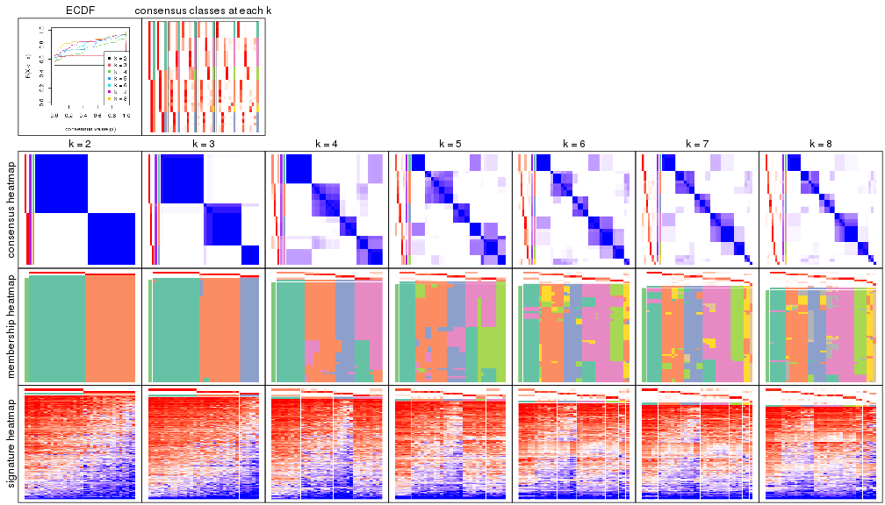

The plots are:

- The first row: a plot of the eCDF (empirical cumulative distribution
  function) curves of the consensus matrix for each `k` and the heatmap of
  predicted classes for each `k`.
- The second row: heatmaps of the consensus matrix for each `k`.
- The third row: heatmaps of the membership matrix for each `k`.
- The fouth row: heatmaps of the signatures for each `k`.

All the plots in panels can be made by individual functions and they are
plotted later in this section.

`select_partition_number()` produces several plots showing different
statistics for choosing "optimized" `k`. There are following statistics:

- eCDF curves of the consensus matrix for each `k`;
- 1-PAC. [The PAC score](https://en.wikipedia.org/wiki/Consensus_clustering#Over-interpretation_potential_of_consensus_clustering)
  measures the proportion of the ambiguous subgrouping.
- Mean silhouette score.
- Concordance. The mean probability of fiting the consensus subgroup labels in all
  partitions.
- Area increased. Denote $A_k$ as the area under the eCDF curve for current
  `k`, the area increased is defined as $A_k - A_{k-1}$.
- Rand index. The percent of pairs of samples that are both in a same cluster
  or both are not in a same cluster in the partition of k and k-1.
- Jaccard index. The ratio of pairs of samples are both in a same cluster in
  the partition of k and k-1 and the pairs of samples are both in a same
  cluster in the partition k or k-1.

The detailed explanations of these statistics can be found in [the _cola_
vignette](https://jokergoo.github.io/cola_vignettes/cola.html#toc_13).

Generally speaking, higher 1-PAC score, higher mean silhouette score or higher
concordance corresponds to better partition. Rand index and Jaccard index
measure how similar the current partition is compared to partition with `k-1`.
If they are too similar, we won't accept `k` is better than `k-1`.

```r
select_partition_number(res)
```

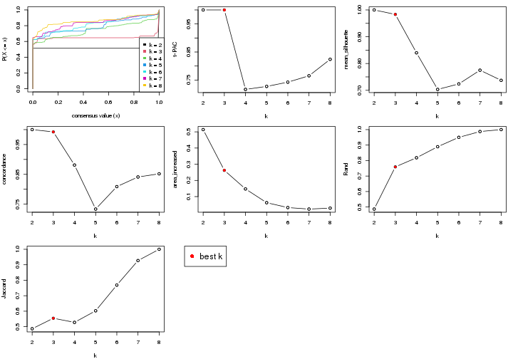

The numeric values for all these statistics can be obtained by `get_stats()`.

```r
get_stats(res)
```

```
#>   k 1-PAC mean_silhouette concordance area_increased  Rand Jaccard
#> 2 2 1.000           1.000       1.000         0.5139 0.487   0.487
#> 3 3 1.000           0.983       0.992         0.2623 0.759   0.554
#> 4 4 0.717           0.840       0.881         0.1473 0.818   0.528
#> 5 5 0.727           0.703       0.734         0.0623 0.889   0.603
#> 6 6 0.742           0.724       0.809         0.0323 0.950   0.769
#> 7 7 0.765           0.775       0.841         0.0229 0.988   0.927
#> 8 8 0.824           0.737       0.852         0.0289 1.000   1.000
```

`suggest_best_k()` suggests the best $k$ based on these statistics. The rules are as follows:

- All $k$ with Jaccard index larger than 0.95 are removed because increasing
  $k$ does not provide enough extra information. If all $k$ are removed, it is
  marked as no subgroup is detected.
- For all $k$ with 1-PAC score larger than 0.9, the maximal $k$ is taken as
  the best $k$, and other $k$ are marked as optional $k$.
- If it does not fit the second rule. The $k$ with the maximal vote of the
  highest 1-PAC score, highest mean silhouette, and highest concordance is
  taken as the best $k$.

```r
suggest_best_k(res)
```

```
#> [1] 3
#> attr(,"optional")
#> [1] 2
```

There is also optional best $k$ = 2 that is worth to check.

Following is the table of the partitions (You need to click the **show/hide
code output** link to see it). The membership matrix (columns with name `p*`)
is inferred by
[`clue::cl_consensus()`](https://www.rdocumentation.org/link/cl_consensus?package=clue)
function with the `SE` method. Basically the value in the membership matrix
represents the probability to belong to a certain group. The finall subgroup
label for an item is determined with the group with highest probability it
belongs to.

In `get_classes()` function, the entropy is calculated from the membership
matrix and the silhouette score is calculated from the consensus matrix.


<script>
$( function() {
	$( '#tabs-node-012-get-classes' ).tabs();
} );
</script>
<div id='tabs-node-012-get-classes'>
<ul>
<li><a href='#tab-node-012-get-classes-1'>k = 2</a></li>
<li><a href='#tab-node-012-get-classes-2'>k = 3</a></li>
<li><a href='#tab-node-012-get-classes-3'>k = 4</a></li>
<li><a href='#tab-node-012-get-classes-4'>k = 5</a></li>
<li><a href='#tab-node-012-get-classes-5'>k = 6</a></li>
<li><a href='#tab-node-012-get-classes-6'>k = 7</a></li>
<li><a href='#tab-node-012-get-classes-7'>k = 8</a></li>
</ul>

<div id='tab-node-012-get-classes-1'>
<p><a id='tab-node-012-get-classes-1-a' style='color:#0366d6' href='#'>show/hide code output</a></p>
<pre><code class="r">cbind(get_classes(res, k = 2), get_membership(res, k = 2))
</code></pre>

<pre><code>#&gt;                 class entropy silhouette p1 p2
#&gt; TCGA.AZ.4615.01     1       0          1  1  0
#&gt; TCGA.AD.A5EJ.01     1       0          1  1  0
#&gt; TCGA.DM.A1HB.01     2       0          1  0  1
#&gt; TCGA.AZ.6598.01     1       0          1  1  0
#&gt; TCGA.G4.6628.01     2       0          1  0  1
#&gt; TCGA.A6.6653.01     1       0          1  1  0
#&gt; TCGA.CK.5916.01     1       0          1  1  0
#&gt; TCGA.D5.6540.01     1       0          1  1  0
#&gt; TCGA.CA.5254.01     2       0          1  0  1
#&gt; TCGA.AD.5900.01     1       0          1  1  0
#&gt; TCGA.AM.5821.01     2       0          1  0  1
#&gt; TCGA.F4.6570.01     2       0          1  0  1
#&gt; TCGA.G4.6588.01     1       0          1  1  0
#&gt; TCGA.CK.6746.01     2       0          1  0  1
#&gt; TCGA.G4.6321.01     1       0          1  1  0
#&gt; TCGA.CK.5913.01     2       0          1  0  1
#&gt; TCGA.A6.5665.01     1       0          1  1  0
#&gt; TCGA.CM.6675.01     2       0          1  0  1
#&gt; TCGA.AD.6895.01     1       0          1  1  0
#&gt; TCGA.A6.3809.01     2       0          1  0  1
#&gt; TCGA.CM.5861.01     2       0          1  0  1
#&gt; TCGA.A6.2672.01     2       0          1  0  1
#&gt; TCGA.A6.5661.01     1       0          1  1  0
#&gt; TCGA.D5.6930.01     1       0          1  1  0
#&gt; TCGA.CK.4951.01     1       0          1  1  0
#&gt; TCGA.A6.2686.01     2       0          1  0  1
#&gt; TCGA.QG.A5Z2.01     1       0          1  1  0
#&gt; TCGA.AA.3492.01     2       0          1  0  1
#&gt; TCGA.AD.6889.01     1       0          1  1  0
#&gt; TCGA.G4.6586.01     2       0          1  0  1
#&gt; TCGA.G4.6299.01     1       0          1  1  0
#&gt; TCGA.AU.6004.01     1       0          1  1  0
#&gt; TCGA.CM.6171.01     2       0          1  0  1
#&gt; TCGA.G4.6320.01     2       0          1  0  1
</code></pre>

<script>
$('#tab-node-012-get-classes-1-a').parent().next().next().hide();
$('#tab-node-012-get-classes-1-a').click(function(){
  $('#tab-node-012-get-classes-1-a').parent().next().next().toggle();
  return(false);
});
</script>
</div>

<div id='tab-node-012-get-classes-2'>
<p><a id='tab-node-012-get-classes-2-a' style='color:#0366d6' href='#'>show/hide code output</a></p>
<pre><code class="r">cbind(get_classes(res, k = 3), get_membership(res, k = 3))
</code></pre>

<pre><code>#&gt;                 class entropy silhouette   p1   p2   p3
#&gt; TCGA.AZ.4615.01     1  0.0892      0.977 0.98 0.02 0.00
#&gt; TCGA.AD.A5EJ.01     1  0.0000      0.998 1.00 0.00 0.00
#&gt; TCGA.DM.A1HB.01     2  0.0000      0.978 0.00 1.00 0.00
#&gt; TCGA.AZ.6598.01     1  0.0000      0.998 1.00 0.00 0.00
#&gt; TCGA.G4.6628.01     2  0.0000      0.978 0.00 1.00 0.00
#&gt; TCGA.A6.6653.01     1  0.0000      0.998 1.00 0.00 0.00
#&gt; TCGA.CK.5916.01     1  0.0000      0.998 1.00 0.00 0.00
#&gt; TCGA.D5.6540.01     2  0.1529      0.945 0.04 0.96 0.00
#&gt; TCGA.CA.5254.01     2  0.0000      0.978 0.00 1.00 0.00
#&gt; TCGA.AD.5900.01     1  0.0000      0.998 1.00 0.00 0.00
#&gt; TCGA.AM.5821.01     3  0.0000      1.000 0.00 0.00 1.00
#&gt; TCGA.F4.6570.01     2  0.0000      0.978 0.00 1.00 0.00
#&gt; TCGA.G4.6588.01     2  0.1529      0.945 0.04 0.96 0.00
#&gt; TCGA.CK.6746.01     3  0.0000      1.000 0.00 0.00 1.00
#&gt; TCGA.G4.6321.01     1  0.0000      0.998 1.00 0.00 0.00
#&gt; TCGA.CK.5913.01     3  0.0000      1.000 0.00 0.00 1.00
#&gt; TCGA.A6.5665.01     1  0.0000      0.998 1.00 0.00 0.00
#&gt; TCGA.CM.6675.01     3  0.0000      1.000 0.00 0.00 1.00
#&gt; TCGA.AD.6895.01     1  0.0000      0.998 1.00 0.00 0.00
#&gt; TCGA.A6.3809.01     3  0.0000      1.000 0.00 0.00 1.00
#&gt; TCGA.CM.5861.01     2  0.0000      0.978 0.00 1.00 0.00
#&gt; TCGA.A6.2672.01     2  0.0000      0.978 0.00 1.00 0.00
#&gt; TCGA.A6.5661.01     1  0.0000      0.998 1.00 0.00 0.00
#&gt; TCGA.D5.6930.01     1  0.0000      0.998 1.00 0.00 0.00
#&gt; TCGA.CK.4951.01     2  0.0000      0.978 0.00 1.00 0.00
#&gt; TCGA.A6.2686.01     3  0.0000      1.000 0.00 0.00 1.00
#&gt; TCGA.QG.A5Z2.01     1  0.0000      0.998 1.00 0.00 0.00
#&gt; TCGA.AA.3492.01     2  0.0000      0.978 0.00 1.00 0.00
#&gt; TCGA.AD.6889.01     1  0.0000      0.998 1.00 0.00 0.00
#&gt; TCGA.G4.6586.01     2  0.0000      0.978 0.00 1.00 0.00
#&gt; TCGA.G4.6299.01     1  0.0000      0.998 1.00 0.00 0.00
#&gt; TCGA.AU.6004.01     1  0.0000      0.998 1.00 0.00 0.00
#&gt; TCGA.CM.6171.01     2  0.0000      0.978 0.00 1.00 0.00
#&gt; TCGA.G4.6320.01     2  0.4002      0.810 0.00 0.84 0.16
</code></pre>

<script>
$('#tab-node-012-get-classes-2-a').parent().next().next().hide();
$('#tab-node-012-get-classes-2-a').click(function(){
  $('#tab-node-012-get-classes-2-a').parent().next().next().toggle();
  return(false);
});
</script>
</div>

<div id='tab-node-012-get-classes-3'>
<p><a id='tab-node-012-get-classes-3-a' style='color:#0366d6' href='#'>show/hide code output</a></p>
<pre><code class="r">cbind(get_classes(res, k = 4), get_membership(res, k = 4))
</code></pre>

<pre><code>#&gt;                 class entropy silhouette   p1   p2   p3   p4
#&gt; TCGA.AZ.4615.01     4  0.4936      0.665 0.28 0.02 0.00 0.70
#&gt; TCGA.AD.A5EJ.01     1  0.4855      1.000 0.60 0.00 0.00 0.40
#&gt; TCGA.DM.A1HB.01     2  0.2647      0.864 0.12 0.88 0.00 0.00
#&gt; TCGA.AZ.6598.01     1  0.4855      1.000 0.60 0.00 0.00 0.40
#&gt; TCGA.G4.6628.01     2  0.4134      0.791 0.26 0.74 0.00 0.00
#&gt; TCGA.A6.6653.01     1  0.4855      1.000 0.60 0.00 0.00 0.40
#&gt; TCGA.CK.5916.01     1  0.4855      1.000 0.60 0.00 0.00 0.40
#&gt; TCGA.D5.6540.01     4  0.6617      0.585 0.28 0.12 0.00 0.60
#&gt; TCGA.CA.5254.01     2  0.0707      0.866 0.02 0.98 0.00 0.00
#&gt; TCGA.AD.5900.01     4  0.0707      0.635 0.02 0.00 0.00 0.98
#&gt; TCGA.AM.5821.01     3  0.0000      0.945 0.00 0.00 1.00 0.00
#&gt; TCGA.F4.6570.01     2  0.3975      0.806 0.24 0.76 0.00 0.00
#&gt; TCGA.G4.6588.01     4  0.6617      0.585 0.28 0.12 0.00 0.60
#&gt; TCGA.CK.6746.01     3  0.0707      0.941 0.02 0.00 0.98 0.00
#&gt; TCGA.G4.6321.01     4  0.0707      0.635 0.02 0.00 0.00 0.98
#&gt; TCGA.CK.5913.01     3  0.0000      0.945 0.00 0.00 1.00 0.00
#&gt; TCGA.A6.5665.01     1  0.4855      1.000 0.60 0.00 0.00 0.40
#&gt; TCGA.CM.6675.01     3  0.0707      0.941 0.02 0.00 0.98 0.00
#&gt; TCGA.AD.6895.01     4  0.0000      0.644 0.00 0.00 0.00 1.00
#&gt; TCGA.A6.3809.01     3  0.2647      0.897 0.00 0.12 0.88 0.00
#&gt; TCGA.CM.5861.01     2  0.0000      0.871 0.00 1.00 0.00 0.00
#&gt; TCGA.A6.2672.01     2  0.0707      0.865 0.00 0.98 0.02 0.00
#&gt; TCGA.A6.5661.01     1  0.4855      1.000 0.60 0.00 0.00 0.40
#&gt; TCGA.D5.6930.01     1  0.4855      1.000 0.60 0.00 0.00 0.40
#&gt; TCGA.CK.4951.01     4  0.6617      0.585 0.28 0.12 0.00 0.60
#&gt; TCGA.A6.2686.01     3  0.2921      0.882 0.00 0.14 0.86 0.00
#&gt; TCGA.QG.A5Z2.01     4  0.0707      0.635 0.02 0.00 0.00 0.98
#&gt; TCGA.AA.3492.01     2  0.2647      0.864 0.12 0.88 0.00 0.00
#&gt; TCGA.AD.6889.01     1  0.4855      1.000 0.60 0.00 0.00 0.40
#&gt; TCGA.G4.6586.01     2  0.0707      0.865 0.00 0.98 0.02 0.00
#&gt; TCGA.G4.6299.01     1  0.4855      1.000 0.60 0.00 0.00 0.40
#&gt; TCGA.AU.6004.01     4  0.0707      0.635 0.02 0.00 0.00 0.98
#&gt; TCGA.CM.6171.01     2  0.4624      0.755 0.34 0.66 0.00 0.00
#&gt; TCGA.G4.6320.01     2  0.1411      0.854 0.02 0.96 0.02 0.00
</code></pre>

<script>
$('#tab-node-012-get-classes-3-a').parent().next().next().hide();
$('#tab-node-012-get-classes-3-a').click(function(){
  $('#tab-node-012-get-classes-3-a').parent().next().next().toggle();
  return(false);
});
</script>
</div>

<div id='tab-node-012-get-classes-4'>
<p><a id='tab-node-012-get-classes-4-a' style='color:#0366d6' href='#'>show/hide code output</a></p>
<pre><code class="r">cbind(get_classes(res, k = 5), get_membership(res, k = 5))
</code></pre>

<pre><code>#&gt;                 class entropy silhouette   p1   p2   p3   p4   p5
#&gt; TCGA.AZ.4615.01     4   0.426     -0.731 0.00 0.00 0.00 0.56 0.44
#&gt; TCGA.AD.A5EJ.01     1   0.252      1.000 0.86 0.00 0.00 0.14 0.00
#&gt; TCGA.DM.A1HB.01     2   0.233      0.834 0.02 0.90 0.00 0.00 0.08
#&gt; TCGA.AZ.6598.01     1   0.252      1.000 0.86 0.00 0.00 0.14 0.00
#&gt; TCGA.G4.6628.01     2   0.327      0.777 0.00 0.78 0.00 0.00 0.22
#&gt; TCGA.A6.6653.01     1   0.252      1.000 0.86 0.00 0.00 0.14 0.00
#&gt; TCGA.CK.5916.01     4   0.423      0.210 0.42 0.00 0.00 0.58 0.00
#&gt; TCGA.D5.6540.01     5   0.423      1.000 0.00 0.00 0.00 0.42 0.58
#&gt; TCGA.CA.5254.01     2   0.482      0.699 0.10 0.72 0.00 0.00 0.18
#&gt; TCGA.AD.5900.01     4   0.000      0.520 0.00 0.00 0.00 1.00 0.00
#&gt; TCGA.AM.5821.01     3   0.000      0.939 0.00 0.00 1.00 0.00 0.00
#&gt; TCGA.F4.6570.01     2   0.327      0.777 0.00 0.78 0.00 0.00 0.22
#&gt; TCGA.G4.6588.01     5   0.423      1.000 0.00 0.00 0.00 0.42 0.58
#&gt; TCGA.CK.6746.01     3   0.141      0.928 0.00 0.00 0.94 0.00 0.06
#&gt; TCGA.G4.6321.01     4   0.000      0.520 0.00 0.00 0.00 1.00 0.00
#&gt; TCGA.CK.5913.01     3   0.000      0.939 0.00 0.00 1.00 0.00 0.00
#&gt; TCGA.A6.5665.01     4   0.423      0.210 0.42 0.00 0.00 0.58 0.00
#&gt; TCGA.CM.6675.01     3   0.141      0.928 0.00 0.00 0.94 0.00 0.06
#&gt; TCGA.AD.6895.01     4   0.104      0.442 0.00 0.00 0.00 0.96 0.04
#&gt; TCGA.A6.3809.01     3   0.202      0.906 0.00 0.10 0.90 0.00 0.00
#&gt; TCGA.CM.5861.01     2   0.000      0.837 0.00 1.00 0.00 0.00 0.00
#&gt; TCGA.A6.2672.01     2   0.000      0.837 0.00 1.00 0.00 0.00 0.00
#&gt; TCGA.A6.5661.01     1   0.252      1.000 0.86 0.00 0.00 0.14 0.00
#&gt; TCGA.D5.6930.01     4   0.423      0.210 0.42 0.00 0.00 0.58 0.00
#&gt; TCGA.CK.4951.01     5   0.423      1.000 0.00 0.00 0.00 0.42 0.58
#&gt; TCGA.A6.2686.01     3   0.202      0.906 0.00 0.10 0.90 0.00 0.00
#&gt; TCGA.QG.A5Z2.01     4   0.000      0.520 0.00 0.00 0.00 1.00 0.00
#&gt; TCGA.AA.3492.01     2   0.233      0.834 0.02 0.90 0.00 0.00 0.08
#&gt; TCGA.AD.6889.01     1   0.252      1.000 0.86 0.00 0.00 0.14 0.00
#&gt; TCGA.G4.6586.01     2   0.000      0.837 0.00 1.00 0.00 0.00 0.00
#&gt; TCGA.G4.6299.01     4   0.423      0.210 0.42 0.00 0.00 0.58 0.00
#&gt; TCGA.AU.6004.01     4   0.000      0.520 0.00 0.00 0.00 1.00 0.00
#&gt; TCGA.CM.6171.01     2   0.492      0.662 0.04 0.62 0.00 0.00 0.34
#&gt; TCGA.G4.6320.01     2   0.585      0.644 0.08 0.68 0.06 0.00 0.18
</code></pre>

<script>
$('#tab-node-012-get-classes-4-a').parent().next().next().hide();
$('#tab-node-012-get-classes-4-a').click(function(){
  $('#tab-node-012-get-classes-4-a').parent().next().next().toggle();
  return(false);
});
</script>
</div>

<div id='tab-node-012-get-classes-5'>
<p><a id='tab-node-012-get-classes-5-a' style='color:#0366d6' href='#'>show/hide code output</a></p>
<pre><code class="r">cbind(get_classes(res, k = 6), get_membership(res, k = 6))
</code></pre>

<pre><code>#&gt;                 class entropy silhouette   p1   p2   p3   p4   p5   p6
#&gt; TCGA.AZ.4615.01     5  0.1267      0.902 0.00 0.00 0.00 0.06 0.94 0.00
#&gt; TCGA.AD.A5EJ.01     1  0.3797      1.000 0.58 0.00 0.00 0.42 0.00 0.00
#&gt; TCGA.DM.A1HB.01     2  0.2725      0.596 0.02 0.88 0.00 0.00 0.04 0.06
#&gt; TCGA.AZ.6598.01     1  0.3797      1.000 0.58 0.00 0.00 0.42 0.00 0.00
#&gt; TCGA.G4.6628.01     2  0.1814      0.628 0.00 0.90 0.00 0.00 0.10 0.00
#&gt; TCGA.A6.6653.01     1  0.3797      1.000 0.58 0.00 0.00 0.42 0.00 0.00
#&gt; TCGA.CK.5916.01     4  0.0547      0.564 0.00 0.00 0.00 0.98 0.00 0.02
#&gt; TCGA.D5.6540.01     5  0.0000      0.970 0.00 0.00 0.00 0.00 1.00 0.00
#&gt; TCGA.CA.5254.01     6  0.4873      0.715 0.06 0.42 0.00 0.00 0.00 0.52
#&gt; TCGA.AD.5900.01     4  0.4002      0.688 0.00 0.00 0.00 0.66 0.32 0.02
#&gt; TCGA.AM.5821.01     3  0.0000      0.811 0.00 0.00 1.00 0.00 0.00 0.00
#&gt; TCGA.F4.6570.01     2  0.1814      0.628 0.00 0.90 0.00 0.00 0.10 0.00
#&gt; TCGA.G4.6588.01     5  0.0000      0.970 0.00 0.00 0.00 0.00 1.00 0.00
#&gt; TCGA.CK.6746.01     3  0.3475      0.766 0.14 0.00 0.80 0.00 0.00 0.06
#&gt; TCGA.G4.6321.01     4  0.4002      0.688 0.00 0.00 0.00 0.66 0.32 0.02
#&gt; TCGA.CK.5913.01     3  0.0000      0.811 0.00 0.00 1.00 0.00 0.00 0.00
#&gt; TCGA.A6.5665.01     4  0.0547      0.564 0.00 0.00 0.00 0.98 0.00 0.02
#&gt; TCGA.CM.6675.01     3  0.3475      0.766 0.14 0.00 0.80 0.00 0.00 0.06
#&gt; TCGA.AD.6895.01     4  0.4144      0.619 0.00 0.00 0.00 0.62 0.36 0.02
#&gt; TCGA.A6.3809.01     3  0.3523      0.701 0.00 0.04 0.78 0.00 0.00 0.18
#&gt; TCGA.CM.5861.01     2  0.3076      0.516 0.00 0.76 0.00 0.00 0.00 0.24
#&gt; TCGA.A6.2672.01     2  0.3076      0.516 0.00 0.76 0.00 0.00 0.00 0.24
#&gt; TCGA.A6.5661.01     1  0.3797      1.000 0.58 0.00 0.00 0.42 0.00 0.00
#&gt; TCGA.D5.6930.01     4  0.0000      0.577 0.00 0.00 0.00 1.00 0.00 0.00
#&gt; TCGA.CK.4951.01     5  0.0000      0.970 0.00 0.00 0.00 0.00 1.00 0.00
#&gt; TCGA.A6.2686.01     3  0.3679      0.678 0.00 0.04 0.76 0.00 0.00 0.20
#&gt; TCGA.QG.A5Z2.01     4  0.4002      0.688 0.00 0.00 0.00 0.66 0.32 0.02
#&gt; TCGA.AA.3492.01     2  0.1480      0.616 0.00 0.94 0.00 0.00 0.04 0.02
#&gt; TCGA.AD.6889.01     1  0.3797      1.000 0.58 0.00 0.00 0.42 0.00 0.00
#&gt; TCGA.G4.6586.01     2  0.3076      0.516 0.00 0.76 0.00 0.00 0.00 0.24
#&gt; TCGA.G4.6299.01     4  0.0000      0.577 0.00 0.00 0.00 1.00 0.00 0.00
#&gt; TCGA.AU.6004.01     4  0.4002      0.688 0.00 0.00 0.00 0.66 0.32 0.02
#&gt; TCGA.CM.6171.01     2  0.6679      0.135 0.22 0.48 0.00 0.00 0.06 0.24
#&gt; TCGA.G4.6320.01     6  0.5822      0.745 0.06 0.28 0.08 0.00 0.00 0.58
</code></pre>

<script>
$('#tab-node-012-get-classes-5-a').parent().next().next().hide();
$('#tab-node-012-get-classes-5-a').click(function(){
  $('#tab-node-012-get-classes-5-a').parent().next().next().toggle();
  return(false);
});
</script>
</div>

<div id='tab-node-012-get-classes-6'>
<p><a id='tab-node-012-get-classes-6-a' style='color:#0366d6' href='#'>show/hide code output</a></p>
<pre><code class="r">cbind(get_classes(res, k = 7), get_membership(res, k = 7))
</code></pre>

<pre><code>#&gt;                 class entropy silhouette   p1   p2   p3   p4   p5   p6   p7
#&gt; TCGA.AZ.4615.01     5  0.0504      0.974 0.00 0.00 0.00 0.02 0.98 0.00 0.00
#&gt; TCGA.AD.A5EJ.01     1  0.0000      0.996 1.00 0.00 0.00 0.00 0.00 0.00 0.00
#&gt; TCGA.DM.A1HB.01     2  0.3011      0.756 0.00 0.82 0.00 0.06 0.00 0.12 0.00
#&gt; TCGA.AZ.6598.01     1  0.0504      0.983 0.98 0.00 0.00 0.00 0.00 0.00 0.02
#&gt; TCGA.G4.6628.01     2  0.3833      0.750 0.00 0.78 0.00 0.06 0.12 0.00 0.04
#&gt; TCGA.A6.6653.01     1  0.0000      0.996 1.00 0.00 0.00 0.00 0.00 0.00 0.00
#&gt; TCGA.CK.5916.01     4  0.6030      0.571 0.32 0.00 0.00 0.48 0.00 0.12 0.08
#&gt; TCGA.D5.6540.01     5  0.0000      0.991 0.00 0.00 0.00 0.00 1.00 0.00 0.00
#&gt; TCGA.CA.5254.01     6  0.2708      0.734 0.00 0.22 0.00 0.00 0.00 0.78 0.00
#&gt; TCGA.AD.5900.01     4  0.4033      0.757 0.08 0.00 0.00 0.70 0.22 0.00 0.00
#&gt; TCGA.AM.5821.01     3  0.0000      0.808 0.00 0.00 1.00 0.00 0.00 0.00 0.00
#&gt; TCGA.F4.6570.01     2  0.3833      0.750 0.00 0.78 0.00 0.06 0.12 0.00 0.04
#&gt; TCGA.G4.6588.01     5  0.0000      0.991 0.00 0.00 0.00 0.00 1.00 0.00 0.00
#&gt; TCGA.CK.6746.01     3  0.4001      0.723 0.00 0.00 0.74 0.18 0.00 0.02 0.06
#&gt; TCGA.G4.6321.01     4  0.4033      0.757 0.08 0.00 0.00 0.70 0.22 0.00 0.00
#&gt; TCGA.CK.5913.01     3  0.0000      0.808 0.00 0.00 1.00 0.00 0.00 0.00 0.00
#&gt; TCGA.A6.5665.01     4  0.6030      0.571 0.32 0.00 0.00 0.48 0.00 0.12 0.08
#&gt; TCGA.CM.6675.01     3  0.4001      0.723 0.00 0.00 0.74 0.18 0.00 0.02 0.06
#&gt; TCGA.AD.6895.01     4  0.4033      0.757 0.08 0.00 0.00 0.70 0.22 0.00 0.00
#&gt; TCGA.A6.3809.01     3  0.2569      0.752 0.00 0.14 0.84 0.00 0.00 0.02 0.00
#&gt; TCGA.CM.5861.01     2  0.0000      0.776 0.00 1.00 0.00 0.00 0.00 0.00 0.00
#&gt; TCGA.A6.2672.01     2  0.0504      0.766 0.00 0.98 0.00 0.00 0.00 0.02 0.00
#&gt; TCGA.A6.5661.01     1  0.0000      0.996 1.00 0.00 0.00 0.00 0.00 0.00 0.00
#&gt; TCGA.D5.6930.01     4  0.4461      0.652 0.32 0.00 0.00 0.62 0.00 0.04 0.02
#&gt; TCGA.CK.4951.01     5  0.0000      0.991 0.00 0.00 0.00 0.00 1.00 0.00 0.00
#&gt; TCGA.A6.2686.01     3  0.2745      0.735 0.00 0.16 0.82 0.00 0.00 0.02 0.00
#&gt; TCGA.QG.A5Z2.01     4  0.4033      0.757 0.08 0.00 0.00 0.70 0.22 0.00 0.00
#&gt; TCGA.AA.3492.01     2  0.4965      0.637 0.00 0.66 0.00 0.12 0.00 0.18 0.04
#&gt; TCGA.AD.6889.01     1  0.0000      0.996 1.00 0.00 0.00 0.00 0.00 0.00 0.00
#&gt; TCGA.G4.6586.01     2  0.0504      0.766 0.00 0.98 0.00 0.00 0.00 0.02 0.00
#&gt; TCGA.G4.6299.01     4  0.5027      0.637 0.32 0.00 0.00 0.58 0.00 0.06 0.04
#&gt; TCGA.AU.6004.01     4  0.4033      0.757 0.08 0.00 0.00 0.70 0.22 0.00 0.00
#&gt; TCGA.CM.6171.01     7  0.2422      0.000 0.00 0.18 0.00 0.00 0.00 0.00 0.82
#&gt; TCGA.G4.6320.01     6  0.4146      0.738 0.00 0.32 0.02 0.00 0.00 0.64 0.02
</code></pre>

<script>
$('#tab-node-012-get-classes-6-a').parent().next().next().hide();
$('#tab-node-012-get-classes-6-a').click(function(){
  $('#tab-node-012-get-classes-6-a').parent().next().next().toggle();
  return(false);
});
</script>
</div>

<div id='tab-node-012-get-classes-7'>
<p><a id='tab-node-012-get-classes-7-a' style='color:#0366d6' href='#'>show/hide code output</a></p>
<pre><code class="r">cbind(get_classes(res, k = 8), get_membership(res, k = 8))
</code></pre>

<pre><code>#&gt;                 class entropy silhouette   p1   p2   p3   p4   p5   p6   p7   p8
#&gt; TCGA.AZ.4615.01     5  0.2350      0.947 0.00 0.00 0.00 0.10 0.86 0.00 0.00 0.04
#&gt; TCGA.AD.A5EJ.01     1  0.0808      0.995 0.96 0.00 0.00 0.04 0.00 0.00 0.00 0.00
#&gt; TCGA.DM.A1HB.01     2  0.1408      0.737 0.00 0.94 0.00 0.00 0.02 0.02 0.02 0.00
#&gt; TCGA.AZ.6598.01     1  0.1275      0.982 0.94 0.00 0.00 0.04 0.00 0.00 0.02 0.00
#&gt; TCGA.G4.6628.01     2  0.1091      0.756 0.00 0.94 0.00 0.00 0.06 0.00 0.00 0.00
#&gt; TCGA.A6.6653.01     1  0.0808      0.995 0.96 0.00 0.00 0.04 0.00 0.00 0.00 0.00
#&gt; TCGA.CK.5916.01     4  0.5366      0.588 0.08 0.00 0.00 0.52 0.00 0.02 0.04 0.34
#&gt; TCGA.D5.6540.01     5  0.2132      0.962 0.00 0.00 0.00 0.08 0.88 0.00 0.00 0.04
#&gt; TCGA.CA.5254.01     6  0.3748      0.602 0.00 0.20 0.00 0.00 0.02 0.74 0.02 0.02
#&gt; TCGA.AD.5900.01     4  0.0000      0.814 0.00 0.00 0.00 1.00 0.00 0.00 0.00 0.00
#&gt; TCGA.AM.5821.01     3  0.0000      0.658 0.00 0.00 1.00 0.00 0.00 0.00 0.00 0.00
#&gt; TCGA.F4.6570.01     2  0.1091      0.756 0.00 0.94 0.00 0.00 0.06 0.00 0.00 0.00
#&gt; TCGA.G4.6588.01     5  0.1341      0.967 0.00 0.00 0.00 0.08 0.92 0.00 0.00 0.00
#&gt; TCGA.CK.6746.01     3  0.3299      0.475 0.00 0.00 0.56 0.00 0.00 0.00 0.00 0.44
#&gt; TCGA.G4.6321.01     4  0.0000      0.814 0.00 0.00 0.00 1.00 0.00 0.00 0.00 0.00
#&gt; TCGA.CK.5913.01     3  0.0000      0.658 0.00 0.00 1.00 0.00 0.00 0.00 0.00 0.00
#&gt; TCGA.A6.5665.01     4  0.5366      0.588 0.08 0.00 0.00 0.52 0.00 0.02 0.04 0.34
#&gt; TCGA.CM.6675.01     3  0.3299      0.475 0.00 0.00 0.56 0.00 0.00 0.00 0.00 0.44
#&gt; TCGA.AD.6895.01     4  0.0000      0.814 0.00 0.00 0.00 1.00 0.00 0.00 0.00 0.00
#&gt; TCGA.A6.3809.01     3  0.3748      0.551 0.00 0.02 0.74 0.00 0.00 0.20 0.02 0.02
#&gt; TCGA.CM.5861.01     2  0.3303      0.735 0.00 0.76 0.00 0.00 0.00 0.20 0.02 0.02
#&gt; TCGA.A6.2672.01     2  0.3303      0.735 0.00 0.76 0.00 0.00 0.00 0.20 0.02 0.02
#&gt; TCGA.A6.5661.01     1  0.0808      0.995 0.96 0.00 0.00 0.04 0.00 0.00 0.00 0.00
#&gt; TCGA.D5.6930.01     4  0.3314      0.761 0.08 0.00 0.00 0.80 0.00 0.00 0.02 0.10
#&gt; TCGA.CK.4951.01     5  0.1341      0.967 0.00 0.00 0.00 0.08 0.92 0.00 0.00 0.00
#&gt; TCGA.A6.2686.01     3  0.3748      0.551 0.00 0.02 0.74 0.00 0.00 0.20 0.02 0.02
#&gt; TCGA.QG.A5Z2.01     4  0.0000      0.814 0.00 0.00 0.00 1.00 0.00 0.00 0.00 0.00
#&gt; TCGA.AA.3492.01     2  0.4511      0.495 0.04 0.72 0.00 0.00 0.06 0.04 0.00 0.14
#&gt; TCGA.AD.6889.01     1  0.0808      0.995 0.96 0.00 0.00 0.04 0.00 0.00 0.00 0.00
#&gt; TCGA.G4.6586.01     2  0.3303      0.735 0.00 0.76 0.00 0.00 0.00 0.20 0.02 0.02
#&gt; TCGA.G4.6299.01     4  0.4409      0.719 0.08 0.00 0.00 0.70 0.00 0.02 0.02 0.18
#&gt; TCGA.AU.6004.01     4  0.0000      0.814 0.00 0.00 0.00 1.00 0.00 0.00 0.00 0.00
#&gt; TCGA.CM.6171.01     7  0.1563      0.000 0.00 0.10 0.00 0.00 0.00 0.00 0.90 0.00
#&gt; TCGA.G4.6320.01     6  0.1275      0.613 0.00 0.04 0.02 0.00 0.00 0.94 0.00 0.00
</code></pre>

<script>
$('#tab-node-012-get-classes-7-a').parent().next().next().hide();
$('#tab-node-012-get-classes-7-a').click(function(){
  $('#tab-node-012-get-classes-7-a').parent().next().next().toggle();
  return(false);
});
</script>
</div>
</div>

Heatmaps for the consensus matrix. It visualizes the probability of two
samples to be in a same group.


<script>
$( function() {
	$( '#tabs-node-012-consensus-heatmap' ).tabs();
} );
</script>
<div id='tabs-node-012-consensus-heatmap'>
<ul>
<li><a href='#tab-node-012-consensus-heatmap-1'>k = 2</a></li>
<li><a href='#tab-node-012-consensus-heatmap-2'>k = 3</a></li>
<li><a href='#tab-node-012-consensus-heatmap-3'>k = 4</a></li>
<li><a href='#tab-node-012-consensus-heatmap-4'>k = 5</a></li>
<li><a href='#tab-node-012-consensus-heatmap-5'>k = 6</a></li>
<li><a href='#tab-node-012-consensus-heatmap-6'>k = 7</a></li>
<li><a href='#tab-node-012-consensus-heatmap-7'>k = 8</a></li>
</ul>
<div id='tab-node-012-consensus-heatmap-1'>
<pre><code class="r">consensus_heatmap(res, k = 2)
</code></pre>

<p>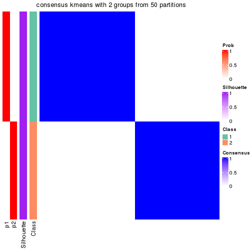</p>

</div>
<div id='tab-node-012-consensus-heatmap-2'>
<pre><code class="r">consensus_heatmap(res, k = 3)
</code></pre>

<p>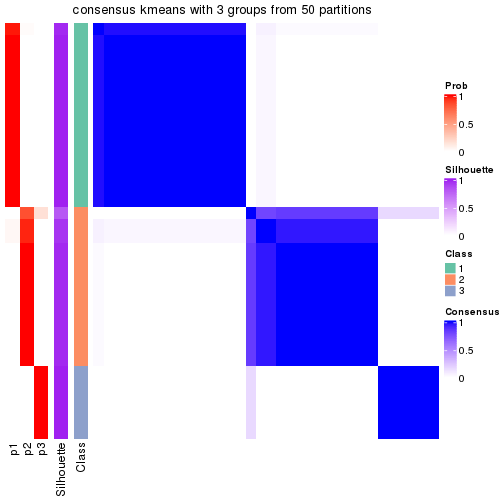</p>

</div>
<div id='tab-node-012-consensus-heatmap-3'>
<pre><code class="r">consensus_heatmap(res, k = 4)
</code></pre>

<p>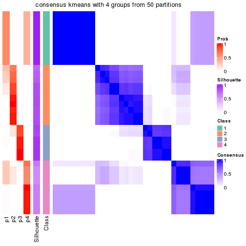</p>

</div>
<div id='tab-node-012-consensus-heatmap-4'>
<pre><code class="r">consensus_heatmap(res, k = 5)
</code></pre>

<p>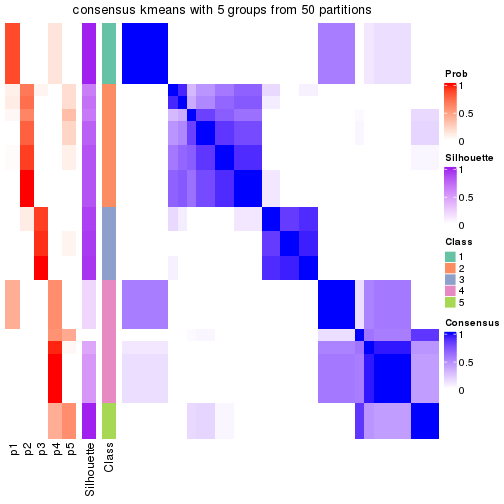</p>

</div>
<div id='tab-node-012-consensus-heatmap-5'>
<pre><code class="r">consensus_heatmap(res, k = 6)
</code></pre>

<p>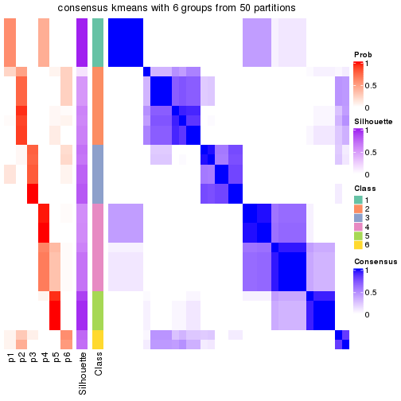</p>

</div>
<div id='tab-node-012-consensus-heatmap-6'>
<pre><code class="r">consensus_heatmap(res, k = 7)
</code></pre>

<p>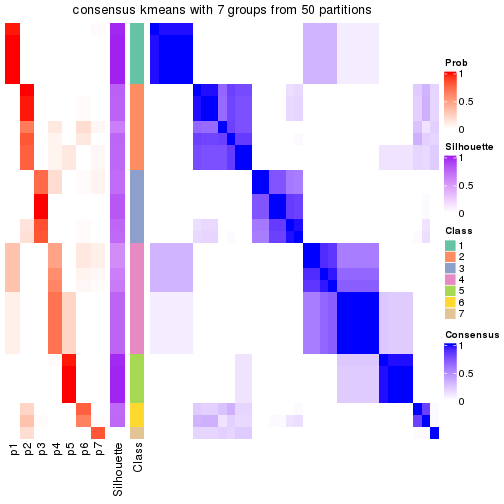</p>

</div>
<div id='tab-node-012-consensus-heatmap-7'>
<pre><code class="r">consensus_heatmap(res, k = 8)
</code></pre>

<p>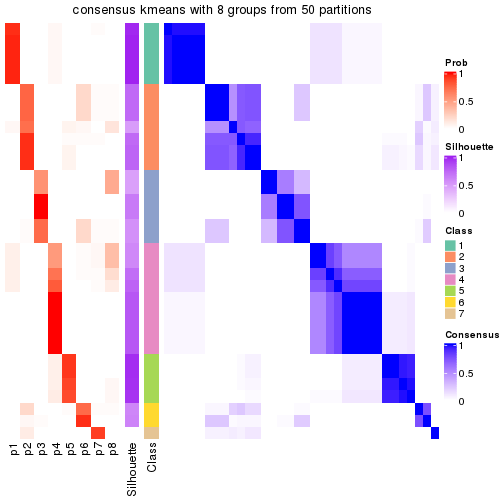</p>

</div>
</div>

Heatmaps for the membership of samples in all partitions to see how consistent they are:


<script>
$( function() {
	$( '#tabs-node-012-membership-heatmap' ).tabs();
} );
</script>
<div id='tabs-node-012-membership-heatmap'>
<ul>
<li><a href='#tab-node-012-membership-heatmap-1'>k = 2</a></li>
<li><a href='#tab-node-012-membership-heatmap-2'>k = 3</a></li>
<li><a href='#tab-node-012-membership-heatmap-3'>k = 4</a></li>
<li><a href='#tab-node-012-membership-heatmap-4'>k = 5</a></li>
<li><a href='#tab-node-012-membership-heatmap-5'>k = 6</a></li>
<li><a href='#tab-node-012-membership-heatmap-6'>k = 7</a></li>
<li><a href='#tab-node-012-membership-heatmap-7'>k = 8</a></li>
</ul>
<div id='tab-node-012-membership-heatmap-1'>
<pre><code class="r">membership_heatmap(res, k = 2)
</code></pre>

<p></p>

</div>
<div id='tab-node-012-membership-heatmap-2'>
<pre><code class="r">membership_heatmap(res, k = 3)
</code></pre>

<p>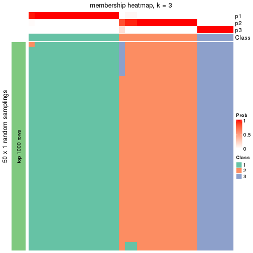</p>

</div>
<div id='tab-node-012-membership-heatmap-3'>
<pre><code class="r">membership_heatmap(res, k = 4)
</code></pre>

<p>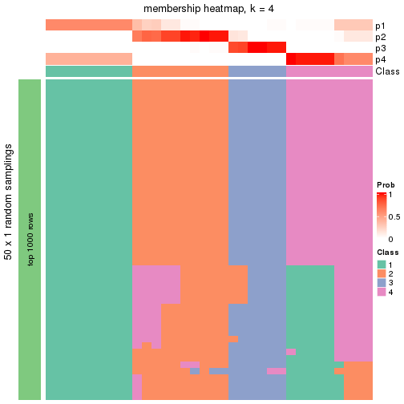</p>

</div>
<div id='tab-node-012-membership-heatmap-4'>
<pre><code class="r">membership_heatmap(res, k = 5)
</code></pre>

<p>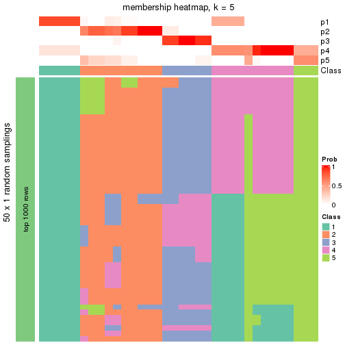</p>

</div>
<div id='tab-node-012-membership-heatmap-5'>
<pre><code class="r">membership_heatmap(res, k = 6)
</code></pre>

<p>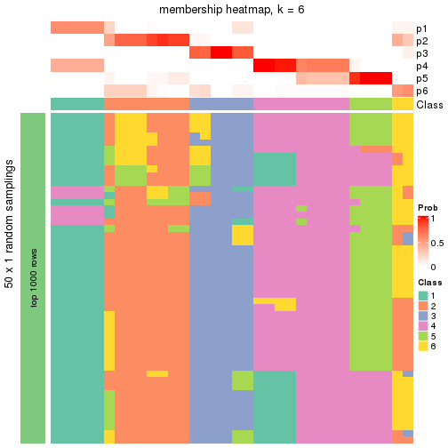</p>

</div>
<div id='tab-node-012-membership-heatmap-6'>
<pre><code class="r">membership_heatmap(res, k = 7)
</code></pre>

<p>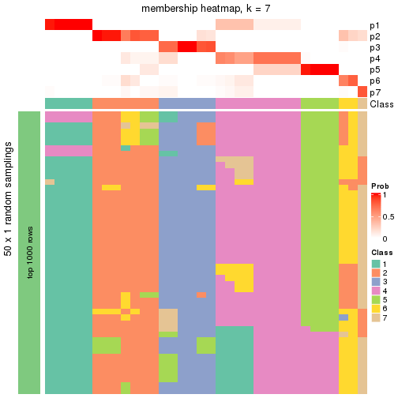</p>

</div>
<div id='tab-node-012-membership-heatmap-7'>
<pre><code class="r">membership_heatmap(res, k = 8)
</code></pre>

<p>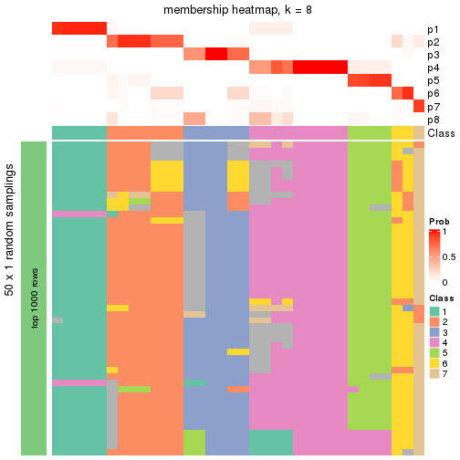</p>

</div>
</div>

As soon as the classes for columns are determined, the signatures
that are significantly different between subgroups can be looked for. 
Following are the heatmaps for signatures.


<script>
$( function() {
	$( '#tabs-node-012-get-signatures' ).tabs();
} );
</script>
<div id='tabs-node-012-get-signatures'>
<ul>
<li><a href='#tab-node-012-get-signatures-1'>k = 2</a></li>
<li><a href='#tab-node-012-get-signatures-2'>k = 3</a></li>
<li><a href='#tab-node-012-get-signatures-3'>k = 4</a></li>
<li><a href='#tab-node-012-get-signatures-4'>k = 5</a></li>
<li><a href='#tab-node-012-get-signatures-5'>k = 6</a></li>
<li><a href='#tab-node-012-get-signatures-6'>k = 7</a></li>
<li><a href='#tab-node-012-get-signatures-7'>k = 8</a></li>
</ul>
<div id='tab-node-012-get-signatures-1'>
<pre><code class="r">get_signatures(res, k = 2)
</code></pre>

<p>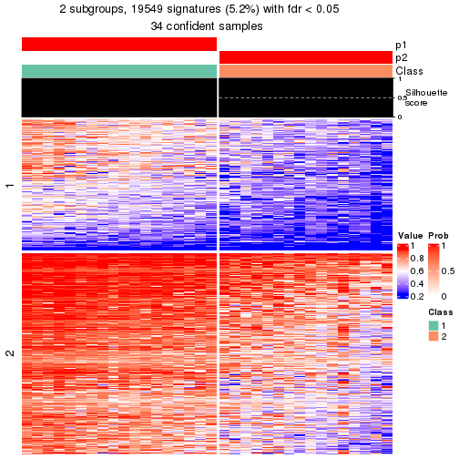</p>

</div>
<div id='tab-node-012-get-signatures-2'>
<pre><code class="r">get_signatures(res, k = 3)
</code></pre>

<p>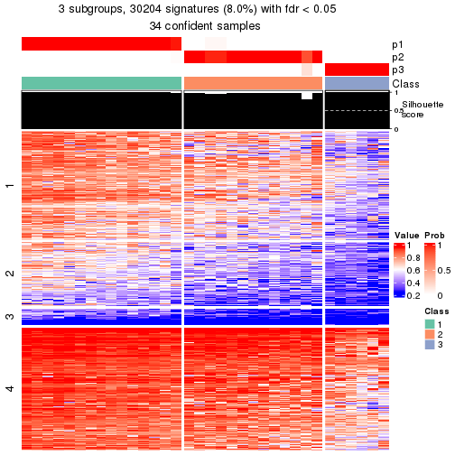</p>

</div>
<div id='tab-node-012-get-signatures-3'>
<pre><code class="r">get_signatures(res, k = 4)
</code></pre>

<p>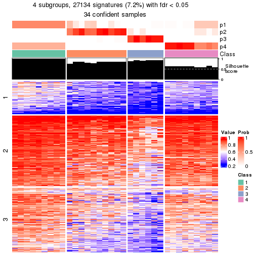</p>

</div>
<div id='tab-node-012-get-signatures-4'>
<pre><code class="r">get_signatures(res, k = 5)
</code></pre>

<p>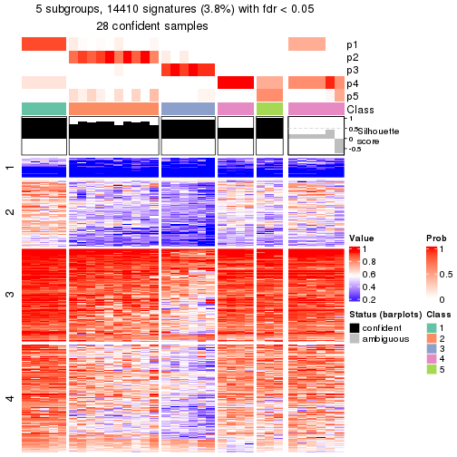</p>

</div>
<div id='tab-node-012-get-signatures-5'>
<pre><code class="r">get_signatures(res, k = 6)
</code></pre>

<p>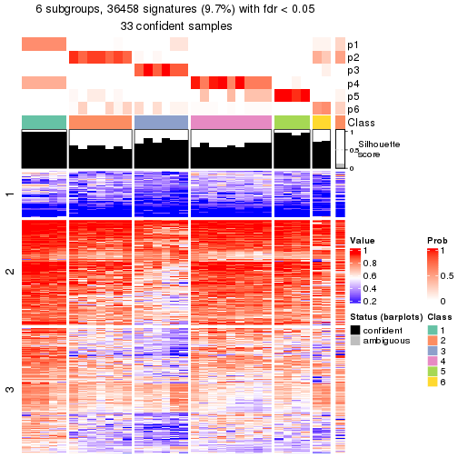</p>

</div>
<div id='tab-node-012-get-signatures-6'>
<pre><code class="r">get_signatures(res, k = 7)
</code></pre>

<p>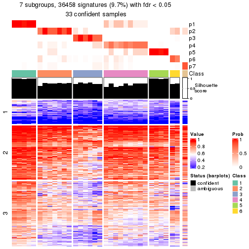</p>

</div>
<div id='tab-node-012-get-signatures-7'>
<pre><code class="r">get_signatures(res, k = 8)
</code></pre>

<p>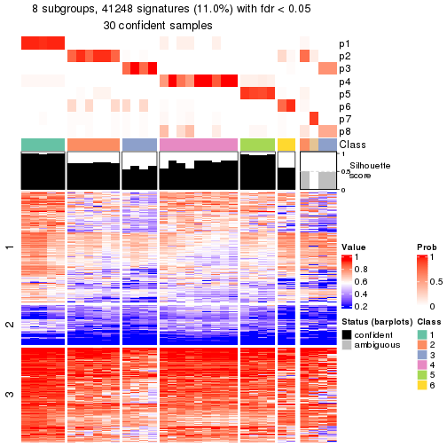</p>

</div>
</div>


Compare the overlap of signatures from different k:

```r
compare_signatures(res)
```

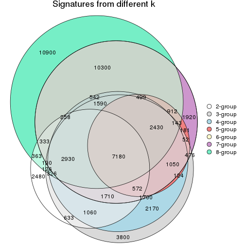

`get_signature()` returns a data frame invisibly. To get the list of signatures, the function
call should be assigned to a variable explicitly. In following code, if `plot` argument is set
to `FALSE`, no heatmap is plotted while only the differential analysis is performed.

```r
# code only for demonstration
tb = get_signature(res, k = ..., plot = FALSE)
```

An example of the output of `tb` is:

```
#>   which_row         fdr    mean_1    mean_2 scaled_mean_1 scaled_mean_2 km
#> 1        38 0.042760348  8.373488  9.131774    -0.5533452     0.5164555  1
#> 2        40 0.018707592  7.106213  8.469186    -0.6173731     0.5762149  1
#> 3        55 0.019134737 10.221463 11.207825    -0.6159697     0.5749050  1
#> 4        59 0.006059896  5.921854  7.869574    -0.6899429     0.6439467  1
#> 5        60 0.018055526  8.928898 10.211722    -0.6204761     0.5791110  1
#> 6        98 0.009384629 15.714769 14.887706     0.6635654    -0.6193277  2
...
```

The columns in `tb` are:

1. `which_row`: row indices corresponding to the input matrix.
2. `fdr`: FDR for the differential test. 
3. `mean_x`: The mean value in group x.
4. `scaled_mean_x`: The mean value in group x after rows are scaled.
5. `km`: Row groups if k-means clustering is applied to rows (which is done by automatically selecting number of clusters).

If there are too many signatures, `top_signatures = ...` can be set to only show the 
signatures with the highest FDRs:

```r
# code only for demonstration
# e.g. to show the top 500 most significant rows
tb = get_signature(res, k = ..., top_signatures = 500)
```

If the signatures are defined as these which are uniquely high in current group, `diff_method` argument
can be set to `"uniquely_high_in_one_group"`:

```r
# code only for demonstration
tb = get_signature(res, k = ..., diff_method = "uniquely_high_in_one_group")
```


UMAP plot which shows how samples are separated.


<script>
$( function() {
	$( '#tabs-node-012-dimension-reduction' ).tabs();
} );
</script>
<div id='tabs-node-012-dimension-reduction'>
<ul>
<li><a href='#tab-node-012-dimension-reduction-1'>k = 2</a></li>
<li><a href='#tab-node-012-dimension-reduction-2'>k = 3</a></li>
<li><a href='#tab-node-012-dimension-reduction-3'>k = 4</a></li>
<li><a href='#tab-node-012-dimension-reduction-4'>k = 5</a></li>
<li><a href='#tab-node-012-dimension-reduction-5'>k = 6</a></li>
<li><a href='#tab-node-012-dimension-reduction-6'>k = 7</a></li>
<li><a href='#tab-node-012-dimension-reduction-7'>k = 8</a></li>
</ul>
<div id='tab-node-012-dimension-reduction-1'>
<pre><code class="r">dimension_reduction(res, k = 2, method = &quot;UMAP&quot;)
</code></pre>

<p>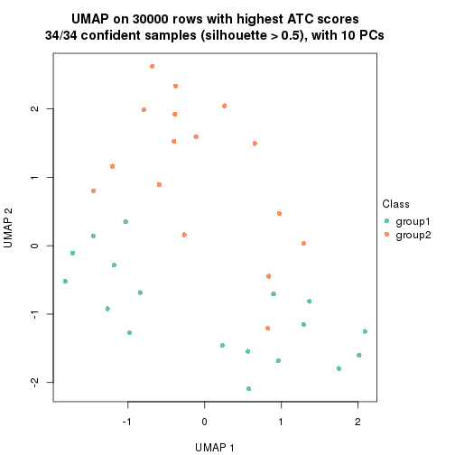</p>

</div>
<div id='tab-node-012-dimension-reduction-2'>
<pre><code class="r">dimension_reduction(res, k = 3, method = &quot;UMAP&quot;)
</code></pre>

<p>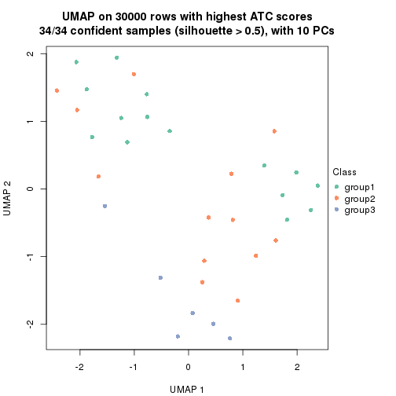</p>

</div>
<div id='tab-node-012-dimension-reduction-3'>
<pre><code class="r">dimension_reduction(res, k = 4, method = &quot;UMAP&quot;)
</code></pre>

<p>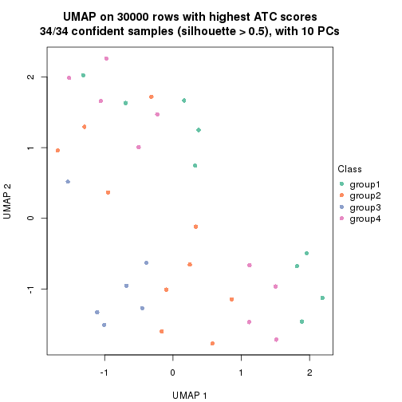</p>

</div>
<div id='tab-node-012-dimension-reduction-4'>
<pre><code class="r">dimension_reduction(res, k = 5, method = &quot;UMAP&quot;)
</code></pre>

<p>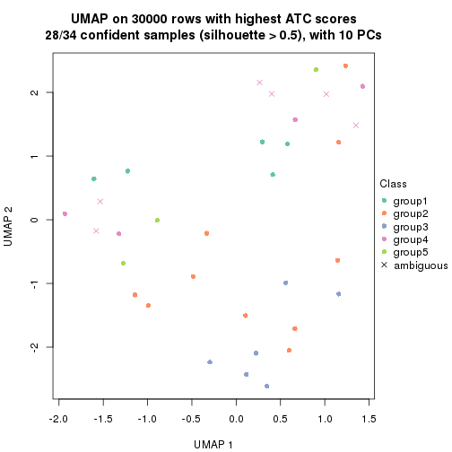</p>

</div>
<div id='tab-node-012-dimension-reduction-5'>
<pre><code class="r">dimension_reduction(res, k = 6, method = &quot;UMAP&quot;)
</code></pre>

<p>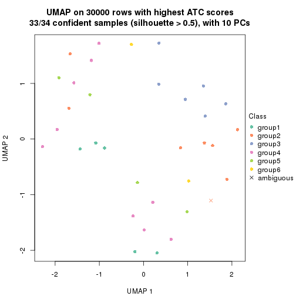</p>

</div>
<div id='tab-node-012-dimension-reduction-6'>
<pre><code class="r">dimension_reduction(res, k = 7, method = &quot;UMAP&quot;)
</code></pre>

<p>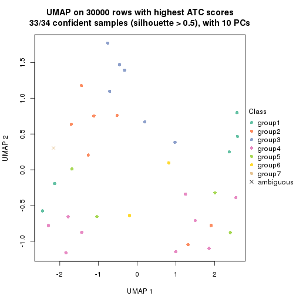</p>

</div>
<div id='tab-node-012-dimension-reduction-7'>
<pre><code class="r">dimension_reduction(res, k = 8, method = &quot;UMAP&quot;)
</code></pre>

<p>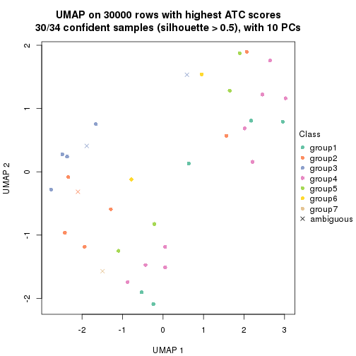</p>

</div>
</div>


Following heatmap shows how subgroups are split when increasing `k`:

```r
collect_classes(res)
```

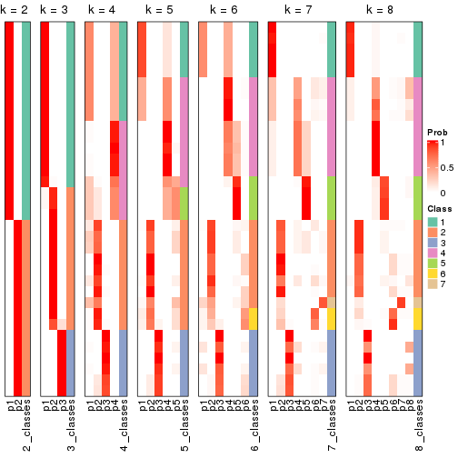


If matrix rows can be associated to genes, consider to use `functional_enrichment(res,
...)` to perform function enrichment for the signature genes. See [this vignette](https://jokergoo.github.io/cola_vignettes/functional_enrichment.html) for more detailed explanations.


 

---------------------------------------------------


### Node0121


Parent node: [Node012](#Node012).
Child nodes: 
                Node01111-leaf
        ,
                Node01112-leaf
        ,
                Node01113-leaf
        ,
                Node01121-leaf
        ,
                Node01122-leaf
        ,
                Node01123-leaf
        ,
                Node01131-leaf
        ,
                [Node01132](#Node01132)
        ,
                Node01211-leaf
        ,
                Node01212-leaf
        ,
                Node01213-leaf
        ,
                Node01214-leaf
        ,
                Node01411-leaf
        ,
                Node01412-leaf
        ,
                Node01413-leaf
        ,
                Node01414-leaf
        ,
                Node02311-leaf
        ,
                Node02312-leaf
        ,
                Node02313-leaf
        .


The object with results only for a single top-value method and a single partitioning method 
can be extracted as:

```r
res = res_rh["0121"]
```

A summary of `res` and all the functions that can be applied to it:

```r
res
```

```
#> A 'ConsensusPartition' object with k = 2, 3, 4, 5, 6, 7, 8.
#>   On a matrix with 30000 rows and 15 columns.
#>   Top rows (1000) are extracted by 'ATC' method.
#>   Subgroups are detected by 'kmeans' method.
#>   Performed in total 350 partitions by row resampling.
#>   Best k for subgroups seems to be 3.
#> 
#> Following methods can be applied to this 'ConsensusPartition' object:
#>  [1] "cola_report"             "collect_classes"         "collect_plots"          
#>  [4] "collect_stats"           "colnames"                "compare_partitions"     
#>  [7] "compare_signatures"      "consensus_heatmap"       "dimension_reduction"    
#> [10] "functional_enrichment"   "get_anno_col"            "get_anno"               
#> [13] "get_classes"             "get_consensus"           "get_matrix"             
#> [16] "get_membership"          "get_param"               "get_signatures"         
#> [19] "get_stats"               "is_best_k"               "is_stable_k"            
#> [22] "membership_heatmap"      "ncol"                    "nrow"                   
#> [25] "plot_ecdf"               "predict_classes"         "rownames"               
#> [28] "select_partition_number" "show"                    "suggest_best_k"         
#> [31] "test_to_known_factors"   "top_rows_heatmap"
```

`collect_plots()` function collects all the plots made from `res` for all `k` (number of subgroups)
into one single page to provide an easy and fast comparison between different `k`.

```r
collect_plots(res)
```

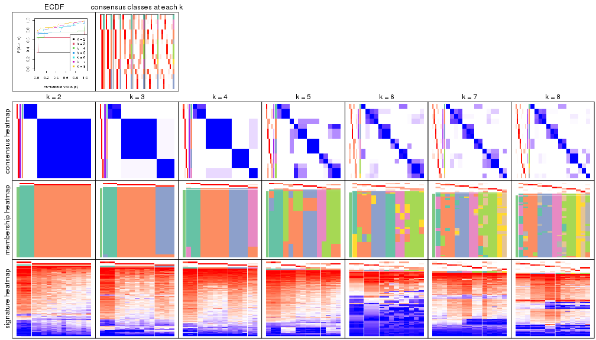

The plots are:

- The first row: a plot of the eCDF (empirical cumulative distribution
  function) curves of the consensus matrix for each `k` and the heatmap of
  predicted classes for each `k`.
- The second row: heatmaps of the consensus matrix for each `k`.
- The third row: heatmaps of the membership matrix for each `k`.
- The fouth row: heatmaps of the signatures for each `k`.

All the plots in panels can be made by individual functions and they are
plotted later in this section.

`select_partition_number()` produces several plots showing different
statistics for choosing "optimized" `k`. There are following statistics:

- eCDF curves of the consensus matrix for each `k`;
- 1-PAC. [The PAC score](https://en.wikipedia.org/wiki/Consensus_clustering#Over-interpretation_potential_of_consensus_clustering)
  measures the proportion of the ambiguous subgrouping.
- Mean silhouette score.
- Concordance. The mean probability of fiting the consensus subgroup labels in all
  partitions.
- Area increased. Denote $A_k$ as the area under the eCDF curve for current
  `k`, the area increased is defined as $A_k - A_{k-1}$.
- Rand index. The percent of pairs of samples that are both in a same cluster
  or both are not in a same cluster in the partition of k and k-1.
- Jaccard index. The ratio of pairs of samples are both in a same cluster in
  the partition of k and k-1 and the pairs of samples are both in a same
  cluster in the partition k or k-1.

The detailed explanations of these statistics can be found in [the _cola_
vignette](https://jokergoo.github.io/cola_vignettes/cola.html#toc_13).

Generally speaking, higher 1-PAC score, higher mean silhouette score or higher
concordance corresponds to better partition. Rand index and Jaccard index
measure how similar the current partition is compared to partition with `k-1`.
If they are too similar, we won't accept `k` is better than `k-1`.

```r
select_partition_number(res)
```

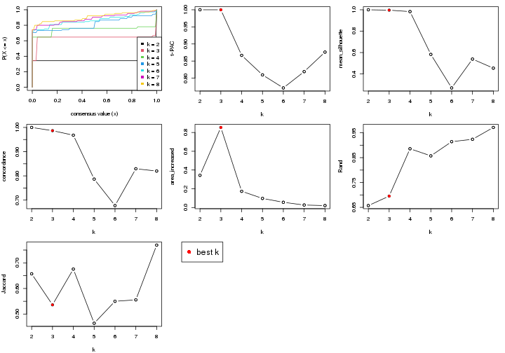

The numeric values for all these statistics can be obtained by `get_stats()`.

```r
get_stats(res)
```

```
#>   k 1-PAC mean_silhouette concordance area_increased  Rand Jaccard
#> 2 2 1.000           1.000       1.000         0.3435 0.657   0.657
#> 3 3 1.000           0.996       0.987         0.8538 0.695   0.536
#> 4 4 0.867           0.983       0.968         0.1730 0.886   0.676
#> 5 5 0.810           0.583       0.787         0.0970 0.857   0.464
#> 6 6 0.771           0.269       0.677         0.0558 0.914   0.550
#> 7 7 0.819           0.539       0.829         0.0266 0.924   0.556
#> 8 8 0.876           0.454       0.820         0.0206 0.971   0.769
```

`suggest_best_k()` suggests the best $k$ based on these statistics. The rules are as follows:

- All $k$ with Jaccard index larger than 0.95 are removed because increasing
  $k$ does not provide enough extra information. If all $k$ are removed, it is
  marked as no subgroup is detected.
- For all $k$ with 1-PAC score larger than 0.9, the maximal $k$ is taken as
  the best $k$, and other $k$ are marked as optional $k$.
- If it does not fit the second rule. The $k$ with the maximal vote of the
  highest 1-PAC score, highest mean silhouette, and highest concordance is
  taken as the best $k$.

```r
suggest_best_k(res)
```

```
#> [1] 3
#> attr(,"optional")
#> [1] 2
```

There is also optional best $k$ = 2 that is worth to check.

Following is the table of the partitions (You need to click the **show/hide
code output** link to see it). The membership matrix (columns with name `p*`)
is inferred by
[`clue::cl_consensus()`](https://www.rdocumentation.org/link/cl_consensus?package=clue)
function with the `SE` method. Basically the value in the membership matrix
represents the probability to belong to a certain group. The finall subgroup
label for an item is determined with the group with highest probability it
belongs to.

In `get_classes()` function, the entropy is calculated from the membership
matrix and the silhouette score is calculated from the consensus matrix.


<script>
$( function() {
	$( '#tabs-node-0121-get-classes' ).tabs();
} );
</script>
<div id='tabs-node-0121-get-classes'>
<ul>
<li><a href='#tab-node-0121-get-classes-1'>k = 2</a></li>
<li><a href='#tab-node-0121-get-classes-2'>k = 3</a></li>
<li><a href='#tab-node-0121-get-classes-3'>k = 4</a></li>
<li><a href='#tab-node-0121-get-classes-4'>k = 5</a></li>
<li><a href='#tab-node-0121-get-classes-5'>k = 6</a></li>
<li><a href='#tab-node-0121-get-classes-6'>k = 7</a></li>
<li><a href='#tab-node-0121-get-classes-7'>k = 8</a></li>
</ul>

<div id='tab-node-0121-get-classes-1'>
<p><a id='tab-node-0121-get-classes-1-a' style='color:#0366d6' href='#'>show/hide code output</a></p>
<pre><code class="r">cbind(get_classes(res, k = 2), get_membership(res, k = 2))
</code></pre>

<pre><code>#&gt;                 class entropy silhouette p1 p2
#&gt; TCGA.AZ.4615.01     2       0          1  0  1
#&gt; TCGA.AD.A5EJ.01     2       0          1  0  1
#&gt; TCGA.AZ.6598.01     1       0          1  1  0
#&gt; TCGA.A6.6653.01     1       0          1  1  0
#&gt; TCGA.CK.5916.01     2       0          1  0  1
#&gt; TCGA.AD.5900.01     2       0          1  0  1
#&gt; TCGA.G4.6321.01     2       0          1  0  1
#&gt; TCGA.A6.5665.01     2       0          1  0  1
#&gt; TCGA.AD.6895.01     2       0          1  0  1
#&gt; TCGA.A6.5661.01     2       0          1  0  1
#&gt; TCGA.D5.6930.01     2       0          1  0  1
#&gt; TCGA.QG.A5Z2.01     2       0          1  0  1
#&gt; TCGA.AD.6889.01     1       0          1  1  0
#&gt; TCGA.G4.6299.01     2       0          1  0  1
#&gt; TCGA.AU.6004.01     2       0          1  0  1
</code></pre>

<script>
$('#tab-node-0121-get-classes-1-a').parent().next().next().hide();
$('#tab-node-0121-get-classes-1-a').click(function(){
  $('#tab-node-0121-get-classes-1-a').parent().next().next().toggle();
  return(false);
});
</script>
</div>

<div id='tab-node-0121-get-classes-2'>
<p><a id='tab-node-0121-get-classes-2-a' style='color:#0366d6' href='#'>show/hide code output</a></p>
<pre><code class="r">cbind(get_classes(res, k = 3), get_membership(res, k = 3))
</code></pre>

<pre><code>#&gt;                 class entropy silhouette   p1   p2   p3
#&gt; TCGA.AZ.4615.01     2   0.000      1.000 0.00 1.00 0.00
#&gt; TCGA.AD.A5EJ.01     3   0.153      1.000 0.00 0.04 0.96
#&gt; TCGA.AZ.6598.01     1   0.000      0.987 1.00 0.00 0.00
#&gt; TCGA.A6.6653.01     1   0.000      0.987 1.00 0.00 0.00
#&gt; TCGA.CK.5916.01     3   0.153      1.000 0.00 0.04 0.96
#&gt; TCGA.AD.5900.01     2   0.000      1.000 0.00 1.00 0.00
#&gt; TCGA.G4.6321.01     2   0.000      1.000 0.00 1.00 0.00
#&gt; TCGA.A6.5665.01     3   0.153      1.000 0.00 0.04 0.96
#&gt; TCGA.AD.6895.01     2   0.000      1.000 0.00 1.00 0.00
#&gt; TCGA.A6.5661.01     3   0.153      1.000 0.00 0.04 0.96
#&gt; TCGA.D5.6930.01     2   0.000      1.000 0.00 1.00 0.00
#&gt; TCGA.QG.A5Z2.01     2   0.000      1.000 0.00 1.00 0.00
#&gt; TCGA.AD.6889.01     1   0.153      0.974 0.96 0.00 0.04
#&gt; TCGA.G4.6299.01     2   0.000      1.000 0.00 1.00 0.00
#&gt; TCGA.AU.6004.01     2   0.000      1.000 0.00 1.00 0.00
</code></pre>

<script>
$('#tab-node-0121-get-classes-2-a').parent().next().next().hide();
$('#tab-node-0121-get-classes-2-a').click(function(){
  $('#tab-node-0121-get-classes-2-a').parent().next().next().toggle();
  return(false);
});
</script>
</div>

<div id='tab-node-0121-get-classes-3'>
<p><a id='tab-node-0121-get-classes-3-a' style='color:#0366d6' href='#'>show/hide code output</a></p>
<pre><code class="r">cbind(get_classes(res, k = 4), get_membership(res, k = 4))
</code></pre>

<pre><code>#&gt;                 class entropy silhouette   p1   p2 p3   p4
#&gt; TCGA.AZ.4615.01     4   0.317      1.000 0.00 0.16  0 0.84
#&gt; TCGA.AD.A5EJ.01     3   0.000      1.000 0.00 0.00  1 0.00
#&gt; TCGA.AZ.6598.01     1   0.000      0.937 1.00 0.00  0 0.00
#&gt; TCGA.A6.6653.01     1   0.000      0.937 1.00 0.00  0 0.00
#&gt; TCGA.CK.5916.01     3   0.000      1.000 0.00 0.00  1 0.00
#&gt; TCGA.AD.5900.01     4   0.317      1.000 0.00 0.16  0 0.84
#&gt; TCGA.G4.6321.01     2   0.000      1.000 0.00 1.00  0 0.00
#&gt; TCGA.A6.5665.01     3   0.000      1.000 0.00 0.00  1 0.00
#&gt; TCGA.AD.6895.01     2   0.000      1.000 0.00 1.00  0 0.00
#&gt; TCGA.A6.5661.01     3   0.000      1.000 0.00 0.00  1 0.00
#&gt; TCGA.D5.6930.01     2   0.000      1.000 0.00 1.00  0 0.00
#&gt; TCGA.QG.A5Z2.01     2   0.000      1.000 0.00 1.00  0 0.00
#&gt; TCGA.AD.6889.01     1   0.317      0.870 0.84 0.00  0 0.16
#&gt; TCGA.G4.6299.01     2   0.000      1.000 0.00 1.00  0 0.00
#&gt; TCGA.AU.6004.01     2   0.000      1.000 0.00 1.00  0 0.00
</code></pre>

<script>
$('#tab-node-0121-get-classes-3-a').parent().next().next().hide();
$('#tab-node-0121-get-classes-3-a').click(function(){
  $('#tab-node-0121-get-classes-3-a').parent().next().next().toggle();
  return(false);
});
</script>
</div>

<div id='tab-node-0121-get-classes-4'>
<p><a id='tab-node-0121-get-classes-4-a' style='color:#0366d6' href='#'>show/hide code output</a></p>
<pre><code class="r">cbind(get_classes(res, k = 5), get_membership(res, k = 5))
</code></pre>

<pre><code>#&gt;                 class entropy silhouette  p1   p2  p3   p4   p5
#&gt; TCGA.AZ.4615.01     4   0.000      0.787 0.0 0.00 0.0 1.00 0.00
#&gt; TCGA.AD.A5EJ.01     3   0.000      1.000 0.0 0.00 1.0 0.00 0.00
#&gt; TCGA.AZ.6598.01     1   0.380      0.872 0.7 0.00 0.0 0.00 0.30
#&gt; TCGA.A6.6653.01     1   0.380      0.872 0.7 0.00 0.0 0.00 0.30
#&gt; TCGA.CK.5916.01     2   0.431     -0.306 0.0 0.50 0.5 0.00 0.00
#&gt; TCGA.AD.5900.01     4   0.342      0.789 0.0 0.00 0.0 0.76 0.24
#&gt; TCGA.G4.6321.01     2   0.000      0.315 0.0 1.00 0.0 0.00 0.00
#&gt; TCGA.A6.5665.01     3   0.000      1.000 0.0 0.00 1.0 0.00 0.00
#&gt; TCGA.AD.6895.01     5   0.431      0.788 0.0 0.50 0.0 0.00 0.50
#&gt; TCGA.A6.5661.01     3   0.000      1.000 0.0 0.00 1.0 0.00 0.00
#&gt; TCGA.D5.6930.01     5   0.431      0.788 0.0 0.50 0.0 0.00 0.50
#&gt; TCGA.QG.A5Z2.01     2   0.429     -0.827 0.0 0.54 0.0 0.00 0.46
#&gt; TCGA.AD.6889.01     1   0.000      0.726 1.0 0.00 0.0 0.00 0.00
#&gt; TCGA.G4.6299.01     5   0.380      0.621 0.0 0.30 0.0 0.00 0.70
#&gt; TCGA.AU.6004.01     2   0.000      0.315 0.0 1.00 0.0 0.00 0.00
</code></pre>

<script>
$('#tab-node-0121-get-classes-4-a').parent().next().next().hide();
$('#tab-node-0121-get-classes-4-a').click(function(){
  $('#tab-node-0121-get-classes-4-a').parent().next().next().toggle();
  return(false);
});
</script>
</div>

<div id='tab-node-0121-get-classes-5'>
<p><a id='tab-node-0121-get-classes-5-a' style='color:#0366d6' href='#'>show/hide code output</a></p>
<pre><code class="r">cbind(get_classes(res, k = 6), get_membership(res, k = 6))
</code></pre>

<pre><code>#&gt;                 class entropy silhouette   p1   p2   p3   p4   p5   p6
#&gt; TCGA.AZ.4615.01     4   0.385     0.1215 0.00 0.00 0.00 0.54 0.46 0.00
#&gt; TCGA.AD.A5EJ.01     3   0.226     0.8826 0.00 0.00 0.86 0.00 0.00 0.14
#&gt; TCGA.AZ.6598.01     4   0.633    -0.5020 0.28 0.02 0.00 0.46 0.00 0.24
#&gt; TCGA.A6.6653.01     4   0.594    -0.5020 0.28 0.00 0.00 0.46 0.00 0.26
#&gt; TCGA.CK.5916.01     2   0.279     0.7426 0.00 0.84 0.14 0.00 0.00 0.02
#&gt; TCGA.AD.5900.01     4   0.385     0.1045 0.46 0.00 0.00 0.54 0.00 0.00
#&gt; TCGA.G4.6321.01     2   0.258     0.8099 0.00 0.86 0.00 0.00 0.02 0.12
#&gt; TCGA.A6.5665.01     3   0.000     0.9430 0.00 0.00 1.00 0.00 0.00 0.00
#&gt; TCGA.AD.6895.01     5   0.385    -0.1456 0.00 0.00 0.00 0.00 0.54 0.46
#&gt; TCGA.A6.5661.01     3   0.000     0.9430 0.00 0.00 1.00 0.00 0.00 0.00
#&gt; TCGA.D5.6930.01     5   0.385    -0.1456 0.00 0.00 0.00 0.00 0.54 0.46
#&gt; TCGA.QG.A5Z2.01     6   0.528     0.0000 0.00 0.10 0.00 0.00 0.42 0.48
#&gt; TCGA.AD.6889.01     1   0.532     0.0000 0.54 0.12 0.00 0.34 0.00 0.00
#&gt; TCGA.G4.6299.01     5   0.385     0.0158 0.46 0.00 0.00 0.00 0.54 0.00
#&gt; TCGA.AU.6004.01     2   0.346     0.7699 0.00 0.76 0.00 0.00 0.02 0.22
</code></pre>

<script>
$('#tab-node-0121-get-classes-5-a').parent().next().next().hide();
$('#tab-node-0121-get-classes-5-a').click(function(){
  $('#tab-node-0121-get-classes-5-a').parent().next().next().toggle();
  return(false);
});
</script>
</div>

<div id='tab-node-0121-get-classes-6'>
<p><a id='tab-node-0121-get-classes-6-a' style='color:#0366d6' href='#'>show/hide code output</a></p>
<pre><code class="r">cbind(get_classes(res, k = 7), get_membership(res, k = 7))
</code></pre>

<pre><code>#&gt;                 class entropy silhouette   p1   p2   p3   p4   p5   p6   p7
#&gt; TCGA.AZ.4615.01     6  0.0000     0.0000 0.00 0.00 0.00 0.00 0.00 1.00 0.00
#&gt; TCGA.AD.A5EJ.01     3  0.3617     0.7769 0.08 0.00 0.76 0.00 0.00 0.00 0.16
#&gt; TCGA.AZ.6598.01     4  0.2512     0.7873 0.00 0.04 0.00 0.86 0.00 0.00 0.10
#&gt; TCGA.A6.6653.01     4  0.0000     0.7873 0.00 0.00 0.00 1.00 0.00 0.00 0.00
#&gt; TCGA.CK.5916.01     2  0.2722     0.7559 0.12 0.84 0.04 0.00 0.00 0.00 0.00
#&gt; TCGA.AD.5900.01     7  0.3358     0.0000 0.00 0.00 0.00 0.00 0.00 0.36 0.64
#&gt; TCGA.G4.6321.01     2  0.0863     0.8052 0.00 0.96 0.00 0.00 0.04 0.00 0.00
#&gt; TCGA.A6.5665.01     3  0.0000     0.8870 0.00 0.00 1.00 0.00 0.00 0.00 0.00
#&gt; TCGA.AD.6895.01     5  0.0000     0.6522 0.00 0.00 0.00 0.00 1.00 0.00 0.00
#&gt; TCGA.A6.5661.01     3  0.0504     0.8870 0.02 0.00 0.98 0.00 0.00 0.00 0.00
#&gt; TCGA.D5.6930.01     5  0.0000     0.6522 0.00 0.00 0.00 0.00 1.00 0.00 0.00
#&gt; TCGA.QG.A5Z2.01     5  0.5945     0.4153 0.16 0.18 0.00 0.00 0.56 0.00 0.10
#&gt; TCGA.AD.6889.01     1  0.3496     0.0000 0.58 0.00 0.00 0.42 0.00 0.00 0.00
#&gt; TCGA.G4.6299.01     5  0.4283    -0.0386 0.04 0.00 0.00 0.00 0.48 0.00 0.48
#&gt; TCGA.AU.6004.01     2  0.2708     0.7124 0.00 0.78 0.00 0.00 0.22 0.00 0.00
</code></pre>

<script>
$('#tab-node-0121-get-classes-6-a').parent().next().next().hide();
$('#tab-node-0121-get-classes-6-a').click(function(){
  $('#tab-node-0121-get-classes-6-a').parent().next().next().toggle();
  return(false);
});
</script>
</div>

<div id='tab-node-0121-get-classes-7'>
<p><a id='tab-node-0121-get-classes-7-a' style='color:#0366d6' href='#'>show/hide code output</a></p>
<pre><code class="r">cbind(get_classes(res, k = 8), get_membership(res, k = 8))
</code></pre>

<pre><code>#&gt;                 class entropy silhouette   p1   p2   p3   p4   p5   p6   p7   p8
#&gt; TCGA.AZ.4615.01     6  0.2267     0.0000 0.00 0.00 0.00 0.00 0.00 0.82 0.18 0.00
#&gt; TCGA.AD.A5EJ.01     3  0.4982     0.5713 0.18 0.00 0.58 0.00 0.00 0.02 0.00 0.22
#&gt; TCGA.AZ.6598.01     4  0.0000     0.7450 0.00 0.00 0.00 1.00 0.00 0.00 0.00 0.00
#&gt; TCGA.A6.6653.01     4  0.2114     0.7450 0.00 0.00 0.00 0.84 0.00 0.00 0.00 0.16
#&gt; TCGA.CK.5916.01     2  0.4061     0.7014 0.14 0.72 0.02 0.00 0.00 0.12 0.00 0.00
#&gt; TCGA.AD.5900.01     7  0.0000     0.0000 0.00 0.00 0.00 0.00 0.00 0.00 1.00 0.00
#&gt; TCGA.G4.6321.01     2  0.0000     0.8262 0.00 1.00 0.00 0.00 0.00 0.00 0.00 0.00
#&gt; TCGA.A6.5665.01     3  0.0000     0.7901 0.00 0.00 1.00 0.00 0.00 0.00 0.00 0.00
#&gt; TCGA.AD.6895.01     5  0.0471     0.4383 0.00 0.02 0.00 0.00 0.98 0.00 0.00 0.00
#&gt; TCGA.A6.5661.01     3  0.0808     0.7901 0.00 0.00 0.96 0.00 0.00 0.04 0.00 0.00
#&gt; TCGA.D5.6930.01     5  0.0471     0.4383 0.00 0.02 0.00 0.00 0.98 0.00 0.00 0.00
#&gt; TCGA.QG.A5Z2.01     8  0.4391     0.0000 0.00 0.08 0.00 0.00 0.42 0.00 0.00 0.50
#&gt; TCGA.AD.6889.01     1  0.3299     0.0000 0.56 0.00 0.00 0.44 0.00 0.00 0.00 0.00
#&gt; TCGA.G4.6299.01     5  0.5963    -0.0454 0.12 0.00 0.00 0.00 0.42 0.00 0.34 0.12
#&gt; TCGA.AU.6004.01     2  0.1091     0.8095 0.00 0.94 0.00 0.00 0.06 0.00 0.00 0.00
</code></pre>

<script>
$('#tab-node-0121-get-classes-7-a').parent().next().next().hide();
$('#tab-node-0121-get-classes-7-a').click(function(){
  $('#tab-node-0121-get-classes-7-a').parent().next().next().toggle();
  return(false);
});
</script>
</div>
</div>

Heatmaps for the consensus matrix. It visualizes the probability of two
samples to be in a same group.


<script>
$( function() {
	$( '#tabs-node-0121-consensus-heatmap' ).tabs();
} );
</script>
<div id='tabs-node-0121-consensus-heatmap'>
<ul>
<li><a href='#tab-node-0121-consensus-heatmap-1'>k = 2</a></li>
<li><a href='#tab-node-0121-consensus-heatmap-2'>k = 3</a></li>
<li><a href='#tab-node-0121-consensus-heatmap-3'>k = 4</a></li>
<li><a href='#tab-node-0121-consensus-heatmap-4'>k = 5</a></li>
<li><a href='#tab-node-0121-consensus-heatmap-5'>k = 6</a></li>
<li><a href='#tab-node-0121-consensus-heatmap-6'>k = 7</a></li>
<li><a href='#tab-node-0121-consensus-heatmap-7'>k = 8</a></li>
</ul>
<div id='tab-node-0121-consensus-heatmap-1'>
<pre><code class="r">consensus_heatmap(res, k = 2)
</code></pre>

<p>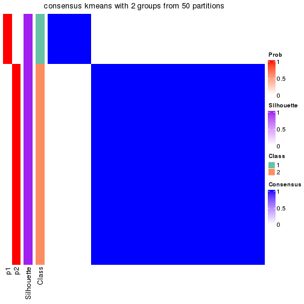</p>

</div>
<div id='tab-node-0121-consensus-heatmap-2'>
<pre><code class="r">consensus_heatmap(res, k = 3)
</code></pre>

<p>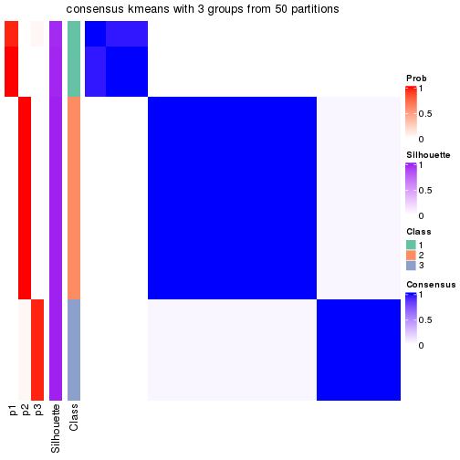</p>

</div>
<div id='tab-node-0121-consensus-heatmap-3'>
<pre><code class="r">consensus_heatmap(res, k = 4)
</code></pre>

<p>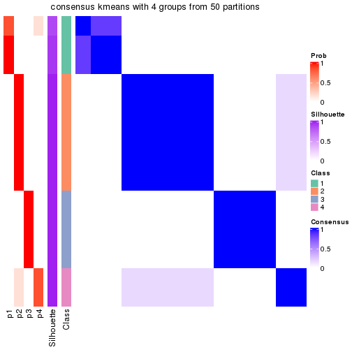</p>

</div>
<div id='tab-node-0121-consensus-heatmap-4'>
<pre><code class="r">consensus_heatmap(res, k = 5)
</code></pre>

<p>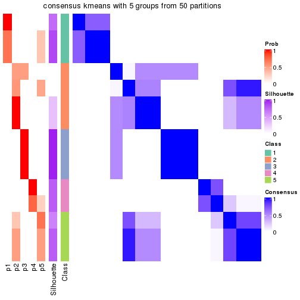</p>

</div>
<div id='tab-node-0121-consensus-heatmap-5'>
<pre><code class="r">consensus_heatmap(res, k = 6)
</code></pre>

<p>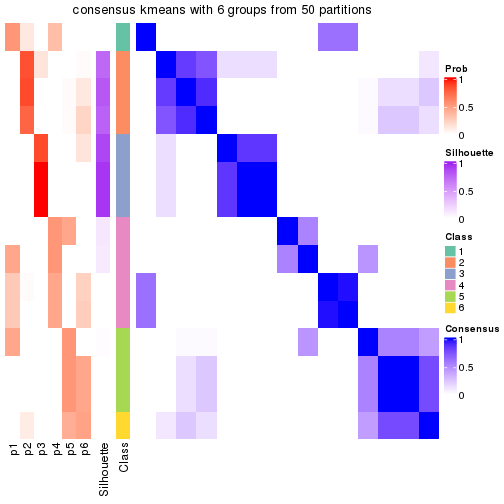</p>

</div>
<div id='tab-node-0121-consensus-heatmap-6'>
<pre><code class="r">consensus_heatmap(res, k = 7)
</code></pre>

<p>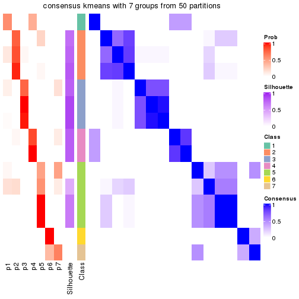</p>

</div>
<div id='tab-node-0121-consensus-heatmap-7'>
<pre><code class="r">consensus_heatmap(res, k = 8)
</code></pre>

<p>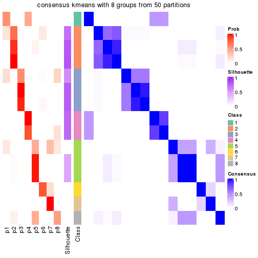</p>

</div>
</div>

Heatmaps for the membership of samples in all partitions to see how consistent they are:


<script>
$( function() {
	$( '#tabs-node-0121-membership-heatmap' ).tabs();
} );
</script>
<div id='tabs-node-0121-membership-heatmap'>
<ul>
<li><a href='#tab-node-0121-membership-heatmap-1'>k = 2</a></li>
<li><a href='#tab-node-0121-membership-heatmap-2'>k = 3</a></li>
<li><a href='#tab-node-0121-membership-heatmap-3'>k = 4</a></li>
<li><a href='#tab-node-0121-membership-heatmap-4'>k = 5</a></li>
<li><a href='#tab-node-0121-membership-heatmap-5'>k = 6</a></li>
<li><a href='#tab-node-0121-membership-heatmap-6'>k = 7</a></li>
<li><a href='#tab-node-0121-membership-heatmap-7'>k = 8</a></li>
</ul>
<div id='tab-node-0121-membership-heatmap-1'>
<pre><code class="r">membership_heatmap(res, k = 2)
</code></pre>

<p>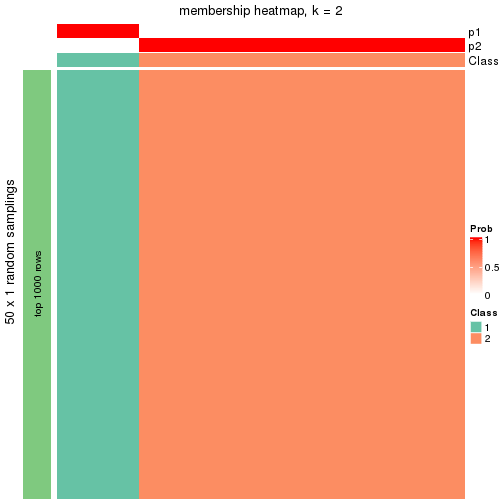</p>

</div>
<div id='tab-node-0121-membership-heatmap-2'>
<pre><code class="r">membership_heatmap(res, k = 3)
</code></pre>

<p>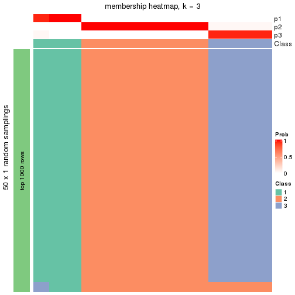</p>

</div>
<div id='tab-node-0121-membership-heatmap-3'>
<pre><code class="r">membership_heatmap(res, k = 4)
</code></pre>

<p>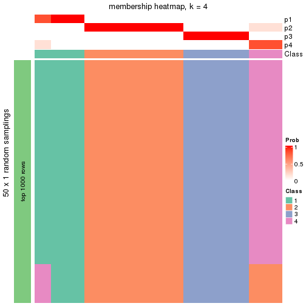</p>

</div>
<div id='tab-node-0121-membership-heatmap-4'>
<pre><code class="r">membership_heatmap(res, k = 5)
</code></pre>

<p>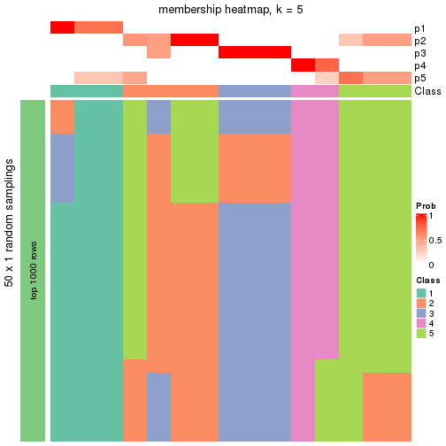</p>

</div>
<div id='tab-node-0121-membership-heatmap-5'>
<pre><code class="r">membership_heatmap(res, k = 6)
</code></pre>

<p>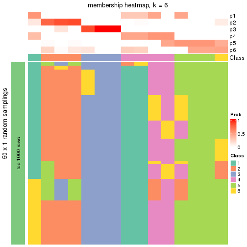</p>

</div>
<div id='tab-node-0121-membership-heatmap-6'>
<pre><code class="r">membership_heatmap(res, k = 7)
</code></pre>

<p>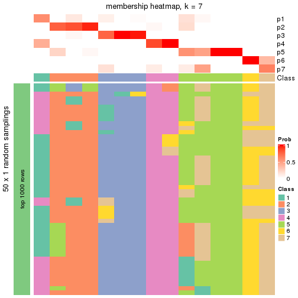</p>

</div>
<div id='tab-node-0121-membership-heatmap-7'>
<pre><code class="r">membership_heatmap(res, k = 8)
</code></pre>

<p>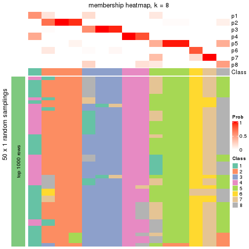</p>

</div>
</div>

As soon as the classes for columns are determined, the signatures
that are significantly different between subgroups can be looked for. 
Following are the heatmaps for signatures.


<script>
$( function() {
	$( '#tabs-node-0121-get-signatures' ).tabs();
} );
</script>
<div id='tabs-node-0121-get-signatures'>
<ul>
<li><a href='#tab-node-0121-get-signatures-1'>k = 2</a></li>
<li><a href='#tab-node-0121-get-signatures-2'>k = 3</a></li>
<li><a href='#tab-node-0121-get-signatures-3'>k = 4</a></li>
<li><a href='#tab-node-0121-get-signatures-4'>k = 5</a></li>
<li><a href='#tab-node-0121-get-signatures-5'>k = 6</a></li>
<li><a href='#tab-node-0121-get-signatures-6'>k = 7</a></li>
<li><a href='#tab-node-0121-get-signatures-7'>k = 8</a></li>
</ul>
<div id='tab-node-0121-get-signatures-1'>
<pre><code class="r">get_signatures(res, k = 2)
</code></pre>

<p>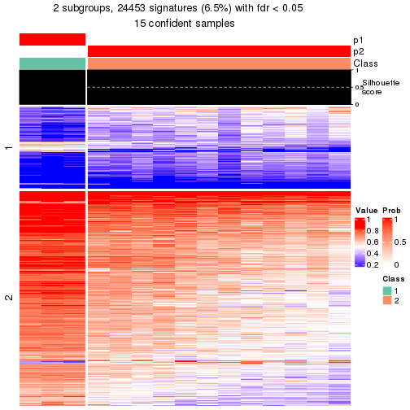</p>

</div>
<div id='tab-node-0121-get-signatures-2'>
<pre><code class="r">get_signatures(res, k = 3)
</code></pre>

<p>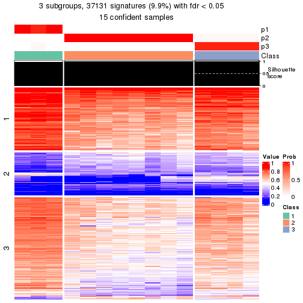</p>

</div>
<div id='tab-node-0121-get-signatures-3'>
<pre><code class="r">get_signatures(res, k = 4)
</code></pre>

<p>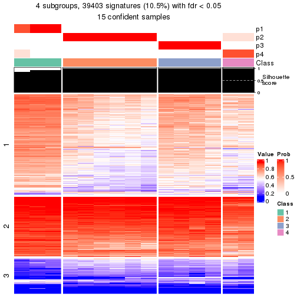</p>

</div>
<div id='tab-node-0121-get-signatures-4'>
<pre><code class="r">get_signatures(res, k = 5)
</code></pre>

<p>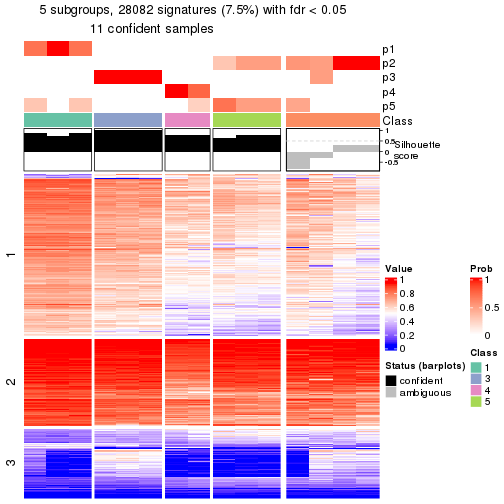</p>

</div>
<div id='tab-node-0121-get-signatures-5'>
<pre><code class="r">get_signatures(res, k = 6)
</code></pre>

<p>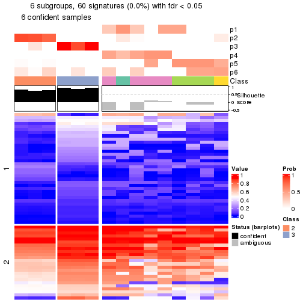</p>

</div>
<div id='tab-node-0121-get-signatures-6'>
<pre><code class="r">get_signatures(res, k = 7)
</code></pre>

<p>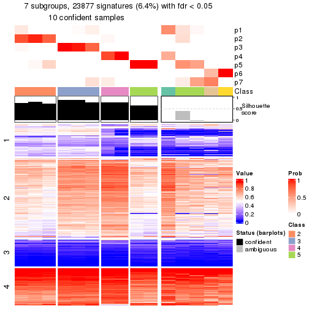</p>

</div>
<div id='tab-node-0121-get-signatures-7'>
<pre><code class="r">get_signatures(res, k = 8)
</code></pre>

<p>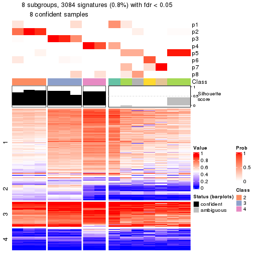</p>

</div>
</div>


Compare the overlap of signatures from different k:

```r
compare_signatures(res)
```

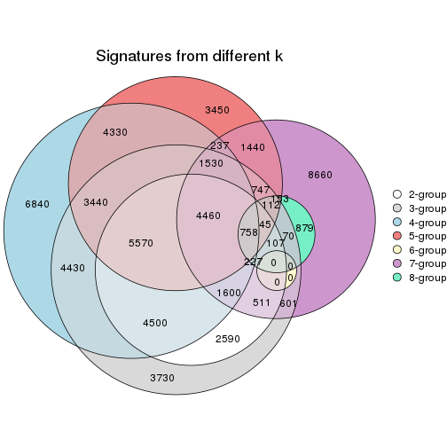

`get_signature()` returns a data frame invisibly. To get the list of signatures, the function
call should be assigned to a variable explicitly. In following code, if `plot` argument is set
to `FALSE`, no heatmap is plotted while only the differential analysis is performed.

```r
# code only for demonstration
tb = get_signature(res, k = ..., plot = FALSE)
```

An example of the output of `tb` is:

```
#>   which_row         fdr    mean_1    mean_2 scaled_mean_1 scaled_mean_2 km
#> 1        38 0.042760348  8.373488  9.131774    -0.5533452     0.5164555  1
#> 2        40 0.018707592  7.106213  8.469186    -0.6173731     0.5762149  1
#> 3        55 0.019134737 10.221463 11.207825    -0.6159697     0.5749050  1
#> 4        59 0.006059896  5.921854  7.869574    -0.6899429     0.6439467  1
#> 5        60 0.018055526  8.928898 10.211722    -0.6204761     0.5791110  1
#> 6        98 0.009384629 15.714769 14.887706     0.6635654    -0.6193277  2
...
```

The columns in `tb` are:

1. `which_row`: row indices corresponding to the input matrix.
2. `fdr`: FDR for the differential test. 
3. `mean_x`: The mean value in group x.
4. `scaled_mean_x`: The mean value in group x after rows are scaled.
5. `km`: Row groups if k-means clustering is applied to rows (which is done by automatically selecting number of clusters).

If there are too many signatures, `top_signatures = ...` can be set to only show the 
signatures with the highest FDRs:

```r
# code only for demonstration
# e.g. to show the top 500 most significant rows
tb = get_signature(res, k = ..., top_signatures = 500)
```

If the signatures are defined as these which are uniquely high in current group, `diff_method` argument
can be set to `"uniquely_high_in_one_group"`:

```r
# code only for demonstration
tb = get_signature(res, k = ..., diff_method = "uniquely_high_in_one_group")
```


UMAP plot which shows how samples are separated.


<script>
$( function() {
	$( '#tabs-node-0121-dimension-reduction' ).tabs();
} );
</script>
<div id='tabs-node-0121-dimension-reduction'>
<ul>
<li><a href='#tab-node-0121-dimension-reduction-1'>k = 2</a></li>
<li><a href='#tab-node-0121-dimension-reduction-2'>k = 3</a></li>
<li><a href='#tab-node-0121-dimension-reduction-3'>k = 4</a></li>
<li><a href='#tab-node-0121-dimension-reduction-4'>k = 5</a></li>
<li><a href='#tab-node-0121-dimension-reduction-5'>k = 6</a></li>
<li><a href='#tab-node-0121-dimension-reduction-6'>k = 7</a></li>
<li><a href='#tab-node-0121-dimension-reduction-7'>k = 8</a></li>
</ul>
<div id='tab-node-0121-dimension-reduction-1'>
<pre><code class="r">dimension_reduction(res, k = 2, method = &quot;UMAP&quot;)
</code></pre>

<p>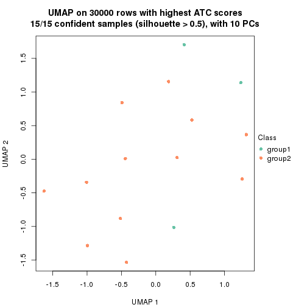</p>

</div>
<div id='tab-node-0121-dimension-reduction-2'>
<pre><code class="r">dimension_reduction(res, k = 3, method = &quot;UMAP&quot;)
</code></pre>

<p>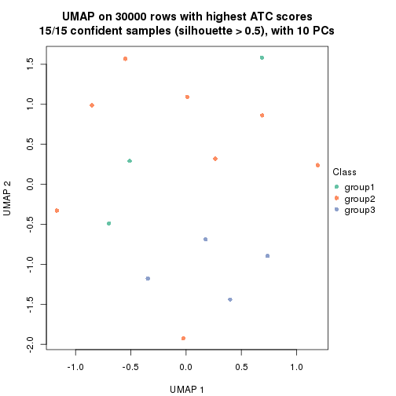</p>

</div>
<div id='tab-node-0121-dimension-reduction-3'>
<pre><code class="r">dimension_reduction(res, k = 4, method = &quot;UMAP&quot;)
</code></pre>

<p>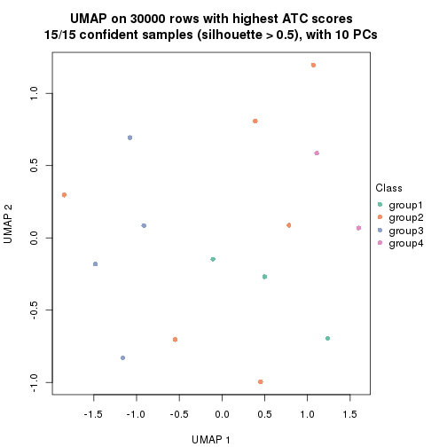</p>

</div>
<div id='tab-node-0121-dimension-reduction-4'>
<pre><code class="r">dimension_reduction(res, k = 5, method = &quot;UMAP&quot;)
</code></pre>

<p>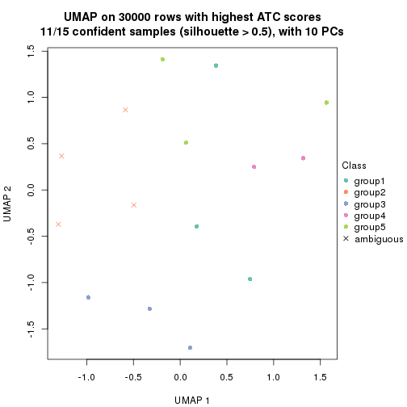</p>

</div>
<div id='tab-node-0121-dimension-reduction-5'>
<pre><code class="r">dimension_reduction(res, k = 6, method = &quot;UMAP&quot;)
</code></pre>

<p>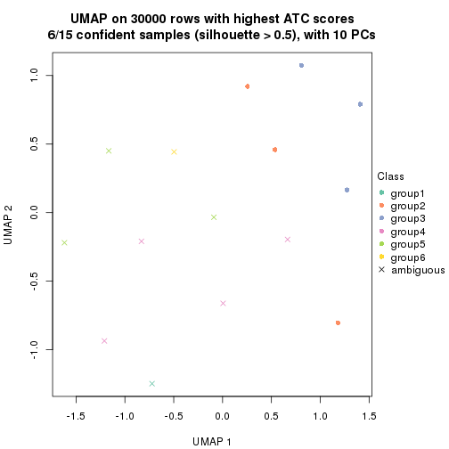</p>

</div>
<div id='tab-node-0121-dimension-reduction-6'>
<pre><code class="r">dimension_reduction(res, k = 7, method = &quot;UMAP&quot;)
</code></pre>

<p>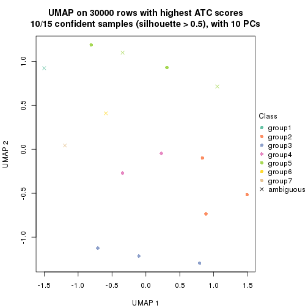</p>

</div>
<div id='tab-node-0121-dimension-reduction-7'>
<pre><code class="r">dimension_reduction(res, k = 8, method = &quot;UMAP&quot;)
</code></pre>

<p>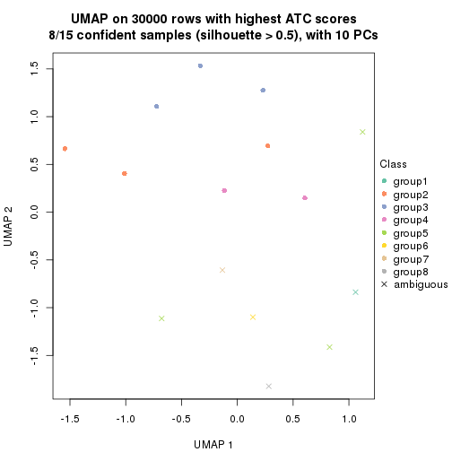</p>

</div>
</div>


Following heatmap shows how subgroups are split when increasing `k`:

```r
collect_classes(res)
```

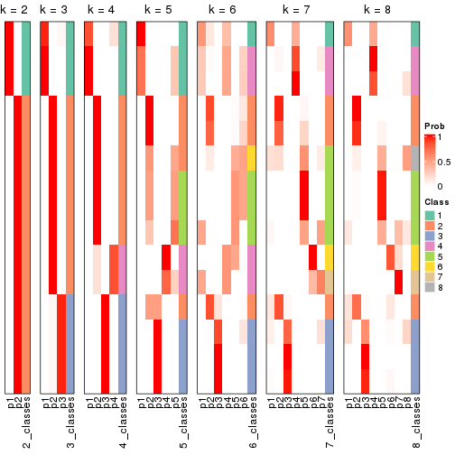


If matrix rows can be associated to genes, consider to use `functional_enrichment(res,
...)` to perform function enrichment for the signature genes. See [this vignette](https://jokergoo.github.io/cola_vignettes/functional_enrichment.html) for more detailed explanations.


 

---------------------------------------------------


### Node013


Parent node: [Node01](#Node01).
Child nodes: 
                [Node0111](#Node0111)
        ,
                [Node0112](#Node0112)
        ,
                [Node0113](#Node0113)
        ,
                [Node0121](#Node0121)
        ,
                Node0122-leaf
        ,
                Node0123-leaf
        ,
                Node0131-leaf
        ,
                Node0132-leaf
        ,
                Node0133-leaf
        ,
                Node0134-leaf
        ,
                [Node0141](#Node0141)
        ,
                Node0142-leaf
        ,
                Node0143-leaf
        ,
                Node0221-leaf
        ,
                Node0222-leaf
        ,
                Node0223-leaf
        ,
                Node0224-leaf
        ,
                [Node0231](#Node0231)
        ,
                Node0232-leaf
        ,
                Node0233-leaf
        ,
                Node0321-leaf
        ,
                Node0322-leaf
        ,
                Node0411-leaf
        ,
                Node0412-leaf
        ,
                Node0421-leaf
        ,
                Node0422-leaf
        ,
                Node0431-leaf
        ,
                Node0432-leaf
        ,
                Node0433-leaf
        ,
                Node0434-leaf
        .


The object with results only for a single top-value method and a single partitioning method 
can be extracted as:

```r
res = res_rh["013"]
```

A summary of `res` and all the functions that can be applied to it:

```r
res
```

```
#> A 'ConsensusPartition' object with k = 2, 3, 4, 5, 6, 7, 8.
#>   On a matrix with 30000 rows and 21 columns.
#>   Top rows (1000) are extracted by 'ATC' method.
#>   Subgroups are detected by 'kmeans' method.
#>   Performed in total 350 partitions by row resampling.
#>   Best k for subgroups seems to be 2.
#> 
#> Following methods can be applied to this 'ConsensusPartition' object:
#>  [1] "cola_report"             "collect_classes"         "collect_plots"          
#>  [4] "collect_stats"           "colnames"                "compare_partitions"     
#>  [7] "compare_signatures"      "consensus_heatmap"       "dimension_reduction"    
#> [10] "functional_enrichment"   "get_anno_col"            "get_anno"               
#> [13] "get_classes"             "get_consensus"           "get_matrix"             
#> [16] "get_membership"          "get_param"               "get_signatures"         
#> [19] "get_stats"               "is_best_k"               "is_stable_k"            
#> [22] "membership_heatmap"      "ncol"                    "nrow"                   
#> [25] "plot_ecdf"               "predict_classes"         "rownames"               
#> [28] "select_partition_number" "show"                    "suggest_best_k"         
#> [31] "test_to_known_factors"   "top_rows_heatmap"
```

`collect_plots()` function collects all the plots made from `res` for all `k` (number of subgroups)
into one single page to provide an easy and fast comparison between different `k`.

```r
collect_plots(res)
```

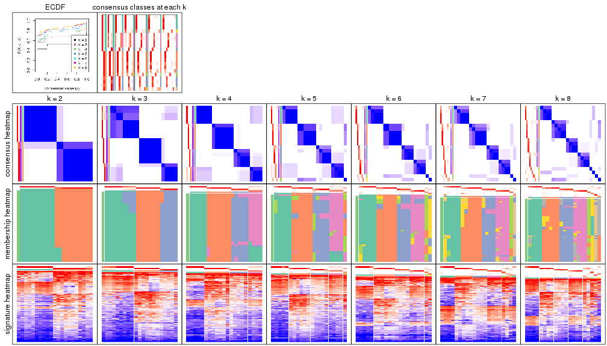

The plots are:

- The first row: a plot of the eCDF (empirical cumulative distribution
  function) curves of the consensus matrix for each `k` and the heatmap of
  predicted classes for each `k`.
- The second row: heatmaps of the consensus matrix for each `k`.
- The third row: heatmaps of the membership matrix for each `k`.
- The fouth row: heatmaps of the signatures for each `k`.

All the plots in panels can be made by individual functions and they are
plotted later in this section.

`select_partition_number()` produces several plots showing different
statistics for choosing "optimized" `k`. There are following statistics:

- eCDF curves of the consensus matrix for each `k`;
- 1-PAC. [The PAC score](https://en.wikipedia.org/wiki/Consensus_clustering#Over-interpretation_potential_of_consensus_clustering)
  measures the proportion of the ambiguous subgrouping.
- Mean silhouette score.
- Concordance. The mean probability of fiting the consensus subgroup labels in all
  partitions.
- Area increased. Denote $A_k$ as the area under the eCDF curve for current
  `k`, the area increased is defined as $A_k - A_{k-1}$.
- Rand index. The percent of pairs of samples that are both in a same cluster
  or both are not in a same cluster in the partition of k and k-1.
- Jaccard index. The ratio of pairs of samples are both in a same cluster in
  the partition of k and k-1 and the pairs of samples are both in a same
  cluster in the partition k or k-1.

The detailed explanations of these statistics can be found in [the _cola_
vignette](https://jokergoo.github.io/cola_vignettes/cola.html#toc_13).

Generally speaking, higher 1-PAC score, higher mean silhouette score or higher
concordance corresponds to better partition. Rand index and Jaccard index
measure how similar the current partition is compared to partition with `k-1`.
If they are too similar, we won't accept `k` is better than `k-1`.

```r
select_partition_number(res)
```

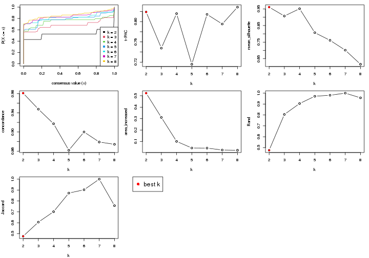

The numeric values for all these statistics can be obtained by `get_stats()`.

```r
get_stats(res)
```

```
#>   k 1-PAC mean_silhouette concordance area_increased  Rand Jaccard
#> 2 2 0.819           0.961       0.981         0.5224 0.476   0.476
#> 3 3 0.748           0.907       0.948         0.3105 0.805   0.606
#> 4 4 0.816           0.951       0.917         0.1012 0.905   0.701
#> 5 5 0.716           0.807       0.862         0.0436 0.971   0.872
#> 6 6 0.814           0.761       0.900         0.0427 0.981   0.902
#> 7 7 0.795           0.702       0.879         0.0260 1.000   1.000
#> 8 8 0.829           0.617       0.874         0.0238 0.957   0.757
```

`suggest_best_k()` suggests the best $k$ based on these statistics. The rules are as follows:

- All $k$ with Jaccard index larger than 0.95 are removed because increasing
  $k$ does not provide enough extra information. If all $k$ are removed, it is
  marked as no subgroup is detected.
- For all $k$ with 1-PAC score larger than 0.9, the maximal $k$ is taken as
  the best $k$, and other $k$ are marked as optional $k$.
- If it does not fit the second rule. The $k$ with the maximal vote of the
  highest 1-PAC score, highest mean silhouette, and highest concordance is
  taken as the best $k$.

```r
suggest_best_k(res)
```

```
#> [1] 2
```


Following is the table of the partitions (You need to click the **show/hide
code output** link to see it). The membership matrix (columns with name `p*`)
is inferred by
[`clue::cl_consensus()`](https://www.rdocumentation.org/link/cl_consensus?package=clue)
function with the `SE` method. Basically the value in the membership matrix
represents the probability to belong to a certain group. The finall subgroup
label for an item is determined with the group with highest probability it
belongs to.

In `get_classes()` function, the entropy is calculated from the membership
matrix and the silhouette score is calculated from the consensus matrix.


<script>
$( function() {
	$( '#tabs-node-013-get-classes' ).tabs();
} );
</script>
<div id='tabs-node-013-get-classes'>
<ul>
<li><a href='#tab-node-013-get-classes-1'>k = 2</a></li>
<li><a href='#tab-node-013-get-classes-2'>k = 3</a></li>
<li><a href='#tab-node-013-get-classes-3'>k = 4</a></li>
<li><a href='#tab-node-013-get-classes-4'>k = 5</a></li>
<li><a href='#tab-node-013-get-classes-5'>k = 6</a></li>
<li><a href='#tab-node-013-get-classes-6'>k = 7</a></li>
<li><a href='#tab-node-013-get-classes-7'>k = 8</a></li>
</ul>

<div id='tab-node-013-get-classes-1'>
<p><a id='tab-node-013-get-classes-1-a' style='color:#0366d6' href='#'>show/hide code output</a></p>
<pre><code class="r">cbind(get_classes(res, k = 2), get_membership(res, k = 2))
</code></pre>

<pre><code>#&gt;                 class entropy silhouette  p1  p2
#&gt; TCGA.AA.3663.01     2   0.000      0.959 0.0 1.0
#&gt; TCGA.AZ.4614.01     1   0.000      1.000 1.0 0.0
#&gt; TCGA.A6.4107.01     1   0.000      1.000 1.0 0.0
#&gt; TCGA.CA.6718.01     2   0.000      0.959 0.0 1.0
#&gt; TCGA.WS.AB45.01     2   0.000      0.959 0.0 1.0
#&gt; TCGA.AA.3713.01     1   0.000      1.000 1.0 0.0
#&gt; TCGA.AZ.6606.01     2   0.000      0.959 0.0 1.0
#&gt; TCGA.D5.6931.01     2   0.722      0.775 0.2 0.8
#&gt; TCGA.A6.6649.01     2   0.000      0.959 0.0 1.0
#&gt; TCGA.D5.6928.01     2   0.000      0.959 0.0 1.0
#&gt; TCGA.CM.4743.01     2   0.000      0.959 0.0 1.0
#&gt; TCGA.G4.6322.01     1   0.000      1.000 1.0 0.0
#&gt; TCGA.DM.A1DA.01     1   0.000      1.000 1.0 0.0
#&gt; TCGA.D5.6531.01     1   0.000      1.000 1.0 0.0
#&gt; TCGA.CK.6751.01     1   0.000      1.000 1.0 0.0
#&gt; TCGA.A6.A566.01     2   0.000      0.959 0.0 1.0
#&gt; TCGA.A6.5659.01     1   0.000      1.000 1.0 0.0
#&gt; TCGA.CK.4952.01     1   0.000      1.000 1.0 0.0
#&gt; TCGA.CM.4751.01     2   0.722      0.775 0.2 0.8
#&gt; TCGA.F4.6461.01     2   0.000      0.959 0.0 1.0
#&gt; TCGA.D5.7000.01     1   0.000      1.000 1.0 0.0
</code></pre>

<script>
$('#tab-node-013-get-classes-1-a').parent().next().next().hide();
$('#tab-node-013-get-classes-1-a').click(function(){
  $('#tab-node-013-get-classes-1-a').parent().next().next().toggle();
  return(false);
});
</script>
</div>

<div id='tab-node-013-get-classes-2'>
<p><a id='tab-node-013-get-classes-2-a' style='color:#0366d6' href='#'>show/hide code output</a></p>
<pre><code class="r">cbind(get_classes(res, k = 3), get_membership(res, k = 3))
</code></pre>

<pre><code>#&gt;                 class entropy silhouette   p1   p2   p3
#&gt; TCGA.AA.3663.01     3   0.000      0.948 0.00 0.00 1.00
#&gt; TCGA.AZ.4614.01     1   0.000      0.878 1.00 0.00 0.00
#&gt; TCGA.A6.4107.01     1   0.556      0.716 0.70 0.00 0.30
#&gt; TCGA.CA.6718.01     2   0.000      1.000 0.00 1.00 0.00
#&gt; TCGA.WS.AB45.01     2   0.000      1.000 0.00 1.00 0.00
#&gt; TCGA.AA.3713.01     3   0.000      0.948 0.00 0.00 1.00
#&gt; TCGA.AZ.6606.01     2   0.000      1.000 0.00 1.00 0.00
#&gt; TCGA.D5.6931.01     3   0.000      0.948 0.00 0.00 1.00
#&gt; TCGA.A6.6649.01     2   0.000      1.000 0.00 1.00 0.00
#&gt; TCGA.D5.6928.01     2   0.000      1.000 0.00 1.00 0.00
#&gt; TCGA.CM.4743.01     2   0.000      1.000 0.00 1.00 0.00
#&gt; TCGA.G4.6322.01     1   0.000      0.878 1.00 0.00 0.00
#&gt; TCGA.DM.A1DA.01     1   0.000      0.878 1.00 0.00 0.00
#&gt; TCGA.D5.6531.01     1   0.400      0.835 0.84 0.00 0.16
#&gt; TCGA.CK.6751.01     1   0.556      0.716 0.70 0.00 0.30
#&gt; TCGA.A6.A566.01     3   0.400      0.781 0.00 0.16 0.84
#&gt; TCGA.A6.5659.01     1   0.000      0.878 1.00 0.00 0.00
#&gt; TCGA.CK.4952.01     1   0.000      0.878 1.00 0.00 0.00
#&gt; TCGA.CM.4751.01     3   0.000      0.948 0.00 0.00 1.00
#&gt; TCGA.F4.6461.01     2   0.000      1.000 0.00 1.00 0.00
#&gt; TCGA.D5.7000.01     1   0.429      0.825 0.82 0.00 0.18
</code></pre>

<script>
$('#tab-node-013-get-classes-2-a').parent().next().next().hide();
$('#tab-node-013-get-classes-2-a').click(function(){
  $('#tab-node-013-get-classes-2-a').parent().next().next().toggle();
  return(false);
});
</script>
</div>

<div id='tab-node-013-get-classes-3'>
<p><a id='tab-node-013-get-classes-3-a' style='color:#0366d6' href='#'>show/hide code output</a></p>
<pre><code class="r">cbind(get_classes(res, k = 4), get_membership(res, k = 4))
</code></pre>

<pre><code>#&gt;                 class entropy silhouette   p1   p2   p3   p4
#&gt; TCGA.AA.3663.01     3   0.317      0.804 0.00 0.00 0.84 0.16
#&gt; TCGA.AZ.4614.01     1   0.000      1.000 1.00 0.00 0.00 0.00
#&gt; TCGA.A6.4107.01     4   0.566      0.958 0.22 0.00 0.08 0.70
#&gt; TCGA.CA.6718.01     2   0.000      0.981 0.00 1.00 0.00 0.00
#&gt; TCGA.WS.AB45.01     2   0.000      0.981 0.00 1.00 0.00 0.00
#&gt; TCGA.AA.3713.01     3   0.164      0.927 0.00 0.00 0.94 0.06
#&gt; TCGA.AZ.6606.01     2   0.292      0.880 0.00 0.86 0.00 0.14
#&gt; TCGA.D5.6931.01     3   0.164      0.927 0.00 0.00 0.94 0.06
#&gt; TCGA.A6.6649.01     2   0.000      0.981 0.00 1.00 0.00 0.00
#&gt; TCGA.D5.6928.01     2   0.000      0.981 0.00 1.00 0.00 0.00
#&gt; TCGA.CM.4743.01     2   0.000      0.981 0.00 1.00 0.00 0.00
#&gt; TCGA.G4.6322.01     1   0.000      1.000 1.00 0.00 0.00 0.00
#&gt; TCGA.DM.A1DA.01     1   0.000      1.000 1.00 0.00 0.00 0.00
#&gt; TCGA.D5.6531.01     4   0.441      0.863 0.30 0.00 0.00 0.70
#&gt; TCGA.CK.6751.01     4   0.566      0.958 0.22 0.00 0.08 0.70
#&gt; TCGA.A6.A566.01     3   0.164      0.891 0.00 0.06 0.94 0.00
#&gt; TCGA.A6.5659.01     1   0.000      1.000 1.00 0.00 0.00 0.00
#&gt; TCGA.CK.4952.01     1   0.000      1.000 1.00 0.00 0.00 0.00
#&gt; TCGA.CM.4751.01     3   0.164      0.927 0.00 0.00 0.94 0.06
#&gt; TCGA.F4.6461.01     2   0.000      0.981 0.00 1.00 0.00 0.00
#&gt; TCGA.D5.7000.01     4   0.566      0.958 0.22 0.00 0.08 0.70
</code></pre>

<script>
$('#tab-node-013-get-classes-3-a').parent().next().next().hide();
$('#tab-node-013-get-classes-3-a').click(function(){
  $('#tab-node-013-get-classes-3-a').parent().next().next().toggle();
  return(false);
});
</script>
</div>

<div id='tab-node-013-get-classes-4'>
<p><a id='tab-node-013-get-classes-4-a' style='color:#0366d6' href='#'>show/hide code output</a></p>
<pre><code class="r">cbind(get_classes(res, k = 5), get_membership(res, k = 5))
</code></pre>

<pre><code>#&gt;                 class entropy silhouette   p1   p2   p3   p4   p5
#&gt; TCGA.AA.3663.01     3   0.620      0.537 0.00 0.00 0.54 0.28 0.18
#&gt; TCGA.AZ.4614.01     1   0.000      0.949 1.00 0.00 0.00 0.00 0.00
#&gt; TCGA.A6.4107.01     4   0.583      0.964 0.16 0.00 0.16 0.66 0.02
#&gt; TCGA.CA.6718.01     2   0.000      0.859 0.00 1.00 0.00 0.00 0.00
#&gt; TCGA.WS.AB45.01     2   0.000      0.859 0.00 1.00 0.00 0.00 0.00
#&gt; TCGA.AA.3713.01     3   0.000      0.843 0.00 0.00 1.00 0.00 0.00
#&gt; TCGA.AZ.6606.01     5   0.429      0.000 0.00 0.46 0.00 0.00 0.54
#&gt; TCGA.D5.6931.01     3   0.000      0.843 0.00 0.00 1.00 0.00 0.00
#&gt; TCGA.A6.6649.01     2   0.000      0.859 0.00 1.00 0.00 0.00 0.00
#&gt; TCGA.D5.6928.01     2   0.311      0.653 0.00 0.84 0.00 0.02 0.14
#&gt; TCGA.CM.4743.01     2   0.000      0.859 0.00 1.00 0.00 0.00 0.00
#&gt; TCGA.G4.6322.01     1   0.369      0.779 0.78 0.00 0.00 0.02 0.20
#&gt; TCGA.DM.A1DA.01     1   0.000      0.949 1.00 0.00 0.00 0.00 0.00
#&gt; TCGA.D5.6531.01     4   0.652      0.925 0.18 0.00 0.14 0.62 0.06
#&gt; TCGA.CK.6751.01     4   0.527      0.971 0.16 0.00 0.16 0.68 0.00
#&gt; TCGA.A6.A566.01     3   0.311      0.734 0.00 0.00 0.84 0.02 0.14
#&gt; TCGA.A6.5659.01     1   0.000      0.949 1.00 0.00 0.00 0.00 0.00
#&gt; TCGA.CK.4952.01     1   0.000      0.949 1.00 0.00 0.00 0.00 0.00
#&gt; TCGA.CM.4751.01     3   0.000      0.843 0.00 0.00 1.00 0.00 0.00
#&gt; TCGA.F4.6461.01     2   0.311      0.653 0.00 0.84 0.00 0.02 0.14
#&gt; TCGA.D5.7000.01     4   0.527      0.971 0.16 0.00 0.16 0.68 0.00
</code></pre>

<script>
$('#tab-node-013-get-classes-4-a').parent().next().next().hide();
$('#tab-node-013-get-classes-4-a').click(function(){
  $('#tab-node-013-get-classes-4-a').parent().next().next().toggle();
  return(false);
});
</script>
</div>

<div id='tab-node-013-get-classes-5'>
<p><a id='tab-node-013-get-classes-5-a' style='color:#0366d6' href='#'>show/hide code output</a></p>
<pre><code class="r">cbind(get_classes(res, k = 6), get_membership(res, k = 6))
</code></pre>

<pre><code>#&gt;                 class entropy silhouette   p1   p2   p3   p4   p5   p6
#&gt; TCGA.AA.3663.01     6  0.3309      0.000 0.00 0.00 0.28 0.00 0.00 0.72
#&gt; TCGA.AZ.4614.01     1  0.0547      0.925 0.98 0.00 0.00 0.00 0.02 0.00
#&gt; TCGA.A6.4107.01     4  0.0937      0.888 0.00 0.00 0.00 0.96 0.04 0.00
#&gt; TCGA.CA.6718.01     2  0.0000      0.876 0.00 1.00 0.00 0.00 0.00 0.00
#&gt; TCGA.WS.AB45.01     2  0.0000      0.876 0.00 1.00 0.00 0.00 0.00 0.00
#&gt; TCGA.AA.3713.01     3  0.2981      0.858 0.00 0.00 0.82 0.16 0.02 0.00
#&gt; TCGA.AZ.6606.01     5  0.4711      0.000 0.00 0.28 0.08 0.00 0.64 0.00
#&gt; TCGA.D5.6931.01     3  0.2454      0.869 0.00 0.00 0.84 0.16 0.00 0.00
#&gt; TCGA.A6.6649.01     2  0.0000      0.876 0.00 1.00 0.00 0.00 0.00 0.00
#&gt; TCGA.D5.6928.01     2  0.3351      0.719 0.00 0.80 0.16 0.00 0.00 0.04
#&gt; TCGA.CM.4743.01     2  0.0000      0.876 0.00 1.00 0.00 0.00 0.00 0.00
#&gt; TCGA.G4.6322.01     1  0.4393      0.707 0.72 0.00 0.00 0.00 0.14 0.14
#&gt; TCGA.DM.A1DA.01     1  0.0000      0.932 1.00 0.00 0.00 0.00 0.00 0.00
#&gt; TCGA.D5.6531.01     4  0.4165      0.721 0.00 0.00 0.00 0.74 0.16 0.10
#&gt; TCGA.CK.6751.01     4  0.0000      0.904 0.00 0.00 0.00 1.00 0.00 0.00
#&gt; TCGA.A6.A566.01     3  0.0937      0.596 0.00 0.00 0.96 0.00 0.00 0.04
#&gt; TCGA.A6.5659.01     1  0.0000      0.932 1.00 0.00 0.00 0.00 0.00 0.00
#&gt; TCGA.CK.4952.01     1  0.0000      0.932 1.00 0.00 0.00 0.00 0.00 0.00
#&gt; TCGA.CM.4751.01     3  0.2454      0.869 0.00 0.00 0.84 0.16 0.00 0.00
#&gt; TCGA.F4.6461.01     2  0.3351      0.719 0.00 0.80 0.16 0.00 0.00 0.04
#&gt; TCGA.D5.7000.01     4  0.0000      0.904 0.00 0.00 0.00 1.00 0.00 0.00
</code></pre>

<script>
$('#tab-node-013-get-classes-5-a').parent().next().next().hide();
$('#tab-node-013-get-classes-5-a').click(function(){
  $('#tab-node-013-get-classes-5-a').parent().next().next().toggle();
  return(false);
});
</script>
</div>

<div id='tab-node-013-get-classes-6'>
<p><a id='tab-node-013-get-classes-6-a' style='color:#0366d6' href='#'>show/hide code output</a></p>
<pre><code class="r">cbind(get_classes(res, k = 7), get_membership(res, k = 7))
</code></pre>

<pre><code>#&gt;                 class entropy silhouette   p1   p2   p3   p4   p5   p6   p7
#&gt; TCGA.AA.3663.01     7  0.5325      0.000 0.00 0.00 0.22 0.00 0.00 0.28 0.50
#&gt; TCGA.AZ.4614.01     1  0.2722      0.785 0.84 0.00 0.00 0.00 0.12 0.04 0.00
#&gt; TCGA.A6.4107.01     4  0.2355      0.886 0.00 0.00 0.02 0.90 0.04 0.02 0.02
#&gt; TCGA.CA.6718.01     2  0.0000      0.826 0.00 1.00 0.00 0.00 0.00 0.00 0.00
#&gt; TCGA.WS.AB45.01     2  0.0000      0.826 0.00 1.00 0.00 0.00 0.00 0.00 0.00
#&gt; TCGA.AA.3713.01     3  0.2278      0.835 0.00 0.00 0.88 0.08 0.00 0.04 0.00
#&gt; TCGA.AZ.6606.01     5  0.2422      0.000 0.00 0.18 0.00 0.00 0.82 0.00 0.00
#&gt; TCGA.D5.6931.01     3  0.1433      0.855 0.00 0.00 0.92 0.08 0.00 0.00 0.00
#&gt; TCGA.A6.6649.01     2  0.0000      0.826 0.00 1.00 0.00 0.00 0.00 0.00 0.00
#&gt; TCGA.D5.6928.01     2  0.3770      0.629 0.00 0.74 0.08 0.00 0.00 0.18 0.00
#&gt; TCGA.CM.4743.01     2  0.0000      0.826 0.00 1.00 0.00 0.00 0.00 0.00 0.00
#&gt; TCGA.G4.6322.01     1  0.3558      0.457 0.52 0.00 0.00 0.00 0.00 0.00 0.48
#&gt; TCGA.DM.A1DA.01     1  0.0000      0.853 1.00 0.00 0.00 0.00 0.00 0.00 0.00
#&gt; TCGA.D5.6531.01     4  0.2745      0.799 0.00 0.00 0.00 0.82 0.02 0.16 0.00
#&gt; TCGA.CK.6751.01     4  0.0504      0.915 0.00 0.00 0.02 0.98 0.00 0.00 0.00
#&gt; TCGA.A6.A566.01     3  0.2745      0.579 0.00 0.02 0.82 0.00 0.00 0.16 0.00
#&gt; TCGA.A6.5659.01     1  0.0000      0.853 1.00 0.00 0.00 0.00 0.00 0.00 0.00
#&gt; TCGA.CK.4952.01     1  0.0000      0.853 1.00 0.00 0.00 0.00 0.00 0.00 0.00
#&gt; TCGA.CM.4751.01     3  0.1433      0.855 0.00 0.00 0.92 0.08 0.00 0.00 0.00
#&gt; TCGA.F4.6461.01     2  0.3546      0.359 0.00 0.54 0.00 0.00 0.00 0.46 0.00
#&gt; TCGA.D5.7000.01     4  0.0504      0.915 0.00 0.00 0.02 0.98 0.00 0.00 0.00
</code></pre>

<script>
$('#tab-node-013-get-classes-6-a').parent().next().next().hide();
$('#tab-node-013-get-classes-6-a').click(function(){
  $('#tab-node-013-get-classes-6-a').parent().next().next().toggle();
  return(false);
});
</script>
</div>

<div id='tab-node-013-get-classes-7'>
<p><a id='tab-node-013-get-classes-7-a' style='color:#0366d6' href='#'>show/hide code output</a></p>
<pre><code class="r">cbind(get_classes(res, k = 8), get_membership(res, k = 8))
</code></pre>

<pre><code>#&gt;                 class entropy silhouette   p1   p2   p3   p4   p5   p6   p7   p8
#&gt; TCGA.AA.3663.01     7  0.1765      0.000 0.00 0.00 0.12 0.00 0.00 0.00 0.88 0.00
#&gt; TCGA.AZ.4614.01     1  0.2856      0.670 0.78 0.00 0.00 0.00 0.00 0.00 0.02 0.20
#&gt; TCGA.A6.4107.01     4  0.2482      0.797 0.00 0.00 0.00 0.88 0.06 0.02 0.02 0.02
#&gt; TCGA.CA.6718.01     2  0.0000      0.792 0.00 1.00 0.00 0.00 0.00 0.00 0.00 0.00
#&gt; TCGA.WS.AB45.01     2  0.0000      0.792 0.00 1.00 0.00 0.00 0.00 0.00 0.00 0.00
#&gt; TCGA.AA.3713.01     3  0.2020      0.869 0.00 0.00 0.90 0.06 0.02 0.02 0.00 0.00
#&gt; TCGA.AZ.6606.01     5  0.2114      0.000 0.00 0.16 0.00 0.00 0.84 0.00 0.00 0.00
#&gt; TCGA.D5.6931.01     3  0.1091      0.886 0.00 0.00 0.94 0.06 0.00 0.00 0.00 0.00
#&gt; TCGA.A6.6649.01     2  0.1091      0.754 0.00 0.94 0.00 0.00 0.00 0.06 0.00 0.00
#&gt; TCGA.D5.6928.01     2  0.4764      0.167 0.00 0.66 0.06 0.00 0.00 0.16 0.00 0.12
#&gt; TCGA.CM.4743.01     2  0.1341      0.747 0.00 0.92 0.00 0.00 0.00 0.08 0.00 0.00
#&gt; TCGA.G4.6322.01     6  0.2938      0.000 0.30 0.00 0.00 0.00 0.00 0.70 0.00 0.00
#&gt; TCGA.DM.A1DA.01     1  0.0000      0.895 1.00 0.00 0.00 0.00 0.00 0.00 0.00 0.00
#&gt; TCGA.D5.6531.01     4  0.5617      0.558 0.00 0.00 0.00 0.60 0.06 0.06 0.08 0.20
#&gt; TCGA.CK.6751.01     4  0.0000      0.838 0.00 0.00 0.00 1.00 0.00 0.00 0.00 0.00
#&gt; TCGA.A6.A566.01     3  0.2862      0.676 0.00 0.00 0.82 0.00 0.00 0.08 0.00 0.10
#&gt; TCGA.A6.5659.01     1  0.0471      0.888 0.98 0.00 0.00 0.00 0.02 0.00 0.00 0.00
#&gt; TCGA.CK.4952.01     1  0.0000      0.895 1.00 0.00 0.00 0.00 0.00 0.00 0.00 0.00
#&gt; TCGA.CM.4751.01     3  0.1091      0.886 0.00 0.00 0.94 0.06 0.00 0.00 0.00 0.00
#&gt; TCGA.F4.6461.01     8  0.3272      0.000 0.00 0.42 0.00 0.00 0.00 0.00 0.00 0.58
#&gt; TCGA.D5.7000.01     4  0.0000      0.838 0.00 0.00 0.00 1.00 0.00 0.00 0.00 0.00
</code></pre>

<script>
$('#tab-node-013-get-classes-7-a').parent().next().next().hide();
$('#tab-node-013-get-classes-7-a').click(function(){
  $('#tab-node-013-get-classes-7-a').parent().next().next().toggle();
  return(false);
});
</script>
</div>
</div>

Heatmaps for the consensus matrix. It visualizes the probability of two
samples to be in a same group.


<script>
$( function() {
	$( '#tabs-node-013-consensus-heatmap' ).tabs();
} );
</script>
<div id='tabs-node-013-consensus-heatmap'>
<ul>
<li><a href='#tab-node-013-consensus-heatmap-1'>k = 2</a></li>
<li><a href='#tab-node-013-consensus-heatmap-2'>k = 3</a></li>
<li><a href='#tab-node-013-consensus-heatmap-3'>k = 4</a></li>
<li><a href='#tab-node-013-consensus-heatmap-4'>k = 5</a></li>
<li><a href='#tab-node-013-consensus-heatmap-5'>k = 6</a></li>
<li><a href='#tab-node-013-consensus-heatmap-6'>k = 7</a></li>
<li><a href='#tab-node-013-consensus-heatmap-7'>k = 8</a></li>
</ul>
<div id='tab-node-013-consensus-heatmap-1'>
<pre><code class="r">consensus_heatmap(res, k = 2)
</code></pre>

<p>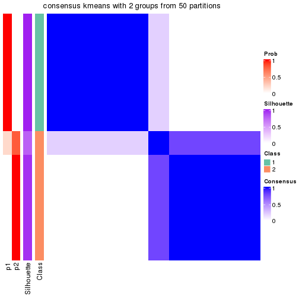</p>

</div>
<div id='tab-node-013-consensus-heatmap-2'>
<pre><code class="r">consensus_heatmap(res, k = 3)
</code></pre>

<p>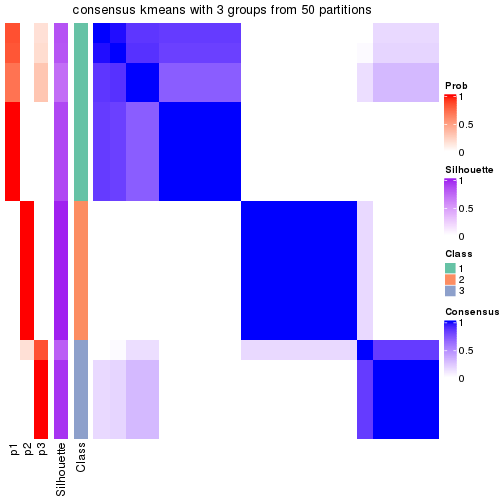</p>

</div>
<div id='tab-node-013-consensus-heatmap-3'>
<pre><code class="r">consensus_heatmap(res, k = 4)
</code></pre>

<p>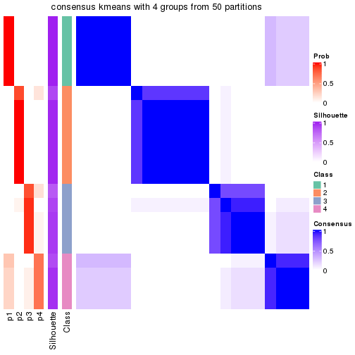</p>

</div>
<div id='tab-node-013-consensus-heatmap-4'>
<pre><code class="r">consensus_heatmap(res, k = 5)
</code></pre>

<p>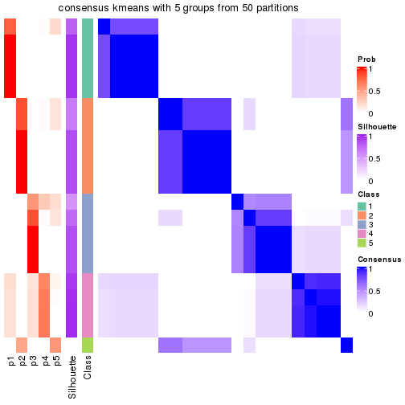</p>

</div>
<div id='tab-node-013-consensus-heatmap-5'>
<pre><code class="r">consensus_heatmap(res, k = 6)
</code></pre>

<p>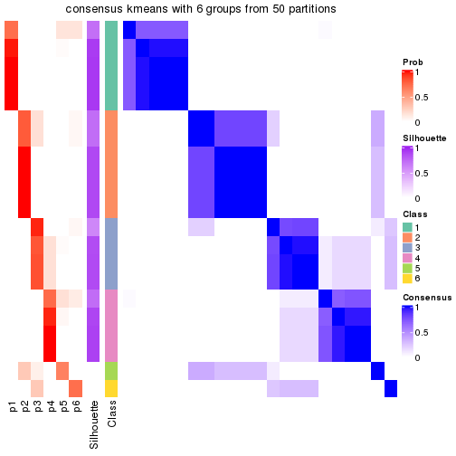</p>

</div>
<div id='tab-node-013-consensus-heatmap-6'>
<pre><code class="r">consensus_heatmap(res, k = 7)
</code></pre>

<p>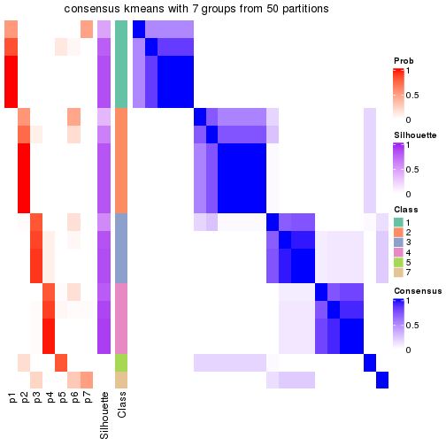</p>

</div>
<div id='tab-node-013-consensus-heatmap-7'>
<pre><code class="r">consensus_heatmap(res, k = 8)
</code></pre>

<p>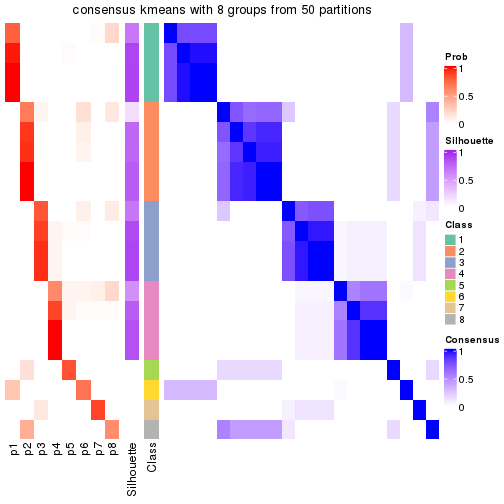</p>

</div>
</div>

Heatmaps for the membership of samples in all partitions to see how consistent they are:


<script>
$( function() {
	$( '#tabs-node-013-membership-heatmap' ).tabs();
} );
</script>
<div id='tabs-node-013-membership-heatmap'>
<ul>
<li><a href='#tab-node-013-membership-heatmap-1'>k = 2</a></li>
<li><a href='#tab-node-013-membership-heatmap-2'>k = 3</a></li>
<li><a href='#tab-node-013-membership-heatmap-3'>k = 4</a></li>
<li><a href='#tab-node-013-membership-heatmap-4'>k = 5</a></li>
<li><a href='#tab-node-013-membership-heatmap-5'>k = 6</a></li>
<li><a href='#tab-node-013-membership-heatmap-6'>k = 7</a></li>
<li><a href='#tab-node-013-membership-heatmap-7'>k = 8</a></li>
</ul>
<div id='tab-node-013-membership-heatmap-1'>
<pre><code class="r">membership_heatmap(res, k = 2)
</code></pre>

<p>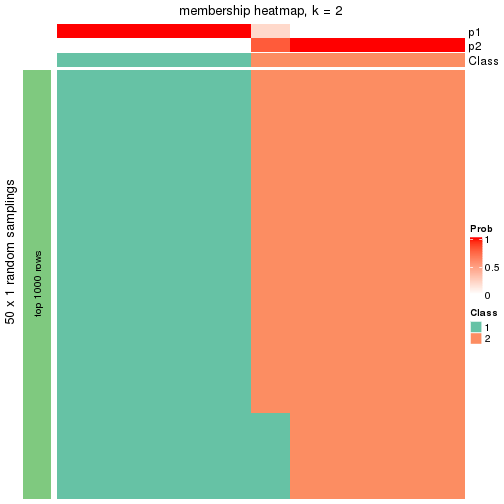</p>

</div>
<div id='tab-node-013-membership-heatmap-2'>
<pre><code class="r">membership_heatmap(res, k = 3)
</code></pre>

<p>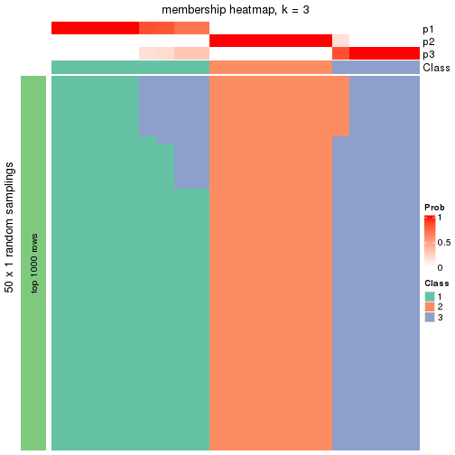</p>

</div>
<div id='tab-node-013-membership-heatmap-3'>
<pre><code class="r">membership_heatmap(res, k = 4)
</code></pre>

<p>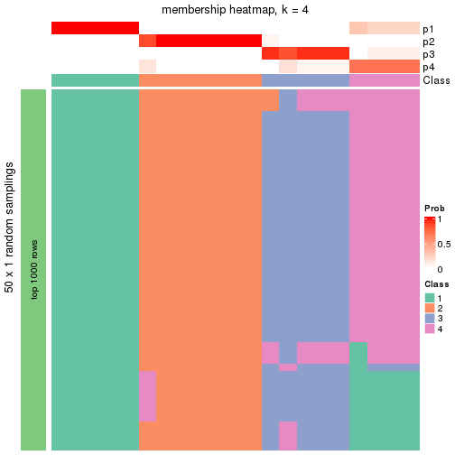</p>

</div>
<div id='tab-node-013-membership-heatmap-4'>
<pre><code class="r">membership_heatmap(res, k = 5)
</code></pre>

<p>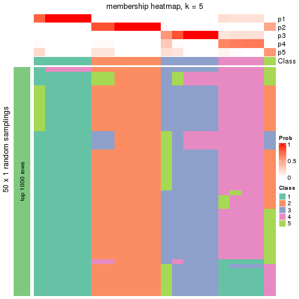</p>

</div>
<div id='tab-node-013-membership-heatmap-5'>
<pre><code class="r">membership_heatmap(res, k = 6)
</code></pre>

<p>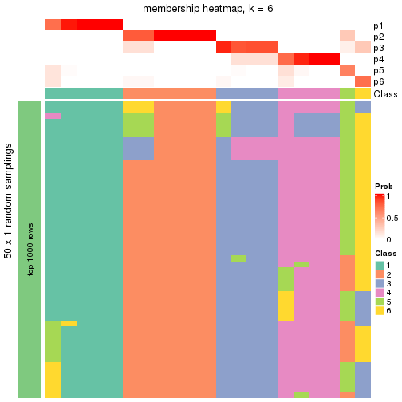</p>

</div>
<div id='tab-node-013-membership-heatmap-6'>
<pre><code class="r">membership_heatmap(res, k = 7)
</code></pre>

<p>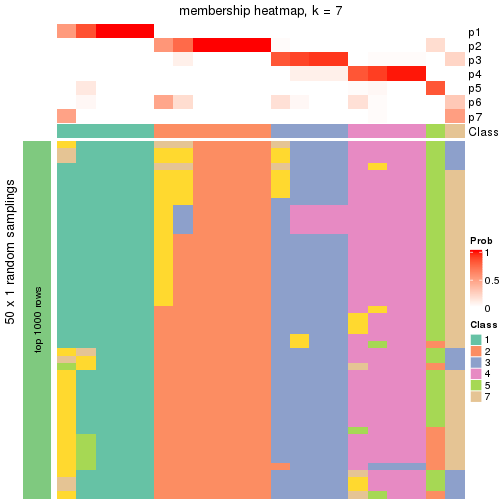</p>

</div>
<div id='tab-node-013-membership-heatmap-7'>
<pre><code class="r">membership_heatmap(res, k = 8)
</code></pre>

<p>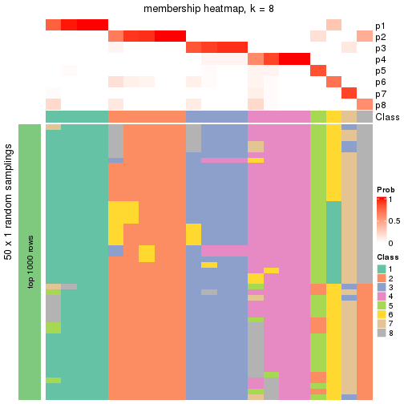</p>

</div>
</div>

As soon as the classes for columns are determined, the signatures
that are significantly different between subgroups can be looked for. 
Following are the heatmaps for signatures.


<script>
$( function() {
	$( '#tabs-node-013-get-signatures' ).tabs();
} );
</script>
<div id='tabs-node-013-get-signatures'>
<ul>
<li><a href='#tab-node-013-get-signatures-1'>k = 2</a></li>
<li><a href='#tab-node-013-get-signatures-2'>k = 3</a></li>
<li><a href='#tab-node-013-get-signatures-3'>k = 4</a></li>
<li><a href='#tab-node-013-get-signatures-4'>k = 5</a></li>
<li><a href='#tab-node-013-get-signatures-5'>k = 6</a></li>
<li><a href='#tab-node-013-get-signatures-6'>k = 7</a></li>
<li><a href='#tab-node-013-get-signatures-7'>k = 8</a></li>
</ul>
<div id='tab-node-013-get-signatures-1'>
<pre><code class="r">get_signatures(res, k = 2)
</code></pre>

<p>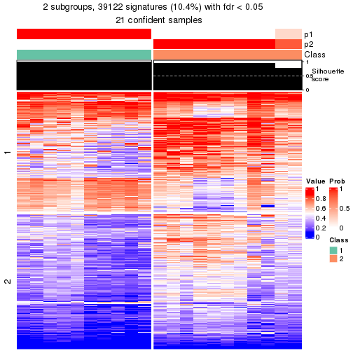</p>

</div>
<div id='tab-node-013-get-signatures-2'>
<pre><code class="r">get_signatures(res, k = 3)
</code></pre>

<p>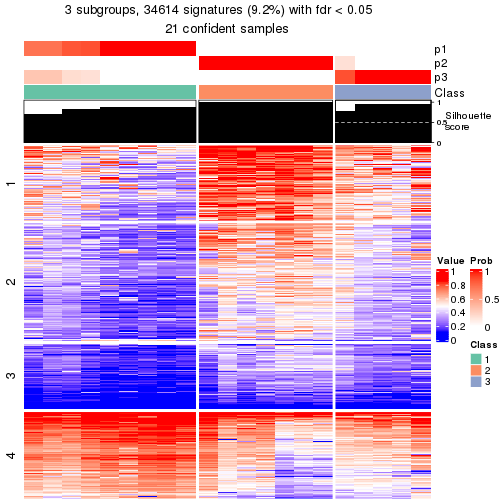</p>

</div>
<div id='tab-node-013-get-signatures-3'>
<pre><code class="r">get_signatures(res, k = 4)
</code></pre>

<p>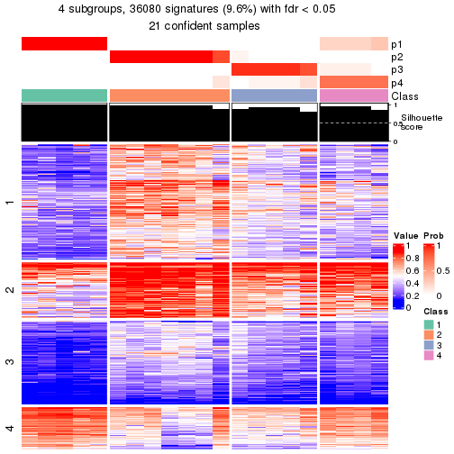</p>

</div>
<div id='tab-node-013-get-signatures-4'>
<pre><code class="r">get_signatures(res, k = 5)
</code></pre>

<p>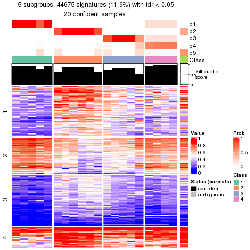</p>

</div>
<div id='tab-node-013-get-signatures-5'>
<pre><code class="r">get_signatures(res, k = 6)
</code></pre>

<p>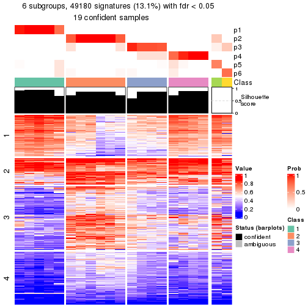</p>

</div>
<div id='tab-node-013-get-signatures-6'>
<pre><code class="r">get_signatures(res, k = 7)
</code></pre>

<p>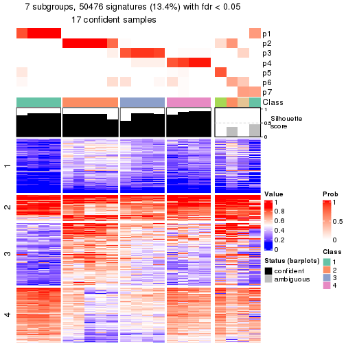</p>

</div>
<div id='tab-node-013-get-signatures-7'>
<pre><code class="r">get_signatures(res, k = 8)
</code></pre>

<p>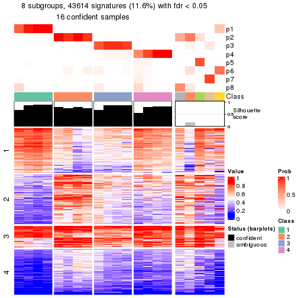</p>

</div>
</div>


Compare the overlap of signatures from different k:

```r
compare_signatures(res)
```

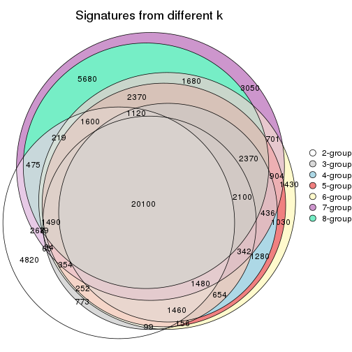

`get_signature()` returns a data frame invisibly. To get the list of signatures, the function
call should be assigned to a variable explicitly. In following code, if `plot` argument is set
to `FALSE`, no heatmap is plotted while only the differential analysis is performed.

```r
# code only for demonstration
tb = get_signature(res, k = ..., plot = FALSE)
```

An example of the output of `tb` is:

```
#>   which_row         fdr    mean_1    mean_2 scaled_mean_1 scaled_mean_2 km
#> 1        38 0.042760348  8.373488  9.131774    -0.5533452     0.5164555  1
#> 2        40 0.018707592  7.106213  8.469186    -0.6173731     0.5762149  1
#> 3        55 0.019134737 10.221463 11.207825    -0.6159697     0.5749050  1
#> 4        59 0.006059896  5.921854  7.869574    -0.6899429     0.6439467  1
#> 5        60 0.018055526  8.928898 10.211722    -0.6204761     0.5791110  1
#> 6        98 0.009384629 15.714769 14.887706     0.6635654    -0.6193277  2
...
```

The columns in `tb` are:

1. `which_row`: row indices corresponding to the input matrix.
2. `fdr`: FDR for the differential test. 
3. `mean_x`: The mean value in group x.
4. `scaled_mean_x`: The mean value in group x after rows are scaled.
5. `km`: Row groups if k-means clustering is applied to rows (which is done by automatically selecting number of clusters).

If there are too many signatures, `top_signatures = ...` can be set to only show the 
signatures with the highest FDRs:

```r
# code only for demonstration
# e.g. to show the top 500 most significant rows
tb = get_signature(res, k = ..., top_signatures = 500)
```

If the signatures are defined as these which are uniquely high in current group, `diff_method` argument
can be set to `"uniquely_high_in_one_group"`:

```r
# code only for demonstration
tb = get_signature(res, k = ..., diff_method = "uniquely_high_in_one_group")
```


UMAP plot which shows how samples are separated.


<script>
$( function() {
	$( '#tabs-node-013-dimension-reduction' ).tabs();
} );
</script>
<div id='tabs-node-013-dimension-reduction'>
<ul>
<li><a href='#tab-node-013-dimension-reduction-1'>k = 2</a></li>
<li><a href='#tab-node-013-dimension-reduction-2'>k = 3</a></li>
<li><a href='#tab-node-013-dimension-reduction-3'>k = 4</a></li>
<li><a href='#tab-node-013-dimension-reduction-4'>k = 5</a></li>
<li><a href='#tab-node-013-dimension-reduction-5'>k = 6</a></li>
<li><a href='#tab-node-013-dimension-reduction-6'>k = 7</a></li>
<li><a href='#tab-node-013-dimension-reduction-7'>k = 8</a></li>
</ul>
<div id='tab-node-013-dimension-reduction-1'>
<pre><code class="r">dimension_reduction(res, k = 2, method = &quot;UMAP&quot;)
</code></pre>

<p>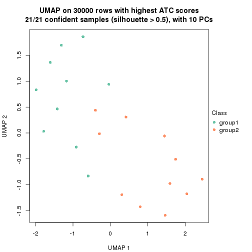</p>

</div>
<div id='tab-node-013-dimension-reduction-2'>
<pre><code class="r">dimension_reduction(res, k = 3, method = &quot;UMAP&quot;)
</code></pre>

<p>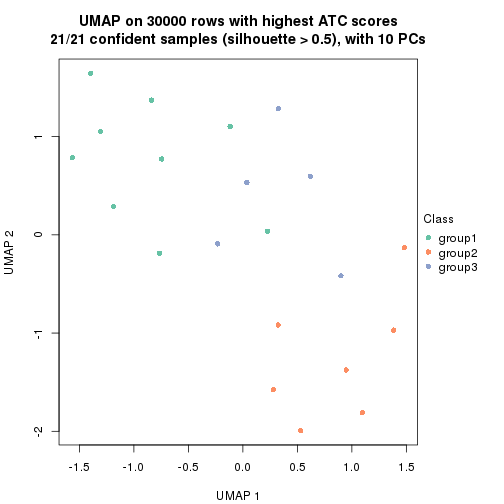</p>

</div>
<div id='tab-node-013-dimension-reduction-3'>
<pre><code class="r">dimension_reduction(res, k = 4, method = &quot;UMAP&quot;)
</code></pre>

<p>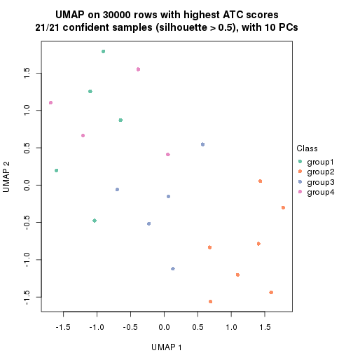</p>

</div>
<div id='tab-node-013-dimension-reduction-4'>
<pre><code class="r">dimension_reduction(res, k = 5, method = &quot;UMAP&quot;)
</code></pre>

<p>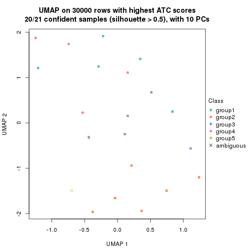</p>

</div>
<div id='tab-node-013-dimension-reduction-5'>
<pre><code class="r">dimension_reduction(res, k = 6, method = &quot;UMAP&quot;)
</code></pre>

<p>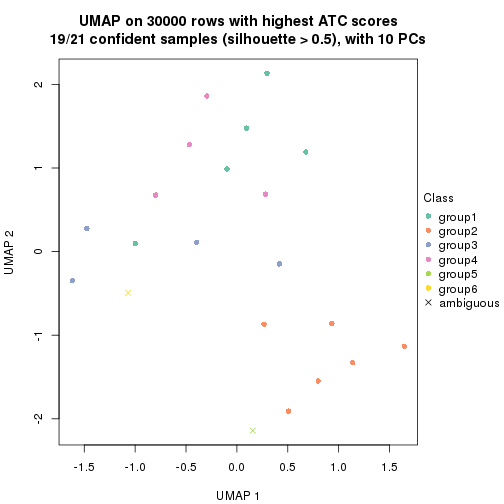</p>

</div>
<div id='tab-node-013-dimension-reduction-6'>
<pre><code class="r">dimension_reduction(res, k = 7, method = &quot;UMAP&quot;)
</code></pre>

<p>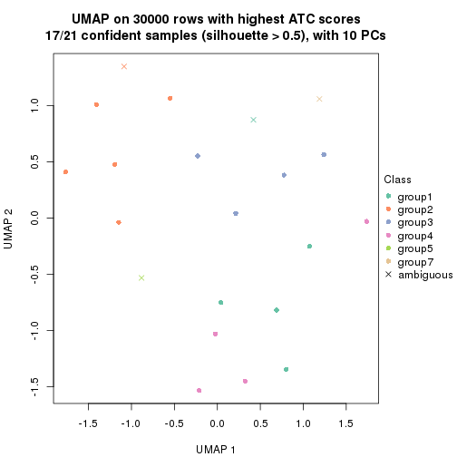</p>

</div>
<div id='tab-node-013-dimension-reduction-7'>
<pre><code class="r">dimension_reduction(res, k = 8, method = &quot;UMAP&quot;)
</code></pre>

<p>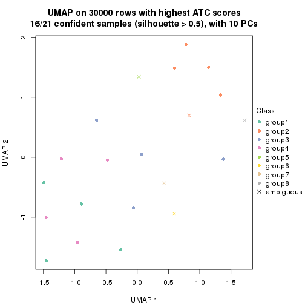</p>

</div>
</div>


Following heatmap shows how subgroups are split when increasing `k`:

```r
collect_classes(res)
```

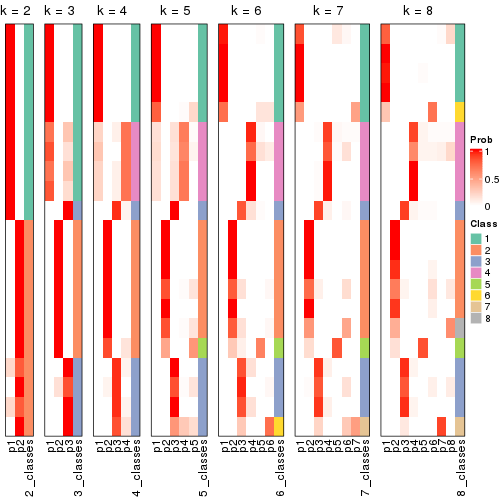


If matrix rows can be associated to genes, consider to use `functional_enrichment(res,
...)` to perform function enrichment for the signature genes. See [this vignette](https://jokergoo.github.io/cola_vignettes/functional_enrichment.html) for more detailed explanations.


 

---------------------------------------------------


### Node014


Parent node: [Node01](#Node01).
Child nodes: 
                [Node0111](#Node0111)
        ,
                [Node0112](#Node0112)
        ,
                [Node0113](#Node0113)
        ,
                [Node0121](#Node0121)
        ,
                Node0122-leaf
        ,
                Node0123-leaf
        ,
                Node0131-leaf
        ,
                Node0132-leaf
        ,
                Node0133-leaf
        ,
                Node0134-leaf
        ,
                [Node0141](#Node0141)
        ,
                Node0142-leaf
        ,
                Node0143-leaf
        ,
                Node0221-leaf
        ,
                Node0222-leaf
        ,
                Node0223-leaf
        ,
                Node0224-leaf
        ,
                [Node0231](#Node0231)
        ,
                Node0232-leaf
        ,
                Node0233-leaf
        ,
                Node0321-leaf
        ,
                Node0322-leaf
        ,
                Node0411-leaf
        ,
                Node0412-leaf
        ,
                Node0421-leaf
        ,
                Node0422-leaf
        ,
                Node0431-leaf
        ,
                Node0432-leaf
        ,
                Node0433-leaf
        ,
                Node0434-leaf
        .


The object with results only for a single top-value method and a single partitioning method 
can be extracted as:

```r
res = res_rh["014"]
```

A summary of `res` and all the functions that can be applied to it:

```r
res
```

```
#> A 'ConsensusPartition' object with k = 2, 3, 4, 5, 6, 7, 8.
#>   On a matrix with 30000 rows and 24 columns.
#>   Top rows (1000) are extracted by 'ATC' method.
#>   Subgroups are detected by 'skmeans' method.
#>   Performed in total 350 partitions by row resampling.
#>   Best k for subgroups seems to be 3.
#> 
#> Following methods can be applied to this 'ConsensusPartition' object:
#>  [1] "cola_report"             "collect_classes"         "collect_plots"          
#>  [4] "collect_stats"           "colnames"                "compare_partitions"     
#>  [7] "compare_signatures"      "consensus_heatmap"       "dimension_reduction"    
#> [10] "functional_enrichment"   "get_anno_col"            "get_anno"               
#> [13] "get_classes"             "get_consensus"           "get_matrix"             
#> [16] "get_membership"          "get_param"               "get_signatures"         
#> [19] "get_stats"               "is_best_k"               "is_stable_k"            
#> [22] "membership_heatmap"      "ncol"                    "nrow"                   
#> [25] "plot_ecdf"               "predict_classes"         "rownames"               
#> [28] "select_partition_number" "show"                    "suggest_best_k"         
#> [31] "test_to_known_factors"   "top_rows_heatmap"
```

`collect_plots()` function collects all the plots made from `res` for all `k` (number of subgroups)
into one single page to provide an easy and fast comparison between different `k`.

```r
collect_plots(res)
```

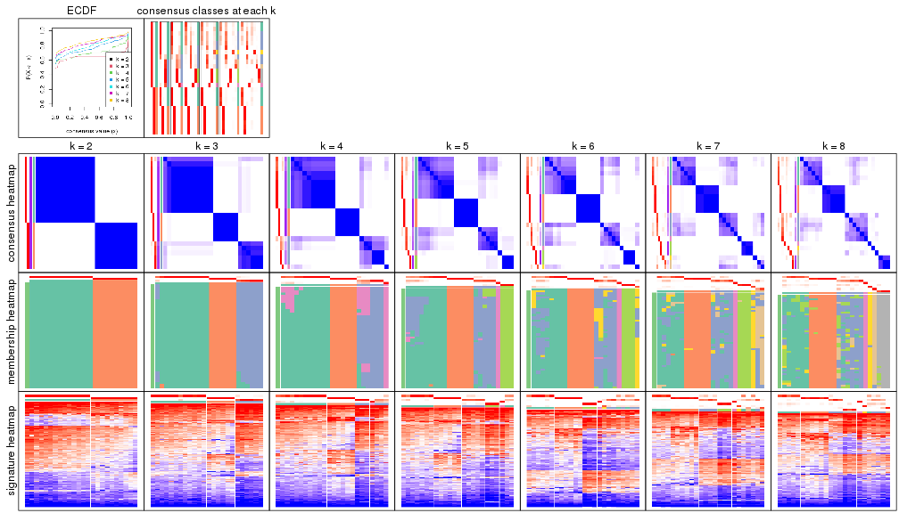

The plots are:

- The first row: a plot of the eCDF (empirical cumulative distribution
  function) curves of the consensus matrix for each `k` and the heatmap of
  predicted classes for each `k`.
- The second row: heatmaps of the consensus matrix for each `k`.
- The third row: heatmaps of the membership matrix for each `k`.
- The fouth row: heatmaps of the signatures for each `k`.

All the plots in panels can be made by individual functions and they are
plotted later in this section.

`select_partition_number()` produces several plots showing different
statistics for choosing "optimized" `k`. There are following statistics:

- eCDF curves of the consensus matrix for each `k`;
- 1-PAC. [The PAC score](https://en.wikipedia.org/wiki/Consensus_clustering#Over-interpretation_potential_of_consensus_clustering)
  measures the proportion of the ambiguous subgrouping.
- Mean silhouette score.
- Concordance. The mean probability of fiting the consensus subgroup labels in all
  partitions.
- Area increased. Denote $A_k$ as the area under the eCDF curve for current
  `k`, the area increased is defined as $A_k - A_{k-1}$.
- Rand index. The percent of pairs of samples that are both in a same cluster
  or both are not in a same cluster in the partition of k and k-1.
- Jaccard index. The ratio of pairs of samples are both in a same cluster in
  the partition of k and k-1 and the pairs of samples are both in a same
  cluster in the partition k or k-1.

The detailed explanations of these statistics can be found in [the _cola_
vignette](https://jokergoo.github.io/cola_vignettes/cola.html#toc_13).

Generally speaking, higher 1-PAC score, higher mean silhouette score or higher
concordance corresponds to better partition. Rand index and Jaccard index
measure how similar the current partition is compared to partition with `k-1`.
If they are too similar, we won't accept `k` is better than `k-1`.

```r
select_partition_number(res)
```

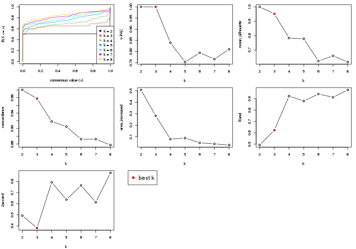

The numeric values for all these statistics can be obtained by `get_stats()`.

```r
get_stats(res)
```

```
#>   k 1-PAC mean_silhouette concordance area_increased  Rand Jaccard
#> 2 2 1.000           1.000       1.000         0.5077 0.493   0.493
#> 3 3 1.000           0.952       0.978         0.2825 0.623   0.381
#> 4 4 0.840           0.784       0.918         0.0794 0.924   0.792
#> 5 5 0.753           0.778       0.905         0.0882 0.880   0.637
#> 6 6 0.794           0.624       0.873         0.0468 0.942   0.765
#> 7 7 0.766           0.659       0.872         0.0373 0.913   0.613
#> 8 8 0.810           0.617       0.858         0.0277 0.978   0.878
```

`suggest_best_k()` suggests the best $k$ based on these statistics. The rules are as follows:

- All $k$ with Jaccard index larger than 0.95 are removed because increasing
  $k$ does not provide enough extra information. If all $k$ are removed, it is
  marked as no subgroup is detected.
- For all $k$ with 1-PAC score larger than 0.9, the maximal $k$ is taken as
  the best $k$, and other $k$ are marked as optional $k$.
- If it does not fit the second rule. The $k$ with the maximal vote of the
  highest 1-PAC score, highest mean silhouette, and highest concordance is
  taken as the best $k$.

```r
suggest_best_k(res)
```

```
#> [1] 3
#> attr(,"optional")
#> [1] 2
```

There is also optional best $k$ = 2 that is worth to check.

Following is the table of the partitions (You need to click the **show/hide
code output** link to see it). The membership matrix (columns with name `p*`)
is inferred by
[`clue::cl_consensus()`](https://www.rdocumentation.org/link/cl_consensus?package=clue)
function with the `SE` method. Basically the value in the membership matrix
represents the probability to belong to a certain group. The finall subgroup
label for an item is determined with the group with highest probability it
belongs to.

In `get_classes()` function, the entropy is calculated from the membership
matrix and the silhouette score is calculated from the consensus matrix.


<script>
$( function() {
	$( '#tabs-node-014-get-classes' ).tabs();
} );
</script>
<div id='tabs-node-014-get-classes'>
<ul>
<li><a href='#tab-node-014-get-classes-1'>k = 2</a></li>
<li><a href='#tab-node-014-get-classes-2'>k = 3</a></li>
<li><a href='#tab-node-014-get-classes-3'>k = 4</a></li>
<li><a href='#tab-node-014-get-classes-4'>k = 5</a></li>
<li><a href='#tab-node-014-get-classes-5'>k = 6</a></li>
<li><a href='#tab-node-014-get-classes-6'>k = 7</a></li>
<li><a href='#tab-node-014-get-classes-7'>k = 8</a></li>
</ul>

<div id='tab-node-014-get-classes-1'>
<p><a id='tab-node-014-get-classes-1-a' style='color:#0366d6' href='#'>show/hide code output</a></p>
<pre><code class="r">cbind(get_classes(res, k = 2), get_membership(res, k = 2))
</code></pre>

<pre><code>#&gt;                 class entropy silhouette p1 p2
#&gt; TCGA.AY.6197.01     1       0          1  1  0
#&gt; TCGA.DM.A0X9.01     1       0          1  1  0
#&gt; TCGA.CA.6716.01     1       0          1  1  0
#&gt; TCGA.NH.A50V.01     2       0          1  0  1
#&gt; TCGA.AY.6386.01     1       0          1  1  0
#&gt; TCGA.G4.6302.01     2       0          1  0  1
#&gt; TCGA.CM.4744.01     1       0          1  1  0
#&gt; TCGA.AZ.6607.01     2       0          1  0  1
#&gt; TCGA.CA.5255.01     2       0          1  0  1
#&gt; TCGA.F4.6856.01     2       0          1  0  1
#&gt; TCGA.A6.4105.01     1       0          1  1  0
#&gt; TCGA.D5.6538.01     1       0          1  1  0
#&gt; TCGA.F4.6806.01     1       0          1  1  0
#&gt; TCGA.CM.5860.01     1       0          1  1  0
#&gt; TCGA.A6.6780.01     1       0          1  1  0
#&gt; TCGA.AZ.5407.01     1       0          1  1  0
#&gt; TCGA.G4.6323.01     2       0          1  0  1
#&gt; TCGA.CK.4950.01     2       0          1  0  1
#&gt; TCGA.DM.A1D8.01     1       0          1  1  0
#&gt; TCGA.DM.A285.01     2       0          1  0  1
#&gt; TCGA.AZ.6601.01     2       0          1  0  1
#&gt; TCGA.DM.A0XD.01     1       0          1  1  0
#&gt; TCGA.D5.6534.01     2       0          1  0  1
#&gt; TCGA.DM.A1D4.01     1       0          1  1  0
</code></pre>

<script>
$('#tab-node-014-get-classes-1-a').parent().next().next().hide();
$('#tab-node-014-get-classes-1-a').click(function(){
  $('#tab-node-014-get-classes-1-a').parent().next().next().toggle();
  return(false);
});
</script>
</div>

<div id='tab-node-014-get-classes-2'>
<p><a id='tab-node-014-get-classes-2-a' style='color:#0366d6' href='#'>show/hide code output</a></p>
<pre><code class="r">cbind(get_classes(res, k = 3), get_membership(res, k = 3))
</code></pre>

<pre><code>#&gt;                 class entropy silhouette   p1   p2   p3
#&gt; TCGA.AY.6197.01     1   0.000      0.973 1.00 0.00 0.00
#&gt; TCGA.DM.A0X9.01     3   0.000      0.940 0.00 0.00 1.00
#&gt; TCGA.CA.6716.01     3   0.400      0.833 0.16 0.00 0.84
#&gt; TCGA.NH.A50V.01     1   0.000      0.973 1.00 0.00 0.00
#&gt; TCGA.AY.6386.01     1   0.000      0.973 1.00 0.00 0.00
#&gt; TCGA.G4.6302.01     2   0.000      1.000 0.00 1.00 0.00
#&gt; TCGA.CM.4744.01     1   0.502      0.673 0.76 0.00 0.24
#&gt; TCGA.AZ.6607.01     2   0.000      1.000 0.00 1.00 0.00
#&gt; TCGA.CA.5255.01     2   0.000      1.000 0.00 1.00 0.00
#&gt; TCGA.F4.6856.01     2   0.000      1.000 0.00 1.00 0.00
#&gt; TCGA.A6.4105.01     1   0.000      0.973 1.00 0.00 0.00
#&gt; TCGA.D5.6538.01     3   0.000      0.940 0.00 0.00 1.00
#&gt; TCGA.F4.6806.01     1   0.000      0.973 1.00 0.00 0.00
#&gt; TCGA.CM.5860.01     1   0.000      0.973 1.00 0.00 0.00
#&gt; TCGA.A6.6780.01     1   0.000      0.973 1.00 0.00 0.00
#&gt; TCGA.AZ.5407.01     3   0.207      0.927 0.06 0.00 0.94
#&gt; TCGA.G4.6323.01     1   0.000      0.973 1.00 0.00 0.00
#&gt; TCGA.CK.4950.01     1   0.153      0.934 0.96 0.04 0.00
#&gt; TCGA.DM.A1D8.01     3   0.153      0.937 0.04 0.00 0.96
#&gt; TCGA.DM.A285.01     1   0.000      0.973 1.00 0.00 0.00
#&gt; TCGA.AZ.6601.01     2   0.000      1.000 0.00 1.00 0.00
#&gt; TCGA.DM.A0XD.01     1   0.000      0.973 1.00 0.00 0.00
#&gt; TCGA.D5.6534.01     2   0.000      1.000 0.00 1.00 0.00
#&gt; TCGA.DM.A1D4.01     3   0.000      0.940 0.00 0.00 1.00
</code></pre>

<script>
$('#tab-node-014-get-classes-2-a').parent().next().next().hide();
$('#tab-node-014-get-classes-2-a').click(function(){
  $('#tab-node-014-get-classes-2-a').parent().next().next().toggle();
  return(false);
});
</script>
</div>

<div id='tab-node-014-get-classes-3'>
<p><a id='tab-node-014-get-classes-3-a' style='color:#0366d6' href='#'>show/hide code output</a></p>
<pre><code class="r">cbind(get_classes(res, k = 4), get_membership(res, k = 4))
</code></pre>

<pre><code>#&gt;                 class entropy silhouette   p1 p2   p3   p4
#&gt; TCGA.AY.6197.01     1   0.413      0.709 0.74  0 0.00 0.26
#&gt; TCGA.DM.A0X9.01     3   0.000      0.655 0.00  0 1.00 0.00
#&gt; TCGA.CA.6716.01     4   0.000      0.000 0.00  0 0.00 1.00
#&gt; TCGA.NH.A50V.01     1   0.000      0.921 1.00  0 0.00 0.00
#&gt; TCGA.AY.6386.01     1   0.000      0.921 1.00  0 0.00 0.00
#&gt; TCGA.G4.6302.01     2   0.000      1.000 0.00  1 0.00 0.00
#&gt; TCGA.CM.4744.01     3   0.758      0.211 0.28  0 0.48 0.24
#&gt; TCGA.AZ.6607.01     2   0.000      1.000 0.00  1 0.00 0.00
#&gt; TCGA.CA.5255.01     2   0.000      1.000 0.00  1 0.00 0.00
#&gt; TCGA.F4.6856.01     2   0.000      1.000 0.00  1 0.00 0.00
#&gt; TCGA.A6.4105.01     1   0.292      0.840 0.86  0 0.00 0.14
#&gt; TCGA.D5.6538.01     3   0.000      0.655 0.00  0 1.00 0.00
#&gt; TCGA.F4.6806.01     1   0.121      0.908 0.96  0 0.00 0.04
#&gt; TCGA.CM.5860.01     1   0.380      0.759 0.78  0 0.00 0.22
#&gt; TCGA.A6.6780.01     1   0.000      0.921 1.00  0 0.00 0.00
#&gt; TCGA.AZ.5407.01     3   0.536      0.484 0.02  0 0.62 0.36
#&gt; TCGA.G4.6323.01     1   0.000      0.921 1.00  0 0.00 0.00
#&gt; TCGA.CK.4950.01     1   0.000      0.921 1.00  0 0.00 0.00
#&gt; TCGA.DM.A1D8.01     3   0.471      0.497 0.00  0 0.64 0.36
#&gt; TCGA.DM.A285.01     1   0.000      0.921 1.00  0 0.00 0.00
#&gt; TCGA.AZ.6601.01     2   0.000      1.000 0.00  1 0.00 0.00
#&gt; TCGA.DM.A0XD.01     1   0.121      0.908 0.96  0 0.00 0.04
#&gt; TCGA.D5.6534.01     2   0.000      1.000 0.00  1 0.00 0.00
#&gt; TCGA.DM.A1D4.01     3   0.000      0.655 0.00  0 1.00 0.00
</code></pre>

<script>
$('#tab-node-014-get-classes-3-a').parent().next().next().hide();
$('#tab-node-014-get-classes-3-a').click(function(){
  $('#tab-node-014-get-classes-3-a').parent().next().next().toggle();
  return(false);
});
</script>
</div>

<div id='tab-node-014-get-classes-4'>
<p><a id='tab-node-014-get-classes-4-a' style='color:#0366d6' href='#'>show/hide code output</a></p>
<pre><code class="r">cbind(get_classes(res, k = 5), get_membership(res, k = 5))
</code></pre>

<pre><code>#&gt;                 class entropy silhouette   p1   p2   p3   p4   p5
#&gt; TCGA.AY.6197.01     3  0.3319      0.681 0.16 0.00 0.82 0.02 0.00
#&gt; TCGA.DM.A0X9.01     5  0.0000      1.000 0.00 0.00 0.00 0.00 1.00
#&gt; TCGA.CA.6716.01     4  0.0000      0.000 0.00 0.00 0.00 1.00 0.00
#&gt; TCGA.NH.A50V.01     1  0.0000      0.765 1.00 0.00 0.00 0.00 0.00
#&gt; TCGA.AY.6386.01     1  0.1732      0.757 0.92 0.00 0.08 0.00 0.00
#&gt; TCGA.G4.6302.01     2  0.0000      1.000 0.00 1.00 0.00 0.00 0.00
#&gt; TCGA.CM.4744.01     3  0.2754      0.837 0.04 0.00 0.88 0.00 0.08
#&gt; TCGA.AZ.6607.01     2  0.0000      1.000 0.00 1.00 0.00 0.00 0.00
#&gt; TCGA.CA.5255.01     2  0.0000      1.000 0.00 1.00 0.00 0.00 0.00
#&gt; TCGA.F4.6856.01     2  0.0000      1.000 0.00 1.00 0.00 0.00 0.00
#&gt; TCGA.A6.4105.01     1  0.5607      0.406 0.54 0.00 0.38 0.08 0.00
#&gt; TCGA.D5.6538.01     5  0.0000      1.000 0.00 0.00 0.00 0.00 1.00
#&gt; TCGA.F4.6806.01     1  0.4613      0.512 0.62 0.00 0.36 0.02 0.00
#&gt; TCGA.CM.5860.01     3  0.2929      0.717 0.18 0.00 0.82 0.00 0.00
#&gt; TCGA.A6.6780.01     1  0.3109      0.702 0.80 0.00 0.20 0.00 0.00
#&gt; TCGA.AZ.5407.01     3  0.2331      0.832 0.02 0.00 0.90 0.00 0.08
#&gt; TCGA.G4.6323.01     1  0.0000      0.765 1.00 0.00 0.00 0.00 0.00
#&gt; TCGA.CK.4950.01     1  0.0609      0.748 0.98 0.02 0.00 0.00 0.00
#&gt; TCGA.DM.A1D8.01     3  0.2873      0.767 0.00 0.00 0.86 0.02 0.12
#&gt; TCGA.DM.A285.01     1  0.0000      0.765 1.00 0.00 0.00 0.00 0.00
#&gt; TCGA.AZ.6601.01     2  0.0000      1.000 0.00 1.00 0.00 0.00 0.00
#&gt; TCGA.DM.A0XD.01     1  0.4227      0.430 0.58 0.00 0.42 0.00 0.00
#&gt; TCGA.D5.6534.01     2  0.0000      1.000 0.00 1.00 0.00 0.00 0.00
#&gt; TCGA.DM.A1D4.01     5  0.0000      1.000 0.00 0.00 0.00 0.00 1.00
</code></pre>

<script>
$('#tab-node-014-get-classes-4-a').parent().next().next().hide();
$('#tab-node-014-get-classes-4-a').click(function(){
  $('#tab-node-014-get-classes-4-a').parent().next().next().toggle();
  return(false);
});
</script>
</div>

<div id='tab-node-014-get-classes-5'>
<p><a id='tab-node-014-get-classes-5-a' style='color:#0366d6' href='#'>show/hide code output</a></p>
<pre><code class="r">cbind(get_classes(res, k = 6), get_membership(res, k = 6))
</code></pre>

<pre><code>#&gt;                 class entropy silhouette   p1 p2   p3   p4   p5   p6
#&gt; TCGA.AY.6197.01     6  0.2631      0.000 0.00  0 0.18 0.00 0.00 0.82
#&gt; TCGA.DM.A0X9.01     5  0.0000      1.000 0.00  0 0.00 0.00 1.00 0.00
#&gt; TCGA.CA.6716.01     4  0.0000      0.000 0.00  0 0.00 1.00 0.00 0.00
#&gt; TCGA.NH.A50V.01     1  0.0547      0.723 0.98  0 0.00 0.00 0.00 0.02
#&gt; TCGA.AY.6386.01     1  0.3928      0.613 0.76  0 0.16 0.00 0.00 0.08
#&gt; TCGA.G4.6302.01     2  0.0000      1.000 0.00  1 0.00 0.00 0.00 0.00
#&gt; TCGA.CM.4744.01     3  0.2790      0.471 0.00  0 0.84 0.00 0.02 0.14
#&gt; TCGA.AZ.6607.01     2  0.0000      1.000 0.00  1 0.00 0.00 0.00 0.00
#&gt; TCGA.CA.5255.01     2  0.0000      1.000 0.00  1 0.00 0.00 0.00 0.00
#&gt; TCGA.F4.6856.01     2  0.0000      1.000 0.00  1 0.00 0.00 0.00 0.00
#&gt; TCGA.A6.4105.01     1  0.5555      0.138 0.48  0 0.38 0.00 0.00 0.14
#&gt; TCGA.D5.6538.01     5  0.0000      1.000 0.00  0 0.00 0.00 1.00 0.00
#&gt; TCGA.F4.6806.01     1  0.5371      0.231 0.52  0 0.36 0.00 0.00 0.12
#&gt; TCGA.CM.5860.01     3  0.3985      0.445 0.10  0 0.76 0.00 0.00 0.14
#&gt; TCGA.A6.6780.01     1  0.4172      0.537 0.68  0 0.04 0.00 0.00 0.28
#&gt; TCGA.AZ.5407.01     3  0.1635      0.464 0.00  0 0.94 0.02 0.02 0.02
#&gt; TCGA.G4.6323.01     1  0.0000      0.731 1.00  0 0.00 0.00 0.00 0.00
#&gt; TCGA.CK.4950.01     1  0.0000      0.731 1.00  0 0.00 0.00 0.00 0.00
#&gt; TCGA.DM.A1D8.01     3  0.4042      0.314 0.00  0 0.76 0.02 0.04 0.18
#&gt; TCGA.DM.A285.01     1  0.0000      0.731 1.00  0 0.00 0.00 0.00 0.00
#&gt; TCGA.AZ.6601.01     2  0.0000      1.000 0.00  1 0.00 0.00 0.00 0.00
#&gt; TCGA.DM.A0XD.01     3  0.5703     -0.154 0.42  0 0.42 0.00 0.00 0.16
#&gt; TCGA.D5.6534.01     2  0.0000      1.000 0.00  1 0.00 0.00 0.00 0.00
#&gt; TCGA.DM.A1D4.01     5  0.0000      1.000 0.00  0 0.00 0.00 1.00 0.00
</code></pre>

<script>
$('#tab-node-014-get-classes-5-a').parent().next().next().hide();
$('#tab-node-014-get-classes-5-a').click(function(){
  $('#tab-node-014-get-classes-5-a').parent().next().next().toggle();
  return(false);
});
</script>
</div>

<div id='tab-node-014-get-classes-6'>
<p><a id='tab-node-014-get-classes-6-a' style='color:#0366d6' href='#'>show/hide code output</a></p>
<pre><code class="r">cbind(get_classes(res, k = 7), get_membership(res, k = 7))
</code></pre>

<pre><code>#&gt;                 class entropy silhouette   p1   p2   p3 p4   p5   p6   p7
#&gt; TCGA.AY.6197.01     6  0.1886      0.000 0.00 0.00 0.12  0 0.00 0.88 0.00
#&gt; TCGA.DM.A0X9.01     5  0.0000      0.991 0.00 0.00 0.00  0 1.00 0.00 0.00
#&gt; TCGA.CA.6716.01     4  0.0000      0.000 0.00 0.00 0.00  1 0.00 0.00 0.00
#&gt; TCGA.NH.A50V.01     1  0.1718      0.753 0.92 0.00 0.04  0 0.00 0.00 0.04
#&gt; TCGA.AY.6386.01     1  0.4737      0.302 0.56 0.00 0.34  0 0.00 0.10 0.00
#&gt; TCGA.G4.6302.01     2  0.0000      0.993 0.00 1.00 0.00  0 0.00 0.00 0.00
#&gt; TCGA.CM.4744.01     3  0.2376      0.434 0.00 0.00 0.86  0 0.00 0.02 0.12
#&gt; TCGA.AZ.6607.01     2  0.0000      0.993 0.00 1.00 0.00  0 0.00 0.00 0.00
#&gt; TCGA.CA.5255.01     2  0.0000      0.993 0.00 1.00 0.00  0 0.00 0.00 0.00
#&gt; TCGA.F4.6856.01     2  0.0504      0.985 0.00 0.98 0.00  0 0.00 0.02 0.00
#&gt; TCGA.A6.4105.01     3  0.4177      0.574 0.18 0.00 0.70  0 0.00 0.12 0.00
#&gt; TCGA.D5.6538.01     5  0.0000      0.991 0.00 0.00 0.00  0 1.00 0.00 0.00
#&gt; TCGA.F4.6806.01     3  0.4388      0.523 0.30 0.00 0.64  0 0.00 0.02 0.04
#&gt; TCGA.CM.5860.01     3  0.1718      0.575 0.04 0.00 0.92  0 0.00 0.00 0.04
#&gt; TCGA.A6.6780.01     1  0.4649      0.419 0.62 0.00 0.30  0 0.00 0.06 0.02
#&gt; TCGA.AZ.5407.01     7  0.3562      0.146 0.00 0.00 0.50  0 0.00 0.00 0.50
#&gt; TCGA.G4.6323.01     1  0.0863      0.768 0.96 0.00 0.04  0 0.00 0.00 0.00
#&gt; TCGA.CK.4950.01     1  0.2652      0.733 0.88 0.02 0.06  0 0.00 0.02 0.02
#&gt; TCGA.DM.A1D8.01     7  0.2163      0.309 0.00 0.00 0.10  0 0.00 0.02 0.88
#&gt; TCGA.DM.A285.01     1  0.0863      0.765 0.96 0.00 0.04  0 0.00 0.00 0.00
#&gt; TCGA.AZ.6601.01     2  0.0504      0.985 0.00 0.98 0.00  0 0.00 0.02 0.00
#&gt; TCGA.DM.A0XD.01     3  0.3530      0.622 0.20 0.00 0.76  0 0.00 0.02 0.02
#&gt; TCGA.D5.6534.01     2  0.0000      0.993 0.00 1.00 0.00  0 0.00 0.00 0.00
#&gt; TCGA.DM.A1D4.01     5  0.0504      0.983 0.00 0.00 0.00  0 0.98 0.00 0.02
</code></pre>

<script>
$('#tab-node-014-get-classes-6-a').parent().next().next().hide();
$('#tab-node-014-get-classes-6-a').click(function(){
  $('#tab-node-014-get-classes-6-a').parent().next().next().toggle();
  return(false);
});
</script>
</div>

<div id='tab-node-014-get-classes-7'>
<p><a id='tab-node-014-get-classes-7-a' style='color:#0366d6' href='#'>show/hide code output</a></p>
<pre><code class="r">cbind(get_classes(res, k = 8), get_membership(res, k = 8))
</code></pre>

<pre><code>#&gt;                 class entropy silhouette   p1   p2   p3   p4   p5   p6   p7   p8
#&gt; TCGA.AY.6197.01     6  0.0471      0.000 0.00 0.00 0.02 0.00 0.00 0.98 0.00 0.00
#&gt; TCGA.DM.A0X9.01     8  0.0000      0.937 0.00 0.00 0.00 0.00 0.00 0.00 0.00 1.00
#&gt; TCGA.CA.6716.01     4  0.0000      0.000 0.00 0.00 0.00 1.00 0.00 0.00 0.00 0.00
#&gt; TCGA.NH.A50V.01     1  0.2484      0.721 0.86 0.00 0.00 0.00 0.10 0.02 0.02 0.00
#&gt; TCGA.AY.6386.01     1  0.4276      0.627 0.70 0.00 0.08 0.00 0.18 0.04 0.00 0.00
#&gt; TCGA.G4.6302.01     2  0.0000      0.981 0.00 1.00 0.00 0.00 0.00 0.00 0.00 0.00
#&gt; TCGA.CM.4744.01     3  0.2680      0.552 0.00 0.00 0.84 0.00 0.02 0.02 0.12 0.00
#&gt; TCGA.AZ.6607.01     2  0.0000      0.981 0.00 1.00 0.00 0.00 0.00 0.00 0.00 0.00
#&gt; TCGA.CA.5255.01     2  0.0000      0.981 0.00 1.00 0.00 0.00 0.00 0.00 0.00 0.00
#&gt; TCGA.F4.6856.01     2  0.1091      0.951 0.00 0.94 0.00 0.00 0.06 0.00 0.00 0.00
#&gt; TCGA.A6.4105.01     3  0.5018      0.490 0.10 0.00 0.60 0.02 0.26 0.02 0.00 0.00
#&gt; TCGA.D5.6538.01     8  0.0000      0.937 0.00 0.00 0.00 0.00 0.00 0.00 0.00 1.00
#&gt; TCGA.F4.6806.01     3  0.4975      0.341 0.28 0.00 0.56 0.00 0.14 0.00 0.02 0.00
#&gt; TCGA.CM.5860.01     3  0.0471      0.597 0.00 0.00 0.98 0.00 0.00 0.00 0.02 0.00
#&gt; TCGA.A6.6780.01     1  0.6055      0.142 0.42 0.00 0.24 0.00 0.26 0.08 0.00 0.00
#&gt; TCGA.AZ.5407.01     3  0.5190     -0.019 0.00 0.00 0.42 0.00 0.26 0.00 0.32 0.00
#&gt; TCGA.G4.6323.01     1  0.0808      0.750 0.96 0.00 0.00 0.00 0.04 0.00 0.00 0.00
#&gt; TCGA.CK.4950.01     1  0.1765      0.730 0.88 0.00 0.00 0.00 0.12 0.00 0.00 0.00
#&gt; TCGA.DM.A1D8.01     7  0.0471      0.000 0.00 0.00 0.02 0.00 0.00 0.00 0.98 0.00
#&gt; TCGA.DM.A285.01     1  0.2165      0.724 0.88 0.00 0.06 0.00 0.06 0.00 0.00 0.00
#&gt; TCGA.AZ.6601.01     2  0.0808      0.963 0.00 0.96 0.00 0.00 0.04 0.00 0.00 0.00
#&gt; TCGA.DM.A0XD.01     3  0.3434      0.567 0.14 0.00 0.76 0.00 0.10 0.00 0.00 0.00
#&gt; TCGA.D5.6534.01     2  0.0000      0.981 0.00 1.00 0.00 0.00 0.00 0.00 0.00 0.00
#&gt; TCGA.DM.A1D4.01     8  0.1947      0.870 0.00 0.00 0.00 0.00 0.14 0.00 0.00 0.86
</code></pre>

<script>
$('#tab-node-014-get-classes-7-a').parent().next().next().hide();
$('#tab-node-014-get-classes-7-a').click(function(){
  $('#tab-node-014-get-classes-7-a').parent().next().next().toggle();
  return(false);
});
</script>
</div>
</div>

Heatmaps for the consensus matrix. It visualizes the probability of two
samples to be in a same group.


<script>
$( function() {
	$( '#tabs-node-014-consensus-heatmap' ).tabs();
} );
</script>
<div id='tabs-node-014-consensus-heatmap'>
<ul>
<li><a href='#tab-node-014-consensus-heatmap-1'>k = 2</a></li>
<li><a href='#tab-node-014-consensus-heatmap-2'>k = 3</a></li>
<li><a href='#tab-node-014-consensus-heatmap-3'>k = 4</a></li>
<li><a href='#tab-node-014-consensus-heatmap-4'>k = 5</a></li>
<li><a href='#tab-node-014-consensus-heatmap-5'>k = 6</a></li>
<li><a href='#tab-node-014-consensus-heatmap-6'>k = 7</a></li>
<li><a href='#tab-node-014-consensus-heatmap-7'>k = 8</a></li>
</ul>
<div id='tab-node-014-consensus-heatmap-1'>
<pre><code class="r">consensus_heatmap(res, k = 2)
</code></pre>

<p>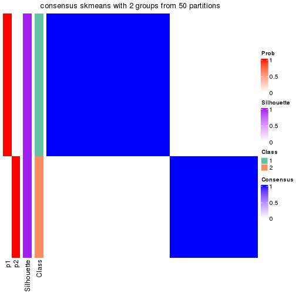</p>

</div>
<div id='tab-node-014-consensus-heatmap-2'>
<pre><code class="r">consensus_heatmap(res, k = 3)
</code></pre>

<p>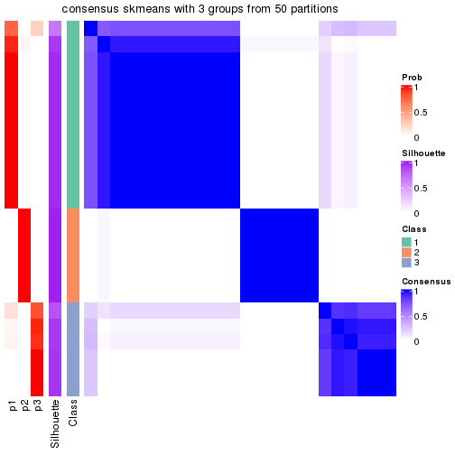</p>

</div>
<div id='tab-node-014-consensus-heatmap-3'>
<pre><code class="r">consensus_heatmap(res, k = 4)
</code></pre>

<p>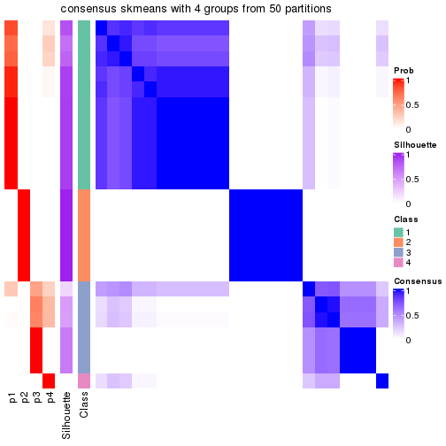</p>

</div>
<div id='tab-node-014-consensus-heatmap-4'>
<pre><code class="r">consensus_heatmap(res, k = 5)
</code></pre>

<p>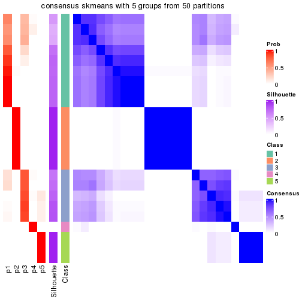</p>

</div>
<div id='tab-node-014-consensus-heatmap-5'>
<pre><code class="r">consensus_heatmap(res, k = 6)
</code></pre>

<p>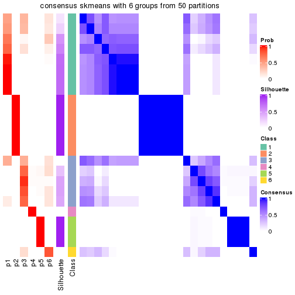</p>

</div>
<div id='tab-node-014-consensus-heatmap-6'>
<pre><code class="r">consensus_heatmap(res, k = 7)
</code></pre>

<p>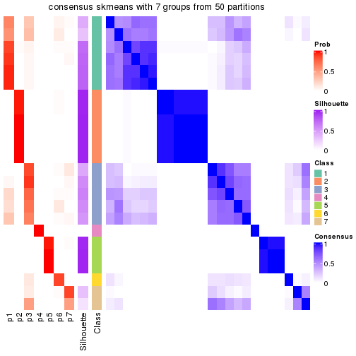</p>

</div>
<div id='tab-node-014-consensus-heatmap-7'>
<pre><code class="r">consensus_heatmap(res, k = 8)
</code></pre>

<p>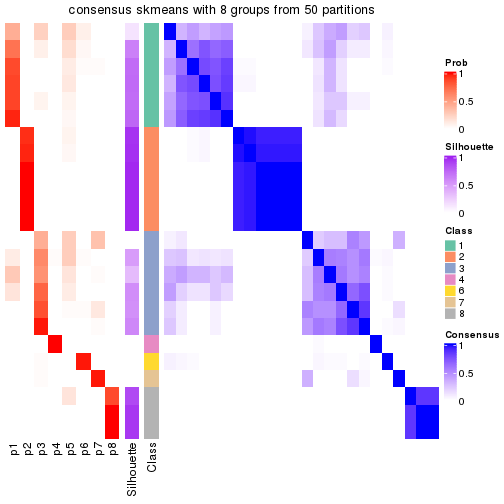</p>

</div>
</div>

Heatmaps for the membership of samples in all partitions to see how consistent they are:


<script>
$( function() {
	$( '#tabs-node-014-membership-heatmap' ).tabs();
} );
</script>
<div id='tabs-node-014-membership-heatmap'>
<ul>
<li><a href='#tab-node-014-membership-heatmap-1'>k = 2</a></li>
<li><a href='#tab-node-014-membership-heatmap-2'>k = 3</a></li>
<li><a href='#tab-node-014-membership-heatmap-3'>k = 4</a></li>
<li><a href='#tab-node-014-membership-heatmap-4'>k = 5</a></li>
<li><a href='#tab-node-014-membership-heatmap-5'>k = 6</a></li>
<li><a href='#tab-node-014-membership-heatmap-6'>k = 7</a></li>
<li><a href='#tab-node-014-membership-heatmap-7'>k = 8</a></li>
</ul>
<div id='tab-node-014-membership-heatmap-1'>
<pre><code class="r">membership_heatmap(res, k = 2)
</code></pre>

<p></p>

</div>
<div id='tab-node-014-membership-heatmap-2'>
<pre><code class="r">membership_heatmap(res, k = 3)
</code></pre>

<p>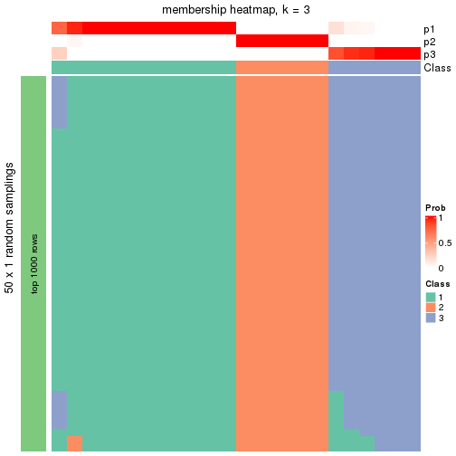</p>

</div>
<div id='tab-node-014-membership-heatmap-3'>
<pre><code class="r">membership_heatmap(res, k = 4)
</code></pre>

<p>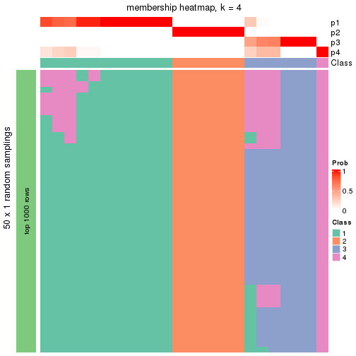</p>

</div>
<div id='tab-node-014-membership-heatmap-4'>
<pre><code class="r">membership_heatmap(res, k = 5)
</code></pre>

<p>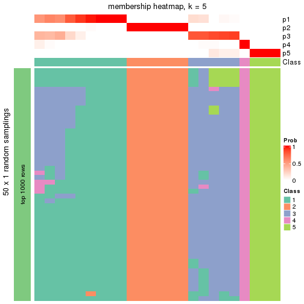</p>

</div>
<div id='tab-node-014-membership-heatmap-5'>
<pre><code class="r">membership_heatmap(res, k = 6)
</code></pre>

<p>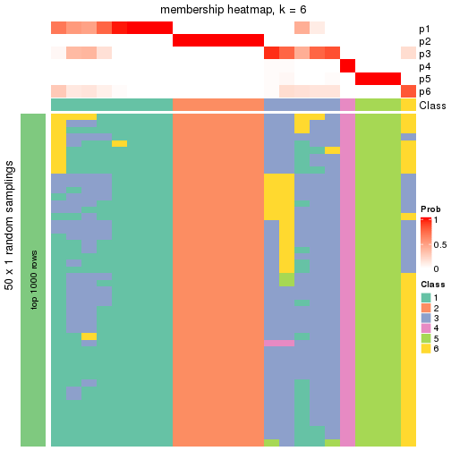</p>

</div>
<div id='tab-node-014-membership-heatmap-6'>
<pre><code class="r">membership_heatmap(res, k = 7)
</code></pre>

<p>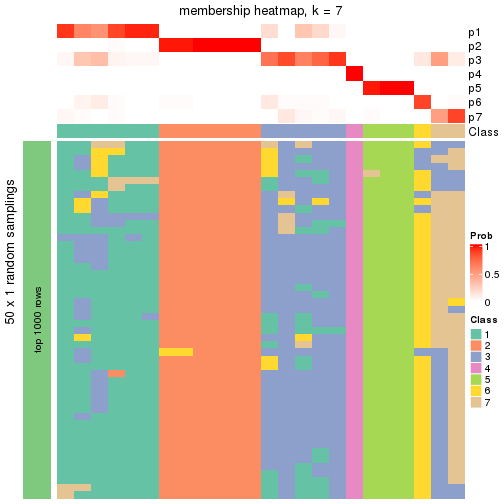</p>

</div>
<div id='tab-node-014-membership-heatmap-7'>
<pre><code class="r">membership_heatmap(res, k = 8)
</code></pre>

<p>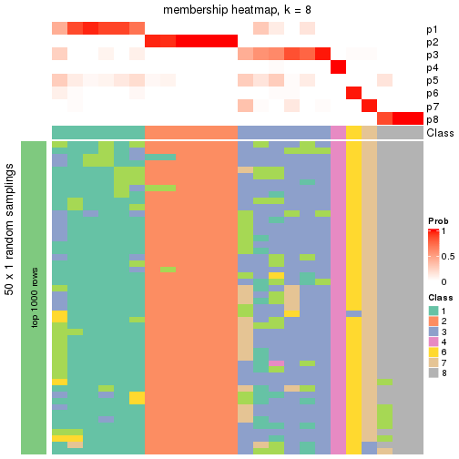</p>

</div>
</div>

As soon as the classes for columns are determined, the signatures
that are significantly different between subgroups can be looked for. 
Following are the heatmaps for signatures.


<script>
$( function() {
	$( '#tabs-node-014-get-signatures' ).tabs();
} );
</script>
<div id='tabs-node-014-get-signatures'>
<ul>
<li><a href='#tab-node-014-get-signatures-1'>k = 2</a></li>
<li><a href='#tab-node-014-get-signatures-2'>k = 3</a></li>
<li><a href='#tab-node-014-get-signatures-3'>k = 4</a></li>
<li><a href='#tab-node-014-get-signatures-4'>k = 5</a></li>
<li><a href='#tab-node-014-get-signatures-5'>k = 6</a></li>
<li><a href='#tab-node-014-get-signatures-6'>k = 7</a></li>
<li><a href='#tab-node-014-get-signatures-7'>k = 8</a></li>
</ul>
<div id='tab-node-014-get-signatures-1'>
<pre><code class="r">get_signatures(res, k = 2)
</code></pre>

<p>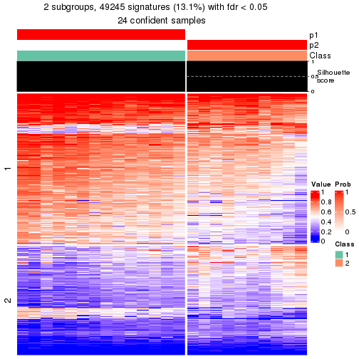</p>

</div>
<div id='tab-node-014-get-signatures-2'>
<pre><code class="r">get_signatures(res, k = 3)
</code></pre>

<p>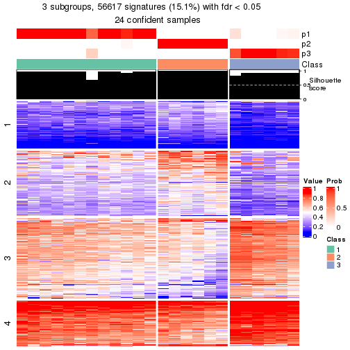</p>

</div>
<div id='tab-node-014-get-signatures-3'>
<pre><code class="r">get_signatures(res, k = 4)
</code></pre>

<p>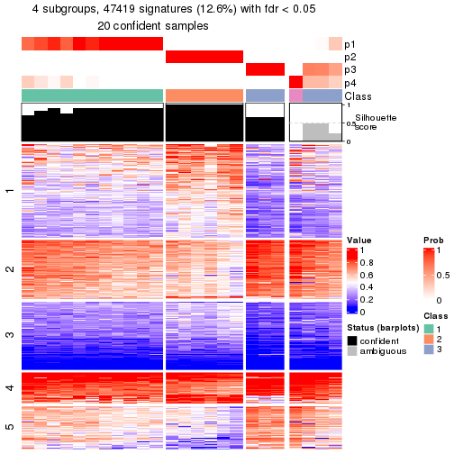</p>

</div>
<div id='tab-node-014-get-signatures-4'>
<pre><code class="r">get_signatures(res, k = 5)
</code></pre>

<p>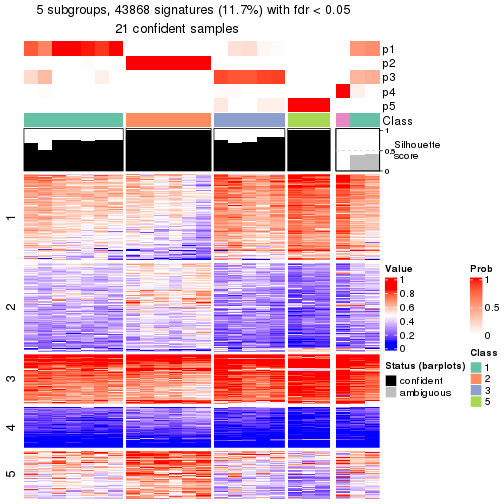</p>

</div>
<div id='tab-node-014-get-signatures-5'>
<pre><code class="r">get_signatures(res, k = 6)
</code></pre>

<p>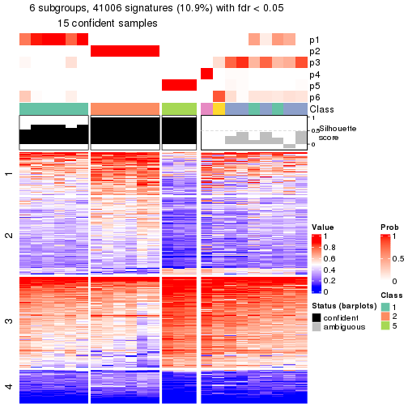</p>

</div>
<div id='tab-node-014-get-signatures-6'>
<pre><code class="r">get_signatures(res, k = 7)
</code></pre>

<p>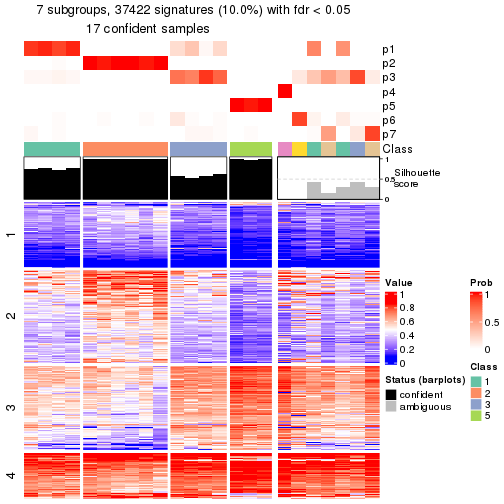</p>

</div>
<div id='tab-node-014-get-signatures-7'>
<pre><code class="r">get_signatures(res, k = 8)
</code></pre>

<p>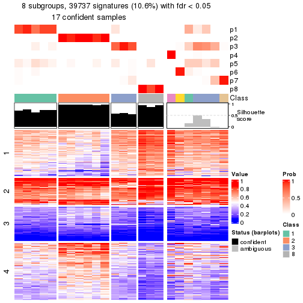</p>

</div>
</div>


Compare the overlap of signatures from different k:

```r
compare_signatures(res)
```

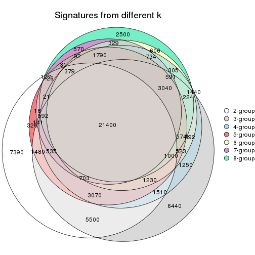

`get_signature()` returns a data frame invisibly. To get the list of signatures, the function
call should be assigned to a variable explicitly. In following code, if `plot` argument is set
to `FALSE`, no heatmap is plotted while only the differential analysis is performed.

```r
# code only for demonstration
tb = get_signature(res, k = ..., plot = FALSE)
```

An example of the output of `tb` is:

```
#>   which_row         fdr    mean_1    mean_2 scaled_mean_1 scaled_mean_2 km
#> 1        38 0.042760348  8.373488  9.131774    -0.5533452     0.5164555  1
#> 2        40 0.018707592  7.106213  8.469186    -0.6173731     0.5762149  1
#> 3        55 0.019134737 10.221463 11.207825    -0.6159697     0.5749050  1
#> 4        59 0.006059896  5.921854  7.869574    -0.6899429     0.6439467  1
#> 5        60 0.018055526  8.928898 10.211722    -0.6204761     0.5791110  1
#> 6        98 0.009384629 15.714769 14.887706     0.6635654    -0.6193277  2
...
```

The columns in `tb` are:

1. `which_row`: row indices corresponding to the input matrix.
2. `fdr`: FDR for the differential test. 
3. `mean_x`: The mean value in group x.
4. `scaled_mean_x`: The mean value in group x after rows are scaled.
5. `km`: Row groups if k-means clustering is applied to rows (which is done by automatically selecting number of clusters).

If there are too many signatures, `top_signatures = ...` can be set to only show the 
signatures with the highest FDRs:

```r
# code only for demonstration
# e.g. to show the top 500 most significant rows
tb = get_signature(res, k = ..., top_signatures = 500)
```

If the signatures are defined as these which are uniquely high in current group, `diff_method` argument
can be set to `"uniquely_high_in_one_group"`:

```r
# code only for demonstration
tb = get_signature(res, k = ..., diff_method = "uniquely_high_in_one_group")
```


UMAP plot which shows how samples are separated.


<script>
$( function() {
	$( '#tabs-node-014-dimension-reduction' ).tabs();
} );
</script>
<div id='tabs-node-014-dimension-reduction'>
<ul>
<li><a href='#tab-node-014-dimension-reduction-1'>k = 2</a></li>
<li><a href='#tab-node-014-dimension-reduction-2'>k = 3</a></li>
<li><a href='#tab-node-014-dimension-reduction-3'>k = 4</a></li>
<li><a href='#tab-node-014-dimension-reduction-4'>k = 5</a></li>
<li><a href='#tab-node-014-dimension-reduction-5'>k = 6</a></li>
<li><a href='#tab-node-014-dimension-reduction-6'>k = 7</a></li>
<li><a href='#tab-node-014-dimension-reduction-7'>k = 8</a></li>
</ul>
<div id='tab-node-014-dimension-reduction-1'>
<pre><code class="r">dimension_reduction(res, k = 2, method = &quot;UMAP&quot;)
</code></pre>

<p>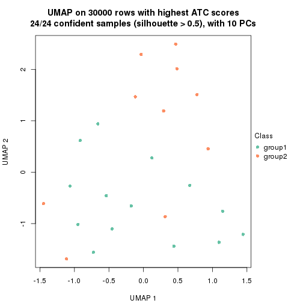</p>

</div>
<div id='tab-node-014-dimension-reduction-2'>
<pre><code class="r">dimension_reduction(res, k = 3, method = &quot;UMAP&quot;)
</code></pre>

<p>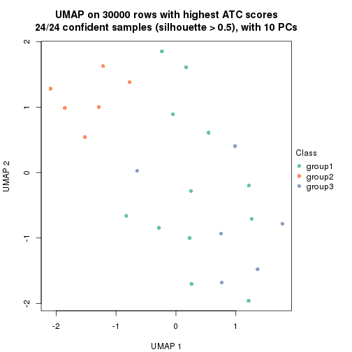</p>

</div>
<div id='tab-node-014-dimension-reduction-3'>
<pre><code class="r">dimension_reduction(res, k = 4, method = &quot;UMAP&quot;)
</code></pre>

<p>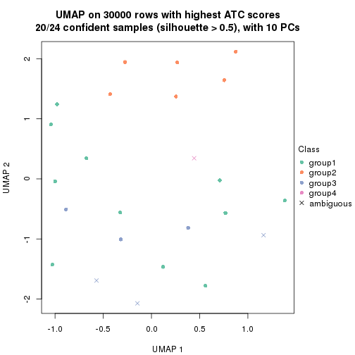</p>

</div>
<div id='tab-node-014-dimension-reduction-4'>
<pre><code class="r">dimension_reduction(res, k = 5, method = &quot;UMAP&quot;)
</code></pre>

<p>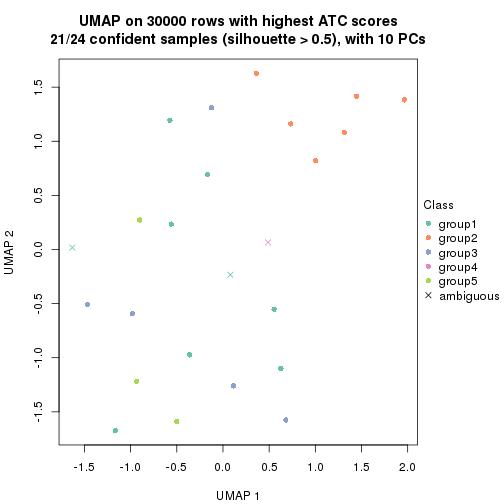</p>

</div>
<div id='tab-node-014-dimension-reduction-5'>
<pre><code class="r">dimension_reduction(res, k = 6, method = &quot;UMAP&quot;)
</code></pre>

<p>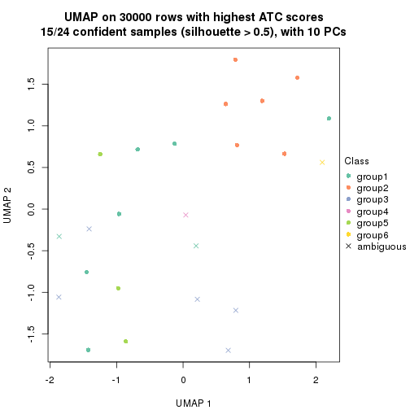</p>

</div>
<div id='tab-node-014-dimension-reduction-6'>
<pre><code class="r">dimension_reduction(res, k = 7, method = &quot;UMAP&quot;)
</code></pre>

<p>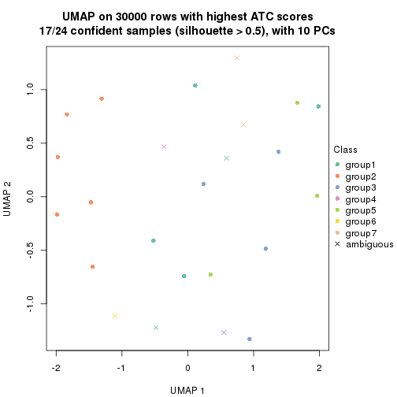</p>

</div>
<div id='tab-node-014-dimension-reduction-7'>
<pre><code class="r">dimension_reduction(res, k = 8, method = &quot;UMAP&quot;)
</code></pre>

<p>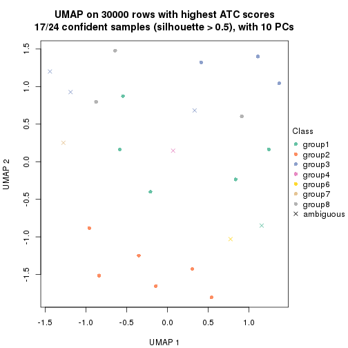</p>

</div>
</div>


Following heatmap shows how subgroups are split when increasing `k`:

```r
collect_classes(res)
```

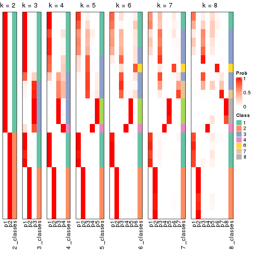


If matrix rows can be associated to genes, consider to use `functional_enrichment(res,
...)` to perform function enrichment for the signature genes. See [this vignette](https://jokergoo.github.io/cola_vignettes/functional_enrichment.html) for more detailed explanations.


 

---------------------------------------------------


### Node0141


Parent node: [Node014](#Node014).
Child nodes: 
                Node01111-leaf
        ,
                Node01112-leaf
        ,
                Node01113-leaf
        ,
                Node01121-leaf
        ,
                Node01122-leaf
        ,
                Node01123-leaf
        ,
                Node01131-leaf
        ,
                [Node01132](#Node01132)
        ,
                Node01211-leaf
        ,
                Node01212-leaf
        ,
                Node01213-leaf
        ,
                Node01214-leaf
        ,
                Node01411-leaf
        ,
                Node01412-leaf
        ,
                Node01413-leaf
        ,
                Node01414-leaf
        ,
                Node02311-leaf
        ,
                Node02312-leaf
        ,
                Node02313-leaf
        .


The object with results only for a single top-value method and a single partitioning method 
can be extracted as:

```r
res = res_rh["0141"]
```

A summary of `res` and all the functions that can be applied to it:

```r
res
```

```
#> A 'ConsensusPartition' object with k = 2, 3, 4, 5, 6, 7, 8.
#>   On a matrix with 30000 rows and 12 columns.
#>   Top rows (1000) are extracted by 'ATC' method.
#>   Subgroups are detected by 'skmeans' method.
#>   Performed in total 350 partitions by row resampling.
#>   Best k for subgroups seems to be 5.
#> 
#> Following methods can be applied to this 'ConsensusPartition' object:
#>  [1] "cola_report"             "collect_classes"         "collect_plots"          
#>  [4] "collect_stats"           "colnames"                "compare_partitions"     
#>  [7] "compare_signatures"      "consensus_heatmap"       "dimension_reduction"    
#> [10] "functional_enrichment"   "get_anno_col"            "get_anno"               
#> [13] "get_classes"             "get_consensus"           "get_matrix"             
#> [16] "get_membership"          "get_param"               "get_signatures"         
#> [19] "get_stats"               "is_best_k"               "is_stable_k"            
#> [22] "membership_heatmap"      "ncol"                    "nrow"                   
#> [25] "plot_ecdf"               "predict_classes"         "rownames"               
#> [28] "select_partition_number" "show"                    "suggest_best_k"         
#> [31] "test_to_known_factors"   "top_rows_heatmap"
```

`collect_plots()` function collects all the plots made from `res` for all `k` (number of subgroups)
into one single page to provide an easy and fast comparison between different `k`.

```r
collect_plots(res)
```

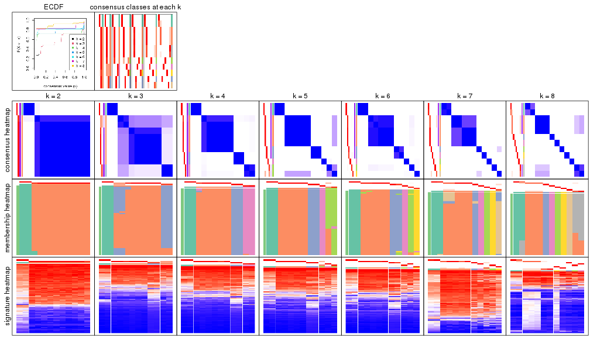

The plots are:

- The first row: a plot of the eCDF (empirical cumulative distribution
  function) curves of the consensus matrix for each `k` and the heatmap of
  predicted classes for each `k`.
- The second row: heatmaps of the consensus matrix for each `k`.
- The third row: heatmaps of the membership matrix for each `k`.
- The fouth row: heatmaps of the signatures for each `k`.

All the plots in panels can be made by individual functions and they are
plotted later in this section.

`select_partition_number()` produces several plots showing different
statistics for choosing "optimized" `k`. There are following statistics:

- eCDF curves of the consensus matrix for each `k`;
- 1-PAC. [The PAC score](https://en.wikipedia.org/wiki/Consensus_clustering#Over-interpretation_potential_of_consensus_clustering)
  measures the proportion of the ambiguous subgrouping.
- Mean silhouette score.
- Concordance. The mean probability of fiting the consensus subgroup labels in all
  partitions.
- Area increased. Denote $A_k$ as the area under the eCDF curve for current
  `k`, the area increased is defined as $A_k - A_{k-1}$.
- Rand index. The percent of pairs of samples that are both in a same cluster
  or both are not in a same cluster in the partition of k and k-1.
- Jaccard index. The ratio of pairs of samples are both in a same cluster in
  the partition of k and k-1 and the pairs of samples are both in a same
  cluster in the partition k or k-1.

The detailed explanations of these statistics can be found in [the _cola_
vignette](https://jokergoo.github.io/cola_vignettes/cola.html#toc_13).

Generally speaking, higher 1-PAC score, higher mean silhouette score or higher
concordance corresponds to better partition. Rand index and Jaccard index
measure how similar the current partition is compared to partition with `k-1`.
If they are too similar, we won't accept `k` is better than `k-1`.

```r
select_partition_number(res)
```

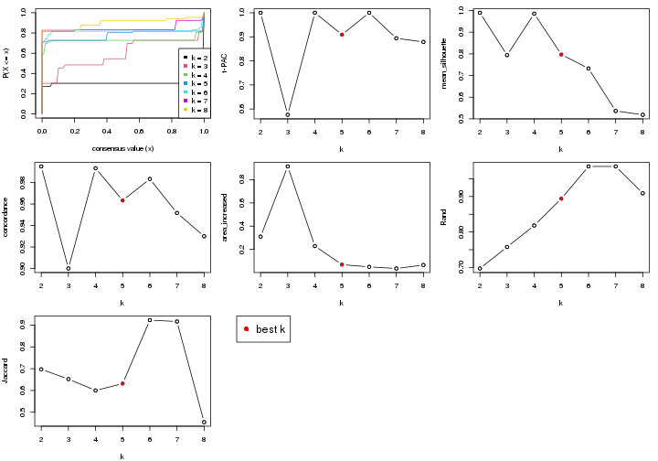

The numeric values for all these statistics can be obtained by `get_stats()`.

```r
get_stats(res)
```

```
#>   k 1-PAC mean_silhouette concordance area_increased  Rand Jaccard
#> 2 2 1.000           0.990       0.995         0.3100 0.697   0.697
#> 3 3 0.576           0.794       0.900         0.9136 0.758   0.652
#> 4 4 1.000           0.985       0.993         0.2286 0.818   0.600
#> 5 5 0.909           0.797       0.963         0.0689 0.894   0.632
#> 6 6 1.000           0.732       0.983         0.0497 0.985   0.923
#> 7 7 0.894           0.536       0.952         0.0359 0.985   0.917
#> 8 8 0.879           0.519       0.930         0.0655 0.909   0.455
```

`suggest_best_k()` suggests the best $k$ based on these statistics. The rules are as follows:

- All $k$ with Jaccard index larger than 0.95 are removed because increasing
  $k$ does not provide enough extra information. If all $k$ are removed, it is
  marked as no subgroup is detected.
- For all $k$ with 1-PAC score larger than 0.9, the maximal $k$ is taken as
  the best $k$, and other $k$ are marked as optional $k$.
- If it does not fit the second rule. The $k$ with the maximal vote of the
  highest 1-PAC score, highest mean silhouette, and highest concordance is
  taken as the best $k$.

```r
suggest_best_k(res)
```

```
#> [1] 5
#> attr(,"optional")
#> [1] 2 4
```

There is also optional best $k$ = 2 4 that is worth to check.

Following is the table of the partitions (You need to click the **show/hide
code output** link to see it). The membership matrix (columns with name `p*`)
is inferred by
[`clue::cl_consensus()`](https://www.rdocumentation.org/link/cl_consensus?package=clue)
function with the `SE` method. Basically the value in the membership matrix
represents the probability to belong to a certain group. The finall subgroup
label for an item is determined with the group with highest probability it
belongs to.

In `get_classes()` function, the entropy is calculated from the membership
matrix and the silhouette score is calculated from the consensus matrix.


<script>
$( function() {
	$( '#tabs-node-0141-get-classes' ).tabs();
} );
</script>
<div id='tabs-node-0141-get-classes'>
<ul>
<li><a href='#tab-node-0141-get-classes-1'>k = 2</a></li>
<li><a href='#tab-node-0141-get-classes-2'>k = 3</a></li>
<li><a href='#tab-node-0141-get-classes-3'>k = 4</a></li>
<li><a href='#tab-node-0141-get-classes-4'>k = 5</a></li>
<li><a href='#tab-node-0141-get-classes-5'>k = 6</a></li>
<li><a href='#tab-node-0141-get-classes-6'>k = 7</a></li>
<li><a href='#tab-node-0141-get-classes-7'>k = 8</a></li>
</ul>

<div id='tab-node-0141-get-classes-1'>
<p><a id='tab-node-0141-get-classes-1-a' style='color:#0366d6' href='#'>show/hide code output</a></p>
<pre><code class="r">cbind(get_classes(res, k = 2), get_membership(res, k = 2))
</code></pre>

<pre><code>#&gt;                 class entropy silhouette   p1   p2
#&gt; TCGA.AY.6197.01     2   0.000      0.993 0.00 1.00
#&gt; TCGA.NH.A50V.01     2   0.000      0.993 0.00 1.00
#&gt; TCGA.AY.6386.01     2   0.000      0.993 0.00 1.00
#&gt; TCGA.CM.4744.01     1   0.000      1.000 1.00 0.00
#&gt; TCGA.A6.4105.01     2   0.000      0.993 0.00 1.00
#&gt; TCGA.F4.6806.01     2   0.000      0.993 0.00 1.00
#&gt; TCGA.CM.5860.01     2   0.000      0.993 0.00 1.00
#&gt; TCGA.A6.6780.01     2   0.000      0.993 0.00 1.00
#&gt; TCGA.G4.6323.01     2   0.000      0.993 0.00 1.00
#&gt; TCGA.CK.4950.01     2   0.000      0.993 0.00 1.00
#&gt; TCGA.DM.A285.01     2   0.327      0.936 0.06 0.94
#&gt; TCGA.DM.A0XD.01     1   0.000      1.000 1.00 0.00
</code></pre>

<script>
$('#tab-node-0141-get-classes-1-a').parent().next().next().hide();
$('#tab-node-0141-get-classes-1-a').click(function(){
  $('#tab-node-0141-get-classes-1-a').parent().next().next().toggle();
  return(false);
});
</script>
</div>

<div id='tab-node-0141-get-classes-2'>
<p><a id='tab-node-0141-get-classes-2-a' style='color:#0366d6' href='#'>show/hide code output</a></p>
<pre><code class="r">cbind(get_classes(res, k = 3), get_membership(res, k = 3))
</code></pre>

<pre><code>#&gt;                 class entropy silhouette p1   p2   p3
#&gt; TCGA.AY.6197.01     3   0.296      1.000  0 0.10 0.90
#&gt; TCGA.NH.A50V.01     2   0.000      0.837  0 1.00 0.00
#&gt; TCGA.AY.6386.01     2   0.000      0.837  0 1.00 0.00
#&gt; TCGA.CM.4744.01     1   0.000      1.000  1 0.00 0.00
#&gt; TCGA.A6.4105.01     2   0.000      0.837  0 1.00 0.00
#&gt; TCGA.F4.6806.01     2   0.000      0.837  0 1.00 0.00
#&gt; TCGA.CM.5860.01     2   0.630      0.265  0 0.52 0.48
#&gt; TCGA.A6.6780.01     3   0.296      1.000  0 0.10 0.90
#&gt; TCGA.G4.6323.01     2   0.153      0.814  0 0.96 0.04
#&gt; TCGA.CK.4950.01     2   0.000      0.837  0 1.00 0.00
#&gt; TCGA.DM.A285.01     2   0.630      0.265  0 0.52 0.48
#&gt; TCGA.DM.A0XD.01     1   0.000      1.000  1 0.00 0.00
</code></pre>

<script>
$('#tab-node-0141-get-classes-2-a').parent().next().next().hide();
$('#tab-node-0141-get-classes-2-a').click(function(){
  $('#tab-node-0141-get-classes-2-a').parent().next().next().toggle();
  return(false);
});
</script>
</div>

<div id='tab-node-0141-get-classes-3'>
<p><a id='tab-node-0141-get-classes-3-a' style='color:#0366d6' href='#'>show/hide code output</a></p>
<pre><code class="r">cbind(get_classes(res, k = 4), get_membership(res, k = 4))
</code></pre>

<pre><code>#&gt;                 class entropy silhouette p1   p2   p3   p4
#&gt; TCGA.AY.6197.01     3  0.0000      1.000  0 0.00 1.00 0.00
#&gt; TCGA.NH.A50V.01     2  0.0000      0.988  0 1.00 0.00 0.00
#&gt; TCGA.AY.6386.01     2  0.0000      0.988  0 1.00 0.00 0.00
#&gt; TCGA.CM.4744.01     1  0.0000      1.000  1 0.00 0.00 0.00
#&gt; TCGA.A6.4105.01     2  0.0000      0.988  0 1.00 0.00 0.00
#&gt; TCGA.F4.6806.01     2  0.0000      0.988  0 1.00 0.00 0.00
#&gt; TCGA.CM.5860.01     4  0.0000      0.972  0 0.00 0.00 1.00
#&gt; TCGA.A6.6780.01     3  0.0000      1.000  0 0.00 1.00 0.00
#&gt; TCGA.G4.6323.01     2  0.1913      0.940  0 0.94 0.02 0.04
#&gt; TCGA.CK.4950.01     2  0.0000      0.988  0 1.00 0.00 0.00
#&gt; TCGA.DM.A285.01     4  0.0707      0.972  0 0.02 0.00 0.98
#&gt; TCGA.DM.A0XD.01     1  0.0000      1.000  1 0.00 0.00 0.00
</code></pre>

<script>
$('#tab-node-0141-get-classes-3-a').parent().next().next().hide();
$('#tab-node-0141-get-classes-3-a').click(function(){
  $('#tab-node-0141-get-classes-3-a').parent().next().next().toggle();
  return(false);
});
</script>
</div>

<div id='tab-node-0141-get-classes-4'>
<p><a id='tab-node-0141-get-classes-4-a' style='color:#0366d6' href='#'>show/hide code output</a></p>
<pre><code class="r">cbind(get_classes(res, k = 5), get_membership(res, k = 5))
</code></pre>

<pre><code>#&gt;                 class entropy silhouette p1  p2 p3   p4   p5
#&gt; TCGA.AY.6197.01     3   0.000      1.000  0 0.0  1 0.00 0.00
#&gt; TCGA.NH.A50V.01     2   0.000      1.000  0 1.0  0 0.00 0.00
#&gt; TCGA.AY.6386.01     2   0.000      1.000  0 1.0  0 0.00 0.00
#&gt; TCGA.CM.4744.01     1   0.000      1.000  1 0.0  0 0.00 0.00
#&gt; TCGA.A6.4105.01     2   0.000      1.000  0 1.0  0 0.00 0.00
#&gt; TCGA.F4.6806.01     2   0.000      1.000  0 1.0  0 0.00 0.00
#&gt; TCGA.CM.5860.01     4   0.000      0.000  0 0.0  0 1.00 0.00
#&gt; TCGA.A6.6780.01     3   0.000      1.000  0 0.0  1 0.00 0.00
#&gt; TCGA.G4.6323.01     5   0.418      0.307  0 0.4  0 0.00 0.60
#&gt; TCGA.CK.4950.01     2   0.000      1.000  0 1.0  0 0.00 0.00
#&gt; TCGA.DM.A285.01     5   0.104      0.258  0 0.0  0 0.04 0.96
#&gt; TCGA.DM.A0XD.01     1   0.000      1.000  1 0.0  0 0.00 0.00
</code></pre>

<script>
$('#tab-node-0141-get-classes-4-a').parent().next().next().hide();
$('#tab-node-0141-get-classes-4-a').click(function(){
  $('#tab-node-0141-get-classes-4-a').parent().next().next().toggle();
  return(false);
});
</script>
</div>

<div id='tab-node-0141-get-classes-5'>
<p><a id='tab-node-0141-get-classes-5-a' style='color:#0366d6' href='#'>show/hide code output</a></p>
<pre><code class="r">cbind(get_classes(res, k = 6), get_membership(res, k = 6))
</code></pre>

<pre><code>#&gt;                 class entropy silhouette p1   p2   p3   p4   p5   p6
#&gt; TCGA.AY.6197.01     3  0.0000      0.933  0 0.00 1.00 0.00 0.00 0.00
#&gt; TCGA.NH.A50V.01     2  0.0547      0.978  0 0.98 0.00 0.00 0.02 0.00
#&gt; TCGA.AY.6386.01     2  0.0000      0.989  0 1.00 0.00 0.00 0.00 0.00
#&gt; TCGA.CM.4744.01     1  0.0000      1.000  1 0.00 0.00 0.00 0.00 0.00
#&gt; TCGA.A6.4105.01     2  0.0000      0.989  0 1.00 0.00 0.00 0.00 0.00
#&gt; TCGA.F4.6806.01     2  0.0547      0.978  0 0.98 0.00 0.00 0.02 0.00
#&gt; TCGA.CM.5860.01     4  0.0000      0.000  0 0.00 0.00 1.00 0.00 0.00
#&gt; TCGA.A6.6780.01     3  0.1865      0.933  0 0.00 0.92 0.00 0.04 0.04
#&gt; TCGA.G4.6323.01     5  0.0937      0.000  0 0.04 0.00 0.00 0.96 0.00
#&gt; TCGA.CK.4950.01     2  0.0000      0.989  0 1.00 0.00 0.00 0.00 0.00
#&gt; TCGA.DM.A285.01     6  0.1092      0.000  0 0.00 0.00 0.02 0.02 0.96
#&gt; TCGA.DM.A0XD.01     1  0.0000      1.000  1 0.00 0.00 0.00 0.00 0.00
</code></pre>

<script>
$('#tab-node-0141-get-classes-5-a').parent().next().next().hide();
$('#tab-node-0141-get-classes-5-a').click(function(){
  $('#tab-node-0141-get-classes-5-a').parent().next().next().toggle();
  return(false);
});
</script>
</div>

<div id='tab-node-0141-get-classes-6'>
<p><a id='tab-node-0141-get-classes-6-a' style='color:#0366d6' href='#'>show/hide code output</a></p>
<pre><code class="r">cbind(get_classes(res, k = 7), get_membership(res, k = 7))
</code></pre>

<pre><code>#&gt;                 class entropy silhouette   p1   p2  p3 p4 p5 p6   p7
#&gt; TCGA.AY.6197.01     3  0.0000      0.000 0.00 0.00 1.0  0  0  0 0.00
#&gt; TCGA.NH.A50V.01     2  0.2422      0.865 0.00 0.82 0.0  0  0  0 0.18
#&gt; TCGA.AY.6386.01     2  0.0000      0.913 0.00 1.00 0.0  0  0  0 0.00
#&gt; TCGA.CM.4744.01     1  0.0000      0.984 1.00 0.00 0.0  0  0  0 0.00
#&gt; TCGA.A6.4105.01     2  0.2422      0.865 0.00 0.82 0.0  0  0  0 0.18
#&gt; TCGA.F4.6806.01     2  0.0000      0.913 0.00 1.00 0.0  0  0  0 0.00
#&gt; TCGA.CM.5860.01     4  0.0000      0.000 0.00 0.00 0.0  1  0  0 0.00
#&gt; TCGA.A6.6780.01     7  0.2572      0.000 0.00 0.00 0.2  0  0  0 0.80
#&gt; TCGA.G4.6323.01     5  0.0000      0.000 0.00 0.00 0.0  0  1  0 0.00
#&gt; TCGA.CK.4950.01     2  0.0000      0.913 0.00 1.00 0.0  0  0  0 0.00
#&gt; TCGA.DM.A285.01     6  0.0000      0.000 0.00 0.00 0.0  0  0  1 0.00
#&gt; TCGA.DM.A0XD.01     1  0.0504      0.984 0.98 0.00 0.0  0  0  0 0.02
</code></pre>

<script>
$('#tab-node-0141-get-classes-6-a').parent().next().next().hide();
$('#tab-node-0141-get-classes-6-a').click(function(){
  $('#tab-node-0141-get-classes-6-a').parent().next().next().toggle();
  return(false);
});
</script>
</div>

<div id='tab-node-0141-get-classes-7'>
<p><a id='tab-node-0141-get-classes-7-a' style='color:#0366d6' href='#'>show/hide code output</a></p>
<pre><code class="r">cbind(get_classes(res, k = 8), get_membership(res, k = 8))
</code></pre>

<pre><code>#&gt;                 class entropy silhouette   p1   p2 p3 p4 p5 p6 p7   p8
#&gt; TCGA.AY.6197.01     3   0.000      0.000 0.00 0.00  1  0  0  0  0 0.00
#&gt; TCGA.NH.A50V.01     8   0.000      0.833 0.00 0.00  0  0  0  0  0 1.00
#&gt; TCGA.AY.6386.01     2   0.265      1.000 0.00 0.76  0  0  0  0  0 0.24
#&gt; TCGA.CM.4744.01     1   0.000      0.789 1.00 0.00  0  0  0  0  0 0.00
#&gt; TCGA.A6.4105.01     8   0.176      0.812 0.00 0.12  0  0  0  0  0 0.88
#&gt; TCGA.F4.6806.01     2   0.265      1.000 0.00 0.76  0  0  0  0  0 0.24
#&gt; TCGA.CM.5860.01     4   0.000      0.000 0.00 0.00  0  1  0  0  0 0.00
#&gt; TCGA.A6.6780.01     7   0.000      0.000 0.00 0.00  0  0  0  0  1 0.00
#&gt; TCGA.G4.6323.01     5   0.000      0.000 0.00 0.00  0  0  1  0  0 0.00
#&gt; TCGA.CK.4950.01     2   0.265      1.000 0.00 0.76  0  0  0  0  0 0.24
#&gt; TCGA.DM.A285.01     6   0.000      0.000 0.00 0.00  0  0  0  1  0 0.00
#&gt; TCGA.DM.A0XD.01     1   0.265      0.789 0.76 0.24  0  0  0  0  0 0.00
</code></pre>

<script>
$('#tab-node-0141-get-classes-7-a').parent().next().next().hide();
$('#tab-node-0141-get-classes-7-a').click(function(){
  $('#tab-node-0141-get-classes-7-a').parent().next().next().toggle();
  return(false);
});
</script>
</div>
</div>

Heatmaps for the consensus matrix. It visualizes the probability of two
samples to be in a same group.


<script>
$( function() {
	$( '#tabs-node-0141-consensus-heatmap' ).tabs();
} );
</script>
<div id='tabs-node-0141-consensus-heatmap'>
<ul>
<li><a href='#tab-node-0141-consensus-heatmap-1'>k = 2</a></li>
<li><a href='#tab-node-0141-consensus-heatmap-2'>k = 3</a></li>
<li><a href='#tab-node-0141-consensus-heatmap-3'>k = 4</a></li>
<li><a href='#tab-node-0141-consensus-heatmap-4'>k = 5</a></li>
<li><a href='#tab-node-0141-consensus-heatmap-5'>k = 6</a></li>
<li><a href='#tab-node-0141-consensus-heatmap-6'>k = 7</a></li>
<li><a href='#tab-node-0141-consensus-heatmap-7'>k = 8</a></li>
</ul>
<div id='tab-node-0141-consensus-heatmap-1'>
<pre><code class="r">consensus_heatmap(res, k = 2)
</code></pre>

<p>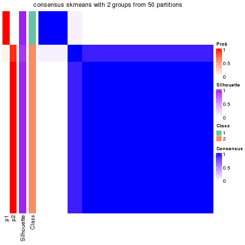</p>

</div>
<div id='tab-node-0141-consensus-heatmap-2'>
<pre><code class="r">consensus_heatmap(res, k = 3)
</code></pre>

<p>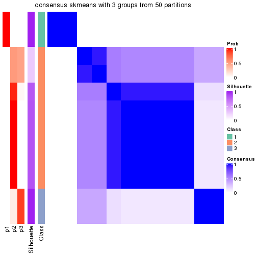</p>

</div>
<div id='tab-node-0141-consensus-heatmap-3'>
<pre><code class="r">consensus_heatmap(res, k = 4)
</code></pre>

<p>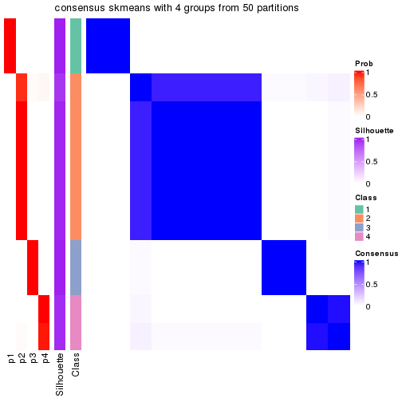</p>

</div>
<div id='tab-node-0141-consensus-heatmap-4'>
<pre><code class="r">consensus_heatmap(res, k = 5)
</code></pre>

<p>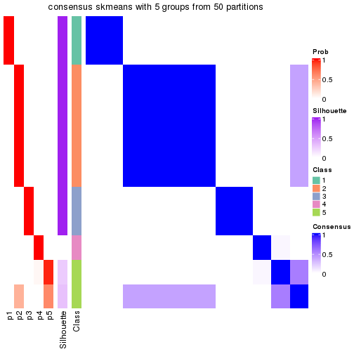</p>

</div>
<div id='tab-node-0141-consensus-heatmap-5'>
<pre><code class="r">consensus_heatmap(res, k = 6)
</code></pre>

<p>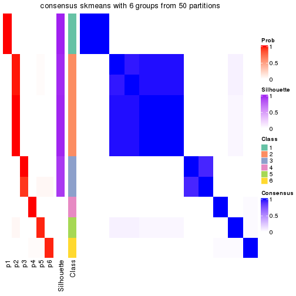</p>

</div>
<div id='tab-node-0141-consensus-heatmap-6'>
<pre><code class="r">consensus_heatmap(res, k = 7)
</code></pre>

<p>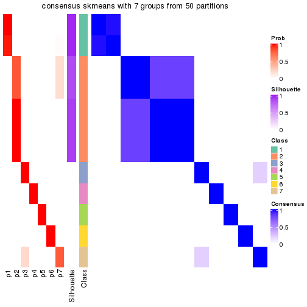</p>

</div>
<div id='tab-node-0141-consensus-heatmap-7'>
<pre><code class="r">consensus_heatmap(res, k = 8)
</code></pre>

<p>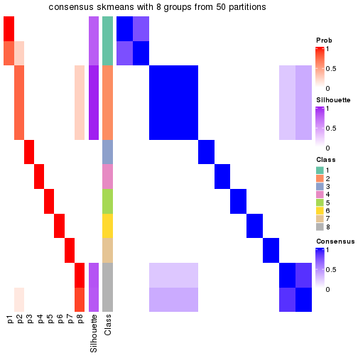</p>

</div>
</div>

Heatmaps for the membership of samples in all partitions to see how consistent they are:


<script>
$( function() {
	$( '#tabs-node-0141-membership-heatmap' ).tabs();
} );
</script>
<div id='tabs-node-0141-membership-heatmap'>
<ul>
<li><a href='#tab-node-0141-membership-heatmap-1'>k = 2</a></li>
<li><a href='#tab-node-0141-membership-heatmap-2'>k = 3</a></li>
<li><a href='#tab-node-0141-membership-heatmap-3'>k = 4</a></li>
<li><a href='#tab-node-0141-membership-heatmap-4'>k = 5</a></li>
<li><a href='#tab-node-0141-membership-heatmap-5'>k = 6</a></li>
<li><a href='#tab-node-0141-membership-heatmap-6'>k = 7</a></li>
<li><a href='#tab-node-0141-membership-heatmap-7'>k = 8</a></li>
</ul>
<div id='tab-node-0141-membership-heatmap-1'>
<pre><code class="r">membership_heatmap(res, k = 2)
</code></pre>

<p>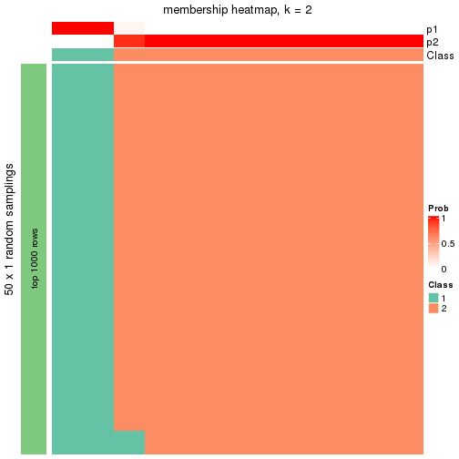</p>

</div>
<div id='tab-node-0141-membership-heatmap-2'>
<pre><code class="r">membership_heatmap(res, k = 3)
</code></pre>

<p>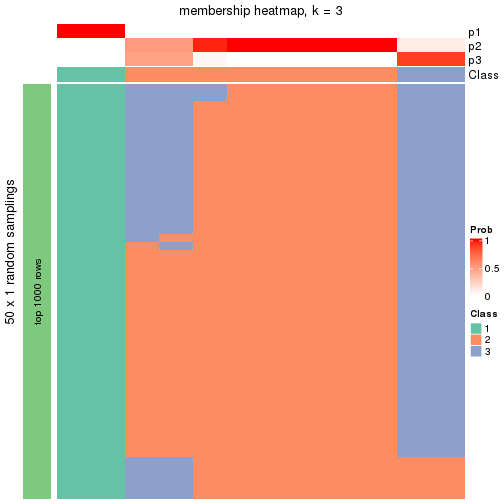</p>

</div>
<div id='tab-node-0141-membership-heatmap-3'>
<pre><code class="r">membership_heatmap(res, k = 4)
</code></pre>

<p>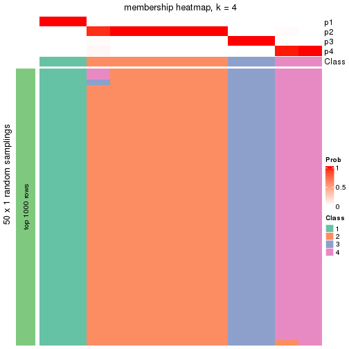</p>

</div>
<div id='tab-node-0141-membership-heatmap-4'>
<pre><code class="r">membership_heatmap(res, k = 5)
</code></pre>

<p>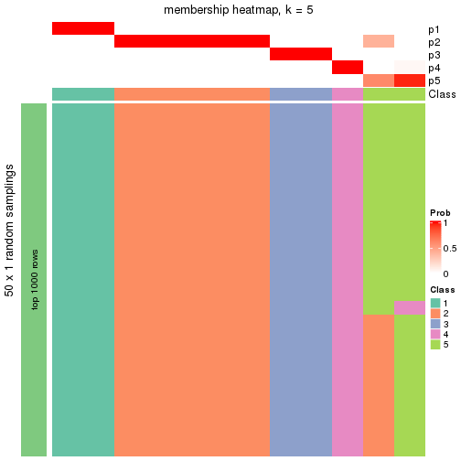</p>

</div>
<div id='tab-node-0141-membership-heatmap-5'>
<pre><code class="r">membership_heatmap(res, k = 6)
</code></pre>

<p>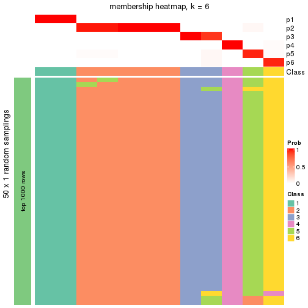</p>

</div>
<div id='tab-node-0141-membership-heatmap-6'>
<pre><code class="r">membership_heatmap(res, k = 7)
</code></pre>

<p>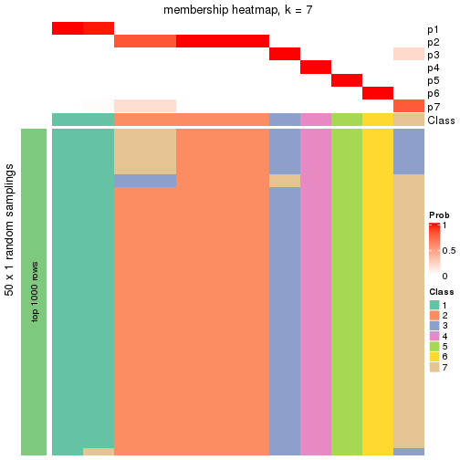</p>

</div>
<div id='tab-node-0141-membership-heatmap-7'>
<pre><code class="r">membership_heatmap(res, k = 8)
</code></pre>

<p>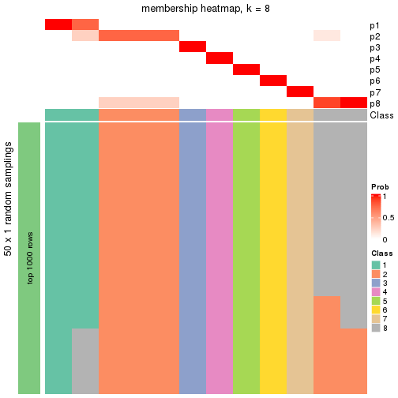</p>

</div>
</div>

As soon as the classes for columns are determined, the signatures
that are significantly different between subgroups can be looked for. 
Following are the heatmaps for signatures.


<script>
$( function() {
	$( '#tabs-node-0141-get-signatures' ).tabs();
} );
</script>
<div id='tabs-node-0141-get-signatures'>
<ul>
<li><a href='#tab-node-0141-get-signatures-1'>k = 2</a></li>
<li><a href='#tab-node-0141-get-signatures-2'>k = 3</a></li>
<li><a href='#tab-node-0141-get-signatures-3'>k = 4</a></li>
<li><a href='#tab-node-0141-get-signatures-4'>k = 5</a></li>
<li><a href='#tab-node-0141-get-signatures-5'>k = 6</a></li>
<li><a href='#tab-node-0141-get-signatures-6'>k = 7</a></li>
<li><a href='#tab-node-0141-get-signatures-7'>k = 8</a></li>
</ul>
<div id='tab-node-0141-get-signatures-1'>
<pre><code class="r">get_signatures(res, k = 2)
</code></pre>

<p>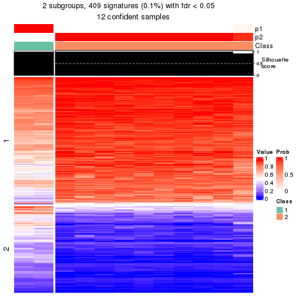</p>

</div>
<div id='tab-node-0141-get-signatures-2'>
<pre><code class="r">get_signatures(res, k = 3)
</code></pre>

<p>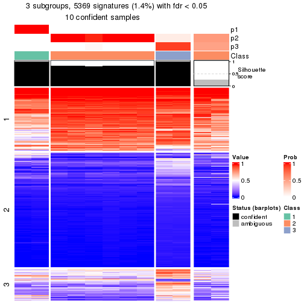</p>

</div>
<div id='tab-node-0141-get-signatures-3'>
<pre><code class="r">get_signatures(res, k = 4)
</code></pre>

<p>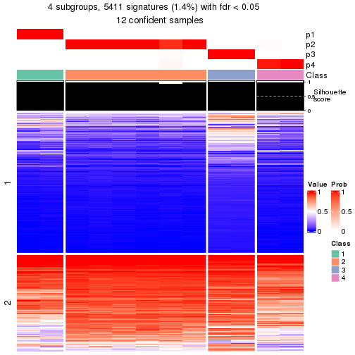</p>

</div>
<div id='tab-node-0141-get-signatures-4'>
<pre><code class="r">get_signatures(res, k = 5)
</code></pre>

<p>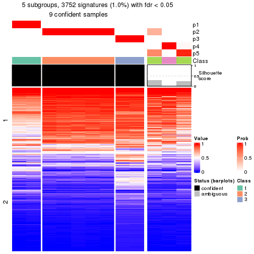</p>

</div>
<div id='tab-node-0141-get-signatures-5'>
<pre><code class="r">get_signatures(res, k = 6)
</code></pre>

<p>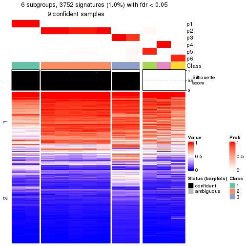</p>

</div>
<div id='tab-node-0141-get-signatures-6'>
<pre><code class="r">get_signatures(res, k = 7)
</code></pre>

<p>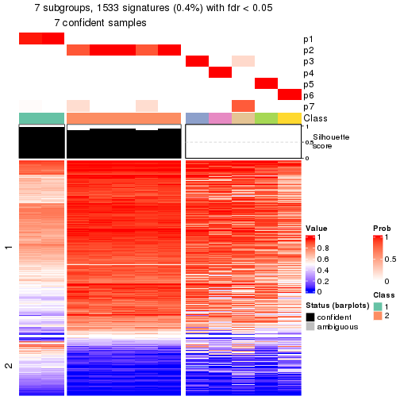</p>

</div>
<div id='tab-node-0141-get-signatures-7'>
<pre><code class="r">get_signatures(res, k = 8)
</code></pre>

<p>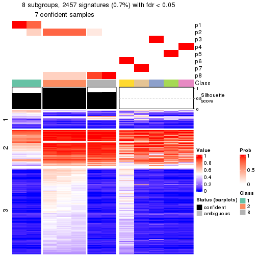</p>

</div>
</div>


Compare the overlap of signatures from different k:

```r
compare_signatures(res)
```

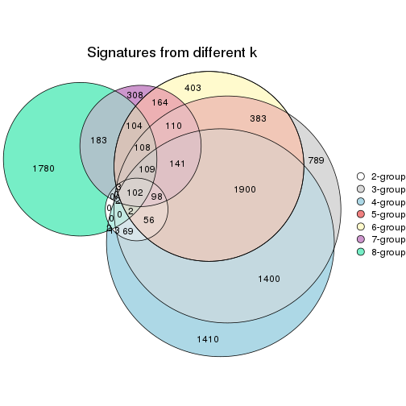

`get_signature()` returns a data frame invisibly. To get the list of signatures, the function
call should be assigned to a variable explicitly. In following code, if `plot` argument is set
to `FALSE`, no heatmap is plotted while only the differential analysis is performed.

```r
# code only for demonstration
tb = get_signature(res, k = ..., plot = FALSE)
```

An example of the output of `tb` is:

```
#>   which_row         fdr    mean_1    mean_2 scaled_mean_1 scaled_mean_2 km
#> 1        38 0.042760348  8.373488  9.131774    -0.5533452     0.5164555  1
#> 2        40 0.018707592  7.106213  8.469186    -0.6173731     0.5762149  1
#> 3        55 0.019134737 10.221463 11.207825    -0.6159697     0.5749050  1
#> 4        59 0.006059896  5.921854  7.869574    -0.6899429     0.6439467  1
#> 5        60 0.018055526  8.928898 10.211722    -0.6204761     0.5791110  1
#> 6        98 0.009384629 15.714769 14.887706     0.6635654    -0.6193277  2
...
```

The columns in `tb` are:

1. `which_row`: row indices corresponding to the input matrix.
2. `fdr`: FDR for the differential test. 
3. `mean_x`: The mean value in group x.
4. `scaled_mean_x`: The mean value in group x after rows are scaled.
5. `km`: Row groups if k-means clustering is applied to rows (which is done by automatically selecting number of clusters).

If there are too many signatures, `top_signatures = ...` can be set to only show the 
signatures with the highest FDRs:

```r
# code only for demonstration
# e.g. to show the top 500 most significant rows
tb = get_signature(res, k = ..., top_signatures = 500)
```

If the signatures are defined as these which are uniquely high in current group, `diff_method` argument
can be set to `"uniquely_high_in_one_group"`:

```r
# code only for demonstration
tb = get_signature(res, k = ..., diff_method = "uniquely_high_in_one_group")
```


UMAP plot which shows how samples are separated.


<script>
$( function() {
	$( '#tabs-node-0141-dimension-reduction' ).tabs();
} );
</script>
<div id='tabs-node-0141-dimension-reduction'>
<ul>
<li><a href='#tab-node-0141-dimension-reduction-1'>k = 2</a></li>
<li><a href='#tab-node-0141-dimension-reduction-2'>k = 3</a></li>
<li><a href='#tab-node-0141-dimension-reduction-3'>k = 4</a></li>
<li><a href='#tab-node-0141-dimension-reduction-4'>k = 5</a></li>
<li><a href='#tab-node-0141-dimension-reduction-5'>k = 6</a></li>
<li><a href='#tab-node-0141-dimension-reduction-6'>k = 7</a></li>
<li><a href='#tab-node-0141-dimension-reduction-7'>k = 8</a></li>
</ul>
<div id='tab-node-0141-dimension-reduction-1'>
<pre><code class="r">dimension_reduction(res, k = 2, method = &quot;UMAP&quot;)
</code></pre>

<p>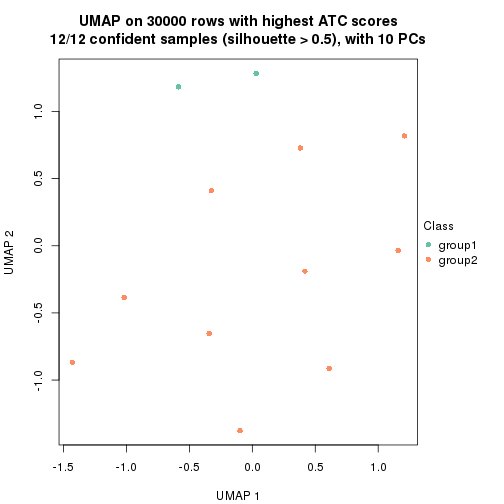</p>

</div>
<div id='tab-node-0141-dimension-reduction-2'>
<pre><code class="r">dimension_reduction(res, k = 3, method = &quot;UMAP&quot;)
</code></pre>

<p>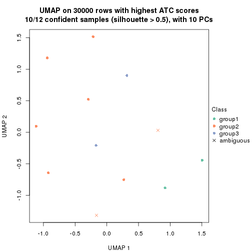</p>

</div>
<div id='tab-node-0141-dimension-reduction-3'>
<pre><code class="r">dimension_reduction(res, k = 4, method = &quot;UMAP&quot;)
</code></pre>

<p>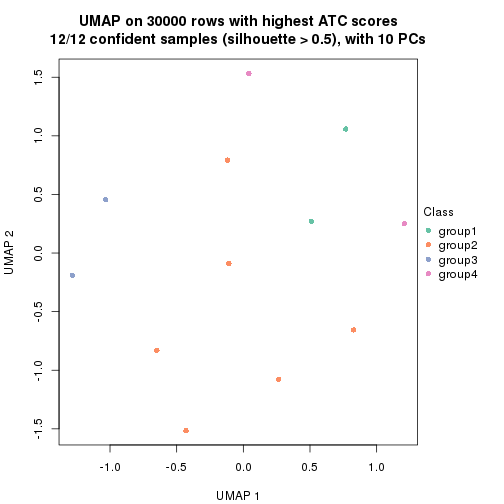</p>

</div>
<div id='tab-node-0141-dimension-reduction-4'>
<pre><code class="r">dimension_reduction(res, k = 5, method = &quot;UMAP&quot;)
</code></pre>

<p>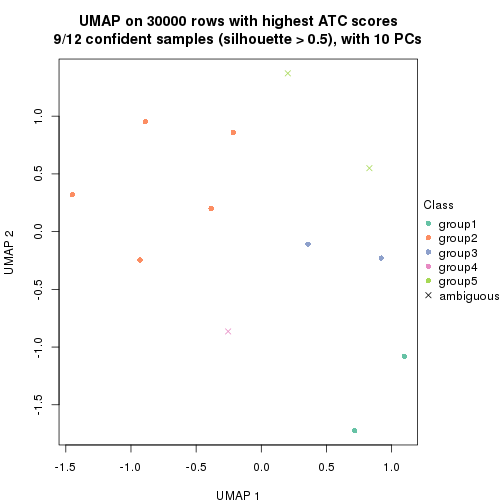</p>

</div>
<div id='tab-node-0141-dimension-reduction-5'>
<pre><code class="r">dimension_reduction(res, k = 6, method = &quot;UMAP&quot;)
</code></pre>

<p>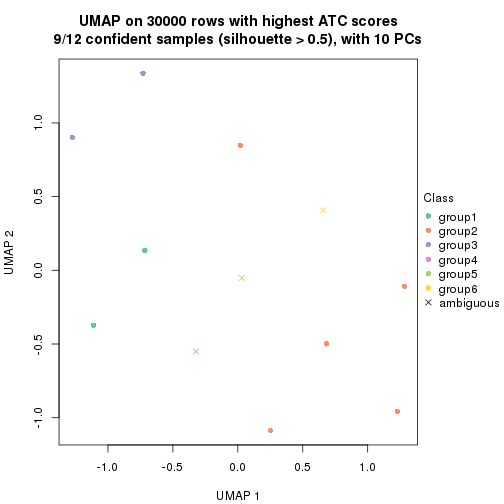</p>

</div>
<div id='tab-node-0141-dimension-reduction-6'>
<pre><code class="r">dimension_reduction(res, k = 7, method = &quot;UMAP&quot;)
</code></pre>

<p>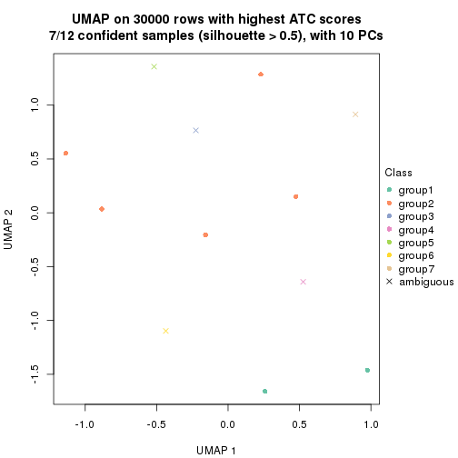</p>

</div>
<div id='tab-node-0141-dimension-reduction-7'>
<pre><code class="r">dimension_reduction(res, k = 8, method = &quot;UMAP&quot;)
</code></pre>

<p>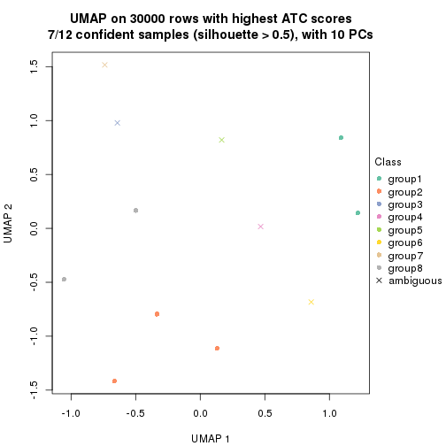</p>

</div>
</div>


Following heatmap shows how subgroups are split when increasing `k`:

```r
collect_classes(res)
```

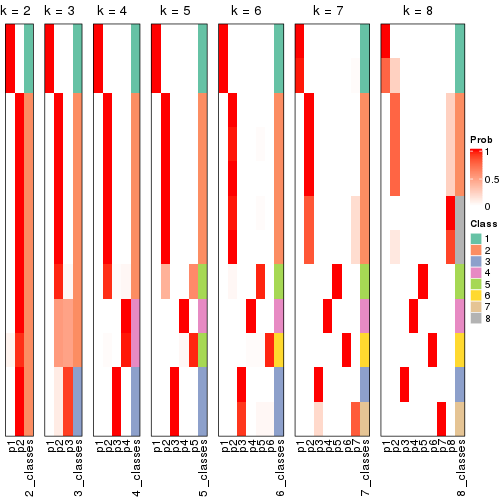


If matrix rows can be associated to genes, consider to use `functional_enrichment(res,
...)` to perform function enrichment for the signature genes. See [this vignette](https://jokergoo.github.io/cola_vignettes/functional_enrichment.html) for more detailed explanations.


 

---------------------------------------------------


### Node02


Parent node: [Node0](#Node0).
Child nodes: 
                [Node011](#Node011)
        ,
                [Node012](#Node012)
        ,
                [Node013](#Node013)
        ,
                [Node014](#Node014)
        ,
                Node021-leaf
        ,
                [Node022](#Node022)
        ,
                [Node023](#Node023)
        ,
                Node031-leaf
        ,
                [Node032](#Node032)
        ,
                Node033-leaf
        ,
                Node034-leaf
        ,
                [Node041](#Node041)
        ,
                [Node042](#Node042)
        ,
                [Node043](#Node043)
        .


The object with results only for a single top-value method and a single partitioning method 
can be extracted as:

```r
res = res_rh["02"]
```

A summary of `res` and all the functions that can be applied to it:

```r
res
```

```
#> A 'ConsensusPartition' object with k = 2, 3, 4, 5, 6, 7, 8.
#>   On a matrix with 30000 rows and 85 columns.
#>   Top rows (1000) are extracted by 'ATC' method.
#>   Subgroups are detected by 'kmeans' method.
#>   Performed in total 350 partitions by row resampling.
#>   Best k for subgroups seems to be 3.
#> 
#> Following methods can be applied to this 'ConsensusPartition' object:
#>  [1] "cola_report"             "collect_classes"         "collect_plots"          
#>  [4] "collect_stats"           "colnames"                "compare_partitions"     
#>  [7] "compare_signatures"      "consensus_heatmap"       "dimension_reduction"    
#> [10] "functional_enrichment"   "get_anno_col"            "get_anno"               
#> [13] "get_classes"             "get_consensus"           "get_matrix"             
#> [16] "get_membership"          "get_param"               "get_signatures"         
#> [19] "get_stats"               "is_best_k"               "is_stable_k"            
#> [22] "membership_heatmap"      "ncol"                    "nrow"                   
#> [25] "plot_ecdf"               "predict_classes"         "rownames"               
#> [28] "select_partition_number" "show"                    "suggest_best_k"         
#> [31] "test_to_known_factors"   "top_rows_heatmap"
```

`collect_plots()` function collects all the plots made from `res` for all `k` (number of subgroups)
into one single page to provide an easy and fast comparison between different `k`.

```r
collect_plots(res)
```

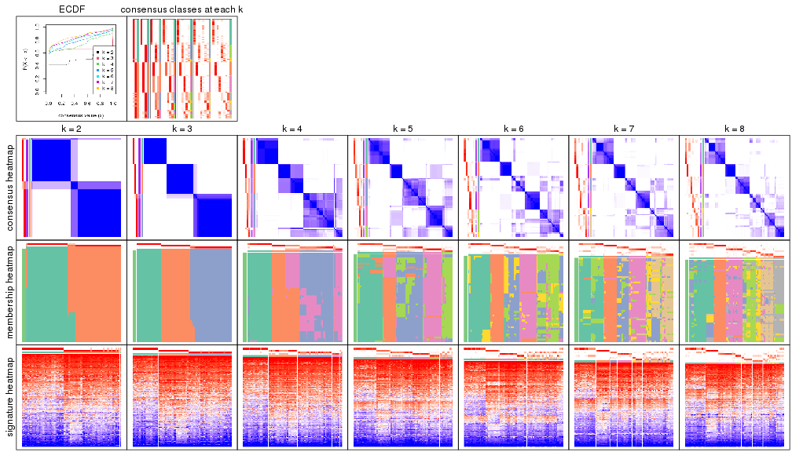

The plots are:

- The first row: a plot of the eCDF (empirical cumulative distribution
  function) curves of the consensus matrix for each `k` and the heatmap of
  predicted classes for each `k`.
- The second row: heatmaps of the consensus matrix for each `k`.
- The third row: heatmaps of the membership matrix for each `k`.
- The fouth row: heatmaps of the signatures for each `k`.

All the plots in panels can be made by individual functions and they are
plotted later in this section.

`select_partition_number()` produces several plots showing different
statistics for choosing "optimized" `k`. There are following statistics:

- eCDF curves of the consensus matrix for each `k`;
- 1-PAC. [The PAC score](https://en.wikipedia.org/wiki/Consensus_clustering#Over-interpretation_potential_of_consensus_clustering)
  measures the proportion of the ambiguous subgrouping.
- Mean silhouette score.
- Concordance. The mean probability of fiting the consensus subgroup labels in all
  partitions.
- Area increased. Denote $A_k$ as the area under the eCDF curve for current
  `k`, the area increased is defined as $A_k - A_{k-1}$.
- Rand index. The percent of pairs of samples that are both in a same cluster
  or both are not in a same cluster in the partition of k and k-1.
- Jaccard index. The ratio of pairs of samples are both in a same cluster in
  the partition of k and k-1 and the pairs of samples are both in a same
  cluster in the partition k or k-1.

The detailed explanations of these statistics can be found in [the _cola_
vignette](https://jokergoo.github.io/cola_vignettes/cola.html#toc_13).

Generally speaking, higher 1-PAC score, higher mean silhouette score or higher
concordance corresponds to better partition. Rand index and Jaccard index
measure how similar the current partition is compared to partition with `k-1`.
If they are too similar, we won't accept `k` is better than `k-1`.

```r
select_partition_number(res)
```

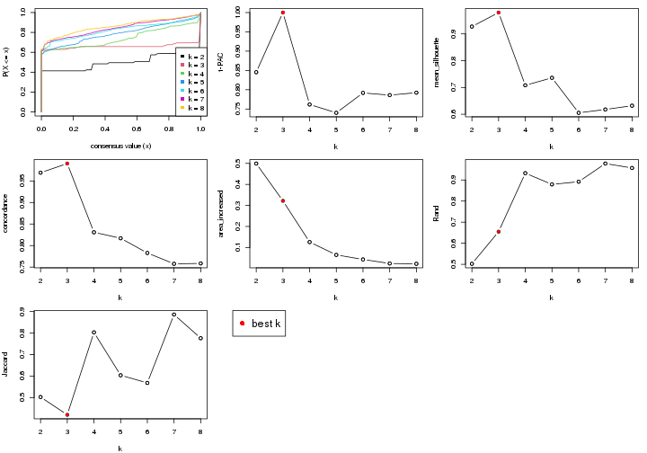

The numeric values for all these statistics can be obtained by `get_stats()`.

```r
get_stats(res)
```

```
#>   k 1-PAC mean_silhouette concordance area_increased  Rand Jaccard
#> 2 2 0.845           0.927       0.969         0.4991 0.503   0.503
#> 3 3 1.000           0.980       0.990         0.3218 0.655   0.420
#> 4 4 0.762           0.708       0.831         0.1257 0.932   0.803
#> 5 5 0.740           0.736       0.817         0.0647 0.879   0.604
#> 6 6 0.792           0.605       0.783         0.0432 0.892   0.568
#> 7 7 0.786           0.618       0.758         0.0240 0.978   0.886
#> 8 8 0.792           0.632       0.759         0.0223 0.957   0.776
```

`suggest_best_k()` suggests the best $k$ based on these statistics. The rules are as follows:

- All $k$ with Jaccard index larger than 0.95 are removed because increasing
  $k$ does not provide enough extra information. If all $k$ are removed, it is
  marked as no subgroup is detected.
- For all $k$ with 1-PAC score larger than 0.9, the maximal $k$ is taken as
  the best $k$, and other $k$ are marked as optional $k$.
- If it does not fit the second rule. The $k$ with the maximal vote of the
  highest 1-PAC score, highest mean silhouette, and highest concordance is
  taken as the best $k$.

```r
suggest_best_k(res)
```

```
#> [1] 3
```


Following is the table of the partitions (You need to click the **show/hide
code output** link to see it). The membership matrix (columns with name `p*`)
is inferred by
[`clue::cl_consensus()`](https://www.rdocumentation.org/link/cl_consensus?package=clue)
function with the `SE` method. Basically the value in the membership matrix
represents the probability to belong to a certain group. The finall subgroup
label for an item is determined with the group with highest probability it
belongs to.

In `get_classes()` function, the entropy is calculated from the membership
matrix and the silhouette score is calculated from the consensus matrix.


<script>
$( function() {
	$( '#tabs-node-02-get-classes' ).tabs();
} );
</script>
<div id='tabs-node-02-get-classes'>
<ul>
<li><a href='#tab-node-02-get-classes-1'>k = 2</a></li>
<li><a href='#tab-node-02-get-classes-2'>k = 3</a></li>
<li><a href='#tab-node-02-get-classes-3'>k = 4</a></li>
<li><a href='#tab-node-02-get-classes-4'>k = 5</a></li>
<li><a href='#tab-node-02-get-classes-5'>k = 6</a></li>
<li><a href='#tab-node-02-get-classes-6'>k = 7</a></li>
<li><a href='#tab-node-02-get-classes-7'>k = 8</a></li>
</ul>

<div id='tab-node-02-get-classes-1'>
<p><a id='tab-node-02-get-classes-1-a' style='color:#0366d6' href='#'>show/hide code output</a></p>
<pre><code class="r">cbind(get_classes(res, k = 2), get_membership(res, k = 2))
</code></pre>

<pre><code>#&gt;                 class entropy silhouette   p1   p2
#&gt; TCGA.D5.6530.01     2   0.000      0.951 0.00 1.00
#&gt; TCGA.CK.4948.01     1   0.000      0.987 1.00 0.00
#&gt; TCGA.CA.5256.01     1   0.000      0.987 1.00 0.00
#&gt; TCGA.T9.A92H.01     1   0.000      0.987 1.00 0.00
#&gt; TCGA.AA.3489.01     2   0.000      0.951 0.00 1.00
#&gt; TCGA.A6.2682.01     1   0.000      0.987 1.00 0.00
#&gt; TCGA.AD.6890.01     2   0.904      0.580 0.32 0.68
#&gt; TCGA.A6.A56B.01     2   0.000      0.951 0.00 1.00
#&gt; TCGA.CM.4748.01     2   0.000      0.951 0.00 1.00
#&gt; TCGA.F4.6808.01     1   0.000      0.987 1.00 0.00
#&gt; TCGA.AA.3662.01     1   0.000      0.987 1.00 0.00
#&gt; TCGA.AA.3655.01     2   0.000      0.951 0.00 1.00
#&gt; TCGA.D5.6926.01     1   0.981      0.182 0.58 0.42
#&gt; TCGA.A6.A5ZU.01     1   0.000      0.987 1.00 0.00
#&gt; TCGA.DM.A28C.01     2   0.000      0.951 0.00 1.00
#&gt; TCGA.AA.3712.01     1   0.000      0.987 1.00 0.00
#&gt; TCGA.CM.6172.01     2   0.000      0.951 0.00 1.00
#&gt; TCGA.5M.AATE.01     1   0.000      0.987 1.00 0.00
#&gt; TCGA.CM.5862.01     1   0.000      0.987 1.00 0.00
#&gt; TCGA.AA.3511.01     1   0.000      0.987 1.00 0.00
#&gt; TCGA.QG.A5YX.01     1   0.000      0.987 1.00 0.00
#&gt; TCGA.D5.6924.01     1   0.000      0.987 1.00 0.00
#&gt; TCGA.QG.A5YV.01     2   0.904      0.580 0.32 0.68
#&gt; TCGA.G4.6314.01     2   0.000      0.951 0.00 1.00
#&gt; TCGA.AZ.4313.01     2   0.000      0.951 0.00 1.00
#&gt; TCGA.CM.6676.01     2   0.855      0.643 0.28 0.72
#&gt; TCGA.NH.A6GC.01     1   0.000      0.987 1.00 0.00
#&gt; TCGA.NH.A50U.01     1   0.000      0.987 1.00 0.00
#&gt; TCGA.F4.6805.01     2   0.000      0.951 0.00 1.00
#&gt; TCGA.AY.5543.01     2   0.904      0.580 0.32 0.68
#&gt; TCGA.CM.6165.01     2   0.000      0.951 0.00 1.00
#&gt; TCGA.A6.2671.01     2   0.000      0.951 0.00 1.00
#&gt; TCGA.AA.3509.01     2   0.000      0.951 0.00 1.00
#&gt; TCGA.D5.6536.01     2   0.000      0.951 0.00 1.00
#&gt; TCGA.D5.6539.01     2   0.000      0.951 0.00 1.00
#&gt; TCGA.D5.6929.01     1   0.000      0.987 1.00 0.00
#&gt; TCGA.AA.3510.01     2   0.000      0.951 0.00 1.00
#&gt; TCGA.CM.6679.01     2   0.000      0.951 0.00 1.00
#&gt; TCGA.A6.5666.01     1   0.000      0.987 1.00 0.00
#&gt; TCGA.CA.5796.01     2   0.000      0.951 0.00 1.00
#&gt; TCGA.CM.6161.01     1   0.000      0.987 1.00 0.00
#&gt; TCGA.DM.A1D7.01     2   0.000      0.951 0.00 1.00
#&gt; TCGA.CM.4746.01     1   0.000      0.987 1.00 0.00
#&gt; TCGA.DM.A1D6.01     2   0.000      0.951 0.00 1.00
#&gt; TCGA.CM.6674.01     2   0.000      0.951 0.00 1.00
#&gt; TCGA.A6.6782.01     2   0.000      0.951 0.00 1.00
#&gt; TCGA.D5.6932.01     2   0.904      0.580 0.32 0.68
#&gt; TCGA.AD.6888.01     1   0.000      0.987 1.00 0.00
#&gt; TCGA.CM.6678.01     2   0.000      0.951 0.00 1.00
#&gt; TCGA.A6.5656.01     1   0.000      0.987 1.00 0.00
#&gt; TCGA.RU.A8FL.01     1   0.000      0.987 1.00 0.00
#&gt; TCGA.D5.6922.01     1   0.000      0.987 1.00 0.00
#&gt; TCGA.AA.3697.01     1   0.000      0.987 1.00 0.00
#&gt; TCGA.D5.6898.01     1   0.000      0.987 1.00 0.00
#&gt; TCGA.A6.2684.01     2   0.000      0.951 0.00 1.00
#&gt; TCGA.CM.6167.01     2   0.000      0.951 0.00 1.00
#&gt; TCGA.AA.3488.01     1   0.000      0.987 1.00 0.00
#&gt; TCGA.CM.6163.01     2   0.000      0.951 0.00 1.00
#&gt; TCGA.G4.6303.01     2   0.904      0.580 0.32 0.68
#&gt; TCGA.G4.6294.01     2   0.000      0.951 0.00 1.00
#&gt; TCGA.CM.4752.01     1   0.000      0.987 1.00 0.00
#&gt; TCGA.AZ.4684.01     1   0.000      0.987 1.00 0.00
#&gt; TCGA.A6.A565.01     2   0.000      0.951 0.00 1.00
#&gt; TCGA.5M.AATA.01     2   0.000      0.951 0.00 1.00
#&gt; TCGA.G4.6311.01     2   0.000      0.951 0.00 1.00
#&gt; TCGA.A6.6137.01     1   0.000      0.987 1.00 0.00
#&gt; TCGA.G4.6625.01     2   0.000      0.951 0.00 1.00
#&gt; TCGA.DM.A28F.01     1   0.000      0.987 1.00 0.00
#&gt; TCGA.A6.6141.01     2   0.000      0.951 0.00 1.00
#&gt; TCGA.D5.6927.01     2   0.000      0.951 0.00 1.00
#&gt; TCGA.F4.6854.01     2   0.000      0.951 0.00 1.00
#&gt; TCGA.G4.6315.01     2   0.000      0.951 0.00 1.00
#&gt; TCGA.A6.6781.01     2   0.000      0.951 0.00 1.00
#&gt; TCGA.DM.A1D9.01     1   0.000      0.987 1.00 0.00
#&gt; TCGA.CK.6748.01     2   0.000      0.951 0.00 1.00
#&gt; TCGA.A6.6652.01     1   0.000      0.987 1.00 0.00
#&gt; TCGA.F4.6459.01     2   0.000      0.951 0.00 1.00
#&gt; TCGA.SS.A7HO.01     1   0.000      0.987 1.00 0.00
#&gt; TCGA.D5.6533.01     1   0.000      0.987 1.00 0.00
#&gt; TCGA.DM.A0XF.01     2   0.000      0.951 0.00 1.00
#&gt; TCGA.AM.5820.01     1   0.000      0.987 1.00 0.00
#&gt; TCGA.5M.AAT6.01     2   0.000      0.951 0.00 1.00
#&gt; TCGA.AZ.6605.01     2   0.000      0.951 0.00 1.00
#&gt; TCGA.NH.A50T.01     1   0.000      0.987 1.00 0.00
#&gt; TCGA.4N.A93T.01     2   0.904      0.580 0.32 0.68
</code></pre>

<script>
$('#tab-node-02-get-classes-1-a').parent().next().next().hide();
$('#tab-node-02-get-classes-1-a').click(function(){
  $('#tab-node-02-get-classes-1-a').parent().next().next().toggle();
  return(false);
});
</script>
</div>

<div id='tab-node-02-get-classes-2'>
<p><a id='tab-node-02-get-classes-2-a' style='color:#0366d6' href='#'>show/hide code output</a></p>
<pre><code class="r">cbind(get_classes(res, k = 3), get_membership(res, k = 3))
</code></pre>

<pre><code>#&gt;                 class entropy silhouette p1   p2   p3
#&gt; TCGA.D5.6530.01     3  0.0892      0.960  0 0.02 0.98
#&gt; TCGA.CK.4948.01     1  0.0000      1.000  1 0.00 0.00
#&gt; TCGA.CA.5256.01     1  0.0000      1.000  1 0.00 0.00
#&gt; TCGA.T9.A92H.01     3  0.0000      0.976  0 0.00 1.00
#&gt; TCGA.AA.3489.01     2  0.0000      1.000  0 1.00 0.00
#&gt; TCGA.A6.2682.01     3  0.0000      0.976  0 0.00 1.00
#&gt; TCGA.AD.6890.01     3  0.0000      0.976  0 0.00 1.00
#&gt; TCGA.A6.A56B.01     3  0.0000      0.976  0 0.00 1.00
#&gt; TCGA.CM.4748.01     3  0.0000      0.976  0 0.00 1.00
#&gt; TCGA.F4.6808.01     1  0.0000      1.000  1 0.00 0.00
#&gt; TCGA.AA.3662.01     1  0.0000      1.000  1 0.00 0.00
#&gt; TCGA.AA.3655.01     3  0.5016      0.711  0 0.24 0.76
#&gt; TCGA.D5.6926.01     3  0.0000      0.976  0 0.00 1.00
#&gt; TCGA.A6.A5ZU.01     1  0.0000      1.000  1 0.00 0.00
#&gt; TCGA.DM.A28C.01     2  0.0000      1.000  0 1.00 0.00
#&gt; TCGA.AA.3712.01     3  0.0000      0.976  0 0.00 1.00
#&gt; TCGA.CM.6172.01     2  0.0000      1.000  0 1.00 0.00
#&gt; TCGA.5M.AATE.01     3  0.0000      0.976  0 0.00 1.00
#&gt; TCGA.CM.5862.01     1  0.0000      1.000  1 0.00 0.00
#&gt; TCGA.AA.3511.01     3  0.0000      0.976  0 0.00 1.00
#&gt; TCGA.QG.A5YX.01     1  0.0000      1.000  1 0.00 0.00
#&gt; TCGA.D5.6924.01     3  0.0000      0.976  0 0.00 1.00
#&gt; TCGA.QG.A5YV.01     3  0.0000      0.976  0 0.00 1.00
#&gt; TCGA.G4.6314.01     3  0.0000      0.976  0 0.00 1.00
#&gt; TCGA.AZ.4313.01     3  0.0000      0.976  0 0.00 1.00
#&gt; TCGA.CM.6676.01     3  0.0000      0.976  0 0.00 1.00
#&gt; TCGA.NH.A6GC.01     3  0.0000      0.976  0 0.00 1.00
#&gt; TCGA.NH.A50U.01     1  0.0000      1.000  1 0.00 0.00
#&gt; TCGA.F4.6805.01     2  0.0000      1.000  0 1.00 0.00
#&gt; TCGA.AY.5543.01     3  0.0000      0.976  0 0.00 1.00
#&gt; TCGA.CM.6165.01     2  0.0000      1.000  0 1.00 0.00
#&gt; TCGA.A6.2671.01     2  0.0000      1.000  0 1.00 0.00
#&gt; TCGA.AA.3509.01     3  0.0000      0.976  0 0.00 1.00
#&gt; TCGA.D5.6536.01     2  0.0000      1.000  0 1.00 0.00
#&gt; TCGA.D5.6539.01     2  0.0000      1.000  0 1.00 0.00
#&gt; TCGA.D5.6929.01     1  0.0000      1.000  1 0.00 0.00
#&gt; TCGA.AA.3510.01     2  0.0000      1.000  0 1.00 0.00
#&gt; TCGA.CM.6679.01     3  0.4002      0.820  0 0.16 0.84
#&gt; TCGA.A6.5666.01     1  0.0000      1.000  1 0.00 0.00
#&gt; TCGA.CA.5796.01     3  0.4796      0.741  0 0.22 0.78
#&gt; TCGA.CM.6161.01     3  0.0000      0.976  0 0.00 1.00
#&gt; TCGA.DM.A1D7.01     2  0.0000      1.000  0 1.00 0.00
#&gt; TCGA.CM.4746.01     3  0.0000      0.976  0 0.00 1.00
#&gt; TCGA.DM.A1D6.01     2  0.0000      1.000  0 1.00 0.00
#&gt; TCGA.CM.6674.01     2  0.0000      1.000  0 1.00 0.00
#&gt; TCGA.A6.6782.01     3  0.0000      0.976  0 0.00 1.00
#&gt; TCGA.D5.6932.01     3  0.0000      0.976  0 0.00 1.00
#&gt; TCGA.AD.6888.01     1  0.0000      1.000  1 0.00 0.00
#&gt; TCGA.CM.6678.01     2  0.0000      1.000  0 1.00 0.00
#&gt; TCGA.A6.5656.01     3  0.0000      0.976  0 0.00 1.00
#&gt; TCGA.RU.A8FL.01     1  0.0000      1.000  1 0.00 0.00
#&gt; TCGA.D5.6922.01     1  0.0000      1.000  1 0.00 0.00
#&gt; TCGA.AA.3697.01     1  0.0000      1.000  1 0.00 0.00
#&gt; TCGA.D5.6898.01     1  0.0000      1.000  1 0.00 0.00
#&gt; TCGA.A6.2684.01     2  0.0000      1.000  0 1.00 0.00
#&gt; TCGA.CM.6167.01     2  0.0000      1.000  0 1.00 0.00
#&gt; TCGA.AA.3488.01     3  0.0000      0.976  0 0.00 1.00
#&gt; TCGA.CM.6163.01     2  0.0000      1.000  0 1.00 0.00
#&gt; TCGA.G4.6303.01     3  0.0000      0.976  0 0.00 1.00
#&gt; TCGA.G4.6294.01     2  0.0000      1.000  0 1.00 0.00
#&gt; TCGA.CM.4752.01     1  0.0000      1.000  1 0.00 0.00
#&gt; TCGA.AZ.4684.01     1  0.0000      1.000  1 0.00 0.00
#&gt; TCGA.A6.A565.01     2  0.0000      1.000  0 1.00 0.00
#&gt; TCGA.5M.AATA.01     3  0.0000      0.976  0 0.00 1.00
#&gt; TCGA.G4.6311.01     3  0.0000      0.976  0 0.00 1.00
#&gt; TCGA.A6.6137.01     3  0.0000      0.976  0 0.00 1.00
#&gt; TCGA.G4.6625.01     2  0.0000      1.000  0 1.00 0.00
#&gt; TCGA.DM.A28F.01     1  0.0000      1.000  1 0.00 0.00
#&gt; TCGA.A6.6141.01     2  0.0000      1.000  0 1.00 0.00
#&gt; TCGA.D5.6927.01     2  0.0000      1.000  0 1.00 0.00
#&gt; TCGA.F4.6854.01     3  0.0000      0.976  0 0.00 1.00
#&gt; TCGA.G4.6315.01     3  0.4291      0.796  0 0.18 0.82
#&gt; TCGA.A6.6781.01     2  0.0000      1.000  0 1.00 0.00
#&gt; TCGA.DM.A1D9.01     1  0.0000      1.000  1 0.00 0.00
#&gt; TCGA.CK.6748.01     2  0.0000      1.000  0 1.00 0.00
#&gt; TCGA.A6.6652.01     3  0.0000      0.976  0 0.00 1.00
#&gt; TCGA.F4.6459.01     2  0.0000      1.000  0 1.00 0.00
#&gt; TCGA.SS.A7HO.01     1  0.0000      1.000  1 0.00 0.00
#&gt; TCGA.D5.6533.01     3  0.0000      0.976  0 0.00 1.00
#&gt; TCGA.DM.A0XF.01     3  0.0000      0.976  0 0.00 1.00
#&gt; TCGA.AM.5820.01     1  0.0000      1.000  1 0.00 0.00
#&gt; TCGA.5M.AAT6.01     2  0.0000      1.000  0 1.00 0.00
#&gt; TCGA.AZ.6605.01     2  0.0000      1.000  0 1.00 0.00
#&gt; TCGA.NH.A50T.01     1  0.0000      1.000  1 0.00 0.00
#&gt; TCGA.4N.A93T.01     3  0.0000      0.976  0 0.00 1.00
</code></pre>

<script>
$('#tab-node-02-get-classes-2-a').parent().next().next().hide();
$('#tab-node-02-get-classes-2-a').click(function(){
  $('#tab-node-02-get-classes-2-a').parent().next().next().toggle();
  return(false);
});
</script>
</div>

<div id='tab-node-02-get-classes-3'>
<p><a id='tab-node-02-get-classes-3-a' style='color:#0366d6' href='#'>show/hide code output</a></p>
<pre><code class="r">cbind(get_classes(res, k = 4), get_membership(res, k = 4))
</code></pre>

<pre><code>#&gt;                 class entropy silhouette   p1   p2   p3   p4
#&gt; TCGA.D5.6530.01     4  0.1211      0.701 0.00 0.00 0.04 0.96
#&gt; TCGA.CK.4948.01     1  0.0000      0.970 1.00 0.00 0.00 0.00
#&gt; TCGA.CA.5256.01     1  0.0000      0.970 1.00 0.00 0.00 0.00
#&gt; TCGA.T9.A92H.01     3  0.3610      0.662 0.00 0.00 0.80 0.20
#&gt; TCGA.AA.3489.01     2  0.0000      0.717 0.00 1.00 0.00 0.00
#&gt; TCGA.A6.2682.01     3  0.3037      0.688 0.02 0.00 0.88 0.10
#&gt; TCGA.AD.6890.01     3  0.4855      0.593 0.00 0.00 0.60 0.40
#&gt; TCGA.A6.A56B.01     3  0.4855      0.593 0.00 0.00 0.60 0.40
#&gt; TCGA.CM.4748.01     3  0.4713      0.581 0.00 0.00 0.64 0.36
#&gt; TCGA.F4.6808.01     1  0.0000      0.970 1.00 0.00 0.00 0.00
#&gt; TCGA.AA.3662.01     1  0.0000      0.970 1.00 0.00 0.00 0.00
#&gt; TCGA.AA.3655.01     4  0.1637      0.691 0.00 0.00 0.06 0.94
#&gt; TCGA.D5.6926.01     3  0.2647      0.709 0.00 0.00 0.88 0.12
#&gt; TCGA.A6.A5ZU.01     1  0.0000      0.970 1.00 0.00 0.00 0.00
#&gt; TCGA.DM.A28C.01     2  0.4855      0.676 0.00 0.60 0.00 0.40
#&gt; TCGA.AA.3712.01     3  0.0000      0.711 0.00 0.00 1.00 0.00
#&gt; TCGA.CM.6172.01     2  0.0000      0.717 0.00 1.00 0.00 0.00
#&gt; TCGA.5M.AATE.01     3  0.3610      0.662 0.00 0.00 0.80 0.20
#&gt; TCGA.CM.5862.01     1  0.0707      0.965 0.98 0.00 0.00 0.02
#&gt; TCGA.AA.3511.01     3  0.0000      0.711 0.00 0.00 1.00 0.00
#&gt; TCGA.QG.A5YX.01     1  0.0707      0.965 0.98 0.00 0.00 0.02
#&gt; TCGA.D5.6924.01     3  0.0000      0.711 0.00 0.00 1.00 0.00
#&gt; TCGA.QG.A5YV.01     3  0.4624      0.624 0.00 0.00 0.66 0.34
#&gt; TCGA.G4.6314.01     4  0.5000     -0.528 0.00 0.00 0.50 0.50
#&gt; TCGA.AZ.4313.01     3  0.4713      0.581 0.00 0.00 0.64 0.36
#&gt; TCGA.CM.6676.01     3  0.4406      0.628 0.00 0.00 0.70 0.30
#&gt; TCGA.NH.A6GC.01     3  0.3801      0.646 0.00 0.00 0.78 0.22
#&gt; TCGA.NH.A50U.01     1  0.0707      0.965 0.98 0.00 0.00 0.02
#&gt; TCGA.F4.6805.01     2  0.0000      0.717 0.00 1.00 0.00 0.00
#&gt; TCGA.AY.5543.01     3  0.4855      0.593 0.00 0.00 0.60 0.40
#&gt; TCGA.CM.6165.01     2  0.4977      0.585 0.00 0.54 0.00 0.46
#&gt; TCGA.A6.2671.01     2  0.4855      0.676 0.00 0.60 0.00 0.40
#&gt; TCGA.AA.3509.01     4  0.2011      0.675 0.00 0.00 0.08 0.92
#&gt; TCGA.D5.6536.01     4  0.4994     -0.548 0.00 0.48 0.00 0.52
#&gt; TCGA.D5.6539.01     2  0.0000      0.717 0.00 1.00 0.00 0.00
#&gt; TCGA.D5.6929.01     1  0.3801      0.748 0.78 0.00 0.22 0.00
#&gt; TCGA.AA.3510.01     2  0.4855      0.676 0.00 0.60 0.00 0.40
#&gt; TCGA.CM.6679.01     4  0.2647      0.664 0.00 0.00 0.12 0.88
#&gt; TCGA.A6.5666.01     1  0.0707      0.965 0.98 0.00 0.00 0.02
#&gt; TCGA.CA.5796.01     4  0.1211      0.699 0.00 0.00 0.04 0.96
#&gt; TCGA.CM.6161.01     3  0.0000      0.711 0.00 0.00 1.00 0.00
#&gt; TCGA.DM.A1D7.01     2  0.4855      0.676 0.00 0.60 0.00 0.40
#&gt; TCGA.CM.4746.01     3  0.2345      0.669 0.00 0.00 0.90 0.10
#&gt; TCGA.DM.A1D6.01     2  0.4855      0.676 0.00 0.60 0.00 0.40
#&gt; TCGA.CM.6674.01     2  0.0000      0.717 0.00 1.00 0.00 0.00
#&gt; TCGA.A6.6782.01     3  0.4855      0.593 0.00 0.00 0.60 0.40
#&gt; TCGA.D5.6932.01     3  0.4977      0.558 0.00 0.00 0.54 0.46
#&gt; TCGA.AD.6888.01     1  0.0000      0.970 1.00 0.00 0.00 0.00
#&gt; TCGA.CM.6678.01     2  0.4855      0.676 0.00 0.60 0.00 0.40
#&gt; TCGA.A6.5656.01     3  0.0000      0.711 0.00 0.00 1.00 0.00
#&gt; TCGA.RU.A8FL.01     1  0.0000      0.970 1.00 0.00 0.00 0.00
#&gt; TCGA.D5.6922.01     1  0.0000      0.970 1.00 0.00 0.00 0.00
#&gt; TCGA.AA.3697.01     1  0.0000      0.970 1.00 0.00 0.00 0.00
#&gt; TCGA.D5.6898.01     1  0.0000      0.970 1.00 0.00 0.00 0.00
#&gt; TCGA.A6.2684.01     2  0.4907      0.654 0.00 0.58 0.00 0.42
#&gt; TCGA.CM.6167.01     2  0.0000      0.717 0.00 1.00 0.00 0.00
#&gt; TCGA.AA.3488.01     3  0.3610      0.662 0.00 0.00 0.80 0.20
#&gt; TCGA.CM.6163.01     2  0.4855      0.676 0.00 0.60 0.00 0.40
#&gt; TCGA.G4.6303.01     3  0.4790      0.607 0.00 0.00 0.62 0.38
#&gt; TCGA.G4.6294.01     2  0.4907      0.649 0.00 0.58 0.00 0.42
#&gt; TCGA.CM.4752.01     1  0.4277      0.666 0.72 0.00 0.28 0.00
#&gt; TCGA.AZ.4684.01     1  0.0000      0.970 1.00 0.00 0.00 0.00
#&gt; TCGA.A6.A565.01     2  0.0000      0.717 0.00 1.00 0.00 0.00
#&gt; TCGA.5M.AATA.01     3  0.4713      0.581 0.00 0.00 0.64 0.36
#&gt; TCGA.G4.6311.01     3  0.4624      0.596 0.00 0.00 0.66 0.34
#&gt; TCGA.A6.6137.01     3  0.0707      0.698 0.02 0.00 0.98 0.00
#&gt; TCGA.G4.6625.01     2  0.0000      0.717 0.00 1.00 0.00 0.00
#&gt; TCGA.DM.A28F.01     1  0.0707      0.965 0.98 0.00 0.00 0.02
#&gt; TCGA.A6.6141.01     2  0.4907      0.654 0.00 0.58 0.00 0.42
#&gt; TCGA.D5.6927.01     2  0.0000      0.717 0.00 1.00 0.00 0.00
#&gt; TCGA.F4.6854.01     3  0.4855      0.593 0.00 0.00 0.60 0.40
#&gt; TCGA.G4.6315.01     4  0.3335      0.665 0.00 0.02 0.12 0.86
#&gt; TCGA.A6.6781.01     2  0.0000      0.717 0.00 1.00 0.00 0.00
#&gt; TCGA.DM.A1D9.01     1  0.0000      0.970 1.00 0.00 0.00 0.00
#&gt; TCGA.CK.6748.01     2  0.4855      0.676 0.00 0.60 0.00 0.40
#&gt; TCGA.A6.6652.01     3  0.2011      0.680 0.00 0.00 0.92 0.08
#&gt; TCGA.F4.6459.01     2  0.4855      0.676 0.00 0.60 0.00 0.40
#&gt; TCGA.SS.A7HO.01     1  0.0707      0.965 0.98 0.00 0.00 0.02
#&gt; TCGA.D5.6533.01     3  0.0000      0.711 0.00 0.00 1.00 0.00
#&gt; TCGA.DM.A0XF.01     3  0.4790      0.549 0.00 0.00 0.62 0.38
#&gt; TCGA.AM.5820.01     1  0.0000      0.970 1.00 0.00 0.00 0.00
#&gt; TCGA.5M.AAT6.01     2  0.2011      0.652 0.00 0.92 0.00 0.08
#&gt; TCGA.AZ.6605.01     2  0.0000      0.717 0.00 1.00 0.00 0.00
#&gt; TCGA.NH.A50T.01     1  0.0707      0.965 0.98 0.00 0.00 0.02
#&gt; TCGA.4N.A93T.01     3  0.4624      0.624 0.00 0.00 0.66 0.34
</code></pre>

<script>
$('#tab-node-02-get-classes-3-a').parent().next().next().hide();
$('#tab-node-02-get-classes-3-a').click(function(){
  $('#tab-node-02-get-classes-3-a').parent().next().next().toggle();
  return(false);
});
</script>
</div>

<div id='tab-node-02-get-classes-4'>
<p><a id='tab-node-02-get-classes-4-a' style='color:#0366d6' href='#'>show/hide code output</a></p>
<pre><code class="r">cbind(get_classes(res, k = 5), get_membership(res, k = 5))
</code></pre>

<pre><code>#&gt;                 class entropy silhouette   p1   p2   p3   p4   p5
#&gt; TCGA.D5.6530.01     5  0.5157     0.0661 0.00 0.00 0.04 0.44 0.52
#&gt; TCGA.CK.4948.01     1  0.3034     0.8486 0.88 0.04 0.02 0.00 0.06
#&gt; TCGA.CA.5256.01     1  0.1410     0.8871 0.94 0.06 0.00 0.00 0.00
#&gt; TCGA.T9.A92H.01     3  0.0609     0.6709 0.00 0.02 0.98 0.00 0.00
#&gt; TCGA.AA.3489.01     2  0.3424     0.9633 0.00 0.76 0.00 0.24 0.00
#&gt; TCGA.A6.2682.01     5  0.5031     0.5103 0.06 0.08 0.10 0.00 0.76
#&gt; TCGA.AD.6890.01     3  0.4060     0.5868 0.00 0.00 0.64 0.00 0.36
#&gt; TCGA.A6.A56B.01     3  0.4060     0.5764 0.00 0.00 0.64 0.00 0.36
#&gt; TCGA.CM.4748.01     5  0.1732     0.7515 0.00 0.00 0.08 0.00 0.92
#&gt; TCGA.F4.6808.01     1  0.1648     0.8812 0.94 0.02 0.00 0.00 0.04
#&gt; TCGA.AA.3662.01     1  0.1648     0.8812 0.94 0.02 0.00 0.00 0.04
#&gt; TCGA.AA.3655.01     4  0.4957     0.6431 0.00 0.04 0.10 0.76 0.10
#&gt; TCGA.D5.6926.01     3  0.5157     0.4924 0.00 0.04 0.52 0.00 0.44
#&gt; TCGA.A6.A5ZU.01     1  0.1648     0.8812 0.94 0.02 0.00 0.00 0.04
#&gt; TCGA.DM.A28C.01     4  0.1216     0.8621 0.00 0.02 0.00 0.96 0.02
#&gt; TCGA.AA.3712.01     3  0.3868     0.6789 0.00 0.06 0.80 0.00 0.14
#&gt; TCGA.CM.6172.01     2  0.3999     0.9476 0.00 0.74 0.00 0.24 0.02
#&gt; TCGA.5M.AATE.01     3  0.0609     0.6731 0.00 0.02 0.98 0.00 0.00
#&gt; TCGA.CM.5862.01     1  0.2873     0.8714 0.86 0.12 0.00 0.00 0.02
#&gt; TCGA.AA.3511.01     3  0.5457     0.3544 0.00 0.06 0.48 0.00 0.46
#&gt; TCGA.QG.A5YX.01     1  0.2873     0.8714 0.86 0.12 0.00 0.00 0.02
#&gt; TCGA.D5.6924.01     3  0.4854     0.6049 0.00 0.06 0.68 0.00 0.26
#&gt; TCGA.QG.A5YV.01     3  0.2249     0.6559 0.00 0.04 0.92 0.02 0.02
#&gt; TCGA.G4.6314.01     5  0.4216     0.6507 0.00 0.00 0.12 0.10 0.78
#&gt; TCGA.AZ.4313.01     5  0.1732     0.7515 0.00 0.00 0.08 0.00 0.92
#&gt; TCGA.CM.6676.01     5  0.2020     0.7231 0.00 0.00 0.10 0.00 0.90
#&gt; TCGA.NH.A6GC.01     3  0.0609     0.6709 0.00 0.02 0.98 0.00 0.00
#&gt; TCGA.NH.A50U.01     1  0.2873     0.8714 0.86 0.12 0.00 0.00 0.02
#&gt; TCGA.F4.6805.01     2  0.3424     0.9633 0.00 0.76 0.00 0.24 0.00
#&gt; TCGA.AY.5543.01     3  0.4060     0.5764 0.00 0.00 0.64 0.00 0.36
#&gt; TCGA.CM.6165.01     4  0.0609     0.8664 0.00 0.02 0.00 0.98 0.00
#&gt; TCGA.A6.2671.01     4  0.0609     0.8795 0.00 0.00 0.00 0.98 0.02
#&gt; TCGA.AA.3509.01     3  0.7066     0.0640 0.00 0.02 0.44 0.32 0.22
#&gt; TCGA.D5.6536.01     4  0.4060     0.4622 0.00 0.00 0.00 0.64 0.36
#&gt; TCGA.D5.6539.01     2  0.3424     0.9633 0.00 0.76 0.00 0.24 0.00
#&gt; TCGA.D5.6929.01     1  0.6263     0.4568 0.58 0.08 0.04 0.00 0.30
#&gt; TCGA.AA.3510.01     4  0.0609     0.8795 0.00 0.00 0.00 0.98 0.02
#&gt; TCGA.CM.6679.01     4  0.4182     0.2224 0.00 0.00 0.00 0.60 0.40
#&gt; TCGA.A6.5666.01     1  0.2873     0.8714 0.86 0.12 0.00 0.00 0.02
#&gt; TCGA.CA.5796.01     4  0.4957     0.6431 0.00 0.04 0.10 0.76 0.10
#&gt; TCGA.CM.6161.01     3  0.4075     0.6753 0.00 0.06 0.78 0.00 0.16
#&gt; TCGA.DM.A1D7.01     4  0.0609     0.8795 0.00 0.00 0.00 0.98 0.02
#&gt; TCGA.CM.4746.01     3  0.4854     0.4888 0.00 0.06 0.68 0.00 0.26
#&gt; TCGA.DM.A1D6.01     4  0.1216     0.8621 0.00 0.02 0.00 0.96 0.02
#&gt; TCGA.CM.6674.01     2  0.3424     0.9633 0.00 0.76 0.00 0.24 0.00
#&gt; TCGA.A6.6782.01     3  0.4182     0.5345 0.00 0.00 0.60 0.00 0.40
#&gt; TCGA.D5.6932.01     3  0.3895     0.5840 0.00 0.00 0.68 0.00 0.32
#&gt; TCGA.AD.6888.01     1  0.1043     0.8848 0.96 0.00 0.00 0.00 0.04
#&gt; TCGA.CM.6678.01     4  0.0609     0.8795 0.00 0.00 0.00 0.98 0.02
#&gt; TCGA.A6.5656.01     3  0.3868     0.6789 0.00 0.06 0.80 0.00 0.14
#&gt; TCGA.RU.A8FL.01     1  0.1410     0.8871 0.94 0.06 0.00 0.00 0.00
#&gt; TCGA.D5.6922.01     1  0.1043     0.8878 0.96 0.04 0.00 0.00 0.00
#&gt; TCGA.AA.3697.01     1  0.1410     0.8871 0.94 0.06 0.00 0.00 0.00
#&gt; TCGA.D5.6898.01     1  0.1648     0.8812 0.94 0.02 0.00 0.00 0.04
#&gt; TCGA.A6.2684.01     4  0.0609     0.8795 0.00 0.00 0.00 0.98 0.02
#&gt; TCGA.CM.6167.01     2  0.3424     0.9633 0.00 0.76 0.00 0.24 0.00
#&gt; TCGA.AA.3488.01     3  0.0609     0.6709 0.00 0.02 0.98 0.00 0.00
#&gt; TCGA.CM.6163.01     4  0.0609     0.8715 0.00 0.02 0.00 0.98 0.00
#&gt; TCGA.G4.6303.01     3  0.3895     0.6144 0.00 0.00 0.68 0.00 0.32
#&gt; TCGA.G4.6294.01     4  0.0609     0.8664 0.00 0.02 0.00 0.98 0.00
#&gt; TCGA.CM.4752.01     1  0.6402     0.3659 0.54 0.08 0.04 0.00 0.34
#&gt; TCGA.AZ.4684.01     1  0.2077     0.8728 0.92 0.04 0.00 0.00 0.04
#&gt; TCGA.A6.A565.01     2  0.3424     0.9633 0.00 0.76 0.00 0.24 0.00
#&gt; TCGA.5M.AATA.01     5  0.1732     0.7515 0.00 0.00 0.08 0.00 0.92
#&gt; TCGA.G4.6311.01     5  0.1732     0.7515 0.00 0.00 0.08 0.00 0.92
#&gt; TCGA.A6.6137.01     3  0.5558     0.4471 0.00 0.08 0.56 0.00 0.36
#&gt; TCGA.G4.6625.01     2  0.3424     0.9633 0.00 0.76 0.00 0.24 0.00
#&gt; TCGA.DM.A28F.01     1  0.2873     0.8714 0.86 0.12 0.00 0.00 0.02
#&gt; TCGA.A6.6141.01     4  0.0609     0.8795 0.00 0.00 0.00 0.98 0.02
#&gt; TCGA.D5.6927.01     2  0.3424     0.9633 0.00 0.76 0.00 0.24 0.00
#&gt; TCGA.F4.6854.01     3  0.4126     0.5482 0.00 0.00 0.62 0.00 0.38
#&gt; TCGA.G4.6315.01     5  0.4182     0.2609 0.00 0.00 0.00 0.40 0.60
#&gt; TCGA.A6.6781.01     2  0.3424     0.9633 0.00 0.76 0.00 0.24 0.00
#&gt; TCGA.DM.A1D9.01     1  0.2077     0.8845 0.92 0.04 0.00 0.00 0.04
#&gt; TCGA.CK.6748.01     4  0.0609     0.8715 0.00 0.02 0.00 0.98 0.00
#&gt; TCGA.A6.6652.01     3  0.2077     0.6811 0.00 0.04 0.92 0.00 0.04
#&gt; TCGA.F4.6459.01     4  0.0609     0.8715 0.00 0.02 0.00 0.98 0.00
#&gt; TCGA.SS.A7HO.01     1  0.2873     0.8714 0.86 0.12 0.00 0.00 0.02
#&gt; TCGA.D5.6533.01     3  0.4854     0.6049 0.00 0.06 0.68 0.00 0.26
#&gt; TCGA.DM.A0XF.01     5  0.2438     0.7417 0.00 0.00 0.06 0.04 0.90
#&gt; TCGA.AM.5820.01     1  0.1648     0.8812 0.94 0.02 0.00 0.00 0.04
#&gt; TCGA.5M.AAT6.01     2  0.6200     0.5446 0.00 0.52 0.00 0.16 0.32
#&gt; TCGA.AZ.6605.01     2  0.3424     0.9633 0.00 0.76 0.00 0.24 0.00
#&gt; TCGA.NH.A50T.01     1  0.2873     0.8714 0.86 0.12 0.00 0.00 0.02
#&gt; TCGA.4N.A93T.01     3  0.2249     0.6559 0.00 0.04 0.92 0.02 0.02
</code></pre>

<script>
$('#tab-node-02-get-classes-4-a').parent().next().next().hide();
$('#tab-node-02-get-classes-4-a').click(function(){
  $('#tab-node-02-get-classes-4-a').parent().next().next().toggle();
  return(false);
});
</script>
</div>

<div id='tab-node-02-get-classes-5'>
<p><a id='tab-node-02-get-classes-5-a' style='color:#0366d6' href='#'>show/hide code output</a></p>
<pre><code class="r">cbind(get_classes(res, k = 6), get_membership(res, k = 6))
</code></pre>

<pre><code>#&gt;                 class entropy silhouette   p1   p2   p3   p4   p5   p6
#&gt; TCGA.D5.6530.01     5  0.4727    0.39002 0.00 0.00 0.00 0.24 0.66 0.10
#&gt; TCGA.CK.4948.01     1  0.5244    0.34565 0.56 0.02 0.36 0.00 0.00 0.06
#&gt; TCGA.CA.5256.01     1  0.1480    0.89161 0.94 0.04 0.00 0.00 0.00 0.02
#&gt; TCGA.T9.A92H.01     3  0.3797   -0.20482 0.00 0.00 0.58 0.00 0.00 0.42
#&gt; TCGA.AA.3489.01     2  0.1267    0.96518 0.00 0.94 0.00 0.06 0.00 0.00
#&gt; TCGA.A6.2682.01     5  0.6130   -0.06059 0.04 0.02 0.44 0.00 0.44 0.06
#&gt; TCGA.AD.6890.01     5  0.5801    0.28359 0.00 0.00 0.26 0.00 0.50 0.24
#&gt; TCGA.A6.A56B.01     5  0.5938    0.22544 0.00 0.00 0.26 0.00 0.46 0.28
#&gt; TCGA.CM.4748.01     5  0.1092    0.53998 0.00 0.00 0.02 0.00 0.96 0.02
#&gt; TCGA.F4.6808.01     1  0.0547    0.89390 0.98 0.00 0.00 0.00 0.00 0.02
#&gt; TCGA.AA.3662.01     1  0.0547    0.89390 0.98 0.00 0.00 0.00 0.00 0.02
#&gt; TCGA.AA.3655.01     4  0.2454    0.84030 0.00 0.00 0.00 0.84 0.00 0.16
#&gt; TCGA.D5.6926.01     5  0.5747    0.28329 0.00 0.00 0.30 0.00 0.50 0.20
#&gt; TCGA.A6.A5ZU.01     1  0.0547    0.89390 0.98 0.00 0.00 0.00 0.00 0.02
#&gt; TCGA.DM.A28C.01     4  0.1556    0.92882 0.00 0.00 0.00 0.92 0.00 0.08
#&gt; TCGA.AA.3712.01     3  0.3315    0.27143 0.00 0.00 0.78 0.00 0.02 0.20
#&gt; TCGA.CM.6172.01     2  0.1807    0.95114 0.00 0.92 0.00 0.06 0.00 0.02
#&gt; TCGA.5M.AATE.01     3  0.3797   -0.17707 0.00 0.00 0.58 0.00 0.00 0.42
#&gt; TCGA.CM.5862.01     1  0.2728    0.87394 0.86 0.04 0.00 0.00 0.00 0.10
#&gt; TCGA.AA.3511.01     3  0.4574    0.29292 0.00 0.02 0.68 0.00 0.26 0.04
#&gt; TCGA.QG.A5YX.01     1  0.2728    0.87394 0.86 0.04 0.00 0.00 0.00 0.10
#&gt; TCGA.D5.6924.01     3  0.3544    0.33018 0.00 0.00 0.80 0.00 0.12 0.08
#&gt; TCGA.QG.A5YV.01     6  0.3578    0.51561 0.00 0.00 0.34 0.00 0.00 0.66
#&gt; TCGA.G4.6314.01     5  0.3007    0.53620 0.00 0.00 0.02 0.08 0.86 0.04
#&gt; TCGA.AZ.4313.01     5  0.3007    0.49864 0.00 0.02 0.08 0.00 0.86 0.04
#&gt; TCGA.CM.6676.01     5  0.1267    0.54290 0.00 0.00 0.06 0.00 0.94 0.00
#&gt; TCGA.NH.A6GC.01     6  0.3756    0.40317 0.00 0.00 0.40 0.00 0.00 0.60
#&gt; TCGA.NH.A50U.01     1  0.2728    0.87394 0.86 0.04 0.00 0.00 0.00 0.10
#&gt; TCGA.F4.6805.01     2  0.1267    0.96518 0.00 0.94 0.00 0.06 0.00 0.00
#&gt; TCGA.AY.5543.01     5  0.5876    0.26013 0.00 0.00 0.26 0.00 0.48 0.26
#&gt; TCGA.CM.6165.01     4  0.0000    0.95730 0.00 0.00 0.00 1.00 0.00 0.00
#&gt; TCGA.A6.2671.01     4  0.0547    0.95442 0.00 0.00 0.00 0.98 0.00 0.02
#&gt; TCGA.AA.3509.01     6  0.6920   -0.20487 0.00 0.00 0.10 0.14 0.36 0.40
#&gt; TCGA.D5.6536.01     5  0.4892   -0.02821 0.00 0.00 0.00 0.44 0.50 0.06
#&gt; TCGA.D5.6539.01     2  0.1267    0.96518 0.00 0.94 0.00 0.06 0.00 0.00
#&gt; TCGA.D5.6929.01     3  0.7013    0.00987 0.38 0.02 0.40 0.00 0.14 0.06
#&gt; TCGA.AA.3510.01     4  0.0000    0.95730 0.00 0.00 0.00 1.00 0.00 0.00
#&gt; TCGA.CM.6679.01     5  0.4993    0.35045 0.00 0.00 0.00 0.36 0.56 0.08
#&gt; TCGA.A6.5666.01     1  0.2728    0.87394 0.86 0.04 0.00 0.00 0.00 0.10
#&gt; TCGA.CA.5796.01     4  0.2260    0.85057 0.00 0.00 0.00 0.86 0.00 0.14
#&gt; TCGA.CM.6161.01     3  0.3315    0.27143 0.00 0.00 0.78 0.00 0.02 0.20
#&gt; TCGA.DM.A1D7.01     4  0.0000    0.95730 0.00 0.00 0.00 1.00 0.00 0.00
#&gt; TCGA.CM.4746.01     3  0.5888   -0.08559 0.00 0.00 0.40 0.00 0.20 0.40
#&gt; TCGA.DM.A1D6.01     4  0.1807    0.92749 0.00 0.00 0.00 0.92 0.02 0.06
#&gt; TCGA.CM.6674.01     2  0.1267    0.96518 0.00 0.94 0.00 0.06 0.00 0.00
#&gt; TCGA.A6.6782.01     5  0.5628    0.32848 0.00 0.00 0.22 0.00 0.54 0.24
#&gt; TCGA.D5.6932.01     5  0.5995    0.18309 0.00 0.00 0.28 0.00 0.44 0.28
#&gt; TCGA.AD.6888.01     1  0.0547    0.89390 0.98 0.00 0.00 0.00 0.00 0.02
#&gt; TCGA.CM.6678.01     4  0.0000    0.95730 0.00 0.00 0.00 1.00 0.00 0.00
#&gt; TCGA.A6.5656.01     3  0.3315    0.27143 0.00 0.00 0.78 0.00 0.02 0.20
#&gt; TCGA.RU.A8FL.01     1  0.0000    0.89650 1.00 0.00 0.00 0.00 0.00 0.00
#&gt; TCGA.D5.6922.01     1  0.0547    0.89614 0.98 0.00 0.00 0.00 0.00 0.02
#&gt; TCGA.AA.3697.01     1  0.0000    0.89650 1.00 0.00 0.00 0.00 0.00 0.00
#&gt; TCGA.D5.6898.01     1  0.0547    0.89390 0.98 0.00 0.00 0.00 0.00 0.02
#&gt; TCGA.A6.2684.01     4  0.0000    0.95730 0.00 0.00 0.00 1.00 0.00 0.00
#&gt; TCGA.CM.6167.01     2  0.1267    0.96518 0.00 0.94 0.00 0.06 0.00 0.00
#&gt; TCGA.AA.3488.01     3  0.3797   -0.17707 0.00 0.00 0.58 0.00 0.00 0.42
#&gt; TCGA.CM.6163.01     4  0.0547    0.95108 0.00 0.00 0.00 0.98 0.00 0.02
#&gt; TCGA.G4.6303.01     5  0.6039    0.14159 0.00 0.00 0.30 0.00 0.42 0.28
#&gt; TCGA.G4.6294.01     4  0.1556    0.92882 0.00 0.00 0.00 0.92 0.00 0.08
#&gt; TCGA.CM.4752.01     3  0.7013    0.00987 0.38 0.02 0.40 0.00 0.14 0.06
#&gt; TCGA.AZ.4684.01     1  0.4067    0.59342 0.70 0.00 0.26 0.00 0.00 0.04
#&gt; TCGA.A6.A565.01     2  0.1267    0.96518 0.00 0.94 0.00 0.06 0.00 0.00
#&gt; TCGA.5M.AATA.01     5  0.0547    0.54428 0.00 0.00 0.02 0.00 0.98 0.00
#&gt; TCGA.G4.6311.01     5  0.2882    0.51097 0.00 0.02 0.10 0.00 0.86 0.02
#&gt; TCGA.A6.6137.01     3  0.4708    0.32130 0.02 0.02 0.72 0.00 0.20 0.04
#&gt; TCGA.G4.6625.01     2  0.1807    0.95293 0.00 0.92 0.00 0.06 0.00 0.02
#&gt; TCGA.DM.A28F.01     1  0.2728    0.87394 0.86 0.04 0.00 0.00 0.00 0.10
#&gt; TCGA.A6.6141.01     4  0.0000    0.95730 0.00 0.00 0.00 1.00 0.00 0.00
#&gt; TCGA.D5.6927.01     2  0.1267    0.96518 0.00 0.94 0.00 0.06 0.00 0.00
#&gt; TCGA.F4.6854.01     5  0.5801    0.28917 0.00 0.00 0.24 0.00 0.50 0.26
#&gt; TCGA.G4.6315.01     5  0.3711    0.44488 0.00 0.00 0.00 0.26 0.72 0.02
#&gt; TCGA.A6.6781.01     2  0.1267    0.96518 0.00 0.94 0.00 0.06 0.00 0.00
#&gt; TCGA.DM.A1D9.01     1  0.1092    0.89170 0.96 0.00 0.02 0.00 0.00 0.02
#&gt; TCGA.CK.6748.01     4  0.0547    0.95442 0.00 0.00 0.00 0.98 0.00 0.02
#&gt; TCGA.A6.6652.01     3  0.3756   -0.13108 0.00 0.00 0.60 0.00 0.00 0.40
#&gt; TCGA.F4.6459.01     4  0.0937    0.95043 0.00 0.00 0.00 0.96 0.00 0.04
#&gt; TCGA.SS.A7HO.01     1  0.2728    0.87394 0.86 0.04 0.00 0.00 0.00 0.10
#&gt; TCGA.D5.6533.01     3  0.2512    0.34977 0.00 0.00 0.88 0.00 0.06 0.06
#&gt; TCGA.DM.A0XF.01     5  0.1092    0.54722 0.00 0.00 0.02 0.02 0.96 0.00
#&gt; TCGA.AM.5820.01     1  0.1092    0.88386 0.96 0.00 0.02 0.00 0.00 0.02
#&gt; TCGA.5M.AAT6.01     2  0.5107    0.56569 0.00 0.62 0.00 0.04 0.30 0.04
#&gt; TCGA.AZ.6605.01     2  0.1267    0.96518 0.00 0.94 0.00 0.06 0.00 0.00
#&gt; TCGA.NH.A50T.01     1  0.2728    0.87394 0.86 0.04 0.00 0.00 0.00 0.10
#&gt; TCGA.4N.A93T.01     6  0.3499    0.50710 0.00 0.00 0.32 0.00 0.00 0.68
</code></pre>

<script>
$('#tab-node-02-get-classes-5-a').parent().next().next().hide();
$('#tab-node-02-get-classes-5-a').click(function(){
  $('#tab-node-02-get-classes-5-a').parent().next().next().toggle();
  return(false);
});
</script>
</div>

<div id='tab-node-02-get-classes-6'>
<p><a id='tab-node-02-get-classes-6-a' style='color:#0366d6' href='#'>show/hide code output</a></p>
<pre><code class="r">cbind(get_classes(res, k = 7), get_membership(res, k = 7))
</code></pre>

<pre><code>#&gt;                 class entropy silhouette   p1   p2   p3   p4   p5   p6   p7
#&gt; TCGA.D5.6530.01     7  0.6284     0.2154 0.00 0.00 0.02 0.24 0.16 0.06 0.52
#&gt; TCGA.CK.4948.01     1  0.4699     0.4829 0.66 0.00 0.24 0.00 0.06 0.00 0.04
#&gt; TCGA.CA.5256.01     1  0.3908     0.7208 0.72 0.00 0.08 0.00 0.20 0.00 0.00
#&gt; TCGA.T9.A92H.01     3  0.3546     0.4107 0.00 0.00 0.54 0.00 0.00 0.46 0.00
#&gt; TCGA.AA.3489.01     2  0.0000     0.9507 0.00 1.00 0.00 0.00 0.00 0.00 0.00
#&gt; TCGA.A6.2682.01     7  0.6044    -0.0886 0.14 0.00 0.38 0.00 0.06 0.00 0.42
#&gt; TCGA.AD.6890.01     7  0.5625     0.4422 0.00 0.00 0.30 0.02 0.00 0.18 0.50
#&gt; TCGA.A6.A56B.01     7  0.5875     0.3888 0.00 0.00 0.30 0.02 0.00 0.24 0.44
#&gt; TCGA.CM.4748.01     7  0.1860     0.4991 0.00 0.00 0.02 0.00 0.04 0.02 0.92
#&gt; TCGA.F4.6808.01     1  0.0504     0.7372 0.98 0.00 0.00 0.00 0.02 0.00 0.00
#&gt; TCGA.AA.3662.01     1  0.0000     0.7438 1.00 0.00 0.00 0.00 0.00 0.00 0.00
#&gt; TCGA.AA.3655.01     4  0.4630     0.4709 0.00 0.00 0.00 0.62 0.12 0.26 0.00
#&gt; TCGA.D5.6926.01     7  0.5635     0.3743 0.00 0.00 0.36 0.02 0.00 0.16 0.46
#&gt; TCGA.A6.A5ZU.01     1  0.0000     0.7438 1.00 0.00 0.00 0.00 0.00 0.00 0.00
#&gt; TCGA.DM.A28C.01     4  0.4335     0.7905 0.00 0.02 0.00 0.72 0.20 0.04 0.02
#&gt; TCGA.AA.3712.01     3  0.2745     0.6743 0.00 0.00 0.82 0.00 0.00 0.16 0.02
#&gt; TCGA.CM.6172.01     2  0.2421     0.8454 0.00 0.88 0.00 0.02 0.08 0.02 0.00
#&gt; TCGA.5M.AATE.01     3  0.3459     0.4966 0.00 0.00 0.60 0.00 0.00 0.40 0.00
#&gt; TCGA.CM.5862.01     1  0.3496     0.6791 0.58 0.00 0.00 0.00 0.42 0.00 0.00
#&gt; TCGA.AA.3511.01     3  0.3745     0.4116 0.00 0.00 0.70 0.00 0.04 0.00 0.26
#&gt; TCGA.QG.A5YX.01     1  0.3496     0.6791 0.58 0.00 0.00 0.00 0.42 0.00 0.00
#&gt; TCGA.D5.6924.01     3  0.2572     0.6298 0.00 0.00 0.86 0.00 0.00 0.06 0.08
#&gt; TCGA.QG.A5YV.01     6  0.1664     0.5579 0.00 0.00 0.06 0.00 0.02 0.92 0.00
#&gt; TCGA.G4.6314.01     7  0.3404     0.5164 0.00 0.00 0.04 0.06 0.00 0.08 0.82
#&gt; TCGA.AZ.4313.01     7  0.1664     0.4840 0.00 0.00 0.00 0.02 0.06 0.00 0.92
#&gt; TCGA.CM.6676.01     7  0.0863     0.5255 0.00 0.00 0.04 0.00 0.00 0.00 0.96
#&gt; TCGA.NH.A6GC.01     6  0.2722     0.5054 0.00 0.00 0.12 0.00 0.04 0.84 0.00
#&gt; TCGA.NH.A50U.01     1  0.3496     0.6791 0.58 0.00 0.00 0.00 0.42 0.00 0.00
#&gt; TCGA.F4.6805.01     2  0.0000     0.9507 0.00 1.00 0.00 0.00 0.00 0.00 0.00
#&gt; TCGA.AY.5543.01     7  0.5625     0.4419 0.00 0.00 0.30 0.02 0.00 0.18 0.50
#&gt; TCGA.CM.6165.01     4  0.0504     0.8577 0.00 0.02 0.00 0.98 0.00 0.00 0.00
#&gt; TCGA.A6.2671.01     4  0.3350     0.8362 0.00 0.02 0.00 0.82 0.12 0.02 0.02
#&gt; TCGA.AA.3509.01     6  0.6585    -0.0479 0.00 0.00 0.02 0.12 0.10 0.46 0.30
#&gt; TCGA.D5.6536.01     7  0.6237    -0.1885 0.00 0.00 0.02 0.38 0.20 0.02 0.38
#&gt; TCGA.D5.6539.01     2  0.0000     0.9507 0.00 1.00 0.00 0.00 0.00 0.00 0.00
#&gt; TCGA.D5.6929.01     1  0.5474     0.3766 0.58 0.00 0.26 0.00 0.06 0.00 0.10
#&gt; TCGA.AA.3510.01     4  0.0504     0.8577 0.00 0.02 0.00 0.98 0.00 0.00 0.00
#&gt; TCGA.CM.6679.01     7  0.4426     0.3418 0.00 0.00 0.00 0.38 0.00 0.06 0.56
#&gt; TCGA.A6.5666.01     1  0.3496     0.6791 0.58 0.00 0.00 0.00 0.42 0.00 0.00
#&gt; TCGA.CA.5796.01     4  0.4451     0.4909 0.00 0.00 0.00 0.64 0.10 0.26 0.00
#&gt; TCGA.CM.6161.01     3  0.2912     0.6724 0.00 0.00 0.82 0.00 0.00 0.14 0.04
#&gt; TCGA.DM.A1D7.01     4  0.0504     0.8577 0.00 0.02 0.00 0.98 0.00 0.00 0.00
#&gt; TCGA.CM.4746.01     6  0.6262     0.1317 0.00 0.00 0.22 0.00 0.10 0.50 0.18
#&gt; TCGA.DM.A1D6.01     4  0.4908     0.7297 0.00 0.02 0.02 0.64 0.28 0.02 0.02
#&gt; TCGA.CM.6674.01     2  0.0000     0.9507 0.00 1.00 0.00 0.00 0.00 0.00 0.00
#&gt; TCGA.A6.6782.01     7  0.5567     0.4553 0.00 0.00 0.28 0.02 0.00 0.18 0.52
#&gt; TCGA.D5.6932.01     7  0.5938     0.3582 0.00 0.00 0.28 0.02 0.00 0.28 0.42
#&gt; TCGA.AD.6888.01     1  0.0000     0.7438 1.00 0.00 0.00 0.00 0.00 0.00 0.00
#&gt; TCGA.CM.6678.01     4  0.1363     0.8589 0.00 0.02 0.00 0.94 0.04 0.00 0.00
#&gt; TCGA.A6.5656.01     3  0.2745     0.6743 0.00 0.00 0.82 0.00 0.00 0.16 0.02
#&gt; TCGA.RU.A8FL.01     1  0.2569     0.7491 0.84 0.00 0.02 0.00 0.14 0.00 0.00
#&gt; TCGA.D5.6922.01     1  0.1886     0.7519 0.88 0.00 0.00 0.00 0.12 0.00 0.00
#&gt; TCGA.AA.3697.01     1  0.2569     0.7491 0.84 0.00 0.02 0.00 0.14 0.00 0.00
#&gt; TCGA.D5.6898.01     1  0.0504     0.7372 0.98 0.00 0.00 0.00 0.02 0.00 0.00
#&gt; TCGA.A6.2684.01     4  0.0504     0.8577 0.00 0.02 0.00 0.98 0.00 0.00 0.00
#&gt; TCGA.CM.6167.01     2  0.0000     0.9507 0.00 1.00 0.00 0.00 0.00 0.00 0.00
#&gt; TCGA.AA.3488.01     3  0.3546     0.4072 0.00 0.00 0.54 0.00 0.00 0.46 0.00
#&gt; TCGA.CM.6163.01     4  0.2159     0.8540 0.00 0.02 0.00 0.90 0.06 0.02 0.00
#&gt; TCGA.G4.6303.01     7  0.5908     0.3701 0.00 0.00 0.32 0.02 0.00 0.24 0.42
#&gt; TCGA.G4.6294.01     4  0.3709     0.8096 0.00 0.02 0.00 0.78 0.16 0.02 0.02
#&gt; TCGA.CM.4752.01     1  0.5717     0.3069 0.54 0.00 0.28 0.00 0.06 0.00 0.12
#&gt; TCGA.AZ.4684.01     1  0.3244     0.5926 0.78 0.00 0.18 0.00 0.04 0.00 0.00
#&gt; TCGA.A6.A565.01     2  0.0000     0.9507 0.00 1.00 0.00 0.00 0.00 0.00 0.00
#&gt; TCGA.5M.AATA.01     7  0.0504     0.5207 0.00 0.00 0.02 0.00 0.00 0.00 0.98
#&gt; TCGA.G4.6311.01     7  0.1363     0.5185 0.00 0.00 0.04 0.00 0.02 0.00 0.94
#&gt; TCGA.A6.6137.01     3  0.3519     0.4398 0.00 0.00 0.74 0.00 0.04 0.00 0.22
#&gt; TCGA.G4.6625.01     2  0.0863     0.9174 0.00 0.96 0.00 0.04 0.00 0.00 0.00
#&gt; TCGA.DM.A28F.01     1  0.3496     0.6791 0.58 0.00 0.00 0.00 0.42 0.00 0.00
#&gt; TCGA.A6.6141.01     4  0.0504     0.8577 0.00 0.02 0.00 0.98 0.00 0.00 0.00
#&gt; TCGA.D5.6927.01     2  0.0000     0.9507 0.00 1.00 0.00 0.00 0.00 0.00 0.00
#&gt; TCGA.F4.6854.01     7  0.5567     0.4553 0.00 0.00 0.28 0.02 0.00 0.18 0.52
#&gt; TCGA.G4.6315.01     7  0.3867     0.3394 0.00 0.00 0.00 0.38 0.00 0.02 0.60
#&gt; TCGA.A6.6781.01     2  0.0000     0.9507 0.00 1.00 0.00 0.00 0.00 0.00 0.00
#&gt; TCGA.DM.A1D9.01     1  0.1433     0.7384 0.92 0.00 0.08 0.00 0.00 0.00 0.00
#&gt; TCGA.CK.6748.01     4  0.3691     0.8278 0.00 0.02 0.00 0.80 0.12 0.04 0.02
#&gt; TCGA.A6.6652.01     3  0.3358     0.5365 0.00 0.00 0.64 0.00 0.00 0.36 0.00
#&gt; TCGA.F4.6459.01     4  0.2159     0.8540 0.00 0.02 0.00 0.90 0.06 0.02 0.00
#&gt; TCGA.SS.A7HO.01     1  0.3496     0.6791 0.58 0.00 0.00 0.00 0.42 0.00 0.00
#&gt; TCGA.D5.6533.01     3  0.1363     0.6379 0.00 0.00 0.94 0.00 0.00 0.04 0.02
#&gt; TCGA.DM.A0XF.01     7  0.1363     0.5233 0.00 0.00 0.02 0.04 0.00 0.00 0.94
#&gt; TCGA.AM.5820.01     1  0.0863     0.7444 0.96 0.00 0.04 0.00 0.00 0.00 0.00
#&gt; TCGA.5M.AAT6.01     2  0.3606     0.5648 0.00 0.68 0.00 0.02 0.00 0.00 0.30
#&gt; TCGA.AZ.6605.01     2  0.0000     0.9507 0.00 1.00 0.00 0.00 0.00 0.00 0.00
#&gt; TCGA.NH.A50T.01     1  0.3496     0.6791 0.58 0.00 0.00 0.00 0.42 0.00 0.00
#&gt; TCGA.4N.A93T.01     6  0.3061     0.5185 0.00 0.00 0.08 0.02 0.06 0.84 0.00
</code></pre>

<script>
$('#tab-node-02-get-classes-6-a').parent().next().next().hide();
$('#tab-node-02-get-classes-6-a').click(function(){
  $('#tab-node-02-get-classes-6-a').parent().next().next().toggle();
  return(false);
});
</script>
</div>

<div id='tab-node-02-get-classes-7'>
<p><a id='tab-node-02-get-classes-7-a' style='color:#0366d6' href='#'>show/hide code output</a></p>
<pre><code class="r">cbind(get_classes(res, k = 8), get_membership(res, k = 8))
</code></pre>

<pre><code>#&gt;                 class entropy silhouette   p1   p2   p3   p4   p5   p6   p7   p8
#&gt; TCGA.D5.6530.01     7  0.5894     0.4647 0.00 0.00 0.06 0.22 0.00 0.10 0.56 0.06
#&gt; TCGA.CK.4948.01     1  0.6162     0.1893 0.50 0.00 0.16 0.00 0.22 0.02 0.10 0.00
#&gt; TCGA.CA.5256.01     1  0.4031     0.6250 0.72 0.00 0.10 0.02 0.16 0.00 0.00 0.00
#&gt; TCGA.T9.A92H.01     5  0.4658     0.0678 0.00 0.00 0.00 0.00 0.50 0.38 0.00 0.12
#&gt; TCGA.AA.3489.01     2  0.0000     0.9807 0.00 1.00 0.00 0.00 0.00 0.00 0.00 0.00
#&gt; TCGA.A6.2682.01     5  0.6755     0.0828 0.06 0.00 0.16 0.00 0.36 0.04 0.36 0.02
#&gt; TCGA.AD.6890.01     8  0.3170     0.8306 0.00 0.00 0.00 0.00 0.20 0.00 0.04 0.76
#&gt; TCGA.A6.A56B.01     8  0.3170     0.8012 0.00 0.00 0.00 0.00 0.20 0.04 0.00 0.76
#&gt; TCGA.CM.4748.01     7  0.3471     0.7270 0.00 0.00 0.02 0.00 0.02 0.02 0.78 0.16
#&gt; TCGA.F4.6808.01     1  0.0471     0.6767 0.98 0.00 0.00 0.00 0.00 0.00 0.02 0.00
#&gt; TCGA.AA.3662.01     1  0.0000     0.6777 1.00 0.00 0.00 0.00 0.00 0.00 0.00 0.00
#&gt; TCGA.AA.3655.01     4  0.5315     0.5292 0.00 0.00 0.10 0.60 0.00 0.14 0.00 0.16
#&gt; TCGA.D5.6926.01     8  0.4191     0.7143 0.00 0.00 0.00 0.00 0.26 0.02 0.06 0.66
#&gt; TCGA.A6.A5ZU.01     1  0.0000     0.6777 1.00 0.00 0.00 0.00 0.00 0.00 0.00 0.00
#&gt; TCGA.DM.A28C.01     4  0.5315     0.7488 0.00 0.04 0.16 0.66 0.00 0.02 0.04 0.08
#&gt; TCGA.AA.3712.01     5  0.1557     0.5573 0.00 0.00 0.00 0.00 0.92 0.02 0.00 0.06
#&gt; TCGA.CM.6172.01     2  0.2807     0.8164 0.00 0.84 0.10 0.00 0.00 0.02 0.04 0.00
#&gt; TCGA.5M.AATE.01     5  0.4216     0.0493 0.00 0.00 0.00 0.00 0.50 0.44 0.00 0.06
#&gt; TCGA.CM.5862.01     1  0.3329     0.5780 0.52 0.00 0.48 0.00 0.00 0.00 0.00 0.00
#&gt; TCGA.AA.3511.01     5  0.5192     0.3685 0.00 0.00 0.12 0.00 0.62 0.04 0.20 0.02
#&gt; TCGA.QG.A5YX.01     1  0.3329     0.5780 0.52 0.00 0.48 0.00 0.00 0.00 0.00 0.00
#&gt; TCGA.D5.6924.01     5  0.2265     0.5476 0.00 0.00 0.00 0.00 0.88 0.02 0.02 0.08
#&gt; TCGA.QG.A5YV.01     6  0.2569     0.6653 0.00 0.00 0.00 0.00 0.02 0.82 0.00 0.16
#&gt; TCGA.G4.6314.01     7  0.4403     0.3501 0.00 0.00 0.00 0.08 0.00 0.00 0.48 0.44
#&gt; TCGA.AZ.4313.01     7  0.2404     0.7289 0.00 0.00 0.02 0.00 0.00 0.00 0.84 0.14
#&gt; TCGA.CM.6676.01     7  0.3928     0.7098 0.00 0.00 0.02 0.00 0.04 0.02 0.74 0.18
#&gt; TCGA.NH.A6GC.01     6  0.2818     0.6085 0.00 0.00 0.00 0.00 0.12 0.82 0.00 0.06
#&gt; TCGA.NH.A50U.01     1  0.3329     0.5780 0.52 0.00 0.48 0.00 0.00 0.00 0.00 0.00
#&gt; TCGA.F4.6805.01     2  0.0000     0.9807 0.00 1.00 0.00 0.00 0.00 0.00 0.00 0.00
#&gt; TCGA.AY.5543.01     8  0.3170     0.8306 0.00 0.00 0.00 0.00 0.20 0.00 0.04 0.76
#&gt; TCGA.CM.6165.01     4  0.0941     0.8416 0.00 0.02 0.00 0.96 0.00 0.00 0.00 0.02
#&gt; TCGA.A6.2671.01     4  0.3714     0.8252 0.00 0.02 0.10 0.80 0.00 0.02 0.04 0.02
#&gt; TCGA.AA.3509.01     8  0.3402     0.5236 0.00 0.00 0.06 0.02 0.04 0.06 0.00 0.82
#&gt; TCGA.D5.6536.01     7  0.3879     0.5216 0.00 0.00 0.02 0.14 0.00 0.10 0.74 0.00
#&gt; TCGA.D5.6539.01     2  0.0000     0.9807 0.00 1.00 0.00 0.00 0.00 0.00 0.00 0.00
#&gt; TCGA.D5.6929.01     1  0.6835    -0.0109 0.38 0.00 0.16 0.00 0.28 0.04 0.14 0.00
#&gt; TCGA.AA.3510.01     4  0.0808     0.8466 0.00 0.04 0.00 0.96 0.00 0.00 0.00 0.00
#&gt; TCGA.CM.6679.01     8  0.4804     0.0662 0.00 0.00 0.00 0.40 0.00 0.00 0.14 0.46
#&gt; TCGA.A6.5666.01     1  0.3329     0.5780 0.52 0.00 0.48 0.00 0.00 0.00 0.00 0.00
#&gt; TCGA.CA.5796.01     4  0.4831     0.5832 0.00 0.00 0.06 0.68 0.00 0.16 0.02 0.08
#&gt; TCGA.CM.6161.01     5  0.2020     0.5526 0.00 0.00 0.00 0.02 0.90 0.02 0.00 0.06
#&gt; TCGA.DM.A1D7.01     4  0.0808     0.8466 0.00 0.04 0.00 0.96 0.00 0.00 0.00 0.00
#&gt; TCGA.CM.4746.01     6  0.5485     0.4639 0.00 0.00 0.06 0.02 0.12 0.64 0.14 0.02
#&gt; TCGA.DM.A1D6.01     4  0.6247     0.6932 0.00 0.04 0.16 0.58 0.00 0.08 0.10 0.04
#&gt; TCGA.CM.6674.01     2  0.0000     0.9807 0.00 1.00 0.00 0.00 0.00 0.00 0.00 0.00
#&gt; TCGA.A6.6782.01     8  0.3170     0.8306 0.00 0.00 0.00 0.00 0.20 0.00 0.04 0.76
#&gt; TCGA.D5.6932.01     8  0.2856     0.8150 0.00 0.00 0.00 0.00 0.20 0.02 0.00 0.78
#&gt; TCGA.AD.6888.01     1  0.0471     0.6808 0.98 0.00 0.02 0.00 0.00 0.00 0.00 0.00
#&gt; TCGA.CM.6678.01     4  0.1275     0.8492 0.00 0.04 0.02 0.94 0.00 0.00 0.00 0.00
#&gt; TCGA.A6.5656.01     5  0.1557     0.5573 0.00 0.00 0.00 0.00 0.92 0.02 0.00 0.06
#&gt; TCGA.RU.A8FL.01     1  0.1563     0.6829 0.90 0.00 0.10 0.00 0.00 0.00 0.00 0.00
#&gt; TCGA.D5.6922.01     1  0.1341     0.6848 0.92 0.00 0.08 0.00 0.00 0.00 0.00 0.00
#&gt; TCGA.AA.3697.01     1  0.1563     0.6829 0.90 0.00 0.10 0.00 0.00 0.00 0.00 0.00
#&gt; TCGA.D5.6898.01     1  0.0471     0.6767 0.98 0.00 0.00 0.00 0.00 0.00 0.02 0.00
#&gt; TCGA.A6.2684.01     4  0.0941     0.8416 0.00 0.02 0.00 0.96 0.00 0.00 0.00 0.02
#&gt; TCGA.CM.6167.01     2  0.0000     0.9807 0.00 1.00 0.00 0.00 0.00 0.00 0.00 0.00
#&gt; TCGA.AA.3488.01     5  0.4407    -0.0294 0.00 0.00 0.00 0.00 0.46 0.46 0.00 0.08
#&gt; TCGA.CM.6163.01     4  0.2204     0.8463 0.00 0.04 0.02 0.90 0.00 0.02 0.02 0.00
#&gt; TCGA.G4.6303.01     8  0.3170     0.8012 0.00 0.00 0.00 0.00 0.20 0.04 0.00 0.76
#&gt; TCGA.G4.6294.01     4  0.4727     0.7406 0.00 0.02 0.20 0.66 0.00 0.00 0.02 0.10
#&gt; TCGA.CM.4752.01     1  0.6922    -0.0482 0.36 0.00 0.16 0.00 0.28 0.04 0.16 0.00
#&gt; TCGA.AZ.4684.01     1  0.4621     0.3773 0.64 0.00 0.14 0.00 0.20 0.00 0.02 0.00
#&gt; TCGA.A6.A565.01     2  0.0000     0.9807 0.00 1.00 0.00 0.00 0.00 0.00 0.00 0.00
#&gt; TCGA.5M.AATA.01     7  0.3021     0.7311 0.00 0.00 0.00 0.00 0.02 0.02 0.80 0.16
#&gt; TCGA.G4.6311.01     7  0.3178     0.7180 0.00 0.00 0.02 0.00 0.04 0.00 0.80 0.14
#&gt; TCGA.A6.6137.01     5  0.4813     0.3646 0.00 0.00 0.16 0.00 0.64 0.04 0.16 0.00
#&gt; TCGA.G4.6625.01     2  0.0471     0.9612 0.00 0.98 0.00 0.02 0.00 0.00 0.00 0.00
#&gt; TCGA.DM.A28F.01     1  0.3318     0.5852 0.54 0.00 0.46 0.00 0.00 0.00 0.00 0.00
#&gt; TCGA.A6.6141.01     4  0.1275     0.8441 0.00 0.04 0.00 0.94 0.00 0.00 0.02 0.00
#&gt; TCGA.D5.6927.01     2  0.0000     0.9807 0.00 1.00 0.00 0.00 0.00 0.00 0.00 0.00
#&gt; TCGA.F4.6854.01     8  0.3170     0.8306 0.00 0.00 0.00 0.00 0.20 0.00 0.04 0.76
#&gt; TCGA.G4.6315.01     7  0.5063     0.4786 0.00 0.00 0.00 0.26 0.00 0.00 0.48 0.26
#&gt; TCGA.A6.6781.01     2  0.0000     0.9807 0.00 1.00 0.00 0.00 0.00 0.00 0.00 0.00
#&gt; TCGA.DM.A1D9.01     1  0.2680     0.6456 0.84 0.00 0.02 0.02 0.12 0.00 0.00 0.00
#&gt; TCGA.CK.6748.01     4  0.3580     0.8246 0.00 0.04 0.10 0.80 0.00 0.02 0.04 0.00
#&gt; TCGA.A6.6652.01     5  0.3971     0.1175 0.00 0.00 0.00 0.00 0.54 0.42 0.00 0.04
#&gt; TCGA.F4.6459.01     4  0.3131     0.8340 0.00 0.04 0.06 0.84 0.00 0.02 0.04 0.00
#&gt; TCGA.SS.A7HO.01     1  0.3329     0.5780 0.52 0.00 0.48 0.00 0.00 0.00 0.00 0.00
#&gt; TCGA.D5.6533.01     5  0.0941     0.5484 0.00 0.00 0.00 0.02 0.96 0.00 0.00 0.02
#&gt; TCGA.DM.A0XF.01     7  0.3095     0.6951 0.00 0.00 0.00 0.02 0.00 0.00 0.74 0.24
#&gt; TCGA.AM.5820.01     1  0.2224     0.6380 0.86 0.00 0.00 0.02 0.12 0.00 0.00 0.00
#&gt; TCGA.5M.AAT6.01     7  0.3193     0.3671 0.00 0.38 0.00 0.00 0.00 0.00 0.62 0.00
#&gt; TCGA.AZ.6605.01     2  0.0000     0.9807 0.00 1.00 0.00 0.00 0.00 0.00 0.00 0.00
#&gt; TCGA.NH.A50T.01     1  0.3329     0.5780 0.52 0.00 0.48 0.00 0.00 0.00 0.00 0.00
#&gt; TCGA.4N.A93T.01     6  0.4383     0.4503 0.00 0.00 0.02 0.00 0.04 0.52 0.00 0.42
</code></pre>

<script>
$('#tab-node-02-get-classes-7-a').parent().next().next().hide();
$('#tab-node-02-get-classes-7-a').click(function(){
  $('#tab-node-02-get-classes-7-a').parent().next().next().toggle();
  return(false);
});
</script>
</div>
</div>

Heatmaps for the consensus matrix. It visualizes the probability of two
samples to be in a same group.


<script>
$( function() {
	$( '#tabs-node-02-consensus-heatmap' ).tabs();
} );
</script>
<div id='tabs-node-02-consensus-heatmap'>
<ul>
<li><a href='#tab-node-02-consensus-heatmap-1'>k = 2</a></li>
<li><a href='#tab-node-02-consensus-heatmap-2'>k = 3</a></li>
<li><a href='#tab-node-02-consensus-heatmap-3'>k = 4</a></li>
<li><a href='#tab-node-02-consensus-heatmap-4'>k = 5</a></li>
<li><a href='#tab-node-02-consensus-heatmap-5'>k = 6</a></li>
<li><a href='#tab-node-02-consensus-heatmap-6'>k = 7</a></li>
<li><a href='#tab-node-02-consensus-heatmap-7'>k = 8</a></li>
</ul>
<div id='tab-node-02-consensus-heatmap-1'>
<pre><code class="r">consensus_heatmap(res, k = 2)
</code></pre>

<p>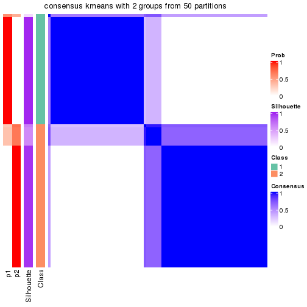</p>

</div>
<div id='tab-node-02-consensus-heatmap-2'>
<pre><code class="r">consensus_heatmap(res, k = 3)
</code></pre>

<p>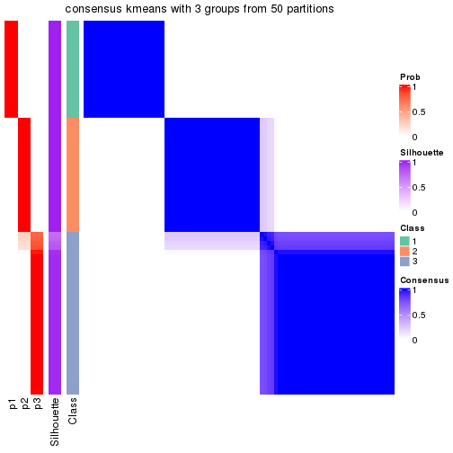</p>

</div>
<div id='tab-node-02-consensus-heatmap-3'>
<pre><code class="r">consensus_heatmap(res, k = 4)
</code></pre>

<p>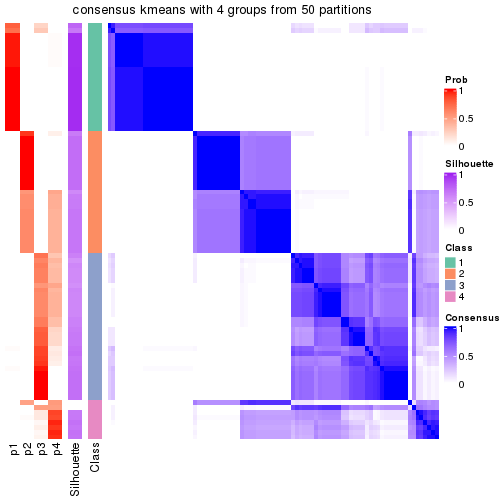</p>

</div>
<div id='tab-node-02-consensus-heatmap-4'>
<pre><code class="r">consensus_heatmap(res, k = 5)
</code></pre>

<p>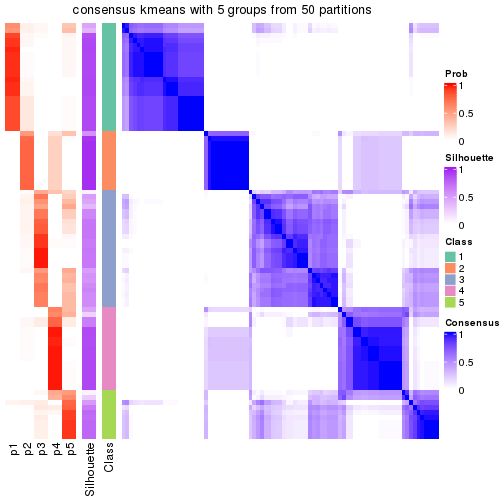</p>

</div>
<div id='tab-node-02-consensus-heatmap-5'>
<pre><code class="r">consensus_heatmap(res, k = 6)
</code></pre>

<p>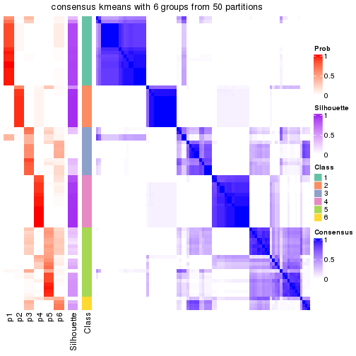</p>

</div>
<div id='tab-node-02-consensus-heatmap-6'>
<pre><code class="r">consensus_heatmap(res, k = 7)
</code></pre>

<p>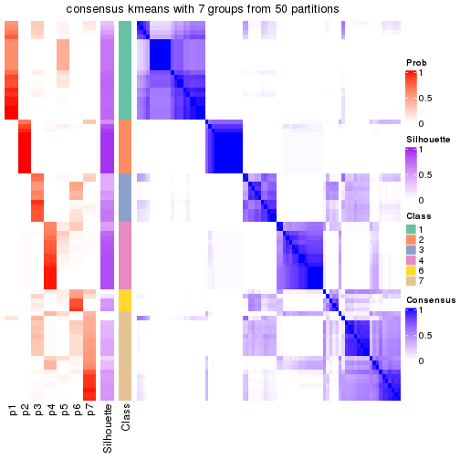</p>

</div>
<div id='tab-node-02-consensus-heatmap-7'>
<pre><code class="r">consensus_heatmap(res, k = 8)
</code></pre>

<p>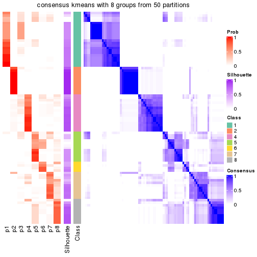</p>

</div>
</div>

Heatmaps for the membership of samples in all partitions to see how consistent they are:


<script>
$( function() {
	$( '#tabs-node-02-membership-heatmap' ).tabs();
} );
</script>
<div id='tabs-node-02-membership-heatmap'>
<ul>
<li><a href='#tab-node-02-membership-heatmap-1'>k = 2</a></li>
<li><a href='#tab-node-02-membership-heatmap-2'>k = 3</a></li>
<li><a href='#tab-node-02-membership-heatmap-3'>k = 4</a></li>
<li><a href='#tab-node-02-membership-heatmap-4'>k = 5</a></li>
<li><a href='#tab-node-02-membership-heatmap-5'>k = 6</a></li>
<li><a href='#tab-node-02-membership-heatmap-6'>k = 7</a></li>
<li><a href='#tab-node-02-membership-heatmap-7'>k = 8</a></li>
</ul>
<div id='tab-node-02-membership-heatmap-1'>
<pre><code class="r">membership_heatmap(res, k = 2)
</code></pre>

<p>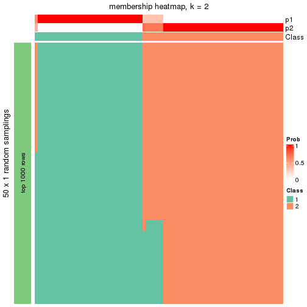</p>

</div>
<div id='tab-node-02-membership-heatmap-2'>
<pre><code class="r">membership_heatmap(res, k = 3)
</code></pre>

<p>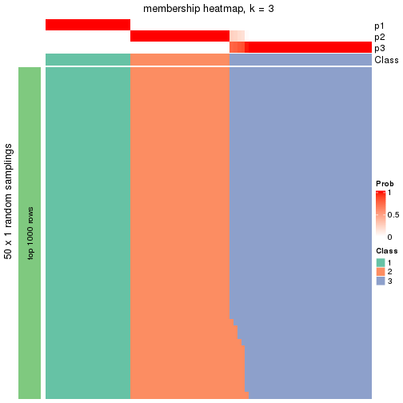</p>

</div>
<div id='tab-node-02-membership-heatmap-3'>
<pre><code class="r">membership_heatmap(res, k = 4)
</code></pre>

<p>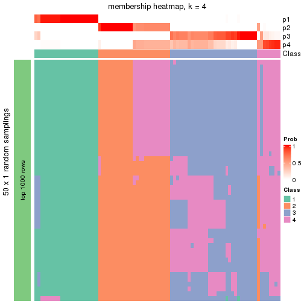</p>

</div>
<div id='tab-node-02-membership-heatmap-4'>
<pre><code class="r">membership_heatmap(res, k = 5)
</code></pre>

<p>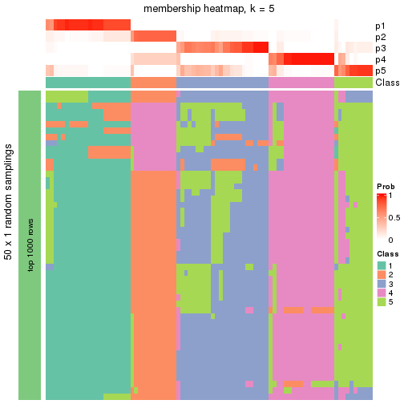</p>

</div>
<div id='tab-node-02-membership-heatmap-5'>
<pre><code class="r">membership_heatmap(res, k = 6)
</code></pre>

<p>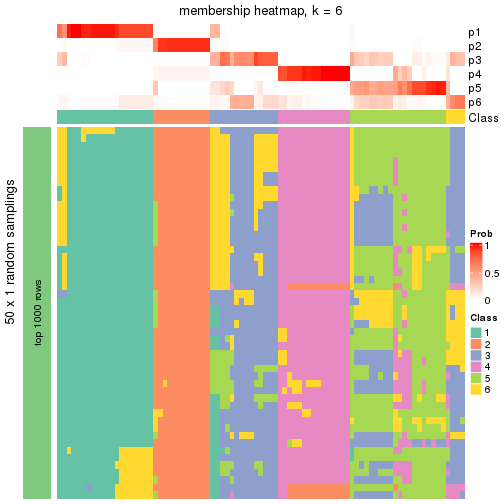</p>

</div>
<div id='tab-node-02-membership-heatmap-6'>
<pre><code class="r">membership_heatmap(res, k = 7)
</code></pre>

<p>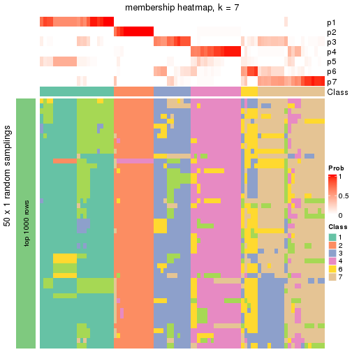</p>

</div>
<div id='tab-node-02-membership-heatmap-7'>
<pre><code class="r">membership_heatmap(res, k = 8)
</code></pre>

<p>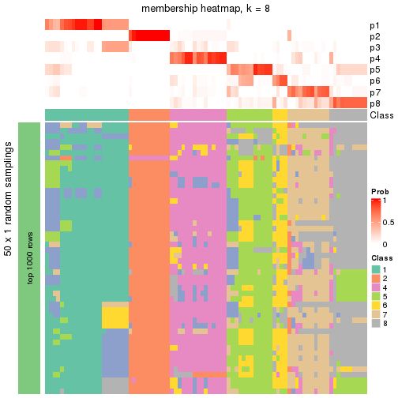</p>

</div>
</div>

As soon as the classes for columns are determined, the signatures
that are significantly different between subgroups can be looked for. 
Following are the heatmaps for signatures.


<script>
$( function() {
	$( '#tabs-node-02-get-signatures' ).tabs();
} );
</script>
<div id='tabs-node-02-get-signatures'>
<ul>
<li><a href='#tab-node-02-get-signatures-1'>k = 2</a></li>
<li><a href='#tab-node-02-get-signatures-2'>k = 3</a></li>
<li><a href='#tab-node-02-get-signatures-3'>k = 4</a></li>
<li><a href='#tab-node-02-get-signatures-4'>k = 5</a></li>
<li><a href='#tab-node-02-get-signatures-5'>k = 6</a></li>
<li><a href='#tab-node-02-get-signatures-6'>k = 7</a></li>
<li><a href='#tab-node-02-get-signatures-7'>k = 8</a></li>
</ul>
<div id='tab-node-02-get-signatures-1'>
<pre><code class="r">get_signatures(res, k = 2)
</code></pre>

<p>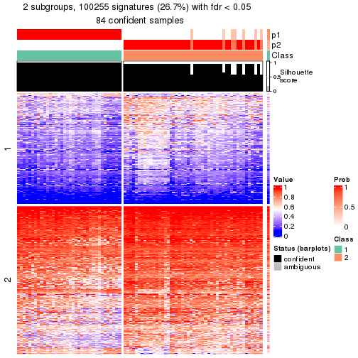</p>

</div>
<div id='tab-node-02-get-signatures-2'>
<pre><code class="r">get_signatures(res, k = 3)
</code></pre>

<p>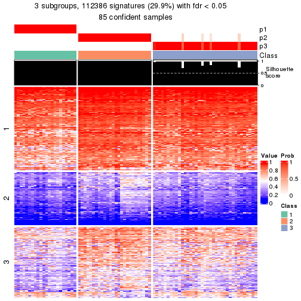</p>

</div>
<div id='tab-node-02-get-signatures-3'>
<pre><code class="r">get_signatures(res, k = 4)
</code></pre>

<p>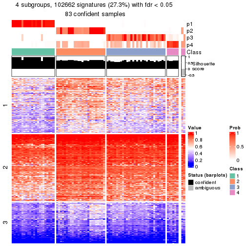</p>

</div>
<div id='tab-node-02-get-signatures-4'>
<pre><code class="r">get_signatures(res, k = 5)
</code></pre>

<p>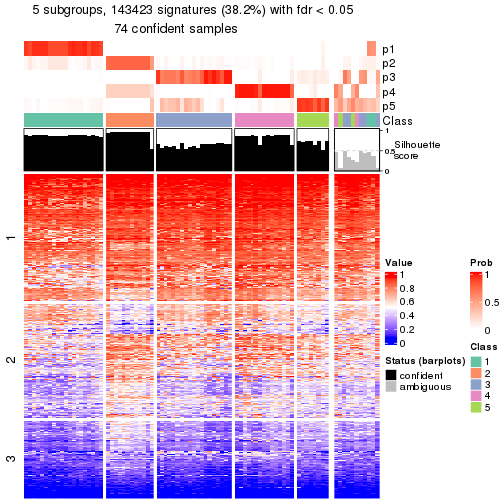</p>

</div>
<div id='tab-node-02-get-signatures-5'>
<pre><code class="r">get_signatures(res, k = 6)
</code></pre>

<p>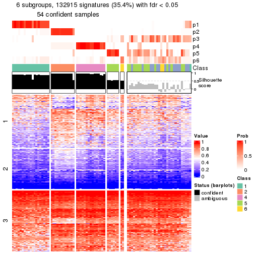</p>

</div>
<div id='tab-node-02-get-signatures-6'>
<pre><code class="r">get_signatures(res, k = 7)
</code></pre>

<p>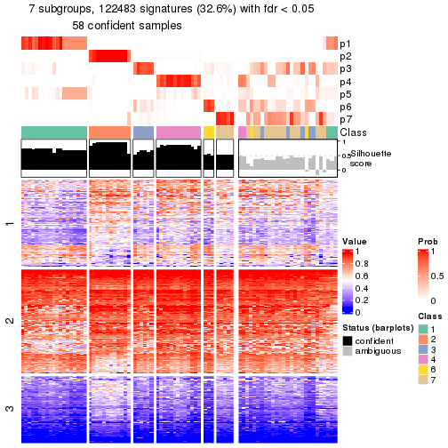</p>

</div>
<div id='tab-node-02-get-signatures-7'>
<pre><code class="r">get_signatures(res, k = 8)
</code></pre>

<p>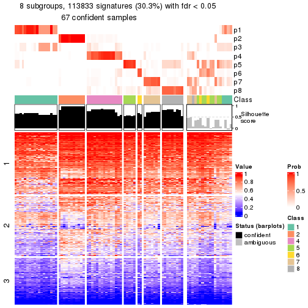</p>

</div>
</div>


Compare the overlap of signatures from different k:

```r
compare_signatures(res)
```

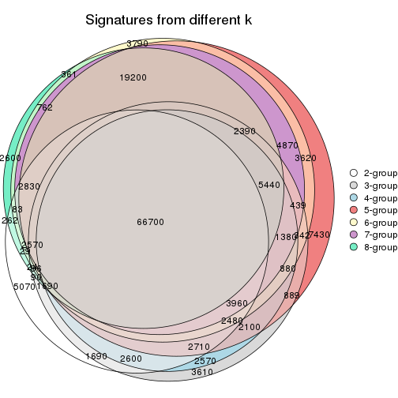

`get_signature()` returns a data frame invisibly. To get the list of signatures, the function
call should be assigned to a variable explicitly. In following code, if `plot` argument is set
to `FALSE`, no heatmap is plotted while only the differential analysis is performed.

```r
# code only for demonstration
tb = get_signature(res, k = ..., plot = FALSE)
```

An example of the output of `tb` is:

```
#>   which_row         fdr    mean_1    mean_2 scaled_mean_1 scaled_mean_2 km
#> 1        38 0.042760348  8.373488  9.131774    -0.5533452     0.5164555  1
#> 2        40 0.018707592  7.106213  8.469186    -0.6173731     0.5762149  1
#> 3        55 0.019134737 10.221463 11.207825    -0.6159697     0.5749050  1
#> 4        59 0.006059896  5.921854  7.869574    -0.6899429     0.6439467  1
#> 5        60 0.018055526  8.928898 10.211722    -0.6204761     0.5791110  1
#> 6        98 0.009384629 15.714769 14.887706     0.6635654    -0.6193277  2
...
```

The columns in `tb` are:

1. `which_row`: row indices corresponding to the input matrix.
2. `fdr`: FDR for the differential test. 
3. `mean_x`: The mean value in group x.
4. `scaled_mean_x`: The mean value in group x after rows are scaled.
5. `km`: Row groups if k-means clustering is applied to rows (which is done by automatically selecting number of clusters).

If there are too many signatures, `top_signatures = ...` can be set to only show the 
signatures with the highest FDRs:

```r
# code only for demonstration
# e.g. to show the top 500 most significant rows
tb = get_signature(res, k = ..., top_signatures = 500)
```

If the signatures are defined as these which are uniquely high in current group, `diff_method` argument
can be set to `"uniquely_high_in_one_group"`:

```r
# code only for demonstration
tb = get_signature(res, k = ..., diff_method = "uniquely_high_in_one_group")
```


UMAP plot which shows how samples are separated.


<script>
$( function() {
	$( '#tabs-node-02-dimension-reduction' ).tabs();
} );
</script>
<div id='tabs-node-02-dimension-reduction'>
<ul>
<li><a href='#tab-node-02-dimension-reduction-1'>k = 2</a></li>
<li><a href='#tab-node-02-dimension-reduction-2'>k = 3</a></li>
<li><a href='#tab-node-02-dimension-reduction-3'>k = 4</a></li>
<li><a href='#tab-node-02-dimension-reduction-4'>k = 5</a></li>
<li><a href='#tab-node-02-dimension-reduction-5'>k = 6</a></li>
<li><a href='#tab-node-02-dimension-reduction-6'>k = 7</a></li>
<li><a href='#tab-node-02-dimension-reduction-7'>k = 8</a></li>
</ul>
<div id='tab-node-02-dimension-reduction-1'>
<pre><code class="r">dimension_reduction(res, k = 2, method = &quot;UMAP&quot;)
</code></pre>

<p>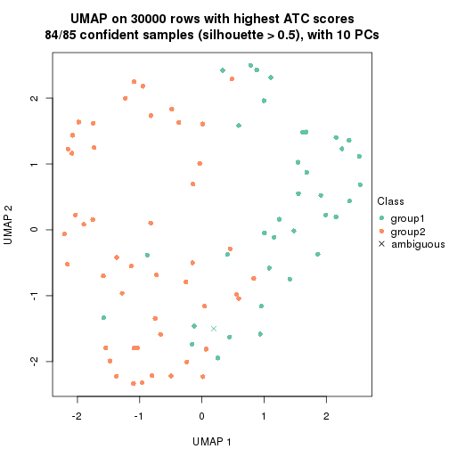</p>

</div>
<div id='tab-node-02-dimension-reduction-2'>
<pre><code class="r">dimension_reduction(res, k = 3, method = &quot;UMAP&quot;)
</code></pre>

<p>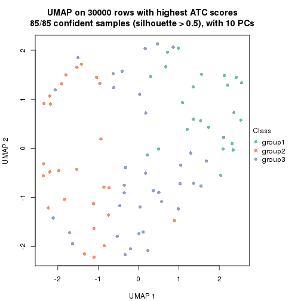</p>

</div>
<div id='tab-node-02-dimension-reduction-3'>
<pre><code class="r">dimension_reduction(res, k = 4, method = &quot;UMAP&quot;)
</code></pre>

<p>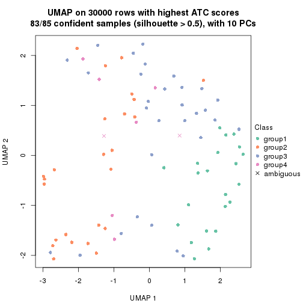</p>

</div>
<div id='tab-node-02-dimension-reduction-4'>
<pre><code class="r">dimension_reduction(res, k = 5, method = &quot;UMAP&quot;)
</code></pre>

<p>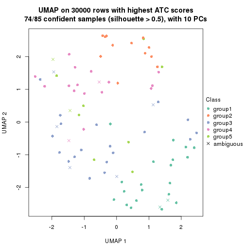</p>

</div>
<div id='tab-node-02-dimension-reduction-5'>
<pre><code class="r">dimension_reduction(res, k = 6, method = &quot;UMAP&quot;)
</code></pre>

<p>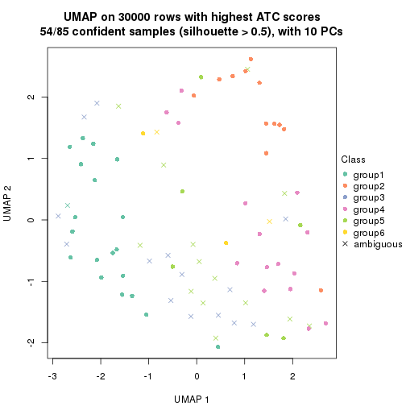</p>

</div>
<div id='tab-node-02-dimension-reduction-6'>
<pre><code class="r">dimension_reduction(res, k = 7, method = &quot;UMAP&quot;)
</code></pre>

<p>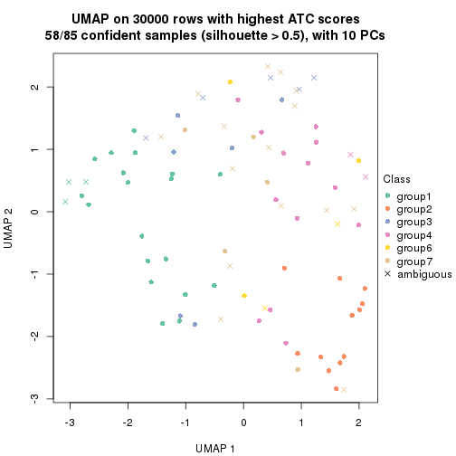</p>

</div>
<div id='tab-node-02-dimension-reduction-7'>
<pre><code class="r">dimension_reduction(res, k = 8, method = &quot;UMAP&quot;)
</code></pre>

<p>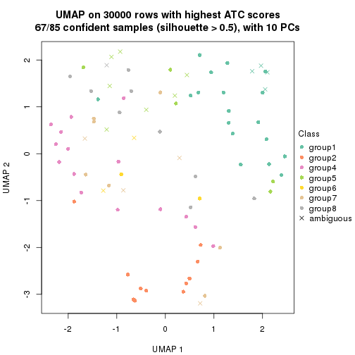</p>

</div>
</div>


Following heatmap shows how subgroups are split when increasing `k`:

```r
collect_classes(res)
```

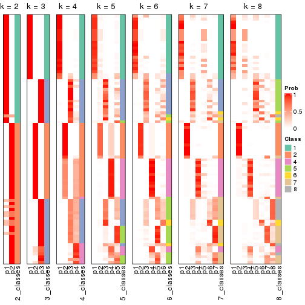


If matrix rows can be associated to genes, consider to use `functional_enrichment(res,
...)` to perform function enrichment for the signature genes. See [this vignette](https://jokergoo.github.io/cola_vignettes/functional_enrichment.html) for more detailed explanations.


 

---------------------------------------------------


### Node022


Parent node: [Node02](#Node02).
Child nodes: 
                [Node0111](#Node0111)
        ,
                [Node0112](#Node0112)
        ,
                [Node0113](#Node0113)
        ,
                [Node0121](#Node0121)
        ,
                Node0122-leaf
        ,
                Node0123-leaf
        ,
                Node0131-leaf
        ,
                Node0132-leaf
        ,
                Node0133-leaf
        ,
                Node0134-leaf
        ,
                [Node0141](#Node0141)
        ,
                Node0142-leaf
        ,
                Node0143-leaf
        ,
                Node0221-leaf
        ,
                Node0222-leaf
        ,
                Node0223-leaf
        ,
                Node0224-leaf
        ,
                [Node0231](#Node0231)
        ,
                Node0232-leaf
        ,
                Node0233-leaf
        ,
                Node0321-leaf
        ,
                Node0322-leaf
        ,
                Node0411-leaf
        ,
                Node0412-leaf
        ,
                Node0421-leaf
        ,
                Node0422-leaf
        ,
                Node0431-leaf
        ,
                Node0432-leaf
        ,
                Node0433-leaf
        ,
                Node0434-leaf
        .


The object with results only for a single top-value method and a single partitioning method 
can be extracted as:

```r
res = res_rh["022"]
```

A summary of `res` and all the functions that can be applied to it:

```r
res
```

```
#> A 'ConsensusPartition' object with k = 2, 3, 4, 5, 6, 7, 8.
#>   On a matrix with 30000 rows and 26 columns.
#>   Top rows (1000) are extracted by 'ATC' method.
#>   Subgroups are detected by 'skmeans' method.
#>   Performed in total 350 partitions by row resampling.
#>   Best k for subgroups seems to be 5.
#> 
#> Following methods can be applied to this 'ConsensusPartition' object:
#>  [1] "cola_report"             "collect_classes"         "collect_plots"          
#>  [4] "collect_stats"           "colnames"                "compare_partitions"     
#>  [7] "compare_signatures"      "consensus_heatmap"       "dimension_reduction"    
#> [10] "functional_enrichment"   "get_anno_col"            "get_anno"               
#> [13] "get_classes"             "get_consensus"           "get_matrix"             
#> [16] "get_membership"          "get_param"               "get_signatures"         
#> [19] "get_stats"               "is_best_k"               "is_stable_k"            
#> [22] "membership_heatmap"      "ncol"                    "nrow"                   
#> [25] "plot_ecdf"               "predict_classes"         "rownames"               
#> [28] "select_partition_number" "show"                    "suggest_best_k"         
#> [31] "test_to_known_factors"   "top_rows_heatmap"
```

`collect_plots()` function collects all the plots made from `res` for all `k` (number of subgroups)
into one single page to provide an easy and fast comparison between different `k`.

```r
collect_plots(res)
```

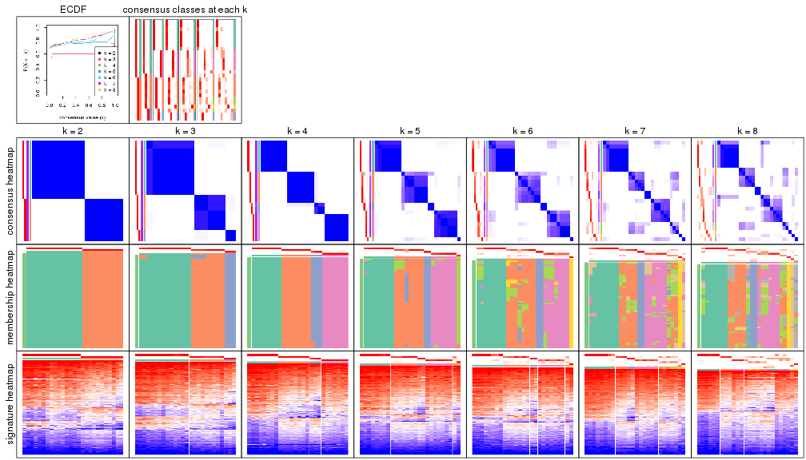

The plots are:

- The first row: a plot of the eCDF (empirical cumulative distribution
  function) curves of the consensus matrix for each `k` and the heatmap of
  predicted classes for each `k`.
- The second row: heatmaps of the consensus matrix for each `k`.
- The third row: heatmaps of the membership matrix for each `k`.
- The fouth row: heatmaps of the signatures for each `k`.

All the plots in panels can be made by individual functions and they are
plotted later in this section.

`select_partition_number()` produces several plots showing different
statistics for choosing "optimized" `k`. There are following statistics:

- eCDF curves of the consensus matrix for each `k`;
- 1-PAC. [The PAC score](https://en.wikipedia.org/wiki/Consensus_clustering#Over-interpretation_potential_of_consensus_clustering)
  measures the proportion of the ambiguous subgrouping.
- Mean silhouette score.
- Concordance. The mean probability of fiting the consensus subgroup labels in all
  partitions.
- Area increased. Denote $A_k$ as the area under the eCDF curve for current
  `k`, the area increased is defined as $A_k - A_{k-1}$.
- Rand index. The percent of pairs of samples that are both in a same cluster
  or both are not in a same cluster in the partition of k and k-1.
- Jaccard index. The ratio of pairs of samples are both in a same cluster in
  the partition of k and k-1 and the pairs of samples are both in a same
  cluster in the partition k or k-1.

The detailed explanations of these statistics can be found in [the _cola_
vignette](https://jokergoo.github.io/cola_vignettes/cola.html#toc_13).

Generally speaking, higher 1-PAC score, higher mean silhouette score or higher
concordance corresponds to better partition. Rand index and Jaccard index
measure how similar the current partition is compared to partition with `k-1`.
If they are too similar, we won't accept `k` is better than `k-1`.

```r
select_partition_number(res)
```

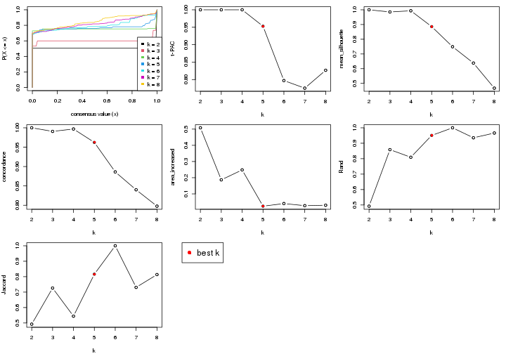

The numeric values for all these statistics can be obtained by `get_stats()`.

```r
get_stats(res)
```

```
#>   k 1-PAC mean_silhouette concordance area_increased  Rand Jaccard
#> 2 2 1.000           1.000       1.000         0.5082 0.492   0.492
#> 3 3 1.000           0.985       0.991         0.1867 0.858   0.726
#> 4 4 1.000           0.993       0.997         0.2481 0.809   0.544
#> 5 5 0.953           0.886       0.962         0.0240 0.951   0.816
#> 6 6 0.797           0.749       0.886         0.0400 1.000   1.000
#> 7 7 0.775           0.638       0.840         0.0270 0.935   0.731
#> 8 8 0.827           0.467       0.798         0.0298 0.966   0.814
```

`suggest_best_k()` suggests the best $k$ based on these statistics. The rules are as follows:

- All $k$ with Jaccard index larger than 0.95 are removed because increasing
  $k$ does not provide enough extra information. If all $k$ are removed, it is
  marked as no subgroup is detected.
- For all $k$ with 1-PAC score larger than 0.9, the maximal $k$ is taken as
  the best $k$, and other $k$ are marked as optional $k$.
- If it does not fit the second rule. The $k$ with the maximal vote of the
  highest 1-PAC score, highest mean silhouette, and highest concordance is
  taken as the best $k$.

```r
suggest_best_k(res)
```

```
#> [1] 5
#> attr(,"optional")
#> [1] 2 3 4
```

There is also optional best $k$ = 2 3 4 that is worth to check.

Following is the table of the partitions (You need to click the **show/hide
code output** link to see it). The membership matrix (columns with name `p*`)
is inferred by
[`clue::cl_consensus()`](https://www.rdocumentation.org/link/cl_consensus?package=clue)
function with the `SE` method. Basically the value in the membership matrix
represents the probability to belong to a certain group. The finall subgroup
label for an item is determined with the group with highest probability it
belongs to.

In `get_classes()` function, the entropy is calculated from the membership
matrix and the silhouette score is calculated from the consensus matrix.


<script>
$( function() {
	$( '#tabs-node-022-get-classes' ).tabs();
} );
</script>
<div id='tabs-node-022-get-classes'>
<ul>
<li><a href='#tab-node-022-get-classes-1'>k = 2</a></li>
<li><a href='#tab-node-022-get-classes-2'>k = 3</a></li>
<li><a href='#tab-node-022-get-classes-3'>k = 4</a></li>
<li><a href='#tab-node-022-get-classes-4'>k = 5</a></li>
<li><a href='#tab-node-022-get-classes-5'>k = 6</a></li>
<li><a href='#tab-node-022-get-classes-6'>k = 7</a></li>
<li><a href='#tab-node-022-get-classes-7'>k = 8</a></li>
</ul>

<div id='tab-node-022-get-classes-1'>
<p><a id='tab-node-022-get-classes-1-a' style='color:#0366d6' href='#'>show/hide code output</a></p>
<pre><code class="r">cbind(get_classes(res, k = 2), get_membership(res, k = 2))
</code></pre>

<pre><code>#&gt;                 class entropy silhouette p1 p2
#&gt; TCGA.AA.3489.01     2       0          1  0  1
#&gt; TCGA.DM.A28C.01     1       0          1  1  0
#&gt; TCGA.CM.6172.01     1       0          1  1  0
#&gt; TCGA.F4.6805.01     2       0          1  0  1
#&gt; TCGA.CM.6165.01     1       0          1  1  0
#&gt; TCGA.A6.2671.01     1       0          1  1  0
#&gt; TCGA.D5.6536.01     1       0          1  1  0
#&gt; TCGA.D5.6539.01     2       0          1  0  1
#&gt; TCGA.AA.3510.01     1       0          1  1  0
#&gt; TCGA.DM.A1D7.01     1       0          1  1  0
#&gt; TCGA.DM.A1D6.01     1       0          1  1  0
#&gt; TCGA.CM.6674.01     2       0          1  0  1
#&gt; TCGA.CM.6678.01     1       0          1  1  0
#&gt; TCGA.A6.2684.01     1       0          1  1  0
#&gt; TCGA.CM.6167.01     2       0          1  0  1
#&gt; TCGA.CM.6163.01     1       0          1  1  0
#&gt; TCGA.G4.6294.01     1       0          1  1  0
#&gt; TCGA.A6.A565.01     2       0          1  0  1
#&gt; TCGA.G4.6625.01     2       0          1  0  1
#&gt; TCGA.A6.6141.01     1       0          1  1  0
#&gt; TCGA.D5.6927.01     2       0          1  0  1
#&gt; TCGA.A6.6781.01     2       0          1  0  1
#&gt; TCGA.CK.6748.01     1       0          1  1  0
#&gt; TCGA.F4.6459.01     1       0          1  1  0
#&gt; TCGA.5M.AAT6.01     2       0          1  0  1
#&gt; TCGA.AZ.6605.01     2       0          1  0  1
</code></pre>

<script>
$('#tab-node-022-get-classes-1-a').parent().next().next().hide();
$('#tab-node-022-get-classes-1-a').click(function(){
  $('#tab-node-022-get-classes-1-a').parent().next().next().toggle();
  return(false);
});
</script>
</div>

<div id='tab-node-022-get-classes-2'>
<p><a id='tab-node-022-get-classes-2-a' style='color:#0366d6' href='#'>show/hide code output</a></p>
<pre><code class="r">cbind(get_classes(res, k = 3), get_membership(res, k = 3))
</code></pre>

<pre><code>#&gt;                 class entropy silhouette   p1   p2   p3
#&gt; TCGA.AA.3489.01     2   0.153      0.972 0.00 0.96 0.04
#&gt; TCGA.DM.A28C.01     1   0.000      0.993 1.00 0.00 0.00
#&gt; TCGA.CM.6172.01     1   0.000      0.993 1.00 0.00 0.00
#&gt; TCGA.F4.6805.01     2   0.000      0.978 0.00 1.00 0.00
#&gt; TCGA.CM.6165.01     1   0.000      0.993 1.00 0.00 0.00
#&gt; TCGA.A6.2671.01     1   0.000      0.993 1.00 0.00 0.00
#&gt; TCGA.D5.6536.01     1   0.000      0.993 1.00 0.00 0.00
#&gt; TCGA.D5.6539.01     2   0.000      0.978 0.00 1.00 0.00
#&gt; TCGA.AA.3510.01     1   0.000      0.993 1.00 0.00 0.00
#&gt; TCGA.DM.A1D7.01     1   0.000      0.993 1.00 0.00 0.00
#&gt; TCGA.DM.A1D6.01     1   0.000      0.993 1.00 0.00 0.00
#&gt; TCGA.CM.6674.01     2   0.153      0.972 0.00 0.96 0.04
#&gt; TCGA.CM.6678.01     1   0.000      0.993 1.00 0.00 0.00
#&gt; TCGA.A6.2684.01     1   0.153      0.960 0.96 0.04 0.00
#&gt; TCGA.CM.6167.01     3   0.000      1.000 0.00 0.00 1.00
#&gt; TCGA.CM.6163.01     1   0.153      0.960 0.96 0.04 0.00
#&gt; TCGA.G4.6294.01     1   0.000      0.993 1.00 0.00 0.00
#&gt; TCGA.A6.A565.01     3   0.000      1.000 0.00 0.00 1.00
#&gt; TCGA.G4.6625.01     2   0.000      0.978 0.00 1.00 0.00
#&gt; TCGA.A6.6141.01     2   0.000      0.978 0.00 1.00 0.00
#&gt; TCGA.D5.6927.01     2   0.153      0.972 0.00 0.96 0.04
#&gt; TCGA.A6.6781.01     2   0.153      0.972 0.00 0.96 0.04
#&gt; TCGA.CK.6748.01     1   0.000      0.993 1.00 0.00 0.00
#&gt; TCGA.F4.6459.01     1   0.000      0.993 1.00 0.00 0.00
#&gt; TCGA.5M.AAT6.01     3   0.000      1.000 0.00 0.00 1.00
#&gt; TCGA.AZ.6605.01     2   0.000      0.978 0.00 1.00 0.00
</code></pre>

<script>
$('#tab-node-022-get-classes-2-a').parent().next().next().hide();
$('#tab-node-022-get-classes-2-a').click(function(){
  $('#tab-node-022-get-classes-2-a').parent().next().next().toggle();
  return(false);
});
</script>
</div>

<div id='tab-node-022-get-classes-3'>
<p><a id='tab-node-022-get-classes-3-a' style='color:#0366d6' href='#'>show/hide code output</a></p>
<pre><code class="r">cbind(get_classes(res, k = 4), get_membership(res, k = 4))
</code></pre>

<pre><code>#&gt;                 class entropy silhouette p1   p2   p3 p4
#&gt; TCGA.AA.3489.01     2   0.000      1.000  0 1.00 0.00  0
#&gt; TCGA.DM.A28C.01     1   0.000      1.000  1 0.00 0.00  0
#&gt; TCGA.CM.6172.01     1   0.000      1.000  1 0.00 0.00  0
#&gt; TCGA.F4.6805.01     2   0.000      1.000  0 1.00 0.00  0
#&gt; TCGA.CM.6165.01     1   0.000      1.000  1 0.00 0.00  0
#&gt; TCGA.A6.2671.01     1   0.000      1.000  1 0.00 0.00  0
#&gt; TCGA.D5.6536.01     4   0.000      1.000  0 0.00 0.00  1
#&gt; TCGA.D5.6539.01     2   0.000      1.000  0 1.00 0.00  0
#&gt; TCGA.AA.3510.01     4   0.000      1.000  0 0.00 0.00  1
#&gt; TCGA.DM.A1D7.01     1   0.000      1.000  1 0.00 0.00  0
#&gt; TCGA.DM.A1D6.01     1   0.000      1.000  1 0.00 0.00  0
#&gt; TCGA.CM.6674.01     2   0.000      1.000  0 1.00 0.00  0
#&gt; TCGA.CM.6678.01     4   0.000      1.000  0 0.00 0.00  1
#&gt; TCGA.A6.2684.01     4   0.000      1.000  0 0.00 0.00  1
#&gt; TCGA.CM.6167.01     3   0.201      0.913  0 0.08 0.92  0
#&gt; TCGA.CM.6163.01     4   0.000      1.000  0 0.00 0.00  1
#&gt; TCGA.G4.6294.01     1   0.000      1.000  1 0.00 0.00  0
#&gt; TCGA.A6.A565.01     3   0.000      0.958  0 0.00 1.00  0
#&gt; TCGA.G4.6625.01     2   0.000      1.000  0 1.00 0.00  0
#&gt; TCGA.A6.6141.01     4   0.000      1.000  0 0.00 0.00  1
#&gt; TCGA.D5.6927.01     2   0.000      1.000  0 1.00 0.00  0
#&gt; TCGA.A6.6781.01     2   0.000      1.000  0 1.00 0.00  0
#&gt; TCGA.CK.6748.01     1   0.000      1.000  1 0.00 0.00  0
#&gt; TCGA.F4.6459.01     4   0.000      1.000  0 0.00 0.00  1
#&gt; TCGA.5M.AAT6.01     3   0.000      0.958  0 0.00 1.00  0
#&gt; TCGA.AZ.6605.01     2   0.000      1.000  0 1.00 0.00  0
</code></pre>

<script>
$('#tab-node-022-get-classes-3-a').parent().next().next().hide();
$('#tab-node-022-get-classes-3-a').click(function(){
  $('#tab-node-022-get-classes-3-a').parent().next().next().toggle();
  return(false);
});
</script>
</div>

<div id='tab-node-022-get-classes-4'>
<p><a id='tab-node-022-get-classes-4-a' style='color:#0366d6' href='#'>show/hide code output</a></p>
<pre><code class="r">cbind(get_classes(res, k = 5), get_membership(res, k = 5))
</code></pre>

<pre><code>#&gt;                 class entropy silhouette   p1   p2   p3   p4   p5
#&gt; TCGA.AA.3489.01     2  0.0000      0.882 0.00 1.00 0.00 0.00 0.00
#&gt; TCGA.DM.A28C.01     1  0.0000      0.987 1.00 0.00 0.00 0.00 0.00
#&gt; TCGA.CM.6172.01     1  0.0000      0.987 1.00 0.00 0.00 0.00 0.00
#&gt; TCGA.F4.6805.01     2  0.2020      0.854 0.00 0.90 0.00 0.00 0.10
#&gt; TCGA.CM.6165.01     1  0.0609      0.974 0.98 0.00 0.00 0.00 0.02
#&gt; TCGA.A6.2671.01     1  0.0000      0.987 1.00 0.00 0.00 0.00 0.00
#&gt; TCGA.D5.6536.01     4  0.1410      0.947 0.00 0.00 0.00 0.94 0.06
#&gt; TCGA.D5.6539.01     5  0.1410      0.000 0.00 0.06 0.00 0.00 0.94
#&gt; TCGA.AA.3510.01     4  0.0609      0.970 0.00 0.00 0.00 0.98 0.02
#&gt; TCGA.DM.A1D7.01     1  0.1648      0.932 0.94 0.00 0.00 0.04 0.02
#&gt; TCGA.DM.A1D6.01     1  0.0000      0.987 1.00 0.00 0.00 0.00 0.00
#&gt; TCGA.CM.6674.01     2  0.0000      0.882 0.00 1.00 0.00 0.00 0.00
#&gt; TCGA.CM.6678.01     4  0.0609      0.970 0.00 0.00 0.00 0.98 0.02
#&gt; TCGA.A6.2684.01     4  0.0000      0.972 0.00 0.00 0.00 1.00 0.00
#&gt; TCGA.CM.6167.01     2  0.4060      0.401 0.00 0.64 0.36 0.00 0.00
#&gt; TCGA.CM.6163.01     4  0.0000      0.972 0.00 0.00 0.00 1.00 0.00
#&gt; TCGA.G4.6294.01     1  0.0000      0.987 1.00 0.00 0.00 0.00 0.00
#&gt; TCGA.A6.A565.01     3  0.0000      1.000 0.00 0.00 1.00 0.00 0.00
#&gt; TCGA.G4.6625.01     2  0.2280      0.840 0.00 0.88 0.00 0.00 0.12
#&gt; TCGA.A6.6141.01     4  0.1410      0.921 0.00 0.00 0.00 0.94 0.06
#&gt; TCGA.D5.6927.01     2  0.0000      0.882 0.00 1.00 0.00 0.00 0.00
#&gt; TCGA.A6.6781.01     2  0.0000      0.882 0.00 1.00 0.00 0.00 0.00
#&gt; TCGA.CK.6748.01     1  0.0000      0.987 1.00 0.00 0.00 0.00 0.00
#&gt; TCGA.F4.6459.01     4  0.0000      0.972 0.00 0.00 0.00 1.00 0.00
#&gt; TCGA.5M.AAT6.01     3  0.0000      1.000 0.00 0.00 1.00 0.00 0.00
#&gt; TCGA.AZ.6605.01     2  0.2020      0.854 0.00 0.90 0.00 0.00 0.10
</code></pre>

<script>
$('#tab-node-022-get-classes-4-a').parent().next().next().hide();
$('#tab-node-022-get-classes-4-a').click(function(){
  $('#tab-node-022-get-classes-4-a').parent().next().next().toggle();
  return(false);
});
</script>
</div>

<div id='tab-node-022-get-classes-5'>
<p><a id='tab-node-022-get-classes-5-a' style='color:#0366d6' href='#'>show/hide code output</a></p>
<pre><code class="r">cbind(get_classes(res, k = 6), get_membership(res, k = 6))
</code></pre>

<pre><code>#&gt;                 class entropy silhouette   p1   p2   p3   p4   p5   p6
#&gt; TCGA.AA.3489.01     2  0.0000     0.7874 0.00 1.00 0.00 0.00 0.00 0.00
#&gt; TCGA.DM.A28C.01     1  0.0000     0.9156 1.00 0.00 0.00 0.00 0.00 0.00
#&gt; TCGA.CM.6172.01     1  0.0000     0.9156 1.00 0.00 0.00 0.00 0.00 0.00
#&gt; TCGA.F4.6805.01     2  0.2794     0.7632 0.00 0.86 0.00 0.00 0.08 0.06
#&gt; TCGA.CM.6165.01     1  0.3315     0.7436 0.78 0.00 0.00 0.20 0.02 0.00
#&gt; TCGA.A6.2671.01     1  0.0000     0.9156 1.00 0.00 0.00 0.00 0.00 0.00
#&gt; TCGA.D5.6536.01     4  0.2793     0.6247 0.00 0.00 0.00 0.80 0.20 0.00
#&gt; TCGA.D5.6539.01     6  0.0000     0.0000 0.00 0.00 0.00 0.00 0.00 1.00
#&gt; TCGA.AA.3510.01     4  0.0547     0.7751 0.00 0.00 0.00 0.98 0.02 0.00
#&gt; TCGA.DM.A1D7.01     1  0.3819     0.6502 0.70 0.00 0.00 0.28 0.02 0.00
#&gt; TCGA.DM.A1D6.01     1  0.0000     0.9156 1.00 0.00 0.00 0.00 0.00 0.00
#&gt; TCGA.CM.6674.01     2  0.1814     0.7709 0.00 0.90 0.00 0.00 0.10 0.00
#&gt; TCGA.CM.6678.01     4  0.0547     0.7751 0.00 0.00 0.00 0.98 0.02 0.00
#&gt; TCGA.A6.2684.01     4  0.2793     0.8210 0.00 0.00 0.00 0.80 0.20 0.00
#&gt; TCGA.CM.6167.01     2  0.5995     0.0397 0.00 0.44 0.28 0.00 0.28 0.00
#&gt; TCGA.CM.6163.01     4  0.2793     0.8210 0.00 0.00 0.00 0.80 0.20 0.00
#&gt; TCGA.G4.6294.01     1  0.0000     0.9156 1.00 0.00 0.00 0.00 0.00 0.00
#&gt; TCGA.A6.A565.01     3  0.0000     1.0000 0.00 0.00 1.00 0.00 0.00 0.00
#&gt; TCGA.G4.6625.01     2  0.4566     0.6385 0.00 0.70 0.00 0.00 0.16 0.14
#&gt; TCGA.A6.6141.01     4  0.4348     0.6941 0.00 0.00 0.00 0.64 0.32 0.04
#&gt; TCGA.D5.6927.01     2  0.2631     0.7180 0.00 0.82 0.00 0.00 0.18 0.00
#&gt; TCGA.A6.6781.01     2  0.0000     0.7874 0.00 1.00 0.00 0.00 0.00 0.00
#&gt; TCGA.CK.6748.01     1  0.0000     0.9156 1.00 0.00 0.00 0.00 0.00 0.00
#&gt; TCGA.F4.6459.01     4  0.2793     0.8210 0.00 0.00 0.00 0.80 0.20 0.00
#&gt; TCGA.5M.AAT6.01     3  0.0000     1.0000 0.00 0.00 1.00 0.00 0.00 0.00
#&gt; TCGA.AZ.6605.01     2  0.3045     0.7541 0.00 0.84 0.00 0.00 0.10 0.06
</code></pre>

<script>
$('#tab-node-022-get-classes-5-a').parent().next().next().hide();
$('#tab-node-022-get-classes-5-a').click(function(){
  $('#tab-node-022-get-classes-5-a').parent().next().next().toggle();
  return(false);
});
</script>
</div>

<div id='tab-node-022-get-classes-6'>
<p><a id='tab-node-022-get-classes-6-a' style='color:#0366d6' href='#'>show/hide code output</a></p>
<pre><code class="r">cbind(get_classes(res, k = 7), get_membership(res, k = 7))
</code></pre>

<pre><code>#&gt;                 class entropy silhouette   p1   p2   p3   p4   p5 p6   p7
#&gt; TCGA.AA.3489.01     2  0.3685      0.338 0.00 0.66 0.00 0.00 0.32  0 0.02
#&gt; TCGA.DM.A28C.01     1  0.0000      0.927 1.00 0.00 0.00 0.00 0.00  0 0.00
#&gt; TCGA.CM.6172.01     1  0.0000      0.927 1.00 0.00 0.00 0.00 0.00  0 0.00
#&gt; TCGA.F4.6805.01     2  0.1166      0.647 0.00 0.94 0.00 0.00 0.06  0 0.00
#&gt; TCGA.CM.6165.01     1  0.2509      0.836 0.88 0.00 0.00 0.04 0.02  0 0.06
#&gt; TCGA.A6.2671.01     1  0.0000      0.927 1.00 0.00 0.00 0.00 0.00  0 0.00
#&gt; TCGA.D5.6536.01     7  0.2945      0.000 0.00 0.00 0.00 0.26 0.00  0 0.74
#&gt; TCGA.D5.6539.01     6  0.0000      0.000 0.00 0.00 0.00 0.00 0.00  1 0.00
#&gt; TCGA.AA.3510.01     4  0.2569      0.699 0.00 0.00 0.00 0.84 0.02  0 0.14
#&gt; TCGA.DM.A1D7.01     1  0.4812      0.515 0.66 0.00 0.00 0.18 0.02  0 0.14
#&gt; TCGA.DM.A1D6.01     1  0.0000      0.927 1.00 0.00 0.00 0.00 0.00  0 0.00
#&gt; TCGA.CM.6674.01     5  0.4461      0.249 0.00 0.40 0.00 0.00 0.54  0 0.06
#&gt; TCGA.CM.6678.01     4  0.2569      0.699 0.00 0.00 0.00 0.84 0.02  0 0.14
#&gt; TCGA.A6.2684.01     4  0.1363      0.774 0.00 0.00 0.00 0.94 0.04  0 0.02
#&gt; TCGA.CM.6167.01     5  0.5664      0.259 0.00 0.18 0.18 0.00 0.58  0 0.06
#&gt; TCGA.CM.6163.01     4  0.0504      0.788 0.00 0.00 0.00 0.98 0.02  0 0.00
#&gt; TCGA.G4.6294.01     1  0.0000      0.927 1.00 0.00 0.00 0.00 0.00  0 0.00
#&gt; TCGA.A6.A565.01     3  0.0000      1.000 0.00 0.00 1.00 0.00 0.00  0 0.00
#&gt; TCGA.G4.6625.01     2  0.1860      0.574 0.00 0.92 0.00 0.02 0.02  0 0.04
#&gt; TCGA.A6.6141.01     4  0.3902      0.552 0.00 0.16 0.00 0.76 0.04  0 0.04
#&gt; TCGA.D5.6927.01     5  0.4945      0.331 0.00 0.36 0.00 0.00 0.52  0 0.12
#&gt; TCGA.A6.6781.01     2  0.3294      0.339 0.00 0.66 0.00 0.00 0.34  0 0.00
#&gt; TCGA.CK.6748.01     1  0.0000      0.927 1.00 0.00 0.00 0.00 0.00  0 0.00
#&gt; TCGA.F4.6459.01     4  0.1363      0.780 0.00 0.00 0.00 0.94 0.04  0 0.02
#&gt; TCGA.5M.AAT6.01     3  0.0000      1.000 0.00 0.00 1.00 0.00 0.00  0 0.00
#&gt; TCGA.AZ.6605.01     2  0.0000      0.643 0.00 1.00 0.00 0.00 0.00  0 0.00
</code></pre>

<script>
$('#tab-node-022-get-classes-6-a').parent().next().next().hide();
$('#tab-node-022-get-classes-6-a').click(function(){
  $('#tab-node-022-get-classes-6-a').parent().next().next().toggle();
  return(false);
});
</script>
</div>

<div id='tab-node-022-get-classes-7'>
<p><a id='tab-node-022-get-classes-7-a' style='color:#0366d6' href='#'>show/hide code output</a></p>
<pre><code class="r">cbind(get_classes(res, k = 8), get_membership(res, k = 8))
</code></pre>

<pre><code>#&gt;                 class entropy silhouette   p1   p2   p3   p4   p5   p6   p7   p8
#&gt; TCGA.AA.3489.01     2  0.4199      0.265 0.00 0.60 0.00 0.00 0.32 0.00 0.00 0.08
#&gt; TCGA.DM.A28C.01     1  0.0000      0.908 1.00 0.00 0.00 0.00 0.00 0.00 0.00 0.00
#&gt; TCGA.CM.6172.01     1  0.0000      0.908 1.00 0.00 0.00 0.00 0.00 0.00 0.00 0.00
#&gt; TCGA.F4.6805.01     2  0.1275      0.579 0.00 0.94 0.00 0.00 0.04 0.00 0.00 0.02
#&gt; TCGA.CM.6165.01     1  0.3299      0.270 0.56 0.00 0.44 0.00 0.00 0.00 0.00 0.00
#&gt; TCGA.A6.2671.01     1  0.0000      0.908 1.00 0.00 0.00 0.00 0.00 0.00 0.00 0.00
#&gt; TCGA.D5.6536.01     7  0.2888      0.000 0.00 0.00 0.16 0.04 0.00 0.00 0.80 0.00
#&gt; TCGA.D5.6539.01     6  0.0471      0.000 0.00 0.02 0.00 0.00 0.00 0.98 0.00 0.00
#&gt; TCGA.AA.3510.01     4  0.3318      0.419 0.00 0.00 0.46 0.54 0.00 0.00 0.00 0.00
#&gt; TCGA.DM.A1D7.01     3  0.4943     -0.254 0.34 0.00 0.48 0.18 0.00 0.00 0.00 0.00
#&gt; TCGA.DM.A1D6.01     1  0.0000      0.908 1.00 0.00 0.00 0.00 0.00 0.00 0.00 0.00
#&gt; TCGA.CM.6674.01     5  0.5128      0.341 0.00 0.36 0.02 0.00 0.52 0.00 0.02 0.08
#&gt; TCGA.CM.6678.01     4  0.3329      0.398 0.00 0.00 0.48 0.52 0.00 0.00 0.00 0.00
#&gt; TCGA.A6.2684.01     4  0.0471      0.657 0.00 0.00 0.00 0.98 0.02 0.00 0.00 0.00
#&gt; TCGA.CM.6167.01     8  0.4255      0.000 0.00 0.08 0.00 0.00 0.34 0.00 0.00 0.58
#&gt; TCGA.CM.6163.01     4  0.0808      0.663 0.00 0.00 0.04 0.96 0.00 0.00 0.00 0.00
#&gt; TCGA.G4.6294.01     1  0.0000      0.908 1.00 0.00 0.00 0.00 0.00 0.00 0.00 0.00
#&gt; TCGA.A6.A565.01     3  0.4759      0.306 0.00 0.00 0.50 0.00 0.00 0.00 0.14 0.36
#&gt; TCGA.G4.6625.01     2  0.1275      0.518 0.00 0.94 0.00 0.00 0.04 0.00 0.00 0.02
#&gt; TCGA.A6.6141.01     4  0.3873      0.427 0.00 0.20 0.00 0.72 0.06 0.00 0.00 0.02
#&gt; TCGA.D5.6927.01     5  0.4981      0.388 0.00 0.30 0.00 0.00 0.58 0.02 0.02 0.08
#&gt; TCGA.A6.6781.01     2  0.4255      0.197 0.00 0.58 0.00 0.00 0.34 0.00 0.00 0.08
#&gt; TCGA.CK.6748.01     1  0.0471      0.894 0.98 0.00 0.02 0.00 0.00 0.00 0.00 0.00
#&gt; TCGA.F4.6459.01     4  0.1275      0.660 0.00 0.00 0.04 0.94 0.00 0.00 0.02 0.00
#&gt; TCGA.5M.AAT6.01     3  0.4759      0.306 0.00 0.00 0.50 0.00 0.00 0.00 0.14 0.36
#&gt; TCGA.AZ.6605.01     2  0.0471      0.580 0.00 0.98 0.00 0.00 0.02 0.00 0.00 0.00
</code></pre>

<script>
$('#tab-node-022-get-classes-7-a').parent().next().next().hide();
$('#tab-node-022-get-classes-7-a').click(function(){
  $('#tab-node-022-get-classes-7-a').parent().next().next().toggle();
  return(false);
});
</script>
</div>
</div>

Heatmaps for the consensus matrix. It visualizes the probability of two
samples to be in a same group.


<script>
$( function() {
	$( '#tabs-node-022-consensus-heatmap' ).tabs();
} );
</script>
<div id='tabs-node-022-consensus-heatmap'>
<ul>
<li><a href='#tab-node-022-consensus-heatmap-1'>k = 2</a></li>
<li><a href='#tab-node-022-consensus-heatmap-2'>k = 3</a></li>
<li><a href='#tab-node-022-consensus-heatmap-3'>k = 4</a></li>
<li><a href='#tab-node-022-consensus-heatmap-4'>k = 5</a></li>
<li><a href='#tab-node-022-consensus-heatmap-5'>k = 6</a></li>
<li><a href='#tab-node-022-consensus-heatmap-6'>k = 7</a></li>
<li><a href='#tab-node-022-consensus-heatmap-7'>k = 8</a></li>
</ul>
<div id='tab-node-022-consensus-heatmap-1'>
<pre><code class="r">consensus_heatmap(res, k = 2)
</code></pre>

<p>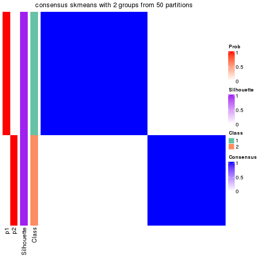</p>

</div>
<div id='tab-node-022-consensus-heatmap-2'>
<pre><code class="r">consensus_heatmap(res, k = 3)
</code></pre>

<p>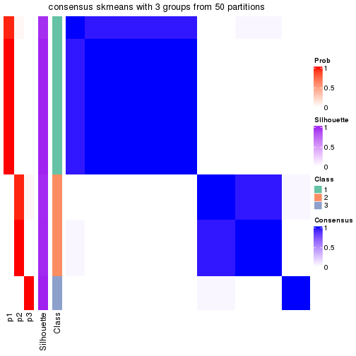</p>

</div>
<div id='tab-node-022-consensus-heatmap-3'>
<pre><code class="r">consensus_heatmap(res, k = 4)
</code></pre>

<p>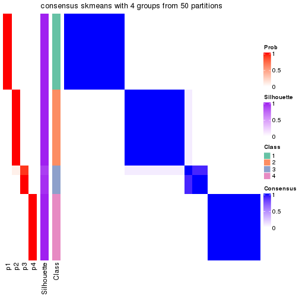</p>

</div>
<div id='tab-node-022-consensus-heatmap-4'>
<pre><code class="r">consensus_heatmap(res, k = 5)
</code></pre>

<p>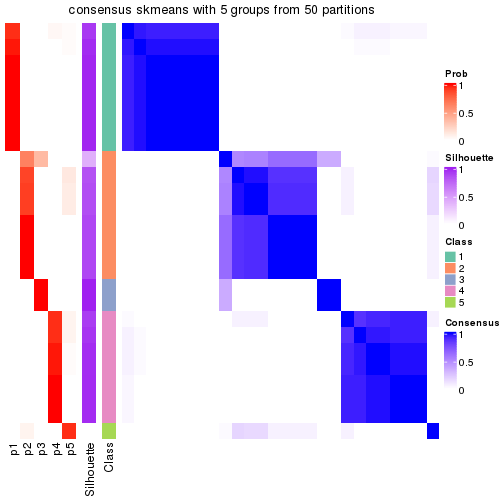</p>

</div>
<div id='tab-node-022-consensus-heatmap-5'>
<pre><code class="r">consensus_heatmap(res, k = 6)
</code></pre>

<p>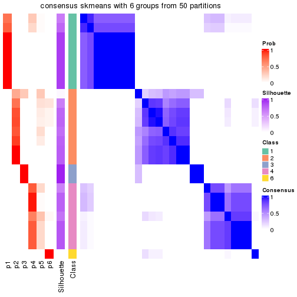</p>

</div>
<div id='tab-node-022-consensus-heatmap-6'>
<pre><code class="r">consensus_heatmap(res, k = 7)
</code></pre>

<p>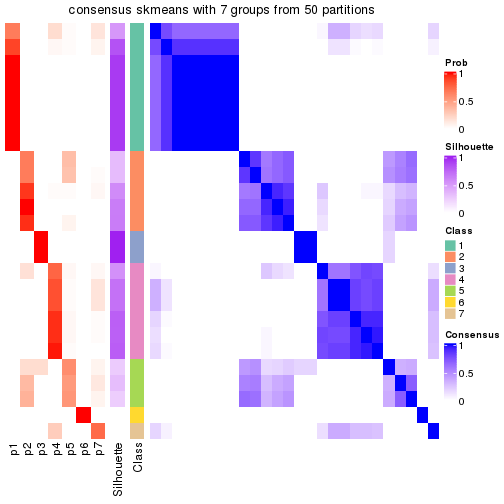</p>

</div>
<div id='tab-node-022-consensus-heatmap-7'>
<pre><code class="r">consensus_heatmap(res, k = 8)
</code></pre>

<p>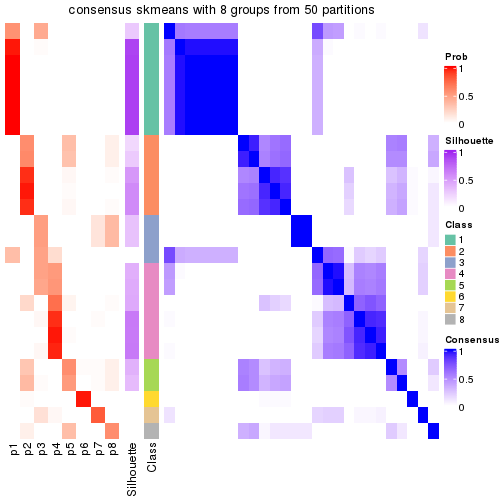</p>

</div>
</div>

Heatmaps for the membership of samples in all partitions to see how consistent they are:


<script>
$( function() {
	$( '#tabs-node-022-membership-heatmap' ).tabs();
} );
</script>
<div id='tabs-node-022-membership-heatmap'>
<ul>
<li><a href='#tab-node-022-membership-heatmap-1'>k = 2</a></li>
<li><a href='#tab-node-022-membership-heatmap-2'>k = 3</a></li>
<li><a href='#tab-node-022-membership-heatmap-3'>k = 4</a></li>
<li><a href='#tab-node-022-membership-heatmap-4'>k = 5</a></li>
<li><a href='#tab-node-022-membership-heatmap-5'>k = 6</a></li>
<li><a href='#tab-node-022-membership-heatmap-6'>k = 7</a></li>
<li><a href='#tab-node-022-membership-heatmap-7'>k = 8</a></li>
</ul>
<div id='tab-node-022-membership-heatmap-1'>
<pre><code class="r">membership_heatmap(res, k = 2)
</code></pre>

<p>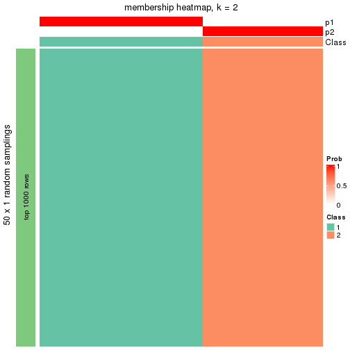</p>

</div>
<div id='tab-node-022-membership-heatmap-2'>
<pre><code class="r">membership_heatmap(res, k = 3)
</code></pre>

<p>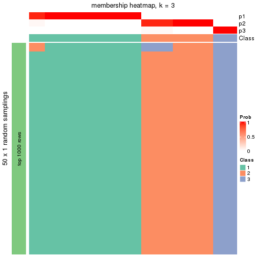</p>

</div>
<div id='tab-node-022-membership-heatmap-3'>
<pre><code class="r">membership_heatmap(res, k = 4)
</code></pre>

<p>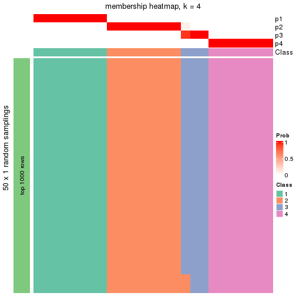</p>

</div>
<div id='tab-node-022-membership-heatmap-4'>
<pre><code class="r">membership_heatmap(res, k = 5)
</code></pre>

<p>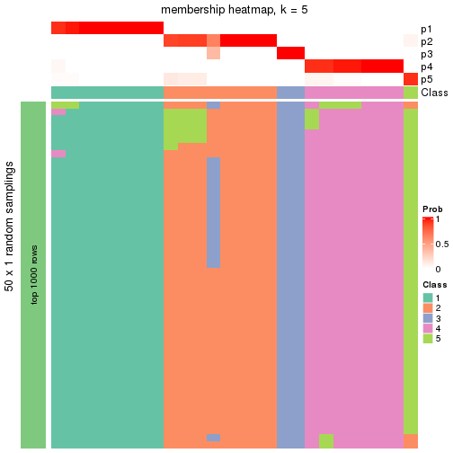</p>

</div>
<div id='tab-node-022-membership-heatmap-5'>
<pre><code class="r">membership_heatmap(res, k = 6)
</code></pre>

<p>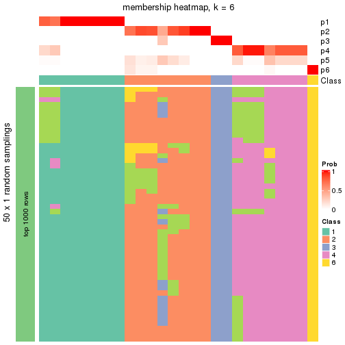</p>

</div>
<div id='tab-node-022-membership-heatmap-6'>
<pre><code class="r">membership_heatmap(res, k = 7)
</code></pre>

<p>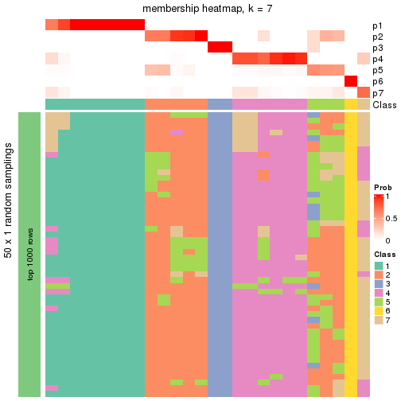</p>

</div>
<div id='tab-node-022-membership-heatmap-7'>
<pre><code class="r">membership_heatmap(res, k = 8)
</code></pre>

<p>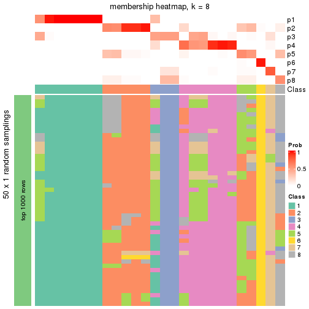</p>

</div>
</div>

As soon as the classes for columns are determined, the signatures
that are significantly different between subgroups can be looked for. 
Following are the heatmaps for signatures.


<script>
$( function() {
	$( '#tabs-node-022-get-signatures' ).tabs();
} );
</script>
<div id='tabs-node-022-get-signatures'>
<ul>
<li><a href='#tab-node-022-get-signatures-1'>k = 2</a></li>
<li><a href='#tab-node-022-get-signatures-2'>k = 3</a></li>
<li><a href='#tab-node-022-get-signatures-3'>k = 4</a></li>
<li><a href='#tab-node-022-get-signatures-4'>k = 5</a></li>
<li><a href='#tab-node-022-get-signatures-5'>k = 6</a></li>
<li><a href='#tab-node-022-get-signatures-6'>k = 7</a></li>
<li><a href='#tab-node-022-get-signatures-7'>k = 8</a></li>
</ul>
<div id='tab-node-022-get-signatures-1'>
<pre><code class="r">get_signatures(res, k = 2)
</code></pre>

<p>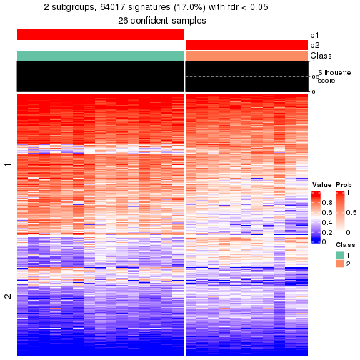</p>

</div>
<div id='tab-node-022-get-signatures-2'>
<pre><code class="r">get_signatures(res, k = 3)
</code></pre>

<p>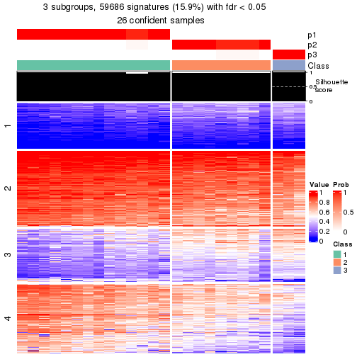</p>

</div>
<div id='tab-node-022-get-signatures-3'>
<pre><code class="r">get_signatures(res, k = 4)
</code></pre>

<p>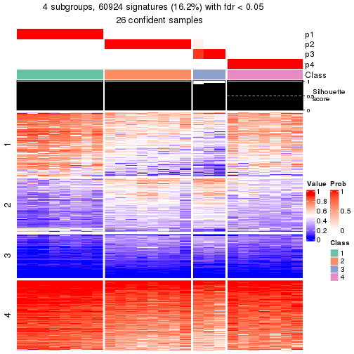</p>

</div>
<div id='tab-node-022-get-signatures-4'>
<pre><code class="r">get_signatures(res, k = 5)
</code></pre>

<p>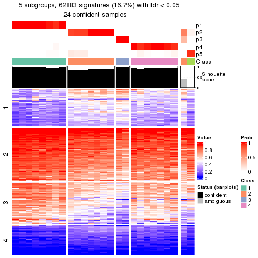</p>

</div>
<div id='tab-node-022-get-signatures-5'>
<pre><code class="r">get_signatures(res, k = 6)
</code></pre>

<p>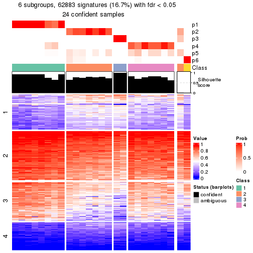</p>

</div>
<div id='tab-node-022-get-signatures-6'>
<pre><code class="r">get_signatures(res, k = 7)
</code></pre>

<p>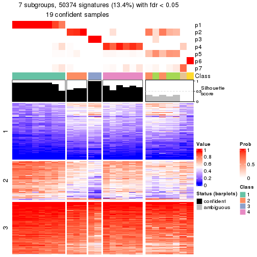</p>

</div>
<div id='tab-node-022-get-signatures-7'>
<pre><code class="r">get_signatures(res, k = 8)
</code></pre>

<p>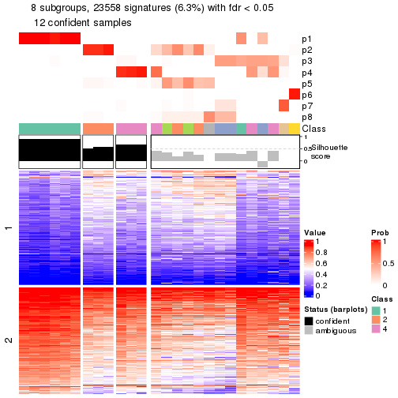</p>

</div>
</div>


Compare the overlap of signatures from different k:

```r
compare_signatures(res)
```

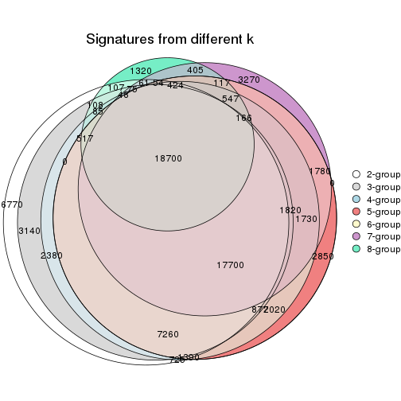

`get_signature()` returns a data frame invisibly. To get the list of signatures, the function
call should be assigned to a variable explicitly. In following code, if `plot` argument is set
to `FALSE`, no heatmap is plotted while only the differential analysis is performed.

```r
# code only for demonstration
tb = get_signature(res, k = ..., plot = FALSE)
```

An example of the output of `tb` is:

```
#>   which_row         fdr    mean_1    mean_2 scaled_mean_1 scaled_mean_2 km
#> 1        38 0.042760348  8.373488  9.131774    -0.5533452     0.5164555  1
#> 2        40 0.018707592  7.106213  8.469186    -0.6173731     0.5762149  1
#> 3        55 0.019134737 10.221463 11.207825    -0.6159697     0.5749050  1
#> 4        59 0.006059896  5.921854  7.869574    -0.6899429     0.6439467  1
#> 5        60 0.018055526  8.928898 10.211722    -0.6204761     0.5791110  1
#> 6        98 0.009384629 15.714769 14.887706     0.6635654    -0.6193277  2
...
```

The columns in `tb` are:

1. `which_row`: row indices corresponding to the input matrix.
2. `fdr`: FDR for the differential test. 
3. `mean_x`: The mean value in group x.
4. `scaled_mean_x`: The mean value in group x after rows are scaled.
5. `km`: Row groups if k-means clustering is applied to rows (which is done by automatically selecting number of clusters).

If there are too many signatures, `top_signatures = ...` can be set to only show the 
signatures with the highest FDRs:

```r
# code only for demonstration
# e.g. to show the top 500 most significant rows
tb = get_signature(res, k = ..., top_signatures = 500)
```

If the signatures are defined as these which are uniquely high in current group, `diff_method` argument
can be set to `"uniquely_high_in_one_group"`:

```r
# code only for demonstration
tb = get_signature(res, k = ..., diff_method = "uniquely_high_in_one_group")
```


UMAP plot which shows how samples are separated.


<script>
$( function() {
	$( '#tabs-node-022-dimension-reduction' ).tabs();
} );
</script>
<div id='tabs-node-022-dimension-reduction'>
<ul>
<li><a href='#tab-node-022-dimension-reduction-1'>k = 2</a></li>
<li><a href='#tab-node-022-dimension-reduction-2'>k = 3</a></li>
<li><a href='#tab-node-022-dimension-reduction-3'>k = 4</a></li>
<li><a href='#tab-node-022-dimension-reduction-4'>k = 5</a></li>
<li><a href='#tab-node-022-dimension-reduction-5'>k = 6</a></li>
<li><a href='#tab-node-022-dimension-reduction-6'>k = 7</a></li>
<li><a href='#tab-node-022-dimension-reduction-7'>k = 8</a></li>
</ul>
<div id='tab-node-022-dimension-reduction-1'>
<pre><code class="r">dimension_reduction(res, k = 2, method = &quot;UMAP&quot;)
</code></pre>

<p>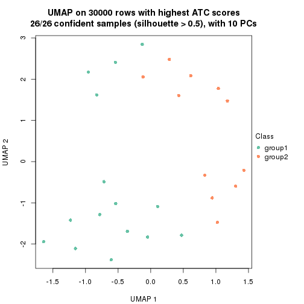</p>

</div>
<div id='tab-node-022-dimension-reduction-2'>
<pre><code class="r">dimension_reduction(res, k = 3, method = &quot;UMAP&quot;)
</code></pre>

<p>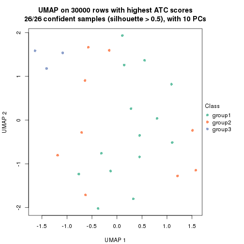</p>

</div>
<div id='tab-node-022-dimension-reduction-3'>
<pre><code class="r">dimension_reduction(res, k = 4, method = &quot;UMAP&quot;)
</code></pre>

<p>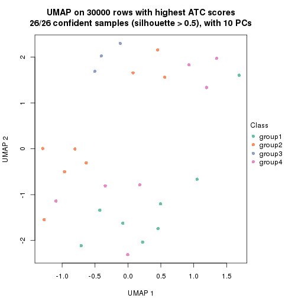</p>

</div>
<div id='tab-node-022-dimension-reduction-4'>
<pre><code class="r">dimension_reduction(res, k = 5, method = &quot;UMAP&quot;)
</code></pre>

<p>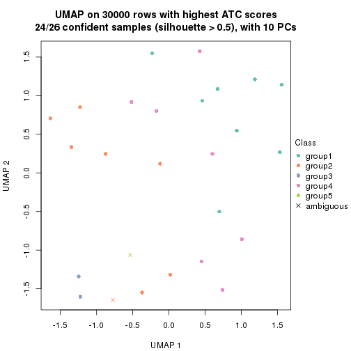</p>

</div>
<div id='tab-node-022-dimension-reduction-5'>
<pre><code class="r">dimension_reduction(res, k = 6, method = &quot;UMAP&quot;)
</code></pre>

<p>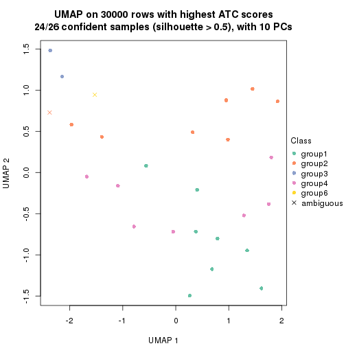</p>

</div>
<div id='tab-node-022-dimension-reduction-6'>
<pre><code class="r">dimension_reduction(res, k = 7, method = &quot;UMAP&quot;)
</code></pre>

<p>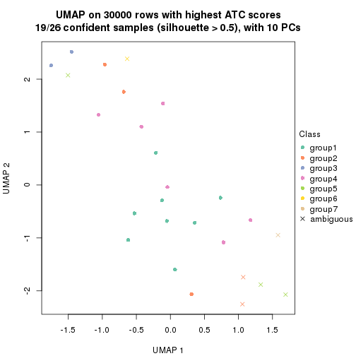</p>

</div>
<div id='tab-node-022-dimension-reduction-7'>
<pre><code class="r">dimension_reduction(res, k = 8, method = &quot;UMAP&quot;)
</code></pre>

<p>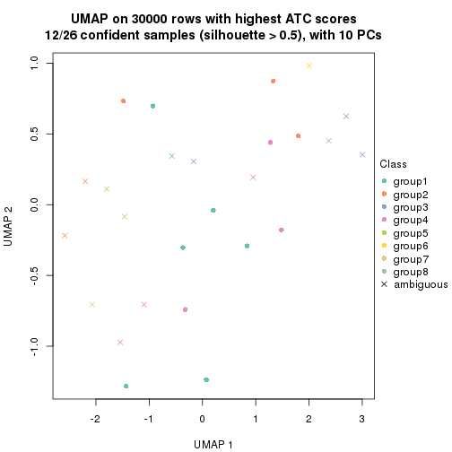</p>

</div>
</div>


Following heatmap shows how subgroups are split when increasing `k`:

```r
collect_classes(res)
```

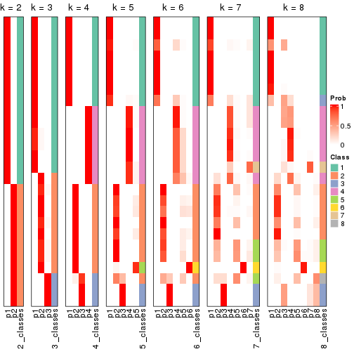


If matrix rows can be associated to genes, consider to use `functional_enrichment(res,
...)` to perform function enrichment for the signature genes. See [this vignette](https://jokergoo.github.io/cola_vignettes/functional_enrichment.html) for more detailed explanations.


 

---------------------------------------------------


### Node023


Parent node: [Node02](#Node02).
Child nodes: 
                [Node0111](#Node0111)
        ,
                [Node0112](#Node0112)
        ,
                [Node0113](#Node0113)
        ,
                [Node0121](#Node0121)
        ,
                Node0122-leaf
        ,
                Node0123-leaf
        ,
                Node0131-leaf
        ,
                Node0132-leaf
        ,
                Node0133-leaf
        ,
                Node0134-leaf
        ,
                [Node0141](#Node0141)
        ,
                Node0142-leaf
        ,
                Node0143-leaf
        ,
                Node0221-leaf
        ,
                Node0222-leaf
        ,
                Node0223-leaf
        ,
                Node0224-leaf
        ,
                [Node0231](#Node0231)
        ,
                Node0232-leaf
        ,
                Node0233-leaf
        ,
                Node0321-leaf
        ,
                Node0322-leaf
        ,
                Node0411-leaf
        ,
                Node0412-leaf
        ,
                Node0421-leaf
        ,
                Node0422-leaf
        ,
                Node0431-leaf
        ,
                Node0432-leaf
        ,
                Node0433-leaf
        ,
                Node0434-leaf
        .


The object with results only for a single top-value method and a single partitioning method 
can be extracted as:

```r
res = res_rh["023"]
```

A summary of `res` and all the functions that can be applied to it:

```r
res
```

```
#> A 'ConsensusPartition' object with k = 2, 3, 4, 5, 6, 7, 8.
#>   On a matrix with 30000 rows and 37 columns.
#>   Top rows (1000) are extracted by 'ATC' method.
#>   Subgroups are detected by 'kmeans' method.
#>   Performed in total 350 partitions by row resampling.
#>   Best k for subgroups seems to be 3.
#> 
#> Following methods can be applied to this 'ConsensusPartition' object:
#>  [1] "cola_report"             "collect_classes"         "collect_plots"          
#>  [4] "collect_stats"           "colnames"                "compare_partitions"     
#>  [7] "compare_signatures"      "consensus_heatmap"       "dimension_reduction"    
#> [10] "functional_enrichment"   "get_anno_col"            "get_anno"               
#> [13] "get_classes"             "get_consensus"           "get_matrix"             
#> [16] "get_membership"          "get_param"               "get_signatures"         
#> [19] "get_stats"               "is_best_k"               "is_stable_k"            
#> [22] "membership_heatmap"      "ncol"                    "nrow"                   
#> [25] "plot_ecdf"               "predict_classes"         "rownames"               
#> [28] "select_partition_number" "show"                    "suggest_best_k"         
#> [31] "test_to_known_factors"   "top_rows_heatmap"
```

`collect_plots()` function collects all the plots made from `res` for all `k` (number of subgroups)
into one single page to provide an easy and fast comparison between different `k`.

```r
collect_plots(res)
```

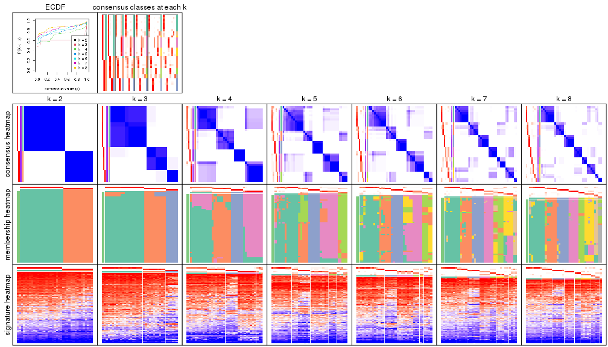

The plots are:

- The first row: a plot of the eCDF (empirical cumulative distribution
  function) curves of the consensus matrix for each `k` and the heatmap of
  predicted classes for each `k`.
- The second row: heatmaps of the consensus matrix for each `k`.
- The third row: heatmaps of the membership matrix for each `k`.
- The fouth row: heatmaps of the signatures for each `k`.

All the plots in panels can be made by individual functions and they are
plotted later in this section.

`select_partition_number()` produces several plots showing different
statistics for choosing "optimized" `k`. There are following statistics:

- eCDF curves of the consensus matrix for each `k`;
- 1-PAC. [The PAC score](https://en.wikipedia.org/wiki/Consensus_clustering#Over-interpretation_potential_of_consensus_clustering)
  measures the proportion of the ambiguous subgrouping.
- Mean silhouette score.
- Concordance. The mean probability of fiting the consensus subgroup labels in all
  partitions.
- Area increased. Denote $A_k$ as the area under the eCDF curve for current
  `k`, the area increased is defined as $A_k - A_{k-1}$.
- Rand index. The percent of pairs of samples that are both in a same cluster
  or both are not in a same cluster in the partition of k and k-1.
- Jaccard index. The ratio of pairs of samples are both in a same cluster in
  the partition of k and k-1 and the pairs of samples are both in a same
  cluster in the partition k or k-1.

The detailed explanations of these statistics can be found in [the _cola_
vignette](https://jokergoo.github.io/cola_vignettes/cola.html#toc_13).

Generally speaking, higher 1-PAC score, higher mean silhouette score or higher
concordance corresponds to better partition. Rand index and Jaccard index
measure how similar the current partition is compared to partition with `k-1`.
If they are too similar, we won't accept `k` is better than `k-1`.

```r
select_partition_number(res)
```

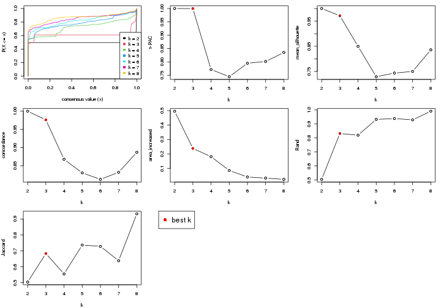

The numeric values for all these statistics can be obtained by `get_stats()`.

```r
get_stats(res)
```

```
#>   k 1-PAC mean_silhouette concordance area_increased  Rand Jaccard
#> 2 2 1.000           1.000       1.000         0.4960 0.505   0.505
#> 3 3 1.000           0.971       0.976         0.2384 0.832   0.684
#> 4 4 0.771           0.850       0.868         0.1814 0.820   0.556
#> 5 5 0.745           0.729       0.830         0.0859 0.932   0.737
#> 6 6 0.795           0.744       0.812         0.0407 0.938   0.728
#> 7 7 0.802           0.750       0.832         0.0331 0.929   0.638
#> 8 8 0.835           0.836       0.887         0.0243 0.991   0.933
```

`suggest_best_k()` suggests the best $k$ based on these statistics. The rules are as follows:

- All $k$ with Jaccard index larger than 0.95 are removed because increasing
  $k$ does not provide enough extra information. If all $k$ are removed, it is
  marked as no subgroup is detected.
- For all $k$ with 1-PAC score larger than 0.9, the maximal $k$ is taken as
  the best $k$, and other $k$ are marked as optional $k$.
- If it does not fit the second rule. The $k$ with the maximal vote of the
  highest 1-PAC score, highest mean silhouette, and highest concordance is
  taken as the best $k$.

```r
suggest_best_k(res)
```

```
#> [1] 3
#> attr(,"optional")
#> [1] 2
```

There is also optional best $k$ = 2 that is worth to check.

Following is the table of the partitions (You need to click the **show/hide
code output** link to see it). The membership matrix (columns with name `p*`)
is inferred by
[`clue::cl_consensus()`](https://www.rdocumentation.org/link/cl_consensus?package=clue)
function with the `SE` method. Basically the value in the membership matrix
represents the probability to belong to a certain group. The finall subgroup
label for an item is determined with the group with highest probability it
belongs to.

In `get_classes()` function, the entropy is calculated from the membership
matrix and the silhouette score is calculated from the consensus matrix.


<script>
$( function() {
	$( '#tabs-node-023-get-classes' ).tabs();
} );
</script>
<div id='tabs-node-023-get-classes'>
<ul>
<li><a href='#tab-node-023-get-classes-1'>k = 2</a></li>
<li><a href='#tab-node-023-get-classes-2'>k = 3</a></li>
<li><a href='#tab-node-023-get-classes-3'>k = 4</a></li>
<li><a href='#tab-node-023-get-classes-4'>k = 5</a></li>
<li><a href='#tab-node-023-get-classes-5'>k = 6</a></li>
<li><a href='#tab-node-023-get-classes-6'>k = 7</a></li>
<li><a href='#tab-node-023-get-classes-7'>k = 8</a></li>
</ul>

<div id='tab-node-023-get-classes-1'>
<p><a id='tab-node-023-get-classes-1-a' style='color:#0366d6' href='#'>show/hide code output</a></p>
<pre><code class="r">cbind(get_classes(res, k = 2), get_membership(res, k = 2))
</code></pre>

<pre><code>#&gt;                 class entropy silhouette p1 p2
#&gt; TCGA.D5.6530.01     2       0          1  0  1
#&gt; TCGA.T9.A92H.01     1       0          1  1  0
#&gt; TCGA.A6.2682.01     2       0          1  0  1
#&gt; TCGA.AD.6890.01     1       0          1  1  0
#&gt; TCGA.A6.A56B.01     1       0          1  1  0
#&gt; TCGA.CM.4748.01     2       0          1  0  1
#&gt; TCGA.AA.3655.01     2       0          1  0  1
#&gt; TCGA.D5.6926.01     1       0          1  1  0
#&gt; TCGA.AA.3712.01     1       0          1  1  0
#&gt; TCGA.5M.AATE.01     2       0          1  0  1
#&gt; TCGA.AA.3511.01     1       0          1  1  0
#&gt; TCGA.D5.6924.01     1       0          1  1  0
#&gt; TCGA.QG.A5YV.01     2       0          1  0  1
#&gt; TCGA.G4.6314.01     1       0          1  1  0
#&gt; TCGA.AZ.4313.01     2       0          1  0  1
#&gt; TCGA.CM.6676.01     1       0          1  1  0
#&gt; TCGA.NH.A6GC.01     2       0          1  0  1
#&gt; TCGA.AY.5543.01     2       0          1  0  1
#&gt; TCGA.AA.3509.01     2       0          1  0  1
#&gt; TCGA.CM.6679.01     1       0          1  1  0
#&gt; TCGA.CA.5796.01     2       0          1  0  1
#&gt; TCGA.CM.6161.01     1       0          1  1  0
#&gt; TCGA.CM.4746.01     2       0          1  0  1
#&gt; TCGA.A6.6782.01     1       0          1  1  0
#&gt; TCGA.D5.6932.01     1       0          1  1  0
#&gt; TCGA.A6.5656.01     1       0          1  1  0
#&gt; TCGA.AA.3488.01     2       0          1  0  1
#&gt; TCGA.G4.6303.01     1       0          1  1  0
#&gt; TCGA.5M.AATA.01     1       0          1  1  0
#&gt; TCGA.G4.6311.01     1       0          1  1  0
#&gt; TCGA.A6.6137.01     2       0          1  0  1
#&gt; TCGA.F4.6854.01     1       0          1  1  0
#&gt; TCGA.G4.6315.01     1       0          1  1  0
#&gt; TCGA.A6.6652.01     1       0          1  1  0
#&gt; TCGA.D5.6533.01     1       0          1  1  0
#&gt; TCGA.DM.A0XF.01     1       0          1  1  0
#&gt; TCGA.4N.A93T.01     2       0          1  0  1
</code></pre>

<script>
$('#tab-node-023-get-classes-1-a').parent().next().next().hide();
$('#tab-node-023-get-classes-1-a').click(function(){
  $('#tab-node-023-get-classes-1-a').parent().next().next().toggle();
  return(false);
});
</script>
</div>

<div id='tab-node-023-get-classes-2'>
<p><a id='tab-node-023-get-classes-2-a' style='color:#0366d6' href='#'>show/hide code output</a></p>
<pre><code class="r">cbind(get_classes(res, k = 3), get_membership(res, k = 3))
</code></pre>

<pre><code>#&gt;                 class entropy silhouette   p1   p2   p3
#&gt; TCGA.D5.6530.01     3  0.0000      1.000 0.00 0.00 1.00
#&gt; TCGA.T9.A92H.01     1  0.2066      0.965 0.94 0.06 0.00
#&gt; TCGA.A6.2682.01     2  0.0000      0.954 0.00 1.00 0.00
#&gt; TCGA.AD.6890.01     2  0.0000      0.954 0.00 1.00 0.00
#&gt; TCGA.A6.A56B.01     1  0.0000      0.974 1.00 0.00 0.00
#&gt; TCGA.CM.4748.01     2  0.2066      0.961 0.00 0.94 0.06
#&gt; TCGA.AA.3655.01     3  0.0000      1.000 0.00 0.00 1.00
#&gt; TCGA.D5.6926.01     1  0.2066      0.965 0.94 0.06 0.00
#&gt; TCGA.AA.3712.01     1  0.2066      0.965 0.94 0.06 0.00
#&gt; TCGA.5M.AATE.01     2  0.0000      0.954 0.00 1.00 0.00
#&gt; TCGA.AA.3511.01     1  0.2066      0.965 0.94 0.06 0.00
#&gt; TCGA.D5.6924.01     1  0.0892      0.973 0.98 0.02 0.00
#&gt; TCGA.QG.A5YV.01     2  0.2066      0.961 0.00 0.94 0.06
#&gt; TCGA.G4.6314.01     2  0.0000      0.954 0.00 1.00 0.00
#&gt; TCGA.AZ.4313.01     3  0.0000      1.000 0.00 0.00 1.00
#&gt; TCGA.CM.6676.01     1  0.0000      0.974 1.00 0.00 0.00
#&gt; TCGA.NH.A6GC.01     3  0.0000      1.000 0.00 0.00 1.00
#&gt; TCGA.AY.5543.01     2  0.2066      0.961 0.00 0.94 0.06
#&gt; TCGA.AA.3509.01     2  0.2066      0.961 0.00 0.94 0.06
#&gt; TCGA.CM.6679.01     1  0.2066      0.965 0.94 0.06 0.00
#&gt; TCGA.CA.5796.01     3  0.0000      1.000 0.00 0.00 1.00
#&gt; TCGA.CM.6161.01     1  0.0000      0.974 1.00 0.00 0.00
#&gt; TCGA.CM.4746.01     3  0.0000      1.000 0.00 0.00 1.00
#&gt; TCGA.A6.6782.01     1  0.2066      0.965 0.94 0.06 0.00
#&gt; TCGA.D5.6932.01     1  0.2066      0.965 0.94 0.06 0.00
#&gt; TCGA.A6.5656.01     1  0.0000      0.974 1.00 0.00 0.00
#&gt; TCGA.AA.3488.01     2  0.2066      0.961 0.00 0.94 0.06
#&gt; TCGA.G4.6303.01     1  0.0000      0.974 1.00 0.00 0.00
#&gt; TCGA.5M.AATA.01     1  0.0000      0.974 1.00 0.00 0.00
#&gt; TCGA.G4.6311.01     1  0.2066      0.965 0.94 0.06 0.00
#&gt; TCGA.A6.6137.01     2  0.0000      0.954 0.00 1.00 0.00
#&gt; TCGA.F4.6854.01     1  0.0000      0.974 1.00 0.00 0.00
#&gt; TCGA.G4.6315.01     1  0.0000      0.974 1.00 0.00 0.00
#&gt; TCGA.A6.6652.01     1  0.0000      0.974 1.00 0.00 0.00
#&gt; TCGA.D5.6533.01     1  0.0000      0.974 1.00 0.00 0.00
#&gt; TCGA.DM.A0XF.01     1  0.0892      0.973 0.98 0.02 0.00
#&gt; TCGA.4N.A93T.01     2  0.2066      0.961 0.00 0.94 0.06
</code></pre>

<script>
$('#tab-node-023-get-classes-2-a').parent().next().next().hide();
$('#tab-node-023-get-classes-2-a').click(function(){
  $('#tab-node-023-get-classes-2-a').parent().next().next().toggle();
  return(false);
});
</script>
</div>

<div id='tab-node-023-get-classes-3'>
<p><a id='tab-node-023-get-classes-3-a' style='color:#0366d6' href='#'>show/hide code output</a></p>
<pre><code class="r">cbind(get_classes(res, k = 4), get_membership(res, k = 4))
</code></pre>

<pre><code>#&gt;                 class entropy silhouette   p1   p2 p3   p4
#&gt; TCGA.D5.6530.01     3   0.000      1.000 0.00 0.00  1 0.00
#&gt; TCGA.T9.A92H.01     1   0.452      0.890 0.68 0.00  0 0.32
#&gt; TCGA.A6.2682.01     2   0.265      0.846 0.12 0.88  0 0.00
#&gt; TCGA.AD.6890.01     1   0.380      0.499 0.78 0.22  0 0.00
#&gt; TCGA.A6.A56B.01     4   0.000      0.917 0.00 0.00  0 1.00
#&gt; TCGA.CM.4748.01     2   0.201      0.858 0.08 0.92  0 0.00
#&gt; TCGA.AA.3655.01     3   0.000      1.000 0.00 0.00  1 0.00
#&gt; TCGA.D5.6926.01     1   0.441      0.906 0.70 0.00  0 0.30
#&gt; TCGA.AA.3712.01     1   0.452      0.890 0.68 0.00  0 0.32
#&gt; TCGA.5M.AATE.01     2   0.234      0.861 0.10 0.90  0 0.00
#&gt; TCGA.AA.3511.01     1   0.413      0.908 0.74 0.00  0 0.26
#&gt; TCGA.D5.6924.01     1   0.452      0.890 0.68 0.00  0 0.32
#&gt; TCGA.QG.A5YV.01     2   0.292      0.838 0.14 0.86  0 0.00
#&gt; TCGA.G4.6314.01     2   0.491      0.427 0.42 0.58  0 0.00
#&gt; TCGA.AZ.4313.01     3   0.000      1.000 0.00 0.00  1 0.00
#&gt; TCGA.CM.6676.01     4   0.000      0.917 0.00 0.00  0 1.00
#&gt; TCGA.NH.A6GC.01     3   0.000      1.000 0.00 0.00  1 0.00
#&gt; TCGA.AY.5543.01     2   0.000      0.869 0.00 1.00  0 0.00
#&gt; TCGA.AA.3509.01     2   0.234      0.845 0.10 0.90  0 0.00
#&gt; TCGA.CM.6679.01     1   0.428      0.910 0.72 0.00  0 0.28
#&gt; TCGA.CA.5796.01     3   0.000      1.000 0.00 0.00  1 0.00
#&gt; TCGA.CM.6161.01     4   0.000      0.917 0.00 0.00  0 1.00
#&gt; TCGA.CM.4746.01     3   0.000      1.000 0.00 0.00  1 0.00
#&gt; TCGA.A6.6782.01     1   0.413      0.908 0.74 0.00  0 0.26
#&gt; TCGA.D5.6932.01     1   0.413      0.908 0.74 0.00  0 0.26
#&gt; TCGA.A6.5656.01     4   0.000      0.917 0.00 0.00  0 1.00
#&gt; TCGA.AA.3488.01     2   0.234      0.861 0.10 0.90  0 0.00
#&gt; TCGA.G4.6303.01     4   0.000      0.917 0.00 0.00  0 1.00
#&gt; TCGA.5M.AATA.01     4   0.201      0.820 0.08 0.00  0 0.92
#&gt; TCGA.G4.6311.01     1   0.413      0.908 0.74 0.00  0 0.26
#&gt; TCGA.A6.6137.01     2   0.265      0.846 0.12 0.88  0 0.00
#&gt; TCGA.F4.6854.01     4   0.000      0.917 0.00 0.00  0 1.00
#&gt; TCGA.G4.6315.01     4   0.495     -0.346 0.44 0.00  0 0.56
#&gt; TCGA.A6.6652.01     4   0.000      0.917 0.00 0.00  0 1.00
#&gt; TCGA.D5.6533.01     4   0.000      0.917 0.00 0.00  0 1.00
#&gt; TCGA.DM.A0XF.01     1   0.441      0.906 0.70 0.00  0 0.30
#&gt; TCGA.4N.A93T.01     2   0.234      0.861 0.10 0.90  0 0.00
</code></pre>

<script>
$('#tab-node-023-get-classes-3-a').parent().next().next().hide();
$('#tab-node-023-get-classes-3-a').click(function(){
  $('#tab-node-023-get-classes-3-a').parent().next().next().toggle();
  return(false);
});
</script>
</div>

<div id='tab-node-023-get-classes-4'>
<p><a id='tab-node-023-get-classes-4-a' style='color:#0366d6' href='#'>show/hide code output</a></p>
<pre><code class="r">cbind(get_classes(res, k = 5), get_membership(res, k = 5))
</code></pre>

<pre><code>#&gt;                 class entropy silhouette   p1   p2   p3   p4   p5
#&gt; TCGA.D5.6530.01     3  0.0000    0.99636 0.00 0.00 1.00 0.00 0.00
#&gt; TCGA.T9.A92H.01     1  0.3690    0.74409 0.78 0.20 0.00 0.02 0.00
#&gt; TCGA.A6.2682.01     2  0.4558    0.62174 0.08 0.74 0.00 0.00 0.18
#&gt; TCGA.AD.6890.01     1  0.4287   -0.00826 0.54 0.46 0.00 0.00 0.00
#&gt; TCGA.A6.A56B.01     4  0.5484    0.88056 0.06 0.08 0.00 0.72 0.14
#&gt; TCGA.CM.4748.01     2  0.3561    0.50778 0.00 0.74 0.00 0.00 0.26
#&gt; TCGA.AA.3655.01     3  0.0000    0.99636 0.00 0.00 1.00 0.00 0.00
#&gt; TCGA.D5.6926.01     1  0.0000    0.83333 1.00 0.00 0.00 0.00 0.00
#&gt; TCGA.AA.3712.01     1  0.2077    0.82276 0.92 0.04 0.00 0.04 0.00
#&gt; TCGA.5M.AATE.01     5  0.3274    0.76629 0.00 0.22 0.00 0.00 0.78
#&gt; TCGA.AA.3511.01     1  0.0000    0.83333 1.00 0.00 0.00 0.00 0.00
#&gt; TCGA.D5.6924.01     1  0.2020    0.80376 0.90 0.00 0.00 0.10 0.00
#&gt; TCGA.QG.A5YV.01     5  0.4967    0.59627 0.00 0.28 0.00 0.06 0.66
#&gt; TCGA.G4.6314.01     2  0.3684    0.43195 0.28 0.72 0.00 0.00 0.00
#&gt; TCGA.AZ.4313.01     3  0.0609    0.98161 0.00 0.02 0.98 0.00 0.00
#&gt; TCGA.CM.6676.01     4  0.1410    0.83998 0.06 0.00 0.00 0.94 0.00
#&gt; TCGA.NH.A6GC.01     3  0.0000    0.99636 0.00 0.00 1.00 0.00 0.00
#&gt; TCGA.AY.5543.01     2  0.4307   -0.37291 0.00 0.50 0.00 0.00 0.50
#&gt; TCGA.AA.3509.01     5  0.5297    0.42981 0.00 0.36 0.00 0.06 0.58
#&gt; TCGA.CM.6679.01     1  0.0000    0.83333 1.00 0.00 0.00 0.00 0.00
#&gt; TCGA.CA.5796.01     3  0.0000    0.99636 0.00 0.00 1.00 0.00 0.00
#&gt; TCGA.CM.6161.01     4  0.1410    0.83998 0.06 0.00 0.00 0.94 0.00
#&gt; TCGA.CM.4746.01     3  0.0000    0.99636 0.00 0.00 1.00 0.00 0.00
#&gt; TCGA.A6.6782.01     1  0.0000    0.83333 1.00 0.00 0.00 0.00 0.00
#&gt; TCGA.D5.6932.01     1  0.2280    0.78909 0.88 0.12 0.00 0.00 0.00
#&gt; TCGA.A6.5656.01     4  0.5484    0.88056 0.06 0.08 0.00 0.72 0.14
#&gt; TCGA.AA.3488.01     5  0.3274    0.76629 0.00 0.22 0.00 0.00 0.78
#&gt; TCGA.G4.6303.01     4  0.5484    0.88056 0.06 0.08 0.00 0.72 0.14
#&gt; TCGA.5M.AATA.01     4  0.3690    0.65291 0.20 0.02 0.00 0.78 0.00
#&gt; TCGA.G4.6311.01     1  0.0609    0.82966 0.98 0.02 0.00 0.00 0.00
#&gt; TCGA.A6.6137.01     2  0.4818    0.62075 0.10 0.72 0.00 0.00 0.18
#&gt; TCGA.F4.6854.01     4  0.5484    0.88056 0.06 0.08 0.00 0.72 0.14
#&gt; TCGA.G4.6315.01     1  0.4798    0.27854 0.54 0.02 0.00 0.44 0.00
#&gt; TCGA.A6.6652.01     4  0.5484    0.88056 0.06 0.08 0.00 0.72 0.14
#&gt; TCGA.D5.6533.01     4  0.1410    0.83998 0.06 0.00 0.00 0.94 0.00
#&gt; TCGA.DM.A0XF.01     1  0.3690    0.71184 0.78 0.02 0.00 0.20 0.00
#&gt; TCGA.4N.A93T.01     5  0.3274    0.76629 0.00 0.22 0.00 0.00 0.78
</code></pre>

<script>
$('#tab-node-023-get-classes-4-a').parent().next().next().hide();
$('#tab-node-023-get-classes-4-a').click(function(){
  $('#tab-node-023-get-classes-4-a').parent().next().next().toggle();
  return(false);
});
</script>
</div>

<div id='tab-node-023-get-classes-5'>
<p><a id='tab-node-023-get-classes-5-a' style='color:#0366d6' href='#'>show/hide code output</a></p>
<pre><code class="r">cbind(get_classes(res, k = 6), get_membership(res, k = 6))
</code></pre>

<pre><code>#&gt;                 class entropy silhouette   p1   p2   p3   p4   p5   p6
#&gt; TCGA.D5.6530.01     3  0.0000      0.981 0.00 0.00 1.00 0.00 0.00 0.00
#&gt; TCGA.T9.A92H.01     1  0.4711      0.632 0.64 0.00 0.00 0.00 0.08 0.28
#&gt; TCGA.A6.2682.01     2  0.0547      0.649 0.02 0.98 0.00 0.00 0.00 0.00
#&gt; TCGA.AD.6890.01     2  0.4534      0.421 0.38 0.58 0.00 0.00 0.00 0.04
#&gt; TCGA.A6.A56B.01     4  0.5124      0.696 0.02 0.00 0.00 0.60 0.32 0.06
#&gt; TCGA.CM.4748.01     2  0.0000      0.631 0.00 1.00 0.00 0.00 0.00 0.00
#&gt; TCGA.AA.3655.01     3  0.0547      0.971 0.00 0.00 0.98 0.02 0.00 0.00
#&gt; TCGA.D5.6926.01     1  0.0547      0.858 0.98 0.00 0.00 0.00 0.00 0.02
#&gt; TCGA.AA.3712.01     1  0.1556      0.845 0.92 0.00 0.00 0.00 0.00 0.08
#&gt; TCGA.5M.AATE.01     5  0.4929      1.000 0.00 0.28 0.00 0.00 0.62 0.10
#&gt; TCGA.AA.3511.01     1  0.0547      0.858 0.98 0.00 0.00 0.00 0.00 0.02
#&gt; TCGA.D5.6924.01     1  0.2474      0.804 0.88 0.00 0.00 0.08 0.00 0.04
#&gt; TCGA.QG.A5YV.01     6  0.4929      0.954 0.00 0.28 0.00 0.00 0.10 0.62
#&gt; TCGA.G4.6314.01     2  0.3076      0.567 0.24 0.76 0.00 0.00 0.00 0.00
#&gt; TCGA.AZ.4313.01     3  0.1807      0.919 0.00 0.06 0.92 0.00 0.02 0.00
#&gt; TCGA.CM.6676.01     4  0.0547      0.657 0.02 0.00 0.00 0.98 0.00 0.00
#&gt; TCGA.NH.A6GC.01     3  0.0000      0.981 0.00 0.00 1.00 0.00 0.00 0.00
#&gt; TCGA.AY.5543.01     2  0.3787      0.276 0.00 0.78 0.00 0.00 0.12 0.10
#&gt; TCGA.AA.3509.01     6  0.4798      0.955 0.00 0.30 0.00 0.00 0.08 0.62
#&gt; TCGA.CM.6679.01     1  0.0000      0.855 1.00 0.00 0.00 0.00 0.00 0.00
#&gt; TCGA.CA.5796.01     3  0.0000      0.981 0.00 0.00 1.00 0.00 0.00 0.00
#&gt; TCGA.CM.6161.01     4  0.1480      0.639 0.02 0.00 0.00 0.94 0.00 0.04
#&gt; TCGA.CM.4746.01     3  0.0000      0.981 0.00 0.00 1.00 0.00 0.00 0.00
#&gt; TCGA.A6.6782.01     1  0.0547      0.858 0.98 0.00 0.00 0.00 0.00 0.02
#&gt; TCGA.D5.6932.01     1  0.3819      0.680 0.70 0.00 0.00 0.00 0.02 0.28
#&gt; TCGA.A6.5656.01     4  0.4913      0.700 0.02 0.00 0.00 0.60 0.34 0.04
#&gt; TCGA.AA.3488.01     5  0.4929      1.000 0.00 0.28 0.00 0.00 0.62 0.10
#&gt; TCGA.G4.6303.01     4  0.4913      0.700 0.02 0.00 0.00 0.60 0.34 0.04
#&gt; TCGA.5M.AATA.01     4  0.3950      0.412 0.24 0.00 0.00 0.72 0.00 0.04
#&gt; TCGA.G4.6311.01     1  0.0937      0.847 0.96 0.00 0.00 0.00 0.00 0.04
#&gt; TCGA.A6.6137.01     2  0.1267      0.655 0.06 0.94 0.00 0.00 0.00 0.00
#&gt; TCGA.F4.6854.01     4  0.4913      0.700 0.02 0.00 0.00 0.60 0.34 0.04
#&gt; TCGA.G4.6315.01     4  0.4609     -0.088 0.42 0.00 0.00 0.54 0.00 0.04
#&gt; TCGA.A6.6652.01     4  0.4913      0.700 0.02 0.00 0.00 0.60 0.34 0.04
#&gt; TCGA.D5.6533.01     4  0.0547      0.657 0.02 0.00 0.00 0.98 0.00 0.00
#&gt; TCGA.DM.A0XF.01     1  0.4067      0.587 0.70 0.00 0.00 0.26 0.00 0.04
#&gt; TCGA.4N.A93T.01     5  0.4929      1.000 0.00 0.28 0.00 0.00 0.62 0.10
</code></pre>

<script>
$('#tab-node-023-get-classes-5-a').parent().next().next().hide();
$('#tab-node-023-get-classes-5-a').click(function(){
  $('#tab-node-023-get-classes-5-a').parent().next().next().toggle();
  return(false);
});
</script>
</div>

<div id='tab-node-023-get-classes-6'>
<p><a id='tab-node-023-get-classes-6-a' style='color:#0366d6' href='#'>show/hide code output</a></p>
<pre><code class="r">cbind(get_classes(res, k = 7), get_membership(res, k = 7))
</code></pre>

<pre><code>#&gt;                 class entropy silhouette   p1   p2   p3   p4   p5   p6   p7
#&gt; TCGA.D5.6530.01     3  0.0000      0.957 0.00 0.00 1.00 0.00 0.00 0.00 0.00
#&gt; TCGA.T9.A92H.01     7  0.4108      0.901 0.28 0.00 0.00 0.06 0.00 0.00 0.66
#&gt; TCGA.A6.2682.01     2  0.0504      0.759 0.02 0.98 0.00 0.00 0.00 0.00 0.00
#&gt; TCGA.AD.6890.01     2  0.3661      0.635 0.22 0.74 0.00 0.02 0.00 0.00 0.02
#&gt; TCGA.A6.A56B.01     4  0.4408      0.955 0.00 0.00 0.00 0.52 0.02 0.44 0.02
#&gt; TCGA.CM.4748.01     2  0.0504      0.744 0.00 0.98 0.00 0.00 0.02 0.00 0.00
#&gt; TCGA.AA.3655.01     3  0.2016      0.900 0.00 0.00 0.90 0.06 0.00 0.00 0.04
#&gt; TCGA.D5.6926.01     1  0.0000      0.899 1.00 0.00 0.00 0.00 0.00 0.00 0.00
#&gt; TCGA.AA.3712.01     1  0.3061      0.726 0.84 0.02 0.00 0.06 0.00 0.00 0.08
#&gt; TCGA.5M.AATE.01     5  0.1886      0.654 0.00 0.12 0.00 0.00 0.88 0.00 0.00
#&gt; TCGA.AA.3511.01     1  0.0000      0.899 1.00 0.00 0.00 0.00 0.00 0.00 0.00
#&gt; TCGA.D5.6924.01     1  0.1433      0.839 0.92 0.00 0.00 0.00 0.00 0.08 0.00
#&gt; TCGA.QG.A5YV.01     5  0.6899      0.396 0.00 0.22 0.00 0.18 0.38 0.00 0.22
#&gt; TCGA.G4.6314.01     2  0.2745      0.710 0.16 0.82 0.00 0.02 0.00 0.00 0.00
#&gt; TCGA.AZ.4313.01     3  0.2081      0.861 0.00 0.00 0.86 0.14 0.00 0.00 0.00
#&gt; TCGA.CM.6676.01     6  0.0504      0.515 0.00 0.00 0.00 0.02 0.00 0.98 0.00
#&gt; TCGA.NH.A6GC.01     3  0.0000      0.957 0.00 0.00 1.00 0.00 0.00 0.00 0.00
#&gt; TCGA.AY.5543.01     2  0.4870      0.122 0.00 0.58 0.00 0.14 0.28 0.00 0.00
#&gt; TCGA.AA.3509.01     5  0.6899      0.396 0.00 0.22 0.00 0.18 0.38 0.00 0.22
#&gt; TCGA.CM.6679.01     1  0.0000      0.899 1.00 0.00 0.00 0.00 0.00 0.00 0.00
#&gt; TCGA.CA.5796.01     3  0.0000      0.957 0.00 0.00 1.00 0.00 0.00 0.00 0.00
#&gt; TCGA.CM.6161.01     6  0.0504      0.539 0.00 0.00 0.00 0.00 0.00 0.98 0.02
#&gt; TCGA.CM.4746.01     3  0.0000      0.957 0.00 0.00 1.00 0.00 0.00 0.00 0.00
#&gt; TCGA.A6.6782.01     1  0.0000      0.899 1.00 0.00 0.00 0.00 0.00 0.00 0.00
#&gt; TCGA.D5.6932.01     7  0.3294      0.895 0.34 0.00 0.00 0.00 0.00 0.00 0.66
#&gt; TCGA.A6.5656.01     4  0.3525      0.982 0.00 0.00 0.00 0.56 0.00 0.44 0.00
#&gt; TCGA.AA.3488.01     5  0.1886      0.654 0.00 0.12 0.00 0.00 0.88 0.00 0.00
#&gt; TCGA.G4.6303.01     4  0.3525      0.982 0.00 0.00 0.00 0.56 0.00 0.44 0.00
#&gt; TCGA.5M.AATA.01     6  0.3984      0.512 0.28 0.00 0.00 0.02 0.00 0.68 0.02
#&gt; TCGA.G4.6311.01     1  0.0504      0.886 0.98 0.00 0.00 0.02 0.00 0.00 0.00
#&gt; TCGA.A6.6137.01     2  0.0863      0.762 0.04 0.96 0.00 0.00 0.00 0.00 0.00
#&gt; TCGA.F4.6854.01     4  0.3546      0.966 0.00 0.00 0.00 0.54 0.00 0.46 0.00
#&gt; TCGA.G4.6315.01     6  0.4386      0.202 0.42 0.00 0.00 0.02 0.00 0.54 0.02
#&gt; TCGA.A6.6652.01     4  0.3525      0.982 0.00 0.00 0.00 0.56 0.00 0.44 0.00
#&gt; TCGA.D5.6533.01     6  0.0504      0.528 0.00 0.00 0.00 0.00 0.00 0.98 0.02
#&gt; TCGA.DM.A0XF.01     1  0.2572      0.674 0.80 0.00 0.00 0.00 0.00 0.20 0.00
#&gt; TCGA.4N.A93T.01     5  0.1886      0.654 0.00 0.12 0.00 0.00 0.88 0.00 0.00
</code></pre>

<script>
$('#tab-node-023-get-classes-6-a').parent().next().next().hide();
$('#tab-node-023-get-classes-6-a').click(function(){
  $('#tab-node-023-get-classes-6-a').parent().next().next().toggle();
  return(false);
});
</script>
</div>

<div id='tab-node-023-get-classes-7'>
<p><a id='tab-node-023-get-classes-7-a' style='color:#0366d6' href='#'>show/hide code output</a></p>
<pre><code class="r">cbind(get_classes(res, k = 8), get_membership(res, k = 8))
</code></pre>

<pre><code>#&gt;                 class entropy silhouette   p1   p2   p3   p4   p5   p6   p7   p8
#&gt; TCGA.D5.6530.01     3  0.0000      0.934 0.00 0.00 1.00 0.00 0.00 0.00 0.00 0.00
#&gt; TCGA.T9.A92H.01     7  0.2224      0.790 0.12 0.00 0.00 0.02 0.00 0.00 0.86 0.00
#&gt; TCGA.A6.2682.01     2  0.0808      0.793 0.00 0.96 0.00 0.00 0.04 0.00 0.00 0.00
#&gt; TCGA.AD.6890.01     2  0.2267      0.741 0.18 0.82 0.00 0.00 0.00 0.00 0.00 0.00
#&gt; TCGA.A6.A56B.01     4  0.1607      0.928 0.00 0.04 0.00 0.92 0.00 0.00 0.00 0.04
#&gt; TCGA.CM.4748.01     2  0.0808      0.793 0.00 0.96 0.00 0.00 0.04 0.00 0.00 0.00
#&gt; TCGA.AA.3655.01     3  0.1275      0.901 0.00 0.00 0.94 0.00 0.00 0.04 0.02 0.00
#&gt; TCGA.D5.6926.01     1  0.0471      0.884 0.98 0.00 0.00 0.00 0.00 0.00 0.02 0.00
#&gt; TCGA.AA.3712.01     1  0.3170      0.636 0.76 0.00 0.00 0.00 0.00 0.00 0.20 0.04
#&gt; TCGA.5M.AATE.01     5  0.0000      0.959 0.00 0.00 0.00 0.00 1.00 0.00 0.00 0.00
#&gt; TCGA.AA.3511.01     1  0.0471      0.884 0.98 0.00 0.00 0.00 0.00 0.00 0.02 0.00
#&gt; TCGA.D5.6924.01     1  0.1557      0.832 0.92 0.00 0.00 0.00 0.00 0.06 0.00 0.02
#&gt; TCGA.QG.A5YV.01     8  0.2981      1.000 0.00 0.02 0.00 0.00 0.22 0.00 0.00 0.76
#&gt; TCGA.G4.6314.01     2  0.1947      0.773 0.14 0.86 0.00 0.00 0.00 0.00 0.00 0.00
#&gt; TCGA.AZ.4313.01     3  0.4280      0.685 0.00 0.10 0.72 0.00 0.00 0.12 0.06 0.00
#&gt; TCGA.CM.6676.01     6  0.3095      0.759 0.00 0.00 0.00 0.24 0.00 0.74 0.00 0.02
#&gt; TCGA.NH.A6GC.01     3  0.0000      0.934 0.00 0.00 1.00 0.00 0.00 0.00 0.00 0.00
#&gt; TCGA.AY.5543.01     2  0.5455      0.200 0.00 0.50 0.00 0.00 0.32 0.12 0.06 0.00
#&gt; TCGA.AA.3509.01     8  0.2981      1.000 0.00 0.02 0.00 0.00 0.22 0.00 0.00 0.76
#&gt; TCGA.CM.6679.01     1  0.0471      0.884 0.98 0.00 0.00 0.00 0.00 0.00 0.02 0.00
#&gt; TCGA.CA.5796.01     3  0.0000      0.934 0.00 0.00 1.00 0.00 0.00 0.00 0.00 0.00
#&gt; TCGA.CM.6161.01     6  0.2267      0.800 0.00 0.00 0.00 0.18 0.00 0.82 0.00 0.00
#&gt; TCGA.CM.4746.01     3  0.0000      0.934 0.00 0.00 1.00 0.00 0.00 0.00 0.00 0.00
#&gt; TCGA.A6.6782.01     1  0.0471      0.884 0.98 0.00 0.00 0.00 0.00 0.00 0.02 0.00
#&gt; TCGA.D5.6932.01     7  0.3198      0.796 0.26 0.00 0.00 0.00 0.00 0.02 0.72 0.00
#&gt; TCGA.A6.5656.01     4  0.0000      0.973 0.00 0.00 0.00 1.00 0.00 0.00 0.00 0.00
#&gt; TCGA.AA.3488.01     5  0.0000      0.959 0.00 0.00 0.00 0.00 1.00 0.00 0.00 0.00
#&gt; TCGA.G4.6303.01     4  0.0000      0.973 0.00 0.00 0.00 1.00 0.00 0.00 0.00 0.00
#&gt; TCGA.5M.AATA.01     6  0.2569      0.743 0.16 0.00 0.00 0.02 0.00 0.82 0.00 0.00
#&gt; TCGA.G4.6311.01     1  0.0000      0.878 1.00 0.00 0.00 0.00 0.00 0.00 0.00 0.00
#&gt; TCGA.A6.6137.01     2  0.2132      0.800 0.08 0.88 0.00 0.00 0.04 0.00 0.00 0.00
#&gt; TCGA.F4.6854.01     4  0.0471      0.965 0.00 0.00 0.00 0.98 0.00 0.00 0.00 0.02
#&gt; TCGA.G4.6315.01     6  0.2534      0.683 0.22 0.00 0.00 0.00 0.00 0.78 0.00 0.00
#&gt; TCGA.A6.6652.01     4  0.0471      0.967 0.00 0.00 0.00 0.98 0.00 0.00 0.00 0.02
#&gt; TCGA.D5.6533.01     6  0.3729      0.771 0.00 0.00 0.00 0.18 0.00 0.72 0.00 0.10
#&gt; TCGA.DM.A0XF.01     1  0.2981      0.642 0.76 0.00 0.00 0.00 0.00 0.22 0.00 0.02
#&gt; TCGA.4N.A93T.01     5  0.1557      0.916 0.00 0.00 0.00 0.00 0.92 0.00 0.06 0.02
</code></pre>

<script>
$('#tab-node-023-get-classes-7-a').parent().next().next().hide();
$('#tab-node-023-get-classes-7-a').click(function(){
  $('#tab-node-023-get-classes-7-a').parent().next().next().toggle();
  return(false);
});
</script>
</div>
</div>

Heatmaps for the consensus matrix. It visualizes the probability of two
samples to be in a same group.


<script>
$( function() {
	$( '#tabs-node-023-consensus-heatmap' ).tabs();
} );
</script>
<div id='tabs-node-023-consensus-heatmap'>
<ul>
<li><a href='#tab-node-023-consensus-heatmap-1'>k = 2</a></li>
<li><a href='#tab-node-023-consensus-heatmap-2'>k = 3</a></li>
<li><a href='#tab-node-023-consensus-heatmap-3'>k = 4</a></li>
<li><a href='#tab-node-023-consensus-heatmap-4'>k = 5</a></li>
<li><a href='#tab-node-023-consensus-heatmap-5'>k = 6</a></li>
<li><a href='#tab-node-023-consensus-heatmap-6'>k = 7</a></li>
<li><a href='#tab-node-023-consensus-heatmap-7'>k = 8</a></li>
</ul>
<div id='tab-node-023-consensus-heatmap-1'>
<pre><code class="r">consensus_heatmap(res, k = 2)
</code></pre>

<p>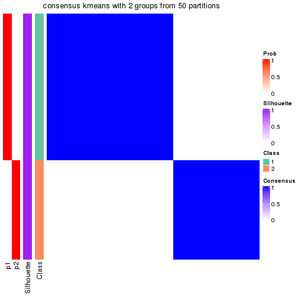</p>

</div>
<div id='tab-node-023-consensus-heatmap-2'>
<pre><code class="r">consensus_heatmap(res, k = 3)
</code></pre>

<p>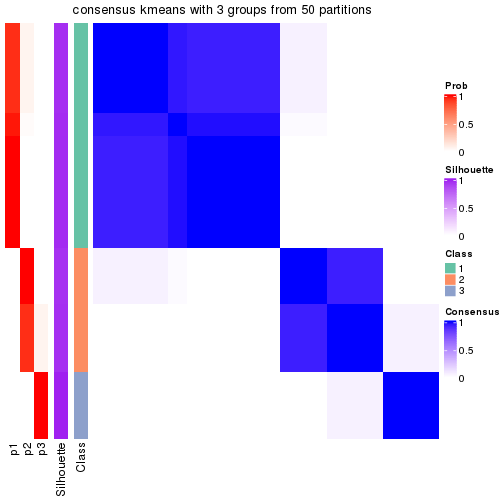</p>

</div>
<div id='tab-node-023-consensus-heatmap-3'>
<pre><code class="r">consensus_heatmap(res, k = 4)
</code></pre>

<p>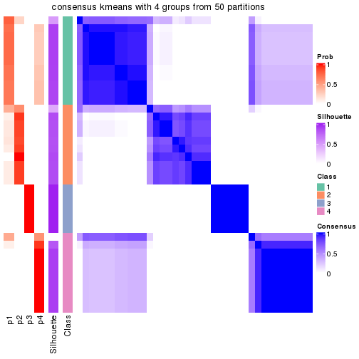</p>

</div>
<div id='tab-node-023-consensus-heatmap-4'>
<pre><code class="r">consensus_heatmap(res, k = 5)
</code></pre>

<p>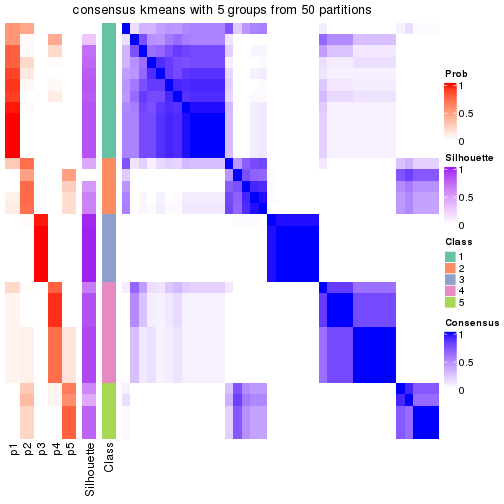</p>

</div>
<div id='tab-node-023-consensus-heatmap-5'>
<pre><code class="r">consensus_heatmap(res, k = 6)
</code></pre>

<p>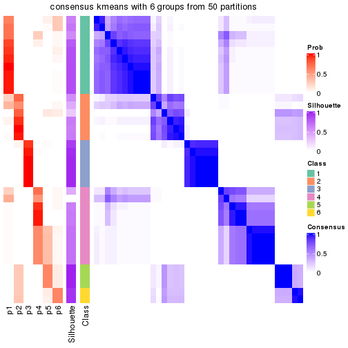</p>

</div>
<div id='tab-node-023-consensus-heatmap-6'>
<pre><code class="r">consensus_heatmap(res, k = 7)
</code></pre>

<p>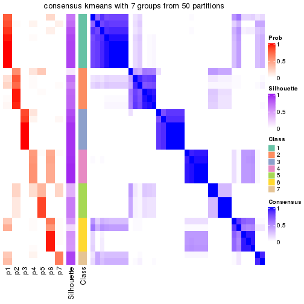</p>

</div>
<div id='tab-node-023-consensus-heatmap-7'>
<pre><code class="r">consensus_heatmap(res, k = 8)
</code></pre>

<p>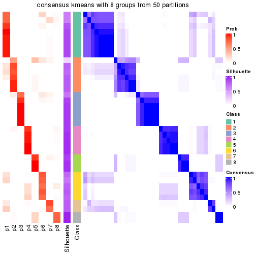</p>

</div>
</div>

Heatmaps for the membership of samples in all partitions to see how consistent they are:


<script>
$( function() {
	$( '#tabs-node-023-membership-heatmap' ).tabs();
} );
</script>
<div id='tabs-node-023-membership-heatmap'>
<ul>
<li><a href='#tab-node-023-membership-heatmap-1'>k = 2</a></li>
<li><a href='#tab-node-023-membership-heatmap-2'>k = 3</a></li>
<li><a href='#tab-node-023-membership-heatmap-3'>k = 4</a></li>
<li><a href='#tab-node-023-membership-heatmap-4'>k = 5</a></li>
<li><a href='#tab-node-023-membership-heatmap-5'>k = 6</a></li>
<li><a href='#tab-node-023-membership-heatmap-6'>k = 7</a></li>
<li><a href='#tab-node-023-membership-heatmap-7'>k = 8</a></li>
</ul>
<div id='tab-node-023-membership-heatmap-1'>
<pre><code class="r">membership_heatmap(res, k = 2)
</code></pre>

<p>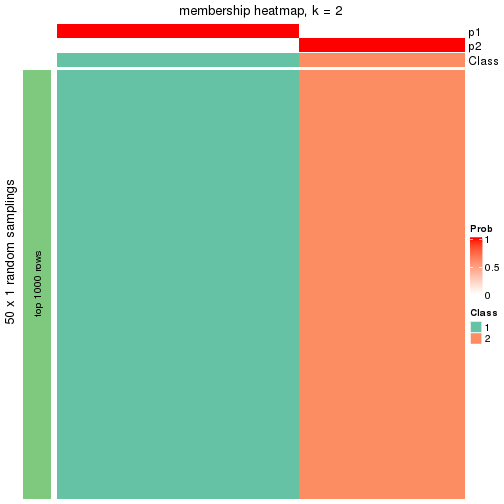</p>

</div>
<div id='tab-node-023-membership-heatmap-2'>
<pre><code class="r">membership_heatmap(res, k = 3)
</code></pre>

<p>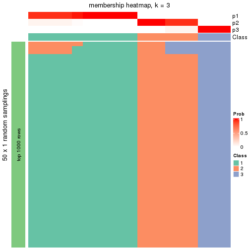</p>

</div>
<div id='tab-node-023-membership-heatmap-3'>
<pre><code class="r">membership_heatmap(res, k = 4)
</code></pre>

<p>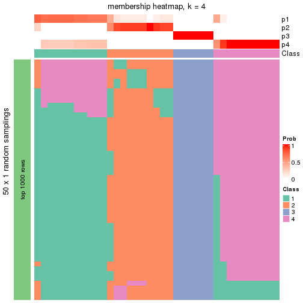</p>

</div>
<div id='tab-node-023-membership-heatmap-4'>
<pre><code class="r">membership_heatmap(res, k = 5)
</code></pre>

<p>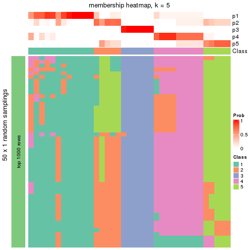</p>

</div>
<div id='tab-node-023-membership-heatmap-5'>
<pre><code class="r">membership_heatmap(res, k = 6)
</code></pre>

<p>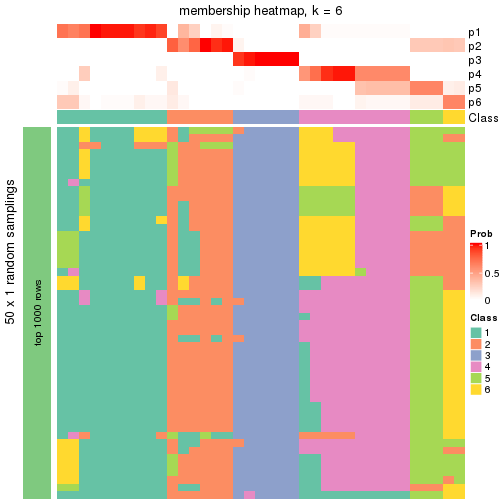</p>

</div>
<div id='tab-node-023-membership-heatmap-6'>
<pre><code class="r">membership_heatmap(res, k = 7)
</code></pre>

<p>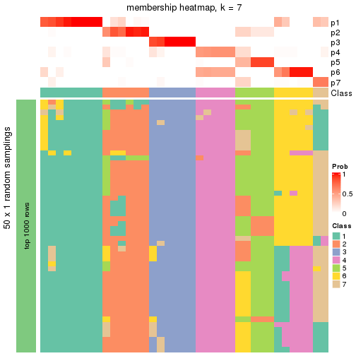</p>

</div>
<div id='tab-node-023-membership-heatmap-7'>
<pre><code class="r">membership_heatmap(res, k = 8)
</code></pre>

<p>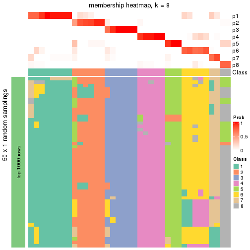</p>

</div>
</div>

As soon as the classes for columns are determined, the signatures
that are significantly different between subgroups can be looked for. 
Following are the heatmaps for signatures.


<script>
$( function() {
	$( '#tabs-node-023-get-signatures' ).tabs();
} );
</script>
<div id='tabs-node-023-get-signatures'>
<ul>
<li><a href='#tab-node-023-get-signatures-1'>k = 2</a></li>
<li><a href='#tab-node-023-get-signatures-2'>k = 3</a></li>
<li><a href='#tab-node-023-get-signatures-3'>k = 4</a></li>
<li><a href='#tab-node-023-get-signatures-4'>k = 5</a></li>
<li><a href='#tab-node-023-get-signatures-5'>k = 6</a></li>
<li><a href='#tab-node-023-get-signatures-6'>k = 7</a></li>
<li><a href='#tab-node-023-get-signatures-7'>k = 8</a></li>
</ul>
<div id='tab-node-023-get-signatures-1'>
<pre><code class="r">get_signatures(res, k = 2)
</code></pre>

<p>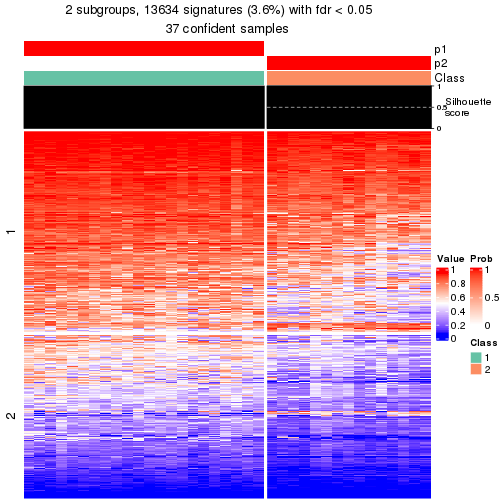</p>

</div>
<div id='tab-node-023-get-signatures-2'>
<pre><code class="r">get_signatures(res, k = 3)
</code></pre>

<p>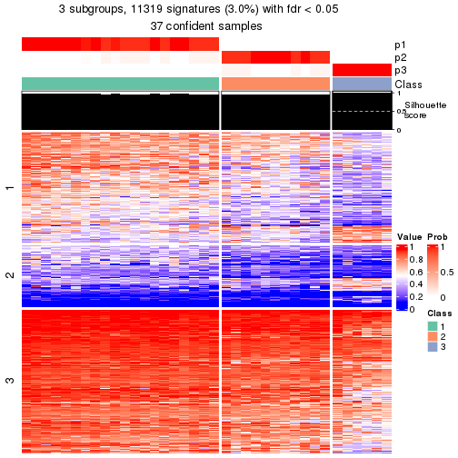</p>

</div>
<div id='tab-node-023-get-signatures-3'>
<pre><code class="r">get_signatures(res, k = 4)
</code></pre>

<p>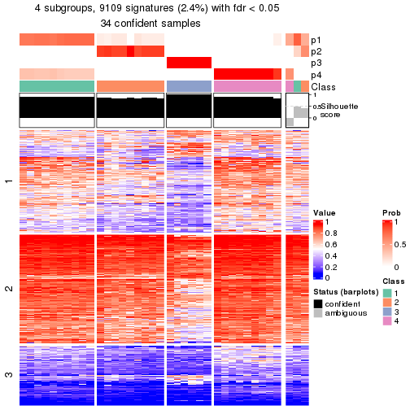</p>

</div>
<div id='tab-node-023-get-signatures-4'>
<pre><code class="r">get_signatures(res, k = 5)
</code></pre>

<p>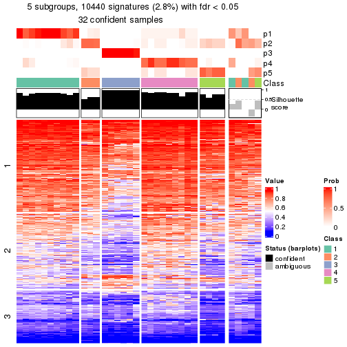</p>

</div>
<div id='tab-node-023-get-signatures-5'>
<pre><code class="r">get_signatures(res, k = 6)
</code></pre>

<p>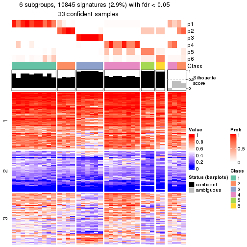</p>

</div>
<div id='tab-node-023-get-signatures-6'>
<pre><code class="r">get_signatures(res, k = 7)
</code></pre>

<p>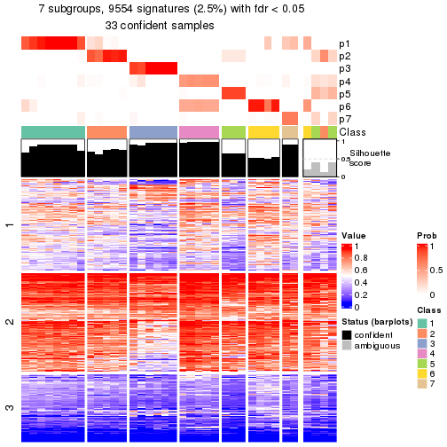</p>

</div>
<div id='tab-node-023-get-signatures-7'>
<pre><code class="r">get_signatures(res, k = 8)
</code></pre>

<p>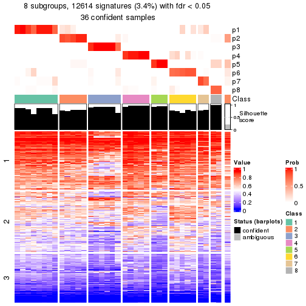</p>

</div>
</div>


Compare the overlap of signatures from different k:

```r
compare_signatures(res)
```

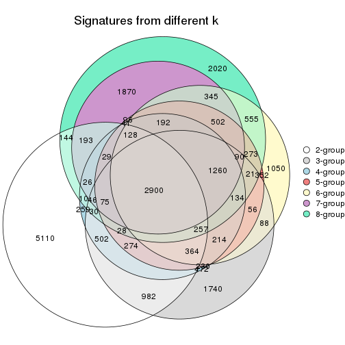

`get_signature()` returns a data frame invisibly. To get the list of signatures, the function
call should be assigned to a variable explicitly. In following code, if `plot` argument is set
to `FALSE`, no heatmap is plotted while only the differential analysis is performed.

```r
# code only for demonstration
tb = get_signature(res, k = ..., plot = FALSE)
```

An example of the output of `tb` is:

```
#>   which_row         fdr    mean_1    mean_2 scaled_mean_1 scaled_mean_2 km
#> 1        38 0.042760348  8.373488  9.131774    -0.5533452     0.5164555  1
#> 2        40 0.018707592  7.106213  8.469186    -0.6173731     0.5762149  1
#> 3        55 0.019134737 10.221463 11.207825    -0.6159697     0.5749050  1
#> 4        59 0.006059896  5.921854  7.869574    -0.6899429     0.6439467  1
#> 5        60 0.018055526  8.928898 10.211722    -0.6204761     0.5791110  1
#> 6        98 0.009384629 15.714769 14.887706     0.6635654    -0.6193277  2
...
```

The columns in `tb` are:

1. `which_row`: row indices corresponding to the input matrix.
2. `fdr`: FDR for the differential test. 
3. `mean_x`: The mean value in group x.
4. `scaled_mean_x`: The mean value in group x after rows are scaled.
5. `km`: Row groups if k-means clustering is applied to rows (which is done by automatically selecting number of clusters).

If there are too many signatures, `top_signatures = ...` can be set to only show the 
signatures with the highest FDRs:

```r
# code only for demonstration
# e.g. to show the top 500 most significant rows
tb = get_signature(res, k = ..., top_signatures = 500)
```

If the signatures are defined as these which are uniquely high in current group, `diff_method` argument
can be set to `"uniquely_high_in_one_group"`:

```r
# code only for demonstration
tb = get_signature(res, k = ..., diff_method = "uniquely_high_in_one_group")
```


UMAP plot which shows how samples are separated.


<script>
$( function() {
	$( '#tabs-node-023-dimension-reduction' ).tabs();
} );
</script>
<div id='tabs-node-023-dimension-reduction'>
<ul>
<li><a href='#tab-node-023-dimension-reduction-1'>k = 2</a></li>
<li><a href='#tab-node-023-dimension-reduction-2'>k = 3</a></li>
<li><a href='#tab-node-023-dimension-reduction-3'>k = 4</a></li>
<li><a href='#tab-node-023-dimension-reduction-4'>k = 5</a></li>
<li><a href='#tab-node-023-dimension-reduction-5'>k = 6</a></li>
<li><a href='#tab-node-023-dimension-reduction-6'>k = 7</a></li>
<li><a href='#tab-node-023-dimension-reduction-7'>k = 8</a></li>
</ul>
<div id='tab-node-023-dimension-reduction-1'>
<pre><code class="r">dimension_reduction(res, k = 2, method = &quot;UMAP&quot;)
</code></pre>

<p>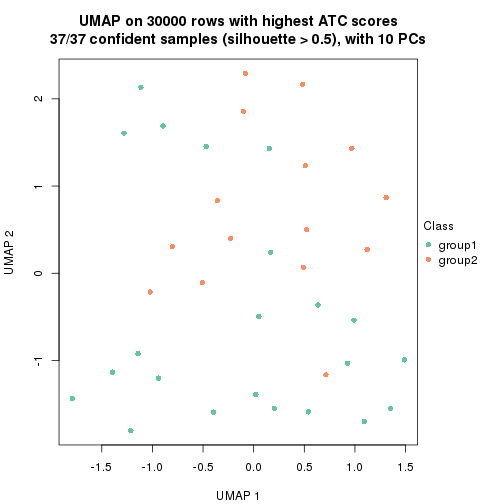</p>

</div>
<div id='tab-node-023-dimension-reduction-2'>
<pre><code class="r">dimension_reduction(res, k = 3, method = &quot;UMAP&quot;)
</code></pre>

<p>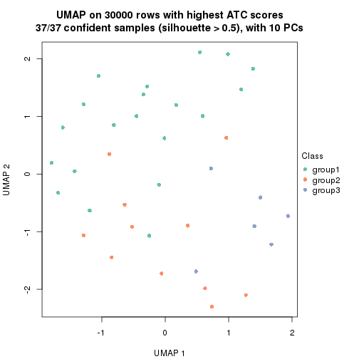</p>

</div>
<div id='tab-node-023-dimension-reduction-3'>
<pre><code class="r">dimension_reduction(res, k = 4, method = &quot;UMAP&quot;)
</code></pre>

<p>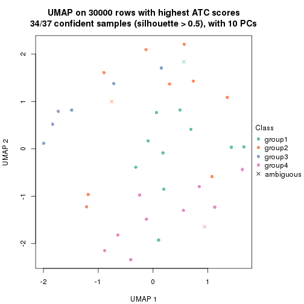</p>

</div>
<div id='tab-node-023-dimension-reduction-4'>
<pre><code class="r">dimension_reduction(res, k = 5, method = &quot;UMAP&quot;)
</code></pre>

<p>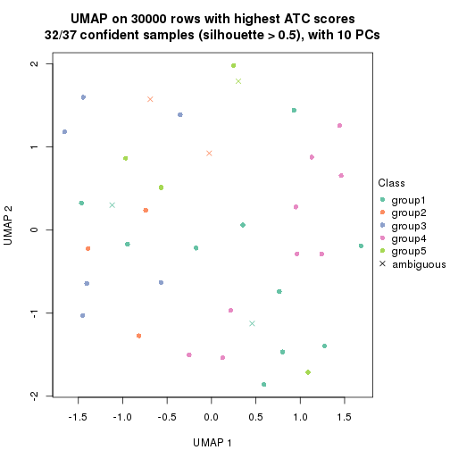</p>

</div>
<div id='tab-node-023-dimension-reduction-5'>
<pre><code class="r">dimension_reduction(res, k = 6, method = &quot;UMAP&quot;)
</code></pre>

<p>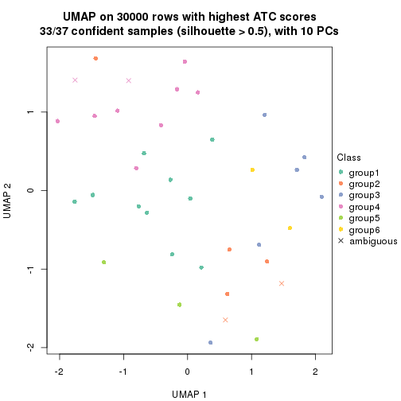</p>

</div>
<div id='tab-node-023-dimension-reduction-6'>
<pre><code class="r">dimension_reduction(res, k = 7, method = &quot;UMAP&quot;)
</code></pre>

<p>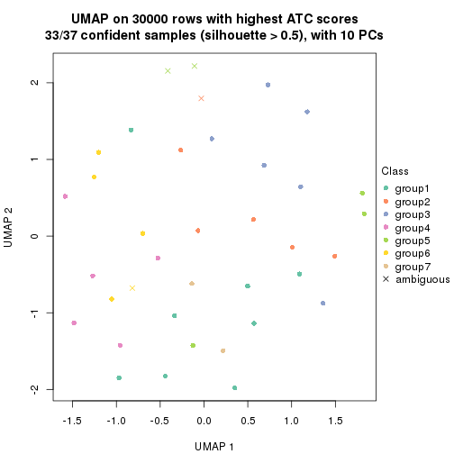</p>

</div>
<div id='tab-node-023-dimension-reduction-7'>
<pre><code class="r">dimension_reduction(res, k = 8, method = &quot;UMAP&quot;)
</code></pre>

<p>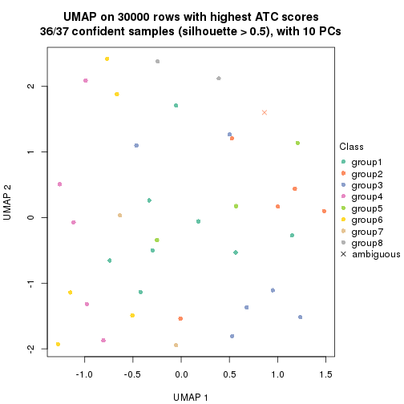</p>

</div>
</div>


Following heatmap shows how subgroups are split when increasing `k`:

```r
collect_classes(res)
```

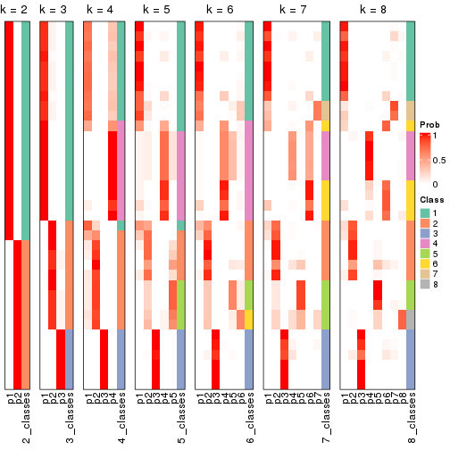


If matrix rows can be associated to genes, consider to use `functional_enrichment(res,
...)` to perform function enrichment for the signature genes. See [this vignette](https://jokergoo.github.io/cola_vignettes/functional_enrichment.html) for more detailed explanations.


 

---------------------------------------------------


### Node0231


Parent node: [Node023](#Node023).
Child nodes: 
                Node01111-leaf
        ,
                Node01112-leaf
        ,
                Node01113-leaf
        ,
                Node01121-leaf
        ,
                Node01122-leaf
        ,
                Node01123-leaf
        ,
                Node01131-leaf
        ,
                [Node01132](#Node01132)
        ,
                Node01211-leaf
        ,
                Node01212-leaf
        ,
                Node01213-leaf
        ,
                Node01214-leaf
        ,
                Node01411-leaf
        ,
                Node01412-leaf
        ,
                Node01413-leaf
        ,
                Node01414-leaf
        ,
                Node02311-leaf
        ,
                Node02312-leaf
        ,
                Node02313-leaf
        .


The object with results only for a single top-value method and a single partitioning method 
can be extracted as:

```r
res = res_rh["0231"]
```

A summary of `res` and all the functions that can be applied to it:

```r
res
```

```
#> A 'ConsensusPartition' object with k = 2, 3, 4, 5, 6, 7, 8.
#>   On a matrix with 30000 rows and 20 columns.
#>   Top rows (1000) are extracted by 'ATC' method.
#>   Subgroups are detected by 'skmeans' method.
#>   Performed in total 350 partitions by row resampling.
#>   Best k for subgroups seems to be 3.
#> 
#> Following methods can be applied to this 'ConsensusPartition' object:
#>  [1] "cola_report"             "collect_classes"         "collect_plots"          
#>  [4] "collect_stats"           "colnames"                "compare_partitions"     
#>  [7] "compare_signatures"      "consensus_heatmap"       "dimension_reduction"    
#> [10] "functional_enrichment"   "get_anno_col"            "get_anno"               
#> [13] "get_classes"             "get_consensus"           "get_matrix"             
#> [16] "get_membership"          "get_param"               "get_signatures"         
#> [19] "get_stats"               "is_best_k"               "is_stable_k"            
#> [22] "membership_heatmap"      "ncol"                    "nrow"                   
#> [25] "plot_ecdf"               "predict_classes"         "rownames"               
#> [28] "select_partition_number" "show"                    "suggest_best_k"         
#> [31] "test_to_known_factors"   "top_rows_heatmap"
```

`collect_plots()` function collects all the plots made from `res` for all `k` (number of subgroups)
into one single page to provide an easy and fast comparison between different `k`.

```r
collect_plots(res)
```

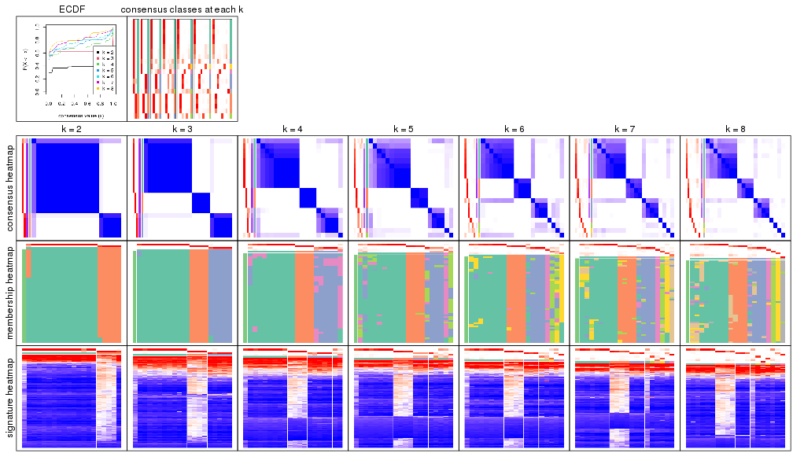

The plots are:

- The first row: a plot of the eCDF (empirical cumulative distribution
  function) curves of the consensus matrix for each `k` and the heatmap of
  predicted classes for each `k`.
- The second row: heatmaps of the consensus matrix for each `k`.
- The third row: heatmaps of the membership matrix for each `k`.
- The fouth row: heatmaps of the signatures for each `k`.

All the plots in panels can be made by individual functions and they are
plotted later in this section.

`select_partition_number()` produces several plots showing different
statistics for choosing "optimized" `k`. There are following statistics:

- eCDF curves of the consensus matrix for each `k`;
- 1-PAC. [The PAC score](https://en.wikipedia.org/wiki/Consensus_clustering#Over-interpretation_potential_of_consensus_clustering)
  measures the proportion of the ambiguous subgrouping.
- Mean silhouette score.
- Concordance. The mean probability of fiting the consensus subgroup labels in all
  partitions.
- Area increased. Denote $A_k$ as the area under the eCDF curve for current
  `k`, the area increased is defined as $A_k - A_{k-1}$.
- Rand index. The percent of pairs of samples that are both in a same cluster
  or both are not in a same cluster in the partition of k and k-1.
- Jaccard index. The ratio of pairs of samples are both in a same cluster in
  the partition of k and k-1 and the pairs of samples are both in a same
  cluster in the partition k or k-1.

The detailed explanations of these statistics can be found in [the _cola_
vignette](https://jokergoo.github.io/cola_vignettes/cola.html#toc_13).

Generally speaking, higher 1-PAC score, higher mean silhouette score or higher
concordance corresponds to better partition. Rand index and Jaccard index
measure how similar the current partition is compared to partition with `k-1`.
If they are too similar, we won't accept `k` is better than `k-1`.

```r
select_partition_number(res)
```

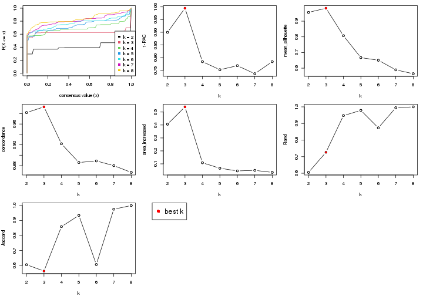

The numeric values for all these statistics can be obtained by `get_stats()`.

```r
get_stats(res)
```

```
#>   k 1-PAC mean_silhouette concordance area_increased  Rand Jaccard
#> 2 2 0.900           0.956       0.982         0.4061 0.605   0.605
#> 3 3 0.995           0.983       0.993         0.5398 0.726   0.563
#> 4 4 0.784           0.807       0.922         0.1084 0.947   0.859
#> 5 5 0.753           0.667       0.886         0.0661 0.979   0.934
#> 6 6 0.768           0.651       0.889         0.0454 0.874   0.607
#> 7 7 0.737           0.589       0.880         0.0499 0.995   0.976
#> 8 8 0.784           0.565       0.867         0.0341 1.000   1.000
```

`suggest_best_k()` suggests the best $k$ based on these statistics. The rules are as follows:

- All $k$ with Jaccard index larger than 0.95 are removed because increasing
  $k$ does not provide enough extra information. If all $k$ are removed, it is
  marked as no subgroup is detected.
- For all $k$ with 1-PAC score larger than 0.9, the maximal $k$ is taken as
  the best $k$, and other $k$ are marked as optional $k$.
- If it does not fit the second rule. The $k$ with the maximal vote of the
  highest 1-PAC score, highest mean silhouette, and highest concordance is
  taken as the best $k$.

```r
suggest_best_k(res)
```

```
#> [1] 3
```


Following is the table of the partitions (You need to click the **show/hide
code output** link to see it). The membership matrix (columns with name `p*`)
is inferred by
[`clue::cl_consensus()`](https://www.rdocumentation.org/link/cl_consensus?package=clue)
function with the `SE` method. Basically the value in the membership matrix
represents the probability to belong to a certain group. The finall subgroup
label for an item is determined with the group with highest probability it
belongs to.

In `get_classes()` function, the entropy is calculated from the membership
matrix and the silhouette score is calculated from the consensus matrix.


<script>
$( function() {
	$( '#tabs-node-0231-get-classes' ).tabs();
} );
</script>
<div id='tabs-node-0231-get-classes'>
<ul>
<li><a href='#tab-node-0231-get-classes-1'>k = 2</a></li>
<li><a href='#tab-node-0231-get-classes-2'>k = 3</a></li>
<li><a href='#tab-node-0231-get-classes-3'>k = 4</a></li>
<li><a href='#tab-node-0231-get-classes-4'>k = 5</a></li>
<li><a href='#tab-node-0231-get-classes-5'>k = 6</a></li>
<li><a href='#tab-node-0231-get-classes-6'>k = 7</a></li>
<li><a href='#tab-node-0231-get-classes-7'>k = 8</a></li>
</ul>

<div id='tab-node-0231-get-classes-1'>
<p><a id='tab-node-0231-get-classes-1-a' style='color:#0366d6' href='#'>show/hide code output</a></p>
<pre><code class="r">cbind(get_classes(res, k = 2), get_membership(res, k = 2))
</code></pre>

<pre><code>#&gt;                 class entropy silhouette   p1   p2
#&gt; TCGA.T9.A92H.01     1   0.000      0.978 1.00 0.00
#&gt; TCGA.A6.A56B.01     2   0.327      0.933 0.06 0.94
#&gt; TCGA.D5.6926.01     1   0.000      0.978 1.00 0.00
#&gt; TCGA.AA.3712.01     1   0.000      0.978 1.00 0.00
#&gt; TCGA.AA.3511.01     1   0.000      0.978 1.00 0.00
#&gt; TCGA.D5.6924.01     1   0.000      0.978 1.00 0.00
#&gt; TCGA.CM.6676.01     1   0.000      0.978 1.00 0.00
#&gt; TCGA.CM.6679.01     1   0.000      0.978 1.00 0.00
#&gt; TCGA.CM.6161.01     2   0.000      0.984 0.00 1.00
#&gt; TCGA.A6.6782.01     1   0.000      0.978 1.00 0.00
#&gt; TCGA.D5.6932.01     1   0.000      0.978 1.00 0.00
#&gt; TCGA.A6.5656.01     1   0.000      0.978 1.00 0.00
#&gt; TCGA.G4.6303.01     2   0.000      0.984 0.00 1.00
#&gt; TCGA.5M.AATA.01     1   0.881      0.561 0.70 0.30
#&gt; TCGA.G4.6311.01     1   0.000      0.978 1.00 0.00
#&gt; TCGA.F4.6854.01     1   0.000      0.978 1.00 0.00
#&gt; TCGA.G4.6315.01     1   0.000      0.978 1.00 0.00
#&gt; TCGA.A6.6652.01     1   0.000      0.978 1.00 0.00
#&gt; TCGA.D5.6533.01     2   0.000      0.984 0.00 1.00
#&gt; TCGA.DM.A0XF.01     2   0.000      0.984 0.00 1.00
</code></pre>

<script>
$('#tab-node-0231-get-classes-1-a').parent().next().next().hide();
$('#tab-node-0231-get-classes-1-a').click(function(){
  $('#tab-node-0231-get-classes-1-a').parent().next().next().toggle();
  return(false);
});
</script>
</div>

<div id='tab-node-0231-get-classes-2'>
<p><a id='tab-node-0231-get-classes-2-a' style='color:#0366d6' href='#'>show/hide code output</a></p>
<pre><code class="r">cbind(get_classes(res, k = 3), get_membership(res, k = 3))
</code></pre>

<pre><code>#&gt;                 class entropy silhouette   p1 p2   p3
#&gt; TCGA.T9.A92H.01     1   0.000      0.994 1.00  0 0.00
#&gt; TCGA.A6.A56B.01     3   0.000      0.973 0.00  0 1.00
#&gt; TCGA.D5.6926.01     1   0.000      0.994 1.00  0 0.00
#&gt; TCGA.AA.3712.01     1   0.000      0.994 1.00  0 0.00
#&gt; TCGA.AA.3511.01     1   0.000      0.994 1.00  0 0.00
#&gt; TCGA.D5.6924.01     1   0.000      0.994 1.00  0 0.00
#&gt; TCGA.CM.6676.01     3   0.000      0.973 0.00  0 1.00
#&gt; TCGA.CM.6679.01     1   0.000      0.994 1.00  0 0.00
#&gt; TCGA.CM.6161.01     2   0.000      1.000 0.00  1 0.00
#&gt; TCGA.A6.6782.01     1   0.000      0.994 1.00  0 0.00
#&gt; TCGA.D5.6932.01     1   0.000      0.994 1.00  0 0.00
#&gt; TCGA.A6.5656.01     1   0.000      0.994 1.00  0 0.00
#&gt; TCGA.G4.6303.01     2   0.000      1.000 0.00  1 0.00
#&gt; TCGA.5M.AATA.01     3   0.000      0.973 0.00  0 1.00
#&gt; TCGA.G4.6311.01     1   0.207      0.935 0.94  0 0.06
#&gt; TCGA.F4.6854.01     1   0.000      0.994 1.00  0 0.00
#&gt; TCGA.G4.6315.01     3   0.000      0.973 0.00  0 1.00
#&gt; TCGA.A6.6652.01     3   0.254      0.890 0.08  0 0.92
#&gt; TCGA.D5.6533.01     2   0.000      1.000 0.00  1 0.00
#&gt; TCGA.DM.A0XF.01     2   0.000      1.000 0.00  1 0.00
</code></pre>

<script>
$('#tab-node-0231-get-classes-2-a').parent().next().next().hide();
$('#tab-node-0231-get-classes-2-a').click(function(){
  $('#tab-node-0231-get-classes-2-a').parent().next().next().toggle();
  return(false);
});
</script>
</div>

<div id='tab-node-0231-get-classes-3'>
<p><a id='tab-node-0231-get-classes-3-a' style='color:#0366d6' href='#'>show/hide code output</a></p>
<pre><code class="r">cbind(get_classes(res, k = 4), get_membership(res, k = 4))
</code></pre>

<pre><code>#&gt;                 class entropy silhouette   p1 p2   p3   p4
#&gt; TCGA.T9.A92H.01     1   0.265      0.837 0.88  0 0.00 0.12
#&gt; TCGA.A6.A56B.01     3   0.361      0.729 0.00  0 0.80 0.20
#&gt; TCGA.D5.6926.01     1   0.000      0.921 1.00  0 0.00 0.00
#&gt; TCGA.AA.3712.01     4   0.669      0.000 0.18  0 0.20 0.62
#&gt; TCGA.AA.3511.01     1   0.000      0.921 1.00  0 0.00 0.00
#&gt; TCGA.D5.6924.01     1   0.000      0.921 1.00  0 0.00 0.00
#&gt; TCGA.CM.6676.01     3   0.000      0.823 0.00  0 1.00 0.00
#&gt; TCGA.CM.6679.01     1   0.000      0.921 1.00  0 0.00 0.00
#&gt; TCGA.CM.6161.01     2   0.000      1.000 0.00  1 0.00 0.00
#&gt; TCGA.A6.6782.01     1   0.000      0.921 1.00  0 0.00 0.00
#&gt; TCGA.D5.6932.01     1   0.000      0.921 1.00  0 0.00 0.00
#&gt; TCGA.A6.5656.01     1   0.164      0.892 0.94  0 0.00 0.06
#&gt; TCGA.G4.6303.01     2   0.000      1.000 0.00  1 0.00 0.00
#&gt; TCGA.5M.AATA.01     3   0.000      0.823 0.00  0 1.00 0.00
#&gt; TCGA.G4.6311.01     1   0.517      0.290 0.66  0 0.32 0.02
#&gt; TCGA.F4.6854.01     1   0.121      0.902 0.96  0 0.00 0.04
#&gt; TCGA.G4.6315.01     3   0.000      0.823 0.00  0 1.00 0.00
#&gt; TCGA.A6.6652.01     3   0.491      0.502 0.00  0 0.58 0.42
#&gt; TCGA.D5.6533.01     2   0.000      1.000 0.00  1 0.00 0.00
#&gt; TCGA.DM.A0XF.01     2   0.000      1.000 0.00  1 0.00 0.00
</code></pre>

<script>
$('#tab-node-0231-get-classes-3-a').parent().next().next().hide();
$('#tab-node-0231-get-classes-3-a').click(function(){
  $('#tab-node-0231-get-classes-3-a').parent().next().next().toggle();
  return(false);
});
</script>
</div>

<div id='tab-node-0231-get-classes-4'>
<p><a id='tab-node-0231-get-classes-4-a' style='color:#0366d6' href='#'>show/hide code output</a></p>
<pre><code class="r">cbind(get_classes(res, k = 5), get_membership(res, k = 5))
</code></pre>

<pre><code>#&gt;                 class entropy silhouette   p1   p2   p3   p4   p5
#&gt; TCGA.T9.A92H.01     1  0.6146      0.385 0.56 0.00 0.00 0.24 0.20
#&gt; TCGA.A6.A56B.01     3  0.0609      0.200 0.00 0.00 0.98 0.02 0.00
#&gt; TCGA.D5.6926.01     1  0.0000      0.837 1.00 0.00 0.00 0.00 0.00
#&gt; TCGA.AA.3712.01     4  0.3421      0.000 0.08 0.00 0.00 0.84 0.08
#&gt; TCGA.AA.3511.01     1  0.0000      0.837 1.00 0.00 0.00 0.00 0.00
#&gt; TCGA.D5.6924.01     1  0.0609      0.829 0.98 0.00 0.00 0.02 0.00
#&gt; TCGA.CM.6676.01     3  0.4227      0.780 0.00 0.00 0.58 0.00 0.42
#&gt; TCGA.CM.6679.01     1  0.0000      0.837 1.00 0.00 0.00 0.00 0.00
#&gt; TCGA.CM.6161.01     2  0.0000      0.988 0.00 1.00 0.00 0.00 0.00
#&gt; TCGA.A6.6782.01     1  0.0000      0.837 1.00 0.00 0.00 0.00 0.00
#&gt; TCGA.D5.6932.01     1  0.1648      0.812 0.94 0.00 0.00 0.04 0.02
#&gt; TCGA.A6.5656.01     1  0.2438      0.799 0.90 0.00 0.00 0.06 0.04
#&gt; TCGA.G4.6303.01     2  0.0609      0.988 0.00 0.98 0.00 0.00 0.02
#&gt; TCGA.5M.AATA.01     3  0.4182      0.775 0.00 0.00 0.60 0.00 0.40
#&gt; TCGA.G4.6311.01     1  0.7159     -0.107 0.44 0.00 0.12 0.06 0.38
#&gt; TCGA.F4.6854.01     1  0.3034      0.789 0.88 0.00 0.02 0.06 0.04
#&gt; TCGA.G4.6315.01     3  0.4227      0.780 0.00 0.00 0.58 0.00 0.42
#&gt; TCGA.A6.6652.01     5  0.6036      0.000 0.02 0.00 0.28 0.10 0.60
#&gt; TCGA.D5.6533.01     2  0.0000      0.988 0.00 1.00 0.00 0.00 0.00
#&gt; TCGA.DM.A0XF.01     2  0.0609      0.988 0.00 0.98 0.00 0.00 0.02
</code></pre>

<script>
$('#tab-node-0231-get-classes-4-a').parent().next().next().hide();
$('#tab-node-0231-get-classes-4-a').click(function(){
  $('#tab-node-0231-get-classes-4-a').parent().next().next().toggle();
  return(false);
});
</script>
</div>

<div id='tab-node-0231-get-classes-5'>
<p><a id='tab-node-0231-get-classes-5-a' style='color:#0366d6' href='#'>show/hide code output</a></p>
<pre><code class="r">cbind(get_classes(res, k = 6), get_membership(res, k = 6))
</code></pre>

<pre><code>#&gt;                 class entropy silhouette   p1   p2   p3   p4   p5   p6
#&gt; TCGA.T9.A92H.01     6  0.3076     0.0000 0.24 0.00 0.00 0.00 0.00 0.76
#&gt; TCGA.A6.A56B.01     5  0.3819     0.1839 0.00 0.00 0.28 0.00 0.70 0.02
#&gt; TCGA.D5.6926.01     1  0.0000     0.9129 1.00 0.00 0.00 0.00 0.00 0.00
#&gt; TCGA.AA.3712.01     4  0.0547     0.0000 0.00 0.00 0.02 0.98 0.00 0.00
#&gt; TCGA.AA.3511.01     1  0.0000     0.9129 1.00 0.00 0.00 0.00 0.00 0.00
#&gt; TCGA.D5.6924.01     1  0.1092     0.9001 0.96 0.00 0.00 0.02 0.00 0.02
#&gt; TCGA.CM.6676.01     3  0.0000     0.6488 0.00 0.00 1.00 0.00 0.00 0.00
#&gt; TCGA.CM.6679.01     1  0.0000     0.9129 1.00 0.00 0.00 0.00 0.00 0.00
#&gt; TCGA.CM.6161.01     2  0.0000     0.9819 0.00 1.00 0.00 0.00 0.00 0.00
#&gt; TCGA.A6.6782.01     1  0.0547     0.9077 0.98 0.00 0.00 0.00 0.00 0.02
#&gt; TCGA.D5.6932.01     1  0.1267     0.8788 0.94 0.00 0.00 0.00 0.00 0.06
#&gt; TCGA.A6.5656.01     1  0.2581     0.8126 0.86 0.00 0.00 0.00 0.02 0.12
#&gt; TCGA.G4.6303.01     2  0.0000     0.9819 0.00 1.00 0.00 0.00 0.00 0.00
#&gt; TCGA.5M.AATA.01     3  0.0937     0.6252 0.00 0.00 0.96 0.00 0.04 0.00
#&gt; TCGA.G4.6311.01     3  0.4328     0.0215 0.46 0.00 0.52 0.02 0.00 0.00
#&gt; TCGA.F4.6854.01     1  0.3660     0.6697 0.78 0.00 0.06 0.00 0.00 0.16
#&gt; TCGA.G4.6315.01     3  0.0000     0.6488 0.00 0.00 1.00 0.00 0.00 0.00
#&gt; TCGA.A6.6652.01     5  0.7251     0.0890 0.00 0.00 0.20 0.12 0.40 0.28
#&gt; TCGA.D5.6533.01     2  0.0000     0.9819 0.00 1.00 0.00 0.00 0.00 0.00
#&gt; TCGA.DM.A0XF.01     2  0.1480     0.9444 0.00 0.94 0.00 0.00 0.02 0.04
</code></pre>

<script>
$('#tab-node-0231-get-classes-5-a').parent().next().next().hide();
$('#tab-node-0231-get-classes-5-a').click(function(){
  $('#tab-node-0231-get-classes-5-a').parent().next().next().toggle();
  return(false);
});
</script>
</div>

<div id='tab-node-0231-get-classes-6'>
<p><a id='tab-node-0231-get-classes-6-a' style='color:#0366d6' href='#'>show/hide code output</a></p>
<pre><code class="r">cbind(get_classes(res, k = 7), get_membership(res, k = 7))
</code></pre>

<pre><code>#&gt;                 class entropy silhouette   p1   p2   p3   p4   p5   p6   p7
#&gt; TCGA.T9.A92H.01     6  0.2376      0.000 0.12 0.00 0.00 0.02 0.00 0.86 0.00
#&gt; TCGA.A6.A56B.01     5  0.1886      0.000 0.00 0.00 0.12 0.00 0.88 0.00 0.00
#&gt; TCGA.D5.6926.01     1  0.0000      0.832 1.00 0.00 0.00 0.00 0.00 0.00 0.00
#&gt; TCGA.AA.3712.01     4  0.0000      0.000 0.00 0.00 0.00 1.00 0.00 0.00 0.00
#&gt; TCGA.AA.3511.01     1  0.1006      0.818 0.96 0.00 0.00 0.00 0.00 0.02 0.02
#&gt; TCGA.D5.6924.01     1  0.0504      0.827 0.98 0.00 0.02 0.00 0.00 0.00 0.00
#&gt; TCGA.CM.6676.01     3  0.0504      0.740 0.00 0.00 0.98 0.00 0.02 0.00 0.00
#&gt; TCGA.CM.6679.01     1  0.0000      0.832 1.00 0.00 0.00 0.00 0.00 0.00 0.00
#&gt; TCGA.CM.6161.01     2  0.0504      0.917 0.00 0.98 0.00 0.00 0.02 0.00 0.00
#&gt; TCGA.A6.6782.01     1  0.0000      0.832 1.00 0.00 0.00 0.00 0.00 0.00 0.00
#&gt; TCGA.D5.6932.01     1  0.3770      0.605 0.74 0.00 0.00 0.00 0.00 0.18 0.08
#&gt; TCGA.A6.5656.01     1  0.3848      0.631 0.76 0.00 0.00 0.00 0.02 0.16 0.06
#&gt; TCGA.G4.6303.01     2  0.2016      0.907 0.00 0.90 0.00 0.00 0.04 0.00 0.06
#&gt; TCGA.5M.AATA.01     3  0.1928      0.702 0.00 0.00 0.90 0.00 0.08 0.00 0.02
#&gt; TCGA.G4.6311.01     3  0.5747      0.322 0.28 0.00 0.56 0.10 0.02 0.00 0.04
#&gt; TCGA.F4.6854.01     1  0.6388      0.287 0.54 0.00 0.10 0.00 0.02 0.16 0.18
#&gt; TCGA.G4.6315.01     3  0.0000      0.740 0.00 0.00 1.00 0.00 0.00 0.00 0.00
#&gt; TCGA.A6.6652.01     7  0.4732      0.000 0.00 0.00 0.08 0.02 0.14 0.04 0.72
#&gt; TCGA.D5.6533.01     2  0.0000      0.922 0.00 1.00 0.00 0.00 0.00 0.00 0.00
#&gt; TCGA.DM.A0XF.01     2  0.3114      0.871 0.00 0.84 0.00 0.00 0.04 0.04 0.08
</code></pre>

<script>
$('#tab-node-0231-get-classes-6-a').parent().next().next().hide();
$('#tab-node-0231-get-classes-6-a').click(function(){
  $('#tab-node-0231-get-classes-6-a').parent().next().next().toggle();
  return(false);
});
</script>
</div>

<div id='tab-node-0231-get-classes-7'>
<p><a id='tab-node-0231-get-classes-7-a' style='color:#0366d6' href='#'>show/hide code output</a></p>
<pre><code class="r">cbind(get_classes(res, k = 8), get_membership(res, k = 8))
</code></pre>

<pre><code>#&gt;                 class entropy silhouette   p1   p2   p3   p4   p5   p6   p7   p8
#&gt; TCGA.T9.A92H.01     6  0.1275      0.000 0.04 0.00 0.00 0.02 0.00 0.94 0.00 0.00
#&gt; TCGA.A6.A56B.01     5  0.1091      0.000 0.00 0.00 0.00 0.00 0.94 0.00 0.00 0.06
#&gt; TCGA.D5.6926.01     1  0.0808      0.789 0.96 0.00 0.00 0.00 0.00 0.00 0.04 0.00
#&gt; TCGA.AA.3712.01     4  0.0471      0.000 0.00 0.00 0.02 0.98 0.00 0.00 0.00 0.00
#&gt; TCGA.AA.3511.01     1  0.0000      0.791 1.00 0.00 0.00 0.00 0.00 0.00 0.00 0.00
#&gt; TCGA.D5.6924.01     1  0.2165      0.756 0.88 0.00 0.06 0.00 0.00 0.00 0.06 0.00
#&gt; TCGA.CM.6676.01     3  0.0471      0.783 0.00 0.00 0.98 0.00 0.00 0.00 0.02 0.00
#&gt; TCGA.CM.6679.01     1  0.0000      0.791 1.00 0.00 0.00 0.00 0.00 0.00 0.00 0.00
#&gt; TCGA.CM.6161.01     2  0.0000      0.856 0.00 1.00 0.00 0.00 0.00 0.00 0.00 0.00
#&gt; TCGA.A6.6782.01     1  0.0471      0.792 0.98 0.00 0.00 0.00 0.00 0.00 0.02 0.00
#&gt; TCGA.D5.6932.01     1  0.4406      0.492 0.64 0.00 0.00 0.00 0.02 0.08 0.26 0.00
#&gt; TCGA.A6.5656.01     1  0.4622      0.611 0.64 0.00 0.00 0.02 0.00 0.06 0.26 0.02
#&gt; TCGA.G4.6303.01     2  0.1765      0.827 0.00 0.88 0.00 0.00 0.00 0.00 0.12 0.00
#&gt; TCGA.5M.AATA.01     3  0.3454      0.684 0.00 0.00 0.80 0.00 0.04 0.02 0.12 0.02
#&gt; TCGA.G4.6311.01     3  0.5488      0.485 0.12 0.00 0.64 0.10 0.00 0.00 0.06 0.08
#&gt; TCGA.F4.6854.01     1  0.5710      0.355 0.44 0.00 0.04 0.04 0.00 0.08 0.40 0.00
#&gt; TCGA.G4.6315.01     3  0.0000      0.785 0.00 0.00 1.00 0.00 0.00 0.00 0.00 0.00
#&gt; TCGA.A6.6652.01     8  0.0000      0.000 0.00 0.00 0.00 0.00 0.00 0.00 0.00 1.00
#&gt; TCGA.D5.6533.01     2  0.0000      0.856 0.00 1.00 0.00 0.00 0.00 0.00 0.00 0.00
#&gt; TCGA.DM.A0XF.01     2  0.4459      0.638 0.00 0.64 0.00 0.02 0.02 0.04 0.28 0.00
</code></pre>

<script>
$('#tab-node-0231-get-classes-7-a').parent().next().next().hide();
$('#tab-node-0231-get-classes-7-a').click(function(){
  $('#tab-node-0231-get-classes-7-a').parent().next().next().toggle();
  return(false);
});
</script>
</div>
</div>

Heatmaps for the consensus matrix. It visualizes the probability of two
samples to be in a same group.


<script>
$( function() {
	$( '#tabs-node-0231-consensus-heatmap' ).tabs();
} );
</script>
<div id='tabs-node-0231-consensus-heatmap'>
<ul>
<li><a href='#tab-node-0231-consensus-heatmap-1'>k = 2</a></li>
<li><a href='#tab-node-0231-consensus-heatmap-2'>k = 3</a></li>
<li><a href='#tab-node-0231-consensus-heatmap-3'>k = 4</a></li>
<li><a href='#tab-node-0231-consensus-heatmap-4'>k = 5</a></li>
<li><a href='#tab-node-0231-consensus-heatmap-5'>k = 6</a></li>
<li><a href='#tab-node-0231-consensus-heatmap-6'>k = 7</a></li>
<li><a href='#tab-node-0231-consensus-heatmap-7'>k = 8</a></li>
</ul>
<div id='tab-node-0231-consensus-heatmap-1'>
<pre><code class="r">consensus_heatmap(res, k = 2)
</code></pre>

<p>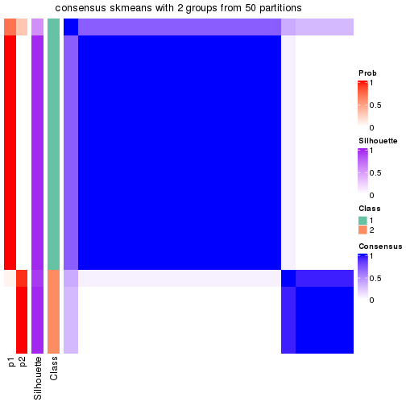</p>

</div>
<div id='tab-node-0231-consensus-heatmap-2'>
<pre><code class="r">consensus_heatmap(res, k = 3)
</code></pre>

<p>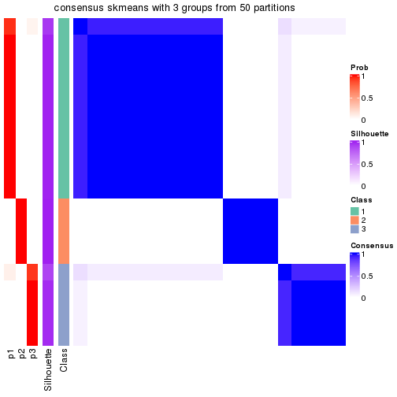</p>

</div>
<div id='tab-node-0231-consensus-heatmap-3'>
<pre><code class="r">consensus_heatmap(res, k = 4)
</code></pre>

<p>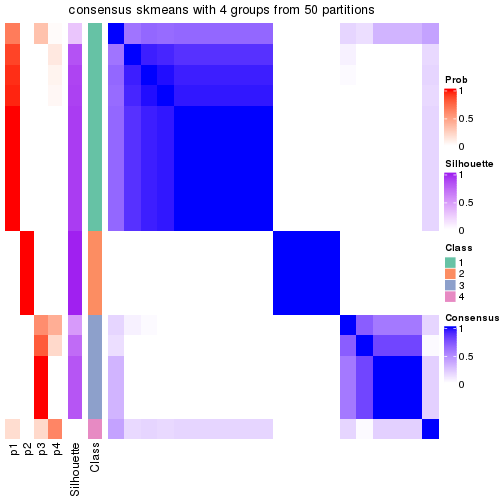</p>

</div>
<div id='tab-node-0231-consensus-heatmap-4'>
<pre><code class="r">consensus_heatmap(res, k = 5)
</code></pre>

<p>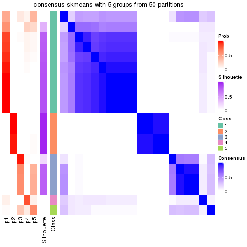</p>

</div>
<div id='tab-node-0231-consensus-heatmap-5'>
<pre><code class="r">consensus_heatmap(res, k = 6)
</code></pre>

<p>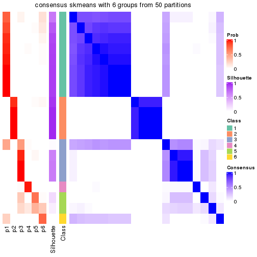</p>

</div>
<div id='tab-node-0231-consensus-heatmap-6'>
<pre><code class="r">consensus_heatmap(res, k = 7)
</code></pre>

<p>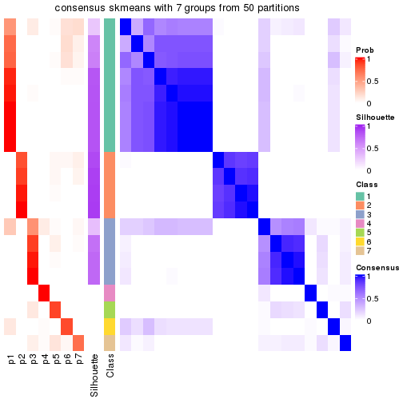</p>

</div>
<div id='tab-node-0231-consensus-heatmap-7'>
<pre><code class="r">consensus_heatmap(res, k = 8)
</code></pre>

<p>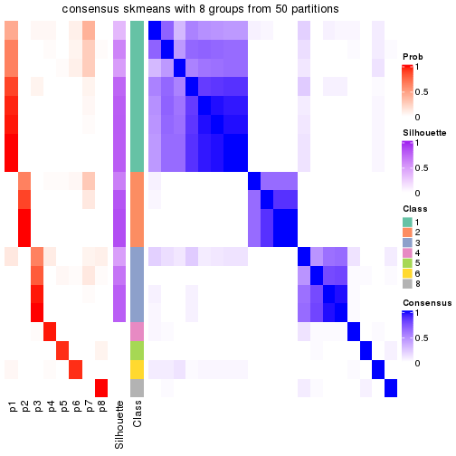</p>

</div>
</div>

Heatmaps for the membership of samples in all partitions to see how consistent they are:


<script>
$( function() {
	$( '#tabs-node-0231-membership-heatmap' ).tabs();
} );
</script>
<div id='tabs-node-0231-membership-heatmap'>
<ul>
<li><a href='#tab-node-0231-membership-heatmap-1'>k = 2</a></li>
<li><a href='#tab-node-0231-membership-heatmap-2'>k = 3</a></li>
<li><a href='#tab-node-0231-membership-heatmap-3'>k = 4</a></li>
<li><a href='#tab-node-0231-membership-heatmap-4'>k = 5</a></li>
<li><a href='#tab-node-0231-membership-heatmap-5'>k = 6</a></li>
<li><a href='#tab-node-0231-membership-heatmap-6'>k = 7</a></li>
<li><a href='#tab-node-0231-membership-heatmap-7'>k = 8</a></li>
</ul>
<div id='tab-node-0231-membership-heatmap-1'>
<pre><code class="r">membership_heatmap(res, k = 2)
</code></pre>

<p>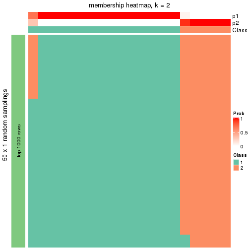</p>

</div>
<div id='tab-node-0231-membership-heatmap-2'>
<pre><code class="r">membership_heatmap(res, k = 3)
</code></pre>

<p>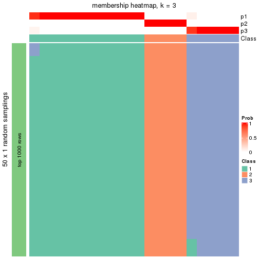</p>

</div>
<div id='tab-node-0231-membership-heatmap-3'>
<pre><code class="r">membership_heatmap(res, k = 4)
</code></pre>

<p>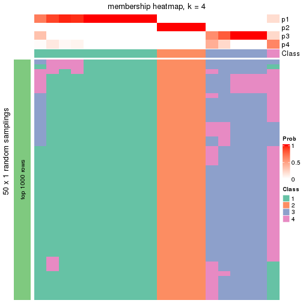</p>

</div>
<div id='tab-node-0231-membership-heatmap-4'>
<pre><code class="r">membership_heatmap(res, k = 5)
</code></pre>

<p>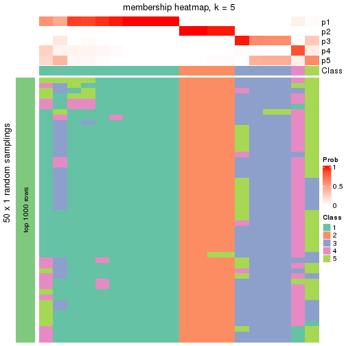</p>

</div>
<div id='tab-node-0231-membership-heatmap-5'>
<pre><code class="r">membership_heatmap(res, k = 6)
</code></pre>

<p>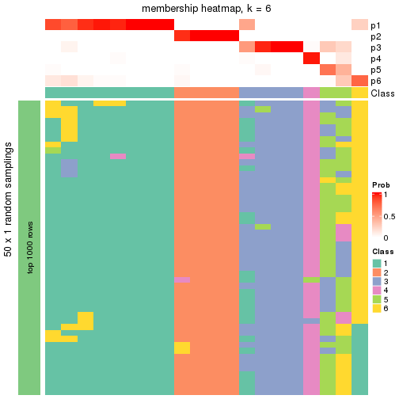</p>

</div>
<div id='tab-node-0231-membership-heatmap-6'>
<pre><code class="r">membership_heatmap(res, k = 7)
</code></pre>

<p>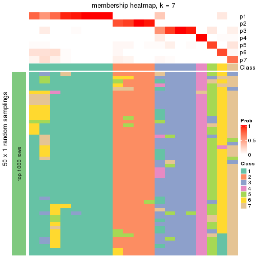</p>

</div>
<div id='tab-node-0231-membership-heatmap-7'>
<pre><code class="r">membership_heatmap(res, k = 8)
</code></pre>

<p>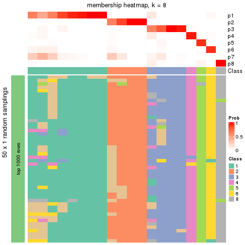</p>

</div>
</div>

As soon as the classes for columns are determined, the signatures
that are significantly different between subgroups can be looked for. 
Following are the heatmaps for signatures.


<script>
$( function() {
	$( '#tabs-node-0231-get-signatures' ).tabs();
} );
</script>
<div id='tabs-node-0231-get-signatures'>
<ul>
<li><a href='#tab-node-0231-get-signatures-1'>k = 2</a></li>
<li><a href='#tab-node-0231-get-signatures-2'>k = 3</a></li>
<li><a href='#tab-node-0231-get-signatures-3'>k = 4</a></li>
<li><a href='#tab-node-0231-get-signatures-4'>k = 5</a></li>
<li><a href='#tab-node-0231-get-signatures-5'>k = 6</a></li>
<li><a href='#tab-node-0231-get-signatures-6'>k = 7</a></li>
<li><a href='#tab-node-0231-get-signatures-7'>k = 8</a></li>
</ul>
<div id='tab-node-0231-get-signatures-1'>
<pre><code class="r">get_signatures(res, k = 2)
</code></pre>

<p>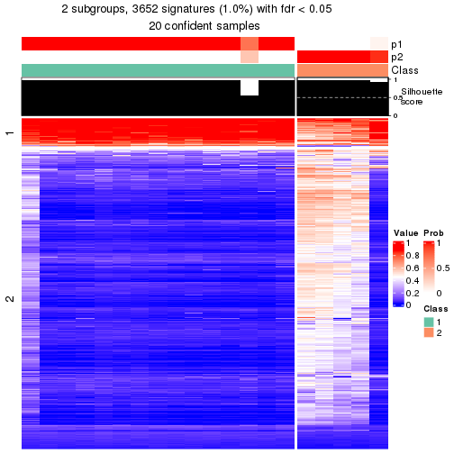</p>

</div>
<div id='tab-node-0231-get-signatures-2'>
<pre><code class="r">get_signatures(res, k = 3)
</code></pre>

<p>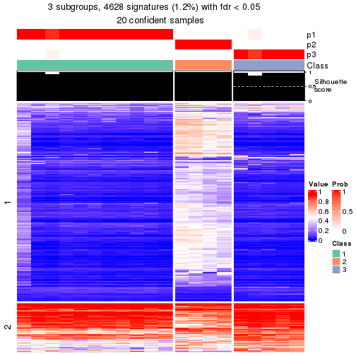</p>

</div>
<div id='tab-node-0231-get-signatures-3'>
<pre><code class="r">get_signatures(res, k = 4)
</code></pre>

<p>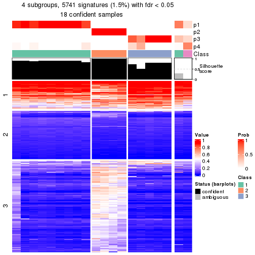</p>

</div>
<div id='tab-node-0231-get-signatures-4'>
<pre><code class="r">get_signatures(res, k = 5)
</code></pre>

<p>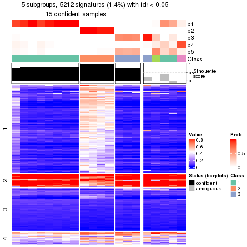</p>

</div>
<div id='tab-node-0231-get-signatures-5'>
<pre><code class="r">get_signatures(res, k = 6)
</code></pre>

<p>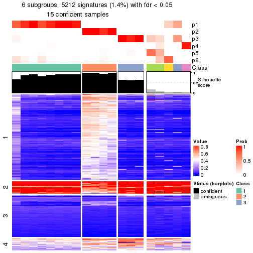</p>

</div>
<div id='tab-node-0231-get-signatures-6'>
<pre><code class="r">get_signatures(res, k = 7)
</code></pre>

<p>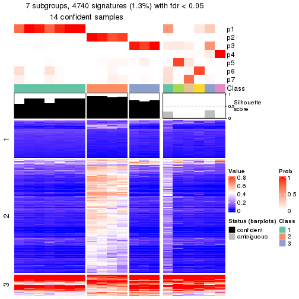</p>

</div>
<div id='tab-node-0231-get-signatures-7'>
<pre><code class="r">get_signatures(res, k = 8)
</code></pre>

<p>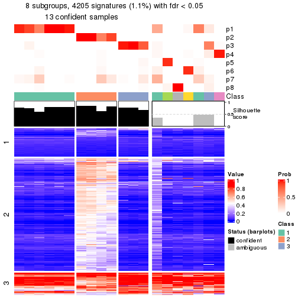</p>

</div>
</div>


Compare the overlap of signatures from different k:

```r
compare_signatures(res)
```

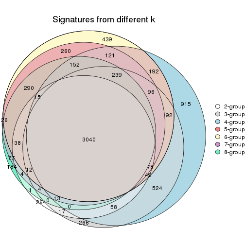

`get_signature()` returns a data frame invisibly. To get the list of signatures, the function
call should be assigned to a variable explicitly. In following code, if `plot` argument is set
to `FALSE`, no heatmap is plotted while only the differential analysis is performed.

```r
# code only for demonstration
tb = get_signature(res, k = ..., plot = FALSE)
```

An example of the output of `tb` is:

```
#>   which_row         fdr    mean_1    mean_2 scaled_mean_1 scaled_mean_2 km
#> 1        38 0.042760348  8.373488  9.131774    -0.5533452     0.5164555  1
#> 2        40 0.018707592  7.106213  8.469186    -0.6173731     0.5762149  1
#> 3        55 0.019134737 10.221463 11.207825    -0.6159697     0.5749050  1
#> 4        59 0.006059896  5.921854  7.869574    -0.6899429     0.6439467  1
#> 5        60 0.018055526  8.928898 10.211722    -0.6204761     0.5791110  1
#> 6        98 0.009384629 15.714769 14.887706     0.6635654    -0.6193277  2
...
```

The columns in `tb` are:

1. `which_row`: row indices corresponding to the input matrix.
2. `fdr`: FDR for the differential test. 
3. `mean_x`: The mean value in group x.
4. `scaled_mean_x`: The mean value in group x after rows are scaled.
5. `km`: Row groups if k-means clustering is applied to rows (which is done by automatically selecting number of clusters).

If there are too many signatures, `top_signatures = ...` can be set to only show the 
signatures with the highest FDRs:

```r
# code only for demonstration
# e.g. to show the top 500 most significant rows
tb = get_signature(res, k = ..., top_signatures = 500)
```

If the signatures are defined as these which are uniquely high in current group, `diff_method` argument
can be set to `"uniquely_high_in_one_group"`:

```r
# code only for demonstration
tb = get_signature(res, k = ..., diff_method = "uniquely_high_in_one_group")
```


UMAP plot which shows how samples are separated.


<script>
$( function() {
	$( '#tabs-node-0231-dimension-reduction' ).tabs();
} );
</script>
<div id='tabs-node-0231-dimension-reduction'>
<ul>
<li><a href='#tab-node-0231-dimension-reduction-1'>k = 2</a></li>
<li><a href='#tab-node-0231-dimension-reduction-2'>k = 3</a></li>
<li><a href='#tab-node-0231-dimension-reduction-3'>k = 4</a></li>
<li><a href='#tab-node-0231-dimension-reduction-4'>k = 5</a></li>
<li><a href='#tab-node-0231-dimension-reduction-5'>k = 6</a></li>
<li><a href='#tab-node-0231-dimension-reduction-6'>k = 7</a></li>
<li><a href='#tab-node-0231-dimension-reduction-7'>k = 8</a></li>
</ul>
<div id='tab-node-0231-dimension-reduction-1'>
<pre><code class="r">dimension_reduction(res, k = 2, method = &quot;UMAP&quot;)
</code></pre>

<p>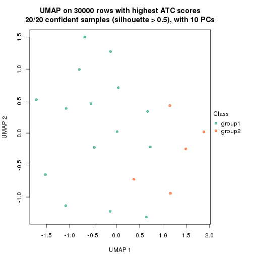</p>

</div>
<div id='tab-node-0231-dimension-reduction-2'>
<pre><code class="r">dimension_reduction(res, k = 3, method = &quot;UMAP&quot;)
</code></pre>

<p>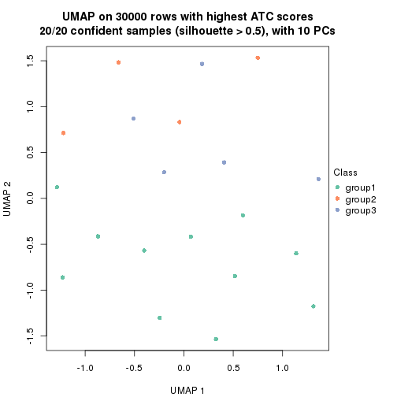</p>

</div>
<div id='tab-node-0231-dimension-reduction-3'>
<pre><code class="r">dimension_reduction(res, k = 4, method = &quot;UMAP&quot;)
</code></pre>

<p>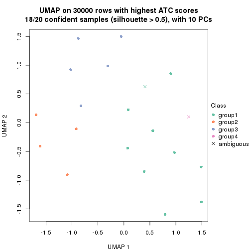</p>

</div>
<div id='tab-node-0231-dimension-reduction-4'>
<pre><code class="r">dimension_reduction(res, k = 5, method = &quot;UMAP&quot;)
</code></pre>

<p>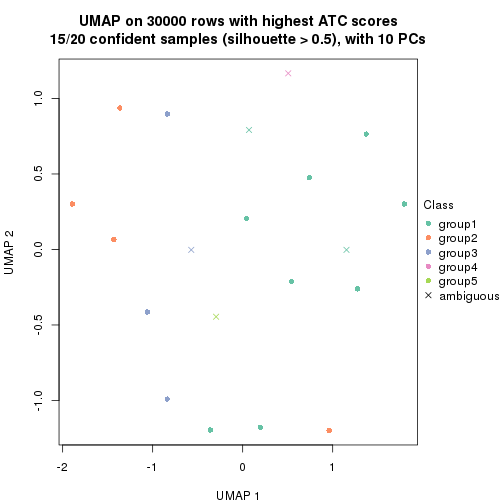</p>

</div>
<div id='tab-node-0231-dimension-reduction-5'>
<pre><code class="r">dimension_reduction(res, k = 6, method = &quot;UMAP&quot;)
</code></pre>

<p>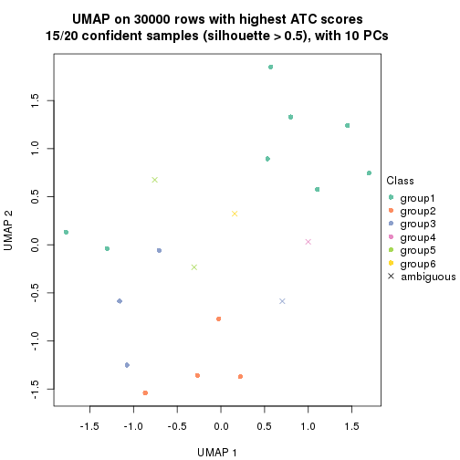</p>

</div>
<div id='tab-node-0231-dimension-reduction-6'>
<pre><code class="r">dimension_reduction(res, k = 7, method = &quot;UMAP&quot;)
</code></pre>

<p>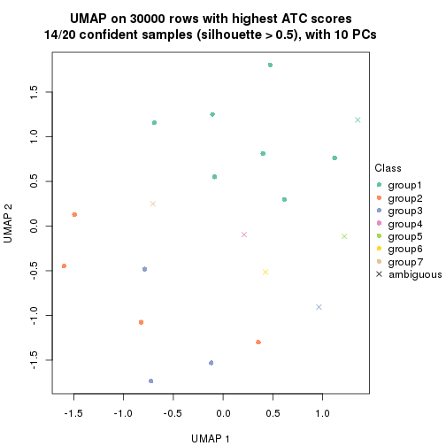</p>

</div>
<div id='tab-node-0231-dimension-reduction-7'>
<pre><code class="r">dimension_reduction(res, k = 8, method = &quot;UMAP&quot;)
</code></pre>

<p>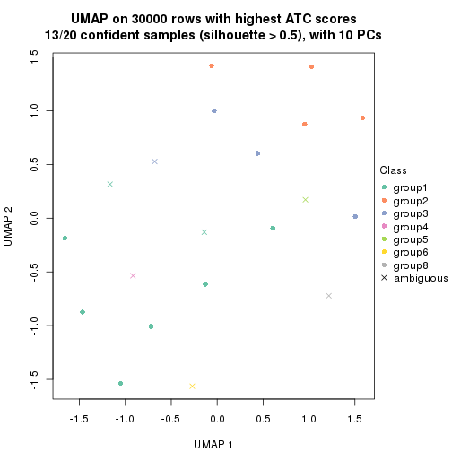</p>

</div>
</div>


Following heatmap shows how subgroups are split when increasing `k`:

```r
collect_classes(res)
```

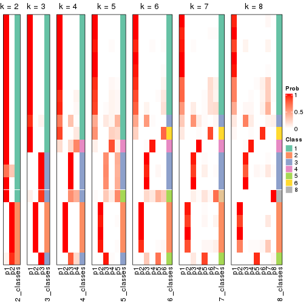


If matrix rows can be associated to genes, consider to use `functional_enrichment(res,
...)` to perform function enrichment for the signature genes. See [this vignette](https://jokergoo.github.io/cola_vignettes/functional_enrichment.html) for more detailed explanations.


 

---------------------------------------------------


### Node03


Parent node: [Node0](#Node0).
Child nodes: 
                [Node011](#Node011)
        ,
                [Node012](#Node012)
        ,
                [Node013](#Node013)
        ,
                [Node014](#Node014)
        ,
                Node021-leaf
        ,
                [Node022](#Node022)
        ,
                [Node023](#Node023)
        ,
                Node031-leaf
        ,
                [Node032](#Node032)
        ,
                Node033-leaf
        ,
                Node034-leaf
        ,
                [Node041](#Node041)
        ,
                [Node042](#Node042)
        ,
                [Node043](#Node043)
        .


The object with results only for a single top-value method and a single partitioning method 
can be extracted as:

```r
res = res_rh["03"]
```

A summary of `res` and all the functions that can be applied to it:

```r
res
```

```
#> A 'ConsensusPartition' object with k = 2, 3, 4, 5, 6, 7, 8.
#>   On a matrix with 30000 rows and 41 columns.
#>   Top rows (1000) are extracted by 'ATC' method.
#>   Subgroups are detected by 'skmeans' method.
#>   Performed in total 350 partitions by row resampling.
#>   Best k for subgroups seems to be 4.
#> 
#> Following methods can be applied to this 'ConsensusPartition' object:
#>  [1] "cola_report"             "collect_classes"         "collect_plots"          
#>  [4] "collect_stats"           "colnames"                "compare_partitions"     
#>  [7] "compare_signatures"      "consensus_heatmap"       "dimension_reduction"    
#> [10] "functional_enrichment"   "get_anno_col"            "get_anno"               
#> [13] "get_classes"             "get_consensus"           "get_matrix"             
#> [16] "get_membership"          "get_param"               "get_signatures"         
#> [19] "get_stats"               "is_best_k"               "is_stable_k"            
#> [22] "membership_heatmap"      "ncol"                    "nrow"                   
#> [25] "plot_ecdf"               "predict_classes"         "rownames"               
#> [28] "select_partition_number" "show"                    "suggest_best_k"         
#> [31] "test_to_known_factors"   "top_rows_heatmap"
```

`collect_plots()` function collects all the plots made from `res` for all `k` (number of subgroups)
into one single page to provide an easy and fast comparison between different `k`.

```r
collect_plots(res)
```

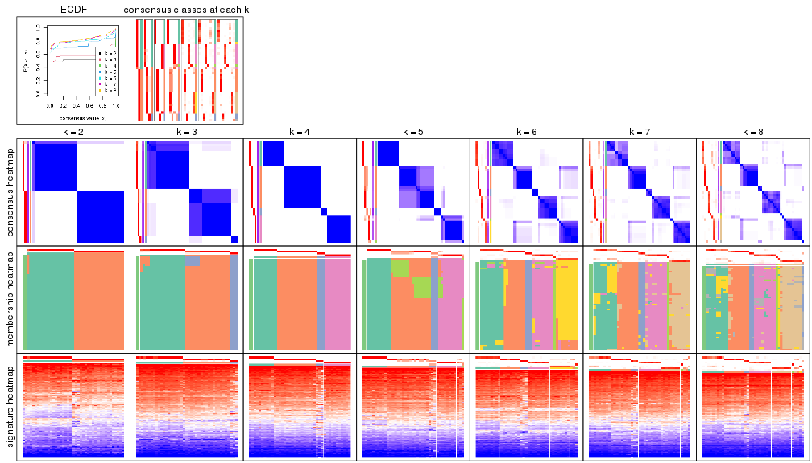

The plots are:

- The first row: a plot of the eCDF (empirical cumulative distribution
  function) curves of the consensus matrix for each `k` and the heatmap of
  predicted classes for each `k`.
- The second row: heatmaps of the consensus matrix for each `k`.
- The third row: heatmaps of the membership matrix for each `k`.
- The fouth row: heatmaps of the signatures for each `k`.

All the plots in panels can be made by individual functions and they are
plotted later in this section.

`select_partition_number()` produces several plots showing different
statistics for choosing "optimized" `k`. There are following statistics:

- eCDF curves of the consensus matrix for each `k`;
- 1-PAC. [The PAC score](https://en.wikipedia.org/wiki/Consensus_clustering#Over-interpretation_potential_of_consensus_clustering)
  measures the proportion of the ambiguous subgrouping.
- Mean silhouette score.
- Concordance. The mean probability of fiting the consensus subgroup labels in all
  partitions.
- Area increased. Denote $A_k$ as the area under the eCDF curve for current
  `k`, the area increased is defined as $A_k - A_{k-1}$.
- Rand index. The percent of pairs of samples that are both in a same cluster
  or both are not in a same cluster in the partition of k and k-1.
- Jaccard index. The ratio of pairs of samples are both in a same cluster in
  the partition of k and k-1 and the pairs of samples are both in a same
  cluster in the partition k or k-1.

The detailed explanations of these statistics can be found in [the _cola_
vignette](https://jokergoo.github.io/cola_vignettes/cola.html#toc_13).

Generally speaking, higher 1-PAC score, higher mean silhouette score or higher
concordance corresponds to better partition. Rand index and Jaccard index
measure how similar the current partition is compared to partition with `k-1`.
If they are too similar, we won't accept `k` is better than `k-1`.

```r
select_partition_number(res)
```

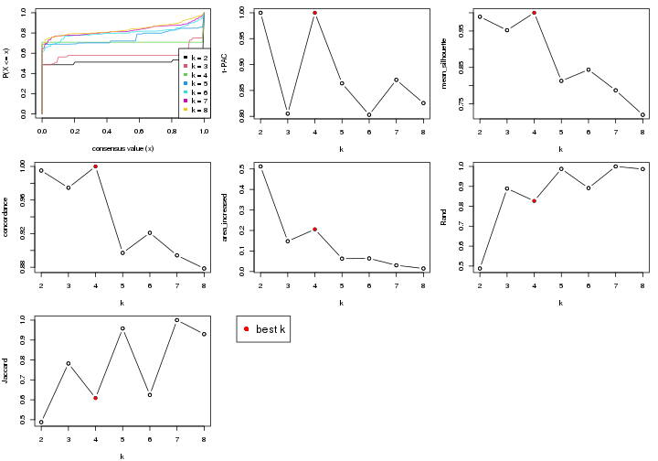

The numeric values for all these statistics can be obtained by `get_stats()`.

```r
get_stats(res)
```

```
#>   k 1-PAC mean_silhouette concordance area_increased  Rand Jaccard
#> 2 2 1.000           0.989       0.995         0.5122 0.488   0.488
#> 3 3 0.805           0.952       0.975         0.1477 0.889   0.782
#> 4 4 1.000           1.000       1.000         0.2058 0.827   0.609
#> 5 5 0.864           0.813       0.897         0.0628 0.988   0.958
#> 6 6 0.803           0.844       0.921         0.0637 0.891   0.624
#> 7 7 0.870           0.787       0.894         0.0302 1.000   1.000
#> 8 8 0.826           0.720       0.879         0.0148 0.987   0.929
```

`suggest_best_k()` suggests the best $k$ based on these statistics. The rules are as follows:

- All $k$ with Jaccard index larger than 0.95 are removed because increasing
  $k$ does not provide enough extra information. If all $k$ are removed, it is
  marked as no subgroup is detected.
- For all $k$ with 1-PAC score larger than 0.9, the maximal $k$ is taken as
  the best $k$, and other $k$ are marked as optional $k$.
- If it does not fit the second rule. The $k$ with the maximal vote of the
  highest 1-PAC score, highest mean silhouette, and highest concordance is
  taken as the best $k$.

```r
suggest_best_k(res)
```

```
#> [1] 4
#> attr(,"optional")
#> [1] 2
```

There is also optional best $k$ = 2 that is worth to check.

Following is the table of the partitions (You need to click the **show/hide
code output** link to see it). The membership matrix (columns with name `p*`)
is inferred by
[`clue::cl_consensus()`](https://www.rdocumentation.org/link/cl_consensus?package=clue)
function with the `SE` method. Basically the value in the membership matrix
represents the probability to belong to a certain group. The finall subgroup
label for an item is determined with the group with highest probability it
belongs to.

In `get_classes()` function, the entropy is calculated from the membership
matrix and the silhouette score is calculated from the consensus matrix.


<script>
$( function() {
	$( '#tabs-node-03-get-classes' ).tabs();
} );
</script>
<div id='tabs-node-03-get-classes'>
<ul>
<li><a href='#tab-node-03-get-classes-1'>k = 2</a></li>
<li><a href='#tab-node-03-get-classes-2'>k = 3</a></li>
<li><a href='#tab-node-03-get-classes-3'>k = 4</a></li>
<li><a href='#tab-node-03-get-classes-4'>k = 5</a></li>
<li><a href='#tab-node-03-get-classes-5'>k = 6</a></li>
<li><a href='#tab-node-03-get-classes-6'>k = 7</a></li>
<li><a href='#tab-node-03-get-classes-7'>k = 8</a></li>
</ul>

<div id='tab-node-03-get-classes-1'>
<p><a id='tab-node-03-get-classes-1-a' style='color:#0366d6' href='#'>show/hide code output</a></p>
<pre><code class="r">cbind(get_classes(res, k = 2), get_membership(res, k = 2))
</code></pre>

<pre><code>#&gt;                 class entropy silhouette  p1  p2
#&gt; TCGA.AZ.6600.11     1   0.722      0.750 0.8 0.2
#&gt; TCGA.AA.3494.11     2   0.000      1.000 0.0 1.0
#&gt; TCGA.A6.5667.11     1   0.000      0.989 1.0 0.0
#&gt; TCGA.G4.6298.11     1   0.000      0.989 1.0 0.0
#&gt; TCGA.AD.6964.01     2   0.000      1.000 0.0 1.0
#&gt; TCGA.AA.3713.11     2   0.000      1.000 0.0 1.0
#&gt; TCGA.AA.3655.11     2   0.000      1.000 0.0 1.0
#&gt; TCGA.A6.4107.11     2   0.000      1.000 0.0 1.0
#&gt; TCGA.A6.2681.11     1   0.000      0.989 1.0 0.0
#&gt; TCGA.A6.2675.11     2   0.000      1.000 0.0 1.0
#&gt; TCGA.AA.3697.11     2   0.000      1.000 0.0 1.0
#&gt; TCGA.CM.6162.01     2   0.000      1.000 0.0 1.0
#&gt; TCGA.AA.3509.11     2   0.000      1.000 0.0 1.0
#&gt; TCGA.G4.6302.11     1   0.000      0.989 1.0 0.0
#&gt; TCGA.AA.3510.11     2   0.000      1.000 0.0 1.0
#&gt; TCGA.F4.6703.01     2   0.000      1.000 0.0 1.0
#&gt; TCGA.AA.3712.11     2   0.000      1.000 0.0 1.0
#&gt; TCGA.AZ.6601.11     2   0.000      1.000 0.0 1.0
#&gt; TCGA.A6.2686.11     1   0.000      0.989 1.0 0.0
#&gt; TCGA.AA.3495.11     2   0.000      1.000 0.0 1.0
#&gt; TCGA.A6.2684.11     1   0.000      0.989 1.0 0.0
#&gt; TCGA.AA.3488.11     2   0.000      1.000 0.0 1.0
#&gt; TCGA.G4.6320.11     1   0.000      0.989 1.0 0.0
#&gt; TCGA.A6.2685.11     1   0.000      0.989 1.0 0.0
#&gt; TCGA.AZ.6599.11     1   0.000      0.989 1.0 0.0
#&gt; TCGA.AA.3506.11     2   0.000      1.000 0.0 1.0
#&gt; TCGA.AZ.6598.11     2   0.000      1.000 0.0 1.0
#&gt; TCGA.G4.6322.11     1   0.000      0.989 1.0 0.0
#&gt; TCGA.AA.3502.11     2   0.000      1.000 0.0 1.0
#&gt; TCGA.A6.2680.11     1   0.000      0.989 1.0 0.0
#&gt; TCGA.A6.2671.11     1   0.000      0.989 1.0 0.0
#&gt; TCGA.G4.6295.11     1   0.000      0.989 1.0 0.0
#&gt; TCGA.AA.3663.11     2   0.000      1.000 0.0 1.0
#&gt; TCGA.AA.3660.11     1   0.000      0.989 1.0 0.0
#&gt; TCGA.G4.6297.11     2   0.000      1.000 0.0 1.0
#&gt; TCGA.AA.3492.11     1   0.000      0.989 1.0 0.0
#&gt; TCGA.A6.2679.11     2   0.000      1.000 0.0 1.0
#&gt; TCGA.G4.6311.11     1   0.000      0.989 1.0 0.0
#&gt; TCGA.G4.6314.11     1   0.000      0.989 1.0 0.0
#&gt; TCGA.G4.6625.11     1   0.000      0.989 1.0 0.0
#&gt; TCGA.A6.2682.11     1   0.000      0.989 1.0 0.0
</code></pre>

<script>
$('#tab-node-03-get-classes-1-a').parent().next().next().hide();
$('#tab-node-03-get-classes-1-a').click(function(){
  $('#tab-node-03-get-classes-1-a').parent().next().next().toggle();
  return(false);
});
</script>
</div>

<div id='tab-node-03-get-classes-2'>
<p><a id='tab-node-03-get-classes-2-a' style='color:#0366d6' href='#'>show/hide code output</a></p>
<pre><code class="r">cbind(get_classes(res, k = 3), get_membership(res, k = 3))
</code></pre>

<pre><code>#&gt;                 class entropy silhouette   p1   p2  p3
#&gt; TCGA.AZ.6600.11     2   0.000      0.962 0.00 1.00 0.0
#&gt; TCGA.AA.3494.11     2   0.000      0.962 0.00 1.00 0.0
#&gt; TCGA.A6.5667.11     1   0.000      0.970 1.00 0.00 0.0
#&gt; TCGA.G4.6298.11     1   0.000      0.970 1.00 0.00 0.0
#&gt; TCGA.AD.6964.01     3   0.000      1.000 0.00 0.00 1.0
#&gt; TCGA.AA.3713.11     2   0.000      0.962 0.00 1.00 0.0
#&gt; TCGA.AA.3655.11     2   0.000      0.962 0.00 1.00 0.0
#&gt; TCGA.A6.4107.11     2   0.000      0.962 0.00 1.00 0.0
#&gt; TCGA.A6.2681.11     1   0.000      0.970 1.00 0.00 0.0
#&gt; TCGA.A6.2675.11     2   0.296      0.913 0.00 0.90 0.1
#&gt; TCGA.AA.3697.11     2   0.296      0.913 0.00 0.90 0.1
#&gt; TCGA.CM.6162.01     3   0.000      1.000 0.00 0.00 1.0
#&gt; TCGA.AA.3509.11     2   0.296      0.913 0.00 0.90 0.1
#&gt; TCGA.G4.6302.11     1   0.000      0.970 1.00 0.00 0.0
#&gt; TCGA.AA.3510.11     2   0.000      0.962 0.00 1.00 0.0
#&gt; TCGA.F4.6703.01     3   0.000      1.000 0.00 0.00 1.0
#&gt; TCGA.AA.3712.11     2   0.000      0.962 0.00 1.00 0.0
#&gt; TCGA.AZ.6601.11     2   0.000      0.962 0.00 1.00 0.0
#&gt; TCGA.A6.2686.11     1   0.000      0.970 1.00 0.00 0.0
#&gt; TCGA.AA.3495.11     2   0.000      0.962 0.00 1.00 0.0
#&gt; TCGA.A6.2684.11     1   0.000      0.970 1.00 0.00 0.0
#&gt; TCGA.AA.3488.11     2   0.000      0.962 0.00 1.00 0.0
#&gt; TCGA.G4.6320.11     1   0.000      0.970 1.00 0.00 0.0
#&gt; TCGA.A6.2685.11     1   0.000      0.970 1.00 0.00 0.0
#&gt; TCGA.AZ.6599.11     1   0.400      0.810 0.84 0.16 0.0
#&gt; TCGA.AA.3506.11     2   0.296      0.913 0.00 0.90 0.1
#&gt; TCGA.AZ.6598.11     2   0.000      0.962 0.00 1.00 0.0
#&gt; TCGA.G4.6322.11     1   0.000      0.970 1.00 0.00 0.0
#&gt; TCGA.AA.3502.11     2   0.296      0.913 0.00 0.90 0.1
#&gt; TCGA.A6.2680.11     1   0.000      0.970 1.00 0.00 0.0
#&gt; TCGA.A6.2671.11     1   0.000      0.970 1.00 0.00 0.0
#&gt; TCGA.G4.6295.11     1   0.000      0.970 1.00 0.00 0.0
#&gt; TCGA.AA.3663.11     2   0.296      0.913 0.00 0.90 0.1
#&gt; TCGA.AA.3660.11     1   0.000      0.970 1.00 0.00 0.0
#&gt; TCGA.G4.6297.11     2   0.000      0.962 0.00 1.00 0.0
#&gt; TCGA.AA.3492.11     1   0.296      0.887 0.90 0.10 0.0
#&gt; TCGA.A6.2679.11     2   0.000      0.962 0.00 1.00 0.0
#&gt; TCGA.G4.6311.11     1   0.296      0.887 0.90 0.10 0.0
#&gt; TCGA.G4.6314.11     1   0.000      0.970 1.00 0.00 0.0
#&gt; TCGA.G4.6625.11     1   0.254      0.906 0.92 0.08 0.0
#&gt; TCGA.A6.2682.11     1   0.000      0.970 1.00 0.00 0.0
</code></pre>

<script>
$('#tab-node-03-get-classes-2-a').parent().next().next().hide();
$('#tab-node-03-get-classes-2-a').click(function(){
  $('#tab-node-03-get-classes-2-a').parent().next().next().toggle();
  return(false);
});
</script>
</div>

<div id='tab-node-03-get-classes-3'>
<p><a id='tab-node-03-get-classes-3-a' style='color:#0366d6' href='#'>show/hide code output</a></p>
<pre><code class="r">cbind(get_classes(res, k = 4), get_membership(res, k = 4))
</code></pre>

<pre><code>#&gt;                 class entropy silhouette p1 p2 p3 p4
#&gt; TCGA.AZ.6600.11     4       0          1  0  0  0  1
#&gt; TCGA.AA.3494.11     2       0          1  0  1  0  0
#&gt; TCGA.A6.5667.11     1       0          1  1  0  0  0
#&gt; TCGA.G4.6298.11     4       0          1  0  0  0  1
#&gt; TCGA.AD.6964.01     3       0          1  0  0  1  0
#&gt; TCGA.AA.3713.11     2       0          1  0  1  0  0
#&gt; TCGA.AA.3655.11     2       0          1  0  1  0  0
#&gt; TCGA.A6.4107.11     2       0          1  0  1  0  0
#&gt; TCGA.A6.2681.11     1       0          1  1  0  0  0
#&gt; TCGA.A6.2675.11     2       0          1  0  1  0  0
#&gt; TCGA.AA.3697.11     2       0          1  0  1  0  0
#&gt; TCGA.CM.6162.01     3       0          1  0  0  1  0
#&gt; TCGA.AA.3509.11     2       0          1  0  1  0  0
#&gt; TCGA.G4.6302.11     4       0          1  0  0  0  1
#&gt; TCGA.AA.3510.11     2       0          1  0  1  0  0
#&gt; TCGA.F4.6703.01     3       0          1  0  0  1  0
#&gt; TCGA.AA.3712.11     2       0          1  0  1  0  0
#&gt; TCGA.AZ.6601.11     2       0          1  0  1  0  0
#&gt; TCGA.A6.2686.11     1       0          1  1  0  0  0
#&gt; TCGA.AA.3495.11     2       0          1  0  1  0  0
#&gt; TCGA.A6.2684.11     1       0          1  1  0  0  0
#&gt; TCGA.AA.3488.11     2       0          1  0  1  0  0
#&gt; TCGA.G4.6320.11     4       0          1  0  0  0  1
#&gt; TCGA.A6.2685.11     1       0          1  1  0  0  0
#&gt; TCGA.AZ.6599.11     4       0          1  0  0  0  1
#&gt; TCGA.AA.3506.11     2       0          1  0  1  0  0
#&gt; TCGA.AZ.6598.11     2       0          1  0  1  0  0
#&gt; TCGA.G4.6322.11     1       0          1  1  0  0  0
#&gt; TCGA.AA.3502.11     2       0          1  0  1  0  0
#&gt; TCGA.A6.2680.11     1       0          1  1  0  0  0
#&gt; TCGA.A6.2671.11     1       0          1  1  0  0  0
#&gt; TCGA.G4.6295.11     1       0          1  1  0  0  0
#&gt; TCGA.AA.3663.11     2       0          1  0  1  0  0
#&gt; TCGA.AA.3660.11     4       0          1  0  0  0  1
#&gt; TCGA.G4.6297.11     2       0          1  0  1  0  0
#&gt; TCGA.AA.3492.11     4       0          1  0  0  0  1
#&gt; TCGA.A6.2679.11     4       0          1  0  0  0  1
#&gt; TCGA.G4.6311.11     4       0          1  0  0  0  1
#&gt; TCGA.G4.6314.11     1       0          1  1  0  0  0
#&gt; TCGA.G4.6625.11     4       0          1  0  0  0  1
#&gt; TCGA.A6.2682.11     4       0          1  0  0  0  1
</code></pre>

<script>
$('#tab-node-03-get-classes-3-a').parent().next().next().hide();
$('#tab-node-03-get-classes-3-a').click(function(){
  $('#tab-node-03-get-classes-3-a').parent().next().next().toggle();
  return(false);
});
</script>
</div>

<div id='tab-node-03-get-classes-4'>
<p><a id='tab-node-03-get-classes-4-a' style='color:#0366d6' href='#'>show/hide code output</a></p>
<pre><code class="r">cbind(get_classes(res, k = 5), get_membership(res, k = 5))
</code></pre>

<pre><code>#&gt;                 class entropy silhouette p1   p2   p3   p4   p5
#&gt; TCGA.AZ.6600.11     4   0.327      0.488  0 0.22 0.00 0.78 0.00
#&gt; TCGA.AA.3494.11     2   0.413      0.774  0 0.62 0.38 0.00 0.00
#&gt; TCGA.A6.5667.11     1   0.000      1.000  1 0.00 0.00 0.00 0.00
#&gt; TCGA.G4.6298.11     4   0.000      0.844  0 0.00 0.00 1.00 0.00
#&gt; TCGA.AD.6964.01     3   0.423      1.000  0 0.00 0.58 0.00 0.42
#&gt; TCGA.AA.3713.11     2   0.342      0.777  0 0.76 0.24 0.00 0.00
#&gt; TCGA.AA.3655.11     2   0.423      0.770  0 0.58 0.42 0.00 0.00
#&gt; TCGA.A6.4107.11     2   0.000      0.746  0 1.00 0.00 0.00 0.00
#&gt; TCGA.A6.2681.11     1   0.000      1.000  1 0.00 0.00 0.00 0.00
#&gt; TCGA.A6.2675.11     2   0.423      0.770  0 0.58 0.42 0.00 0.00
#&gt; TCGA.AA.3697.11     2   0.423      0.770  0 0.58 0.42 0.00 0.00
#&gt; TCGA.CM.6162.01     3   0.423      1.000  0 0.00 0.58 0.00 0.42
#&gt; TCGA.AA.3509.11     2   0.423      0.770  0 0.58 0.42 0.00 0.00
#&gt; TCGA.G4.6302.11     5   0.423      0.000  0 0.00 0.00 0.42 0.58
#&gt; TCGA.AA.3510.11     2   0.000      0.746  0 1.00 0.00 0.00 0.00
#&gt; TCGA.F4.6703.01     3   0.423      1.000  0 0.00 0.58 0.00 0.42
#&gt; TCGA.AA.3712.11     2   0.000      0.746  0 1.00 0.00 0.00 0.00
#&gt; TCGA.AZ.6601.11     2   0.000      0.746  0 1.00 0.00 0.00 0.00
#&gt; TCGA.A6.2686.11     1   0.000      1.000  1 0.00 0.00 0.00 0.00
#&gt; TCGA.AA.3495.11     2   0.000      0.746  0 1.00 0.00 0.00 0.00
#&gt; TCGA.A6.2684.11     1   0.000      1.000  1 0.00 0.00 0.00 0.00
#&gt; TCGA.AA.3488.11     2   0.273      0.771  0 0.84 0.16 0.00 0.00
#&gt; TCGA.G4.6320.11     4   0.000      0.844  0 0.00 0.00 1.00 0.00
#&gt; TCGA.A6.2685.11     1   0.000      1.000  1 0.00 0.00 0.00 0.00
#&gt; TCGA.AZ.6599.11     4   0.000      0.844  0 0.00 0.00 1.00 0.00
#&gt; TCGA.AA.3506.11     2   0.423      0.770  0 0.58 0.42 0.00 0.00
#&gt; TCGA.AZ.6598.11     2   0.000      0.746  0 1.00 0.00 0.00 0.00
#&gt; TCGA.G4.6322.11     1   0.000      1.000  1 0.00 0.00 0.00 0.00
#&gt; TCGA.AA.3502.11     2   0.423      0.770  0 0.58 0.42 0.00 0.00
#&gt; TCGA.A6.2680.11     1   0.000      1.000  1 0.00 0.00 0.00 0.00
#&gt; TCGA.A6.2671.11     1   0.000      1.000  1 0.00 0.00 0.00 0.00
#&gt; TCGA.G4.6295.11     1   0.000      1.000  1 0.00 0.00 0.00 0.00
#&gt; TCGA.AA.3663.11     2   0.423      0.770  0 0.58 0.42 0.00 0.00
#&gt; TCGA.AA.3660.11     4   0.000      0.844  0 0.00 0.00 1.00 0.00
#&gt; TCGA.G4.6297.11     2   0.000      0.746  0 1.00 0.00 0.00 0.00
#&gt; TCGA.AA.3492.11     4   0.000      0.844  0 0.00 0.00 1.00 0.00
#&gt; TCGA.A6.2679.11     4   0.423      0.158  0 0.42 0.00 0.58 0.00
#&gt; TCGA.G4.6311.11     4   0.000      0.844  0 0.00 0.00 1.00 0.00
#&gt; TCGA.G4.6314.11     1   0.000      1.000  1 0.00 0.00 0.00 0.00
#&gt; TCGA.G4.6625.11     4   0.000      0.844  0 0.00 0.00 1.00 0.00
#&gt; TCGA.A6.2682.11     4   0.000      0.844  0 0.00 0.00 1.00 0.00
</code></pre>

<script>
$('#tab-node-03-get-classes-4-a').parent().next().next().hide();
$('#tab-node-03-get-classes-4-a').click(function(){
  $('#tab-node-03-get-classes-4-a').parent().next().next().toggle();
  return(false);
});
</script>
</div>

<div id='tab-node-03-get-classes-5'>
<p><a id='tab-node-03-get-classes-5-a' style='color:#0366d6' href='#'>show/hide code output</a></p>
<pre><code class="r">cbind(get_classes(res, k = 6), get_membership(res, k = 6))
</code></pre>

<pre><code>#&gt;                 class entropy silhouette   p1   p2 p3   p4   p5   p6
#&gt; TCGA.AZ.6600.11     4  0.3315      0.701 0.00 0.00  0 0.78 0.02 0.20
#&gt; TCGA.AA.3494.11     2  0.2631      0.696 0.00 0.82  0 0.00 0.00 0.18
#&gt; TCGA.A6.5667.11     1  0.1267      0.923 0.94 0.00  0 0.00 0.00 0.06
#&gt; TCGA.G4.6298.11     4  0.0000      0.919 0.00 0.00  0 1.00 0.00 0.00
#&gt; TCGA.AD.6964.01     3  0.0000      1.000 0.00 0.00  1 0.00 0.00 0.00
#&gt; TCGA.AA.3713.11     2  0.3851     -0.108 0.00 0.54  0 0.00 0.00 0.46
#&gt; TCGA.AA.3655.11     2  0.0000      0.890 0.00 1.00  0 0.00 0.00 0.00
#&gt; TCGA.A6.4107.11     6  0.2260      0.909 0.00 0.14  0 0.00 0.00 0.86
#&gt; TCGA.A6.2681.11     1  0.1267      0.928 0.94 0.00  0 0.06 0.00 0.00
#&gt; TCGA.A6.2675.11     2  0.0000      0.890 0.00 1.00  0 0.00 0.00 0.00
#&gt; TCGA.AA.3697.11     2  0.0000      0.890 0.00 1.00  0 0.00 0.00 0.00
#&gt; TCGA.CM.6162.01     3  0.0000      1.000 0.00 0.00  1 0.00 0.00 0.00
#&gt; TCGA.AA.3509.11     2  0.0000      0.890 0.00 1.00  0 0.00 0.00 0.00
#&gt; TCGA.G4.6302.11     5  0.0547      0.000 0.00 0.00  0 0.02 0.98 0.00
#&gt; TCGA.AA.3510.11     6  0.2260      0.909 0.00 0.14  0 0.00 0.00 0.86
#&gt; TCGA.F4.6703.01     3  0.0000      1.000 0.00 0.00  1 0.00 0.00 0.00
#&gt; TCGA.AA.3712.11     6  0.2048      0.912 0.00 0.12  0 0.00 0.00 0.88
#&gt; TCGA.AZ.6601.11     6  0.2048      0.912 0.00 0.12  0 0.00 0.00 0.88
#&gt; TCGA.A6.2686.11     1  0.1267      0.928 0.94 0.00  0 0.06 0.00 0.00
#&gt; TCGA.AA.3495.11     6  0.2474      0.875 0.00 0.08  0 0.04 0.00 0.88
#&gt; TCGA.A6.2684.11     1  0.1092      0.913 0.96 0.00  0 0.00 0.02 0.02
#&gt; TCGA.AA.3488.11     6  0.3706      0.499 0.00 0.38  0 0.00 0.00 0.62
#&gt; TCGA.G4.6320.11     4  0.1480      0.880 0.04 0.00  0 0.94 0.00 0.02
#&gt; TCGA.A6.2685.11     1  0.2190      0.922 0.90 0.00  0 0.04 0.00 0.06
#&gt; TCGA.AZ.6599.11     4  0.1092      0.925 0.00 0.00  0 0.96 0.02 0.02
#&gt; TCGA.AA.3506.11     2  0.0000      0.890 0.00 1.00  0 0.00 0.00 0.00
#&gt; TCGA.AZ.6598.11     6  0.2260      0.909 0.00 0.14  0 0.00 0.00 0.86
#&gt; TCGA.G4.6322.11     1  0.1267      0.923 0.94 0.00  0 0.00 0.00 0.06
#&gt; TCGA.AA.3502.11     2  0.0000      0.890 0.00 1.00  0 0.00 0.00 0.00
#&gt; TCGA.A6.2680.11     1  0.1807      0.890 0.92 0.00  0 0.00 0.02 0.06
#&gt; TCGA.A6.2671.11     1  0.2512      0.915 0.88 0.00  0 0.06 0.00 0.06
#&gt; TCGA.G4.6295.11     1  0.1092      0.913 0.96 0.00  0 0.00 0.02 0.02
#&gt; TCGA.AA.3663.11     2  0.0000      0.890 0.00 1.00  0 0.00 0.00 0.00
#&gt; TCGA.AA.3660.11     4  0.1480      0.880 0.04 0.00  0 0.94 0.00 0.02
#&gt; TCGA.G4.6297.11     6  0.2048      0.912 0.00 0.12  0 0.00 0.00 0.88
#&gt; TCGA.AA.3492.11     4  0.1092      0.925 0.00 0.00  0 0.96 0.02 0.02
#&gt; TCGA.A6.2679.11     6  0.2048      0.755 0.00 0.00  0 0.12 0.00 0.88
#&gt; TCGA.G4.6311.11     4  0.1092      0.925 0.00 0.00  0 0.96 0.02 0.02
#&gt; TCGA.G4.6314.11     1  0.1267      0.928 0.94 0.00  0 0.06 0.00 0.00
#&gt; TCGA.G4.6625.11     4  0.1092      0.925 0.00 0.00  0 0.96 0.02 0.02
#&gt; TCGA.A6.2682.11     4  0.0000      0.919 0.00 0.00  0 1.00 0.00 0.00
</code></pre>

<script>
$('#tab-node-03-get-classes-5-a').parent().next().next().hide();
$('#tab-node-03-get-classes-5-a').click(function(){
  $('#tab-node-03-get-classes-5-a').parent().next().next().toggle();
  return(false);
});
</script>
</div>

<div id='tab-node-03-get-classes-6'>
<p><a id='tab-node-03-get-classes-6-a' style='color:#0366d6' href='#'>show/hide code output</a></p>
<pre><code class="r">cbind(get_classes(res, k = 7), get_membership(res, k = 7))
</code></pre>

<pre><code>#&gt;                 class entropy silhouette   p1   p2   p3   p4 p5   p6   p7
#&gt; TCGA.AZ.6600.11     4  0.3745      0.593 0.00 0.00 0.00 0.70  0 0.04 0.26
#&gt; TCGA.AA.3494.11     2  0.1671      0.838 0.00 0.90 0.00 0.00  0 0.00 0.10
#&gt; TCGA.A6.5667.11     1  0.3413      0.663 0.62 0.00 0.00 0.00  0 0.38 0.00
#&gt; TCGA.G4.6298.11     4  0.0000      0.906 0.00 0.00 0.00 1.00  0 0.00 0.00
#&gt; TCGA.AD.6964.01     3  0.0863      0.910 0.00 0.00 0.96 0.00  0 0.04 0.00
#&gt; TCGA.AA.3713.11     2  0.3221      0.498 0.00 0.68 0.00 0.00  0 0.00 0.32
#&gt; TCGA.AA.3655.11     2  0.0000      0.928 0.00 1.00 0.00 0.00  0 0.00 0.00
#&gt; TCGA.A6.4107.11     7  0.0863      0.893 0.00 0.04 0.00 0.00  0 0.00 0.96
#&gt; TCGA.A6.2681.11     1  0.0504      0.745 0.98 0.00 0.00 0.02  0 0.00 0.00
#&gt; TCGA.A6.2675.11     2  0.0504      0.913 0.00 0.98 0.00 0.00  0 0.02 0.00
#&gt; TCGA.AA.3697.11     2  0.0000      0.928 0.00 1.00 0.00 0.00  0 0.00 0.00
#&gt; TCGA.CM.6162.01     3  0.2376      0.860 0.00 0.00 0.86 0.00  0 0.12 0.02
#&gt; TCGA.AA.3509.11     2  0.0000      0.928 0.00 1.00 0.00 0.00  0 0.00 0.00
#&gt; TCGA.G4.6302.11     5  0.0000      0.000 0.00 0.00 0.00 0.00  1 0.00 0.00
#&gt; TCGA.AA.3510.11     7  0.1166      0.886 0.00 0.06 0.00 0.00  0 0.00 0.94
#&gt; TCGA.F4.6703.01     3  0.0000      0.919 0.00 0.00 1.00 0.00  0 0.00 0.00
#&gt; TCGA.AA.3712.11     7  0.1363      0.885 0.00 0.02 0.00 0.00  0 0.04 0.94
#&gt; TCGA.AZ.6601.11     7  0.2016      0.882 0.00 0.06 0.00 0.00  0 0.04 0.90
#&gt; TCGA.A6.2686.11     1  0.0504      0.745 0.98 0.00 0.00 0.02  0 0.00 0.00
#&gt; TCGA.AA.3495.11     7  0.1664      0.874 0.00 0.02 0.00 0.00  0 0.06 0.92
#&gt; TCGA.A6.2684.11     1  0.1886      0.706 0.88 0.00 0.00 0.00  0 0.12 0.00
#&gt; TCGA.AA.3488.11     7  0.3943      0.260 0.00 0.42 0.00 0.00  0 0.02 0.56
#&gt; TCGA.G4.6320.11     4  0.1166      0.879 0.06 0.00 0.00 0.94  0 0.00 0.00
#&gt; TCGA.A6.2685.11     1  0.3294      0.674 0.66 0.00 0.00 0.00  0 0.34 0.00
#&gt; TCGA.AZ.6599.11     4  0.1718      0.886 0.00 0.00 0.00 0.92  0 0.04 0.04
#&gt; TCGA.AA.3506.11     2  0.0000      0.928 0.00 1.00 0.00 0.00  0 0.00 0.00
#&gt; TCGA.AZ.6598.11     7  0.0863      0.893 0.00 0.04 0.00 0.00  0 0.00 0.96
#&gt; TCGA.G4.6322.11     1  0.3525      0.642 0.56 0.00 0.00 0.00  0 0.44 0.00
#&gt; TCGA.AA.3502.11     2  0.0000      0.928 0.00 1.00 0.00 0.00  0 0.00 0.00
#&gt; TCGA.A6.2680.11     1  0.3413      0.417 0.62 0.00 0.00 0.00  0 0.38 0.00
#&gt; TCGA.A6.2671.11     1  0.3755      0.666 0.64 0.00 0.00 0.02  0 0.34 0.00
#&gt; TCGA.G4.6295.11     1  0.1886      0.706 0.88 0.00 0.00 0.00  0 0.12 0.00
#&gt; TCGA.AA.3663.11     2  0.0000      0.928 0.00 1.00 0.00 0.00  0 0.00 0.00
#&gt; TCGA.AA.3660.11     4  0.1718      0.866 0.04 0.00 0.00 0.92  0 0.04 0.00
#&gt; TCGA.G4.6297.11     7  0.0504      0.889 0.00 0.02 0.00 0.00  0 0.00 0.98
#&gt; TCGA.AA.3492.11     4  0.1363      0.897 0.00 0.00 0.00 0.94  0 0.02 0.04
#&gt; TCGA.A6.2679.11     7  0.0863      0.855 0.00 0.00 0.00 0.04  0 0.00 0.96
#&gt; TCGA.G4.6311.11     4  0.0504      0.907 0.00 0.00 0.00 0.98  0 0.00 0.02
#&gt; TCGA.G4.6314.11     1  0.0504      0.745 0.98 0.00 0.00 0.02  0 0.00 0.00
#&gt; TCGA.G4.6625.11     4  0.0504      0.907 0.00 0.00 0.00 0.98  0 0.00 0.02
#&gt; TCGA.A6.2682.11     4  0.0504      0.901 0.02 0.00 0.00 0.98  0 0.00 0.00
</code></pre>

<script>
$('#tab-node-03-get-classes-6-a').parent().next().next().hide();
$('#tab-node-03-get-classes-6-a').click(function(){
  $('#tab-node-03-get-classes-6-a').parent().next().next().toggle();
  return(false);
});
</script>
</div>

<div id='tab-node-03-get-classes-7'>
<p><a id='tab-node-03-get-classes-7-a' style='color:#0366d6' href='#'>show/hide code output</a></p>
<pre><code class="r">cbind(get_classes(res, k = 8), get_membership(res, k = 8))
</code></pre>

<pre><code>#&gt;                 class entropy silhouette   p1   p2   p3   p4   p5   p6   p7   p8
#&gt; TCGA.AZ.6600.11     4  0.3675      0.735 0.00 0.00 0.00 0.76 0.00 0.02 0.08 0.14
#&gt; TCGA.AA.3494.11     2  0.1947      0.762 0.00 0.86 0.00 0.00 0.00 0.00 0.14 0.00
#&gt; TCGA.A6.5667.11     1  0.0941      0.687 0.96 0.00 0.00 0.00 0.00 0.02 0.00 0.02
#&gt; TCGA.G4.6298.11     4  0.0941      0.858 0.00 0.00 0.00 0.96 0.02 0.00 0.00 0.02
#&gt; TCGA.AD.6964.01     3  0.0000      0.928 0.00 0.00 1.00 0.00 0.00 0.00 0.00 0.00
#&gt; TCGA.AA.3713.11     2  0.3318      0.114 0.00 0.54 0.00 0.00 0.00 0.00 0.46 0.00
#&gt; TCGA.AA.3655.11     2  0.0000      0.892 0.00 1.00 0.00 0.00 0.00 0.00 0.00 0.00
#&gt; TCGA.A6.4107.11     7  0.0471      0.885 0.00 0.02 0.00 0.00 0.00 0.00 0.98 0.00
#&gt; TCGA.A6.2681.11     1  0.4097      0.695 0.70 0.00 0.00 0.00 0.02 0.20 0.00 0.08
#&gt; TCGA.A6.2675.11     2  0.1091      0.852 0.00 0.94 0.00 0.00 0.00 0.00 0.00 0.06
#&gt; TCGA.AA.3697.11     2  0.0000      0.892 0.00 1.00 0.00 0.00 0.00 0.00 0.00 0.00
#&gt; TCGA.CM.6162.01     8  0.3272      0.000 0.00 0.00 0.42 0.00 0.00 0.00 0.00 0.58
#&gt; TCGA.AA.3509.11     2  0.0000      0.892 0.00 1.00 0.00 0.00 0.00 0.00 0.00 0.00
#&gt; TCGA.G4.6302.11     5  0.0000      0.000 0.00 0.00 0.00 0.00 1.00 0.00 0.00 0.00
#&gt; TCGA.AA.3510.11     7  0.0471      0.885 0.00 0.02 0.00 0.00 0.00 0.00 0.98 0.00
#&gt; TCGA.F4.6703.01     3  0.0808      0.926 0.00 0.00 0.96 0.00 0.00 0.00 0.00 0.04
#&gt; TCGA.AA.3712.11     7  0.1804      0.859 0.00 0.00 0.00 0.00 0.00 0.02 0.90 0.08
#&gt; TCGA.AZ.6601.11     7  0.1341      0.867 0.00 0.00 0.00 0.00 0.00 0.00 0.92 0.08
#&gt; TCGA.A6.2686.11     1  0.3880      0.681 0.68 0.00 0.00 0.00 0.00 0.24 0.00 0.08
#&gt; TCGA.AA.3495.11     7  0.2025      0.846 0.00 0.00 0.00 0.00 0.00 0.02 0.88 0.10
#&gt; TCGA.A6.2684.11     1  0.4340      0.518 0.54 0.00 0.00 0.00 0.00 0.38 0.00 0.08
#&gt; TCGA.AA.3488.11     7  0.3808      0.427 0.00 0.34 0.00 0.00 0.00 0.00 0.62 0.04
#&gt; TCGA.G4.6320.11     4  0.2591      0.811 0.08 0.00 0.00 0.86 0.02 0.00 0.00 0.04
#&gt; TCGA.A6.2685.11     1  0.0000      0.703 1.00 0.00 0.00 0.00 0.00 0.00 0.00 0.00
#&gt; TCGA.AZ.6599.11     4  0.2859      0.797 0.00 0.00 0.00 0.82 0.00 0.02 0.02 0.14
#&gt; TCGA.AA.3506.11     2  0.0000      0.892 0.00 1.00 0.00 0.00 0.00 0.00 0.00 0.00
#&gt; TCGA.AZ.6598.11     7  0.0941      0.882 0.00 0.02 0.00 0.00 0.00 0.00 0.96 0.02
#&gt; TCGA.G4.6322.11     1  0.1887      0.660 0.90 0.00 0.00 0.00 0.00 0.04 0.00 0.06
#&gt; TCGA.AA.3502.11     2  0.0000      0.892 0.00 1.00 0.00 0.00 0.00 0.00 0.00 0.00
#&gt; TCGA.A6.2680.11     6  0.0808      0.000 0.04 0.00 0.00 0.00 0.00 0.96 0.00 0.00
#&gt; TCGA.A6.2671.11     1  0.1607      0.679 0.92 0.00 0.00 0.04 0.00 0.00 0.00 0.04
#&gt; TCGA.G4.6295.11     1  0.4340      0.518 0.54 0.00 0.00 0.00 0.00 0.38 0.00 0.08
#&gt; TCGA.AA.3663.11     2  0.0000      0.892 0.00 1.00 0.00 0.00 0.00 0.00 0.00 0.00
#&gt; TCGA.AA.3660.11     4  0.3337      0.725 0.16 0.00 0.00 0.78 0.02 0.00 0.00 0.04
#&gt; TCGA.G4.6297.11     7  0.0941      0.882 0.00 0.02 0.00 0.00 0.00 0.00 0.96 0.02
#&gt; TCGA.AA.3492.11     4  0.1341      0.852 0.00 0.00 0.00 0.92 0.00 0.00 0.00 0.08
#&gt; TCGA.A6.2679.11     7  0.1275      0.855 0.00 0.00 0.00 0.04 0.00 0.00 0.94 0.02
#&gt; TCGA.G4.6311.11     4  0.0000      0.862 0.00 0.00 0.00 1.00 0.00 0.00 0.00 0.00
#&gt; TCGA.G4.6314.11     1  0.3830      0.708 0.74 0.00 0.00 0.00 0.02 0.16 0.00 0.08
#&gt; TCGA.G4.6625.11     4  0.1091      0.858 0.00 0.00 0.00 0.94 0.00 0.00 0.00 0.06
#&gt; TCGA.A6.2682.11     4  0.1741      0.846 0.02 0.00 0.00 0.92 0.02 0.00 0.00 0.04
</code></pre>

<script>
$('#tab-node-03-get-classes-7-a').parent().next().next().hide();
$('#tab-node-03-get-classes-7-a').click(function(){
  $('#tab-node-03-get-classes-7-a').parent().next().next().toggle();
  return(false);
});
</script>
</div>
</div>

Heatmaps for the consensus matrix. It visualizes the probability of two
samples to be in a same group.


<script>
$( function() {
	$( '#tabs-node-03-consensus-heatmap' ).tabs();
} );
</script>
<div id='tabs-node-03-consensus-heatmap'>
<ul>
<li><a href='#tab-node-03-consensus-heatmap-1'>k = 2</a></li>
<li><a href='#tab-node-03-consensus-heatmap-2'>k = 3</a></li>
<li><a href='#tab-node-03-consensus-heatmap-3'>k = 4</a></li>
<li><a href='#tab-node-03-consensus-heatmap-4'>k = 5</a></li>
<li><a href='#tab-node-03-consensus-heatmap-5'>k = 6</a></li>
<li><a href='#tab-node-03-consensus-heatmap-6'>k = 7</a></li>
<li><a href='#tab-node-03-consensus-heatmap-7'>k = 8</a></li>
</ul>
<div id='tab-node-03-consensus-heatmap-1'>
<pre><code class="r">consensus_heatmap(res, k = 2)
</code></pre>

<p>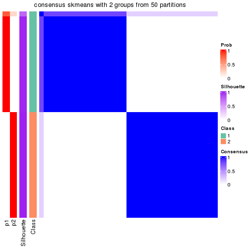</p>

</div>
<div id='tab-node-03-consensus-heatmap-2'>
<pre><code class="r">consensus_heatmap(res, k = 3)
</code></pre>

<p>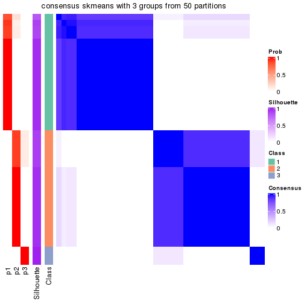</p>

</div>
<div id='tab-node-03-consensus-heatmap-3'>
<pre><code class="r">consensus_heatmap(res, k = 4)
</code></pre>

<p>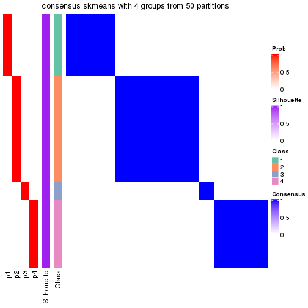</p>

</div>
<div id='tab-node-03-consensus-heatmap-4'>
<pre><code class="r">consensus_heatmap(res, k = 5)
</code></pre>

<p>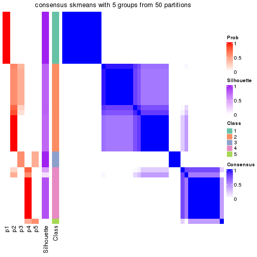</p>

</div>
<div id='tab-node-03-consensus-heatmap-5'>
<pre><code class="r">consensus_heatmap(res, k = 6)
</code></pre>

<p>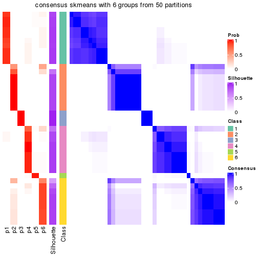</p>

</div>
<div id='tab-node-03-consensus-heatmap-6'>
<pre><code class="r">consensus_heatmap(res, k = 7)
</code></pre>

<p>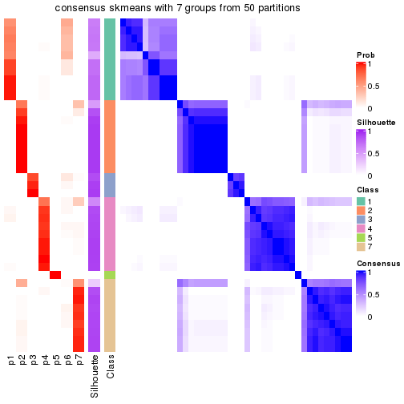</p>

</div>
<div id='tab-node-03-consensus-heatmap-7'>
<pre><code class="r">consensus_heatmap(res, k = 8)
</code></pre>

<p>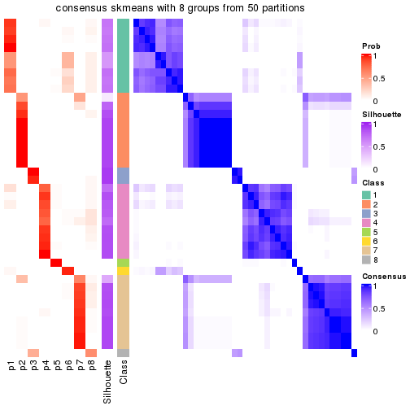</p>

</div>
</div>

Heatmaps for the membership of samples in all partitions to see how consistent they are:


<script>
$( function() {
	$( '#tabs-node-03-membership-heatmap' ).tabs();
} );
</script>
<div id='tabs-node-03-membership-heatmap'>
<ul>
<li><a href='#tab-node-03-membership-heatmap-1'>k = 2</a></li>
<li><a href='#tab-node-03-membership-heatmap-2'>k = 3</a></li>
<li><a href='#tab-node-03-membership-heatmap-3'>k = 4</a></li>
<li><a href='#tab-node-03-membership-heatmap-4'>k = 5</a></li>
<li><a href='#tab-node-03-membership-heatmap-5'>k = 6</a></li>
<li><a href='#tab-node-03-membership-heatmap-6'>k = 7</a></li>
<li><a href='#tab-node-03-membership-heatmap-7'>k = 8</a></li>
</ul>
<div id='tab-node-03-membership-heatmap-1'>
<pre><code class="r">membership_heatmap(res, k = 2)
</code></pre>

<p>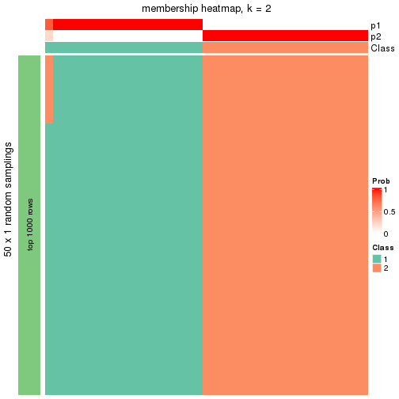</p>

</div>
<div id='tab-node-03-membership-heatmap-2'>
<pre><code class="r">membership_heatmap(res, k = 3)
</code></pre>

<p>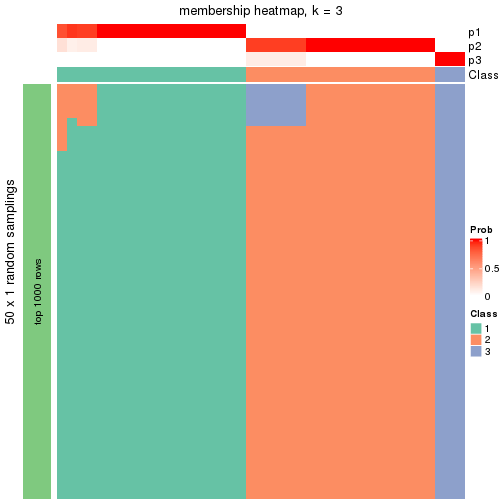</p>

</div>
<div id='tab-node-03-membership-heatmap-3'>
<pre><code class="r">membership_heatmap(res, k = 4)
</code></pre>

<p>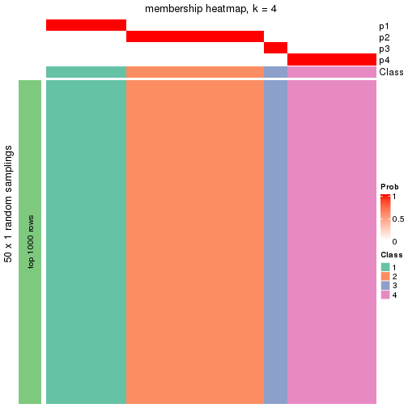</p>

</div>
<div id='tab-node-03-membership-heatmap-4'>
<pre><code class="r">membership_heatmap(res, k = 5)
</code></pre>

<p>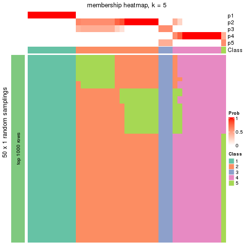</p>

</div>
<div id='tab-node-03-membership-heatmap-5'>
<pre><code class="r">membership_heatmap(res, k = 6)
</code></pre>

<p>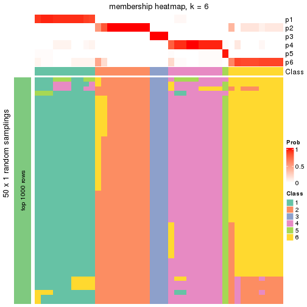</p>

</div>
<div id='tab-node-03-membership-heatmap-6'>
<pre><code class="r">membership_heatmap(res, k = 7)
</code></pre>

<p>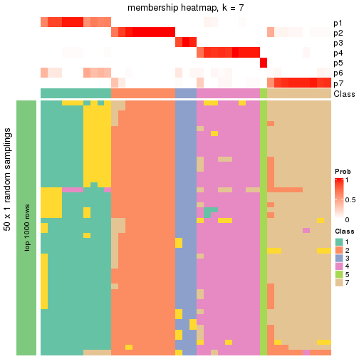</p>

</div>
<div id='tab-node-03-membership-heatmap-7'>
<pre><code class="r">membership_heatmap(res, k = 8)
</code></pre>

<p>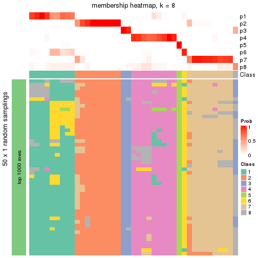</p>

</div>
</div>

As soon as the classes for columns are determined, the signatures
that are significantly different between subgroups can be looked for. 
Following are the heatmaps for signatures.


<script>
$( function() {
	$( '#tabs-node-03-get-signatures' ).tabs();
} );
</script>
<div id='tabs-node-03-get-signatures'>
<ul>
<li><a href='#tab-node-03-get-signatures-1'>k = 2</a></li>
<li><a href='#tab-node-03-get-signatures-2'>k = 3</a></li>
<li><a href='#tab-node-03-get-signatures-3'>k = 4</a></li>
<li><a href='#tab-node-03-get-signatures-4'>k = 5</a></li>
<li><a href='#tab-node-03-get-signatures-5'>k = 6</a></li>
<li><a href='#tab-node-03-get-signatures-6'>k = 7</a></li>
<li><a href='#tab-node-03-get-signatures-7'>k = 8</a></li>
</ul>
<div id='tab-node-03-get-signatures-1'>
<pre><code class="r">get_signatures(res, k = 2)
</code></pre>

<p>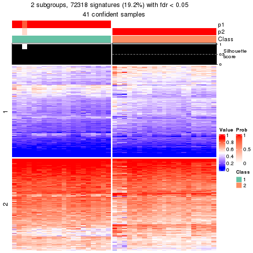</p>

</div>
<div id='tab-node-03-get-signatures-2'>
<pre><code class="r">get_signatures(res, k = 3)
</code></pre>

<p>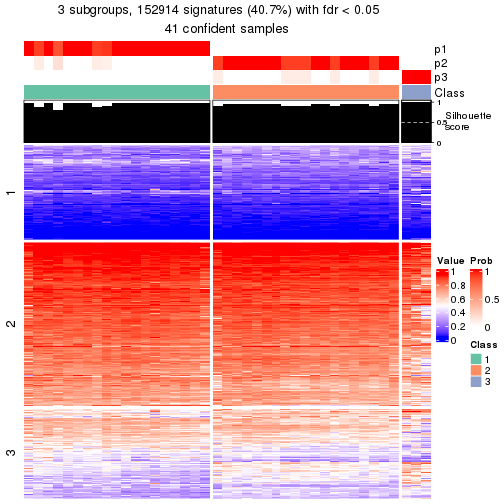</p>

</div>
<div id='tab-node-03-get-signatures-3'>
<pre><code class="r">get_signatures(res, k = 4)
</code></pre>

<p>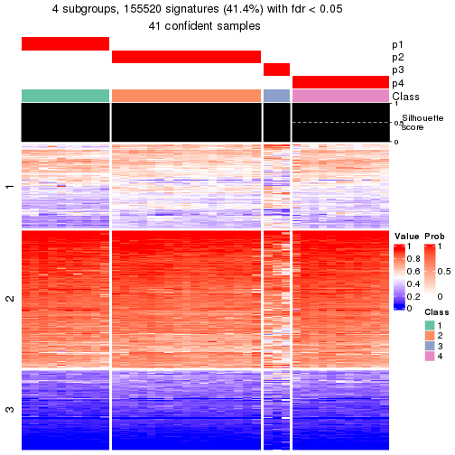</p>

</div>
<div id='tab-node-03-get-signatures-4'>
<pre><code class="r">get_signatures(res, k = 5)
</code></pre>

<p>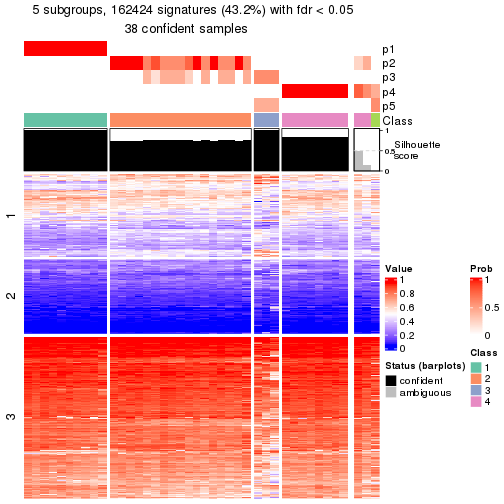</p>

</div>
<div id='tab-node-03-get-signatures-5'>
<pre><code class="r">get_signatures(res, k = 6)
</code></pre>

<p>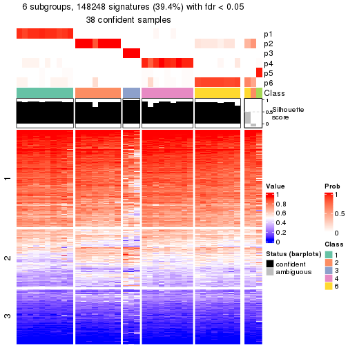</p>

</div>
<div id='tab-node-03-get-signatures-6'>
<pre><code class="r">get_signatures(res, k = 7)
</code></pre>

<p>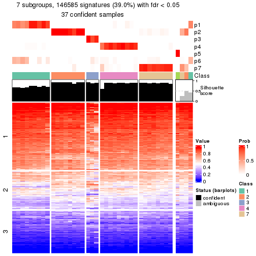</p>

</div>
<div id='tab-node-03-get-signatures-7'>
<pre><code class="r">get_signatures(res, k = 8)
</code></pre>

<p>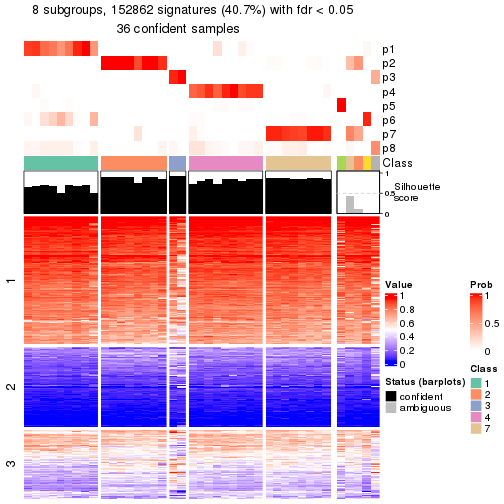</p>

</div>
</div>


Compare the overlap of signatures from different k:

```r
compare_signatures(res)
```

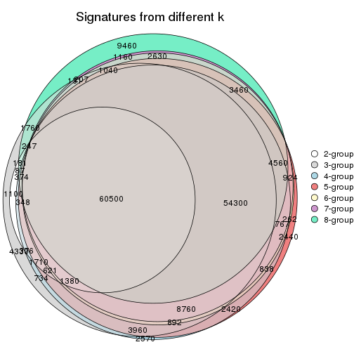

`get_signature()` returns a data frame invisibly. To get the list of signatures, the function
call should be assigned to a variable explicitly. In following code, if `plot` argument is set
to `FALSE`, no heatmap is plotted while only the differential analysis is performed.

```r
# code only for demonstration
tb = get_signature(res, k = ..., plot = FALSE)
```

An example of the output of `tb` is:

```
#>   which_row         fdr    mean_1    mean_2 scaled_mean_1 scaled_mean_2 km
#> 1        38 0.042760348  8.373488  9.131774    -0.5533452     0.5164555  1
#> 2        40 0.018707592  7.106213  8.469186    -0.6173731     0.5762149  1
#> 3        55 0.019134737 10.221463 11.207825    -0.6159697     0.5749050  1
#> 4        59 0.006059896  5.921854  7.869574    -0.6899429     0.6439467  1
#> 5        60 0.018055526  8.928898 10.211722    -0.6204761     0.5791110  1
#> 6        98 0.009384629 15.714769 14.887706     0.6635654    -0.6193277  2
...
```

The columns in `tb` are:

1. `which_row`: row indices corresponding to the input matrix.
2. `fdr`: FDR for the differential test. 
3. `mean_x`: The mean value in group x.
4. `scaled_mean_x`: The mean value in group x after rows are scaled.
5. `km`: Row groups if k-means clustering is applied to rows (which is done by automatically selecting number of clusters).

If there are too many signatures, `top_signatures = ...` can be set to only show the 
signatures with the highest FDRs:

```r
# code only for demonstration
# e.g. to show the top 500 most significant rows
tb = get_signature(res, k = ..., top_signatures = 500)
```

If the signatures are defined as these which are uniquely high in current group, `diff_method` argument
can be set to `"uniquely_high_in_one_group"`:

```r
# code only for demonstration
tb = get_signature(res, k = ..., diff_method = "uniquely_high_in_one_group")
```


UMAP plot which shows how samples are separated.


<script>
$( function() {
	$( '#tabs-node-03-dimension-reduction' ).tabs();
} );
</script>
<div id='tabs-node-03-dimension-reduction'>
<ul>
<li><a href='#tab-node-03-dimension-reduction-1'>k = 2</a></li>
<li><a href='#tab-node-03-dimension-reduction-2'>k = 3</a></li>
<li><a href='#tab-node-03-dimension-reduction-3'>k = 4</a></li>
<li><a href='#tab-node-03-dimension-reduction-4'>k = 5</a></li>
<li><a href='#tab-node-03-dimension-reduction-5'>k = 6</a></li>
<li><a href='#tab-node-03-dimension-reduction-6'>k = 7</a></li>
<li><a href='#tab-node-03-dimension-reduction-7'>k = 8</a></li>
</ul>
<div id='tab-node-03-dimension-reduction-1'>
<pre><code class="r">dimension_reduction(res, k = 2, method = &quot;UMAP&quot;)
</code></pre>

<p>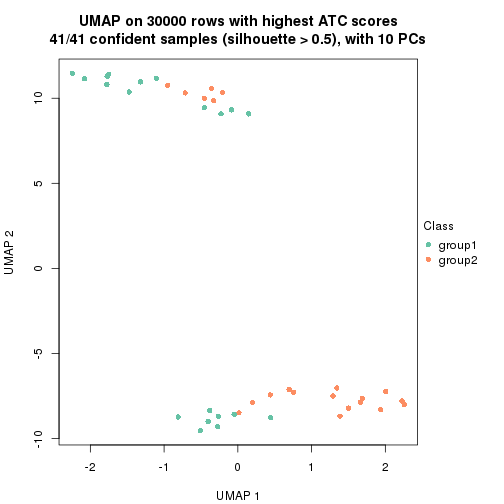</p>

</div>
<div id='tab-node-03-dimension-reduction-2'>
<pre><code class="r">dimension_reduction(res, k = 3, method = &quot;UMAP&quot;)
</code></pre>

<p>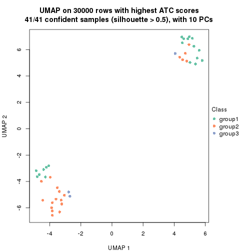</p>

</div>
<div id='tab-node-03-dimension-reduction-3'>
<pre><code class="r">dimension_reduction(res, k = 4, method = &quot;UMAP&quot;)
</code></pre>

<p>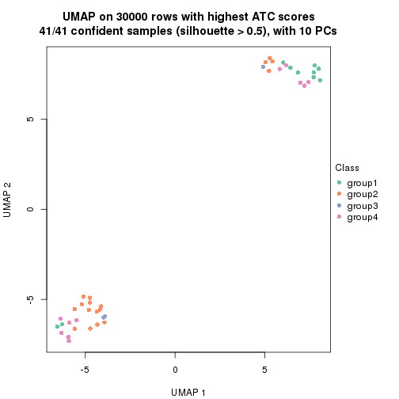</p>

</div>
<div id='tab-node-03-dimension-reduction-4'>
<pre><code class="r">dimension_reduction(res, k = 5, method = &quot;UMAP&quot;)
</code></pre>

<p>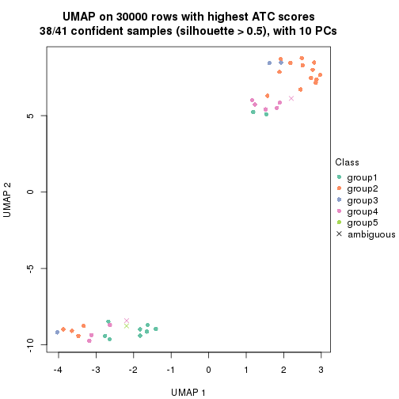</p>

</div>
<div id='tab-node-03-dimension-reduction-5'>
<pre><code class="r">dimension_reduction(res, k = 6, method = &quot;UMAP&quot;)
</code></pre>

<p>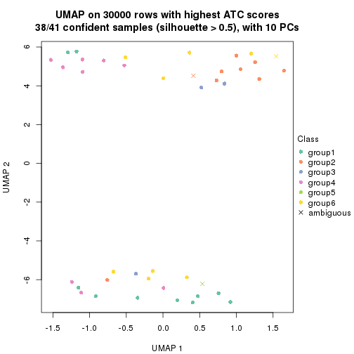</p>

</div>
<div id='tab-node-03-dimension-reduction-6'>
<pre><code class="r">dimension_reduction(res, k = 7, method = &quot;UMAP&quot;)
</code></pre>

<p>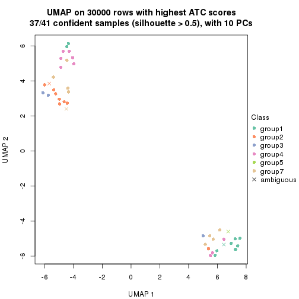</p>

</div>
<div id='tab-node-03-dimension-reduction-7'>
<pre><code class="r">dimension_reduction(res, k = 8, method = &quot;UMAP&quot;)
</code></pre>

<p>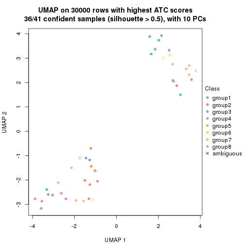</p>

</div>
</div>


Following heatmap shows how subgroups are split when increasing `k`:

```r
collect_classes(res)
```

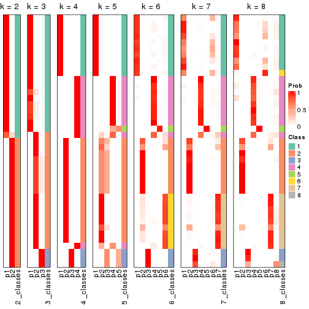


If matrix rows can be associated to genes, consider to use `functional_enrichment(res,
...)` to perform function enrichment for the signature genes. See [this vignette](https://jokergoo.github.io/cola_vignettes/functional_enrichment.html) for more detailed explanations.


 

---------------------------------------------------


### Node032


Parent node: [Node03](#Node03).
Child nodes: 
                [Node0111](#Node0111)
        ,
                [Node0112](#Node0112)
        ,
                [Node0113](#Node0113)
        ,
                [Node0121](#Node0121)
        ,
                Node0122-leaf
        ,
                Node0123-leaf
        ,
                Node0131-leaf
        ,
                Node0132-leaf
        ,
                Node0133-leaf
        ,
                Node0134-leaf
        ,
                [Node0141](#Node0141)
        ,
                Node0142-leaf
        ,
                Node0143-leaf
        ,
                Node0221-leaf
        ,
                Node0222-leaf
        ,
                Node0223-leaf
        ,
                Node0224-leaf
        ,
                [Node0231](#Node0231)
        ,
                Node0232-leaf
        ,
                Node0233-leaf
        ,
                Node0321-leaf
        ,
                Node0322-leaf
        ,
                Node0411-leaf
        ,
                Node0412-leaf
        ,
                Node0421-leaf
        ,
                Node0422-leaf
        ,
                Node0431-leaf
        ,
                Node0432-leaf
        ,
                Node0433-leaf
        ,
                Node0434-leaf
        .


The object with results only for a single top-value method and a single partitioning method 
can be extracted as:

```r
res = res_rh["032"]
```

A summary of `res` and all the functions that can be applied to it:

```r
res
```

```
#> A 'ConsensusPartition' object with k = 2, 3, 4, 5, 6, 7, 8.
#>   On a matrix with 30000 rows and 17 columns.
#>   Top rows (1000) are extracted by 'SD' method.
#>   Subgroups are detected by 'kmeans' method.
#>   Performed in total 350 partitions by row resampling.
#>   Best k for subgroups seems to be 2.
#> 
#> Following methods can be applied to this 'ConsensusPartition' object:
#>  [1] "cola_report"             "collect_classes"         "collect_plots"          
#>  [4] "collect_stats"           "colnames"                "compare_partitions"     
#>  [7] "compare_signatures"      "consensus_heatmap"       "dimension_reduction"    
#> [10] "functional_enrichment"   "get_anno_col"            "get_anno"               
#> [13] "get_classes"             "get_consensus"           "get_matrix"             
#> [16] "get_membership"          "get_param"               "get_signatures"         
#> [19] "get_stats"               "is_best_k"               "is_stable_k"            
#> [22] "membership_heatmap"      "ncol"                    "nrow"                   
#> [25] "plot_ecdf"               "predict_classes"         "rownames"               
#> [28] "select_partition_number" "show"                    "suggest_best_k"         
#> [31] "test_to_known_factors"   "top_rows_heatmap"
```

`collect_plots()` function collects all the plots made from `res` for all `k` (number of subgroups)
into one single page to provide an easy and fast comparison between different `k`.

```r
collect_plots(res)
```

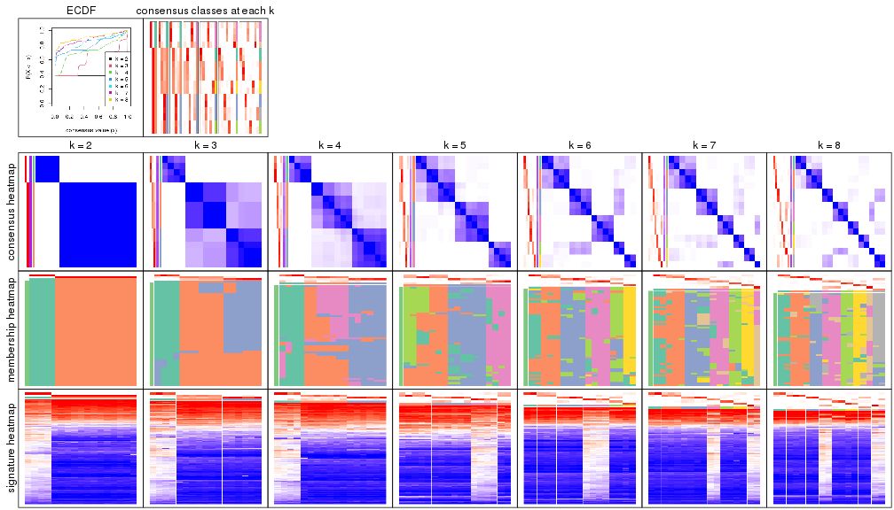

The plots are:

- The first row: a plot of the eCDF (empirical cumulative distribution
  function) curves of the consensus matrix for each `k` and the heatmap of
  predicted classes for each `k`.
- The second row: heatmaps of the consensus matrix for each `k`.
- The third row: heatmaps of the membership matrix for each `k`.
- The fouth row: heatmaps of the signatures for each `k`.

All the plots in panels can be made by individual functions and they are
plotted later in this section.

`select_partition_number()` produces several plots showing different
statistics for choosing "optimized" `k`. There are following statistics:

- eCDF curves of the consensus matrix for each `k`;
- 1-PAC. [The PAC score](https://en.wikipedia.org/wiki/Consensus_clustering#Over-interpretation_potential_of_consensus_clustering)
  measures the proportion of the ambiguous subgrouping.
- Mean silhouette score.
- Concordance. The mean probability of fiting the consensus subgroup labels in all
  partitions.
- Area increased. Denote $A_k$ as the area under the eCDF curve for current
  `k`, the area increased is defined as $A_k - A_{k-1}$.
- Rand index. The percent of pairs of samples that are both in a same cluster
  or both are not in a same cluster in the partition of k and k-1.
- Jaccard index. The ratio of pairs of samples are both in a same cluster in
  the partition of k and k-1 and the pairs of samples are both in a same
  cluster in the partition k or k-1.

The detailed explanations of these statistics can be found in [the _cola_
vignette](https://jokergoo.github.io/cola_vignettes/cola.html#toc_13).

Generally speaking, higher 1-PAC score, higher mean silhouette score or higher
concordance corresponds to better partition. Rand index and Jaccard index
measure how similar the current partition is compared to partition with `k-1`.
If they are too similar, we won't accept `k` is better than `k-1`.

```r
select_partition_number(res)
```

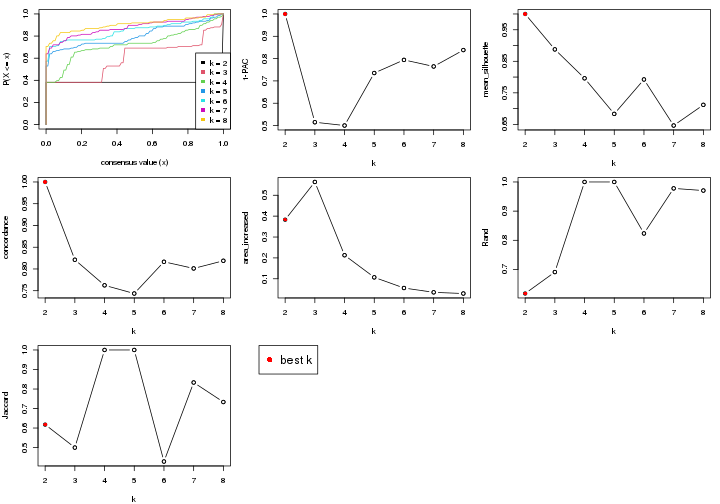

The numeric values for all these statistics can be obtained by `get_stats()`.

```r
get_stats(res)
```

```
#>   k 1-PAC mean_silhouette concordance area_increased  Rand Jaccard
#> 2 2 1.000           1.000       1.000         0.3830 0.618   0.618
#> 3 3 0.515           0.888       0.821         0.5637 0.691   0.500
#> 4 4 0.500           0.796       0.762         0.2128 1.000   1.000
#> 5 5 0.735           0.683       0.744         0.1068 1.000   1.000
#> 6 6 0.794           0.792       0.816         0.0558 0.824   0.429
#> 7 7 0.765           0.646       0.801         0.0351 0.978   0.833
#> 8 8 0.838           0.712       0.819         0.0294 0.971   0.733
```

`suggest_best_k()` suggests the best $k$ based on these statistics. The rules are as follows:

- All $k$ with Jaccard index larger than 0.95 are removed because increasing
  $k$ does not provide enough extra information. If all $k$ are removed, it is
  marked as no subgroup is detected.
- For all $k$ with 1-PAC score larger than 0.9, the maximal $k$ is taken as
  the best $k$, and other $k$ are marked as optional $k$.
- If it does not fit the second rule. The $k$ with the maximal vote of the
  highest 1-PAC score, highest mean silhouette, and highest concordance is
  taken as the best $k$.

```r
suggest_best_k(res)
```

```
#> [1] 2
```


Following is the table of the partitions (You need to click the **show/hide
code output** link to see it). The membership matrix (columns with name `p*`)
is inferred by
[`clue::cl_consensus()`](https://www.rdocumentation.org/link/cl_consensus?package=clue)
function with the `SE` method. Basically the value in the membership matrix
represents the probability to belong to a certain group. The finall subgroup
label for an item is determined with the group with highest probability it
belongs to.

In `get_classes()` function, the entropy is calculated from the membership
matrix and the silhouette score is calculated from the consensus matrix.


<script>
$( function() {
	$( '#tabs-node-032-get-classes' ).tabs();
} );
</script>
<div id='tabs-node-032-get-classes'>
<ul>
<li><a href='#tab-node-032-get-classes-1'>k = 2</a></li>
<li><a href='#tab-node-032-get-classes-2'>k = 3</a></li>
<li><a href='#tab-node-032-get-classes-3'>k = 4</a></li>
<li><a href='#tab-node-032-get-classes-4'>k = 5</a></li>
<li><a href='#tab-node-032-get-classes-5'>k = 6</a></li>
<li><a href='#tab-node-032-get-classes-6'>k = 7</a></li>
<li><a href='#tab-node-032-get-classes-7'>k = 8</a></li>
</ul>

<div id='tab-node-032-get-classes-1'>
<p><a id='tab-node-032-get-classes-1-a' style='color:#0366d6' href='#'>show/hide code output</a></p>
<pre><code class="r">cbind(get_classes(res, k = 2), get_membership(res, k = 2))
</code></pre>

<pre><code>#&gt;                 class entropy silhouette p1 p2
#&gt; TCGA.AA.3494.11     2       0          1  0  1
#&gt; TCGA.AA.3713.11     2       0          1  0  1
#&gt; TCGA.AA.3655.11     2       0          1  0  1
#&gt; TCGA.A6.4107.11     1       0          1  1  0
#&gt; TCGA.A6.2675.11     2       0          1  0  1
#&gt; TCGA.AA.3697.11     2       0          1  0  1
#&gt; TCGA.AA.3509.11     1       0          1  1  0
#&gt; TCGA.AA.3510.11     2       0          1  0  1
#&gt; TCGA.AA.3712.11     2       0          1  0  1
#&gt; TCGA.AZ.6601.11     2       0          1  0  1
#&gt; TCGA.AA.3495.11     2       0          1  0  1
#&gt; TCGA.AA.3488.11     2       0          1  0  1
#&gt; TCGA.AA.3506.11     2       0          1  0  1
#&gt; TCGA.AZ.6598.11     1       0          1  1  0
#&gt; TCGA.AA.3502.11     2       0          1  0  1
#&gt; TCGA.AA.3663.11     2       0          1  0  1
#&gt; TCGA.G4.6297.11     1       0          1  1  0
</code></pre>

<script>
$('#tab-node-032-get-classes-1-a').parent().next().next().hide();
$('#tab-node-032-get-classes-1-a').click(function(){
  $('#tab-node-032-get-classes-1-a').parent().next().next().toggle();
  return(false);
});
</script>
</div>

<div id='tab-node-032-get-classes-2'>
<p><a id='tab-node-032-get-classes-2-a' style='color:#0366d6' href='#'>show/hide code output</a></p>
<pre><code class="r">cbind(get_classes(res, k = 3), get_membership(res, k = 3))
</code></pre>

<pre><code>#&gt;                 class entropy silhouette   p1   p2   p3
#&gt; TCGA.AA.3494.11     2  0.6244      0.896 0.00 0.56 0.44
#&gt; TCGA.AA.3713.11     3  0.0000      0.910 0.00 0.00 1.00
#&gt; TCGA.AA.3655.11     2  0.6244      0.896 0.00 0.56 0.44
#&gt; TCGA.A6.4107.11     1  0.3686      0.907 0.86 0.14 0.00
#&gt; TCGA.A6.2675.11     2  0.6244      0.896 0.00 0.56 0.44
#&gt; TCGA.AA.3697.11     2  0.6244      0.896 0.00 0.56 0.44
#&gt; TCGA.AA.3509.11     1  0.4291      0.854 0.82 0.18 0.00
#&gt; TCGA.AA.3510.11     3  0.3340      0.839 0.00 0.12 0.88
#&gt; TCGA.AA.3712.11     2  0.5706      0.863 0.00 0.68 0.32
#&gt; TCGA.AZ.6601.11     2  0.5706      0.863 0.00 0.68 0.32
#&gt; TCGA.AA.3495.11     3  0.0892      0.908 0.00 0.02 0.98
#&gt; TCGA.AA.3488.11     2  0.5706      0.863 0.00 0.68 0.32
#&gt; TCGA.AA.3506.11     3  0.0000      0.910 0.00 0.00 1.00
#&gt; TCGA.AZ.6598.11     1  0.2537      0.921 0.92 0.08 0.00
#&gt; TCGA.AA.3502.11     3  0.3340      0.839 0.00 0.12 0.88
#&gt; TCGA.AA.3663.11     3  0.0000      0.910 0.00 0.00 1.00
#&gt; TCGA.G4.6297.11     1  0.0000      0.918 1.00 0.00 0.00
</code></pre>

<script>
$('#tab-node-032-get-classes-2-a').parent().next().next().hide();
$('#tab-node-032-get-classes-2-a').click(function(){
  $('#tab-node-032-get-classes-2-a').parent().next().next().toggle();
  return(false);
});
</script>
</div>

<div id='tab-node-032-get-classes-3'>
<p><a id='tab-node-032-get-classes-3-a' style='color:#0366d6' href='#'>show/hide code output</a></p>
<pre><code class="r">cbind(get_classes(res, k = 4), get_membership(res, k = 4))
</code></pre>

<pre><code>#&gt;                 class entropy silhouette   p1   p2   p3   p4
#&gt; TCGA.AA.3494.11     2  0.2921      0.742 0.00 0.86 0.14 0.00
#&gt; TCGA.AA.3713.11     3  0.0707      0.911 0.00 0.00 0.98 0.02
#&gt; TCGA.AA.3655.11     2  0.3606      0.743 0.00 0.84 0.14 0.02
#&gt; TCGA.A6.4107.11     1  0.3611      0.856 0.86 0.06 0.00 0.08
#&gt; TCGA.A6.2675.11     2  0.6477      0.616 0.00 0.60 0.10 0.30
#&gt; TCGA.AA.3697.11     2  0.6477      0.616 0.00 0.60 0.10 0.30
#&gt; TCGA.AA.3509.11     1  0.4522      0.755 0.68 0.00 0.00 0.32
#&gt; TCGA.AA.3510.11     3  0.4491      0.815 0.00 0.06 0.80 0.14
#&gt; TCGA.AA.3712.11     2  0.5784      0.729 0.00 0.70 0.10 0.20
#&gt; TCGA.AZ.6601.11     2  0.6497      0.694 0.00 0.64 0.16 0.20
#&gt; TCGA.AA.3495.11     3  0.2411      0.905 0.00 0.04 0.92 0.04
#&gt; TCGA.AA.3488.11     2  0.6594      0.675 0.00 0.62 0.14 0.24
#&gt; TCGA.AA.3506.11     3  0.1411      0.901 0.00 0.02 0.96 0.02
#&gt; TCGA.AZ.6598.11     1  0.0000      0.892 1.00 0.00 0.00 0.00
#&gt; TCGA.AA.3502.11     3  0.3198      0.879 0.00 0.04 0.88 0.08
#&gt; TCGA.AA.3663.11     3  0.0707      0.911 0.00 0.00 0.98 0.02
#&gt; TCGA.G4.6297.11     1  0.0000      0.892 1.00 0.00 0.00 0.00
</code></pre>

<script>
$('#tab-node-032-get-classes-3-a').parent().next().next().hide();
$('#tab-node-032-get-classes-3-a').click(function(){
  $('#tab-node-032-get-classes-3-a').parent().next().next().toggle();
  return(false);
});
</script>
</div>

<div id='tab-node-032-get-classes-4'>
<p><a id='tab-node-032-get-classes-4-a' style='color:#0366d6' href='#'>show/hide code output</a></p>
<pre><code class="r">cbind(get_classes(res, k = 5), get_membership(res, k = 5))
</code></pre>

<pre><code>#&gt;                 class entropy silhouette   p1   p2   p3   p4   p5
#&gt; TCGA.AA.3494.11     2  0.0609      0.617 0.00 0.98 0.00 0.00 0.02
#&gt; TCGA.AA.3713.11     3  0.3895      0.807 0.00 0.00 0.68 0.00 0.32
#&gt; TCGA.AA.3655.11     2  0.0000      0.619 0.00 1.00 0.00 0.00 0.00
#&gt; TCGA.A6.4107.11     4  0.3110      0.801 0.08 0.00 0.00 0.86 0.06
#&gt; TCGA.A6.2675.11     2  0.6530      0.421 0.36 0.44 0.00 0.00 0.20
#&gt; TCGA.AA.3697.11     2  0.6326      0.416 0.38 0.46 0.00 0.00 0.16
#&gt; TCGA.AA.3509.11     4  0.5888      0.673 0.14 0.00 0.00 0.58 0.28
#&gt; TCGA.AA.3510.11     3  0.1410      0.676 0.06 0.00 0.94 0.00 0.00
#&gt; TCGA.AA.3712.11     2  0.4767      0.616 0.42 0.56 0.00 0.00 0.02
#&gt; TCGA.AZ.6601.11     2  0.4726      0.612 0.40 0.58 0.02 0.00 0.00
#&gt; TCGA.AA.3495.11     3  0.4726      0.789 0.00 0.02 0.58 0.00 0.40
#&gt; TCGA.AA.3488.11     2  0.5646      0.590 0.40 0.52 0.08 0.00 0.00
#&gt; TCGA.AA.3506.11     3  0.4798      0.785 0.00 0.02 0.54 0.00 0.44
#&gt; TCGA.AZ.6598.11     4  0.0000      0.840 0.00 0.00 0.00 1.00 0.00
#&gt; TCGA.AA.3502.11     3  0.1648      0.707 0.02 0.00 0.94 0.00 0.04
#&gt; TCGA.AA.3663.11     3  0.3983      0.807 0.00 0.00 0.66 0.00 0.34
#&gt; TCGA.G4.6297.11     4  0.2077      0.838 0.04 0.00 0.00 0.92 0.04
</code></pre>

<script>
$('#tab-node-032-get-classes-4-a').parent().next().next().hide();
$('#tab-node-032-get-classes-4-a').click(function(){
  $('#tab-node-032-get-classes-4-a').parent().next().next().toggle();
  return(false);
});
</script>
</div>

<div id='tab-node-032-get-classes-5'>
<p><a id='tab-node-032-get-classes-5-a' style='color:#0366d6' href='#'>show/hide code output</a></p>
<pre><code class="r">cbind(get_classes(res, k = 6), get_membership(res, k = 6))
</code></pre>

<pre><code>#&gt;                 class entropy silhouette   p1   p2   p3   p4   p5   p6
#&gt; TCGA.AA.3494.11     1  0.0000      0.895 1.00 0.00 0.00 0.00 0.00 0.00
#&gt; TCGA.AA.3713.11     3  0.1807      0.608 0.00 0.02 0.92 0.00 0.06 0.00
#&gt; TCGA.AA.3655.11     1  0.1267      0.893 0.94 0.06 0.00 0.00 0.00 0.00
#&gt; TCGA.A6.4107.11     4  0.3697      0.765 0.00 0.06 0.00 0.82 0.08 0.04
#&gt; TCGA.A6.2675.11     6  0.1556      0.891 0.08 0.00 0.00 0.00 0.00 0.92
#&gt; TCGA.AA.3697.11     6  0.3412      0.890 0.10 0.02 0.02 0.00 0.02 0.84
#&gt; TCGA.AA.3509.11     4  0.5304      0.636 0.00 0.20 0.00 0.60 0.20 0.00
#&gt; TCGA.AA.3510.11     5  0.4938      0.819 0.00 0.08 0.34 0.00 0.58 0.00
#&gt; TCGA.AA.3712.11     2  0.4310      0.859 0.44 0.54 0.02 0.00 0.00 0.00
#&gt; TCGA.AZ.6601.11     2  0.4199      0.890 0.38 0.60 0.02 0.00 0.00 0.00
#&gt; TCGA.AA.3495.11     3  0.4844      0.645 0.02 0.04 0.70 0.00 0.22 0.02
#&gt; TCGA.AA.3488.11     2  0.4502      0.862 0.32 0.64 0.02 0.00 0.02 0.00
#&gt; TCGA.AA.3506.11     3  0.4392      0.696 0.02 0.04 0.76 0.00 0.16 0.02
#&gt; TCGA.AZ.6598.11     4  0.0547      0.816 0.00 0.02 0.00 0.98 0.00 0.00
#&gt; TCGA.AA.3502.11     5  0.4199      0.803 0.00 0.02 0.38 0.00 0.60 0.00
#&gt; TCGA.AA.3663.11     3  0.0000      0.685 0.00 0.00 1.00 0.00 0.00 0.00
#&gt; TCGA.G4.6297.11     4  0.1480      0.816 0.00 0.02 0.00 0.94 0.04 0.00
</code></pre>

<script>
$('#tab-node-032-get-classes-5-a').parent().next().next().hide();
$('#tab-node-032-get-classes-5-a').click(function(){
  $('#tab-node-032-get-classes-5-a').parent().next().next().toggle();
  return(false);
});
</script>
</div>

<div id='tab-node-032-get-classes-6'>
<p><a id='tab-node-032-get-classes-6-a' style='color:#0366d6' href='#'>show/hide code output</a></p>
<pre><code class="r">cbind(get_classes(res, k = 7), get_membership(res, k = 7))
</code></pre>

<pre><code>#&gt;                 class entropy silhouette   p1   p2   p3   p4   p5   p6   p7
#&gt; TCGA.AA.3494.11     1  0.0000      0.719 1.00 0.00 0.00 0.00 0.00 0.00 0.00
#&gt; TCGA.AA.3713.11     3  0.1928      0.610 0.00 0.00 0.90 0.02 0.08 0.00 0.00
#&gt; TCGA.AA.3655.11     1  0.2259      0.698 0.84 0.16 0.00 0.00 0.00 0.00 0.00
#&gt; TCGA.A6.4107.11     4  0.5922      0.450 0.00 0.16 0.00 0.52 0.06 0.00 0.26
#&gt; TCGA.A6.2675.11     6  0.4357      0.818 0.10 0.04 0.00 0.08 0.02 0.76 0.00
#&gt; TCGA.AA.3697.11     6  0.2081      0.814 0.14 0.00 0.00 0.00 0.00 0.86 0.00
#&gt; TCGA.AA.3509.11     7  0.0000      0.000 0.00 0.00 0.00 0.00 0.00 0.00 1.00
#&gt; TCGA.AA.3510.11     5  0.2278      0.794 0.00 0.08 0.04 0.00 0.88 0.00 0.00
#&gt; TCGA.AA.3712.11     2  0.3985      0.657 0.46 0.52 0.00 0.02 0.00 0.00 0.00
#&gt; TCGA.AZ.6601.11     2  0.3139      0.807 0.30 0.70 0.00 0.00 0.00 0.00 0.00
#&gt; TCGA.AA.3495.11     3  0.6601      0.574 0.02 0.06 0.56 0.14 0.18 0.04 0.00
#&gt; TCGA.AA.3488.11     2  0.3841      0.795 0.28 0.68 0.00 0.00 0.04 0.00 0.00
#&gt; TCGA.AA.3506.11     3  0.5915      0.635 0.02 0.04 0.64 0.14 0.12 0.04 0.00
#&gt; TCGA.AZ.6598.11     4  0.3358      0.643 0.00 0.00 0.00 0.64 0.00 0.00 0.36
#&gt; TCGA.AA.3502.11     5  0.3257      0.776 0.00 0.04 0.08 0.02 0.84 0.02 0.00
#&gt; TCGA.AA.3663.11     3  0.0863      0.648 0.00 0.00 0.96 0.00 0.04 0.00 0.00
#&gt; TCGA.G4.6297.11     4  0.3985      0.551 0.00 0.00 0.00 0.52 0.00 0.02 0.46
</code></pre>

<script>
$('#tab-node-032-get-classes-6-a').parent().next().next().hide();
$('#tab-node-032-get-classes-6-a').click(function(){
  $('#tab-node-032-get-classes-6-a').parent().next().next().toggle();
  return(false);
});
</script>
</div>

<div id='tab-node-032-get-classes-7'>
<p><a id='tab-node-032-get-classes-7-a' style='color:#0366d6' href='#'>show/hide code output</a></p>
<pre><code class="r">cbind(get_classes(res, k = 8), get_membership(res, k = 8))
</code></pre>

<pre><code>#&gt;                 class entropy silhouette   p1   p2   p3   p4   p5   p6   p7   p8
#&gt; TCGA.AA.3494.11     1  0.1804      0.814 0.90 0.08 0.00 0.00 0.00 0.02 0.00 0.00
#&gt; TCGA.AA.3713.11     3  0.0471      0.864 0.00 0.00 0.98 0.00 0.02 0.00 0.00 0.00
#&gt; TCGA.AA.3655.11     1  0.2534      0.810 0.78 0.22 0.00 0.00 0.00 0.00 0.00 0.00
#&gt; TCGA.A6.4107.11     4  0.6178      0.379 0.06 0.00 0.00 0.42 0.00 0.02 0.32 0.18
#&gt; TCGA.A6.2675.11     6  0.0808      0.718 0.04 0.00 0.00 0.00 0.00 0.96 0.00 0.00
#&gt; TCGA.AA.3697.11     6  0.4834      0.718 0.04 0.00 0.00 0.20 0.02 0.66 0.00 0.08
#&gt; TCGA.AA.3509.11     7  0.0000      0.000 0.00 0.00 0.00 0.00 0.00 0.00 1.00 0.00
#&gt; TCGA.AA.3510.11     5  0.1091      0.811 0.00 0.00 0.06 0.00 0.94 0.00 0.00 0.00
#&gt; TCGA.AA.3712.11     2  0.3503      0.712 0.12 0.78 0.00 0.00 0.00 0.02 0.00 0.08
#&gt; TCGA.AZ.6601.11     2  0.0000      0.822 0.00 1.00 0.00 0.00 0.00 0.00 0.00 0.00
#&gt; TCGA.AA.3495.11     8  0.4199      0.917 0.00 0.00 0.32 0.00 0.08 0.00 0.00 0.60
#&gt; TCGA.AA.3488.11     2  0.2020      0.797 0.00 0.90 0.00 0.02 0.06 0.00 0.00 0.02
#&gt; TCGA.AA.3506.11     8  0.4518      0.914 0.00 0.00 0.36 0.02 0.06 0.00 0.00 0.56
#&gt; TCGA.AZ.6598.11     4  0.3237      0.620 0.00 0.00 0.00 0.60 0.00 0.00 0.40 0.00
#&gt; TCGA.AA.3502.11     5  0.3817      0.803 0.00 0.00 0.04 0.08 0.76 0.00 0.00 0.12
#&gt; TCGA.AA.3663.11     3  0.1741      0.857 0.02 0.00 0.92 0.02 0.00 0.00 0.00 0.04
#&gt; TCGA.G4.6297.11     4  0.3737      0.546 0.02 0.00 0.00 0.50 0.00 0.00 0.48 0.00
</code></pre>

<script>
$('#tab-node-032-get-classes-7-a').parent().next().next().hide();
$('#tab-node-032-get-classes-7-a').click(function(){
  $('#tab-node-032-get-classes-7-a').parent().next().next().toggle();
  return(false);
});
</script>
</div>
</div>

Heatmaps for the consensus matrix. It visualizes the probability of two
samples to be in a same group.


<script>
$( function() {
	$( '#tabs-node-032-consensus-heatmap' ).tabs();
} );
</script>
<div id='tabs-node-032-consensus-heatmap'>
<ul>
<li><a href='#tab-node-032-consensus-heatmap-1'>k = 2</a></li>
<li><a href='#tab-node-032-consensus-heatmap-2'>k = 3</a></li>
<li><a href='#tab-node-032-consensus-heatmap-3'>k = 4</a></li>
<li><a href='#tab-node-032-consensus-heatmap-4'>k = 5</a></li>
<li><a href='#tab-node-032-consensus-heatmap-5'>k = 6</a></li>
<li><a href='#tab-node-032-consensus-heatmap-6'>k = 7</a></li>
<li><a href='#tab-node-032-consensus-heatmap-7'>k = 8</a></li>
</ul>
<div id='tab-node-032-consensus-heatmap-1'>
<pre><code class="r">consensus_heatmap(res, k = 2)
</code></pre>

<p>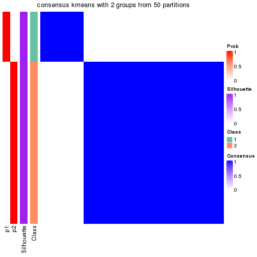</p>

</div>
<div id='tab-node-032-consensus-heatmap-2'>
<pre><code class="r">consensus_heatmap(res, k = 3)
</code></pre>

<p>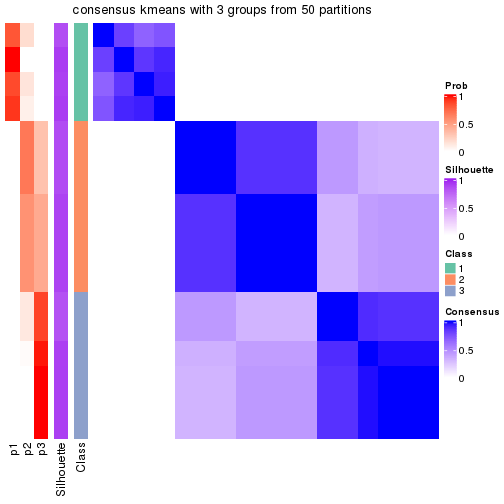</p>

</div>
<div id='tab-node-032-consensus-heatmap-3'>
<pre><code class="r">consensus_heatmap(res, k = 4)
</code></pre>

<p>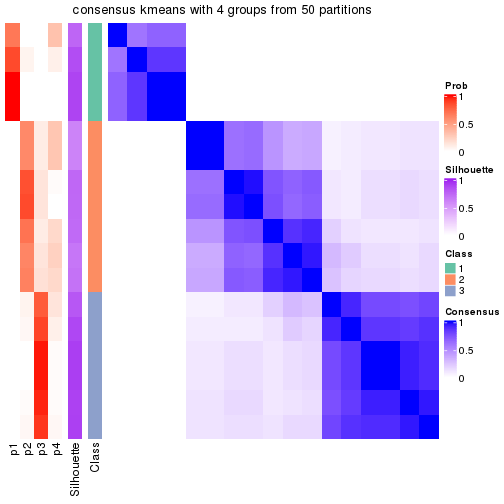</p>

</div>
<div id='tab-node-032-consensus-heatmap-4'>
<pre><code class="r">consensus_heatmap(res, k = 5)
</code></pre>

<p>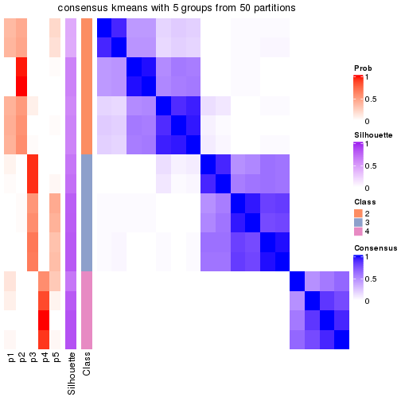</p>

</div>
<div id='tab-node-032-consensus-heatmap-5'>
<pre><code class="r">consensus_heatmap(res, k = 6)
</code></pre>

<p>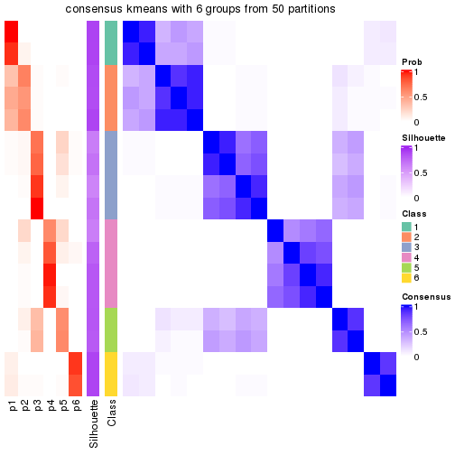</p>

</div>
<div id='tab-node-032-consensus-heatmap-6'>
<pre><code class="r">consensus_heatmap(res, k = 7)
</code></pre>

<p>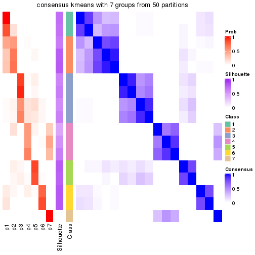</p>

</div>
<div id='tab-node-032-consensus-heatmap-7'>
<pre><code class="r">consensus_heatmap(res, k = 8)
</code></pre>

<p>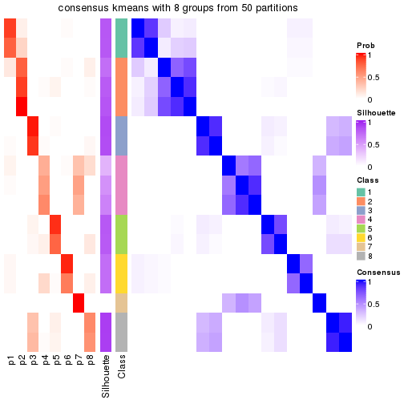</p>

</div>
</div>

Heatmaps for the membership of samples in all partitions to see how consistent they are:


<script>
$( function() {
	$( '#tabs-node-032-membership-heatmap' ).tabs();
} );
</script>
<div id='tabs-node-032-membership-heatmap'>
<ul>
<li><a href='#tab-node-032-membership-heatmap-1'>k = 2</a></li>
<li><a href='#tab-node-032-membership-heatmap-2'>k = 3</a></li>
<li><a href='#tab-node-032-membership-heatmap-3'>k = 4</a></li>
<li><a href='#tab-node-032-membership-heatmap-4'>k = 5</a></li>
<li><a href='#tab-node-032-membership-heatmap-5'>k = 6</a></li>
<li><a href='#tab-node-032-membership-heatmap-6'>k = 7</a></li>
<li><a href='#tab-node-032-membership-heatmap-7'>k = 8</a></li>
</ul>
<div id='tab-node-032-membership-heatmap-1'>
<pre><code class="r">membership_heatmap(res, k = 2)
</code></pre>

<p>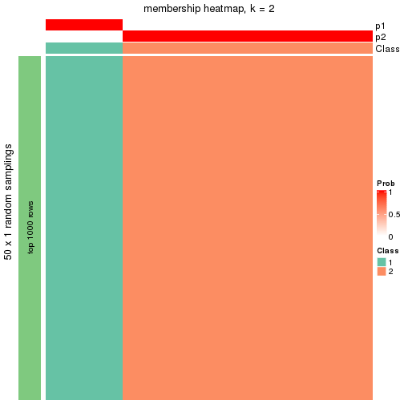</p>

</div>
<div id='tab-node-032-membership-heatmap-2'>
<pre><code class="r">membership_heatmap(res, k = 3)
</code></pre>

<p>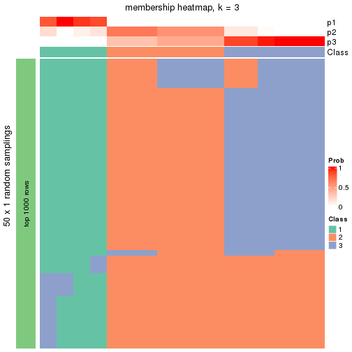</p>

</div>
<div id='tab-node-032-membership-heatmap-3'>
<pre><code class="r">membership_heatmap(res, k = 4)
</code></pre>

<p>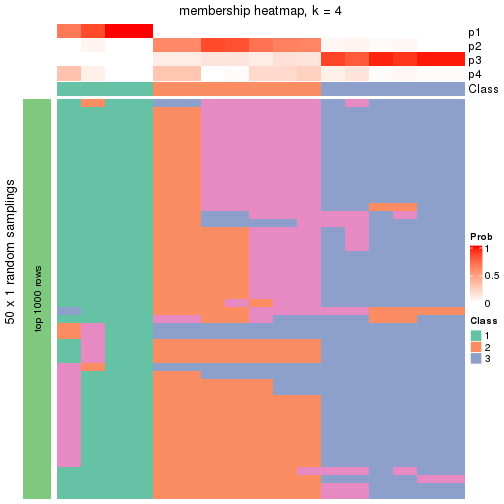</p>

</div>
<div id='tab-node-032-membership-heatmap-4'>
<pre><code class="r">membership_heatmap(res, k = 5)
</code></pre>

<p>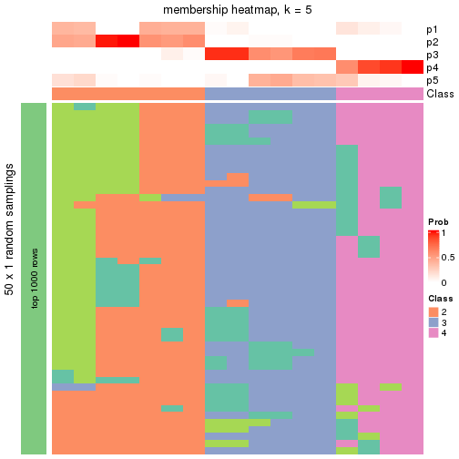</p>

</div>
<div id='tab-node-032-membership-heatmap-5'>
<pre><code class="r">membership_heatmap(res, k = 6)
</code></pre>

<p>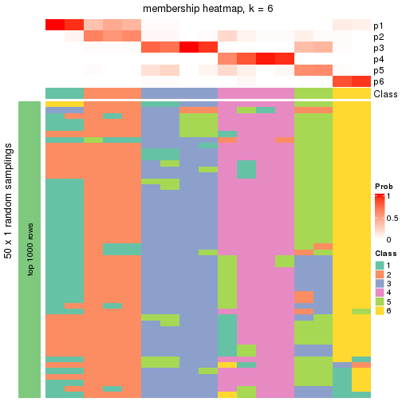</p>

</div>
<div id='tab-node-032-membership-heatmap-6'>
<pre><code class="r">membership_heatmap(res, k = 7)
</code></pre>

<p>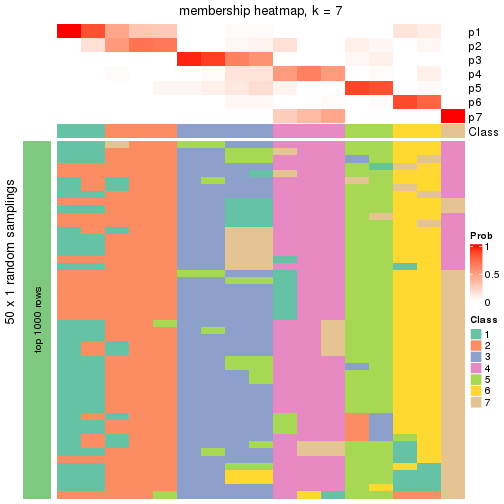</p>

</div>
<div id='tab-node-032-membership-heatmap-7'>
<pre><code class="r">membership_heatmap(res, k = 8)
</code></pre>

<p>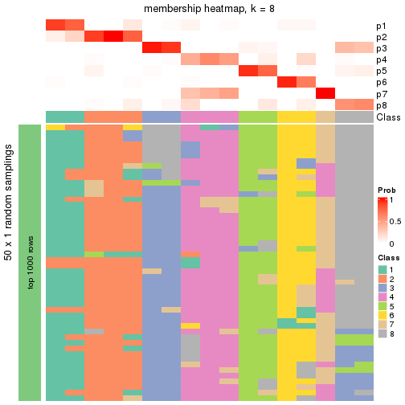</p>

</div>
</div>

As soon as the classes for columns are determined, the signatures
that are significantly different between subgroups can be looked for. 
Following are the heatmaps for signatures.


<script>
$( function() {
	$( '#tabs-node-032-get-signatures' ).tabs();
} );
</script>
<div id='tabs-node-032-get-signatures'>
<ul>
<li><a href='#tab-node-032-get-signatures-1'>k = 2</a></li>
<li><a href='#tab-node-032-get-signatures-2'>k = 3</a></li>
<li><a href='#tab-node-032-get-signatures-3'>k = 4</a></li>
<li><a href='#tab-node-032-get-signatures-4'>k = 5</a></li>
<li><a href='#tab-node-032-get-signatures-5'>k = 6</a></li>
<li><a href='#tab-node-032-get-signatures-6'>k = 7</a></li>
<li><a href='#tab-node-032-get-signatures-7'>k = 8</a></li>
</ul>
<div id='tab-node-032-get-signatures-1'>
<pre><code class="r">get_signatures(res, k = 2)
</code></pre>

<p>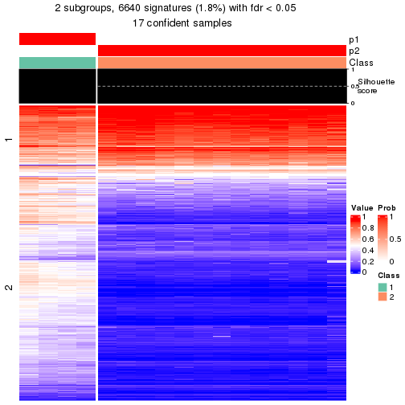</p>

</div>
<div id='tab-node-032-get-signatures-2'>
<pre><code class="r">get_signatures(res, k = 3)
</code></pre>

<p>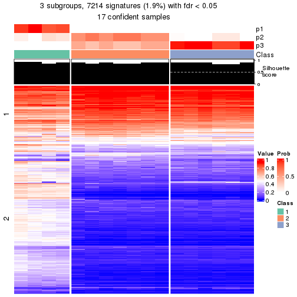</p>

</div>
<div id='tab-node-032-get-signatures-3'>
<pre><code class="r">get_signatures(res, k = 4)
</code></pre>

<p>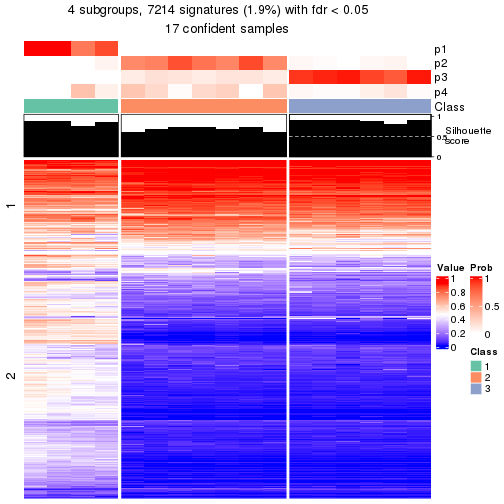</p>

</div>
<div id='tab-node-032-get-signatures-4'>
<pre><code class="r">get_signatures(res, k = 5)
</code></pre>

<p>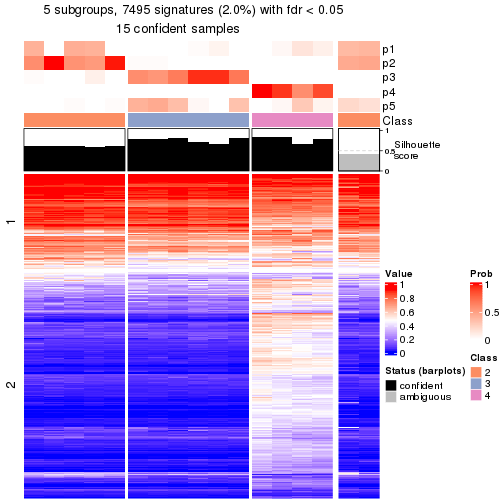</p>

</div>
<div id='tab-node-032-get-signatures-5'>
<pre><code class="r">get_signatures(res, k = 6)
</code></pre>

<p>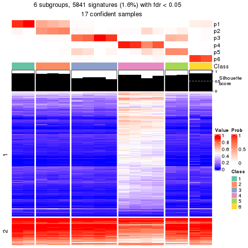</p>

</div>
<div id='tab-node-032-get-signatures-6'>
<pre><code class="r">get_signatures(res, k = 7)
</code></pre>

<p>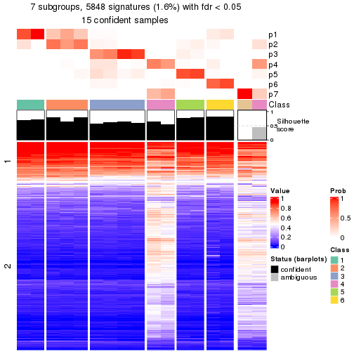</p>

</div>
<div id='tab-node-032-get-signatures-7'>
<pre><code class="r">get_signatures(res, k = 8)
</code></pre>

<p>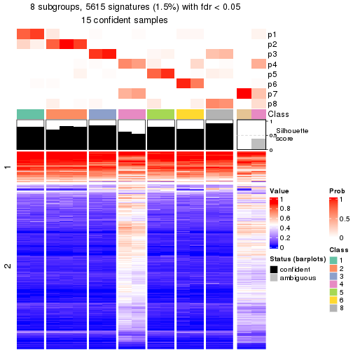</p>

</div>
</div>


Compare the overlap of signatures from different k:

```r
compare_signatures(res)
```

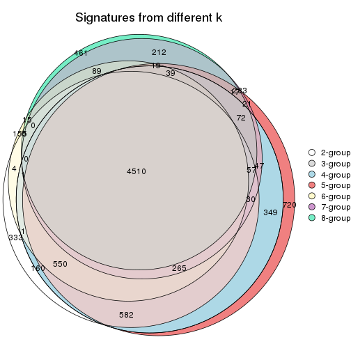

`get_signature()` returns a data frame invisibly. To get the list of signatures, the function
call should be assigned to a variable explicitly. In following code, if `plot` argument is set
to `FALSE`, no heatmap is plotted while only the differential analysis is performed.

```r
# code only for demonstration
tb = get_signature(res, k = ..., plot = FALSE)
```

An example of the output of `tb` is:

```
#>   which_row         fdr    mean_1    mean_2 scaled_mean_1 scaled_mean_2 km
#> 1        38 0.042760348  8.373488  9.131774    -0.5533452     0.5164555  1
#> 2        40 0.018707592  7.106213  8.469186    -0.6173731     0.5762149  1
#> 3        55 0.019134737 10.221463 11.207825    -0.6159697     0.5749050  1
#> 4        59 0.006059896  5.921854  7.869574    -0.6899429     0.6439467  1
#> 5        60 0.018055526  8.928898 10.211722    -0.6204761     0.5791110  1
#> 6        98 0.009384629 15.714769 14.887706     0.6635654    -0.6193277  2
...
```

The columns in `tb` are:

1. `which_row`: row indices corresponding to the input matrix.
2. `fdr`: FDR for the differential test. 
3. `mean_x`: The mean value in group x.
4. `scaled_mean_x`: The mean value in group x after rows are scaled.
5. `km`: Row groups if k-means clustering is applied to rows (which is done by automatically selecting number of clusters).

If there are too many signatures, `top_signatures = ...` can be set to only show the 
signatures with the highest FDRs:

```r
# code only for demonstration
# e.g. to show the top 500 most significant rows
tb = get_signature(res, k = ..., top_signatures = 500)
```

If the signatures are defined as these which are uniquely high in current group, `diff_method` argument
can be set to `"uniquely_high_in_one_group"`:

```r
# code only for demonstration
tb = get_signature(res, k = ..., diff_method = "uniquely_high_in_one_group")
```


UMAP plot which shows how samples are separated.


<script>
$( function() {
	$( '#tabs-node-032-dimension-reduction' ).tabs();
} );
</script>
<div id='tabs-node-032-dimension-reduction'>
<ul>
<li><a href='#tab-node-032-dimension-reduction-1'>k = 2</a></li>
<li><a href='#tab-node-032-dimension-reduction-2'>k = 3</a></li>
<li><a href='#tab-node-032-dimension-reduction-3'>k = 4</a></li>
<li><a href='#tab-node-032-dimension-reduction-4'>k = 5</a></li>
<li><a href='#tab-node-032-dimension-reduction-5'>k = 6</a></li>
<li><a href='#tab-node-032-dimension-reduction-6'>k = 7</a></li>
<li><a href='#tab-node-032-dimension-reduction-7'>k = 8</a></li>
</ul>
<div id='tab-node-032-dimension-reduction-1'>
<pre><code class="r">dimension_reduction(res, k = 2, method = &quot;UMAP&quot;)
</code></pre>

<p>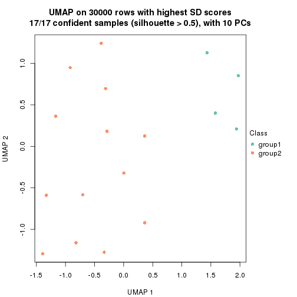</p>

</div>
<div id='tab-node-032-dimension-reduction-2'>
<pre><code class="r">dimension_reduction(res, k = 3, method = &quot;UMAP&quot;)
</code></pre>

<p>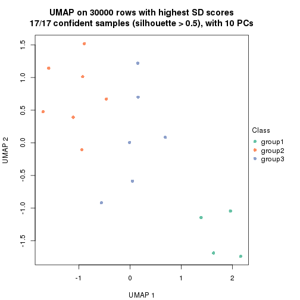</p>

</div>
<div id='tab-node-032-dimension-reduction-3'>
<pre><code class="r">dimension_reduction(res, k = 4, method = &quot;UMAP&quot;)
</code></pre>

<p>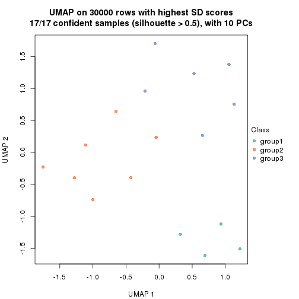</p>

</div>
<div id='tab-node-032-dimension-reduction-4'>
<pre><code class="r">dimension_reduction(res, k = 5, method = &quot;UMAP&quot;)
</code></pre>

<p>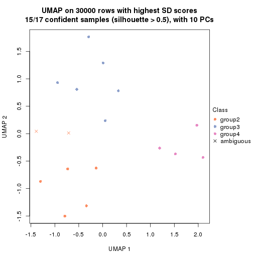</p>

</div>
<div id='tab-node-032-dimension-reduction-5'>
<pre><code class="r">dimension_reduction(res, k = 6, method = &quot;UMAP&quot;)
</code></pre>

<p>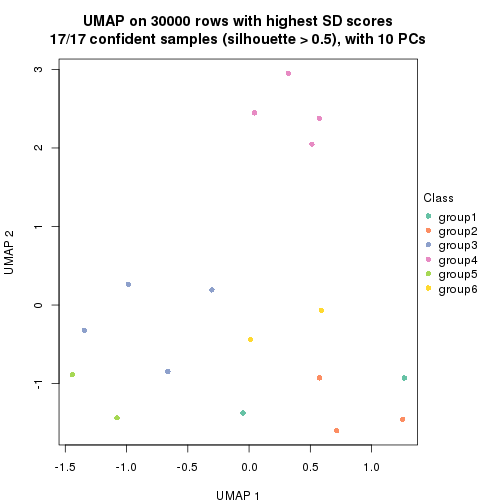</p>

</div>
<div id='tab-node-032-dimension-reduction-6'>
<pre><code class="r">dimension_reduction(res, k = 7, method = &quot;UMAP&quot;)
</code></pre>

<p>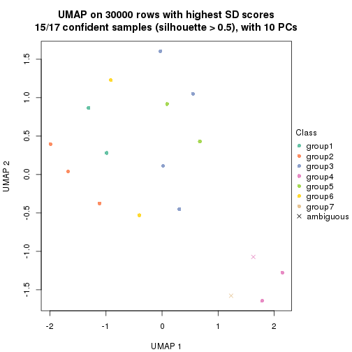</p>

</div>
<div id='tab-node-032-dimension-reduction-7'>
<pre><code class="r">dimension_reduction(res, k = 8, method = &quot;UMAP&quot;)
</code></pre>

<p>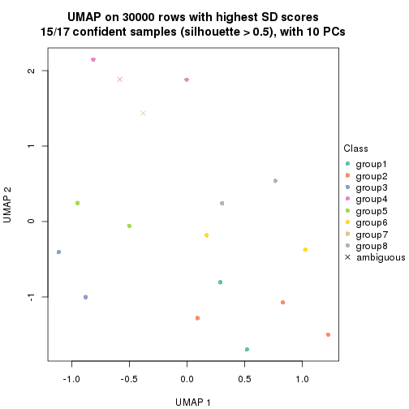</p>

</div>
</div>


Following heatmap shows how subgroups are split when increasing `k`:

```r
collect_classes(res)
```

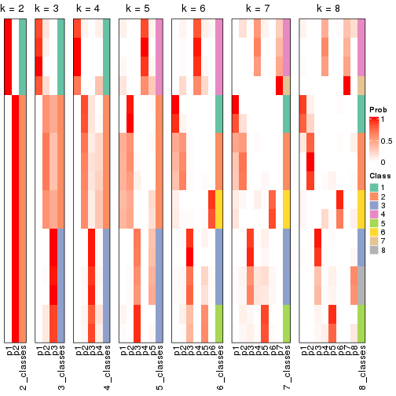


If matrix rows can be associated to genes, consider to use `functional_enrichment(res,
...)` to perform function enrichment for the signature genes. See [this vignette](https://jokergoo.github.io/cola_vignettes/functional_enrichment.html) for more detailed explanations.


 

---------------------------------------------------


### Node04


Parent node: [Node0](#Node0).
Child nodes: 
                [Node011](#Node011)
        ,
                [Node012](#Node012)
        ,
                [Node013](#Node013)
        ,
                [Node014](#Node014)
        ,
                Node021-leaf
        ,
                [Node022](#Node022)
        ,
                [Node023](#Node023)
        ,
                Node031-leaf
        ,
                [Node032](#Node032)
        ,
                Node033-leaf
        ,
                Node034-leaf
        ,
                [Node041](#Node041)
        ,
                [Node042](#Node042)
        ,
                [Node043](#Node043)
        .


The object with results only for a single top-value method and a single partitioning method 
can be extracted as:

```r
res = res_rh["04"]
```

A summary of `res` and all the functions that can be applied to it:

```r
res
```

```
#> A 'ConsensusPartition' object with k = 2, 3, 4, 5, 6, 7, 8.
#>   On a matrix with 30000 rows and 43 columns.
#>   Top rows (1000) are extracted by 'ATC' method.
#>   Subgroups are detected by 'kmeans' method.
#>   Performed in total 350 partitions by row resampling.
#>   Best k for subgroups seems to be 3.
#> 
#> Following methods can be applied to this 'ConsensusPartition' object:
#>  [1] "cola_report"             "collect_classes"         "collect_plots"          
#>  [4] "collect_stats"           "colnames"                "compare_partitions"     
#>  [7] "compare_signatures"      "consensus_heatmap"       "dimension_reduction"    
#> [10] "functional_enrichment"   "get_anno_col"            "get_anno"               
#> [13] "get_classes"             "get_consensus"           "get_matrix"             
#> [16] "get_membership"          "get_param"               "get_signatures"         
#> [19] "get_stats"               "is_best_k"               "is_stable_k"            
#> [22] "membership_heatmap"      "ncol"                    "nrow"                   
#> [25] "plot_ecdf"               "predict_classes"         "rownames"               
#> [28] "select_partition_number" "show"                    "suggest_best_k"         
#> [31] "test_to_known_factors"   "top_rows_heatmap"
```

`collect_plots()` function collects all the plots made from `res` for all `k` (number of subgroups)
into one single page to provide an easy and fast comparison between different `k`.

```r
collect_plots(res)
```

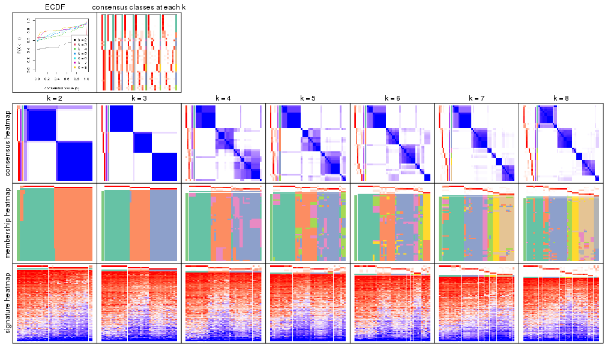

The plots are:

- The first row: a plot of the eCDF (empirical cumulative distribution
  function) curves of the consensus matrix for each `k` and the heatmap of
  predicted classes for each `k`.
- The second row: heatmaps of the consensus matrix for each `k`.
- The third row: heatmaps of the membership matrix for each `k`.
- The fouth row: heatmaps of the signatures for each `k`.

All the plots in panels can be made by individual functions and they are
plotted later in this section.

`select_partition_number()` produces several plots showing different
statistics for choosing "optimized" `k`. There are following statistics:

- eCDF curves of the consensus matrix for each `k`;
- 1-PAC. [The PAC score](https://en.wikipedia.org/wiki/Consensus_clustering#Over-interpretation_potential_of_consensus_clustering)
  measures the proportion of the ambiguous subgrouping.
- Mean silhouette score.
- Concordance. The mean probability of fiting the consensus subgroup labels in all
  partitions.
- Area increased. Denote $A_k$ as the area under the eCDF curve for current
  `k`, the area increased is defined as $A_k - A_{k-1}$.
- Rand index. The percent of pairs of samples that are both in a same cluster
  or both are not in a same cluster in the partition of k and k-1.
- Jaccard index. The ratio of pairs of samples are both in a same cluster in
  the partition of k and k-1 and the pairs of samples are both in a same
  cluster in the partition k or k-1.

The detailed explanations of these statistics can be found in [the _cola_
vignette](https://jokergoo.github.io/cola_vignettes/cola.html#toc_13).

Generally speaking, higher 1-PAC score, higher mean silhouette score or higher
concordance corresponds to better partition. Rand index and Jaccard index
measure how similar the current partition is compared to partition with `k-1`.
If they are too similar, we won't accept `k` is better than `k-1`.

```r
select_partition_number(res)
```

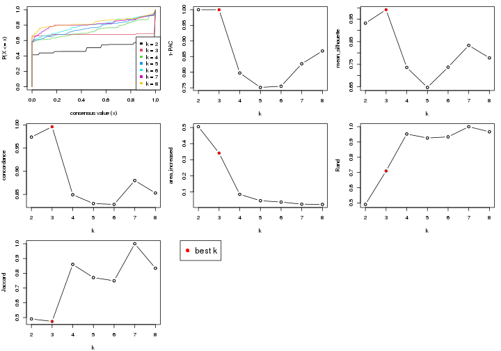

The numeric values for all these statistics can be obtained by `get_stats()`.

```r
get_stats(res)
```

```
#>   k 1-PAC mean_silhouette concordance area_increased  Rand Jaccard
#> 2 2 1.000           0.932       0.974         0.5049 0.491   0.491
#> 3 3 1.000           0.992       0.996         0.3412 0.710   0.474
#> 4 4 0.797           0.735       0.849         0.0853 0.952   0.860
#> 5 5 0.751           0.647       0.830         0.0458 0.926   0.771
#> 6 6 0.755           0.737       0.828         0.0374 0.934   0.749
#> 7 7 0.827           0.833       0.880         0.0243 1.000   1.000
#> 8 8 0.868           0.778       0.853         0.0228 0.967   0.834
```

`suggest_best_k()` suggests the best $k$ based on these statistics. The rules are as follows:

- All $k$ with Jaccard index larger than 0.95 are removed because increasing
  $k$ does not provide enough extra information. If all $k$ are removed, it is
  marked as no subgroup is detected.
- For all $k$ with 1-PAC score larger than 0.9, the maximal $k$ is taken as
  the best $k$, and other $k$ are marked as optional $k$.
- If it does not fit the second rule. The $k$ with the maximal vote of the
  highest 1-PAC score, highest mean silhouette, and highest concordance is
  taken as the best $k$.

```r
suggest_best_k(res)
```

```
#> [1] 3
#> attr(,"optional")
#> [1] 2
```

There is also optional best $k$ = 2 that is worth to check.

Following is the table of the partitions (You need to click the **show/hide
code output** link to see it). The membership matrix (columns with name `p*`)
is inferred by
[`clue::cl_consensus()`](https://www.rdocumentation.org/link/cl_consensus?package=clue)
function with the `SE` method. Basically the value in the membership matrix
represents the probability to belong to a certain group. The finall subgroup
label for an item is determined with the group with highest probability it
belongs to.

In `get_classes()` function, the entropy is calculated from the membership
matrix and the silhouette score is calculated from the consensus matrix.


<script>
$( function() {
	$( '#tabs-node-04-get-classes' ).tabs();
} );
</script>
<div id='tabs-node-04-get-classes'>
<ul>
<li><a href='#tab-node-04-get-classes-1'>k = 2</a></li>
<li><a href='#tab-node-04-get-classes-2'>k = 3</a></li>
<li><a href='#tab-node-04-get-classes-3'>k = 4</a></li>
<li><a href='#tab-node-04-get-classes-4'>k = 5</a></li>
<li><a href='#tab-node-04-get-classes-5'>k = 6</a></li>
<li><a href='#tab-node-04-get-classes-6'>k = 7</a></li>
<li><a href='#tab-node-04-get-classes-7'>k = 8</a></li>
</ul>

<div id='tab-node-04-get-classes-1'>
<p><a id='tab-node-04-get-classes-1-a' style='color:#0366d6' href='#'>show/hide code output</a></p>
<pre><code class="r">cbind(get_classes(res, k = 2), get_membership(res, k = 2))
</code></pre>

<pre><code>#&gt;                 class entropy silhouette   p1   p2
#&gt; TCGA.NH.A8F7.01     2   0.000      0.991 0.00 1.00
#&gt; TCGA.NH.A8F7.06     2   0.000      0.991 0.00 1.00
#&gt; TCGA.A6.6651.01     1   0.000      0.949 1.00 0.00
#&gt; TCGA.AD.6963.01     2   0.000      0.991 0.00 1.00
#&gt; TCGA.G4.6626.01     1   0.000      0.949 1.00 0.00
#&gt; TCGA.AZ.4308.01     2   0.000      0.991 0.00 1.00
#&gt; TCGA.CK.5912.01     2   0.000      0.991 0.00 1.00
#&gt; TCGA.G4.6307.01     2   0.000      0.991 0.00 1.00
#&gt; TCGA.G4.6309.01     2   0.000      0.991 0.00 1.00
#&gt; TCGA.AZ.5403.01     1   0.990      0.247 0.56 0.44
#&gt; TCGA.D5.6923.01     1   0.000      0.949 1.00 0.00
#&gt; TCGA.AU.3779.01     1   0.000      0.949 1.00 0.00
#&gt; TCGA.A6.3810.01     1   0.000      0.949 1.00 0.00
#&gt; TCGA.A6.2675.01     1   0.327      0.896 0.94 0.06
#&gt; TCGA.F4.6460.01     1   0.000      0.949 1.00 0.00
#&gt; TCGA.CA.6715.01     2   0.000      0.991 0.00 1.00
#&gt; TCGA.AZ.6608.01     2   0.000      0.991 0.00 1.00
#&gt; TCGA.AY.A8YK.01     2   0.000      0.991 0.00 1.00
#&gt; TCGA.G4.6317.02     2   0.000      0.991 0.00 1.00
#&gt; TCGA.A6.5662.01     1   0.000      0.949 1.00 0.00
#&gt; TCGA.A6.6140.01     1   0.000      0.949 1.00 0.00
#&gt; TCGA.A6.6648.01     1   0.000      0.949 1.00 0.00
#&gt; TCGA.A6.2685.01     1   0.000      0.949 1.00 0.00
#&gt; TCGA.CM.6164.01     1   0.990      0.247 0.56 0.44
#&gt; TCGA.D5.5541.01     1   0.000      0.949 1.00 0.00
#&gt; TCGA.DM.A28E.01     1   0.000      0.949 1.00 0.00
#&gt; TCGA.AZ.4682.01     2   0.000      0.991 0.00 1.00
#&gt; TCGA.CM.5344.01     2   0.680      0.761 0.18 0.82
#&gt; TCGA.CM.5868.01     2   0.000      0.991 0.00 1.00
#&gt; TCGA.A6.6142.01     2   0.000      0.991 0.00 1.00
#&gt; TCGA.F4.6704.01     2   0.000      0.991 0.00 1.00
#&gt; TCGA.AZ.4681.01     2   0.000      0.991 0.00 1.00
#&gt; TCGA.A6.A567.01     2   0.000      0.991 0.00 1.00
#&gt; TCGA.DM.A1DB.01     1   0.000      0.949 1.00 0.00
#&gt; TCGA.CA.5797.01     2   0.000      0.991 0.00 1.00
#&gt; TCGA.DM.A1D0.01     1   0.000      0.949 1.00 0.00
#&gt; TCGA.5M.AAT5.01     2   0.000      0.991 0.00 1.00
#&gt; TCGA.AZ.6603.01     2   0.000      0.991 0.00 1.00
#&gt; TCGA.A6.5667.01     1   0.000      0.949 1.00 0.00
#&gt; TCGA.AA.3494.01     2   0.000      0.991 0.00 1.00
#&gt; TCGA.G4.6295.01     2   0.000      0.991 0.00 1.00
#&gt; TCGA.G4.6317.01     1   0.000      0.949 1.00 0.00
#&gt; TCGA.CM.6170.01     1   0.000      0.949 1.00 0.00
</code></pre>

<script>
$('#tab-node-04-get-classes-1-a').parent().next().next().hide();
$('#tab-node-04-get-classes-1-a').click(function(){
  $('#tab-node-04-get-classes-1-a').parent().next().next().toggle();
  return(false);
});
</script>
</div>

<div id='tab-node-04-get-classes-2'>
<p><a id='tab-node-04-get-classes-2-a' style='color:#0366d6' href='#'>show/hide code output</a></p>
<pre><code class="r">cbind(get_classes(res, k = 3), get_membership(res, k = 3))
</code></pre>

<pre><code>#&gt;                 class entropy silhouette p1   p2   p3
#&gt; TCGA.NH.A8F7.01     3     0.0      1.000  0 0.00 1.00
#&gt; TCGA.NH.A8F7.06     2     0.0      0.985  0 1.00 0.00
#&gt; TCGA.A6.6651.01     1     0.0      1.000  1 0.00 0.00
#&gt; TCGA.AD.6963.01     3     0.0      1.000  0 0.00 1.00
#&gt; TCGA.G4.6626.01     1     0.0      1.000  1 0.00 0.00
#&gt; TCGA.AZ.4308.01     3     0.0      1.000  0 0.00 1.00
#&gt; TCGA.CK.5912.01     2     0.0      0.985  0 1.00 0.00
#&gt; TCGA.G4.6307.01     3     0.0      1.000  0 0.00 1.00
#&gt; TCGA.G4.6309.01     3     0.0      1.000  0 0.00 1.00
#&gt; TCGA.AZ.5403.01     3     0.0      1.000  0 0.00 1.00
#&gt; TCGA.D5.6923.01     1     0.0      1.000  1 0.00 0.00
#&gt; TCGA.AU.3779.01     1     0.0      1.000  1 0.00 0.00
#&gt; TCGA.A6.3810.01     1     0.0      1.000  1 0.00 0.00
#&gt; TCGA.A6.2675.01     3     0.0      1.000  0 0.00 1.00
#&gt; TCGA.F4.6460.01     1     0.0      1.000  1 0.00 0.00
#&gt; TCGA.CA.6715.01     3     0.0      1.000  0 0.00 1.00
#&gt; TCGA.AZ.6608.01     2     0.0      0.985  0 1.00 0.00
#&gt; TCGA.AY.A8YK.01     2     0.0      0.985  0 1.00 0.00
#&gt; TCGA.G4.6317.02     2     0.0      0.985  0 1.00 0.00
#&gt; TCGA.A6.5662.01     1     0.0      1.000  1 0.00 0.00
#&gt; TCGA.A6.6140.01     1     0.0      1.000  1 0.00 0.00
#&gt; TCGA.A6.6648.01     3     0.0      1.000  0 0.00 1.00
#&gt; TCGA.A6.2685.01     1     0.0      1.000  1 0.00 0.00
#&gt; TCGA.CM.6164.01     3     0.0      1.000  0 0.00 1.00
#&gt; TCGA.D5.5541.01     1     0.0      1.000  1 0.00 0.00
#&gt; TCGA.DM.A28E.01     1     0.0      1.000  1 0.00 0.00
#&gt; TCGA.AZ.4682.01     3     0.0      1.000  0 0.00 1.00
#&gt; TCGA.CM.5344.01     3     0.0      1.000  0 0.00 1.00
#&gt; TCGA.CM.5868.01     3     0.0      1.000  0 0.00 1.00
#&gt; TCGA.A6.6142.01     2     0.4      0.810  0 0.84 0.16
#&gt; TCGA.F4.6704.01     3     0.0      1.000  0 0.00 1.00
#&gt; TCGA.AZ.4681.01     2     0.0      0.985  0 1.00 0.00
#&gt; TCGA.A6.A567.01     2     0.0      0.985  0 1.00 0.00
#&gt; TCGA.DM.A1DB.01     1     0.0      1.000  1 0.00 0.00
#&gt; TCGA.CA.5797.01     2     0.0      0.985  0 1.00 0.00
#&gt; TCGA.DM.A1D0.01     1     0.0      1.000  1 0.00 0.00
#&gt; TCGA.5M.AAT5.01     2     0.0      0.985  0 1.00 0.00
#&gt; TCGA.AZ.6603.01     2     0.0      0.985  0 1.00 0.00
#&gt; TCGA.A6.5667.01     1     0.0      1.000  1 0.00 0.00
#&gt; TCGA.AA.3494.01     3     0.0      1.000  0 0.00 1.00
#&gt; TCGA.G4.6295.01     2     0.0      0.985  0 1.00 0.00
#&gt; TCGA.G4.6317.01     1     0.0      1.000  1 0.00 0.00
#&gt; TCGA.CM.6170.01     3     0.0      1.000  0 0.00 1.00
</code></pre>

<script>
$('#tab-node-04-get-classes-2-a').parent().next().next().hide();
$('#tab-node-04-get-classes-2-a').click(function(){
  $('#tab-node-04-get-classes-2-a').parent().next().next().toggle();
  return(false);
});
</script>
</div>

<div id='tab-node-04-get-classes-3'>
<p><a id='tab-node-04-get-classes-3-a' style='color:#0366d6' href='#'>show/hide code output</a></p>
<pre><code class="r">cbind(get_classes(res, k = 4), get_membership(res, k = 4))
</code></pre>

<pre><code>#&gt;                 class entropy silhouette   p1   p2   p3   p4
#&gt; TCGA.NH.A8F7.01     3  0.4797      0.579 0.00 0.02 0.72 0.26
#&gt; TCGA.NH.A8F7.06     2  0.3610      0.812 0.00 0.80 0.00 0.20
#&gt; TCGA.A6.6651.01     1  0.0000      0.963 1.00 0.00 0.00 0.00
#&gt; TCGA.AD.6963.01     3  0.3400      0.709 0.00 0.00 0.82 0.18
#&gt; TCGA.G4.6626.01     4  0.5594      0.000 0.46 0.00 0.02 0.52
#&gt; TCGA.AZ.4308.01     3  0.0707      0.708 0.00 0.00 0.98 0.02
#&gt; TCGA.CK.5912.01     2  0.3610      0.812 0.00 0.80 0.00 0.20
#&gt; TCGA.G4.6307.01     3  0.0707      0.708 0.00 0.00 0.98 0.02
#&gt; TCGA.G4.6309.01     3  0.0000      0.711 0.00 0.00 1.00 0.00
#&gt; TCGA.AZ.5403.01     3  0.3400      0.709 0.00 0.00 0.82 0.18
#&gt; TCGA.D5.6923.01     1  0.0000      0.963 1.00 0.00 0.00 0.00
#&gt; TCGA.AU.3779.01     1  0.0000      0.963 1.00 0.00 0.00 0.00
#&gt; TCGA.A6.3810.01     1  0.0000      0.963 1.00 0.00 0.00 0.00
#&gt; TCGA.A6.2675.01     3  0.3400      0.709 0.00 0.00 0.82 0.18
#&gt; TCGA.F4.6460.01     1  0.0000      0.963 1.00 0.00 0.00 0.00
#&gt; TCGA.CA.6715.01     3  0.7427      0.358 0.00 0.20 0.50 0.30
#&gt; TCGA.AZ.6608.01     2  0.5428      0.694 0.00 0.74 0.14 0.12
#&gt; TCGA.AY.A8YK.01     2  0.1211      0.848 0.00 0.96 0.04 0.00
#&gt; TCGA.G4.6317.02     2  0.1211      0.852 0.00 0.96 0.00 0.04
#&gt; TCGA.A6.5662.01     1  0.0000      0.963 1.00 0.00 0.00 0.00
#&gt; TCGA.A6.6140.01     1  0.0000      0.963 1.00 0.00 0.00 0.00
#&gt; TCGA.A6.6648.01     3  0.4994      0.423 0.00 0.00 0.52 0.48
#&gt; TCGA.A6.2685.01     3  0.7845     -0.256 0.32 0.00 0.40 0.28
#&gt; TCGA.CM.6164.01     3  0.3400      0.709 0.00 0.00 0.82 0.18
#&gt; TCGA.D5.5541.01     1  0.1637      0.912 0.94 0.00 0.00 0.06
#&gt; TCGA.DM.A28E.01     1  0.1637      0.912 0.94 0.00 0.00 0.06
#&gt; TCGA.AZ.4682.01     3  0.4406      0.565 0.00 0.00 0.70 0.30
#&gt; TCGA.CM.5344.01     3  0.3400      0.709 0.00 0.00 0.82 0.18
#&gt; TCGA.CM.5868.01     3  0.2335      0.686 0.00 0.02 0.92 0.06
#&gt; TCGA.A6.6142.01     2  0.5327      0.623 0.00 0.72 0.22 0.06
#&gt; TCGA.F4.6704.01     3  0.3172      0.712 0.00 0.00 0.84 0.16
#&gt; TCGA.AZ.4681.01     2  0.1211      0.852 0.00 0.96 0.00 0.04
#&gt; TCGA.A6.A567.01     2  0.2830      0.820 0.00 0.90 0.04 0.06
#&gt; TCGA.DM.A1DB.01     1  0.0000      0.963 1.00 0.00 0.00 0.00
#&gt; TCGA.CA.5797.01     2  0.3610      0.812 0.00 0.80 0.00 0.20
#&gt; TCGA.DM.A1D0.01     1  0.0000      0.963 1.00 0.00 0.00 0.00
#&gt; TCGA.5M.AAT5.01     2  0.0707      0.851 0.00 0.98 0.02 0.00
#&gt; TCGA.AZ.6603.01     2  0.1211      0.848 0.00 0.96 0.04 0.00
#&gt; TCGA.A6.5667.01     1  0.1637      0.912 0.94 0.00 0.00 0.06
#&gt; TCGA.AA.3494.01     3  0.6049      0.510 0.00 0.20 0.68 0.12
#&gt; TCGA.G4.6295.01     2  0.3610      0.812 0.00 0.80 0.00 0.20
#&gt; TCGA.G4.6317.01     1  0.1637      0.912 0.94 0.00 0.00 0.06
#&gt; TCGA.CM.6170.01     3  0.4994      0.423 0.00 0.00 0.52 0.48
</code></pre>

<script>
$('#tab-node-04-get-classes-3-a').parent().next().next().hide();
$('#tab-node-04-get-classes-3-a').click(function(){
  $('#tab-node-04-get-classes-3-a').parent().next().next().toggle();
  return(false);
});
</script>
</div>

<div id='tab-node-04-get-classes-4'>
<p><a id='tab-node-04-get-classes-4-a' style='color:#0366d6' href='#'>show/hide code output</a></p>
<pre><code class="r">cbind(get_classes(res, k = 5), get_membership(res, k = 5))
</code></pre>

<pre><code>#&gt;                 class entropy silhouette   p1   p2   p3   p4   p5
#&gt; TCGA.NH.A8F7.01     5  0.4456      0.722 0.00 0.00 0.32 0.02 0.66
#&gt; TCGA.NH.A8F7.06     2  0.6009      0.555 0.00 0.58 0.00 0.24 0.18
#&gt; TCGA.A6.6651.01     1  0.0000      0.911 1.00 0.00 0.00 0.00 0.00
#&gt; TCGA.AD.6963.01     3  0.0000      0.768 0.00 0.00 1.00 0.00 0.00
#&gt; TCGA.G4.6626.01     4  0.5727      0.000 0.34 0.00 0.10 0.56 0.00
#&gt; TCGA.AZ.4308.01     3  0.2438      0.698 0.00 0.04 0.90 0.00 0.06
#&gt; TCGA.CK.5912.01     2  0.6009      0.555 0.00 0.58 0.00 0.24 0.18
#&gt; TCGA.G4.6307.01     3  0.2616      0.681 0.00 0.00 0.88 0.02 0.10
#&gt; TCGA.G4.6309.01     3  0.4676      0.506 0.00 0.00 0.74 0.12 0.14
#&gt; TCGA.AZ.5403.01     3  0.0000      0.768 0.00 0.00 1.00 0.00 0.00
#&gt; TCGA.D5.6923.01     1  0.0000      0.911 1.00 0.00 0.00 0.00 0.00
#&gt; TCGA.AU.3779.01     1  0.0000      0.911 1.00 0.00 0.00 0.00 0.00
#&gt; TCGA.A6.3810.01     1  0.0000      0.911 1.00 0.00 0.00 0.00 0.00
#&gt; TCGA.A6.2675.01     3  0.0000      0.768 0.00 0.00 1.00 0.00 0.00
#&gt; TCGA.F4.6460.01     1  0.0000      0.911 1.00 0.00 0.00 0.00 0.00
#&gt; TCGA.CA.6715.01     5  0.6101      0.549 0.00 0.18 0.10 0.06 0.66
#&gt; TCGA.AZ.6608.01     2  0.4360      0.403 0.00 0.68 0.02 0.00 0.30
#&gt; TCGA.AY.A8YK.01     2  0.0609      0.681 0.00 0.98 0.00 0.00 0.02
#&gt; TCGA.G4.6317.02     2  0.0609      0.682 0.00 0.98 0.00 0.02 0.00
#&gt; TCGA.A6.5662.01     1  0.0000      0.911 1.00 0.00 0.00 0.00 0.00
#&gt; TCGA.A6.6140.01     1  0.0000      0.911 1.00 0.00 0.00 0.00 0.00
#&gt; TCGA.A6.6648.01     3  0.4262      0.308 0.00 0.00 0.56 0.44 0.00
#&gt; TCGA.A6.2685.01     3  0.6000      0.288 0.18 0.00 0.64 0.16 0.02
#&gt; TCGA.CM.6164.01     3  0.0000      0.768 0.00 0.00 1.00 0.00 0.00
#&gt; TCGA.D5.5541.01     1  0.3106      0.775 0.84 0.00 0.00 0.14 0.02
#&gt; TCGA.DM.A28E.01     1  0.4170      0.685 0.78 0.00 0.00 0.14 0.08
#&gt; TCGA.AZ.4682.01     5  0.4748      0.743 0.00 0.00 0.30 0.04 0.66
#&gt; TCGA.CM.5344.01     3  0.0000      0.768 0.00 0.00 1.00 0.00 0.00
#&gt; TCGA.CM.5868.01     3  0.3922      0.523 0.00 0.04 0.78 0.00 0.18
#&gt; TCGA.A6.6142.01     2  0.5210      0.412 0.00 0.68 0.12 0.00 0.20
#&gt; TCGA.F4.6704.01     3  0.0000      0.768 0.00 0.00 1.00 0.00 0.00
#&gt; TCGA.AZ.4681.01     2  0.0609      0.682 0.00 0.98 0.00 0.02 0.00
#&gt; TCGA.A6.A567.01     2  0.3109      0.571 0.00 0.80 0.00 0.00 0.20
#&gt; TCGA.DM.A1DB.01     1  0.0000      0.911 1.00 0.00 0.00 0.00 0.00
#&gt; TCGA.CA.5797.01     2  0.6009      0.555 0.00 0.58 0.00 0.24 0.18
#&gt; TCGA.DM.A1D0.01     1  0.0000      0.911 1.00 0.00 0.00 0.00 0.00
#&gt; TCGA.5M.AAT5.01     2  0.0609      0.681 0.00 0.98 0.00 0.00 0.02
#&gt; TCGA.AZ.6603.01     2  0.0609      0.681 0.00 0.98 0.00 0.00 0.02
#&gt; TCGA.A6.5667.01     1  0.3106      0.775 0.84 0.00 0.00 0.14 0.02
#&gt; TCGA.AA.3494.01     2  0.6778     -0.337 0.00 0.38 0.28 0.00 0.34
#&gt; TCGA.G4.6295.01     2  0.6009      0.555 0.00 0.58 0.00 0.24 0.18
#&gt; TCGA.G4.6317.01     1  0.3106      0.775 0.84 0.00 0.00 0.14 0.02
#&gt; TCGA.CM.6170.01     3  0.4262      0.308 0.00 0.00 0.56 0.44 0.00
</code></pre>

<script>
$('#tab-node-04-get-classes-4-a').parent().next().next().hide();
$('#tab-node-04-get-classes-4-a').click(function(){
  $('#tab-node-04-get-classes-4-a').parent().next().next().toggle();
  return(false);
});
</script>
</div>

<div id='tab-node-04-get-classes-5'>
<p><a id='tab-node-04-get-classes-5-a' style='color:#0366d6' href='#'>show/hide code output</a></p>
<pre><code class="r">cbind(get_classes(res, k = 6), get_membership(res, k = 6))
</code></pre>

<pre><code>#&gt;                 class entropy silhouette   p1   p2   p3   p4   p5   p6
#&gt; TCGA.NH.A8F7.01     5  0.5183     0.5561 0.00 0.04 0.32 0.04 0.60 0.00
#&gt; TCGA.NH.A8F7.06     6  0.0000     1.0000 0.00 0.00 0.00 0.00 0.00 1.00
#&gt; TCGA.A6.6651.01     1  0.0000     0.8808 1.00 0.00 0.00 0.00 0.00 0.00
#&gt; TCGA.AD.6963.01     3  0.0547     0.8016 0.00 0.00 0.98 0.02 0.00 0.00
#&gt; TCGA.G4.6626.01     4  0.4377     0.4900 0.16 0.00 0.12 0.72 0.00 0.00
#&gt; TCGA.AZ.4308.01     3  0.2474     0.7474 0.00 0.08 0.88 0.04 0.00 0.00
#&gt; TCGA.CK.5912.01     6  0.0000     1.0000 0.00 0.00 0.00 0.00 0.00 1.00
#&gt; TCGA.G4.6307.01     3  0.3697     0.7237 0.00 0.04 0.82 0.08 0.06 0.00
#&gt; TCGA.G4.6309.01     3  0.5835     0.4518 0.00 0.12 0.64 0.10 0.14 0.00
#&gt; TCGA.AZ.5403.01     3  0.1267     0.7957 0.00 0.00 0.94 0.06 0.00 0.00
#&gt; TCGA.D5.6923.01     1  0.0000     0.8808 1.00 0.00 0.00 0.00 0.00 0.00
#&gt; TCGA.AU.3779.01     1  0.0000     0.8808 1.00 0.00 0.00 0.00 0.00 0.00
#&gt; TCGA.A6.3810.01     1  0.0000     0.8808 1.00 0.00 0.00 0.00 0.00 0.00
#&gt; TCGA.A6.2675.01     3  0.1267     0.7957 0.00 0.00 0.94 0.06 0.00 0.00
#&gt; TCGA.F4.6460.01     1  0.0000     0.8808 1.00 0.00 0.00 0.00 0.00 0.00
#&gt; TCGA.CA.6715.01     5  0.4982     0.4362 0.00 0.20 0.02 0.10 0.68 0.00
#&gt; TCGA.AZ.6608.01     2  0.4727     0.7349 0.00 0.66 0.00 0.00 0.10 0.24
#&gt; TCGA.AY.A8YK.01     2  0.3499     0.7693 0.00 0.68 0.00 0.00 0.00 0.32
#&gt; TCGA.G4.6317.02     2  0.3706     0.7194 0.00 0.62 0.00 0.00 0.00 0.38
#&gt; TCGA.A6.5662.01     1  0.0547     0.8689 0.98 0.00 0.00 0.00 0.02 0.00
#&gt; TCGA.A6.6140.01     1  0.0000     0.8808 1.00 0.00 0.00 0.00 0.00 0.00
#&gt; TCGA.A6.6648.01     4  0.3706     0.7323 0.00 0.00 0.38 0.62 0.00 0.00
#&gt; TCGA.A6.2685.01     3  0.6984    -0.0529 0.08 0.04 0.52 0.26 0.10 0.00
#&gt; TCGA.CM.6164.01     3  0.0547     0.8016 0.00 0.00 0.98 0.02 0.00 0.00
#&gt; TCGA.D5.5541.01     1  0.5255     0.7018 0.68 0.04 0.00 0.14 0.14 0.00
#&gt; TCGA.DM.A28E.01     1  0.6372     0.6006 0.58 0.14 0.00 0.14 0.14 0.00
#&gt; TCGA.AZ.4682.01     5  0.3460     0.6299 0.00 0.00 0.22 0.02 0.76 0.00
#&gt; TCGA.CM.5344.01     3  0.0547     0.8016 0.00 0.00 0.98 0.02 0.00 0.00
#&gt; TCGA.CM.5868.01     3  0.2474     0.7474 0.00 0.08 0.88 0.04 0.00 0.00
#&gt; TCGA.A6.6142.01     2  0.7143     0.5645 0.00 0.54 0.20 0.06 0.08 0.12
#&gt; TCGA.F4.6704.01     3  0.0000     0.8033 0.00 0.00 1.00 0.00 0.00 0.00
#&gt; TCGA.AZ.4681.01     2  0.3706     0.7194 0.00 0.62 0.00 0.00 0.00 0.38
#&gt; TCGA.A6.A567.01     2  0.5962     0.7314 0.00 0.54 0.00 0.06 0.08 0.32
#&gt; TCGA.DM.A1DB.01     1  0.0000     0.8808 1.00 0.00 0.00 0.00 0.00 0.00
#&gt; TCGA.CA.5797.01     6  0.0000     1.0000 0.00 0.00 0.00 0.00 0.00 1.00
#&gt; TCGA.DM.A1D0.01     1  0.0000     0.8808 1.00 0.00 0.00 0.00 0.00 0.00
#&gt; TCGA.5M.AAT5.01     2  0.4502     0.7692 0.00 0.64 0.00 0.02 0.02 0.32
#&gt; TCGA.AZ.6603.01     2  0.3499     0.7693 0.00 0.68 0.00 0.00 0.00 0.32
#&gt; TCGA.A6.5667.01     1  0.5255     0.7018 0.68 0.04 0.00 0.14 0.14 0.00
#&gt; TCGA.AA.3494.01     2  0.6180     0.2850 0.00 0.56 0.26 0.08 0.10 0.00
#&gt; TCGA.G4.6295.01     6  0.0000     1.0000 0.00 0.00 0.00 0.00 0.00 1.00
#&gt; TCGA.G4.6317.01     1  0.5255     0.7018 0.68 0.04 0.00 0.14 0.14 0.00
#&gt; TCGA.CM.6170.01     4  0.3706     0.7323 0.00 0.00 0.38 0.62 0.00 0.00
</code></pre>

<script>
$('#tab-node-04-get-classes-5-a').parent().next().next().hide();
$('#tab-node-04-get-classes-5-a').click(function(){
  $('#tab-node-04-get-classes-5-a').parent().next().next().toggle();
  return(false);
});
</script>
</div>

<div id='tab-node-04-get-classes-6'>
<p><a id='tab-node-04-get-classes-6-a' style='color:#0366d6' href='#'>show/hide code output</a></p>
<pre><code class="r">cbind(get_classes(res, k = 7), get_membership(res, k = 7))
</code></pre>

<pre><code>#&gt;                 class entropy silhouette   p1   p2   p3   p4   p5   p6   p7
#&gt; TCGA.NH.A8F7.01     5  0.2864      0.773 0.00 0.02 0.12 0.00 0.84 0.02 0.00
#&gt; TCGA.NH.A8F7.06     6  0.1886      1.000 0.00 0.00 0.00 0.00 0.00 0.88 0.12
#&gt; TCGA.A6.6651.01     1  0.0000      0.876 1.00 0.00 0.00 0.00 0.00 0.00 0.00
#&gt; TCGA.AD.6963.01     3  0.0000      0.881 0.00 0.00 1.00 0.00 0.00 0.00 0.00
#&gt; TCGA.G4.6626.01     4  0.1928      0.818 0.02 0.00 0.08 0.90 0.00 0.00 0.00
#&gt; TCGA.AZ.4308.01     3  0.1363      0.856 0.00 0.02 0.94 0.00 0.00 0.00 0.04
#&gt; TCGA.CK.5912.01     6  0.1886      1.000 0.00 0.00 0.00 0.00 0.00 0.88 0.12
#&gt; TCGA.G4.6307.01     3  0.2654      0.820 0.00 0.10 0.86 0.02 0.02 0.00 0.00
#&gt; TCGA.G4.6309.01     3  0.5856      0.248 0.00 0.40 0.46 0.02 0.06 0.06 0.00
#&gt; TCGA.AZ.5403.01     3  0.0504      0.877 0.00 0.02 0.98 0.00 0.00 0.00 0.00
#&gt; TCGA.D5.6923.01     1  0.0000      0.876 1.00 0.00 0.00 0.00 0.00 0.00 0.00
#&gt; TCGA.AU.3779.01     1  0.0000      0.876 1.00 0.00 0.00 0.00 0.00 0.00 0.00
#&gt; TCGA.A6.3810.01     1  0.0000      0.876 1.00 0.00 0.00 0.00 0.00 0.00 0.00
#&gt; TCGA.A6.2675.01     3  0.0504      0.877 0.00 0.02 0.98 0.00 0.00 0.00 0.00
#&gt; TCGA.F4.6460.01     1  0.0000      0.876 1.00 0.00 0.00 0.00 0.00 0.00 0.00
#&gt; TCGA.CA.6715.01     5  0.4821      0.703 0.00 0.14 0.00 0.04 0.72 0.04 0.06
#&gt; TCGA.AZ.6608.01     7  0.2159      0.866 0.00 0.00 0.02 0.00 0.06 0.02 0.90
#&gt; TCGA.AY.A8YK.01     7  0.2421      0.884 0.00 0.08 0.02 0.00 0.02 0.00 0.88
#&gt; TCGA.G4.6317.02     7  0.1928      0.872 0.00 0.08 0.00 0.00 0.00 0.02 0.90
#&gt; TCGA.A6.5662.01     1  0.0000      0.876 1.00 0.00 0.00 0.00 0.00 0.00 0.00
#&gt; TCGA.A6.6140.01     1  0.0504      0.864 0.98 0.00 0.00 0.00 0.02 0.00 0.00
#&gt; TCGA.A6.6648.01     4  0.2422      0.911 0.00 0.00 0.18 0.82 0.00 0.00 0.00
#&gt; TCGA.A6.2685.01     3  0.4222      0.658 0.02 0.12 0.76 0.08 0.02 0.00 0.00
#&gt; TCGA.CM.6164.01     3  0.0000      0.881 0.00 0.00 1.00 0.00 0.00 0.00 0.00
#&gt; TCGA.D5.5541.01     1  0.4248      0.691 0.66 0.26 0.00 0.08 0.00 0.00 0.00
#&gt; TCGA.DM.A28E.01     1  0.5223      0.536 0.52 0.36 0.00 0.10 0.02 0.00 0.00
#&gt; TCGA.AZ.4682.01     5  0.1664      0.809 0.00 0.02 0.06 0.00 0.92 0.00 0.00
#&gt; TCGA.CM.5344.01     3  0.0000      0.881 0.00 0.00 1.00 0.00 0.00 0.00 0.00
#&gt; TCGA.CM.5868.01     3  0.1860      0.844 0.00 0.02 0.92 0.00 0.02 0.00 0.04
#&gt; TCGA.A6.6142.01     7  0.3289      0.817 0.00 0.00 0.10 0.02 0.06 0.00 0.82
#&gt; TCGA.F4.6704.01     3  0.0000      0.881 0.00 0.00 1.00 0.00 0.00 0.00 0.00
#&gt; TCGA.AZ.4681.01     7  0.1928      0.872 0.00 0.08 0.00 0.00 0.00 0.02 0.90
#&gt; TCGA.A6.A567.01     7  0.2159      0.873 0.00 0.00 0.02 0.02 0.06 0.00 0.90
#&gt; TCGA.DM.A1DB.01     1  0.0000      0.876 1.00 0.00 0.00 0.00 0.00 0.00 0.00
#&gt; TCGA.CA.5797.01     6  0.1886      1.000 0.00 0.00 0.00 0.00 0.00 0.88 0.12
#&gt; TCGA.DM.A1D0.01     1  0.0000      0.876 1.00 0.00 0.00 0.00 0.00 0.00 0.00
#&gt; TCGA.5M.AAT5.01     7  0.1505      0.877 0.00 0.00 0.00 0.02 0.02 0.02 0.94
#&gt; TCGA.AZ.6603.01     7  0.1928      0.880 0.00 0.08 0.02 0.00 0.00 0.00 0.90
#&gt; TCGA.A6.5667.01     1  0.4248      0.691 0.66 0.26 0.00 0.08 0.00 0.00 0.00
#&gt; TCGA.AA.3494.01     7  0.4279      0.789 0.00 0.02 0.08 0.02 0.08 0.02 0.78
#&gt; TCGA.G4.6295.01     6  0.1886      1.000 0.00 0.00 0.00 0.00 0.00 0.88 0.12
#&gt; TCGA.G4.6317.01     1  0.4248      0.691 0.66 0.26 0.00 0.08 0.00 0.00 0.00
#&gt; TCGA.CM.6170.01     4  0.2422      0.911 0.00 0.00 0.18 0.82 0.00 0.00 0.00
</code></pre>

<script>
$('#tab-node-04-get-classes-6-a').parent().next().next().hide();
$('#tab-node-04-get-classes-6-a').click(function(){
  $('#tab-node-04-get-classes-6-a').parent().next().next().toggle();
  return(false);
});
</script>
</div>

<div id='tab-node-04-get-classes-7'>
<p><a id='tab-node-04-get-classes-7-a' style='color:#0366d6' href='#'>show/hide code output</a></p>
<pre><code class="r">cbind(get_classes(res, k = 8), get_membership(res, k = 8))
</code></pre>

<pre><code>#&gt;                 class entropy silhouette   p1   p2   p3   p4   p5   p6   p7   p8
#&gt; TCGA.NH.A8F7.01     5  0.2348      0.781 0.00 0.06 0.04 0.02 0.88 0.00 0.00 0.00
#&gt; TCGA.NH.A8F7.06     6  0.1091      1.000 0.00 0.00 0.00 0.00 0.00 0.94 0.06 0.00
#&gt; TCGA.A6.6651.01     1  0.0000      0.866 1.00 0.00 0.00 0.00 0.00 0.00 0.00 0.00
#&gt; TCGA.AD.6963.01     3  0.0000      0.899 0.00 0.00 1.00 0.00 0.00 0.00 0.00 0.00
#&gt; TCGA.G4.6626.01     8  0.3397      0.739 0.04 0.10 0.06 0.00 0.00 0.00 0.00 0.80
#&gt; TCGA.AZ.4308.01     3  0.1275      0.879 0.00 0.04 0.94 0.02 0.00 0.00 0.00 0.00
#&gt; TCGA.CK.5912.01     6  0.1091      1.000 0.00 0.00 0.00 0.00 0.00 0.94 0.06 0.00
#&gt; TCGA.G4.6307.01     3  0.2350      0.843 0.00 0.10 0.86 0.04 0.00 0.00 0.00 0.00
#&gt; TCGA.G4.6309.01     3  0.6075      0.380 0.00 0.06 0.52 0.26 0.08 0.00 0.00 0.08
#&gt; TCGA.AZ.5403.01     3  0.0471      0.895 0.00 0.02 0.98 0.00 0.00 0.00 0.00 0.00
#&gt; TCGA.D5.6923.01     1  0.0941      0.844 0.96 0.02 0.00 0.00 0.00 0.02 0.00 0.00
#&gt; TCGA.AU.3779.01     1  0.0000      0.866 1.00 0.00 0.00 0.00 0.00 0.00 0.00 0.00
#&gt; TCGA.A6.3810.01     1  0.0471      0.861 0.98 0.00 0.00 0.00 0.00 0.02 0.00 0.00
#&gt; TCGA.A6.2675.01     3  0.0471      0.895 0.00 0.02 0.98 0.00 0.00 0.00 0.00 0.00
#&gt; TCGA.F4.6460.01     1  0.0000      0.866 1.00 0.00 0.00 0.00 0.00 0.00 0.00 0.00
#&gt; TCGA.CA.6715.01     5  0.5732      0.665 0.00 0.12 0.00 0.10 0.62 0.02 0.02 0.12
#&gt; TCGA.AZ.6608.01     7  0.3404      0.747 0.00 0.00 0.00 0.24 0.04 0.00 0.72 0.00
#&gt; TCGA.AY.A8YK.01     7  0.1947      0.789 0.00 0.00 0.00 0.14 0.00 0.00 0.86 0.00
#&gt; TCGA.G4.6317.02     7  0.2938      0.746 0.00 0.00 0.00 0.30 0.00 0.00 0.70 0.00
#&gt; TCGA.A6.5662.01     1  0.0471      0.847 0.98 0.00 0.00 0.02 0.00 0.00 0.00 0.00
#&gt; TCGA.A6.6140.01     1  0.1874      0.800 0.92 0.02 0.00 0.02 0.02 0.02 0.00 0.00
#&gt; TCGA.A6.6648.01     8  0.2406      0.875 0.00 0.00 0.20 0.00 0.00 0.00 0.00 0.80
#&gt; TCGA.A6.2685.01     3  0.2484      0.801 0.00 0.10 0.86 0.00 0.02 0.00 0.00 0.02
#&gt; TCGA.CM.6164.01     3  0.0000      0.899 0.00 0.00 1.00 0.00 0.00 0.00 0.00 0.00
#&gt; TCGA.D5.5541.01     2  0.3333      0.670 0.50 0.50 0.00 0.00 0.00 0.00 0.00 0.00
#&gt; TCGA.DM.A28E.01     2  0.5469      0.493 0.32 0.44 0.00 0.22 0.00 0.02 0.00 0.00
#&gt; TCGA.AZ.4682.01     5  0.0471      0.804 0.00 0.00 0.02 0.00 0.98 0.00 0.00 0.00
#&gt; TCGA.CM.5344.01     3  0.0000      0.899 0.00 0.00 1.00 0.00 0.00 0.00 0.00 0.00
#&gt; TCGA.CM.5868.01     3  0.2071      0.856 0.00 0.04 0.90 0.02 0.04 0.00 0.00 0.00
#&gt; TCGA.A6.6142.01     7  0.3131      0.758 0.00 0.06 0.02 0.04 0.04 0.00 0.84 0.00
#&gt; TCGA.F4.6704.01     3  0.0000      0.899 0.00 0.00 1.00 0.00 0.00 0.00 0.00 0.00
#&gt; TCGA.AZ.4681.01     7  0.3015      0.744 0.00 0.00 0.00 0.32 0.00 0.00 0.68 0.00
#&gt; TCGA.A6.A567.01     7  0.2674      0.768 0.00 0.06 0.00 0.04 0.04 0.00 0.86 0.00
#&gt; TCGA.DM.A1DB.01     1  0.0000      0.866 1.00 0.00 0.00 0.00 0.00 0.00 0.00 0.00
#&gt; TCGA.CA.5797.01     6  0.1091      1.000 0.00 0.00 0.00 0.00 0.00 0.94 0.06 0.00
#&gt; TCGA.DM.A1D0.01     1  0.0471      0.861 0.98 0.00 0.00 0.00 0.00 0.02 0.00 0.00
#&gt; TCGA.5M.AAT5.01     7  0.0000      0.801 0.00 0.00 0.00 0.00 0.00 0.00 1.00 0.00
#&gt; TCGA.AZ.6603.01     7  0.2267      0.785 0.00 0.00 0.00 0.18 0.00 0.00 0.82 0.00
#&gt; TCGA.A6.5667.01     2  0.3333      0.670 0.50 0.50 0.00 0.00 0.00 0.00 0.00 0.00
#&gt; TCGA.AA.3494.01     7  0.4034      0.718 0.00 0.12 0.02 0.06 0.04 0.00 0.76 0.00
#&gt; TCGA.G4.6295.01     6  0.1091      1.000 0.00 0.00 0.00 0.00 0.00 0.94 0.06 0.00
#&gt; TCGA.G4.6317.01     1  0.3333     -0.802 0.50 0.50 0.00 0.00 0.00 0.00 0.00 0.00
#&gt; TCGA.CM.6170.01     8  0.2406      0.875 0.00 0.00 0.20 0.00 0.00 0.00 0.00 0.80
</code></pre>

<script>
$('#tab-node-04-get-classes-7-a').parent().next().next().hide();
$('#tab-node-04-get-classes-7-a').click(function(){
  $('#tab-node-04-get-classes-7-a').parent().next().next().toggle();
  return(false);
});
</script>
</div>
</div>

Heatmaps for the consensus matrix. It visualizes the probability of two
samples to be in a same group.


<script>
$( function() {
	$( '#tabs-node-04-consensus-heatmap' ).tabs();
} );
</script>
<div id='tabs-node-04-consensus-heatmap'>
<ul>
<li><a href='#tab-node-04-consensus-heatmap-1'>k = 2</a></li>
<li><a href='#tab-node-04-consensus-heatmap-2'>k = 3</a></li>
<li><a href='#tab-node-04-consensus-heatmap-3'>k = 4</a></li>
<li><a href='#tab-node-04-consensus-heatmap-4'>k = 5</a></li>
<li><a href='#tab-node-04-consensus-heatmap-5'>k = 6</a></li>
<li><a href='#tab-node-04-consensus-heatmap-6'>k = 7</a></li>
<li><a href='#tab-node-04-consensus-heatmap-7'>k = 8</a></li>
</ul>
<div id='tab-node-04-consensus-heatmap-1'>
<pre><code class="r">consensus_heatmap(res, k = 2)
</code></pre>

<p>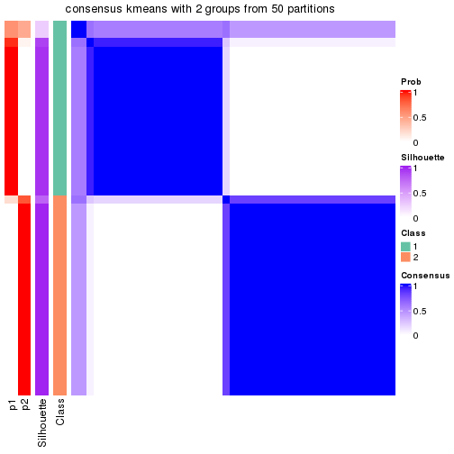</p>

</div>
<div id='tab-node-04-consensus-heatmap-2'>
<pre><code class="r">consensus_heatmap(res, k = 3)
</code></pre>

<p>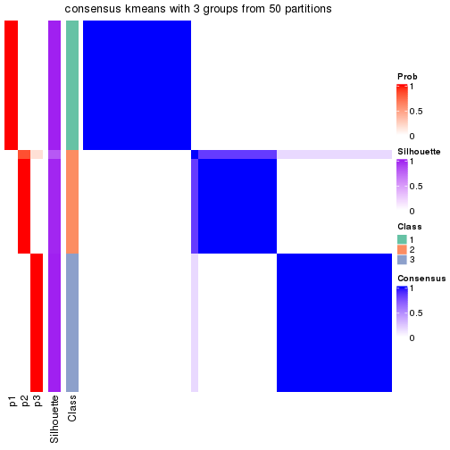</p>

</div>
<div id='tab-node-04-consensus-heatmap-3'>
<pre><code class="r">consensus_heatmap(res, k = 4)
</code></pre>

<p>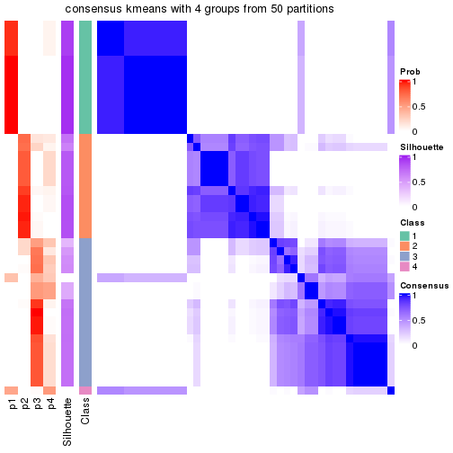</p>

</div>
<div id='tab-node-04-consensus-heatmap-4'>
<pre><code class="r">consensus_heatmap(res, k = 5)
</code></pre>

<p>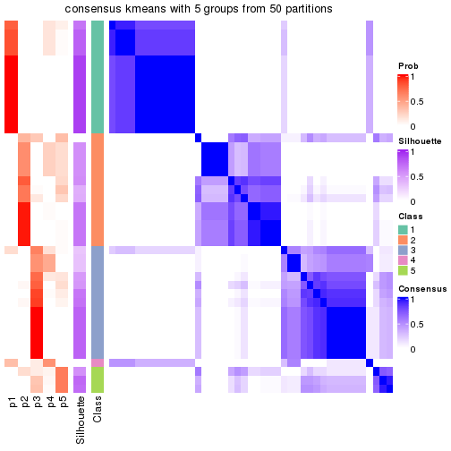</p>

</div>
<div id='tab-node-04-consensus-heatmap-5'>
<pre><code class="r">consensus_heatmap(res, k = 6)
</code></pre>

<p>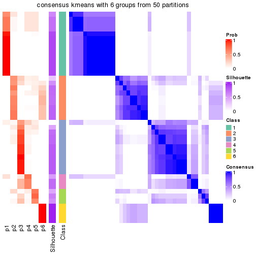</p>

</div>
<div id='tab-node-04-consensus-heatmap-6'>
<pre><code class="r">consensus_heatmap(res, k = 7)
</code></pre>

<p>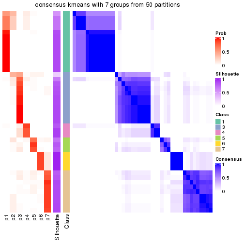</p>

</div>
<div id='tab-node-04-consensus-heatmap-7'>
<pre><code class="r">consensus_heatmap(res, k = 8)
</code></pre>

<p>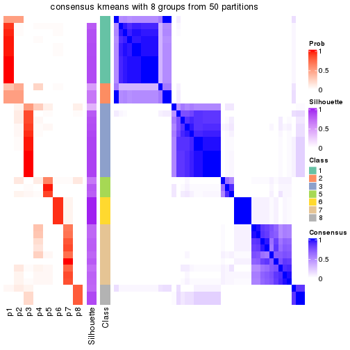</p>

</div>
</div>

Heatmaps for the membership of samples in all partitions to see how consistent they are:


<script>
$( function() {
	$( '#tabs-node-04-membership-heatmap' ).tabs();
} );
</script>
<div id='tabs-node-04-membership-heatmap'>
<ul>
<li><a href='#tab-node-04-membership-heatmap-1'>k = 2</a></li>
<li><a href='#tab-node-04-membership-heatmap-2'>k = 3</a></li>
<li><a href='#tab-node-04-membership-heatmap-3'>k = 4</a></li>
<li><a href='#tab-node-04-membership-heatmap-4'>k = 5</a></li>
<li><a href='#tab-node-04-membership-heatmap-5'>k = 6</a></li>
<li><a href='#tab-node-04-membership-heatmap-6'>k = 7</a></li>
<li><a href='#tab-node-04-membership-heatmap-7'>k = 8</a></li>
</ul>
<div id='tab-node-04-membership-heatmap-1'>
<pre><code class="r">membership_heatmap(res, k = 2)
</code></pre>

<p>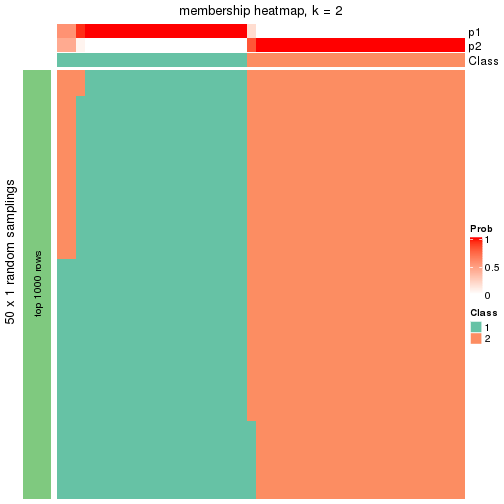</p>

</div>
<div id='tab-node-04-membership-heatmap-2'>
<pre><code class="r">membership_heatmap(res, k = 3)
</code></pre>

<p>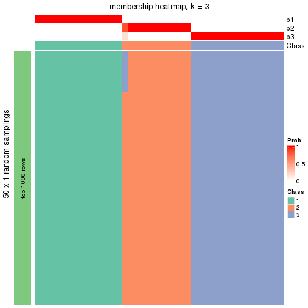</p>

</div>
<div id='tab-node-04-membership-heatmap-3'>
<pre><code class="r">membership_heatmap(res, k = 4)
</code></pre>

<p>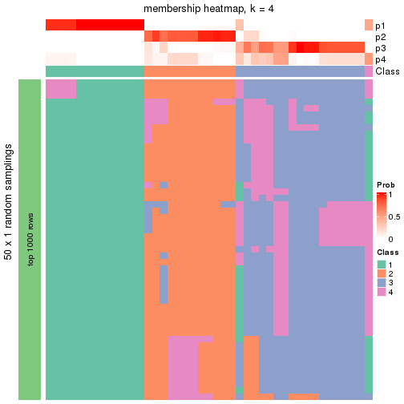</p>

</div>
<div id='tab-node-04-membership-heatmap-4'>
<pre><code class="r">membership_heatmap(res, k = 5)
</code></pre>

<p>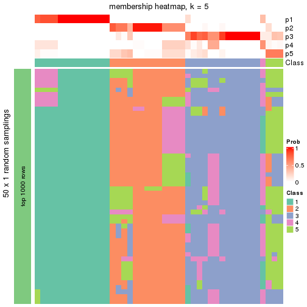</p>

</div>
<div id='tab-node-04-membership-heatmap-5'>
<pre><code class="r">membership_heatmap(res, k = 6)
</code></pre>

<p>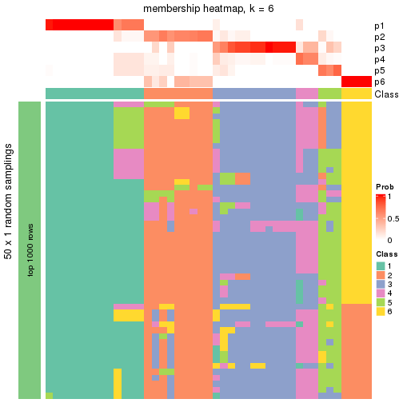</p>

</div>
<div id='tab-node-04-membership-heatmap-6'>
<pre><code class="r">membership_heatmap(res, k = 7)
</code></pre>

<p>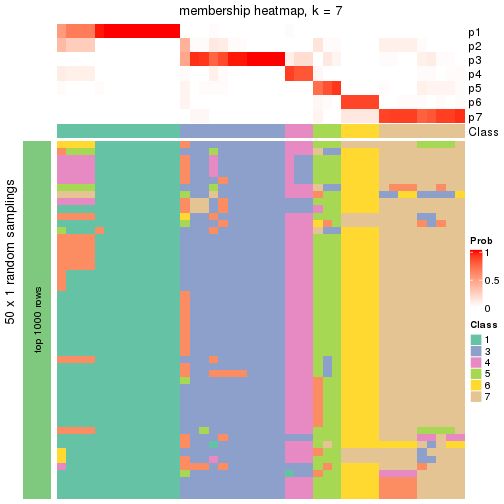</p>

</div>
<div id='tab-node-04-membership-heatmap-7'>
<pre><code class="r">membership_heatmap(res, k = 8)
</code></pre>

<p>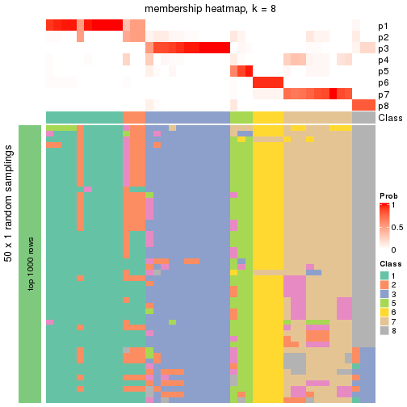</p>

</div>
</div>

As soon as the classes for columns are determined, the signatures
that are significantly different between subgroups can be looked for. 
Following are the heatmaps for signatures.


<script>
$( function() {
	$( '#tabs-node-04-get-signatures' ).tabs();
} );
</script>
<div id='tabs-node-04-get-signatures'>
<ul>
<li><a href='#tab-node-04-get-signatures-1'>k = 2</a></li>
<li><a href='#tab-node-04-get-signatures-2'>k = 3</a></li>
<li><a href='#tab-node-04-get-signatures-3'>k = 4</a></li>
<li><a href='#tab-node-04-get-signatures-4'>k = 5</a></li>
<li><a href='#tab-node-04-get-signatures-5'>k = 6</a></li>
<li><a href='#tab-node-04-get-signatures-6'>k = 7</a></li>
<li><a href='#tab-node-04-get-signatures-7'>k = 8</a></li>
</ul>
<div id='tab-node-04-get-signatures-1'>
<pre><code class="r">get_signatures(res, k = 2)
</code></pre>

<p>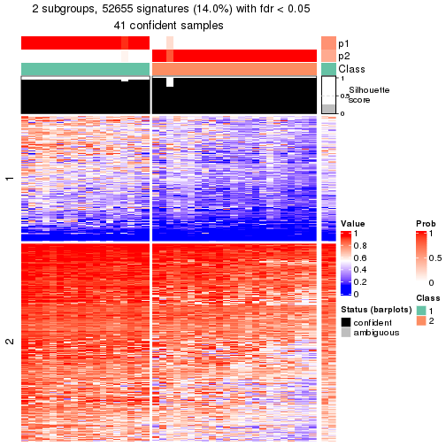</p>

</div>
<div id='tab-node-04-get-signatures-2'>
<pre><code class="r">get_signatures(res, k = 3)
</code></pre>

<p>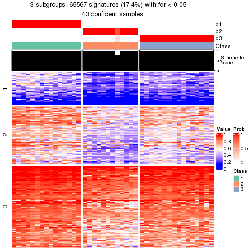</p>

</div>
<div id='tab-node-04-get-signatures-3'>
<pre><code class="r">get_signatures(res, k = 4)
</code></pre>

<p>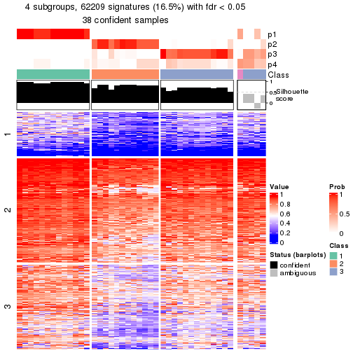</p>

</div>
<div id='tab-node-04-get-signatures-4'>
<pre><code class="r">get_signatures(res, k = 5)
</code></pre>

<p>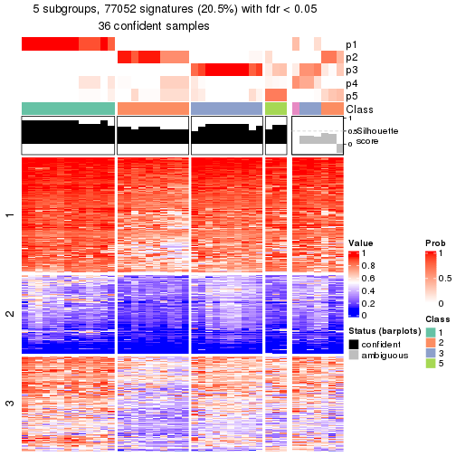</p>

</div>
<div id='tab-node-04-get-signatures-5'>
<pre><code class="r">get_signatures(res, k = 6)
</code></pre>

<p>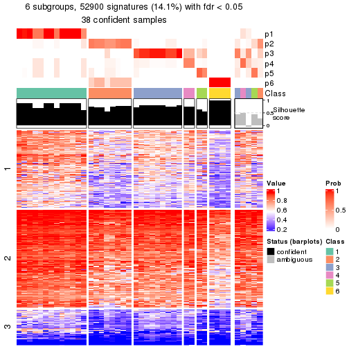</p>

</div>
<div id='tab-node-04-get-signatures-6'>
<pre><code class="r">get_signatures(res, k = 7)
</code></pre>

<p>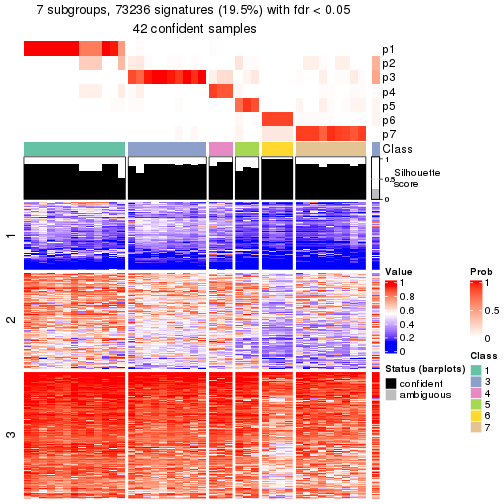</p>

</div>
<div id='tab-node-04-get-signatures-7'>
<pre><code class="r">get_signatures(res, k = 8)
</code></pre>

<p>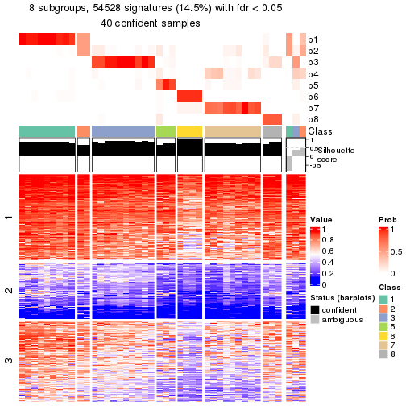</p>

</div>
</div>


Compare the overlap of signatures from different k:

```r
compare_signatures(res)
```

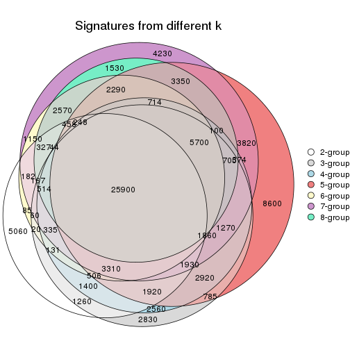

`get_signature()` returns a data frame invisibly. To get the list of signatures, the function
call should be assigned to a variable explicitly. In following code, if `plot` argument is set
to `FALSE`, no heatmap is plotted while only the differential analysis is performed.

```r
# code only for demonstration
tb = get_signature(res, k = ..., plot = FALSE)
```

An example of the output of `tb` is:

```
#>   which_row         fdr    mean_1    mean_2 scaled_mean_1 scaled_mean_2 km
#> 1        38 0.042760348  8.373488  9.131774    -0.5533452     0.5164555  1
#> 2        40 0.018707592  7.106213  8.469186    -0.6173731     0.5762149  1
#> 3        55 0.019134737 10.221463 11.207825    -0.6159697     0.5749050  1
#> 4        59 0.006059896  5.921854  7.869574    -0.6899429     0.6439467  1
#> 5        60 0.018055526  8.928898 10.211722    -0.6204761     0.5791110  1
#> 6        98 0.009384629 15.714769 14.887706     0.6635654    -0.6193277  2
...
```

The columns in `tb` are:

1. `which_row`: row indices corresponding to the input matrix.
2. `fdr`: FDR for the differential test. 
3. `mean_x`: The mean value in group x.
4. `scaled_mean_x`: The mean value in group x after rows are scaled.
5. `km`: Row groups if k-means clustering is applied to rows (which is done by automatically selecting number of clusters).

If there are too many signatures, `top_signatures = ...` can be set to only show the 
signatures with the highest FDRs:

```r
# code only for demonstration
# e.g. to show the top 500 most significant rows
tb = get_signature(res, k = ..., top_signatures = 500)
```

If the signatures are defined as these which are uniquely high in current group, `diff_method` argument
can be set to `"uniquely_high_in_one_group"`:

```r
# code only for demonstration
tb = get_signature(res, k = ..., diff_method = "uniquely_high_in_one_group")
```


UMAP plot which shows how samples are separated.


<script>
$( function() {
	$( '#tabs-node-04-dimension-reduction' ).tabs();
} );
</script>
<div id='tabs-node-04-dimension-reduction'>
<ul>
<li><a href='#tab-node-04-dimension-reduction-1'>k = 2</a></li>
<li><a href='#tab-node-04-dimension-reduction-2'>k = 3</a></li>
<li><a href='#tab-node-04-dimension-reduction-3'>k = 4</a></li>
<li><a href='#tab-node-04-dimension-reduction-4'>k = 5</a></li>
<li><a href='#tab-node-04-dimension-reduction-5'>k = 6</a></li>
<li><a href='#tab-node-04-dimension-reduction-6'>k = 7</a></li>
<li><a href='#tab-node-04-dimension-reduction-7'>k = 8</a></li>
</ul>
<div id='tab-node-04-dimension-reduction-1'>
<pre><code class="r">dimension_reduction(res, k = 2, method = &quot;UMAP&quot;)
</code></pre>

<p>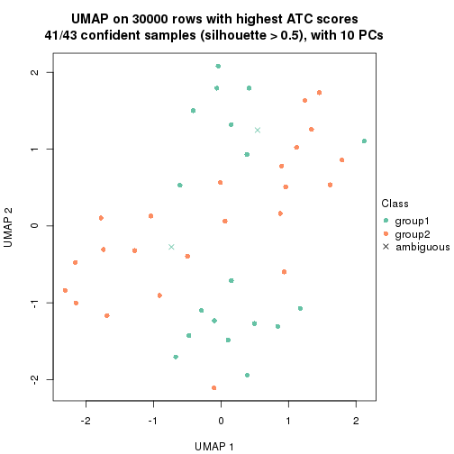</p>

</div>
<div id='tab-node-04-dimension-reduction-2'>
<pre><code class="r">dimension_reduction(res, k = 3, method = &quot;UMAP&quot;)
</code></pre>

<p>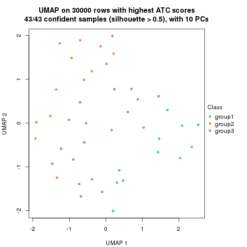</p>

</div>
<div id='tab-node-04-dimension-reduction-3'>
<pre><code class="r">dimension_reduction(res, k = 4, method = &quot;UMAP&quot;)
</code></pre>

<p>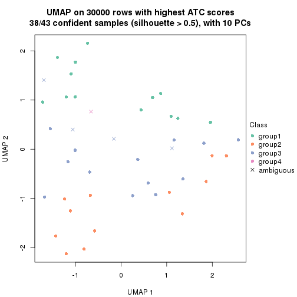</p>

</div>
<div id='tab-node-04-dimension-reduction-4'>
<pre><code class="r">dimension_reduction(res, k = 5, method = &quot;UMAP&quot;)
</code></pre>

<p>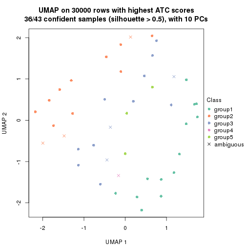</p>

</div>
<div id='tab-node-04-dimension-reduction-5'>
<pre><code class="r">dimension_reduction(res, k = 6, method = &quot;UMAP&quot;)
</code></pre>

<p>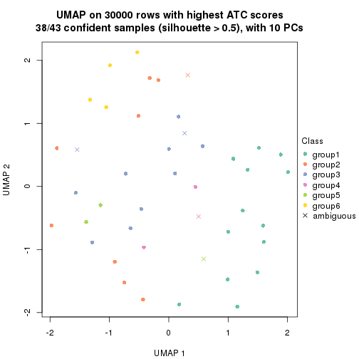</p>

</div>
<div id='tab-node-04-dimension-reduction-6'>
<pre><code class="r">dimension_reduction(res, k = 7, method = &quot;UMAP&quot;)
</code></pre>

<p>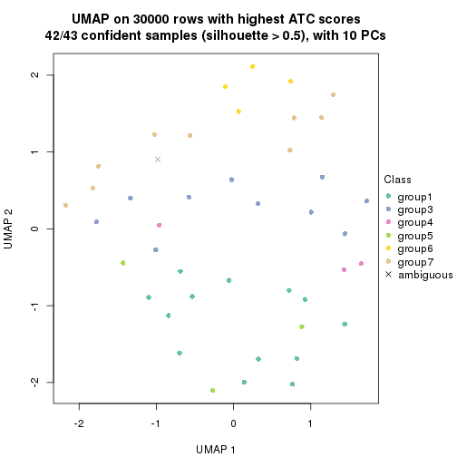</p>

</div>
<div id='tab-node-04-dimension-reduction-7'>
<pre><code class="r">dimension_reduction(res, k = 8, method = &quot;UMAP&quot;)
</code></pre>

<p>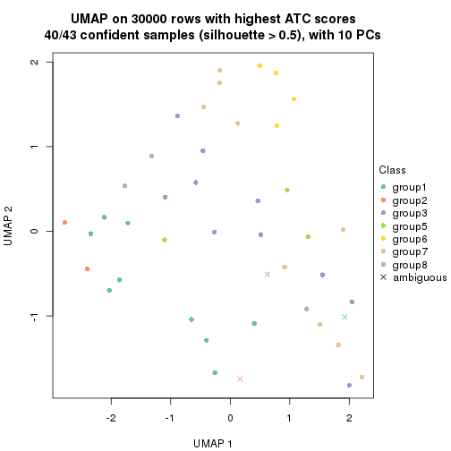</p>

</div>
</div>


Following heatmap shows how subgroups are split when increasing `k`:

```r
collect_classes(res)
```

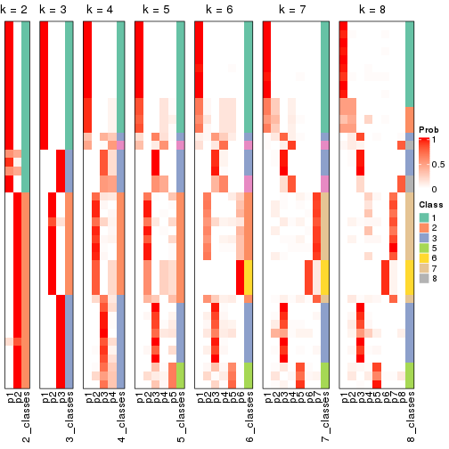


If matrix rows can be associated to genes, consider to use `functional_enrichment(res,
...)` to perform function enrichment for the signature genes. See [this vignette](https://jokergoo.github.io/cola_vignettes/functional_enrichment.html) for more detailed explanations.


 

---------------------------------------------------


### Node041


Parent node: [Node04](#Node04).
Child nodes: 
                [Node0111](#Node0111)
        ,
                [Node0112](#Node0112)
        ,
                [Node0113](#Node0113)
        ,
                [Node0121](#Node0121)
        ,
                Node0122-leaf
        ,
                Node0123-leaf
        ,
                Node0131-leaf
        ,
                Node0132-leaf
        ,
                Node0133-leaf
        ,
                Node0134-leaf
        ,
                [Node0141](#Node0141)
        ,
                Node0142-leaf
        ,
                Node0143-leaf
        ,
                Node0221-leaf
        ,
                Node0222-leaf
        ,
                Node0223-leaf
        ,
                Node0224-leaf
        ,
                [Node0231](#Node0231)
        ,
                Node0232-leaf
        ,
                Node0233-leaf
        ,
                Node0321-leaf
        ,
                Node0322-leaf
        ,
                Node0411-leaf
        ,
                Node0412-leaf
        ,
                Node0421-leaf
        ,
                Node0422-leaf
        ,
                Node0431-leaf
        ,
                Node0432-leaf
        ,
                Node0433-leaf
        ,
                Node0434-leaf
        .


The object with results only for a single top-value method and a single partitioning method 
can be extracted as:

```r
res = res_rh["041"]
```

A summary of `res` and all the functions that can be applied to it:

```r
res
```

```
#> A 'ConsensusPartition' object with k = 2, 3, 4, 5, 6, 7, 8.
#>   On a matrix with 30000 rows and 15 columns.
#>   Top rows (1000) are extracted by 'ATC' method.
#>   Subgroups are detected by 'kmeans' method.
#>   Performed in total 350 partitions by row resampling.
#>   Best k for subgroups seems to be 2.
#> 
#> Following methods can be applied to this 'ConsensusPartition' object:
#>  [1] "cola_report"             "collect_classes"         "collect_plots"          
#>  [4] "collect_stats"           "colnames"                "compare_partitions"     
#>  [7] "compare_signatures"      "consensus_heatmap"       "dimension_reduction"    
#> [10] "functional_enrichment"   "get_anno_col"            "get_anno"               
#> [13] "get_classes"             "get_consensus"           "get_matrix"             
#> [16] "get_membership"          "get_param"               "get_signatures"         
#> [19] "get_stats"               "is_best_k"               "is_stable_k"            
#> [22] "membership_heatmap"      "ncol"                    "nrow"                   
#> [25] "plot_ecdf"               "predict_classes"         "rownames"               
#> [28] "select_partition_number" "show"                    "suggest_best_k"         
#> [31] "test_to_known_factors"   "top_rows_heatmap"
```

`collect_plots()` function collects all the plots made from `res` for all `k` (number of subgroups)
into one single page to provide an easy and fast comparison between different `k`.

```r
collect_plots(res)
```

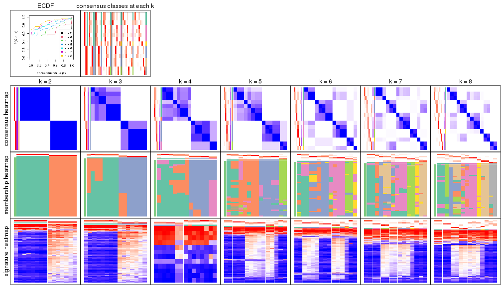

The plots are:

- The first row: a plot of the eCDF (empirical cumulative distribution
  function) curves of the consensus matrix for each `k` and the heatmap of
  predicted classes for each `k`.
- The second row: heatmaps of the consensus matrix for each `k`.
- The third row: heatmaps of the membership matrix for each `k`.
- The fouth row: heatmaps of the signatures for each `k`.

All the plots in panels can be made by individual functions and they are
plotted later in this section.

`select_partition_number()` produces several plots showing different
statistics for choosing "optimized" `k`. There are following statistics:

- eCDF curves of the consensus matrix for each `k`;
- 1-PAC. [The PAC score](https://en.wikipedia.org/wiki/Consensus_clustering#Over-interpretation_potential_of_consensus_clustering)
  measures the proportion of the ambiguous subgrouping.
- Mean silhouette score.
- Concordance. The mean probability of fiting the consensus subgroup labels in all
  partitions.
- Area increased. Denote $A_k$ as the area under the eCDF curve for current
  `k`, the area increased is defined as $A_k - A_{k-1}$.
- Rand index. The percent of pairs of samples that are both in a same cluster
  or both are not in a same cluster in the partition of k and k-1.
- Jaccard index. The ratio of pairs of samples are both in a same cluster in
  the partition of k and k-1 and the pairs of samples are both in a same
  cluster in the partition k or k-1.

The detailed explanations of these statistics can be found in [the _cola_
vignette](https://jokergoo.github.io/cola_vignettes/cola.html#toc_13).

Generally speaking, higher 1-PAC score, higher mean silhouette score or higher
concordance corresponds to better partition. Rand index and Jaccard index
measure how similar the current partition is compared to partition with `k-1`.
If they are too similar, we won't accept `k` is better than `k-1`.

```r
select_partition_number(res)
```

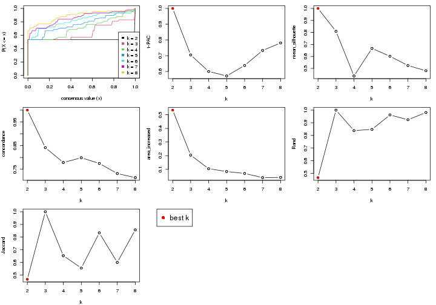

The numeric values for all these statistics can be obtained by `get_stats()`.

```r
get_stats(res)
```

```
#>   k 1-PAC mean_silhouette concordance area_increased  Rand Jaccard
#> 2 2 1.000           1.000       1.000         0.5338 0.467   0.467
#> 3 3 0.705           0.809       0.841         0.2041 1.000   1.000
#> 4 4 0.600           0.437       0.779         0.1045 0.838   0.653
#> 5 5 0.571           0.667       0.799         0.0840 0.848   0.556
#> 6 6 0.638           0.601       0.775         0.0699 0.962   0.833
#> 7 7 0.733           0.524       0.732         0.0393 0.924   0.600
#> 8 8 0.781           0.481       0.715         0.0408 0.981   0.857
```

`suggest_best_k()` suggests the best $k$ based on these statistics. The rules are as follows:

- All $k$ with Jaccard index larger than 0.95 are removed because increasing
  $k$ does not provide enough extra information. If all $k$ are removed, it is
  marked as no subgroup is detected.
- For all $k$ with 1-PAC score larger than 0.9, the maximal $k$ is taken as
  the best $k$, and other $k$ are marked as optional $k$.
- If it does not fit the second rule. The $k$ with the maximal vote of the
  highest 1-PAC score, highest mean silhouette, and highest concordance is
  taken as the best $k$.

```r
suggest_best_k(res)
```

```
#> [1] 2
```


Following is the table of the partitions (You need to click the **show/hide
code output** link to see it). The membership matrix (columns with name `p*`)
is inferred by
[`clue::cl_consensus()`](https://www.rdocumentation.org/link/cl_consensus?package=clue)
function with the `SE` method. Basically the value in the membership matrix
represents the probability to belong to a certain group. The finall subgroup
label for an item is determined with the group with highest probability it
belongs to.

In `get_classes()` function, the entropy is calculated from the membership
matrix and the silhouette score is calculated from the consensus matrix.


<script>
$( function() {
	$( '#tabs-node-041-get-classes' ).tabs();
} );
</script>
<div id='tabs-node-041-get-classes'>
<ul>
<li><a href='#tab-node-041-get-classes-1'>k = 2</a></li>
<li><a href='#tab-node-041-get-classes-2'>k = 3</a></li>
<li><a href='#tab-node-041-get-classes-3'>k = 4</a></li>
<li><a href='#tab-node-041-get-classes-4'>k = 5</a></li>
<li><a href='#tab-node-041-get-classes-5'>k = 6</a></li>
<li><a href='#tab-node-041-get-classes-6'>k = 7</a></li>
<li><a href='#tab-node-041-get-classes-7'>k = 8</a></li>
</ul>

<div id='tab-node-041-get-classes-1'>
<p><a id='tab-node-041-get-classes-1-a' style='color:#0366d6' href='#'>show/hide code output</a></p>
<pre><code class="r">cbind(get_classes(res, k = 2), get_membership(res, k = 2))
</code></pre>

<pre><code>#&gt;                 class entropy silhouette p1 p2
#&gt; TCGA.A6.6651.01     2       0          1  0  1
#&gt; TCGA.G4.6626.01     1       0          1  1  0
#&gt; TCGA.D5.6923.01     1       0          1  1  0
#&gt; TCGA.AU.3779.01     2       0          1  0  1
#&gt; TCGA.A6.3810.01     1       0          1  1  0
#&gt; TCGA.F4.6460.01     2       0          1  0  1
#&gt; TCGA.A6.5662.01     1       0          1  1  0
#&gt; TCGA.A6.6140.01     1       0          1  1  0
#&gt; TCGA.A6.2685.01     2       0          1  0  1
#&gt; TCGA.D5.5541.01     1       0          1  1  0
#&gt; TCGA.DM.A28E.01     2       0          1  0  1
#&gt; TCGA.DM.A1DB.01     1       0          1  1  0
#&gt; TCGA.DM.A1D0.01     2       0          1  0  1
#&gt; TCGA.A6.5667.01     1       0          1  1  0
#&gt; TCGA.G4.6317.01     2       0          1  0  1
</code></pre>

<script>
$('#tab-node-041-get-classes-1-a').parent().next().next().hide();
$('#tab-node-041-get-classes-1-a').click(function(){
  $('#tab-node-041-get-classes-1-a').parent().next().next().toggle();
  return(false);
});
</script>
</div>

<div id='tab-node-041-get-classes-2'>
<p><a id='tab-node-041-get-classes-2-a' style='color:#0366d6' href='#'>show/hide code output</a></p>
<pre><code class="r">cbind(get_classes(res, k = 3), get_membership(res, k = 3))
</code></pre>

<pre><code>#&gt;                 class entropy silhouette   p1   p2  p3
#&gt; TCGA.A6.6651.01     3   0.000      0.892 0.00 0.00 1.0
#&gt; TCGA.G4.6626.01     1   0.400      0.769 0.84 0.16 0.0
#&gt; TCGA.D5.6923.01     1   0.480      0.825 0.78 0.22 0.0
#&gt; TCGA.AU.3779.01     3   0.000      0.892 0.00 0.00 1.0
#&gt; TCGA.A6.3810.01     1   0.480      0.825 0.78 0.22 0.0
#&gt; TCGA.F4.6460.01     3   0.000      0.892 0.00 0.00 1.0
#&gt; TCGA.A6.5662.01     1   0.400      0.769 0.84 0.16 0.0
#&gt; TCGA.A6.6140.01     1   0.000      0.808 1.00 0.00 0.0
#&gt; TCGA.A6.2685.01     3   0.000      0.892 0.00 0.00 1.0
#&gt; TCGA.D5.5541.01     1   0.480      0.825 0.78 0.22 0.0
#&gt; TCGA.DM.A28E.01     3   0.613      0.703 0.00 0.40 0.6
#&gt; TCGA.DM.A1DB.01     1   0.604      0.622 0.62 0.38 0.0
#&gt; TCGA.DM.A1D0.01     3   0.613      0.703 0.00 0.40 0.6
#&gt; TCGA.A6.5667.01     1   0.480      0.825 0.78 0.22 0.0
#&gt; TCGA.G4.6317.01     3   0.000      0.892 0.00 0.00 1.0
</code></pre>

<script>
$('#tab-node-041-get-classes-2-a').parent().next().next().hide();
$('#tab-node-041-get-classes-2-a').click(function(){
  $('#tab-node-041-get-classes-2-a').parent().next().next().toggle();
  return(false);
});
</script>
</div>

<div id='tab-node-041-get-classes-3'>
<p><a id='tab-node-041-get-classes-3-a' style='color:#0366d6' href='#'>show/hide code output</a></p>
<pre><code class="r">cbind(get_classes(res, k = 4), get_membership(res, k = 4))
</code></pre>

<pre><code>#&gt;                 class entropy silhouette   p1   p2   p3   p4
#&gt; TCGA.A6.6651.01     3   0.265      0.844 0.00 0.12 0.88 0.00
#&gt; TCGA.G4.6626.01     1   0.000      0.366 1.00 0.00 0.00 0.00
#&gt; TCGA.D5.6923.01     1   0.498     -0.232 0.54 0.46 0.00 0.00
#&gt; TCGA.AU.3779.01     3   0.000      0.871 0.00 0.00 1.00 0.00
#&gt; TCGA.A6.3810.01     1   0.559     -0.294 0.52 0.46 0.00 0.02
#&gt; TCGA.F4.6460.01     3   0.000      0.871 0.00 0.00 1.00 0.00
#&gt; TCGA.A6.5662.01     1   0.000      0.366 1.00 0.00 0.00 0.00
#&gt; TCGA.A6.6140.01     1   0.385      0.276 0.82 0.16 0.00 0.02
#&gt; TCGA.A6.2685.01     3   0.265      0.844 0.00 0.12 0.88 0.00
#&gt; TCGA.D5.5541.01     1   0.498     -0.232 0.54 0.46 0.00 0.00
#&gt; TCGA.DM.A28E.01     4   0.471      1.000 0.00 0.00 0.36 0.64
#&gt; TCGA.DM.A1DB.01     1   0.645      0.110 0.64 0.14 0.00 0.22
#&gt; TCGA.DM.A1D0.01     4   0.471      1.000 0.00 0.00 0.36 0.64
#&gt; TCGA.A6.5667.01     2   0.677      0.000 0.38 0.52 0.00 0.10
#&gt; TCGA.G4.6317.01     3   0.265      0.763 0.00 0.12 0.88 0.00
</code></pre>

<script>
$('#tab-node-041-get-classes-3-a').parent().next().next().hide();
$('#tab-node-041-get-classes-3-a').click(function(){
  $('#tab-node-041-get-classes-3-a').parent().next().next().toggle();
  return(false);
});
</script>
</div>

<div id='tab-node-041-get-classes-4'>
<p><a id='tab-node-041-get-classes-4-a' style='color:#0366d6' href='#'>show/hide code output</a></p>
<pre><code class="r">cbind(get_classes(res, k = 5), get_membership(res, k = 5))
</code></pre>

<pre><code>#&gt;                 class entropy silhouette   p1   p2   p3   p4   p5
#&gt; TCGA.A6.6651.01     3  0.0609      0.786 0.02 0.00 0.98 0.00 0.00
#&gt; TCGA.G4.6626.01     1  0.4227      0.670 0.58 0.42 0.00 0.00 0.00
#&gt; TCGA.D5.6923.01     2  0.0000      0.684 0.00 1.00 0.00 0.00 0.00
#&gt; TCGA.AU.3779.01     3  0.3319      0.820 0.02 0.00 0.82 0.16 0.00
#&gt; TCGA.A6.3810.01     2  0.2331      0.655 0.00 0.90 0.00 0.02 0.08
#&gt; TCGA.F4.6460.01     3  0.3319      0.820 0.02 0.00 0.82 0.16 0.00
#&gt; TCGA.A6.5662.01     1  0.4227      0.670 0.58 0.42 0.00 0.00 0.00
#&gt; TCGA.A6.6140.01     2  0.4588      0.232 0.22 0.72 0.00 0.06 0.00
#&gt; TCGA.A6.2685.01     3  0.0000      0.792 0.00 0.00 1.00 0.00 0.00
#&gt; TCGA.D5.5541.01     2  0.0000      0.684 0.00 1.00 0.00 0.00 0.00
#&gt; TCGA.DM.A28E.01     5  0.4637      0.925 0.10 0.00 0.16 0.00 0.74
#&gt; TCGA.DM.A1DB.01     1  0.4748      0.471 0.76 0.14 0.00 0.02 0.08
#&gt; TCGA.DM.A1D0.01     5  0.2732      0.925 0.00 0.00 0.16 0.00 0.84
#&gt; TCGA.A6.5667.01     2  0.4302      0.266 0.00 0.52 0.00 0.48 0.00
#&gt; TCGA.G4.6317.01     3  0.4262      0.601 0.00 0.00 0.56 0.44 0.00
</code></pre>

<script>
$('#tab-node-041-get-classes-4-a').parent().next().next().hide();
$('#tab-node-041-get-classes-4-a').click(function(){
  $('#tab-node-041-get-classes-4-a').parent().next().next().toggle();
  return(false);
});
</script>
</div>

<div id='tab-node-041-get-classes-5'>
<p><a id='tab-node-041-get-classes-5-a' style='color:#0366d6' href='#'>show/hide code output</a></p>
<pre><code class="r">cbind(get_classes(res, k = 6), get_membership(res, k = 6))
</code></pre>

<pre><code>#&gt;                 class entropy silhouette   p1   p2   p3   p4   p5   p6
#&gt; TCGA.A6.6651.01     3  0.3647      0.673 0.00 0.36 0.64 0.00 0.00 0.00
#&gt; TCGA.G4.6626.01     1  0.6086      0.719 0.52 0.20 0.00 0.26 0.00 0.02
#&gt; TCGA.D5.6923.01     4  0.0000      0.664 0.00 0.00 0.00 1.00 0.00 0.00
#&gt; TCGA.AU.3779.01     3  0.0000      0.722 0.00 0.00 1.00 0.00 0.00 0.00
#&gt; TCGA.A6.3810.01     4  0.3111      0.553 0.00 0.12 0.00 0.84 0.02 0.02
#&gt; TCGA.F4.6460.01     3  0.0000      0.722 0.00 0.00 1.00 0.00 0.00 0.00
#&gt; TCGA.A6.5662.01     1  0.6086      0.719 0.52 0.20 0.00 0.26 0.00 0.02
#&gt; TCGA.A6.6140.01     4  0.7228      0.108 0.14 0.24 0.00 0.50 0.08 0.04
#&gt; TCGA.A6.2685.01     3  0.3578      0.680 0.00 0.34 0.66 0.00 0.00 0.00
#&gt; TCGA.D5.5541.01     4  0.0000      0.664 0.00 0.00 0.00 1.00 0.00 0.00
#&gt; TCGA.DM.A28E.01     5  0.3785      0.937 0.04 0.02 0.10 0.00 0.82 0.02
#&gt; TCGA.DM.A1DB.01     1  0.0937      0.448 0.96 0.00 0.00 0.04 0.00 0.00
#&gt; TCGA.DM.A1D0.01     5  0.1814      0.937 0.00 0.00 0.10 0.00 0.90 0.00
#&gt; TCGA.A6.5667.01     6  0.3578      0.000 0.00 0.00 0.00 0.34 0.00 0.66
#&gt; TCGA.G4.6317.01     3  0.5202      0.476 0.00 0.14 0.60 0.00 0.00 0.26
</code></pre>

<script>
$('#tab-node-041-get-classes-5-a').parent().next().next().hide();
$('#tab-node-041-get-classes-5-a').click(function(){
  $('#tab-node-041-get-classes-5-a').parent().next().next().toggle();
  return(false);
});
</script>
</div>

<div id='tab-node-041-get-classes-6'>
<p><a id='tab-node-041-get-classes-6-a' style='color:#0366d6' href='#'>show/hide code output</a></p>
<pre><code class="r">cbind(get_classes(res, k = 7), get_membership(res, k = 7))
</code></pre>

<pre><code>#&gt;                 class entropy silhouette   p1   p2   p3   p4   p5   p6   p7
#&gt; TCGA.A6.6651.01     7  0.4121      0.842 0.00 0.00 0.20 0.00 0.00 0.10 0.70
#&gt; TCGA.G4.6626.01     1  0.2422      1.000 0.82 0.00 0.00 0.18 0.00 0.00 0.00
#&gt; TCGA.D5.6923.01     4  0.1433      0.634 0.08 0.00 0.00 0.92 0.00 0.00 0.00
#&gt; TCGA.AU.3779.01     3  0.3909      0.258 0.02 0.00 0.58 0.00 0.00 0.00 0.40
#&gt; TCGA.A6.3810.01     4  0.2769      0.474 0.00 0.08 0.00 0.86 0.02 0.00 0.04
#&gt; TCGA.F4.6460.01     3  0.4938      0.308 0.02 0.08 0.58 0.00 0.00 0.00 0.32
#&gt; TCGA.A6.5662.01     1  0.2422      1.000 0.82 0.00 0.00 0.18 0.00 0.00 0.00
#&gt; TCGA.A6.6140.01     4  0.7347     -0.204 0.32 0.08 0.00 0.36 0.00 0.08 0.16
#&gt; TCGA.A6.2685.01     7  0.2572      0.839 0.00 0.00 0.20 0.00 0.00 0.00 0.80
#&gt; TCGA.D5.5541.01     4  0.1671      0.635 0.10 0.00 0.00 0.90 0.00 0.00 0.00
#&gt; TCGA.DM.A28E.01     5  0.0504      0.935 0.00 0.00 0.02 0.00 0.98 0.00 0.00
#&gt; TCGA.DM.A1DB.01     2  0.3637      0.000 0.24 0.72 0.00 0.04 0.00 0.00 0.00
#&gt; TCGA.DM.A1D0.01     5  0.2213      0.935 0.04 0.00 0.02 0.00 0.90 0.04 0.00
#&gt; TCGA.A6.5667.01     6  0.2832      0.000 0.00 0.00 0.00 0.24 0.00 0.76 0.00
#&gt; TCGA.G4.6317.01     3  0.3000      0.206 0.10 0.04 0.84 0.00 0.00 0.02 0.00
</code></pre>

<script>
$('#tab-node-041-get-classes-6-a').parent().next().next().hide();
$('#tab-node-041-get-classes-6-a').click(function(){
  $('#tab-node-041-get-classes-6-a').parent().next().next().toggle();
  return(false);
});
</script>
</div>

<div id='tab-node-041-get-classes-7'>
<p><a id='tab-node-041-get-classes-7-a' style='color:#0366d6' href='#'>show/hide code output</a></p>
<pre><code class="r">cbind(get_classes(res, k = 8), get_membership(res, k = 8))
</code></pre>

<pre><code>#&gt;                 class entropy silhouette   p1  p2   p3   p4   p5   p6   p7   p8
#&gt; TCGA.A6.6651.01     7  0.0941      0.869 0.00 0.0 0.00 0.00 0.02 0.02 0.96 0.00
#&gt; TCGA.G4.6626.01     1  0.2650      0.509 0.76 0.0 0.00 0.24 0.00 0.00 0.00 0.00
#&gt; TCGA.D5.6923.01     4  0.0000      0.644 0.00 0.0 0.00 1.00 0.00 0.00 0.00 0.00
#&gt; TCGA.AU.3779.01     3  0.3083      0.447 0.00 0.0 0.66 0.00 0.00 0.00 0.34 0.00
#&gt; TCGA.A6.3810.01     4  0.3237      0.418 0.00 0.4 0.00 0.60 0.00 0.00 0.00 0.00
#&gt; TCGA.F4.6460.01     3  0.2938      0.459 0.00 0.0 0.70 0.00 0.00 0.00 0.30 0.00
#&gt; TCGA.A6.5662.01     1  0.2534      0.515 0.78 0.0 0.00 0.22 0.00 0.00 0.00 0.00
#&gt; TCGA.A6.6140.01     4  0.4896      0.188 0.16 0.0 0.00 0.46 0.38 0.00 0.00 0.00
#&gt; TCGA.A6.2685.01     7  0.1091      0.864 0.00 0.0 0.06 0.00 0.00 0.00 0.94 0.00
#&gt; TCGA.D5.5541.01     4  0.0471      0.640 0.02 0.0 0.00 0.98 0.00 0.00 0.00 0.00
#&gt; TCGA.DM.A28E.01     8  0.2756      0.770 0.00 0.0 0.00 0.00 0.26 0.00 0.00 0.74
#&gt; TCGA.DM.A1DB.01     1  0.6400      0.014 0.44 0.2 0.06 0.00 0.26 0.04 0.00 0.00
#&gt; TCGA.DM.A1D0.01     8  0.0000      0.770 0.00 0.0 0.00 0.00 0.00 0.00 0.00 1.00
#&gt; TCGA.A6.5667.01     6  0.1341      0.000 0.00 0.0 0.00 0.08 0.00 0.92 0.00 0.00
#&gt; TCGA.G4.6317.01     3  0.5659      0.101 0.00 0.4 0.44 0.00 0.08 0.02 0.06 0.00
</code></pre>

<script>
$('#tab-node-041-get-classes-7-a').parent().next().next().hide();
$('#tab-node-041-get-classes-7-a').click(function(){
  $('#tab-node-041-get-classes-7-a').parent().next().next().toggle();
  return(false);
});
</script>
</div>
</div>

Heatmaps for the consensus matrix. It visualizes the probability of two
samples to be in a same group.


<script>
$( function() {
	$( '#tabs-node-041-consensus-heatmap' ).tabs();
} );
</script>
<div id='tabs-node-041-consensus-heatmap'>
<ul>
<li><a href='#tab-node-041-consensus-heatmap-1'>k = 2</a></li>
<li><a href='#tab-node-041-consensus-heatmap-2'>k = 3</a></li>
<li><a href='#tab-node-041-consensus-heatmap-3'>k = 4</a></li>
<li><a href='#tab-node-041-consensus-heatmap-4'>k = 5</a></li>
<li><a href='#tab-node-041-consensus-heatmap-5'>k = 6</a></li>
<li><a href='#tab-node-041-consensus-heatmap-6'>k = 7</a></li>
<li><a href='#tab-node-041-consensus-heatmap-7'>k = 8</a></li>
</ul>
<div id='tab-node-041-consensus-heatmap-1'>
<pre><code class="r">consensus_heatmap(res, k = 2)
</code></pre>

<p>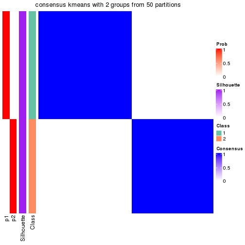</p>

</div>
<div id='tab-node-041-consensus-heatmap-2'>
<pre><code class="r">consensus_heatmap(res, k = 3)
</code></pre>

<p>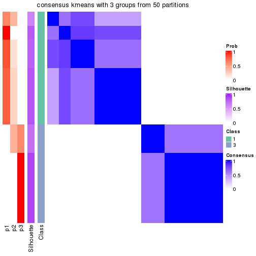</p>

</div>
<div id='tab-node-041-consensus-heatmap-3'>
<pre><code class="r">consensus_heatmap(res, k = 4)
</code></pre>

<p>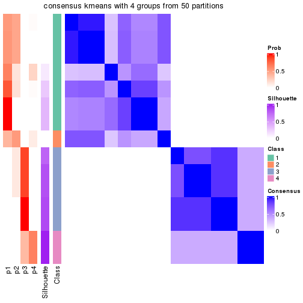</p>

</div>
<div id='tab-node-041-consensus-heatmap-4'>
<pre><code class="r">consensus_heatmap(res, k = 5)
</code></pre>

<p>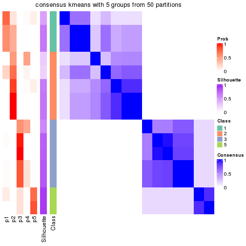</p>

</div>
<div id='tab-node-041-consensus-heatmap-5'>
<pre><code class="r">consensus_heatmap(res, k = 6)
</code></pre>

<p>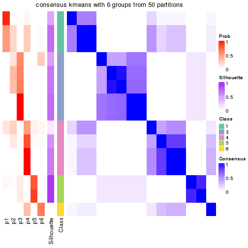</p>

</div>
<div id='tab-node-041-consensus-heatmap-6'>
<pre><code class="r">consensus_heatmap(res, k = 7)
</code></pre>

<p>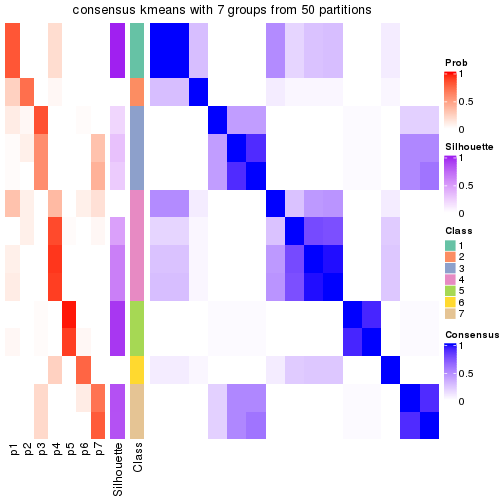</p>

</div>
<div id='tab-node-041-consensus-heatmap-7'>
<pre><code class="r">consensus_heatmap(res, k = 8)
</code></pre>

<p>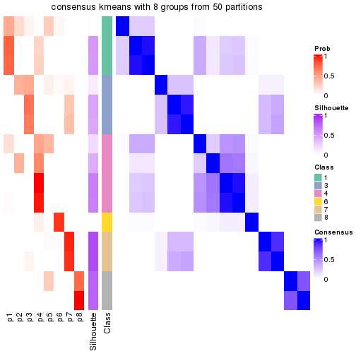</p>

</div>
</div>

Heatmaps for the membership of samples in all partitions to see how consistent they are:


<script>
$( function() {
	$( '#tabs-node-041-membership-heatmap' ).tabs();
} );
</script>
<div id='tabs-node-041-membership-heatmap'>
<ul>
<li><a href='#tab-node-041-membership-heatmap-1'>k = 2</a></li>
<li><a href='#tab-node-041-membership-heatmap-2'>k = 3</a></li>
<li><a href='#tab-node-041-membership-heatmap-3'>k = 4</a></li>
<li><a href='#tab-node-041-membership-heatmap-4'>k = 5</a></li>
<li><a href='#tab-node-041-membership-heatmap-5'>k = 6</a></li>
<li><a href='#tab-node-041-membership-heatmap-6'>k = 7</a></li>
<li><a href='#tab-node-041-membership-heatmap-7'>k = 8</a></li>
</ul>
<div id='tab-node-041-membership-heatmap-1'>
<pre><code class="r">membership_heatmap(res, k = 2)
</code></pre>

<p>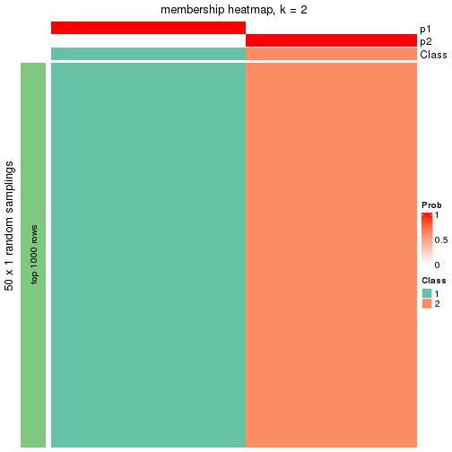</p>

</div>
<div id='tab-node-041-membership-heatmap-2'>
<pre><code class="r">membership_heatmap(res, k = 3)
</code></pre>

<p>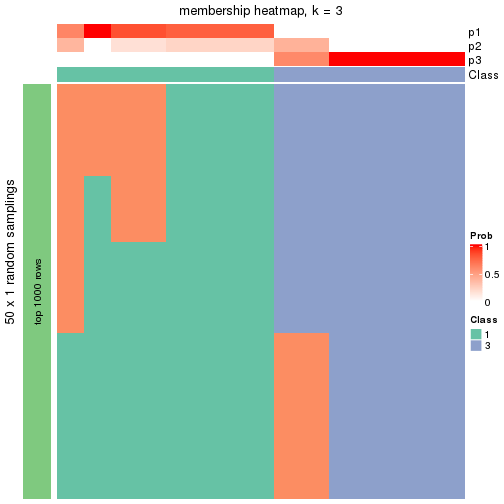</p>

</div>
<div id='tab-node-041-membership-heatmap-3'>
<pre><code class="r">membership_heatmap(res, k = 4)
</code></pre>

<p>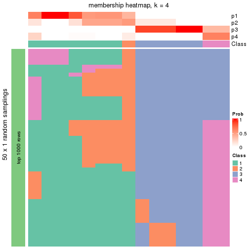</p>

</div>
<div id='tab-node-041-membership-heatmap-4'>
<pre><code class="r">membership_heatmap(res, k = 5)
</code></pre>

<p>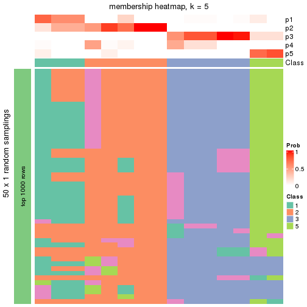</p>

</div>
<div id='tab-node-041-membership-heatmap-5'>
<pre><code class="r">membership_heatmap(res, k = 6)
</code></pre>

<p>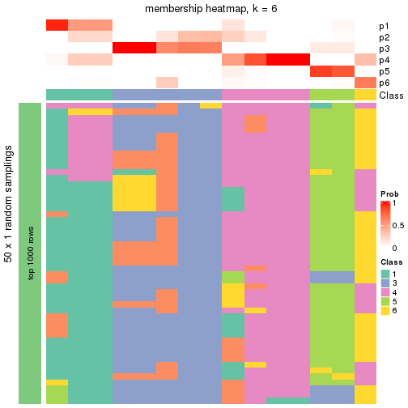</p>

</div>
<div id='tab-node-041-membership-heatmap-6'>
<pre><code class="r">membership_heatmap(res, k = 7)
</code></pre>

<p>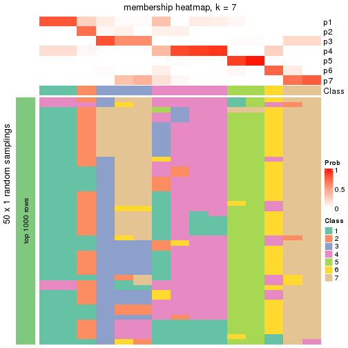</p>

</div>
<div id='tab-node-041-membership-heatmap-7'>
<pre><code class="r">membership_heatmap(res, k = 8)
</code></pre>

<p>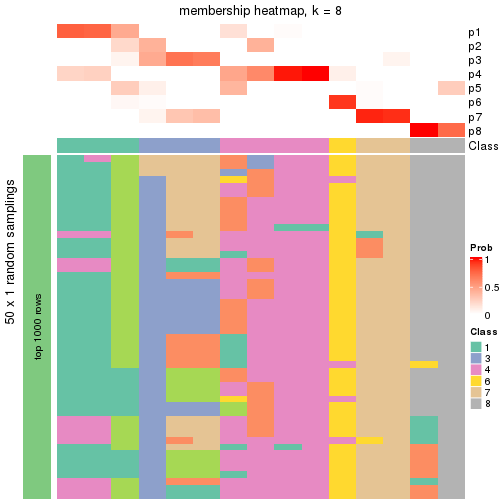</p>

</div>
</div>

As soon as the classes for columns are determined, the signatures
that are significantly different between subgroups can be looked for. 
Following are the heatmaps for signatures.


<script>
$( function() {
	$( '#tabs-node-041-get-signatures' ).tabs();
} );
</script>
<div id='tabs-node-041-get-signatures'>
<ul>
<li><a href='#tab-node-041-get-signatures-1'>k = 2</a></li>
<li><a href='#tab-node-041-get-signatures-2'>k = 3</a></li>
<li><a href='#tab-node-041-get-signatures-3'>k = 4</a></li>
<li><a href='#tab-node-041-get-signatures-4'>k = 5</a></li>
<li><a href='#tab-node-041-get-signatures-5'>k = 6</a></li>
<li><a href='#tab-node-041-get-signatures-6'>k = 7</a></li>
<li><a href='#tab-node-041-get-signatures-7'>k = 8</a></li>
</ul>
<div id='tab-node-041-get-signatures-1'>
<pre><code class="r">get_signatures(res, k = 2)
</code></pre>

<p>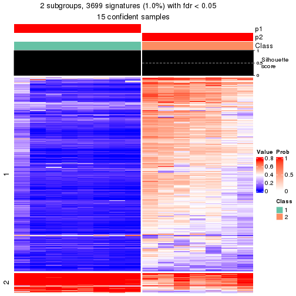</p>

</div>
<div id='tab-node-041-get-signatures-2'>
<pre><code class="r">get_signatures(res, k = 3)
</code></pre>

<p>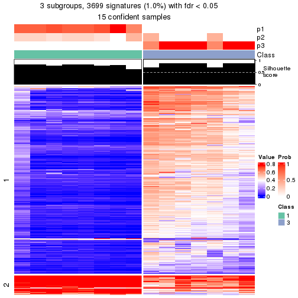</p>

</div>
<div id='tab-node-041-get-signatures-3'>
<pre><code class="r">get_signatures(res, k = 4)
</code></pre>

<p>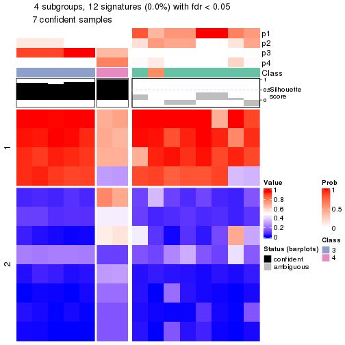</p>

</div>
<div id='tab-node-041-get-signatures-4'>
<pre><code class="r">get_signatures(res, k = 5)
</code></pre>

<p>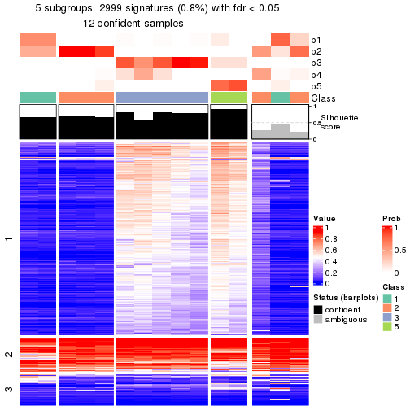</p>

</div>
<div id='tab-node-041-get-signatures-5'>
<pre><code class="r">get_signatures(res, k = 6)
</code></pre>

<p>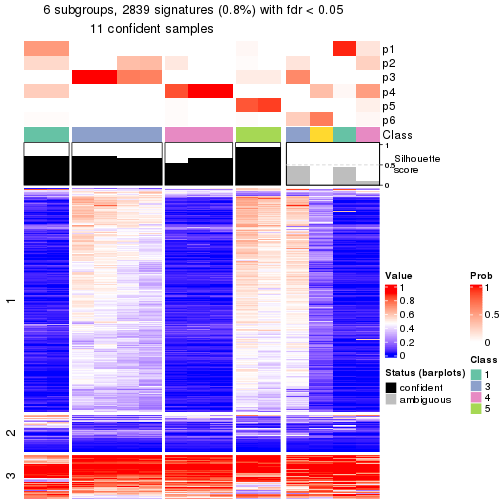</p>

</div>
<div id='tab-node-041-get-signatures-6'>
<pre><code class="r">get_signatures(res, k = 7)
</code></pre>

<p>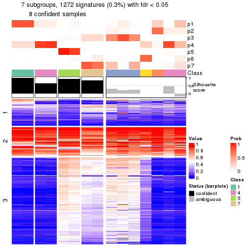</p>

</div>
<div id='tab-node-041-get-signatures-7'>
<pre><code class="r">get_signatures(res, k = 8)
</code></pre>

<p>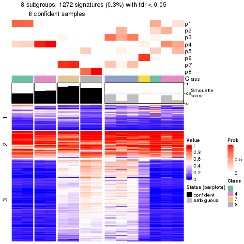</p>

</div>
</div>


Compare the overlap of signatures from different k:

```r
compare_signatures(res)
```

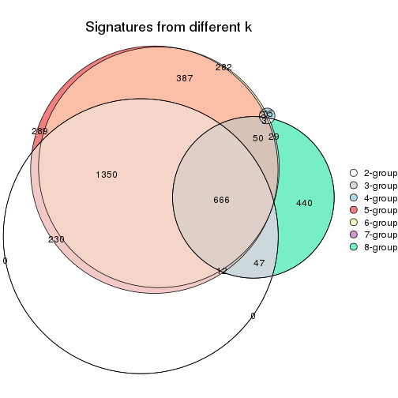

`get_signature()` returns a data frame invisibly. To get the list of signatures, the function
call should be assigned to a variable explicitly. In following code, if `plot` argument is set
to `FALSE`, no heatmap is plotted while only the differential analysis is performed.

```r
# code only for demonstration
tb = get_signature(res, k = ..., plot = FALSE)
```

An example of the output of `tb` is:

```
#>   which_row         fdr    mean_1    mean_2 scaled_mean_1 scaled_mean_2 km
#> 1        38 0.042760348  8.373488  9.131774    -0.5533452     0.5164555  1
#> 2        40 0.018707592  7.106213  8.469186    -0.6173731     0.5762149  1
#> 3        55 0.019134737 10.221463 11.207825    -0.6159697     0.5749050  1
#> 4        59 0.006059896  5.921854  7.869574    -0.6899429     0.6439467  1
#> 5        60 0.018055526  8.928898 10.211722    -0.6204761     0.5791110  1
#> 6        98 0.009384629 15.714769 14.887706     0.6635654    -0.6193277  2
...
```

The columns in `tb` are:

1. `which_row`: row indices corresponding to the input matrix.
2. `fdr`: FDR for the differential test. 
3. `mean_x`: The mean value in group x.
4. `scaled_mean_x`: The mean value in group x after rows are scaled.
5. `km`: Row groups if k-means clustering is applied to rows (which is done by automatically selecting number of clusters).

If there are too many signatures, `top_signatures = ...` can be set to only show the 
signatures with the highest FDRs:

```r
# code only for demonstration
# e.g. to show the top 500 most significant rows
tb = get_signature(res, k = ..., top_signatures = 500)
```

If the signatures are defined as these which are uniquely high in current group, `diff_method` argument
can be set to `"uniquely_high_in_one_group"`:

```r
# code only for demonstration
tb = get_signature(res, k = ..., diff_method = "uniquely_high_in_one_group")
```


UMAP plot which shows how samples are separated.


<script>
$( function() {
	$( '#tabs-node-041-dimension-reduction' ).tabs();
} );
</script>
<div id='tabs-node-041-dimension-reduction'>
<ul>
<li><a href='#tab-node-041-dimension-reduction-1'>k = 2</a></li>
<li><a href='#tab-node-041-dimension-reduction-2'>k = 3</a></li>
<li><a href='#tab-node-041-dimension-reduction-3'>k = 4</a></li>
<li><a href='#tab-node-041-dimension-reduction-4'>k = 5</a></li>
<li><a href='#tab-node-041-dimension-reduction-5'>k = 6</a></li>
<li><a href='#tab-node-041-dimension-reduction-6'>k = 7</a></li>
<li><a href='#tab-node-041-dimension-reduction-7'>k = 8</a></li>
</ul>
<div id='tab-node-041-dimension-reduction-1'>
<pre><code class="r">dimension_reduction(res, k = 2, method = &quot;UMAP&quot;)
</code></pre>

<p>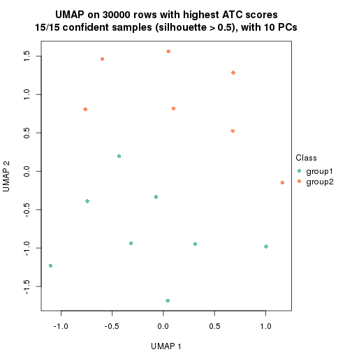</p>

</div>
<div id='tab-node-041-dimension-reduction-2'>
<pre><code class="r">dimension_reduction(res, k = 3, method = &quot;UMAP&quot;)
</code></pre>

<p>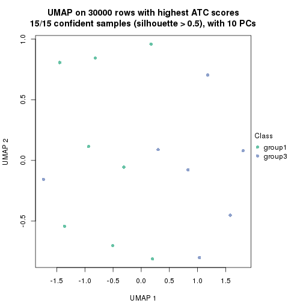</p>

</div>
<div id='tab-node-041-dimension-reduction-3'>
<pre><code class="r">dimension_reduction(res, k = 4, method = &quot;UMAP&quot;)
</code></pre>

<p>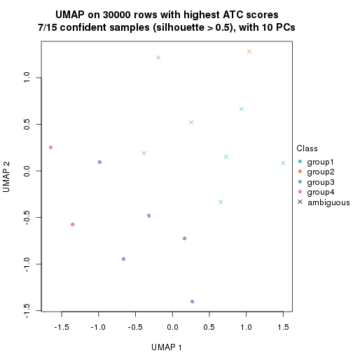</p>

</div>
<div id='tab-node-041-dimension-reduction-4'>
<pre><code class="r">dimension_reduction(res, k = 5, method = &quot;UMAP&quot;)
</code></pre>

<p>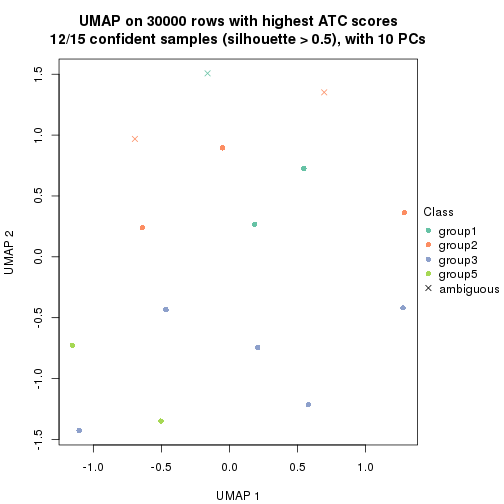</p>

</div>
<div id='tab-node-041-dimension-reduction-5'>
<pre><code class="r">dimension_reduction(res, k = 6, method = &quot;UMAP&quot;)
</code></pre>

<p>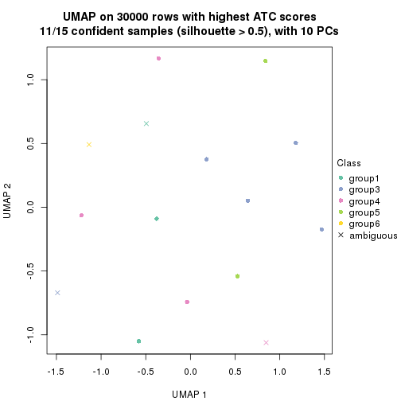</p>

</div>
<div id='tab-node-041-dimension-reduction-6'>
<pre><code class="r">dimension_reduction(res, k = 7, method = &quot;UMAP&quot;)
</code></pre>

<p>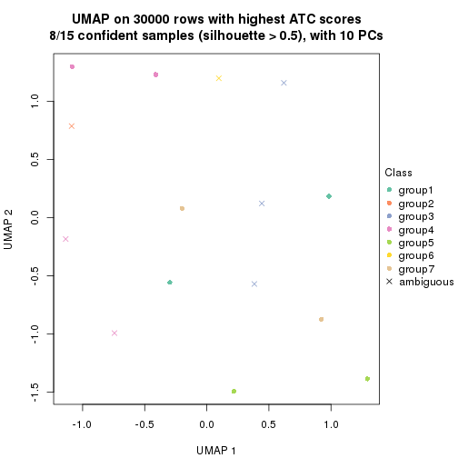</p>

</div>
<div id='tab-node-041-dimension-reduction-7'>
<pre><code class="r">dimension_reduction(res, k = 8, method = &quot;UMAP&quot;)
</code></pre>

<p>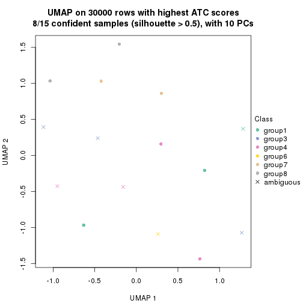</p>

</div>
</div>


Following heatmap shows how subgroups are split when increasing `k`:

```r
collect_classes(res)
```

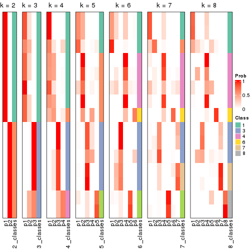


If matrix rows can be associated to genes, consider to use `functional_enrichment(res,
...)` to perform function enrichment for the signature genes. See [this vignette](https://jokergoo.github.io/cola_vignettes/functional_enrichment.html) for more detailed explanations.


 

---------------------------------------------------


### Node042


Parent node: [Node04](#Node04).
Child nodes: 
                [Node0111](#Node0111)
        ,
                [Node0112](#Node0112)
        ,
                [Node0113](#Node0113)
        ,
                [Node0121](#Node0121)
        ,
                Node0122-leaf
        ,
                Node0123-leaf
        ,
                Node0131-leaf
        ,
                Node0132-leaf
        ,
                Node0133-leaf
        ,
                Node0134-leaf
        ,
                [Node0141](#Node0141)
        ,
                Node0142-leaf
        ,
                Node0143-leaf
        ,
                Node0221-leaf
        ,
                Node0222-leaf
        ,
                Node0223-leaf
        ,
                Node0224-leaf
        ,
                [Node0231](#Node0231)
        ,
                Node0232-leaf
        ,
                Node0233-leaf
        ,
                Node0321-leaf
        ,
                Node0322-leaf
        ,
                Node0411-leaf
        ,
                Node0412-leaf
        ,
                Node0421-leaf
        ,
                Node0422-leaf
        ,
                Node0431-leaf
        ,
                Node0432-leaf
        ,
                Node0433-leaf
        ,
                Node0434-leaf
        .


The object with results only for a single top-value method and a single partitioning method 
can be extracted as:

```r
res = res_rh["042"]
```

A summary of `res` and all the functions that can be applied to it:

```r
res
```

```
#> A 'ConsensusPartition' object with k = 2, 3, 4, 5, 6, 7, 8.
#>   On a matrix with 30000 rows and 12 columns.
#>   Top rows (1000) are extracted by 'ATC' method.
#>   Subgroups are detected by 'skmeans' method.
#>   Performed in total 350 partitions by row resampling.
#>   Best k for subgroups seems to be 7.
#> 
#> Following methods can be applied to this 'ConsensusPartition' object:
#>  [1] "cola_report"             "collect_classes"         "collect_plots"          
#>  [4] "collect_stats"           "colnames"                "compare_partitions"     
#>  [7] "compare_signatures"      "consensus_heatmap"       "dimension_reduction"    
#> [10] "functional_enrichment"   "get_anno_col"            "get_anno"               
#> [13] "get_classes"             "get_consensus"           "get_matrix"             
#> [16] "get_membership"          "get_param"               "get_signatures"         
#> [19] "get_stats"               "is_best_k"               "is_stable_k"            
#> [22] "membership_heatmap"      "ncol"                    "nrow"                   
#> [25] "plot_ecdf"               "predict_classes"         "rownames"               
#> [28] "select_partition_number" "show"                    "suggest_best_k"         
#> [31] "test_to_known_factors"   "top_rows_heatmap"
```

`collect_plots()` function collects all the plots made from `res` for all `k` (number of subgroups)
into one single page to provide an easy and fast comparison between different `k`.

```r
collect_plots(res)
```

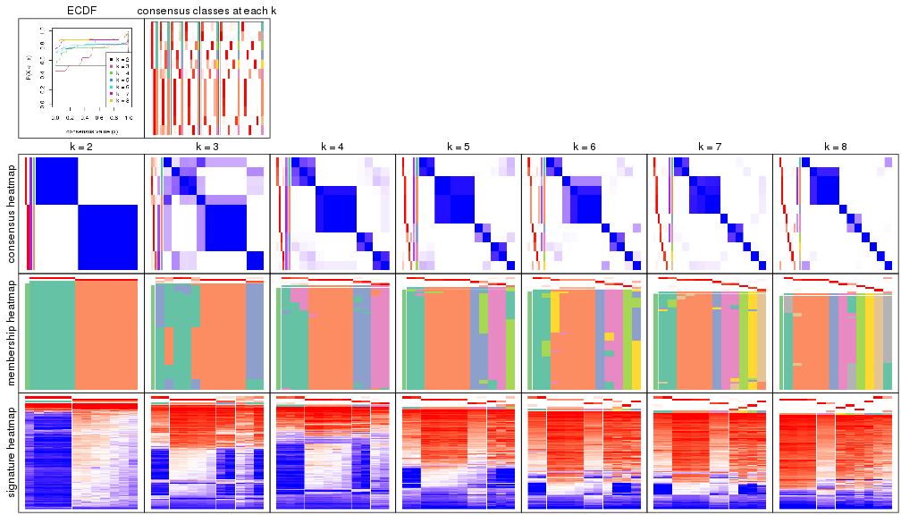

The plots are:

- The first row: a plot of the eCDF (empirical cumulative distribution
  function) curves of the consensus matrix for each `k` and the heatmap of
  predicted classes for each `k`.
- The second row: heatmaps of the consensus matrix for each `k`.
- The third row: heatmaps of the membership matrix for each `k`.
- The fouth row: heatmaps of the signatures for each `k`.

All the plots in panels can be made by individual functions and they are
plotted later in this section.

`select_partition_number()` produces several plots showing different
statistics for choosing "optimized" `k`. There are following statistics:

- eCDF curves of the consensus matrix for each `k`;
- 1-PAC. [The PAC score](https://en.wikipedia.org/wiki/Consensus_clustering#Over-interpretation_potential_of_consensus_clustering)
  measures the proportion of the ambiguous subgrouping.
- Mean silhouette score.
- Concordance. The mean probability of fiting the consensus subgroup labels in all
  partitions.
- Area increased. Denote $A_k$ as the area under the eCDF curve for current
  `k`, the area increased is defined as $A_k - A_{k-1}$.
- Rand index. The percent of pairs of samples that are both in a same cluster
  or both are not in a same cluster in the partition of k and k-1.
- Jaccard index. The ratio of pairs of samples are both in a same cluster in
  the partition of k and k-1 and the pairs of samples are both in a same
  cluster in the partition k or k-1.

The detailed explanations of these statistics can be found in [the _cola_
vignette](https://jokergoo.github.io/cola_vignettes/cola.html#toc_13).

Generally speaking, higher 1-PAC score, higher mean silhouette score or higher
concordance corresponds to better partition. Rand index and Jaccard index
measure how similar the current partition is compared to partition with `k-1`.
If they are too similar, we won't accept `k` is better than `k-1`.

```r
select_partition_number(res)
```

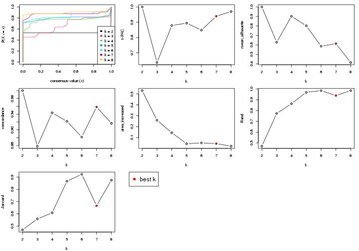

The numeric values for all these statistics can be obtained by `get_stats()`.

```r
get_stats(res)
```

```
#>   k 1-PAC mean_silhouette concordance area_increased  Rand Jaccard
#> 2 2 1.000           1.000       1.000         0.5308 0.470   0.470
#> 3 3 0.636           0.628       0.858         0.2596 0.773   0.559
#> 4 4 0.879           0.902       0.943         0.1441 0.864   0.609
#> 5 5 0.894           0.802       0.922         0.0441 0.970   0.867
#> 6 6 0.848           0.586       0.882         0.0513 0.985   0.923
#> 7 7 0.939           0.613       0.958         0.0447 0.939   0.667
#> 8 8 0.970           0.414       0.917         0.0214 0.985   0.875
```

`suggest_best_k()` suggests the best $k$ based on these statistics. The rules are as follows:

- All $k$ with Jaccard index larger than 0.95 are removed because increasing
  $k$ does not provide enough extra information. If all $k$ are removed, it is
  marked as no subgroup is detected.
- For all $k$ with 1-PAC score larger than 0.9, the maximal $k$ is taken as
  the best $k$, and other $k$ are marked as optional $k$.
- If it does not fit the second rule. The $k$ with the maximal vote of the
  highest 1-PAC score, highest mean silhouette, and highest concordance is
  taken as the best $k$.

```r
suggest_best_k(res)
```

```
#> [1] 7
#> attr(,"optional")
#> [1] 2
```

There is also optional best $k$ = 2 that is worth to check.

Following is the table of the partitions (You need to click the **show/hide
code output** link to see it). The membership matrix (columns with name `p*`)
is inferred by
[`clue::cl_consensus()`](https://www.rdocumentation.org/link/cl_consensus?package=clue)
function with the `SE` method. Basically the value in the membership matrix
represents the probability to belong to a certain group. The finall subgroup
label for an item is determined with the group with highest probability it
belongs to.

In `get_classes()` function, the entropy is calculated from the membership
matrix and the silhouette score is calculated from the consensus matrix.


<script>
$( function() {
	$( '#tabs-node-042-get-classes' ).tabs();
} );
</script>
<div id='tabs-node-042-get-classes'>
<ul>
<li><a href='#tab-node-042-get-classes-1'>k = 2</a></li>
<li><a href='#tab-node-042-get-classes-2'>k = 3</a></li>
<li><a href='#tab-node-042-get-classes-3'>k = 4</a></li>
<li><a href='#tab-node-042-get-classes-4'>k = 5</a></li>
<li><a href='#tab-node-042-get-classes-5'>k = 6</a></li>
<li><a href='#tab-node-042-get-classes-6'>k = 7</a></li>
<li><a href='#tab-node-042-get-classes-7'>k = 8</a></li>
</ul>

<div id='tab-node-042-get-classes-1'>
<p><a id='tab-node-042-get-classes-1-a' style='color:#0366d6' href='#'>show/hide code output</a></p>
<pre><code class="r">cbind(get_classes(res, k = 2), get_membership(res, k = 2))
</code></pre>

<pre><code>#&gt;                 class entropy silhouette p1 p2
#&gt; TCGA.NH.A8F7.06     1       0          1  1  0
#&gt; TCGA.CK.5912.01     1       0          1  1  0
#&gt; TCGA.AZ.6608.01     2       0          1  0  1
#&gt; TCGA.AY.A8YK.01     1       0          1  1  0
#&gt; TCGA.G4.6317.02     2       0          1  0  1
#&gt; TCGA.A6.6142.01     2       0          1  0  1
#&gt; TCGA.AZ.4681.01     2       0          1  0  1
#&gt; TCGA.A6.A567.01     1       0          1  1  0
#&gt; TCGA.CA.5797.01     1       0          1  1  0
#&gt; TCGA.5M.AAT5.01     2       0          1  0  1
#&gt; TCGA.AZ.6603.01     2       0          1  0  1
#&gt; TCGA.G4.6295.01     2       0          1  0  1
</code></pre>

<script>
$('#tab-node-042-get-classes-1-a').parent().next().next().hide();
$('#tab-node-042-get-classes-1-a').click(function(){
  $('#tab-node-042-get-classes-1-a').parent().next().next().toggle();
  return(false);
});
</script>
</div>

<div id='tab-node-042-get-classes-2'>
<p><a id='tab-node-042-get-classes-2-a' style='color:#0366d6' href='#'>show/hide code output</a></p>
<pre><code class="r">cbind(get_classes(res, k = 3), get_membership(res, k = 3))
</code></pre>

<pre><code>#&gt;                 class entropy silhouette   p1   p2   p3
#&gt; TCGA.NH.A8F7.06     3  0.4002     1.0000 0.16 0.00 0.84
#&gt; TCGA.CK.5912.01     3  0.4002     1.0000 0.16 0.00 0.84
#&gt; TCGA.AZ.6608.01     2  0.0000     0.8878 0.00 1.00 0.00
#&gt; TCGA.AY.A8YK.01     1  0.5835    -0.0581 0.66 0.00 0.34
#&gt; TCGA.G4.6317.02     2  0.0000     0.8878 0.00 1.00 0.00
#&gt; TCGA.A6.6142.01     2  0.9162     0.0888 0.34 0.50 0.16
#&gt; TCGA.AZ.4681.01     2  0.0000     0.8878 0.00 1.00 0.00
#&gt; TCGA.A6.A567.01     1  0.0892     0.5488 0.98 0.00 0.02
#&gt; TCGA.CA.5797.01     1  0.0000     0.5533 1.00 0.00 0.00
#&gt; TCGA.5M.AAT5.01     2  0.0000     0.8878 0.00 1.00 0.00
#&gt; TCGA.AZ.6603.01     2  0.0000     0.8878 0.00 1.00 0.00
#&gt; TCGA.G4.6295.01     1  0.9224    -0.0340 0.48 0.36 0.16
</code></pre>

<script>
$('#tab-node-042-get-classes-2-a').parent().next().next().hide();
$('#tab-node-042-get-classes-2-a').click(function(){
  $('#tab-node-042-get-classes-2-a').parent().next().next().toggle();
  return(false);
});
</script>
</div>

<div id='tab-node-042-get-classes-3'>
<p><a id='tab-node-042-get-classes-3-a' style='color:#0366d6' href='#'>show/hide code output</a></p>
<pre><code class="r">cbind(get_classes(res, k = 4), get_membership(res, k = 4))
</code></pre>

<pre><code>#&gt;                 class entropy silhouette   p1   p2   p3   p4
#&gt; TCGA.NH.A8F7.06     3  0.0707      0.871 0.02 0.00 0.98 0.00
#&gt; TCGA.CK.5912.01     3  0.2647      0.868 0.12 0.00 0.88 0.00
#&gt; TCGA.AZ.6608.01     2  0.0000      0.995 0.00 1.00 0.00 0.00
#&gt; TCGA.AY.A8YK.01     1  0.1211      0.747 0.96 0.00 0.04 0.00
#&gt; TCGA.G4.6317.02     2  0.0000      0.995 0.00 1.00 0.00 0.00
#&gt; TCGA.A6.6142.01     4  0.2011      0.871 0.00 0.08 0.00 0.92
#&gt; TCGA.AZ.4681.01     2  0.0000      0.995 0.00 1.00 0.00 0.00
#&gt; TCGA.A6.A567.01     1  0.3172      0.841 0.84 0.00 0.00 0.16
#&gt; TCGA.CA.5797.01     1  0.3975      0.798 0.76 0.00 0.00 0.24
#&gt; TCGA.5M.AAT5.01     2  0.0707      0.979 0.00 0.98 0.00 0.02
#&gt; TCGA.AZ.6603.01     2  0.0000      0.995 0.00 1.00 0.00 0.00
#&gt; TCGA.G4.6295.01     4  0.0000      0.865 0.00 0.00 0.00 1.00
</code></pre>

<script>
$('#tab-node-042-get-classes-3-a').parent().next().next().hide();
$('#tab-node-042-get-classes-3-a').click(function(){
  $('#tab-node-042-get-classes-3-a').parent().next().next().toggle();
  return(false);
});
</script>
</div>

<div id='tab-node-042-get-classes-4'>
<p><a id='tab-node-042-get-classes-4-a' style='color:#0366d6' href='#'>show/hide code output</a></p>
<pre><code class="r">cbind(get_classes(res, k = 5), get_membership(res, k = 5))
</code></pre>

<pre><code>#&gt;                 class entropy silhouette   p1   p2   p3   p4   p5
#&gt; TCGA.NH.A8F7.06     3  0.0000      0.554 0.00 0.00 1.00 0.00 0.00
#&gt; TCGA.CK.5912.01     3  0.4287      0.496 0.00 0.00 0.54 0.00 0.46
#&gt; TCGA.AZ.6608.01     2  0.0000      0.991 0.00 1.00 0.00 0.00 0.00
#&gt; TCGA.AY.A8YK.01     5  0.3796      0.000 0.30 0.00 0.00 0.00 0.70
#&gt; TCGA.G4.6317.02     2  0.0000      0.991 0.00 1.00 0.00 0.00 0.00
#&gt; TCGA.A6.6142.01     4  0.0000      0.884 0.00 0.00 0.00 1.00 0.00
#&gt; TCGA.AZ.4681.01     2  0.0000      0.991 0.00 1.00 0.00 0.00 0.00
#&gt; TCGA.A6.A567.01     1  0.0000      0.927 1.00 0.00 0.00 0.00 0.00
#&gt; TCGA.CA.5797.01     1  0.1043      0.929 0.96 0.00 0.00 0.04 0.00
#&gt; TCGA.5M.AAT5.01     2  0.0609      0.986 0.00 0.98 0.00 0.00 0.02
#&gt; TCGA.AZ.6603.01     2  0.0609      0.986 0.00 0.98 0.00 0.00 0.02
#&gt; TCGA.G4.6295.01     4  0.2020      0.882 0.10 0.00 0.00 0.90 0.00
</code></pre>

<script>
$('#tab-node-042-get-classes-4-a').parent().next().next().hide();
$('#tab-node-042-get-classes-4-a').click(function(){
  $('#tab-node-042-get-classes-4-a').parent().next().next().toggle();
  return(false);
});
</script>
</div>

<div id='tab-node-042-get-classes-5'>
<p><a id='tab-node-042-get-classes-5-a' style='color:#0366d6' href='#'>show/hide code output</a></p>
<pre><code class="r">cbind(get_classes(res, k = 6), get_membership(res, k = 6))
</code></pre>

<pre><code>#&gt;                 class entropy silhouette   p1   p2  p3   p4  p5   p6
#&gt; TCGA.NH.A8F7.06     3  0.0000      0.000 0.00 0.00 1.0 0.00 0.0 0.00
#&gt; TCGA.CK.5912.01     6  0.5265      0.000 0.00 0.00 0.4 0.00 0.1 0.50
#&gt; TCGA.AZ.6608.01     2  0.3797      0.881 0.00 0.58 0.0 0.00 0.0 0.42
#&gt; TCGA.AY.A8YK.01     5  0.0000      0.000 0.00 0.00 0.0 0.00 1.0 0.00
#&gt; TCGA.G4.6317.02     2  0.3797      0.881 0.00 0.58 0.0 0.00 0.0 0.42
#&gt; TCGA.A6.6142.01     4  0.0547      0.783 0.00 0.00 0.0 0.98 0.0 0.02
#&gt; TCGA.AZ.4681.01     2  0.3797      0.881 0.00 0.58 0.0 0.00 0.0 0.42
#&gt; TCGA.A6.A567.01     1  0.2793      0.747 0.80 0.00 0.0 0.00 0.2 0.00
#&gt; TCGA.CA.5797.01     1  0.0000      0.773 1.00 0.00 0.0 0.00 0.0 0.00
#&gt; TCGA.5M.AAT5.01     2  0.0937      0.441 0.00 0.96 0.0 0.04 0.0 0.00
#&gt; TCGA.AZ.6603.01     2  0.3797      0.865 0.00 0.58 0.0 0.00 0.0 0.42
#&gt; TCGA.G4.6295.01     4  0.3475      0.783 0.14 0.00 0.0 0.80 0.0 0.06
</code></pre>

<script>
$('#tab-node-042-get-classes-5-a').parent().next().next().hide();
$('#tab-node-042-get-classes-5-a').click(function(){
  $('#tab-node-042-get-classes-5-a').parent().next().next().toggle();
  return(false);
});
</script>
</div>

<div id='tab-node-042-get-classes-6'>
<p><a id='tab-node-042-get-classes-6-a' style='color:#0366d6' href='#'>show/hide code output</a></p>
<pre><code class="r">cbind(get_classes(res, k = 7), get_membership(res, k = 7))
</code></pre>

<pre><code>#&gt;                 class entropy silhouette   p1   p2   p3   p4   p5   p6   p7
#&gt; TCGA.NH.A8F7.06     3  0.0000      0.000 0.00 0.00 1.00 0.00 0.00 0.00 0.00
#&gt; TCGA.CK.5912.01     6  0.1664      0.000 0.00 0.00 0.06 0.00 0.02 0.92 0.00
#&gt; TCGA.AZ.6608.01     2  0.0000      0.978 0.00 1.00 0.00 0.00 0.00 0.00 0.00
#&gt; TCGA.AY.A8YK.01     5  0.0000      0.000 0.00 0.00 0.00 0.00 1.00 0.00 0.00
#&gt; TCGA.G4.6317.02     2  0.0000      0.978 0.00 1.00 0.00 0.00 0.00 0.00 0.00
#&gt; TCGA.A6.6142.01     4  0.2016      0.878 0.00 0.00 0.00 0.90 0.00 0.04 0.06
#&gt; TCGA.AZ.4681.01     2  0.0504      0.969 0.00 0.98 0.00 0.00 0.00 0.00 0.02
#&gt; TCGA.A6.A567.01     1  0.2769      0.861 0.86 0.00 0.00 0.00 0.08 0.04 0.02
#&gt; TCGA.CA.5797.01     1  0.0000      0.866 1.00 0.00 0.00 0.00 0.00 0.00 0.00
#&gt; TCGA.5M.AAT5.01     7  0.1433      0.000 0.00 0.08 0.00 0.00 0.00 0.00 0.92
#&gt; TCGA.AZ.6603.01     2  0.0863      0.954 0.00 0.96 0.00 0.00 0.00 0.00 0.04
#&gt; TCGA.G4.6295.01     4  0.0863      0.878 0.04 0.00 0.00 0.96 0.00 0.00 0.00
</code></pre>

<script>
$('#tab-node-042-get-classes-6-a').parent().next().next().hide();
$('#tab-node-042-get-classes-6-a').click(function(){
  $('#tab-node-042-get-classes-6-a').parent().next().next().toggle();
  return(false);
});
</script>
</div>

<div id='tab-node-042-get-classes-7'>
<p><a id='tab-node-042-get-classes-7-a' style='color:#0366d6' href='#'>show/hide code output</a></p>
<pre><code class="r">cbind(get_classes(res, k = 8), get_membership(res, k = 8))
</code></pre>

<pre><code>#&gt;                 class entropy silhouette   p1   p2 p3   p4 p5 p6   p7   p8
#&gt; TCGA.NH.A8F7.06     3   0.000      0.000 0.00 0.00  1 0.00  0  0 0.00 0.00
#&gt; TCGA.CK.5912.01     6   0.000      0.000 0.00 0.00  0 0.00  0  1 0.00 0.00
#&gt; TCGA.AZ.6608.01     2   0.000      0.980 0.00 1.00  0 0.00  0  0 0.00 0.00
#&gt; TCGA.AY.A8YK.01     5   0.000      0.000 0.00 0.00  0 0.00  1  0 0.00 0.00
#&gt; TCGA.G4.6317.02     2   0.000      0.980 0.00 1.00  0 0.00  0  0 0.00 0.00
#&gt; TCGA.A6.6142.01     4   0.000      0.549 0.00 0.00  0 1.00  0  0 0.00 0.00
#&gt; TCGA.AZ.4681.01     2   0.000      0.980 0.00 1.00  0 0.00  0  0 0.00 0.00
#&gt; TCGA.A6.A567.01     1   0.000      0.000 1.00 0.00  0 0.00  0  0 0.00 0.00
#&gt; TCGA.CA.5797.01     8   0.332      0.000 0.46 0.00  0 0.00  0  0 0.00 0.54
#&gt; TCGA.5M.AAT5.01     7   0.000      0.000 0.00 0.00  0 0.00  0  0 1.00 0.00
#&gt; TCGA.AZ.6603.01     2   0.109      0.936 0.00 0.94  0 0.00  0  0 0.06 0.00
#&gt; TCGA.G4.6295.01     4   0.333      0.549 0.00 0.00  0 0.52  0  0 0.00 0.48
</code></pre>

<script>
$('#tab-node-042-get-classes-7-a').parent().next().next().hide();
$('#tab-node-042-get-classes-7-a').click(function(){
  $('#tab-node-042-get-classes-7-a').parent().next().next().toggle();
  return(false);
});
</script>
</div>
</div>

Heatmaps for the consensus matrix. It visualizes the probability of two
samples to be in a same group.


<script>
$( function() {
	$( '#tabs-node-042-consensus-heatmap' ).tabs();
} );
</script>
<div id='tabs-node-042-consensus-heatmap'>
<ul>
<li><a href='#tab-node-042-consensus-heatmap-1'>k = 2</a></li>
<li><a href='#tab-node-042-consensus-heatmap-2'>k = 3</a></li>
<li><a href='#tab-node-042-consensus-heatmap-3'>k = 4</a></li>
<li><a href='#tab-node-042-consensus-heatmap-4'>k = 5</a></li>
<li><a href='#tab-node-042-consensus-heatmap-5'>k = 6</a></li>
<li><a href='#tab-node-042-consensus-heatmap-6'>k = 7</a></li>
<li><a href='#tab-node-042-consensus-heatmap-7'>k = 8</a></li>
</ul>
<div id='tab-node-042-consensus-heatmap-1'>
<pre><code class="r">consensus_heatmap(res, k = 2)
</code></pre>

<p>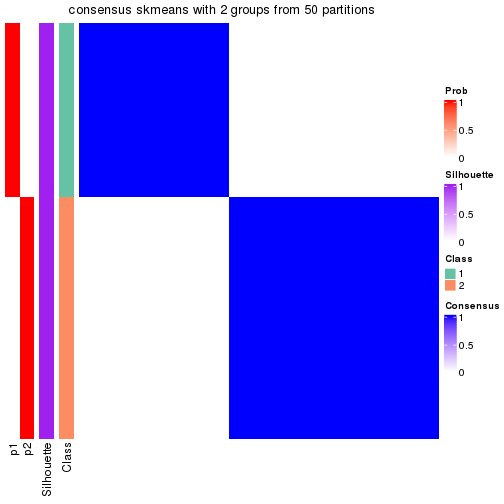</p>

</div>
<div id='tab-node-042-consensus-heatmap-2'>
<pre><code class="r">consensus_heatmap(res, k = 3)
</code></pre>

<p>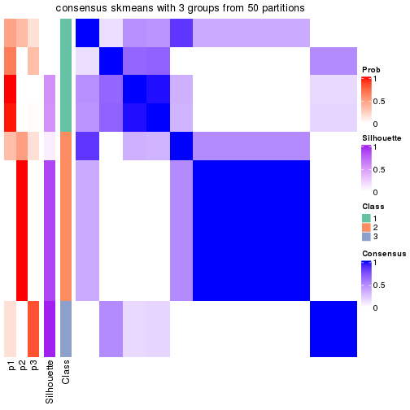</p>

</div>
<div id='tab-node-042-consensus-heatmap-3'>
<pre><code class="r">consensus_heatmap(res, k = 4)
</code></pre>

<p>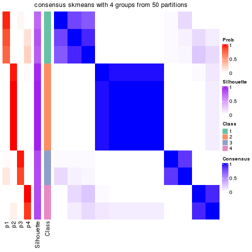</p>

</div>
<div id='tab-node-042-consensus-heatmap-4'>
<pre><code class="r">consensus_heatmap(res, k = 5)
</code></pre>

<p>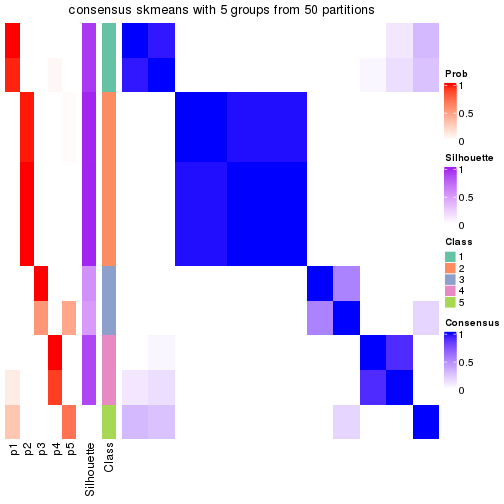</p>

</div>
<div id='tab-node-042-consensus-heatmap-5'>
<pre><code class="r">consensus_heatmap(res, k = 6)
</code></pre>

<p>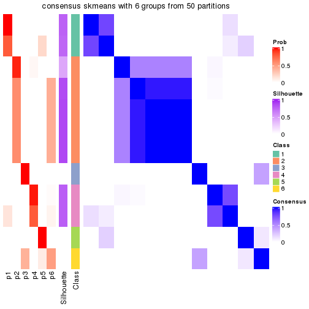</p>

</div>
<div id='tab-node-042-consensus-heatmap-6'>
<pre><code class="r">consensus_heatmap(res, k = 7)
</code></pre>

<p>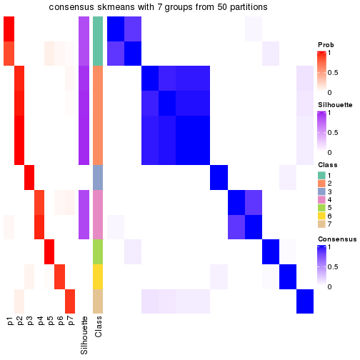</p>

</div>
<div id='tab-node-042-consensus-heatmap-7'>
<pre><code class="r">consensus_heatmap(res, k = 8)
</code></pre>

<p>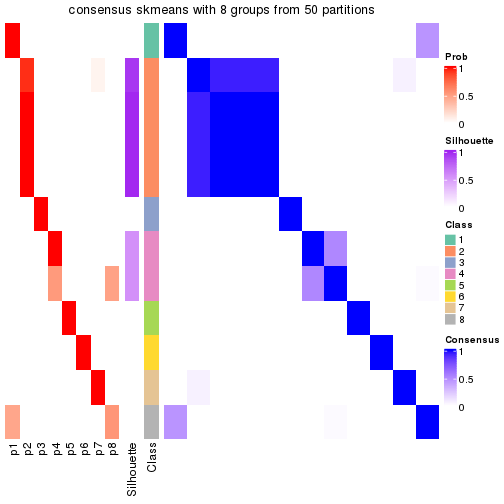</p>

</div>
</div>

Heatmaps for the membership of samples in all partitions to see how consistent they are:


<script>
$( function() {
	$( '#tabs-node-042-membership-heatmap' ).tabs();
} );
</script>
<div id='tabs-node-042-membership-heatmap'>
<ul>
<li><a href='#tab-node-042-membership-heatmap-1'>k = 2</a></li>
<li><a href='#tab-node-042-membership-heatmap-2'>k = 3</a></li>
<li><a href='#tab-node-042-membership-heatmap-3'>k = 4</a></li>
<li><a href='#tab-node-042-membership-heatmap-4'>k = 5</a></li>
<li><a href='#tab-node-042-membership-heatmap-5'>k = 6</a></li>
<li><a href='#tab-node-042-membership-heatmap-6'>k = 7</a></li>
<li><a href='#tab-node-042-membership-heatmap-7'>k = 8</a></li>
</ul>
<div id='tab-node-042-membership-heatmap-1'>
<pre><code class="r">membership_heatmap(res, k = 2)
</code></pre>

<p>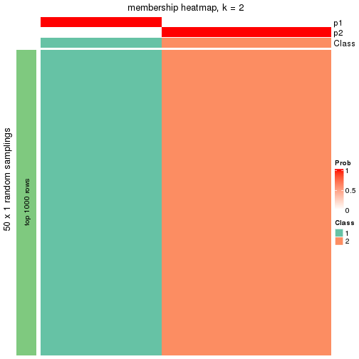</p>

</div>
<div id='tab-node-042-membership-heatmap-2'>
<pre><code class="r">membership_heatmap(res, k = 3)
</code></pre>

<p>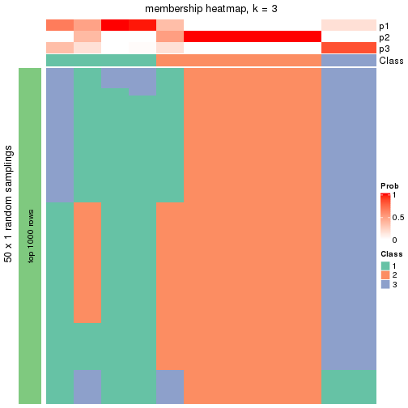</p>

</div>
<div id='tab-node-042-membership-heatmap-3'>
<pre><code class="r">membership_heatmap(res, k = 4)
</code></pre>

<p>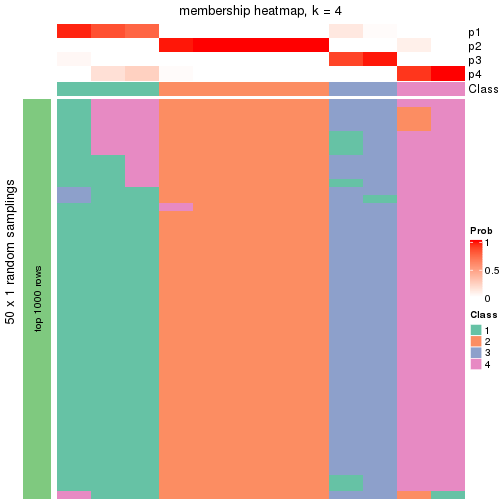</p>

</div>
<div id='tab-node-042-membership-heatmap-4'>
<pre><code class="r">membership_heatmap(res, k = 5)
</code></pre>

<p>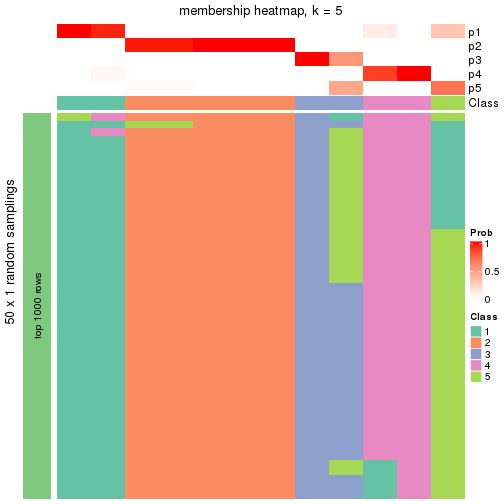</p>

</div>
<div id='tab-node-042-membership-heatmap-5'>
<pre><code class="r">membership_heatmap(res, k = 6)
</code></pre>

<p>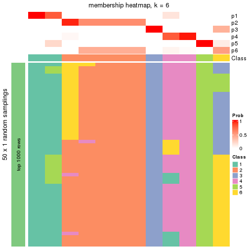</p>

</div>
<div id='tab-node-042-membership-heatmap-6'>
<pre><code class="r">membership_heatmap(res, k = 7)
</code></pre>

<p>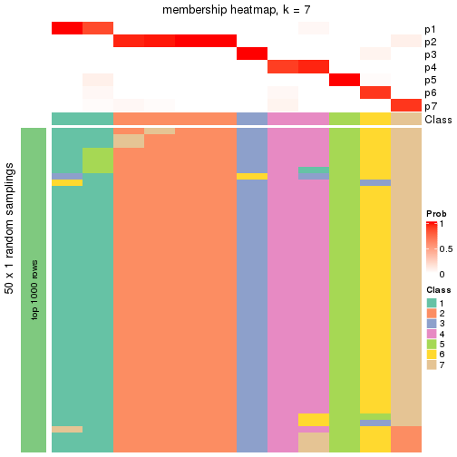</p>

</div>
<div id='tab-node-042-membership-heatmap-7'>
<pre><code class="r">membership_heatmap(res, k = 8)
</code></pre>

<p>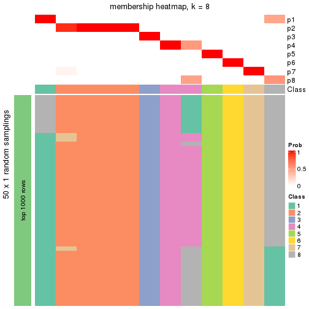</p>

</div>
</div>

As soon as the classes for columns are determined, the signatures
that are significantly different between subgroups can be looked for. 
Following are the heatmaps for signatures.


<script>
$( function() {
	$( '#tabs-node-042-get-signatures' ).tabs();
} );
</script>
<div id='tabs-node-042-get-signatures'>
<ul>
<li><a href='#tab-node-042-get-signatures-1'>k = 2</a></li>
<li><a href='#tab-node-042-get-signatures-2'>k = 3</a></li>
<li><a href='#tab-node-042-get-signatures-3'>k = 4</a></li>
<li><a href='#tab-node-042-get-signatures-4'>k = 5</a></li>
<li><a href='#tab-node-042-get-signatures-5'>k = 6</a></li>
<li><a href='#tab-node-042-get-signatures-6'>k = 7</a></li>
<li><a href='#tab-node-042-get-signatures-7'>k = 8</a></li>
</ul>
<div id='tab-node-042-get-signatures-1'>
<pre><code class="r">get_signatures(res, k = 2)
</code></pre>

<p>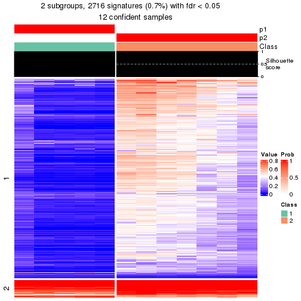</p>

</div>
<div id='tab-node-042-get-signatures-2'>
<pre><code class="r">get_signatures(res, k = 3)
</code></pre>

<p>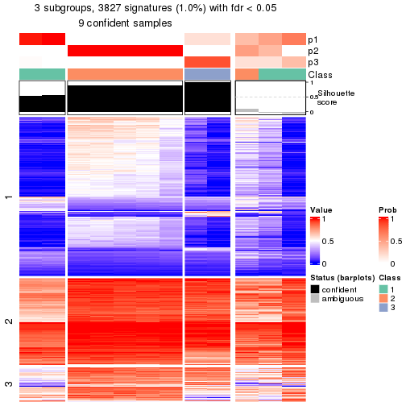</p>

</div>
<div id='tab-node-042-get-signatures-3'>
<pre><code class="r">get_signatures(res, k = 4)
</code></pre>

<p>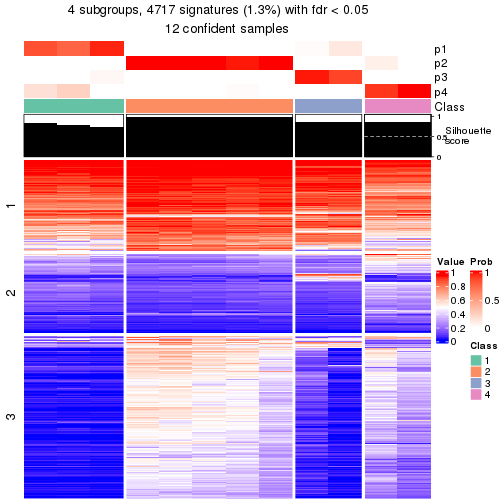</p>

</div>
<div id='tab-node-042-get-signatures-4'>
<pre><code class="r">get_signatures(res, k = 5)
</code></pre>

<p>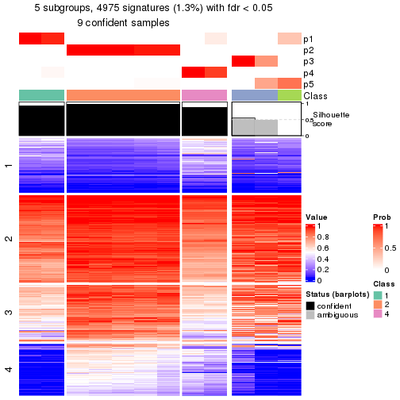</p>

</div>
<div id='tab-node-042-get-signatures-5'>
<pre><code class="r">get_signatures(res, k = 6)
</code></pre>

<p>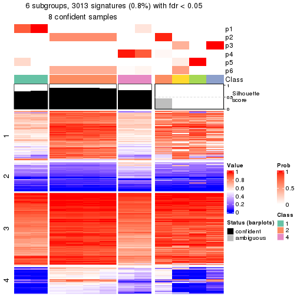</p>

</div>
<div id='tab-node-042-get-signatures-6'>
<pre><code class="r">get_signatures(res, k = 7)
</code></pre>

<p>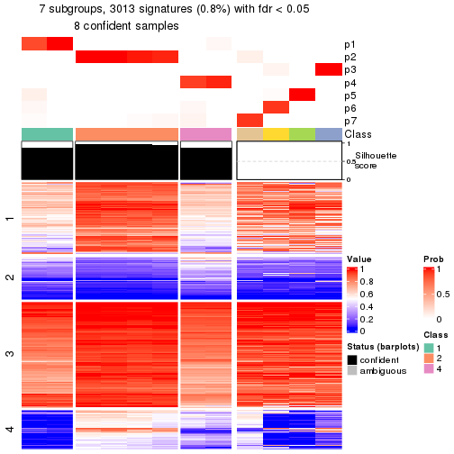</p>

</div>
<div id='tab-node-042-get-signatures-7'>
<pre><code class="r">get_signatures(res, k = 8)
</code></pre>

<p>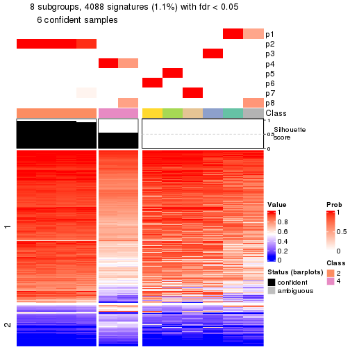</p>

</div>
</div>


Compare the overlap of signatures from different k:

```r
compare_signatures(res)
```

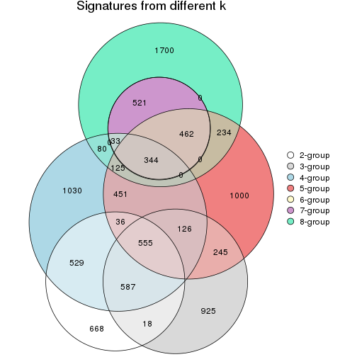

`get_signature()` returns a data frame invisibly. To get the list of signatures, the function
call should be assigned to a variable explicitly. In following code, if `plot` argument is set
to `FALSE`, no heatmap is plotted while only the differential analysis is performed.

```r
# code only for demonstration
tb = get_signature(res, k = ..., plot = FALSE)
```

An example of the output of `tb` is:

```
#>   which_row         fdr    mean_1    mean_2 scaled_mean_1 scaled_mean_2 km
#> 1        38 0.042760348  8.373488  9.131774    -0.5533452     0.5164555  1
#> 2        40 0.018707592  7.106213  8.469186    -0.6173731     0.5762149  1
#> 3        55 0.019134737 10.221463 11.207825    -0.6159697     0.5749050  1
#> 4        59 0.006059896  5.921854  7.869574    -0.6899429     0.6439467  1
#> 5        60 0.018055526  8.928898 10.211722    -0.6204761     0.5791110  1
#> 6        98 0.009384629 15.714769 14.887706     0.6635654    -0.6193277  2
...
```

The columns in `tb` are:

1. `which_row`: row indices corresponding to the input matrix.
2. `fdr`: FDR for the differential test. 
3. `mean_x`: The mean value in group x.
4. `scaled_mean_x`: The mean value in group x after rows are scaled.
5. `km`: Row groups if k-means clustering is applied to rows (which is done by automatically selecting number of clusters).

If there are too many signatures, `top_signatures = ...` can be set to only show the 
signatures with the highest FDRs:

```r
# code only for demonstration
# e.g. to show the top 500 most significant rows
tb = get_signature(res, k = ..., top_signatures = 500)
```

If the signatures are defined as these which are uniquely high in current group, `diff_method` argument
can be set to `"uniquely_high_in_one_group"`:

```r
# code only for demonstration
tb = get_signature(res, k = ..., diff_method = "uniquely_high_in_one_group")
```


UMAP plot which shows how samples are separated.


<script>
$( function() {
	$( '#tabs-node-042-dimension-reduction' ).tabs();
} );
</script>
<div id='tabs-node-042-dimension-reduction'>
<ul>
<li><a href='#tab-node-042-dimension-reduction-1'>k = 2</a></li>
<li><a href='#tab-node-042-dimension-reduction-2'>k = 3</a></li>
<li><a href='#tab-node-042-dimension-reduction-3'>k = 4</a></li>
<li><a href='#tab-node-042-dimension-reduction-4'>k = 5</a></li>
<li><a href='#tab-node-042-dimension-reduction-5'>k = 6</a></li>
<li><a href='#tab-node-042-dimension-reduction-6'>k = 7</a></li>
<li><a href='#tab-node-042-dimension-reduction-7'>k = 8</a></li>
</ul>
<div id='tab-node-042-dimension-reduction-1'>
<pre><code class="r">dimension_reduction(res, k = 2, method = &quot;UMAP&quot;)
</code></pre>

<p>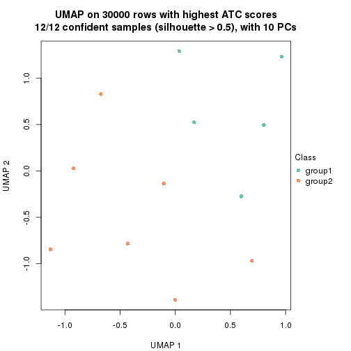</p>

</div>
<div id='tab-node-042-dimension-reduction-2'>
<pre><code class="r">dimension_reduction(res, k = 3, method = &quot;UMAP&quot;)
</code></pre>

<p>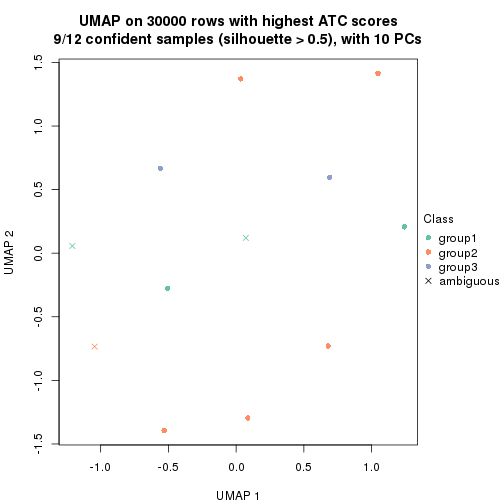</p>

</div>
<div id='tab-node-042-dimension-reduction-3'>
<pre><code class="r">dimension_reduction(res, k = 4, method = &quot;UMAP&quot;)
</code></pre>

<p>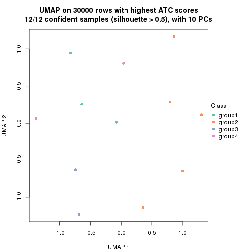</p>

</div>
<div id='tab-node-042-dimension-reduction-4'>
<pre><code class="r">dimension_reduction(res, k = 5, method = &quot;UMAP&quot;)
</code></pre>

<p>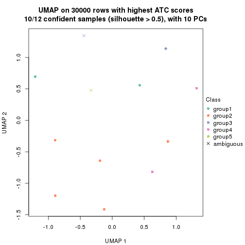</p>

</div>
<div id='tab-node-042-dimension-reduction-5'>
<pre><code class="r">dimension_reduction(res, k = 6, method = &quot;UMAP&quot;)
</code></pre>

<p>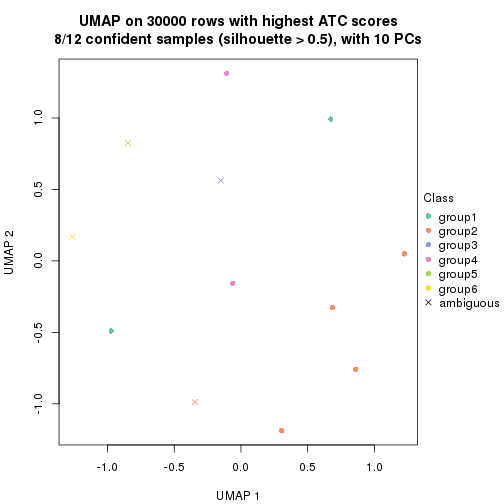</p>

</div>
<div id='tab-node-042-dimension-reduction-6'>
<pre><code class="r">dimension_reduction(res, k = 7, method = &quot;UMAP&quot;)
</code></pre>

<p>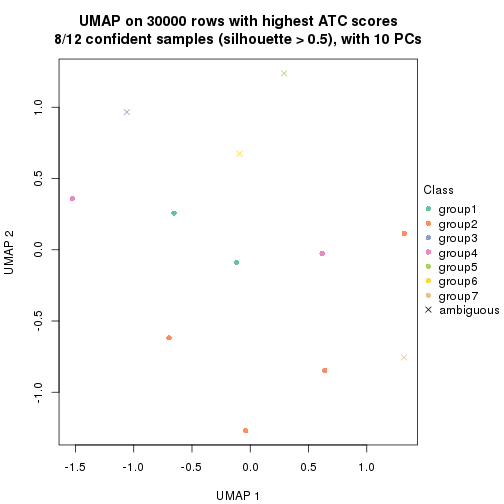</p>

</div>
<div id='tab-node-042-dimension-reduction-7'>
<pre><code class="r">dimension_reduction(res, k = 8, method = &quot;UMAP&quot;)
</code></pre>

<p>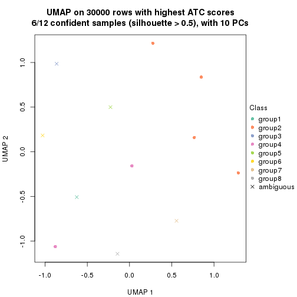</p>

</div>
</div>


Following heatmap shows how subgroups are split when increasing `k`:

```r
collect_classes(res)
```

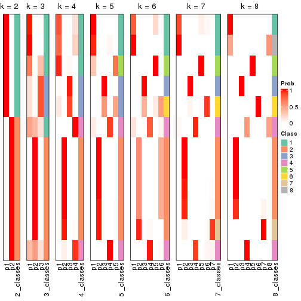


If matrix rows can be associated to genes, consider to use `functional_enrichment(res,
...)` to perform function enrichment for the signature genes. See [this vignette](https://jokergoo.github.io/cola_vignettes/functional_enrichment.html) for more detailed explanations.


 

---------------------------------------------------


### Node043


Parent node: [Node04](#Node04).
Child nodes: 
                [Node0111](#Node0111)
        ,
                [Node0112](#Node0112)
        ,
                [Node0113](#Node0113)
        ,
                [Node0121](#Node0121)
        ,
                Node0122-leaf
        ,
                Node0123-leaf
        ,
                Node0131-leaf
        ,
                Node0132-leaf
        ,
                Node0133-leaf
        ,
                Node0134-leaf
        ,
                [Node0141](#Node0141)
        ,
                Node0142-leaf
        ,
                Node0143-leaf
        ,
                Node0221-leaf
        ,
                Node0222-leaf
        ,
                Node0223-leaf
        ,
                Node0224-leaf
        ,
                [Node0231](#Node0231)
        ,
                Node0232-leaf
        ,
                Node0233-leaf
        ,
                Node0321-leaf
        ,
                Node0322-leaf
        ,
                Node0411-leaf
        ,
                Node0412-leaf
        ,
                Node0421-leaf
        ,
                Node0422-leaf
        ,
                Node0431-leaf
        ,
                Node0432-leaf
        ,
                Node0433-leaf
        ,
                Node0434-leaf
        .


The object with results only for a single top-value method and a single partitioning method 
can be extracted as:

```r
res = res_rh["043"]
```

A summary of `res` and all the functions that can be applied to it:

```r
res
```

```
#> A 'ConsensusPartition' object with k = 2, 3, 4, 5, 6, 7, 8.
#>   On a matrix with 30000 rows and 16 columns.
#>   Top rows (1000) are extracted by 'SD' method.
#>   Subgroups are detected by 'kmeans' method.
#>   Performed in total 350 partitions by row resampling.
#>   Best k for subgroups seems to be 4.
#> 
#> Following methods can be applied to this 'ConsensusPartition' object:
#>  [1] "cola_report"             "collect_classes"         "collect_plots"          
#>  [4] "collect_stats"           "colnames"                "compare_partitions"     
#>  [7] "compare_signatures"      "consensus_heatmap"       "dimension_reduction"    
#> [10] "functional_enrichment"   "get_anno_col"            "get_anno"               
#> [13] "get_classes"             "get_consensus"           "get_matrix"             
#> [16] "get_membership"          "get_param"               "get_signatures"         
#> [19] "get_stats"               "is_best_k"               "is_stable_k"            
#> [22] "membership_heatmap"      "ncol"                    "nrow"                   
#> [25] "plot_ecdf"               "predict_classes"         "rownames"               
#> [28] "select_partition_number" "show"                    "suggest_best_k"         
#> [31] "test_to_known_factors"   "top_rows_heatmap"
```

`collect_plots()` function collects all the plots made from `res` for all `k` (number of subgroups)
into one single page to provide an easy and fast comparison between different `k`.

```r
collect_plots(res)
```

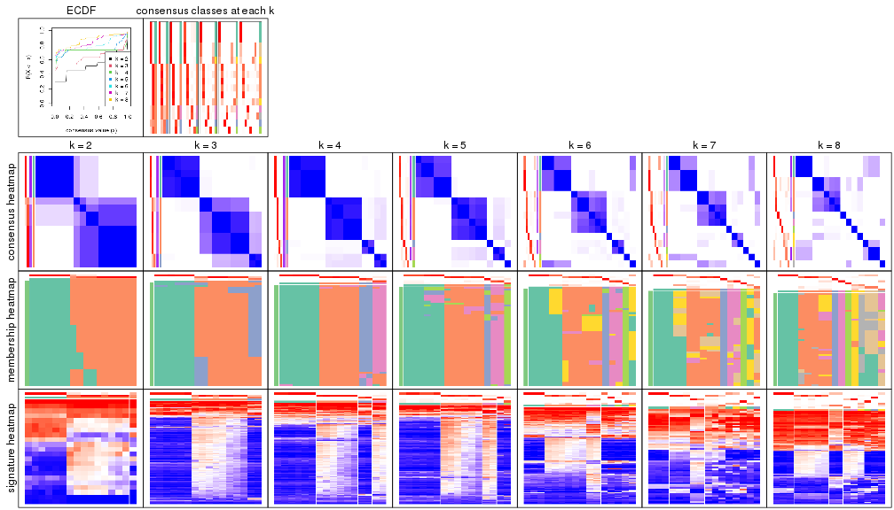

The plots are:

- The first row: a plot of the eCDF (empirical cumulative distribution
  function) curves of the consensus matrix for each `k` and the heatmap of
  predicted classes for each `k`.
- The second row: heatmaps of the consensus matrix for each `k`.
- The third row: heatmaps of the membership matrix for each `k`.
- The fouth row: heatmaps of the signatures for each `k`.

All the plots in panels can be made by individual functions and they are
plotted later in this section.

`select_partition_number()` produces several plots showing different
statistics for choosing "optimized" `k`. There are following statistics:

- eCDF curves of the consensus matrix for each `k`;
- 1-PAC. [The PAC score](https://en.wikipedia.org/wiki/Consensus_clustering#Over-interpretation_potential_of_consensus_clustering)
  measures the proportion of the ambiguous subgrouping.
- Mean silhouette score.
- Concordance. The mean probability of fiting the consensus subgroup labels in all
  partitions.
- Area increased. Denote $A_k$ as the area under the eCDF curve for current
  `k`, the area increased is defined as $A_k - A_{k-1}$.
- Rand index. The percent of pairs of samples that are both in a same cluster
  or both are not in a same cluster in the partition of k and k-1.
- Jaccard index. The ratio of pairs of samples are both in a same cluster in
  the partition of k and k-1 and the pairs of samples are both in a same
  cluster in the partition k or k-1.

The detailed explanations of these statistics can be found in [the _cola_
vignette](https://jokergoo.github.io/cola_vignettes/cola.html#toc_13).

Generally speaking, higher 1-PAC score, higher mean silhouette score or higher
concordance corresponds to better partition. Rand index and Jaccard index
measure how similar the current partition is compared to partition with `k-1`.
If they are too similar, we won't accept `k` is better than `k-1`.

```r
select_partition_number(res)
```

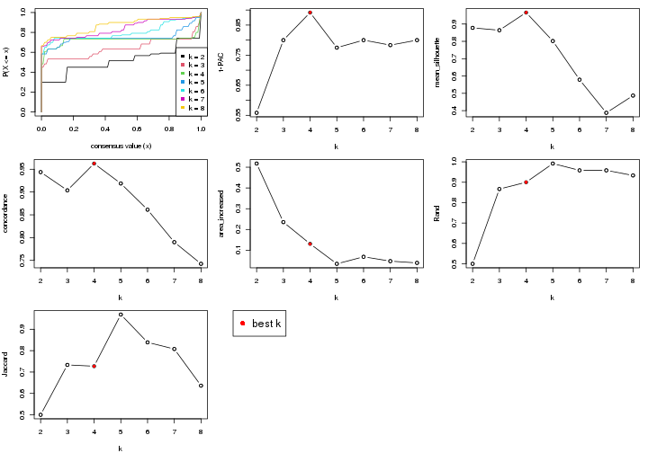

The numeric values for all these statistics can be obtained by `get_stats()`.

```r
get_stats(res)
```

```
#>   k 1-PAC mean_silhouette concordance area_increased  Rand Jaccard
#> 2 2 0.558           0.878       0.944         0.5176 0.500   0.500
#> 3 3 0.800           0.864       0.904         0.2353 0.867   0.733
#> 4 4 0.892           0.966       0.963         0.1307 0.900   0.727
#> 5 5 0.775           0.802       0.919         0.0344 0.992   0.969
#> 6 6 0.800           0.579       0.861         0.0682 0.958   0.839
#> 7 7 0.783           0.387       0.790         0.0473 0.958   0.808
#> 8 8 0.800           0.487       0.743         0.0389 0.933   0.636
```

`suggest_best_k()` suggests the best $k$ based on these statistics. The rules are as follows:

- All $k$ with Jaccard index larger than 0.95 are removed because increasing
  $k$ does not provide enough extra information. If all $k$ are removed, it is
  marked as no subgroup is detected.
- For all $k$ with 1-PAC score larger than 0.9, the maximal $k$ is taken as
  the best $k$, and other $k$ are marked as optional $k$.
- If it does not fit the second rule. The $k$ with the maximal vote of the
  highest 1-PAC score, highest mean silhouette, and highest concordance is
  taken as the best $k$.

```r
suggest_best_k(res)
```

```
#> [1] 4
```


Following is the table of the partitions (You need to click the **show/hide
code output** link to see it). The membership matrix (columns with name `p*`)
is inferred by
[`clue::cl_consensus()`](https://www.rdocumentation.org/link/cl_consensus?package=clue)
function with the `SE` method. Basically the value in the membership matrix
represents the probability to belong to a certain group. The finall subgroup
label for an item is determined with the group with highest probability it
belongs to.

In `get_classes()` function, the entropy is calculated from the membership
matrix and the silhouette score is calculated from the consensus matrix.


<script>
$( function() {
	$( '#tabs-node-043-get-classes' ).tabs();
} );
</script>
<div id='tabs-node-043-get-classes'>
<ul>
<li><a href='#tab-node-043-get-classes-1'>k = 2</a></li>
<li><a href='#tab-node-043-get-classes-2'>k = 3</a></li>
<li><a href='#tab-node-043-get-classes-3'>k = 4</a></li>
<li><a href='#tab-node-043-get-classes-4'>k = 5</a></li>
<li><a href='#tab-node-043-get-classes-5'>k = 6</a></li>
<li><a href='#tab-node-043-get-classes-6'>k = 7</a></li>
<li><a href='#tab-node-043-get-classes-7'>k = 8</a></li>
</ul>

<div id='tab-node-043-get-classes-1'>
<p><a id='tab-node-043-get-classes-1-a' style='color:#0366d6' href='#'>show/hide code output</a></p>
<pre><code class="r">cbind(get_classes(res, k = 2), get_membership(res, k = 2))
</code></pre>

<pre><code>#&gt;                 class entropy silhouette   p1   p2
#&gt; TCGA.NH.A8F7.01     2   0.000      0.892 0.00 1.00
#&gt; TCGA.AD.6963.01     1   0.000      1.000 1.00 0.00
#&gt; TCGA.AZ.4308.01     2   0.000      0.892 0.00 1.00
#&gt; TCGA.G4.6307.01     2   0.634      0.797 0.16 0.84
#&gt; TCGA.G4.6309.01     2   0.634      0.797 0.16 0.84
#&gt; TCGA.AZ.5403.01     1   0.000      1.000 1.00 0.00
#&gt; TCGA.A6.2675.01     1   0.000      1.000 1.00 0.00
#&gt; TCGA.CA.6715.01     2   0.981      0.318 0.42 0.58
#&gt; TCGA.A6.6648.01     1   0.000      1.000 1.00 0.00
#&gt; TCGA.CM.6164.01     2   0.000      0.892 0.00 1.00
#&gt; TCGA.AZ.4682.01     2   0.634      0.782 0.16 0.84
#&gt; TCGA.CM.5344.01     2   0.000      0.892 0.00 1.00
#&gt; TCGA.CM.5868.01     2   0.000      0.892 0.00 1.00
#&gt; TCGA.F4.6704.01     1   0.000      1.000 1.00 0.00
#&gt; TCGA.AA.3494.01     1   0.000      1.000 1.00 0.00
#&gt; TCGA.CM.6170.01     2   0.000      0.892 0.00 1.00
</code></pre>

<script>
$('#tab-node-043-get-classes-1-a').parent().next().next().hide();
$('#tab-node-043-get-classes-1-a').click(function(){
  $('#tab-node-043-get-classes-1-a').parent().next().next().toggle();
  return(false);
});
</script>
</div>

<div id='tab-node-043-get-classes-2'>
<p><a id='tab-node-043-get-classes-2-a' style='color:#0366d6' href='#'>show/hide code output</a></p>
<pre><code class="r">cbind(get_classes(res, k = 3), get_membership(res, k = 3))
</code></pre>

<pre><code>#&gt;                 class entropy silhouette   p1   p2   p3
#&gt; TCGA.NH.A8F7.01     2  0.0000      0.821 0.00 1.00 0.00
#&gt; TCGA.AD.6963.01     1  0.0892      0.981 0.98 0.00 0.02
#&gt; TCGA.AZ.4308.01     2  0.2066      0.801 0.00 0.94 0.06
#&gt; TCGA.G4.6307.01     2  0.6387      0.578 0.02 0.68 0.30
#&gt; TCGA.G4.6309.01     2  0.6387      0.578 0.02 0.68 0.30
#&gt; TCGA.AZ.5403.01     1  0.0892      0.981 0.98 0.00 0.02
#&gt; TCGA.A6.2675.01     1  0.0892      0.981 0.98 0.00 0.02
#&gt; TCGA.CA.6715.01     3  0.5560      0.969 0.00 0.30 0.70
#&gt; TCGA.A6.6648.01     1  0.0892      0.973 0.98 0.00 0.02
#&gt; TCGA.CM.6164.01     2  0.0000      0.821 0.00 1.00 0.00
#&gt; TCGA.AZ.4682.01     3  0.5706      0.969 0.00 0.32 0.68
#&gt; TCGA.CM.5344.01     2  0.2066      0.801 0.00 0.94 0.06
#&gt; TCGA.CM.5868.01     2  0.0000      0.821 0.00 1.00 0.00
#&gt; TCGA.F4.6704.01     1  0.0892      0.973 0.98 0.00 0.02
#&gt; TCGA.AA.3494.01     1  0.0000      0.980 1.00 0.00 0.00
#&gt; TCGA.CM.6170.01     2  0.2066      0.801 0.00 0.94 0.06
</code></pre>

<script>
$('#tab-node-043-get-classes-2-a').parent().next().next().hide();
$('#tab-node-043-get-classes-2-a').click(function(){
  $('#tab-node-043-get-classes-2-a').parent().next().next().toggle();
  return(false);
});
</script>
</div>

<div id='tab-node-043-get-classes-3'>
<p><a id='tab-node-043-get-classes-3-a' style='color:#0366d6' href='#'>show/hide code output</a></p>
<pre><code class="r">cbind(get_classes(res, k = 4), get_membership(res, k = 4))
</code></pre>

<pre><code>#&gt;                 class entropy silhouette   p1   p2   p3   p4
#&gt; TCGA.NH.A8F7.01     2  0.0707      0.978 0.00 0.98 0.00 0.02
#&gt; TCGA.AD.6963.01     1  0.0000      0.992 1.00 0.00 0.00 0.00
#&gt; TCGA.AZ.4308.01     2  0.0707      0.970 0.00 0.98 0.00 0.02
#&gt; TCGA.G4.6307.01     4  0.3335      0.943 0.02 0.12 0.00 0.86
#&gt; TCGA.G4.6309.01     4  0.3335      0.943 0.00 0.12 0.02 0.86
#&gt; TCGA.AZ.5403.01     1  0.0000      0.992 1.00 0.00 0.00 0.00
#&gt; TCGA.A6.2675.01     1  0.0000      0.992 1.00 0.00 0.00 0.00
#&gt; TCGA.CA.6715.01     3  0.3335      0.894 0.00 0.02 0.86 0.12
#&gt; TCGA.A6.6648.01     1  0.0707      0.983 0.98 0.00 0.00 0.02
#&gt; TCGA.CM.6164.01     2  0.0707      0.978 0.00 0.98 0.00 0.02
#&gt; TCGA.AZ.4682.01     3  0.1211      0.894 0.00 0.04 0.96 0.00
#&gt; TCGA.CM.5344.01     2  0.0707      0.970 0.00 0.98 0.00 0.02
#&gt; TCGA.CM.5868.01     2  0.0707      0.978 0.00 0.98 0.00 0.02
#&gt; TCGA.F4.6704.01     1  0.0707      0.983 0.98 0.00 0.00 0.02
#&gt; TCGA.AA.3494.01     1  0.0000      0.992 1.00 0.00 0.00 0.00
#&gt; TCGA.CM.6170.01     2  0.0000      0.976 0.00 1.00 0.00 0.00
</code></pre>

<script>
$('#tab-node-043-get-classes-3-a').parent().next().next().hide();
$('#tab-node-043-get-classes-3-a').click(function(){
  $('#tab-node-043-get-classes-3-a').parent().next().next().toggle();
  return(false);
});
</script>
</div>

<div id='tab-node-043-get-classes-4'>
<p><a id='tab-node-043-get-classes-4-a' style='color:#0366d6' href='#'>show/hide code output</a></p>
<pre><code class="r">cbind(get_classes(res, k = 5), get_membership(res, k = 5))
</code></pre>

<pre><code>#&gt;                 class entropy silhouette   p1   p2   p3   p4   p5
#&gt; TCGA.NH.A8F7.01     2  0.2020      0.909 0.00 0.90 0.00 0.10 0.00
#&gt; TCGA.AD.6963.01     1  0.3110      0.907 0.86 0.00 0.00 0.06 0.08
#&gt; TCGA.AZ.4308.01     2  0.1648      0.903 0.00 0.94 0.00 0.02 0.04
#&gt; TCGA.G4.6307.01     4  0.2280      0.951 0.00 0.12 0.00 0.88 0.00
#&gt; TCGA.G4.6309.01     4  0.3641      0.951 0.00 0.12 0.00 0.82 0.06
#&gt; TCGA.AZ.5403.01     1  0.3110      0.907 0.86 0.00 0.00 0.06 0.08
#&gt; TCGA.A6.2675.01     1  0.3110      0.907 0.86 0.00 0.00 0.06 0.08
#&gt; TCGA.CA.6715.01     3  0.0000      0.000 0.00 0.00 1.00 0.00 0.00
#&gt; TCGA.A6.6648.01     1  0.0609      0.898 0.98 0.00 0.00 0.02 0.00
#&gt; TCGA.CM.6164.01     2  0.1410      0.927 0.00 0.94 0.00 0.06 0.00
#&gt; TCGA.AZ.4682.01     5  0.3319      0.000 0.00 0.02 0.16 0.00 0.82
#&gt; TCGA.CM.5344.01     2  0.0609      0.930 0.00 0.98 0.00 0.00 0.02
#&gt; TCGA.CM.5868.01     2  0.1410      0.927 0.00 0.94 0.00 0.06 0.00
#&gt; TCGA.F4.6704.01     1  0.0609      0.898 0.98 0.00 0.00 0.02 0.00
#&gt; TCGA.AA.3494.01     1  0.1043      0.885 0.96 0.00 0.00 0.00 0.04
#&gt; TCGA.CM.6170.01     2  0.0609      0.930 0.00 0.98 0.00 0.00 0.02
</code></pre>

<script>
$('#tab-node-043-get-classes-4-a').parent().next().next().hide();
$('#tab-node-043-get-classes-4-a').click(function(){
  $('#tab-node-043-get-classes-4-a').parent().next().next().toggle();
  return(false);
});
</script>
</div>

<div id='tab-node-043-get-classes-5'>
<p><a id='tab-node-043-get-classes-5-a' style='color:#0366d6' href='#'>show/hide code output</a></p>
<pre><code class="r">cbind(get_classes(res, k = 6), get_membership(res, k = 6))
</code></pre>

<pre><code>#&gt;                 class entropy silhouette   p1   p2   p3   p4   p5   p6
#&gt; TCGA.NH.A8F7.01     2  0.4534      0.632 0.00 0.58 0.00 0.04 0.00 0.38
#&gt; TCGA.AD.6963.01     1  0.0000      0.722 1.00 0.00 0.00 0.00 0.00 0.00
#&gt; TCGA.AZ.4308.01     2  0.3007      0.748 0.08 0.86 0.00 0.04 0.02 0.00
#&gt; TCGA.G4.6307.01     4  0.2512      0.852 0.00 0.06 0.00 0.88 0.00 0.06
#&gt; TCGA.G4.6309.01     4  0.1807      0.852 0.00 0.02 0.00 0.92 0.06 0.00
#&gt; TCGA.AZ.5403.01     1  0.0000      0.722 1.00 0.00 0.00 0.00 0.00 0.00
#&gt; TCGA.A6.2675.01     1  0.0000      0.722 1.00 0.00 0.00 0.00 0.00 0.00
#&gt; TCGA.CA.6715.01     3  0.0000      0.000 0.00 0.00 1.00 0.00 0.00 0.00
#&gt; TCGA.A6.6648.01     1  0.3198      0.402 0.74 0.00 0.00 0.00 0.00 0.26
#&gt; TCGA.CM.6164.01     2  0.2981      0.802 0.00 0.82 0.00 0.02 0.00 0.16
#&gt; TCGA.AZ.4682.01     5  0.1267      0.000 0.00 0.00 0.06 0.00 0.94 0.00
#&gt; TCGA.CM.5344.01     2  0.1480      0.797 0.00 0.94 0.00 0.04 0.02 0.00
#&gt; TCGA.CM.5868.01     2  0.2981      0.802 0.00 0.82 0.00 0.02 0.00 0.16
#&gt; TCGA.F4.6704.01     1  0.3198      0.402 0.74 0.00 0.00 0.00 0.00 0.26
#&gt; TCGA.AA.3494.01     6  0.3828      0.000 0.44 0.00 0.00 0.00 0.00 0.56
#&gt; TCGA.CM.6170.01     2  0.0547      0.805 0.00 0.98 0.00 0.00 0.02 0.00
</code></pre>

<script>
$('#tab-node-043-get-classes-5-a').parent().next().next().hide();
$('#tab-node-043-get-classes-5-a').click(function(){
  $('#tab-node-043-get-classes-5-a').parent().next().next().toggle();
  return(false);
});
</script>
</div>

<div id='tab-node-043-get-classes-6'>
<p><a id='tab-node-043-get-classes-6-a' style='color:#0366d6' href='#'>show/hide code output</a></p>
<pre><code class="r">cbind(get_classes(res, k = 7), get_membership(res, k = 7))
</code></pre>

<pre><code>#&gt;                 class entropy silhouette   p1   p2 p3   p4 p5   p6   p7
#&gt; TCGA.NH.A8F7.01     7  0.3047      0.000 0.00 0.28  0 0.00  0 0.00 0.72
#&gt; TCGA.AD.6963.01     1  0.0000      0.581 1.00 0.00  0 0.00  0 0.00 0.00
#&gt; TCGA.AZ.4308.01     2  0.1664      0.622 0.06 0.92  0 0.02  0 0.00 0.00
#&gt; TCGA.G4.6307.01     4  0.4742      0.625 0.00 0.00  0 0.62  0 0.22 0.16
#&gt; TCGA.G4.6309.01     4  0.0504      0.623 0.00 0.02  0 0.98  0 0.00 0.00
#&gt; TCGA.AZ.5403.01     1  0.0000      0.581 1.00 0.00  0 0.00  0 0.00 0.00
#&gt; TCGA.A6.2675.01     1  0.0000      0.581 1.00 0.00  0 0.00  0 0.00 0.00
#&gt; TCGA.CA.6715.01     3  0.0000      0.000 0.00 0.00  1 0.00  0 0.00 0.00
#&gt; TCGA.A6.6648.01     1  0.3558      0.199 0.52 0.00  0 0.00  0 0.48 0.00
#&gt; TCGA.CM.6164.01     2  0.4856      0.425 0.00 0.66  0 0.06  0 0.06 0.22
#&gt; TCGA.AZ.4682.01     5  0.0000      0.000 0.00 0.00  0 0.00  1 0.00 0.00
#&gt; TCGA.CM.5344.01     2  0.0504      0.668 0.00 0.98  0 0.02  0 0.00 0.00
#&gt; TCGA.CM.5868.01     2  0.4856      0.425 0.00 0.66  0 0.06  0 0.06 0.22
#&gt; TCGA.F4.6704.01     1  0.3558      0.199 0.52 0.00  0 0.00  0 0.48 0.00
#&gt; TCGA.AA.3494.01     6  0.4945      0.000 0.36 0.00  0 0.00  0 0.52 0.12
#&gt; TCGA.CM.6170.01     2  0.0504      0.669 0.00 0.98  0 0.00  0 0.02 0.00
</code></pre>

<script>
$('#tab-node-043-get-classes-6-a').parent().next().next().hide();
$('#tab-node-043-get-classes-6-a').click(function(){
  $('#tab-node-043-get-classes-6-a').parent().next().next().toggle();
  return(false);
});
</script>
</div>

<div id='tab-node-043-get-classes-7'>
<p><a id='tab-node-043-get-classes-7-a' style='color:#0366d6' href='#'>show/hide code output</a></p>
<pre><code class="r">cbind(get_classes(res, k = 8), get_membership(res, k = 8))
</code></pre>

<pre><code>#&gt;                 class entropy silhouette   p1   p2 p3   p4   p5   p6   p7   p8
#&gt; TCGA.NH.A8F7.01     6  0.6480    -0.0955 0.00 0.06  0 0.02 0.02 0.42 0.16 0.32
#&gt; TCGA.AD.6963.01     1  0.0000     1.0000 1.00 0.00  0 0.00 0.00 0.00 0.00 0.00
#&gt; TCGA.AZ.4308.01     2  0.3337     0.5814 0.04 0.78  0 0.00 0.00 0.00 0.16 0.02
#&gt; TCGA.G4.6307.01     4  0.0000     0.0000 0.00 0.00  0 1.00 0.00 0.00 0.00 0.00
#&gt; TCGA.G4.6309.01     8  0.3142     0.0000 0.00 0.00  0 0.36 0.00 0.00 0.00 0.64
#&gt; TCGA.AZ.5403.01     1  0.0000     1.0000 1.00 0.00  0 0.00 0.00 0.00 0.00 0.00
#&gt; TCGA.A6.2675.01     1  0.0000     1.0000 1.00 0.00  0 0.00 0.00 0.00 0.00 0.00
#&gt; TCGA.CA.6715.01     3  0.0000     0.0000 0.00 0.00  1 0.00 0.00 0.00 0.00 0.00
#&gt; TCGA.A6.6648.01     7  0.3083     1.0000 0.34 0.00  0 0.00 0.00 0.00 0.66 0.00
#&gt; TCGA.CM.6164.01     2  0.5374     0.5927 0.00 0.62  0 0.16 0.02 0.02 0.02 0.16
#&gt; TCGA.AZ.4682.01     5  0.0471     0.0000 0.00 0.02  0 0.00 0.98 0.00 0.00 0.00
#&gt; TCGA.CM.5344.01     2  0.0471     0.7002 0.00 0.98  0 0.00 0.00 0.00 0.02 0.00
#&gt; TCGA.CM.5868.01     2  0.5374     0.5927 0.00 0.62  0 0.16 0.02 0.02 0.02 0.16
#&gt; TCGA.F4.6704.01     7  0.3083     1.0000 0.34 0.00  0 0.00 0.00 0.00 0.66 0.00
#&gt; TCGA.AA.3494.01     6  0.4669    -0.2749 0.22 0.00  0 0.00 0.00 0.58 0.20 0.00
#&gt; TCGA.CM.6170.01     2  0.0941     0.6933 0.00 0.96  0 0.00 0.00 0.00 0.02 0.02
</code></pre>

<script>
$('#tab-node-043-get-classes-7-a').parent().next().next().hide();
$('#tab-node-043-get-classes-7-a').click(function(){
  $('#tab-node-043-get-classes-7-a').parent().next().next().toggle();
  return(false);
});
</script>
</div>
</div>

Heatmaps for the consensus matrix. It visualizes the probability of two
samples to be in a same group.


<script>
$( function() {
	$( '#tabs-node-043-consensus-heatmap' ).tabs();
} );
</script>
<div id='tabs-node-043-consensus-heatmap'>
<ul>
<li><a href='#tab-node-043-consensus-heatmap-1'>k = 2</a></li>
<li><a href='#tab-node-043-consensus-heatmap-2'>k = 3</a></li>
<li><a href='#tab-node-043-consensus-heatmap-3'>k = 4</a></li>
<li><a href='#tab-node-043-consensus-heatmap-4'>k = 5</a></li>
<li><a href='#tab-node-043-consensus-heatmap-5'>k = 6</a></li>
<li><a href='#tab-node-043-consensus-heatmap-6'>k = 7</a></li>
<li><a href='#tab-node-043-consensus-heatmap-7'>k = 8</a></li>
</ul>
<div id='tab-node-043-consensus-heatmap-1'>
<pre><code class="r">consensus_heatmap(res, k = 2)
</code></pre>

<p>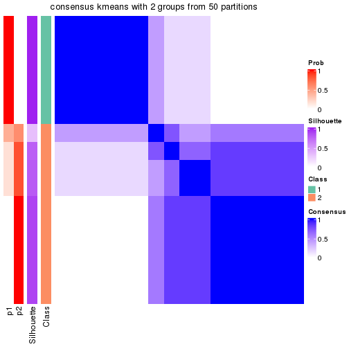</p>

</div>
<div id='tab-node-043-consensus-heatmap-2'>
<pre><code class="r">consensus_heatmap(res, k = 3)
</code></pre>

<p>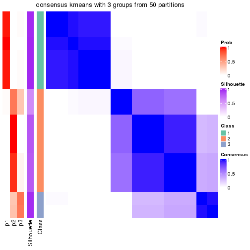</p>

</div>
<div id='tab-node-043-consensus-heatmap-3'>
<pre><code class="r">consensus_heatmap(res, k = 4)
</code></pre>

<p>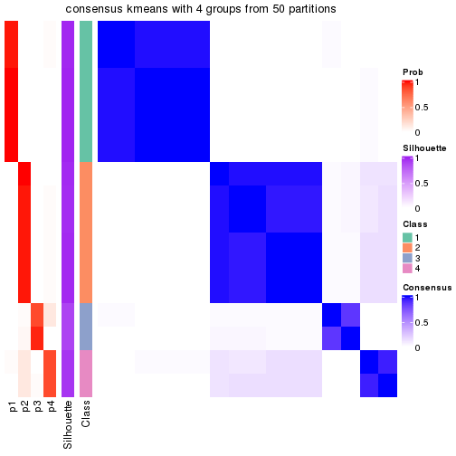</p>

</div>
<div id='tab-node-043-consensus-heatmap-4'>
<pre><code class="r">consensus_heatmap(res, k = 5)
</code></pre>

<p>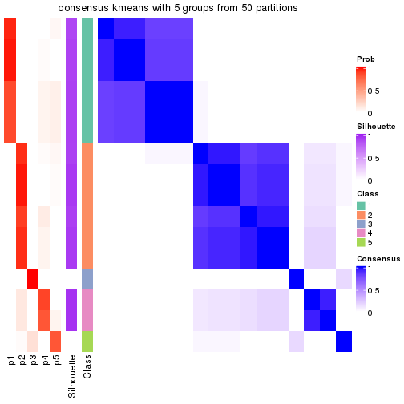</p>

</div>
<div id='tab-node-043-consensus-heatmap-5'>
<pre><code class="r">consensus_heatmap(res, k = 6)
</code></pre>

<p>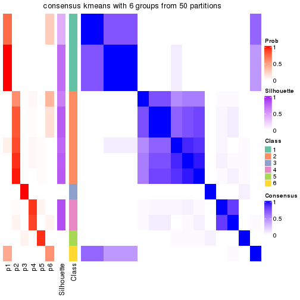</p>

</div>
<div id='tab-node-043-consensus-heatmap-6'>
<pre><code class="r">consensus_heatmap(res, k = 7)
</code></pre>

<p>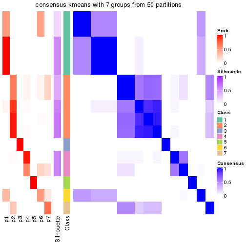</p>

</div>
<div id='tab-node-043-consensus-heatmap-7'>
<pre><code class="r">consensus_heatmap(res, k = 8)
</code></pre>

<p>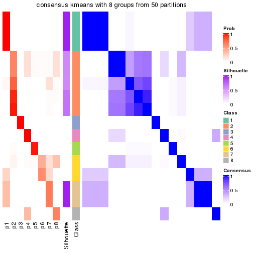</p>

</div>
</div>

Heatmaps for the membership of samples in all partitions to see how consistent they are:


<script>
$( function() {
	$( '#tabs-node-043-membership-heatmap' ).tabs();
} );
</script>
<div id='tabs-node-043-membership-heatmap'>
<ul>
<li><a href='#tab-node-043-membership-heatmap-1'>k = 2</a></li>
<li><a href='#tab-node-043-membership-heatmap-2'>k = 3</a></li>
<li><a href='#tab-node-043-membership-heatmap-3'>k = 4</a></li>
<li><a href='#tab-node-043-membership-heatmap-4'>k = 5</a></li>
<li><a href='#tab-node-043-membership-heatmap-5'>k = 6</a></li>
<li><a href='#tab-node-043-membership-heatmap-6'>k = 7</a></li>
<li><a href='#tab-node-043-membership-heatmap-7'>k = 8</a></li>
</ul>
<div id='tab-node-043-membership-heatmap-1'>
<pre><code class="r">membership_heatmap(res, k = 2)
</code></pre>

<p>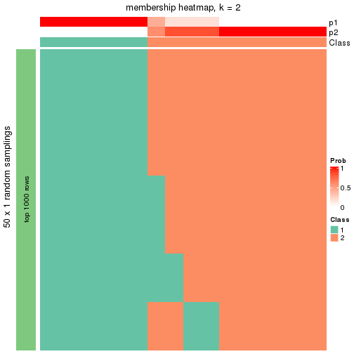</p>

</div>
<div id='tab-node-043-membership-heatmap-2'>
<pre><code class="r">membership_heatmap(res, k = 3)
</code></pre>

<p>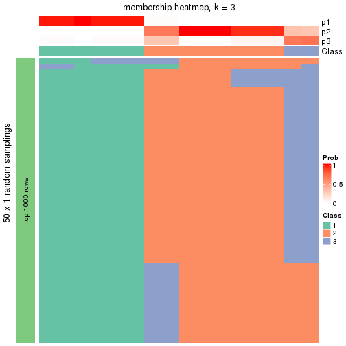</p>

</div>
<div id='tab-node-043-membership-heatmap-3'>
<pre><code class="r">membership_heatmap(res, k = 4)
</code></pre>

<p>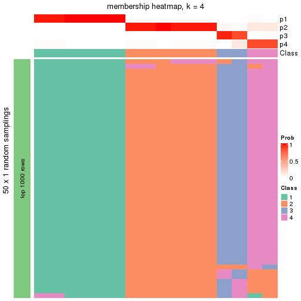</p>

</div>
<div id='tab-node-043-membership-heatmap-4'>
<pre><code class="r">membership_heatmap(res, k = 5)
</code></pre>

<p>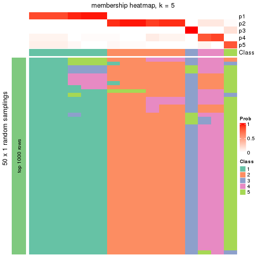</p>

</div>
<div id='tab-node-043-membership-heatmap-5'>
<pre><code class="r">membership_heatmap(res, k = 6)
</code></pre>

<p>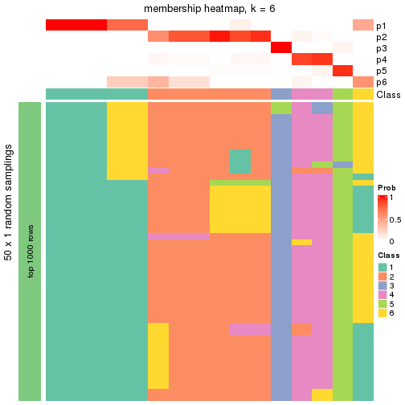</p>

</div>
<div id='tab-node-043-membership-heatmap-6'>
<pre><code class="r">membership_heatmap(res, k = 7)
</code></pre>

<p>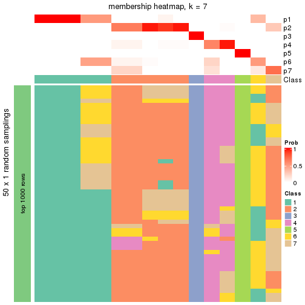</p>

</div>
<div id='tab-node-043-membership-heatmap-7'>
<pre><code class="r">membership_heatmap(res, k = 8)
</code></pre>

<p>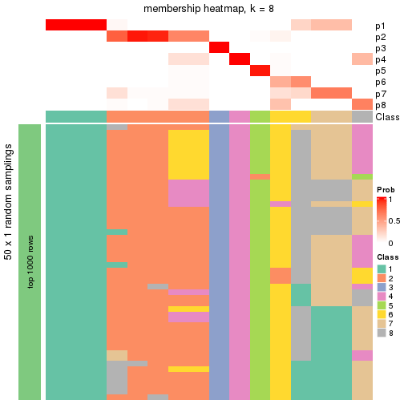</p>

</div>
</div>

As soon as the classes for columns are determined, the signatures
that are significantly different between subgroups can be looked for. 
Following are the heatmaps for signatures.


<script>
$( function() {
	$( '#tabs-node-043-get-signatures' ).tabs();
} );
</script>
<div id='tabs-node-043-get-signatures'>
<ul>
<li><a href='#tab-node-043-get-signatures-1'>k = 2</a></li>
<li><a href='#tab-node-043-get-signatures-2'>k = 3</a></li>
<li><a href='#tab-node-043-get-signatures-3'>k = 4</a></li>
<li><a href='#tab-node-043-get-signatures-4'>k = 5</a></li>
<li><a href='#tab-node-043-get-signatures-5'>k = 6</a></li>
<li><a href='#tab-node-043-get-signatures-6'>k = 7</a></li>
<li><a href='#tab-node-043-get-signatures-7'>k = 8</a></li>
</ul>
<div id='tab-node-043-get-signatures-1'>
<pre><code class="r">get_signatures(res, k = 2)
</code></pre>

<p>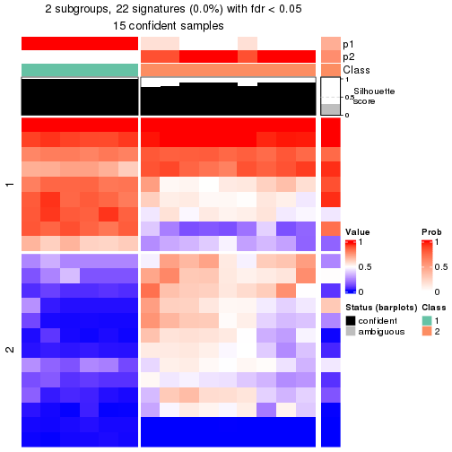</p>

</div>
<div id='tab-node-043-get-signatures-2'>
<pre><code class="r">get_signatures(res, k = 3)
</code></pre>

<p>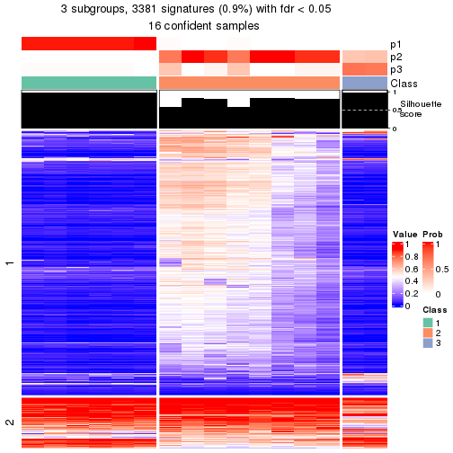</p>

</div>
<div id='tab-node-043-get-signatures-3'>
<pre><code class="r">get_signatures(res, k = 4)
</code></pre>

<p>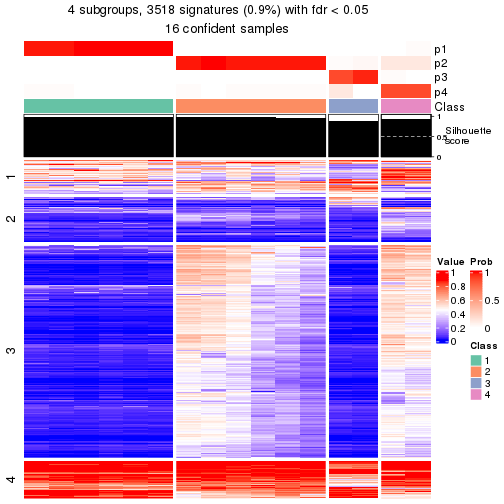</p>

</div>
<div id='tab-node-043-get-signatures-4'>
<pre><code class="r">get_signatures(res, k = 5)
</code></pre>

<p>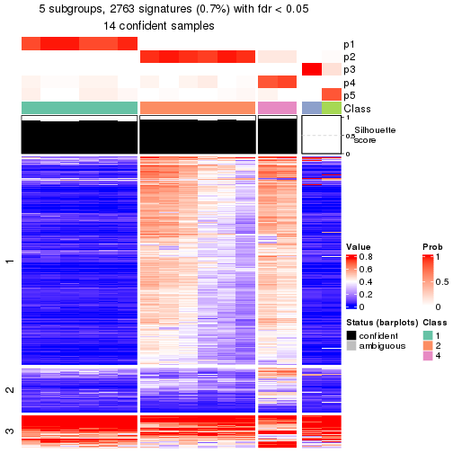</p>

</div>
<div id='tab-node-043-get-signatures-5'>
<pre><code class="r">get_signatures(res, k = 6)
</code></pre>

<p>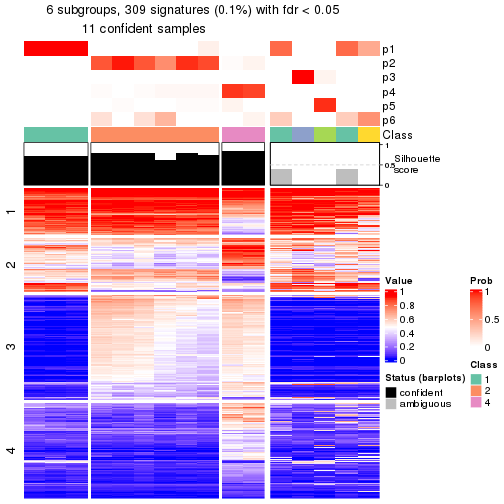</p>

</div>
<div id='tab-node-043-get-signatures-6'>
<pre><code class="r">get_signatures(res, k = 7)
</code></pre>

<p></p>

</div>
<div id='tab-node-043-get-signatures-7'>
<pre><code class="r">get_signatures(res, k = 8)
</code></pre>

<p>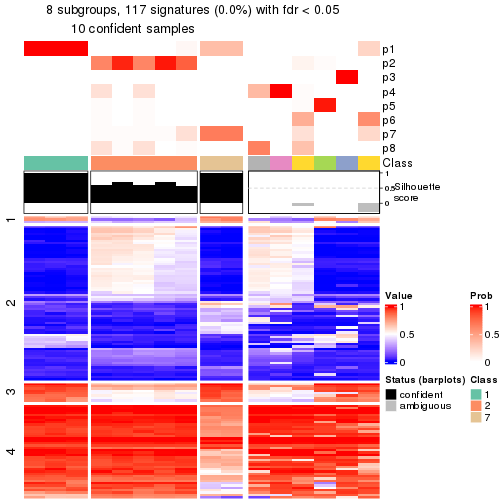</p>

</div>
</div>


Compare the overlap of signatures from different k:

```r
compare_signatures(res)
```

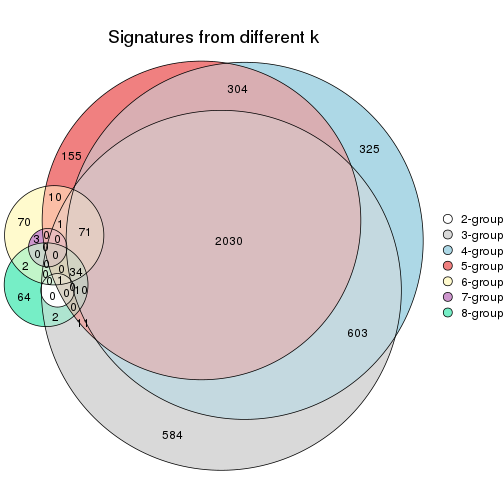

`get_signature()` returns a data frame invisibly. To get the list of signatures, the function
call should be assigned to a variable explicitly. In following code, if `plot` argument is set
to `FALSE`, no heatmap is plotted while only the differential analysis is performed.

```r
# code only for demonstration
tb = get_signature(res, k = ..., plot = FALSE)
```

An example of the output of `tb` is:

```
#>   which_row         fdr    mean_1    mean_2 scaled_mean_1 scaled_mean_2 km
#> 1        38 0.042760348  8.373488  9.131774    -0.5533452     0.5164555  1
#> 2        40 0.018707592  7.106213  8.469186    -0.6173731     0.5762149  1
#> 3        55 0.019134737 10.221463 11.207825    -0.6159697     0.5749050  1
#> 4        59 0.006059896  5.921854  7.869574    -0.6899429     0.6439467  1
#> 5        60 0.018055526  8.928898 10.211722    -0.6204761     0.5791110  1
#> 6        98 0.009384629 15.714769 14.887706     0.6635654    -0.6193277  2
...
```

The columns in `tb` are:

1. `which_row`: row indices corresponding to the input matrix.
2. `fdr`: FDR for the differential test. 
3. `mean_x`: The mean value in group x.
4. `scaled_mean_x`: The mean value in group x after rows are scaled.
5. `km`: Row groups if k-means clustering is applied to rows (which is done by automatically selecting number of clusters).

If there are too many signatures, `top_signatures = ...` can be set to only show the 
signatures with the highest FDRs:

```r
# code only for demonstration
# e.g. to show the top 500 most significant rows
tb = get_signature(res, k = ..., top_signatures = 500)
```

If the signatures are defined as these which are uniquely high in current group, `diff_method` argument
can be set to `"uniquely_high_in_one_group"`:

```r
# code only for demonstration
tb = get_signature(res, k = ..., diff_method = "uniquely_high_in_one_group")
```


UMAP plot which shows how samples are separated.


<script>
$( function() {
	$( '#tabs-node-043-dimension-reduction' ).tabs();
} );
</script>
<div id='tabs-node-043-dimension-reduction'>
<ul>
<li><a href='#tab-node-043-dimension-reduction-1'>k = 2</a></li>
<li><a href='#tab-node-043-dimension-reduction-2'>k = 3</a></li>
<li><a href='#tab-node-043-dimension-reduction-3'>k = 4</a></li>
<li><a href='#tab-node-043-dimension-reduction-4'>k = 5</a></li>
<li><a href='#tab-node-043-dimension-reduction-5'>k = 6</a></li>
<li><a href='#tab-node-043-dimension-reduction-6'>k = 7</a></li>
<li><a href='#tab-node-043-dimension-reduction-7'>k = 8</a></li>
</ul>
<div id='tab-node-043-dimension-reduction-1'>
<pre><code class="r">dimension_reduction(res, k = 2, method = &quot;UMAP&quot;)
</code></pre>

<p>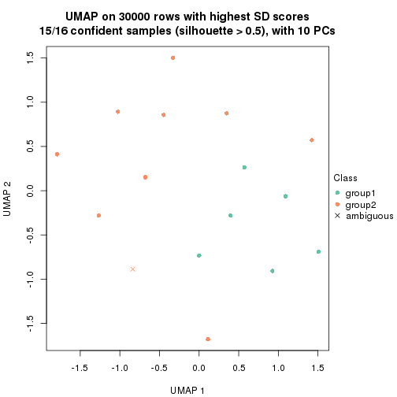</p>

</div>
<div id='tab-node-043-dimension-reduction-2'>
<pre><code class="r">dimension_reduction(res, k = 3, method = &quot;UMAP&quot;)
</code></pre>

<p>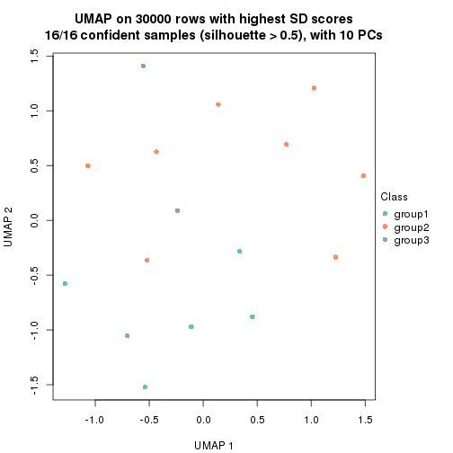</p>

</div>
<div id='tab-node-043-dimension-reduction-3'>
<pre><code class="r">dimension_reduction(res, k = 4, method = &quot;UMAP&quot;)
</code></pre>

<p>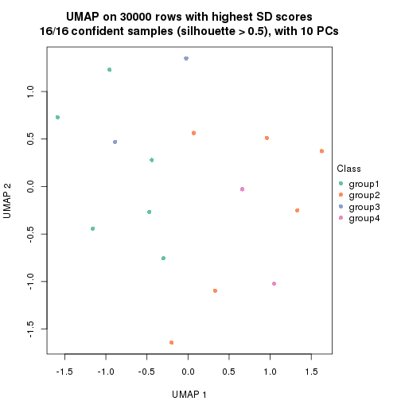</p>

</div>
<div id='tab-node-043-dimension-reduction-4'>
<pre><code class="r">dimension_reduction(res, k = 5, method = &quot;UMAP&quot;)
</code></pre>

<p>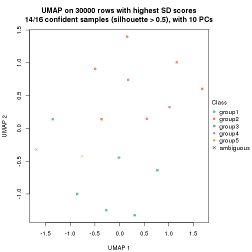</p>

</div>
<div id='tab-node-043-dimension-reduction-5'>
<pre><code class="r">dimension_reduction(res, k = 6, method = &quot;UMAP&quot;)
</code></pre>

<p>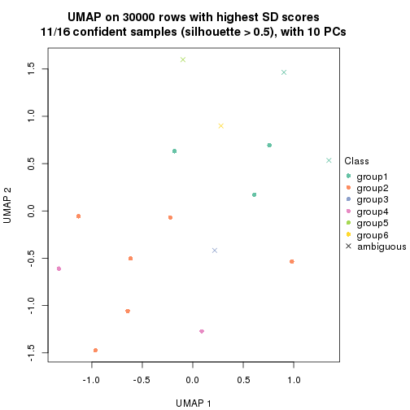</p>

</div>
<div id='tab-node-043-dimension-reduction-6'>
<pre><code class="r">dimension_reduction(res, k = 7, method = &quot;UMAP&quot;)
</code></pre>

<p>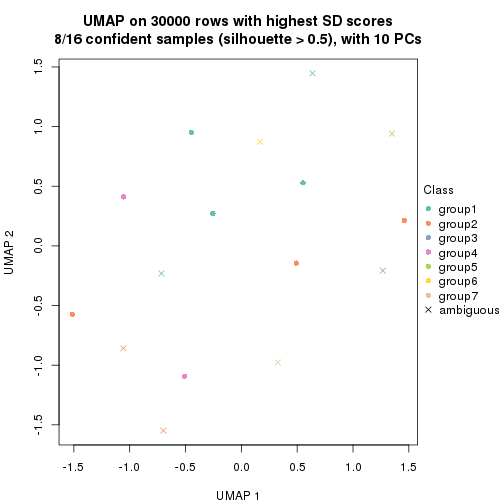</p>

</div>
<div id='tab-node-043-dimension-reduction-7'>
<pre><code class="r">dimension_reduction(res, k = 8, method = &quot;UMAP&quot;)
</code></pre>

<p>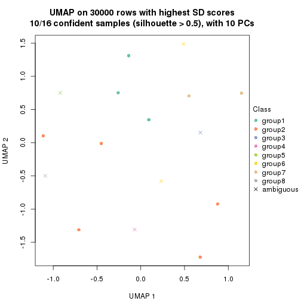</p>

</div>
</div>


Following heatmap shows how subgroups are split when increasing `k`:

```r
collect_classes(res)
```

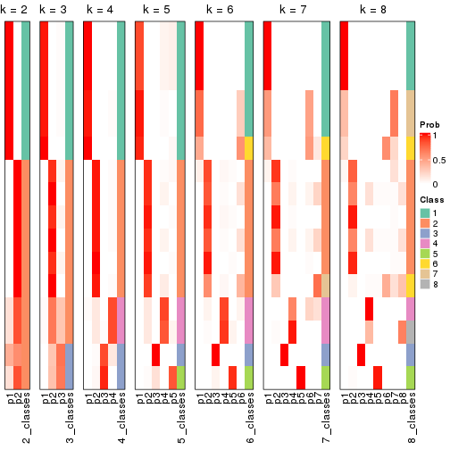


If matrix rows can be associated to genes, consider to use `functional_enrichment(res,
...)` to perform function enrichment for the signature genes. See [this vignette](https://jokergoo.github.io/cola_vignettes/functional_enrichment.html) for more detailed explanations.


 

## Session info


```r
sessionInfo()
```

```
#> R version 4.1.0 (2021-05-18)
#> Platform: x86_64-pc-linux-gnu (64-bit)
#> Running under: CentOS Linux 7 (Core)
#> 
#> Matrix products: default
#> BLAS/LAPACK: /usr/lib64/libopenblas-r0.3.3.so
#> 
#> locale:
#>  [1] LC_CTYPE=en_US.UTF-8       LC_NUMERIC=C               LC_TIME=en_US.UTF-8       
#>  [4] LC_COLLATE=en_US.UTF-8     LC_MONETARY=en_US.UTF-8    LC_MESSAGES=en_US.UTF-8   
#>  [7] LC_PAPER=en_US.UTF-8       LC_NAME=C                  LC_ADDRESS=C              
#> [10] LC_TELEPHONE=C             LC_MEASUREMENT=en_US.UTF-8 LC_IDENTIFICATION=C       
#> 
#> attached base packages:
#> [1] grid      stats     graphics  grDevices utils     datasets  methods   base     
#> 
#> other attached packages:
#> [1] genefilter_1.74.0    ComplexHeatmap_2.8.0 markdown_1.1         knitr_1.33          
#> [5] matrixStats_0.59.0   cola_1.9.4          
#> 
#> loaded via a namespace (and not attached):
#>   [1] bitops_1.0-7           bit64_4.0.5            doParallel_1.0.16      RColorBrewer_1.1-2    
#>   [5] httr_1.4.2             GenomeInfoDb_1.28.1    data.tree_1.0.0        tools_4.1.0           
#>   [9] utf8_1.2.1             R6_2.5.0               irlba_2.3.3            DBI_1.1.1             
#>  [13] BiocGenerics_0.38.0    colorspace_2.0-2       GetoptLong_1.0.5       gridExtra_2.3         
#>  [17] tidyselect_1.1.1       bit_4.0.4              compiler_4.1.0         Biobase_2.52.0        
#>  [21] Cairo_1.5-12.2         xml2_1.3.2             microbenchmark_1.4-7   slam_0.1-48           
#>  [25] scales_1.1.1           askpass_1.1            stringr_1.4.0          digest_0.6.27         
#>  [29] XVector_0.32.0         pkgconfig_2.0.3        umap_0.2.7.0           fastmap_1.1.0         
#>  [33] highr_0.9              rlang_0.4.11           GlobalOptions_0.1.2    rstudioapi_0.13       
#>  [37] RSQLite_2.2.7          impute_1.66.0          generics_0.1.0         shape_1.4.6           
#>  [41] jsonlite_1.7.2         mclust_5.4.7           dplyr_1.0.7            dendextend_1.15.1     
#>  [45] RCurl_1.98-1.3         magrittr_2.0.1         GenomeInfoDbData_1.2.6 Matrix_1.3-4          
#>  [49] fansi_0.5.0            Rcpp_1.0.7             munsell_0.5.0          S4Vectors_0.30.0      
#>  [53] viridis_0.6.1          reticulate_1.20        lifecycle_1.0.0        scatterplot3d_0.3-41  
#>  [57] stringi_1.7.3          zlibbioc_1.38.0        blob_1.2.1             parallel_4.1.0        
#>  [61] crayon_1.4.1           lattice_0.20-44        Biostrings_2.60.1      splines_4.1.0         
#>  [65] annotate_1.70.0        circlize_0.4.13        KEGGREST_1.32.0        polylabelr_0.2.0      
#>  [69] pillar_1.6.1           rjson_0.2.20           codetools_0.2-18       stats4_4.1.0          
#>  [73] XML_3.99-0.6           glue_1.4.2             evaluate_0.14          png_0.1-7             
#>  [77] vctrs_0.3.8            foreach_1.5.1          polyclip_1.10-0        purrr_0.3.4           
#>  [81] gtable_0.3.0           openssl_1.4.4          assertthat_0.2.1       clue_0.3-59           
#>  [85] cachem_1.0.5           ggplot2_3.3.5          xfun_0.24              eulerr_6.1.0          
#>  [89] xtable_1.8-4           skmeans_0.2-13         RSpectra_0.16-0        viridisLite_0.4.0     
#>  [93] survival_3.2-11        tibble_3.1.2           Polychrome_1.3.1       iterators_1.0.13      
#>  [97] AnnotationDbi_1.54.1   memoise_2.0.0          IRanges_2.26.0         cluster_2.1.2         
#> [101] ellipsis_0.3.2         brew_1.0-6
```


